# Python 3.11 的新特性是什么？你是否应该为它费心？

> 原文：<https://web.archive.org/web/20230101102924/https://www.datacamp.com/blog/whats-new-in-python-311-and-should-you-even-bother-with-it>

在过去的四年里，Python 三次获得 TIOBE“年度语言”奖。到 2022 年中期，这种流行的编程语言仍然在 TIOBE 指数上名列前茅。

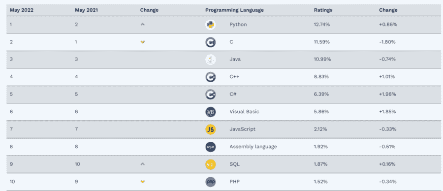

Python 位于 2022 年 6 月 TIOBE 指数的顶端。

Python 的评分为 12.74%，这意味着在所有与编程相关的搜索引擎查询中，约有 13%会出现关键词“Python”。换句话说，网上每 7、8 道编程题就有一道是关于 Python 的。

今天，Python 经常与数据科学和人工智能的最大突破联系在一起。从业者欣赏它的简单性，它的大量内置和第三方库用于多种任务，以及它的社区。

随着 3.11 的最终稳定版本于 2022 年 10 月 3 日发布，Python 社区可以期待各种受欢迎的更新，包括显著的速度提升、更好的错误处理和调试，以及对标准库的大量生活质量改进。

## Python 3.11 有哪些新特性？

Python 3.11 changelog 包含了几乎无穷无尽的错误修复、改进和补充，其中大部分你可能都不会注意到。然而，当稳定版本发布时，一些关键的新特性可能会极大地改进您的 Python 工作流。这些新功能概述如下。

### 1.速度提高

令数据科学家兴奋的第一个重大变化是速度的提高——与 3.10 相比，标准基准测试套件的运行速度快了约 25%。Python 文档声称 3.11 在某些情况下可以快 60%。下面是如何自己执行基准测试，以测试自己的速度改进。

为了比较 Python 3.10 和 3.11 的速度，你需要一个 [Docker 安装](https://web.archive.org/web/20221212135819/https://www.docker.com/)。在确保 Docker desktop 正在运行之后，在终端中运行这两个命令，这将为两个版本的 Python 下载两个映像。

```py
$ docker run -d python:3.10.4-bullseye

$ docker run -d python:3.11-rc-bullseye
```

下载的图像应该可以在你的 Docker 仪表板上看到，你也可以在那里启动它们。

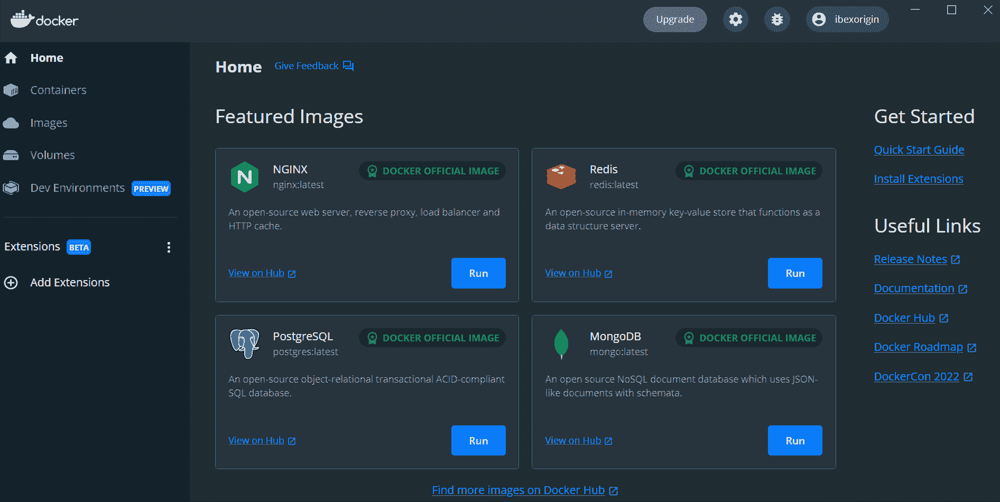

启动容器后，可以运行 docker ps 来查看容器 ID、图像、状态等细节。

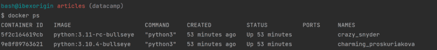

正在运行的容器也可以在您的控制面板中的容器选项卡下看到，在这里您还可以找到“`Run/Stop`”旁边的 CLI 按钮。单击这两个容器的按钮可以启动附加到容器的两个终端选项卡。

在两个选项卡中，通过`pip`安装`pyperformance`包。然后，在每个集装箱码头运行以下命令。

#### 对于 Python 3.10

```py
$ pyperformance run -r -o py310.json
```

#### 对于 Python 3.11

```py
$ pyperformance run -r -o py310.jsone run -r -o py311.json
```

这些命令将对标准库中大约 60 个 Python 函数进行基准测试，并生成 JSON 元数据。我可选地添加了`-r`标签来告诉`pyperformance`我希望测试更加严格，这需要更多的时间。在我的例子中，两个容器都运行在配有 AMD 锐龙 12 核 CPU 的 Windows 机器上。

现在，我们在两个容器中有两个 JSON 文件，我们需要将这两个文件放在一个目录中以继续速度测试。为此，我们将使用`docker cp`命令将 JSON 文件从 Python 3.11 容器复制到 3.10。

在单独的终端选项卡中运行以下命令，更新路径以反映您计算机上的正确路径:

```py
$ docker cp crazy_snyder:/py311.json C:/Users/bex/Desktop

$ docker cp C:/Users/bex/Desktop/py311.json charming_proskuriakova:/
```

在我的例子中，`crazy_snyder`和`charming_proskuriakova`是运行容器的 id。现在两个 JSON 文件都在 Python 3.10 容器中。要完成基准测试并将结果保存为 CSV 文件，请运行以下命令。

```py
$ pyperformance compare py310.json py311.json --csv comparison.csv

$ docker cp charming_proskuriakova:/comparison.csv C:/Users/bex/Desktop/articles
```

最后，让我们将 CSV 加载到 Pandas 中并进行分析:

```py
import matplotlib.pyplot as plt
import pandas as pd
import seaborn as sns

df = pd.read_csv("data/comparison.csv")
df.rename({"Base": "py310", "Changed": "py311", "Benchmark": "function"},
                   axis=1,
                   inplace=True)
```

```py
>>> df.shape 
```

```py
(59, 3)
```

```py
>>> df.sample(5) 
```


|   | **功能** | **py310** | **py311** |
| **40** | `scimark_monte_carlo` | 0.12392 | 0.08052 |
| **19** | `mako` | 0.01967 | 0.01289 |
| **1** | `chameleon` | 0.01131 | 0.00843 |
| **8** | `float` | 0.14265 | 0.09133 |
| **35** | `regex_effbot` | 0.00315 | 0.00261 |

数据帧中的每一行都记录了两个版本运行给定 Python 函数所花费的时间(以毫秒为单位)。让我们绘制一个加速直方图。

```py
df["speed_up"] = (df["py310"] / df["py311"]).round(3)

fig, ax = plt.subplots()

sns.histplot(df["speed_up"], bins=11)
ax.set(xlabel="Speedup (times)", 
           title="Python 3.10 vs. Python 3.11 - speedup comparison")

plt.show()
```

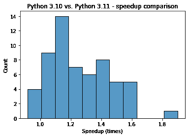

从图中可以清楚地看出，Python 3.11 中的大多数函数大约快了 1.2 倍(20%)。我们也可以用平均值和中位数来确认估计值。

```py
>>> df["speed_up"].mean() 
```

```py
1.2605593220338982
```

```py
>>> df["speed_up"].median() 
```

```py
1.207
```

似乎有一个案例，速度增加超过 60%。

```py
>>> df["speed_up"].max() 
```

```py
1.899
```

还有四种情况下 Python 3.10 比新版本快。

```py
>>>  (df["speed_up"] <= 1).sum() 
```

```py
4
```

虽然理论上性能的提高是显而易见的，但改进的具体影响将因人而异，Python 3.11 的稳定的最终版本尚未发布。基准测试使用纯 Python 函数，您在日常工作中可能不会经常使用，但是为 Python 3.10 和 3.11 设置 Docker 安装将允许您了解特定用例的速度提升。

### 2.更好的错误消息

Python 3.11 的另一个令人兴奋的特性是更好的错误消息传递，可以精确定位错误的位置。Python 3.11 指出了导致错误的确切表达式，而不是返回一个以难以解释的错误消息结尾的 100 行回溯。

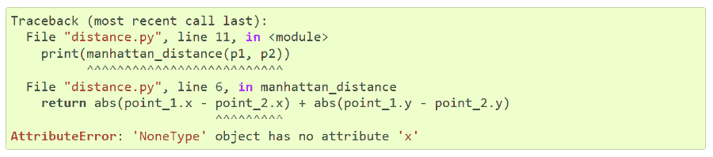

在上面的例子中，Python 解释器指向了导致脚本崩溃的 x，因为它的值为 None。该错误在当前版本的 Python 中是不明确的，因为有两个带有“x”属性的对象。但是 3.11 的错误处理明确指出了有问题的表述。

这个例子展示了 3.11 如何从一个深度嵌套的字典中找出一个错误，并且可以清楚地显示这个错误属于哪个键。

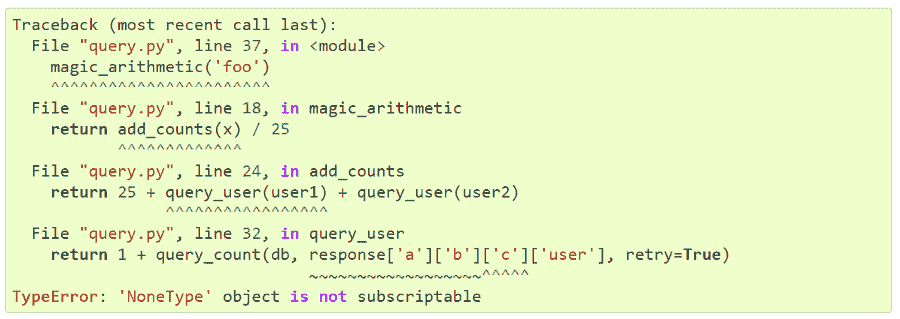

您可以在复杂的算术表达式中看到相同的精度。

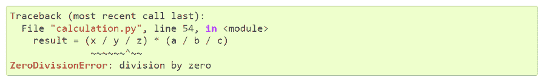

更新的错误消息绝对是一个受欢迎的补充，尤其是对于那些努力调试脚本的数据科学家来说。

### 3.异常注释

“显性比隐性好。”

上面这句话是[Python 的禅](https://web.archive.org/web/20221212135819/https://www.datacamp.com/blog/lessons-from-the-zen-of-python)的第二行，列举了 Python 的 20 条设计原则。这一条代表了 Python 代码应该尽可能有表现力的规则。

为了加强这种设计模式，Python 3.11 引入了异常注释( [PEP 678](https://web.archive.org/web/20221212135819/https://peps.python.org/pep-0678/#example-usage) )。现在，在 except 子句中，可以调用`add_note()`函数，并在出现错误时传递自定义消息。

```py
import math

try:
  math.sqrt(-1)
except ValueError as e:
  e.add_note("Negative value passed! Please try again.")
  raise
```

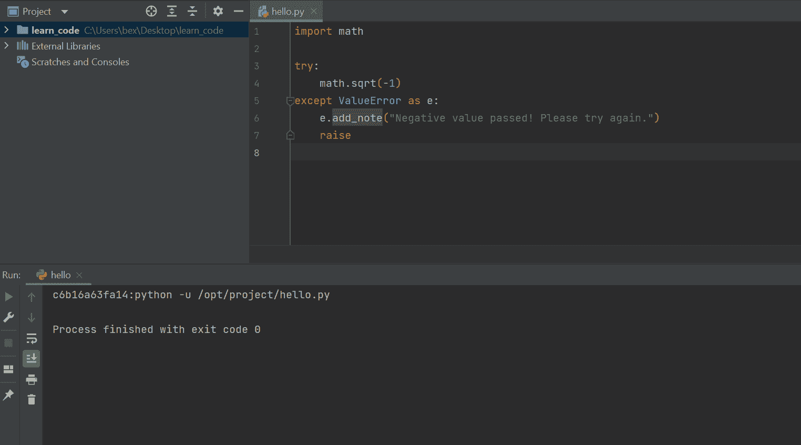

如果您已经编写了一个如下所示的定制异常类，那么您可以在受保护的类级属性`__notes__`中向该类添加多个注释:

```py
import math

class MyOwnError(Exception):
   # Should be a list of strings
   __notes__ = ["This is a custom error!"]

try:
   math.sqrt(-1)
except:
   raise MyOwnError
```

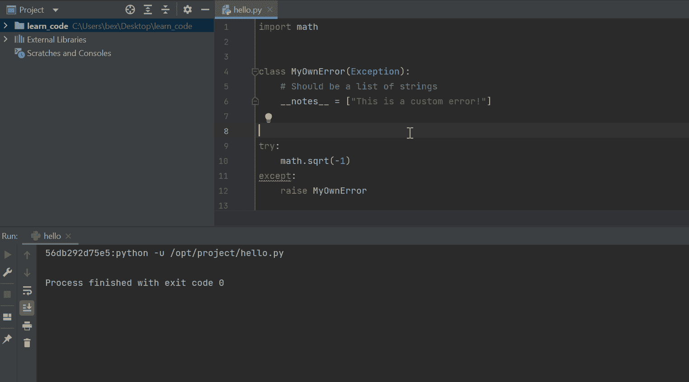

现在，当解释器命中错误时，它会在常规消息体之后显示自定义消息。

还有一个使用 except*子句引发异常的新语法，它与新的 ExceptionGroup 类一起使用。PEP 654 说你可以用它在不同的场景中同时引发多个不相关的错误。这些情况大部分都太小众了，比如使用 web sockets，用`asyncio`同时编程等等。，这在日常数据科学工作中很少出现，但是如果您感兴趣，您可以在这里了解新语法[。](https://web.archive.org/web/20221212135819/https://peps.python.org/pep-0678/#example-usage)

### 4.新的打字功能:自我

静态类型语言有助于使您的代码可读性更强，易于调试。定义变量、函数输入和输出的确切类型可以节省您的调试时间，并使其他人更容易阅读您的代码。添加类型注释还可以让现代 ide 在您键入函数名称时显示函数定义，使您的函数更容易被其他人解释。

到目前为止，Python 中强大的[类型模块](https://web.archive.org/web/20221212135819/https://docs.python.org/3/library/typing.html)拥有几乎任何数据类型的类，除了返回自身实例的类。在 Python 的当前版本中，以下示例是不可能的:

```py
from typing import Self
class Language:

  def __init__(self, name, version, release_date):
      self.name = name
      self.version = version
      self.release_date = release_date

  def change_version(self, version) -> Self:
      self.version = version

      return Language(self.name, self.version, self.release_date)
```

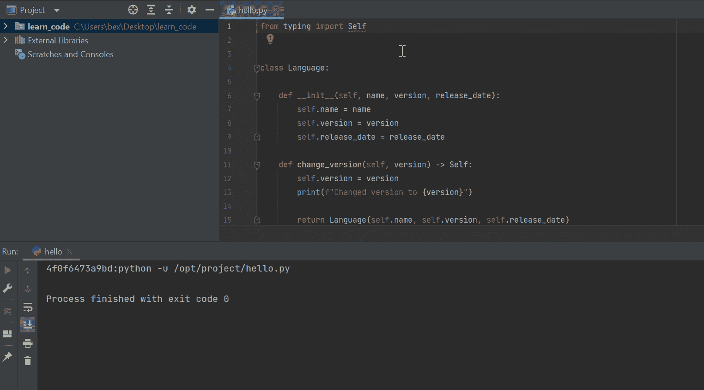

然而，Python 3.11 引入了 self 类，如果它的返回值是 Self 或该类本身的一个新实例，则可以将该类添加到函数的定义中。

### 5.对标准库的改进

标准库还有一些其他的生活质量改进。首先，在数学模块中添加了两个期待已久的函数。

```py
>>> import math
>>> math.cbrt(9)  # Find the cube-root of x
2.080083823051904
>>> math.cbrt(27)
3.0000000000000004
>>> math.exp2(5)  # Raise 2 to the power of x
32.0
```

Python 花了 28 年才添加立方根函数，这一事实令人惊讶，但正如俗话所说，迟做总比不做好。

分数模块还增加了一个新功能，允许您从字符串创建分数:

```py
>>> from fractions import Fraction
>>> Fraction("22/7")  # New in Python 3.11
Fraction(22, 7)
>>> Fraction(numerator=22, denominator=7)
Fraction(22, 7)
>>> Fraction("3e-4")
Fraction(3, 10000)
>>> Fraction("-73/41")
Fraction(-73, 41)
>>> Fraction(3.1415)  # Find the closest approximation to the given float
Fraction(7074029114692207, 2251799813685248)
```

如您所见，分数模块对于某些算术运算来说非常方便。主要是，我喜欢你如何找到最接近给定浮点数的分数。您可以进一步提供分母限制:

```py
>>> from math import pi
>>> Fraction(pi).limit_denominator(100000)
Fraction(312689, 99532)
```

还有一个名为`tomllib`的新模块，用于解析 TOML 文档。TOML (Tom 的显而易见的最小语言)是一种流行的文件格式，用于编写人类可读的配置文件。这是一张来自[项目主页](https://web.archive.org/web/20221212135819/https://toml.io/en)的图片:

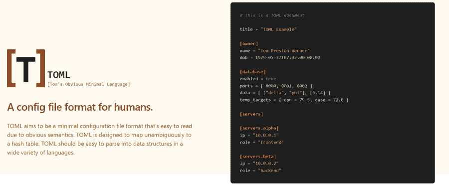

```py
import tomllib

toml_str = """
python-version = "3.11.0"
release_date = "2022-10-22"
"""

data = tomllib.loads(toml_str)
print(data)  # {'python-version': '3.11.0', 'release_date': '2022-10-22'}
print(data['python-version'])  # 3.11.0
print(data['release_date'])  # 2022-10-22
```

## Python 3.11 发布日期

Python 3.11 的开发始于 2021 年 5 月 5 日。从那时起，已经发布了七个 alpha 版本，与 2022 年 5 月 8 日的第一个 beta 版本重合。从这一天开始，直到正式发布，Python 中不会引入新的特性。

最终的稳定版本将于 2022 年 10 月 3 日发布，同时还有三个测试版本和两个候选版本。您可以通过查看以下资源来了解更多关于 Python 的知识。