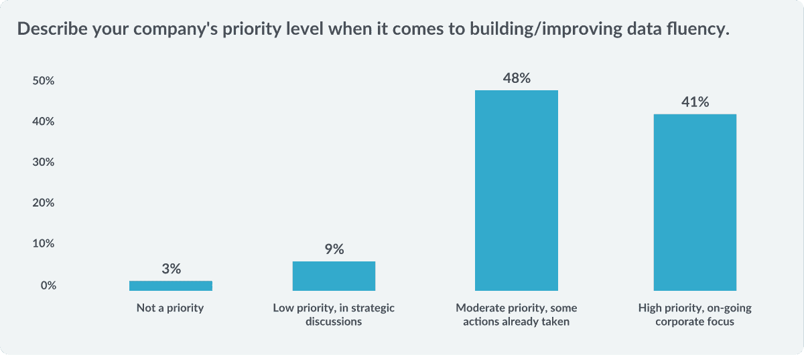
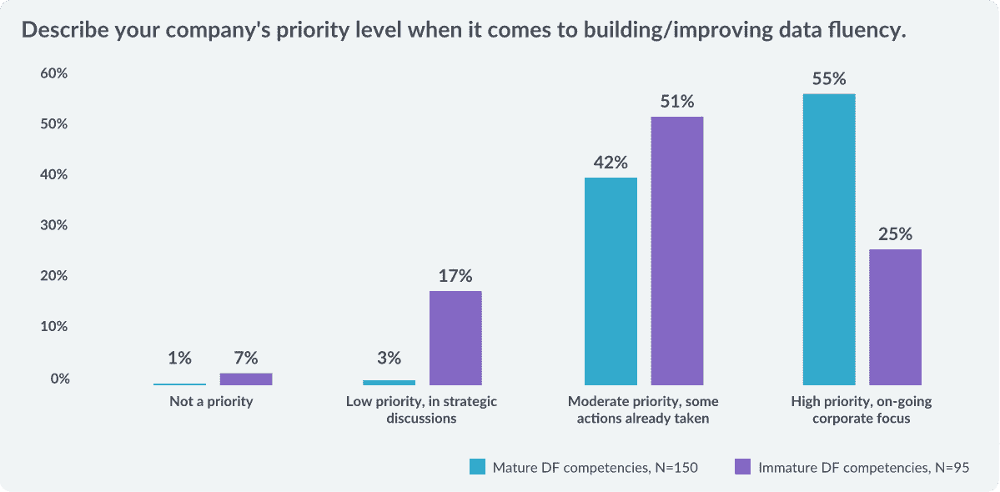
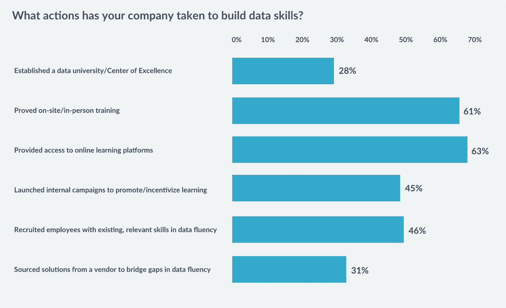
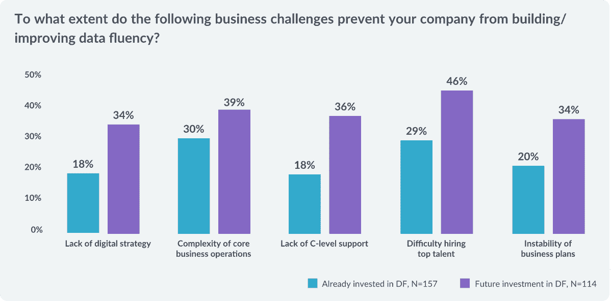
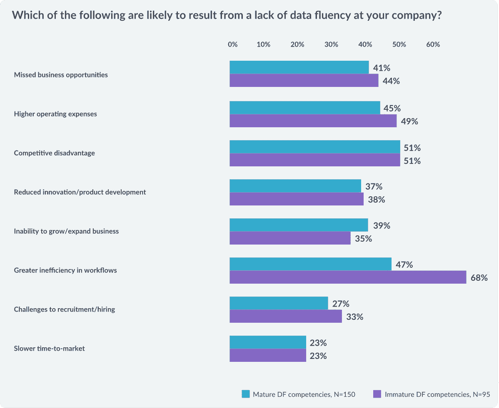
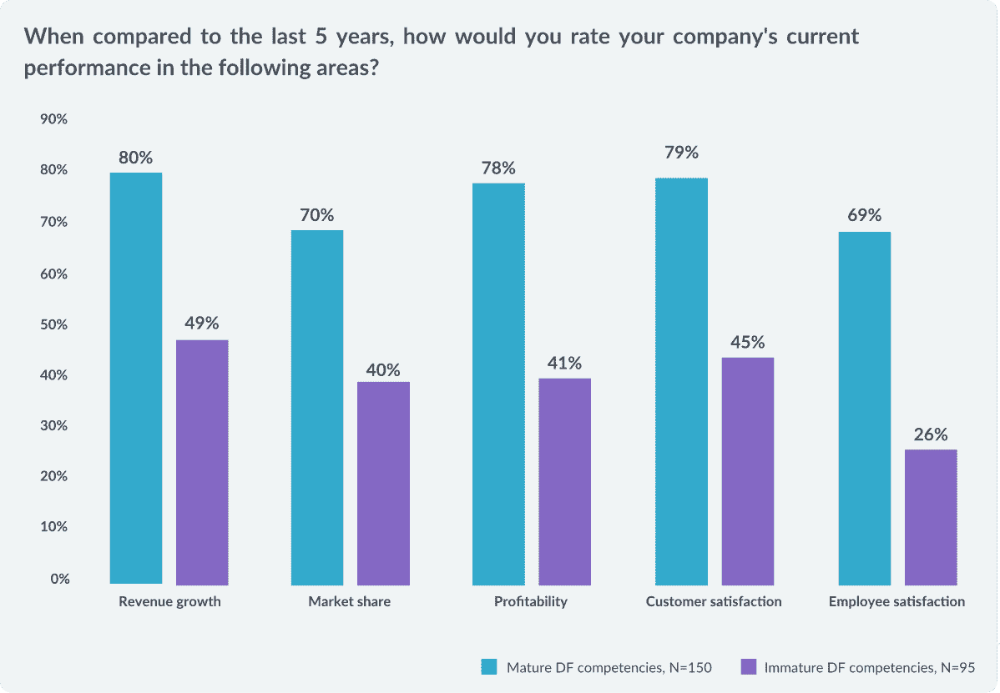

# 为什么 89%的公司优先考虑数据流畅性

> 原文：<https://web.archive.org/web/20230101103339/https://www.datacamp.com/blog/why-89percent-of-companies-are-prioritizing-data-fluency>

DataCamp 对来自医疗保健、技术、消费品、政府和金融等不同行业的 300 多名学习和发展领导者进行了调查。*这些 L&D 领导人的反馈表明，投资数据流畅性是当今公司的当务之急，因为它对业务成果有直接影响。

如果您对在贵公司建立数据流畅感兴趣，请访问[datacamp.com/business](https://web.archive.org/web/20220525044243/https://www.datacamp.com/business)或点击[此处](https://web.archive.org/web/20220525044243/https://www.datacamp.com/business/demo/)安排我们平台的演示。敬请关注我们即将发布的白皮书，了解更多详细的调查结果！

### 89%的公司表示，建立数据流畅性是他们业务的重中之重。

数据流畅性包括一系列技能和熟练程度，意味着具备适当的数据技能水平，以便根据每个工作角色的不同需求高效工作。

有趣的是，对于拥有成熟数据流畅能力的公司，优先考虑数据流畅的受访者比例上升至 97%，这表明数据流畅程度越高的公司，越承认要达到他们期望的业务目标还有很长的路要走。

### 84%的公司计划到 2020 年投资数据流畅性。

投资数据流畅性的驱动因素包括更高的效率和创新、市场力量以及收入和生产率的提高。

### 63%的公司已经提供在线学习平台。

提供在线学习平台是企业为培养数据技能而采取的最常见措施。对于希望建立数据流畅能力的公司来说，利用 DataCamp 这样的外部平台来培训员工是至关重要的第一步。

### 雇佣顶尖人才是构建数据流畅度最常被提及的挑战。

46%尚未投资数据流畅性的公司——相比之下，29%已经投资的公司——在招聘顶级人才方面遇到困难。但是雇佣人才只是解决方案的一部分——大多数公司可能会受益于对现有员工的再培训和技能提升。

### 不成熟的数据流畅性导致工作流效率更低。

在报告数据流畅能力不成熟的公司中，高达 68%的公司报告工作流程效率更低。公司报告数据流畅性水平较高的行业是科技、金融和保险，而政府、医疗和零售落后于这一曲线。

### 数据流畅带来更好的业务成果。

Note: “All-time high/better” ratings only

数据流畅性能力成熟的高绩效公司比数据流畅性能力不成熟的同行取得了更好的结果。他们的收入增长、客户满意度、盈利能力、市场份额和员工满意度显著提高，这表明数据流畅性是公司成功的重要指标。

如果您想通过在贵公司建立数据流畅能力来推动更好的业务成果，请访问[datacamp.com/business](https://web.archive.org/web/20220525044243/https://www.datacamp.com/business)或点击[此处](https://web.archive.org/web/20220525044243/https://www.datacamp.com/business/demo/)安排我们平台的演示。

###### *本文引用的数据来自培训行业于 2019 年 8 月 15 日至 29 日对 303 名 L & D 级领导者进行的调查，这些领导者对其组织的培训实践拥有决策权。由于四舍五入，百分比总和可能不等于 100。*

