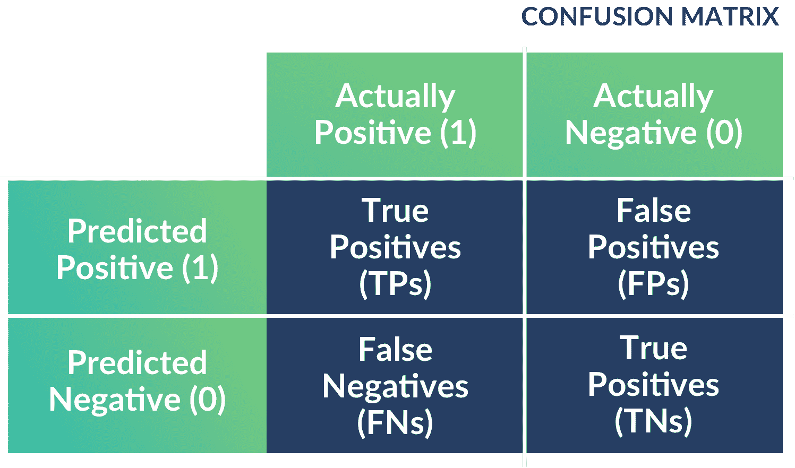

# 为什么你的模型不是最准确的也没关系

> 原文：<https://web.archive.org/web/20221129040116/https://www.datacamp.com/blog/why-its-okay-if-your-model-isnt-the-most-accurate>

当构建一个 ML 模型时，你必须指定一个*评估指标*，它告诉算法你在优化什么。一个常用的评估标准是准确性，也就是说，您的模型对多大比例的数据做出了正确的预测。这似乎是一个很好的选择:谁会想要一个*不是*最准确的模型呢？

实际上，在很多情况下，您不想为了准确性而进行优化——最普遍的情况是当您的数据有*个不平衡的类*时。假设您正在构建一个垃圾邮件过滤器来将电子邮件分类为垃圾邮件，而只有 1%的电子邮件实际上是垃圾邮件(这就是不平衡分类的含义:1%的数据是垃圾邮件，99%不是)。那么一个把所有邮件都归类为非垃圾邮件的模型，准确率是 99%，听起来很棒，但却是一个没有意义的模型。

有替代的标准来解释这种阶级不平衡。关键是您要与您的数据科学家讨论他们在优化什么，以及这与您的业务问题有何关联。开始这些讨论的一个好地方不是关注单个指标，而是查看模型的所谓 *[混淆矩阵](https://web.archive.org/web/20220808004505/https://en.wikipedia.org/wiki/Confusion_matrix)* ，它包含以下数字:

*   漏报(例如，真正的垃圾邮件被错误地分类为非垃圾邮件)
*   误报(非垃圾邮件被错误分类为垃圾邮件)
*   真正的否定(正确分类的非垃圾邮件)
*   真阳性(垃圾邮件被正确分类)

来源:[玻璃盒药](https://web.archive.org/web/20220808004505/https://glassboxmedicine.com/2019/02/17/measuring-performance-the-confusion-matrix/)

目前，很多注意力都集中在您提供给 ML 模型的数据的重要性以及它与您的评估指标的关系上。YouTube 不得不艰难地认识到这一点:当他们根据观看时间(人们停留在视频上的时间)优化收入时，这产生了推荐更多暴力和煽动性内容以及更多阴谋视频和假新闻的负面影响。

这里有一个有趣的教训是，优化收入——因为观看时间与 YouTube 可以为你提供的广告数量相关，因此收入——可能与其他目标不一致，例如显示真实的内容。这是古德哈特定律的算法版本，该定律指出:“当一个度量成为目标时，它就不再是一个好的度量。”

最广为人知的例子是苏联的一家钉子工厂，工人们首先被赋予一个目标，目标是若干根钉子，然后生产出许多小钉子。为了解决这个问题，目标被改为钉子的总重量，所以他们做了几个巨大的钉子。但是算法也受制于古德哈特定律，就像我们在 YouTube 推荐系统上看到的那样。

在[商业领袖机器学习权威指南](https://web.archive.org/web/20220808004505/https://www.datacamp.com/resources/ebooks/definitive-guide-to-machine-learning-for-business-leaders)中找到更多关于机器学习的最佳实践。

