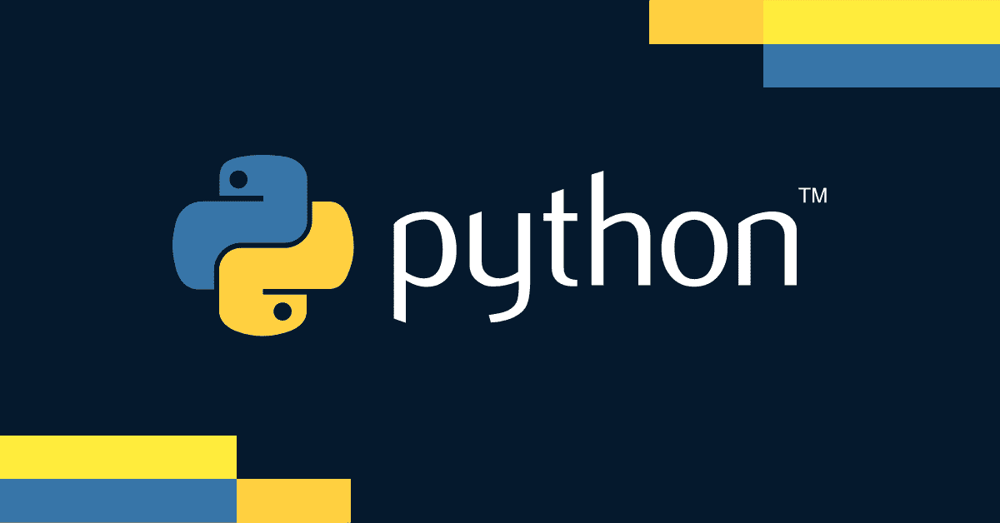
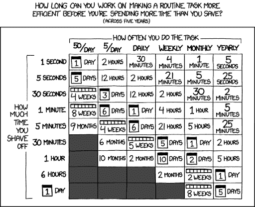
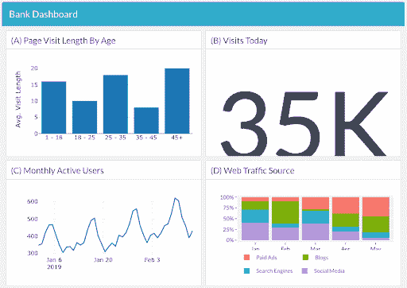
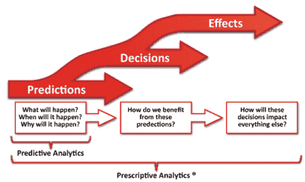

# 为什么贵公司需要 Python 进行商业分析

> 原文：<https://web.archive.org/web/20230101103339/https://www.datacamp.com/blog/why-your-company-needs-python-for-business-analytics>

## Python 为什么如此重要？

### Python 改善了每个人的工作

Python 应用广泛，是数据科学、web 开发、系统管理、编写自动化脚本等领域的顶级编程语言之一。开箱即用，Python 允许用户存储、访问和操作数据。它还有一个巨大的、不断增长的生态系统，有各种各样的开源包和库。这意味着不同的角色可以出于不同的目的使用 Python。

Python 对几乎每个行业都有用，包括医疗保健、金融、技术、咨询。医疗保健行业正在使用 Python 中的机器学习算法来预防和诊断疾病，并优化医院运营。农民使用 Python 进行产量预测，并在物联网技术的帮助下管理作物病虫害。

Python 是当今最流行的商业分析语言之一，并且还在以惊人的速度增长。它通常被认为是更容易阅读和学习的编程语言之一——它的编程语法简单，命令模仿英语。

### Python 正在取代 Excel 来扩展业务决策

Python 和 R 等其他开源编程语言正在迅速取代 Excel，后者无法满足现代商业需求。多年来，Excel 一直是公司事实上的决策引擎。但它是为数据集很小、不需要实时信息、协作不那么重要的世界而构建的。开源编程语言可以帮助公司更好地利用他们的数据，现在许多角色需要编码知识才能做到数据流畅。

我们的一位数据科学家 Chris Cardillo 说，“如果有人每天在 Excel 上花费超过 4 个小时，他们无疑会从学习 Python/R 中受益，”通过这个镜头评估您的员工是有用的——它将编程需求与工作场所中容易识别的模式进行了比较。事实上，利用开源代码大幅提高工作成果的能力[正是 Chris 成为数据科学家](https://web.archive.org/web/20221127002450/https://www.datacamp.com/community/blog/how-a-non-data-scientist-learned-r)的原因。

 Source: [xkcd](https://web.archive.org/web/20221127002450/https://xkcd.com/1205)

## Python 对商业分析有什么用？

### BI 和仪表板(描述性分析)

业务分析的主要目标之一是**描述已经发生的事情**，以便了解趋势并评估一段时间内的指标。该字段称为描述性分析，通常由数据分析师执行。

数据分析师经常使用 Python 来描述和分类当前存在的数据。他们参与探索性的数据分析，其中包括分析数据、可视化结果以及创建观察结果以形成分析中的后续步骤。 **Python 可以用来操纵数据(使用 pandas 之类的库)，精简工作流程，创建可视化(使用 Matplotlib)** 。

 Source: [Data Science for Managers](https://web.archive.org/web/20221127002450/https://www.datacamp.com/courses/data-science-for-managers)

### 机器学习(预测分析)

商业分析的另一个目标是通过**预测将要发生的事情**来为未来做准备。这个领域被称为预测分析。机器学习是预测分析的一个分支，它使用简化的统计算法来基于现有信息预测未来，并识别关系和见解——想想网飞的推荐引擎。

**Python 正迅速成为机器学习的首选语言，并被用于创建贝叶斯网络、决策树等模型**。Google 的 TensorFlow 是一个流行的 Python 库，许多数据科学家使用它来快速访问许多有监督和无监督的机器学习算法。

### 决策科学(规范分析)

规范分析，也称为决策科学，是业务分析的最后阶段，它预测特定结果将在什么时候发生以及为什么会发生，并确定如何处理这些信息。它将数据应用于决策过程。在我们的 DataFramed 播客中，[谷歌云的首席数据科学家 Cassie Kozyrkov 解释了决策智能和数据科学](https://web.archive.org/web/20221127002450/https://www.datacamp.com/community/podcast/decision-intelligence-data-science)之间的联系。

 Source: [Wikipedia](https://web.archive.org/web/20221127002450/https://en.wikipedia.org/wiki/Prescriptive_analytics)

决策科学家围绕业务问题构建他们的数据分析，并使用许多与数据科学家相同的技术和工具。他们的目标是让洞察变得可用，因此他们的模型和可视化方法必须能够传达这些洞察。 **Python 通常用于创建规定性分析工具，如[深度学习](https://web.archive.org/web/20221127002450/https://www.datacamp.com/tutorial/deep-learning-python)，它使用人工神经网络来优化结果**。

## 面向商业分析的大众化 Python

DataCamp 拥有丰富的 Python 课程，并且还在不断增加。不知道从哪里开始？我们鼓励有抱负的数据科学家加入我们的[数据科学家与 Python](https://web.archive.org/web/20221127002450/https://www.datacamp.com/tracks/data-scientist-with-python) 职业跟踪，参加精选课程。

对于重视持续学习的公司来说， [DataCamp for Business](https://web.archive.org/web/20221127002450/https://www.datacamp.com/business) 使员工能够在业务分析的所有领域保持最新技能。

点击[此处](https://web.archive.org/web/20221127002450/https://www.datacamp.com/business/demo)安排我们平台的演示。

