# YOLO 物体探测解释

> 原文：<https://web.archive.org/web/20221210085053/https://www.datacamp.com/blog/yolo-object-detection-explained>

# 对象检测简介

对象检测是计算机视觉中使用的一种技术，用于识别和定位图像或视频中的对象。

图像定位是使用边界框识别一个或多个对象的正确位置的过程，边界框对应于对象周围的矩形形状。

这一过程有时与图像分类或图像识别相混淆，图像分类或图像识别旨在将图像或图像中的对象的类别预测到类别或种类之一。

下图对应于前面解释的直观表示。在图像中检测到的对象是“人”

作者图片

在这篇概念博客中，你将首先了解物体检测的好处，然后介绍 YOLO，这是最先进的物体检测算法。

在第二部分，我们将更多地关注 YOLO 算法及其工作原理。之后，我们将提供一些使用 YOLO 的实际应用程序。

最后一部分将解释 YOLO 从 2015 年到 2020 年的发展，然后总结下一步措施。

## 什么是 YOLO？

你只看一次(YOLO)是一种最先进的实时对象检测算法，由[约瑟夫·雷德蒙](https://web.archive.org/web/20221129052005/https://arxiv.org/search/cs?searchtype=author&query=Redmon%2C+J)、[桑托什·迪夫瓦拉](https://web.archive.org/web/20221129052005/https://arxiv.org/search/cs?searchtype=author&query=Divvala%2C+S)、[罗斯·吉尔希克](https://web.archive.org/web/20221129052005/https://arxiv.org/search/cs?searchtype=author&query=Girshick%2C+R)和[阿里·法尔哈迪](https://web.archive.org/web/20221129052005/https://arxiv.org/search/cs?searchtype=author&query=Farhadi%2C+A)在他们著名的研究论文“[你只看一次:统一的实时对象检测](https://web.archive.org/web/20221129052005/https://arxiv.org/abs/1506.02640)”中于 2015 年推出。

作者通过在空间上分离边界框，并使用单个卷积神经网络(CNN)将概率与每个检测到的图像相关联，将对象检测问题构建为回归问题，而不是分类任务。

通过参加使用 Python 中的 Keras 进行[图像处理](https://web.archive.org/web/20221129052005/https://datacamp.com/courses/image-processing-with-keras-in-python)课程，您将能够为图像分类任务构建基于 Keras 的深度神经网络。

如果你对 Pytorch 更感兴趣，[使用 Pytorch 进行深度学习](https://web.archive.org/web/20221129052005/https://datacamp.com/courses/deep-learning-with-pytorch)将会教你关于卷积神经网络以及如何使用它们来建立更加强大的模型。

## 是什么让 YOLO 在物体探测方面如此受欢迎？

YOLO 在竞争中领先的一些原因包括:

*   速度
*   检测精度
*   很好的概括
*   开源

### 1 速

YOLO 非常快，因为它不处理复杂的管道。它可以以每秒 45 帧(FPS)的速度处理图像。此外，与其他实时系统相比，YOLO 达到了平均精度(mAP)的两倍以上，这使其成为实时处理的绝佳候选。

从下图中，我们观察到 YOLO 以 91 FPS 的速度远远超过了其他物体检测器。

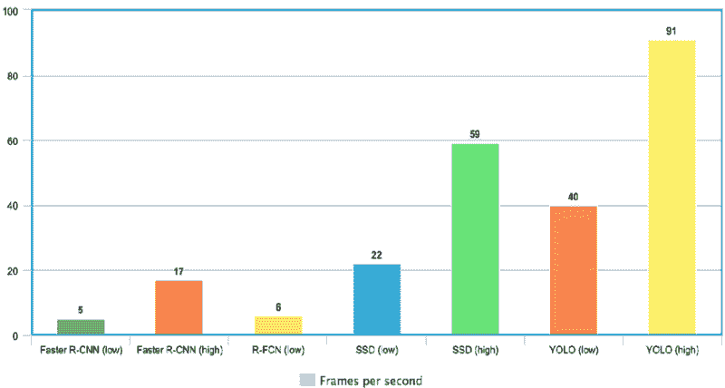

YOLO 速度与其他最先进的物体探测器相比([来源](https://web.archive.org/web/20221129052005/https://www.researchgate.net/figure/Comparison-of-frames-processed-per-second-FPS-implementing-the-Faster-R-CNN-R-FCN-SSD_fig6_342570032)

### 2-高检测精度

YOLO 在准确性上远远超过其他最先进的模型，背景误差很小。

### 3-更好的概括

对于 YOLO 的新版本来说尤其如此，这将在本文后面讨论。凭借这些进步，YOLO 又向前推进了一步，为新领域提供了更好的泛化能力，这使得它非常适合依赖于快速而鲁棒的对象检测的应用。

例如，[用 Yolo 深度卷积神经网络自动检测黑色素瘤的论文](https://web.archive.org/web/20221129052005/https://www.researchgate.net/publication/337498273_Automatic_Detection_of_Melanoma_with_Yolo_Deep_Convolutional_Neural_Networks)显示，与 YOLOv2 和 YOLOv3 相比，第一版 YOLOv1 的黑色素瘤疾病自动检测平均精度最低。

### 4-开源

使 YOLO 开源导致社区不断改进模型。这也是 YOLO 在如此有限的时间内取得如此多进步的原因之一。

## YOLO 建筑

YOLO 的建筑类似于谷歌网。如下图所示，它总共有 24 个卷积层、四个最大池层和两个全连接层。

来自[的 YOLO 建筑原文](https://web.archive.org/web/20221129052005/https://arxiv.org/pdf/1506.02640.pdf)(作者修改)

该架构的工作原理如下:

*   在通过卷积网络之前，将输入图像的大小调整为 448x448。
*   首先应用 1x1 卷积来减少通道数量，然后再应用 3x3 卷积来产生立方形输出。
*   引擎盖下的激活函数是 ReLU，除了最后一层用的是线性激活函数。
*   一些额外的技术，如批量归一化和丢弃，分别正则化模型并防止它过拟合。

通过完成 Python 中的[深度学习](https://web.archive.org/web/20221129052005/https://www.datacamp.com/tracks/deep-learning-in-python)课程，您将准备好使用 Keras 来训练和测试复杂的多输出网络，并更深入地研究深度学习。

## YOLO 物体检测是如何工作的？

现在您已经理解了架构，让我们使用一个简单的用例来对 YOLO 算法如何执行对象检测有一个高层次的概述。

假设您构建了一个 YOLO 应用程序，从给定的图像中检测球员和足球。

但是你如何向某人解释这个过程，尤其是没有印心的人？

这就是本节的全部内容。你会了解 YOLO 如何进行物体探测的全过程；如何从图像(A)中获取图像(B)

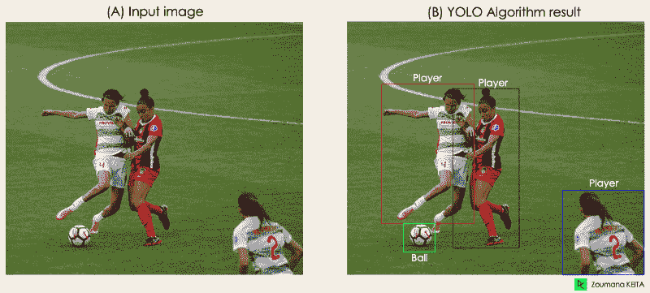 *图片作者*

该算法基于以下四种方法工作:

*   残余块
*   包围盒回归
*   Unions 上的交集或简称为 IOU
*   非最大抑制。

让我们仔细看看他们每一个人。

### 1-残余块

第一步从将原始图像(A)划分为 N×N 个形状相同的网格单元开始，在我们的例子中，N 是 4，如右图所示。网格中的每个单元负责定位和预测它所覆盖的对象的类别，以及概率/置信度值。

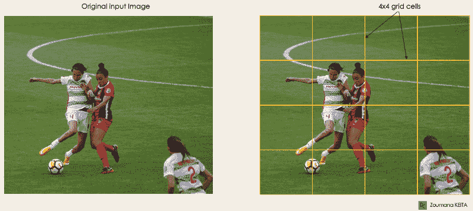

*作者图片*

### 2-包围盒回归

下一步是确定对应于突出显示图像中所有对象的矩形的边界框。在给定的图像中，我们可以有和对象一样多的边界框。

YOLO 使用以下格式的单个回归模块来确定这些边界框的属性，其中 Y 是每个边界框的最终矢量表示。

Y = [pc，bx，by，bh，bw，c1，c2]

这在模型的训练阶段尤其重要。

*   pc 对应于包含对象的网格的概率分数。例如，所有红色网格的概率分数都大于零。右边的图像是简化的版本，因为每个黄色单元的概率为零(不显著)。

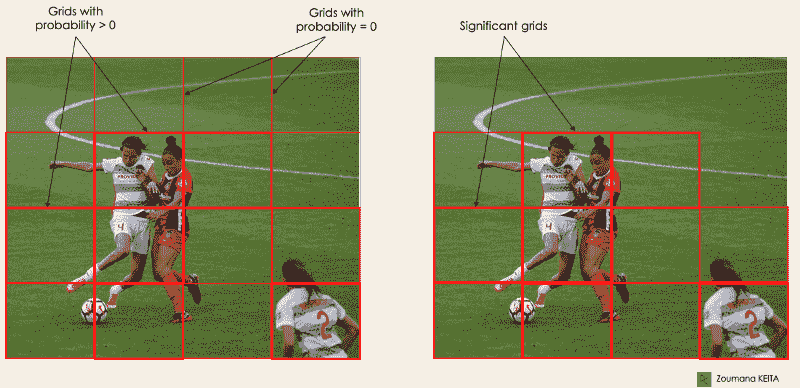

*作者图片*

*   bx，by 是边界框中心相对于包围网格单元的 x 和 y 坐标。
*   bh、bw 对应于边界框相对于包络网格单元的高度和宽度。
*   c1 和 c2 对应于两个类 Player 和 Ball。您的用例需要多少类，我们就有多少类。

为了理解，让我们更仔细地关注右下方的玩家。

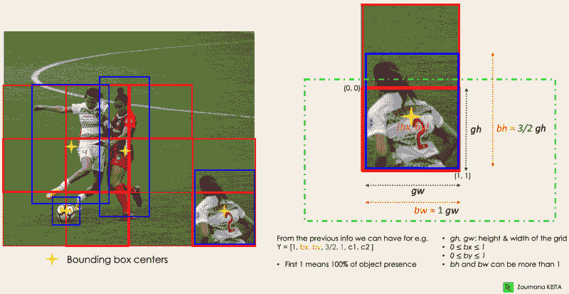作者图片

### 3-联合或 IOU 上的交集

大多数情况下，图像中的单个对象可以有多个用于预测的栅格框候选，即使它们并不都是相关的。IOU(0 到 1 之间的值)的目标是丢弃这样的网格框，只保留那些相关的。这背后的逻辑是:

*   用户可以定义 IOU 选择阈值，例如 0.5。
*   然后，YOLO 计算每个网格单元的 IOU，即交集面积除以并集面积。
*   最后，它忽略对 IOU ≤阈值的网格单元的预测，并考虑 IOU >阈值的网格单元。

下面是一个应用网格选择过程到左下角对象的例子。我们可以观察到，该对象最初有两个网格候选，然后最后只选择了“网格 2”。

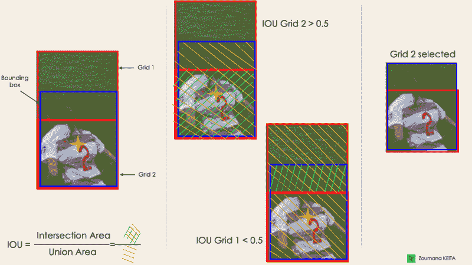

作者图片

### 4-非最大抑制或 NMS

为 IOU 设置一个阈值并不总是足够的，因为一个对象可以有多个 IOU 超过阈值的框，保留所有这些框可能会包含噪声。在这里，我们可以使用 NMS 来仅保留具有最高检测概率分数的盒子。

## YOLO 应用

YOLO 物体检测在我们的日常生活中有不同的应用。在本节中，我们将讨论以下领域中的一些问题:医疗保健、农业、安全监控和自动驾驶汽车。

### 1-在工业中的应用

目标检测已被引入许多实际行业，如医疗保健和农业。让我们用具体的例子来了解每一个。

#### 卫生保健

特别是在外科手术中，由于患者之间的生物多样性，实时定位器官可能是一项挑战。[CT 中的肾脏识别使用 YOLOv3](https://web.archive.org/web/20221129052005/https://arxiv.org/pdf/1910.01268.pdf) 在 2D 和计算机断层扫描(CT)中定位肾脏。

Python 课程中的[生物医学图像分析可以帮助您学习使用 Python 探索、操作和测量生物医学图像数据的基础知识。](https://web.archive.org/web/20221129052005/https://www.datacamp.com/courses/biomedical-image-analysis-in-python)

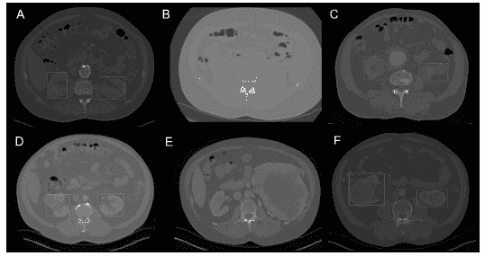

通过 YOLOv3 进行 2D 肾脏检测(图像来自使用 YOLOv3 在 CT 中进行的[肾脏识别)](https://web.archive.org/web/20221129052005/https://arxiv.org/pdf/1910.01268.pdf)

#### 农业

人工智能和机器人在现代农业中发挥着重要作用。收割机器人是基于视觉的机器人，被引入来代替手动采摘水果和蔬菜。这个领域最好的模型之一就是 YOLO。在[基于改进的 YOLOv3 框架的番茄检测](https://web.archive.org/web/20221129052005/https://www.nature.com/articles/s41598-021-81216-5)中，作者描述了他们如何使用 YOLO 来识别水果和蔬菜的类型以实现高效收获。

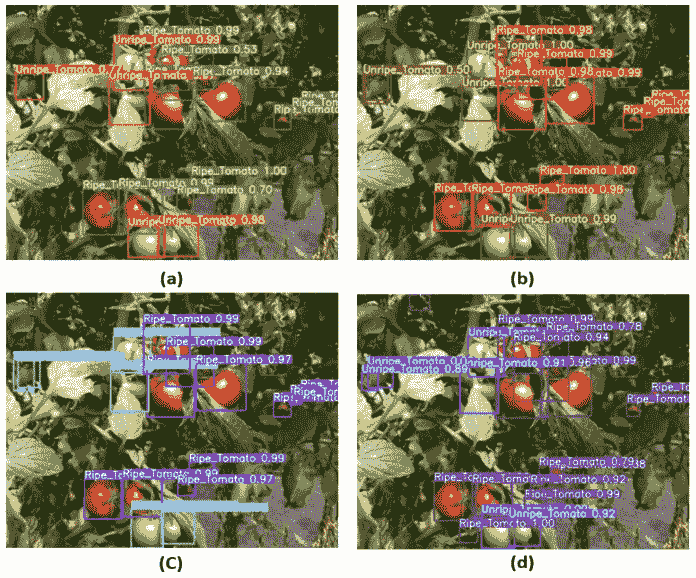

基于改进的 YOLOv3 框架的番茄检测图像([来源](https://web.archive.org/web/20221129052005/https://www.nature.com/articles/s41598-021-81216-5)

### 2-安全监控

尽管目标检测主要用于安全监控，但这并不是唯一的应用。YOLOv3 已在 covid19 疫情期间用于估计人与人之间的社会距离违规。

你可以从[一个基于深度学习的新冠肺炎社交距离监测框架](https://web.archive.org/web/20221129052005/https://pubmed.ncbi.nlm.nih.gov/33163330)中进一步阅读这个主题。

### 3-自动驾驶汽车

实时物体检测是自主车辆系统的 DNA 的一部分。这种集成对于自动驾驶汽车至关重要，因为它们需要正确识别正确的车道和所有周围的物体和行人，以提高道路安全性。与简单的图像分割方法相比，YOLO 的实时性使其成为更好的候选方法。

## YOLO、YOLOv2、YOLO9000、YOLOv3、YOLOv4、YOLOR、YOLOX、YOLOv5、YOLOv6、YOLOv7 和差异

自从 2015 年 YOLO 第一次发布以来，它已经随着不同的版本发展了很多。在本节中，我们将了解这些版本之间的差异。

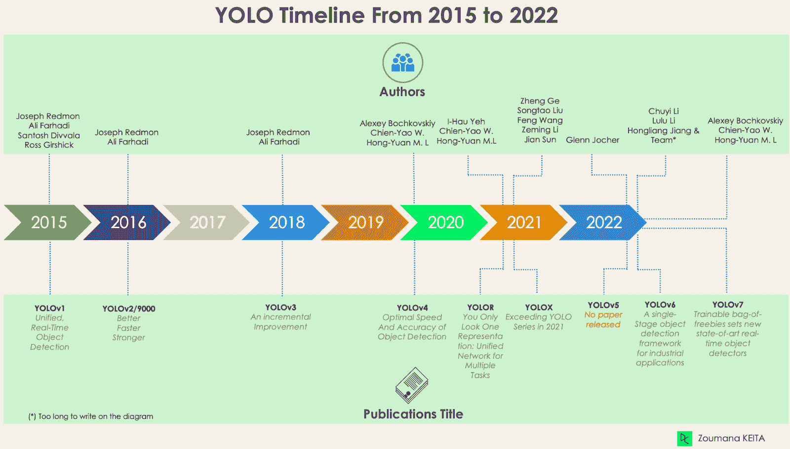

### YOLO 或约洛夫 1，起点

YOLO 的第一个版本改变了物体检测的游戏规则，因为它能够快速有效地识别物体。

然而，像许多其他解决方案一样，第一版 YOLO 也有其自身的局限性:

*   它很难检测一组图像中的较小图像，例如体育场中的一群人。这是因为 YOLO 架构中的每个网格都是为单个对象检测而设计的。
*   然后，YOLO 无法成功地探测到新的或不寻常的形状。
*   最后，用于近似检测性能的损失函数对于小边界框和大边界框都同样对待误差，这实际上产生了不正确的定位。

### YOLOv2 或 YOLO9000

YOLOv2 于 2016 年创建，其理念是让 YOLO 车型[更好、更快、更强](https://web.archive.org/web/20221129052005/https://arxiv.org/abs/1612.08242)。

改进包括但不限于使用 [Darknet-19](https://web.archive.org/web/20221129052005/https://paperswithcode.com/method/darknet-19) 作为新架构、批量标准化、输入的更高分辨率、带有锚点的卷积层、维度聚类以及(5)细粒度特征。

#### 一批标准化

添加批处理规范化图层可将性能提高 2% mAP。这一批标准化包括一个正则化效果，防止过度拟合。

#### 2-更高的输入分辨率

YOLOv2 直接使用更高分辨率的 448×448 输入，而不是 224×224，这使得模型可以调整其滤镜，以便在更高分辨率的图像上表现更好。在对 [ImageNet 数据](https://web.archive.org/web/20221129052005/https://paperswithcode.com/dataset/imagenet)进行 10 个时期的训练后，这种方法将 mAP 的准确度提高了 4%。

#### 使用锚定框的 3-卷积层

YOLOv2 没有在 YOLOv1 操作时预测对象边界框的精确坐标，而是通过用定位框替换完全连接的层来简化问题。这种方法略微降低了准确率，但将模型召回率提高了 7%，这给了更多的改进空间。

#### 四维聚类

YOLOv2 使用 k=5 的 k-均值维度聚类自动找到前面提到的锚框，而不是执行手动选择。这种新方法在模型的召回率和精确度之间提供了一个很好的折衷。

为了更好地理解 k-means 维度聚类，请看一下我们在 Python 中的 [K-Means 聚类和 scikit-learn](https://web.archive.org/web/20221129052005/https://www.datacamp.com/tutorial/k-means-clustering-python) 和 R 教程中的 [K-Means 聚类。他们使用 Python 和 r 深入研究了 k-means 聚类的概念。](https://web.archive.org/web/20221129052005/https://www.datacamp.com/tutorial/k-means-clustering-r)

#### 5-细粒度功能

YOLOv2 预测生成 13x13 的特征图，对于大物体检测当然足够了。但是对于更精细的对象检测，可以通过将 26 × 26 × 512 特征图变成 13 × 13 × 2048 特征图来修改架构，与原始特征连接。这种方法将模型性能提高了 1%。

### yo lov 3——渐进式改进

[对 YOLOv2 进行了增量改进](https://web.archive.org/web/20221129052005/https://arxiv.org/pdf/1804.02767.pdf)以创建 YOLOv3。

变化主要包括新的网络架构: [Darknet-53](https://web.archive.org/web/20221129052005/https://paperswithcode.com/method/darknet-53) 。这是一个 106 神经网络，带有上采样网络和残差块。它比[的黑暗网-19](https://web.archive.org/web/20221129052005/https://arxiv.org/abs/1612.08242) 更大、更快、更精确，而黑暗网-19 是 YOLOv2 的支柱。这种新的架构在许多层面上都是有益的:

#### 1-更好的包围盒预测

YOLOv3 使用逻辑回归模型来预测每个边界框的客观性分数。

#### 2-更准确的类别预测

取代 YOLOv2 中使用的 softmax，引入了独立的逻辑分类器来精确预测边界框的类别。当面对具有重叠标签的更复杂的域时，这甚至是有用的(例如，人→足球运动员)。使用 softmax 会将每个盒子限制为只有一个类，但这并不总是正确的。

#### 3-不同尺度下更精确的预测

YOLOv3 对输入图像中的每个位置以不同的比例执行三次预测，以帮助从前面的层进行上采样。这种策略允许获得细粒度和更有意义的语义信息，以获得更高质量的输出图像。

### YOLOv4 —物体检测的最佳速度和精确度

与所有以前的版本和其他最先进的物体检测器相比，这一版本的 YOLO 具有[最佳的物体检测速度和精确度](https://web.archive.org/web/20221129052005/https://arxiv.org/pdf/2004.10934v1.pdf)。

下图显示 YOLOv4 的速度分别比 YOLOv3 和 FPS 快 10%和 12%。

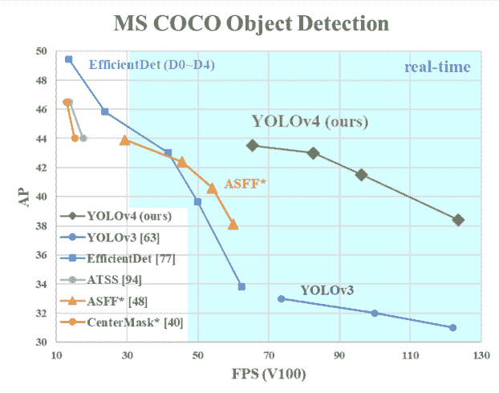

*YOLOv4 的速度与 YOLOv3 和其他最先进的物体探测器相比* ( [来源](https://web.archive.org/web/20221129052005/https://arxiv.org/pdf/2004.10934v1.pdf)

YOLOv4 是专门为生产系统设计的，并针对并行计算进行了优化。

YOLOv4 架构的主干是 [CSPDarknet53](https://web.archive.org/web/20221129052005/https://paperswithcode.com/method/cspdarknet53) ，这是一个包含 29 个卷积层的网络，具有 3 × 3 个滤波器和大约 2760 万个参数。

与 YOLOv3 相比，这种架构增加了以下信息，以实现更好的对象检测:

*   空间金字塔池(SPP)块显著增加感受野，分离最相关的上下文特征，并且不影响网络速度。
*   YOLOv4 使用[面板](https://web.archive.org/web/20221129052005/https://bio-protocol.org/exchange/minidetail?type=30&id=9907669)从不同的检测级别进行参数聚合，而不是 YOLOv3 中使用的特征金字塔网络(FPN)。
*   数据增强使用马赛克技术，该技术除了自我对抗训练方法之外，还结合了四幅训练图像。
*   使用遗传算法执行最佳超参数选择。

## 尤洛——你看起来只有一个形象

作为一个多任务的[统一网络，YOLOR 基于显性和隐性知识方法相结合的统一网络。](https://web.archive.org/web/20221129052005/https://arxiv.org/abs/2105.04206)

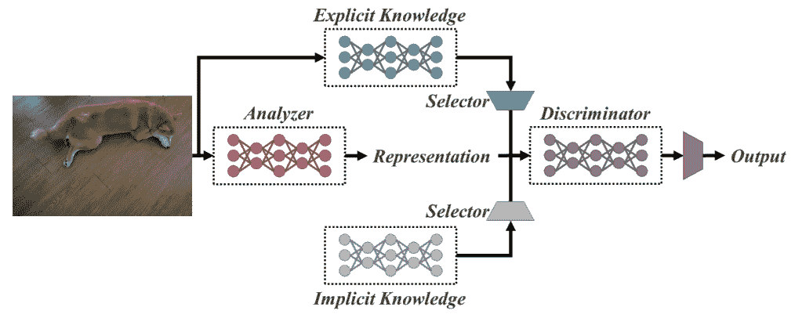

*统一网络架构* ( [来源](https://web.archive.org/web/20221129052005/https://arxiv.org/pdf/2105.04206.pdf))

显性知识是正常的或有意识的学习。另一方面，内隐学习是一种下意识的学习(来自经验)。

结合这两种技术，YOLOR 能够基于三个过程创建一个更健壮的架构:(1)特征对齐，(2)用于对象检测的预测对齐，以及(3)用于多任务学习的规范表示

### 1-预测对齐

这种方法在每个特征金字塔网络(FPN)的特征图中引入了一种隐式表示，从而提高了大约 0.5%的精度。

### 用于对象检测的 2-预测细化

通过向网络的输出层添加隐式表示来改进模型预测。

### 多任务学习的 3-规范表示

执行多任务训练需要对所有任务共享的损失函数执行联合优化。这个过程会降低模型的整体性能，并且这个问题可以通过在模型训练期间整合规范表示来缓解。

从下图中，我们可以观察到 t hat YOLOR 在[COCO](https://web.archive.org/web/20221129052005/https://viso.ai/deep-learning/yolor/#:~:text=vision.%20On%20the-,MS%20COCO,-dataset%2C%20the%20mean)女士的数据上取得了与其他模型相比最先进的推断速度。

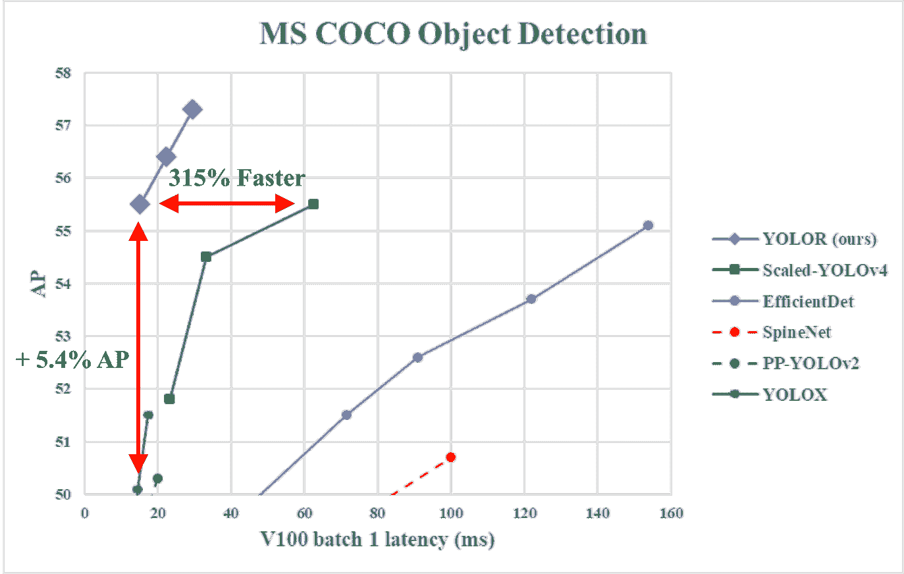

*YOLOR 性能对比 YOLOv4 等车型* ( [来源](https://web.archive.org/web/20221129052005/https://github.com/WongKinYiu/yolor)

## YOLOX——2021 年超越 YOLO 系列

这使用的基线是 YOLOv3 的修改版本，以 Darknet-53 作为其主干。

YOLOX 在 2021 年发表的论文[超越 YOLO 系列中提出了以下四个关键特征，以创建一个比旧版本更好的模型。](https://web.archive.org/web/20221129052005/https://arxiv.org/abs/2107.08430)

### 1-高效的去耦头

在以前的 YOLO 版本中使用的耦合头显示会降低模型的性能。YOLOX 使用解耦的，这允许分离分类和本地化任务，从而提高模型的性能。

### 2-稳健的数据增强

将 Mosaic 和 [MixUp](https://web.archive.org/web/20221129052005/https://paperswithcode.com/method/mixup) 集成到数据增强方法中大大提高了 YOLOX 的性能。

### 3-无锚系统

基于锚的算法在幕后执行聚类，这增加了推理时间。删除 YOLOX 中的锚机制减少了每幅图像的预测数量，并显著提高了推理时间。

### 4- SimOTA 用于标签分配

作者没有使用并集交集(IoU)方法，而是引入了 SimOTA，这是一种更强大的标签分配策略，通过减少训练时间和避免额外的超参数问题，实现了最先进的结果。除此之外，它还将检测图提高了 3%。

## YOLOv5

与其他版本相比，YOLOv5 没有发表研究论文，它是第一个用 Pytorch 而不是 Darknet 实现的 YOLO 版本。

YOLOv5 由 Glenn Jocher 于 2020 年 6 月发布，与 YOLOv4 类似，使用 [CSPDarknet53](https://web.archive.org/web/20221129052005/https://paperswithcode.com/method/cspdarknet53) 作为其架构的主干。该版本包括五种不同的型号:YOLOv5s(最小)、YOLOv5m、YOLOv5l 和 YOLOv5x(最大)。

YOLOv5 架构的一个主要改进是集成了[焦点层](https://web.archive.org/web/20221129052005/https://github.com/ultralytics/yolov5/discussions/3181m1)，由一个层表示，它是通过替换 YOLOv3 的前三层而创建的。这种整合减少了图层的数量和参数的数量，也增加了向前和向后的速度，而对地图没有任何重大影响。

下图比较了 YOLOv4 和 YOLOv5s 的训练时间。

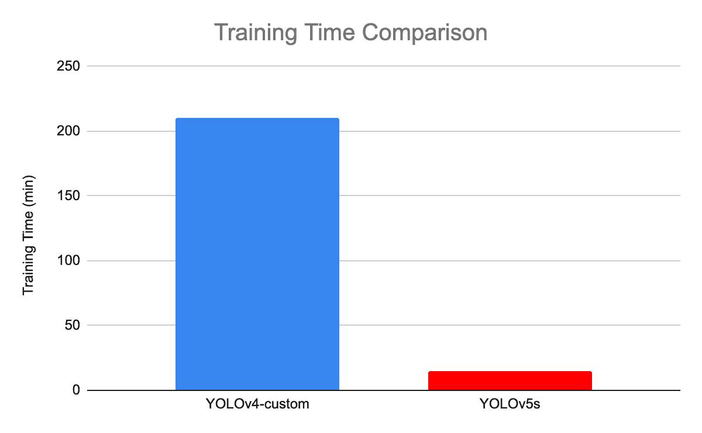

*yolov 4 和 YOLOv5 的训练时间对比* ( [来源](https://web.archive.org/web/20221129052005/https://blog.roboflow.com/yolov4-versus-yolov5)

## yolov 6——面向工业应用的单级目标检测框架

YOLOv6 (MT-YOLOv6)框架由中国电子商务公司[美团](https://web.archive.org/web/20221129052005/https://tech.meituan.com/)发布，致力于硬件友好的高效设计和高性能的[工业应用](https://web.archive.org/web/20221129052005/https://arxiv.org/pdf/2209.02976.pdf)。

这个新版本用 Pytorch 编写，不属于官方的 YOLO，但仍被命名为 YOLOv6，因为它的主干受到了最初的一级 YOLO 建筑的启发。

YOLOv6 对之前的 YOLOv5 进行了三项重大改进:硬件友好的脊柱和颈部设计，高效的去耦头部，以及更有效的训练策略。

在 COCO 数据集上，与之前的 YOLO 版本相比，YOLOv6 在准确性和速度方面提供了出色的结果，如下图所示。

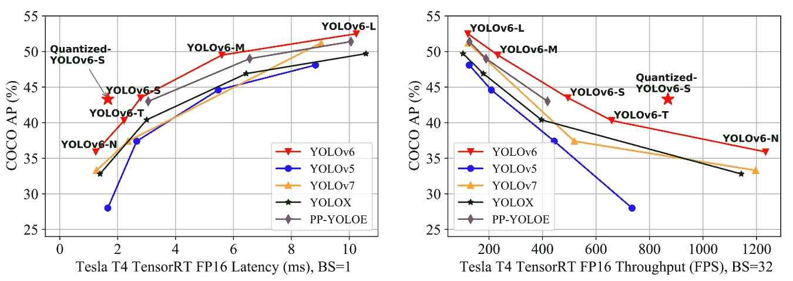

最先进的有效物体探测器的比较所有模型都用 TensorRT 7 测试，除了量化模型用 TensorRT 8 ( [源](https://web.archive.org/web/20221129052005/https://arxiv.org/pdf/2209.02976.pdf))

*   YOLOv6-N 在 NVIDIA Tesla T4 GPU 上以 1234(吞吐量)FPS 的吞吐量在 [COCO 数据集](https://web.archive.org/web/20221129052005/https://paperswithcode.com/dataset/coco)上实现了 35.9%的 AP。
*   YOLOv6-S 以 869 FPS 的速度达到了新的最先进的 43.3% AP。
*   YOLOv6-M 和 YOLOv6-L 在相同的推理速度下也取得了更好的准确率，分别为 49.5%和 52.3%。

所有这些特征使得 YOLOv5 成为适合工业应用的算法。

## YOLOv7 可训练的免费包为实时物体探测器树立了新的艺术境界

YOLOv7 于 2022 年 7 月在论文[中发布，训练有素的免费赠品袋为实时物体探测器设定了新的最先进水平](https://web.archive.org/web/20221129052005/https://arxiv.org/pdf/2207.02696.pdf)。这个版本在物体检测领域取得了重大进展，在准确性和速度方面超过了以前的所有型号。

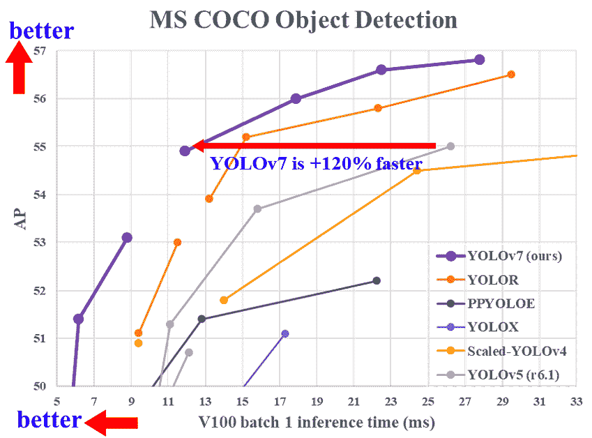

*yolov 7 推理时间与其他实时物体探测器的比较* ( [来源](https://web.archive.org/web/20221129052005/https://arxiv.org/abs/2207.02696)

YOLOv7 在它的(1)架构和(2)可训练的免费赠品级别做了重大改变:

### 1-建筑级别

YOLOv7 通过集成扩展高效层聚合网络(E-ELAN)改革了其架构，该网络允许模型学习更多不同的功能，以便更好地学习。

此外，YOLOv7 还通过连接 YOLOv4、Scaled YOLOv4 和 YOLO-R 等衍生模型的体系结构来扩展其体系结构。这使得模型能够满足不同推理速度的需求。

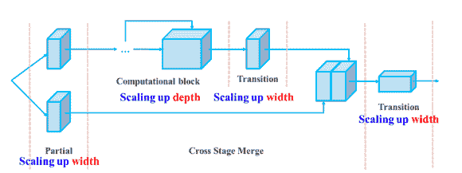

*基于连接的模型的复合放大深度和宽度* ( [来源](https://web.archive.org/web/20221129052005/https://arxiv.org/pdf/2207.02696.pdf)

### 2-可训练的免费包

**免费赠品袋**一词指的是在不增加训练成本的情况下提高模型的精度，这也是 YOLOv7 不仅提高了推理速度，还提高了检测精度的原因。

## 结论

本文介绍了 YOLO 相对于其他最先进的对象检测算法的优势，以及它从 2015 年到 2020 年的发展，重点介绍了它的优势。

鉴于 YOLO 的快速发展，毫无疑问，它将在很长一段时间内保持物体探测领域的领先地位。

本文的下一步将是 YOLO 算法在现实世界中的应用。在此之前，我们的[Python 深度学习简介](https://web.archive.org/web/20221129052005/https://www.datacamp.com/courses/introduction-to-deep-learning-in-python)课程可以帮助你学习神经网络的基础知识，以及如何在 Python 中使用 Keras 2.0 构建深度学习模型。

是的，YOLO 是一种实时检测算法，适用于图像和视频。

在平均精度(mAP)方面，更快的 R-CNN 达到了 87.69%。然而，YOLOv3 的速度令人难以置信，其每秒帧数(FPS)是 R-CNN 的 8 倍。

这是因为 YOLO 在一次转发中预测了一幅图像中的所有物体。

YOLO 能够同时检测 9000 多个类别。