# YOLO 对象本地化如何与 Keras 协同工作的简明指南(第 2 部分)

> 原文：<https://www.dlology.com/blog/gentle-guide-on-how-yolo-object-localization-works-with-keras-part-2/>

###### 发帖人:[程维](/blog/author/Chengwei/) 4 年 8 个月前

([评论](/blog/gentle-guide-on-how-yolo-object-localization-works-with-keras-part-2/#disqus_thread))

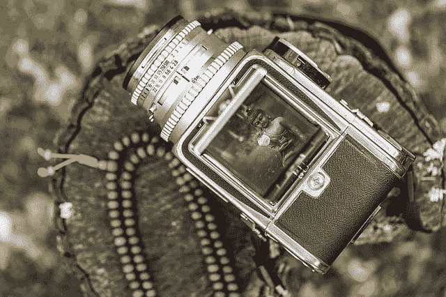

*编者按:本系列第 1 部分发表于《黑客正午》。查看* [*这里*](https://www.dlology.com/blog/gentle-guide-on-how-yolo-object-localization-works-with-keras/)

欢迎回到本系列的第二部分。在这一节中，我们将深入研究 YOLO 对象本地化模型。

虽然你可能听说过 YOLO 这个缩写，但这个不同。代表“**Y**ou**O**only**L**ook**O**nce”。

你可能想知道为什么“看一次”？因为还有其他看起来“不止一次”的对象位置模型，我们将在后面讨论。正如你已经预料到的，YOLO 的“看一次”特性使模型运行得非常快。

## YOLO 模型详情

在这一部分，我们将介绍一些概念:一些是 YOLO 算法特有的，一些是其他物体定位模型共有的。

### 网格单元

与其他目标定位解决方案相比，将图像分解为网格单元的概念在 YOLO 是独一无二的。例如，在现实中，一个图像可以被切割成 19×19 的网格单元。但是出于解释的目的，我们将使用一个 3 x 3 的网格。


在上图中，我们有两辆汽车，我们用红色标记了它们的边界框。

接下来，对于每个网格单元，我们有以下标签用于训练。与我们之前在 [系列](https://www.dlology.com/blog/gentle-guide-on-how-yolo-object-localization-works-with-keras/) 第一部中展示的一样。


那么，我们如何将对象与个体细胞联系起来呢？

对于最右边的车，很容易。它属于中间右边的单元格，因为它的边界框在该网格单元格内。

对于图像中间的卡车，它的包围盒与几个网格单元相交。YOLO 算法采用边界框的中点，并将其与包含它的网格单元相关联。

结果，这里是每个网格单元的输出标签。

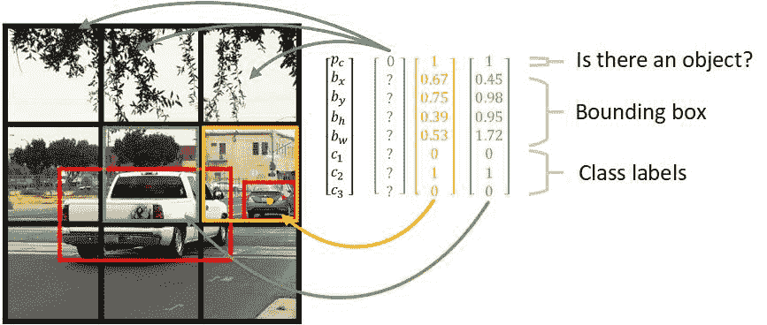

注意，对于那些没有检测到对象的网格单元，它是 p[c] = 0，我们不关心其余的其他值。那是什么"？"图中的意思是。

和边界框参数的定义定义如下:

*   b[x]:**x**坐标，对象的中心对应于**网格单元的左上角，取值范围从 0~1，**
***   b[y]:**y**坐标，对象的中心对应于**网格单元的左上角，取值范围从 0~1，*****   b[h]:**边框的高度** ，该值可能大于 1，*   b[w]:**边框的宽度** ，该值可以大于 1。****

 ****对于类别标签，我们检测 3 种类型的目标，

1.  行人
2.  汽车
3.  摩托车

与“汽车”同属第二类，所以 c[2] = 1，其他类= 0。

在现实中，我们可能会探测到 80 种不同类型的目标。因此，每个网格单元输出 **y** 将有 5 + 80 = 85 个标签，而不是这里显示的 8 个。

考虑到这一点，组合所有网格单元的目标输出具有 3 x 3 x 8 的大小。

但是只有网格单元是有限制的。

假设我们在同一个网格单元中有多个对象。例如，有一个人站在一辆汽车前面，他们的边界框中心非常接近。我们选人还是选车？

为了解决这个问题，我们先介绍一下 **的概念，锚盒** 。

### 锚箱

锚定框使得 YOLO 算法能够检测位于一个网格单元中心的多个对象。

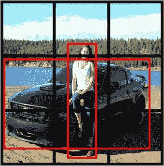

注意，在上图中，汽车和行人都位于中间网格单元的中心。

锚框的概念通过预定义多个锚框，为输出标签增加了一个“维度”。所以我们可以给每个定位框分配一个对象。为了便于说明，我们将选择两种形状的两个锚盒。

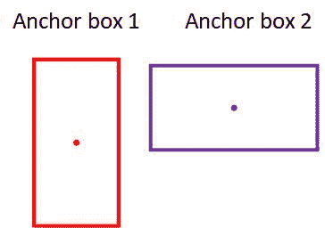

每个网格单元现在有两个锚定框，每个锚定框就像一个容器。这意味着现在每个网格单元可以预测多达 2 个对象。

但是为什么要选择两个不同形状的锚盒呢——这真的重要吗？直觉是，当我们决定将哪个对象放在哪个锚定框中时，我们会查看它们的形状，注意一个对象的边界框形状与锚定框的形状有多相似。对于上面的例子，该人将与高锚箱相关联，因为他们的形状更相似。

因此，一个网格单元的输出将被扩展以包含两个锚定框的信息。

例如，上图中的中心网格单元现在总共有 8 x 2 个输出标签，如下所示。

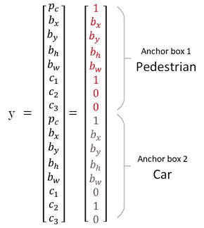

选择各种锚盒形状的另一个原因是为了让模型更好地专门化。一些输出将被训练以检测宽的物体，如汽车，另一个输出被训练以检测高且瘦的物体，如行人，等等。

为了对 **【形似】** 的直觉有更正式的理解，我们需要了解它是如何被评价的。这就是 Union 上的交集 **—** 发挥作用的地方。

### 并集上的交集


在并集上求交的概念非常简单。它经常被用来作为一个评估指标，以衡量一个对象定位器的准确性。

但是实施可能会有点伤脑筋。所以让我们通过一个简单的借据实现来详细了解一下。

不要用它的中心点、宽度和高度来定义一个盒子，让我们用它的两个角(左上角和右下角)来定义它:(x1，y1，x2，y2)

为了计算两个盒子的交集，我们从寻找交集区域的两个角开始。想法是这样的:

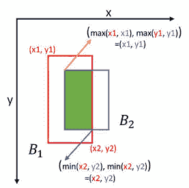

然后，为了计算交叉点的面积，我们用它的高度乘以它的宽度。

为了得到两个盒子的并集，我们使用下面的等式:

```py
union_area = box1_area + box2_area - intersection_area
```

这里有一个计算 IoU 的函数:

交集大于并集( IoU )的用处不仅仅局限于我们在准备训练数据集时分配锚盒。在预测过程中也很重要。让我们来看看物体定位任务中流行的非最大值抑制算法。

### 非最大抑制

非最大值抑制是一种常用的算法，用于在为同一对象预测多个框时进行清理。

在我们之前的例子中，我们使用 3×3 的边界框。实际上，19×19 的边界框用于实现更精确的预测。因此，更有可能为同一个对象预测多个框。

在下面的例子中，模型输出了位于中间的卡车的三个预测值。有三个边界框，但我们只需要一个。预测的边界框越厚，预测就越有把握——这意味着 p[c] 值越高。

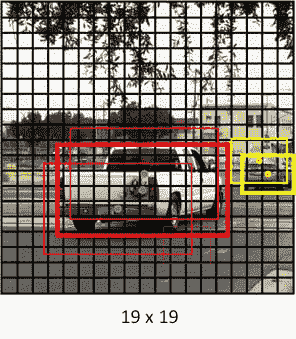

我们的目标是移除主要预测框周围的那些“阴影”框。

这就是非最大抑制在 3 个步骤中的作用:

1.  丢弃 p[c] 小于或等于 0.6 的所有盒子。
2.  挑选 p[c] 输出最大的盒子作为预测。
3.  丢弃任何剩余的 IoU 大于或等于 0.5 的盒子。

最后，清理后的预测如下:

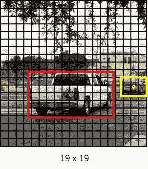

### 训练 YOLO 模型

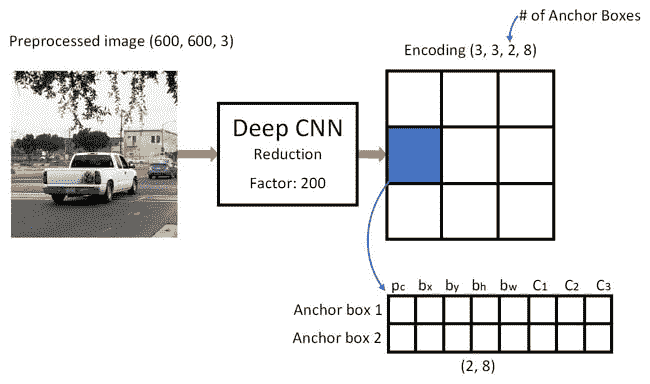

YOLO 模型现在应该准备好用大量图像和大量标记输出进行训练了。像 [COCO 数据集](http://cocodataset.org/#overview) 。但是你不会想这么做的，因为有一个预先训练好的模型等着我们去玩！

在我们进入有趣的部分之前，让我们看看 YOLO 模型是如何做出预测的。

### 用 YOLO 模型预测

给定一幅图像，YOLO 模型将生成形状(3，3，2，8)的输出矩阵。这意味着每个网格单元将有两个预测，即使是那些内部没有任何对象的网格单元。

在应用非最大值抑制来清理预测之前，还有另一个步骤，即通过 **利用“类分数”** 的阈值进行过滤来减少最终输出框。

类分数是通过将 p[c] 乘以单个类的输出(C[1] ，C[2]，C[3])来计算的。

这是说明预测过程的图表。注意，在“按类分数过滤”之前，每个网格单元有 2 个预测的边界框。

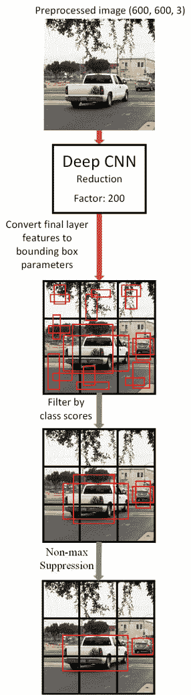

## Keras + TensorFlow Implementation

记住前面的概念，你会对阅读 YOLO 模型代码充满信心。

完整的源代码可以在我的 [GitHub repo](https://github.com/Tony607/YOLO_Object_Localization_Keras) 中找到。我们来看看一些值得一提的部分。

### tensorflow 非最大抑制

代替实现我们自己的 IoU 和非 max 抑制，TensorFlow 有 其 `tf.image.non_max_suppression()` 准备使用。

等等，我们用的是 Keras 模型吗？

不要担心。 这次我们使用的是 Keras 后端 API，它允许你编写的 Keras 模块兼容 TensorFlow API， 所以所有 TensorFlow 操作符都由我们支配。

非 max 抑制的 TensorFlow+Keras 实现可以是这样的。注意我们在这里使用了一个 Keras 变量和一个 TensorFlow 操作符。

函数的输入输出大多是输入输出张量。输出张量可以成为另一个类似函数的输入， **流向管道的下游** 。你猜怎么着？TensorFlow 的名字就是由此而来。

下面是构建预测计算图的代码:

然后，我们可以运行 TensorFlow 会话来计算输出，并最终在图像上绘制预测的边界框。

这是我不久前拍摄的一张照片生成的输出:

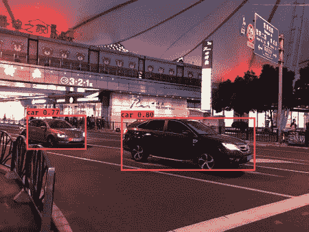

## 总结和进一步阅读

在这篇文章中，我们介绍了一些关键概念，这些概念使得 YOLO 目标定位算法能够快速准确地工作。然后，我们介绍了 Keras+TensorFlow 中 YOLO 输出管道实现的一些亮点。

在结束之前，我想提出 YOLO 算法的两个局限性。

*   由于每个网格单元的锚盒有限，YOLO 在探测像一群鸟或一群人这样的小物体时会遇到困难。
*   模型输出被训练以识别不同的锚形盒子形状的 T2 物体。具有奇怪长宽比的物体很难被探测到，比如一根长鱼竿。

[【YOLO】:实时物体检测](https://pjreddie.com/darknet/yolo/) 。本页包含一个可下载的预训练 YOLO 模型重量文件。我还将在我的 GitHub repo 中包含如何使用它的说明。

艾伦·泽伦纳- [亚德 2K:又一个暗网 2 克拉斯](https://github.com/allanzelener/YAD2K) 。Keras+TensorFlow 的实现很大程度上是受这个回购的启发。

还有其他有竞争力的目标定位算法，如 fast-CNN 和 SSD。正如本帖中所解释的，它们共享一些关键概念。请继续关注另一篇文章，并排比较这些算法。

*   标签:
*   [深度学习](/blog/tag/deep-learning/)，
*   [keras](/blog/tag/keras/) ,
*   [教程](/blog/tag/tutorial/)

[Share on Twitter](https://twitter.com/intent/tweet?url=https%3A//www.dlology.com/blog/gentle-guide-on-how-yolo-object-localization-works-with-keras-part-2/&text=Gentle%20guide%20on%20how%20YOLO%20Object%20Localization%20works%20with%20Keras%20%28Part%202%29) [Share on Facebook](https://www.facebook.com/sharer/sharer.php?u=https://www.dlology.com/blog/gentle-guide-on-how-yolo-object-localization-works-with-keras-part-2/)

*   [←设置 Keras 深度学习框架和构建旅游推荐引擎的温和指南(第二部分)](/blog/gentle-guide-to-setup-keras-deep-learning-framework-and-build-a-travel-recommendation-engine-part-2/)
*   [如何为 Keras 分类器生成 ROC 图的简单指南→](/blog/simple-guide-on-how-to-generate-roc-plot-for-keras-classifier/)****