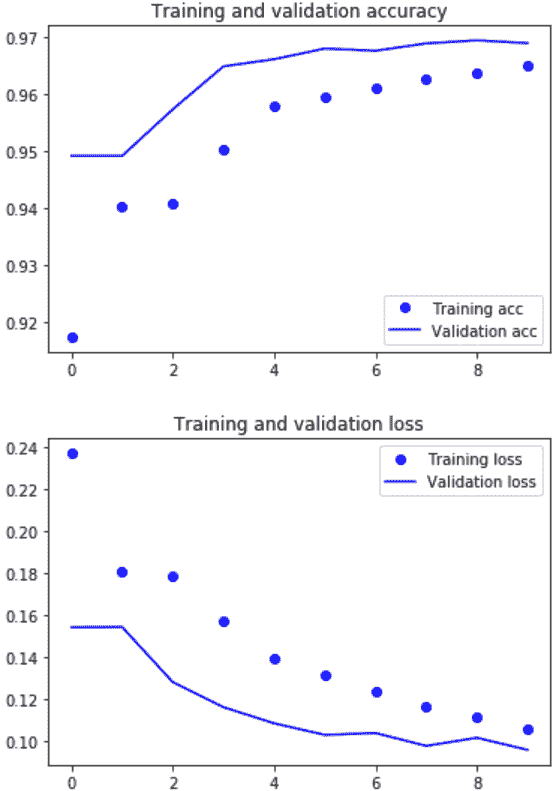

# 新闻类别如何做多类多标签分类

> 原文：<https://www.dlology.com/blog/how-to-do-multi-class-multi-label-classification-for-news-categories/>

###### 发布者:[程维](/blog/author/Chengwei/)五年零一个月前

([评论](/blog/how-to-do-multi-class-multi-label-classification-for-news-categories/#disqus_thread))


我的[上一篇](https://www.dlology.com/blog/how-to-choose-last-layer-activation-and-loss-function/)展示了如何为不同的任务选择最后一层激活和损失函数。本帖我们重点关注多类多标签分类。

## 任务概述

我们将使用[路透社-21578](https://archive.ics.uci.edu/ml/machine-learning-databases/reuters21578-mld/) 新闻数据集。对于给定的新闻，我们的任务是给它一个或多个标签。数据集分为五个主要类别:

*   主题
*   地方
*   人
*   组织
*   交换

例如，一个给定的新闻可能有属于两个类别的 3 个标签

*   地点:**美国**，**中国**
*   主题:**贸易**

## 代码的结构

*   ### Prepare documents and categories

    1.  读取类别文件，从这 5 个类别中获取所有可用的 672 个标签。
    2.  阅读所有的新闻文件，并找出我们将用于分类的 672 个标签中最常见的 20 个。这是这 20 个标签的列表。为了清楚起见，每一个都以其类别为前缀。例如**“pl _ USA”**表示标签**“地点:美国”**，“T4”【to _ trade】是**“主题:贸易”**等。类型 新闻专线 地方 六百零一地方 主题 第八百零一章 主题 主题 地方 主题 至 _ 兴趣 主题 地方 地方 主题 主题 地方 主题 地方

        | 名字 |
        | --- |
        | 第六百一十九章 | pl _ 美国 | 一万二千五百四十二 |
        | 三十五 | 挣钱 | 主题 | 三千九百八十七 |
        | 零 | 至 _acq | 主题 | 二千四百四十八 |
        | 十六 | pl_uk | 地方 | 一千四百八十九 |
        | 五百四十二 | pl _ 日本 | 地方 | 一千一百三十八 |
        | 四百八十九 | pl _ 加拿大 | 第一千一百零四章 |
        | 第七十三章 | 来 _ 钱-外汇 |
        | 二十八 | 来 _ 原油 | 第六百三十四 |
        | 第四十五 | 去谷物 | 第六百二十八章 |
        | 第六百二十五章 | pl _ 西德 | 第五百六十七章 |
        | 第一百二十六章 | 到 _ 贸易 | 五百五十二 |
        | 五十五 | 第五百一十三章 |
        | 第五百一十四章 | pl _ 法国(法国) | 第四百六十九章 |
        | 第四百一十二章 | 或者 _ec | 组织 | 第三百四十九 |
        | 第四百八十一 | pl _ 巴西 | 三百三十二 |
        | 一百三十 | 小麦 | 三百零六 |
        | 一百零八 | 收货方 | 三百零五 |
        | 四百六十八 | pl _ 澳大利亚 | 两百七十 |
        | 十九 | 去玉米 | 第二百五十四 |
        | 第四百九十五 | 波兰 | 第二百二十三章 |

*   ### Clean up the data of the model

在前面的步骤中，我们读取新闻内容并存储在一个列表中

一则新闻是这样的

```py
average yen cd rates fall in latest week
    tokyo, feb 27 - average interest rates on yen certificates
of deposit, cd, fell to 4.27 pct in the week ended february 25
from 4.32 pct the previous week, the bank of japan said.
    new rates (previous in brackets), were -
    average cd rates all banks 4.27 pct (4.32)
    money market certificate, mmc, ceiling rates for the week
starting from march 2          3.52 pct (3.57)
    average cd rates of city, trust and long-term banks
    less than 60 days          4.33 pct (4.32)
    60-90 days                 4.13 pct (4.37)
    average cd rates of city, trust and long-term banks
    90-120 days             4.35 pct (4.30)
    120-150 days            4.38 pct (4.29)
    150-180 days            unquoted (unquoted)
    180-270 days            3.67 pct (unquoted)
    over 270 days           4.01 pct (unquoted)
    average yen bankers' acceptance rates of city, trust and
long-term banks
    30 to less than 60 days unquoted (4.13)
    60-90 days              unquoted (unquoted)
    90-120 days             unquoted (unquoted)
 reuter
```

我们开始清理工作

*   只接受 A-Za-z0-9 中的字符
*   删除停用词(如“in”、“on”、“from”等实际上不包含任何特殊信息的词)
*   词汇化(例如，将单词“rates”变成“rate”)

在这之后，我们的新闻将会看起来更加“友好”,每个单词都用空格隔开。

```py
average yen cd rate fall latest week tokyo feb 27 average interest rate yen certificatesof deposit cd fell 427 pct week ended february 25from 432 pct previous week bank japan said new rate previous bracket average cd rate bank 427 pct 432 money market certificate mmc ceiling rate weekstarting march 2 352 pct 357 average cd rate city trust longterm bank le 60 day 433 pct 432 6090 day 413 pct 437 average cd rate city trust longterm bank 90120 day 435 pct 430 120150 day 438 pct 429 150180 day unquoted unquoted 180270 day 367 pct unquoted 270 day 401 pct unquoted average yen banker acceptance rate city trust andlongterm bank 30 le 60 day unquoted 413 6090 day unquoted unquoted 90120 day unquoted unquoted reuter
```

因为即使在清理之后，一小部分新闻仍然很长，让我们将最大输入序列限制为 88 个单词，这将覆盖 70%的完整长度的新闻。我们可以设置更大的输入序列限制来覆盖更多的新闻，但这也将增加模型训练时间。

最后，我们将把单词转换成 id 的形式，如果它更短，就把序列填充到输入限制(88)中。

Keras 文本处理使这变得微不足道。

同样的新闻会是这样的，每个数字代表词汇表中唯一的一个词。

```py
array([ 6943,     5,  5525,   177,    22,   699, 13146,  1620,    32,
       35130,     7,   130,  6482,     5,  8473,   301,  1764,    32,
         364,   458,   794,    11,   442,   546,   131,  7180,     5,
        5525, 18247,   131,  7451,     5,  8088,   301,  1764,    32,
         364,   458,   794,    11, 21414,   131,  7452,     5,  4009,
       35131,   131,  4864,     5,  6712, 35132,   131,  3530,  3530,
       26347,   131,  5526,     5,  3530,  2965,   131,  7181,     5,
        3530,   301,   149,   312,  1922,    32,   364,   458,  9332,
          11,    76,   442,   546,   131,  3530,  7451, 18247,   131,
        3530,  3530, 21414,   131,  3530,  3530,     3])
```

*   ### Create and train a model

*   嵌入层嵌入大小为 256 的向量序列
*   处理序列数据的 GRU 层(递归网络)
*   密集层输出 20 个类别的分类结果

*   ### Visualize training performance

在大约 5 分钟内对我们的模型进行 10 个时期的训练后，我们获得了以下结果。

```py
loss: 0.1062 - acc: 0.9650 - val_loss: 0.0961 - val_acc: 0.9690
```

下面的代码将生成一个漂亮的图形来可视化每个训练时期的进度。



*   ### Make a prediction

将一个清理过的新闻(每个单词由空格分隔)放入同一个输入标记器，将其转换为 ids。

调用模型**预测**方法，输出将是 20 个浮点数的列表，表示这 20 个标签的概率。为了演示的目的，让我们取任何概率大于 0.2 的标签。

这产生了三个标签

```py
pl_uk
pl_japan
to_money-fx
```

事实是

```py
pl_japan
to_money-fx
to_interest
```

对于给定的新闻，模型得到了 3 分之 2 的正确答案。

## 总结

我们从清理模型输入的原始新闻数据开始。构建了一个 Keras 模型做多类多标签分类。将训练结果可视化并进行预测。还可以做进一步的改进

*   更好地清理数据
*   使用更长的输入序列限制
*   更多训练时期

如果你感兴趣，可以在我的 GitHubrepo 上找到 jupyter 笔记本的源代码。

*   标签:
*   [情感分析](/blog/tag/sentiment-analysis/)

[Share on Twitter](https://twitter.com/intent/tweet?url=https%3A//www.dlology.com/blog/how-to-do-multi-class-multi-label-classification-for-news-categories/&text=How%20to%20do%20multi-class%20multi-label%20classification%20for%20news%20categories) [Share on Facebook](https://www.facebook.com/sharer/sharer.php?u=https://www.dlology.com/blog/how-to-do-multi-class-multi-label-classification-for-news-categories/)

*   [←如何选择最后一层激活和丢失功能](/blog/how-to-choose-last-layer-activation-and-loss-function/)
*   [使用 Keras 模型构建新张量流数据集和估算器的简单指南→](/blog/an-easy-guide-to-build-new-tensorflow-datasets-and-estimator-with-keras-model/)