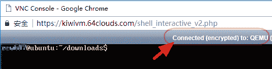
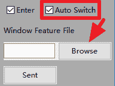

# 如何将内容“粘贴”到不支持复制和粘贴的 VNC 控制台

> 原文：<https://www.dlology.com/blog/how-to-paste-content-to-a-vnc-console-which-does-not-support-copy-and-paste/>

###### 发布者:[程维](/blog/author/Chengwei/)五年零一个月前

([评论](/blog/how-to-paste-content-to-a-vnc-console-which-does-not-support-copy-and-paste/#disqus_thread))


在本教程中，我们将构建一个自动输入的 python GUI。

我最初的用例是使用 noVNC/QEMU 终端的服务器设置，其中复制粘贴不可用。点击这里查看 YouTube 视频。

## 它是如何工作的

随着  **自动开关** 功能开启。你在底部的文本框中输入一些内容，然后点击发送按钮。

*   它通过提供的图像功能直观地定位 VNC 浏览器窗口坐标
*   在图像特征中间点击鼠标左键，切换到 VNC 窗口
*   它将你的文本输入 VNC 窗口。
*   它将鼠标光标改回到原来的位置

## 快速启动

### 安装依赖项

该应用程序依赖于两个库

**pyautogui** 用于模拟键盘和鼠标以及在屏幕上直观定位窗口

**wx** 是 Python 前端用户界面库。

我们用 [Python 3](https://www.python.org/downloads/) pip3 命令安装它们。

```py
pip3 install pyautogui wx
```

### 获取代码

从我的 [GitHub](https://github.com/Tony607/TypeApp) 中克隆或下载源代码。

### 运行 GUI

一旦安装了依赖项并下载了源代码。在 TypeApp 文件夹中打开一个终端窗口，然后键入。

```py
python3 type_app.py
```

我们首先需要的是我们将要输入的 VNC 窗口的图像特征。让我们捕捉它的一个截图，并保存为一个 png 文件。该工具稍后将在您的屏幕上定位该图像，并单击鼠标为您切换到该窗口。

这是我的浏览器 VNC 窗口的截图。


从该窗口捕获的



在应用程序中您可以通过点击 **浏览** 按钮来选择您的图像，同时一定要选中 **自动切换** 复选框。



在我们尝试在“输入”文本框中键入内容之前，请确保 VNC 浏览器窗口在主屏幕上可见(如果您使用多台显示器)。

## 源代码的亮点

*   wx 事件类型和“键入”线程
*   pyautogui 功能，神奇的事情发生了

### wx 事件类型和“键入”线程

为了保持我们的 GUI 响应性，我们应该避免在主 GUI 线程中运行任何计算密集型或者任何花费相当长时间的动作。

在我们的例子中，需要一段时间才能完成的动作是输入动作。我们将在与 GUI 线程并行的另一个线程中执行它。但是第二个打字线程如何在打字完成或失败时通知 GUI 线程呢？这就是 wx 事件类型发挥作用的地方。

首先，我们创建一个 NewEventType 的实例，它将用于创建一个事件对象。

自定义事件类 TypingEvent 将用于将事件从类型化线程发送到主 GUI 线程。

定义我们将在其中运行我们的类型代码的类型线程。在 **run** 方法结束时，线程将生成一个事件来告诉 GUI 输入已经完成。

当点击“发送”时，从 GUI 线程启动线程。

在通过“绑定”一个“监听器”来监听事件的 GUI 线程中，每次 **TypingThread** 发布事件时，GUI 线程都会调用 **on_type_over** 。

### pyautogui 功能，神奇的事情发生了

**pyautogui.position** 读取当前鼠标在屏幕上的位置。

**pyautogui . locate center screen**将我们的截图图像作为参数，并返回图像在屏幕上的坐标

**pyautogui.click** 顾名思义，在上一步找到的坐标上点击鼠标左键

**pyautogui . typeet**键入文本

**pyautogui.moveTo** 将鼠标移回原来的位置。

[Share on Twitter](https://twitter.com/intent/tweet?url=https%3A//www.dlology.com/blog/how-to-paste-content-to-a-vnc-console-which-does-not-support-copy-and-paste/&text=How%20to%20%22paste%22%20content%20to%20a%20VNC%20console%20which%20does%20not%20support%20copy%20and%20paste) [Share on Facebook](https://www.facebook.com/sharer/sharer.php?u=https://www.dlology.com/blog/how-to-paste-content-to-a-vnc-console-which-does-not-support-copy-and-paste/)

*   [←一个改进马达声学分类器的简单技巧](/blog/one-simple-trick-to-improve-the-motor-acoustic-classifier/)
*   [如何选择最后一层激活和丢失功能→](/blog/how-to-choose-last-layer-activation-and-loss-function/)