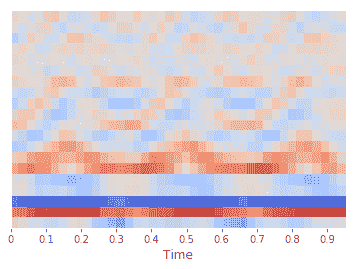
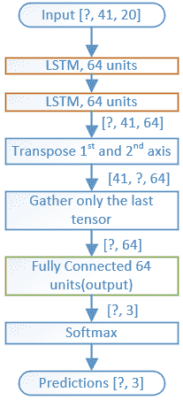

# 改进马达声学分类器的一个简单技巧

> 原文：<https://www.dlology.com/blog/one-simple-trick-to-improve-the-motor-acoustic-classifier/>

###### 发布者:[程维](/blog/author/Chengwei/) 5 年 2 个月前

([评论](/blog/one-simple-trick-to-improve-the-motor-acoustic-classifier/#disqus_thread))


在我们之前的[帖子](https://www.dlology.com/blog/try-this-model-to-quickly-tell-if-it-is-a-faulty-motor-by-listening/)中，我们制作了一个模型，通过音频记录数据预测电机是否有故障。我们将音频时间序列数据输入到模型中，获得了 0.9839 的测试精度。在这篇文章中，我们将发现如何从时间序列数据中提取特征来填充模型。使用我们的测试 WAV 文件，最终的预测准确率提高到了 100%。

## 介绍 MFCC

梅尔频率倒谱(MFC)是声音的短期功率谱的表示，梅尔频率倒谱系数(MFCC)是共同构成 MFC 的系数， [MFC wiki](https://en.wikipedia.org/wiki/Mel-frequency_cepstrum) 。

理论够了，我们来直观的看一下。

为了从我们的音频数据中提取 MFCC 特征，我们将使用 Python [librosa](https://librosa.github.io/librosa/) 库。

首先，用 pip 安装它

```py
pip install librosa
```

我们将使用一个警报器声音 WAV 文件进行演示。从 Github [这里](https://raw.githubusercontent.com/Tony607/Acoustic_Diagnosis/master/data/siren_mfcc_demo.wav)下载 **siren_mfcc_demo.wav** 放到你的目录下

在 Python 控制台/笔记本中，让我们先导入我们需要的东西

然后让我们提取 MFCC 特征

**feature_normalize** 函数与上次 [post](https://www.dlology.com/blog/try-this-model-to-quickly-tell-if-it-is-a-faulty-motor-by-listening/) 相同，将音频时间序列归一化到 0 左右，标准差为 1。

*   帧:41，一帧包括 512 个样本
*   跳跃长度:512，连续帧之间的样本数
*   window_size: 512 * (41-1) = 20480。计算 MFCCs 特性的总样本数。给定采样率 22kHz，总时间约 1 秒。

让我们来看一下 MFCC 特征，它是一个形状为(带、帧)的 numpy 数组，在本例中为(20，41)



这是 siren WAV 文件第一秒的 **MFCC** 特征。X 轴是时间，它被分成 41 帧，Y 轴是 20 个波段。你注意到图表中的模式了吗？稍后我们将教我们的模型也看到这种模式。

## 建立我们的新模型

由于模型输入更改为，模型结构将与之前的帖子不同

MFCC 的特色。



注意一个模型输入形状与一个 MFCC 特征转置形状(帧，带)匹配，即(41，20)。由于 RNN 模型需要时间主输入，因此 Mfcc 功能被调换。

关于完整的源代码，请查看我更新的 GitHub。如果您有任何问题，请随时发表评论。

[Share on Twitter](https://twitter.com/intent/tweet?url=https%3A//www.dlology.com/blog/one-simple-trick-to-improve-the-motor-acoustic-classifier/&text=One%20simple%20trick%20to%20improve%20the%20motor%20acoustic%20classifier) [Share on Facebook](https://www.facebook.com/sharer/sharer.php?u=https://www.dlology.com/blog/one-simple-trick-to-improve-the-motor-acoustic-classifier/)

*   [←如何用 Tensorflow 总结亚马逊评论](/blog/tutorial-summarizing-text-with-amazon-reviews/)
*   [如何将内容“粘贴”到不支持复制粘贴的 VNC 控制台→](/blog/how-to-paste-content-to-a-vnc-console-which-does-not-support-copy-and-paste/)