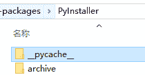

# [解决方案]py installer unicode decode 错误:“utf-8”编解码器无法解码字节

> 原文：<https://www.dlology.com/blog/solution-pyinstaller-unicodedecodeerror-utf-8-codec-cant-decode-byte/>

###### 发布者:[程维](/blog/author/Chengwei/) 5 年 3 个月前

([评论](/blog/solution-pyinstaller-unicodedecodeerror-utf-8-codec-cant-decode-byte/#disqus_thread))

[解决方案]py installer unicode decode 错误:“utf-8”编解码器无法解码字节

## **问题描述**

scipy 版本:0.19.1

操作系统:Windows

Python 3.5

pyInstaller 版本:3.2.1

要重现该问题，请创建一个 python 文件

**scipy _ test . py**

在同一个目录中运行命令

`pyinstaller --onefile -c -a -y --clean **scipy_test.py** --debug > output.txt`

它会产生这个错误

```py

...
return exec_command(*cmdargs, **kwargs)
File "c:\users\hasee\appdata\local\programs\python\python35\lib\site-packages\PyInstaller\compat.py", line 356, in exec_command
out = out.decode(encoding)
UnicodeDecodeError: 'utf-8' codec can't decode byte 0xce in position 151: invalid continuation byte
```

## **解决方案**

在我的例子中，导航到 PyInstaller 目录

c:\ Users \**hasee**\ AppData \ Local \ Programs \ Python \ Python 35 \ Lib \ site-packages \ py installer



首先移除 __pycache__ 文件夹，它包含一些我们要修改的预编译 python 文件

将第 356 行**python 35 \ lib \ site-packages \ py installer \ compat . py**改成这个处理异常的。

运行 pyInstaller 命令，它应该工作了！

[Share on Twitter](https://twitter.com/intent/tweet?url=https%3A//www.dlology.com/blog/solution-pyinstaller-unicodedecodeerror-utf-8-codec-cant-decode-byte/&text=%5BSolution%5D%20Pyinstaller%20UnicodeDecodeError%3A%20%27utf-8%27%20codec%20can%27t%20decode%20byte) [Share on Facebook](https://www.facebook.com/sharer/sharer.php?u=https://www.dlology.com/blog/solution-pyinstaller-unicodedecodeerror-utf-8-codec-cant-decode-byte/)

*   [利用酒店点评数据进行中文情感分析的简易指南→](/blog/tutorial-chinese-sentiment-analysis-with-hotel-review-data/)