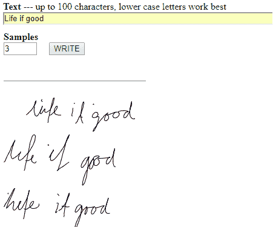

# 在浏览器上运行的 10 大深度学习体验

> 原文：<https://www.dlology.com/blog/top-10-deep-learning-experiences-run-on-your-browser/>

###### 发帖人:[程维](/blog/author/Chengwei/) 5 年前

([评论](/blog/top-10-deep-learning-experiences-run-on-your-browser/#disqus_thread))

今天没有编码教程。只是分享我最近发现的运行在浏览器上的 10 大深度学习体验。

享受旅程，不需要编码经验。

# 图像相关

## 1 [快速绘制](https://quickdraw.withgoogle.com/)

一个游戏，你被要求画一个东西，比如一个甜甜圈，然后让神经网络猜你在画什么。我第一次尝试就答对了 6 个中的 4 个。让我们看看你能画得多好。

### 它是如何工作的

在引擎盖下，该模型将你在画布上绘制的笔画序列输入到卷积层和递归网络的组合中。最后，将从 softmax 输出图层中生成类别数字。

这是模型结构的示意图。

你可能想知道这些训练数据是从哪里来的。你猜对了！它收集了来自玩家的 345 个类别的 5000 万幅图画。

## 2 [可示教机器](https://teachablemachine.withgoogle.com/)

来自谷歌的另一个人工智能体验者建立在 [deeplearn.js](https://github.com/PAIR-code/deeplearnjs) 库上。

教会机器识别你的手势并触发事件，无论是声音还是 gif。确保在足够多的样本和不同的角度上进行训练，否则，模型可能会发现很难概括你的手势。

## 3 [石头剪刀布](https://tenso.rs/demos/rock-paper-scissors/)

这种基于 TensorFire 的体验使用 WebGL 在浏览器中运行神经网络，这意味着它是 GPU 加速的。它允许你通过网络摄像头与计算机实时竞争。

## 4 [TensorFire 快速风格转换](https://tenso.rs/demos/fast-neural-style/)

TensorFilre 的另一个演示，GPU 加速风格转移。它拍下你的一张照片，然后把它变成一件令人惊叹的艺术品。

如果您熟悉 Keras 库，您可能已经见过它的样式转换演示，它在训练模型时计算两个损失“内容”和“样式”。生成一幅像样的图像需要很长时间。

虽然这个在你的浏览器上运行不到 10 秒钟，甚至可以播放[视频](https://www.youtube.com/watch?v=xVJwwWQlQ1o)。

## 5 [东西翻译器](https://oxism.com/thing-translator/)

这个演示基于[谷歌云视觉 API](https://cloud.google.com/vision/) ，这意味着浏览器向谷歌服务器发送请求。亲切地喜欢当你使用谷歌图片搜索来搜索相似的图片。

## 6 [RNN 基础笔迹生成](http://www.cs.toronto.edu/~graves/handwriting.cgi)

这个演示使用 LSTM 递归神经网络进行手写合成。[源代码](https://github.com/szcom/rnnlib)可用。

## 7 [Pix2Pix](https://affinelayer.com/pixsrv/)

你画了一只猫，模型会为你生成照片，很可能是一只令人毛骨悚然的猫。

### 它是如何工作的

演示与运行 TensorFlow 模型的后端服务器对话，后端服务器自行运行或转发到由 Google 运行的 Cloud ML 托管的 TensorFlow 服务。

猫模型在 2k 猫照片上训练，并从猫照片自动生成边缘。所以是“边缘”到“照片”。该模型本身使用条件生成对抗网络(cGAN)。

如果您对实现细节感兴趣，请查看原始的[论文](https://arxiv.org/pdf/1611.07004.pdf)，它展示了更多 cGAN 的示例用法，如“从地图到空中”、“从白天到夜晚”等。

# 文本相关

## 8 [天火电子人作家](https://cyborg.tenso.rs/)

另一种浏览器内体验建立在硬件加速 TensorFire 库的基础上，让您自动完成句子，如泰勒斯威夫特、莎士比亚等。

原作者的目标不是让结果“更好”，而是让它“更怪异”。

该模型建立在**rnn-writer**之上，要了解更多，可以阅读作者的[页面](https://www.robinsloan.com/notes/writing-with-the-machine)。

# 音乐相关

## 9 [表演 RNN](https://deeplearnjs.org/demos/performance_rnn/index.html)

欣赏在浏览器中创建的实时钢琴演奏。

这种模型用类似于 MIDI 本身的语言创作音乐，但使用音符开和音符关事件，而不是明确的时间长度。因此，该模型能够产生具有更自然的时序和动态的性能。

# 深度学习游乐场

## 10 [TensorFlow 游乐场](http://playground.tensorflow.org/#activation=tanh&batchSize=10&dataset=circle&regDataset=reg-plane&learningRate=0.03&regularizationRate=0&noise=0&networkShape=4,2&seed=0.30169&showTestData=false&discretize=false&percTrainData=50&x=true&y=true&xTimesY=false&xSquared=false&ySquared=false&co)

在你的浏览器中修补神经网络。通过使用不同的学习率、激活函数等来调整模型。把模型想象成它的训练。

让我们先睹为快神经网络的大脑。

# 你准备好再体验一次了吗？

## +1 [鼓机 AI 实验](https://experiments.withgoogle.com/ai/drum-machine/view/)

又一个谷歌人工智能实验。实验本身可能没有运行任何深度学习模型，这就是为什么它没有被计算在内。但是它太酷了，我忍不住把它放在这里。

它允许你用每天的声音像狗叫和婴儿啼哭来建造你的鼓机。使用 T-SNE 将数据可视化，这意味着相似的声音被分组在一起，使其非常容易挑选。

### 它是如何工作的

首先，将数千个日常声音音频文件收集到一个数组中，并从所有音频样本到音频精灵表创建一个大的 wave 文件。然后生成音频指纹，并把指纹变成 T-SNE 地图。

原来如此。你有什么很酷的深度学习经验想分享吗？请留下评论，让我们继续旅程。

*   标签:
*   [深度学习](/blog/tag/deep-learning/)

[Share on Twitter](https://twitter.com/intent/tweet?url=https%3A//www.dlology.com/blog/top-10-deep-learning-experiences-run-on-your-browser/&text=Top%2010%20Deep%20Learning%20experiences%20run%20on%20your%20Browser) [Share on Facebook](https://www.facebook.com/sharer/sharer.php?u=https://www.dlology.com/blog/top-10-deep-learning-experiences-run-on-your-browser/)

*   [←一个简单的技巧，通过批量标准化更快地训练 Keras 模型](/blog/one-simple-trick-to-train-keras-model-faster-with-batch-normalization/)
*   [如何教人工智能向在线卖家建议产品价格→](/blog/how-to-teach-ai-to-suggest-product-prices-to-online-sellers/)