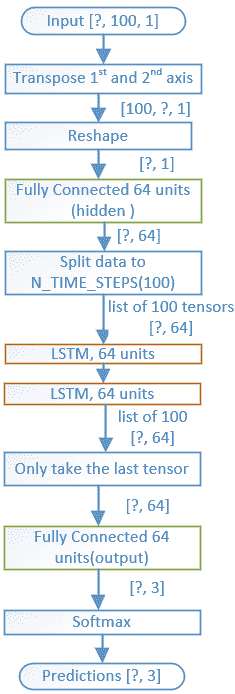
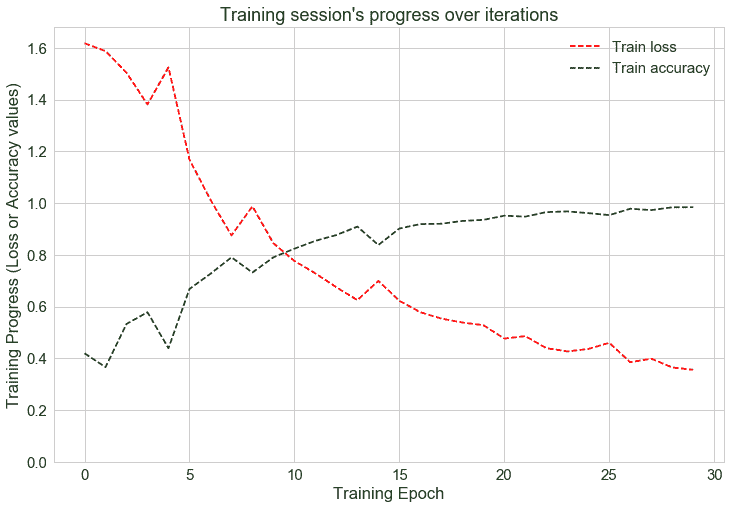
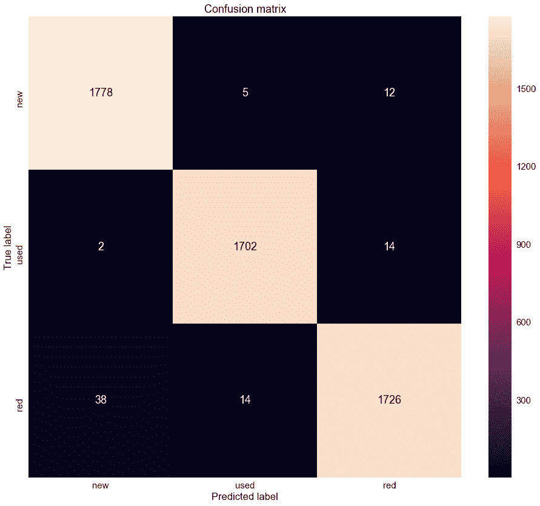

# 如何使用深度学习来诊断电机的健康状况

> 原文：<https://www.dlology.com/blog/try-this-model-to-quickly-tell-if-it-is-a-faulty-motor-by-listening/>

###### 发帖人:[程维](/blog/author/Chengwei/)四年零九个月前

([评论](/blog/try-this-model-to-quickly-tell-if-it-is-a-faulty-motor-by-listening/#disqus_thread))


*TL；博士*

*我们正在构建一个 TensorFlow 模型，以获取电机上的音频记录输入，并预测它是否“健康”。*

## 我们为什么要这么做？

想象一下，在一个类似仓库配送中心的生产环境中，有数百台交流电机日夜驱动传送带和分拣机。比方说，一个关键节点的一台电机发生故障，可能会导致整条生产线停工。一个有经验的维护工程师可以通过听声音来识别故障电机，并在为时已晚之前采取措施予以纠正。

在这个演示中，我们将训练我们的模型成为专家。它可以通过听声音来判断电机是否有故障。

# 关于 WAV 文件

训练数据包含在 2 个位置的 3 种类型的电机上记录的 6 个 WAV 文件。

在实验室环境中用夹在两块磁铁之间的**接触压电圆盘麦克风**进行记录。然后将磁铁安装到交流电机的外壳上。

你可能会奇怪为什么我们不用普通的非接触式麦克风呢？

如果你参观过大型配送中心的车间。你可能会看到有许多电机/致动器因各种原因而运行，有些在移动盒子，有些在盒子上贴标签，有些在打包/拆包。这意味着这是一个非常嘈杂的环境。

使用由**压电盘**制成的接触式麦克风，确保记录的大部分音频信号是由我们连接的马达产生的。类似于医生将听诊器放在你的胸部。

*   电机类型:Baldor SuperE VEUHM3558T 单元搬运电机
*   驱动器类型:VFD
*   VFD 频率:60HZ
*   信号采样率:22050 赫兹
*   信号采样时间:每个 10 秒

### 我们放置麦克风的位置

*   de:电机**驱动端**(驱动轴连接到从动装置的一端)
*   re:电机**后端**(通常是冷却风扇所在的位置)

这里有一个图像来说明这个想法。


### 要分类的电机类型

出于演示目的，让我们将任务简化为将一台电机归类为这三种类型之一。

*   新的:新的发动机，状况良好。
*   用过的:一个电机已经用了一段时间，但还能用。
*   红色:从生产线上捡出的已识别的不良电机。

例如  **用过 _ 60Hz _ re _ 10s _ 22k Hz . wav**的意思是，

*   旧发动机
*   VFD 频率为 60Hz
*   麦克风，连接到马达外壳的后端
*   录制 10 秒钟
*   采样速率为 22 千赫

让我们把任务分成以下几个部分，随意跳到你最感兴趣的部分。

*   准备数据
*   构建模型
*   训练模型
*   用新的 WAV 文件预测电机类型

### 准备数据

#### 读取 WAV 文件

我们用 module **librosa.load()** 函数读取数据，该函数带一个参数 WAV 文件路径，返回一个元组，第一个元素是一个 numpy 数组的音频时间序列，第二个元素是采样率。

#### 规范化数据集

将音频时间序列归一化为 0 左右，标准差为 1。这有助于我们的模型以后学习得更快。

#### 分割数据集

分割音频时间序列。

我们的模型将使用 LSTM 递归层，它期望固定长度的序列作为输入数据。E 每个生成的序列包含 100 个时间步的录音。

### 构建模型

该图说明了模型的结构。

LSTM 层读取输入序列，最后使用全连接层+ softmax 进行预测。



LSTM 层是一种处理音频时间序列数据的递归网络层。

我发现下面这篇文章非常有用，可以让更好地了解 LSTM 是如何运作的。

**[**了解 LSTM**人脉- 科拉的博客](https://colah.github.io/posts/2015-08-Understanding-LSTMs/)**

### 训练模型

训练 30 个周期，最终训练精度达到 0.9843，测试精度达到 0.9839



让我们看看结果的混淆矩阵。它描述了经过训练的分类器的性能。



### 用新的 WAV 文件预测电机类型

在我们预测我们的新记录之前，我们需要将训练好的模型保存到文件中，所以下次我们只需要简单地加载它。

下面是将我们训练好的模型“冻结”到一个文件中的代码

这里是加载“冻结”模型的副本，因此我们可以使用它来做一些预测。

之后，我们将访问加载的**图**的输入和输出节点。

我们的新记录也将是一个 WAV 文件，所以让我们用函数将它转换成我们的模型输入数据。

让我们也有一个助手函数，这样我们可以很容易地调用来做预测

咻，代码真多。让我们用我们的新 WAV 文件来测试一下，这是另一个“新”马达的录音。

```py
predicted, prob = predict_recording(sound_file_full_path)
print("Recording \"{}\" is predicted to be a \"{}\" motor with probability {}".format(sound_file_full_path, predicted, prob))
```

它以概率 0.8227 正确地预测该 WAV 文件是“新”马达的记录，

```py
Sampling rate for file "test_new_60Hz.wav" is: 22050Hz
Recording "./data/test_new_60Hz.wav" is predicted to be a "new" motor with probability 0.8227010881160657
```

### 摘要

我们使用 Tensorflow 建立了一个在 3 种不同类型的电机上记录的 6 个 WAV 文件上训练的模型。该模型可以将新的音频记录分类到正确的电机类型。

数据集非常小，可能只适用于运行在 60Hz 上的这一个电机型号。为了克服这一限制，可以将更多具有各种电机型号以及不同 VFD 频率的数据添加到训练数据集中。

查看我的 [GitHub](https://github.com/Tony607/Acoustic_Diagnosis) 获取源代码。如果您有任何问题或疑虑，请留下您的评论。

[Share on Twitter](https://twitter.com/intent/tweet?url=https%3A//www.dlology.com/blog/try-this-model-to-quickly-tell-if-it-is-a-faulty-motor-by-listening/&text=How%20to%20use%20Deep%20Learning%20to%20diagnose%20health%20of%20a%20Motor) [Share on Facebook](https://www.facebook.com/sharer/sharer.php?u=https://www.dlology.com/blog/try-this-model-to-quickly-tell-if-it-is-a-faulty-motor-by-listening/)

*   [←如何使用 Keras 进行实时触发词检测](/blog/how-to-do-real-time-trigger-word-detection-with-keras/)
*   [YOLO 物体定位如何与 Keras 协同工作的简明指南(第一部分)→](/blog/gentle-guide-on-how-yolo-object-localization-works-with-keras/)