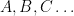
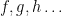

<!--yml
category: 未分类
date: 2024-07-01 18:18:23
-->

# Bananas, Lenses, Envelopes and Barbed Wire A Translation Guide : ezyang’s blog

> 来源：[http://blog.ezyang.com/2010/05/bananas-lenses-envelopes-and-barbed-wire-a-translation-guide/](http://blog.ezyang.com/2010/05/bananas-lenses-envelopes-and-barbed-wire-a-translation-guide/)

One of the papers I've been slowly rereading since summer began is ["Functional Programming with Bananas, Lenses, Envelopes and Barbed Wire"](http://citeseerx.ist.psu.edu/viewdoc/summary?doi=10.1.1.41.125), by Erik Meijer, Maarten Fokkinga and Ross Paterson. If you want to know what {cata,ana,hylo,para}morphisms are, this is the paper to read: section 2 gives a highly readable formulation of these morphisms for the beloved linked list.

Last time, however, my eyes got a little bit glassy when they started discussing algebraic data types, despite having used and defined them in Haskell; part of me felt inundated in a sea of triangles, circles and squiggles, and by the time they reached the laws for the basic combinators, I might as well have said, "It's all math to me!"

A closer reading revealed that, actually, all of these algebraic operators can be written out in plain Haskell, and for someone who has been working with Haskell for a little bit of time, this can provide a smoother (albeit more verbose) reading. Thus, I present this translation guide.

*Type operators.* By convention, types are  on the left and `a, b, c...` on the right. We distinguish these from function operators, though the paper does not and relies on convention to distinguish between the two.

```
 Bifunctor t => t a b
 Functor f => f a
 [a]
 (d, d')
 Either d d'
 Identity
 Const d
 (Functor f, Functor g) => g (f a)
 (Bifunctor t, Functor f, Functor g) => Lift t f g a
 ()

```

(For the pedantic, you need to add `Hask Hask Hask` to the end of all the Bifunctors.)

*Function operators.* By convention, functions are  on the left and `f :: a -> b, g :: a' -> b', h...` on the right (with types unified as appropriate).

```
 bimap f g :: Bifunctor t => t a a' -> t b b'
 fmap f :: Functor f => f a -> f b
 f *** g :: (a, a') -> (b, b')
    where f *** g = \(x, x') -> (f x, g x')
 fst :: (a, b) -> a
 snd :: (a, b) -> b
 f &&& g :: a -> (b, b')        -- a = a'
    where f &&& g = \x -> (f x, g x)
 double :: a -> (a, a)
    where double x = (x, x)
 asum f g :: Either a a' -> Either b b'
    where asum f g (Left x)  = Left (f x)
          asum f g (Right y) = Right (g y)
 Left :: a -> Either a b
 Right :: b -> Either a b
 either f g :: Either a a' -> b        -- b = b'
 extract x :: a
    where extract (Left x) = x
          extract (Right x) = x
 (f --> g) h = g . h . f
    (-->) :: (a' -> a) -> (b -> b') -> (a -> b) -> a' -> b'
 (g <-- f) h = g . h . f
    (<--) :: (b -> b') -> (a' -> a) -> (a -> b) -> a' -> b'
 (g <-*- f) h = g . fmap h . f
    (<-*-) :: Functor f => (f b -> b') -> (a' -> f a) -> (a -> b) -> a' -> b'
 id f :: a -> b
 const id f :: a -> a
 (fmap . fmap) x
 const ()
 fix f

```

Now, let's look at the *abides law*:

Translated into Haskell, this states:

```
either (f &&& g) (h &&& j) = (either f h) &&& (either g j)

```

Which (to me at least) makes more sense: if I want to extract a value from Either, and then run two functions on it and return the tuple of results, I can also split the value into a tuple immediately, and extract from the either "twice" with different functions. (Try running the function manually on a `Left x` and `Right y`.)