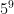

<!--yml

category: 未分类

date: 2024-07-01 18:17:16

-->

# 计算麻将的*shanten* ：ezyang 的博客

> 来源：[`blog.ezyang.com/2014/04/calculating-shanten-in-mahjong/`](http://blog.ezyang.com/2014/04/calculating-shanten-in-mahjong/)

离开一边，扑克牌！虽然各种扑克牌手的概率已经被广泛理解和列出，但是中国的游戏[Mahjong](http://en.wikipedia.org/wiki/Mahjong) [1]拥有更为复杂的预期价值和概率结构。[2]这主要是由于可用的瓷砖种类更多（136 张瓷砖，而不是标准扑克牌组的 52 张），以及逐轮游戏玩法，这意味着虽然本质上是一种游戏的机会，但涉及到了相当多的策略。事实上，这个主题如此复杂，以至于我决定写我的博士论文。本博客文章是我论文的一个章节的精简版本，考虑到*shanten*的计算，我们将在下面定义。我将使用日本术语，因为我最喜欢的麻将变体是日本麻将；您可以查阅[维基百科文章](http://en.wikipedia.org/wiki/Japanese_Mahjong)来翻译。

### 计算*shanten*

麻将的基本玩法包括将一张牌抓入手中的十三张牌，并且再弃掉另一张牌。目标是形成一个十四张牌的手牌（也就是在抓牌后，但弃牌前）这是一个获胜的配置。有许多不同的获胜配置，但大多数获胜配置都有一个类似的模式：十四张牌必须分为四个三张牌和一个对子。三张牌可以是相同的三张牌，或者是一个顺子中的三张牌（有三种“花色”可以用来形成顺子）；对子则是两张相同的牌。以下是一个例子：

从数字上看，这手牌包括三张牌和对子 123 55 234 789 456。

有一个在麻将手牌中计算非常有用的有趣量——*shanten* 数字，即离胜利还有多少张牌。这可以用来给你提供一个最基本的启发式玩法：弃掉能让你更接近听牌的牌。最广为人知的*shanten* 计算器是[天凤网站上的这个](http://tenhou.net/2/) [3]；不幸的是，这个计算器的源代码不可用。还有[另一个关于 StackOverflow 的问题](http://stackoverflow.com/questions/4239028/how-do-i-calculate-the-shanten-number-in-mahjong)，但“最佳”答案只提供了一个启发式方法，没有证明其正确性！我们能做得更好吗？

初级的话，向听数是在手牌排列的广度优先搜索。当找到一个获胜的手牌时，算法终止并指示搜索已达到的深度。这样的算法显然是正确的；不幸的是，对于 136 张牌，你必须遍历 \times 14)^n") 个手牌（新牌的选择乘以弃牌的选择），同时寻找一个相差 n 向听的获胜手牌。如果你差四张牌，你将不得不遍历超过六万亿个手牌。如果我们记忆化与手牌相关的向听数，可以减少这个数字；然而，所有可能手牌的总数大约是  或者 59 位。尽管我们可以将一手牌通过[组合数系统](http://en.wikipedia.org/wiki/Combinatorial_number_system)嵌入到 64 位整数中，但结果表仍然太大，希望能够放入内存。

观察到每种花色的向听计算是对称的技巧；因此，我们可以在 1 到 9 号牌的更小空间上进行动态规划，然后在组装最终计算时重复使用这些结果。  仍然相当大，因此我们可以利用每种牌有四张副本的事实，一个等价的表示是一个 9 维向量，其中的数字是从零到四，有一个约束条件是这些数字的和为 13。即使没有约束条件，计数  也只有两百万，非常可行。每个条目一个字节，这是 2MB 的内存；比你的浏览器用来查看此网页的还少。（实际上，我们希望约束条件是总和小于或等于 13，因为并非所有的手都是单一花色，所以手中的牌数会少一些。）

解决单一花色的广度优先搜索如下进行：

1.  初始化一个由牌配置（一个 0 到 4 的 9 维向量）索引的表 A。

1.  初始化一个待办队列 Q，其中包含牌配置。

1.  将表 A 中所有获胜配置的向听数初始化为零（可以通过枚举完成），并将这些配置记录在 Q 中。

1.  当待办队列 Q 不为空时，弹出队列的前端元素，标记所有相邻未初始化节点的向听数为比该节点多一，然后将这些节点推入待办队列。

拥有这些信息后，我们可以汇总手牌的总实时。只需尝试所有三张牌和四种类型的牌（包括空牌），并查看请求形状的实时，并返回所有这些配置中的最小值。根据[星和条](http://en.wikipedia.org/wiki/Stars_and_bars_(combinatorics))，有个组合，总计 140 个配置。计算每个配置的实时是一个常量时间操作，进入由每套计算生成的查找表。一个真正的实时计算器也必须适应那些不遵循此配置的罕见其他手牌，但这些获胜配置通常非常受限制，并且很容易（单独）计算实时。

带有一种实盘计算器，可以计算出许多其他的数量。*浮法* 是指可以减少您手上的实时的可能抽取的数量：人们努力追求高浮法，因为这意味着您有可能抽到一张可以接近于获胜的牌。给定一手牌，计算其浮法非常简单：只需查看所有相邻的手牌，并计算具有较低实时的手牌的数量。

### 进一步的扩展

假设您正在尝试设计一个可以玩麻将的人工智能。上述实时计算器是否能为您的手提供良好的评估指标？实际上不行：它有一个主要缺点，即它并未考虑到某些牌根本不可用（它们已被丢弃）。例如，如果所有四张“九条”牌都在桌上可见，那么实际上不存在包含九条的手牌配置。调整这种情况实际上非常困难，有两个原因：首先，我们不能再预先计算实时表，因为我们需要在运行时调整可达性指标；其次，各种类型的牌不再对称，因此我们需要做三倍的工作。但我们可以避免指数级的膨胀，因为各套之间没有交互作用。

实时和浮法指标的另一个缺点是它们不是“牌效率”的直接度量：也就是说，它们并不直接指导您在获胜之前最小化预期时间的丢牌策略。例如，假设您有 233 这样的牌，并且只需要再凑成一个三张牌就可以赢了。您有两种可能的丢牌方式：您可以丢弃一个 2 或者一个 3。在两种情况下，您的实时都是零，但是如果丢弃一个 2，您只能通过抽到一个 3 来赢，而如果丢弃一个 3，您可以通过抽到一个 1 或者一个 4 来赢。最大化效率需要考虑您手牌的生命周期浮法。

即便如此，完美的牌效率并不足以取得胜利：每个获胜的手牌都与一定的得分关联，因此在许多情况下，选择一个低概率但预期价值更高的手牌可能更合理。在这里，我们的分解方法完全失效了，因为虽然可以将获胜配置的空间划分，但是计分具有非局部效应，因此整手牌必须作为一个整体来考虑。在这种情况下，可以尝试蒙特卡罗方法，因为直接表征概率空间太困难。然而，在日本麻将的计分系统中，这种方法还面临另一个困难：计分系统是*指数级的*。因此，我们面临这样一种情况：大多数样本的得分较低，但极少数样本具有指数级的回报。在这种情况下，很难说随机抽样是否会真正给出一个好结果，除非抽取指数多的样本。（另一方面，由于这些手牌如此罕见，一个 AI 可能简单地忽略它们而表现得相当好。）

总之，麻将是一款迷人的游戏，其庞大的状态空间使得准确表征涉及的概率变得困难。在我的论文中，我尝试解决其中的一些问题；如果你对此感兴趣，请[查看](http://en.wikipedia.org/wiki/April_Fools'_Day)。

* * *

[1] 不，我不是在谈论那些麻将接龙的荒谬事情。

[2] 明确一点，我并不是说扑克策略简单——下注策略可能是游戏中最有趣的部分之一——我只是说从概率角度来看，基本游戏相对简单。

[3] 天凤是一个流行的日本在线麻将客户端。天凤计算器的输入格式是`123m123p123s123z`，其中`m`之前的数字表示万子，`p`表示筒子，`s`表示索子，`z`表示风牌（顺序依次为：[东、南、西、北、白、发、中](http://tenhou.net/2/?q=1234567z)）。每个条目指示你可以丢弃哪张牌来接近听牌；下一个列表是连切牌的数目（及使手牌进一步完善的牌数）。
