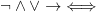
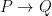
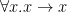
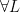
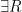
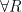
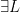

<!--yml
category: 未分类
date: 2024-07-01 18:18:08
-->

# Existential type-curry : ezyang’s blog

> 来源：[http://blog.ezyang.com/2010/10/existential-type-curry/](http://blog.ezyang.com/2010/10/existential-type-curry/)

This post is for those of you have always wondered why we have a `forall` keyword in Haskell but no `exists` keyword. Most of the existing tutorials on the web take a very *operational* viewpoint to what an existential type is, and show that placing the forall in the “right place” results in the correct behavior. I’m going to take a different approach and use the Curry-Howard isomorphism to explain the translation. Some of the logic examples are shamelessly stolen from Aaron Coble’s Logic and Proof lecture notes.

* * *

First, a little logic brush up. (Feel free to skip.)

At the very bottom of the hierarchy of logic systems lies propositional logic. Whenever you write a non-polymorphic function in Haskell, your function definition corresponds to a statement in propositional logic—this is the simply typed lambda calculus. You get some propositional symbols P, Q and R (corresponding to types) and some logical connectives . In particular,  corresponds to the function arrow `->`, so you can read  as the type `P -> Q`.

The next step up is first-order predicate logic, which allows you to use the quantifiers ∀ and ∃ on variables ranging over individuals x, y and z (the predicates take individuals and return propositions). Logical formulas in this system start to look a lot like Haskell polymorphism, but it actually corresponds to dependent types: individuals are terms, not types.

For the purpose of this post, we’ll instead have x, y and z to range over propositions (types), except for two examples of first order logic to get some intuition for quantifiers. Then polymorphic function definitions are statements in what is called propositional second order logic.

Propositional second order logic gives us a bit of rope, and we can do some fairly unintuitive things with it. Existential types are one such application. However, most Haskellers have a pretty good intuition for polymorphic functions like `id :: a -> a`, which actually have an ∀ quantifier at the very beginning, like `id :: forall a. a -> a` or . What I’d like to do next is make the connection between our intuitive sense of polymorphic functions and our intuitive sense of a universal quantifier.

* * *

Consider the following English sentence: *All professors can teach and do research.* We can translate this into a statement in first-order logic (x ranging over individuals):

The intuition for the trick of “narrowing” a universally quantified variable by placing it in an implication corresponds directly to the implicit dictionary passing that occurs when you use a type class (which also narrows a universally quantified variable).

We can do similar translations for the existential quantifier. *Everybody loves somebody* and *there is somebody that everybody loves* correspond to, respectively:

Take a moment to convince yourself that these are not the same statements, and figure out which direction implication goes.

We’ll now jump straight to the implication equivalences, which are the punchline, so to speak. Here, x ranges over propositions (i.e. types).

Consider the first equivalence: intuitively, it states that we can simulate a function that takes an existential type by using `forall x. (A x -> B)`. This is precisely the existential data constructor:

```
data OpaqueBox = forall a. OpaqueBox a

```

which has the type `forall a. (a -> OpaqueBox)`.

The second proposition is a little trickier to grasp: in the right to left direction, it seems clear that if there exists an inference A(x) to B for *some* x, if I provide *all* x I will get B. However, from left to right, if I provide *all* A(x) to get B, one of those A(x) will have to have been used but I have no good way of figuring out which one.

We can rigorously prove this equivalence with [sequent calculus](http://en.wikipedia.org/wiki/Sequent_calculus). We can think of these as “deduction rules” much like modus ponens (if A then B, A; therefore, B). However, statements in the sequent calculus take the form , where Γ is the set of propositions which conjunctively form the assumption, and Δ is the set of propositions which disjunctively form the result. (The  is called a “turnstile” and indicates implication.)

 and , in particular, are quite interesting:  says I can make any assumed proposition “polymorphic” by picking some subterm and replacing all instances of it with a newly universally quantified variable (it’s a stronger assumption, so we’re weakening our entailment). We can indeed do this in Haskell (as one might transform `(Int -> Bool) -> Int -> Bool` into `(a -> b) -> a -> b`), so long as our proof doesn’t peek at the actual type to perform its computation. , on the other hand, says that I can take any resulting proposition and “hide” my work by saying something weaker: instead of A[t], I merely say there exists some x for which A[x] is true. This corresponds nicely to the intuition of an existential type hiding representation. Another nice duality is that universal quantification hides information inside the proof, while existential quantification hides information outside of the proof.

 and  don’t do as much work, but they are a little tricky to use: any universal quantification on the right side of the turnstile can create/destroy a free variable, and any existential quantification on the left side can create/destroy a free variable. Note that  and  cannot be used this way; while they can use existing free variables, they can’t create or destroy them.

Here is the proof in both directions of the equivalence. What we’re trying to prove lives on the bottom; tautologies are at the top.

The proofs are nicely symmetrical: one uses ∀L and ∃L, and the other ∀R and ∃R. The application of the →R “uncurries” each entailment. Furthermore, the fact that both proofs are constructive indicates that there is this equivalence is one that can be witnessed by a Haskell program! You can check out a [Coq version of the proof](http://codepad.org/vr1wO4O3) from kmc.

* * *

*Postscript.* I picked the wrong equivalence initially, but I felt it would be a shame not to share it. Here is the proof for: ![\exists x\ (A[x] \to B) \vdash (\forall x\ A[x]) \to B  ](img/12c48057bf4bd661923e4936d67538ca.png "\exists x\ (A[x] \to B) \vdash (\forall x\ A[x]) \to B  ").

This is done entirely with intuitionistic logic: the other direction requires classical logic. This is left as an exercise for the reader, the [solution is here](http://hpaste.org/40584/x_ax__b__x_ax__b) by monochrom. There is also [a version from kmc in Coq](http://hpaste.org/40585/ezyangs_theorem) in both directions. This result has an interesting implication for existentials over functions: we can translate from an existential to a universal, but not back!