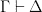
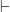

<!--yml

category: 未分类

date: 2024-07-01 18:18:08

-->

# 存在类型 - 柯里的博客

> 来源：[`blog.ezyang.com/2010/10/existential-type-curry/`](http://blog.ezyang.com/2010/10/existential-type-curry/)

这篇文章是给那些一直想知道为什么 Haskell 中有 `forall` 关键字但没有 `exists` 关键字的人。大部分现有的网络教程都非常“操作性”，对存在类型是什么持有一种观点，并且展示将 forall 放在“正确的位置”会得到正确的行为。我将采取一种不同的方法，利用柯里-霍华德同构来解释翻译。其中一些逻辑示例是从 Aaron Coble 的逻辑与证明讲座笔记中无耻地借鉴过来的。

* * *

首先，让我们稍微恢复一下逻辑知识。（如有需要可跳过。）

逻辑系统层次结构的最底层是命题逻辑。每当你在 Haskell 中编写一个非多态函数时，你的函数定义对应于命题逻辑中的一个陈述—这就是简单类型 λ 演算。你会得到一些命题符号 P、Q 和 R（对应于类型），以及一些逻辑连接符 . 特别地， 对应于函数箭头 `->`，因此你可以将  理解为类型 `P -> Q`。

下一个阶段是一阶谓词逻辑，允许你在个体 x、y 和 z 上使用全称量词 ∀ 和 存在量词 ∃（谓词接受个体并返回命题）。在这个系统中的逻辑公式开始看起来很像 Haskell 的多态性，但实际上对应于依赖类型：个体是术语，而不是类型。

在这篇文章中，我们将会让 x、y 和 z 范围在命题（类型）上（除了两个一阶逻辑的例子来获得一些量词的直觉）。然后多态函数的定义是所谓的命题二阶逻辑中的陈述。

命题二阶逻辑给了我们一些自由度，我们可以用它做一些相当直观的事情。存在类型就是其中之一的应用。然而，大多数 Haskeller 对多态函数有一个相当好的直觉，比如 `id :: a -> a`，它实际上在最开始有一个 ∀ 量词，像 `id :: forall a. a -> a` 或者 . 接下来我想要做的是将我们对多态函数的直觉感受与我们对全称量词的直觉感受联系起来。

* * *

考虑以下英语句子：*所有教授都能教书和进行研究。* 我们可以将其翻译为一阶逻辑中的陈述（x 范围在个体上）：

“缩小”普遍量化变量的技巧的直觉是直接对应于使用类型类时发生的隐式字典传递（这也会缩小普遍量化变量）。

我们可以对存在量化器进行类似的转换。*每个人都爱着某人* 和 *有人是每个人都爱* 分别对应于：

请花一些时间说服自己这些不是相同的陈述，并弄清楚蕴含的方向。

现在我们直接跳到蕴含的等价关系，这是重点所在。在这里，x 范围涵盖命题（即类型）。

考虑第一个等价关系：直觉上，它说明我们可以通过使用 `forall x. (A x -> B)` 模拟接受存在类型的函数。这正是存在数据构造函数：

```
data OpaqueBox = forall a. OpaqueBox a

```

它的类型是 `forall a. (a -> OpaqueBox)`。

第二个命题有点难以理解：从右到左的方向上，似乎很明显，如果存在一个推论 A(x) 到 B，那么如果我提供所有的 x，我会得到 B。然而，从左到右，如果我提供所有的 A(x) 来得到 B，那么其中一个 A(x) 必须已经被使用，但我没有好方法找出是哪一个。

我们可以通过[序言演算](http://en.wikipedia.org/wiki/Sequent_calculus)严格证明这种等价性。我们可以将这些看作是“推理规则”，类似于假言推断（如果 A 则 B，A；因此，B）。然而，序言演算中的陈述采用形式 ，其中 Γ 是共同形成假设的命题集合，Δ 是形成结果的命题集合的析取。（ 叫做“推导”，表示蕴含。）

特别是， 和  相当有趣： 表示我可以通过选择某个子项并用新的全称量化变量替换所有实例来使任意假设的命题“多态化”（这是一个更弱的假设，所以我们正在减弱我们的蕴涵）。我们确实可以在 Haskell 中做到这一点（就像将`(Int -> Bool) -> Int -> Bool`转换为`(a -> b) -> a -> b`），只要我们的证明不看实际的类型来执行其计算。 则表示我可以通过说某些更弱的东西来“隐藏”我的工作，而不是 A[t]，我只是说存在一些 x 使得 A[x]为真。这与存在类型隐藏表示的直觉非常对应。另一个很好的对偶是，全称量化将信息隐藏在证明内部，而存在量化则将信息隐藏在证明外部。

 和  的作用不大，但使用起来有些棘手：转换符号右侧的任何全称量化可以创建/销毁自由变量，而在转换符号左侧的任何存在量化可以创建/销毁自由变量。注意， 和  不能以这种方式使用；虽然它们可以使用现有的自由变量，但不能创建或销毁它们。

这是等价性的双向证明。我们试图证明的内容位于底部；顶部是重言式。

证明非常对称：一个使用∀L 和∃L，另一个使用∀R 和∃R。→R 的应用“非柯里化”了每个蕴涵。此外，两个证明都是构造性的表明了这种等价关系可以通过 Haskell 程序见证！你可以查看[kmc 提供的 Coq 版本的证明](http://codepad.org/vr1wO4O3)。

* * *

*后记。* 最初我选择了错误的等价性，但我觉得不分享它会很可惜。这是: \vdash (\forall x\ A[x]) \to B") 的证明。

这是完全通过直觉逻辑完成的：另一方向需要经典逻辑。这留给读者作为练习，[解决方案在这里](http://hpaste.org/40584/x_ax__b__x_ax__b)，由 monochrom 提供。同时也有 [Coq 中的 kmc 版本](http://hpaste.org/40585/ezyangs_theorem) 能够在两个方向上进行。这个结果对于存在于函数上的存在性有一个有趣的含义：我们可以从存在性转换到全称性，但反之则不行！
