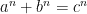

<!--yml

category: 未分类

日期：2024-07-01 18:17:38

-->

# 如何构建可信的数字版权管理系统：ezyang’s 博客

> 来源：[`blog.ezyang.com/2012/02/how-to-build-drm-you-can-trust/`](http://blog.ezyang.com/2012/02/how-to-build-drm-you-can-trust/)

*摘要。* [携带证明的代码](http://en.wikipedia.org/wiki/Proof-carrying_code) 可以用来实现 [数字版权管理方案](http://en.wikipedia.org/wiki/Digital_rights_management)，采用验证证据的 CPU 形式。我们描述了这种方案的工作原理，并认为以这种方式实施的 DRM 既可取又优于[可信（“背叛性”）计算](http://en.wikipedia.org/wiki/Trusted_Computing)方案。这种方案允许用户保留对自己机器的控制，同时允许对软件能力进行特定限制。当 3D 打印机和生物合成机普及时，强加这些限制的能力将变得尤为重要。本文假设读者有一定的技术知识，尽管不需要背景的形式化方法。（如果你知道携带证明的代码如何工作，请离开；这篇文章不适合你。）

~ * ~

众所周知，数字版权管理方案对用户普遍有害。现有的 DRM 方案令人讨厌、适得其反、存在缺陷且基本无效。在实施过程中，它们几乎和间谍软件无异。

我想挑战这种假设。

我对当前数字版权管理技术的状态并不感兴趣。但我确信有更好的方法。我的目标是说服你，基于证明的数字版权管理*可能*是可行的；它有坚实的理论基础，提供了类似于数字版权管理的有用功能子集，并且它以一种避免了许多与现有可信计算平台相关的隐私、安全和信任问题的方式进行。我想描述一下这个系统会是什么样子，以及它的影响会是什么（例如，它确实提供了一些控制，但当然不能解决模拟洞的问题）。不幸的是，这个系统还不存在；形式化方法背后的技术仍在积极研究中，尚未准备好投入市场。

为什么我现在觉得有必要对这种“象牙塔虚构”的东西说话呢？我们目前正处于科里·多克托罗所称的“通用计算之战”中，国会正在考虑像 SOPA/PIPA 这样的法案，而大型软件供应商正在积极推动像[UEFI](http://en.wikipedia.org/wiki/Unified_Extensible_Firmware_Interface)这样的技术标准。我觉得至关重要的是我们说服在数字版权管理中有利益的行业投资于这种形式化方法的研究。目前正在追求的工具，即可信（“背叛性的”）计算，可能会使数字版权管理首次在人类历史上有效实施，但这将以今天我们所知的通用计算为代价。

### 如何构建基于证明的数字版权管理

因为我们无法在不描述系统本身的情况下描述系统的影响，所以首先要做的是描述如何实施基于证明的数字版权管理。这一描述还将为讨论围绕这样一个系统的一些问题设置舞台；主要是，这个系统是否*可能*，以及是否*可取*。

基于证明的数字版权管理（Proof-based DRM）由两个组件组成。第一个组件是证明验证器，它接受一个定理和该定理的证明作为输入，并返回一个是/否答案，即该证明是否正确。（我们将很快详细讨论“定理”和“证明”在这一背景下的确切含义。）第二个组件是一组定理，这些定理描述了运行在硬件上的软件的期望行为（DRM 策略）。这两个组件集成到硬件中，共同作为运行在 CPU 上的程序的守门员。要加载和运行在这个 CPU 上的代码必须首先通过证明验证器芯片；如果证明无误，用户提供的代码可能会直接执行，其遵守某些数字版权策略由逻辑的力量确保。（须知：在本文的其余部分，我们将不考虑信任底层硬件的问题；这是我们文章的不足之处，但它是一个深刻且棘手的问题，也影响着当前使用的 CPU。）

证明验证器是这一系统的核心。它可以被看作是一个“小数学家”：一个审查证明以检查其正确性的人。他配备一组假设和一个目标（“定理”），以及从假设到目标的一系列推导过程（“证明”）。验证器只需为每个目标检查每一步是否逻辑上从前一步推导出来。“P，并且 P 蕴含 Q。因此，Q！” 证明验证器相对来说研究比较充分，并且存在多个实现，其中包括 Coq、HOL Light、Isabelle 和 F*。通常这些是以软件形式编写的，但也有关于适用于嵌入式设备的证明验证器设计的持续研究。

让我们更深入地探讨一下证明验证器的运行方式。证明验证器的第一个输入是待证明的定理。因此，用户在使用证明验证器时的第一个任务是以计算机可以理解的方式陈述定理。期望证明验证器能理解一段英文或某些 LaTeX 公式显然是不合理的！我们所做的是将数理逻辑写成计算机语言，这就是我们写定理的语言。例如，看看[Fermat's Last Theorem](http://en.wikipedia.org/wiki/Fermat%27s_Last_Theorem)的陈述：对于任何三个正整数 *a*, *b*, 和 *c*，不存在整数 *n > 2* 使得 。在 Coq 中，这个陈述可以写成 `forall (x y z:Z) (n:nat), x^(n+3) + y^(n+3) = z^(n+3) -> x <= 0 \/ y <= 0 \/ z <= 0`。直白地说，它表示“对于所有整数 *x*, *y*, *z* （类型为 `Z`），以及所有自然数 *n* （类型为 `nat`），如果  成立，则 *x*, *y* 或 *z* 至少有一个小于或等于零。” 尽管“计算机友好”的版本看起来与非正式版本有所不同（我们取了原命题的逆否命题以避免否定，并使用加三来表达指数必须大于二的事实），但它们基本上是相似的。

不幸的是，用类似精确语言来表达程序“内存安全”的含义（即，它永远不会对无效指针进行解引用）要困难得多。将非正式的陈述转化为正式的陈述是一种艺术，没有“正确”的答案。在这个过程中，你必须权衡不同的需求：陈述应该易于人类理解，但也应该容易在计算机中证明。即使在费马定理的情况下，我们也省略了一些细节：什么是整数或自然数？什么是指数运算？又或者，什么是加法？两个整数相等意味着什么？幸运的是，这些问题有传统的答案；即使在更复杂的属性如“内存安全”的情况下，对于编写这类定理的一般设计原则也有合理的理解。

对于基于证明的数字版权管理（DRM），我们需要将“内存安全”等安全属性扩展到数字版权管理方案中可能需要强制执行的属性。如何展示程序永不泄漏基于硬件的私钥的内容，或者证明程序在法律规定的有限无线电频率集内传输？可能性增加，风险也增加。当我们从明确定义的概念领域移动到更不规则、模糊的领域时，很难确定一个形式化是否符合我们的要求，或者它仅仅是一个带有漏洞的规则集。罪犯可能奉行法律的文字，但不奉行精神。在计算机系统中，没有法官可以做出这种评估。因此，一个合理的问题是是否有任何我们希望形式化的属性。幸运的是，答案是肯定的；我们将在下一节回到这个问题，因为它将影响我们能够实现的 DRM 类型。

证明验证器的第二个输入是一个证明。现在，我们声称一个证明是一个长列表（实际上更像是一棵树，因为一个目标的证明可能需要你证明几个子目标）的逻辑步骤，每一步都可以轻松检查。现在，如果你曾尝试阅读真正的数学证明，你会知道检查证明是否正确永远不是这么简单的事情。数学证明会省略步骤。像作家一样，数学家会为他的观众优化他的证明。如果他们有相关的背景知识，他将省略信息以确保更高层次结构的清晰性。你看，数学家不仅对真理感兴趣，还对为什么是真理感兴趣。但当涉及到计算机的证明时，我们不能如此轻率：作为一个愚蠢的计算机，计算机需要每一步的证明都明确说明。这是机械化检验证明的主要挑战之一：一个人可能为欧几里得算法写出一个三行的证明，但对于计算机来说，你可能会写一页。对于涉及计算机程序的更复杂的定理，一个验证项目很容易被涉及的大量代码所淹没。扩展自动定理证明技术是另一个活跃研究领域，当前技术在抽象层面上与传统编程的汇编语言水平相当。

然而，一旦我们拥有了经过验证的机械化证明，我们就拥有了传统数学家所没有的东西：确保证明是正确的，并且程序具有我们要求的属性。 （相反，发表在论文中的数学证明可能是错误的，有时确实是错误的！尽管更有趣的是，定理最终仍然是真实的。）这是一个很好的情况：根据证明抹除原则，我们可以忽略我们构建的复杂证明并直接执行程序。我们可以直接在我们的硬件上运行程序，而不需要在其下运行任何不受信任的启用了 DRM 的操作系统。稍后，当我们将我们的方案与现有的“叛逆计算”方案进行比较时，我们将回到这个问题。

所以我们在这里讨论了什么？我们通过更仔细地观察证明验证器的两个输入：定理和证明，描述了它的工作原理，并涉及了一些与将这项技术应用于现实世界相关的活跃研究领域。在接下来的两节中，我想更详细地讨论这个系统的两个特定方面，即它们如何与数字版权管理相关联：与数字版权管理相关的定理，以及这种方案与现有的“可信计算”方案之间的关系。

### 什么政策是机器可检查的？

如果有一种方法可以使复制数字视频成为不可能，MPAA 将非常欣赏。但即使是最复杂的技术方案也无法绕过这样一个事实：我可以简单地设置一个录像机，对准我观看电影时的屏幕：这就是所谓的“模拟洞”，是任何复制保护方案的基本限制。基于证明的数字版权管理不能直接用于消除静态材料（如书籍、音乐或电影）的复制。

这是否意味着基于证明的数字版权管理没有任何有用的应用？通过这种方案，我们获得的新能力是能够选择在硬件上运行哪些代码。任何法律后果都严格来说是这种技术实施的副作用。此外，由于通用计算设备随处可见，证明认证的 CPU 对我们来说没有任何好处，除非硬件*本身*提供了额外的东西。可以将证明验证的 CPU 看作是像烤面包机或微波炉这样的专用设备，它们只有在执行非计算任务（如烤面包或加热食物）时才有趣。

但是肯定有很多有趣的硬件外围设备可以派上用场。事实上，现代 CPU 已经具备了一些沿着这些方向发展的专用芯片：**可信平台模块**，一种用于安全存储加密密钥的加密处理器规范，已经存在于大多数现代笔记本电脑中。英特尔的可信执行技术允许指定“帷幕”内存区域，操作系统可能无法访问。这些功能的创建是由可信（“背叛”）计算运动推动的，这些功能可以被用于善恶两用。在基于证据的数字版权管理世界中，我们可以为用户提供更精确的控制，保护这些机密数据，用户只需证明这些代码不会泄漏到模块外部。这是信息流控制分析，允许我们追踪私密数据的流动。（对于比特数较低的秘密数据，例如秘密密钥，需要采取大量措施来缓解定时攻击，这些攻击可以以非明显的方式慢慢泄露数据。）这些私密数据甚至可以是专有代码，例如在使用验证证明 CPU 来辅助软件分发的情况下。这将比当前的软件分发方案更加灵活，当前的方案要么是“云端”（软件即服务），要么是必须由客户物理托管的专有全一体“应用盒子”。

基于证据的数字版权管理的另一个重要应用是审计；例如，对某些事件的保证记录到外部存储。记录存储可能是某种只写设备，并且我们通过证明，每当触发与审计要求相关的事件时，相关的记录调用也将被调用。这对电子投票系统将是一个巨大的福音，这类机器特别容易出现无法追责的问题。

然而，更进一步展望未来，我认为最有趣的硬件外围设备将不会真正是外围设备。相反，关系将被颠倒：我们将看到需要通用计算机能力的专用机械。我们不是乘坐汽车和飞行机：我们是乘坐计算机和飞行计算机。但就像我希望我的汽车不会被黑客攻击或感染计算机病毒一样，我希望汽车计算机的计算能力受到限制。这正是基于证据的数字版权管理所做的：它限制可运行程序的集合。3D 打印机和生物合成机器是其他“外围设备”的例子，我怀疑世界各国政府将对其进行大规模监管。

提出定义涉及设备本质的有用定理更具挑战性：如何定义合法使用的界限，或者试图干扰飞机无线电、创建生物武器或伪造货币的企图？如何在数学上指定“正常工作的汽车软件”，而不是“会导致事故的汽车软件”？关键的洞察力在于，虽然完全概述“成为一台无线电”或“成为一辆汽车”的含义是不可能的，但我们可以创建实用的部分规范。我们可以声明“转向正常工作”，而是声明，“在轮子适当输入的情况下，N 毫秒内会产生适当的机械输出。”我们可以声明“GPS 正常工作”，而是声明，“在 GPS 操作期间，记录车辆当前位置信息不会传输到公共互联网。”

也可以将规范模块化，以便独立系统可以验证操作的极其复杂的方面，并且我们的证明检查器仅验证独立系统是否被调用并执行。这里有两个具体例子：

+   我们可以要求特定参数的特定范围，这些范围可能由法律规定。对于简单参数（如无线电频率），允许的内容可以建立在规范中；更复杂的执行规则可能依赖于黑匣子芯片，这些芯片可以被调用以进行是非答案。重要的是要注意，虽然这种芯片的内部实现对用户不可见，但它们对程序行为的影响有限（仅在我们的程序代码调用时），它们也没有网络访问能力来“回家”。规范可能只规定这些子程序被调用，并且它们的结果（成功或失败）得到适当处理。

+   我们可以要求实施隐写协议来进行水印和防伪措施。这些协议可以依赖于一个对设备制造商未知的身份，但在设备首次使用时不可变地初始化，并且如果原始设备被合法搜查和扣押，可以帮助执法机构，而不侵犯第四修正案权利。验证代码是否符合这样的协议需要明确隐写协议正确的定义，并且证明没有其他输入/输出调用干扰隐写输出。

显然，限制设备上运行的代码的能力具有实际应用。确实，基于证明的数字版权管理（DRM）非常类似于可信（不可信）计算平台。因此，在下一节中，我想直接描述这两种方案之间的区别。

### 这样做为什么更好？

基于证明的数字版权管理与当前的可信（“背叛性”）计算方案有什么区别？两者都通过限制可以直接在硬件上运行的代码来运作。

我认为看到它们之间的区别最简单的方法是考虑它们如何定义可以在计算机上运行的允许程序集。在可信计算中，此集合定义为由某些公司持有的私钥签名的程序集。公司完全控制您被允许运行的程序集。想加载自己的软件吗？没门：它还没有被签名。

在基于证明的数字版权管理中，允许的程序集更大。它将包括公司提供的代码，但也将包括您或开源社区可以编写的任何其他程序，只要它们为数字策略提供适当的证明。这意味着，例如，没有理由接受可能安装了 Rootkit、可能窥探您使用习惯等功能的专有软件。用户*保持控制权*。这些定理是公共知识，任何人都可以检查、分析，并基于它们编写自己的软件。

如果用户在实践中不能加载自己的代码怎么办？鉴于当前定理证明的困难，可以肯定的是，实际上可能发生的情况是，公司会生成过度适应其专有代码的规范：这些规范对代码的操作有着严格的参数限制，使得其他人几乎无法运行其他任何代码。或者更无辜地说，验证软件所需的努力可能使其只能被资金充裕的公司使用。不幸的是，这是一个目前无法解决的问题：在这个领域我们没有数据。但我有理由乐观。其中一个原因是，当前形式化方法工作中，规范要求*简单*；复杂的规范更可能存在漏洞，更难以证明其属性。自然选择将在这里发挥作用，如果公司试图通过“后门”将其代码引入，这个后门也将被开源黑客利用。另一个乐观的理由是，我们可能能够开发出构建正确的编程语言，这些语言是你编写的，编译后会自动为你提供你所寻找的特定定理的证明。

当然，也许还有最后一个原因。经过历代证明，开源黑客们极具动力。我们没有理由认为这里会有什么不同。

### 结论

当然，证明基于证明的数字版权管理比当前相当糟糕的替代方案“更好”，并不意味着它是“好的”。但是，通过本文，我触及了许多我认为这样一个方案可能有价值的原因。它将进一步推动证明载体代码的发展，这项技术本身就很有趣。它将为限制通用计算机功能提供坚实基础，在真正*不希望*通用计算设备时，而无需使用 rootkit 或间谍软件。更精确地说明您希望产品如何使用的方式，使生产者在市场谈判中拥有更大的灵活性（例如，如果我可以确保视频游戏在首个月内分发有限，我可能愿意以更低的价格出售）。随着通用计算机获得影响现实方式的能力，对这种能提供此功能的技术将会越来越渴望。我认为，很多强大的实体将有兴趣控制某些计算设备上可以运行的内容是无争议的。Cory Doctorow 曾说过“所有试图控制个人电脑的尝试都将聚焦于 rootkit”；如果有*另一种方式*，至少值得考虑一下。
