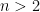

<!--yml
category: 未分类
date: 2024-07-01 18:17:38
-->

# How to build DRM you can trust : ezyang’s blog

> 来源：[http://blog.ezyang.com/2012/02/how-to-build-drm-you-can-trust/](http://blog.ezyang.com/2012/02/how-to-build-drm-you-can-trust/)

*Abstract.* [Proof-carrying code](http://en.wikipedia.org/wiki/Proof-carrying_code) can be used to implement a [digital-rights management scheme](http://en.wikipedia.org/wiki/Digital_rights_management), in the form of a proof-verifying CPU. We describe how this scheme would work and argue that DRM implemented this way is both desirable and superior to [trusted (“treacherous”) computing](http://en.wikipedia.org/wiki/Trusted_Computing) schemes. This scheme permits users to retain control over their own machines, while allowing for specific limitations on software capabilities. The ability to impose these limitations will become especially important when 3D printers and biosynthesis machines become ubiquitous. This essay assumes some technical knowledge, although no background in formal methods is required. (If you know how proof-carrying code works, go away; this essay is not for you.)

~ * ~

It is a truth universally acknowledged that digital-rights management schemes are universally harmful to users. Existing DRM schemes are annoying, counterproductive, buggy and fundamentally ineffective. As implemented, they are nearly indistinguishable from spyware.

I’d like to challenge this assumption.

I have no interest in defending the state of current DRM technology. But I do think there is a way to do it better. My goal is to convince you that proof-based digital-rights management *could* work; that it has a sound theoretical foundation, that it offers a useful subset of DRM-like functionality, and that it does so in a way that avoids many of the privacy, security and trust problems associated with extant trusted computing platforms. I’d like to describe what this system would look like, and what its implications would be (for example, it does offer some control, but it certainly does not solve the analog hole). Unfortunately, this system doesn’t exist yet; the technology underlying formal methods is still being actively researched and is not yet ready for industry.

Why do I feel compelled to speak up about this “ivory tower vaporware” now? We are currently in the midst of what [Cory Doctorow calls](http://lwn.net/Articles/473794/) “The War on General Purpose Computing”, with bills like SOPA/PIPA being considered by Congress, and technical standards like [UEFI](http://en.wikipedia.org/wiki/Unified_Extensible_Firmware_Interface) being aggressively pushed by large software vendors. I feel that it is critical that we convince industries with a stake in digital rights management to invest in this formal methods research. The tools being pursued right now, namely, trusted ("treacherous") computing, may enable the effective enforcement of DRM for the first time in human history, but it will come at the cost of general purpose computing as we know it today.

### How to build proof-based DRM

Because we can’t describe the implications of a system without describing the system itself, the first thing to do is describe how proof-based digital rights management would be implemented. This description will also set the stage for a discussion of some of the issues surrounding such a system; primarily, whether or not this system is *possible* and whether or not it is *desirable*.

Proof-based DRM consists of two components. The first component is a proof verifier, which takes a theorem and a proof of that theorem as inputs, and returns a yes/no answer on whether or not the proof is correct. (We’ll discuss in more detail what exactly a “theorem” and a “proof” is in this context soon.) The second component is a set of theorems, which will describe the desired behavior of software that runs on this hardware (the DRM policies). These two components are integrated into the hardware and collectively serve as the gatekeepers for the programs that will run on the CPU. Code that is to be loaded and run on this CPU must first pass through the proof verifier chip; if the proof is in order, the code the user provided may be directly executed, its adherence to some digital rights policy ensured by the force of logic. (Nota bene: in the rest of this essay, we will not consider the issues of trusting the underlying hardware; a deficiency of our essay, but it is a deep and thorny issue, that also affects CPUs in use today.)

The proof verifier is the core of this system. It can be thought of as a “little mathematician”: someone who reviews a proof in order to check that it is correct. He is furnished with a set of assumptions and a goal (the “theorem”), and a series of deductions from the assumptions to the goals (the “proof”). All the verifier needs to do is, for each goal, check that every step logically follows from the previous one. “P, and P implies Q. Therefore, Q!” Proof verifiers are relatively well studied, and there exist multiple implementations, among which include Coq, HOL Light, Isabelle and F*. Usually, these are written in software, but there is also ongoing research on the design of proof verifiers suitable for embedded devices.

Let’s delve into the operation of a proof verifier a little more. The first input of a proof verifier is the theorem which is to be proved. So the very first task placed upon the user of a proof verifier is to state the theorem in a way that a computer can understand. It’s certainly not reasonable to expect the proof verifier to understand a paragraph of English or some LaTeX equations! What we do is write down mathematical logic as a computer language, this is the language we write our theorems in. Take, as an example, the statement of [Fermat’s Last Theorem](http://en.wikipedia.org/wiki/Fermat%27s_Last_Theorem): no three positive integers *a*, *b*, and *c*, could satisfy , for any . In Coq, this statement could be written as `forall (x y z:Z) (n:nat), x^(n+3) + y^(n+3) = z^(n+3) -> x <= 0 \/ y <= 0 \/ z <= 0`. Read out loud, it says “for all *x*, *y*, *z* which are integers (`Z`), and for all *n* which are natural numbers (`nat`), if it is the case that , then either *x*, *y* or *z* is less than or equal to zero.” While the “computer-friendly” version looks a little different from the informal version (we’ve taken the contrapositive of the statement to avoid negations, and we’ve used addition by three to express the fact that the exponent must be greater than two), they are fairly similar.

Unfortunately, saying in similarly precise language what it means for a program to be “memory-safe” (that is, it never dereferences an invalid pointer) is considerably more difficult. Transforming an informal statement into a formal one is something of an art, for which there is no “correct” answer. During this process, you must balance competing desires: the statement should be easy for a human to understand, but it should also be easy to prove in a computer. Even in the case of Fermat’s theorem, we’ve elided some details: what does it actually mean for something to be an integer or a natural number? What is exponentiation? For that matter, what is addition? What does it mean for two integers to be equal? Fortunately, there are conventional answers for these questions; even in the case of more complicated properties like “memory-safety”, there is a reasonable understanding of the general design principles behind writing a theorem like this down.

For proof-based DRM, we need to scale up security properties like “memory-safety” to the properties one might need to enforce in a digital rights management scheme. How do we show that a program never leaks the contents of a hardware-based private key or prove that a program transmits within a limited set of radio frequencies set by the law? The possibilities multiply, as do the risks. As we move from the realm of well-defined concepts to more irregular, fuzzy ones, it becomes more difficult to tell if a formalization does what we want, or if it is merely a set of rules with a loophole. A criminal may abide by the letter of the law, but not the spirit. In a computer system, there is no judge which can make this assessment. So a reasonable question is whether or not there are any properties which we have some hope of formalizing. Fortunately, the answer is yes; we’ll return to this question in the next section, as it will influence what kinds of DRM we can hope to implement.

The second input of a proof verifier is a proof. Now, we’ve claimed that a proof is a long list (actually, it is more like a tree, as the proof of one goal may require you to prove a few subgoals) of logical steps, each of which can easily be checked. Now, if you have ever attempted to read a real mathematics proof, you’ll know that checking if a proof is correct is never quite this simple. Mathematical proofs leave out steps. Like a writer, a mathematician optimizes his proof for his audience. If they have some relevant background knowledge, he will elide information in order to ensure the clarity of the higher-level structure of a proof. You see, the mathematician is not only interested in what is true, but why it is true. We cannot be so facile when it comes to proofs for computer consumption: as a dumb calculating machine, the computer requires every step of the proof to be explicitly spelled out. This is one of the primary challenges of mechanically checked proofs: a human may write out a three line proof for Euclid’s algorithm, but for the computer, you might end up writing a page. For more complicated theorems about computer programs, a verification project can easily get crushed by the sheer amount of code involved. Scaling up automated theorem proving technology is yet another area of active research, with current technology on the level of abstraction as assembly languages are for traditional programming.

However, once we are in possession of a verified, mechanized proof, we have something that a traditional mathematician does not: assurance that the proof is correct, and that the program has the property we demanded of it. (On the contrary, mathematical proofs published in papers can be, and sometimes are, wrong! Though, even more interesting, the theorem still ends up being true anyway.) This is a good situation to be in: by the principle of proof erasure, we’re allowed to ignore the elaborate proofs we constructed and execute the program directly. We can run the program straight on our hardware, without any untrusted DRM-enabled operating system running underneath. We’ll return to this question later, when we compare our scheme to existing “treacherous computing” schemes.

So what have we covered here? We’ve described how a proof verifier works by looking more closely at its two inputs: theorems and proofs, and touched over some of the active research areas involved with scaling this technology for the real world. In the next two sections, I’d like to go in more detail about two particular aspects of this system as they apply to digital rights management: the theorems associated with DRM, and the relationship between this scheme and existed “trusted computing” schemes.

### What policies are machine-checkable?

The MPAA would quite appreciate it there was a way to make it impossible to copy a digital video. But even the most sophisticated technological scheme cannot work around the fact that I can simply setup a video recorder trained on my screen as I watch the movie: this is the so-called “analog hole”, a fundamental limitation of any copy protection scheme. Proof-based DRM cannot be directly used to eliminate the copying of static materials, such as books, music or movies.

Does this mean that proof-based DRM has no useful applications? The new capability we have gained through this scheme is the ability to select what code will run on the hardware. Any legal ramifications are strictly side effects of this technological enforcement. Furthermore, since general purpose computing devices are ubiquitous, a proof-certifying CPU gains us nothing unless the hardware *itself* affords something extra. A proof-verifying CPU can be thought of as a specialized appliance like a toaster or a microwave, both of which are only interesting insofar as much as they perform non-computational tasks (such as toast bread or heat food).

But there are certainly many interesting hardware peripherals for which this would be useful. In fact, modern CPUs already have some of the specialized chips which are developing along these lines: the Trusted Platform Module, a specification for a cryptoprocessor that can be used to securely store cryptographic keys, is present in most modern laptops. Intel’s Trusted Execution Technology allows the specification of “curtained” regions of memory, which cannot necessarily be accessed by the operating system. The creation of these features has been driven by the trusted (“treacherous”) computing movement, and these are features that can be used both for good and for evil. In a proof-based DRM world, we can give users far more precise control over this secret data, as the user is permitted to write whatever code they want to manipulate it: they simply need to prove that this code won’t get leaked outside of the module. This is information-flow control analysis, which lets us track the flow of private data. (For secret data which has a low number of bits, such as secret keys, a lot of care needs to be taken to mitigate timing attacks, which can be used to slowly leak data in non-obvious ways.) This private data could even be proprietary code, in the case of using a proof-verifying CPU to assist in the distribution of software. This would be more flexible than current software distribution schemes, which are either “in the cloud” (software-as-a-service), or where a proprietary, all-in-one “application box” must be physically hosted by the customer.

Another important application of proof-based DRM is for auditing; e.g. the guaranteed logging of certain events to external stores. The logging store may be some sort of write-only device, and we guarantee that all of the relevant events processed by our CPU are sent to this device by proving that, whenever the event associated with an auditing requirement is triggered, the associated logging call will also be called. This would be a great boon for electronic voting systems, a class of machines which are particularly plagued by unaccountability.

However, looking even further into the future, I think the most interesting hardware peripherals will not truly be peripherals. Rather, the relationship will be inverted: we will be looking at specialized machinery, which happens to need the power of a general purpose computer. We do not ride in cars and fly in planes: we ride in computers and fly in computers. But just as I would prefer my car not to be hackable, or become infected by a computer virus, I would prefer the computational power of a car computer to be limited. This is precisely what proof-based DRM does: it restricts the set of runnable programs. 3D printers and biosynthesis machines are other examples of “peripherals”, which I suspect governments around the world will have a large interest in regulating.

Coming up with useful theorems that define the very nature of the device in question is a bit more challenging: how do you define the line between legitimate use, or an attempt to jam an aircraft radio, create a bioweapon or forge currency? How do you mathematically specify what it means to be “working car software”, as opposed “car software that will cause accidents”? The key insight here is that while it is impossible to completely encapsulate what it means to “be a radio” or “be a car”, we can create useful partial specifications which are practical. Rather than state “steering works properly”, we can state, “given an appropriate input by the wheel, within a N millisecond latency an appropriate mechanical output will be generated.” Rather than state “GPS works”, we can state, “during the operation of GPS, information recording the current location of the vehicle is not transmitted to the public Internet.”

It is also possible to modularize the specification, so that extremely complicated aspects of operation can be verified by an independent systems, and our proof checker only verifies that the independent system is invoked and acted upon. Here are two concrete examples:

*   We can require the specific ranges of parameters, ranges which may be mandated by law. In the case of simple parameters, such as radio frequencies, what is permissible could be built into the specification; more complicated enforcement rules may rely on black box chips which can be invoked for a yes-no answer. It’s important to note that while the internal implementation of such a chip would not be visible to the user, it would have limited influence over the behavior of a program (only being called when our program code), nor would they have network access, to “phone home”. The specification may simply stipulate that these subroutines are invoked and their result (success or failure) handled appropriately.
*   We can require the implementation of steganographic protocols for watermarking and anti-counterfeiting measures. These can rely on an identity that is unknown to the manufacturer of the device, but immutably initialized upon the first usage of the device and can aid law enforcement if the originating device is acquired by a proper search and seizure that does not impinge on fourth amendment rights. Verifying that a code adheres to such a protocol requires formalizing what it means for a steganographic protocol to be correct, and also demonstrating that no other input/output invocations interfere with stenographic output.

It should be clear that the ability to limit what code is run on a device has practical applications. Indeed, it should seem that proof-based DRM is very similar to the trusted (treacherous) computing platform. So, in the next section, I would like to directly describe the differences between these two schemes.

### Why is this better?

What is the difference between proof-based DRM and current trusted (“treacherous”) computing schemes? Both operate by limiting the code that may be run directly on a piece of hardware.

I think the easiest way to see the difference is to consider how each defines the set of permissible programs that may be run on a computer. In trusted computing, this set is defined to be the set of programs signed by a private key held by some corporation. The corporation has complete control over the set of programs that you are allowed to run. Want to load your own software? No can do: it hasn’t been signed.

In proof-based DRM, the set of allowed programs is larger. It will include the code that the corporation provides, but it will also include any other program that you or the open-source community could write, so long as it provides the appropriate proofs for the digital policies. This means, for example, that there is no reason to choke down proprietary software which may have rootkits installed, may spy on your usage habits, etc. The user *retains control*. The theorems are public knowledge, and available for anyone to inspect, analyze, and base their own software off of.

What if the user isn’t able to, in practice, load his own code? Given the current difficulties in theorem proving, it is certainly a concern that what may happen in practice is that corporations will generate specifications that are overfitted to their proprietary code: that have such stringent parameters on the code’s operation that it would be effectively impossible for anyone to run anything else. Or, even more innocuously, the amount of effort involved with verifying software will put it out of reach for all but well-funded corporations. Unfortunately, this is a question that cannot be resolved at the moment: we have no data in this area. However, I have reason to be optimistic. One reason is that it has been extremely important for current formal methods work for specifications to be *simple*; a complicated specification is more likely to have bugs and is harder to prove properties about. Natural selection will take its course here, and if a company is tempted to slip in a “back door” to get their code in, this back door will also be exploitable by open source hackers. Another reason to be optimistic is that we may be able to develop correct-by-construction programming languages, languages which you write in, and when compiled, automatically provide you with the proof for the particular theorems you were looking for.

And of course, there is perhaps one last reason. Through the ages, we’ve seen that open source hackers are highly motivated. There is no reason to believe this will not be the case here.

### Conclusion

Of course, demonstrating that proof-based digital-rights management is “better” than the rather bad current alternatives doesn't mean that it is “good.” But, through the course of this essay, I’ve touched upon many the reasons why I think such a scheme could be valuable. It would provide further impetus in the development of proof-carrying code, a technology that is interesting in and of itself. It would provide a sound basis for limiting the functionality of general purpose computers, in circumstances where you really *don’t* want a general purpose computing device, without requiring rootkits or spyware. The ability to more precisely say what ways you would like your product be used gives producers more flexibility when negotiating in the market (for example, if I can ensure a video game will have limited distribution during its first month, I may be willing to sell it for less). And as general purpose computers gain the ability to influence reality in unprecedented ways, there will be a growing desire for this technology that provides this capability. I think that it is uncontroversial that many, powerful bodies will have an interest in controlling what can be run on certain computing devices. Cory Doctorow has said that “all attempts at controlling PCs will converge on rootkits”; it should be at least worth considering if there is *another way*.