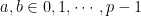

<!--yml
category: 未分类
date: 2024-07-01 18:18:04
-->

# Is multiply-carry strongly universal? : ezyang’s blog

> 来源：[http://blog.ezyang.com/2010/11/is-multiply-carry-strongly-universal/](http://blog.ezyang.com/2010/11/is-multiply-carry-strongly-universal/)

I’ve been wanting to implement a [count-min sketch](http://www.eecs.harvard.edu/~michaelm/CS222/countmin.pdf) for some time now; it’s a little less widely known than the bloom filter, a closely related *sketch* data structure (that is, a probabilistic data structure that approximates answers to certain queries), but it seems like a pretty practical structure and has been used in [some interesting ways](http://research.microsoft.com/pubs/132859/popularityISeverything.pdf).

Alas, when you want to implement a data structure that was proposed less than a decade ago and hasn’t found its way into textbooks yet, there are a lot of theoretical vagaries that get in the way. In this particular case, the theoretical vagary was selection of a *universal hash family.* Having not taken a graduate-level algorithms course yet, I did not know what a universal hash family was, so it was off to the books for me.

From my survey of course notes, papers and textbooks, I noticed two things.

First, there are a lot of different independence guarantees a universal hash family may have, each of which may go under many different names. Assume that our hash family `H` is a family of functions from `h : M → N` where `M = {0, 1, ..., m-1}` and `N = {0, 1, ..., n-1}` with `m >= n`. M corresponds to our “universe”, the possibly values being hashed, while N is the range of the hash function.

*   A *weak universal hash family*, also called a *weak 2-universal hash family* and sometimes stated with the *weak* elided, is a hash family that for a hash function `h` chosen uniformly at random from `H`:

    ```
    ∀ x,y ∈ M, x != y. Pr[h(x) = h(y)] ≤ 1/n

    ```

*   A *strongly 2-universal hash family*, also called a *(strongly) 2-independent universal hash family* and sometimes stated with *2-universal* elided, is one that fulfills this condition:

    ```
    ∀ x,y ∈ M, a,b ∈ N.
             Pr[h(x) = a ∧ h(y) = b] ≤ 1/n²

    ```

*   A *(strongly) k-independent universal hash family* generalizes the above notion, to the following condition:

    ```
    ∀ x₁,x₂...x_k ∈ M, a₁,a₂...a_k ∈ N.
             Pr[h(x₁) = a₁ ∧ h(x₂) = a₂ ∧ ...] ≤ 1/n^k

    ```

Second, the reason why *weak* is commonly elided from *weak hash function* is that 2-universal hash families tend to also be 2-independent. *Randomized Algorithms* states “Most known constructions of 2-universal hash families actually yield a strongly 2-universal hash family. For this reason, the two definitions are generally not distinguished from one another” and asks the student to prove that if `n = m = p` is a prime number, the Carter and Wegman’s hash family is strongly 2-universal. (I’ll state what this is shortly.) So [Wikipedia](http://en.wikipedia.org/wiki/Universal_hashing) happily adopts the weak criteria and only briefly mentions 2-independence in the last section. (I have not edited the article because I’m not sure what, if any change, would be made.)

So, what’s Carter and Wegman’s universal hash family? Quite simple:

given that *p ≥ m* is prime and . Except, uh, no one actually uses a modulus in practice. Here’s one example from [Cormode’s implementation](http://www.cs.rutgers.edu/~muthu/massdal-code-index.html):

```
#define MOD 2147483647
#define HL 31
long hash31(long long a, long long b, long long x)
{

  long long result;
  long lresult;

  // return a hash of x using a and b mod (2^31 - 1)
// may need to do another mod afterwards, or drop high bits
// depending on d, number of bad guys
// 2^31 - 1 = 2147483647

  result=(a * x) + b;
  result = ((result >> HL) + result) & MOD;
  lresult=(long) result;

  return(lresult);
}

```

This implementation is clearly correct:

1.  The multiplication and addition can’t overflow the `long long` result, and
2.  The second line takes advantage of our ability to do fast modulus with Mersenne primes with a few alternate bitwise operations. Of course, in order to do this, we need to be very careful what prime we pick. Mmm magic numbers.

OK, so that’s very nice. There is a minor bit of sloppiness in that we haven’t explicitly ensured that `n = m = p`, so I’m not 100% convinced we preserve strong universality. But I haven’t worked out the *Randomized Algorithms* exercise so I don’t know how important this property is in practice.

As an aside, [this function](http://www2.research.att.com/~marioh/sketches/index.html) also claims to be this very universal hash but I have a hard time believing it:

```
Tools::UniversalHash::value_type Tools::UniversalHash::hash(
        UniversalHash::value_type x
) const
{
        uint64_t r = m_a[0];
        uint64_t xd = 1;

        for (uint16_t i = 1; i < m_k; i++)
        {
                xd = (xd * x) % m_P;
                r += (m_a[i] * xd) % m_P;
                        // FIXME: multiplications here might overflow.
        }

        r = (r % m_P) & 0xFFFFFFFF;
                // this is the same as x % 2^32\. The modulo operation with powers
                // of 2 (2^n) is a simple bitwise AND with 2^n - 1.

        return static_cast<value_type>(r);
}

```

We now turn our attention to multiply-carry, which Wikipedia claims is *the fastest universal hash family currently known for integers.* It’s designed to be easy to implement on computers: `(unsigned) (a*x) >> (w-M)` (with `a` odd) is all you need. Well, to be precise, it’s the fastest *2-universal* has family currently known: the [relevant paper](http://www.diku.dk/~jyrki/Paper/CP-11.4.1997.pdf) only gives the weak universality proof about `Pr[h(x) = h(y)]`.

So, my question is thus: *is multiply-carry strongly universal*? Motwani and Raghavan suggest it probably is, but I couldn’t dig up a proof.

*Postscript.* Fortunately, for count-min-sketch, we don’t actually need strong universality. I checked with Graham Cormode and they only use 2-universality in their paper. But the original question still stands... for strictly theoretical grounds, anyway.

*Non sequitur.* Here’s an interesting combinator for combining functions used in folds:

```
f1 <&> f2 = \(r1, r2) a -> (f1 r1 a, f2 r2 a)

```

It lets you bundle up two combining functions so that you can apply both of them to a list in one go:

```
(foldl xs f1 z1, foldl xs f2 z2) == foldl xs (f1 <&> f2) (z1, z2)

```

Flipping the combinator would make it work for right folds. This gives us the following cute implementation of the `average` function:

```
average = uncurry (/) . foldl' ((+) <&> (flip (const (+1)))) (0,0)

```

Maybe we could write a rewrite rule to do this for us.