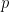

<!--yml

category: 未分类

date: 2024-07-01 18:17:58

-->

# The return of Hellenistic reasoning : ezyang’s blog

> 来源：[`blog.ezyang.com/2011/03/the-return-of-hellenistic-reasonin/`](http://blog.ezyang.com/2011/03/the-return-of-hellenistic-reasonin/)

我最近参加了一场讨论，讨论了如何通过图解推理来扩展证明助手的支持，这有助于打破在这一领域中占主导地位的符号系统的霸权。虽然这项工作在某些方面显然是新颖的，但我也不禁想到我们是否已经回到了古希腊人的轨迹，他们非常喜欢几何学及其相应的视觉推理形式。在我阅读数学文本并对展示同一概念的多种方法感到惊叹时，这个想法再次出现。在本文中，我想探讨这种回归到更古老、更“直观”推理形式的现象：我称之为“希腊式推理”，因为几何学和苏格拉底方法很好地总结了我想讨论的视觉和交互推理。我认为这种复兴是件好事，并且尽管这些推理形式可能不像符号推理那样强大或普适，但它们对抽象数学结果的应用和沟通至关重要。

符号推理涉及对页面上抽象符号的句法操作；正如 Knuth 所说，这是我们在一个符号“同时出现在上方和下方位置，而我们希望它只出现在一个位置”的情况下所做的事情。这是一种相当不自然和机械的推理模式，大多数人必须接受培训才能做到，但它无疑是最流行和有效的推理模式之一。虽然我怀疑导致新数学发现的深刻洞察力不属于这个领域，但符号推理的力量源于它作为一种通用语言，可以用作传播这些洞察力的通道。与自然语言不同，它既紧凑又精确，易于书写。

虽然符号在数学倾向的人群中是一种不完美但可用的沟通基础，但它们在其他人心中却令人恐惧和恐惧。一个由数学家组成的会议室在公理和方程式的幻灯片出现时会松一口气；而系统研究者组成的会议室在同一张幻灯片再次出现时则会心不在焉。这是否意味着我们应该放弃，开始使用 UML？我的答案显而易见：不！精确形式主义的好处太大，不应该放弃。（这些好处是什么？不幸的是，这超出了本篇论文的范围。）我们能否丢弃符号而不是形式主义？也许……

首先是视觉推理。[如果你能为你的问题找到一个](http://mathoverflow.net/questions/8846/proofs-without-words)，它们可能非常优雅。不幸的是，关键词是 *if*：具有视觉等效证明的情况是例外，而不是规则。但是有一些鼓励定理和其他努力可以展示一类陈述可以“画成纸上的图片”。以下是一些例子：

+   *定理.* 设  是集合  或  的所有开子集的代数（对于非拓扑倾向者，可以将其视为减去其“边缘”的集合：所有子集的内部）。那么  当且仅当  是直觉上有效的。这意味着针对实数线或欧几里得平面上的无效公式总是可能给出反例。一个例子是皮尔斯定律  \rightarrow p) \rightarrow p")：在实数线上的反例如下：让  的估值为实数减去零点集， 的估值为空集。方法是反复应用我们的组合规则，看看结果是否覆盖了整个实数线（如果没有，它就不是直觉上有效的）。对于  的规则是 ")，所以我们发现  是 ， \rightarrow q") 是 ，而完整的表达式是 ，整个数轴仅缺一点。

+   冯·诺依曼曾著名地说过：“我不再绝对相信希尔伯特空间。”他指的是希尔伯特空间形式化在量子力学中的成长烦恼。如果你曾经玩过张量积和量子位，你会知道即使是最简单的计算也需要大量的工作。量子图像主义运动试图通过图形语言重新构建量子计算，其目标是使简单的定理更简单化。目前还不清楚它们是否会真正成功，但这是一个非常有趣的研究方向。

+   范畴论中的交换图使证明属性变得轻而易举：只需理解正在被证明的内容并绘制适当的图表！无类型λ演算的 Church-Rosser 定理的一个尤为优雅的证明使用了一个图表追逐后解决了一个小的技术细节。

我们继续进行交互式推理。这些方法涉及对话和游戏：它们的根源可以追溯到博弈论，但此后它们在各种背景下都有所涌现。

+   制作公式的过程可以被看作是一个对话的过程，一方是声称知道如何构建的证明者，另一方是质疑者（声称这种构建不存在）。我们可以通过为证明者指定一个“策略”来捆绑所有证明的信息内容，但游戏的特定实例的一点具体性可以极大地启发我们。它们还突出显示了各种“有趣”的逻辑转折，这些转折可能并不一定显而易见地适用于推理规则：*ex falso sequitur quodlibet* 对应于欺骗质疑者提供矛盾信息，而经典逻辑允许*Catch-22 tricks*（见《Curry-Howard 同构讲义》第 6.5 节）。

+   游戏语义为程序执行赋予了意义。一些有趣的结果包括在比传统的指示性语义更具表现力（游戏语义能“看见”函数是否请求其参数的值），但在我看来，这也许是谈论惰性的最自然方式：当一个 thunk 被强迫时，我正在向某人询问答案；如果我从不强迫 thunk，那么这种对话永远不会发生。

+   在更加平凡的意义上，传统的调试器是一个交互式推理*系统*：程序员与程序进行对话，提问并得到答案。

（正是最后这种感觉让我想知道交互推理是否会在软件工程师中广泛使用：如果你想用一场游戏来推理整个系统的正确性，你仍然需要证明关于一般策略的事实，但在对抗性环境中（例如编译器错误）这可能非常简单和有用。这只是一种空想：交互式错误系统以前已经构建过，例如 LaTeX，但不幸的是，它们并不是很好。人们不禁要问为什么。）

我本可以在这篇论文中结束时发出“画图并描述交互”的警告，但那样做会显得很愚蠢，因为人们已经在做这些了。我想建议的是，有一个丰富的理论来正式化这两种非常非正式的活动，这种形式主义是一件好事，因为它使我们的工具更加精确，从而更加有效。
