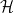
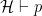
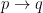

<!--yml
category: 未分类
date: 2024-07-01 18:17:58
-->

# The return of Hellenistic reasoning : ezyang’s blog

> 来源：[http://blog.ezyang.com/2011/03/the-return-of-hellenistic-reasonin/](http://blog.ezyang.com/2011/03/the-return-of-hellenistic-reasonin/)

I recently attended a talk which [discussed extending proof assistants with diagrammatic reasoning support](http://talks.cam.ac.uk/talk/index/29335) , helping to break the hegemony of symbolic systems that is predominant in this field. While the work is certainly novel in some respects, I can't also but help think that we've come back full circle to the Ancient Greeks, who were big fans of geometry, and its correspondingly visual form of reasoning. The thought came up again while I was reading a mathematics text and marveling at the multiple methods of presenting a single concept. In this essay, I'd like to look at this return to older, more "intuitive" forms of reasoning: I've called it "Hellenistic reasoning" because geometry and the Socratic method nicely sum up visual and interactive reasoning that I'd like to discuss. I argue that this resurgence is a good thing, and that though these forms of reasoning may not be as powerful or general as symbolic reasoning, they will be critical to the application and communication of abstract mathematical results.

Symbolic reasoning involves syntactic manipulation of abstract symbols on a page; as Knuth puts it, it's the sort of thing we do when we have a symbol that "appears in both the upper and the lower position, and we wish to have it appear in one place rather than two". It's a rather unnatural and mechanical mode of reasoning that most people have to be trained to do, but it is certainly one of the most popular and effective modes of reasoning. While I suspect that the deep insights that lead to new mathematical discoveries lie outside this realm, symbolic reasoning derives its power from being a common language which can be used as a communication channel to share these insights. Unlike natural language, it's compact, precise and easy to write.

While symbols are an imperfect but serviceable basis for communication among the mathematically inclined, they strike fear and terror in the hearts of everyone else. A conference room of mathematicians will sigh in relief when the slide of axioms and equations shows up; a conference room of systems researchers will zone out when the same slide rolls around. Is this a sign to just give up and start using UML? My answer should be obvious: No! The benefits of a precise formalism are too great to give up. (What are those benefits? Unfortunately, that's out of the scope of this particular essay.) Can we toss out the symbols but not the formalism? Maybe...

First on the list is visual reasoning. [If you can find one for your problem](http://mathoverflow.net/questions/8846/proofs-without-words), they can be quite elegant. Unfortunately, the key word is *if*: proofs with visual equivalents are the exception, not the rule. But there are some encouraging theorems and other efforts that can show a class of statements can be "drawn as pictures on paper." Here are some examples:

*   *Theorem.* Let  be the algebra of all open subsets (for the non-topologically inclined, you can think of this as sets minus their "edges": the interior (Int) of all subsets) of the set  or  (or any Cartesian product of the above). Then  if and only if  is intuitionistically valid. What this means is that it is *always* possible to give a counterexample for an invalid formula over the real line or Euclidean plane. One example is Peirce's law  \rightarrow p) \rightarrow p"): the counter-example on the real line is as such: let the valuation of p be  and the valuation of q be . The recipe is to repeatedly apply our rules for combining these subsets, and the see if the result covers all of the real line (if it doesn't, it's not intuitionistically valid). The rule for  is "), so we find that  is  and  \rightarrow q") is , and the full expression is , just one point shy of the full number line.
*   von Neumann famously remarked: "I do not believe absolutely in Hilbert space no more." He was referring to the growing pains of the Hilbert Space formalism for quantum mechanics. If you've ever played around with tensor products and quibts, you'll know that it takes a lot of work to show even the simplest calculations. The quantum picturalism movement attempts to recast quantum computation in terms of a graphical language, with the goal of making simple theorems, well, simple. No word yet if they will actually be successful, but it's a very interesting vein of investigation.
*   Commutative diagrams in category theory make proving properties a cinch: one simply needs to understand what it is that is being proved and draw the appropriate diagram! One particularly elegant proof of the Church-Rosser theorem (confluence of the untyped lambda calculus) uses a diagram chase after addressing one small technical detail.

We proceed on to interactive reasoning. These are methods that involve dialogues and games: they find their roots in game theory, but have since then popped up in a variety of contexts.

*   The act of creating a construction for a formula can be thought of as a dialogue between a prover (who claims to know how to produce the construction), and a skeptic (who claims the construction doesn't exist.) We can bundle up all of the information content of a proof by specifying a "strategy" for the prover, but the little bit of specificity that a particular instance of the game can be exceedingly enlightening. They also highlight various "interesting" logical twists that may not necessarily be obvious from applying inference rules: *ex falso sequitur quodlibet* corresponds to tricking the skeptic into providing contradictory information and classical logic permits *Catch-22 tricks* (see section 6.5 of *Lectures on the Curry-Howard Isomorphism*).
*   Game semantics gives meaning to program execution in terms of games. Some interesting results include *increased* expressiveness over the more traditional denotational semantics (game semantics is able to "see" if a function requests the value of one of its argument), but in my opinion this is perhaps the most natural way to talk about laziness: when a thunk is forced I am asking someone for an answer; if I never force the thunk then this conversation never happens.
*   In a much more mundane sense, traditional debuggers are a interactive reasoning *system*: the programmer converses with the program, asks questions and gets answers.

(It is that last sense that makes wonder if interactional reasoning is something that could become very widely used among software engineers: if you want to reason about the correctness of a system as a whole using a game, you still need to prove facts about strategies in general, but in an adversarial context (for example, compiler error) it could be very simple and useful. This is idle speculation: interactive error systems have been built before, e.g. LaTeX, and unfortunately, they're not very good. One wonders why.)

I could end this essay with an admonition to "draw pictures and describe interactions", but that would be very silly, since people do that already. What I would like to suggest is that there is rich theory that formalizes these two very informal activities, and this formalism is a good thing, because it makes our tools more precise, and thereby more effective.