# 思考高质量的人类数据

> 原文：[`lilianweng.github.io/posts/2024-02-05-human-data-quality/`](https://lilianweng.github.io/posts/2024-02-05-human-data-quality/)

[特别感谢[Ian Kivlichan](https://scholar.google.com/citations?user=FRBObOwAAAAJ&hl=en)提供了许多有用的指引（例如 100 多年前的《自然》杂志上的“民意”论文）和宝贵的反馈。🙏]

高质量数据是现代数据深度学习模型训练的燃料。大多数任务特定的标记数据来自人类标注，例如分类任务或[RLHF](https://lilianweng.github.io/posts/2021-01-02-controllable-text-generation/#rl-fine-tuning-with-human-preferences)标记（可以构建为分类格式）用于 LLM 对齐训练。后续的许多机器学习技术可以帮助提高数据质量，但从根本上说，人类数据收集涉及对细节的关注和谨慎的执行。社区知道高质量数据的价值，但不知何故我们有这种微妙的印象：“每个人都想做模型工作，而不是数据工作”（[Sambasivan 等人，2021](https://dl.acm.org/doi/abs/10.1145/3411764.3445518)）。

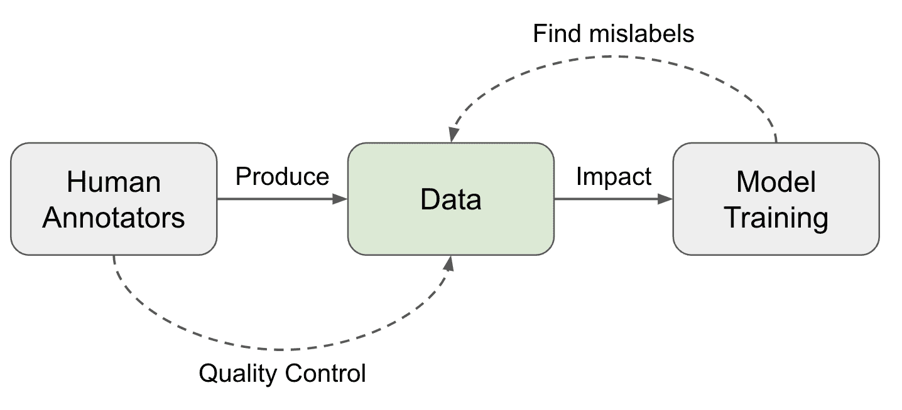

图 1. 接近高数据质量的两个方向。

# 人类评分员 ↔ 数据质量

收集人类数据涉及一系列操作步骤，每一步都对数据质量有所贡献：

1.  任务设计：设计任务工作流程以提高清晰度并减少复杂性。详细的指南是有帮助的，但非常长和复杂的指南需要相当多的培训才能发挥作用。

1.  选择和培训一组评分员：选择具有匹配技能和一致性的标注者。培训课程是必要的。入职后，还需要定期反馈和校准会议。

1.  收集和汇总数据。这是更多机器学习技术可以应用于清洁、过滤和智能聚合数据以识别真实标签的阶段。

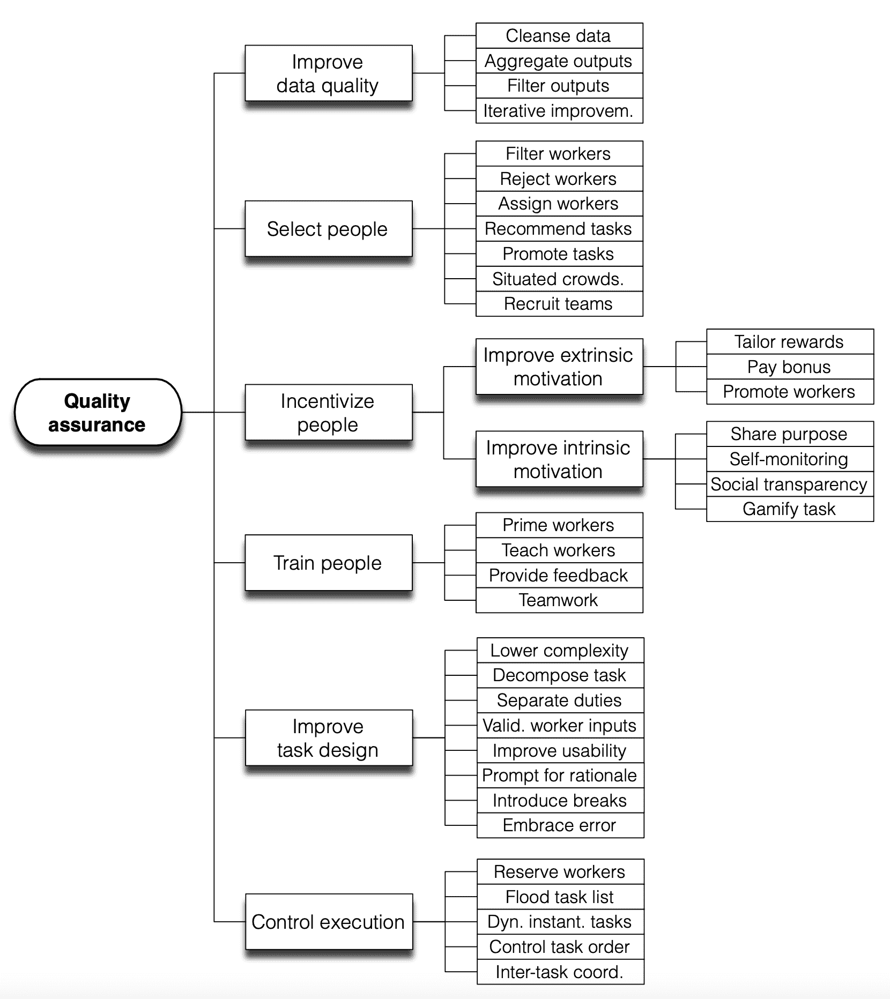

图 2. 质量保证指的是通过对质量模型中确定的质量属性采取行动来提高质量的一系列行动。（图片来源：[Daniel 等人，2018](https://arxiv.org/abs/1801.02546))

## 众人的智慧

[民意](https://en.wikipedia.org/wiki/Vox_populi)（最初是“Vox populi, vox Dei”），一句拉丁短语，意为人民的声音。1907 年在《自然》杂志上发表了一篇同名短文。它追踪了一次年度展览中的一个事件，人们会猜测一头肥牛的重量，以赢得奖品，如果猜测接近真实数字。中间估计被视为“民意”，最终非常接近真实值。作者总结道：“我认为，这个结果更值得信赖的是民主判断的可靠性，这可能超出了预期。”这可能是关于众包（“众人的智慧”）如何运作的最早提及。

大约 100 年后，[Callison-Burch (2009)](https://aclanthology.org/D09-1030/) 进行了一项早期研究，使用亚马逊 Mechanical Turk（AMT）来进行非专家人员对机器翻译（MT）任务的评估，甚至依赖非专家人员创建新的黄金参考翻译。 人类评估的设置很简单：每个工人被展示一个源句子，一个参考翻译，以及来自 5 个 MT 系统的 5 个翻译。 他们被要求将 5 个翻译从最好到最差进行排名。 每个任务由 5 个工人完成。

毫不奇怪，有些垃圾邮件制造商只优化体积而产生低质量的注释。 因此，在衡量专家和非专家之间的一致性时，需要应用不同的加权方案来降低垃圾邮件制造商的贡献：(1)“由专家加权”：使用与专家在一个包含 10 个示例的黄金集上的一致性率; (2)“由非专家加权”：依赖于与整个数据集上的其他工人的一致性率。

在一个更困难的任务中，非专家人类注释者被要求创建新的黄金参考翻译。 Callison-Burch 设计了两个阶段的任务，第一阶段根据 MT 输出创建新的翻译，第二阶段过滤可能由 MT 系统生成的翻译。 专家和众包翻译之间的相关性高于专家和 MT 系统输出之间的相关性。

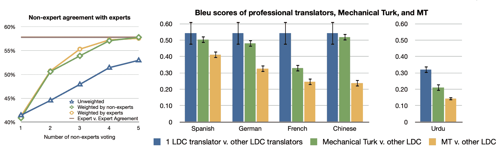

图 3.（左）通过比较每对翻译句子（"A > B"，"A=B"，"A < B"）来衡量一致性率，因此偶然一致性率为 1/3。 上限由专家-专家一致性率设定。 （右）比较来自不同来源的翻译之间的 BLEU 分数。 LCD（语言数据联盟）翻译人员提供专家翻译。（图片来源：[Callison-Burch 2009](https://aclanthology.org/D09-1030/)）

## 评分者一致性

我们经常认为注释是针对单一真相，并尝试根据一致的标准评估质量。 找到可靠的基准标签的常见做法是从多个评分者那里收集多个标签。 假设每个评分者的质量水平不同，我们可以使用注释的加权平均值，但是根据熟练度得分加权。 这个分数通常是通过评分者与其他人一致的频率来近似的。

**多数投票**：采取多数投票是最简单的聚合方式，相当于取一组标签的[众数](https://en.wikipedia.org/wiki/Mode_(statistics))。 在这种情况下，每个注释者都是平等贡献的。

**原始一致性** ([Tratz & Hovy, 2010](https://aclanthology.org/P10-1070/))：原始一致性计算其他人同意的百分比。 这与多数投票间接相关，因为预期大多数类别的所有成员都会获得更高的标注者间一致性率。

**Cohen's Kappa**（[Landis & Koch, 1977](https://www.jstor.org/stable/2529310)）：Cohen's Kappa 以$\kappa = (p_o - p_e) / (1 - p_c)$的形式衡量评分者间的一致性，其中$p_o$是原始一致率，$p_e$是随机一致率。Cohen's Kappa 对于通过偶然一致性有一个校正项，但如果一个标签更普遍，则这种校正可能被高估。

**概率图建模**：有一系列依赖于[概率图建模](https://en.wikipedia.org/wiki/Graphical_model)的工作，用于模拟标注决策中的不同因素，例如任务难度、任务潜在主题、评分者偏见、评分者信心，然后相应地预测真实标签。[Zheng 等人（2017）](https://dl.acm.org/doi/abs/10.14778/3055540.3055547)比较了 17 种算法在众包中的真实推断，其中大多数是概率图模型。

+   **MACE**（多注释者能力估计；[Hovy 等人，2013](https://aclanthology.org/N13-1132)）是使用图建模早期的例子，用于估计某人像“垃圾邮件发送者”一样提供随机标签的可能性。在激励不一致的情况下，一些注释者可能会表现为“垃圾邮件发送者”，以优化完成更多任务以获取更高报酬。MACE 的目标是识别垃圾邮件发送者。给定任务$i$和注释者$j$，$T_i$是真实标签，$A_{ij}$是分配的标签，$S_{ij}$模拟了注释者$j$发送垃圾邮件的概率。然后生成过程可以表示如下。参数$\theta_j$定义了注释者$j$的可信度（不发送垃圾邮件的概率），参数$\xi_j$定义了注释者在发送垃圾邮件时的行为。

$$ \begin{align} & \text{for } i = 1 \dots N : \\ & \quad T_i \sim \text{Uniform} \\ & \quad \text{for } j = 1 \dots M : \\ & \quad \quad S_{ij} \sim \text{Bernoulli}(1 - \theta_j) \\ & \quad \quad \text{if } S_{ij} = 0 : \\ & \quad \quad \quad A_{ij} = T_i \\ & \quad \quad \text{else } : \\ & \quad \quad \quad A_{ij} \sim \text{Multinomial}(\xi_j) \\ \end{align} $$

然后我们可以学习$\theta, \xi$以最大化观察到的数据，以边际数据似然的形式，其中$A$是注释矩阵，$S$是能力指示器矩阵，$T$是真实标签矩阵：

$$ P(A; \theta, \xi) = \sum_{T, S} \big[ \prod_{i=1}^N P(T_i) \cdot \prod_{j=1}^M P(S_{ij}; \theta_j) \cdot P(A_{ij} \vert S_{ij}, T_i; \xi_j) \big] $$

可以应用 EM（期望最大化）或 VB（变分贝叶斯）来最大化上述边际似然。在 EM 优化期间，在 M 步骤中，在归一化之前，会将固定值$\delta$添加到分数计数中。在 VB 训练期间，他们在$\theta_j$上应用对称 Beta 先验，在$\xi_j$上应用对称 Dirichlet 先验。在恢复正确答案时，我们可以采用按注释者$\theta$估计加权的多数投票。

## 评分者不一致 & 两种范式

上述聚合过程依赖于这样一个假设，即存在*一个*潜在的黄金答案，因此我们可以相应地评估注释者的表现。然而，在许多主题中，特别是在安全、社会或文化领域，人们可能存在分歧，而且这种分歧通常是有效的，然后问题就在于我们有多大程度上想要应用严格的规则而不是拥抱多样性。

[Aroyo & Welty（2015）](https://ojs.aaai.org/aimagazine/index.php/aimagazine/article/view/2564) 讨论了人类注释收集实践中的一组“神话”，发现所有这些神话都有些不准确，主要发现包括：

+   对于某些样本，往往存在多种正确的解释。我们需要通过例如让多人审查注释质量来获得多元化的观点。

+   不一致并非总是不好的。我们应该减少由错误或设计不佳的过程引起的分歧，但其他分歧可以为我们提供丰富的信息。

    +   如果这是由任务定义不清晰引起的，我们应该加强说明。然而，更详细的指南并不能解决意见之间固有的多样性。

+   专家未必总是比普通人更好，但在考虑什么是重要的方面，他们之间存在很大差距。

+   地面真实注释可能会随时间变化，特别是与及时事件或新闻相关的注释。

随后，[Rottger 等人（2021）](https://arxiv.org/abs/2112.07475) 将这种差异形式化为主观 NLP 任务数据注释的两种对立范式。

|  | 描述性 | 规范性 |
| --- | --- | --- |
| 定义 | 鼓励注释者主观性，试图模拟多种信念。 | 阻止注释者主观性，试图一致地应用一个信念。 |

| 优点 | - 可帮助识别哪些条目更主观； - 拥抱多样性

| - 更符合标准 NLP 设置。 - 通过测量不一致性或进行标签聚合来更容易进行质量控制。

|

| 缺点 | - 无法使用评分者不一致等指标来衡量数据质量或注释者表现； - 不能用于训练针对输出一个预设行为进行优化的模型。

| - 创建高质量的注释指南既昂贵又具有挑战性，在实践中永远无法完美； - 培训注释者熟悉指南以便正确应用也具有挑战性；

- 无法捕捉可解释的信仰多样性或始终编码一个特定信念。

|

描述性范式使我们能够理解许多重要效应，并考虑不同的观点。例如，注释者身份（例如非裔美国人，LGBTQ）被发现是一个在他们如何标记与身份相关内容为有毒时的统计显著因素（[Goyal 等人，2022](https://arxiv.org/abs/2205.00501)）。主题可以是不同意见的另一个主要驱动因素。[Wang 等人（2023）](https://research.google/pubs/all-that-agrees-is-not-gold-evaluating-ground-truth-labels-and-dialogue-content-for-safety/)研究了人类对话系统安全性的评估过程，并比较了信任与安全（T&S）专业人员和众包注释者标签之间的结果。他们有意收集了与众包注释者相关的丰富元数据，如人口统计信息或行为信息。比较 T&S 专家标签和众包注释，他们发现协议率在语义主题和严重程度上有所不同：

+   协议率在不同主题之间差异很大；从暴力/血腥的 0.96 到个人主题的 0.25 不等。

+   在“极端”和“良性”对话中，协议率较高，给出四个标签选项标记为“良性”，“有争议”，“中等”到“极端”。

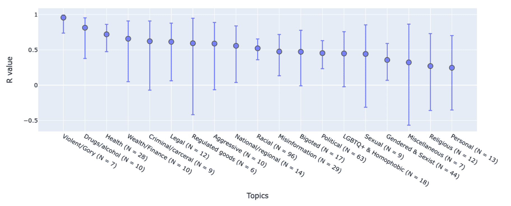

图 4. 非专家和专家注释之间的相关性在不同主题之间差异很大。（图片来源：[Wang 等人，2023](https://research.google/pubs/all-that-agrees-is-not-gold-evaluating-ground-truth-labels-and-dialogue-content-for-safety/)）

[Zhang 等人（2023）](https://arxiv.org/abs/2311.04345)提出了一个评分者不一致性的分类法，以分析根本原因。在列出的原因中，由于随机错误或个体水平上的不一致性而导致的不一致性应该被避免。在评分者在多次询问时给出相同任务不同标签的情况下，其中一些很可能是由人为错误引起的。基于这种直觉，不一致性解构方法（[Gordon 等人，2021](https://dl.acm.org/doi/abs/10.1145/3411764.3445423)）通过将每个个体的意见锚定到他们自己的主要标签，从而鼓励*内部*评分者一致性。

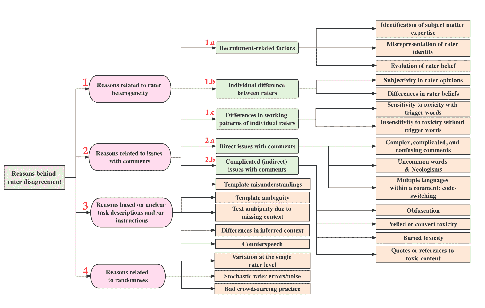

图 5. 评分者不一致性的原因分类法。（图片来源：[Zhang 等人，2023](https://arxiv.org/abs/2311.04345)）

不一致性解构依赖于概率图建模：

1.  估计注释者返回非主要标签的频率，$p_\text{flip}$

1.  每个样本，根据$p_\text{flip}$得到一个调整后的主要标签分布$p^*$

1.  从$p^*$中抽取一个新的测试集。

1.  根据新的测试集来衡量性能指标。

给定$C$类别分类，生成模型的抽样过程如下所述：

$$ \begin{aligned} y^*\mid x &\sim \text{分类}([C], p^*(y\mid x)) \\ y_\text{other}\mid y^* &\sim \text{分类}([C]\setminus\{y^*\}, \frac{1}{C-1}) \\ z_\text{flip} \mid x &\sim \text{伯努利}(p_\text{flip}(x)) \\ y\mid y^*, y_\text{other}, z_\text{flip} &= y^* (1 - z_\text{flip}) + y_\text{other} z_\text{flip} \end{aligned} $$

给定可以从数据中估计的真实$p(y\mid x)$和$p_\text{flip}$，我们将更新主要标签的标签分布：

$$ p^*(y\mid x) = \frac{p(y\mid x) - \frac{p_\text{flip}(x)}{C-1}}{1 - \frac{C \cdot p_\text{flip}(x)}{C - 1}} $$

从$p^*(y \mid x)$中抽取的新测试集表示去除个体不一致噪声的主要标签。它可以用于评估，作为一个无噪声的测试集。

为了捕捉学习预测标签时注释者之间的系统性分歧，[Davani 等人（2021）](https://arxiv.org/abs/2110.05719)尝试了一个多注释者模型的实验，其中预测每个注释者的标签被视为一个子任务。例如，分类任务在一个带注释的数据集$D=(X, A, Y)$上定义，其中$X$是文本实例，$A$是注释者集合，$Y$是注释矩阵，$y_{ij} \in Y$表示$A$中的$a_j$为样本$x_i \in X$分配的二进制标签。$x_i$的多数投票表示为$\bar{y}_{i,}$。实验是在一个预训练的 BERT 模型之上训练一个分类头，并比较 4 种设置：

+   基线：直接预测多数投票$\bar{y}_i$，不使用完整的注释矩阵$Y$。

+   集成：分别训练每个注释者的一个模型来预测$y_{ij}$，然后通过多数投票来聚合结果。

+   多标签：学习预测$\vert A \vert$个标签来表示每个样本$\langle y_{i1}, \dots, y_{i\vert A \vert} \rangle$的所有注释者的标签，使用共享的 MLP 层，然后聚合输出。

+   多任务：类似于多标签，但每个注释者的预测头是从一个单独的 MLP 层学习的，这样我们可以分配额外的计算资源来学习注释者之间的差异。

在[GHC（Gab Hate Corpus）](https://osf.io/edua3/)数据集上的实验结果显示，多任务模型实现了最佳的 F1 分数，并且还可以自然地提供与注释不一致相关的预测不确定性估计。

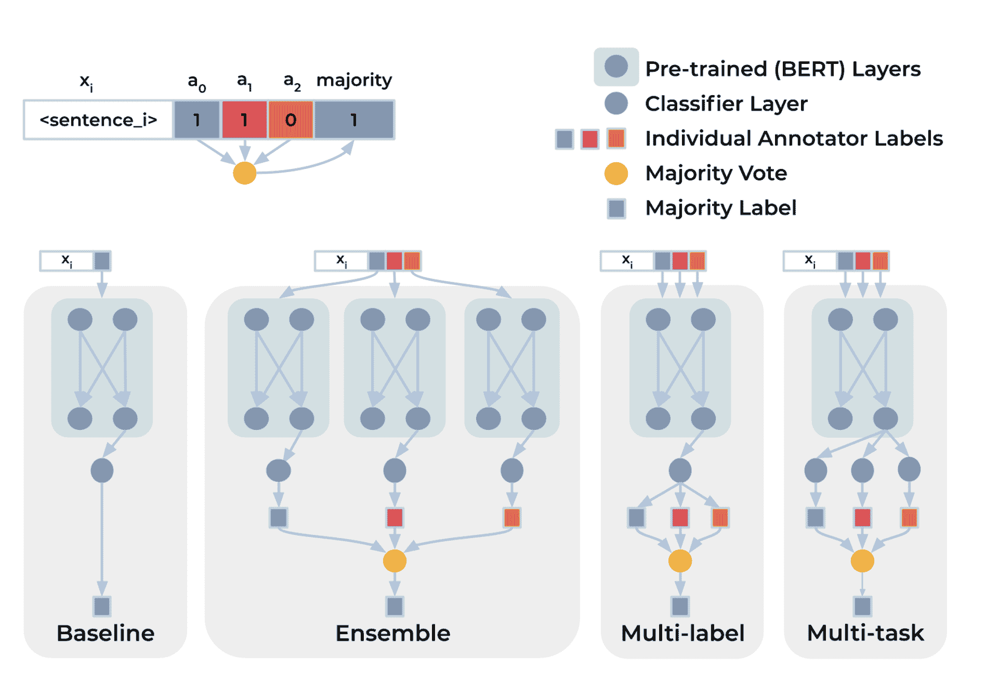

图 6. 不同架构用于建模多个注释者的标签。 (图片来源：[Davani 等人 2021](https://arxiv.org/abs/2110.05719))

陪审团学习（[Gordon et al. 2022](https://arxiv.org/abs/2202.02950)）模拟了[陪审团流程](https://www.uscourts.gov/services-forms/jury-service/juror-selection-process)，通过建模不同注释者的标注行为，条件是他们的特征。 从具有每个标注者标签和人口特征的数据集开始，我们训练一个模型来学习预测每个个体注释者所做的标签，每个都是潜在的陪审员。 在决策时，从业者可以指定陪审团的组成来确定抽样策略。 最终决定是通过汇总来自多次审判的陪审员的标签做出的。

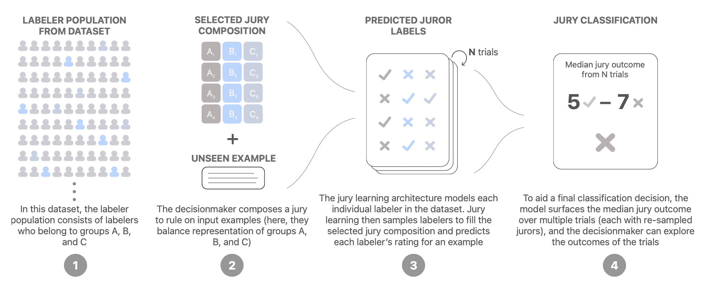

图 7\. 陪审团学习的工作原理示意图。（图片来源：[Gordon et al. 2022](https://arxiv.org/abs/2202.02950)）

陪审团学习模型是一个[DCN（深度与交叉网络）](https://arxiv.org/abs/2008.13535)，通常用于推荐用例，联合训练以学习评论嵌入、注释者嵌入和组（注释者特征）嵌入。 文本内容通过预训练的 BERT 处理，也联合微调，但时间较短以避免过拟合。

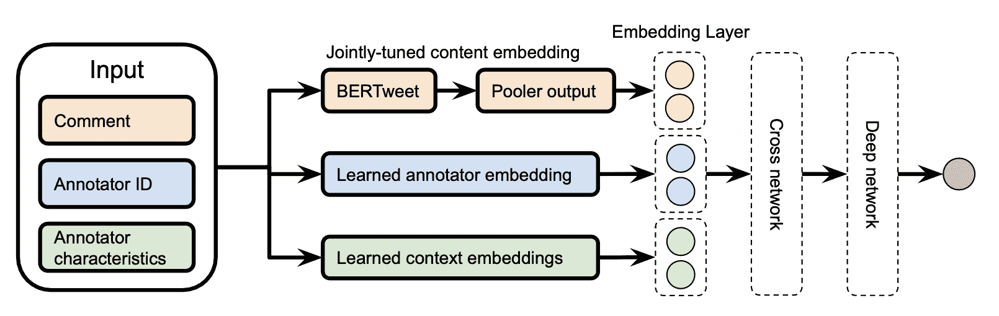

图 8\. 用于陪审团学习的 DCN 模型架构。（图片来源：[Gordon et al. 2022](https://arxiv.org/abs/2202.02950)）

他们的实验运行在[有毒多样性数据集](https://data.esrg.stanford.edu/study/toxicity-perspectives)上，并将陪审团学习与一个基线模型进行比较，该基线模型是一个经过微调的 BERT，用于预测个体注释者的标签而不使用元数据。 性能以 MAE（平均绝对误差）进行衡量。 陪审团学习在整个测试集以及每个组段上始终优于注释者无关的基线。

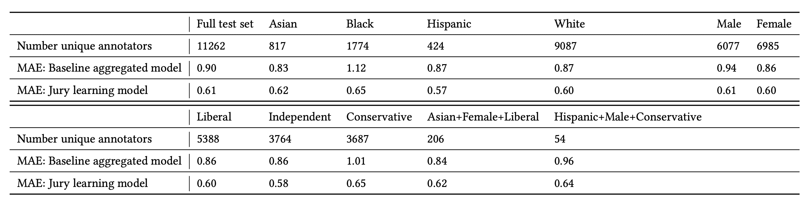

图 9\. 实验结果比较了一个与陪审团学习无关的基线模型。（图片来源：[Gordon et al. 2022](https://arxiv.org/abs/2202.02950)）

# 数据质量 ↔ 模型训练

一旦构建了数据集，许多方法可以帮助根据训练动态识别错误标签。请注意，我们只关注于找到并排除潜在错误标签的数据点的方法，而不是关于[如何使用有噪声数据训练模型](https://lilianweng.github.io/posts/2022-04-15-data-gen/#training-with-noisy-data)。

## 影响函数

**影响函数**是来自健壮统计学的经典技术（[Hampel, 1974](https://www.jstor.org/stable/2285666)），用于衡量训练数据点的影响，描述模型参数在我们微调训练点时如何变化。[Koh & Liang (2017)](https://arxiv.org/abs/1703.04730) 将这个概念引入到深度神经网络中。

给定训练集中的$n$个数据样本，$z_i = (x_i, y_i)$，$i =1, \dots, n$，模型参数$\theta$被优化以最小化损失：$\hat{\theta} = \arg\min_{\theta \in \Theta} \frac{1}{n}\sum_{i=1}^n \mathcal{L}(z_i, \theta)$。移除单个数据点$z$后的模型参数变化表示为$\hat{\theta}_{-z} - \hat{\theta}$，其中$\hat{\theta}_{-z} = \arg\min_{\theta \in \Theta} \frac{1}{n} \sum_{z_i \neq z} \mathcal{L}(z_i, \theta)$。然而，为每个样本计算这个变化是太昂贵的。一种近似的方法是计算在$z$上加小权重$\epsilon$时的参数变化。根据定义，对$z$进行加权的影响由以下公式给出：

$$ \mathcal{I}_{\text{up,params}}(z) = \frac{d\hat{\theta}_{\epsilon,z}}{d\epsilon}\bigg\vert_{\epsilon=0}=-\mathbf{H}^{-1}_{\hat{\theta}} \nabla_\theta \mathcal{L}(z, \hat{\theta}) $$

其中$\hat{\theta}_{\epsilon,z} = \arg\min_{\theta \in \Theta} \frac{1}{n}\sum_{i=1}^n \mathcal{L}(z_i, \theta) + \epsilon L(z, \theta)$，$\mathbf{H}^{-1}_{\hat{\theta}} = \frac{1}{n}\sum_{i=1}^n \nabla²_\theta \mathcal{L}(z_i, \hat{\theta})$。移除数据点$x$等同于在其上加权$\epsilon = -\frac{1}{n}$，因此$\hat{\theta}_{-z} - \hat{\theta} \approx -\frac{1}{n} \mathcal{I}_{\text{up,params}}(z)$。

在测试点$z_\text{test}$处，对$z$进行加权对损失的影响可以通过应用链式法则得到：

$$ \begin{aligned} \mathcal{I}_{\text{up,loss}}(z, z_\text{test}) &= \frac{d \mathcal{L}(z_\text{test}, \hat{\theta}_{\epsilon,z})}{d\epsilon}\bigg\vert_{\epsilon=0} \\ &= \nabla_\theta \mathcal{L}(z_\text{test}, \hat{\theta})^\top \frac{d \hat{\theta}_{\epsilon,z}}{d\epsilon}\bigg\vert_{\epsilon=0} \\ &= - \nabla_\theta \mathcal{L}(z_\text{test}, \hat{\theta})^\top \mathbf{H}^{-1}_{\hat{\theta}} \nabla_\theta \mathcal{L}(z, \hat{\theta}) \end{aligned} $$

使用影响函数，我们可以以闭合形式测量单个数据点对模型参数和损失函数的影响。它可以帮助近似 leave-one-out 重新训练，而无需实际运行所有重新训练。为了识别错误标记的数据，我们可以测量$\mathcal{I}_\text{up,loss}(z_i, z_i)$，近似于如果将$z_i$从训练集中移除，则$z_i$的预测误差。

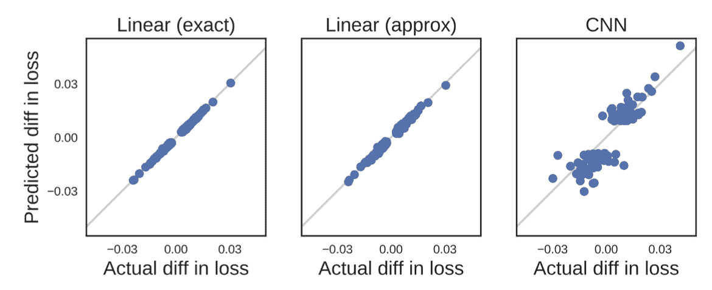

图 10. 影响函数值与 10 类 MNIST 上的 leave-one-out 训练结果相匹配。 (图片来源: [Kohn & Liang, 2017](https://arxiv.org/abs/1703.04730))

鉴于闭合形式，影响函数仍然很难扩展，因为求逆 Hessian 矢量乘积很难计算。[Grosse 等人 (2023)](https://arxiv.org/abs/2308.03296) 尝试使用 EK-FAC（Eigenvalue-corrected Kronecker-Factored Approximate Curvature; [George 等人 2018](https://arxiv.org/abs/1806.03884)）近似。

## 训练过程中的预测变化

另一类方法是跟踪模型在训练过程中的预测变化，以识别似乎难以学习的情况。**数据映射**（[Swayamdipta 等人，2020](https://arxiv.org/abs/2009.10795)）跟踪模型行为动态的两个属性，以分析数据集的质量：

1.  **置信度**：模型对真实标签的置信度，定义为跨历元的真实标签的平均模型概率。他们还使用了一个粗粒度的度量，“正确性”，定义为模型在跨历元预测正确标签的次数的比例。

1.  **变异性**：置信度的变异性，定义为跨历元的真实标签的模型概率的标准差。

图 11\. 基于 RoBERTa 分类器的 SNLI 训练集数据映射。（图片来源：[Swayamdipta 等人，2020](https://arxiv.org/abs/2009.10795)）

难以学习（低置信度，低变异性）的样本更有可能被错误标记。他们在 WinoGrande 数据集上进行了一个实验，其中有 1%的标签翻转数据。重新训练后，翻转的实例移动到低置信度和稍高变异性区域，表明难以学习的区域包含了错误标记的样本。基于此，我们可以仅使用置信度分数在相等数量的标签翻转和干净样本上训练分类器（不确定为什么论文没有同时使用置信度和变异性作为特征）。然后，这个简单的噪声分类器可以用于原始数据集，以识别潜在的错误标记实例。

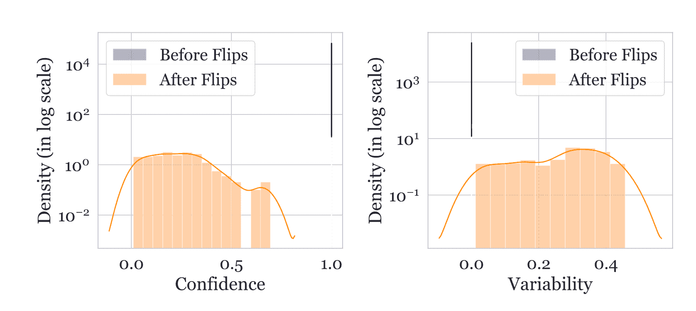

图 12\. 原本具有高置信度和低变异性分数的数据点在标签翻转后移动到低置信度、稍高变异性区域。（图片来源：[Swayamdipta 等人，2020](https://arxiv.org/abs/2009.10795)）

然而，我们不应该认为所有难以学习的样本都是错误的。事实上，论文假设模棱两可（高变异性）和难以学习（低置信度，低变异性）的样本对学习更具信息量。实验证明，它们对 OOD 泛化效果很好，在 OOD 评估中取得了更好的结果，甚至比 100%训练集还要好。

为了调查神经网络是否有遗忘先前学到信息的倾向，[Mariya Toneva 等人（2019）](https://arxiv.org/abs/1812.05159)设计了一个实验：他们跟踪模型在训练过程中对每个样本的预测，并计算每个样本从被正确分类到错误分类或反之的转换次数。然后可以相应地对样本进行分类，

+   *易忘*（冗余）样本：如果类别标签在训练历元中发生变化。

+   *难忘*样本：如果类别标签分配在训练历元中保持一致。这些样本一旦学习就永远不会被遗忘。

他们发现有大量一旦学习就不会被遗忘的不可忘记的示例。具有嘈杂标签或具有“不寻常”特征的图像（在视觉上难以分类）是最容易被遗忘的示例之一。实验证明，不可忘记的示例可以安全地删除而不影响模型性能。

在实现中，遗忘事件仅在样本包含在当前训练批次中时计数；也就是说，他们在后续小批次的呈现中计算对同一示例的遗忘。每个样本的遗忘事件数量在不同种子之间非常稳定，易忘记的示例有一定倾向在训练后期首次学习。遗忘事件还被发现在整个训练期间和不同架构之间是可传递的。

[Pleiss 等人（2020）](https://arxiv.org/abs/2001.10528)开发了一种名为**AUM（边缘下面积）**的方法，基于这样一个假设来发现错误标签：比如，一张鸟类图像被错误地标记为狗类。梯度更新会鼓励从其他鸟类图像到这张鸟类图像的泛化，而狗类标签提供了一个不正确的监督信号，鼓励更新朝着另一种方式进行。因此，在梯度更新信号中存在泛化和（错误）预测之间的紧张关系。

给定一个分类数据集$(\mathbf{x}, y) \in \mathcal{D}_\text{train}$，让$z^{(t)}_i(\mathbf{x}) \in \mathbb{R}$表示在第$t$个时期对应于类别$i$的 logit。在第$t$个时期的边际是分配的 logit 与下一个最大 logit 之间的差异：

$$ M^{(t)}(\mathbf{x}, y) = z_y^{(t)}(\mathbf{x}) - \max_{i \neq y} z^{(t)}_i(\mathbf{x}),\quad \text{AUM}(\mathbf{x}, y) = \frac{1}{T} \sum^T_{t=1} M^{(t)}(\mathbf{x}, y) $$

负边缘表示错误预测，大正边缘表明对正确预测的高置信度。假设是，由于 SGD 通过其他样本触发的泛化紧张，错误标记的样本的边缘会比正确样本小。

为了确定阈值，他们插入了名为“阈值样本”的虚假数据来确定阈值：

1.  创建一个阈值样本子集$\mathcal{D}_\text{thr}$。如果有$N$个训练样本用于$C$个类别，我们随机抽取$N/(C+1)$个样本，并将它们所有的标签更改为一个虚假的新类别$C+1$。

1.  将阈值样本合并到原始数据集中：$\mathcal{D}’ = { (\mathbf{x}, C+1): \mathbf{x} \in \mathcal{D}_\text{thr}} \cup (\mathcal{D} \setminus\mathcal{D}_\text{thr})$;

1.  在$\mathcal{D}’$上训练模型并测量所有数据的 AUM；

1.  计算阈值$\alpha$为阈值样本 AUM 的第 99 百分位数；

1.  使用阈值$\alpha$识别错误标记的数据：${(\mathbf{x}, y) \in \mathcal{D} \setminus \mathcal{D}_\text{thr}: \text{AUM}_{\mathbf{x}, y} \leq \alpha}$

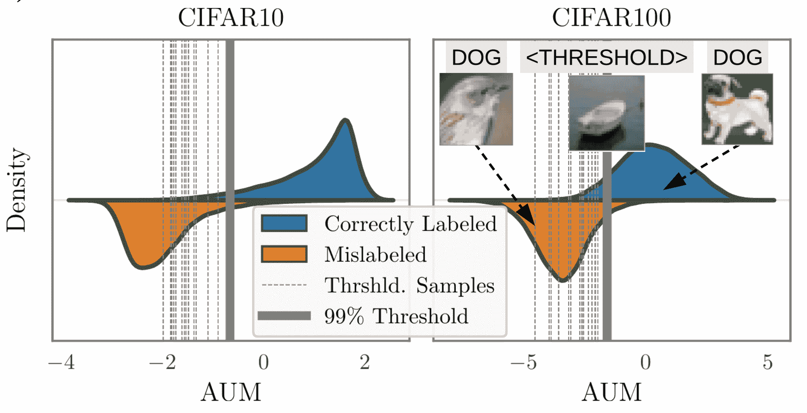

图 13\. 阈值样本的 AUM 如何帮助分离错误标记的样本。（图片来源：[Pleiss et al. 2020](https://arxiv.org/abs/2001.10528)）

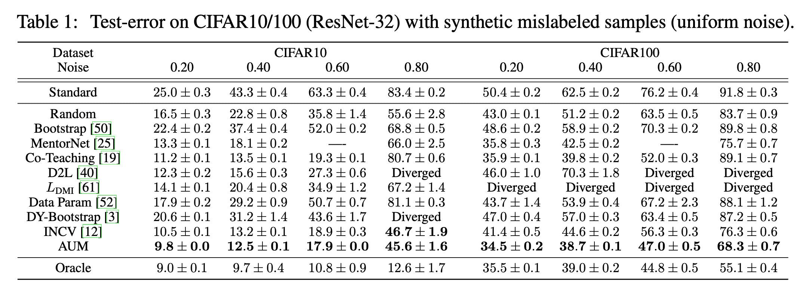

图 14\. 在 CIFAR 10/100 上测试误标记样本时的测试错误，比较不同方法的数据过滤或嘈杂数据训练。（图片来源：[Pleiss et al. 2020](https://arxiv.org/abs/2001.10528)）

## 嘈杂交叉验证

**NCV（嘈杂交叉验证）**方法（[Chen et al. 2019](https://arxiv.org/abs/1905.05040)）将数据集随机分成两半，然后将数据样本标记为“干净”，如果其标签与仅在数据集的另一半上训练的模型提供的预测标签匹配。干净样本预计更可信。INC（迭代嘈杂交叉验证）迭代运行 NCV，其中更多干净样本被添加到受信任的候选集$\mathcal{C}$中，更多嘈杂样本被移除。

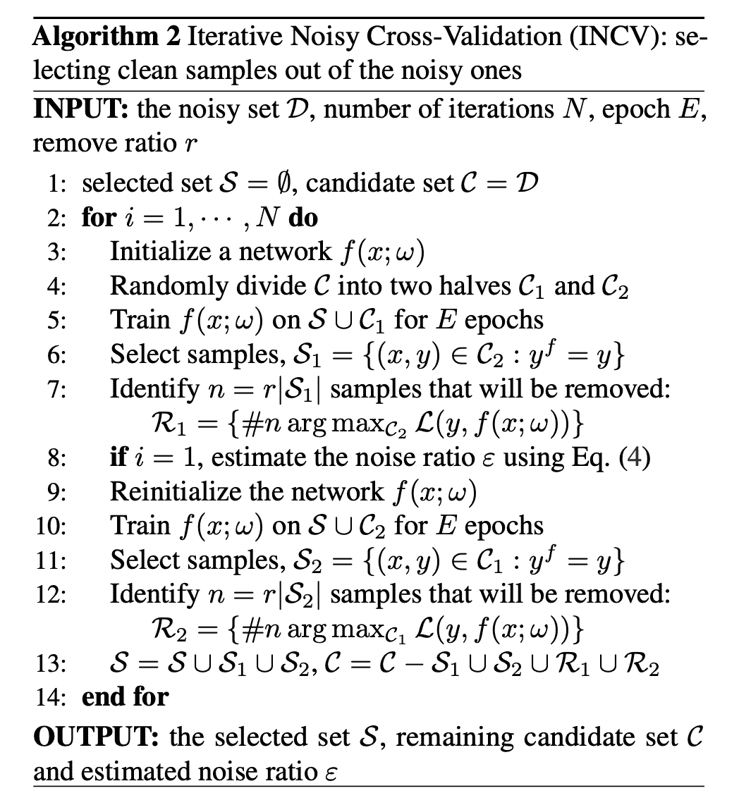

图 15\. INCV（迭代嘈杂交叉验证）算法。（图片来源：[Chen et al. 2019](https://arxiv.org/abs/1905.05040)）

# 参考文献

[1] 弗朗西斯·高尔顿 [“民意”](https://www.nature.com/articles/075450a0) Nature 75, 450-451（1907 年）。

[2] Sambasivan 等人 [“每个人都想做模型工作，而不是数据工作”：高风险 AI 中的数据级联](https://dl.acm.org/doi/10.1145/3411764.3445518) CHI 2021

[3] Chris Callison-Burch. [“快速、廉价和创造性：使用亚马逊的 Mechanical Turk 评估翻译质量”](https://aclanthology.org/D09-1030/) EMNLP 2009

[4] Rottger 等人 [“主观 NLP 任务的两种对比数据标注范式”](https://arxiv.org/abs/2112.07475) NAACL 2022。

[5] Aroyo & Welty [“真相是谎言：众包真相和人类标注的七大神话”](https://ojs.aaai.org/aimagazine/index.php/aimagazine/article/view/2564) AI Magazine 36.1：15-24（2015 年）。

[6] Hovy 等人 [“使用 MACE 学习信任对象”](https://aclanthology.org/N13-1132.pdf) NAACL-HLT 2013。

[7] 王等人 [“一切一致并非黄金：评估安全的地面真相标签和对话内容”](https://research.google/pubs/all-that-agrees-is-not-gold-evaluating-ground-truth-labels-and-dialogue-content-for-safety/) 2023 年。

[8] 张等人 [“评分者分歧的分类法：从在线毒性注释的注释角度调查挑战和机会”](https://arxiv.org/abs/2311.04345) arXiv 预印本 arXiv:2311.04345（2023 年）。

[9] Davani 等人 [“处理分歧：超越多数投票在主观注释中”](https://arxiv.org/abs/2110.05719) ACL 2022。

[10] Gordon 等人 [“陪审团学习：将异议声音整合到机器学习模型中”](https://arxiv.org/abs/2202.02950) CHI 2022。

[11] Gordon 等人 [“分歧解卷积：使机器学习性能指标符合现实”](https://dl.acm.org/doi/abs/10.1145/3411764.3445423) CHI 2021

[12] Daniel 等人。2018 年[“众包中的质量控制：质量属性、评估技术和保证措施调查”](https://arxiv.org/abs/1801.02546) ACM 计算调查（CSUR），51(1)，1-40（2018 年）。

[13] Koh & Liang。[“通过影响函数理解黑盒预测”](https://arxiv.org/abs/1703.04730) ICML 2017。

[14] Grosse 等人。[“利用影响函数研究大型语言模型的泛化能力”](https://arxiv.org/abs/2308.03296) arXiv 预印本 arXiv:2308.03296（2023 年）。

[15] Swayamdipta 等人。[“数据集制图：通过训练动态绘制和诊断数据集”](https://arxiv.org/abs/2009.10795) EMNLP 2020。

[16] Toneva 等人。[“深度神经网络学习过程中示例遗忘的实证研究”](https://arxiv.org/abs/1812.05159) ICLR 2019。

[17] Pleiss 等人。[“利用边缘排名下面积识别错误标记数据”](https://arxiv.org/abs/2001.10528) NeuriPS 2020。

[18] Chen 等人。[“理解和利用使用含有噪声标签训练的深度神经网络”](https://arxiv.org/abs/1905.05040) ICML 2019。
