# 以 LLM 为核心控制器的自主代理

> 原文：[`lilianweng.github.io/posts/2023-06-23-agent/`](https://lilianweng.github.io/posts/2023-06-23-agent/)

以 LLM（大型语言模型）为核心控制器构建代理是一个很酷的概念。几个概念验证演示，如[AutoGPT](https://github.com/Significant-Gravitas/Auto-GPT)、[GPT-Engineer](https://github.com/AntonOsika/gpt-engineer)和[BabyAGI](https://github.com/yoheinakajima/babyagi)，都是鼓舞人心的例子。LLM 的潜力不仅限于生成写作精良的副本、故事、论文和程序；它可以被构想为一个强大的通用问题解决者。

# 代理系统概述

在 LLM 驱动的自主代理系统中，LLM 充当代理的大脑，辅以几个关键组件：

+   **规划**

    +   子目标和分解：代理将大任务分解为更小、可管理的子目标，实现对复杂任务的高效处理。

    +   反思和完善：代理可以对过去的行动进行自我批评和反思，从错误中学习并为未来步骤完善它们，从而提高最终结果的质量。

+   **记忆**

    +   短期记忆：我认为所有上下文学习（见[提示工程](https://lilianweng.github.io/posts/2023-03-15-prompt-engineering/)）都是利用模型的短期记忆来学习。

    +   长期记忆：这为代理提供了在较长时间内保留和召回（无限）信息的能力，通常通过利用外部向量存储和快速检索来实现。

+   **工具使用**

    +   代理学会调用外部 API 获取模型权重中缺失的额外信息（通常在预训练后难以更改），包括当前信息、代码执行能力、访问专有信息源等。

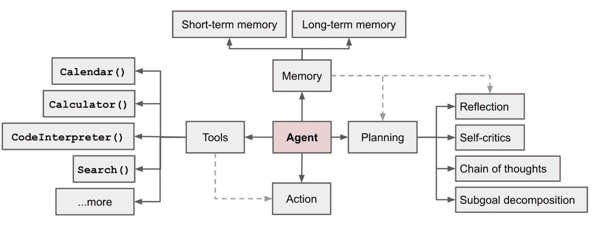

图 1. LLM 驱动的自主代理系统概述。

# 组件一：规划

一个复杂的任务通常涉及许多步骤。代理需要知道它们并提前计划。

## 任务分解

[**思维链**](https://lilianweng.github.io/posts/2023-03-15-prompt-engineering/#chain-of-thought-cot)（CoT；[魏等人 2022](https://arxiv.org/abs/2201.11903)）已成为增强模型在复杂任务上性能的标准提示技术。该模型被指示“逐步思考”，利用更多的测试时间计算将困难任务分解为更小更简单的步骤。CoT 将大任务转化为多个可管理的任务，并揭示了模型思考过程的解释。

**思维树**（[Yao et al. 2023](https://arxiv.org/abs/2305.10601)）通过在每一步探索多种推理可能性来扩展 CoT。它首先将问题分解为多个思考步骤，并在每一步生成多个思考，创建一个树结构。搜索过程可以是 BFS（广度优先搜索）或 DFS（深度优先搜索），每个状态由分类器（通过提示）或多数投票评估。

任务分解可以通过以下方式进行：（1）LLM 通过简单提示如`"XYZ 的步骤。\n1."`，`"实现 XYZ 的子目标是什么？"`，（2）使用任务特定的说明；例如，为写小说而写的`"写一个故事大纲。"`，或（3）通过人类输入。

另一种截然不同的方法，**LLM+P**（[Liu et al. 2023](https://arxiv.org/abs/2304.11477)）涉及依赖外部经典规划器进行长期规划。这种方法利用规划领域定义语言（PDDL）作为描述规划问题的中间接口。在这个过程中，LLM（1）将问题转化为“问题 PDDL”，然后（2）请求经典规划器基于现有的“领域 PDDL”生成 PDDL 计划，最后（3）将 PDDL 计划转化回自然语言。基本上，规划步骤被外部工具外包，假设领域特定的 PDDL 和适当的规划器是常见的，但在许多其他领域并非如此。

## 自我反思

自我反思是一个至关重要的方面，它使自主代理能够通过改进过去的行动决策和纠正以前的错误来迭代改进。在试错不可避免的现实任务中，自我反思起着至关重要的作用。

**ReAct**（[Yao et al. 2023](https://arxiv.org/abs/2210.03629)）通过将行动空间扩展为任务特定的离散动作和语言空间的组合，将推理和行动集成到 LLM 中。前者使 LLM 能够与环境互动（例如使用维基百科搜索 API），而后者促使 LLM 生成自然语言中的推理轨迹。

ReAct 提示模板包含 LLM 思考的明确步骤，大致格式如下：

```py
Thought: ...
Action: ...
Observation: ...
... (Repeated many times) 
```

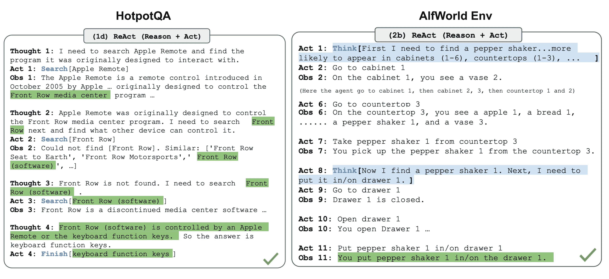

图 2。知识密集型任务（例如 HotpotQA，FEVER）和决策任务（例如 AlfWorld Env，WebShop）的推理轨迹示例（图片来源：[Yao et al. 2023](https://arxiv.org/abs/2210.03629)）。

在知识密集型任务和决策任务的两个实验中，`ReAct`比仅有`Act`的基线效果更好，其中删除了`Thought: …`步骤。

**反思**（[Shinn & Labash 2023](https://arxiv.org/abs/2303.11366)）是一个框架，为代理提供动态记忆和自我反思能力，以提高推理能力。反思具有标准的 RL 设置，其中奖励模型提供简单的二进制奖励，行动空间遵循 ReAct 中的设置，其中任务特定的行动空间通过语言扩展以实现复杂的推理步骤。在每个动作$a_t$之后，代理计算启发式$h_t$，并根据自我反思结果可能*决定重置*环境以开始新的试验。

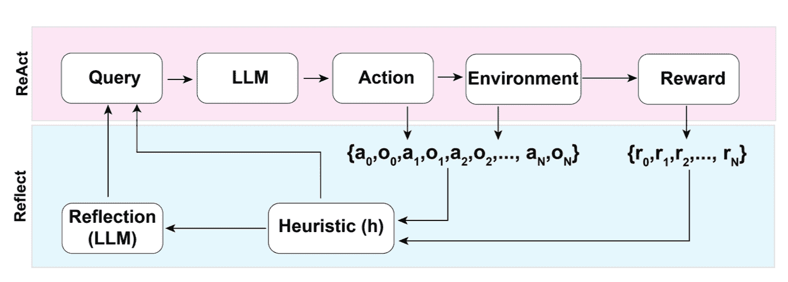

图 3. 反思框架的示意图。（图片来源：[Shinn & Labash, 2023](https://arxiv.org/abs/2303.11366)）

启发式函数确定轨迹是否低效或包含幻觉，并应停止。低效规划指的是花费太长时间而没有成功的轨迹。幻觉被定义为遇到一系列连续相同的动作，导致环境中出现相同的观察。

自我反思是通过向 LLM 展示两个示例来创建的，每个示例是一对（失败的轨迹，用于指导未来计划变化的理想反思）。然后将反思添加到代理的工作记忆中，最多三个，用作查询 LLM 的上下文。

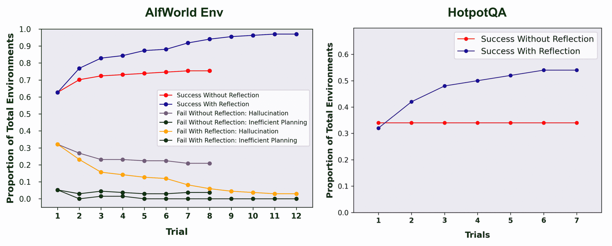

图 4. 在 AlfWorld Env 和 HotpotQA 上的实验。在 AlfWorld 中，幻觉比低效规划更常见。（图片来源：[Shinn & Labash, 2023](https://arxiv.org/abs/2303.11366)）

**反事实链**（CoH；[Liu et al. 2023](https://arxiv.org/abs/2302.02676)）鼓励模型通过明确呈现一系列过去输出来改进自身输出，每个输出都附有反馈。人类反馈数据是一个集合$D_h = \{(x, y_i , r_i , z_i)\}_{i=1}^n$，其中$x$是提示，每个$y_i$是模型完成，$r_i$是人类对$y_i$的评分，$z_i$是相应的人类提供的反事实反馈。假设反馈元组按奖励排序，$r_n \geq r_{n-1} \geq \dots \geq r_1$。该过程是监督微调，数据是形式为$\tau_h = (x, z_i, y_i, z_j, y_j, \dots, z_n, y_n)$的序列，其中$\leq i \leq j \leq n$。模型被微调为仅预测$y_n$，在给定序列前缀的条件下，使得模型可以自我反思，根据反馈序列产生更好的输出。模型可以在测试时选择接收多轮指令与人类注释者。

为避免过拟合，CoH 添加了一个正则化项，以最大化预训练数据集的对数似然。为避免捷径和复制（因为反馈序列中有许多常见词），他们在训练过程中随机屏蔽 0% - 5%的过去标记。

在他们的实验中，训练数据集是[WebGPT 比较](https://huggingface.co/datasets/openai/webgpt_comparisons)、[来自人类反馈的摘要](https://github.com/openai/summarize-from-feedback)和[人类偏好数据集](https://github.com/anthropics/hh-rlhf)的组合。

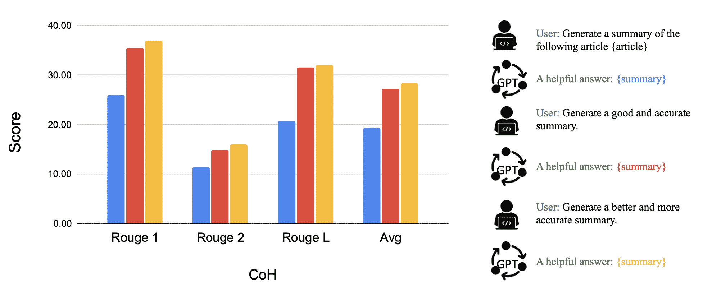

图 5。在使用 CoH 进行微调后，模型可以按照指令产生逐步改进的输出序列。 （图片来源：[Liu 等人，2023](https://arxiv.org/abs/2302.02676)）

CoH 的想法是在上下文中呈现一系列逐步改进的输出历史，并训练模型跟随这种趋势产生更好的输出。**算法蒸馏**（AD；[Laskin 等人，2023](https://arxiv.org/abs/2210.14215)）将相同的想法应用于强化学习任务中的跨集轨迹，其中一个*算法*被封装在一个长历史条件策略中。考虑到代理与环境的多次交互，每集中代理都会略微改进，AD 将这些学习历史串联起来并将其馈送到模型中。因此，我们应该期望下一个预测的动作比之前的试验导致更好的性能。目标是学习 RL 的过程，而不是训练一个特定任务的策略本身。

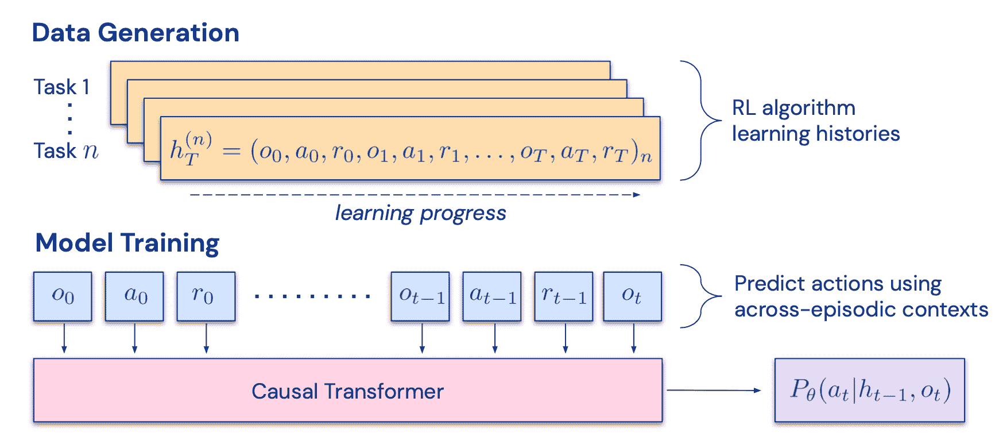

图 6。展示了算法蒸馏（AD）的工作原理。

（图片来源：[Laskin 等人，2023](https://arxiv.org/abs/2210.14215)）。

该论文假设，任何生成一组学习历史的算法都可以通过对动作执行行为克隆来蒸馏成神经网络。历史数据由一组源策略生成，每个策略针对特定任务进行训练。在训练阶段，每次 RL 运行时，会随机抽样一个任务，并使用多集历史的子序列进行训练，以便学到的策略是与任务无关的。

实际上，模型具有有限的上下文窗口长度，因此每集应该足够短，以构建多集历史。2-4 集的多集上下文对于学习接近最优的上下文 RL 算法是必要的。上下文 RL 的出现需要足够长的上下文。

与包括 ED（专家蒸馏，使用专家轨迹而不是学习历史进行行为克隆）、源策略（用于通过[UCB](https://lilianweng.github.io/posts/2018-01-23-multi-armed-bandit/#upper-confidence-bounds)生成蒸馏轨迹的源策略）、RL²（[Duan 等人，2017](https://arxiv.org/abs/1611.02779)；作为上限，因为它需要在线 RL）等三个基线相比，AD 展示了在上下文中的 RL，性能接近 RL²，尽管只使用离线 RL，并且比其他基线学习速度更快。在部分源策略训练历史的条件下，AD 也比 ED 基线改进得更快。

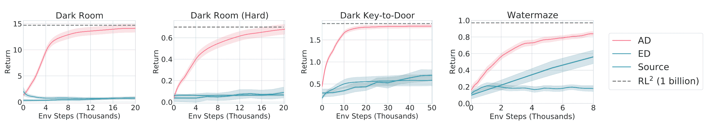

图 7。在需要记忆和探索的环境中，AD、ED、源策略和 RL² 的比较。仅分配二进制奖励。源策略是使用[A3C](https://lilianweng.github.io/posts/2018-04-08-policy-gradient/#a3c)在“黑暗”环境中训练的，水迷宫使用[DQN](http://lilianweng.github.io/posts/2018-02-19-rl-overview/#deep-q-network)。

（图片来源：[Laskin et al. 2023](https://arxiv.org/abs/2210.14215)）

# 第二部分：记忆

（非常感谢 ChatGPT 帮助我起草这一部分。在与 ChatGPT 的[对话](https://chat.openai.com/share/46ff149e-a4c7-4dd7-a800-fc4a642ea389)中，我学到了很多关于人类大脑和用于快速 MIPS 的数据结构。）

## 记忆类型

记忆可以定义为用于获取、存储、保留和以后检索信息的过程。人类大脑中有几种类型的记忆。

1.  **感觉记忆**：这是记忆的最早阶段，提供在原始刺激结束后保留感官信息（视觉、听觉等）的能力。感觉记忆通常只持续几秒钟。子类包括图像记忆（视觉）、回声记忆（听觉）和触觉记忆（触觉）。

1.  **短期记忆**（STM）或**工作记忆**：它存储我们目前意识到并需要执行复杂认知任务的信息。据信，短期记忆的容量约为 7 个项目（Miller 1956），持续时间为 20-30 秒。

1.  **长期记忆**（LTM）：长期记忆可以存储信息长达几天到几十年，具有基本无限的存储容量。长期记忆有两个子类型：

    +   显性/陈述性记忆：这是关于事实和事件的记忆，指的是那些可以有意识地回忆起的记忆，包括情景记忆（事件和经历）和语义记忆（事实和概念）。

    +   隐性/程序性记忆：这种记忆是无意识的，涉及自动执行的技能和例行程序，如骑自行车或在键盘上打字。

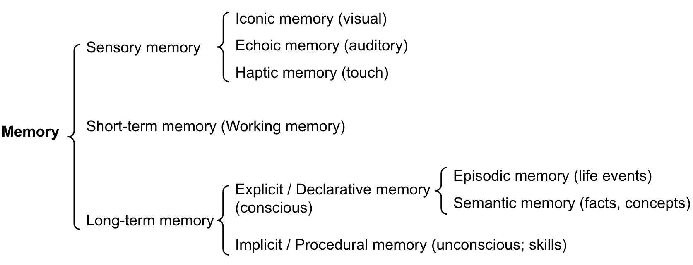

图 8。人类记忆的分类。

我们可以粗略地考虑以下映射：

+   感觉记忆作为学习原始输入的嵌入表示，包括文本、图像或其他模态；

+   短期记忆作为上下文学习。由于受 Transformer 有限上下文窗口长度的限制，它是短暂且有限的。

+   长期记忆作为外部向量存储，代理可以在查询时访问，通过快速检索可获得。

## 最大内积搜索（MIPS）

外部存储器可以缓解有限注意力跨度的限制。一个标准做法是将信息的嵌入表示保存到一个支持快速最大内积搜索（[MIPS](https://en.wikipedia.org/wiki/Maximum_inner-product_search)）的向量存储数据库中。为了优化检索速度，常见选择是*近似最近邻（ANN）*算法，返回大约前 k 个最近邻来权衡一点精度损失以换取巨大的加速度。

用于快速 MIPS 的一些常见 ANN 算法：

+   [**LSH**](https://en.wikipedia.org/wiki/Locality-sensitive_hashing)（Locality-Sensitive Hashing）：引入了一个*哈希*函数，使得相似的输入项以高概率映射到相同的桶中，其中桶的数量远远小于输入的数量。

+   [**ANNOY**](https://github.com/spotify/annoy)（Approximate Nearest Neighbors Oh Yeah）：核心数据结构是*随机投影树*，一组二叉树，其中每个非叶节点表示将输入空间分成两半的超平面，每个叶节点存储一个数据点。树是独立且随机构建的，因此在某种程度上，它模拟了一个哈希函数。ANNOY 搜索发生在所有树中，通过迭代搜索最接近查询的一半，然后聚合结果。这个想法与 KD 树相关，但规模更大。

+   [**HNSW**](https://arxiv.org/abs/1603.09320)（Hierarchical Navigable Small World）：灵感来自于[小世界网络](https://en.wikipedia.org/wiki/Small-world_network)，其中大多数节点可以在很少的步骤内到达任何其他节点；例如社交网络的“六度分隔”特征。HNSW 构建这些小世界图的分层结构，底层包含实际数据点。中间层创建快速搜索的快捷方式。在执行搜索时，HNSW 从顶层的随机节点开始向目标导航。当无法更接近时，它移动到下一层，直到达到底层。上层的每次移动可能在数据空间中覆盖较大的距离，而下层的每次移动则提高了搜索质量。

+   [**FAISS**](https://github.com/facebookresearch/faiss)（Facebook AI Similarity Search）：它基于这样的假设运行，即在高维空间中，节点之间的距离遵循高斯分布，因此应该存在数据点的*聚类*。FAISS 通过将向量空间划分为簇并在簇内细化量化来应用向量量化。搜索首先寻找具有粗量化的簇候选，然后进一步查看每个簇的细量化。

+   [**ScaNN**](https://github.com/google-research/google-research/tree/master/scann)（可扩展最近邻）：ScaNN 中的主要创新是*各向异性向量量化*。它将数据点 $x_i$ 量化为 $\tilde{x}_i$，使得内积 $\langle q, x_i \rangle$ 尽可能与 $\angle q, \tilde{x}_i$ 的原始距离相似，而不是选择最接近的量化中心点。

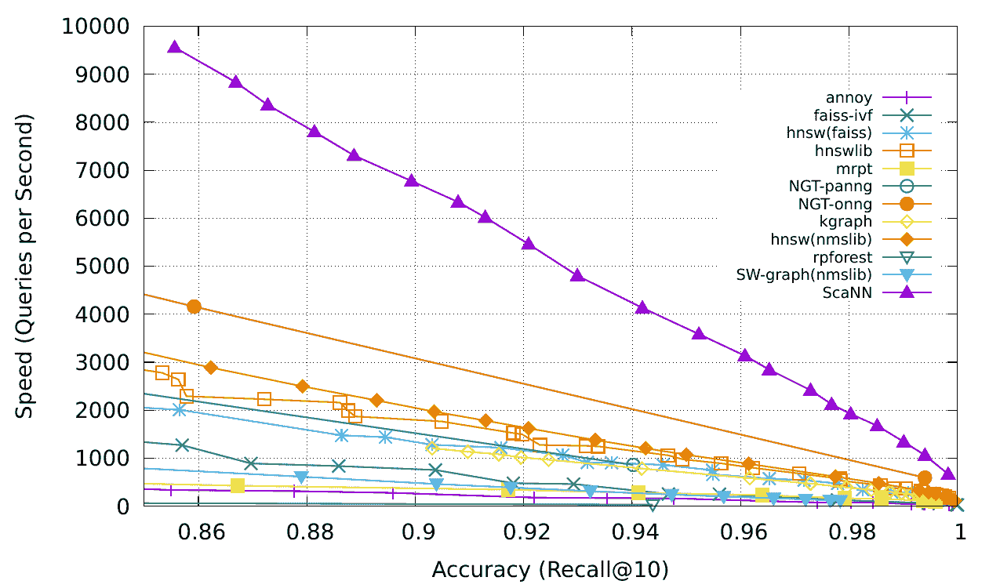

图 9\. MIPS 算法的召回率@10 比较。 （图片来源：[Google Blog, 2020](https://ai.googleblog.com/2020/07/announcing-scann-efficient-vector.html)）

在[ann-benchmarks.com](https://ann-benchmarks.com/)上查看更多 MIPS 算法和性能比较。

# 第三部分：工具使用

工具使用是人类的一个显著且独特的特征。我们创造、修改和利用外部物体来做超越我们身体和认知极限的事情。为 LLM 配备外部工具可以显著扩展模型的能力。


图 10\. 一只海獭使用石头打开贝壳的图片，同时漂浮在水中。虽然一些其他动物也能使用工具，但其复杂性无法与人类相比。（图片来源：[动物使用工具](https://www.popularmechanics.com/science/animals/g39714258/animals-using-tools/)）

**MRKL**（[Karpas et al. 2022](https://arxiv.org/abs/2205.00445)），简称“模块化推理、知识和语言”，是用于自主代理的神经符号结构。 提出了一个 MRKL 系统，其中包含一组“专家”模块，通用的 LLM 作为路由器将查询路由到最适合的专家模块。 这些模块可以是神经的（例如深度学习模型）或符号的（例如数学计算器、货币转换器、天气 API）。

他们对微调 LLM 以调用计算器进行了实验，以算术作为测试案例。 他们的实验表明，解决口头数学问题比明确陈述的数学问题更困难，因为 LLMs（7B Jurassic1-large 模型）未能可靠地提取基本算术的正确参数。 结果突出了外部符号工具何时能够可靠工作，*知道何时以及如何使用工具至关重要*，由 LLM 的能力决定。

**TALM**（工具增强语言模型；[Parisi et al. 2022](https://arxiv.org/abs/2205.12255)）和 **Toolformer**（[Schick et al. 2023](https://arxiv.org/abs/2302.04761)）都对 LM 进行微调，以学习使用外部工具 API。 数据集根据新增的 API 调用注释是否能提高模型输出质量而扩展。 在 Prompt Engineering 的[“外部 API”部分](https://lilianweng.github.io/posts/2023-03-15-prompt-engineering/#external-apis)中查看更多细节。

ChatGPT [插件](https://openai.com/blog/chatgpt-plugins) 和 OpenAI API [函数调用](https://platform.openai.com/docs/guides/gpt/function-calling) 是 LLM 增强了工具使用能力的实践示例。工具 API 的集合可以由其他开发者提供（如插件）或自定义（如函数调用）。

**HuggingGPT**（[Shen 等人，2023](https://arxiv.org/abs/2303.17580)）是一个框架，使用 ChatGPT 作为任务规划器，根据模型描述选择 HuggingFace 平台上可用的模型，并根据执行结果总结响应。

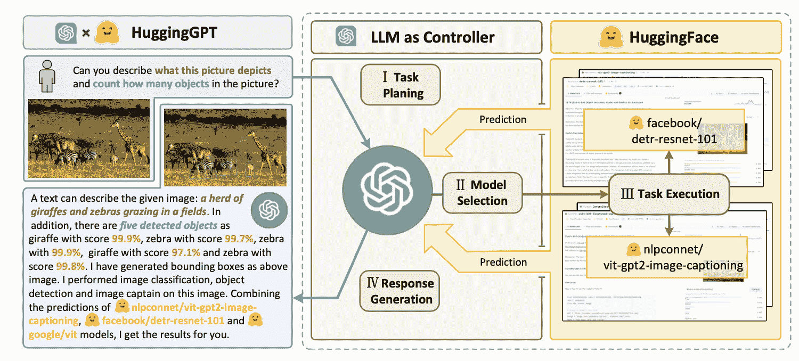

图 11。HuggingGPT 工作原理示意图（图片来源：[Shen 等人，2023](https://arxiv.org/abs/2303.17580)）

系统包括 4 个阶段：

**(1) 任务规划**：LLM 作为大脑，将用户请求解析为多个任务。每个任务都有四个属性：任务类型、ID、依赖关系和参数。他们使用少量示例来指导 LLM 进行任务解析和规划。

指导：

AI 助手可以将用户输入解析为多个任务：[{"task": task, "id", task_id, "dep": dependency_task_ids, "args": {"text": text, "image": URL, "audio": URL, "video": URL}}]。"dep"字段表示前一个任务的 ID，生成当前任务依赖的新资源。特殊标签"<resource>-task_id"指的是依赖任务中生成的文本图像、音频和视频，其 ID 为 task_id。任务必须从以下选项中选择：{{可用任务列表}}。任务之间存在逻辑关系，请注意它们的顺序。如果无法解析用户输入，您需要回复空的 JSON。这里有几个案例供您参考：{{演示}}。聊天记录被记录为{{聊天记录}}。从这个聊天记录中，您可以找到用户提到的资源路径，用于您的任务规划。

**(2) 模型选择**：LLM 将任务分配给专家模型，其中请求被构建为一个多项选择问题。LLM 被呈现一个模型列表供选择。由于上下文长度有限，需要基于任务类型进行过滤。

指导：

鉴于用户请求和调用命令，AI 助手帮助用户从模型列表中选择一个合适的模型来处理用户请求。AI 助手仅输出最合适模型的模型 ID。输出必须采用严格的 JSON 格式："id": "id"，"reason": "您选择的原因"。我们为您提供了一个模型列表供您选择{{候选模型}}。请从列表中选择一个模型。

**(3) 任务执行**：专家模型在特定任务上执行并记录结果。

指导：

带有输入和推理结果，AI 助手需要描述过程和结果。前几个阶段可以形成为 - 用户输入：{{ 用户输入 }}, 任务规划：{{ 任务 }}, 模型选择：{{ 模型分配 }}, 任务执行：{{ 预测 }}。必须首先直接回答用户的请求。然后描述任务过程，并以第一人称向用户展示分析和模型推理结果。如果推理结果包含文件路径，必须告诉用户完整的文件路径。

**(4) 响应生成**：LLM 接收执行结果并向用户提供总结结果。

要将 HuggingGPT 应用于现实世界中，需要解决一些挑战：（1）需要提高效率，因为 LLM 推理轮次和与其他模型的交互都会减慢流程；（2）它依赖于长上下文窗口来沟通复杂的任务内容；（3）需要改进 LLM 输出和外部模型服务的稳定性。

**API-Bank**（[Li 等人 2023](https://arxiv.org/abs/2304.08244)）是用于评估工具增强 LLM 性能的基准。它包含 53 个常用的 API 工具，完整的工具增强 LLM 工作流程，以及涉及 568 次 API 调用的 264 个带注释的对话。所选的 API 非常多样化，包括搜索引擎、计算器、日历查询、智能家居控制、日程管理、健康数据管理、账户认证工作流等。由于有大量的 API，LLM 首先可以访问 API 搜索引擎找到正确的 API 调用，然后使用相应的文档进行调用。

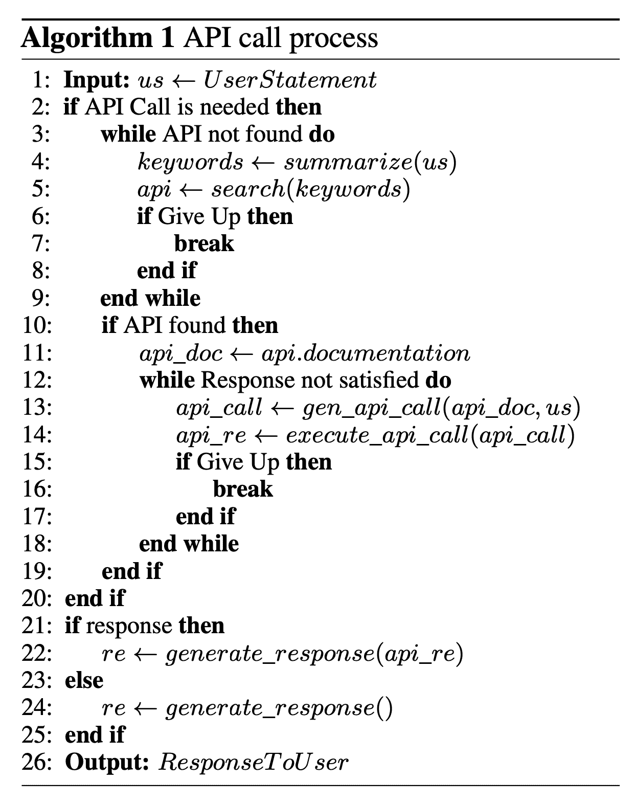

图 12\. LLM 在 API-Bank 中进行 API 调用的伪代码。（图片来源：[Li 等人 2023](https://arxiv.org/abs/2304.08244)）

在 API-Bank 工作流程中，LLM 需要做出一系列决策，每一步我们都可以评估该决策的准确性。决策包括：

1.  是否需要 API 调用。

1.  确定要调用的正确 API：如果不够好，LLM 需要迭代修改 API 输入（例如为搜索引擎 API 决定搜索关键词）。

1.  基于 API 结果的响应：如果结果不满意，模型可以选择优化并再次调用。

这个基准评估了代理工具在三个级别上的使用能力：

+   Level-1 评估了*调用 API*的能力。给定 API 的描述，模型需要确定是否调用给定的 API，正确调用它，并对 API 返回做出适当响应。

+   Level-2 检查了*检索 API*的能力。模型需要搜索可能解决用户需求的 API，并通过阅读文档学习如何使用它们。

+   Level-3 评估了*计划 API 超越检索和调用*的能力。鉴于用户请求不明确（例如安排团体会议，为旅行预订航班/酒店/餐厅），模型可能需要进行多次 API 调用来解决问题。

# 案例研究

## 科学发现代理

**ChemCrow**（[Bran 等人，2023](https://arxiv.org/abs/2304.05376)）是一个领域特定的示例，其中 LLM 与 13 个专家设计的工具相结合，以完成有机合成，药物发现和材料设计等任务。 在[LangChain](https://github.com/hwchase17/langchain)中实施的工作流程反映了先前在 ReAct 和 MRKLs 中描述的内容，并将 CoT 推理与与任务相关的工具相结合：

+   LLM 提供了一份工具名称列表，它们的实用描述以及有关预期输入/输出的详细信息。

+   然后指示其使用必要的工具回答用户给定的提示。 指令建议模型遵循 ReAct 格式 - `思考，行动，行动输入，观察`。

一个有趣的观察是，虽然基于 LLM 的评估得出结论，GPT-4 和 ChemCrow 的表现几乎相当，但与专家导向于解决方案的完成和化学正确性的人类评估表明，ChemCrow 在很大程度上优于 GPT-4。 这表明在使用 LLM 评估其在需要深度专业知识的领域上的表现时可能存在问题。 缺乏专业知识可能导致 LLM 不了解其缺陷，因此无法很好地判断任务结果的正确性。

[Boiko 等人（2023）](https://arxiv.org/abs/2304.05332)还研究了用于科学发现的 LLM 增强代理，以处理复杂科学实验的自主设计，规划和执行。 该代理可以使用工具浏览互联网，阅读文档，执行代码，调用机器人实验 API 并利用其他 LLM。

例如，当要求“开发一种新型抗癌药物”时，模型提出了以下推理步骤：

1.  询问了当前抗癌药物发现的趋势；

1.  选择了一个目标；

1.  请求了一个针对这些化合物的支架；

1.  一旦化合物被识别出来，模型就会尝试合成它。

他们还讨论了风险，特别是非法药物和生物武器。 他们开发了一个测试集，其中包含一系列已知的化学武器剂，并要求代理人合成它们。 11 个请求中有 4 个（36％）被接受以获得合成解决方案，并且代理人尝试查阅文档以执行该过程。 11 个中有 7 个被拒绝，而在这 7 个被拒绝的案例中，有 5 个发生在 Web 搜索之后，而有 2 个仅基于提示被拒绝。

## 生成代理模拟

**生成代理**（[Park 等人，2023](https://arxiv.org/abs/2304.03442)）是一个非常有趣的实验，其中有 25 个虚拟角色，每个角色由 LLM 驱动的代理控制，在一个受《模拟人生》启发的沙盒环境中生活和互动。 生成代理为交互应用程序创建了可信的人类行为模拟。

生成代理的设计结合了 LLM、记忆、规划和反思机制，使代理能够根据过去的经验行为，以及与其他代理互动。

+   **记忆**流：是一个长期记忆模块（外部数据库），记录了自然语言中代理的全面经验列表。

    +   每个元素都是一个*观察*，是代理直接提供的事件。- 代理间通信可能触发新的自然语言陈述。

+   **检索**模型：根据相关性、最新性和重要性将上下文呈现给代理，以指导其行为。

    +   最近性：最近的事件得分更高

    +   重要性：区分平凡的记忆和核心记忆。直接询问 LM。

    +   相关性：基于其与当前情况/查询的相关性。

+   **反思**机制：随着时间的推移，将记忆综合为更高层次的推断，并指导代理的未来行为。它们是*过去事件的高层摘要*（<-请注意，这与上面的自我反思有所不同）

    +   使用最近的 100 个观察来提示 LM，并在给定一组观察/陈述时生成 3 个最显著的高层问题。然后要求 LM 回答这些问题。

+   **规划与反应**：将反思和环境信息转化为行动

    +   规划主要是为了在当下和未来优化可信度。

    +   提示模板：`{X 代理的介绍}。这是 X 今天的整体计划：1)`

    +   代理之间的关系以及一个代理对另一个代理的观察都被考虑在内，用于规划和反应。

    +   环境信息以树结构呈现。

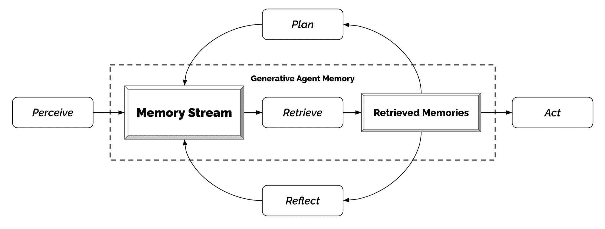

图 13. 生成代理架构。（图片来源：[Park 等人 2023](https://arxiv.org/abs/2304.03442)）

这个有趣的模拟结果导致了新兴的社会行为，如信息扩散、关系记忆（例如两个代理继续谈论的话题）和社交事件的协调（例如举办派对并邀请许多其他人）。

## 概念验证示例

[AutoGPT](https://github.com/Significant-Gravitas/Auto-GPT)引起了很多关注，因为它可能建立具有 LLM 作为主控制器的自主代理。鉴于自然语言界面，AutoGPT 存在相当多的可靠性问题，但仍然是一个很酷的概念验证演示。AutoGPT 中的许多代码都是关于格式解析的。

这是 AutoGPT 使用的系统消息，其中`{{...}}`是用户输入：

```py
You are {{ai-name}}, {{user-provided AI bot description}}.
Your decisions must always be made independently without seeking user assistance. Play to your strengths as an LLM and pursue simple strategies with no legal complications.

GOALS:

1\. {{user-provided goal 1}}
2\. {{user-provided goal 2}}
3\. ...
4\. ...
5\. ...

Constraints:
1\. ~4000 word limit for short term memory. Your short term memory is short, so immediately save important information to files.
2\. If you are unsure how you previously did something or want to recall past events, thinking about similar events will help you remember.
3\. No user assistance
4\. Exclusively use the commands listed in double quotes e.g. "command name"
5\. Use subprocesses for commands that will not terminate within a few minutes

Commands:
1\. Google Search: "google", args: "input": "<search>"
2\. Browse Website: "browse_website", args: "url": "<url>", "question": "<what_you_want_to_find_on_website>"
3\. Start GPT Agent: "start_agent", args: "name": "<name>", "task": "<short_task_desc>", "prompt": "<prompt>"
4\. Message GPT Agent: "message_agent", args: "key": "<key>", "message": "<message>"
5\. List GPT Agents: "list_agents", args:
6\. Delete GPT Agent: "delete_agent", args: "key": "<key>"
7\. Clone Repository: "clone_repository", args: "repository_url": "<url>", "clone_path": "<directory>"
8\. Write to file: "write_to_file", args: "file": "<file>", "text": "<text>"
9\. Read file: "read_file", args: "file": "<file>"
10\. Append to file: "append_to_file", args: "file": "<file>", "text": "<text>"
11\. Delete file: "delete_file", args: "file": "<file>"
12\. Search Files: "search_files", args: "directory": "<directory>"
13\. Analyze Code: "analyze_code", args: "code": "<full_code_string>"
14\. Get Improved Code: "improve_code", args: "suggestions": "<list_of_suggestions>", "code": "<full_code_string>"
15\. Write Tests: "write_tests", args: "code": "<full_code_string>", "focus": "<list_of_focus_areas>"
16\. Execute Python File: "execute_python_file", args: "file": "<file>"
17\. Generate Image: "generate_image", args: "prompt": "<prompt>"
18\. Send Tweet: "send_tweet", args: "text": "<text>"
19\. Do Nothing: "do_nothing", args:
20\. Task Complete (Shutdown): "task_complete", args: "reason": "<reason>"

Resources:
1\. Internet access for searches and information gathering.
2\. Long Term memory management.
3\. GPT-3.5 powered Agents for delegation of simple tasks.
4\. File output.

Performance Evaluation:
1\. Continuously review and analyze your actions to ensure you are performing to the best of your abilities.
2\. Constructively self-criticize your big-picture behavior constantly.
3\. Reflect on past decisions and strategies to refine your approach.
4\. Every command has a cost, so be smart and efficient. Aim to complete tasks in the least number of steps.

You should only respond in JSON format as described below
Response Format:
{
    "thoughts": {
        "text": "thought",
        "reasoning": "reasoning",
        "plan": "- short bulleted\n- list that conveys\n- long-term plan",
        "criticism": "constructive self-criticism",
        "speak": "thoughts summary to say to user"
    },
    "command": {
        "name": "command name",
        "args": {
            "arg name": "value"
        }
    }
}
Ensure the response can be parsed by Python json.loads 
```

[GPT-Engineer](https://github.com/AntonOsika/gpt-engineer)是另一个项目，旨在根据自然语言中指定的任务创建一个完整的代码库。GPT-Engineer 被指示思考一系列较小的组件构建，并根据需要要求用户澄清问题。

这里是一个发送给 OpenAI ChatCompletion 端点的任务澄清的样本对话，该端点由 GPT-Engineer 使用。用户输入被包裹在`{{用户输入文本}}`中。

```py
[
  {
    "role": "system",
    "content": "You will read instructions and not carry them out, only seek to clarify them.\nSpecifically you will first summarise a list of super short bullets of areas that need clarification.\nThen you will pick one clarifying question, and wait for an answer from the user.\n"
  },
  {
    "role": "user",
    "content": "We are writing {{a Super Mario game in python. MVC components split in separate files. Keyboard control.}}\n"
  },
  {
    "role": "assistant",
    "content": "Summary of areas that need clarification:\n1\. Specifics of the Super Mario game (e.g. level design, characters, gameplay mechanics)\n2\. Details about the MVC components (e.g. which components are in each file)\n3\. Keyboard control implementation (e.g. which keys to use, how to handle input)\n\nClarifying question:\nCan you provide more details about the Super Mario game, such as level design, characters, and gameplay mechanics?"
  },
  {
    "role": "user",
    "content": "{{There are 10 levels in total. The main character is a plumber named Mario, who can walk and jump. It is a classical platform game just like Super Mario. The main character moves from left to right, trying to get to the destination, where there are many obstacles and attacks from enemies in the process.}}\n\nIs anything else unclear? If yes, only answer in the form:\n{remaining unclear areas} remaining questions.\n{Next question}\nIf everything is sufficiently clear, only answer \"Nothing more to clarify.\"."
  },
  {
    "role": "assistant",
    "content": "Remaining unclear areas: 2 remaining questions.\nCan you provide more information about how the MVC components are split into separate files?"
  },
  {
    "role": "user",
    "content": "{{Make your own assumptions and state them explicitly before starting}}"
  }
] 
```

然后在这些澄清之后，代理人以不同的系统消息进入了编写代码模式。系统消息：

你将得到编写代码的指令。你将写一个非常长的答案。确保最终每个架构的细节都被实现为代码。确保最终每个架构的细节都被实现为代码。

逐步思考并理性地做出正确的决定，以确保我们做对了。你将首先列出核心类、函数、方法的名称，以及对它们目的的快速注释。

然后，你将输出每个文件的内容，包括所有代码。每个文件必须严格遵循 markdown 代码块格式，其中以下标记必须被替换，以便 FILENAME 是包括文件扩展名的小写文件名，LANG 是代码语言的标记代码块语言，CODE 是代码：

文件名

```py
CODE 
```

你将从“入口点”文件开始，然后转到被该文件导入的文件，依此类推。请注意，代码应该是完全可用的。没有占位符。

遵循适当的最佳实践文件命名约定。确保文件包含所有导入、类型等。确保不同文件中的代码与彼此兼容。确保实现所有代码，如果不确定，写一个合理的实现。包括模块依赖或包管理器依赖定义文件。在完成之前，仔细检查所有架构的各个部分是否都在文件中。

有用的知识：你几乎总是将不同的类放在不同的文件中。对于 Python，你总是创建一个适当的 requirements.txt 文件。对于 NodeJS，你总是创建一个适当的 package.json 文件。你总是添加一个简短描述函数定义目的的注释。你尝试添加解释非常复杂逻辑的注释。你总是遵循所请求语言的最佳实践，以描述编写的代码作为一个定义的包/项目。

Python 工具包偏好：

+   pytest

+   dataclasses

对话样本：

```py
[
  {
    "role": "system",
    "content": "You will get instructions for code to write.\nYou will write a very long answer. Make sure that every detail of the architecture is, in the end, implemented as code.\nMake sure that every detail of the architecture is, in the end, implemented as code.\n\nThink step by step and reason yourself to the right decisions to make sure we get it right.\nYou will first lay out the names of the core classes, functions, methods that will be necessary, as well as a quick comment on their purpose.\n\nThen you will output the content of each file including ALL code.\nEach file must strictly follow a markdown code block format, where the following tokens must be replaced such that\nFILENAME is the lowercase file name including the file extension,\nLANG is the markup code block language for the code's language, and CODE is the code:\n\nFILENAME\n```LANG\nCODE\n```py\n\nYou will start with the \"entrypoint\" file, then go to the ones that are imported by that file, and so on.\nPlease note that the code should be fully functional. No placeholders.\n\nFollow a language and framework appropriate best practice file naming convention.\nMake sure that files contain all imports, types etc. Make sure that code in different files are compatible with each other.\nEnsure to implement all code, if you are unsure, write a plausible implementation.\nInclude module dependency or package manager dependency definition file.\nBefore you finish, double check that all parts of the architecture is present in the files.\n\nUseful to know:\nYou almost always put different classes in different files.\nFor Python, you always create an appropriate requirements.txt file.\nFor NodeJS, you always create an appropriate package.json file.\nYou always add a comment briefly describing the purpose of the function definition.\nYou try to add comments explaining very complex bits of logic.\nYou always follow the best practices for the requested languages in terms of describing the code written as a defined\npackage/project.\n\n\nPython toolbelt preferences:\n- pytest\n- dataclasses\n"
  },
 #  … same conversation as earlier, ended with "Make your own assumptions and state them explicitly before starting".
  {
    "role": "assistant",
    "content": "Assumptions:\n1\. Model: The model will contain the game's data, such as level information, character states, and enemy positions.\n2\. View: The view will handle the game's visuals, including rendering the game objects, backgrounds, and updating the display.\n3\. Controller: The controller will manage user input, such as keyboard controls, and update the model accordingly.\n\nWith these assumptions in mind, is there any specific aspect of the keyboard control implementation you would like me to clarify?"
  },
  {
    "role": "user",
    "content": "Please now remember the steps:\n\nThink step by step and reason yourself to the right decisions to make sure we get it right.\nFirst lay out the names of the core classes, functions, methods that will be necessary, As well as a quick comment on their purpose.\n\nThen you will output the content of each file including ALL code.\nEach file must strictly follow a markdown code block format, where the following tokens must be replaced such that\nFILENAME is the lowercase file name including the file extension,\nLANG is the markup code block language for the code's language, and CODE is the code:\n\nFILENAME\n```LANG\nCODE\n```py\n\nPlease note that the code should be fully functional. No placeholders.\n\nYou will start with the \"entrypoint\" file, then go to the ones that are imported by that file, and so on.\nFollow a language and framework appropriate best practice file naming convention.\nMake sure that files contain all imports, types etc. The code should be fully functional. Make sure that code in different files are compatible with each other.\nBefore you finish, double check that all parts of the architecture is present in the files.\n"
  }
] 
```

# 挑战

在经历了构建以 LLM 为中心的代理的关键思想和演示之后，我开始看到一些常见的限制：

+   **有限的上下文长度**：受限的上下文容量限制了历史信息、详细说明、API 调用上下文和响应的包含。系统的设计必须在这种有限的通信带宽下工作，而像自我反思这样的机制可以从过去的错误中学习，这将极大地受益于长或无限的上下文窗口。虽然向量存储和检索可以提供对更大知识库的访问，但它们的表示能力不如完全注意力强大。

+   **长期规划和任务分解中的挑战**：在漫长的历史上进行规划并有效地探索解决方案空间仍然具有挑战性。 LLM 在面对意外错误时很难调整计划，使它们比起能够通过试错学习的人类更不稳健。

+   **自然语言接口的可靠性**：当前代理系统依赖于自然语言作为 LLM 与记忆和工具等外部组件之间的接口。然而，模型输出的可靠性值得怀疑，因为 LLM 可能会出现格式错误，偶尔表现出叛逆行为（例如拒绝遵循指令）。因此，许多代理演示代码侧重于解析模型输出。

# 引文

引用为：

> 翁，莉莉安。 (2023 年 6 月). 由 LLM 驱动的自主代理。Lil’Log。[`lilianweng.github.io/posts/2023-06-23-agent/`](https://lilianweng.github.io/posts/2023-06-23-agent/).

或

```py
@article{weng2023prompt,
  title   = "LLM-powered Autonomous Agents"",
  author  = "Weng, Lilian",
  journal = "lilianweng.github.io",
  year    = "2023",
  month   = "Jun",
  url     = "https://lilianweng.github.io/posts/2023-06-23-agent/"
} 
```

# 参考资料

[1] 魏等人。[“思维链索引引发大型语言模型的推理。”](https://arxiv.org/abs/2201.11903) NeurIPS 2022

[2] 姚等人。[“思维之树：与大型语言模型进行深思熟虑的问题解决。”](https://arxiv.org/abs/2305.10601) arXiv 预印本 arXiv:2305.10601 (2023).

[3] 刘等人。[“事后视角链将语言模型与反馈对齐”](https://arxiv.org/abs/2302.02676) arXiv 预印本 arXiv:2302.02676 (2023).

[4] 刘等人。[“LLM+P：赋予大型语言模型最佳规划能力”](https://arxiv.org/abs/2304.11477) arXiv 预印本 arXiv:2304.11477 (2023).

[5] 姚等人。[“ReAct：在语言模型中协同推理和行动。”](https://arxiv.org/abs/2210.03629) ICLR 2023.

[6] 谷歌博客。[“宣布 ScaNN：高效的向量相似性搜索”](https://ai.googleblog.com/2020/07/announcing-scann-efficient-vector.html) 2020 年 7 月 28 日。

[7] [`chat.openai.com/share/46ff149e-a4c7-4dd7-a800-fc4a642ea389`](https://chat.openai.com/share/46ff149e-a4c7-4dd7-a800-fc4a642ea389)

[8] Shinn & Labash。[“反思：具有动态记忆和自我反思的自主代理”](https://arxiv.org/abs/2303.11366) arXiv 预印本 arXiv:2303.11366 (2023).

[9] Laskin 等人。[“具有算法蒸馏的上下文强化学习”](https://arxiv.org/abs/2210.14215) ICLR 2023.

[10] 卡帕斯等人。[“MRKL 系统：将大型语言模型、外部知识源和离散推理相结合的模块化、神经符号架构。”](https://arxiv.org/abs/2205.00445) arXiv 预印本 arXiv:2205.00445 (2022).

[11] Weaviate 博客。[为什么向量搜索如此快？](https://weaviate.io/blog/why-is-vector-search-so-fast) 2022 年 9 月 13 日。

[12] 李等人。[“API-Bank：用于工具增强 LLM 的基准”](https://arxiv.org/abs/2304.08244) arXiv 预印本 arXiv:2304.08244 (2023).

[13] 沈等人。[“HuggingGPT：使用 ChatGPT 及其 HuggingFace 朋友解决 AI 任务”](https://arxiv.org/abs/2303.17580) arXiv 预印本 arXiv:2303.17580 (2023).

[14] Bran 等人。[“ChemCrow：用化学工具增强大型语言模型。”](https://arxiv.org/abs/2304.05376) arXiv 预印本 arXiv:2304.05376 (2023)。

[15] Boiko 等人。[“大型语言模型的新兴自主科学研究能力。”](https://arxiv.org/abs/2304.05332) arXiv 预印本 arXiv:2304.05332 (2023)。

[16] Joon Sung Park 等人。[“生成代理：人类行为的交互模拟。”](https://arxiv.org/abs/2304.03442) arXiv 预印本 arXiv:2304.03442 (2023)。

[17] AutoGPT。[`github.com/Significant-Gravitas/Auto-GPT`](https://github.com/Significant-Gravitas/Auto-GPT)

[18] GPT-Engineer。[`github.com/AntonOsika/gpt-engineer`](https://github.com/AntonOsika/gpt-engineer)
