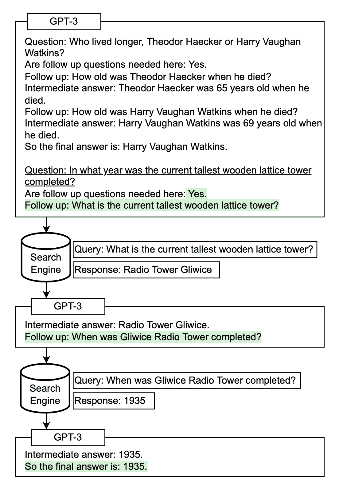
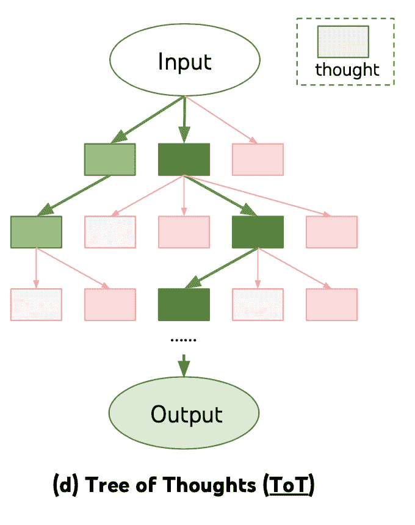
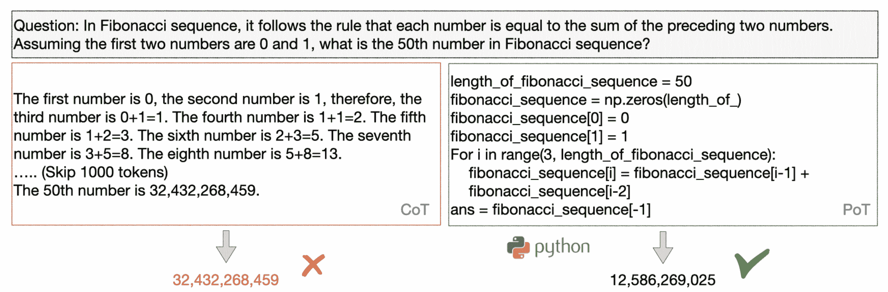
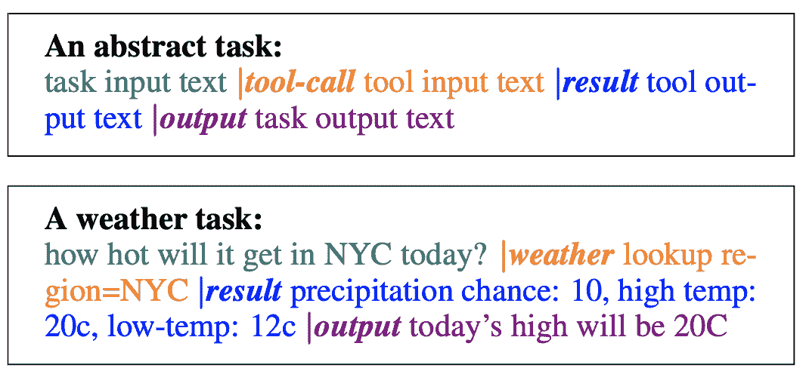
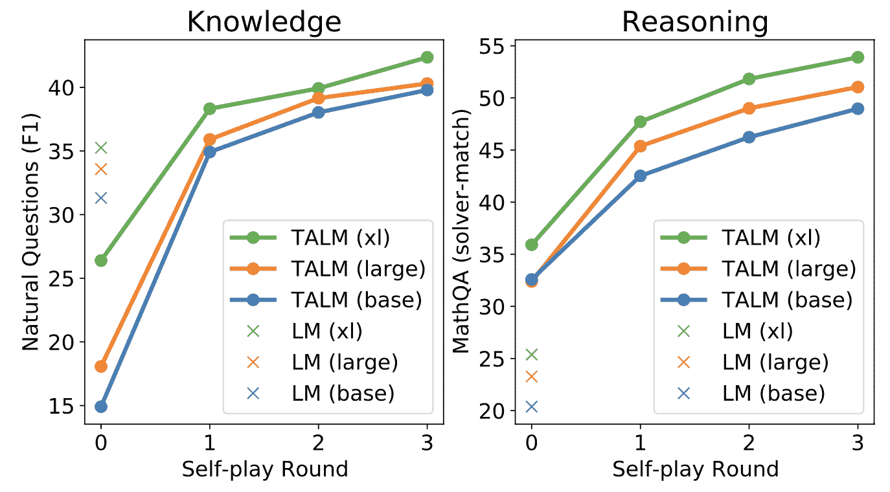
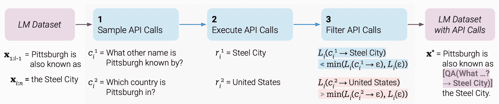
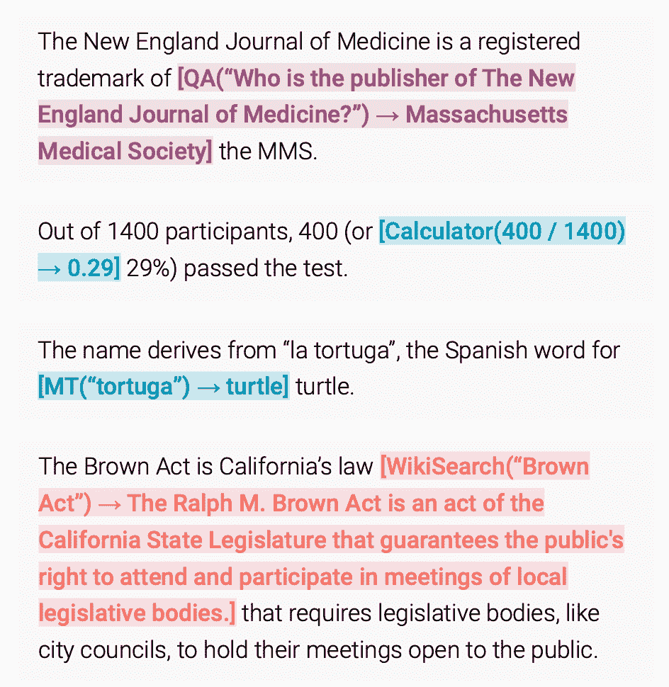

# 提示工程

> 原文：[`lilianweng.github.io/posts/2023-03-15-prompt-engineering/`](https://lilianweng.github.io/posts/2023-03-15-prompt-engineering/)

**提示工程**，也称为**上下文提示**，指的是如何与 LLM 进行通信以引导其行为以实现期望的结果，*而不更新模型权重*。这是一门经验科学，提示工程方法的效果在模型之间可能有很大差异，因此需要大量的实验和启发式方法。

本文仅关注自回归语言模型的提示工程，因此与填空测试、图像生成或多模态模型无关。在本质上，提示工程的目标是关于对齐和模型可操纵性。查看我的[先前文章](https://lilianweng.github.io/posts/2021-01-02-controllable-text-generation/)关于可控文本生成。

[我个人的独特看法] 在我看来，一些提示工程论文并不值得写成 8 页长，因为这些技巧可以用一两句话解释清楚，其余都是关于基准测试。一个易于使用和共享的基准测试基础设施对社区更有益。迭代提示或外部工具使用并不容易设置。将整个研究社区对齐以采用它也不容易。

# 基本提示

零样本和少样本学习是提示模型的两种最基本方法，由许多 LLM 论文开创，并常用于 LLM 性能基准测试。

## 零样本

**零样本学习**就是简单地将任务文本提供给模型并要求结果。

（所有情感分析示例均来自 SST-2）

```py
Text: i'll bet the video game is a lot more fun than the film.
Sentiment: 
```

## 少样本

**少样本学习**提供了一组高质量的演示，每个演示都包括输入和期望的输出，在目标任务上。由于模型首先看到了好的示例，它可以更好地理解人类意图和对所需答案种类的标准。因此，少样本学习通常比零样本表现更好。然而，这是以更多的标记消耗为代价的，并且当输入和输出文本很长时可能会达到上下文长度限制。

```py
Text: (lawrence bounces) all over the stage, dancing, running, sweating, mopping his face and generally displaying the wacky talent that brought him fame in the first place.
Sentiment: positive

Text: despite all evidence to the contrary, this clunker has somehow managed to pose as an actual feature movie, the kind that charges full admission and gets hyped on tv and purports to amuse small children and ostensible adults.
Sentiment: negative

Text: for the first time in years, de niro digs deep emotionally, perhaps because he's been stirred by the powerful work of his co-stars.
Sentiment: positive

Text: i'll bet the video game is a lot more fun than the film.
Sentiment: 
```

许多研究探讨了如何构建上下文示例以最大化性能，并观察到**提示格式的选择、训练示例以及示例的顺序可能导致截然不同的性能**，从几乎随机猜测到接近最先进技术。

[赵等人（2021）](https://arxiv.org/abs/2102.09690)调查了少样本分类的情况，并提出 LLM 存在几种偏差（他们在实验中使用 GPT-3），导致高方差：(1) *多数标签偏差* 存在于如果示例中的标签分布不平衡; (2) *最近性偏差* 指的是模型可能在最后重复标签; (3) *常见标记偏差* 表明 LLM 倾向于更频繁地生成常见标记而不是罕见标记。为了克服这种偏差，他们提出了一种方法，即在输入字符串为`N/A`时，校准模型输出的标签概率为均匀分布。

### 示例选择提示

+   使用嵌入空间中的$k$-NN 聚类选择与测试示例在语义上相似的示例（[刘等人，2021](https://arxiv.org/abs/2101.06804)）

+   为了选择多样且具代表性的示例集，[苏等人（2022）](https://arxiv.org/abs/2209.01975)提出使用基于图的方法：(1) 首先，基于样本之间的嵌入（例如通过[SBERT](https://arxiv.org/abs/1908.10084)或[其他](https://arxiv.org/abs/2201.10005)[嵌入](https://platform.openai.com/docs/guides/embeddings)[模型](https://openai.com/blog/new-and-improved-embedding-model))余弦相似度构建一个有向图$G=(V, E)$，其中每个节点指向其$k$个最近邻居; (2) 从一组已选择的样本$\mathcal{L}=\emptyset$和一组剩余样本$\mathcal{U}$开始。每个样本$u \in \mathcal{U}$的得分为$$ \text{score}(u) = \sum_{v \in \{v \mid (u, v) \in E, v\in \mathcal{U}\}} s(v)\quad\text{其中}s(v)=\rho^{- \vert \{\ell \in \mathcal{L} \vert (v, \ell)\in E \}\vert},\quad\rho > 1 $$，这样如果$v$的邻居中有很多被选择，则$s(v)$较低，因此评分鼓励选择多样化的样本。

+   [鲁宾等人（2022）](https://arxiv.org/abs/2112.08633)提出通过对比学习专门针对一个训练数据集进行嵌入训练，以进行上下文学习样本选择。对于每个训练对$(x, y)$，一个示例$e_i$（格式化的输入-输出对）的质量可以通过 LM 分配的条件概率来衡量：$\text{score}(e_i) = P_\text{LM}(y \mid e_i, x)$。我们可以将具有前$k$和后$k$分数的其他示例识别为每个训练对的正面和负面候选集，并将其用于对比学习。

+   一些研究人员尝试使用[Q 学习](https://lilianweng.github.io/posts/2018-02-19-rl-overview/#q-learning-off-policy-td-control)进行样本选择。([张等人，2022](https://arxiv.org/abs/2211.04486))

+   受不确定性驱动的[主动学习](https://lilianweng.github.io/posts/2022-02-20-active-learning/)的启发，[Diao 等人（2023）](https://arxiv.org/abs/2302.12246)建议识别在多次抽样试验中存在高争议或熵的示例。然后注释这些示例以在少样本提示中使用。

### 示例排序的提示

+   一个一般建议是保持示例选择多样化，与测试样本相关，并以随机顺序排列，以避免多数标签偏见和最新偏见。

+   增加模型大小或包含更多训练示例并不能减少上下文示例中不同排列之间的方差。同样的顺序可能对一个模型效果很好，但对另一个模型效果很差。当验证集有限时，考虑选择顺序，使得模型不会产生极端不平衡的预测或对其预测过于自信。([Lu 等人，2022](https://arxiv.org/abs/2104.08786))

# 指导提示

在提示中呈现少样本示例的目的是向模型解释我们的意图；换句话说，以示范的形式向模型描述任务指导。然而，少样本可能在标记使用方面昂贵，并且由于有限的上下文长度限制了输入长度。那么，为什么不直接给出指导呢？

*指导式语言模型*（例如[InstructGPT](https://openai.com/research/instruction-following)，[自然指导](https://github.com/allenai/natural-instructions)）通过高质量的（任务指导，输入，期望输出）元组对预训练模型进行微调，以使语言模型更好地理解用户意图并遵循指导。[RLHF](https://lilianweng.github.io/posts/2021-01-02-controllable-text-generation/#rl-fine-tuning-with-human-preferences)（从人类反馈中进行强化学习）是一种常见的方法。指导式微调的好处在于改进模型与人类意图更加一致，并大大降低了沟通成本。

与指导模型交互时，我们应该详细描述任务要求，尽量*具体*和*精确*，避免说“不要做某事”，而是明确指定要做什么。

```py
Please label the sentiment towards the movie of the given movie review. The sentiment label should be "positive" or "negative". 
Text: i'll bet the video game is a lot more fun than the film. 
Sentiment: 
```

解释所需的受众是另一种明智的给出指导的方式

+   例如，为儿童制作教育材料，

```py
Describe what is quantum physics to a 6-year-old. 
```

+   以及安全内容，

```py
... in language that is safe for work. 
```

*上下文指导学习*（[Ye 等人，2023](https://arxiv.org/abs/2302.14691)）将少样本学习与指导提示相结合。它在提示中整合了不同任务中的多个示例，每个示例包括指导、任务输入和输出。请注意，他们的实验仅针对分类任务，指导提示包含所有标签选项。

```py
Definition: Determine the speaker of the dialogue, "agent" or "customer".
Input: I have successfully booked your tickets.
Ouput: agent

Definition: Determine which category the question asks for, "Quantity" or "Location".
Input: What's the oldest building in US?
Ouput: Location

Definition: Classify the sentiment of the given movie review, "positive" or "negative".
Input: i'll bet the video game is a lot more fun than the film.
Output: 
```

# 自一致性抽样

**自一致性抽样**（[Wang 等人，2022a](https://arxiv.org/abs/2203.11171)）是通过温度大于 0 的多个输出进行抽样，然后从这些候选项中选择最佳答案。选择最佳候选项的标准可能因任务而异。一个通用的解决方案是选择**多数投票**。对于易于验证的任务，比如带有单元测试的编程问题，我们可以简单地通过解释器运行并使用单元测试验证正确性。

# 思维链（CoT）

**思维链（CoT）提示**（[魏等人，2022](https://arxiv.org/abs/2201.11903)）生成一系列简短的句子来逐步描述推理逻辑，称为*推理链*或*理由*，最终导致最终答案。 CoT 对于**复杂的推理任务**效果更为显著，而使用**大型模型**（例如具有超过 50B 参数的模型）。简单任务只能从 CoT 提示中稍微受益。

## CoT 提示的类型

CoT 提示的两种主要类型：

+   **少样本 CoT**。这是通过几个示例提示模型，每个示例包含手动编写（或模型生成的）高质量推理链。

（所有数学推理示例均来自[GSM8k](https://github.com/openai/grade-school-math)）

```py
Question: Tom and Elizabeth have a competition to climb a hill. Elizabeth takes 30 minutes to climb the hill. Tom takes four times as long as Elizabeth does to climb the hill. How many hours does it take Tom to climb up the hill?
Answer: It takes Tom 30*4 = <<30*4=120>>120 minutes to climb the hill.
It takes Tom 120/60 = <<120/60=2>>2 hours to climb the hill.
So the answer is 2.
===
Question: Jack is a soccer player. He needs to buy two pairs of socks and a pair of soccer shoes. Each pair of socks cost $9.50, and the shoes cost $92\. Jack has $40\. How much more money does Jack need?
Answer: The total cost of two pairs of socks is $9.50 x 2 = $<<9.5*2=19>>19.
The total cost of the socks and the shoes is $19 + $92 = $<<19+92=111>>111.
Jack need $111 - $40 = $<<111-40=71>>71 more.
So the answer is 71.
===
Question: Marty has 100 centimeters of ribbon that he must cut into 4 equal parts. Each of the cut parts must be divided into 5 equal parts. How long will each final cut be?
Answer: 
```

+   **零样本 CoT**。使用自然语言语句如`让我们逐步思考`明确鼓励模型首先生成推理链，然后提示`因此，答案是`来生成答案（[小岛等人，2022](https://arxiv.org/abs/2205.11916)）。或类似语句`让我们逐步解决这个问题，以确保我们有正确的答案`（[周等人，2022](https://arxiv.org/abs/2211.01910)）。

```py
Question: Marty has 100 centimeters of ribbon that he must cut into 4 equal parts. Each of the cut parts must be divided into 5 equal parts. How long will each final cut be?
Answer: Let's think step by step. 
```

## 提示和扩展

+   自一致性抽样可以通过抽样多个不同的答案然后进行多数投票来提高推理准确性。([Wang 等人，2022a](https://arxiv.org/abs/2203.11171))

+   另一种集成学习的方法是改变示例顺序或使用模型生成的理由替换人工编写的理由，在多次样本试验中引入随机性。然后用多数投票聚合模型输出以获得最终答案。([Wang 等人，2022b](https://arxiv.org/abs/2207.00747))

+   如果训练示例仅与真实答案相关（易于验证！）但没有理由，我们可以遵循*STaR*（自学习推理者；[Zelikman 等人，2022](https://arxiv.org/abs/2203.14465)）方法：（1）要求 LLM 生成推理链，仅保留导致正确答案的链条；（2）然后用生成的理由微调模型，并重复该过程直至收敛。请注意，较高的温度更有可能生成带有正确答案的不正确理由。如果训练示例没有地面真实答案，也许可以考虑使用多数投票作为“正确”答案。

+   具有更高推理复杂性演示的提示可以实现更好的性能，其中复杂性由链中推理步骤的数量来衡量。在分离推理步骤时，换行符`\n`比`步骤 i`、句号`.`或分号`;`更有效。([Fu 等人，2023](https://arxiv.org/abs/2210.00720))

+   *基于复杂性的一致性*是明确偏好于所有生成中的复杂链，通过在仅前$k$个复杂链中进行多数投票来实现。([Fu 等人，2023](https://arxiv.org/abs/2210.00720))

+   后来，[Shum 等人（2023）](https://arxiv.org/abs/2302.12822) 在实验中发现，只有复杂示例的 CoT 提示可以提高复杂问题的准确性，但在简单问题上表现不佳；GSM8k 上的证据显示。

+   将`Q：`更改为`问题：`被发现是有帮助的。([Fu 等人，2023](https://arxiv.org/abs/2210.00720))

+   [Ye & Durrett（2022）](https://arxiv.org/abs/2205.03401) 发现，在提示中包含解释对涉及对文本进行推理的 NLP 任务（即 QA 和 NLI）的效益较小至中等，并且效果因模型而异。他们观察到解释更有可能是非事实性的，而不是不一致的（即解释是否包含预测）。非事实性解释最有可能导致不正确的预测。

+   *自问*（[Press 等人，2022](https://arxiv.org/abs/2210.03350)）是一种反复提示模型*提出后续问题*以迭代构建思维过程的方法。后续问题可以通过搜索引擎结果回答。类似地，*IRCoT*（交错检索 CoT；[Trivedi 等人，2022](https://arxiv.org/abs/2212.10509)）和*ReAct*（Reason + Act；[Yao 等人，2023](https://arxiv.org/abs/2210.03629)）将迭代 CoT 提示与查询维基百科 API 以搜索相关实体和内容并将其添加回上下文。



图 1。自问如何与外部搜索查询配合工作。

（图片来源：[Press 等人，2022](https://arxiv.org/abs/2210.03350)）。

+   *思维树*（[Yao 等人，2023](https://arxiv.org/abs/2305.10601)）通过在每一步探索多个推理可能性来扩展 CoT。它首先将问题分解为多个思考步骤，并在每一步生成多个思考，从根本上创建了一棵树结构。搜索过程可以是 BFS 或 DFS，而每个状态都由分类器（通过提示）或多数投票评估。



图 2。自问如何与外部搜索查询配合工作。

（图片来源：[Yao 等人，2022](https://arxiv.org/abs/2305.10601)）。

# 自动提示设计

提示是一系列前缀标记，增加了在给定输入时获得所需输出的概率。因此，我们可以将它们视为可训练参数，并通过梯度下降直接在嵌入空间上进行优化，例如**AutoPrompt**（[Shin 等人，2020](https://arxiv.org/abs/2010.15980)）、**Prefix-Tuning**（[Li & Liang，2021](https://arxiv.org/abs/2101.00190)）、**P-tuning**（[Liu 等人，2021](https://arxiv.org/abs/2103.10385)）和**Prompt-Tuning**（[Lester 等人，2021](https://arxiv.org/abs/2104.08691)）。[我“可控神经文本生成”文章中的这一部分](https://lilianweng.github.io/posts/2021-01-02-controllable-text-generation/#smart-prompt-design)对它们有很好的覆盖。从 AutoPrompt 到 Prompt-Tuning 的趋势是设置逐渐简化。

**APE**（自动提示工程师；[Zhou 等人，2022](https://arxiv.org/abs/2211.01910)）是一种方法，用于在模型生成的指令候选项池中搜索，然后根据选择的评分函数过滤候选集，最终选择得分最高的最佳候选项。

1.  提示 LLM 根据少量演示形式的输入-输出对生成指令候选项。例如`{{给定所需的输入-输出对}}\n\n 指令是`。

1.  给定数据集$\mathcal{D}_\text{train} = \{(x, y)\}$，我们希望找到一个指令$\rho$，使得$\rho^* = \arg\max_\rho \mathbb{E}_{(x, y) \in \mathcal{D}_\text{train}} [f(\rho, x, y)]$，其中$f(.)$是一个逐样本评分函数，例如执行准确性$\mathbb{1}[\text{LM}(.\vert \rho, x)=y]$或对数概率：$p_\text{LM}(y \mid \rho, x)$。

1.  使用迭代的蒙特卡洛搜索方法通过提示提出语义相似的变体来改进最佳候选项，例如`生成以下指令的变体，保持语义含义。\n\n 输入：...\n\n 输出：...`

为了自动构建思维链提示，[Shum 等人（2023）](https://arxiv.org/abs/2302.12822)建议增强-修剪-选择，一个三步过程：

1.  *增强*：使用少样本或零样本 CoT 提示生成多个思维伪链；

1.  *修剪*：根据生成的答案是否与基本事实匹配来修剪伪链。

1.  *选择*：应用方差减少的策略梯度策略来学习所选示例的概率分布，同时考虑示例的概率分布作为策略和验证集准确性作为奖励。

[Zhang 等人（2023）](https://arxiv.org/abs/2210.03493)反而采用*聚类*技术来抽样问题，然后生成链。他们观察到 LLMs 倾向于产生某些类型的错误。一种类型的错误可能在嵌入空间中相似，因此被分组在一起。通过仅从频繁错误聚类中抽样一个或几个，我们可以防止一种错误类型产生过多错误演示，并收集多样化的示例。

1.  *问题聚类*：嵌入问题并运行$k$-means 进行聚类。

1.  *演示选择*：从每个聚类中选择一组代表性问题；即每个聚类中选择一个演示。每个聚类中的样本按与聚类中心的距离排序，距离聚类中心更近的先被选择。

1.  *理由生成*：使用零-shot CoT 生成选定问题的推理链，并构建少-shot 提示来运行推理。

# 增强语言模型

[Mialon 等人（2023）](https://arxiv.org/abs/2302.07842)对增强语言模型进行了调查，涵盖了多个类别的具有推理技能和使用外部工具能力的语言模型。推荐一下。

## 检索

我们经常需要在模型预训练截止时间或内部/私有知识库之后完成需要最新知识的任务。在这种情况下，如果我们不在提示中明确提供上下文，模型将不知道上下文。许多[开放领域问答](https://lilianweng.github.io/posts/2020-10-29-odqa/)的方法首先依赖于对知识库进行检索，然后将检索到的内容作为提示的一部分。这一过程的准确性取决于检索和生成步骤的质量。

[Lazaridou 等人（2022）](https://arxiv.org/abs/2203.05115)研究了如何利用 Google 搜索进行文档检索以增强 LLMs。给定一个问题$q$，从 Google 返回的 20 个 URL 中提取干净文本，得到一组文档。由于这些文档很长，每个文档被分成 6 句的段落$\{p\}$。段落根据证据段落和查询之间基于 TF-IDF 的余弦相似度进行排名。只使用最相关的段落来生成答案$a$的提示。

对于闭卷问答，每个演示的格式如下以构建少-shot 提示。发现将问题与证据互换（问题和答案之间的距离更远）通常会导致所有数据集的结果一致较低。

```py
Evidence: ...
Question: ...
Answer: ... 
```

答案概率有三种计算方式：

1.  [RAG](https://lilianweng.github.io/posts/2020-10-29-odqa/#RAG)风格，$p(a_i \mid q) = \sum_{i=1}^n p_\text{tf-idf} (p_i \mid q) \cdot p_\text{LM}(a_i \mid q, p_i)$，其中$p_\text{tf-idf} (p_i \mid q)$是 TF-IDF 段落和问题表示之间的归一化余弦相似度。

1.  噪声信道推理，$p(a_i\mid q) = \frac{p_\text{LM}(q \mid a_i, p_i) \cdot p_\text{LM}(a_i \mid p_i)}{p_\text{LM}(q \mid p_i)}$

1.  专家乘积（PoE），结合了上述所有概率以及 $p_\text{LM}(p_i \mid q)$。

根据他们在生成和分类任务上的实验，三个答案重新排名得分中 - PoE > Noisy channel > RAG。在个别概率中，$p_\text{LM}(a \mid q, p_i)$ 和 $p_\text{LM}(q \mid p_i, a)$ 被发现是最具信息量的。$p_\text{LM}(q \mid p_i, a)$ 捕捉了 LM 在给定证据段落和答案的情况下解释问题的能力，并可可靠用于重新排列答案候选者。

对于基于不同日期的问题的[SituatedQA](https://situatedqa.github.io/)数据集的一个观察是，尽管 LM（预训练截止年份为 2020 年）通过 Google 搜索可以获取最新信息，但其在 2020 年后的问题上的表现仍然比在 2020 年前的问题上差很多。这表明上下文信息和模型内部知识之间存在一些不一致或冲突的参数。

有趣的是，即使只有“内部检索”，即在回答问题之前生成关于主题的知识也是有益的（[Liu et al. 2022](https://arxiv.org/abs/2110.08387)）。首先，我们可以使用以下模板提取知识：

```py
Generate some knowledge about the input. Examples:

Input: What type of water formation is formed by clouds?
Knowledge: Clouds are made of water vapor.

Input: {question}
Knowledge: 
```

然后通过模型生成的知识，进一步提示 LM 获取答案。

## 编程语言

**PAL**（程序辅助语言模型；[Gao et al. 2022](https://arxiv.org/abs/2211.10435)）和 **PoT**（思维方案提示程序；[Chen et al. 2022](https://arxiv.org/abs/2211.12588)）都要求 LLM 生成编程语言语句来解决自然语言推理问题，从而将解决步骤转移到运行时，如 Python 解释器。这种设置将复杂的计算和推理分离开来。它依赖于具有足够良好编码技能的 LM。



图 3。比较 CoT 和 PoT。（图片来源：[Chen et al. 2022](https://arxiv.org/abs/2211.12588)）。

## 外部 APIs

**TALM**（工具增强语言模型；[Parisi et al. 2022](https://arxiv.org/abs/2205.12255)）是一个通过文本到文本 API 调用增强的语言模型。LM 被引导生成`|tool-call`和`tool input text`，条件是任务输入文本以构建 API 调用请求。当`|result`出现时，指定的工具 API 被调用，并返回的结果被附加到文本序列中。最终输出遵循`|output`标记。



图 4。TALM 中 API 调用的格式。（图片来源：[Parisi et al. 2022](https://arxiv.org/abs/2205.12255)）。

TALM 采用自我对弈方法来迭代地引导工具使用示例数据集，并用其对 LM 进行微调。这种自我对弈被定义为模型与工具 API 交互，根据新添加的工具 API 是否能改善模型输出来迭代地扩展数据集。Toolformer 中也采用了相同的思想，下面将更详细地描述。该流程松散地模拟了一个强化学习过程，其中 LM 是策略网络，并通过二进制奖励信号进行策略梯度训练。



图 5\. 自我对弈迭代有助于提升模型性能。

(图片来源：[Parisi 等人 2022](https://arxiv.org/abs/2205.12255))。

**Toolformer** ([Schick 等人 2023](https://arxiv.org/abs/2302.04761)) 是一个 LM，可以通过简单的 API 使用外部工具，以自监督方式构建，并且每个 API 只需要少量演示。Toolformer 的工具箱包括：

+   *计算器* 帮助 LM 解决数学技能不精确的问题；

+   *问答系统* 帮助处理不忠实内容和幻觉；

+   *搜索引擎* 在预训练截止时间后提供最新信息；

+   *翻译系统* 以提高低资源语言的性能；

+   *日历* 使 LM 意识到时间的推移。



图 6\. 如何构建 Toolformer 的示意图。

(图片来源：[Schick 等人 2023](https://arxiv.org/abs/2302.04761))。

Toolformer 的训练如下：

1.  *提示注释潜在的 API 调用*。通过少量示例 API 调用使用预训练 LM 对数据集进行注释。格式示例：

    

    图 7\. 如何对数据集进行注释以进行 API 调用。

    (图片来源：[Schick 等人 2023](https://arxiv.org/abs/2302.04761))。

    +   每个 API 调用表示为 (API 名称，相应输入) 的元组，$c=(a_c, i_c)$，其相应结果表示为 $r$。具有结果和无结果的 API 调用序列分别标记如下：

        $$ \begin{aligned} e(c) &= \langle\texttt{API}\rangle a_c(i_c) \langle\texttt{/API}\rangle \\ e(c, r) &= \langle\texttt{API}\rangle a_c(i_c) \to r \langle\texttt{/API}\rangle \end{aligned} $$

    +   基于概率 $p_\text{LM}(\langle\texttt{API}\rangle \mid \text{prompt}(\mathbf{x}), \mathbf{x}_{1:i})$ 的样本 API 调用，并在概率大于阈值时选择在位置 $i$ 进行 API 调用的前 $k$ 个候选位置。

    +   然后我们从 LM 中给定序列 $[\text{prompt}(\mathbf{x}), x_1, \dots, x_{i-1}, \langle\texttt{API}\rangle]$ 作为前缀和 $\langle\texttt{/API}\rangle$ 作为后缀中抽样潜在的 API 调用。

1.  *根据 API 调用是否帮助模型预测未来标记来筛选注释*。使用自监督损失来决定哪些 API 调用实际上是有帮助的。

    +   执行每个 API 调用 $c_i$ 以获得相应结果 $r_i$。

    +   当模型以提示为前缀时，计算 LM 在标记$x_i, \dots, x_n$上的加权交叉熵损失。计算两个版本，一个带有 API 结果，另一个带有空序列$\varepsilon$。

        $$ \begin{aligned} L^+_i &= L_i(e(c_i, r_i)) \\ L^-_i &= \min(L_i(\varepsilon), L_i(e(c_i, \varepsilon))) \\ \end{aligned} $$

        只有$L^-_i - L^+_i$大于阈值的 API 调用会被保留，这意味着添加此 API 调用及其结果有助于模型预测未来的标记。

1.  *在这个注释数据集上微调 LM。* 新的训练序列构建为$\mathbf{x}^* = x_{1:i-1}, e(c_i, r_i), x_{i:n}$。训练数据是原始数据集的组合（例如，如论文中所述的 CCNet 的子集）及其增强版本。

推理时，解码会一直运行，直到模型产生“$\to$”标记，表示它正在等待下一个 API 调用的响应。

Toolformer 目前不支持链式工具使用（即使用一个工具的输出作为另一个工具的输入）或交互方式（即在人类选择后采用 API 响应）。这两种方式都是未来扩展模型的有趣方向。

# 引用

引用为：

> 翁，莉莉安。 (2023 年 3 月)。提示工程。Lil’Log。https://lilianweng.github.io/posts/2023-03-15-prompt-engineering/。

或

```py
@article{weng2023prompt,
  title   = "Prompt Engineering",
  author  = "Weng, Lilian",
  journal = "lilianweng.github.io",
  year    = "2023",
  month   = "Mar",
  url     = "https://lilianweng.github.io/posts/2023-03-15-prompt-engineering/"
} 
```

# 有用资源

+   [OpenAI Cookbook](https://github.com/openai/openai-cookbook)有许多深入的示例，展示如何高效利用 LLM。

+   [LangChain](https://langchain.readthedocs.io/en/latest/)，一个用于将语言模型与其他组件结合构建应用程序的库。

+   [Prompt Engineering Guide](https://github.com/dair-ai/Prompt-Engineering-Guide)存储库包含了关于提示工程的教育材料的相当全面的收集。

+   [learnprompting.org](https://learnprompting.org/docs/intro)

+   [PromptPerfect](https://promptperfect.jina.ai)

+   [Semantic Kernel](https://github.com/microsoft/semantic-kernel)

# 参考文献

[1] 赵等人 [“使用前校准：改善语言模型的少样本性能。”](https://arxiv.org/abs/2102.09690) ICML 2021

[2] 刘等人 [“GPT-3 的上下文示例是什么使之优秀？”](https://arxiv.org/abs/2101.06804) arXiv 预印本 arXiv:2101.06804 (2021)。

[3] 卢等人 [“奇妙有序的提示及其发现之处：克服少样本提示顺序敏感性。”](https://arxiv.org/abs/2104.08786) ACL 2022

[4] 叶等人 [“上下文指导学习。”](https://arxiv.org/abs/2302.14691) arXiv 预印本 arXiv:2302.14691 (2023)。

[5] 苏等人 [“选择性注释使语言模型更好的少样本学习者。”](https://arxiv.org/abs/2209.01975) arXiv 预印本 arXiv:2209.01975 (2022)。

[6] 鲁宾等人 [“学习为上下文学习检索提示。”](https://arxiv.org/abs/2112.08633) NAACL-HLT 2022

[7] 魏等人 [“思维链提示引发大型语言模型的推理。”](https://arxiv.org/abs/2201.11903) NeurIPS 2022

[8] 王等人 [“自一致性改善语言模型中的思维链推理。”](https://arxiv.org/abs/2203.11171) ICLR 2023.

[9] 刁等人 [“大型语言模型的主动提示与思维链。”](https://arxiv.org/abs/2302.12246) arXiv 预印本 arXiv:2302.12246 (2023).

[10] 泽利克曼等人 [“STaR：用推理引导推理。”](https://arxiv.org/abs/2203.14465) arXiv 预印本 arXiv:2203.14465 (2022).

[11] 叶 & 达雷特 [“少样本情境学习中解释的不可靠性。”](https://arxiv.org/abs/2205.03401) arXiv 预印本 arXiv:2205.03401 (2022).

[12] 特里韦迪等人 [“交错检索与思维链推理相结合，用于知识密集型多步问题。”](https://arxiv.org/abs/2212.10509) arXiv 预印本 arXiv:2212.10509 (2022).

[13] 普雷斯等人 [“衡量和缩小语言模型中的组合性差距。”](https://arxiv.org/abs/2210.03350) arXiv 预印本 arXiv:2210.03350 (2022).

[14] 姚等人 [“ReAct：在语言模型中协同推理和行动。”](https://arxiv.org/abs/2210.03629) ICLR 2023.

[15] 傅等人 [“基于复杂性的多步推理提示。”](https://arxiv.org/abs/2210.00720) arXiv 预印本 arXiv:2210.00720 (2022).

[16] 王等人 [“基于原因的集成在语言模型中。”](https://arxiv.org/abs/2207.00747) arXiv 预印本 arXiv:2207.00747 (2022).

[17] 张等人 [“大型语言模型中的自动思维链提示。”](https://arxiv.org/abs/2210.03493) arXiv 预印本 arXiv:2210.03493 (2022).

[18] 沈等人 [“使用标记数据的思维链自动提示增强和选择。”](https://arxiv.org/abs/2302.12822) arXiv 预印本 arXiv:2302.12822 (2023).

[19] 周等人 [“大型语言模型是人类级别的提示工程师。”](https://arxiv.org/abs/2211.01910) ICLR 2023.

[20] 拉扎里多等人 [“通过少样本提示增强互联网语言模型，用于开放域问答。”](https://arxiv.org/abs/2203.05115) arXiv 预印本 arXiv:2203.05115 (2022).

[21] 陈等人 [“思维提示程序：将计算与推理分离，用于数值推理任务。”](https://arxiv.org/abs/2211.12588) arXiv 预印本 arXiv:2211.12588 (2022).

[22] 高等人 [“PAL：程序辅助语言模型。”](https://arxiv.org/abs/2211.10435) arXiv 预印本 arXiv:2211.10435 (2022).

[23] 帕里西等人 [“TALM：工具增强语言模型”](https://arxiv.org/abs/2205.12255) arXiv 预印本 arXiv:2205.12255 (2022).

[24] 施克等人 [“Toolformer：语言模型可以自我教导使用工具。”](https://arxiv.org/abs/2302.04761) arXiv 预印本 arXiv:2302.04761 (2023).

[25] 米亚隆等人 [“增强语言模型：一项调查”](https://arxiv.org/abs/2302.07842) arXiv 预印本 arXiv:2302.07842 (2023).

[26] 姚等人 [“思维之树：大型语言模型的刻意问题解决。”](https://arxiv.org/abs/2305.10601) arXiv 预印本 arXiv:2305.10601 (2023).
