# 变压器家族版本 2.0

> 原文：[`lilianweng.github.io/posts/2023-01-27-the-transformer-family-v2/`](https://lilianweng.github.io/posts/2023-01-27-the-transformer-family-v2/)

自从我三年前关于[变压器家族](https://lilianweng.github.io/posts/2020-04-07-the-transformer-family/)的最后一篇文章以来，许多新的变压器架构改进已经被提出。在这里，我对那篇 2020 年的文章进行了大规模的重构和丰富 — 重新构建了各个部分的层次结构，并用更多最新的论文改进了许多部分。版本 2.0 是旧版本的超集，长度大约是旧版本的两倍。

# 符号说明

| 符号 | 含义 |
| --- | --- |
| $d$ | 模型大小 / 隐藏状态维度 / 位置编码大小。 |
| $h$ | 多头注意力层中的头数。 |
| $L$ | 输入序列的段长度。 |
| $N$ | 模型中的注意力层总数；不考虑 MoE。 |
| $\mathbf{X} \in \mathbb{R}^{L \times d}$ | 输入序列，其中每个元素都映射为形状为 $d$ 的嵌入向量，与模型大小相同。 |
| $\mathbf{W}^k \in \mathbb{R}^{d \times d_k}$ | 键权重矩阵。 |
| $\mathbf{W}^q \in \mathbb{R}^{d \times d_k}$ | 查询权重矩阵。 |
| $\mathbf{W}^v \in \mathbb{R}^{d \times d_v}$ | 值权重矩阵。通常情况下 $d_k = d_v = d$。 |
| $\mathbf{W}^k_i, \mathbf{W}^q_i \in \mathbb{R}^{d \times d_k/h}; \mathbf{W}^v_i \in \mathbb{R}^{d \times d_v/h}$ | 每个头部的权重矩阵。 |
| $\mathbf{W}^o \in \mathbb{R}^{d_v \times d}$ | 输出权重矩阵。 |
| $\mathbf{Q} = \mathbf{X}\mathbf{W}^q \in \mathbb{R}^{L \times d_k}$ | 查询嵌入输入。 |
| $\mathbf{K} = \mathbf{X}\mathbf{W}^k \in \mathbb{R}^{L \times d_k}$ | 键嵌入输入。 |
| $\mathbf{V} = \mathbf{X}\mathbf{W}^v \in \mathbb{R}^{L \times d_v}$ | 值嵌入输入。 |
| $\mathbf{q}_i, \mathbf{k}_i \in \mathbb{R}^{d_k}, \mathbf{v}_i \in \mathbb{R}^{d_v}$ | 查询、键、值矩阵中的行向量，$\mathbf{Q}$、$\mathbf{K}$ 和 $\mathbf{V}$。 |
| $S_i$ | 第 $i$ 个查询 $\mathbf{q}_i$ 要关注的键位置集合。 |
| $\mathbf{A} \in \mathbb{R}^{L \times L}$ | 输入序列长度为 $L$ 时，自注意力矩阵。$\mathbf{A} = \text{softmax}(\mathbf{Q}\mathbf{K}^\top / \sqrt{d_k})$。 |
| $a_{ij} \in \mathbf{A}$ | 查询 $\mathbf{q}_i$ 和键 $\mathbf{k}_j$ 之间的标量注意力分数。 |
| $\mathbf{P} \in \mathbb{R}^{L \times d}$ | 位置编码矩阵，第 $i$ 行 $\mathbf{p}_i$ 是输入 $\mathbf{x}_i$ 的位置编码。 |

# 变压器基础知识

**Transformer**（将被称为“普通 Transformer”以区别于其他增强版本；[Vaswani 等人，2017](https://arxiv.org/abs/1706.03762)）模型具有编码器-解码器架构，与许多[NMT](https://lilianweng.github.io/posts/2018-06-24-attention/#born-for-translation)模型中常用的相同。后来简化的 Transformer 在语言建模任务中表现出色，例如仅编码器的[BERT](https://lilianweng.github.io/posts/2019-01-31-lm/#bert)或仅解码器的[GPT](https://lilianweng.github.io/posts/2019-01-31-lm/#openai-gpt)。

## 注意力和自注意力

**注意力机制** 是神经网络中的一种机制，模型可以通过有选择地关注给定的数据集来进行预测。注意力的多少由学习到的权重来量化，因此输出通常形成加权平均。

**自注意力** 是一种注意力机制的类型，模型通过使用关于同一样本的其他部分的观察来预测数据样本的一部分。从概念上讲，它与[非局部均值](https://en.wikipedia.org/wiki/Non-local_means)感觉相似。还要注意自注意力是排列不变的；换句话说，它是对集合的操作。

注意力/自注意力有各种形式，Transformer（[Vaswani 等人，2017](https://arxiv.org/abs/1706.03762)）依赖于*缩放点积注意力*：给定一个查询矩阵$\mathbf{Q}$，一个键矩阵$\mathbf{K}$和一个值矩阵$\mathbf{V}$，输出是值向量的加权和，其中分配给每个值槽的权重由查询与相应键的点积确定：

$$ \text{attn}(\mathbf{Q}, \mathbf{K}, \mathbf{V}) = \text{softmax}(\frac{\mathbf{Q} {\mathbf{K}}^\top}{\sqrt{d_k}})\mathbf{V} $$

对于查询和键向量$\mathbf{q}_i, \mathbf{k}_j \in \mathbb{R}^d$（查询和键矩阵中的行向量），我们有一个标量分数：

$$ a_{ij} = \text{softmax}(\frac{\mathbf{q}_i {\mathbf{k}_j}^\top}{\sqrt{d_k}}) = \frac{\exp(\mathbf{q}_i {\mathbf{k}_j}^\top)}{ \sqrt{d_k} \sum_{r \in \mathcal{S}_i} \exp(\mathbf{q}_i {\mathbf{k}_r}^\top) } $$

其中$\mathcal{S}_i$是第$i$个查询要关注的键位置的集合。

如果感兴趣，可以查看我以前的[帖子中的其他类型的注意力](https://lilianweng.github.io/posts/2018-06-24-attention/#a-family-of-attention-mechanisms)。

## 多头自注意力

**多头自注意力** 模块是 Transformer 中的一个关键组件。与仅计算一次注意力不同，多头机制将输入分成较小的块，然后并行计算每个子空间上的缩放点积注意力。独立的注意力输出简单地连接并线性转换为期望的维度。

$$ \begin{aligned} \text{MultiHeadAttn}(\mathbf{X}_q, \mathbf{X}_k, \mathbf{X}_v) &= [\text{head}_1; \dots; \text{head}_h] \mathbf{W}^o \\ \text{where head}_i &= \text{Attention}(\mathbf{X}_q\mathbf{W}^q_i, \mathbf{X}_k\mathbf{W}^k_i, \mathbf{X}_v\mathbf{W}^v_i) \end{aligned} $$

其中$[.;.]$是一个连接操作。$\mathbf{W}^q_i, \mathbf{W}^k_i \in \mathbb{R}^{d \times d_k/h}, \mathbf{W}^v_i \in \mathbb{R}^{d \times d_v/h}$是权重矩阵，用于将大小为$L \times d$的输入嵌入映射到查询、键和值矩阵。而$\mathbf{W}^o \in \mathbb{R}^{d_v \times d}$是输出的线性变换。所有权重都应在训练过程中学习。

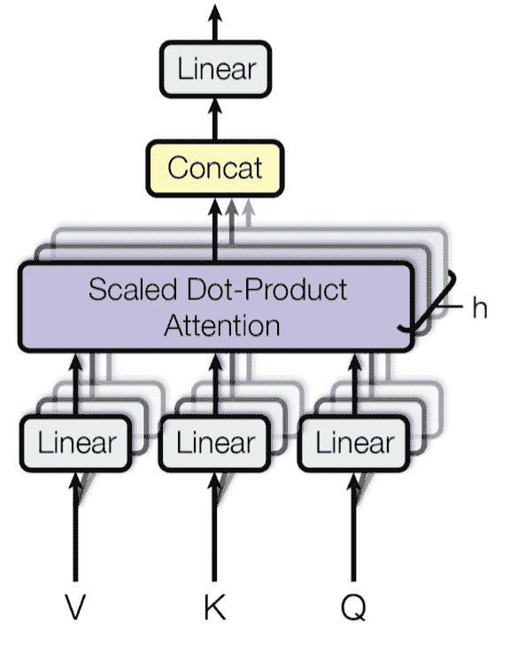

图 1。多头缩放点积注意力机制的示意图。（图片来源：[Vaswani 等人，2017 年](https://arxiv.org/abs/1706.03762)中的图 2）

## 编码器-解码器架构

**编码器**生成基于注意力的表示，具有从大背景中定位特定信息的能力。它由 6 个身份模块堆叠而成，每个包含两个子模块，一个*多头自注意力*层和一个*逐点*全连接前馈网络。逐点意味着它将相同的线性变换（使用相同的权重）应用于序列中的每个元素。这也可以看作是一个滤波器大小为 1 的卷积层。每个子模块都有一个残差连接和层归一化。所有子模块的输出数据维度都是$d$。

Transformer **解码器**的功能是从编码表示中检索信息。其架构与编码器非常相似，只是解码器包含两个多头注意力子模块，而不是每个相同重复模块中的一个。第一个多头注意力子模块是*掩码*的，以防止位置关注未来。


图 2。香草 Transformer 模型的架构。（图片来源：[Figure 17](https://lilianweng.github.io/posts/2018-06-24-attention/#full-architecture)）

## 位置编码

因为自注意力操作是置换不变的，所以使用适当的**位置编码**来为模型提供*顺序信息*是很重要的。位置编码$\mathbf{P} \in \mathbb{R}^{L \times d}$与输入嵌入具有相同的维度，因此可以直接添加到输入上。香草 Transformer 考虑了两种编码类型：

### 正弦位置编码

正弦位置编码定义如下，给定令牌位置$i=1,\dots,L$和维度$\delta=1,\dots,d$：

$$ \text{PE}(i,\delta) = \begin{cases} \sin(\frac{i}{10000^{2\delta'/d}}) & \text{if } \delta = 2\delta'\\ \cos(\frac{i}{10000^{2\delta'/d}}) & \text{if } \delta = 2\delta' + 1\\ \end{cases} $$

这样，位置编码的每个维度对应于不同维度中不同波长的正弦波，从$2\pi$到$10000 \cdot 2\pi$。


图 3. 具有$L=32$和$d=128$的正弦位置编码。数值介于-1（黑色）和 1（白色）之间，数值 0 为灰色。

### 学习的位置编码

学习的位置编码为每个元素分配一个*学习的*列向量，该向量编码其绝对位置（[Gehring 等人，2017](https://arxiv.org/abs/1705.03122)），并且这种编码可以在每一层中以不同的方式学习（[Al-Rfou 等人，2018](https://arxiv.org/abs/1808.04444)）。

### 相对位置编码

[Shaw 等人（2018）](https://arxiv.org/abs/1803.02155))将相对位置信息合并到$\mathbf{W}^k$和$\mathbf{W}^v$中。最大相对位置被剪切到最大绝对值$k$，这种剪切操作使模型能够推广到看不见的序列长度。因此，考虑$2k + 1$个唯一的边标签，让我们将$\mathbf{P}^k, \mathbf{P}^v \in \mathbb{R}^{2k+1}$表示为可学习的相对位置表示。

$$ A_{ij}^k = P^k_{\text{clip}(j - i, k)} \quad A_{ij}^v = P^v_{\text{clip}(j - i, k)} \quad \text{where }\text{clip}(x, k) = \text{clip}(x, -k, k) $$

Transformer-XL（[Dai 等人，2019](https://arxiv.org/abs/1901.02860)）提出了一种基于键和查询的点积重新参数化的相对位置编码类型。为了使位置信息在各个段之间流动一致，Transformer-XL 编码*相对*位置，因为知道位置偏移量足以进行良好的预测，即一个键向量$\mathbf{k}_{\tau, j}$和其查询$\mathbf{q}_{\tau, i}$之间的$i-j$。

如果省略标量$1/\sqrt{d_k}$和 softmax 中的归一化项，但包括位置编码，我们可以将位置$i$处的查询和位置$j$处的键之间的注意力分数写为：

$$ \begin{aligned} a_{ij} &= \mathbf{q}_i {\mathbf{k}_j}^\top = (\mathbf{x}_i + \mathbf{p}_i)\mathbf{W}^q ((\mathbf{x}_j + \mathbf{p}_j)\mathbf{W}^k)^\top \\ &= \mathbf{x}_i\mathbf{W}^q {\mathbf{W}^k}^\top\mathbf{x}_j^\top + \mathbf{x}_i\mathbf{W}^q {\mathbf{W}^k}^\top\mathbf{p}_j^\top + \mathbf{p}_i\mathbf{W}^q {\mathbf{W}^k}^\top\mathbf{x}_j^\top + \mathbf{p}_i\mathbf{W}^q {\mathbf{W}^k}^\top\mathbf{p}_j^\top \end{aligned} $$

Transformer-XL 将上述四个术语重新参数化如下：

$$ a_{ij}^\text{rel} = \underbrace{ \mathbf{x}_i\mathbf{W}^q \color{blue}{ {\mathbf{W}_E^k}^\top } \mathbf{x}_j^\top }_\text{基于内容的寻址} + \underbrace{ \mathbf{x}_i\mathbf{W}^q \color{blue}{ {\mathbf{W}_R^k}^\top } \color{green}{\mathbf{r}_{i-j}^\top} }_\text{基于内容的位置偏差} + \underbrace{ \color{red}{\mathbf{u}} \color{blue}{ {\mathbf{W}_E^k}^\top } \mathbf{x}_j^\top }_\text{全局内容偏差} + \underbrace{ \color{red}{\mathbf{v}} \color{blue}{ {\mathbf{W}_R^k}^\top } \color{green}{\mathbf{r}_{i-j}^\top} }_\text{全局位置偏差} $$

+   将 $\mathbf{p}_j$ 替换为相对位置编码 $\mathbf{r}_{i-j} \in \mathbf{R}^{d}$；

+   将 $\mathbf{p}_i\mathbf{W}^q$ 替换为两个可训练参数 $\mathbf{u}$（用于内容）和 $\mathbf{v}$（用于位置）在两个不同的术语中；

+   将 $\mathbf{W}^k$ 分为两个矩阵，$\mathbf{W}^k_E$ 用于内容信息，$\mathbf{W}^k_R$ 用于位置信息。

### 旋转位置嵌入

旋转位置嵌入（*RoPE*；[苏等人，2021](https://arxiv.org/abs/2104.09864)）用旋转矩阵对绝对位置进行编码，并将每个注意力层的键和值矩阵与之相乘，以在每一层注入相对位置信息。

当将相对位置信息编码到第 $i$ 个键和第 $j$ 个查询的内积中时，我们希望以一种方式构建函数，使内积仅涉及相对位置 $i-j$。旋转位置嵌入（RoPE）利用欧几里得空间中的旋转操作，并将相对位置嵌入简单地构建为通过与其位置索引成比例的角度旋转特征矩阵。

给定一个向量 $\mathbf{z}$，如果我们想将其逆时针旋转 $\theta$，我们可以将其乘以一个旋转矩阵得到 $R\mathbf{z}$，其中旋转矩阵 $R$ 定义为：

$$ R = \begin{bmatrix} \cos\theta & -\sin\theta \\ \sin\theta & \cos\theta \end{bmatrix} $$

当推广到更高维空间时，RoPE 将 $d$ 维空间分为 $d/2$ 个子空间，并为位置 $i$ 处的令牌构造一个大小为 $d \times d$ 的旋转矩阵 $R$：

$$ R^d_{\Theta, i} = \begin{bmatrix} \cos i\theta_1 & -\sin i\theta_1 & 0 & 0 & \dots & 0 & 0 \\ \sin i\theta_1 & \cos i\theta_1 & 0 & 0 & \dots & 0 & 0 \\ 0 & 0 & \cos i\theta_2 & -\sin i\theta_2 & \dots & 0 & 0 \\ 0 & 0 & \sin i\theta_1 & \cos i\theta_1 & \dots & 0 & 0 \\ \vdots & \vdots & \vdots & \vdots & \ddots & \vdots & \vdots \\ 0 & 0 & 0 & 0 & \dots & \cos i\theta_{d/2} & -\sin i\theta_{d/2} \\ 0 & 0 & 0 & 0 & \dots & \sin i\theta_{d/2} & \cos i\theta_{d/2} \\ \end{bmatrix} $$

在论文中，我们有 $\Theta = {\theta_i = 10000^{-2(i−1)/d}, i \in [1, 2, …, d/2]}$。请注意，这本质上等同于正弦位置编码，但被构造为一个旋转矩阵。

然后，键和查询矩阵通过与这个旋转矩阵相乘来包含位置信息：

$$ \begin{aligned} & \mathbf{q}_i^\top \mathbf{k}_j = (R^d_{\Theta, i} \mathbf{W}^q\mathbf{x}_i)^\top (R^d_{\Theta, j} \mathbf{W}^k\mathbf{x}_j) = \mathbf{x}_i^\top\mathbf{W}^q R^d_{\Theta, j-i}\mathbf{W}^k\mathbf{x}_j \\ & \text{ where } R^d_{\Theta, j-i} = (R^d_{\Theta, i})^\top R^d_{\Theta, j} \end{aligned} $$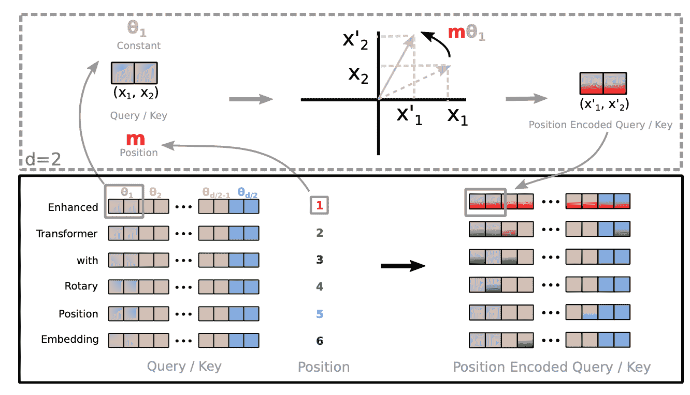

图 4。展示了旋转位置嵌入是如何实现的的视觉说明。（图片来源：[Su 等人，2021](https://arxiv.org/abs/2104.09864))

# 更长的上下文

推理时变压器模型的输入序列长度由用于训练的上下文长度上限。简单地增加上下文长度会导致时间（$\mathcal{O}(L²d)$）和内存（$\mathcal{O}(L²)$）的高消耗，并且可能由于硬件限制而无法支持。

本节介绍了改进变压器架构以更好地支持推理中的长上下文的几种方法；例如，使用额外的内存，设计更好的上下文外推，或者循环机制。

## 上下文记忆

原始变压器具有固定且有限的注意力跨度。模型在每个更新步骤中只能关注同一段中的其他元素，且信息无法在分隔的固定长度段之间流动。这种*上下文分割*会导致几个问题：

+   模型无法捕捉非常长期的依赖关系。

+   在没有或很少上下文的情况下，很难预测每个段中的前几个标记。

+   评估是昂贵的。每当段向右移动一个位置时，新段都会从头开始重新处理，尽管存在许多重叠的标记。

**Transformer-XL**（[Dai 等人，2019](https://arxiv.org/abs/1901.02860)；“XL”表示“额外长”）修改了架构，通过额外的内存在段之间重复使用隐藏状态。模型引入了段之间的循环连接，通过持续使用先前段的隐藏状态。


图 5。原始变压器和具有段长度 4 的 Transformer-XL 的训练阶段的比较。 （图片来源：[Dai 等人，2019](https://arxiv.org/abs/1901.02860)中图 2 的左侧部分）。

让我们将模型中第$n$层的第$(\tau + 1)$段的隐藏状态标记为$\mathbf{h}_{\tau+1}^{(n)} \in \mathbb{R}^{L \times d}$。除了同一段的最后一层的隐藏状态$\mathbf{h}_{\tau+1}^{(n-1)}$外，它还取决于前一段的同一层的隐藏状态$\mathbf{h}_{\tau}^{(n)}$。通过合并来自先前隐藏状态的信息，模型将注意力跨度延长到过去更长的时间，跨越多个段。

$$ \begin{aligned} \color{red}{\widetilde{\mathbf{h}}_{\tau+1}^{(n-1)}} &= [\text{stop-gradient}(\mathbf{h}_{\tau}^{(n-1)}) \circ \mathbf{h}_{\tau+1}^{(n-1)}] \\ \mathbf{Q}_{\tau+1}^{(n)} &= \mathbf{h}_{\tau+1}^{(n-1)}\mathbf{W}^q \\ \mathbf{K}_{\tau+1}^{(n)} &= \color{red}{\widetilde{\mathbf{h}}_{\tau+1}^{(n-1)}} \mathbf{W}^k \\ \mathbf{V}_{\tau+1}^{(n)} &= \color{red}{\widetilde{\mathbf{h}}_{\tau+1}^{(n-1)}} \mathbf{W}^v \\ \mathbf{h}_{\tau+1}^{(n)} &= \text{transformer-layer}(\mathbf{Q}_{\tau+1}^{(n)}, \mathbf{K}_{\tau+1}^{(n)}, \mathbf{V}_{\tau+1}^{(n)}) \end{aligned} $$

请注意，键和值都依赖于扩展的隐藏状态，而查询只消耗当前步骤的隐藏状态。连接操作 $[. \circ .]$ 沿着序列长度维度。Transformer-XL 需要使用相对位置编码，因为如果我们编码绝对位置，之前和当前的段将被分配相同的编码，这是不希望的。

**压缩变压器**（[Rae et al. 2019](https://arxiv.org/abs/1911.05507)）通过压缩过去的记忆来支持更长的序列，扩展了 Transformer-XL。它明确地为每层添加了大小为 $m_m$ 的 *记忆* 插槽，用于存储该层过去激活的记忆，以保留长期上下文。当一些过去的激活变得足够陈旧时，它们被压缩并保存在每层大小为 $m_{cm}$ 的额外 *压缩记忆* 中。

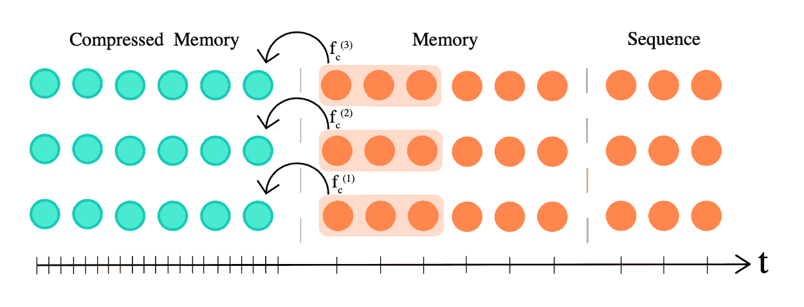

图 6\. 压缩变压器维护两种类型的记忆插槽，记忆和压缩记忆，以支持长期上下文。（图片来源：[Rae et al. 2019](https://arxiv.org/abs/1911.05507)）。

记忆和压缩记忆都是先进先出队列。给定模型上下文长度 $L$，压缩率为 $c$ 的压缩函数定义为 $f_c: \mathbb{R}^{L \times d} \to \mathbb{R}^{[\frac{L}{c}] \times d}$，将 $L$ 最旧的激活映射到 $[\frac{L}{c}]$ 个压缩记忆元素。有几种压缩函数的选择：

1.  最大/平均池化，使用内核和步幅大小 $c$；

1.  1D 卷积，使用内核和步幅大小 $c$（需要学习额外参数）；

1.  扩张卷积（需要学习额外参数）。在他们的实验中，卷积压缩在 `EnWik8` 数据集上效果最好；

1.  最常用的记忆；

压缩变压器有两个额外的训练损失：

1.  **自动编码损失**（无损压缩目标）衡量我们能够从压缩记忆中多好地重构原始记忆

    $$ \mathcal{L}_{ac} = \| \textbf{old_mem}^{(i)} - g(\textbf{new_cm}^{(i)}) \|_2 $$其中 $g: \mathbb{R}^{[\frac{L}{c}] \times d} \to \mathbb{R}^{L \times d}$ 反转压缩函数 $f$。

1.  **注意力重构损失**（有损目标）重构基于内容的注意力与压缩记忆之间的差异并最小化：

    $$ \mathcal{L}_{ar} = \|\text{attn}(\mathbf{h}^{(i)}, \textbf{old_mem}^{(i)}) − \text{attn}(\mathbf{h}^{(i)}, \textbf{new_cm}^{(i)})\|_2 $$

具有大小为$m$的记忆的 Transformer-XL 具有最大时间范围为$m \times N$，其中$N$是模型中的层数，注意力成本为$\mathcal{O}(L² + Lm)$。相比之下，压缩 Transformer 具有时间范围为$(m_m + c \cdot m_{cm}) \times N$和注意力成本$\mathcal{O}(L² + L(m_m + m_{cm}))$。更大的压缩率$c$在时间范围长度和注意力成本之间提供更好的权衡。

注意权重，从最老到最新，存储在三个位置：压缩记忆 → 记忆 → 因果屏蔽序列。在实验中，他们观察到从存储在常规记忆中的最老激活到存储在压缩记忆中的激活的注意权重增加，这意味着网络正在学习保留显著信息。

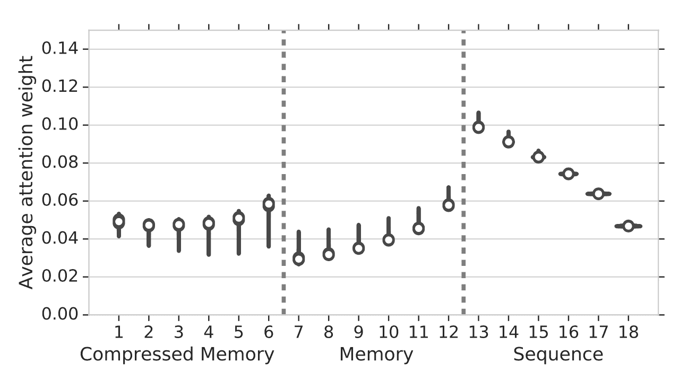

图 7. 注意权重与记忆位置的一个标准差作为误差条之间的关系，从最老（左）到最新（右）。 （图片来源：[Rae et al. 2019](https://arxiv.org/abs/1911.05507)）。

## 不可微的外部记忆

**$k$NN-LM**（[Khandelwal et al. 2020](https://arxiv.org/abs/1911.00172)）通过线性插值预测由两个模型预测的下一个标记概率来增强预训练 LM。$k$NN 模型建立在一个外部键值存储上，该存储可以存储任何大型预训练数据集或 OOD 新数据集。这个数据存储经过预处理以保存大量的对（上下文的 LM 嵌入表示，下一个标记），并且最近邻检索发生在 LM 嵌入空间中。由于数据存储可能是巨大的，我们需要依赖于快速稠密向量搜索的库，如[FAISS](https://github.com/facebookresearch/faiss)或[ScaNN](https://github.com/google-research/google-research/tree/master/scann)。索引过程只发生一次，并且推理时易于实现并行处理。

在推理时，下一个标记的概率是两个预测的加权和：

$$ \begin{aligned} p(y \vert \mathbf{x}) &= \lambda \; p_\text{kNN}(y \vert \mathbf{x}) + (1- \lambda) \; p_\text{LM}(y \vert \mathbf{x}) \\ p_\text{kNN}(y \vert \mathbf{x}) &\propto \sum_{(k_i, w_i) \in \mathcal{N}} \mathbb{1}[y = w_i] \exp(-d(k_i, f(\mathbf{x}))) \end{aligned} $$

其中$\mathcal{N}$包含由$k$NN 检索的一组最近邻数据点；$d(., .)$是诸如 L2 距离之类的距离函数。

根据实验结果，更大的数据存储大小或更大的$k$与更好的困惑度相关。加权标量$\lambda$应该进行调整，但一般来说，与域内数据相比，预计在域外数据中应该更大，并且更大的数据存储可以承受更大的$\lambda$。

**SPALM**（*自适应半参数语言模型*；[Yogatama 等人 2021](https://arxiv.org/abs/2102.02557)）结合了（1）来自外部上下文的隐藏状态的 Transformer-XL 风格记忆作为短期记忆和（2）$k$NN-LM 风格的键值存储作为长期记忆。

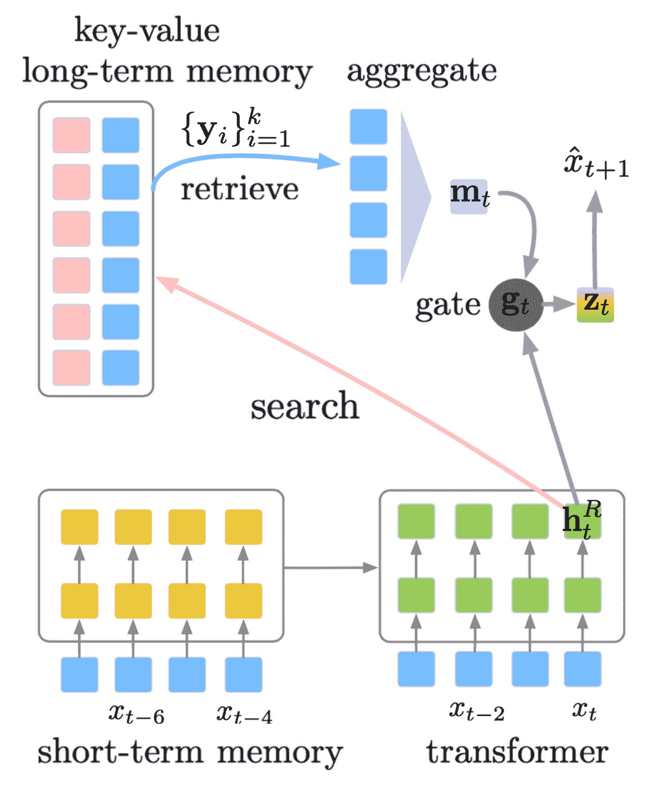

图 8\. 展示了 SPALM 如何将过去隐藏状态的上下文记忆（短期记忆）与外部键值数据存储（长期记忆）结合起来，以支持更长的上下文。（图片来源：[Yogatama 等人 2021](https://arxiv.org/abs/2102.02557)）。

SPALM 运行 $k$NN 搜索以获取与最相关上下文的 $k$ 个标记。对于每个标记，我们可以获得相同的嵌入表示，由预训练的 LM 提供，表示为 $\{\mathbf{y}_i\}_{i=1}^k$。门控机制首先使用 $\mathbf{h}^R_t$（第 $R$ 层中标记 $x_t$ 的隐藏状态）作为查询，通过简单的注意力层聚合检索到的标记嵌入，然后学习一个门控参数 $\mathbf{g}_t$ 来平衡局部信息 $\mathbf{h}^R_t$ 和长期信息 $\mathbf{m}_t$。

$$ \begin{aligned} \mathbf{m}_t &= \sum_{i=1}^k \frac{\exp(\mathbf{y}_i^\top \mathbf{h}^R_t)}{\sum_{j=1}^k \exp(\mathbf{y}_j^\top \mathbf{h}^R_t)} \cdot \mathbf{y}_i \\ \mathbf{g}_t &= \sigma(\mathbf{w}_g^\top \mathbf{h}_t^R) \\ \mathbf{z}_t &= (1 - \mathbf{g}_t) \odot \mathbf{m}_t + \mathbf{g}_t \odot \mathbf{h}^R_t \\ p(x_{t+1}\mid \mathbf{x}_{\leq t}) &= \text{softmax}(\mathbf{z}_t; \mathbf{W}) \end{aligned} $$

其中 $\mathbf{w}_g$ 是一个要学习的参数向量；$\sigma(.)$ 是 sigmoid 函数；$\mathbf{W}$ 是输入和输出标记之间共享的词嵌入矩阵。与 $k$NN-LM 不同，他们发现最近邻距离对于检索标记的聚合并不有用。

在训练过程中，长期记忆中的关键表示保持不变，由预训练的 LM 生成，但值编码器，也就是词嵌入矩阵，会被更新。

**Memorizing Transformer**（[Wu 等人 2022](https://arxiv.org/abs/2203.08913)）在解码器-仅架构的 Transformer 顶部堆栈附近添加了一个 $k$NN 增强的注意力层。这个特殊层维护了一个类似 Transformer-XL 风格的过去键值对的 FIFO 缓存。

相同的 QKV 值用于本地注意力和 $k$NN 机制。$k$NN 查找返回输入序列中每个查询的前 $k$ 个（键，值）对，然后它们通过自注意力堆栈处理以计算检索值的加权平均值。两种类型的注意力通过可学习的每头门控参数进行组合。为了防止值的大小分布变化，缓存中的键和值都被归一化。

他们在使用 Memorizing Transformer 进行实验时发现：

+   在一些实验中观察到，首先用小内存训练模型，然后用较大内存微调比从头开始用大内存训练效果更好。

+   只有 8k 记忆标记的较小的记忆变压器可以匹配具有 5 倍可训练参数的更大的普通变压器的困惑度。

+   增加外部记忆的大小一直可以提供一致的增益，直到大小为 262K。

+   非记忆变压器可以微调以使用记忆。

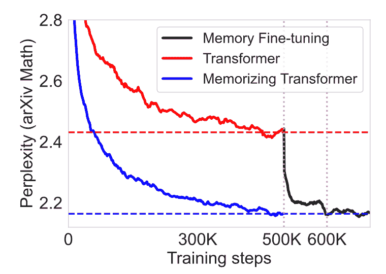

图 9. 使用键值记忆微调普通变压器可以实现与从头开始训练记忆变压器相似的性能。（图片来源：[吴等人，2022](https://arxiv.org/abs/2203.08913)）。

## 距离增强的注意力分数

**距离感知变压器**（**DA-Transformer**；[吴等人，2021](https://aclanthology.org/2021.naacl-main.166)）和**带线性偏差的注意力**（**ALiBi**；[Press 等人，2022](https://arxiv.org/abs/2108.12409)）受到类似的思想启发——为了鼓励模型在训练时超出模型训练的更长上下文，我们可以明确地将位置信息附加到每对基本注意力分数上，基于关键和查询标记之间的距离。

请注意，普通变压器中的默认位置编码仅向输入序列添加位置信息，而后来改进的编码机制改变了每一层的注意力分数，例如旋转位置嵌入，它们的形式非常类似于距离增强的注意力分数。

*DA-Transformer*（[吴等人，2021](https://aclanthology.org/2021.naacl-main.166)）在每一层将注意力分数乘以一个可学习的偏差，该偏差被制定为关键和查询之间距离的函数。不同的注意力头使用不同的参数来区分对短期和长期上下文的不同偏好。给定两个位置，$i, j$，DA-Transformer 使用以下加权函数来改变自注意力分数：

$$ \begin{aligned} \mathbf{R}^{(i)} &= \alpha_i \mathbf{R} \quad \text{where }R_{ij} = \vert i-j \vert\\ f(\mathbf{R}^{(i)}; \beta_i) &= \frac{1 + \exp(\beta_i)}{1 + \exp(\beta_i - \mathbf{R}^{(i)})} \\ \text{attn}(\mathbf{Q}^{(i)}, \mathbf{K}^{(i)}, \mathbf{V}^{(i)}) &= \text{row-softmax}\Big(\frac{\text{ReLU}(\mathbf{Q}^{(i)}\mathbf{K}^{(i)\top})f(\mathbf{R}^{(i)})}{\sqrt{d}}\Big) \mathbf{V}^{(i)} \end{aligned} $$

其中 $\alpha_i$ 是一个可学习参数，用于根据头部索引来不同加权相对距离；$\beta_i$ 是一个可学习参数，用于控制第 $i$ 个注意力头部的距离的上限和上升斜率。加权函数 $f(.)$ 的设计如下：（1）$f(0)=1$；（2）当 $\mathbf{R}^{(i)} \to -\infty$ 时，$f(\mathbf{R}^{(i)}) = 0$；（3）当 $\mathbf{R}^{(i)} \to +\infty$ 时，$f(\mathbf{R}^{(i)})$ 有界；（4）比例可调；（5）函数单调递增。由 $f(\mathbf{R}^{(i)})$ 带来的额外时间复杂度为 $\mathcal{O}(L²)$，相对于自注意力的时间复杂度 $\mathcal{O}(L² d)$ 很小。额外的内存消耗是最小的，约为 ~$\mathcal{O}(2h)$。

*ALiBi*（[Press et al. 2022](https://arxiv.org/abs/2108.12409)）不像乘法器那样，而是在查询-键注意力分数上添加一个恒定的偏差项，与成对距离成比例。该偏差引入了强烈的最近优先偏好，并惩罚那些距离太远的键。在不同头部内，惩罚的增加速率不同。$$ \text{softmax}(\mathbf{q}_i \mathbf{K}^\top + \alpha_i \cdot [0, -1, -2, \dots, -(i-1)]) $$ 其中 $\alpha_i$ 是一个头部特定的加权标量。与 DA-transformer 不同，$\alpha_i$ 不是可学习的，而是固定为几何序列；例如，对于 8 个头部，${\alpha_i} = {\frac{1}{2}, \frac{1}{2²}, \dots, \frac{1}{2⁸}}$。总体思想与相对位置编码的解决目标非常相似。

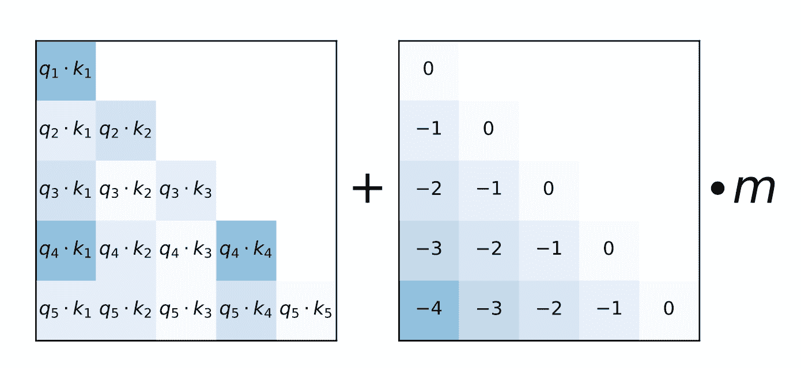

Fig. 10\. ALiBi 如何通过位置偏差项增强注意力分数的示意图。 (图片来源：[Press et al. 2021](https://arxiv.org/abs/2108.12409)).

使用 ALiBi，[Press et al. (2022)](https://arxiv.org/abs/2108.12409) 在训练时使用上下文长度为 1024 的 13 亿规模模型，并在推理时扩展到 2046。

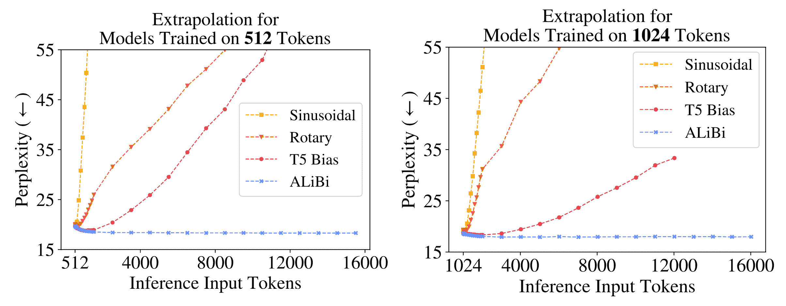

Fig. 11\. 使用不同配置的 Transformer 进行推理的外推实验，包括正弦位置编码、旋转位置编码、T5 中简化的相对位置编码和 ALiBi。所有模型在训练时都使用较小的上下文长度，但推理时使用更长的上下文。（图片来源：[Press et al. 2021](https://arxiv.org/abs/2108.12409)）。

## 使其具有循环性

**通用变压器**（[Dehghani 等人，2019 年](https://arxiv.org/abs/1807.03819)）将 Transformer 中的自注意力机制与 RNN 中的循环机制相结合，旨在同时获益于 Transformer 的长期全局感受野和 RNN 的学习归纳偏差。通用变压器不是通过固定数量的层，而是通过使用[自适应计算时间](https://lilianweng.github.io/posts/2020-04-07-the-transformer-family/#adaptive-computation-time-act)动态调整步数。如果我们固定步数，通用变压器等效于具有跨层共享参数的多层 Transformer。

从高层次来看，通用变压器可以被视为用于学习每个标记的隐藏状态表示的循环函数。循环函数在标记位置之间并行演变，并且通过自注意力共享位置之间的信息。

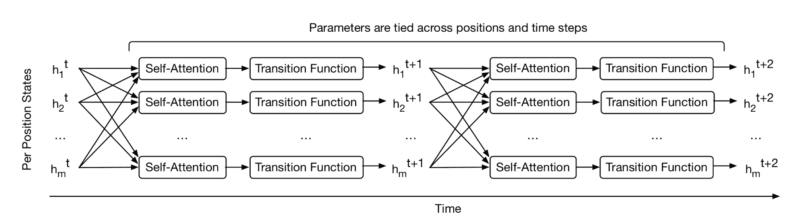

图 12. 通用变压器如何重复为每个位置并行地细化一组隐藏状态表示。（图片来源：[Dehghani 等人，2019 年](https://arxiv.org/abs/1807.03819)中的图 1）。

给定长度为$L$的输入序列，通用变压器在可调整的步数上迭代更新表示$\mathbf{h}^t \in \mathbb{R}^{L \times d}$。在第 0 步，$\mathbf{h}⁰$被初始化为与输入嵌入矩阵相同。所有位置在多头自注意力机制中并行处理，然后经过循环过渡函数。

$$ \begin{aligned} \mathbf{A}^t &= \text{LayerNorm}(\mathbf{h}^{t-1} + \text{MultiHeadAttention}(\mathbf{h}^{t-1} + \mathbf{P}^t) \\ \mathbf{h}^t &= \text{LayerNorm}(\mathbf{A}^{t-1} + \text{Transition}(\mathbf{A}^t)) \end{aligned} $$

其中$\text{Transition}(.)$是一个[可分离卷积](https://arxiv.org/abs/1610.02357)或一个完全连接的神经网络，由两个位置逐行（即分别应用于$\mathbf{A}^t$的每一行）的仿射变换+一个 ReLU 组成。

位置编码$\mathbf{P}^t$使用正弦位置信号，但具有额外的时间维度：

$$ \text{PE}(i, t, \delta) = \begin{cases} \sin(\frac{i}{10000^{2\delta'/d}}) \oplus \sin(\frac{t}{10000^{2\delta'/d}}) & \text{if } \delta = 2\delta'\\ \cos(\frac{i}{10000^{2\delta'/d}}) \oplus \cos(\frac{t}{10000^{2\delta'/d}}) & \text{if } \delta = 2\delta' + 1\\ \end{cases} $$

图 13. 通用变压器的简化示意图。编码器和解码器共享相同的基本循环结构。但解码器还会关注最终编码器表示$\mathbf{h}^T$。（图片来源：[Dehghani 等人，2019 年](https://arxiv.org/abs/1807.03819)中的图 2）

在通用 Transformer 的自适应版本中，递归步数$T$由[ACT](https://lilianweng.github.io/posts/2020-04-07-the-transformer-family/#adaptive-computation-time-act)动态确定。每个位置都配备了动态 ACT 停止机制。一旦一个每标记递归块停止，它就停止接受更多的递归更新，而只是将当前值复制到下一步，直到所有块停止或直到模型达到最大步数限制。

# 自适应建模

自适应建模指的是根据不同的输入调整计算量的机制。例如，一些标记可能只需要局部信息，因此需要较短的注意力跨度；或者一些标记相对容易预测，不需要通过整个注意力堆栈进行处理。

## 自适应注意跨度

Transformer 的一个关键优势是捕捉长期依赖关系的能力。根据上下文，模型可能更倾向于在某些时候比其他时候更远的地方进行关注；或者一个注意力头可能与另一个头有不同的注意力模式。如果注意力跨度能够灵活地调整其长度，并且只在需要时才进一步关注更远的地方，这将有助于减少模型中支持更长最大上下文大小所需的计算和内存成本。

这就是**自适应注意跨度**的动机。[Sukhbaatar 等人（2019）](https://arxiv.org/abs/1905.07799)提出了一种寻求最佳注意跨度的自注意机制。他们假设不同的注意力头可能在相同的上下文窗口内分配分数不同（见图 14），因此最佳跨度将针对每个头单独进行训练。

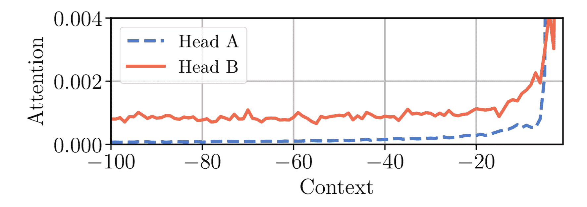

图 14. 同一模型中的两个注意力头，A 和 B，在相同的上下文窗口内分配不同的注意力。头 A 更多地关注最近的标记，而头 B 均匀地向过去看得更远。（图片来源：[Sukhbaatar 等人，2019](https://arxiv.org/abs/1905.07799)）

给定第$i$个标记，我们需要计算该标记与其注意力跨度内大小为$s$的其他键之间的注意力权重：

$$ \begin{aligned} e_{ij} &= \mathbf{q}_i {\mathbf{k}_j}^\top \\ a_{ij} &= \text{softmax}(e_{ij}) = \frac{\exp(e_{ij})}{\sum_{r=i-s}^{i-1} \exp(e_{ir})} \\ \mathbf{y}_i &= \sum_{r=i-s}^{i-1}a_{ir}\mathbf{v}_r = \sum_{r=i-s}^{i-1}a_{ir}\mathbf{x}_r\mathbf{W}^v \end{aligned} $$

添加了一个*软掩码函数* $m_z$ 来控制有效可调节的注意跨度，将查询和键之间的距离映射为[0, 1]值。$m_z$由$z \in [0, s]$参数化，$z$是要学习的：

$$ m_z(x) = \text{clip}(\frac{1}{R}(R+z-x), 0, 1) $$

其中$R$是一个超参数，定义了$m_z$的软度。


图 15. 自适应注意力跨度中使用的软掩码函数。（图片来源：[Sukhbaatar 等人，2019](https://arxiv.org/abs/1905.07799)）

软掩码函数应用于注意权重中的 softmax 元素：

$$ a_{ij} = \frac{m_z(i-j)\exp(s_{ij})}{\sum_{r=i-s}^{i-1}m_z(i-r) \exp(s_{ir})} $$

在上述方程中，$z$是可微的，因此与模型的其他部分一起进行训练。参数$z^{(i)}, i=1, \dots, h$是*每个头部单独学习*的。此外，损失函数对$\sum_{i=1}^h z^{(i)}$有额外的 L1 惩罚。

使用[自适应计算时间](https://lilianweng.github.io/posts/2020-04-07-the-transformer-family/#adaptive-computation-time)，该方法可以进一步增强灵活的注意力跨度长度，动态地适应当前输入。时间$t$处的注意力头的跨度参数$z_t$是一个 S 形函数，$z_t = S \sigma(\mathbf{v} \cdot \mathbf{x}_t +b)$，其中向量$\mathbf{v}$和偏置标量$b$与其他参数一起联合学习。

在具有自适应注意力跨度的 Transformer 的实验中，[Sukhbaatar 等人（2019）](https://arxiv.org/abs/1905.07799) 发现一个普遍趋势，即较低层不需要非常长的注意跨度，而较高层的少数注意头可能使用异常长的跨度。自适应注意跨度还有助于大大减少 FLOPS 的数量，特别是在具有许多注意力层和大上下文长度的大型模型中。

## 深度自适应 Transformer

在推断时，自然地假设某些标记更容易预测，因此不需要像其他标记那样多的计算。因此，我们可能只通过有限数量的层处理其预测，以在速度和性能之间取得良好的平衡。

**深度自适应 Transformer**（[Elabyad 等人，2020](https://arxiv.org/abs/1910.10073)）和**自信自适应语言模型**（**CALM**；[Schuster 等人，2022](https://arxiv.org/abs/2207.07061)）都受到这一思想的启发，并学会预测不同输入标记所需的最佳层数。

*深度自适应 Transformer* ([Elabyad 等人，2020](https://arxiv.org/abs/1910.10073)) 在每一层附加一个输出分类器，根据该层的激活产生退出预测。分类器权重矩阵可以在每一层之间不同或在各层之间共享。在训练过程中，模型对不同的退出序列进行采样，以便使用不同层的隐藏状态进行优化。学习目标包括在不同层预测的似然概率，$n=1, \dots, N$：

$$ \text{LL}^n_t = \log p(y_t \vert \mathbf{h}^n_{t-1}) \quad \text{LL}^n = \sum_{t=1}^{\vert\mathbf{y}\vert} LL^n_t $$

自适应深度分类器输出一个参数化分布$q_t$。它通过交叉熵损失与一个 oracle 分布$q^*_t$进行训练。该论文探讨了如何学习这样一个分类器$q_t$的三种配置。

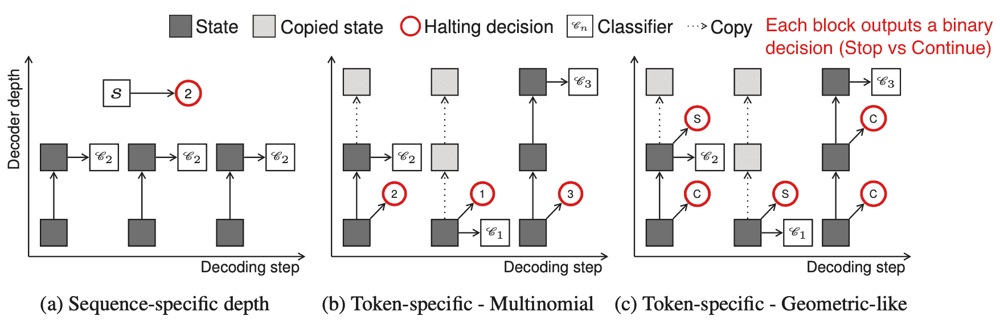

图 16\. 三种自适应深度分类器的示意图。

（图片来源：[Elabyad et al. 2020](https://arxiv.org/abs/1910.10073))。

1.  *序列特定深度分类器*：同一序列的所有令牌共享相同的退出块。它取决于序列的编码器表示的平均值。给定长度为$L$的输入序列$\mathbf{x}$，分类器将取$\bar{\mathbf{x}} = \frac{1}{L} \sum_{t=1}^L \mathbf{x}_t$作为输入，并输出$N$维的多项式分布，对应于$N$层。

    $$ \begin{aligned} q(n \vert \mathbf{x}) &=\text{softmax}(\mathbf{W}_n \bar{\mathbf{x}} + b_n) \in \mathbb{R}^N \\ q_\text{lik}^*(\mathbf{x}, \mathbf{y}) &= \delta(\arg\max_n \text{LL}^n - \lambda n) \\ \text{or }q_\text{corr}^*(\mathbf{x}, \mathbf{y}) &= \delta(\arg\max_n C^n - \lambda n) \text{ where }C^n = \vert\{t \vert y_t = \arg\max_y p(y \vert \mathbf{h}^n_{t-1})\}\vert \\ \end{aligned} $$

    其中$\delta$是[dirac delta](https://en.wikipedia.org/wiki/Dirac_delta_function)（单位冲激）函数，$-\lambda n$是鼓励较低层退出的正则化项。基于最大似然$q_\text{lik}^*$或正确性$q_\text{corr}^*$，可以以两种方式准备地面真值$q^*$。

1.  *特定令牌深度分类器（多项式）*：每个令牌都会使用不同的退出块进行解码，条件是基于第一个解码器隐藏状态$\mathbf{h}¹_t$进行预测：

    $$ q_t(n \vert \mathbf{x}, \mathbf{y}_{< t}) = \text{softmax}(\mathbf{W}_n \mathbf{h}¹_t + b_n) $$

1.  *特定令牌深度分类器（几何类似）*：每个令牌每层都会做出二进制退出预测分布，$\mathcal{X}^n_t$。使用 RBF 核函数$\kappa(t, t’) = \exp(\frac{\vert t - t’ \vert²}{\sigma})$来平滑预测，以纳入当前决策对未来时间步的影响。

    $$ \begin{aligned} \mathcal{X}^n_t &= \text{sigmoid}(\mathbf{w}_n^\top \mathbf{h}^n_t + b_n)\quad \forall n \in [1, \dots, N-1] \\ q_t(n \vert \mathbf{x}, \mathbf{y}_{< t}) &= \begin{cases} \mathcal{X}^n_t \prod_{n' < n} (1 - \mathcal{X}^{n'}_t) & \text{if } n < N\\ \prod_{n' < N} (1 - \mathcal{X}^{n'}_t) & \text{otherwise} \end{cases} \\ q_\text{lik}^*(\mathbf{x}, \mathbf{y}) &= \delta(\arg\max_n \widetilde{\text{LL}}^n_t - \lambda n) \text{ where } \widetilde{\text{LL}}^n_t = \sum_{t'=1}^{\vert\mathbf{y}\vert}\kappa(t, t') LL^n_{t'} \\ \text{or }q_\text{cor}^*(\mathbf{x}, \mathbf{y}) &= \delta(\arg\max_n \tilde{C}_t^n - \lambda n) \text{ where }C_t^n = \mathbb{1}[y_t = \arg\max_y p(y \vert \mathbf{h}^n_{t-1})],\; \tilde{C}^n_t = \sum_{t'=1}^{\vert\mathbf{y}\vert}\kappa(t, t') C^n_{t'} \\ \end{aligned} $$

在推断时，用于做出退出决策的置信度阈值需要校准。深度自适应变换器通过网格搜索在验证集上找到这样一个阈值。*CALM*（[Schuster et al. 2022](https://arxiv.org/abs/2207.07061)）应用了学习然后测试（LTT）框架（[Angelopoulos et al. 2021](https://arxiv.org/abs/2110.01052)）来识别一组有效阈值，并选择最小值作为推断的阈值。除了训练每层退出分类器，CALM 还探索了其他用于自适应深度预测的方法，包括 softmax 响应（即前两个 softmax 输出之间的差异）和隐藏状态饱和度（即$\cos(\mathbf{h}^n_t, \mathbf{h}^{n+1}_t)$）作为退出决策的置信度分数。他们发现 softmax 响应导致最佳推断加速。

# 高效的注意力

原始变换器的计算和内存成本随着序列长度的平方增长，因此很难应用于非常长的序列。许多变换器架构的效率改进与自注意力模块有关 - 使其更便宜、更小或更快运行。参见关于*高效变换器*的调查论文（[Tay et al. 2020](https://arxiv.org/abs/2009.06732)）。

## 稀疏注意力模式

### 固定的本地上下文

使自注意力变得更加经济的一个简单替代方法是将每个令牌的注意力范围限制在**本地**上下文中，这样自注意力随着序列长度线性增长。

这个想法是由**图像变换器**（[Parmer, et al 2018](https://arxiv.org/abs/1802.05751)）引入的，它将图像生成形式化为使用编码器-解码器变换器架构进行序列建模：

+   编码器生成源图像的上下文化、每像素通道的表示；

+   然后解码器自回归地生成输出图像，每个时间步骤每个像素一个通道。

让我们将要生成的当前像素的表示标记为查询$\mathbf{q}$。用于计算$\mathbf{q}$的其他位置的表示将用作键向量$\mathbf{k}_1, \mathbf{k}_2, \dots$，它们一起形成一个记忆矩阵$\mathbf{M}$。$\mathbf{M}$的范围定义了像素查询$\mathbf{q}$的上下文窗口。

图像变换器引入了两种局部化的$\mathbf{M}$类型，如下图所示。


图 17。图像变换器中视觉输入的 1D 和 2D 注意力范围示意图。黑线标记了一个查询块，青色轮廓标记了像素 q 的实际注意力范围。（图片来源：[Parmer et al, 2018](https://arxiv.org/abs/1802.05751)中的图 2）

1.  *1D 本地注意力*：输入图像按照[光栅扫描](https://zh.wikipedia.org/wiki/%E5%85%89%E6%A0%85%E6%89%AB%E6%8F%8F#Scanning_pattern)顺序展平，即从左到右，从上到下。然后将线性化的图像分割为不重叠的查询块。上下文窗口由与$\mathbf{q}$相同的查询块中的像素以及在此查询块之前生成的固定数量的额外像素组成。

1.  *2D 本地注意力*：图像被分割为多个不重叠的矩形查询块。查询像素可以关注同一内存块中的所有其他像素。为了确保左上角的像素也能有有效的上下文窗口，内存块分别向上、向左和向右扩展了固定数量。

### 分层上下文

**稀疏变压器**（[Child 等人，2019](https://arxiv.org/abs/1904.10509)）引入了*分解自注意力*，通过稀疏矩阵分解，使得在长度为 16,384 的序列上训练具有数百层的密集注意力网络成为可能，否则在现代硬件上是不可行的。

给定一组注意力连接模式$\mathcal{S} = \{S_1, \dots, S_n\}$，其中每个$S_i$记录第$i$个查询向量关注的一组关键位置。

$$ \begin{aligned} \text{Attend}(\mathbf{X}, \mathcal{S}) &= \Big( a(\mathbf{x}_i, S_i) \Big)_{i \in \{1, \dots, L\}} \\ \text{其中 } a(\mathbf{x}_i, S_i) &= \text{softmax}\Big(\frac{(\mathbf{x}_i \mathbf{W}^q)(\mathbf{x}_j \mathbf{W}^k)_{j \in S_i}^\top}{\sqrt{d_k}}\Big) (\mathbf{x}_j \mathbf{W}^v)_{j \in S_i} \end{aligned} $$

请注意，尽管$S_i$的大小不固定，但$a(\mathbf{x}_i, S_i)$始终为大小为$d_v$，因此$\text{Attend}(\mathbf{X}, \mathcal{S}) \in \mathbb{R}^{L \times d_v}$。

在自回归模型中，一个注意力跨度被定义为$S_i = \{j: j \leq i\}$，因为它允许每个标记关注过去所有位置。

在分解自注意力中，集合$S_i$被分解为*依赖关系树*，对于每对$(i, j)$，其中$j \leq i$，都存在连接$i$返回到$j$的路径，且$i$可以直接或间接关注$j$。

具体来说，集合$S_i$被分成$p$ *不重叠*子集，其中第$m$个子集表示为$A^{(m)}_i \subset S_i, m = 1,\dots, p$。因此，输出位置$i$和任何$j$之间的路径的最大长度为$p + 1$。例如，如果$(j, a, b, c, \dots, i)$是$i$和$j$之间的索引路径，则我们会有$j \in A_a^{(1)}, a \in A_b^{(2)}, b \in A_c^{(3)}, \dots$，依此类推。

**稀疏分解注意力**

稀疏变压器提出了两种类型的分解注意力。通过以 2D 图像输入为例在图 10 中说明这些概念会更容易理解。


图 18\. 顶部行展示了(a) Transformer、(b) 具有跨距注意力的稀疏 Transformer 和(c) 具有固定注意力的稀疏 Transformer 中的注意力连接模式。底部行包含相应的自注意力连接矩阵。请注意，顶部行和底部行的比例不同。（图片来源：[Child 等人，2019](https://arxiv.org/abs/1904.10509) + 一些额外注释。）

1.  *跨距*注意力，跨距 $\ell \sim \sqrt{n}$。这在处理图像数据时效果很好，因为结构与跨距对齐。在图像情况下，每个像素会关注栅格扫描顺序中之前的所有 $\ell$ 个像素（自然覆盖整个图像的宽度），然后这些像素会关注同一列中的其他像素（由另一个注意力连接子集定义）。

    $$ \begin{aligned} A_i^{(1)} &= \{ t, t+1, \dots, i\} \text{，其中 } t = \max(0, i - \ell) \\ A_i^{(2)} &= \{j: (i-j) \mod \ell = 0\} \end{aligned} $$

1.  *固定*注意力。一小组令牌总结先前的位置并将该信息传播到所有未来的位置。

    $$ \begin{aligned} A_i^{(1)} &= \{j: \lfloor \frac{j}{\ell} \rfloor = \lfloor \frac{i}{\ell} \rfloor \} \\ A_i^{(2)} &= \{j: j \mod \ell \in \{\ell-c, \dots, \ell-1\} \} \end{aligned} $$

    其中 $c$ 是一个超参数。如果 $c=1$，它会限制表示，而许多依赖于少数位置。该论文选择了 $c\in \{ 8, 16, 32 \}$ 对于 $\ell \in \{ 128, 256 \}$。

**在 Transformer 中使用分解自注意力**

在 Transformer 架构中有三种使用稀疏分解注意力模式的方式：

1.  每个残差块中有一种注意力类型，然后交错它们，

    $\text{attn}(\mathbf{X}) = \text{Attend}(\mathbf{X}, A^{(n \mod p)}) \mathbf{W}^o$，其中 $n$ 是当前残差块的索引。

1.  设置一个单头，它关注所有分解头关注的位置，

    $\text{attn}(\mathbf{X}) = \text{Attend}(\mathbf{X}, \cup_{m=1}^p A^{(m)}) \mathbf{W}^o $。

1.  使用多头注意力机制，但与普通 Transformer 不同，每个头可能采用上述的模式 1 或 2。$\rightarrow$ 这个选项通常表现最佳。

稀疏 Transformer 还提出了一系列改变，以便训练 Transformer 达到数百层，包括梯度检查点、在反向传播过程中重新计算注意力和 FF 层、混合精度训练、高效的块稀疏实现等。请查看[论文](https://arxiv.org/abs/1904.10509)以获取更多详细信息，或查看我之前关于[模型训练扩展技术](https://lilianweng.github.io/posts/2021-09-25-train-large/)的帖子。

**Blockwise Attention**（[Qiu et al. 2019](https://arxiv.org/abs/1911.02972)）引入了一个*稀疏块矩阵*，只允许每个标记仅关注一小组其他标记。每个大小为$L \times L$的注意力矩阵被分成大小为$\frac{L}{n}\times\frac{L}{n}$的$n \times n$个较小块，并且通过一个排列$\pi$定义了一个稀疏块矩阵$\mathbf{M} \in \{0, 1\}^{L \times L}$，记录了块矩阵中每行的列索引。

$$ \begin{aligned} \text{attn}(\mathbf{Q}, \mathbf{K}, \mathbf{V}, \mathbf{M}) &= \text{softmax}\Big(\frac{\mathbf{Q}\mathbf{K}^\top}{\sqrt{d}} \odot \mathbf{M}\Big)\mathbf{V} \\ (\mathbf{A} \odot \mathbf{M})_{ij} &= \begin{cases} A_{ij} & \text{if }M_{ij} = 1 \\ -\infty & \text{if }M_{ij} = 0 \\ \end{cases} \\ \text{where } M_{ij} &= \begin{cases} 1 & \text{if }\pi\big(\lfloor\frac{(i-1)n}{L} + 1\rfloor\big) = \lfloor\frac{(j-1)n}{L} + 1\rfloor \\ 0 & \text{otherwise} \end{cases} \end{aligned} $$

Blockwise Attention 的实际实现仅将 QKV 存储为大小为$n\times n$的块矩阵：

$$ \text{Blockwise-attn}(\mathbf{Q}, \mathbf{K}, \mathbf{V}, \mathbf{M}) = \begin{bmatrix} \text{softmax}\big(\frac{\hat{\mathbf{q}}_1\hat{\mathbf{k}}_{\pi(1)}^\top}{\sqrt{d}} \Big)\hat{\mathbf{v}}_{\pi(1)} \\ \vdots \\ \text{softmax}\big(\frac{\hat{\mathbf{q}}_n\hat{\mathbf{k}}_{\pi(n)}^\top}{\sqrt{d}} \odot \Big)\hat{\mathbf{v}}_{\pi(n)} \\ \end{bmatrix} $$

其中$\hat{\mathbf{q}}_i$，$\hat{\mathbf{k}}_i$和$\hat{\mathbf{v}}_i$分别是 QKV 块矩阵中的第$i$行。每个$\mathbf{q}_i\mathbf{k}_{\pi(i)}^\top, \forall i = 1, \dots, n$的大小为$\frac{N}{n}\times\frac{N}{n}$，因此 Blockwise Attention 能够将注意力矩阵的内存复杂度从$\mathcal{O}(L²)$降低到$\mathcal{O}(\frac{L}{n}\times\frac{L}{n} \times n) = \mathcal{O}(L²/n)$。

### 结合局部和全局上下文

**ETC**（*Extended Transformer Construction*；[Ainslie et al. 2019](https://aclanthology.org/2020.emnlp-main.19/)），**Longformer**（[Beltagy et al. 2020](https://arxiv.org/abs/2004/05150)）和**Big Bird**（[Zaheer et al. 2020](https://arxiv.org/abs/2007.14062)）模型在构建注意力矩阵时结合了局部和全局上下文。所有这些模型都可以从现有的预训练模型中初始化。

**ETC**的*全局-局部注意力*（[Ainslie 等人，2019](https://aclanthology.org/2020.emnlp-main.19/)）接受两个输入，（1）大小为$n_l$的长输入$\mathbf{x}^l$，即常规输入序列，和（2）包含较少辅助标记的大小为$n_g$的全局输入$\mathbf{x}^g$，$n_g \ll n_l$。因此，基于这两个输入之间的方向性注意力，注意力被分为四个组件：g2g、g2l、l2g 和 l2l。由于 l2l 注意力部分可能非常大，因此将其限制为固定大小的注意力跨度$w$（即局部注意力跨度），并且 l2l 矩阵可以重塑为$n_l \times (2w+1)$。

ETC 利用四个二进制矩阵来处理结构化输入，$\mathbf{M}^{g2g}$、$\mathbf{M}^{g2l}$、$\mathbf{M}^{l2g}$和$\mathbf{M}^{l2l}$。例如，g2g 注意力部分的注意力输出$z^g = (z^g_1, \dots, z^g_{n_g})$中的每个元素$z^g_i \in \mathbb{R}^d$格式化为：

$$ \begin{aligned} a^{g2g}_{ij} = \frac{1}{\sqrt{d}} x^g_i \mathbf{W}^Q (x^g_j \mathbf{W}^K + P^K_{ij})^\top - (1- M^{g2g}_{ij})C \\ A^{g2g}_{ij} = \frac{\exp(a^{g2g}_{ij})}{\sum_{k=1}^{n_g} \exp(a^{g2g}_{ik})} \quad z^g_i = \sum^{n_g}_{j=1} A^{g2g}_{ij} x^g_j \mathbf{W}^V \end{aligned} $$

其中$P^K_{ij}$是用于相对位置编码的可学习向量，$C$是一个非常大的常数（在论文中$C=10000$），用于抵消当掩码关闭时的任何注意力权重。

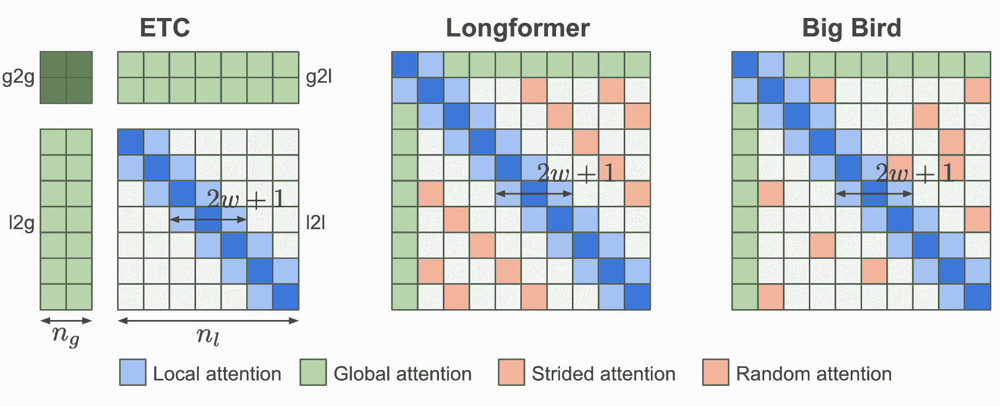

图 19. ETC、Longformer 和 Big Bird 的注意力模式。

ETC 中的另一个更新是在预训练阶段将 CPC（对比预测编码）任务使用[](https://lilianweng.github.io/posts/2021-05-31-contrastive/#nce)整合进来，除了[MLM](https://lilianweng.github.io/posts/2019-01-31-lm/#MLM)任务：当一个句子被屏蔽时，该句子的表示应该与其周围上下文的表示相似。

ETC 的全局输入$\mathbf{x}^g$构建如下：假设长输入中有一些段落（例如按句子划分），每个段落都附带一个辅助标记以学习全局输入。相对位置编码用于标记全局段落标记的位置。在一个方向上的硬掩码（即，标记前后的标记不同）在某些数据集中被发现能带来性能提升。

Longformer 中的注意力模式包含三个组件：

1.  *局部注意力*：类似于 ETC，局部注意力由一个固定大小为$w$的滑动窗口控制；

1.  *预选标记的全局注意力*：Longformer 有一些预选标记（例如`[CLS]`标记）分配了全局注意力跨度，即，关注输入序列中的所有其他标记。

1.  *扩张注意力*：固定大小为$r$的扩张滑动窗口和扩张大小为$d$的间隔，类似于稀疏 Transformer；

*Big Bird*与 Longformer 非常相似，具有局部注意力和少量预选的具有全局注意力跨度的标记，但 Big Bird 用一种新机制替换了扩张注意力，其中所有标记都与一组随机标记进行关注。该设计的动机是注意力模式可以被视为一个[有向图](https://en.wikipedia.org/wiki/Directed_graph)，而[随机图](https://en.wikipedia.org/wiki/Random_graph)具有信息能够在任意一对节点之间快速流动的特性。

*Longformer*在较低层使用较小的窗口大小，在较高层使用较大的窗口大小。消融研究表明，这种设置比反向或固定大小配置效果更好。较低层没有扩张滑动窗口，以更好地学习使用即时的局部上下文。Longformer 还有一个分阶段的训练过程，最初模型使用较小的窗口大小进行训练，以从局部上下文中学习，然后随后的训练阶段窗口大小增加，学习率降低。

## 基于内容的注意力

**Reformer**（[Kitaev, et al. 2020](https://arxiv.org/abs/2001.04451)）提出的改进旨在解决普通 Transformer 中的以下痛点：

+   自注意力模块内的二次时间和内存复杂度。

+   具有$N$层的模型的内存比单层模型大$N$倍，因为我们需要存储用于反向传播的激活。

+   中间的 FF 层通常非常大。

Reformer 提出了两个主要变化：

1.  用*局部敏感哈希（LSH）注意力*替换点积注意力，将复杂度从$\mathcal{O}(L²)$降低到$\mathcal{O}(L\log L)$。

1.  用*可逆残差层*替换标准残差块，这样在训练期间只需存储激活一次，而不是$N$次（即与层数成比例）。

**局部敏感哈希注意力**

在注意力公式的$\mathbf{Q} \mathbf{K}^\top$部分中，我们只对最大的元素感兴趣，因为只有大的元素在 softmax 之后才会有很大的贡献。对于每个查询$\mathbf{q}_i \in \mathbf{Q}$，我们正在寻找在$\mathbf{K}$中最接近$\mathbf{q}_i$的行向量。为了在高维空间中快速找到最近邻居，Reformer 将[局部敏感哈希（LSH）](https://en.wikipedia.org/wiki/Locality-sensitive_hashing)引入其注意力机制中。

如果一个哈希方案$x \mapsto h(x)$是*局部敏感*的，那么它会保留数据点之间的距离信息，使得接近的向量获得相似的哈希值，而远离的向量具有非常不同的哈希值。Reformer 采用了这样的哈希方案，给定一个固定的随机矩阵$\mathbf{R} \in \mathbb{R}^{d \times b/2}$（其中$b$是一个超参数），哈希函数为$h(x) = \arg\max([xR; −xR])$。


图 20. 展示了局部敏感哈希（LSH）注意力的示意图。（图片来源：[Kitaev 等人，2020](https://arxiv.org/abs/2001.04451)中图 1 的右部）。

在 LSH 注意力机制中，一个查询只能关注同一个哈希桶中的位置，$S_i = \{j: h(\mathbf{q}_i) = h(\mathbf{k}_j)\}$。如图 20 所示，这是通过以下过程实现的：

+   (a) 完全注意力的注意力矩阵通常是稀疏的。

+   (b) 使用 LSH，我们可以将键和查询排序，使其根据它们的哈希桶对齐。

+   (c) 设置$\mathbf{Q} = \mathbf{K}$（精确地说是$\mathbf{k}_j = \mathbf{q}_j / |\mathbf{q}_j|$），这样一个桶中的键和查询数量相等，更容易进行批处理。有趣的是，这种“共享-QK”配置不会影响 Transformer 的性能。

+   (d) 进行批处理，将$m$个连续查询分组在一起。


图 21. LSH 注意力包括 4 个步骤：分桶、排序、分块和注意力计算。（图片来源：[Kitaev 等人，2020](https://arxiv.org/abs/2001.04451)中图 1 的左部）。

**可逆残差网络**

Reformer 的另一个改进是使用*可逆残差层*（[Gomez 等人，2017](https://arxiv.org/abs/1707.04585)）。可逆残差网络的动机是设计架构，使得在任何给定层的激活可以从后续层的激活中恢复，只使用模型参数。因此，我们可以通过在反向传播过程中重新计算激活而不是存储所有激活来节省内存。

给定一个层$x \mapsto y$，普通的残差层执行$y = x + F(x)$，但可逆层将输入和输出都分成一对$(x_1, x_2) \mapsto (y_1, y_2)$，然后执行以下操作：

$$ y_1 = x_1 + F(x_2),\; y_2 = x_2 + G(y_1) $$

并且反转很容易：

$$ x_2 = y_2 - G(y_1), \; x_1 = y_1 − F(x_2) $$

Reformer 通过在可逆网络块内结合注意力($F$)和前馈层($G$)来将相同的思想应用于 Transformer：

$$ Y_1 = X_1 + \text{Attention}(X_2), \; Y_2 = X_2 + \text{FeedForward}(Y_1) $$

通过对前馈计算进行分块，可以进一步减少内存消耗：

$$ Y_2 = [Y_2^{(1)}; \dots; Y_2^{(c)}] = [X_2^{(1)} + \text{FeedForward}(Y_1^{(1)}); \dots; X_2^{(c)} + \text{FeedForward}(Y_1^{(c)})] $$

结果可逆的 Transformer 不需要在每一层存储激活。

**路由 Transformer**（[Roy 等人，2021](https://arxiv.org/abs/2003.05997)）也是基于键和查询的内容聚类构建的。它不像 LSH 那样使用静态哈希函数，而是利用在线$k$-means 聚类，并将其与本地、时间稀疏注意力结合起来，将注意力复杂度从$O(L²)$降低到$O(L^{1.5})$。

在路由注意力中，键和查询都使用$k$-means 聚类方法进行聚类，并具有相同的质心集合$\boldsymbol{\mu} = (\mu_1, \dots, \mu_k) \in \mathbb{R}^{k \times d}$。将查询路由到被分配到相同质心的键上。总复杂度为$O(Lkd + L²d/k)$，其中$O(Lkd)$用于运行聚类分配，$O(L²d/k)$用于注意力计算。通过使用所有相关的键和查询来使用 EMA（指数移动平均）更新聚类质心。

在 Routing Transformer 的实验中，一些最佳配置仅在模型的最后两层启用路由注意力，并且一半的注意力头，而另一半利用局部注意力。他们还观察到局部注意力是一个相当强大的基线，更大的注意力窗口总是导致更好的结果。

## 低秩注意力

**Linformer**（[Wang 等人，2020](https://arxiv.org/abs/2006.04768)）用低秩矩阵近似完整的注意力矩阵，将时间和空间复杂度降低为*线性*。Linformer 不使用昂贵的 SVD 来识别低秩分解，而是为键和值矩阵分别添加两个线性投影$\mathbf{E}_i，\mathbf{F}_i \in \mathbb{R}^{L \times k}$，将它们的维度从$L \times d$减少到$k \times d$。只要$k \ll L$，注意力内存就可以大大减少。

$$ \begin{aligned} \overline{\text{head}}_i &= \text{attn}(\mathbf{X}_q\mathbf{W}^q_i, \mathbf{E}_i\mathbf{X}_k\mathbf{W}^k_i, \mathbf{F}_i\mathbf{X}_v\mathbf{W}^v_i) \\ &= \underbrace{\text{softmax}\Big( \frac{\mathbf{X}_q\mathbf{W}^q_i (\mathbf{E}_i \mathbf{X}_k\mathbf{W}^k_i)^\top}{\sqrt{d}} \Big)}_{\text{低秩注意力矩阵 }\bar{A} \in \mathbb{R}^{k \times d}} \mathbf{F}_i \mathbf{X}_v\mathbf{W}^v_i \end{aligned} $$

可以应用其他技术来进一步提高 Linformer 的效率：

+   投影层之间的参数共享，例如逐头共享，键-值共享和层间共享（跨所有层）。

+   在不同层使用不同的$k$，因为更高层的头往往具有更倾斜的分布（较低的秩），因此我们可以在更高层使用较小的$k$。

+   使用不同类型的投影；例如均值/最大池化，卷积层，核和步长为$L/k$。


图 22.（左）Informer 为键和值添加了两个投影层。（右）推理时间作为序列长度的函数的绘图。（图片来源：[Wang 等人，2020](https://arxiv.org/abs/2006.04768)）。

**随机特征注意力** (**RFA**; [Peng et al. 2021](https://arxiv.org/abs/2103.02143)) 依赖于*随机特征方法* ([](https://people.eecs.berkeley.edu/~brecht/papers/07.rah.rec.nips.pdf)) 来近似自注意力中的 softmax 操作，使用低秩特征图以实现线性时间和空间复杂度。**表演者** ([Choromanski et al. 2021](https://arxiv.org/abs/2009.14794)) 也采用随机特征注意力，并通过改进核构造来进一步减少核逼近误差。

RFA 背后的主要定理来自 [Rahimi & Recht, 2007](https://people.eecs.berkeley.edu/~brecht/papers/07.rah.rec.nips.pdf)：

> 让 $\phi: \mathbb{R}^d \to \mathbb{R}^{2D}$ 成为一个非线性变换：
> 
> $$ \phi(\mathbf{x}) = \frac{1}{\sqrt{D}}[\sin(\mathbf{w}_1^\top \mathbf{x}), \dots, \sin(\mathbf{w}_D^\top \mathbf{x}), \cos(\mathbf{w}_1^\top \mathbf{x}), \dots, \cos(\mathbf{w}_D^\top \mathbf{x})]^\top $$当 $d$ 维随机向量 $\mathbf{w}_i$ 从 $\mathcal{N}(\mathbf{0}, \sigma²\mathbf{I}_d)$ 独立同分布时，$$ \mathbb{E}_{\mathbf{w}_i} [\phi(\mathbf{x}) \cdot \phi(\mathbf{y})] = \exp(-\frac{\| \mathbf{x} - \mathbf{y} \|²}{2\sigma²}) $$

$\exp(\mathbf{x} \cdot \mathbf{y})$ 的无偏估计为：

$$ \begin{aligned} \exp(\mathbf{x} \cdot \mathbf{y} / \sigma²) &= \exp(\frac{1}{2\sigma²}(\|\mathbf{x}\|² + \|\mathbf{y}\|² - \|\mathbf{x} - \mathbf{y}\|²) \\ &= \exp(\frac{\|\mathbf{x}\|²}{2\sigma²}) \exp(\frac{\|\mathbf{y}\|²}{2\sigma²}) ( - \frac{\|\mathbf{x} - \mathbf{y}\|²}{2\sigma²}) \\ &\approx \exp(\frac{\|\mathbf{x}\|²}{2\sigma²}) \exp(\frac{\|\mathbf{y}\|²}{2\sigma²})\;\phi(\mathbf{x})\cdot\phi(\mathbf{y}) \\ &= \exp(\frac{1}{\sigma²})\;\phi(\mathbf{x})\cdot\phi(\mathbf{y}) & \text{; unit vectors} \end{aligned} $$

然后我们可以将注意力函数写成如下形式，其中 $\otimes$ 是外积操作，$\sigma²$ 是温度：

$$ \begin{aligned} \text{attn}(\mathbf{q}_t, \{\mathbf{k}_i\}, \{\mathbf{v}_i\}) &= \sum_i \frac{\exp(\mathbf{q}_t\cdot\mathbf{k}_i/\sigma²)}{\sum_j \exp(\mathbf{q}_t\cdot\mathbf{k}_j/\sigma²)}\mathbf{v}_i^\top \approx \sum_i \frac{\phi(\mathbf{q}_t)\phi(\mathbf{k}_i)\mathbf{v}_i^\top}{\sum_j \phi(\mathbf{q}_t)\phi(\mathbf{k}_j)} \\ &= \color{green}{\frac{\phi(\mathbf{q}_t)^\top \sum_i \phi(\mathbf{k}_i)\otimes\mathbf{v}_i}{\phi(\mathbf{q}_t)^\top \sum_j \phi(\mathbf{k}_j)} = \text{RFA}(\mathbf{q}_t, \{\mathbf{k}_i\}, \{\mathbf{v}_i\})} \end{aligned} $$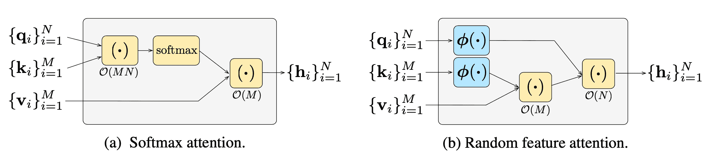

图 23\. (左) 默认 softmax 操作的计算顺序。 (右) 使用随机特征注意力时的计算顺序，比默认 softmax 要便宜得多。 (图片来源：[Peng et al. 2021](https://arxiv.org/abs/2103.02143))。

**因果注意 RFA**在时间步$t$的令牌只关注较早的键和值$\{\mathbf{k}_i\}_{i \leq t}, \{\mathbf{v}_i\}_{i \leq t}$。让我们使用一个变量元组，$(\mathbf{S}_t \in \mathbb{R}^{2D \times d}, \mathbf{z} \in \mathbb{R}^{2D})$，来跟踪时间步$t$的隐藏状态历史，类似于 RNN：

$$ \begin{aligned} &\text{因果-RFA}(\mathbf{q}_t, \{\mathbf{k}_i\}_{i \leq t}, \{\mathbf{v}_i\}_{i \leq t}) = \frac{\phi(\mathbf{q}_t)^\top \mathbf{S}_t}{\phi(\mathbf{q}_t) \cdot \mathbf{z}_t} \\ &\text{其中 } \mathbf{S}_t = \mathbf{S}_{t-1} + \phi(\mathbf{k}_t)\otimes\mathbf{v}_t, \quad \mathbf{z}_t = \mathbf{z}_{t-1} + \phi(\mathbf{k}_t) \end{aligned} $$

其中$2D$是$\phi(.)$的大小，$D$应不小于模型大小$d$以获得合理的近似。

RFA 在自回归解码中导致显著加速，并且记忆复杂度主要取决于构建核$\phi(.)$时选择的$D$。

Performer 通过正随机特征映射修改随机特征注意力，以减少估计误差。它还保持随机抽样的$\mathbf{w}_1, \dots, \mathbf{w}_D$正交，以进一步减少估计器的方差。

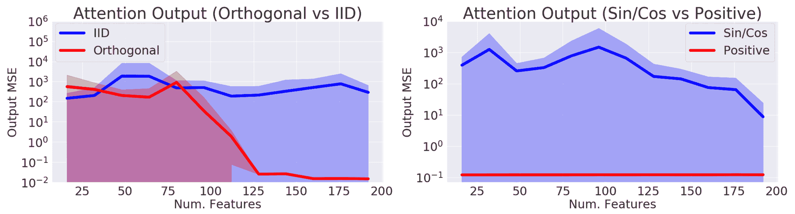

图 24\. 使用（左）独立同分布 vs 正交特征和（右）sin/cos vs 正随机特征时的近似误差比较。 （图片来源：[Choromanski 等人，2021](https://arxiv.org/abs/2009.14794)）。

# 用于强化学习的 Transformer

自注意机制避免将整个过去压缩为固定大小的隐藏状态，并且不像 RNN 那样容易受到梯度消失或爆炸的影响。强化学习任务肯定可以从这些特性中受益。*然而*，即使在监督学习中，训练 Transformer 也是相当困难的，更不用说在 RL 环境中了。让一个 LSTM 代理自己稳定并训练起来可能会非常具有挑战性。

**门控 Transformer-XL**（**GTrXL**；[Parisotto 等人，2019](https://arxiv.org/abs/1910.06764)）是将 Transformer 用于 RL 的一次尝试。 GTrXL 通过对 Transformer-XL 进行两项修改成功稳定了训练：

1.  层归一化仅应用于残差模块中的输入流，而不应用于快捷流。这种重新排序的一个关键好处是允许原始输入从第一层流向最后一层。

1.  残差连接被一个类似 GRU 风格（门控循环单元；[Chung 等人，2014](https://arxiv.org/abs/1412.3555)）的*门控*机制所取代。

$$ \begin{aligned} r &= \sigma(W_r^{(l)} y + U_r^{(l)} x) \\ z &= \sigma(W_z^{(l)} y + U_z^{(l)} x - b_g^{(l)}) \\ \hat{h} &= \tanh(W_g^{(l)} y + U_g^{(l)} (r \odot x)) \\ g^{(l)}(x, y) &= (1-z)\odot x + z\odot \hat{h} \end{aligned} $$

门控函数参数明确初始化为接近单位映射 - 这就是为什么有一个$b_g$项。$b_g > 0$对于学习速度的提升非常有帮助。


图 25\. Transformer-XL、重新排序的带有层归一化的 Transformer-XL 和门控 Transformer-XL 的模型架构比较。 (图片来源：[Parisotto 等人 2019](https://arxiv.org/abs/1910.06764)中的图 1)

决策变压器将强化学习问题形式化为*条件序列建模*的过程，输出基于期望回报、过去状态和动作的最优动作。因此，使用 Transformer 架构变得直观。决策变压器用于[离策略强化学习](https://lilianweng.github.io/posts/2018-02-19-rl-overview/#key-concepts)，其中模型只能访问由其他策略收集的固定轨迹集合。

为了鼓励模型学习如何行动以实现期望回报，它将模型提供的期望未来回报$\hat{R} = \sum_{t’=t}^T r_{t’}$而不是当前奖励。轨迹由三元组列表（回报到目标$\hat{R}_t$、状态$s_t$、动作$a_t$）组成，并用作 Transformer 的输入序列：

$$ \tau = (\hat{R}_1, s_1, a_1, \hat{R}_2, s_2, a_2, \dots, \hat{R}_T, s_T, a_T) $$

为了提取令牌嵌入，添加并训练了三个线性层，分别用于回报、状态和动作。预测头学习预测与输入令牌$s_t$对应的动作$a_t$。训练使用交叉熵损失用于离散动作或均方误差用于连续动作。在实验中发现，预测状态或回报对于提高性能并没有帮助。

实验将 DT 与几种无模型强化学习算法基线进行了比较，并显示：

+   在数据稀缺的情况下，决策变压器比行为克隆更有效率；

+   决策变压器（**DT**; [Chen 等人 2021](https://arxiv.org/abs/2106.01345)) 很好地建模了回报的分布；

+   拥有长期上下文对于获得良好结果至关重要；

+   决策变压器可以处理稀疏奖励。

# 引用

引用为：

> Weng, Lilian. (2023 年 1 月). 变压器家族版本 2.0\. Lil’Log. https://lilianweng.github.io/posts/2023-01-27-the-transformer-family-v2/.

或

```py
@article{weng2023transformer,
  title   = "The Transformer Family Version 2.0",
  author  = "Weng, Lilian",
  journal = "lilianweng.github.io",
  year    = "2023",
  month   = "Jan",
  url     = "https://lilianweng.github.io/posts/2023-01-27-the-transformer-family-v2/"
} 
```

# 参考文献

[1] Ashish Vaswani 等人。[“注意力机制就是你所需要的一切。”](http://papers.nips.cc/paper/7181-attention-is-all-you-need.pdf) NIPS 2017。

[2] Rami Al-Rfou 等人。[“使用更深的自注意力进行字符级语言建模。”](https://arxiv.org/abs/1808.04444) AAAI 2019。

[3] Olah & Carter，[“注意力和增强循环神经网络”](http://doi.org/10.23915/disti)，Distill，2016 年。

[4] Sainbayar Sukhbaatar 等人。[“变压器中的自适应注意力跨度”](https://arxiv.org/abs/1905.07799)。ACL 2019。

[5] Rewon Child 等人。[“使用稀疏 Transformer 生成长序列”](https://arxiv.org/abs/1904.10509) arXiv:1904.10509 (2019)。

[6] Nikita Kitaev 等人 [“Reformer: 高效 Transformer”](https://arxiv.org/abs/2001.04451) ICLR 2020 年。

[7] Alex Graves. [“适应循环神经网络的计算时间”](https://arxiv.org/abs/1603.08983)

[8] Niki Parmar 等人 [“图像 Transformer”](https://arxiv.org/abs/1802.05751) ICML 2018 年。

[9] Zihang Dai 等人 [“Transformer-XL：超越固定长度上下文的关注语言模型。”](https://arxiv.org/abs/1901.02860) ACL 2019 年。

[10] Aidan N. Gomez 等人 [“可逆残差网络：无需存储激活的反向传播”](https://arxiv.org/abs/1707.04585) NIPS 2017 年。

[11] Mostafa Dehghani 等人 [“通用 Transformer”](https://arxiv.org/abs/1807.03819) ICLR 2019 年。

[12] Emilio Parisotto 等人 [“用于强化学习的稳定 Transformer”](https://arxiv.org/abs/1910.06764) arXiv:1910.06764 (2019 年)。

[13] Rae 等人 [“用于长距离序列建模的压缩 Transformer。”](https://arxiv.org/abs/1911.05507) 2019 年。

[14] Press 等人 [“短训练，长测试：具有线性偏差的注意力使输入长度外推成为可能。”](https://arxiv.org/abs/2108.12409) ICLR 2022 年。

[15] Wu 等人 [“DA-Transformer: 距离感知 Transformer”](https://aclanthology.org/2021.naacl-main.166) 2021 年。

[16] Elabyad 等人 [“深度自适应 Transformer。”](https://arxiv.org/abs/1910.10073) ICLR 2020 年。

[17] Schuster 等人 [“自信的自适应语言建模”](https://arxiv.org/abs/2207.07061) 2022 年。

[18] Qiu 等人 [“用于长文档理解的分块自注意力”](https://arxiv.org/abs/1911.02972) 2019 年。

[19] Roy 等人 [“使用路由 Transformer 实现高效基于内容的稀疏注意力。”](https://arxiv.org/abs/2003.05997) 2021 年。

[20] Ainslie 等人 [“ETC: 在 Transformer 中编码长和结构化输入。”](https://aclanthology.org/2020.emnlp-main.19/) EMNLP 2019 年。

[21] Beltagy 等人 [“Longformer: 长文档 Transformer。”](https://arxiv.org/abs/2004/05150) 2020 年。

[22] Zaheer 等人 [“Big Bird: 用于更长序列的 Transformer。”](https://arxiv.org/abs/2007.14062) 2020 年。

[23] Wang 等人 [“Linformer: 具有线性复杂度的自注意力。”](https://arxiv.org/abs/2006.04768) arXiv 预印本 arXiv:2006.04768 (2020 年)。

[24] Tay 等人 2020 [“Sparse Sinkhorn Attention.”](https://arxiv.org/abs/2002.11296) ICML 2020 年。

[25] Peng 等人 [“随机特征注意力。”](https://arxiv.org/abs/2103.02143) ICLR 2021 年。

[26] Choromanski 等人 [“用表演者重新思考注意力。”](https://arxiv.org/abs/2009.14794) ICLR 2021 年。

[27] Khandelwal 等人 [“通过记忆实现泛化：最近邻语言模型。”](https://arxiv.org/abs/1911.00172) ICLR 2020 年。

[28] Yogatama 等人 [“自适应半参数语言模型。”](https://arxiv.org/abs/2102.02557) ACL 2021 年。

[29] Wu 等人 [“记忆 Transformer。”](https://arxiv.org/abs/2203.08913) ICLR 2022 年。

[30] Su 等人 [“Roformer: 带有旋转位置嵌入的增强 Transformer。”](https://arxiv.org/abs/2104.09864) arXiv 预印本 arXiv:2104.09864 (2021 年)。

[31] Shaw 等人 [“具有相对位置表示的自注意力。”](https://arxiv.org/abs/1803.02155) arXiv 预印本 arXiv:1803.02155 (2018).

[32] Tay 等人 [“高效 Transformer：一项调查。”](https://arxiv.org/abs/2009.06732) ACM 计算调查 55.6 (2022): 1-28.

[33] 陈等人，[“决策 Transformer：通过序列建模进行强化学习”](https://arxiv.org/abs/2106.01345) arXiv 预印本 arXiv:2106.01345 (2021).
