# 大型变压器模型推断优化

> 原文：[`lilianweng.github.io/posts/2023-01-10-inference-optimization/`](https://lilianweng.github.io/posts/2023-01-10-inference-optimization/)

2023-01-24 更新：在[蒸馏上添加一个小节。]

大型变压器模型如今已成为主流，为各种任务创造了 SoTA 结果。它们强大但训练和使用成本非常昂贵。在时间和内存方面极高的推断成本是采用强大变压器解决规模化真实世界任务的一个重要瓶颈。

**为什么运行大型变压器模型的推断很困难？** 除了 SoTA 模型尺寸不断增加外，还有两个主要因素导致推断挑战（[Pope 等人，2022](https://arxiv.org/abs/2211.05102)）：

1.  *大内存占用*。在推断时需要模型参数和中间状态都保存在内存中。例如，

    +   在解码时应将 KV 缓存存储在内存中；例如，对于批量大小为 512 和上下文长度为 2048，KV 缓存总共为 3TB，即模型大小的 3 倍（！）。

    +   注意机制的推断成本随输入序列长度呈二次方增长。

1.  *低并行性*。推断生成以自回归方式执行，使得解码过程难以并行化。

在本文中，我们将探讨几种使变压器推断更高效的方法。有些是通用网络压缩方法，而另一些是特定于变压器架构的。

# 方法概述

我们通常将以下作为模型推断优化的目标：

+   通过使用更少的 GPU 设备和更少的 GPU 内存来减少模型的内存占用；

+   通过降低所需的 FLOP 数量来减少所需的计算复杂度；

+   减少推断延迟，使事情运行更快。

可以使用几种方法使推断在内存上更便宜或/和在时间上更快。

1.  应用各种*并行性*来扩展模型跨多个 GPU。模型组件和数据的智能并行性使得可以运行具有数万亿参数的模型。

1.  将内存*卸载*以将暂时未使用的数据卸载到 CPU，并在稍后需要时读取。这有助于内存使用，但会导致更高的延迟。

1.  智能分批策略；例如，[EffectiveTransformer](https://github.com/bytedance/effective_transformer)将连续序列打包在一起，以消除一个批次内的填充。

1.  网络*压缩*技术，如*修剪、量化、蒸馏*。在参数数量或位宽方面更小的模型应该需要更少的内存并且运行更快。

1.  针对目标模型架构的改进。许多*架构变化*，特别是用于注意力层的变化，有助于提高变压器解码速度。

查看[关于大型模型训练的先前文章](https://lilianweng.github.io/posts/2021-09-25-train-large/)，介绍了不同类型的训练并行性和内存节省设计，包括 CPU 内存卸载。本文重点介绍了用于 Transformer 模型的网络压缩技术和特定架构的改进。

# 蒸馏

**知识蒸馏** (**KD**; [Hinton et al. 2015](https://arxiv.org/abs/1503.02531), [Gou et al. 2020](https://arxiv.org/abs/2006.05525)) 是一种直接的方法，通过将预训练的昂贵模型(*“教师模型”*)的技能转移到一个更小、更便宜的模型(*“学生模型”*)，以加快推理速度。对于学生架构的构建并没有太多限制，除了需要与教师匹配输出空间以构建适当的学习目标。

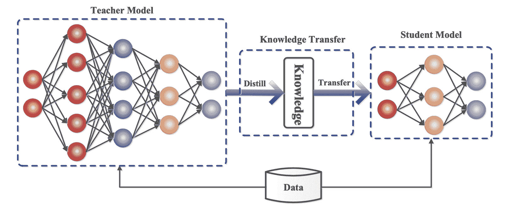

Fig. 1\. 师生知识蒸馏训练的通用框架。 (图片来源: Gou et al. 2020)

给定一个数据集，通过蒸馏损失训练学生模型来模仿教师的输出。通常神经网络有一个 softmax 层；例如，LLM 输出一个关于标记的概率分布。我们将教师和学生模型之间 softmax 之前的 logits 层分别表示为$\mathbf{z}_t$和$\mathbf{z}_s$。*蒸馏损失*通过高温$T$最小化两个 softmax 输出之间的差异。当已知地面真实标签$\mathbf{y}$时，我们可以将其与学生的软性 logits 之间的*监督*学习目标结合起来，例如使用交叉熵。

$$ \mathcal{L}_\text{KD} = \mathcal{L}_\text{distll}(\text{softmax}(\mathbf{z}_t, T), \text{softmax}(\mathbf{z}_s, T)) + \lambda\mathcal{L}_\text{CE}(\mathbf{y}, \mathbf{z}_s) $$

其中$\lambda$是一个超参数，用于平衡软性和硬性学习目标。$\mathcal{L}_\text{distll}$的常见选择是 KL 散度/交叉熵。

一个成功的早期尝试是**DistilBERT** ([Sanh et al. 2019](https://arxiv.org/abs/1910.01108))，能够将 BERT 的参数减少 40%，同时在精调后的下游任务上保持 BERT 97%的性能，并且运行速度提高了 71%。DistilBERT 的预训练损失包括软蒸馏损失、监督训练损失(即在 BERT 情况下的[掩码语言建模损失](https://lilianweng.github.io/posts/2019-01-31-lm/#MLM) $\mathcal{L}_\text{MLM}$)和一种特殊的*余弦嵌入损失*，用于调整教师和学生之间的隐藏状态向量。

蒸馏可以轻松与量化、剪枝或稀疏化技术结合，其中教师模型是原始的全精度、稠密模型，而学生模型是量化、剪枝或修剪以具有更高稀疏度水平的模型。

# 量化

对深度神经网络应用量化有两种常见方法：

1.  *后训练量化（PTQ）*：首先将模型训练到收敛，然后将其权重转换为较低精度而无需更多训练。与训练相比，实现起来通常要便宜得多。

1.  *量化感知训练（QAT）*：在预训练或进一步微调期间应用量化。QAT 能够获得更好的性能，但需要额外的计算资源和代表性训练数据。

我们应该意识到理论最佳量化策略与硬件内核支持之间的差距。由于 GPU 内核对某些类型的矩阵乘法（例如 INT4 x FP16）缺乏支持，下面的方法并不都会导致实际推断速度的提升。

## Transformer 量化的挑战

许多关于 Transformer 模型量化的研究都有相同的观察结果：简单的低精度（例如 8 位）后训练量化会导致显著的性能下降，主要是由于激活的高动态范围和天真的激活量化策略无法保持容量。

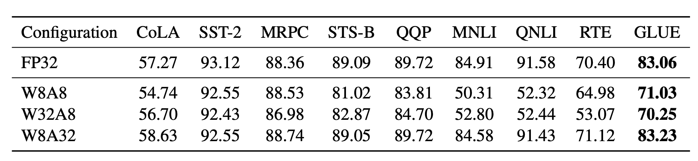

图 2。仅将模型权重量化为 8 位，同时保持激活在完整精度（`W8A32`）时，无论权重是否在较低精度（`W8A8`和`W32A8`）时，激活量化为 8 位都能取得更好的结果。 （图片来源：[Bondarenko 等人 2021](https://arxiv.org/abs/2109.12948)）

[Bondarenko 等人（2021）](https://arxiv.org/abs/2109.12948)在一个小型 BERT 模型中观察到 FFN 的输入和输出具有非常不同的动态范围，因为输出张量中存在强烈的异常值。因此，对于 FFN 的残差和总和进行每张量量化可能会导致显着的误差。

随着模型规模继续增长到数十亿个参数，所有 Transformer 层中开始出现高幅度的异常值特征，导致简单的低位量化失败。[Dettmers 等人（2022）](https://arxiv.org/abs/2208.07339)观察到对于大于 6.7B 参数的[OPT](https://arxiv.org/abs/2205.01068)模型出现了这种现象。更大的模型具有更多具有极端异常值的层，并且这些异常值特征对模型性能有显著影响。在少数维度中，激活异常值的规模可能比其他大多数值大 100 倍。

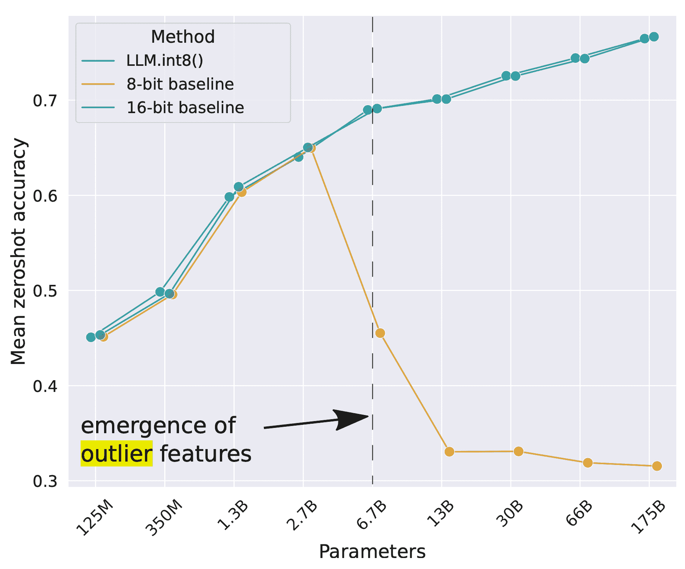

图 3。随着 OPT 模型规模增加，一组语言任务（WinoGrande、HellaSwag、PIQA、LAMBADA）的零样本准确率均值。 （图片来源：[Dettmers 等人 2022](https://arxiv.org/abs/2208.07339))

## 后训练量化（PTQ）

### 混合精度量化

解决上述量化挑战最直接的方法是为权重和激活实现不同精度的量化。

GOBO（[Zadeh 等人，2020](https://arxiv.org/abs/2005.03842)）是第一个在 transformers 上应用后训练量化的模型之一（即一个小型 BERT 模型）。它假设每层模型权重遵循高斯分布，因此通过跟踪每层的均值和标准差来检测异常值。异常特征保留在原始形式中，而其他值被分成多个箱，并且只存储权重的相应箱索引和质心值。

基于观察到 BERT 中只有某些激活层（例如 FFN 后的残差连接）会导致性能大幅下降，[Bondarenko 等人（2021）](https://arxiv.org/abs/2109.12948)采用了混合精度量化，对问题激活使用 16 位量化，而对其他激活使用 8 位量化。

`LLM.int8()`中的混合精度量化（[Dettmers 等人，2022](https://arxiv.org/abs/2208.07339)）通过两种混合精度分解实现：

1.  因为矩阵乘法包含一组独立的行向量和列向量之间的内积，我们可以对每个内积进行独立的量化：每行和每列都按绝对最大值进行缩放，然后量化为 INT8。

1.  异常激活特征（例如比其他维度大 20 倍）保留在 FP16 中，但它们仅占总权重的一小部分。如何识别异常值是经验性的。

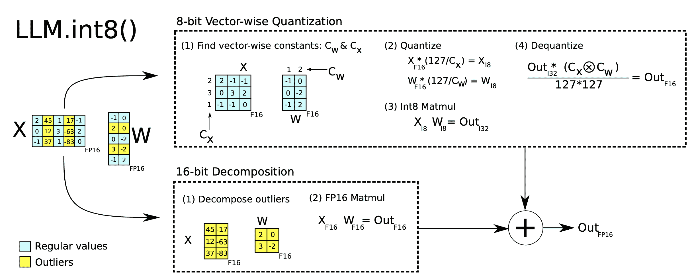

图 4。`LLM.int8()`的两种混合精度分解。（图片来源：[Dettmers 等人，2022](https://arxiv.org/abs/2208.07339)）

### 细粒度粒度的量化

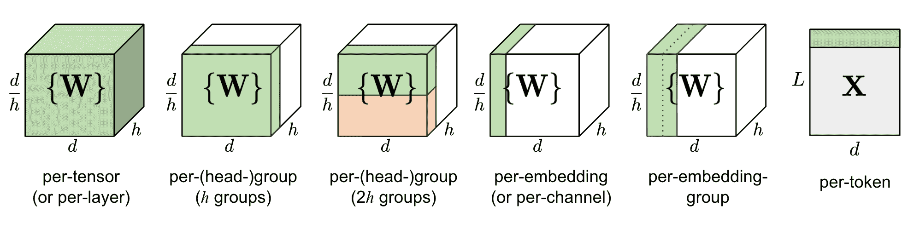

图 5。不同粒度的量化比较。$d$是模型大小/隐藏状态维度，$h$是一个 MHSA（多头自注意力）组件中的头数。

在一个层中天真地对整个权重矩阵进行量化（“每张量”或“每层”量化）最容易实现，但不会导致良好的量化粒度。

**Q-BERT**（[Shen，Dong＆Ye 等人，2020](https://arxiv.org/abs/1909.05840)）对一个经过微调的 BERT 模型应用*分组量化*，将 MHSA（多头自注意力）中每个头对应的矩阵$W$视为一组，然后应用基于 Hessian 的混合精度量化。

*每嵌入组（PEG）*激活量化的动机是观察到异常值仅出现在$d$（隐藏状态/模型大小）个维度中的少数维度中（[Bondarenko 等人，2021](https://arxiv.org/abs/2109.12948)）。每嵌入组在计算上非常昂贵。相比之下，PEG 量化将激活张量分成几个沿嵌入维度均匀大小的组，其中同一组中的元素共享量化参数。为了确保所有异常值被分组在一起，他们应用了一种确定性基于范围的嵌入维度排列，其中维度按其值范围排序。

**ZeroQuant**（[Yao 等人，2022](https://arxiv.org/abs/2206.01861)）对权重使用*分组量化*，与 Q-BERT 相同，并对激活使用*令牌量化*。为了避免昂贵的量化和去量化计算，ZeroQuant 构建了定制的*内核*来*融合*量化操作与其先前的运算符。

### 用于量化的二阶信息

Q-BERT（[Shen, Dong & Ye 等人，2020](https://arxiv.org/abs/1909.05840)）为其混合精度量化开发了 Hessian AWare Quantization（HAWQ）。其动机是，具有更高 Hessian 谱（即更大的顶部特征值）的参数对量化更敏感，因此需要更高的精度。这本质上是一种识别异常值的方法。

从另一个角度来看，量化问题是一个优化问题。给定一个权重矩阵$\mathbf{W}$和一个输入矩阵$\mathbf{X}$，我们希望找到一个量化的权重矩阵$\hat{\mathbf{W}}$来最小化均方误差：

$$ \hat{\mathbf{W}}^* = {\arg\min}_{\hat{\mathbf{W}}} | \mathbf{W}\mathbf{X} - \hat{\mathbf{W}}\mathbf{X}| $$

**GPTQ**（[Frantar 等人，2022](https://arxiv.org/abs/2210.17323)）将权重矩阵$\mathbf{W}$视为一组行向量${\mathbf{w}}$，并对每行独立应用量化。GPTQ 迭代地量化更多被贪婪选择以最小化量化误差的权重。对所选权重的更新具有闭合形式的公式，利用 Hessian 矩阵。如果感兴趣，可以在论文和 OBQ（Optimal Brain Quantization；[Frantar & Alistarh，2022](https://arxiv.org/abs/2208.11580)）方法中阅读更多细节。GPTQ 可以将 OPT-175B 中的权重位宽降至 3 或 4 位而几乎不损失性能，但仅适用于模型权重而不是激活。

### 异常值平滑

众所周知，在变压器模型中，激活比权重更难量化。**SmoothQuant**（[Xiao & Lin，2022](https://arxiv.org/abs/2211.10438)）提出了一个聪明的解决方案，通过数学上等效的转换将激活中的异常特征平滑到权重上，然后在权重和激活上启用量化（`W8A8`）。由于这个原因，SmoothQuant 比混合精度量化具有更好的硬件效率。

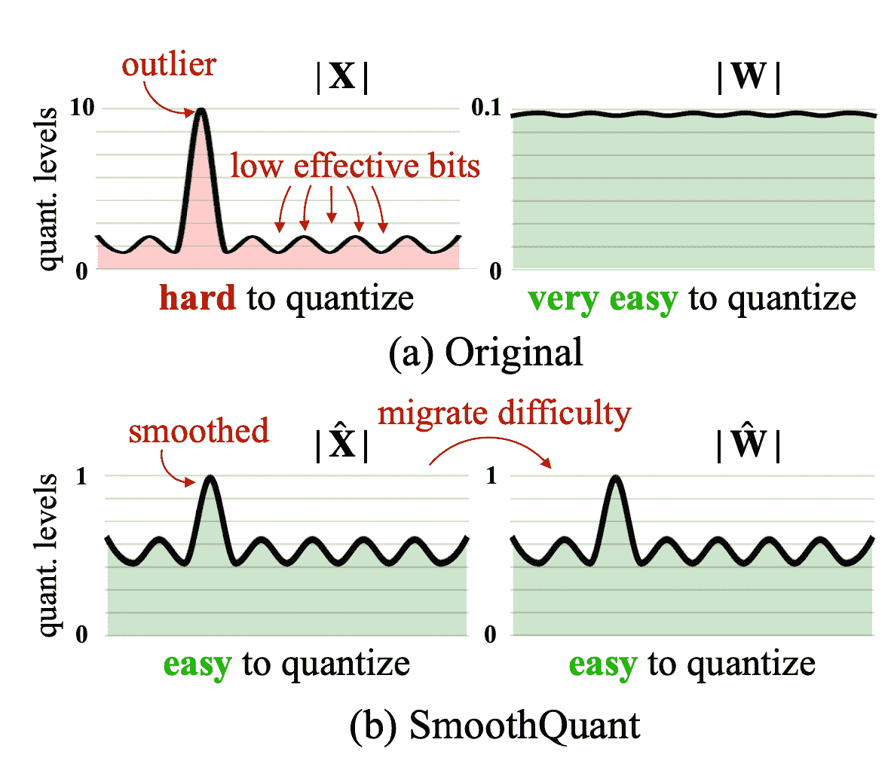

图 6\. SmoothQuant 将激活的尺度变化迁移到权重上，以降低激活量化的难度。得到的新权重和激活矩阵都容易量化。（图片来源：[Xiao & Lin 2022](https://arxiv.org/abs/2211.10438)）

考虑每个通道的平滑因子 $\mathbf{s}$，SmoothQuant 根据以下方式调整权重：

$$ \mathbf{Y} = (\mathbf{X} \text{diag}(\mathbf{s})^{-1}) \cdot (\text{diag}(\mathbf{s})\mathbf{W}) = \hat{\mathbf{X}}\hat{\mathbf{W}} $$

平滑因子可以轻松地离线融入到先前层的参数中。一个超参数 $\alpha$ 控制我们将量化难度从激活迁移到权重的程度：$\mathbf{s} = \max (\vert \mathbf{X}_j \vert)^\alpha / \max( \vert \mathbf{W}_j \vert )^{1-\alpha}$。论文发现在实验中，对于许多 LLM 模型，$\alpha=0.5$ 是一个最佳选择。对于激活中有更显著异常值的模型，$\alpha$ 可以调整得更大。

## 量化感知训练（QAT）

量化感知训练将量化操作融入到预训练或微调过程中。它直接学习低比特表示的模型权重，并在额外的训练时间和计算成本下实现更好的性能。

最直接的方法是在量化后在与预训练数据集相同或代表性的训练数据集上**微调**模型。训练目标可以与预训练相同（例如一般语言模型训练中的 NLL/MLM）或特定于我们关心的下游任务（例如分类中的交叉熵）。

另一种方法是将全精度模型视为教师，将低精度模型视为学生，然后用**蒸馏**损失优化低精度模型。蒸馏通常不需要使用原始数据集；例如，维基百科数据集是一个不错的选择，甚至随机标记也可以带来相当不错的性能提升。*逐层知识蒸馏*（*LKD*；[Yao et al. 2022](https://arxiv.org/abs/2206.01861)）方法逐层量化网络，并使用其原始的、未量化的版本作为教师模型。给定相同的输入，LKD 最小化了层权重乘法和量化层权重乘法之间的均方误差。

# 剪枝

网络剪枝是通过修剪不重要的模型权重或连接来减小模型大小，同时保持模型容量。可能需要重新训练，也可能不需要。剪枝可以是**非结构化**或**结构化**的。

+   *非结构化剪枝*允许丢弃任何权重或连接，因此不保留原始网络架构。非结构化剪枝通常与现代硬件不兼容，也不会导致实际推理加速。

+   *结构化修剪*旨在保持稠密矩阵乘法形式，其中一些元素为零。它们可能需要遵循某些模式限制，以便与硬件内核支持的内容配合使用。在这里，我们专注于结构化修剪以在变压器模型中实现*高稀疏性*。

构建修剪网络的常规工作流程有三个步骤：

1.  训练一个密集网络直到收敛；

1.  修剪网络以去除不需要的结构；

1.  可选地重新训练网络以恢复性能与新权重。

通过网络修剪在稠密模型中发现稀疏结构的想法，而稀疏网络仍然可以保持类似的性能，受到[**彩票票据假设**](https://lilianweng.github.io/posts/2019-03-14-overfit/#the-lottery-ticket-hypothesis)（**LTH**）的启发：一个随机初始化的、密集的、前馈网络包含一组子网络，其中只有一个子集（一个稀疏网络）是*“中奖票”*，当单独训练时可以达到最佳性能。

## 如何进行修剪？

**幅度修剪**是最简单但相当有效的修剪方法 - 剪掉绝对值最小的权重。事实上，一些研究（[Gale 等人，2019](https://arxiv.org/abs/1902.09574)）发现*简单的幅度修剪方法可以达到与复杂修剪方法（如变分辍学（[Molchanov 等人，2017](https://arxiv.org/abs/1701.05369)）和$l_0$正则化（[Louizos 等人，2017](https://arxiv.org/abs/1712.01312)））相媲美甚至更好的结果*。幅度修剪易于应用于大型模型，并在各种超参数范围内实现相当一致的性能。

[Zhu & Gupta（2017）](https://arxiv.org/abs/1710.01878)发现*大型稀疏模型能够比它们小但密集的对应物性能更好*。他们提出了**渐进幅度修剪（GMP）**算法，该算法在训练过程中逐渐增加网络的稀疏性。在每个训练步骤中，绝对值最小的权重被掩盖为零，以达到所需的稀疏水平$s$，掩盖的权重在反向传播过程中不会获得梯度更新。所需的稀疏水平$s$随着更多的训练步骤而增加。GMP 的过程对学习率调度很敏感，学习率应该高于密集网络训练中使用的学习率，但不要太高以防止收敛。

**迭代修剪**（[Renda 等人，2020](https://arxiv.org/abs/2003.02389)）多次迭代步骤 2（修剪）和步骤 3（重新训练）：每次修剪只修剪一小部分权重，并在每次迭代中重新训练模型。该过程重复，直到达到所需的稀疏水平。

## 如何进行重新训练？

重新训练步骤可以简单地使用相同的预训练数据或其他特定任务的数据进行微调。

[彩票票假设](https://lilianweng.github.io/posts/2019-03-14-overfit/#the-lottery-ticket-hypothesis)提出了一种**权重回退**重新训练技术：剪枝后，未剪枝的权重*重新初始化为训练早期的原始值*，然后按相同的学习率计划重新训练。

**学习率回退**（[Renda 等人，2020](https://arxiv.org/abs/2003.02389)）仅将学习率重置回早期值，而未剪枝的权重自上次训练阶段结束以来保持不变。他们观察到（1）使用权重回退重新训练优于在各种网络和数据集上进行微调重新训练，以及（2）学习率回退在所有测试场景中与权重回退相匹配或优于其表现。

# 稀疏性

稀疏性是一种有效的方式，可以在保持模型推断计算效率的同时扩展模型容量。在这里，我们考虑变压器的两种稀疏性：

+   稀疏化的密集层，包括自注意力和 FFN 层。

+   稀疏模型架构；即通过整合专家混合（MoE）组件。

## 通过剪枝实现的 N:M 稀疏性

**N:M 稀疏性**是一种结构化稀疏模式，与现代 GPU 硬件优化配合良好，其中每$M$个连续元素中有$N$个为零。例如，Nvidia A100 GPU 的稀疏张量核支持 2:4 稀疏性，以实现更快的推断（[Nvidia，2020](https://images.nvidia.com/aem-dam/en-zz/Solutions/data-center/nvidia-ampere-architecture-whitepaper.pdf)）。

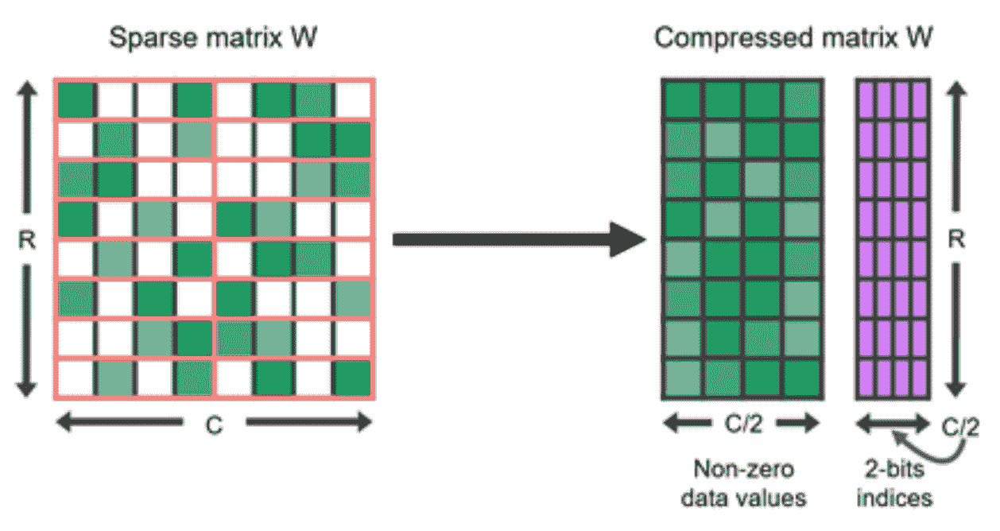

图 7. 2:4 结构稀疏性矩阵及其压缩表示。（图片来源：[Nvidia 博客](https://developer.nvidia.com/blog/accelerating-inference-with-sparsity-using-ampere-and-tensorrt/)）

要将密集神经网络稀疏化以遵循 N:M 结构稀疏模式，[Nvidia（2020）](https://images.nvidia.com/aem-dam/en-zz/Solutions/data-center/nvidia-ampere-architecture-whitepaper.pdf)建议使用三步常规工作流程来训练剪枝网络：训练 –> 剪枝以满足 2:4 稀疏性 –> 重新训练。

对列进行排列可以在剪枝过程中提供更多选项，以保持大幅度参数或满足特殊限制（如 N:M 稀疏性）的参数（[Pool & Yu，2021](https://proceedings.neurips.cc/paper/2021/hash/6e8404c3b93a9527c8db241a1846599a-Abstract.html)）。只要两个矩阵的配对轴按相同顺序排列，矩阵乘法的结果就不会改变。例如，

（1）在自注意力模块中，如果在查询嵌入矩阵$\mathbf{Q}$的轴 1 和键嵌入矩阵$\mathbf{K}^\top$的轴 0 上应用相同的排列顺序，则矩阵乘法$\mathbf{Q}\mathbf{K}^\top$的最终结果将保持不变。

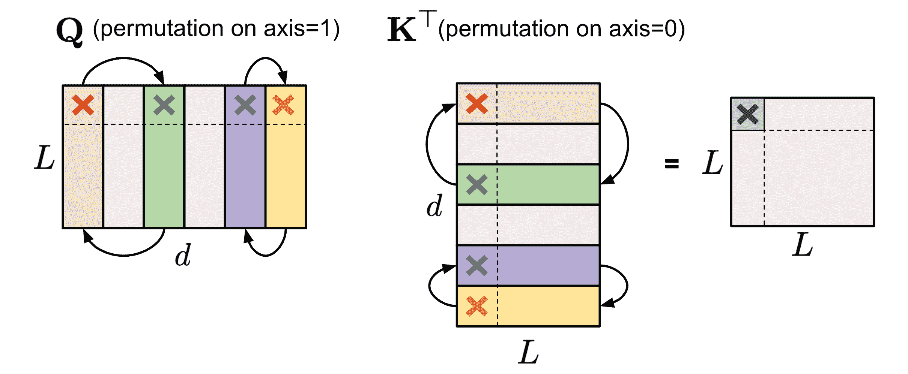

图 8\. 展示了对$\mathbf{Q}$（轴 1）和$\mathbf{K}^\top$（轴 0）进行相同排列以保持自注意力模块的结果不变。

(2) 在包含两个 MLP 层和一个 ReLU 非线性层的 FFN 层内，我们可以按照相同顺序沿轴 1 排列第一个线性权重矩阵$\mathbf{W}_1$和沿轴 0 排列第二个线性权重矩阵$\mathbf{W}_2$。

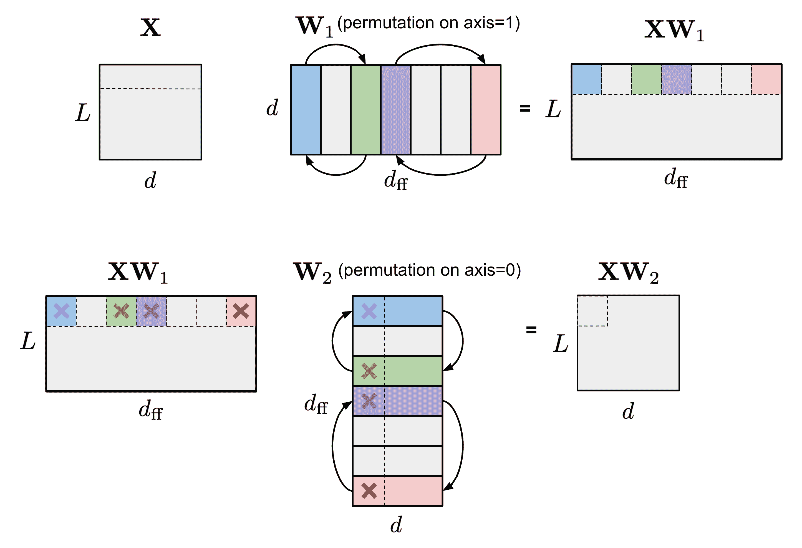

图 9\. 展示了对$\mathbf{W}_1$（轴 1）和$\mathbf{W}_2$（轴 0）进行相同排列以保持 FFN 层输出不变。为简单起见，跳过了偏置项，但偏置项也应该进行相同排列。

为了强制 N:M 结构稀疏性，让我们将一个矩阵的列分成多个包含$M$列的滑块（称为“条纹”），我们可以很容易地观察到每个条纹内列的顺序以及条纹的顺序对 N:M 稀疏性限制没有影响。

[Pool & Yu（2021）](https://proceedings.neurips.cc/paper/2021/hash/6e8404c3b93a9527c8db241a1846599a-Abstract.html)提出了一种迭代贪婪算法，以找到最大化 N:M 稀疏性权重幅度的最佳排列。所有通道对都被推测性地交换，只有导致幅度最大增加的交换被采纳，生成一个新排列并完成单次迭代。贪婪算法可能只找到局部最小值，因此他们引入了两种技术来避开局部最小值：

1.  有界回归：在实践中，随机交换两个通道，最多固定次数。解决方案搜索仅限于一次通道交换的深度，以保持搜索空间广泛且浅显。

1.  狭窄、深度搜索：选择多个条纹并同时优化它们。

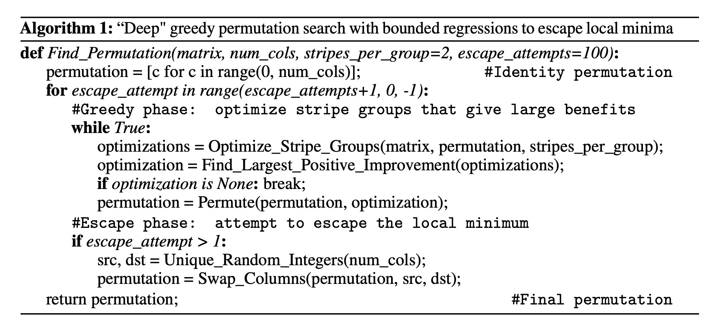

图 10\. 贪婪迭代地寻找 N:M 稀疏性最佳排列的算法。（图片来源：[Pool & Yu 2021](https://proceedings.neurips.cc/paper/2021/hash/6e8404c3b93a9527c8db241a1846599a-Abstract.html)）

如果在剪枝之前对网络进行排列，网络可以实现更好的性能，与在其默认通道顺序中剪枝相比。

要从头开始训练一个具有 N:M 稀疏性的模型，[周和马等人（2021）](https://arxiv.org/abs/2102.04010)扩展了 STE（直通估计器；[Bengio 等人 2013](https://arxiv.org/abs/1308.3432)），这在模型量化的反向传播更新中常用，以适用于幅度剪枝和稀疏参数更新。

STE 计算密集参数相对于被剪枝网络$\widetilde{W}$的梯度，$\partial \mathcal{L}/\partial \widetilde{W}$，并将其应用于密集网络$W$作为近似：

$$ W_{t+1} \gets W_t - \gamma \frac{\partial\mathcal{L}}{\partial\widetilde{W}} $$

扩展版本**SR-STE**（稀疏精化 STE）通过以下方式更新密集权重$W$：

$$ W_{t+1} \gets W_t - \gamma \frac{\partial\mathcal{L}}{\partial\widetilde{W}} + \lambda_W (\bar{\mathcal{E}} \odot W_t) $$ 其中 $\bar{\mathcal{E}}$ 是 $\widetilde{W}$ 的掩码矩阵，$\odot$ 是逐元素乘法。SR-STE 旨在通过（1）限制 $\widetilde{W}_t$ 中被修剪的权重的值，以及（2）促进 $\widetilde{W}_t$ 中未被修剪的权重，防止二进制掩码的大变化。

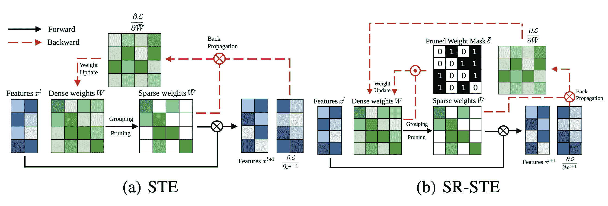

图 11\. STE 和 SR-STE 的比较。$\odot$ 是逐元素乘积；$\otimes$ 是矩阵乘法。（图片来源：[Zhou & Ma, et al. 2021](https://arxiv.org/abs/2102.04010)）

与 STE 或 SR-STE 不同，**Top-KAST**（[Jayakumar et al. 2021](https://arxiv.org/abs/2106.03517)）方法可以在前向和反向传播中保持恒定的稀疏性，但不需要具有稠密参数或稠密梯度的前向传播。

在一个训练步骤 $t$ 中，Top-KAST 的处理方式如下：

1.  *稀疏前向传播*：选择参数子集 $A^t \subset \Theta$，每层按大小包含前 $K$ 个参数，限制在前 $D$ 比例的权重中。在时间 $t$ 的参数化 $\alpha^t$ 中，如果不在 $A^t$ 中（活跃权重），则将参数归零。

$$ \alpha^t_i = \begin{cases} \theta^t_i & \text{ if } i \in A^t = \{i \mid \theta^t_i \in \text{TopK}(\theta^t, D) \}\\ 0 & \text{ otherwise} \end{cases} $$

其中 $\text{TopK}(\theta, x)$ 从 $\theta$ 中基于大小选择前 $x$ 比例的权重。

1.  *稀疏反向传播*：然后将梯度应用于更大的参数子集 $B \subset \Theta$，其中 $B$ 包含 $(D+M)$ 比例的权重，$A \subset B$。更新更大比例的权重能够更有效地探索不同的修剪掩码，更有可能导致前 $D$ 比例的活跃权重中的排列。

$$ \Delta_{\theta^t_i} = \begin{cases} -\eta \nabla_{\alpha_t} \mathcal{L}(y, x, \alpha^t)_i & \text{ if } i\in B^t = \{i \mid \theta^t_i \in \text{TopK}(\theta^t, D+M) \} \\ 0 & \text{ otherwise } \end{cases} $$

训练分为两个阶段，集合 $B \setminus A$ 中的额外坐标控制引入多少探索。预计探索量会逐渐减少，并且掩码最终会稳定下来。

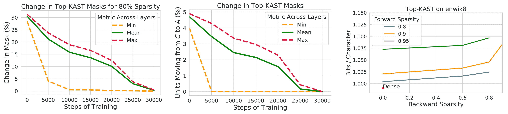

图 12\. Top-KAST 的修剪掩码随时间稳定。（图片来源：[Jayakumar et al. 2021](https://arxiv.org/abs/2106.03517)）

为了防止富者愈富现象，Top-KAST 通过 L2 正则化损失惩罚活跃权重的大小，以鼓励对新项目进行更多的探索。在更新过程中，$B \setminus A$ 中的参数受到比 $A$ 更高的选择门槛的惩罚，以稳定掩码。

$$ L_\text{penalty}(\alpha^t_i) = \begin{cases} \vert \theta^t_i\vert & \text{ if } i \in A^t \\ \vert \theta^t_i\vert / D & \text{ if } i \in B^t \setminus A^t \\ 0 & \text{ otherwise} \end{cases} $$

## 稀疏化 Transformer

*Scaling Transformer*（[Jaszczur 等人，2021](https://arxiv.org/abs/2111.12763)）在 transformer 架构中稀疏化了自注意力和 FFN 层，实现了单个示例推理的 37 倍加速。

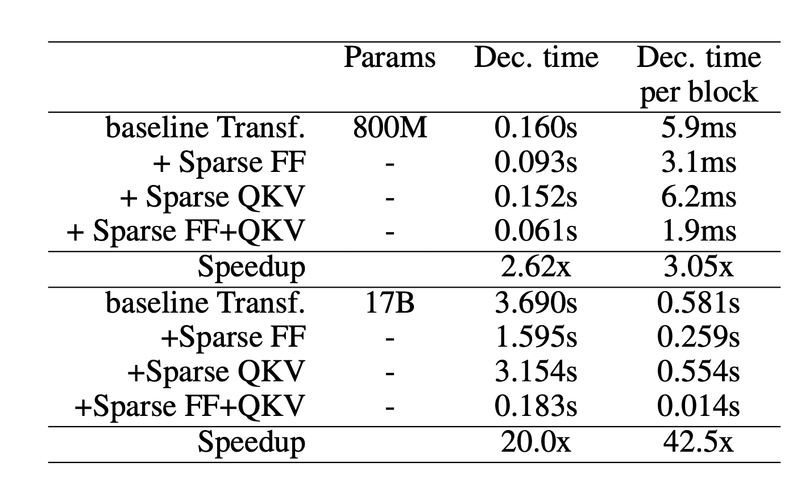

图 13\. 当在不同层应用稀疏化时，transformer 模型解码单个标记（非批量推理）的速度。 (图片来源：[Jaszczur 等人，2021](https://arxiv.org/abs/2111.12763))

**稀疏 FFN 层**：每个 FFN 层包含 2 个 MLP 和一个 ReLU 层。由于 ReLU 会引入大量零值，它们在激活上实现了一个固定的结构，以强制每个$N$元素块中只有 1 个非零值。稀疏模式是动态的，对于每个标记都不同。

$$ \begin{aligned} Y_\text{sparse} &= \max(0, xW_1 + b_1) \odot \text{Controller}(x) \\ \text{SparseFFN}(x) &= Y_\text{sparse} W_2 + b_2 \\ \text{Controller}(x) &= \arg\max(\text{Reshape}(x C_1 C_2, (-1, N))) \end{aligned} $$

其中$Y_\text{sparse}$中的每个激活对应于$W_1$中的一列和$W_2$中的一行。控制器实现为一个低秩瓶颈密集层，$C_1 \in \mathbb{R}^{d_\text{model} \times d_\text{lowrank}}, C_2 \in \mathbb{R}^{d_\text{lowrank} \times d_\text{ff}}$，$d_\text{lowrank} = d_\text{model} / N$。在推理中，它使用$\arg\max$来选择哪些列应该是非零的，并在训练期间使用 Gumbel-softmax 技巧（[Jang 等人，2016](https://arxiv.org/abs/1611.01144)）。因为我们可以在加载 FFN 权重矩阵之前计算$\text{Controller}(x)$，所以我们知道哪些列将被置零，因此选择*不加载*它们以加快推理速度。

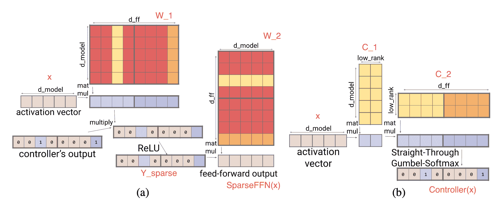

图 14\. (a) 稀疏 FFN 层；红色列在内存中未加载，以加快推理速度。 (b) 1:4 稀疏 FFN 控制器。 (图片来源：[Jaszczur 等人，2021](https://arxiv.org/abs/2111.12763)) *莉莲的侧记*：论文插图中的(a)实际上是$Y_\text{sparse} = \max\big(0, (xW_1 + b_1) \odot \text{Controller}(x)\big)$，但这并不改变结果。

**稀疏 QKV（注意力）层**：在注意力层中，维度$d_\text{model}$被分成$S$个模块，每个大小为$M=d_\text{model} /S$。为了确保每个子分区都可以访问嵌入的任何部分，Scaling Transformer 引入了一个乘法层（即，一个乘法层逐元素地将来自多个神经网络层的输入相乘），它可以表示任意排列，但包含的参数比密集层少。

给定输入向量$x \in \mathbb{R}^{d_\text{model}}$，乘法层输出$y \in \mathbb{R}^{S \times M}$：

$$ y_{s,m} = \sum_i x_i D_{i,s} E_{i,m} \quad\text{其中 }D \in \mathbb{R}^{d_\text{model} \times S}, D \in \mathbb{R}^{d_\text{model} \times M} $$

乘法层的输出是一个大小为$\in \mathbb{R}^{\text{批量大小}\times \text{长度} \times S \times M}$的张量。然后通过一个二维卷积层处理，其中$\text{长度}$和$S$被视为图像的高度和宽度。这样的卷积层进一步减少了注意力层的参数数量和计算时间。

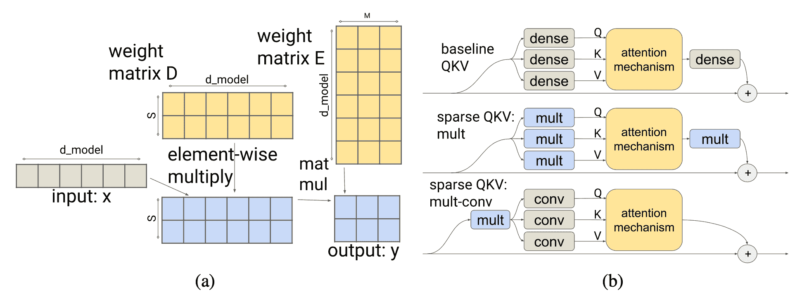

图 15\. (a) 引入了一个乘法层，使分区可以访问嵌入的任何部分。 (b) 乘法密集层和二维卷积层的组合减少了注意力层的参数数量和计算时间。 (图片来源：[Jaszczur 等人 2021](https://arxiv.org/abs/2111.12763))

为了更好地处理长序列，Scaling Transformer 进一步配备了来自[Reformer](https://lilianweng.github.io/posts/2023-01-27-the-transformer-family-v2/#locality-sensitive-hashing-reformer)（[Kitaev, et al. 2020](https://arxiv.org/abs/2001.04451)）的 LSH（局部敏感哈希）注意力和 FFN 块的循环，从而形成*Terraformer*。

## 专家混合

混合专家（MoE）模型依赖于一组“专家”网络，每个示例仅激活一部分网络以进行预测。这个想法最早可以追溯到上世纪 90 年代（[Jacobs et al. 1991](https://www.cs.toronto.edu/~hinton/absps/jjnh91.pdf)），与集成方法密切相关。有关如何将 MoE 模块整合到 Transformer 中的详细信息，请查看我的[关于大型模型训练技术的先前文章](https://lilianweng.github.io/posts/2021-09-25-train-large/)以及[Fedus 等人 2022 年的 MoE 综述论文](https://arxiv.org/abs/2209.01667)。

使用 MoE 架构，解码时仅利用部分参数，因此节省了推理成本。每个专家的容量可以通过超参数，容量因子$C$进行调整，专家容量定义为：

$$ \text{专家容量} = \text{round}(C \cdot k \cdot \frac{\text{一个批次中的总标记数}}{\text{# 专家}}) $$

每个标记选择前$k$个专家。较大的$C$会导致更高的专家容量和更好的性能，但计算成本更高。当$C>1$时，会添加一定的松弛容量；否则，当$C<1$时，路由网络需要忽略一些标记。

### 路由策略改进

MoE 层具有一个路由网络，为每个输入标记分配一组专家。香草 MoE 模型中的路由策略是根据自然顺序将每个标记路由到不同的首选专家。如果一个标记被路由到已达到容量的专家，该标记将被标记为*“溢出”并跳过*。

**V-MoE**（视觉 MoE；[Riquelme 等人，2021](https://arxiv.org/abs/2106.05974)）将 MoE 层添加到 ViT（视觉 Transformer）中。它与先前的最先进技术性能相匹配，但只需要*一半*的推理计算。V-MoE 可以扩展到 15B 参数。他们的实验使用了$k=2$，32 个专家和每 2 个专家放置一次（这意味着 MoE 层放置在每隔一层）。

由于每个专家的容量有限，如果一些重要且信息丰富的标记出现得太晚（例如句子中的单词顺序或图像块的顺序），则可能不得不丢弃它们。为了避免在普通路由方案中出现这种缺点，V-MoE 采用**BPR（批量优先路由）**来首先为具有高优先级分数的标记分配专家。BPR 在专家分配之前为每个标记计算优先级分数（路由器分数的最大值或前$k$个的总和），并相应地改变标记的顺序。这确保了专家容量缓冲区首先填满关键标记。

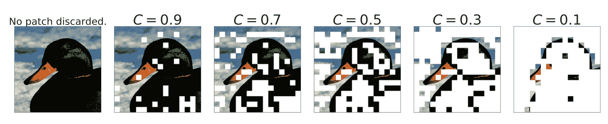

图 16。当$C < 1$时，根据优先级分数丢弃图像块的方式。（图片来源：[Riquelme 等人，2021](https://arxiv.org/abs/2106.05974)）

当$C\leq 0.5$时，BPR 比普通路由效果要好得多，模型开始丢弃大量标记。即使在非常低的容量下，它也使模型能够与密集网络竞争。

当研究如何解释图像类别专家关联时，他们观察到早期的 MoE 层更为通用，而后期的 MoE 层可能会专门针对少数图像类别。

**任务 MoE**（任务级混合专家；[Kudugunta 等人，2021](https://arxiv.org/abs/2110.03742)）考虑了任务信息，并在机器翻译的*任务*级别而不是单词或标记级别上路由标记。他们以 MNMT（多语言神经机器翻译）为例，并根据目标语言或语言对对翻译任务进行分组。

标记级别的路由是动态的，每个标记的路由决策是独立进行的。因此，在推理时，服务器需要预加载所有专家。相比之下，任务级别的路由是*静态*的，给定一个固定的任务，因此一个任务的推理服务器只需要预加载$k$个专家（假设是前$k$个路由）。根据他们的实验，与密集模型基线相比，任务 MoE 可以实现类似的性能提升，具有 2.6 倍更高的峰值吞吐量和 1.6%的解码器大小。

任务级 MoE 基本上是根据预定义的*启发式*对任务分布进行分类，并将这种人类知识纳入路由器中。当这样的启发式不存在时（例如考虑一个通用的句子续写任务），如何利用任务 MoE 就不那么直接了。

**PR-MoE**（金字塔残差 MoE；[Rajbhandari 等人，2022](https://arxiv.org/abs/2201.05596)）使每个标记通过一个固定的 MLP 和一个选择的专家。由于观察到后续层的 MoE 更有益，PR-MoE 在后续层采用更多的专家。DeepSpeed 库实现了灵活的多专家、多数据并行，以便在不同层次上训练具有不同专家数量的 PR-MoE。

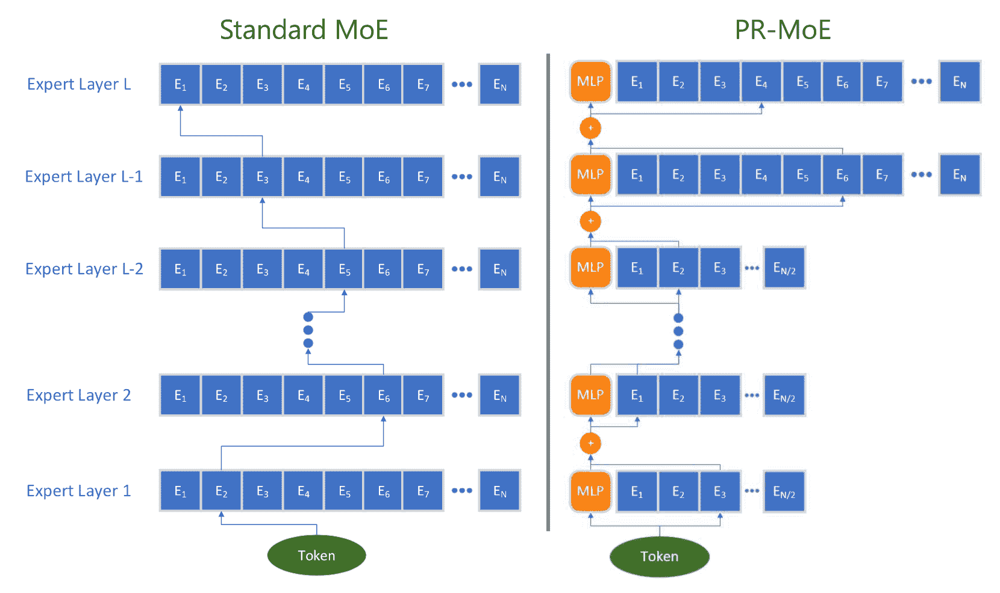

图 17. PR-MoE 架构与标准 MoE 的比较示意图（图片来源：[Rajbhandari 等人，2022](https://arxiv.org/abs/2201.05596)）

### 内核改进

专家网络可以托管在不同的设备上。然而，当 GPU 数量增加时，每个 GPU 上的专家数量减少，专家之间的通信（“全对全”）变得更加昂贵。跨多个 GPU 之间的全对全通信依赖于 NCCL 的 P2P API，这在大规模上无法饱和高速链接的带宽（例如 NVLink、HDR InfiniBand），因为随着使用更多节点，单个块变得更小。现有的全对全算法在大规模和小工作负载下表现不佳。有各种内核改进可以实现更高效的 MoE 计算，例如使全对全通信更便宜/更快。

*DeepSpeed*库（[Rajbhandari 等人，2022](https://arxiv.org/abs/2201.05596)）和 TUTEL（[Hwang 等人，2022](https://arxiv.org/abs/2206.03382)）都实现了基于树的**分层全对全**算法，该算法运行节点内全对全，然后是节点间全对全。它将通信跳数从$O(G)$减少到$O(G_\text{node} + G / G_\text{node})$，其中$G$是 GPU 节点的总数，$G_\text{node}$是每个节点的 GPU 核心数。尽管在这种实现中通信量翻倍，但它能够更好地扩展大规模下的小批量，因为瓶颈在于小批量时延迟而不是通信带宽。

*DynaMoE*（[Kossmann 等人，2022](https://arxiv.org/abs/2205.01848)）使用**动态重新编译**来适应专家之间的动态工作负载。`RECOMPILE`机制从头开始编译计算图，并且只在需要时重新分配资源。它测量每个专家分配了多少样本，并动态调整它们的容量因子$C$，以减少运行时的内存和计算需求。基于观察到样本-专家分配在训练早期就会收敛，*样本分配缓存*在收敛后引入，然后使用`RECOMPILE`来消除门控网络和专家之间的依赖关系。

# 架构优化

有关*高效 Transformer*的调查论文（[Tay et al. 2020](https://arxiv.org/abs/2009.06732)）审查了一系列新的 Transformer 架构，改进了更好的*计算和内存效率*。强烈推荐阅读。您还可以查看我的帖子[“Transformer 家族 2.0 版”](https://lilianweng.github.io/posts/2023-01-27-the-transformer-family-v2/)，深入介绍了一系列 Transformer 架构改进，包括使模型更便宜运行的变化。

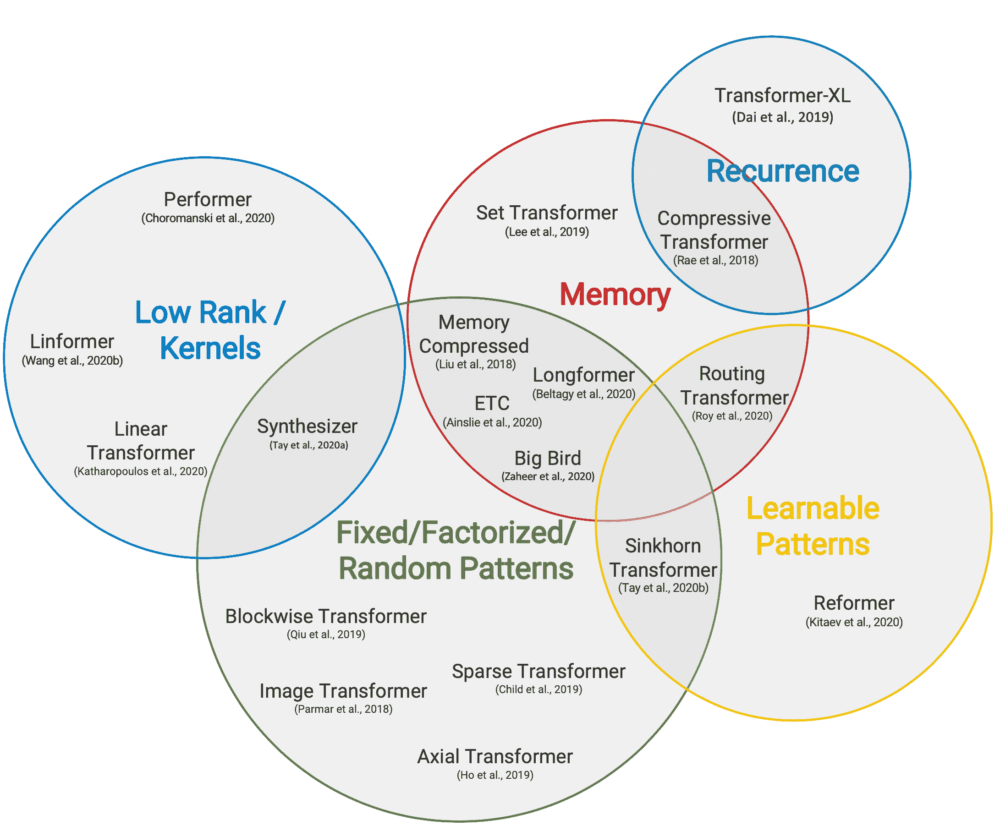

第 18 图。高效 Transformer 模型的分类。

（图片来源：[Tay et al. 2020](https://arxiv.org/abs/2009.06732)）

由于自注意力机制具有二次时间和内存复杂度，这是提高 Transformer 解码效率的主要瓶颈，所有高效 Transformer 模型都对原本密集的注意力层应用了某种形式的稀疏性。这里仅列出一个高层次概述，其中几个源自[Tay et al. 2020](https://arxiv.org/abs/2009.06732)。

## 稀疏注意力模式

1.  *固定模式*限制了注意力矩阵的视野，使用预定义的固定模式。

    +   将输入序列分块成固定块，例如[Blockwise Attention](https://lilianweng.github.io/posts/2023-01-27-the-transformer-family-v2/##strided-context)；

    +   [Image Transformer](https://lilianweng.github.io/posts/2023-01-27-the-transformer-family-v2/##fixed-local-context)使用局部注意力；

    +   [Sparse Transformer](https://lilianweng.github.io/posts/2023-01-27-the-transformer-family-v2/##strided-context)使用跨步注意力模式。

1.  *组合模式*学习对输入标记进行排序/聚类-实现序列的更优全局视图，同时保持固定模式的效率优势。

    +   [Sparse Transformer](https://lilianweng.github.io/posts/2023-01-27-the-transformer-family-v2/#sparse-attention-matrix-factorization-sparse-transformers)结合了跨步和局部注意力；

    +   给定高维输入张量，而不是对输入的扁平化版本应用注意力，[Axial Transformer](https://arxiv.org/abs/1912.12180)应用多个注意力，每个沿着输入张量的一个轴。

    +   [ETC、Longformer 和 Big Bird](https://lilianweng.github.io/posts/2023-01-27-the-transformer-family-v2/#combination-of-local-and-global-context)结合了局部和全局上下文，以及跨步或随机注意力。

1.  *可学习模式*通过学习确定最佳注意力模式。

    +   [Reformer](https://lilianweng.github.io/posts/2023-01-27-the-transformer-family-v2/#content-based-attention)根据基于哈希相似性（LSH）将标记聚类到簇中；

    +   [Routing Transformer](https://lilianweng.github.io/posts/2023-01-27-the-transformer-family-v2/#content-based-attention)在标记上运行$k$-means 聚类；

    +   [Sinkhorn Sorting Network](https://arxiv.org/abs/2002.11296)学习对输入序列的块进行排序。

## 循环

递归机制通过递归连接多个块/段。

+   [Transformer-XL](https://lilianweng.github.io/posts/2023-01-27-the-transformer-family-v2/#context-memory)通过在段之间重用隐藏状态来利用更长的上下文。

+   [通用变压器](https://lilianweng.github.io/posts/2023-01-27-the-transformer-family-v2/#make-it-recurrent)将自注意机制与 RNN 中的递归机制结合在一起。

+   [压缩变压器](https://lilianweng.github.io/posts/2023-01-27-the-transformer-family-v2/#context-memory)是 Transformer-XL 的扩展，具有额外的记忆，包含一组用于过去激活的记忆槽和用于压缩激活的压缩记忆槽。每当模型接受新的输入段时，主要记忆中最老的激活被移动到压缩记忆中，其中应用了压缩函数。

## 节省内存设计

节省内存设计指的是对架构的更改，以使用更少的内存。

+   [Linformer](https://lilianweng.github.io/posts/2023-01-27-the-transformer-family-v2/#low-rank-attention)将键和值的长度维度投影到较低维度表示（$N \to k$），因此内存复杂度从$N \times N$减少到$N \times k$。

+   [Shazeer (2019)](https://arxiv.org/abs/1911.02150)提出了*多查询注意力*，其键和值在不同注意力“头”之间共享，大大减少了这些张量的大小和内存成本。

+   [随机特征注意力和表演者](https://lilianweng.github.io/posts/2023-01-27-the-transformer-family-v2/#low-rank-attention)使用核方法)来实现自注意机制的更便宜的数学格式。

## 自适应注意力

*自适应注意力*使模型能够学习每个输入令牌的最佳注意跨度或决定何时对不同输入令牌进行早期退出。

+   [自适应注意跨度](https://lilianweng.github.io/posts/2023-01-27-the-transformer-family-v2/#adaptive-attention-span)训练模型通过令牌和其他键之间的软掩码学习每个令牌每个头的最佳注意跨度。

+   [通用变压器](https://lilianweng.github.io/posts/2023-01-27-the-transformer-family-v2/#make-it-recurrent)结合了递归机制，并使用[ACT（自适应计算时间）](https://lilianweng.github.io/posts/2020-04-07-the-transformer-family/#adaptive-computation-time-act)动态决定递归步数。

+   [深度自适应变压器和 CALM](https://lilianweng.github.io/posts/2023-01-27-the-transformer-family-v2/#depth-adaptive-transformer)学习何时根据一些置信度度量来提前退出每个令牌的计算层，以实现良好的性能效率权衡。

# 引用

被引用为:

> 翁，莉莲。 (2023 年 1 月)。大型变压器模型推理优化。Lil’Log。https://lilianweng.github.io/posts/2023-01-10-inference-optimization/.

或

```py
@article{weng2023inference,
  title   = "Large Transformer Model Inference Optimization",
  author  = "Weng, Lilian",
  journal = "Lil'Log",
  year    = "2023",
  month   = "Jan",
  url     = "https://lilianweng.github.io/posts/2023-01-10-inference-optimization/"
} 
```

# 参考文献

[1] Bondarenko 等人 [“理解和克服高效 Transformer 量化的挑战”](https://arxiv.org/abs/2109.12948) ACL 2021.

[2] Dettmers 等人 [“LLM.int8(): 用于规模化 Transformer 的 8 位矩阵乘法”](https://arxiv.org/abs/2208.07339) NeuriPS 2022

[3] Zadeh 等人 [“Gobo：为低延迟和高能效推理量化基于注意力的 NLP 模型。”](https://arxiv.org/abs/2005.03842) MICRO 2020

[4] 沈，董 & 叶等人 [“Q-BERT：基于 Hessian 的 BERT 超低精度量化”](https://arxiv.org/abs/1909.05840) AAAI 2020.

[5] 姚等人 [“ZeroQuant：大规模 Transformer 的高效且经济实惠的训练后量化”](https://arxiv.org/abs/2206.01861) arXiv 预印本 arXiv:2206.01861 (2022).

[6] Frantar 等人 [“GPTQ：用于生成式预训练 Transformer 的准确量化”](https://arxiv.org/abs/2210.17323) arXiv 预印本 arXiv:2210.17323 (2022).

[7] 肖 & 林 [“SmoothQuant：加速稀疏神经训练：一种可证明且高效的方法来找到 N:M 可转置掩码。”](https://arxiv.org/abs/2211.10438) arXiv 预印本 arXiv:2211.10438 (2022). | [code](https://github.com/mit-han-lab/smoothquant)

[8] Pool & 余 [“通道置换用于 N:M 稀疏性。”](https://proceedings.neurips.cc/paper/2021/hash/6e8404c3b93a9527c8db241a1846599a-Abstract.html) NeuriPS 2021\. | [code](https://github.com/NVIDIA/apex/tree/master/apex/contrib/sparsity)

[9] 周 & 马等人 [“从头开始学习 N:M 细粒度结构稀疏神经网络。”](https://arxiv.org/abs/2102.04010) arXiv 预印本 arXiv:2102.04010 (2021).

[10] Jayakumar 等人 [“Top-KAST：始终稀疏的 Top-K 训练。”](https://arxiv.org/abs/2106.03517) NeuriPS 2020.

[11] Nvidia [“Nvidia A100 张量核 GPU 架构。”](https://images.nvidia.com/aem-dam/en-zz/Solutions/data-center/nvidia-ampere-architecture-whitepaper.pdf) 2020.

[12] 盖尔，埃尔森 & 胡克 [“深度神经网络中稀疏性的现状。”](https://arxiv.org/abs/1902.09574) arXiv 预印本 arXiv:1902.09574 (2019).

[13] 朱 & 古普塔 [“剪枝还是不剪枝：探索模型压缩的有效性。”](https://arxiv.org/abs/1710.01878) arXiv 预印本 arXiv:1710.01878 (2017).

[14] Renda 等人 [“神经网络剪枝中比较重绕和微调。”](https://arxiv.org/abs/2003.02389) arXiv 预印本 arXiv:2003.02389 (2020).

[15] 周 & 马等人 [“从头开始学习 N:M 细粒度结构稀疏神经网络。”](https://arxiv.org/abs/2102.04010) arXiv 预印本 arXiv:2102.04010 (2021).

[16] Pool & 余 [“通道置换用于 N:M 稀疏性。”](https://proceedings.neurips.cc/paper/2021/hash/6e8404c3b93a9527c8db241a1846599a-Abstract.html) NeuriPS 2021\. | [code](https://github.com/NVIDIA/apex/tree/master/apex/contrib/sparsity)

[17] Jaszczur 等人 [“在扩展 Transformer 中稀疏就足够了。”](https://arxiv.org/abs/2111.12763) NeuriPS 2021.

[18] Mishra et al. [“神经网络压缩综述。”](https://arxiv.org/abs/2010.03954) arXiv 预印本 arXiv:1710.09282 (2017).

[19] Fedus et al. [“深度学习中稀疏专家模型综述。”](https://arxiv.org/abs/2209.01667) arXiv 预印本 arXiv:2209.01667 (2022)。

[20] Riquelme et al. [“利用稀疏专家混合扩展视觉。”](https://arxiv.org/abs/2106.05974) NeuriPS 2021.

[21] Kudugunta et al. [“超越蒸馏：任务级专家混合用于高效推理。”](https://arxiv.org/abs/2110.03742) arXiv 预印本 arXiv:2110.03742 (2021).

[22] Rajbhandari et al. [“DeepSpeed-MoE：推动下一代 AI 规模的专家混合推理和训练。”](https://arxiv.org/abs/2201.05596) arXiv 预印本 arXiv:2201.05596 (2022).

[23] Kossmann et al. [“使用动态重新编译优化专家混合。”](https://arxiv.org/abs/2205.01848) arXiv 预印本 arXiv:2205.01848 (2022).

[24] Hwang et al. [“Tutel：规模化自适应专家混合。”](https://arxiv.org/abs/2206.03382) arXiv 预印本 arXiv:2206.03382 (2022)。| [code](https://github.com/microsoft/tutel)

[25] Noam Shazeer. [“快速 Transformer 解码：一个写头就够了。”](https://arxiv.org/abs/1911.02150) arXiv 预印本 arXiv:1911.02150 (2019).

[26] Tay et al. [“高效 Transformer：一项调查。”](https://arxiv.org/abs/2009.06732) ACM 计算调查 55.6 (2022): 1-28.

[27] Pope et al. [“高效扩展 Transformer 推理。”](https://arxiv.org/abs/2211.05102) arXiv 预印本 arXiv:2211.05102 (2022).

[28] Frankle & Carbin. [“抽奖票假设：寻找稀疏、可训练的神经网络”](https://arxiv.org/abs/1803.03635) ICLR 2019.

[29] Elabyad et al. [“深度自适应 Transformer”](https://arxiv.org/abs/1910.10073) ICLR 2020.

[30] Schuster et al. [“自信自适应语言建模”](https://arxiv.org/abs/2207.07061) arXiv 预印本 arXiv:2207.07061 (2022).

[31] Gou et al. [“https://arxiv.org/abs/2006.05525”](https://arxiv.org/abs/2006.05525) arXiv 预印本 arXiv:2006.05525 (2020).

[32] Hinton et al. [“提炼神经网络中的知识”](https://arxiv.org/abs/1503.02531) NIPS 2014.

[33] Sanh et al. [“DistilBERT，BERT 的精简版本：更小、更快、更便宜、更轻”](https://arxiv.org/abs/1910.01108) NeuriPS 2019 能源高效机器学习和认知计算研讨会。
