# 学习不足的情况下使用的数据生成第 3 部分

> 原文：[`lilianweng.github.io/posts/2022-04-15-data-gen/`](https://lilianweng.github.io/posts/2022-04-15-data-gen/)

这里是关于学习不足数据的第 3 部分（之前：[第 1 部分](https://lilianweng.github.io/posts/2021-12-05-semi-supervised/)和[第 2 部分](https://lilianweng.github.io/posts/2022-02-20-active-learning/)）。让我们考虑两种用于生成合成数据进行训练的方法。

+   **增强数据**。给定一组现有的训练样本，我们可以应用各种增强、失真和转换来推导出新的数据点，而不会丢失关键属性。我们在一篇[先前的帖子](https://lilianweng.github.io/posts/2021-05-31-contrastive/)中涵盖了关于文本和图像的一堆增强方法。为了帖子的完整性，我在这里*复制*了关于数据增强的部分，并进行了一些编辑。

+   **新数据**。即使只有少量甚至没有数据点，我们也可以依靠强大的预训练模型生成一些*新*数据点。尤其是在最近几年，由于大型预训练[语言模型（LM）](https://lilianweng.github.io/posts/2019-01-31-lm/)的快速进展，这一点尤为明显。Few shot prompting 已被证明对 LM 学习在上下文中没有额外训练是有效的。

# 数据增强

数据增强的目标是修改输入格式（例如文本措辞，视觉外观），同时语义含义保持不变。

## 图像增强

### 基本图像处理操作

有几种方法可以修改图像而保留其语义信息。我们可以使用以下任何一种增强或多个操作的组合。

+   随机裁剪然后调整回原始大小。

+   随机颜色失真

+   随机高斯模糊

+   随机颜色抖动

+   随机水平翻转

+   随机灰度转换

+   还有更多。查看[PIL.ImageOps](https://pillow.readthedocs.io/en/stable/reference/ImageOps.html)以获取灵感。

### 任务特定的增强策略

如果已知下游任务，可以学习最佳的增强策略（即使用哪些处理操作以及如何组合它们以最大化下游任务性能）。

+   [*AutoAugment*](https://lilianweng.github.io/posts/2019-05-05-domain-randomization/#AutoAugment)（[Cubuk 等，2018](https://arxiv.org/abs/1805.09501)）受到[神经架构搜索](https://lilianweng.github.io/posts/2020-08-06-nas/)的启发，AutoAugment 将学习最佳数据增强操作（即剪切、旋转、反转等）的问题框架为图像分类的 RL 问题，并寻找导致评估集上最高准确性的组合。AutoAugment 可以以对抗方式执行（[Zhang 等，2019](https://arxiv.org/abs/1912.11188)）。

+   *RandAugment*（[Cubuk 等，2019](https://arxiv.org/abs/1909.13719)）通过控制单个幅度参数来控制不同转换操作的幅度，大大减少了 AutoAugment 的搜索空间。

+   *基于种群的增强*（PBA；[何等，2019](https://arxiv.org/abs/1905.05393)）将 PBT（“基于种群的训练”；[Jaderberg 等，2017](https://arxiv.org/abs/1711.09846)）与 AutoAugment 结合起来，使用进化算法并行训练一组子模型以演化出最佳的增强策略。

+   *无监督数据增强*（UDA；[谢等，2019](https://arxiv.org/abs/1904.12848)）在一组可能的增强策略中，选择一个子集以最小化未标记示例及其未标记增强版本之间的 KL 散度。

### 图像混合

图像混合方法可以从现有数据点构建新的训练示例。

+   *Mixup*（[张等，2018](https://arxiv.org/abs/1710.09412)）通过创建两个现有图像$I_1$和$I_2$的加权像素级组合来进行全局级别的混合：$I_\text{mixup} \gets \alpha I_1 + (1-\alpha) I_2$，其中$\alpha \in [0, 1]$。

+   *Cutmix*（[尹等，2019](https://arxiv.org/abs/1905.04899)）通过将一个图像的局部区域与另一个图像的其余部分结合生成一个新示例。$I_\text{cutmix} \gets \mathbf{M}_b \odot I_1 + (1-\mathbf{M}_b) \odot I_2$，其中$\mathbf{M}_b \in \{0, 1\}^I$是一个二进制掩码，$\odot$是逐元素乘法。它等同于用另一个图像的相同区域填充*cutout*（[DeVries＆Taylor 2017](https://arxiv.org/abs/1708.04552)）区域。

+   给定一个查询$\mathbf{q}$，*MoCHi*（“对比硬负例的混合”；[Kalantidis 等，2020](https://arxiv.org/abs/2010.01028)）维护一个由$K$个负特征$Q={\mathbf{n}_1, \dots, \mathbf{n}_K }$组成的队列，并按照与查询的相似性$\mathbf{q}^\top \mathbf{n}$降序排序这些负特征。队列中的前$N$个项目被视为最难的负例，$Q^N$。然后可以通过$\mathbf{h} = \tilde{\mathbf{h}} / |\tilde{\mathbf{h}}|_2$生成合成的硬例，其中$\tilde{\mathbf{h}} = \alpha\mathbf{n}_i + (1-\alpha) \mathbf{n}_j$，$\alpha \in (0, 1)$。甚至可以通过与查询特征混合来创建更难的例子，$\mathbf{h}’ = \tilde{\mathbf{h}’} / |\tilde{\mathbf{h}’}|_2$，其中$\tilde{\mathbf{h}’} = \beta\mathbf{q} + (1-\beta) \mathbf{n}_j$，$\beta \in (0, 0.5)$。

## 文本增强

### 词汇编辑

*简单数据增强*（EDA；[魏＆邹，2019](https://arxiv.org/abs/1901.11196)）为文本增强定义了一组简单但强大的操作。给定一个句子，EDA 随机选择并应用四种简单操作中的一种：

1.  同义词替换（SR）：用其同义词替换$n$个随机非停用词。

1.  随机插入（RI）：在句子中的随机位置放置一个随机选择的非停用词的同义词。

1.  随机交换（RS）：随机交换两个单词并重复$n$次。

1.  随机删除（RD）：以概率$p$随机删除句子中的每个单词。

其中$p=\alpha$且$n=\alpha \times \text{sentence_length}$，直觉上，较长的句子可以吸收更多噪音，同时保持原始标签。超参数$\alpha$大致表示一句话中可能被一个增强改变的单词的百分比。

EDA 已被证明在几个分类基准数据集上提高了分类准确性，与没有 EDA 的基准相比。在*较小*的训练集上，性能提升更为显著。EDA 中的四种操作都有助于提高分类准确性，但在不同的$\alpha$值下达到最佳。

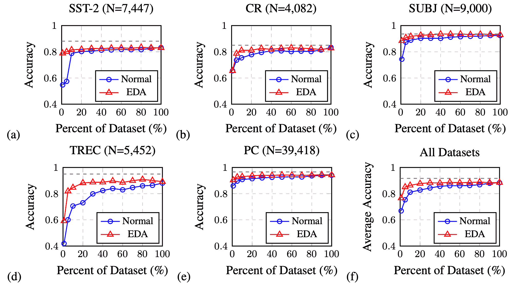

图 1\. EDA 导致几个分类基准的性能提升。（图片来源：[Wei & Zou 2019](https://arxiv.org/abs/1901.11196)）

*上下文*增强（[Kobayashi, 2018](https://arxiv.org/abs/1805.06201)）通过从双向 LM（如 BERT）学习的概率分布中采样，$p(.\mid S\setminus{w_i})$，将位置$i$处的单词$w_i$替换为同义词或适合上下文的类似单词。为确保这些操作不改变标签，LM 被设计为标签条件的双向 LM。条件 BERT（CBERT；[Xing Wu 等，2018](https://arxiv.org/abs/1812.06705)）将 BERT 扩展为在类别标签上预测掩码标记，并可用于上下文增强预测。

### 回译

*回译*通过将文本样本翻译成另一种语言，然后再翻译回来，产生增强数据。翻译以两种方式进行，两个方向都应具有足够良好的性能，以避免语义意义的显著损失。

### 混合

也可以将*Mixup*应用于文本（[Guo 等，2019](https://arxiv.org/abs/1905.08941)），但是在嵌入空间中以获得一些性能增益。所提出的方法依赖于专门设计的模型架构，在单词或句子嵌入上进行预测。在嵌入空间中添加对抗性噪声作为数据增强的方法已被证明可以提高模型训练的泛化能力（[Zhu 等，2019](https://arxiv.org/abs/1909.11764)）。

## 音频增强

这是一份由[Wang & van den Oord (2021)](https://arxiv.org/abs/2103.06508)总结的几种常用音频数据增强方法列表，操作在原始音频或频谱图上。

**音频混合。** 给定两个音频剪辑$\mathbf{x}_1$和$\mathbf{x}_2$，混合版本$\hat{\mathbf{x}} = \alpha \mathbf{x}_1 + (1-\alpha)\mathbf{x}_2$应该与更主导的输入标签相关联。音频混合通过更真实的噪声增强数据。

**时间屏蔽。** 可以屏蔽音频的一个小连续块，而不会丢失语义信息。

**频率屏蔽。** 频谱图上的少量频率分量可以被删除，而不应改变相关联的标签。

**频率偏移。** 频谱图可以通过介于$[-F, F]$之间的整数进行偏移，其中$F$是最大偏移量。这是一种廉价的增强方法，可以改变音频的音调。

## 架构增强

具有**dropout**层的模型可以通过在相同输入样本上应用不同的 dropout 掩码来创建增强样本。例如，在对比学习模型[*SimCSE*](https://lilianweng.github.io/posts/2021-05-31-contrastive/#simcse)（[郭等人，2021](https://arxiv.org/abs/2104.08821)）中，一个样本只需使用两个不同的 dropout 掩码两次输入到编码器中，这两个版本是正样本对，而其他批内样本被视为负样本对。

Dropout 通过向模型的内部表示添加噪声来增强数据。它可以以更有结构的方式应用，例如在**cutoff**（[沈等人（2020）](https://arxiv.org/abs/2009.13818)）中，随机删除令牌嵌入矩阵的随机块。

# 数据合成

鉴于生成高质量、逼真的图像比生成类似人类自然语言文本更困难，并且最近大型预训练语言模型取得了成功，本节仅关注文本生成。要了解如何合成逼真图像，请查看关于[GAN](https://lilianweng.github.io/posts/2017-08-20-gan/)、[VAE](https://lilianweng.github.io/posts/2018-08-12-vae/)、[flow](https://lilianweng.github.io/posts/2018-10-13-flow-models/)和[diffusion](https://lilianweng.github.io/posts/2021-07-11-diffusion-models/)模型的帖子。

## 语言模型作为嘈杂标注者

[王等人（2021）](https://arxiv.org/abs/2108.13487) 探索了通过少样本提示利用 GPT-3 作为弱标注者的方法，实现比人工标注便宜 10 倍。该论文认为，通过使用由 GPT-3 标记的数据，实质上执行了[*自训练*](https://lilianweng.github.io/posts/2021-12-05-semi-supervised/#self-training)：对未标记样本的预测对模型施加熵正则化，以避免高类别重叠，从而帮助提高模型性能。

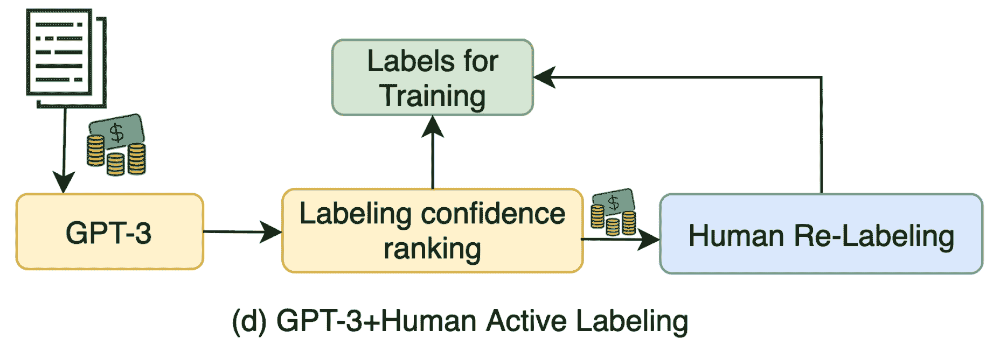

图 2。展示如何使用 GPT-3 通过人在循环主动学习管道生成更多训练数据，以提高数据质量。 (图片来源：[王等人，2021](https://arxiv.org/abs/2108.13487))

通过[主动学习](https://lilianweng.github.io/posts/2022-02-20-active-learning/)选择的 GPT-3 标注样本中最不确定的样本被发送给人类标注者重新注释。Few-shot 提示包含少量人类标记的示例，因此标注成本受限。合成样本按标签 $y$ 的预测 logits 排名，得分最低的样本经过重新标注。

GPT-3 标注在低成本范围内取得更好的结果，但在数据收集上花费足够的资金时与人类标注存在差距。这意味着以下不等式，尽管“很多”或“嘈杂”到什么程度取决于任务细节。

> **大量高质量数据 > 大量嘈杂数据 > 少量高质量数据**。

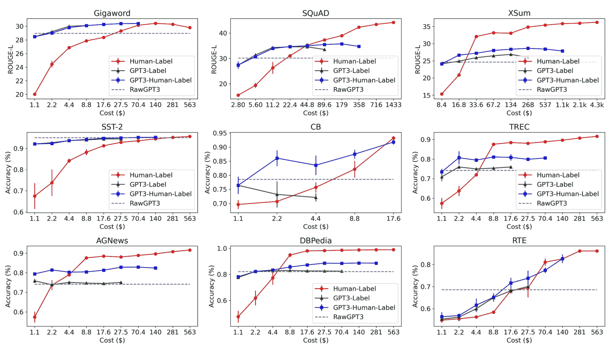

图 3. GPT-3 标注技术改善了低成本范围内的分类性能。（图片来源：[Wang 等人 2021](https://arxiv.org/abs/2108.13487)）

## 语言模型作为数据生成器

如果对文本分类任务有足够的训练数据集，我们可以微调语言模型以根据标签合成更多训练样本（[Anaby-Tavor 等人 2019](https://arxiv.org/abs/1911.03118)，[Kumar 等人 2021](https://arxiv.org/abs/2003.02245)）。

*基于语言模型的数据增强*（**LAMBADA**；[Anaby-Tavor 等人 2019](https://arxiv.org/abs/1911.03118)）采用了这样一个想法，其中该过程涉及对分类器和样本生成模型进行微调。

1.  使用现有的训练数据集训练基线分类器：$h = \mathcal{A}(\mathcal{D}_\text{train})$。

1.  独立于步骤 1，对 LM $\mathcal{M}$ 在 $\mathcal{D}_{\text{train}}$ 上进行微调，得到 $\mathcal{M}_{\text{tuned}}$。

1.  通过使用 $\mathcal{M}_\text{tuned}$ 生成序列 `y[SEP]` 直到 `EOS` 的延续来合成标记数据集 $\mathcal{D}^*$。

1.  通过以下方式筛选合成数据集，

    +   （1）验证预测的标签是否正确 $h(x)=y$；

    +   （2）当样本按分类器概率排名时，选择排名靠前的样本。$\mathcal{D}_\text{syn} \subset \mathcal{D}^*$。它们生成了需要增强的样本的 10 倍，并且只保留了置信度最高的前 10%的合成样本。

最终分类器在 $\mathcal{D}_\text{syn} \cup \mathcal{D}_\text{train}$ 上进行训练。该过程可以多次重复，但不清楚好处是否会迅速减少或重复过程是否会带来自我偏见。

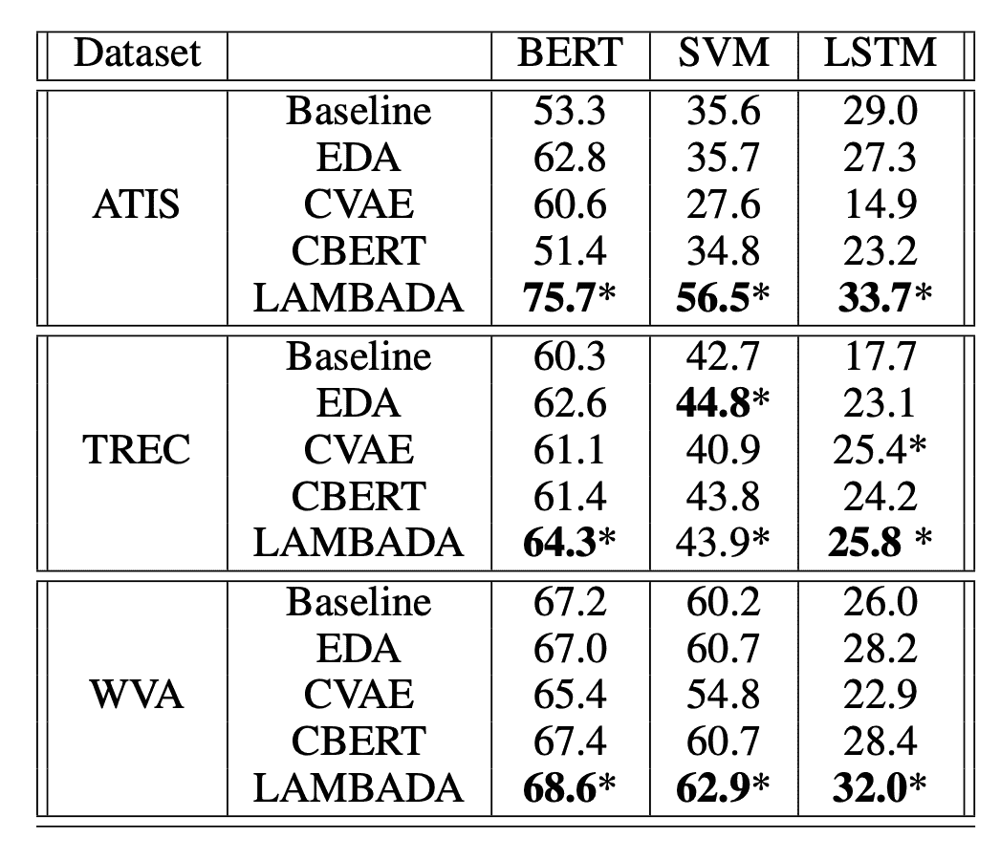

图 4. LAMBADA 的准确性与其他生成方法在所有数据集和分类器上的比较。（图片来源：[Anaby-Tavor 等人 2019](https://arxiv.org/abs/1911.03118)）

为了简化 LAMBADA，我们实际上可以消除精调生成模型和具有相当规模的现有训练数据集的依赖（上述步骤 2）。*无监督数据生成*（**UDG**；[Wang 等人，2021](https://arxiv.org/abs/2109.09193)）依赖于对大型预训练语言模型进行少样本提示，以生成高质量的合成数据进行训练。与上述方法相反，其中 LM 被要求在给定 $\mathbf{x}$ 的情况下预测 $y$，UDG 反之，合成输入 $\mathbf{x}$ 给定标签 $y$。然后在这个合成数据集上训练一个任务特定模型。

[Schick & Schutze（2021）](https://arxiv.org/abs/2104.07540) 提出了一个类似的想法，但是在 NLI 任务上而不是分类任务上，要求 PLM 在提示任务特定指令的情况下编写相似或不同的句子对。

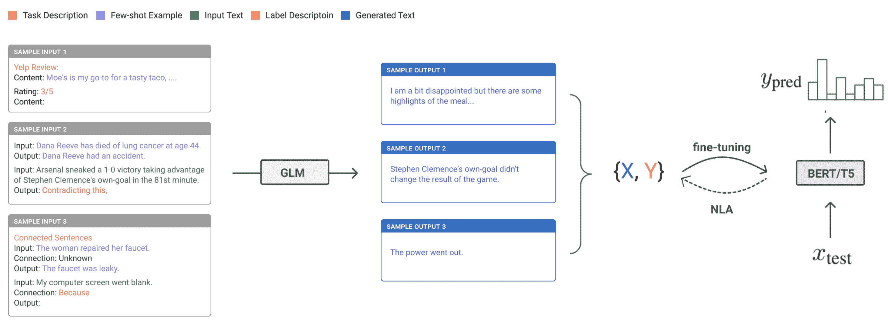

图 5\. 无监督数据生成（UDG）框架的示意图。 (图片来源：[Wang 等人，2021](https://arxiv.org/abs/2109.09193))

UDG 的少样本提示包含少量未标记示例，以及所需标签的任务特定自然语言描述。由于一些生成的示例存在噪声，他们实施了**噪声标签退火**（**NLA**）技术，在训练过程中过滤潜在的不对齐样本。在训练过程中，当模型开始与其伪标签高度不一致时，NLA 会逐渐在时间上去除嘈杂的训练信号。在每个训练步骤 $t$，如果给定示例 $(\mathbf{x}_i, \hat{y}_i)$ 被认为是嘈杂的并且应该被移除，则：

+   模型预测的概率高于阈值 $p(\bar{y}_i \vert \mathbf{x}_i) > \mu_t$，其中 $\bar{y}_i = \arg\max_y p(y \vert \mathbf{x}_i)$；

+   预测的标签与合成标签不同，$\bar{y}_i \neq \hat{y}_i$。

注意，阈值 $\mu_t$ 是时间相关的，初始化为 0.9，然后随时间逐渐退火至 $1/\text{num_of_classes}$。

正如他们的实验所示，UDG 相对于少样本推理的改进是相当显著的，NLA 带来了一些额外的提升。在几种情况下，结果甚至可以与监督微调相媲美。

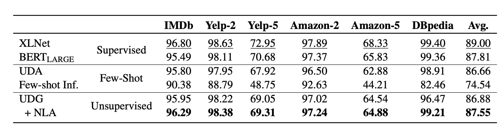

图 6\. UDG 和其他方法在不同分类数据集上准确率的比较。 (图片来源：[Wang 等人，2021](https://arxiv.org/abs/2109.09193))

[Han 等人（2021）](https://arxiv.org/abs/2110.05448) 在翻译任务上利用少样本数据生成、蒸馏和回译取得了 SOTA 结果。提出的方法包括以下步骤，假设没有访问配对翻译数据：

1.  *零-shot 生成*。首先利用预训练 LM 的零-shot 翻译能力为一小组未标记的句子生成翻译。

1.  *少样本生成*。然后通过将它们用作少样本演示来放大这些零样本翻译，以收集更大的合成数据集。

1.  *蒸馏*。在这个数据集上对模型进行微调。翻译任务被制定为一个语言建模任务`[L1] <seq1> [[TRANSLATE]] [L2] <seq2>.`给定两种不同语言的两个序列`<seq1, seq2>`。在测试时，语言模型被提示为`[L1] <seq> [[TRANSLATE]] [L2]`，并且从采样完成中解析出一个候选翻译`<sampledSeq>`。

1.  *反向翻译*。在反向翻译数据集上继续微调，其中样本顺序被颠倒，`<sampledSeq, seq>`。

1.  步骤 1-4 可以重复。

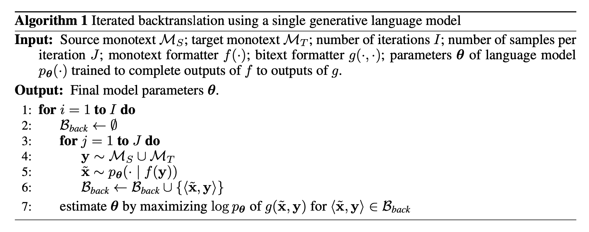

图 7\. 使用蒸馏和反向翻译训练语言模型进行翻译任务的算法。 (图片来源：[Han 等人，2021](https://arxiv.org/abs/2110.05448))

上述方法的成功取决于一个良好的预训练语言模型，以启动初始翻译数据集。通过反向翻译的迭代式少样本生成和蒸馏是从预训练语言模型中提取和精炼翻译能力的有效方式，进一步将其蒸馏到一个新模型中。

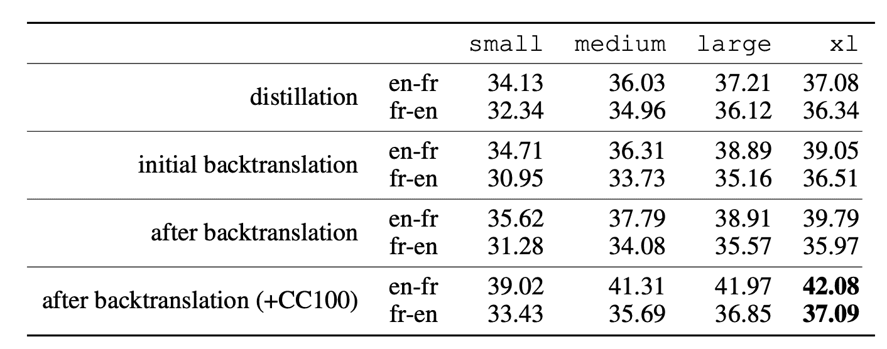

图 8\. 比较不同训练运行的翻译模型的 BLEU 分数，使用：仅蒸馏、反向翻译、两者以及更多单语训练数据。 (图片来源：[Han 等人，2021](https://arxiv.org/abs/2110.05448))

# 如何量化生成数据的质量？

鉴于所有生成的数据，无论是通过数据增强还是数据合成，我们如何量化数据质量，以了解它们如何改善模型的泛化能力？[Gontijo-Lopes 等人（2020）](https://arxiv.org/abs/2002.08973)引入了两个跟踪维度，亲和力和多样性。

+   **亲和力**是一个对*分布偏移*敏感的度量，量化增强数据将训练数据分布从模型学习的内容偏移多少。

    +   定义：在模型在干净数据上测试与在干净数据上训练时的性能差异。

    +   作为比较，KL 也可以衡量分布偏移，但不考虑模型性能。

+   **多样性**是*增强复杂性*的度量，衡量增强数据相对于模型和学习过程的复杂性。

    +   定义：使用给定增强训练的模型的最终训练损失。

    +   另一个潜在的多样性度量是转换数据的熵。

    +   第三个潜在的多样性度量是模型达到给定训练准确度阈值所需的训练时间。

    +   上述三个指标之间存在相关性。

最终模型的性能取决于这两个指标都足够高。

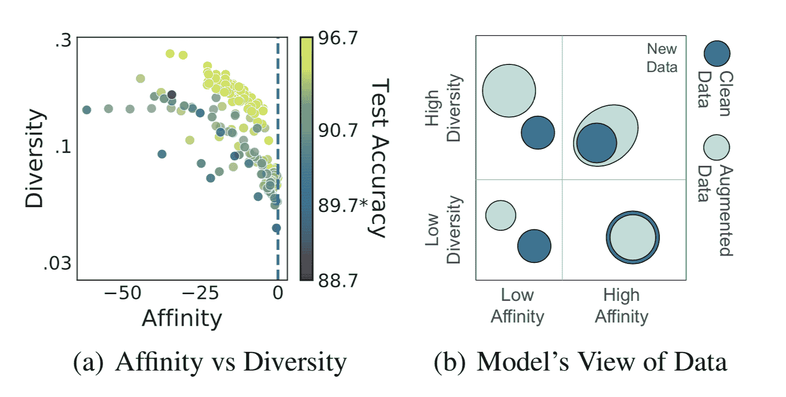

图 9\. (a) 左图：亲和力与多样性度量的散点图，每个点代表不同的增强方法，颜色表示最终的测试准确度。(b) 右图：在不同亲和力和多样性度量区域中，干净数据和增强数据之间的关系的概念图示。 (图片来源：[Gontijo-Lopes et al. 2020](https://arxiv.org/abs/2002.08973))

有许多关于相关性和多样性的定量度量，根据是否有参考文献，形式各异，例如文本的困惑度、BLEU 以及图像的 Inception 分数。这里我跳过了关于质量的具体定量度量的列表，因为它可能会很长。

# 使用嘈杂数据进行训练

通过模型生成或数据增强方便地收集大量嘈杂数据，但很难保证增强和生成的数据能够 100%准确。深度神经网络很容易过拟合嘈杂标签并“记忆”损坏的标签，因此在使用生成的数据时，我们可以应用训练嘈杂标签的技术（*噪声鲁棒训练*）来稳定和优化性能。请查看这篇关于从嘈杂标签中学习的[调查论文（Song et al. 2021）](https://arxiv.org/abs/2007.08199)以更全面地了解相关工作。

## 正则化和稳健架构

一般来说，为了避免过拟合而设计的机制在处理适度嘈杂数据时应该有助于提高训练的稳健性，例如权重衰减、dropout、批归一化。事实上，良好的数据增强（即仅修改非必要属性）也可以被视为一种正则化的方式。

另一种方法是通过专门的**嘈杂适应层**来增强网络，以逼近标签损坏的未知投影（[Sukhbaatar et al. 2015](https://arxiv.org/abs/1406.2080)，[Goldberger & Ben-Reuven, 2017](https://openreview.net/forum?id=H12GRgcxg)）。

[Sukhbaatar et al. (2015)](https://arxiv.org/abs/1406.2080)在网络架构中引入了额外的线性层 $Q$，以使预测与嘈杂标签分布匹配。噪声矩阵 $Q$ 最初被*固定*为单位函数，只有基础模型参数被更新。一段时间后，$Q$开始被更新，并期望捕捉数据中的噪声。噪声矩阵通过正则化进行训练，以鼓励其匹配噪声分布，同时保持基础模型对真实标签的准确预测。


图 10\. (a) 左图：在 softmax 和最终输出之间添加了一个噪声矩阵 $Q$ 用于损失计算。(b) 右图：噪声矩阵 $Q$ 最初被固定为单位函数，只有在一定训练后才会随着正则化进行更新。(图片来源：[Sukhbaatar et al. 2015](https://arxiv.org/abs/1406.2080))

然而，很难保证这样一个噪声矩阵层只捕捉噪声转换分布，实际上学习起来并不是一件简单的事情。[Goldberger & Ben-Reuven (2017)](https://openreview.net/forum?id=H12GRgcxg)) 提出了在基础模型的端到端添加一个额外的 softmax 层，并应用[EM 算法](https://en.wikipedia.org/wiki/Expectation%E2%80%93maximization_algorithm)，将正确标签视为潜在随机变量，将噪声过程视为具有未知参数的通信通道。

## 鲁棒学习目标

除了最常用的交叉熵损失外，一些其他学习目标的选择被证明对嘈杂标签更具鲁棒性。

例如，**MAE**（平均绝对误差）比 CCE（分类交叉熵）对嘈杂标签更具鲁棒性，因为它平等对待每个样本（[Ghosh et al. 2017](https://arxiv.org/abs/1712.09482)）。MAE 在训练样本之间缺乏不同的加权导致训练时间显著延长。受 MAE 和 CCE 之间的权衡启发，[Zhang & Sabuncu (2018)](https://arxiv.org/abs/1805.07836)提出了*广义交叉熵*（**GCE**），将 CCE 损失的泛化以适应嘈杂数据。

为了充分利用 MAE 提供的抗噪性和 CCE 的隐式加权方案的好处，GCE 采用了负的 Box-Cox 转换作为损失函数：

$$ \mathcal{L}_q(f(\mathbf{x}_i, y_i = j)) = \frac{1 - f^{(j)}(\mathbf{x}_i)^q}{q} $$

其中$f^{(j)}$表示$f(.)$的第$j$个元素，$q \in (0, 1]$。当$q \to 0$时，$\mathcal{L}_q$等同于 CCE，当$q=1$时变为 MAE。实证实验表明存在一个$q$的阈值，使得过拟合永远不会出现，数据越嘈杂，这种阈值就应该越高。

给定真实和预测标签，$y_i, \hat{y}_i \in \{0, 1\}$，令$u_i=y_i \cdot \hat{y}_i$，**零一损失**，$\mathcal{L}_{01}(\mathbf{u}) = \sum_{i=1}^n \mathbb{1}[u_i < 0]$，是另一种被证明对嘈杂数据具有鲁棒性的学习目标。通过最小化零一损失的经验风险等同于最小化经验对抗（最坏情况）风险（[Hu et al 2018](https://arxiv.org/abs/1611.02041)）。因为最坏情况风险是干净数据分布的分类风险的上界，最小化最坏情况风险可以导致真实风险的降低，这使得零一损失特别鲁棒。然而，零一损失是不可微的，不能直接优化。一种解决方案是近似零一损失的*上界*，并最小化上界损失。

[铰链损失](https://en.wikipedia.org/wiki/Hinge_loss)，$\mathcal{L}_\text{hinge}(\mathbf{u}) = \sum_{i=1}^n \max(0, 1 - u_i)$，定义了零一损失的一个粗略上界。[Lyu & Tsang (2020)](https://arxiv.org/abs/1905.10045)提出了一个*课程损失*（**CL**），它是一个比铰链损失等传统替代损失更紧的上界，$\mathcal{L}_\text{01}(\mathbf{u}) \leq \mathcal{L}_\text{CL}(\mathbf{u}) \leq \mathcal{L}_\text{hinge}(\mathbf{u})$。

$$ \mathcal{L}_\text{CL}(\mathbf{u}) = \min_{\mathbf{w}\in\{0,1\}^n}\max(\sum_{i=1}^n w_i \ell(u_i), n - \sum_{i=1}^n w_i + \sum_{i=1}^n\mathbb{1}[u_i < 0]) $$

其中$\ell(u_i)$是零一损失的基本替代损失（例如铰链损失），最优加权变量$\mathbf{w}$是要学习的。

给定标签损坏率$\rho$，*噪声修剪课程损失*（**NPCL**）是基于这样的直觉构建的，即理想模型应该正确分类$n(1-\rho)$个带有干净标签的样本，但错误分类$n\rho$个损坏标签。如果$\rho$是一个已知的先验，我们将知道要修剪多少样本（具有最大损失）。假设$\ell(u_1) \leq \dots \leq \ell(u_n)$，那么$u_{n(1-\rho)+1} = \dots = u_n =0$，以下 NPCL 是仅针对$n(1-\rho)$个样本的基本 CL：

$$ \text{NPCL}(\mathbf{u}) = \min_{\mathbf{w}\in\{0,1\}^{n(1-\rho)}} \max(\sum_{i=1}^{n(1-\rho)} w_i \ell(u_i), n(1-\rho) - \sum_{i=1}^{n(1-\rho)} w_i) $$

在 CIFAR-10 上进行实验时，NPCL 与 GCE 相当，并且在噪声率增加时表现更好。

## 标签校正

由于已知一些标签是不正确的，噪声鲁棒训练可以明确考虑标签校正。

一种方法是依赖于噪声转移矩阵的估计，并使用它来纠正前向或后向损失，称为**F-correction**（[Patrini et al. 2017](https://arxiv.org/abs/1609.03683)）。让我们首先假设有$k$个类别和噪声转移矩阵$C \in [0, 1]^{k\times k}$是可观测的，标签翻转概率不依赖于样本输入而只依赖于标签（即被称为随机分类噪声，RCN）。让$\tilde{y}$表示一个损坏的标签。$C$的每个条目表示一个标签翻转为另一个的概率^(1)，

$$ C_{ij} = p(\tilde{y}= j \vert y =i, \mathbf{x}) \approx p(\tilde{y}= j \vert y =i) $$

然后我们可以进行前向标签校正过程，将嘈杂转移矩阵的先验知识纳入预测中。

$$ \begin{aligned} \mathcal{L}(\hat{p}(\tilde{y}\vert\mathbf{x}), y) &= - \log \hat{p}(\tilde{y}=i\vert\mathbf{x}) \\ &= - \log \sum_{j=1}^k p(\tilde{y}=i\vert y=j) \hat{p}(y=j\vert\mathbf{x}) \\ &= - \log \sum_{j=1}^k C_{ji} \hat{p}(y=j\vert\mathbf{x}) \end{aligned} $$

以矩阵形式，我们有 $\mathcal{L}(\hat{p}(y \vert \mathbf{x})) = - \log C^\top \hat{p}(y \vert \mathbf{x})$。然而，这样的噪声转移矩阵通常是*未知*的。如果我们可以访问一个干净数据集，噪声矩阵 $C$ 可以通过在干净数据上计算混淆矩阵来估计 ([Hendrycks et al. 2018](https://arxiv.org/abs/1802.05300))。让我们将一个干净可信的数据集表示为 $\mathcal{D}_c$，将一个嘈杂数据集表示为 $\mathcal{D}_n$。

$$ \hat{C}_{ij} = \frac{1}{\vert \mathcal{A}_i\vert} \sum_{\mathbf{x} \in \mathcal{A}_i} \hat{p}(\tilde{y}=j \vert y=i, \mathbf{x}) \approx p(\tilde{y}=j \vert y=i) $$

这里 $\mathcal{A}_i$ 是来自带有标签 $i$ 的 $\mathcal{D}_c$ 数据点的子集。

令 $f(x) = \hat{p}(\tilde{y} \vert \mathbf{x}; \theta)$，这个模型应该在干净数据 $\mathcal{D}_c$ 上用 $\mathcal{L}(f(\mathbf{x}), y)$ 进行训练，并在嘈杂数据 $\mathcal{D}_n$ 上用 $\mathcal{L}(\hat{C}^\top f(\mathbf{x}), \hat{y})$ 进行训练。

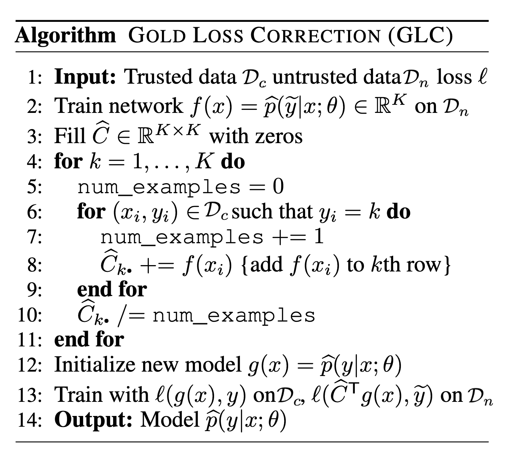

图 11\. 金标准损失校正（GLC）算法，使用可信数据集估计噪声转移矩阵。 (图片来源: [Hendrycks et al. 2018](https://arxiv.org/abs/1802.05300))

如果可信的训练数据集 $\mathcal{D}_c$ 变大，我们可以仅在干净数据上训练一个神经网络，并将其知识*提炼*到主模型（即在测试时进行预测的最终模型）中，使用校正的**伪标签** ([Li et al. 2017](https://arxiv.org/abs/1703.02391))。主模型在整个数据集 $\mathcal{D} = \mathcal{D}_c \cup \mathcal{D}_n$ 上进行训练。可选地，如果可用，可以将知识图中标签关系的“侧”信息合并到提炼中，以帮助训练在有限数据上的网络的预测的鲁棒性。

标签校正提炼的工作如下：

1.  首先从小的干净数据集 $\mathcal{D}_c$ 训练一个辅助模型 $f_c$，为每个样本 $x_i$ 提供一个软标签，$s_i = \delta(f_c(\mathbf{x}_i)/T)$ 是具有温度 $T$ 的 Sigmoid 激活。

1.  由于干净数据集不大，$f_c$ 很可能会过拟合，[Li et al. (2017)](https://arxiv.org/abs/1703.02391) 转向一个定义标签空间关系并根据此在标签之间*传播*预测的知识图 $\mathcal{G$。新的软标签表示为 $\hat{s}_i = \mathcal{G}(s_i)$。

1.  主模型 $f$ 是通过从 $f_c$ 的预测进行训练以模仿的，

$$ \mathcal{L}(y_i, f(\mathbf{x}_i)) = \text{CE}(\underbrace{\lambda y_i + (1 - \lambda) \hat{s}_i}_\text{伪标签}, f(\mathbf{x}_i)) $$

## 样本重新加权和选择

一些样本可能更有可能具有不准确的标签。这种估计让我们直观地知道哪些样本在损失函数中应该被赋予更少或更多的权重。然而，考虑到训练数据中的两种偏差，类别不平衡和嘈杂标签，实际上存在矛盾的偏好 — 我们希望损失更大的样本来平衡标签分布，但那些损失较小的样本可以减轻潜在的噪声。一些研究（[Ren 等人，2018](https://arxiv.org/abs/1803.09050)）因此认为，为了学习训练数据偏差的一般形式，有*必要*拥有*一个小而无偏的验证集*来指导训练。本节介绍的样本重新加权方法都假设可以访问一小部分可信的干净数据。

考虑一个具有随机分类噪声的二元分类任务，$y, \hat{y} \in \{-1, +1\}$，标签翻转概率，$\rho_{-1}, \rho_{+1} \in [0, 0.5)$，定义如下：

$$ \rho_{-1} = P(\tilde{y} = +1 \vert y=-1)\quad\rho_{+1} = P(\tilde{y}=-1 \vert y =+1) $$

[Liu & Tao (2015)](https://arxiv.org/abs/1411.7718)应用**重要性重新加权**来调整观察到的$\hat{y}$的加权分布，以匹配不可观测的$y$的分布。设$\mathcal{D}$为真实数据分布，$\mathcal{D}_\rho$为损坏版本。

$$ \begin{aligned} \mathcal{L}_{\ell,\mathcal{D}}(f) &= \mathbb{E}_{(\mathbf{x},y)\sim \mathcal{D}}[\ell(f(\mathbf{x}), y)] \\ &= \mathbb{E}_{(\mathbf{x},\tilde{y})\sim \mathcal{D}_\rho} \Big[ \frac{P_\mathcal{D}(\mathbf{x}, y=\tilde{y})}{P_{\mathcal{D}_\rho}(\mathbf{x}, \tilde{y})} \ell(f(\mathbf{x}), \tilde{y}) \Big] \\ &= \mathbb{E}_{(\mathbf{x},\tilde{y})\sim \mathcal{D}_\rho} \Big[ \frac{P_\mathcal{D}(y=\tilde{y} \vert \mathbf{x})}{P_{\mathcal{D}_\rho}(\tilde{y} \vert \mathbf{x})} \ell(f(\mathbf{x}), \tilde{y}) \Big] & \text{; 因为 }P_\mathcal{D}(\mathbf{x})=P_{\mathcal{D}_\rho}(\mathbf{x}) \\ &= \mathbb{E}_{(\mathbf{x},\tilde{y})\sim \mathcal{D}_\rho} [ w(\mathbf{x}, \hat{y})\ell(f(\mathbf{x}), \tilde{y}) ] = \mathcal{L}_{w\ell,\mathcal{D}}(f) \end{aligned} $$

因为，

$$ \begin{aligned} P_{\mathcal{D}_\rho}(\tilde{y} \vert \mathbf{x}) &= P_\mathcal{D}(y = \tilde{y} \vert \mathbf{x}) P_{\mathcal{D}_\rho}(\tilde{y} \vert y=\tilde{y}) + P_\mathcal{D}(y = - \tilde{y} \vert \mathbf{x}) P_{\mathcal{D}_\rho}(\tilde{y} \vert y = - \tilde{y}) \\ &= P_\mathcal{D}(y = \tilde{y} \vert \mathbf{x}) (1 - P_{\mathcal{D}_\rho}(- \tilde{y} \vert y=\tilde{y})) + (1 - P_\mathcal{D}(y = \tilde{y} \vert \mathbf{x})) P_{\mathcal{D}_\rho}(\tilde{y} \vert y = - \tilde{y}) \\ &= P_\mathcal{D}(y = \tilde{y} \vert \mathbf{x}) (1 - \rho_{\tilde{y}}) + (1 - P_\mathcal{D}(y = \tilde{y} \vert \mathbf{x})) \rho_{-\tilde{y}} \\ &= P_\mathcal{D}(y = \tilde{y} \vert \mathbf{x})(1 - \rho_{\tilde{y}} - \rho_{-\tilde{y}}) + \rho_{-\tilde{y}} \end{aligned} $$

因此，给嘈杂样本分配的权重为，

$$ w(x, \tilde{y}) = \frac{P_\mathcal{D}(y=\tilde{y} \vert \mathbf{x})}{P_{\mathcal{D}_\rho}(\tilde{y} \vert \mathbf{x})} = \frac{P_{\mathcal{D}_\rho}(\tilde{y} \vert \mathbf{x}) - \rho_{-\tilde{y}}}{(1-\rho_0-\rho_1) P_{\mathcal{D}_\rho}(\tilde{y} \vert \mathbf{x})} $$

其中 $P_{\mathcal{D}_\rho}(\tilde{y} \vert \mathbf{x})$ 可以通过简单的逻辑回归进行估计，但估计音符率更具挑战性。天真的交叉验证可能行得通，但由于质量取决于可用的受信任标签数量，成本很高。该论文首先近似噪声率的上限，$\rho_\tilde{y} \leq P_{\mathcal{D}_\rho}(- \tilde{y} \vert \mathbf{x})$，然后使用温和的假设来高效地估计它们，$\hat{\rho}_{\tilde{y}} = \min_{\mathbf{x} \in {\mathbf{x}_1, \dots, \mathbf{x}_n}} \hat{P}_{\mathcal{D}_\rho}(- \tilde{y} \vert \mathbf{x})$。在他们的实验中，重要性重新加权的优势仅在数据集之间变化，并且在噪声率普遍较高时更为有益。

可以通过一个单独的网络学习样本重新加权方案。 *学习重新加权* (**L2R**; [Ren et al. 2018](https://arxiv.org/abs/1803.09050)) 是一种元学习方法，直接优化权重以追求已知一组干净数据上的最佳验证性能。每个示例根据其梯度方向被分配权重。 用于最小化 $\theta^*(\mathbf{w})$ 的加权损失涉及一组训练权重 $\{w_i\}_{i=1}^n$ 作为未知超参数。 这些样本训练权重 $w_i$ 被学习以最小化在这个无偏验证集上的损失，$\mathcal{D}_c = \{x^\text{valid}_j\}_{j=1}^m$。

$$ \begin{aligned} \theta^{*}(\mathbf{w}) &= \arg\min_\theta \sum_{i=1}^n w_i f(x_i; \theta) \\ \text{其中最优 }\mathbf{w}^{*} &= \arg\min_{\mathbf{w}, \mathbf{w} \geq \mathbf{0}} \frac{1}{m} \sum_{j=1}^m f(\mathbf{x}^\text{valid}_j; \theta^{*}(\mathbf{w})) \end{aligned} $$

学习过程涉及两个嵌套的优化循环，因此非常昂贵，训练时间增加 3 倍。

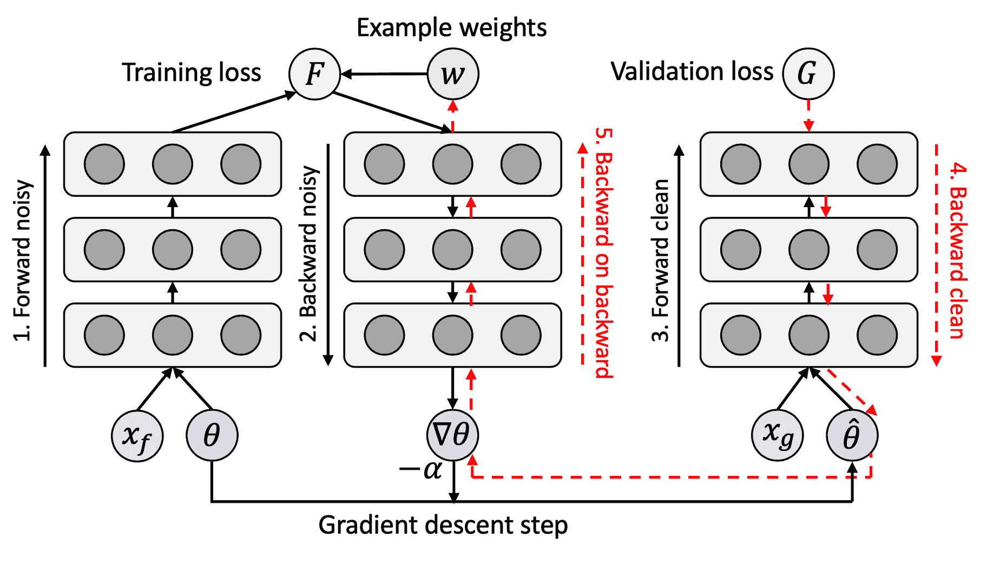

图 12\. 展示了第二阶[自动微分](https://en.wikipedia.org/wiki/Automatic_differentiation)实现的更新。 (图片来源: [Ren et al. 2018](https://arxiv.org/abs/1803.09050))

他们在 (1) 两类 MNIST 上进行实验，以测试 L2R 在类分布不平衡时的鲁棒性，以及 (2) 具有嘈杂标签的 CIFAR-10 上。 L2R 在两个任务上都表现出比当时其他基线方法更好的效果。

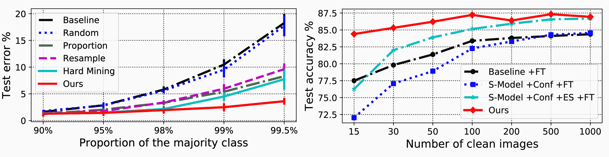

图 13\. 左: MNIST 上的不平衡类（类 4 和 9）；右: 清洁样本数量的影响。任务是在 CIFAR-10 上，40% 的数据翻转为标签 3\. (图片来源: [Ren et al. 2018](https://arxiv.org/abs/1803.09050))

**MentorNet** ([Jiang et al. 2018](https://arxiv.org/abs/1712.05055)) 使用教师-学生课程学习来加权数据。它包含两个不同的网络，一个是导师，一个是学生。导师网络为学生提供了一个数据驱动的课程（即样本训练加权方案），让学生专注于学习可能是正确标签的内容。

让 $g_\psi$ 为由 $\psi$ 参数化的 MentorNet，$f_\theta$ 为由 $\theta$ 参数化的 StudentNet，$G$ 为由 $\lambda$ 参数化的预定义课程。给定用于$k$类分类任务的训练数据 $\mathcal{D} = \{(\mathbf{x}_i, y_i)\}_{i=1}^n$，MentorNet 需要预测一个随时间变化的潜在权重变量 $\mathbf{w} \in [0, 1]^{n \times k}$ 来引导 StudentNet 的学习，取学生网络处理的中间特征 $\mathbf{z}_i = \phi_{f_\theta}(\mathbf{x}_i, y_i)$：

$$ g_{\psi^{*}}(\mathbf{z}_i) = \arg\min_{w_i \in [0,1]} \mathcal{L}(\theta, \mathbf{w}), \forall i \in [1, n] $$

StudentNet 学习最小化以下学习目标，

$$ \begin{aligned} \mathcal{L}(\theta, \mathbf{w}) &= \frac{1}{n}\sum_{i=1}^n \mathbf{w}_i^\top \ell(y_i, f_\theta(\mathbf{x}_i)) + G_\lambda(\mathbf{w}) + \alpha |\theta|²_2 \\ &= \frac{1}{n}\sum_{i=1}^n g_\psi(\mathbf{z}_i)^\top \ell_i + G_\lambda(\mathbf{w}) + \alpha |\theta|²_2 & \text{; 让 }\ell_i = \ell(y_i, f_\theta(\mathbf{x}_i)) \\ \end{aligned} $$

导师网络 $g_\psi$ 在输入 $(\phi_{f_\theta}(\mathbf{x}_i, y_i), w^{*}_i)$ 上通过交叉熵进行训练，其中如果 $y_i$ 已知是正确标签，则 $v^*_i=1$，否则为 0。MentorNet 的架构不必非常复杂。在论文中，他们采用了一个 LSTM 层来捕捉时间上的预测方差。

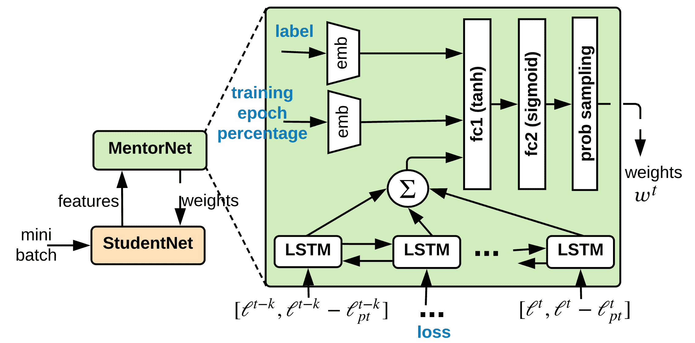

图 14。MentorNet 和 StudentNet 的模型架构同时训练，其中 MentorNet 预测学生网络的样本权重以进行训练。（图片来源：[Jiang et al. 2018](https://arxiv.org/abs/1712.05055)）

与 MentorNet 不同的是，其中一个网络明确学习另一个网络的加权方案和课程，**Co-teaching** ([Han et al. 2018](https://arxiv.org/abs/1804.06872)) 同时训练两个神经网络，$f_1$ 和 $f_2$，让它们通过有选择地向彼此提供数据来互相教导。Co-teaching 包括三个步骤：

1.  首先，每个网络前馈当前小批量数据并选择可能具有干净标签的样本；

1.  然后，两个网络交换信息，确定批次中应该用于训练的样本。选择小损失实例，因为它们更有可能与正确标签相关联。选择批次的百分比由时间相关函数$R(T)$确定。$R(T)$的值随时间减少，因为随着训练的进行，网络更有可能过拟合和记忆噪声标签，因此我们使用较小的采样百分比来保持所选数据的质量高。

1.  最后，每个网络都会通过其同行选择的数据运行反向传播更新。

根据他们的实验，当噪声率较高或破坏转移矩阵不对称时，共同教学的表现优于 F-校正。

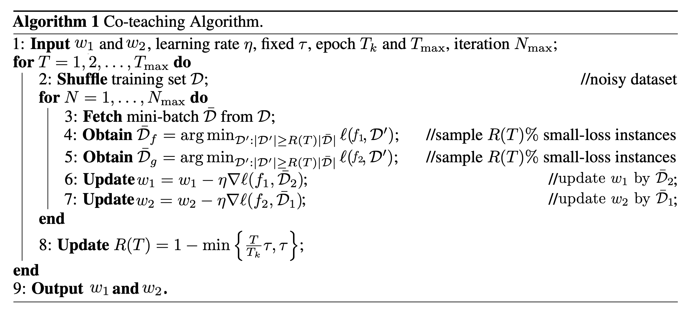

图 15。共同教学算法，其中两个网络并行训练，每个网络选择另一个网络进行训练的样本。（图片来源：[韩等人 2018](https://arxiv.org/abs/1804.06872)）

# 引文

引用为：

> 翁，莉莉安。 (2022 年 4 月)。数据不足学习第 3 部分：数据生成。Lil’Log。 [链接](https://lilianweng.github.io/posts/2022-04-15-data-gen/)。

或

```py
@article{weng2022datagen,
  title   = "Learning with not Enough Data Part 3: Data Generation",
  author  = "Weng, Lilian",
  journal = "Lil'Log",
  year    = "2022",
  month   = "Apr",
  url     = "https://lilianweng.github.io/posts/2022-04-15-data-gen/"
} 
```

# 参考文献

[1] 张等人。“对抗自动增强” [ICLR 2020](https://arxiv.org/abs/1912.11188)。

[2] Kumar 等人。“使用预训练转换器模型进行数据增强。” [AACL 2020 Workshop](https://arxiv.org/abs/2003.02245)。

[3] Anaby-Tavor 等人。“数据不足？深度学习来拯救！” [AAAI 2020](https://arxiv.org/abs/1911.03118)。

[4] 王等人。“想要减少标注成本？GPT-3 可以帮助。” [EMNLP 2021](https://arxiv.org/abs/2108.13487)。

[5] 王等人。“走向零标签语言学习。” [arXiv:2109.09193](https://arxiv.org/abs/2109.09193) arXiv 预印本 arXiv:2109.09193 (2021)。

[6] Schick & Schutze。“使用预训练语言模型生成数据集。” [EMNLP 2021](https://arxiv.org/abs/2104.07540)。

[7] 韩等人。“仅使用生成语言模型进行无监督神经机器翻译。” [arXiv:2110.05448](https://arxiv.org/abs/2110.05448) arXiv 预印本 arXiv:2110.05448 (2021)。

[8] 郭等人。“使用 mixup 增强数据进行句子分类：一项实证研究。” [arXiv:1905.08941](https://arxiv.org/abs/1905.08941) arXiv 预印本 arXiv:1905.08941 (2019)。

[9] Ekin D. Cubuk 等人。“AutoAugment：从数据中学习增强策略。” [arXiv:1805.09501](https://arxiv.org/abs/1805.09501) arXiv 预印本 arXiv:1805.09501 (2018)。

[10] Daniel Ho 等人。“基于人口的增强：有效学习增强策略计划。” [ICML 2019](https://arxiv.org/abs/1905.05393)。

[11] Cubuk & Zoph 等人。“RandAugment：具有减少搜索空间的实用自动化数据增强。” [arXiv:1909.13719](https://arxiv.org/abs/1909.13719) arXiv 预印本 arXiv:1909.13719 (2019)。

[12] 张等人。“混合：超越经验风险最小化。” [ICLR 2017](https://arxiv.org/abs/1710.09412)。

[13] 云等. [“CutMix：训练具有可定位特征的强分类器的正则化策略。”](https://arxiv.org/abs/1905.04899) ICCV 2019.

[14] 卡兰蒂迪斯等. [“对比硬负例的混合”](https://arxiv.org/abs/2010.01028) NeuriPS 2020.

[15] 魏 & 邹. [“EDA：用于提升文本分类任务性能的简易数据增强技术。”](https://arxiv.org/abs/1901.11196) EMNLP-IJCNLP 2019.

[16] 小林. [“上下文增强：通过具有范例关系的词进行数据增强。”](https://arxiv.org/abs/1805.06201) NAACL 2018

[17] 方等. [“CERT：用于语言理解的对比自监督学习。”](https://arxiv.org/abs/2005.12766) arXiv 预印本 arXiv:2005.12766 (2020).

[18] 高等. [“SimCSE：简单的对比学习句子嵌入。”](https://arxiv.org/abs/2104.08821) arXiv 预印本 arXiv:2104.08821 (2020). [[code](https://github.com/princeton-nlp/SimCSE)]

[19] 沈等. [“一种简单但难以超越的自然语言理解和生成数据增强方法。”](https://arxiv.org/abs/2009.13818) arXiv 预印本 arXiv:2009.13818 (2020) [[code](https://github.com/dinghanshen/cutoff)]

[20] 王 & van den Oord. [“音频表示的多格式对比学习。”](https://arxiv.org/abs/2103.06508) NeuriPS Workshop 2020.

[21] 吴等. [“条件 BERT 上下文增强”](https://arxiv.org/abs/1812.06705) arXiv 预印本 arXiv:1812.06705 (2018).

[22] 朱等. [“FreeLB：增强的自然语言理解对抗训练。”](https://arxiv.org/abs/1909.11764) ICLR 2020.

[23] 亲和性和多样性：量化数据增强机制 Gontijo-Lopes 等. 2020 ([`arxiv.org/abs/2002.08973`](https://arxiv.org/abs/2002.08973))

[24] 宋等. [“使用深度神经网络学习带有噪声标签：一项调查。”](https://arxiv.org/abs/2007.08199) TNNLS 2020.

[25] 张 & 萨邦库. [“用于训练带有噪声标签的深度神经网络的广义交叉熵损失。”](https://arxiv.org/abs/1805.07836) NeuriPS 2018.

[26] 戈德伯格 & 本-鲁文. [“使用噪声适应层训练深度神经网络。”](https://openreview.net/forum?id=H12GRgcxg) ICLR 2017.

[27] 苏克巴塔尔等. [“用噪声标签训练卷积网络。”](https://arxiv.org/abs/1406.2080) ICLR Workshop 2015.

[28] 帕特里尼等. [“使深度神经网络对标签噪声具有鲁棒性：一种损失校正方法”](https://arxiv.org/abs/1609.03683) CVPR 2017.

[29] 亨德里克斯等. [“使用可信数据训练受严重噪声污染标签的深度网络。”](https://arxiv.org/abs/1802.05300) NeuriPS 2018.

[30] 张 & 萨邦库. [“用于训练带有噪声标签的深度神经网络的广义交叉熵损失。”](https://arxiv.org/abs/1805.07836) NeuriPS 2018.

[31] 吕 & 曾. [“课程损失：针对标签污染的稳健学习和泛化。”](https://arxiv.org/abs/1905.10045) ICLR 2020.

[32] 韩等人。[“共同教学：在极其嘈杂的标签下训练深度神经网络。”](https://arxiv.org/abs/1804.06872) NeuriPS 2018\. ([code](https://github.com/bhanML/Co-teaching))

[33] 任等人。[“学习为强大深度学习重新加权示例。”](https://arxiv.org/abs/1803.09050) ICML 2018.

[34] 姜等人。[“MentorNet：学习基于数据的课程设计用于受损标签的深度神经网络。”](https://arxiv.org/abs/1712.05055) ICML 2018.

[35] 李等人。[“通过蒸馏学习从带有噪声标签中学习。”](https://arxiv.org/abs/1703.02391) ICCV 2017.

[36] 刘 & 陶。[“通过重要性重新加权处理带有噪声标签的分类问题。”](https://arxiv.org/abs/1411.7718) TPAMI 2015.

[37] 高仕等人。[“针对深度神经网络标签噪声的鲁棒损失函数。”](https://arxiv.org/abs/1712.09482) AAAI 2017.

[38] 胡等人。[“分布鲁棒监督学习是否提供鲁棒分类器？”](https://arxiv.org/abs/1611.02041) ICML 2018.

* * *

1.  $y=i$ 并不是一种技术上正确的注释标签为特定值的方式，因为我们通常使用独热编码（即 $\mathbf{y} = \mathbf{e}_i$）。我们出于简单起见使用这种形式。 ↩︎
