# 缺乏数据的学习第 2 部分：主动学习

> 原文：[`lilianweng.github.io/posts/2022-02-20-active-learning/`](https://lilianweng.github.io/posts/2022-02-20-active-learning/)

这是面对有限数量标记数据的监督学习任务时要做的第二部分。这次我们将涉及一定量的人工标记工作，但在预算限制内，因此在选择要标记的样本时需要聪明。

# 符号

| 符号 | 含义 |
| --- | --- |
| $K$ | 唯一类别标签的数量。 |
| $(\mathbf{x}^l, y) \sim \mathcal{X}, y \in \{0, 1\}^K$ | 已标记数据集。 $y$ 是真实标签的独热表示。 |
| $\mathbf{u} \sim \mathcal{U}$ | 未标记数据集。 |
| $\mathcal{D} = \mathcal{X} \cup \mathcal{U}$ | 整个数据集，包括已标记和未标记的示例。 |
| $\mathbf{x}$ | 任何可以被标记或未标记的样本。 |
| $\mathbf{x}_i$ | 第 $i$ 个样本。 |
| $U(\mathbf{x})$ | 用于主动学习选择的评分函数。 |
| $P_\theta(y \vert \mathbf{x})$ | 由 $\theta$ 参数化的 softmax 分类器。 |
| $\hat{y} = \arg\max_{y \in \mathcal{Y}} P_\theta(y \vert \mathbf{x})$ | 分类器的最自信预测。 |
| $B$ | 标记预算（要标记的最大样本数）。 |
| $b$ | 批处理大小。 |

# 什么是主动学习？

给定一个未标记的数据集 $\mathcal{U}$ 和固定的标记成本 $B$，主动学习旨在从 $\mathcal{U}$ 中选择一个包含 $B$ 个示例的子集进行标记，以便最大化改善模型性能。这是一种有效的学习方法，特别适用于数据标记困难且昂贵的情况，例如医学图像。这篇经典的[调查论文](https://burrsettles.com/pub/settles.activelearning.pdf)于 2010 年列出了许多关键概念。虽然一些传统方法可能不适用于深度学习，但本文讨论主要集中在深度神经模型和批处理模式训练上。

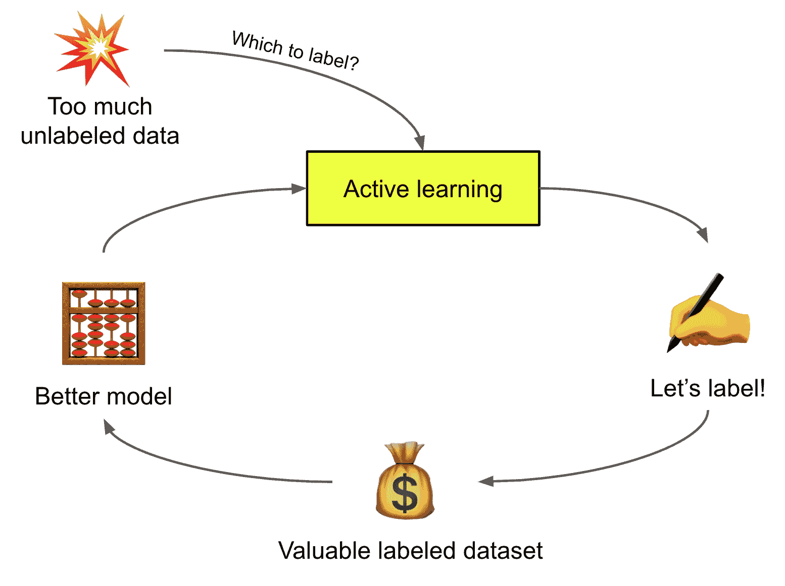

图 1. 主动学习的循环工作流程示意图，通过智能选择要标记的样本，更高效地生成更好的模型。

为简化讨论，我们假设任务是一个 $K$ 类分类问题，在接下来的所有部分中。具有参数 $\theta$ 的模型输出标签候选的概率分布，可能经过校准，$P_\theta(y \vert \mathbf{x})$，最可能的预测是 $\hat{y} = \arg\max_{y \in \mathcal{Y}} P_\theta(y \vert \mathbf{x})$。

# 获取函数

确定下一个最有价值的示例进行标记的过程称为“采样策略”或“查询策略”。采样过程中的评分函数称为“获取函数”，表示为 $U(\mathbf{x})$。具有较高分数的数据点预计在进行标记后会为模型训练带来更高的价值。

这里是一些基本的采样策略列表。

## 不确定性采样

**不确定性采样**选择模型产生最不确定预测的示例。在给定单个模型的情况下，可以通过预测概率来估计不确定性，尽管一个常见的抱怨是深度学习模型的预测通常不经校准，与真实不确定性关联不好。事实上，深度学习模型通常过于自信。

+   *最不确定得分*，也称为*变异比率*: $U(\mathbf{x}) = 1 - P_\theta(\hat{y} \vert \mathbf{x})$。

+   *边际得分*: $U(\mathbf{x}) = P_\theta(\hat{y}_1 \vert \mathbf{x}) - P_\theta(\hat{y}_2 \vert \mathbf{x})$，其中$\hat{y}_1$和$\hat{y}_2$是最可能和次可能的预测标签。

+   *熵*: $U(\mathbf{x}) = \mathcal{H}(P_\theta(y \vert \mathbf{x})) = - \sum_{y \in \mathcal{Y}} P_\theta(y \vert \mathbf{x}) \log P_\theta(y \vert \mathbf{x})$。

另一种量化不确定性的方法是依赖于一组专家模型的委员会，称为委员会查询（QBC）。QBC 根据一组意见来衡量不确定性，因此保持委员会成员之间的分歧是至关重要的。给定委员会池中的$C$个模型，每个模型由$\theta_1, \dots, \theta_C$参数化。

+   *选票熵*: $U(\mathbf{x}) = \mathcal{H}(\frac{V(y)}{C})$，其中$V(y)$计算委员会对标签$y$的投票数。

+   *共识熵*: $U(\mathbf{x}) = \mathcal{H}(P_\mathcal{C})$，其中$P_\mathcal{C}$是委员会预测的平均值。

+   *KL 散度*: $U(\mathbf{x}) = \frac{1}{C} \sum_{c=1}^C D_\text{KL} (P_{\theta_c} | P_\mathcal{C})$

## 多样性采样

**多样性采样**旨在找到一组能够很好代表整个数据分布的样本。多样性很重要，因为期望模型在野外的任何数据上都能很好地工作，而不仅仅是在一个狭窄的子集上。所选样本应该代表潜在分布。常见方法通常依赖于量化样本之间的相似性。

## 预期模型变化

**预期模型变化**指的是样本对模型训练带来的影响。这种影响可以是对模型权重的影响，也可以是对训练损失的改进。后续章节将回顾几项关于如何衡量由选定数据样本触发的模型影响的工作。

## 混合策略

上述许多方法并不是相互排斥的。**混合**采样策略重视数据点的不同属性，将不同的采样偏好结合在一起。通常我们希望选择不确定但也高度代表性的样本。

# 深度获取函数

## 测量不确定性

模型不确定性通常分为两个类别（[Der Kiureghian & Ditlevsen 2009](https://citeseerx.ist.psu.edu/viewdoc/download?doi=10.1.1.455.9057&rep=rep1&type=pdf)，[Kendall & Gal 2017](https://arxiv.org/abs/1703.04977)）：

+   *偶然不确定性*是由数据中的噪声引入的（例如传感器数据、测量过程中的噪声），它可以是依赖于输入的或独立于输入的。由于对真实情况缺乏信息，它通常被认为是不可减少的。

+   *认知不确定性*指的是模型参数内部的不确定性，因此我们不知道模型是否能最好地解释数据。这种类型的不确定性在理论上是可减少的，只要有更多数据。

### 集成和近似集成

在机器学习中，使用集成来提高模型性能有着悠久的传统。当模型之间存在显著的差异时，预期集成会产生更好的结果。这种集成理论已被许多 ML 算法证明是正确的；例如，[AdaBoost](https://en.wikipedia.org/wiki/AdaBoost)聚合了许多弱学习器，表现出与单个强学习器相似甚至更好的性能。[自助法](https://en.wikipedia.org/wiki/Bootstrapping_(statistics))对多次重新采样进行集成，以获得更准确的指标估计。随机森林或[GBM](https://en.wikipedia.org/wiki/Gradient_boosting)也是集成有效性的良好示例。

为了获得更好的不确定性估计，将一组独立训练的模型聚合起来是直观的。然而，训练单个深度神经网络模型就很昂贵，更不用说训练多个了。在强化学习中，Bootstrapped DQN（[Osband 等人，2016](https://arxiv.org/abs/1602.04621)）配备了多个值头，并依赖于 Q 值近似集合中的不确定性来引导 RL 中的[探索](https://lilianweng.github.io/posts/2020-06-07-exploration-drl/#q-value-exploration)。

在主动学习中，一种常见的方法是使用*dropout*来“模拟”概率高斯过程（[Gal＆Ghahramani，2016](https://arxiv.org/abs/1506.02142)）。因此，我们从同一模型收集的多个样本进行集成，但在前向传递过程中应用不同的 dropout 掩码来估计模型的不确定性（认知不确定性）。这个过程被称为**MC dropout**（蒙特卡洛 dropout），其中在每个权重层之前应用 dropout，被证明在需要有效模型不确定性估计的场景中对小数据集的分类非常有效，并被广泛采用。

**DBAL**（深度贝叶斯主动学习；[Gal 等人，2017](https://arxiv.org/abs/1703.02910)）使用 MC dropout 近似贝叶斯神经网络，从而学习模型权重的分布。在他们的实验中，MC dropout 表现优于随机基线和均值标准差（Mean STD），类似于变化率和熵测量。

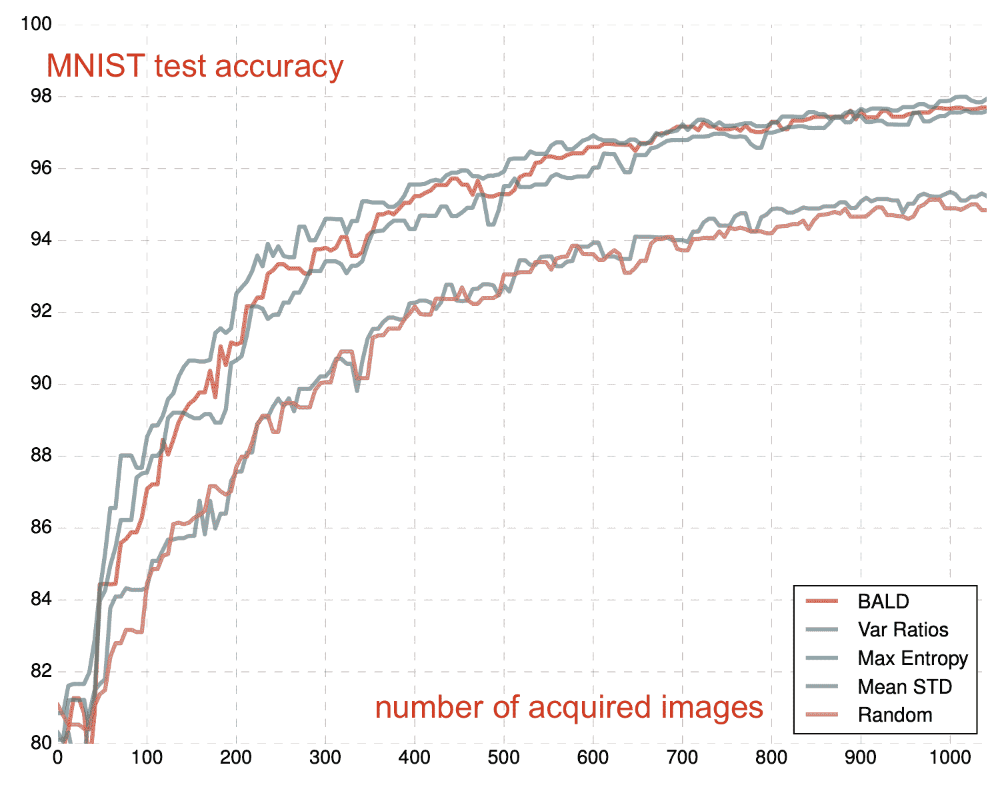

图 2\. DBAL 在 MNIST 上的主动学习结果。（图片来源：[Gal 等人 2017](https://arxiv.org/abs/1703.02910)）。

[Beluch 等人（2018）](https://openaccess.thecvf.com/content_cvpr_2018/papers/Beluch_The_Power_of_CVPR_2018_paper.pdf)比较了基于集成的模型与 MC dropout，并发现天真集成（即分别独立训练多个模型）与变化率的组合产生比其他方法更好校准的预测。然而，天真集成非常昂贵，因此他们探索了一些替代更便宜的选项：

+   快照集成：使用循环学习率计划训练隐式集成，使其收敛到不同的局部最小值。

+   鼓励多样性的集成（DEE）：使用一个训练了少量时代的基础网络作为$n$个不同网络的初始化，每个网络都使用 dropout 进行训练以鼓励多样性。

+   分头方法：一个基础模型有多个头部，每个对应一个分类器。

不幸的是，上述所有便宜的隐式集成选项都表现不如天真集成。考虑到计算资源的限制，MC dropout 仍然是一个相当不错且经济的选择。自然地，人们也尝试结合集成和 MC dropout（[Pop＆Fulop 2018](https://arxiv.org/abs/1811.03897)）通过随机集成获得额外的性能提升。

### 参数空间中的不确定性

**贝叶斯后验推断**（[Blundell 等人 2015](https://arxiv.org/abs/1505.05424)）直接测量神经网络中的权重不确定性。该方法维护了对权重$\mathbf{w}$的概率分布，该分布被建模为变分分布$q(\mathbf{w} \vert \theta)$，因为真实后验$p(\mathbf{w} \vert \mathcal{D})$不能直接计算。损失函数是最小化$q(\mathbf{w} \vert \theta)$和$p(\mathbf{w} \vert \mathcal{D})$之间的 KL 散度，

$$ \begin{aligned} \mathcal{L}(\theta) &= \text{KL}[q(\mathbf{w}\vert\theta) \| p(\mathbf{w} \vert \mathcal{D})] \\ &= \int q(\mathbf{w}\vert\theta) \log \frac{q(\mathbf{w}\vert\theta)}{p(\mathbf{w}) p(\mathcal{D}\vert \mathbf{w})} d\mathbf{w} \\ &= \text{KL}[q(\mathbf{w}\vert\theta) \| p(w)] - \mathbb{E}_{q(\mathbf{w}\vert\theta)} [\log p(\mathcal{D} \vert \mathbf{w})] \\ &\approx \log q(\mathbf{w} \vert \theta) - \log p(\mathbf{w}) p(\mathcal{D}\vert \mathbf{w}) & \text{；蒙特卡洛采样；}q(\mathbf{w} \vert \theta)\text{和}p(\mathbf{w})\text{接近。} \end{aligned} $$

变分分布$q$通常是一个具有对角协方差的高斯分布，每个权重从$\mathcal{N}(\mu_i, \sigma_i²)$中采样。为了确保$\sigma_i$的非负性，进一步通过 softplus 参数化，$\sigma_i = \log(1 + \exp(\rho_i))$，其中变分参数为$\theta = \{\mu_i , \rho_i\}^d_{i=1}$。

贝叶斯后验推断的过程可以总结为：

1.  采样$\epsilon \sim \mathcal{N}(0, I)$

1.  令$\mathbf{w} = \mu + \log(1+ \exp(\rho)) \circ \epsilon`

1.  让$\theta = (\mu, \rho)$

1.  让$f(\mathbf{w}, \theta) = \log q(\mathbf{w} \vert \theta) - \log p(\mathbf{w})p(\mathcal{D}\vert \mathbf{w})$

1.  计算$f(\mathbf{w}, \theta)$关于$\mu$和$\rho$的梯度，然后更新$\theta$。

1.  不确定性通过在推断过程中对不同模型权重进行采样来衡量。

### 损失预测

损失目标指导模型训练。低损失值表示模型可以做出良好和准确的预测。[Yoo & Kweon (2019)](https://arxiv.org/abs/1905.03677)设计了一个**损失预测模块**，用于预测未标记输入的损失值，作为模型在给定数据上的预测有多好的估计。如果损失预测模块对数据样本做出不确定的预测（高损失值），则选择这些数据样本。损失预测模块是一个简单的带有 dropout 的 MLP，它以几个中间层特征作为输入，并在全局平均池化后连接它们。

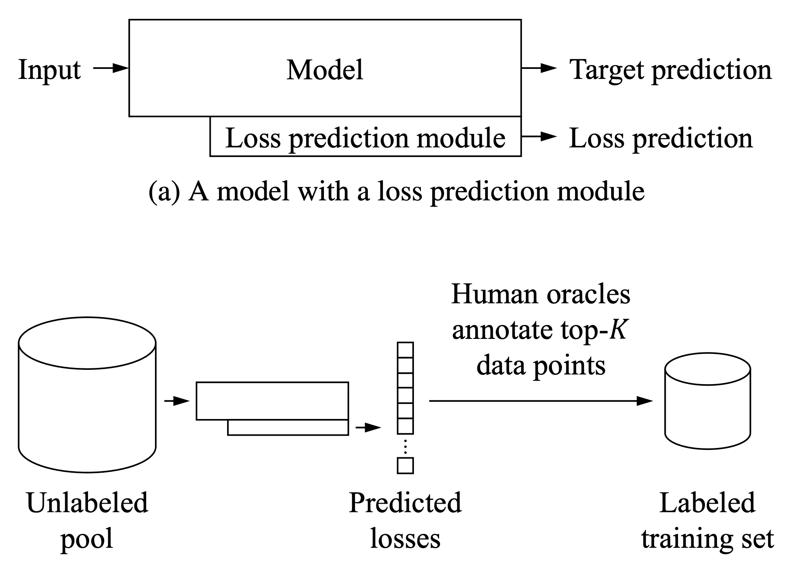

图 3\. 使用带有损失预测模块的模型进行主动学习选择。（图片来源：[Yoo & Kweon 2019](https://arxiv.org/abs/1905.03677)）

让$\hat{l}$为损失预测模块的输出，$l$为真实损失。在训练损失预测模块时，简单的 MSE 损失$=(l - \hat{l})²$不是一个好选择，因为随着模型学会更好地行为，损失会随时间减少。一个好的学习目标应该独立于目标损失的尺度变化。他们依赖于样本对的比较。在每个大小为$b$的批次中，有$b/2$对样本$(\mathbf{x}_i, \mathbf{x}_j)$，损失预测模型应该正确预测哪个样本具有更大的损失。

$$ \begin{aligned} \mathcal{L}_\text{loss}(\mathbf{x}_i, \mathbf{x}_j) &= \max\big( 0, -\mathbb{1}(l(\mathbf{x}_i), l(\mathbf{x}_j)) \cdot (\hat{l}(\mathbf{x}_i) - \hat{l}(\mathbf{x}_j)) + \epsilon \big) \\ \text{where } \mathbb{1}(l_i, l_j) &= \begin{cases} +1 & \text{if }l_i > l_j \\ -1 & \text{otherwise} \end{cases} \end{aligned} $$

其中$\epsilon$是预定义的正边距常数。

在三个视觉任务的实验中，基于损失预测的主动学习选择表现优于随机基线、基于熵的获取和核心集。

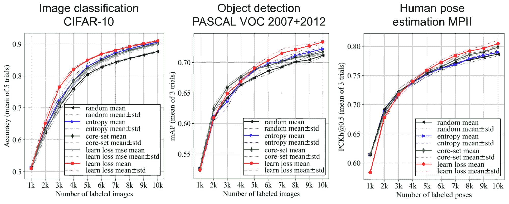

图 4\. 基于损失预测模块的主动学习结果，与其他方法进行比较。（图片来源：[Yoo & Kweon 2019](https://arxiv.org/abs/1905.03677)）

### 对抗设置

[Sinha et al. (2019)](https://arxiv.org/abs/1904.00370)提出了一个类似 GAN 的设置，名为**VAAL**（变分对抗主动学习），其中鉴别器被训练来区分未标记数据和标记数据。有趣的是，在 VAAL 中，主动学习获取标准不依赖于任务性能。

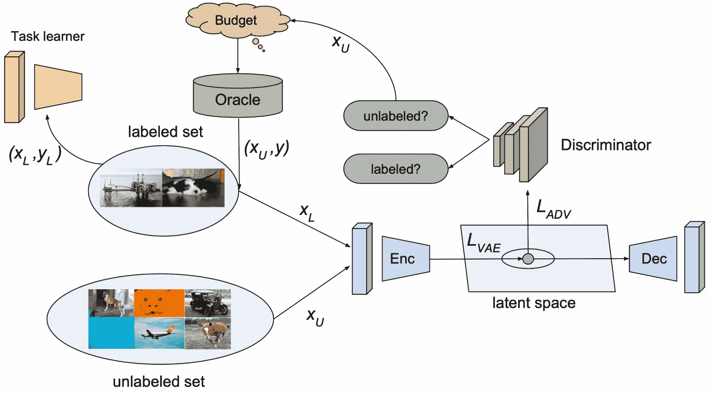

图 5\. VAAL（变分对抗主动学习）的示意图。 (图片来源: [Sinha et al. 2019](https://arxiv.org/abs/1904.00370))

+   $\beta$-VAE 学习一个潜在特征空间 $\mathbf{z}^l \cup \mathbf{z}^u$，分别用于标记和未标记数据，旨在*欺骗*鉴别器 $D(.)$，使其认为所有数据点都来自标记池;

+   鉴别器 $D(.)$ 根据潜在表示 $\mathbf{z}$ 预测样本是否被标记为（1）或未被标记为（0）。VAAL 选择具有低鉴别器分数的未标记样本，这表明这些样本与先前标记的样本足够不同。

VAAL 中 VAE 表示学习的损失包含重构部分（最小化给定样本的 ELBO）和对抗部分（标记和未标记数据都是从相同的概率分布 $q_\phi$ 中抽取的）:

$$ \begin{aligned} \mathcal{L}_\text{VAE} &= \lambda_1 \mathcal{L}^\text{rec}_\text{VAE} + \lambda_2 \mathcal{L}^\text{adv}_\text{VAE} \\ \mathcal{L}^\text{rec}_\text{VAE} &= \mathbb{E}[\log p_\theta(\mathbf{x}^l \vert \mathbf{z}^l)] - \beta \text{KL}(q_\phi(\mathbf{z}^l \vert \mathbf{x}^l) \| p(\mathbf{\tilde{z}})) + \mathbb{E}[\log p_\theta(\mathbf{u} \vert \mathbf{z}^u)] - \beta \text{KL}(q_\phi(\mathbf{z}^u \vert \mathbf{u}) \| p(\mathbf{\tilde{z}})) \\ \mathcal{L}^\text{adv}_\text{VAE} &= - \mathbb{E}[\log D(q_\phi (\mathbf{z}^l \vert \mathbf{x}^l))] - \mathbb{E}[\log D(q_\phi(\mathbf{z}^u \vert \mathbf{u}))] \end{aligned} $$

其中 $p(\mathbf{\tilde{z}})$ 是预定义的单位高斯先验，$\beta$ 是拉格朗日参数。

鉴别器损失为:

$$ \mathcal{L}_D = -\mathbb{E}[\log D(q_\phi (\mathbf{z}^l \vert \mathbf{x}^l))] - \mathbb{E}[\log (1 - D(q_\phi (\mathbf{z}^u \vert \mathbf{u})))] $$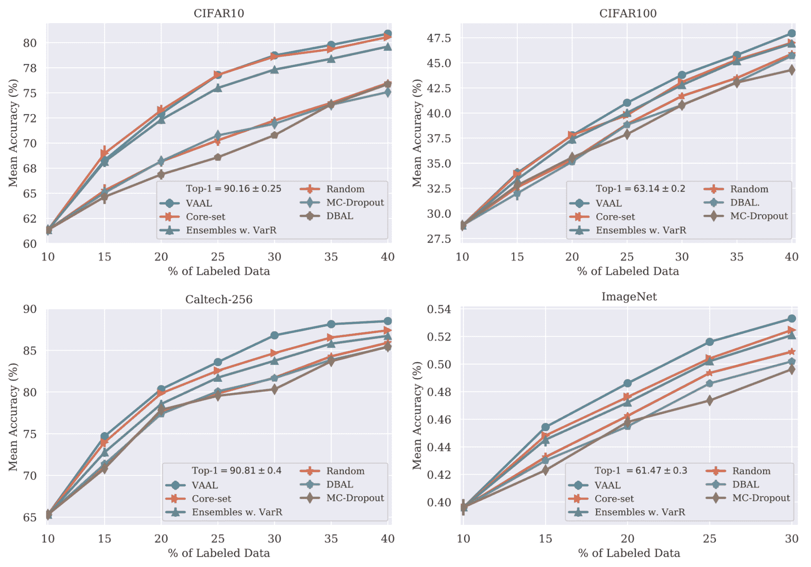

图 6\. VAAL（变分对抗主动学习）在几个图像分类任务上的实验结果。 (图片来源: [Sinha et al. 2019](https://arxiv.org/abs/1904.00370))

消融研究表明，联合训练 VAE 和鉴别器至关重要。他们的结果对初始有偏的标记池、不同的标记预算和有噪声的预言都很稳健。

**MAL**（极小极大主动学习; [Ebrahimiet al. 2021](https://arxiv.org/abs/2012.10467)）是 VAAL 的扩展。MAL 框架由一个熵最小化的特征编码网络 $F$ 和一个熵最大化的分类器 $C$ 组成。这种极小极大设置减小了标记和未标记数据之间的分布差异。

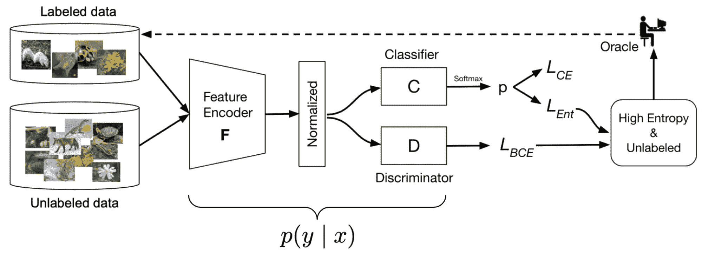

图 7\. MAL（极小极大主动学习）框架的示意图。 (图片来源: [Ebrahimiet al. 2021](https://arxiv.org/abs/2012.10467))

特征编码器 $F$ 将样本编码为一个 $\ell_2$-归一化的 $d$ 维潜在向量。假设有 $K$ 个类别，分类器 $C$ 的参数化为 $\mathbf{W} \in \mathbb{R}^{d \times K}$。

(1) 首先，$F$ 和 $C$ 通过简单的交叉熵损失在标记样本上进行训练，以获得良好的分类结果，

$$ \mathcal{L}_\text{CE} = -\mathbb{E}_{(\mathbf{x}^l, y) \sim \mathcal{X}} \sum_{k=1}^K \mathbb{1}[k=y] \log\Big( \sigma(\frac{1}{T} \frac{\mathbf{W}^\top F\big(\mathbf{x}^l)}{\|F(\mathbf{x}^l)\|}\big) \Big) $$

(2) 在未标记样本上训练时，MAL 依赖于 *minimax* 游戏设置

$$ \begin{aligned} \mathcal{L}_\text{Ent} &= -\sum^K_{k=1} p(y=k \vert \mathbf{u}) \log p(y=k\vert \mathbf{u}) \\ \theta^*_F, \theta^*_C &= \min_F\max_C \mathcal{L}_\text{Ent} \\ \theta_F &\gets \theta_F - \alpha_1 \nabla \mathcal{L}_\text{Ent} \\ \theta_C &\gets \theta_C + \alpha_2 \nabla \mathcal{L}_\text{Ent} \end{aligned} $$

其中，

+   首先，最小化 $F$ 中的熵鼓励与相似预测标签相关的未标记样本具有相似的特征。

+   在 $C$ 中最大化熵对抗性地使预测遵循更均匀的类分布。（我在这里的理解是，因为未标记样本的真实标签未知，所以我们不应该立即优化分类器以最大化预测标签。）

判别器的训练方式与 VAAL 中相同。

MAL 中的采样策略考虑了多样性和不确定性：

+   多样性：$D$ 的分数表示样本与先前看到的样本有多相似。 分数越接近 0，选择不熟悉的数据点就越好。

+   不确定性：使用 $C$ 获得的熵。 更高的熵分数表示模型尚不能做出自信的预测。

实验将 MAL 与随机、熵、核心集、BALD 和 VAAL 基线进行了比较，涉及图像分类和分割任务。 结果看起来相当强大。

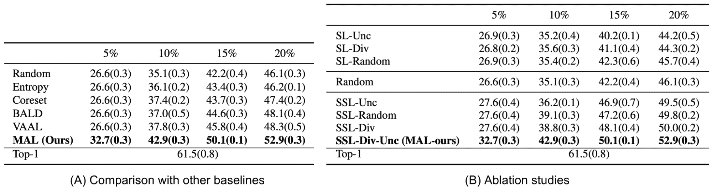

图 8\. MAL 在 ImageNet 上的表现。 (表格来源：[Ebrahimiet al. 2021](https://arxiv.org/abs/2012.10467))

**CAL**（对比主动学习；[Margatina et al. 2021](https://arxiv.org/abs/2109.03764)）旨在选择[对比](https://lilianweng.github.io/posts/2021-05-31-contrastive/)样本。 如果具有不同标签的两个数据点在网络表示 $\Phi(.)$ 中具有相似性，则在 CAL 中它们被视为对比样本。 给定一对对比样本 $(\mathbf{x}_i, \mathbf{x}_j)$，它们应该

$$ d(\Phi(\mathbf{x}_i), \Phi(\mathbf{x}_j)) < \epsilon \quad\text{and}\quad \text{KL}(p(y\vert \mathbf{x}_i) \| p(y\vert \mathbf{x}_j)) \rightarrow \infty $$

给定一个未标记样本 $\mathbf{x}$，CAL 运行以下过程：

1.  在模型特征空间中选择前 $k$ 个最近邻的标记样本，$\{(\mathbf{x}^l_i, y_i\}_{i=1}^M \subset \mathcal{X}$。

1.  计算$\mathbf{x}$的模型输出概率与$\{\mathbf{x}^l\}$中每个的 KL 散度。$\mathbf{x}$的对比分数是这些 KL 散度值的平均值：$s(\mathbf{x}) = \frac{1}{M} \sum_{i=1}^M \text{KL}(p(y \vert \mathbf{x}^l_i | p(y \vert \mathbf{x}))$。

1.  选择具有*高对比分数*的样本进行主动学习。

在各种分类任务上，CAL 的实验结果与熵基线相似。

## 衡量代表性

### 核心集方法

**核心集**是计算几何学中的一个概念，指的是近似表示较大点集的小点集。近似可以通过某些几何度量来捕捉。在主动学习中，我们期望经过核心集训练的模型表现与整个数据点上的模型相当。

[Sener & Savarese (2018)](https://arxiv.org/abs/1708.00489)将主动学习视为核心集选择问题。假设在训练期间总共可以访问$N$个样本。在主动学习过程中，每个时间步$t$都会对一小部分数据点进行标记，表示为$\mathcal{S}^{(t)}$。学习目标的上限可以写成以下形式，其中*核心集损失*定义为标记样本上的平均经验损失与包括未标记样本在内的整个数据集上的损失之间的差异。

$$ \begin{aligned} \mathbb{E}_{(\mathbf{x}, y) \sim p} [\mathcal{L}(\mathbf{x}, y)] \leq& \bigg\vert \mathbb{E}_{(\mathbf{x}, y) \sim p} [\mathcal{L}(\mathbf{x}, y)] - \frac{1}{N} \sum_{i=1}^N \mathcal{L}(\mathbf{x}_i, y_i) \bigg\vert & \text{; 泛化误差}\\ +& \frac{1}{\vert \mathcal{S}^{(t)} \vert} \sum_{j=1}^{\vert \mathcal{S}^{(t)} \vert} \mathcal{L}(\mathbf{x}^l_j, y_j) & \text{; 训练误差}\\ +& \bigg\vert \frac{1}{N} \sum_{i=1}^N \mathcal{L}(\mathbf{x}_i, y_i) - \frac{1}{\vert \mathcal{S}^{(t)} \vert} \sum_{j=1}^{\vert \mathcal{S}^{(t)} \vert} \mathcal{L}(\mathbf{x}^l_j, y_j) \bigg\vert & \text{; 核心集误差} \end{aligned} $$

然后，主动学习问题可以重新定义为：

$$ \min_{\mathcal{S}^{(t+1)} : \vert \mathcal{S}^{(t+1)} \vert \leq b} \bigg\vert \frac{1}{N}\sum_{i=1}^N \mathcal{L}(\mathbf{x}_i, y_i) - \frac{1}{\vert \mathcal{S}^{(t)} \cup \mathcal{S}^{(t+1)} \vert} \sum_{j=1}^{\vert \mathcal{S}^{(t)} \cup \mathcal{S}^{(t+1)} \vert} \mathcal{L}(\mathbf{x}^l_j, y_j) \bigg\vert $$

这等同于[**k-Center 问题**](https://en.wikipedia.org/wiki/Metric_k-center)：选择$b$个中心点，使数据点与其最近中心点之间的最大距离最小化。这个问题是 NP 难的。近似解取决于贪婪算法。

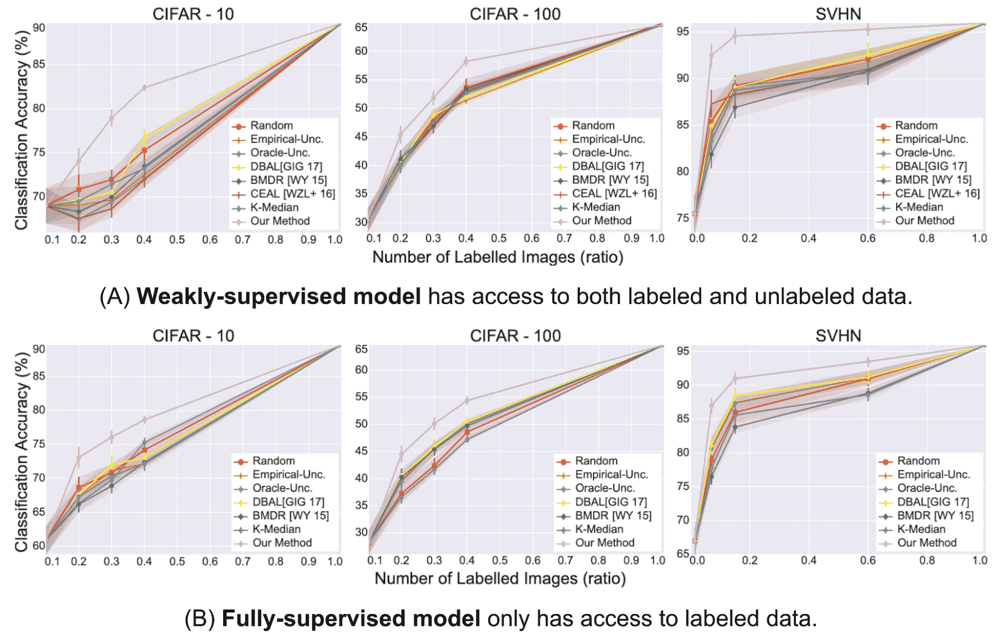

图 9. 在 CIFAR-10、CIFAR-100、SVHN 上，核心集算法的主动学习结果与几种常见基线的比较。 (图片来源：[Sener & Savarese 2018](https://arxiv.org/abs/1708.00489))

当类别数量较少时，核心集方法在图像分类任务上表现良好。当类别数量增多或数据维度增加（“维度诅咒”）时，核心集方法变得不那么有效（[Sinha 等人，2019](https://arxiv.org/abs/1904.00370)）。

由于核心集选择很昂贵，[Coleman 等人（2020）](https://arxiv.org/abs/1906.11829)尝试使用一个较弱的模型（例如较小、较弱的架构，未完全训练）进行实验，并发现经验上使用一个较弱的模型作为代理可以显著缩短每个重复数据选择周期的训练模型和选择样本，而不会对最终错误造成太大影响。他们的方法被称为**SVP**（通过代理进行选择）。

### 多样化梯度嵌入

**BADGE**（通过多样化梯度嵌入进行批量主动学习；[Ash 等人，2020](https://arxiv.org/abs/1906.03671)）在梯度空间中跟踪模型不确定性和数据多样性。不确定性是通过相对于网络最后一层的梯度大小来衡量的，而多样性则由涵盖梯度空间中的多样样本集合来捕获。

+   不确定性。给定一个未标记的样本$\mathbf{x}$，BADGE 首先计算预测$\hat{y}$以及关于最后一层参数的损失在$(\mathbf{x}, \hat{y})$上的梯度$g_\mathbf{x}$。他们观察到$g_\mathbf{x}$的范数保守地估计了样本对模型学习的影响，高置信度样本往往具有较小幅度的梯度嵌入。

+   多样性。给定许多样本的许多梯度嵌入$g_\mathbf{x}$，BADGE 运行[$k$-means++](https://en.wikipedia.org/wiki/K-means%2B%2B)来相应地对数据点进行采样。

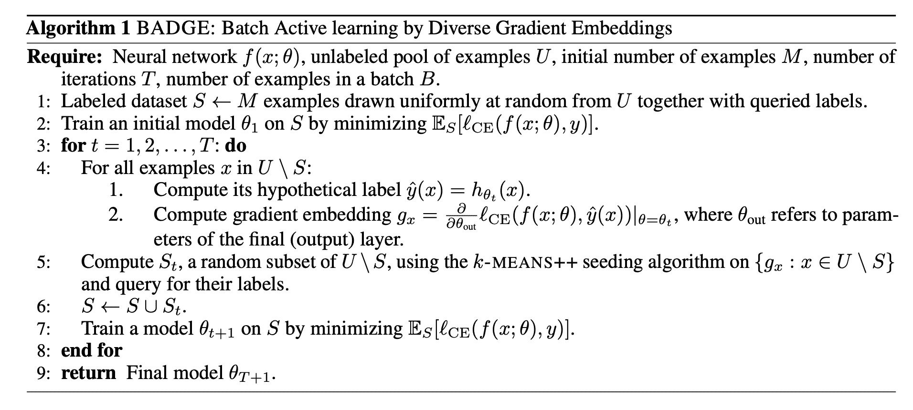

图 10. BADGE 算法（通过多样化梯度嵌入进行批量主动学习）。（图片来源：[Ash 等人，2020](https://arxiv.org/abs/1906.03671)）

## 测量训练效果

### 量化模型变化

[Settles 等人（2008）](https://papers.nips.cc/paper/2007/hash/a1519de5b5d44b31a01de013b9b51a80-Abstract.html)引入了一种主动学习查询策略，名为**EGL**（预期梯度长度）。其动机是找到一些样本，如果它们的标签已知，可以在模型上触发最大的更新。

让$\nabla \mathcal{L}(\theta)$表示损失函数相对于模型参数的梯度。具体来说，给定一个未标记的样本$\mathbf{x}_i$，我们需要计算假设标签为$y \in \mathcal{Y}$时的梯度，$\nabla \mathcal{L}^{(y)}(\theta)$。由于真实标签$y_i$是未知的，EGL 依赖于当前模型信念来计算预期梯度变化：

$$ \text{EGL}(\mathbf{x}_i) = \sum_{y_i \in \mathcal{Y}} p(y=y_i \vert \mathbf{x}) \|\nabla \mathcal{L}^{(y_i)}(\theta)\| $$

**BALD**（贝叶斯主动学习通过分歧；[Houlsby 等人 2011](https://arxiv.org/abs/1112.5745)）旨在识别最大化关于模型权重的信息增益的样本，这等同于最大化期望后验熵的减少。

$$ \begin{aligned} I[\boldsymbol{\theta}, y \vert x,\mathcal{D}] &= H(\boldsymbol{\theta} \vert \mathcal{D}) - \mathbb{E}_{y \sim p(y \vert \boldsymbol{x}, \mathcal{D})} \big[ H(\boldsymbol{\theta} \vert y, \boldsymbol{x}, \mathcal{D}) \big] & \text{; 期望后验熵的减少}\\ &= H(y \vert \boldsymbol{x}, \mathcal{D}) - \mathbb{E}_{\boldsymbol{\theta} \sim p(\boldsymbol{\theta} \vert \mathcal{D})} \big[ H(y \vert \boldsymbol{x}, \mathcal{\theta}) \big] \end{aligned} $$

其基本解释是“寻找$\mathbf{x}$，使得模型对$y$的不确定性最大（高$H(y \vert \mathbf{x}, \mathcal{D})$），但参数的个别设置是自信的（低$H(y \vert \mathbf{x}, \boldsymbol{\theta})$）。换句话说，每个个别的后验抽样是自信的，但一系列抽样具有不同的观点。

BALD 最初是针对单个样本提出的，[Kirsch 等人（2019）](https://arxiv.org/abs/1906.08158)将其扩展为批处理模式。

### 遗忘事件

为了调查神经网络是否有遗忘先前学到的信息的倾向，[Mariya Toneva 等人（2019）](https://arxiv.org/abs/1812.05159)设计了一个实验：他们在训练过程中跟踪每个样本的模型预测，并计算每个样本从被正确分类到错误分类或反之的转换次数。然后可以相应地对样本进行分类，

+   *易忘记*（冗余）的样本：如果类别标签在训练周期内发生变化。

+   *难以忘怀*的样本：如果类别标签分配在训练周期内保持一致。一旦学会，这些样本就永远不会被遗忘。

他们发现有大量的难以忘怀的例子一旦学会就永远不会被遗忘。具有嘈杂标签或具有“不寻常”特征的图像（在视觉上难以分类的复杂图像）是最容易被遗忘的例子之一。实验证明，可以安全地删除难以忘怀的例子而不会影响模型性能。

在实现中，遗忘事件仅在样本包含在当前训练批次中时计算；也就是说，他们跨后续小批次的呈现计算遗忘。每个样本的遗忘事件数量在不同种子之间非常稳定，易忘记的例子有一定倾向在训练后期首次学习。遗忘事件还发现在整个训练期间和不同架构之间是可转移的。

如果我们假设模型在训练过程中改变预测是模型不确定性的指标，则遗忘事件可以用作主动学习获取的信号。然而，未标记样本的地面真相是未知的。[Bengar 等人（2021）](https://arxiv.org/abs/2107.14707)提出了一个名为**标签离散度**的新度量指标。让我们看看在训练时间内，$c^*$ 是输入 $\mathbf{x}$ 最常预测的标签，而标签离散度衡量模型在这个样本上不分配 $c^*$ 的训练步骤的比例：

$$ \text{离散度}(\mathbf{x}) = 1 - \frac{f_\mathbf{x}}{T} \text{ 其中 } f_\mathbf{x} = \sum_{t=1}^T \mathbb{1}[\hat{y}_t = c^*], c^* = \arg\max_{c=1,\dots,C}\sum_{t=1}^T \mathbb{1}[\hat{y}_t = c] $$

在他们的实现中，每个时期都计算离散度。如果模型一直将相同的标签分配给相同的样本，则标签离散度低，但如果预测经常变化，则标签离散度高。如图 11 所示，标签离散度与网络不确定性相关。


图 11\. 标签离散度与网络不确定性相关。在 x 轴上，数据点按照标签离散度得分排序。y 轴是模型在尝试推断这些样本的标签时的预测准确性。（图片来源：[Bengar 等人，2021](https://arxiv.org/abs/2107.14707)）

## 混合

在批量模式下运行主动学习时，控制批次内的多样性非常重要。**建议性注释**（**SA**；[Yang 等人，2017](https://arxiv.org/abs/1706.04737)）是一种两步混合策略，旨在选择既具有高不确定性又高度代表性的标记样本。它利用从在标记数据上训练的模型集成中获得的不确定性和核心集来选择代表性数据样本。

1.  首先，SA 选择具有高不确定性得分的前 $K$ 个图像，形成候选池 $\mathcal{S}_c \subseteq \mathcal{S}_U$。不确定性是通过多个使用自举法训练的模型之间的不一致性来衡量的。

1.  下一步是找到具有最高代表性的子集 $\mathcal{S}_a \subseteq \mathcal{S}_c$。两个输入的特征向量之间的余弦相似度近似了它们的相似程度。$\mathcal{S}_a$ 对于 $\mathcal{S}_U$ 的代表性反映了 $\mathcal{S}_a$ 能多好地代表 $\mathcal{S}_u$ 中的所有样本，定义为：

$$ F(\mathcal{S}_a, \mathcal{S}_u) = \sum_{\mathbf{x}_j \in \mathcal{S}_u} f(\mathcal{S}_a, \mathbf{x}_j) = \sum_{\mathbf{x}_j \in \mathcal{S}_u} \max_{\mathbf{x}_i \in \mathcal{S}_a} \text{sim}(\mathbf{x}_i, \mathbf{x}_j) $$

将 $\mathcal{S}_a \subseteq \mathcal{S}_c$ 与 $k$ 个数据点形成的 $F(\mathcal{S}_a, \mathcal{S}_u)$ 最大化是最大集合覆盖问题的一个泛化版本。这是 NP 难题，其最佳多项式时间近似算法是一个简单的贪心方法。

1.  最初，$\mathcal{S}_a = \emptyset$，$F(\mathcal{S}_a, \mathcal{S}_u) = 0$。

1.  然后，迭代地添加 $\mathbf{x}_i \in \mathcal{S}_c$，使得 $F(\mathcal{S}_a \cup I_i, \mathcal{S}_u)$ 在 $\mathcal{S}_a$ 上最大化，直到 $\mathcal{S}_s$ 包含 $k$ 张图片。

[Zhdanov (2019)](https://arxiv.org/abs/1901.05954) 运行与 SA 类似的过程，但在第 2 步中，它依赖于 $k$-means 而不是核心集，其中候选池的大小相对于批量大小进行配置。给定批量大小 $b$ 和一个常数 $beta$（在 10 和 50 之间），它遵循以下步骤：

1.  在有标签数据上训练分类器；

1.  测量每个未标记示例的信息量（例如使用不确定性度量）；

1.  预过滤前 $\beta b \geq b$ 个最具信息量的示例；

1.  将 $\beta b$ 个示例聚类成 $B$ 个簇；

1.  选择本轮主动学习中距离聚类中心最近的 $b$ 个不同示例。

主动学习可以进一步与[半监督学习](https://lilianweng.github.io/posts/2021-12-05-semi-supervised/)结合以节省预算。**CEAL**（成本效益主动学习；[杨等人 2017](https://arxiv.org/abs/1701.03551)）同时运行两个任务：

1.  通过主动学习选择不确定样本并对其进行标记；

1.  选择具有最自信预测的样本并为其分配[伪标签](https://lilianweng.github.io/posts/2021-12-05-semi-supervised/#pseudo-labeling)。自信预测是通过预测熵是否低于阈值 $\delta$ 来判断的。随着模型的不断改进，阈值 $\delta$ 也会随时间衰减。

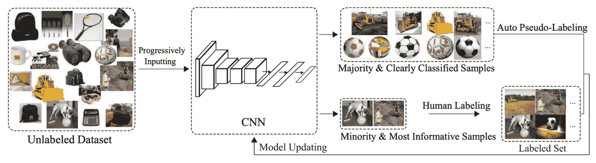

图 12。CEAL（成本效益主动学习）的示意图。 (图片来源：[杨等人 2017](https://arxiv.org/abs/1701.03551))

# 引用

被引用为：

> 翁，莉莲。 (2022 年 2 月)。不足数据学习第 2 部分：主动学习。Lil’Log。https://lilianweng.github.io/posts/2022-02-20-active-learning/。

或

```py
@article{weng2022active,
  title   = "Learning with not Enough Data Part 2: Active Learning",
  author  = "Weng, Lilian",
  journal = "lilianweng.github.io",
  year    = "2022",
  month   = "Feb",
  url     = "https://lilianweng.github.io/posts/2022-02-20-active-learning/"
} 
```

# 参考文献

[1] 布尔·塞特尔斯。[主动学习文献综述。](https://burrsettles.com/pub/settles.activelearning.pdf) 威斯康星大学麦迪逊分校，52(55-66):11，2010 年。

[2] [`jacobgil.github.io/deeplearning/activelearning`](https://jacobgil.github.io/deeplearning/activelearning)

[3] 杨等人。[“深度图像分类的成本效益主动学习”](https://arxiv.org/abs/1701.03551) TCSVT 2016。

[4] Yarin Gal 等人。[“Dropout 作为贝叶斯近似：在深度学习中表示模型不确定性。”](https://arxiv.org/abs/1506.02142) ICML 2016。

[5] Blundell 等人。[“神经网络中的权重不确定性（贝叶斯逆向传播）。”](https://arxiv.org/abs/1505.05424) ICML 2015。

[6] 塞特尔斯等人。[“多实例主动学习。”](https://papers.nips.cc/paper/2007/hash/a1519de5b5d44b31a01de013b9b51a80-Abstract.html) NIPS 2007。

[7] 霍尔斯比等人。[用于分类和偏好学习的贝叶斯主动学习。](https://arxiv.org/abs/1112.5745) arXiv 预印本 arXiv:1112.5745 (2020)。

[8] Kirsch et al. [“BatchBALD：深度贝叶斯主动学习的高效和多样化批量获取。”](https://arxiv.org/abs/1906.08158) NeurIPS 2019.

[9] Beluch et al. [“集成在图像分类中的主动学习的力量。”](https://openaccess.thecvf.com/content_cvpr_2018/papers/Beluch_The_Power_of_CVPR_2018_paper.pdf) CVPR 2018.

[10] Sener & Savarese. [“卷积神经网络的主动学习：核心集方法。”](https://arxiv.org/abs/1708.00489) ICLR 2018.

[11] Donggeun Yoo & In So Kweon. [“主动学习的学习损失。”](https://arxiv.org/abs/1905.03677) CVPR 2019.

[12] Margatina et al. [“通过获取对比示例进行主动学习。”](https://arxiv.org/abs/2109.03764) EMNLP 2021.

[13] Sinha et al. [“变分对抗主动学习”](https://arxiv.org/abs/1904.00370) ICCV 2019

[14] Ebrahimiet al. [“Minmax 主动学习”](https://arxiv.org/abs/2012.10467) arXiv 预印本 arXiv:2012.10467 (2021).

[15] Mariya Toneva et al. [“深度神经网络学习过程中的示例遗忘的实证研究。”](https://arxiv.org/abs/1812.05159) ICLR 2019.

[16] Javad Zolfaghari Bengar et al. [“当深度学习者改变主意：主动学习的学习动态。”](https://arxiv.org/abs/2107.14707) CAIP 2021.

[17] Yang et al. [“建议性注释：生物医学图像分割的深度主动学习框架。”](https://arxiv.org/abs/1706.04737) MICCAI 2017.

[18] Fedor Zhdanov. [“多样化小批量主动学习”](https://arxiv.org/abs/1901.05954) arXiv 预印本 arXiv:1901.05954 (2019).
