# 学习不足数据第 1 部分：半监督学习

> 原文：[`lilianweng.github.io/posts/2021-12-05-semi-supervised/`](https://lilianweng.github.io/posts/2021-12-05-semi-supervised/)

面对有限数量的有标签数据进行监督学习任务时，通常讨论四种方法。

1.  **预训练 + 微调**：在大型无监督数据语料库上预训练一个强大的任务无关模型，例如在自由文本上[预训练语言模型](https://lilianweng.github.io/posts/2019-01-31-lm/)，或者通过[自监督学习](https://lilianweng.github.io/posts/2019-11-10-self-supervised/)在未标记图像上预训练视觉模型，然后用少量标记样本在下游任务上进行微调。

1.  **半监督学习**：从有标签和无标签样本一起学习。在这种方法中，对视觉任务进行了大量研究。

1.  **主动学习**：标记是昂贵的，但我们仍然希望在给定成本预算的情况下收集更多数据。主动学习学习选择最有价值的未标记样本以便下一步收集，并帮助我们在有限的预算下聪明地行动。

1.  **预训练 + 数据集自动生成**：给定一个能力强大的预训练模型，我们可以利用它自动生成更多有标签样本。这在语言领域特别受欢迎，受到少样本学习成功的推动。

我计划写一系列关于“学习不足数据”的主题的文章。第一部分是关于*半监督学习*。

# 什么是半监督学习？

半监督学习使用有标签和无标签数据来训练模型。

有趣的是，大多数现有的关于半监督学习的文献都集中在视觉任务上。而对于语言任务，预训练 + 微调是一种更常见的范式。

本文介绍的所有方法都有一个结合两部分的损失：$\mathcal{L} = \mathcal{L}_s + \mu(t) \mathcal{L}_u$。监督损失$\mathcal{L}_s$很容易得到，因为有所有标记样本。我们将重点关注无监督损失$\mathcal{L}_u$的设计。一个常见的权重项$\mu(t)$的选择是一个斜坡函数，随着时间增加$\mathcal{L}_u$的重要性，其中$t$是训练步骤。

> *免责声明*：本文不会涵盖重点放在模型架构修改上的半监督方法。查看[这份调查报告](https://arxiv.org/abs/2006.05278)了解如何在半监督学习中使用生成模型和基于图的方法。

# 符号

| 符号 | 含义 |
| --- | --- |
| $L$ | 唯一标签的数量。 |
| $(\mathbf{x}^l, y) \sim \mathcal{X}, y \in \{0, 1\}^L$ | 有标签数据集。$y$是真实标签的独热表示。 |
| $\mathbf{u} \sim \mathcal{U}$ | 未标记数据集。 |
| $\mathcal{D} = \mathcal{X} \cup \mathcal{U}$ | 整个数据集，包括有标签和无标签样本。 |
| $\mathbf{x}$ | 任何样本，可以是有标签或无标签的。 |
| $\bar{\mathbf{x}}$ | 应用增强后的$\mathbf{x}$。 |
| $\mathbf{x}_i$ | 第 $i$ 个样本。 |
| $\mathcal{L}$, $\mathcal{L}_s$, $\mathcal{L}_u$ | 损失、监督损失和无监督损失。 |
| $\mu(t)$ | 无监督损失权重，随时间增加。 |
| $p(y \vert \mathbf{x}), p_\theta(y \vert \mathbf{x})$ | 给定输入的标签集的条件概率。 |
| $f_\theta(.)$ | 具有权重 $\theta$ 的实现的神经网络，我们要训练的模型。 |
| $\mathbf{z} = f_\theta(\mathbf{x})$ | $f$ 输出的 logits 向量。 |
| $\hat{y} = \text{softmax}(\mathbf{z})$ | 预测的标签分布。 |
| $D[.,.]$ | 两个分布之间的距离函数，例如 MSE、交叉熵、KL 散度等。 |
| $\beta$ | 教师 模型权重的 EMA 加权超参数。 |
| $\alpha, \lambda$ | MixUp 的参数，$\lambda \sim \text{Beta}(\alpha, \alpha)$。 |
| $T$ | 用于加强预测分布的温度。 |
| $\tau$ | 用于选择合格预测的置信阈值。 |

# 假设

文献中讨论了几个假设，以支持半监督学习方法中的某些设计决策。

+   H1: **平滑性假设**：如果两个数据样本在特征空间的高密度区域中接近，它们的标签应该相同或非常相似。

+   H2: **聚类假设**：特征空间既有密集区域又有稀疏区域。密集分组的数据点自然形成一个聚类。同一聚类中的样本预期具有相同的标签。这是 H1 的一个小扩展。

+   H3: **低密度分离假设**：类之间的决策边界倾向于位于稀疏的低密度区域，否则决策边界将把高密度聚类切割成两个类，对应于两个聚类，这将使 H1 和 H2 无效。

+   H4: **流形假设**：高维数据倾向于位于低维流形上。即使真实世界的数据可能在非常高的维度中观察到（例如真实世界物体/场景的图像），它们实际上可以被捕捉在一个较低维度的流形上，其中某些属性被捕捉，相似的点被紧密分组（例如真实世界物体/场景的图像并不是从所有像素组合的均匀分布中绘制的）。这使我们能够学习一个更有效的表示，以便发现和衡量未标记数据点之间的相似性。这也是表示学习的基础。[参见 [一个有用的链接](https://stats.stackexchange.com/questions/66939/what-is-the-manifold-assumption-in-semi-supervised-learning)]。

# 一致性正则化

**一致性正则化**，也称为**一致性训练**，假设神经网络内部的随机性（例如使用 Dropout）或数据增强转换不应该在给定相同输入时修改模型预测。本节中的每种方法都有一致性正则化损失 $\mathcal{L}_u$。

这个想法已经被应用在几种[自监督](https://lilianweng.github.io/posts/2019-11-10-self-supervised/) [学习](https://lilianweng.github.io/posts/2021-05-31-contrastive/) 方法中，如 SimCLR、BYOL、SimCSE 等。同一样本的不同增强版本应该产生相同的表示。[交叉视图训练](https://lilianweng.github.io/posts/2019-01-31-lm/#cross-view-training)在语言建模中以及自监督学习中的多视图学习都有相同的动机。

## Π-模型

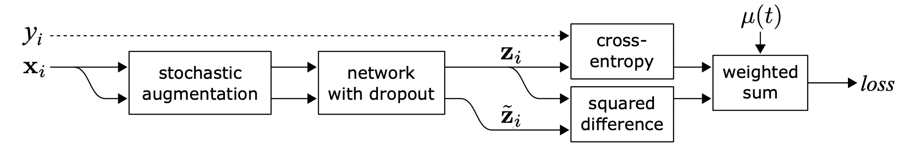

图 1\. Π-模型的概览。通过网络传递具有不同随机增强和 dropout 掩模的相同输入的两个版本，并期望输出保持一致。（图片来源：[Laine & Aila (2017)](https://arxiv.org/abs/1610.02242)）

[Sajjadi et al. (2016)](https://arxiv.org/abs/1606.04586) 提出了一种无监督学习损失，用于最小化通过网络进行两次随机变换（例如 dropout，随机最大池化）的相同数据点之间的差异。标签没有被明确使用，因此该损失可以应用于无标签数据集。[Laine & Aila (2017)](https://arxiv.org/abs/1610.02242) 后来为这种设置创造了名字，**Π-模型**。

$$ \mathcal{L}_u^\Pi = \sum_{\mathbf{x} \in \mathcal{D}} \text{MSE}(f_\theta(\mathbf{x}), f'_\theta(\mathbf{x})) $$

其中$f'$是应用不同随机增强或 dropout 掩模的相同神经网络。这种损失利用整个数据集。

## 时间集成

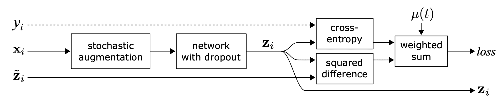

图 2\. 时间集成的概览。每个样本的 EMA 标签预测是学习目标。（图片来源：[Laine & Aila (2017)](https://arxiv.org/abs/1610.02242)）

Π-模型要求网络对每个样本运行两次，使计算成本加倍。为了减少成本，**时间集成**（[Laine & Aila 2017](https://arxiv.org/abs/1610.02242)）维护每个训练样本的模型预测的指数移动平均值（EMA）作为学习目标，该值仅在每个时期评估和更新一次。由于集成输出$\tilde{\mathbf{z}}_i$初始化为$\mathbf{0}$，因此通过$(1-\alpha^t)$进行归一化以纠正这种启动偏差。Adam 优化器也有这种[偏差校正](https://stats.stackexchange.com/questions/232741/why-is-it-important-to-include-a-bias-correction-term-for-the-adam-optimizer-for)项出于同样的原因。

$$ \tilde{\mathbf{z}}^{(t)}_i = \frac{\alpha \tilde{\mathbf{z}}^{(t-1)}_i + (1-\alpha) \mathbf{z}_i}{1-\alpha^t} $$

其中$\tilde{\mathbf{z}}^{(t)}$是第$t$个时期的集成预测，$\mathbf{z}_i$是当前轮次的模型预测。请注意，由于$\tilde{\mathbf{z}}^{(0)} = \mathbf{0}$，经过校正，$\tilde{\mathbf{z}}^{(1)}$在第 1 个时期简单等同于$\mathbf{z}_i$。

## 严厉的老师

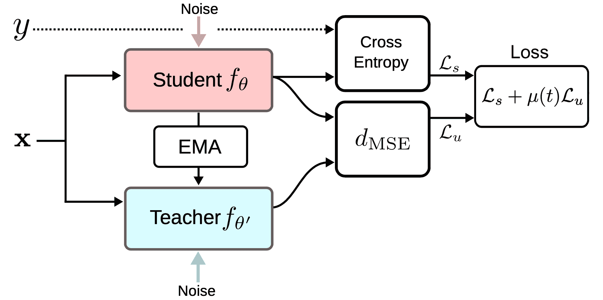

图 3. [Mean Teacher 框架概述](https://arxiv.org/abs/1703.01780)。（图片来源：Tarvaninen & Valpola, 2017）

时间集成跟踪每个训练样本的标签预测的 EMA 作为学习目标。然而，这种标签预测仅在*每个时代*更改，使得当训练数据集很大时，这种方法变得笨拙。**Mean Teacher**（[Tarvaninen & Valpola, 2017](https://arxiv.org/abs/1703.01780)）被提出来克服目标更新速度慢的问题，通过跟踪模型权重的移动平均而不是模型输出。让我们将具有权重$\theta$的原始模型称为*学生*模型，将连续学生模型之间的移动平均权重$\theta'$的模型称为*平均老师*：$\theta' \gets \beta \theta' + (1-\beta)\theta$

一致性正则化损失是学生和老师的预测之间的距离，学生-老师间隙应该被最小化。平均老师预计会提供比学生更准确的预测。这在经验实验中得到了确认，如图 4 所示。

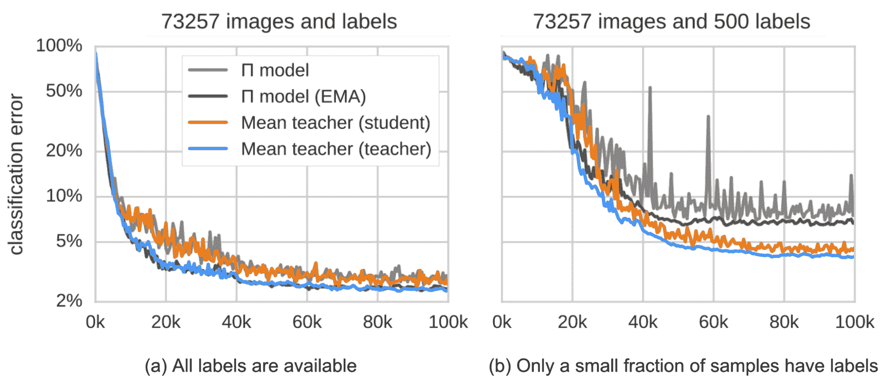

图 4. Mean Teacher 和Π模型在 SVHN 上的分类错误。平均老师（橙色）比学生模型（蓝色）表现更好。（图片来源：Tarvaninen & Valpola, 2017）

根据他们的消融研究，

+   输入增强（例如输入图像的随机翻转，高斯噪声）或学生模型的辍学对于良好的性能是必要的。老师模型不需要辍学。

+   性能对 EMA 衰减超参数$\beta$敏感。一个好的策略是在上升阶段使用小的$\beta=0.99$，当学生模型改进减缓时，在后期阶段使用较大的$\beta=0.999$。

+   他们发现作为一致性成本函数的 MSE 比其他成本函数如 KL 散度表现更好。

## 以嘈杂样本作为学习目标

几种最近的一致性训练方法学习最小化原始未标记样本与其对应增强版本之间的预测差异。这与Π模型非常相似，但一致性正则化损失*仅*应用于未标记数据。

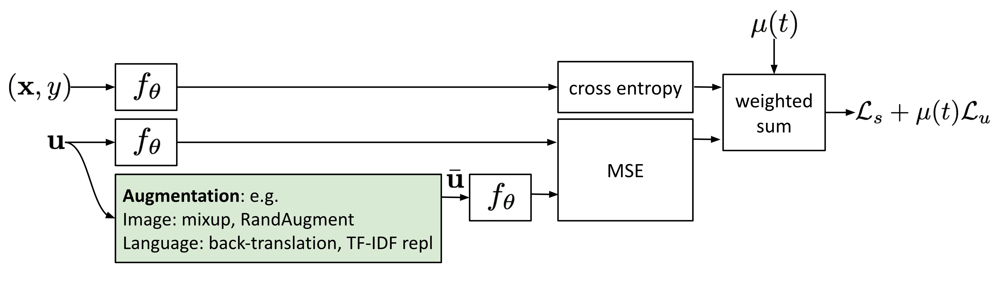

图 5. 使用嘈杂样本进行一致性训练。

对抗训练（[Goodfellow 等人，2014](https://arxiv.org/abs/1412.6572)）将对抗性噪声施加到输入上，并训练模型对此类对抗性攻击具有鲁棒性。该设置适用于监督学习，

$$ \begin{aligned} \mathcal{L}_\text{adv}(\mathbf{x}^l, \theta) &= D[q(y\mid \mathbf{x}^l), p_\theta(y\mid \mathbf{x}^l + r_\text{adv})] \\ r_\text{adv} &= {\arg\max}_{r; \|r\| \leq \epsilon} D[q(y\mid \mathbf{x}^l), p_\theta(y\mid \mathbf{x}^l + r_\text{adv})] \\ r_\text{adv} &\approx \epsilon \frac{g}{\|g\|_2} \approx \epsilon\text{sign}(g)\quad\text{where }g = \nabla_{r} D[y, p_\theta(y\mid \mathbf{x}^l + r)] \end{aligned} $$

其中 $q(y \mid \mathbf{x}^l)$ 是真实分布，通过独热编码地面实际标签 $y$ 近似得到。$p_\theta(y \mid \mathbf{x}^l)$ 是模型预测。$D[.,.]$ 是衡量两个分布之间差异的距离函数。

**虚拟对抗训练**（**VAT**；[Miyato et al. 2018](https://arxiv.org/abs/1704.03976)）将这一思想扩展到半监督学习中。由于 $q(y \mid \mathbf{x}^l)$ 是未知的，VAT 用当前模型对原始输入的预测替换它，使用当前权重 $\hat{\theta}$。注意 $\hat{\theta}$ 是模型权重的固定副本，因此 $\hat{\theta}$ 上没有梯度更新。

$$ \begin{aligned} \mathcal{L}_u^\text{VAT}(\mathbf{x}, \theta) &= D[p_{\hat{\theta}}(y\mid \mathbf{x}), p_\theta(y\mid \mathbf{x} + r_\text{vadv})] \\ r_\text{vadv} &= {\arg\max}_{r; \|r\| \leq \epsilon} D[p_{\hat{\theta}}(y\mid \mathbf{x}), p_\theta(y\mid \mathbf{x} + r)] \end{aligned} $$

VAT 损失适用于有标签和无标签样本。它是当前模型在每个数据点处预测流形的负平滑度量。这种损失的优化促使流形更加平滑。

**插值一致性训练**（**ICT**；[Verma et al. 2019](https://arxiv.org/abs/1903.03825)）通过添加更多数据点的插值来增强数据集，并期望模型预测与相应标签的插值一致。MixUp（[Zheng et al. 2018](https://arxiv.org/abs/1710.09412)）操作通过简单的加权和混合两个图像，并结合标签平滑。在 MixUp 的思想指导下，ICT 期望预测模型在混合样本上产生一个标签，以匹配相应输入的预测插值：

$$ \begin{aligned} \text{mixup}_\lambda (\mathbf{x}_i, \mathbf{x}_j) &= \lambda \mathbf{x}_i + (1-\lambda)\mathbf{x}_j \\ p(\text{mixup}_\lambda (y \mid \mathbf{x}_i, \mathbf{x}_j)) &\approx \lambda p(y \mid \mathbf{x}_i) + (1-\lambda) p(y \mid \mathbf{x}_j) \end{aligned} $$

其中 $\theta'$ 是 $\theta$ 的移动平均值，是 mean teacher。

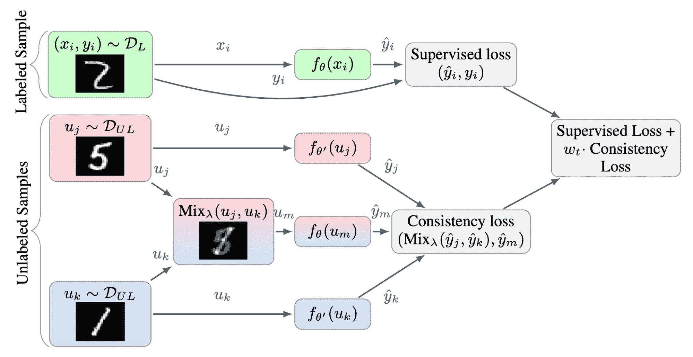

Fig. 6\. Interpolation Consistency Training 概述。MixUp 用于生成更多插值样本，插值标签作为学习目标。（图片来源：[Verma et al. 2019](https://arxiv.org/abs/1903.03825)）

因为两个随机选择的未标记样本属于不同类别的概率很高（例如 ImageNet 中有 1000 个对象类别），所以通过在两个随机未标记样本之间应用混合可能会发生在决策边界附近。 根据低密度分离的假设，决策边界倾向于位于低密度区域。

$$ \mathcal{L}^\text{ICT}_{u} = \mathbb{E}_{\mathbf{u}_i, \mathbf{u}_j \sim \mathcal{U}} \mathbb{E}_{\lambda \sim \text{Beta}(\alpha, \alpha)} D[p_\theta(y \mid \text{mixup}_\lambda (\mathbf{u}_i, \mathbf{u}_j)), \text{mixup}_\lambda(p_{\theta’}(y \mid \mathbf{u}_i), p_{\theta'}(y \mid \mathbf{u}_j)] $$

其中$\theta’$是$\theta$的移动平均值。

与 VAT 类似，**无监督数据增强** (**UDA**; [Xie et al. 2020](https://arxiv.org/abs/1904.12848)) 学习为未标记的示例和增强后的示例预测相同的输出。 UDA 特别关注研究噪声的*“质量”*如何影响一致性训练的半监督学习性能。 使用先进的数据增强方法产生有意义且有效的噪声样本至关重要。 良好的数据增强应产生有效的（即不更改标签）和多样化的噪声，并携带有针对性的归纳偏差。

对于图像，UDA 采用了 RandAugment ([Cubuk et al. 2019](https://arxiv.org/abs/1909.13719))，它均匀地采样[PIL](https://pillow.readthedocs.io/en/stable/)中可用的增强操作，无需学习或优化，因此比 AutoAugment 要便宜得多。

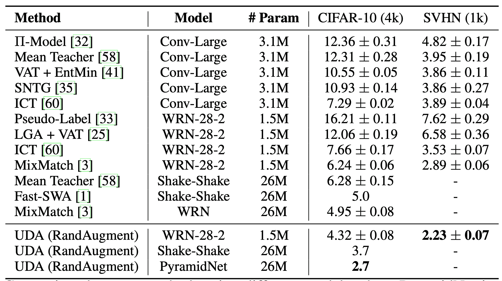

Fig. 7\. CIFAR-10 分类上各种半监督学习方法的比较。 在没有 RandAugment 的情况下，完全监督的 Wide-ResNet-28-2 和 PyramidNet+ShakeDrop 在训练 50,000 个示例时的错误率分别为**5.4**和**2.7**。 (图片来源: [Xie et al. 2020](https://arxiv.org/abs/1904.12848))

对于语言，UDA 结合了反向翻译和基于 TF-IDF 的词替换。 反向翻译保留了高层次的含义，但可能不保留某些词，而基于 TF-IDF 的词替换则删除具有低 TF-IDF 分数的无信息词。 在语言任务的实验中，他们发现 UDA 对于迁移学习和表示学习是互补的； 例如，在领域内未标记数据上微调的 BERT（即图 8 中的$\text{BERT}_\text{FINETUNE}$）可以进一步提高性能。

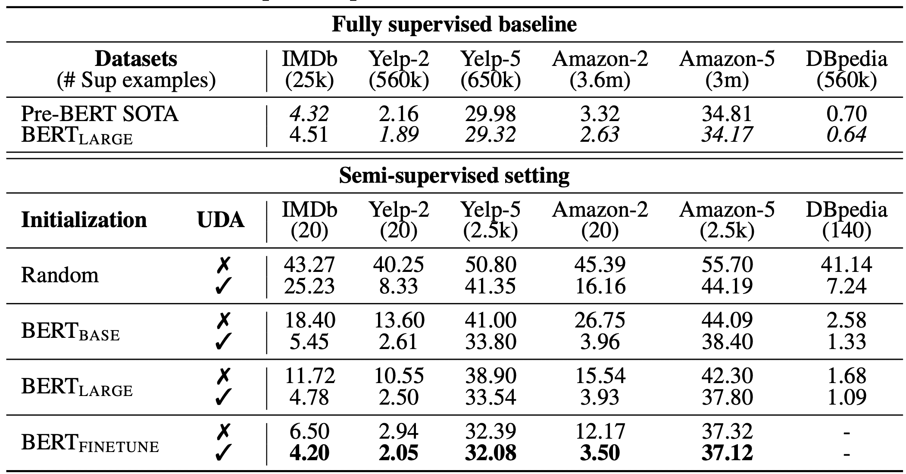

Fig. 8\. UDA 在不同初始化配置下在各种文本分类任务上的比较。 (图片来源: [Xie et al. 2020](https://arxiv.org/abs/1904.12848))

在计算$\mathcal{L}_u$时，UDA 发现两种训练技巧有助于改善结果。

+   *低置信度掩码*：如果低于阈值$\tau$，则屏蔽预测置信度低的示例。

+   *加强预测分布*：在 softmax 中使用低温$T$来加强预测的概率分布。

+   *领域内数据过滤*：为了从大型领域外数据集中提取更多领域内数据，他们训练了一个分类器来预测领域内标签，然后保留具有高置信度预测的样本作为领域内候选样本。

$$ \begin{aligned} &\mathcal{L}_u^\text{UDA} = \mathbb{1}[\max_{y'} p_{\hat{\theta}}(y'\mid \mathbf{x}) > \tau ] \cdot D[p^\text{(sharp)}_{\hat{\theta}}(y \mid \mathbf{x}; T), p_\theta(y \mid \bar{\mathbf{x}})] \\ &\text{其中 } p_{\hat{\theta}}^\text{(sharp)}(y \mid \mathbf{x}; T) = \frac{\exp(z^{(y)} / T)}{ \sum_{y'} \exp(z^{(y')} / T) } \end{aligned} $$

其中$\hat{\theta}$是模型权重的固定副本，与 VAT 中相同，因此没有梯度更新，$\bar{\mathbf{x}}$是增强的数据点。$\tau$是预测置信度阈值，$T$是分布加热温度。

# 伪标签

**伪标签**（[Lee，2013](http://citeseerx.ist.psu.edu/viewdoc/download?doi=10.1.1.664.3543&rep=rep1&type=pdf)）根据当前模型预测的最大 softmax 概率为未标记样本分配虚假标签，然后在纯监督设置中同时对标记和未标记样本进行训练。

为什么伪标签有效？伪标签实际上等效于*熵正则化*（[Grandvalet＆Bengio，2004](https://papers.nips.cc/paper/2004/hash/96f2b50b5d3613adf9c27049b2a888c7-Abstract.html)），它最小化未标记数据的类概率的条件熵，以支持类之间的低密度分离。换句话说，预测的类概率实际上是类重叠的度量，最小化熵等效于减少类重叠，从而实现低密度分离。

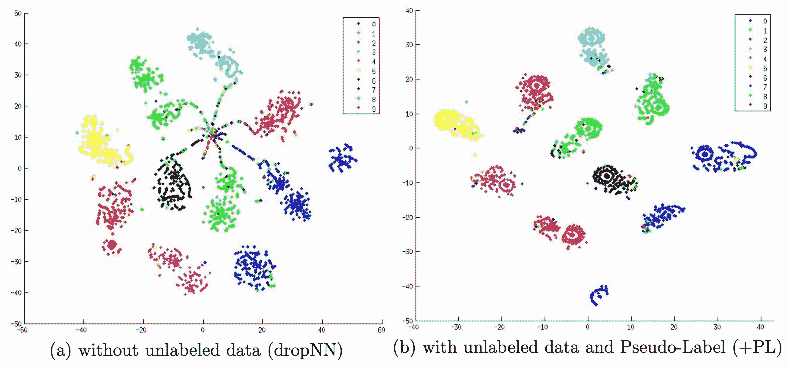

图 9. 通过在 60000 个未标记样本上进行伪标记的模型训练，在 MNIST 测试集上的 t-SNE 可视化输出，（a）没有和（b）使用伪标签。伪标签导致学习嵌入空间中更好的分离。（图片来源：[Lee，2013](http://citeseerx.ist.psu.edu/viewdoc/download?doi=10.1.1.664.3543&rep=rep1&type=pdf)）

使用伪标签进行训练自然是一个迭代过程。我们将产生伪标签的模型称为教师，学习伪标签的模型称为学生。

## 标签传播

**标签传播**（[Iscen 等人，2019](https://arxiv.org/abs/1904.04717)）是一种基于特征嵌入构建样本之间相似性图的想法。然后，伪标签从已知样本“扩散”到未标记的样本，其中传播权重与图中成对相似性分数成比例。从概念上讲，它类似于 k-NN 分类器，两者都存在无法很好地处理大型数据集的问题。

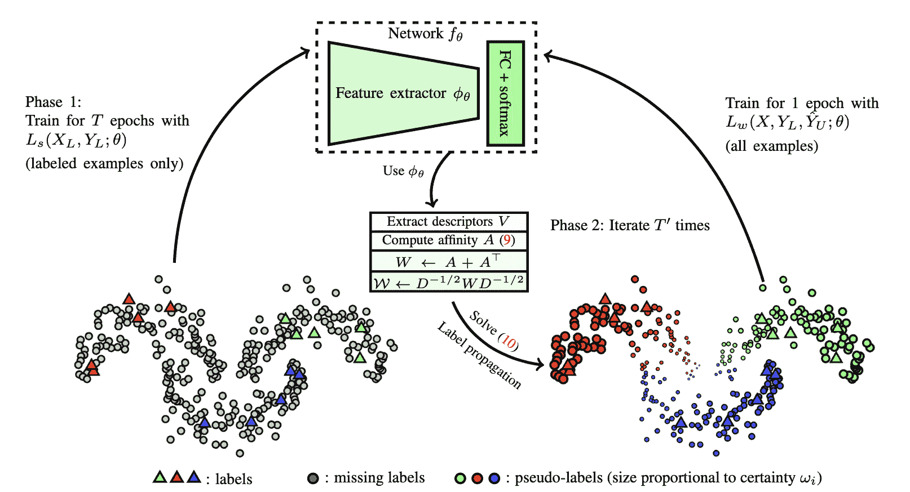

图 10. 标签传播的工作原理示意图（图片来源：[Iscen 等人 2019](https://arxiv.org/abs/1904.04717)）

## 自训练

**自训练**不是一个新概念（[斯卡德 1965](https://ieeexplore.ieee.org/document/1053799)、[尼格拉姆＆加尼 CIKM 2000](http://www.kamalnigam.com/papers/cotrain-CIKM00.pdf)）。它是一个迭代算法，交替执行以下两个步骤，直到每个未标记样本都有一个标签分配：

+   最初在有标签数据上构建分类器。

+   然后使用这个分类器预测未标记数据的标签，并将最有信心的转换为标记样本。

[谢等人（2020）](https://arxiv.org/abs/1911.04252)在深度学习中应用了自训练，并取得了很好的结果。在 ImageNet 分类任务中，他们首先训练了一个 EfficientNet（[谭＆莱 2019](https://arxiv.org/abs/1905.11946)）模型作为老师，为 3 亿个未标记图像生成伪标签，然后训练一个更大的 EfficientNet 作为学生，使用真实标记和伪标记图像进行学习。在他们的设置中，一个关键元素是在学生模型训练过程中引入*噪音*，但老师产生伪标签时没有噪音。因此他们的方法被称为**嘈杂学生**。他们对学生应用了随机深度（[黄等人 2016](https://arxiv.org/abs/1603.09382)）、辍学和 RandAugment 来为学生引入噪音。噪音对于学生表现优于老师至关重要。添加的噪音具有复合效应，鼓励模型在有标记和无标记数据上的决策边界变得平滑。

在嘈杂的学生自训练中的一些其他重要技术配置是：

+   学生模型应该足够大（即比老师大）以适应更多数据。

+   嘈杂学生应该与数据平衡配对，特别重要的是平衡每个类别中的伪标记图像数量。

+   软伪标签比硬标签效果更好。

尽管模型并非针对对抗性鲁棒性进行优化，但嘈杂学生也提高了对 FGSM（快速梯度符号攻击 = 该攻击使用损失相对于输入数据的梯度，并调整输入数据以最大化损失）攻击的对抗性鲁棒性。

SentAugment，由[杜等人（2020）](https://arxiv.org/abs/2010.02194)提出，旨在解决语言领域自训练中没有足够的领域内未标记数据的问题。它依赖于句子嵌入来从大型语料库中找到未标记的领域内样本，并使用检索到的句子进行自训练。

## 减少确认偏见

确认偏见是由不完美的老师模型提供的错误伪标签的问题。过度拟合错误标签可能不会给我们带来更好的学生模型。

为了减少确认偏见，[Arazo et al. (2019)](https://arxiv.org/abs/1908.02983)提出了两种技术。一种是采用带软标签的 MixUp。给定两个样本，$(\mathbf{x}_i, \mathbf{x}_j)$及其对应的真实或伪标签$(y_i, y_j)$，插值标签方程可以转化为具有 softmax 输出的交叉熵损失：

$$ \begin{aligned} &\bar{\mathbf{x}} = \lambda \mathbf{x}_i + (1-\lambda) \mathbf{x}_j \\ &\bar{y} = \lambda y_i + (1-\lambda) y_j \Leftrightarrow \mathcal{L} = \lambda [y_i^\top \log f_\theta(\bar{\mathbf{x}})] + (1-\lambda) [y_j^\top \log f_\theta(\bar{\mathbf{x}})] \end{aligned} $$

如果标记样本太少，Mixup 是不够的。他们通过过采样标记样本在每个小批次中设置了最小数量的标记样本。这比加权标记样本更好，因为它导致更频繁的更新而不是较大幅度的少量更新，这可能不太稳定。像一致性正则化、数据增强和丢弃对于伪标记工作良好也很重要。

**元伪标签**([Pham et al. 2021](https://arxiv.org/abs/2003.10580))不断调整教师模型，根据学生在标记数据集上的表现反馈。教师和学生并行训练，其中教师学习生成更好的伪标签，学生从伪标签中学习。

让教师和学生模型的权重分别为$\theta_T$和$\theta_S$。学生模型在标记样本上的损失被定义为$\theta^\text{PL}_S(.)$的函数，我们希望通过相应地优化教师模型来最小化这个损失。

$$ \begin{aligned} \min_{\theta_T} &\mathcal{L}_s(\theta^\text{PL}_S(\theta_T)) = \min_{\theta_T} \mathbb{E}_{(\mathbf{x}^l, y) \in \mathcal{X}} \text{CE}[y, f_{\theta_S}(\mathbf{x}^l)] \\ \text{其中 } &\theta^\text{PL}_S(\theta_T) = \arg\min_{\theta_S} \mathcal{L}_u (\theta_T, \theta_S) = \arg\min_{\theta_S} \mathbb{E}_{\mathbf{u} \sim \mathcal{U}} \text{CE}[(f_{\theta_T}(\mathbf{u}), f_{\theta_S}(\mathbf{u}))] \end{aligned} $$

但是，优化上述方程并不是一件简单的事情。借鉴[MAML](https://arxiv.org/abs/1703.03400)的思想，它用$\theta_S$的一步梯度更新来近似多步$\arg\min_{\theta_S}$，

$$ \begin{aligned} \theta^\text{PL}_S(\theta_T) &\approx \theta_S - \eta_S \cdot \nabla_{\theta_S} \mathcal{L}_u(\theta_T, \theta_S) \\ \min_{\theta_T} \mathcal{L}_s (\theta^\text{PL}_S(\theta_T)) &\approx \min_{\theta_T} \mathcal{L}_s \big( \theta_S - \eta_S \cdot \nabla_{\theta_S} \mathcal{L}_u(\theta_T, \theta_S) \big) \end{aligned} $$

使用软伪标签，上述目标是可微的。但是如果使用硬伪标签，它是不可微的，因此我们需要使用 RL，例如 REINFORCE。

优化过程在训练两个模型之间交替进行：

+   *学生模型更新*：给定一批未标记样本$\{ \mathbf{u} \}$，我们通过$f_{\theta_T}(\mathbf{u})$生成伪标签，并用一步 SGD 优化$\theta_S$：$\theta’_S = \color{green}{\theta_S - \eta_S \cdot \nabla_{\theta_S} \mathcal{L}_u(\theta_T, \theta_S)}$。

+   *教师模型更新*：给定一批标记样本$\{(\mathbf{x}^l, y)\}$，我们重复使用学生的更新来优化$\theta_T$：$\theta’_T = \theta_T - \eta_T \cdot \nabla_{\theta_T} \mathcal{L}_s ( \color{green}{\theta_S - \eta_S \cdot \nabla_{\theta_S} \mathcal{L}_u(\theta_T, \theta_S)} )$。此外，UDA 目标应用于教师模型以整合一致性正则化。

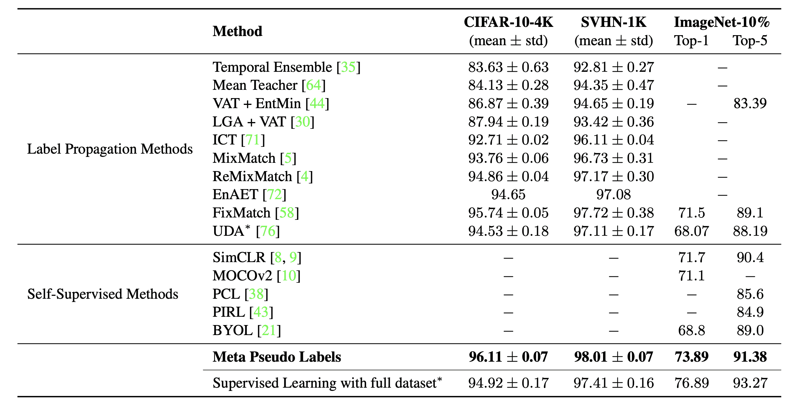

图 11。Meta Pseudo Labels 与其他图像分类任务上的半监督或自监督学习方法的比较。（图片来源：[Pham et al. 2021](https://arxiv.org/abs/2003.10580)）

# 具有一致性正则化的伪标记

可以将上述两种方法结合在一起，同时运行具有伪标记和一致性训练的半监督学习。

## MixMatch

**MixMatch**（[Berthelot et al. 2019](https://arxiv.org/abs/1905.02249)）作为半监督学习的一种整体方法，利用未标记数据通过合并以下技术：

1.  *一致性正则化*：鼓励模型在扰动的未标记样本上输出相同的预测。

1.  *熵最小化*：鼓励模型对未标记数据输出自信的预测。

1.  *MixUp*增强：鼓励模型在样本之间具有线性行为。

给定一批标记数据$\mathcal{X}$和未标记数据$\mathcal{U}$，我们通过$\text{MixMatch}(.)$创建它们的增强版本，$\bar{\mathcal{X}}$和$\bar{\mathcal{U}}$，包含增强样本和对未标记示例的猜测标签。

$$ \begin{aligned} \bar{\mathcal{X}}, \bar{\mathcal{U}} &= \text{MixMatch}(\mathcal{X}, \mathcal{U}, T, K, \alpha) \\ \mathcal{L}^\text{MM}_s &= \frac{1}{\vert \bar{\mathcal{X}} \vert} \sum_{(\bar{\mathbf{x}}^l, y)\in \bar{\mathcal{X}}} D[y, p_\theta(y \mid \bar{\mathbf{x}}^l)] \\ \mathcal{L}^\text{MM}_u &= \frac{1}{L\vert \bar{\mathcal{U}} \vert} \sum_{(\bar{\mathbf{u}}, \hat{y})\in \bar{\mathcal{U}}} \| \hat{y} - p_\theta(y \mid \bar{\mathbf{u}}) \|²_2 \\ \end{aligned} $$

其中$T$是用于减少猜测标签重叠的锐化温度；$K$是每个未标记示例生成的增强数量；$\alpha$是 MixUp 中的参数。

对于每个$\mathbf{u}$，MixMatch 生成$K$个增强，$\bar{\mathbf{u}}^{(k)} = \text{Augment}(\mathbf{u})$，$k=1, \dots, K$，并且基于平均值猜测伪标签：$\hat{y} = \frac{1}{K} \sum_{k=1}^K p_\theta(y \mid \bar{\mathbf{u}}^{(k)})$。

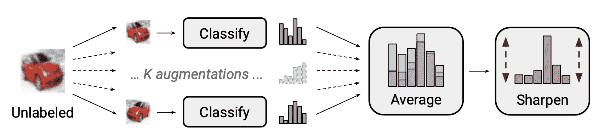

图 12。在 MixMatch 中“标签猜测”的过程：对$K$个增强进行平均，校正预测的边际分布，最后锐化分布。（图片来源：[Berthelot 等人，2019](https://arxiv.org/abs/1905.02249)）

根据他们的消融研究，特别是在未标记数据上使用 MixUp 至关重要。去除伪标签分布上的温度调整会严重影响性能。对于标签猜测，需要对多个增强进行平均。

**ReMixMatch**（[Berthelot 等人，2020](https://arxiv.org/abs/1911.09785)）通过引入两种新机制改进了 MixMatch：

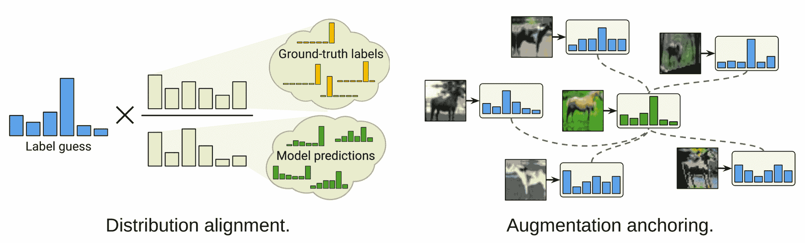

图 13。ReMixMatch 相对于 MixMatch 引入的两个改进的示意图。（图片来源：[Berthelot 等人，2020](https://arxiv.org/abs/1911.09785)）

+   *分布对齐*。它鼓励边际分布$p(y)$接近地面真实标签的边际分布。设$p(y)$为真实标签中的类分布，$\tilde{p}(\hat{y})$为未标记数据中预测的类分布的滑动平均。对于未标记样本上的模型预测$p_\theta(y \vert \mathbf{u})$被归一化为$\text{Normalize}\big( \frac{p_\theta(y \vert \mathbf{u}) p(y)}{\tilde{p}(\hat{y})} \big)$以匹配真实的边际分布。

    +   请注意，如果边际分布不均匀，则熵最小化不是一个有用的目标。

    +   我确实觉得假设标记数据和未标记数据上的类分布应该匹配的假设太强了，在现实世界的设置中未必成立。

+   *增强锚定*。给定一个未标记的样本，首先生成一个带有弱增强的“锚定”版本，然后使用 CTAugment（控制理论增强）对$K$个强增强版本进行平均。 CTAugment 仅对保持模型预测在网络容差范围内的增强进行采样。

ReMixMatch 损失是几个项的组合，

+   一个带有数据增强和 MixUp 的监督损失；

+   一个无监督的损失函数，应用数据增强和 MixUp，使用伪标签作为目标；

+   在单个经过大量增强的未标记图像上进行的 CE 损失，没有 MixUp；

+   一个[旋转](https://lilianweng.github.io/posts/2019-11-10-self-supervised/#distortion)损失，就像自监督学习中的那样。

## DivideMix

**DivideMix**（[Junnan Li 等人 2020](https://arxiv.org/abs/2002.07394)）将半监督学习与带有噪声标签的学习（LNL）相结合。它通过一个 [GMM](https://scikit-learn.org/stable/modules/mixture.html) 模型来建模每个样本的损失分布，动态地将训练数据分为一个带有干净示例的标记集和一个带有嘈杂示例的未标记集。遵循 [Arazo 等人 2019](https://arxiv.org/abs/1904.11238) 的思路，他们在每个样本的交叉熵损失 $\ell_i = y_i^\top \log f_\theta(\mathbf{x}_i)$ 上拟合一个两分量的 GMM。干净样本预计比嘈杂样本更快地获得较低的损失。均值较小的分量是对应于干净标签的簇，我们将其表示为 $c$。如果 GMM 后验概率 $w_i = p_\text{GMM}(c \mid \ell_i)$（即样本属于干净样本集的概率）大于阈值 $\tau$，则将该样本视为干净样本，否则视为嘈杂样本。

数据聚类步骤被命名为 *协同分割*。为了避免确认偏差，DivideMix 同时训练两个分歧网络，其中每个网络使用另一个网络的数据集划分；例如，考虑双 Q 学习的工作原理。

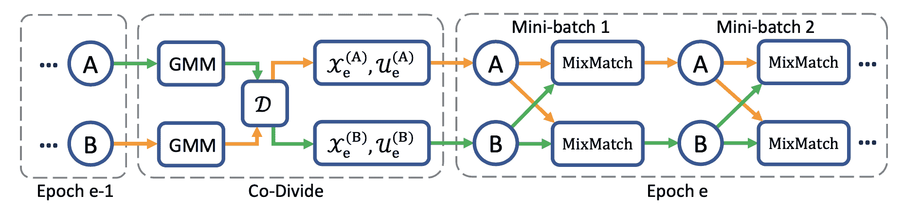

图 14\. DivideMix 独立训练两个网络以减少确认偏差。它们同时运行协同分割、协同细化和协同猜测。（图片来源：[Junnan Li 等人 2020](https://arxiv.org/abs/2002.07394)）

与 MixMatch 相比，DivideMix 在训练过程中具有额外的 *协同分割* 阶段来处理嘈杂样本，并且在训练过程中有以下改进：

+   *标签协同细化*：它线性组合了地面真实标签 $y_i$ 和网络的预测 $\hat{y}_i$，后者在多次对 $\mathbf{x}_i$ 进行增强后取平均，由另一个网络产生的干净集概率 $w_i$ 引导。

+   *标签协同猜测*：它对未标记数据样本的两个模型的预测进行平均。

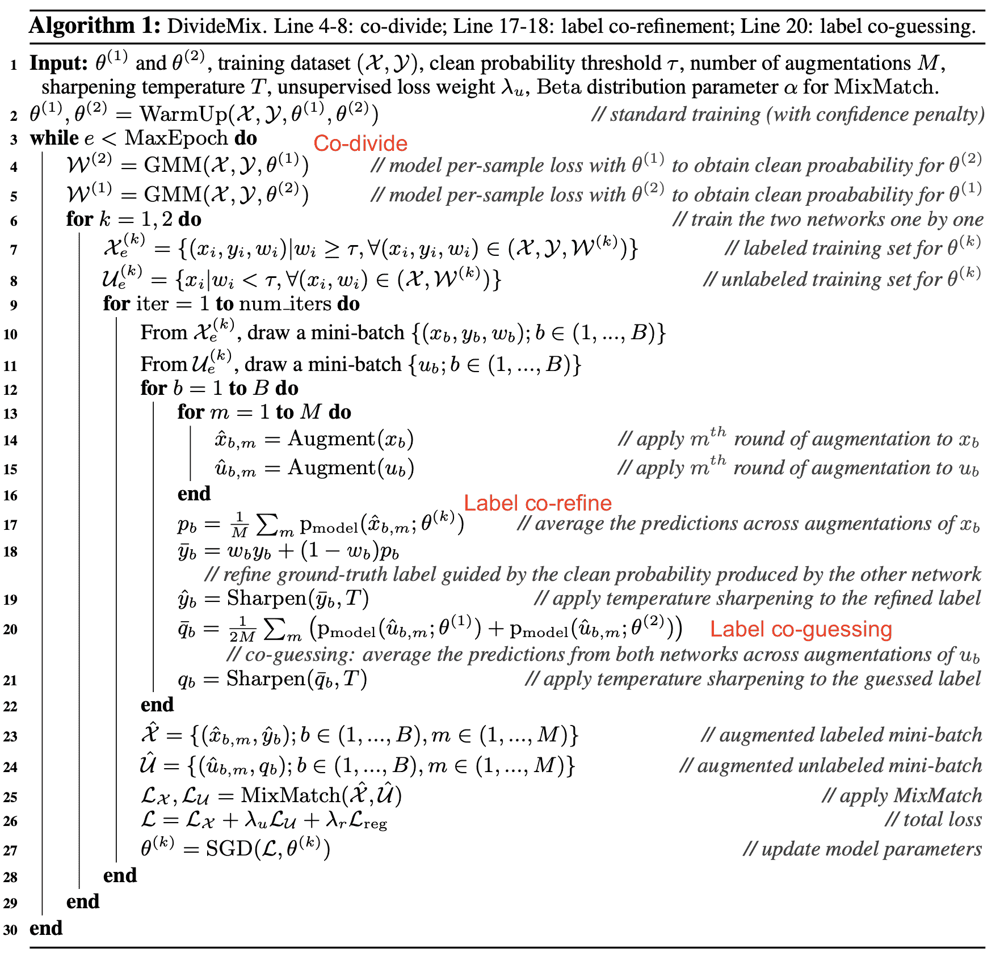

图 15\. DivideMix 算法。（图片来源：[Junnan Li 等人 2020](https://arxiv.org/abs/2002.07394)）

## FixMatch

**FixMatch**（[Sohn 等人 2020](https://arxiv.org/abs/2001.07685)）在未标记样本上生成伪标签，并仅保留高置信度的预测。这里，弱数据增强和高置信度过滤都有助于生成高质量可信赖的伪标签目标。然后 FixMatch 学习预测这些伪标签，给定一个经过大量增强的样本。

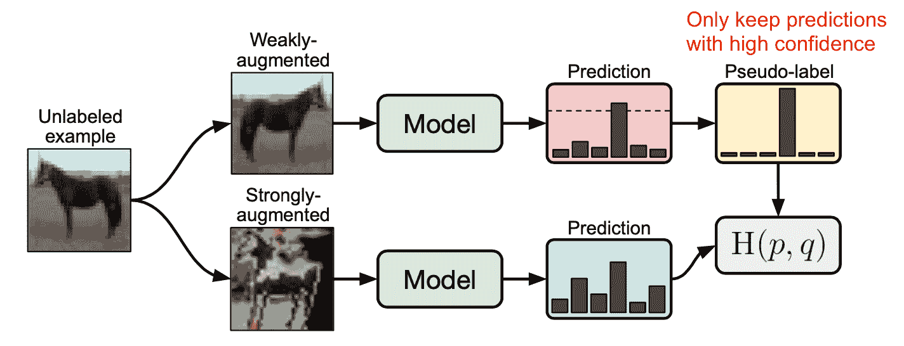

图 16\. FixMatch 工作原理示意图。（图片来源：[Sohn 等人 2020](https://arxiv.org/abs/2001.07685)）

$$ \begin{aligned} \mathcal{L}_s &= \frac{1}{B} \sum^B_{b=1} \text{CE}[y_b, p_\theta(y \mid \mathcal{A}_\text{weak}(\mathbf{x}_b))] \\ \mathcal{L}_u &= \frac{1}{\mu B} \sum_{b=1}^{\mu B} \mathbb{1}[\max(\hat{y}_b) \geq \tau]\;\text{CE}(\hat{y}_b, p_\theta(y \mid \mathcal{A}_\text{strong}(\mathbf{u}_b))) \end{aligned} $$

其中 $\hat{y}_b$ 是无标签样本的伪标签；$\mu$ 是一个超参数，确定了 $\mathcal{X}$ 和 $\mathcal{U}$ 的相对大小。

+   弱数据增强 $\mathcal{A}_\text{weak}(.)$：标准的翻转和平移增强

+   强数据增强 $\mathcal{A}_\text{strong}(.)$：AutoAugment、Cutout、RandAugment、CTAugment

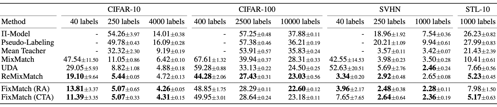

图 17\. FixMatch 和其他几种半监督学习方法在图像分类任务上的性能。 (图片来源：[Sohn et al. 2020](https://arxiv.org/abs/2001.07685))

根据 FixMatch 的消融研究，

+   使用温度参数 $T$ 调整预测分布并不会对使用阈值 $\tau$ 时产生显著影响。

+   Cutout 和 CTAugment 作为强数据增强的一部分对于良好性能是必要的。

+   当用强数据增强替换标签猜测的弱数据增强时，模型在训练早期就会发散。如果完全丢弃弱数据增强，则模型会过拟合猜测的标签。

+   使用弱数据增强而不是强数据增强进行伪标签预测会导致性能不稳定。强数据增强至关重要。

# 结合强大的预训练

这是一种常见的范式，特别是在语言任务中，首先在大型无监督数据语料库上通过自监督学习对任务不可知模型进行预训练，然后在小型标记数据集上微调它以适应下游任务。研究表明，如果将半监督学习与预训练相结合，我们可以获得额外的收益。

[Zoph et al. (2020)](https://arxiv.org/abs/2006.06882) 研究了自我训练比预训练效果更好的程度。他们的实验设置是使用 ImageNet 进行预训练或自我训练以提高 COCO 的性能。请注意，当使用 ImageNet 进行自我训练时，会丢弃标签，只使用 ImageNet 样本作为无标签数据点。[He et al. (2018)](https://arxiv.org/abs/1811.08883) 已经证明，如果下游任务非常不同，例如目标检测，那么 ImageNet 分类预训练效果不佳。

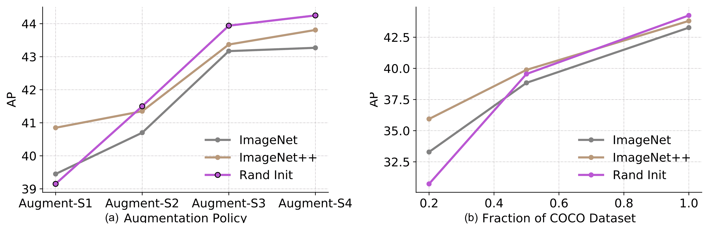

图 18\. (a) 数据增强（从弱到强）和 (b) 标记数据集大小对目标检测性能的影响。图例中：`Rand Init` 表示使用随机权重初始化的模型；`ImageNet` 使用预训练检查点初始化，准确率为 84.5%；`ImageNet++` 使用准确率更高的检查点初始化，准确率为 86.9%。 (图片来源：[Zoph et al. 2020](https://arxiv.org/abs/2006.06882))

他们的实验展示了一系列有趣的发现：

+   随着下游任务可用的标记样本数量增加，预训练的有效性会降低。预训练在低数据情况下（20%）有帮助，但在高数据情况下是中性或有害的。

+   自训练有助于高数据/强数据增强情况，即使预训练有害。

+   自训练可以在预训练的基础上带来额外的改进，即使使用相同的数据源。

+   自监督预训练（例如通过 SimCLR）在高数据量情况下会降低性能，类似于监督预训练的情况。

+   联合训练监督和自监督目标有助于解决预训练和下游任务之间的不匹配。预训练、联合训练和自训练都是增量的。

+   嘈杂的标签或非目标标记（即，预训练标签与下游任务标签不对齐）比有针对性的伪标记更糟糕。

+   自训练的计算成本比在预训练模型上进行微调更高。

[Chen 等人 (2020)](https://arxiv.org/abs/2006.10029) 提出了一个三步程序，将自监督预训练、监督微调和自训练的好处合并在一起：

1.  无监督或自监督预训练一个大模型。

1.  在少量标记示例上进行监督微调。使用一个大（深且宽）的神经网络是重要的。*更大的模型在使用更少标记样本时表现更好。*

1.  通过在自训练中采用伪标签对未标记的示例进行蒸馏。

    +   可以将大模型的知识蒸馏到小模型中，因为任务特定的使用不需要学习表示的额外容量。

    +   蒸馏损失的格式如下，其中教师网络的权重$\hat{\theta}_T$是固定的。

$$ \mathcal{L}_\text{distill} = - (1-\alpha) \underbrace{\sum_{(\mathbf{x}^l_i, y_i) \in \mathcal{X}} \big[ \log p_{\theta_S}(y_i \mid \mathbf{x}^l_i) \big]}_\text{监督损失} - \alpha \underbrace{\sum_{\mathbf{u}_i \in \mathcal{U}} \Big[ \sum_{i=1}^L p_{\hat{\theta}_T}(y^{(i)} \mid \mathbf{u}_i; T) \log p_{\theta_S}(y^{(i)} \mid \mathbf{u}_i; T) \Big]}_\text{使用未标记数据进行蒸馏损失} $$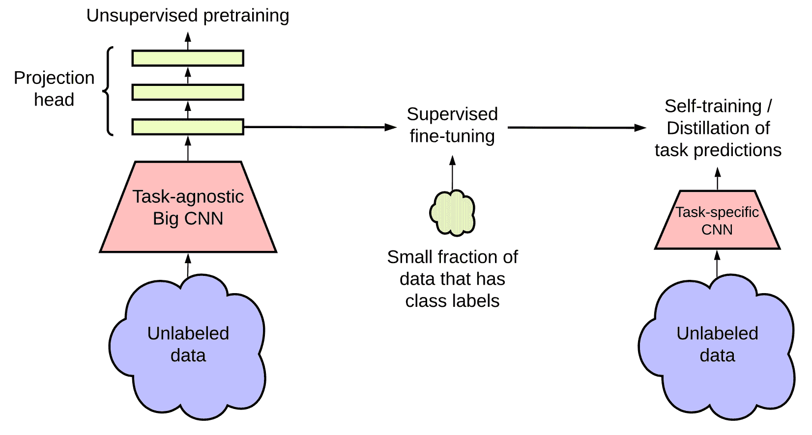

图 19\. 半监督学习框架通过（左）任务无关的无监督预训练和（右）任务特定的自训练和蒸馏来利用未标记的数据语料库。 (图片来源: [Chen 等人，2020](https://arxiv.org/abs/2006.10029))

他们在 ImageNet 分类任务上进行了实验。自监督预训练使用了 SimCLRv2，这是[SimCLR](https://lilianweng.github.io/posts/2021-05-31-contrastive/#simclr)的直接改进版本。在他们的实证研究中观察到的一些发现与[Zoph 等人，2020](https://arxiv.org/abs/2006.06882)一致：

+   更大的模型更具标签效率；

+   SimCLR 中更大/更深的项目头可以改进表示学习；

+   使用未标记数据进行蒸馏可以改进半监督学习。

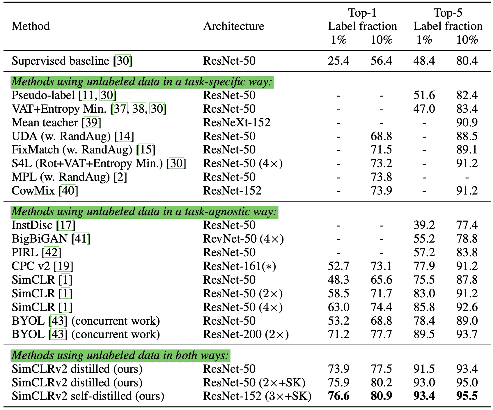

图 20。通过 SimCLRv2 +半监督蒸馏在 ImageNet 分类上的性能比较。 （图片来源：[Chen 等人 2020](https://arxiv.org/abs/2006.10029)）

* * *

💡 最近半监督学习方法中常见主题的快速摘要，许多旨在减少确认偏见：

+   通过先进的数据增强方法对样本应用有效和多样化的噪声。

+   处理图像时，MixUp 是一种有效的增强方法。 Mixup 也可以用于语言，从而导致小幅改进（[Guo 等人 2019](https://arxiv.org/abs/1905.08941)）。

+   设置阈值并丢弃置信度低的伪标签。

+   设置每个小批量的标记样本的最小数量。

+   锐化伪标签分布以减少类别重叠。

# 引用

被引用为：

> Weng，Lilian。 （2021 年 12 月）。数据不足的学习第 1 部分：半监督学习。 Lil’Log。 https://lilianweng.github.io/posts/2021-12-05-semi-supervised/。

或

```py
@article{weng2021semi,
  title   = "Learning with not Enough Data Part 1: Semi-Supervised Learning",
  author  = "Weng, Lilian",
  journal = "lilianweng.github.io",
  year    = "2021",
  month   = "Dec",
  url     = "https://lilianweng.github.io/posts/2021-12-05-semi-supervised/"
} 
```

# 参考文献

[1] Ouali，Hudelot 和 Tami。[“深度半监督学习概述”](https://arxiv.org/abs/2006.05278) arXiv 预印本 arXiv:2006.05278（2020）。

[2] Sajjadi，Javanmardi 和 Tasdizen [“使用随机变换和扰动进行深度半监督学习的正则化。”](https://arxiv.org/abs/1606.04586) arXiv 预印本 arXiv:1606.04586（2016）。

[3] 范等人。[“元伪标签。”](https://arxiv.org/abs/2003.10580) CVPR 2021。

[4] 莱因和艾拉。[“用于半监督学习的时间集成”](https://arxiv.org/abs/1610.02242) ICLR 2017。

[5] Tarvaninen 和 Valpola。[“平均教师更好：加权一致性目标改进半监督深度学习结果。”](https://arxiv.org/abs/1703.01780) NeuriPS 2017

[6] 谢等人。[“一致性训练的无监督数据增强。”](https://arxiv.org/abs/1904.12848) NeuriPS 2020。

[7] 宫本等人。[“虚拟对抗训练：监督和半监督学习的正则化方法。”](https://arxiv.org/abs/1704.03976) IEEE 模式分析与机器智能交易 41.8（2018）。

[8] Verma 等人。[“用于半监督学习的插值一致性训练。”](https://arxiv.org/abs/1903.03825) IJCAI 2019

[9] 李。[“伪标签：深度神经网络的简单高效半监督学习方法。”](http://citeseerx.ist.psu.edu/viewdoc/download?doi=10.1.1.664.3543&rep=rep1&type=pdf) ICML 2013 研讨会：表示学习中的挑战。

[10] Iscen 等人。[“用于深度半监督学习的标签传播。”](https://arxiv.org/abs/1904.04717) CVPR 2019。

[11] 谢等人。[“自我训练与有噪声学生改进 ImageNet 分类”](https://arxiv.org/abs/1911.04252) CVPR 2020。

[12] 杜静飞等人 [“自训练改善自然语言理解的预训练。”](https://arxiv.org/abs/2010.02194) 2020

[13] Iscen 等人 [“用于深度半监督学习的标签传播。”](https://arxiv.org/abs/1904.04717) CVPR 2019

[14] Arazo 等人 [“伪标记和深度半监督学习中的确认偏差。”](https://arxiv.org/abs/1908.02983) IJCNN 2020.

[15] Berthelot 等人 [“MixMatch: 一种全面的半监督学习方法。”](https://arxiv.org/abs/1905.02249) NeuriPS 2019

[16] Berthelot 等人 [“ReMixMatch: 具有分布对齐和增强锚定的半监督学习。”](https://arxiv.org/abs/1911.09785) ICLR 2020

[17] Sohn 等人 [“FixMatch: 用一致性和信心简化半监督学习。”](https://arxiv.org/abs/2001.07685) CVPR 2020

[18] 李俊楠等人 [“DivideMix: 将有噪声标签的学习作为半监督学习。”](https://arxiv.org/abs/2002.07394) 2020 [[代码](https://github.com/LiJunnan1992/DivideMix)]

[19] Zoph 等人 [“重新思考预训练和自训练。”](https://arxiv.org/abs/2006.06882) 2020.

[20] Chen 等人 [“大型自监督模型是强大的半监督学习者”](https://arxiv.org/abs/2006.10029) 2020
