# 如何在许多 GPU 上训练真正大型模型？

> 原文：[`lilianweng.github.io/posts/2021-09-25-train-large/`](https://lilianweng.github.io/posts/2021-09-25-train-large/)

更新于 2022-03-13：添加[专家选择路由。]

[更新于 2022-06-10]：[Greg](https://gregbrockman.com/)和我写了这篇文章的缩短和升级版本，发表在 OpenAI 博客上：[“训练大型神经网络的技术”](https://openai.com/blog/techniques-for-training-large-neural-networks/)

近年来，我们在许多 NLP 基准任务上看到了更好的结果，使用了更大的预训练[语言模型](https://lilianweng.github.io/posts/2019-01-31-lm/)。如何训练大型和深度神经网络是具有挑战性的，因为它需要大量的 GPU 内存和长时间的训练。

然而，个别 GPU 工作者的内存有限，许多大型模型的大小已经超出了单个 GPU 的范围。有几种并行性范式可以实现跨多个 GPU 的模型训练，以及各种模型架构和节省内存设计，以帮助训练*非常大*的神经网络。

# 训练并行性

训练非常大的神经网络模型的主要瓶颈是对大量 GPU 内存的强烈需求，远远超出个别 GPU 机器所能承载的范围。除了模型权重（例如数十亿的浮点数），通常存储中间计算输出（如梯度和优化器状态，例如 Adam 中的动量和变化）的成本更高。此外，训练大型模型通常需要大量的训练语料库，因此单个进程可能需要很长时间。

因此，并行性是必要的。并行性可以在不同的维度上发生，包括数据、模型架构和张量操作。

## 数据并行性

**数据并行性（DP）**最朴素的方法是将相同的模型权重复制到多个工作者中，并将数据的一部分分配给每个工作者同时处理。

如果模型大小大于单个 GPU 节点的内存，则朴素的 DP 无法很好地工作。像*GeePS*（[Cui 等人，2016](https://www.pdl.cmu.edu/PDL-FTP/CloudComputing/GeePS-cui-eurosys16.pdf)）这样的方法会将暂时未使用的参数传输回 CPU，以便在模型太大无法适应一台机器时，使用有限的 GPU 内存。数据交换传输应该在后端进行，不干扰训练计算。

在每个小批次结束时，工作者需要同步梯度或权重以避免陈旧。有两种主要的同步方法，两者都有明显的优缺点。

1.  *批量同步并行（BSP）*：工作者在每个小批次结束时同步数据。它可以防止模型权重陈旧，具有良好的学习效率，但每台机器必须停止并等待其他机器发送梯度。

1.  *异步并行（ASP）*：每个 GPU 工作人员异步处理数据，无需等待或停顿。然而，这很容易导致使用过时的权重，从而降低统计学习效率。即使增加了计算时间，也可能不会加快收敛的训练时间。

在中间某处是每$x$次迭代全局同步梯度一次（$x > 1$）。这个特性在 Pytorch v1.5（[Li 等人 2021](https://arxiv.org/abs/2006.15704)）中被称为“梯度累积”在分布式数据并行（[DDP](https://pytorch.org/tutorials/intermediate/ddp_tutorial.html)）中。梯度分桶避免立即进行`AllReduce`操作，而是将多个梯度分桶到一个`AllReduce`中以提高吞吐量。可以根据计算图进行计算和通信调度优化。

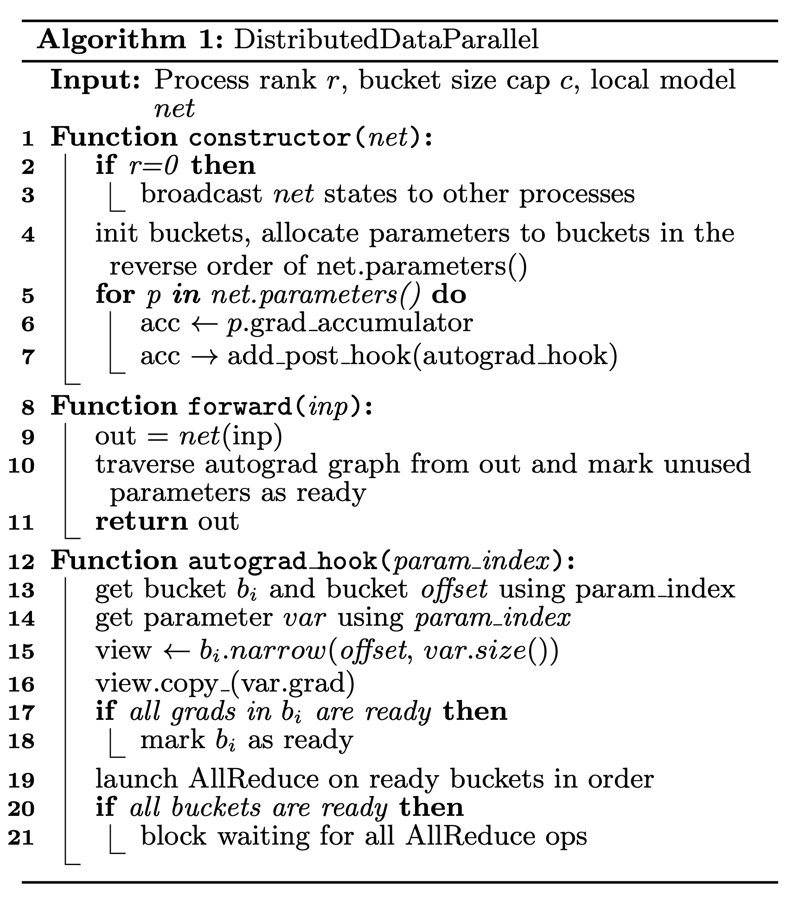

图 1。Pytorch DDP 的伪代码。（图片来源：[Li 等人 2021](https://arxiv.org/abs/2006.15704)）

## 模型并行

**模型并行（MP）** 旨在解决模型权重无法适应单个节点的情况。计算和模型参数被分割到多台机器上。与数据并行不同，其中每个工作人员托管整个模型的完整副本，MP 仅在一个工作人员上分配部分模型参数，因此内存使用和计算都减少了。

由于深度神经网络通常包含一堆垂直层，因此通过层来分割大型模型似乎很直接，其中一小组连续的层被分组到一个工作人员的一个分区中。然而，通过多个这样的工作人员运行每个数据批次的天真实现会导致等待时间的大量“气泡”和计算资源的严重低效利用。

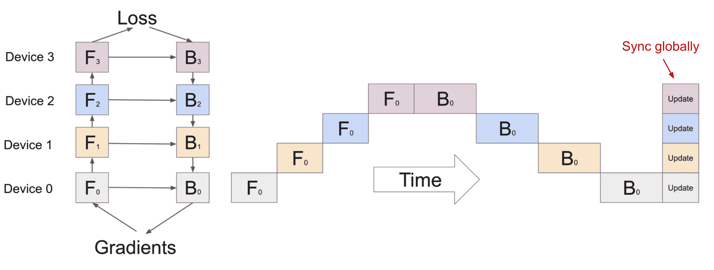

图 2。一个天真的模型并行设置，其中模型被垂直分割为 4 个分区。由于顺序依赖性，数据一次由一个工作人员处理，导致大量空闲时间的“气泡”。（图片来源：[Huang 等人 2019](https://arxiv.org/abs/1811.06965)）

## 管道并行

**管道并行（PP）** 将模型并行和数据并行结合起来，以减少低效的时间“气泡”。其主要思想是将一个小批量分成多个微批量，并使每个阶段的工作人员同时处理一个微批量。需要注意的是，每个微批量需要进行两次传递，一次前向传递和一次反向传递。工作人员之间的通信仅传输激活（前向）和梯度（反向）。这些传递如何安排以及梯度如何聚合在不同方法中有所不同。分区（工作人员）的数量也被称为*管道深度*。

在*GPipe*（[Huang 等人，2019](https://arxiv.org/abs/1811.06965)）中，来自多个微批次的梯度在最后同步聚合和应用。同步梯度下降保证了学习的一致性和效率，不受工作者数量的影响。如图 3 所示，泡沫仍然存在，但比图 2 中的要小得多。假设均匀分割的微批次数为$m$，分区数为$d$，假设每个微批次的前向和后向传递都需要一单位时间，泡沫的比例为：

$$ 1 - \frac{2md}{(2m + 2(d-1))d} = \frac{d-1}{m+d-1} $$

GPipe 论文观察到，如果微批次的数量大于分区数量的 4 倍以上 $m > 4d$（当应用激活重计算时），泡沫开销几乎可以忽略不计。

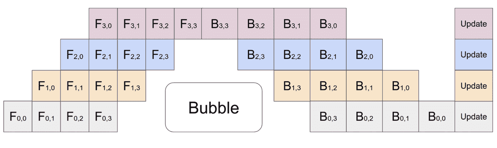

图 3。GPipe 中管道并行的示意图，有 4 个微批次和 4 个分区。GPipe 在每个批次结束时同步跨设备聚合和更新梯度。（图片来源：[Huang 等人，2019](https://arxiv.org/abs/1811.06965)）

GPipe 几乎实现了与设备数量成线性增长的吞吐量，尽管如果模型参数在工作者之间分布不均匀，则不能始终保证。

*PipeDream*（[Narayanan 等人，2019](https://cs.stanford.edu/~matei/papers/2019/sosp_pipedream.pdf)）安排每个工作者交替处理前向和后向传递（`1F1B`）。PipeDream 将每个模型分区命名为“阶段”，每个阶段工作者可以有多个副本来运行数据并行。在这个过程中，PipeDream 使用确定性的轮询负载平衡策略来分配工作在多个阶段的副本之间，以确保同一微批次的前向和后向传递发生在同一个副本上。

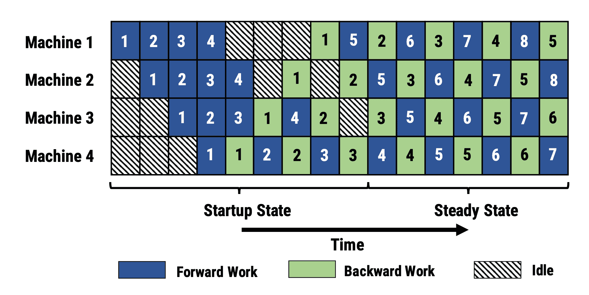

图 4。PipeDream 中`1F1B`微批次调度的示意图。（图片来源：[Harlap 等人，2018](https://arxiv.org/abs/1806.03377))

由于 PipeDream 没有跨所有工作者进行批次结束全局梯度同步，1F1B 的本地实现很容易导致一个微批次的前向和后向传递使用不同版本的模型权重，从而降低学习效率。PipeDream 提出了一些设计来解决这个问题：

+   *权重存储*：每个工作者跟踪几个模型版本，并确保在给定一个数据批次时，前向和后向传递中使用相同版本的权重。

+   *垂直同步*（可选）：模型权重的版本与阶段工作者之间的流动，连同激活和梯度一起。然后计算采用从上一个工作者传播的相应存储版本。这个过程保持了工作者之间的版本一致性。请注意，这是异步的，与 GPipe 不同。

在训练开始时，PipeDream 首先对模型中每个层的计算内存成本和时间进行分析，然后优化将层分割成阶段的解决方案，这是一个动态规划问题。

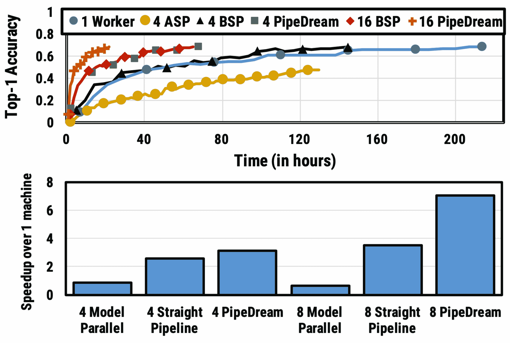

图 5. 在 ILSVRC12 上的 VGG16 结果。 （上）准确率 vs 时间。整数表示阶段工作者的数量。 ASP = 异步并行 & BSP = 批量同步并行。 （下）不同并行配置的训练时间加速。直线管道指的是没有数据并行的管道并行。 （图片来源：[Harlap 等人 2018](https://arxiv.org/abs/1806.03377)）

后来提出了 PipeDream 的两种变体，通过存储模型版本来减少内存占用（[Narayanan 等人 2021](https://arxiv.org/abs/2006.09503)）。

*PipeDream-flush* 定期添加全局同步的管道刷新，就像 GPipe 一样。这样一来，通过牺牲一点吞吐量，大大减少了内存占用（即只维护一个模型权重版本）。

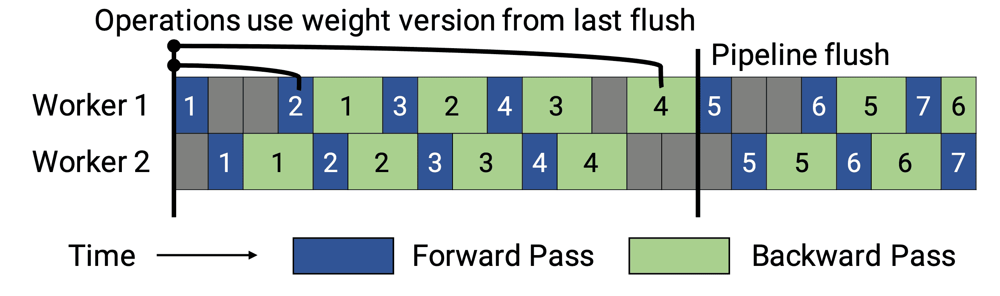

图 6. PipeDream-flush 中的管道调度示意图。 （图片来源：([Narayanan 等人 2021](https://arxiv.org/abs/2006.09503)）

*PipeDream-2BW* 仅维护两个版本的模型权重，其中“2BW” 是“双缓冲权重”的缩写。它每 $k$ 个微批次生成一个新的模型版本，$k$ 应该大于管道深度 $d$，$k > d$。由于一些残留的反向传播仍依赖于旧版本，新更新的模型版本不能立即完全替换旧版本。总共只需要保存两个版本，因此内存成本大大降低。

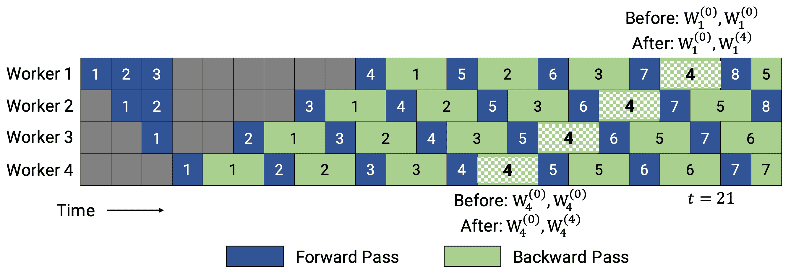

图 7. PipeDream-2BW 中的管道调度示意图。 （图片来源：([Narayanan 等人 2021](https://arxiv.org/abs/2006.09503)）

## 张量并行

模型和管道并行都是垂直拆分模型。另一方面，我们可以横向分割一个张量操作的计算到多个设备上，称为**张量并行（TP）**。

让我们以 transformer 为例，考虑到其受欢迎程度。transformer 模型主要由 MLP 层和自注意力块组成。*Megatron-LM*（[Shoeybi 等人 2020](https://arxiv.org/abs/1909.08053)）采用了一种简单的方式来并行化 MLP 和自注意力的层内计算。

一个 transformer 中的 MLP 层包含一个 GEMM（通用矩阵乘法），后跟一个非线性的 GeLU 转换。让我们按列拆分权重矩阵 $A$：

$$ \begin{aligned} \text{拆分 }A &= [A_1, A_2] \\ Y &=\text{GeLU}(XA) \\ [Y_1, Y_2] &= [\text{GeLU}(XA_1), \text{GeLU}(XA_2)] \end{aligned} $$

注意力块使用查询（$Q$）、键（$K$）和值（$V$）权重进行 GEMM 运算，根据上述分区并行运行，然后将它们与另一个 GEMM 结合以生成注意力头结果。

$$ \text{Attention}(X, Q, K, V) = \text{softmax}(\frac{(XQ) (XK)^\top}{\sqrt{d_k}}) XV $$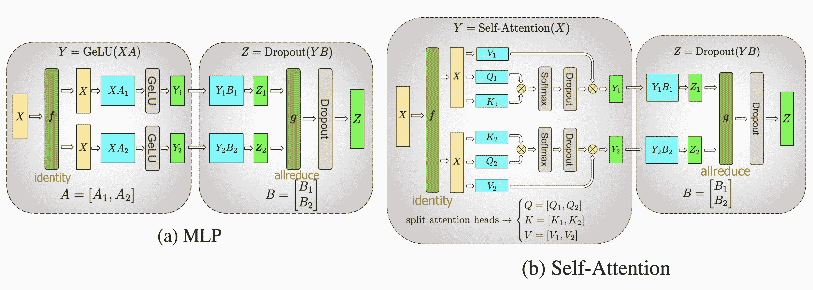

图 8. Megatron-LM 中提出的关键变压器组件的张量并行示意图。（图片来源：[Shoeybi 等人，2020](https://arxiv.org/abs/1909.08053)）

[Narayanan 等人（2021）](https://arxiv.org/abs/2104.04473)将管道、张量和数据并行与新的管道调度策略相结合，并将其方法命名为*PTD-P*。每个工作者不仅可以在设备上定位一组连续的层（“模型块”），而且还可以分配多个较小连续层子集的多个块（例如，设备 1 有层 1、2、9、10；设备 2 有层 3、4、11、12；每个有两个模型块）。一个批次中的微批次数量应该被工作者数量整除（$m % d = 0$）。如果每个工作者有$v$个模型块，与 GPipe 调度相比，管道气泡时间可以通过$v$的倍数减少。

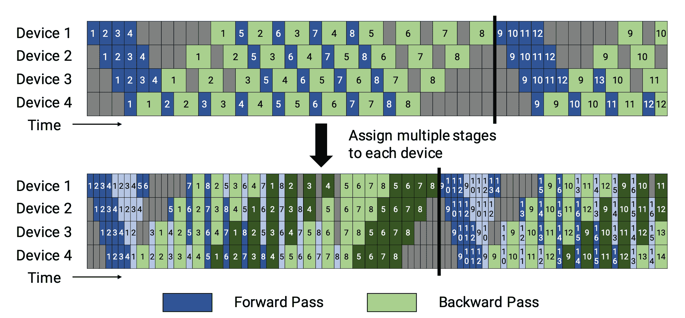

图 9.（顶部）PipeDream-flush 中的默认`1F1B`管道调度。（底部）交错的 1F1B 管道调度。第一个模型块为深色，第二个模块为浅色。（图片来源：[Narayanan 等人，202)](https://arxiv.org/abs/2104.04473)）

# 专家混合（MoE）

**专家混合（MoE）**方法最近吸引了很多关注，因为研究人员（主要来自谷歌）试图推动模型规模的极限。这个想法的核心是[集成学习](https://en.wikipedia.org/wiki/Ensemble_learning)：*多个弱学习器的组合会给你一个强学习器！*

在一个深度神经网络中，集成可以通过一个门控机制来实现，连接多个专家（[Shazeer 等人，2017](https://arxiv.org/abs/1701.06538)）。门控机制控制着网络的哪个子集（例如哪些专家）应该被激活以产生输出。该论文将其命名为“稀疏门控专家混合”（MoE）层。

精确地说，一个 MoE 层包含

+   $n$个前馈网络作为专家$\{E_i\}^n_{i=1}$

+   一个可训练的门控网络$G$，学习$n$个专家之间的概率分布，以便将流量路由到少数选定的专家。

根据门控输出，不必评估每个专家。当专家数量过多时，我们可以考虑使用两级分层 MoE。

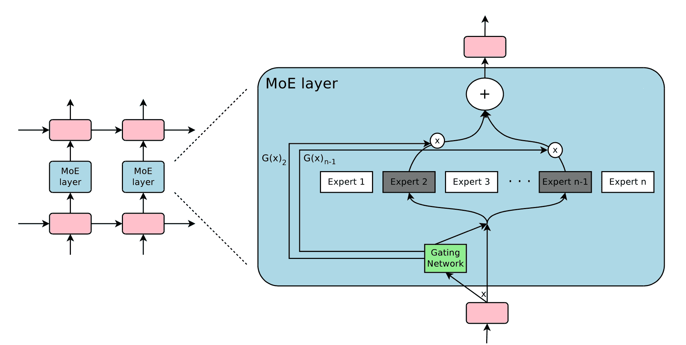

图 10. 专家混合（MoE）层的示意图。只有$n$个专家中的 2 个被门控网络选中并激活。（图片来源：[Shazeer 等人，2017](https://arxiv.org/abs/1701.06538)）

$G$的一个简单选择是将输入与可训练的权重矩阵$G_g$相乘，然后进行 softmax：$G_\sigma (x) = \text{softmax}(x W_g)$。然而，这会产生一个密集的控制向量用于门控，并且不会帮助节省计算资源，因为我们只有在$G^{(i)}(x)=0$时才需要评估一个专家。因此，MoE 层仅保留前$k$个值。它还向$G$中添加可调节的高斯噪声以改善负载平衡。这种机制称为*有噪声的 top-k 门控*。

$$ \begin{aligned} G(x) &= \text{softmax}( \text{topk}(H(x), k)) \\ H^{(i)}(x) &= (xW_g)^{(i)} + \epsilon \cdot \text{softplus}((xW_\text{noise})^{(i)} ); \quad \epsilon \sim \mathcal{N}(0, \mathbf{1}) \\ \text{topk}^{(i)}(v, k) &= \begin{cases} v^{(i)} & \text{if }v^{(i)}\text{ is in the top }k\text{ elements of }v \\ -\infty & \text{otherwise} \end{cases} \end{aligned} $$

其中上标$v^{(i)}$表示向量$v$的第 i 维。函数$\text{topk}(., k)$通过将其他维度设置为$-\infty$来选择具有最高值的前$k$个维度。

为了避免门控网络可能始终偏爱少数强专家的自我强化效应，[Shazeer 等人（2017）](https://arxiv.org/abs/1701.06538)提出了通过额外的重要性损失软约束来鼓励所有专家具有相同的权重。这等同于每个专家的批次平均值的[变异系数](https://en.wikipedia.org/wiki/Coefficient_of_variation)的平方。

$$ L_\text{aux} = w_\text{aux} \cdot \text{CV}(\sum_{x \in X} G(x))² $$

其中$\text{CV}$是变异系数，损失权重$w_\text{aux}$是一个需要调整的超参数。

由于每个专家网络只能获得训练样本的一部分（“缩小的批次问题”），我们应该尽量使用尽可能大的批次大小在 MoE 中。然而，这受限于 GPU 内存。数据并行和模型并行可以应用于提高吞吐量。

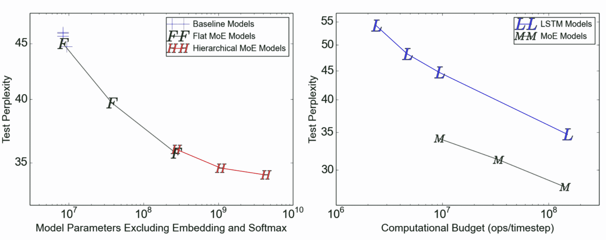

图 11\. 在 1 亿字语言建模基准测试中的测试困惑度。（左）模型容量从左到右增加，包含 4、32、256、256、1024 和 4096 个专家。（右）4 亿参数 MoE 模型的性能，是左图中最大的模型，在不同计算预算下的表现。（图片来源：[Shazeer et al., 2017](https://arxiv.org/abs/1701.06538)）

**GShard**（[Lepikhin et al., 2020](https://arxiv.org/abs/2006.16668)）通过分片将 MoE 变压器模型扩展到 6000 亿参数。MoE 变压器用 MoE 层替换每个其他前馈层。*分片 MoE 变压器*只在多台机器上分片 MoE 层，而其他层只是简单地复制。

有几种改进的设计用于 GShard 中的门控函数$G$：

+   *专家容量*：通过一个专家的令牌数量不应超过一个名为“专家容量”的阈值。如果一个令牌被路由到已达到容量的专家，该令牌将被标记为“溢出”，并且门控输出将更改为零向量。

+   *本地组调度*：令牌被均匀分成多个本地组，并在组级别上强制执行专家容量。

+   *辅助损失*：动机与原始 MoE 辅助损失类似。他们添加了一个辅助损失，以最小化路由到每个专家的数据比例的均方。

+   *随机路由*：以与其权重成比例的概率选择第二优秀的专家；否则，GShard 将遵循随机路由，以增加一些随机性。

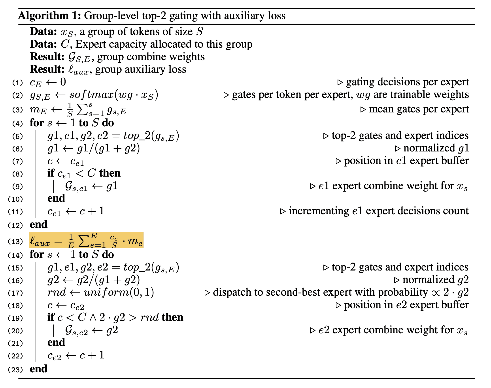

图 12. GShard 中带有辅助损失的组级前 2 门控机制的伪代码。（图片来源：[Lepikhin 等人，2020](https://arxiv.org/abs/2006.16668)）

**Switch Transformer**（[Fedus 等人，2021](https://arxiv.org/abs/2101.03961)）通过将密集前馈层替换为*稀疏开关 FFN 层*，将模型规模扩展到了数万亿个参数（!!）。在这种结构中，每个输入仅路由到*一个*专家网络。用于负载平衡的辅助损失为$\text{loss}_\text{aux} = w_\text{aux} \sum_{i=1}^n f_i p_i$，其中$n$为专家数量，$f_i$为路由到第$i$个专家的令牌比例，$p_i$为由门控网络预测的专家$i$的路由概率。

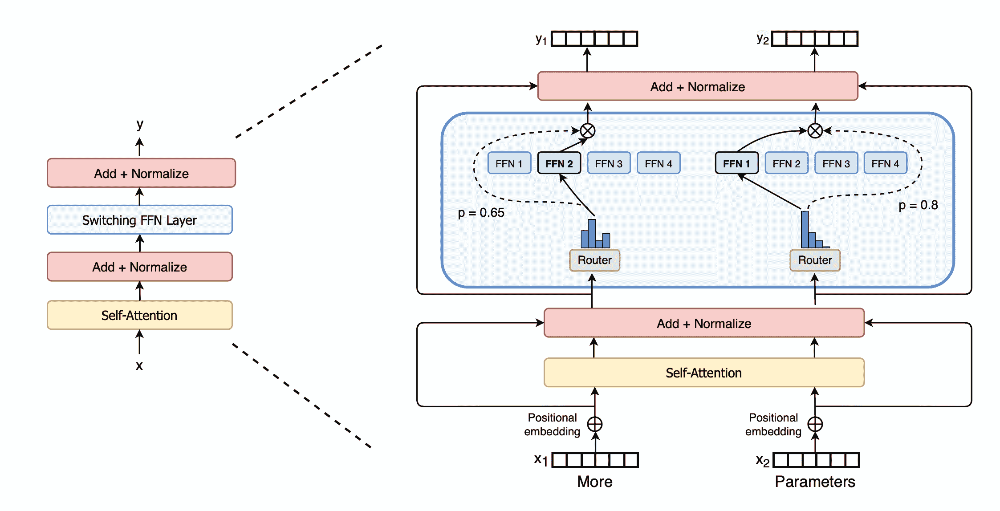

图 13. Switch Transformer。稀疏开关 FFN 层位于蓝色框中。（图片来源：[Fedus 等人，2021](https://arxiv.org/abs/2101.03961)）

为了提高训练稳定性，Switch Transformer 融入了以下设计：

+   *选择性精度*。他们表明，仅将模型的局部部分选择性地转换为 FP32 精度可以提高稳定性，同时避免 FP32 张量的昂贵通信成本。FP32 精度仅在路由器函数的主体中使用，并且结果被重新转换为 FP16。

+   *更小的初始化*。权重矩阵的初始化是从截断的正态分布中采样，均值为$\mu=0$，标准差为$\sigma = \sqrt{s/n}$。他们还建议将变压器初始化比例参数$s=1$减少到$s=0.1$。

+   *使用更高的专家丢弃率*。微调通常适用于小数据集。为避免过拟合，每个专家内的丢弃率增加了相当多。有趣的是，他们发现增加所有层的丢弃率会导致性能下降。在论文中，他们在非专家层使用了 0.1 的丢弃率，但在专家 FF 层内使用了 0.4 的丢弃率。

Switch Transformer 论文总结了用于训练大型模型的不同数据和模型并行策略，并配有一张精美的插图：

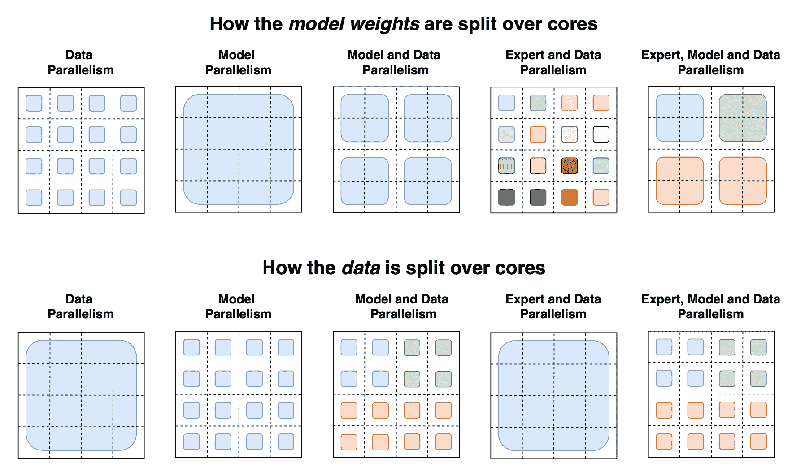

图 14. 各种并行策略的示意图，展示了如何（顶部）将模型权重和（底部）数据分割到多个 GPU 核心上。在顶部一行，每种颜色代表一个独特的权重矩阵。在底部一行，不同颜色表示不同的令牌集合。（图片来源：[Fedus 等人，2021](https://arxiv.org/abs/2101.03961)）

GShard top-2 和 Switch Transformer top-1 都依赖于*令牌选择*，其中每个令牌选择最佳的一个或两个专家进行路由。它们都采用辅助损失来鼓励更平衡的负载分配，但这并不保证最佳性能。此外，专家容量限制可能导致令牌浪费，因为如果专家达到其容量限制，这些令牌将被丢弃。

**导出选择（EC）**（[周等人，2022](https://arxiv.org/abs/2202.09368)）路由使每个专家选择前$k$个令牌。通过这种方式，每个专家自然保证了固定的容量，每个令牌可能被路由到多个专家。EC 可以实现完美的负载平衡，并且据显示可以将训练收敛速度提高 2 倍。

给定$e$个专家和输入矩阵$X \in \mathbb{R}^{n \times d}$，通过以下方式计算令牌与专家的关联分数：$$ S = \text{softmax}(X \cdot W_g), \text{其中 } W_g \in \mathbb{R}^{d \times e}, S \in \mathbb{R}^{n \times e} $$

令牌与专家的分配由三个矩阵表示，$I, G \in \mathbb{R}^{e\times k}$和$P \in \mathbb{R}^{e \times k \times n}$。$I[i,j]$注释第$i$个专家选择的第$j$个令牌。门控矩阵$G$存储所选令牌的路由权重。$P$是$I$的独热版本，用于生成门控 FFN 层的输入矩阵（$P \cdot X \in \mathbb{R}^{e \times k \times d}$）。$$ G, I = \text{top-k}(S^\top, k)\quad P = \text{one-hot}(I) $$

导出选择路由探索的一种正则化是限制每个令牌的最大专家数量。

$$ \begin{aligned} & \max_A \langle S^\top, A\rangle + \lambda H(A) \\ \text{s.t.} & \forall i: \sum_{j'} A[i, j'] = k,\quad \forall j: \sum_{i'} A[i', j] \leq b,\quad \forall i,j: 0 \leq A[i,j] \leq 1 \end{aligned} $$

其中矩阵$A \in \mathbb{R}^{e \times n}$中的每个条目$A[i,j]$标记第$i$个专家是否选择第$j$个令牌。解决这个问题并不容易。该论文使用[Dykstra 算法](https://projecteuclid.org/journals/annals-of-probability/volume-13/issue-3/An-Iterative-Procedure-for-Obtaining-I-Projections-onto-the-Intersection/10.1214/aop/1176992918.full)运行一系列多次迭代计算步骤。在实验中，限制专家选择会导致微调性能略微下降。

参数$k$由$k=nc/e$确定，其中$n$是一个批次中的总标记数，$c$是一个容量因子，表示一个标记平均使用的专家数量。在大多数实验中，论文使用$c=2$，但是$c=1$的 EC 仍然优于最佳的 top-1 标记选择门控。有趣的是，$c=0.5$只会轻微影响训练性能。

EC 的一个很大的缺点是，当批量大小太小时，它无法工作，也不适用于自回归文本生成，因为它需要知道未来的标记才能进行 top-$k$选择。

# 其他节省内存的设计

## CPU 卸载

当 GPU 内存已满时，一个选择是将暂时未使用的数据卸载到 CPU，并在以后需要时读取它们（[Rhu 等人，2016](https://arxiv.org/abs/1602.08124)）。**CPU 卸载**的想法很简单，但由于它带来的训练时间延迟，近年来变得不那么流行。

## 激活重新计算

**激活重新计算**（也称为“激活检查点”或“梯度检查点”；[Chen 等人，2016](https://arvix.org/abs/1604.06174)）是一种聪明而简单的想法，可以减少内存占用，但会增加计算时间。它将训练一个$\ell$层深度神经网络的内存成本降低到$O(\sqrt{\ell})$，每批次只额外消耗一个额外的前向传播计算。

假设我们将一个$\ell$层网络均匀分成$d$个分区。只有在分区边界处保存并在工作节点之间传递激活。在分区内层的中间激活仍然需要用于计算梯度，因此在反向传播期间重新计算。通过激活重新计算，训练$M(\ell)$的内存成本为：

$$ M(\ell) =\max_{i=1,\dots,k} \underbrace{\text{cost-of-one-partition}(i)}_\text{第 i 个分区的反向传播成本} + \underbrace{O(d)}_\text{存储中间输出} = O(\frac{\ell}{d}) + O(d) $$

最小成本为$d=\sqrt{\ell}$时的$O(\sqrt{\ell})$。

激活重新计算技巧可以相对于模型大小给出次线性的内存成本。

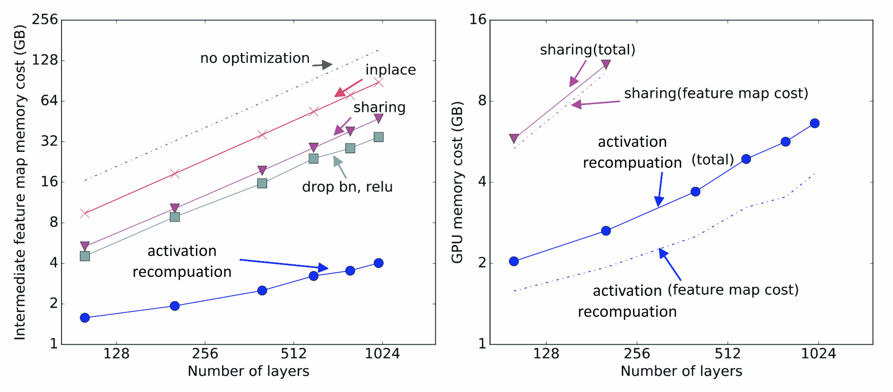

图 15\. 不同内存节省算法的内存成本。共享：当不再需要中间结果时，中间结果使用的内存被回收。原地：直接将输出保存到输入值的内存中。（图片来源：[Chen 等人，2016](https://arvix.org/abs/1604.06174)）

## 混合精度训练

[Narang & Micikevicius 等人（2018）](https://arxiv.org/abs/1710.03740)提出了一种使用半精度浮点（FP16）数字训练模型的方法，而不会丢失模型准确性。

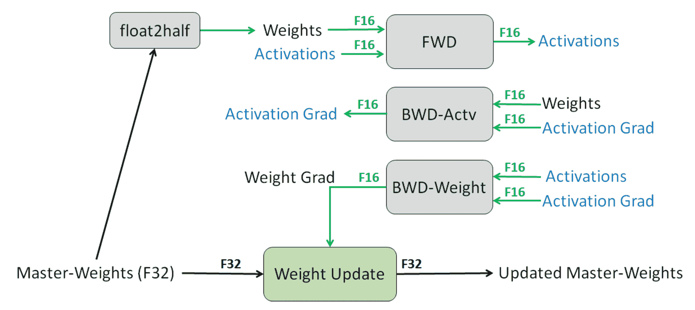

图 16\. 一个层的混合精度训练过程。（图片来源：[Narang & Micikevicius 等人，2018](https://arxiv.org/abs/1710.03740)）

避免在半精度下丢失关键信息的三种技术：

+   *完整精度的权重主副本*。维护一个完整精度（FP32）的模型权重副本，用于累积梯度。这些数字在前向和反向传递中被舍入为半精度。其动机是每次梯度更新（即梯度乘以学习率）可能太小，无法完全包含在 FP16 范围内（即 $2^{-24}$ 在 FP16 中变为零）。

+   *损失缩放*。将损失放大以更好地处理梯度幅度较小的情况（见图 16）。放大梯度有助于将它们移动到占据表示范围右侧（包含较大值）的较大部分，保留否则会丢失的值。

+   *算术精度*。对于常见的网络算术运算（例如向量点积，通过对向量元素求和来减少），我们可以在 FP32 中累积部分结果，然后在保存到内存之前将最终输出保存为 FP16。逐点操作可以在 FP16 或 FP32 中执行。

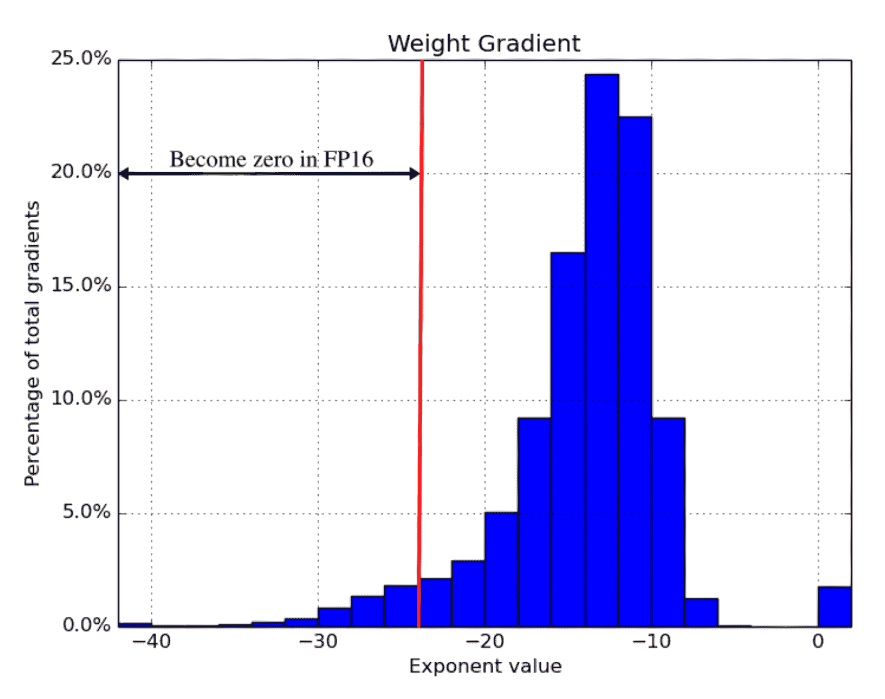

图 17\. 完整精度梯度的直方图。一旦模型切换到 FP16，左侧部分直到 $2^{-24}$ 将被清零。 （图片来源：[Narang & Micikevicius 等人，2018](https://arxiv.org/abs/1710.03740)）

在他们的实验中，某些网络（例如图像分类，Faster R-CNN）不需要损失缩放，但对于其他网络（例如 Multibox SSD，大型 LSTM 语言模型）则是必要的。

## 压缩

中间结果通常消耗大量内存，尽管它们只在一个前向传递和一个反向传递中需要。这两次使用之间存在明显的时间间隔。因此[Jain 等人（2018）](https://www.microsoft.com/en-us/research/uploads/prod/2018/04/fiddle-gist-isca18.pdf)提出了一种数据编码策略，在第一次使用后压缩中间结果，然后在后续的反向传播中解码回来。

他们的系统*Gist*包含两种编码方案：*特定层无损编码*；专注于 ReLU-Pool（“二值化”）和 ReLU-Conv（“稀疏存储和密集计算”）模式。*激进的有损编码*；使用延迟精度降低（DPR）。他们观察到，特征图的第一次即时使用应保持高精度，但第二次使用可以容忍较低精度。

实验表明，Gist 可以在 5 个 SOTA 图像分类 DNN 中将内存成本降低 2 倍，平均降低 1.8 倍，仅有 4% 的性能开销。

## 内存高效优化器

优化器对内存消耗渴望。以流行的 Adam 优化器为例，内部需要维护动量和方差，都与梯度和模型参数在相同的规模上。突然之间，我们需要保存模型权重的 4 倍内存。

已经提出了几种优化器来减少内存占用。例如，Adafactor（[Shazeer 等人 2018](https://arxiv.org/abs/1804.04235)）不像 Adam 那样存储完整的动量和变化，而是仅跟踪移动平均值的每行和每列总和，然后基于这些总和估计第二时刻。SM3（[Anil 等人 2019](https://arxiv.org/abs/1901.11150)）描述了一种不同的自适应优化方法，也大大减少了内存。

*ZeRO*（零冗余优化器；[Rajbhandari 等人 2019](https://arxiv.org/abs/1910.02054)）根据对大型模型训练的两个主要内存消耗的观察进行了优化：

1.  大部分被*模型状态*占据，包括优化器状态（例如 Adam 动量和方差）、梯度和参数。混合精度训练需要大量内存，因为优化器需要保留 FP32 参数和其他优化器状态的副本，除了 FP16 版本。

1.  剩余部分被激活、临时缓冲区和无法使用的碎片化内存（在论文中称为*残余状态*）消耗。

ZeRO 结合了两种方法，*ZeRO-DP*和*ZeRO-R*。ZeRO-DP 是一种增强的数据并行 ism，以避免模型状态上的简单冗余。它通过动态通信时间表将优化器状态、梯度和参数分区到多个数据并行进程中，以最小化通信量。ZeRO-R 通过使用分区激活重计算、恒定缓冲区大小和即时内存碎片整理来优化残余状态的内存消耗。

# 引用

引用为：

> Weng，Lilian。 （2021 年 9 月）。 如何在许多 GPU 上训练非常大的模型？ Lil’Log。 https://lilianweng.github.io/posts/2021-09-25-train-large/。

或

```py
@article{weng2021large,
  title   = "How to Train Really Large Models on Many GPUs?",
  author  = "Weng, Lilian",
  journal = "lilianweng.github.io",
  year    = "2021",
  month   = "Sep",
  url     = "https://lilianweng.github.io/posts/2021-09-25-train-large/"
} 
```

# 参考文献

[1] Li 等人。[“PyTorch 分布式：加速数据并行训练的经验”](https://arxiv.org/abs/2006.15704) VLDB 2020。

[2] Cui 等人。[“GeePS: 在分布式 GPU 上进行可扩展的深度学习，带有 GPU 专用参数服务器”](https://www.pdl.cmu.edu/PDL-FTP/CloudComputing/GeePS-cui-eurosys16.pdf) EuroSys 2016。

[3] Shoeybi 等人。[“Megatron-LM：使用模型并行 ism 训练多十亿参数语言模型。”](https://arxiv.org/abs/1909.08053) arXiv 预印本 arXiv:1909.08053（2019 年）。

[4] Narayanan 等人。[“在 GPU 集群上使用 Megatron-LM 进行高效的大规模语言模型训练。”](https://arxiv.org/abs/2104.04473) arXiv 预印本 arXiv:2104.04473（2021 年）。

[5] Huang 等人。[“GPipe: 使用管道并行性高效训练巨型神经网络。”](https://arxiv.org/abs/1811.06965) arXiv 预印本 arXiv:1811.06965（2018 年）。

[6] Narayanan 等人。[“PipeDream: 用于 DNN 训练的广义管道并行性。”](https://cs.stanford.edu/~matei/papers/2019/sosp_pipedream.pdf) SOSP 2019。

[7] Narayanan 等人。[“内存高效的管道并行 DNN 训练。”](https://arxiv.org/abs/2006.09503) ICML 2021。

[8] Shazeer 等人。[“稀疏门控专家混合层 Noam。”](https://arxiv.org/abs/1701.06538) arXiv 预印本 arXiv:1701.06538（2017 年）。

[9] Lepikhin 等人。[“GShard：使用条件计算和自动分片扩展巨型模型。”](https://arxiv.org/abs/2006.16668) arXiv 预印本 arXiv:2006.16668（2020 年）。

[10] Fedus 等人。[“Switch Transformers：使用简单高效的稀疏性扩展到万亿参数模型。”](https://arxiv.org/abs/2101.03961) arXiv 预印本 arXiv:2101.03961（2021 年）。

[11] Narang & Micikevicius 等人。[“混合精度训练。”](https://arxiv.org/abs/1710.03740) ICLR 2018。

[12] Chen 等人。2016 年[“使用次线性内存成本训练深度网络。”](https://arxiv.org/abs/1604.06174) arXiv 预印本 arXiv:1604.06174（2016 年）。

[13] Jain 等人。[“Gist：用于深度神经网络训练的高效数据编码。”](https://www.microsoft.com/en-us/research/uploads/prod/2018/04/fiddle-gist-isca18.pdf) ISCA 2018。

[14] Shazeer & Stern。[“Adafactor：具有次线性内存成本的自适应学习率。”](https://arxiv.org/abs/1804.04235) arXiv 预印本 arXiv:1804.04235（2018 年）。

[15] Anil 等人。[“内存高效的自适应优化。”](https://arxiv.org/abs/1901.11150) arXiv 预印本 arXiv:1901.11150（2019 年）。

[16] Rajbhandari 等人。[“ZeRO：面向训练万亿参数模型的内存优化 Samyam。”](https://arxiv.org/abs/1910.02054) arXiv 预印本 arXiv:1910.02054（2019 年）。

[17] Zhou 等人。[“具有专家选择路由的专家混合模型”](https://arxiv.org/abs/2202.09368) arXiv 预印本 arXiv:2202.09368（2022 年）。
