# 什么是扩散模型？

> 原文：[`lilianweng.github.io/posts/2021-07-11-diffusion-models/`](https://lilianweng.github.io/posts/2021-07-11-diffusion-models/)

[2021-09-19 更新：强烈推荐这篇关于[基于分数的生成建模](https://yang-song.github.io/blog/2021/score/) 的博文，作者是杨松（参考文献中几篇关键论文的作者）。

2022-08-27 更新：添加 [无分类器引导、GLIDE、unCLIP 和 Imagen。

2022-08-31 更新：添加 [潜在扩散模型。

到目前为止，我已经写了关于三种生成模型的文章，[GAN](https://lilianweng.github.io/posts/2017-08-20-gan/)、[VAE](https://lilianweng.github.io/posts/2018-08-12-vae/) 和 [基于流的](https://lilianweng.github.io/posts/2018-10-13-flow-models/) 模型。它们在生成高质量样本方面取得了巨大成功，但每种模型都有自己的局限性。GAN 模型以潜在不稳定的训练和生成中的多样性较少而闻名，因为它们的对抗性训练性质。VAE 依赖于替代损失。流模型必须使用专门的架构来构建可逆变换。

扩散模型受非平衡热力学启发。它们定义了一个扩散步骤的马尔可夫链，逐渐向数据添加随机噪声，然后学习逆转扩散过程以从噪声中构建所需的数据样本。与 VAE 或流模型不同，扩散模型是通过固定程序学习的，潜变量具有高维度（与原始数据相同）。

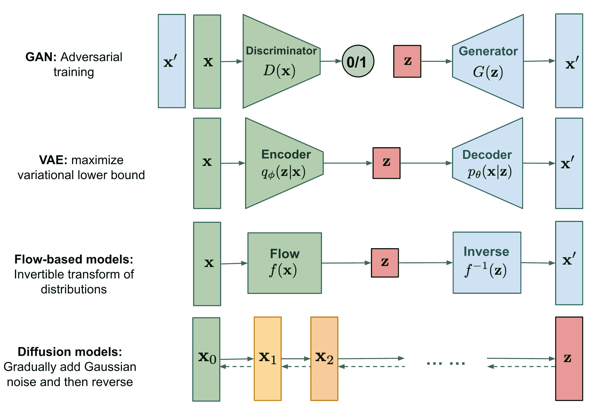

图 1\. 不同类型生成模型的概览。

# 什么是扩散模型？

已经提出了几种基于扩散的生成模型，其背后有类似的思想，包括 *扩散概率模型* ([Sohl-Dickstein et al., 2015](https://arxiv.org/abs/1503.03585))、*噪声条件评分网络* (**NCSN**; [Yang & Ermon, 2019](https://arxiv.org/abs/1907.05600)) 和 *去噪扩散概率模型* (**DDPM**; [Ho et al. 2020](https://arxiv.org/abs/2006.11239))。

## 正向扩散过程

给定从真实数据分布中采样的数据点 $\mathbf{x}_0 \sim q(\mathbf{x})$，让我们定义一个 *正向扩散过程*，在其中我们在 $T$ 步中向样本添加少量高斯噪声，产生一系列嘈杂样本 $\mathbf{x}_1, \dots, \mathbf{x}_T$。步长由方差调度 $\{\beta_t \in (0, 1)\}_{t=1}^T$ 控制。

$$ q(\mathbf{x}_t \vert \mathbf{x}_{t-1}) = \mathcal{N}(\mathbf{x}_t; \sqrt{1 - \beta_t} \mathbf{x}_{t-1}, \beta_t\mathbf{I}) \quad q(\mathbf{x}_{1:T} \vert \mathbf{x}_0) = \prod^T_{t=1} q(\mathbf{x}_t \vert \mathbf{x}_{t-1}) $$

数据样本 $\mathbf{x}_0$ 随着步骤 $t$ 的增大逐渐失去其可区分特征。最终当 $T \to \infty$ 时，$\mathbf{x}_T$ 等同于各向同性高斯分布。

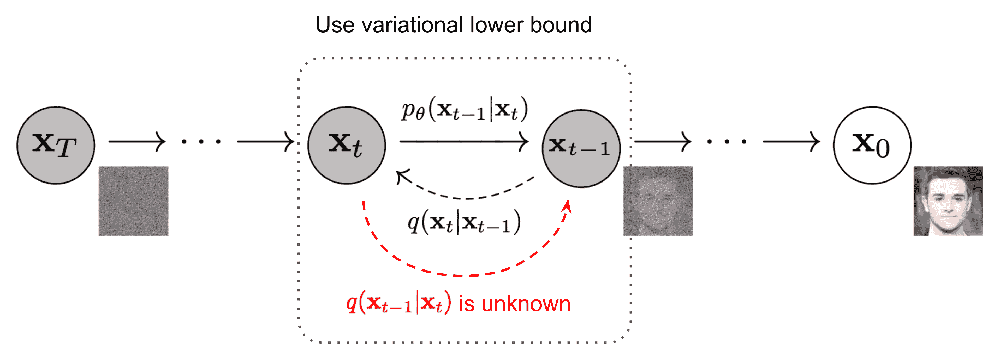

图 2\. 通过缓慢添加（移除）噪声生成样本的正向（反向）扩散过程的马尔可夫链。 (图片来源: [Ho et al. 2020](https://arxiv.org/abs/2006.11239) 并附有一些额外注释)

上述过程的一个很好的特性是，我们可以使用[重参数化技巧](https://lilianweng.github.io/posts/2018-08-12-vae/#reparameterization-trick)在任意时间步 $t$ 中以闭合形式对 $\mathbf{x}_t$ 进行采样。令 $\alpha_t = 1 - \beta_t$ 和 $\bar{\alpha}_t = \prod_{i=1}^t \alpha_i$：

$$ \begin{aligned} \mathbf{x}_t &= \sqrt{\alpha_t}\mathbf{x}_{t-1} + \sqrt{1 - \alpha_t}\boldsymbol{\epsilon}_{t-1} & \text{ ;其中 } \boldsymbol{\epsilon}_{t-1}, \boldsymbol{\epsilon}_{t-2}, \dots \sim \mathcal{N}(\mathbf{0}, \mathbf{I}) \\ &= \sqrt{\alpha_t \alpha_{t-1}} \mathbf{x}_{t-2} + \sqrt{1 - \alpha_t \alpha_{t-1}} \bar{\boldsymbol{\epsilon}}_{t-2} & \text{ ;其中 } \bar{\boldsymbol{\epsilon}}_{t-2} \text{ 合并了两个高斯分布 (*)} \\ &= \dots \\ &= \sqrt{\bar{\alpha}_t}\mathbf{x}_0 + \sqrt{1 - \bar{\alpha}_t}\boldsymbol{\epsilon} \\ q(\mathbf{x}_t \vert \mathbf{x}_0) &= \mathcal{N}(\mathbf{x}_t; \sqrt{\bar{\alpha}_t} \mathbf{x}_0, (1 - \bar{\alpha}_t)\mathbf{I}) \end{aligned} $$

(*) 回想一下，当我们合并两个具有不同方差的高斯分布，$\mathcal{N}(\mathbf{0}, \sigma_1²\mathbf{I})$ 和 $\mathcal{N}(\mathbf{0}, \sigma_2²\mathbf{I})$，新的分布是 $\mathcal{N}(\mathbf{0}, (\sigma_1² + \sigma_2²)\mathbf{I})$。这里合并后的标准差是 $\sqrt{(1 - \alpha_t) + \alpha_t (1-\alpha_{t-1})} = \sqrt{1 - \alpha_t\alpha_{t-1}$。

通常情况下，当样本变得更加嘈杂时，我们可以承受更大的更新步长，因此 $\beta_1 < \beta_2 < \dots < \beta_T$，因此 $\bar{\alpha}_1 > \dots > \bar{\alpha}_T$。

### 与随机梯度 Langevin 动力学的联系

Langevin 动力学是物理学中的一个概念，用于统计建模分子系统。结合随机梯度下降，*随机梯度 Langevin 动力学* ([Welling & Teh 2011](https://www.stats.ox.ac.uk/~teh/research/compstats/WelTeh2011a.pdf)) 可以仅使用梯度 $\nabla_\mathbf{x} \log p(\mathbf{x})$ 在更新的马尔可夫链中生成概率密度 $p(\mathbf{x})$ 的样本：

$$ \mathbf{x}_t = \mathbf{x}_{t-1} + \frac{\delta}{2} \nabla_\mathbf{x} \log p(\mathbf{x}_{t-1}) + \sqrt{\delta} \boldsymbol{\epsilon}_t ,\quad\text{其中 } \boldsymbol{\epsilon}_t \sim \mathcal{N}(\mathbf{0}, \mathbf{I}) $$

其中 $\delta$ 是步长。当 $T \to \infty, \epsilon \to 0$ 时，$\mathbf{x}_T$ 等于真实概率密度 $p(\mathbf{x})$。

与标准 SGD 相比，随机梯度 Langevin 动力学将高斯噪声注入参数更新中，以避免陷入局部最小值。

## 反向扩散过程

如果我们能够反转上述过程并从$q(\mathbf{x}_{t-1} \vert \mathbf{x}_t)$中采样，我们将能够从高斯噪声输入中重新创建真实样本，$\mathbf{x}_T \sim \mathcal{N}(\mathbf{0}, \mathbf{I})$。请注意，如果$\beta_t$足够小，$q(\mathbf{x}_{t-1} \vert \mathbf{x}_t)$也将是高斯的。不幸的是，我们无法轻松估计$q(\mathbf{x}_{t-1} \vert \mathbf{x}_t)$，因为它需要使用整个数据集，因此我们需要学习一个模型$p_\theta$来近似这些条件概率，以便运行*反向扩散过程*。

$$ p_\theta(\mathbf{x}_{0:T}) = p(\mathbf{x}_T) \prod^T_{t=1} p_\theta(\mathbf{x}_{t-1} \vert \mathbf{x}_t) \quad p_\theta(\mathbf{x}_{t-1} \vert \mathbf{x}_t) = \mathcal{N}(\mathbf{x}_{t-1}; \boldsymbol{\mu}_\theta(\mathbf{x}_t, t), \boldsymbol{\Sigma}_\theta(\mathbf{x}_t, t)) $$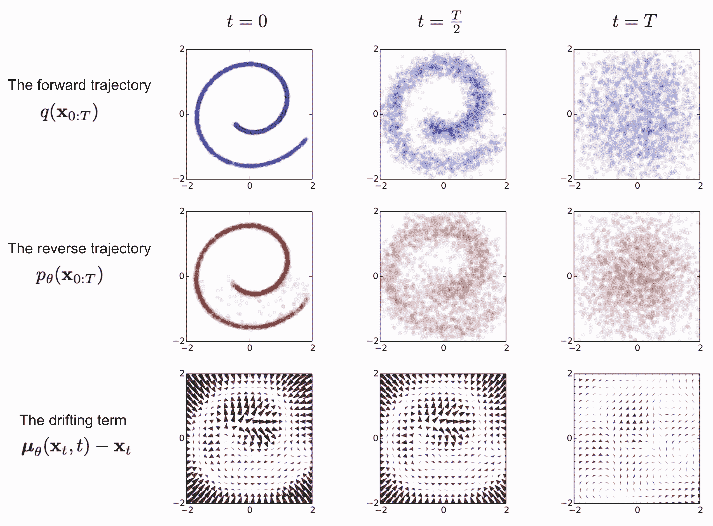

图 3。训练扩散模型以建模 2D 瑞士卷数据的示例。（图片来源：[Sohl-Dickstein 等人，2015](https://arxiv.org/abs/1503.03585)）

值得注意的是，当条件为$\mathbf{x}_0$时，反向条件概率是可计算的：

$$ q(\mathbf{x}_{t-1} \vert \mathbf{x}_t, \mathbf{x}_0) = \mathcal{N}(\mathbf{x}_{t-1}; \color{blue}{\tilde{\boldsymbol{\mu}}}(\mathbf{x}_t, \mathbf{x}_0), \color{red}{\tilde{\beta}_t} \mathbf{I}) $$

使用贝叶斯规则，我们有：

$$ \begin{aligned} q(\mathbf{x}_{t-1} \vert \mathbf{x}_t, \mathbf{x}_0) &= q(\mathbf{x}_t \vert \mathbf{x}_{t-1}, \mathbf{x}_0) \frac{ q(\mathbf{x}_{t-1} \vert \mathbf{x}_0) }{ q(\mathbf{x}_t \vert \mathbf}_0) } \\ &\propto \exp \Big(-\frac{1}{2} \big(\frac{(\mathbf{x}_t - \sqrt{\alpha_t} \mathbf{x}_{t-1})²}{\beta_t} + \frac{(\mathbf{x}_{t-1} - \sqrt{\bar{\alpha}_{t-1}} \mathbf{x}_0)²}{1-\bar{\alpha}_{t-1}} - \frac{(\mathbf{x}_t - \sqrt{\bar{\alpha}_t} \mathbf{x}_0)²}{1-\bar{\alpha}_t} \big) \Big) \\ &= \exp \Big(-\frac{1}{2} \big(\frac{\mathbf{x}_t² - 2\sqrt{\alpha_t} \mathbf{x}_t \color{blue}{\mathbf{x}_{t-1}} \color{black}{+ \alpha_t} \color{red}{\mathbf{x}_{t-1}²} }{\beta_t} + \frac{ \color{red}{\mathbf{x}_{t-1}²} \color{black}{- 2 \sqrt{\bar{\alpha}_{t-1}} \mathbf{x}_0} \color{blue}{\mathbf{x}_{t-1}} \color{black}{+ \bar{\alpha}_{t-1} \mathbf{x}_0²} }{1-\bar{\alpha}_{t-1}} - \frac{(\mathbf{x}_t - \sqrt{\bar{\alpha}_t} \mathbf{x}_0)²}{1-\bar{\alpha}_t} \big) \Big) \\ &= \exp\Big( -\frac{1}{2} \big( \color{red}{(\frac{\alpha_t}{\beta_t} + \frac{1}{1 - \bar{\alpha}_{t-1}})} \mathbf{x}_{t-1}² - \color{blue}{(\frac{2\sqrt{\alpha_t}}{\beta_t} \mathbf{x}_t + \frac{2\sqrt{\bar{\alpha}_{t-1}}}{1 - \bar{\alpha}_{t-1}} \mathbf{x}_0)} \mathbf{x}_{t-1} \color{black}{ + C(\mathbf{x}_t, \mathbf{x}_0) \big) \Big)} \end{aligned} $$

其中$C(\mathbf{x}_t, \mathbf{x}_0)$是一些不涉及$\mathbf{x}_{t-1}$的函数，细节被省略。根据标准高斯密度函数，均值和方差可以参数化如下（回想一下$\alpha_t = 1 - \beta_t$和$\bar{\alpha}_t = \prod_{i=1}^T \alpha_i$）：

$$ \begin{aligned} \tilde{\beta}_t &= 1/(\frac{\alpha_t}{\beta_t} + \frac{1}{1 - \bar{\alpha}_{t-1}}) = 1/(\frac{\alpha_t - \bar{\alpha}_t + \beta_t}{\beta_t(1 - \bar{\alpha}_{t-1})}) = \color{green}{\frac{1 - \bar{\alpha}_{t-1}}{1 - \bar{\alpha}_t} \cdot \beta_t} \\ \tilde{\boldsymbol{\mu}}_t (\mathbf{x}_t, \mathbf{x}_0) &= (\frac{\sqrt{\alpha_t}}{\beta_t} \mathbf{x}_t + \frac{\sqrt{\bar{\alpha}_{t-1} }}{1 - \bar{\alpha}_{t-1}} \mathbf{x}_0)/(\frac{\alpha_t}{\beta_t} + \frac{1}{1 - \bar{\alpha}_{t-1}}) \\ &= (\frac{\sqrt{\alpha_t}}{\beta_t} \mathbf{x}_t + \frac{\sqrt{\bar{\alpha}_{t-1} }}{1 - \bar{\alpha}_{t-1}} \mathbf{x}_0) \color{green}{\frac{1 - \bar{\alpha}_{t-1}}{1 - \bar{\alpha}_t} \cdot \beta_t} \\ &= \frac{\sqrt{\alpha_t}(1 - \bar{\alpha}_{t-1})}{1 - \bar{\alpha}_t} \mathbf{x}_t + \frac{\sqrt{\bar{\alpha}_{t-1}}\beta_t}{1 - \bar{\alpha}_t} \mathbf{x}_0\\ \end{aligned} $$

多亏了良好的性质，我们可以表示$\mathbf{x}_0 = \frac{1}{\sqrt{\bar{\alpha}_t}}(\mathbf{x}_t - \sqrt{1 - \bar{\alpha}_t}\boldsymbol{\epsilon}_t)$，将其代入上述方程式并得到：

$$ \begin{aligned} \tilde{\boldsymbol{\mu}}_t &= \frac{\sqrt{\alpha_t}(1 - \bar{\alpha}_{t-1})}{1 - \bar{\alpha}_t} \mathbf{x}_t + \frac{\sqrt{\bar{\alpha}_{t-1}}\beta_t}{1 - \bar{\alpha}_t} \frac{1}{\sqrt{\bar{\alpha}_t}}(\mathbf{x}_t - \sqrt{1 - \bar{\alpha}_t}\boldsymbol{\epsilon}_t) \\ &= \color{cyan}{\frac{1}{\sqrt{\alpha_t}} \Big( \mathbf{x}_t - \frac{1 - \alpha_t}{\sqrt{1 - \bar{\alpha}_t}} \boldsymbol{\epsilon}_t \Big)} \end{aligned} $$

如图 2 所示，这样的设置与[VAE](https://lilianweng.github.io/posts/2018-08-12-vae/)非常相似，因此我们可以使用变分下界来优化负对数似然。

$$ \begin{aligned} - \log p_\theta(\mathbf{x}_0) &\leq - \log p_\theta(\mathbf{x}_0) + D_\text{KL}(q(\mathbf{x}_{1:T}\vert\mathbf{x}_0) \| p_\theta(\mathbf{x}_{1:T}\vert\mathbf{x}_0) ) \\ &= -\log p_\theta(\mathbf{x}_0) + \mathbb{E}_{\mathbf{x}_{1:T}\sim q(\mathbf{x}_{1:T} \vert \mathbf{x}_0)} \Big[ \log\frac{q(\mathbf{x}_{1:T}\vert\mathbf{x}_0)}{p_\theta(\mathbf{x}_{0:T}) / p_\theta(\mathbf{x}_0)} \Big] \\ &= -\log p_\theta(\mathbf{x}_0) + \mathbb{E}_q \Big[ \log\frac{q(\mathbf{x}_{1:T}\vert\mathbf{x}_0)}{p_\theta(\mathbf{x}_{0:T})} + \log p_\theta(\mathbf{x}_0) \Big] \\ &= \mathbb{E}_q \Big[ \log \frac{q(\mathbf{x}_{1:T}\vert\mathbf{x}_0)}{p_\theta(\mathbf{x}_{0:T})} \Big] \\ \text{Let }L_\text{VLB} &= \mathbb{E}_{q(\mathbf{x}_{0:T})} \Big[ \log \frac{q(\mathbf{x}_{1:T}\vert\mathbf{x}_0)}{p_\theta(\mathbf{x}_{0:T})} \Big] \geq - \mathbb{E}_{q(\mathbf{x}_0)} \log p_\theta(\mathbf{x}_0) \end{aligned} $$

使用 Jensen 不等式也可以得到相同的结果。假设我们想要将交叉熵最小化作为学习目标，

$$ \begin{aligned} L_\text{CE} &= - \mathbb{E}_{q(\mathbf{x}_0)} \log p_\theta(\mathbf{x}_0) \\ &= - \mathbb{E}_{q(\mathbf{x}_0)} \log \Big( \int p_\theta(\mathbf{x}_{0:T}) d\mathbf{x}_{1:T} \Big) \\ &= - \mathbb{E}_{q(\mathbf{x}_0)} \log \Big( \int q(\mathbf{x}_{1:T} \vert \mathbf{x}_0) \frac{p_\theta(\mathbf{x}_{0:T})}{q(\mathbf{x}_{1:T} \vert \mathbf{x}_{0})} d\mathbf{x}_{1:T} \Big) \\ &= - \mathbb{E}_{q(\mathbf{x}_0)} \log \Big( \mathbb{E}_{q(\mathbf{x}_{1:T} \vert \mathbf{x}_0)} \frac{p_\theta(\mathbf{x}_{0:T})}{q(\mathbf{x}_{1:T} \vert \mathbf{x}_{0})} \Big) \\ &\leq - \mathbb{E}_{q(\mathbf{x}_{0:T})} \log \frac{p_\theta(\mathbf{x}_{0:T})}{q(\mathbf{x}_{1:T} \vert \mathbf{x}_{0})} \\ &= \mathbb{E}_{q(\mathbf{x}_{0:T})}\Big[\log \frac{q(\mathbf{x}_{1:T} \vert \mathbf{x}_{0})}{p_\theta(\mathbf{x}_{0:T})} \Big] = L_\text{VLB} \end{aligned} $$

为了将方程中的每一项转换为可解析计算的形式，该目标可以进一步重写为几个 KL 散度和熵项的组合（详细的逐步过程请参见[Sohl-Dickstein et al., 2015](https://arxiv.org/abs/1503.03585)中的附录 B）:

$$ \begin{aligned} L_\text{VLB} &= \mathbb{E}_{q(\mathbf{x}_{0:T})} \Big[ \log\frac{q(\mathbf{x}_{1:T}\vert\mathbf{x}_0)}{p_\theta(\mathbf{x}_{0:T})} \Big] \\ &= \mathbb{E}_q \Big[ \log\frac{\prod_{t=1}^T q(\mathbf{x}_t\vert\mathbf{x}_{t-1})}{ p_\theta(\mathbf{x}_T) \prod_{t=1}^T p_\theta(\mathbf{x}_{t-1} \vert\mathbf{x}_t) } \Big] \\ &= \mathbb{E}_q \Big[ -\log p_\theta(\mathbf{x}_T) + \sum_{t=1}^T \log \frac{q(\mathbf{x}_t\vert\mathbf{x}_{t-1})}{p_\theta(\mathbf{x}_{t-1} \vert\mathbf{x}_t)} \Big] \\ &= \mathbb{E}_q \Big[ -\log p_\theta(\mathbf{x}_T) + \sum_{t=2}^T \log \frac{q(\mathbf{x}_t\vert\mathbf{x}_{t-1})}{p_\theta(\mathbf{x}_{t-1} \vert\mathbf{x}_t)} + \log\frac{q(\mathbf{x}_1 \vert \mathbf{x}_0)}{p_\theta(\mathbf{x}_0 \vert \mathbf{x}_1)} \Big] \\ &= \mathbb{E}_q \Big[ -\log p_\theta(\mathbf{x}_T) + \sum_{t=2}^T \log \Big( \frac{q(\mathbf{x}_{t-1} \vert \mathbf{x}_t, \mathbf{x}_0)}{p_\theta(\mathbf{x}_{t-1} \vert\mathbf{x}_t)}\cdot \frac{q(\mathbf{x}_t \vert \mathbf{x}_0)}{q(\mathbf{x}_{t-1}\vert\mathbf{x}_0)} \Big) + \log \frac{q(\mathbf{x}_1 \vert \mathbf{x}_0)}{p_\theta(\mathbf{x}_0 \vert \mathbf{x}_1)} \Big] \\ &= \mathbb{E}_q \Big[ -\log p_\theta(\mathbf{x}_T) + \sum_{t=2}^T \log \frac{q(\mathbf{x}_{t-1} \vert \mathbf{x}_t, \mathbf{x}_0)}{p_\theta(\mathbf{x}_{t-1} \vert\mathbf{x}_t)} + \sum_{t=2}^T \log \frac{q(\mathbf{x}_t \vert \mathbf{x}_0)}{q(\mathbf{x}_{t-1} \vert \mathbf}_0)} + \log\frac{q(\mathbf{x}_1 \vert \mathbf}_0)}{p_\theta(\mathbf{x}_0 \vert \mathbf}_1)} \Big] \\ &= \mathbb{E}_q \Big[ -\log p_\theta(\mathbf{x}_T) + \sum_{t=2}^T \log \frac{q(\mathbf{x}_{t-1} \vert \mathbf}_t, \mathbf}_0)}{p_\theta(\mathbf{x}_{t-1} \vert\mathbf}_t)} + \log\frac{q(\mathbf{x}_T \vert \mathbf}_0)}{q(\mathbf{x}_1 \vert \mathbf}_0)} + \log \frac{q(\mathbf{x}_1 \vert \mathbf}_0)}{p_\theta(\mathbf{x}_0 \vert \mathbf}_1)} \Big]\\ &= \mathbb{E}_q \Big[ -\log p_\theta(\mathbf{x}_T) + \sum_{t=2}^T \log \frac{q(\mathbf{x}_{t-1} \vert \mathbf}_t, \mathbf}_0)}{p_\theta(\mathbf{x}_{t-1} \vert\mathbf}_t)} + \log\frac{q(\mathbf{x}_T \vert \mathbf}_0)}{q(\mathbf{x}_1 \vert \mathbf}_0)} + \log\frac{q(\mathbf{x}_1 \vert \mathbf}_0)}{p_\theta(\mathbf{x}_0 \vert \mathbf}_1)} \Big]\\ &= \mathbb{E}_q \Big[ \log\frac{q(\mathbf{x}_T \vert \mathbf}_0)}{p_\theta(\mathbf}_T)} + \sum_{t=2}^T \log \frac{q(\mathbf{x}_{t-1} \vert \mathbf}_t, \mathbf}_0)}{p_\theta(\mathbf{x}_{t-1} \vert\mathbf}_t)} - \log p_\theta(\mathbf{x}_0 \vert \mathbf}_1)} \Big] \\ &= \mathbb{E}_q [\underbrace{D_\text{KL}(q(\mathbf{x}_T \vert \mathbf}_0)}{p_\theta(\mathbf}_T))}_{L_T} + \sum_{t=2}^T \underbrace{D_\text{KL}(q(\mathbf{x}_{t-1} \vert \mathbf}_t, \mathbf}_0)}{p_\theta(\mathbf}_{t-1} \vert\mathbf}_t))}_{L_{t-1}} \underbrace{- \log p_\theta(\mathbf{x}_0 \vert \mathbf}_1)}{L_0} ] \end{aligned} $$

让我们分别标记变分下界损失中的每个组件：

$$ \begin{aligned} L_\text{VLB} &= L_T + L_{T-1} + \dots + L_0 \\ \text{where } L_T &= D_\text{KL}(q(\mathbf{x}_T \vert \mathbf{x}_0) \parallel p_\theta(\mathbf{x}_T)) \\ L_t &= D_\text{KL}(q(\mathbf{x}_t \vert \mathbf{x}_{t+1}, \mathbf{x}_0) \parallel p_\theta(\mathbf{x}_t \vert\mathbf{x}_{t+1})) \text{ for }1 \leq t \leq T-1 \\ L_0 &= - \log p_\theta(\mathbf{x}_0 \vert \mathbf{x}_1) \end{aligned} $$

$L_\text{VLB}$ 中的每个 KL 项（除了 $L_0$）都比较两个高斯分布，因此它们可以以[闭合形式](https://en.wikipedia.org/wiki/Kullback%E2%80%93Leibler_divergence#Multivariate_normal_distributions)计算。$L_T$ 是常数，在训练过程中可以忽略，因为 $q$ 没有可学习参数，$\mathbf{x}_T$ 是高斯噪声。[Ho 等人 2020](https://arxiv.org/abs/2006.11239) 使用一个单独的离散解码器来建模 $L_0$，该解码器源自 $\mathcal{N}(\mathbf{x}_0; \boldsymbol{\mu}_\theta(\mathbf{x}_1, 1), \boldsymbol{\Sigma}_\theta(\mathbf{x}_1, 1))。

## 用于训练损失的 $L_t$ 参数化

回想一下，我们需要学习一个神经网络来逼近逆扩散过程中的条件概率分布，$p_\theta(\mathbf{x}_{t-1} \vert \mathbf{x}_t) = \mathcal{N}(\mathbf{x}_{t-1}; \boldsymbol{\mu}_\theta(\mathbf{x}_t, t), \boldsymbol{\Sigma}_\theta(\mathbf{x}_t, t))$。我们希望训练 $\boldsymbol{\mu}_\theta$ 来预测 $\tilde{\boldsymbol{\mu}}_t = \frac{1}{\sqrt{\alpha_t}} \Big( \mathbf{x}_t - \frac{1 - \alpha_t}{\sqrt{1 - \bar{\alpha}_t}} \boldsymbol{\epsilon}_t \Big)$。因为在训练时 $\mathbf{x}_t$ 作为输入是可用的，我们可以重新参数化高斯噪声项，使其从输入 $\mathbf{x}_t$ 在时间步 $t$ 预测 $\boldsymbol{\epsilon}_t$：

$$ \begin{aligned} \boldsymbol{\mu}_\theta(\mathbf{x}_t, t) &= \color{cyan}{\frac{1}{\sqrt{\alpha_t}} \Big( \mathbf{x}_t - \frac{1 - \alpha_t}{\sqrt{1 - \bar{\alpha}_t}} \boldsymbol{\epsilon}_\theta(\mathbf{x}_t, t) \Big)} \\ \text{因此 }\mathbf{x}_{t-1} &= \mathcal{N}(\mathbf{x}_{t-1}; \frac{1}{\sqrt{\alpha_t}} \Big( \mathbf{x}_t - \frac{1 - \alpha_t}{\sqrt{1 - \bar{\alpha}_t}} \boldsymbol{\epsilon}_\theta(\mathbf{x}_t, t) \Big), \boldsymbol{\Sigma}_\theta(\mathbf{x}_t, t)) \end{aligned} $$

损失项 $L_t$ 被参数化以最小化与 $\tilde{\boldsymbol{\mu}}$ 的差异：

$$ \begin{aligned} L_t &= \mathbb{E}_{\mathbf{x}_0, \boldsymbol{\epsilon}} \Big[\frac{1}{2 \| \boldsymbol{\Sigma}_\theta(\mathbf{x}_t, t) \|²_2} \| \color{blue}{\tilde{\boldsymbol{\mu}}_t(\mathbf{x}_t, \mathbf{x}_0)} - \color{green}{\boldsymbol{\mu}_\theta(\mathbf{x}_t, t)} \|² \Big] \\ &= \mathbb{E}_{\mathbf{x}_0, \boldsymbol{\epsilon}} \Big[\frac{1}{2 \|\boldsymbol{\Sigma}_\theta \|²_2} \| \color{blue}{\frac{1}{\sqrt{\alpha_t}} \Big( \mathbf{x}_t - \frac{1 - \alpha_t}{\sqrt{1 - \bar{\alpha}_t}} \boldsymbol{\epsilon}_t \Big)} - \color{green}{\frac{1}{\sqrt{\alpha_t}} \Big( \mathbf{x}_t - \frac{1 - \alpha_t}{\sqrt{1 - \bar{\alpha}_t}} \boldsymbol{\boldsymbol{\epsilon}}_\theta(\mathbf{x}_t, t) \Big)} \|² \Big] \\ &= \mathbb{E}_{\mathbf{x}_0, \boldsymbol{\epsilon}} \Big[\frac{ (1 - \alpha_t)² }{2 \alpha_t (1 - \bar{\alpha}_t) \| \boldsymbol{\Sigma}_\theta \|²_2} \|\boldsymbol{\epsilon}_t - \boldsymbol{\epsilon}_\theta(\mathbf{x}_t, t)\|² \Big] \\ &= \mathbb{E}_{\mathbf{x}_0, \boldsymbol{\epsilon}} \Big[\frac{ (1 - \alpha_t)² }{2 \alpha_t (1 - \bar{\alpha}_t) \| \boldsymbol{\Sigma}_\theta \|²_2} \|\boldsymbol{\epsilon}_t - \boldsymbol{\epsilon}_\theta(\sqrt{\bar{\alpha}_t}\mathbf{x}_0 + \sqrt{1 - \bar{\alpha}_t}\boldsymbol{\epsilon}_t, t)\|² \Big] \end{aligned} $$

### 简化

根据经验，[Ho et al. (2020)](https://arxiv.org/abs/2006.11239)发现，训练扩散模型使用一个忽略加权项的简化目标效果更好：

$$ \begin{aligned} L_t^\text{simple} &= \mathbb{E}_{t \sim [1, T], \mathbf{x}_0, \boldsymbol{\epsilon}_t} \Big[\|\boldsymbol{\epsilon}_t - \boldsymbol{\epsilon}_\theta(\mathbf{x}_t, t)\|² \Big] \\ &= \mathbb{E}_{t \sim [1, T], \mathbf{x}_0, \boldsymbol{\epsilon}_t} \Big[\|\boldsymbol{\epsilon}_t - \boldsymbol{\epsilon}_\theta(\sqrt{\bar{\alpha}_t}\mathbf{x}_0 + \sqrt{1 - \bar{\alpha}_t}\boldsymbol{\epsilon}_t, t)\|² \Big] \end{aligned} $$

最终简单目标是：

$$ L_\text{simple} = L_t^\text{simple} + C $$

其中$C$是一个不依赖于$\theta$的常数。


图 4\. DDPM 中的训练和采样算法（图片来源：[Ho et al. 2020](https://arxiv.org/abs/2006.11239)）

### 噪声条件评分网络（NCSN）的连接

[Song & Ermon (2019)](https://arxiv.org/abs/1907.05600)提出了一种基于评分的生成建模方法，其中样本是通过使用评分匹配估计的数据分布梯度的 Langevin 动力学生成的。每个样本$\mathbf{x}$的密度概率的评分定义为其梯度$\nabla_{\mathbf{x}} \log q(\mathbf{x})$。训练一个评分网络$\mathbf{s}_\theta: \mathbb{R}^D \to \mathbb{R}^D$来估计它，$\mathbf{s}_\theta(\mathbf{x}) \approx \nabla_{\mathbf{x}} \log q(\mathbf{x})。

为了使其在深度学习环境中适用于高维数据，他们提出使用 *去噪分数匹配*（[Vincent, 2011](http://www.iro.umontreal.ca/~vincentp/Publications/smdae_techreport.pdf)）或 *切片分数匹配*（使用随机投影；[Song et al., 2019](https://arxiv.org/abs/1905.07088)）。去噪分数匹配向数据 $q(\tilde{\mathbf{x}} \vert \mathbf{x})$ 添加预先指定的小噪声，并用分数匹配估计 $q(\tilde{\mathbf{x}})$。

回顾 Langevin 动力学可以使用迭代过程中的分数 $\nabla_{\mathbf{x}} \log q(\mathbf{x})$ 从概率密度分布中采样数据点。

然而，根据流形假设，大多数数据预计会集中在低维流形中，即使观察到的数据可能看起来只是任意高维的。这对分数估计带来了负面影响，因为数据点无法覆盖整个空间。在数据密度较低的区域，分数估计不太可靠。通过向扰动数据分布添加一点高斯噪声，使其覆盖整个空间 $\mathbb{R}^D$，得分估计网络的训练变得更加稳定。[Song & Ermon (2019)](https://arxiv.org/abs/1907.05600) 通过用 *不同水平* 的噪声扰动数据并训练一个噪声条件的分数网络来 *联合* 估计不同噪声水平下所有扰动数据的分数。

增加噪声水平的时间表类似于前向扩散过程。如果我们使用扩散过程的注释，得分近似为 $\mathbf{s}_\theta(\mathbf{x}_t, t) \approx \nabla_{\mathbf{x}_t} \log q(\mathbf{x}_t)$。给定高斯分布 $\mathbf{x} \sim \mathcal{N}(\mathbf{\mu}, \sigma² \mathbf{I})$，我们可以将其密度函数的导数写为 $\nabla_{\mathbf{x}}\log p(\mathbf{x}) = \nabla_{\mathbf{x}} \Big(-\frac{1}{2\sigma²}(\mathbf{x} - \boldsymbol{\mu})² \Big) = - \frac{\mathbf{x} - \boldsymbol{\mu}}{\sigma²} = - \frac{\boldsymbol{\epsilon}}{\sigma}$ 其中 $\boldsymbol{\epsilon} \sim \mathcal{N}(\boldsymbol{0}, \mathbf{I})$。回顾 $q(\mathbf{x}_t \vert \mathbf{x}_0) \sim \mathcal{N}(\sqrt{\bar{\alpha}_t} \mathbf{x}_0, (1 - \bar{\alpha}_t)\mathbf{I})$ 因此，

$$ \mathbf{s}_\theta(\mathbf{x}_t, t) \approx \nabla_{\mathbf{x}_t} \log q(\mathbf{x}_t) = \mathbb{E}_{q(\mathbf{x}_0)} [\nabla_{\mathbf{x}_t} q(\mathbf{x}_t \vert \mathbf{x}_0)] = \mathbb{E}_{q(\mathbf{x}_0)} \Big[ - \frac{\boldsymbol{\epsilon}_\theta(\mathbf{x}_t, t)}{\sqrt{1 - \bar{\alpha}_t}} \Big] = - \frac{\boldsymbol{\epsilon}_\theta(\mathbf{x}_t, t)}{\sqrt{1 - \bar{\alpha}_t}} $$

## $\beta_t$ 的参数化

在[Ho et al. (2020)](https://arxiv.org/abs/2006.11239)中，前向方差被设置为一系列线性增加的常数，从 $\beta_1=10^{-4}$ 到 $\beta_T=0.02$。它们相对于归一化的图像像素值在 $[-1, 1]$ 之间是相对较小的。他们的实验中扩散模型展示了高质量的样本，但仍无法达到其他生成模型的竞争性模型对数似然。

[Nichol & Dhariwal (2021)](https://arxiv.org/abs/2102.09672) 提出了几种改进技术，以帮助扩散模型获得更低的负对数似然。其中一种改进是使用基于余弦的方差调度。调度函数的选择可以是任意的，只要它在训练过程中提供了接近线性的下降，并在 $t=0$ 和 $t=T$ 附近有微妙的变化。

$$ \beta_t = \text{clip}(1-\frac{\bar{\alpha}_t}{\bar{\alpha}_{t-1}}, 0.999) \quad\bar{\alpha}_t = \frac{f(t)}{f(0)}\quad\text{其中 }f(t)=\cos\Big(\frac{t/T+s}{1+s}\cdot\frac{\pi}{2}\Big)² $$

其中小偏移 $s$ 是为了防止 $\beta_t$ 在接近 $t=0$ 时过小。

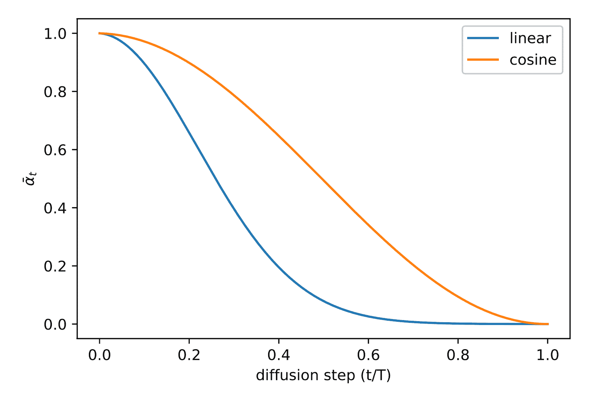

图 5. 在训练过程中比较 $\beta\_t$ 的线性和基于余弦的调度。（图片来源：[Nichol & Dhariwal, 2021](https://arxiv.org/abs/2102.09672)）

## 反向过程方差 $\boldsymbol{\Sigma}_\theta$ 的参数化

[Ho et al. (2020)](https://arxiv.org/abs/2006.11239) 选择将 $\beta_t$ 固定为常数，而不是使其可学习，并设置 $\boldsymbol{\Sigma}_\theta(\mathbf{x}_t, t) = \sigma²_t \mathbf{I}$，其中 $\sigma_t$ 不是可学习的，而是设置为 $\beta_t$ 或 $\tilde{\beta}_t = \frac{1 - \bar{\alpha}_{t-1}}{1 - \bar{\alpha}_t} \cdot \beta_t$。因为他们发现学习对角方差 $\boldsymbol{\Sigma}_\theta$ 会导致不稳定的训练和较差的样本质量。

[Nichol & Dhariwal (2021)](https://arxiv.org/abs/2102.09672) 提出学习 $\boldsymbol{\Sigma}_\theta(\mathbf{x}_t, t)$ 作为 $\beta_t$ 和 $\tilde{\beta}_t$ 之间的插值，通过模型预测一个混合向量 $\mathbf{v}$：

$$ \boldsymbol{\Sigma}_\theta(\mathbf{x}_t, t) = \exp(\mathbf{v} \log \beta_t + (1-\mathbf{v}) \log \tilde{\beta}_t) $$

但是，简单的目标函数 $L_\text{simple}$ 不依赖于 $\boldsymbol{\Sigma}_\theta$ 。为了增加依赖性，他们构建了一个混合目标函数 $L_\text{hybrid} = L_\text{simple} + \lambda L_\text{VLB}$，其中 $\lambda=0.001$ 很小，并在 $L_\text{VLB}$ 项中停止 $\boldsymbol{\mu}_\theta$ 的梯度，使得 $L_\text{VLB}$ 只引导 $\boldsymbol{\Sigma}_\theta$ 的学习。实证上，他们观察到 $L_\text{VLB}$ 很难优化，可能是由于梯度噪声，因此他们建议使用时间平均平滑版本的 $L_\text{VLB}$ 进行重要性采样。

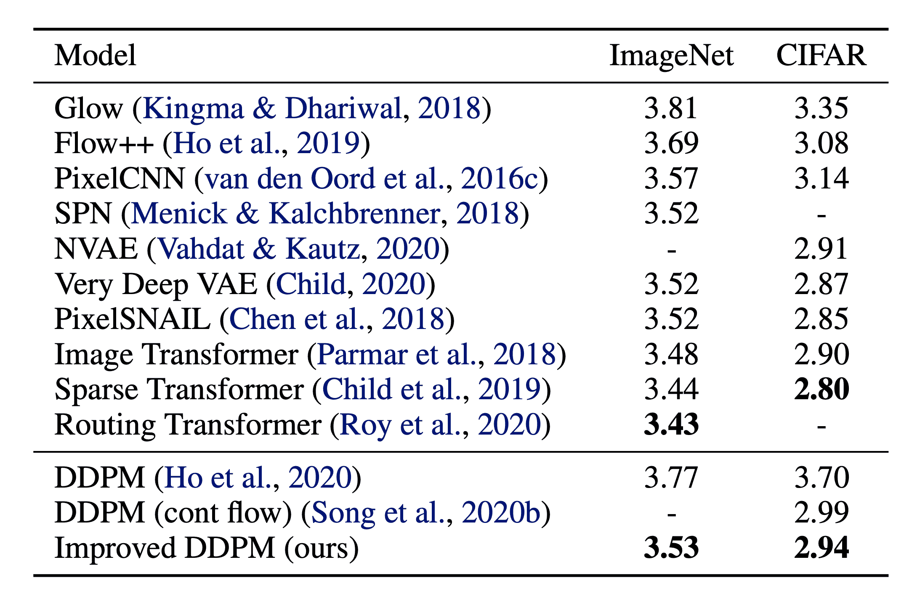

图 6\. 改进的 DDPM 与其他基于似然的生成模型的负对数似然度比较。NLL 以 bits/dim 为单位报告。（图片来源：[Nichol & Dhariwal, 2021](https://arxiv.org/abs/2102.09672)）

# 加速扩散模型采样

沿着逆扩散过程的马尔可夫链生成 DDPM 的样本非常缓慢，因为 $T$ 可以达到一千步甚至更多。来自 [Song 等人 2020](https://arxiv.org/abs/2010.02502) 的一条数据： “例如，从 DDPM 生成尺寸为 32 × 32 的 50k 张图像大约需要 20 小时，但从 Nvidia 2080 Ti GPU 上的 GAN 中生成这些图像不到一分钟。”

一种简单的方法是通过运行分层采样计划 ([Nichol & Dhariwal, 2021](https://arxiv.org/abs/2102.09672))，每 $\lceil T/S \rceil$ 步进行一次采样更新，将过程从 $T$ 减少到 $S$ 步。用于生成的新采样计划是 $\{\tau_1, \dots, \tau_S\}$，其中 $\tau_1 < \tau_2 < \dots <\tau_S \in [1, T]$，且 $S < T$。

对于另一种方法，让我们将 $q_\sigma(\mathbf{x}_{t-1} \vert \mathbf{x}_t, \mathbf{x}_0)$ 重新参数化为由所需标准差 $\sigma_t$ 参数化，根据 nice property：

$$ \begin{aligned} \mathbf{x}_{t-1} &= \sqrt{\bar{\alpha}_{t-1}}\mathbf{x}_0 + \sqrt{1 - \bar{\alpha}_{t-1}}\boldsymbol{\epsilon}_{t-1} \\ &= \sqrt{\bar{\alpha}_{t-1}}\mathbf{x}_0 + \sqrt{1 - \bar{\alpha}_{t-1} - \sigma_t²} \boldsymbol{\epsilon}_t + \sigma_t\boldsymbol{\epsilon} \\ &= \sqrt{\bar{\alpha}_{t-1}}\mathbf{x}_0 + \sqrt{1 - \bar{\alpha}_{t-1} - \sigma_t²} \frac{\mathbf{x}_t - \sqrt{\bar{\alpha}_t}\mathbf{x}_0}{\sqrt{1 - \bar{\alpha}_t}} + \sigma_t\boldsymbol{\epsilon} \\ q_\sigma(\mathbf{x}_{t-1} \vert \mathbf{x}_t, \mathbf{x}_0) &= \mathcal{N}(\mathbf{x}_{t-1}; \sqrt{\bar{\alpha}_{t-1}}\mathbf{x}_0 + \sqrt{1 - \bar{\alpha}_{t-1} - \sigma_t²} \frac{\mathbf{x}_t - \sqrt{\bar{\alpha}_t}\mathbf{x}_0}{\sqrt{1 - \bar{\alpha}_t}}, \sigma_t² \mathbf{I}) \end{aligned} $$

回想一下，在 $q(\mathbf{x}_{t-1} \vert \mathbf{x}_t, \mathbf{x}_0) = \mathcal{N}(\mathbf{x}_{t-1}; \tilde{\boldsymbol{\mu}}(\mathbf{x}_t, \mathbf{x}_0), \tilde{\beta}_t \mathbf{I)$ 中，因此我们有：

$$ \tilde{\beta}_t = \sigma_t² = \frac{1 - \bar{\alpha}_{t-1}}{1 - \bar{\alpha}_t} \cdot \beta_t $$

让 $\sigma_t² = \eta \cdot \tilde{\beta}_t$，这样我们可以调整 $\eta \in \mathbb{R}^+$ 作为一个超参数来控制采样的随机性。特殊情况下的 $\eta = 0$ 使得采样过程 *确定性*。这样的模型被命名为 *去噪扩散隐式模型* (**DDIM**; [Song 等人，2020](https://arxiv.org/abs/2010.02502))。DDIM 具有相同的边际噪声分布，但将噪声确定地映射回原始数据样本。

在生成过程中，我们只对 $S$ 个扩散步骤 $\{\tau_1, \dots, \tau_S\}$ 进行采样，推断过程变为：

$$ q_{\sigma, \tau}(\mathbf{x}_{\tau_{i-1}} \vert \mathbf{x}_{\tau_t}, \mathbf{x}_0) = \mathcal{N}(\mathbf{x}_{\tau_{i-1}}; \sqrt{\bar{\alpha}_{t-1}}\mathbf{x}_0 + \sqrt{1 - \bar{\alpha}_{t-1} - \sigma_t²} \frac{\mathbf{x}_{\tau_i} - \sqrt{\bar{\alpha}_t}\mathbf{x}_0}{\sqrt{1 - \bar{\alpha}_t}}, \sigma_t² \mathbf{I}) $$

在实验中，所有模型都是在 $T=1000$ 个扩散步骤下训练的，他们观察到当 $S$ 较小时，DDIM ($\eta=0$) 可以产生最高质量的样本，而当 $S$ 较小时，DDPM ($\eta=1$) 的表现要差得多。当我们能够运行完整的反向马尔可夫扩散步骤时 ($S=T=1000$)，DDPM 的表现更好。使用 DDIM，可以训练扩散模型达到任意数量的前向步骤，但在生成过程中只能从步骤的子集中进行采样。

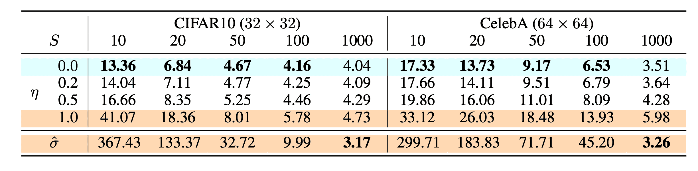

图 7\. CIFAR10 和 CelebA 数据集上的扩散模型的 FID 分数，包括 $\color{cyan}{\text{DDIM}}$ ($\eta=0$) 和 $\color{orange}{\text{DDPM}}$ ($\hat{\sigma}$)。（图片来源：[Song 等人，2020](https://arxiv.org/abs/2010.02502)）

与 DDPM 相比，DDIM 能够：

1.  使用更少的步骤生成更高质量的样本。

1.  具有“一致性”属性，因为生成过程是确定性的，这意味着在相同潜变量条件下的多个样本应该具有相似的高级特征。

1.  由于一致性，DDIM 可以在潜变量中进行语义上有意义的插值。

*潜扩散模型* (**LDM**；[Rombach & Blattmann 等人，2022](https://arxiv.org/abs/2112.10752)) 在潜在空间而不是像素空间中运行扩散过程，使训练成本更低，推理速度更快。它受到这样的观察的启发，即图像的大多数位对感知细节有贡献，而在激进压缩后，语义和概念构成仍然存在。LDM 通过首先使用自动编码器去除像素级冗余，然后在学习到的潜变量上使用扩散过程来操作/生成语义概念，松散地分解了感知压缩和语义压缩。

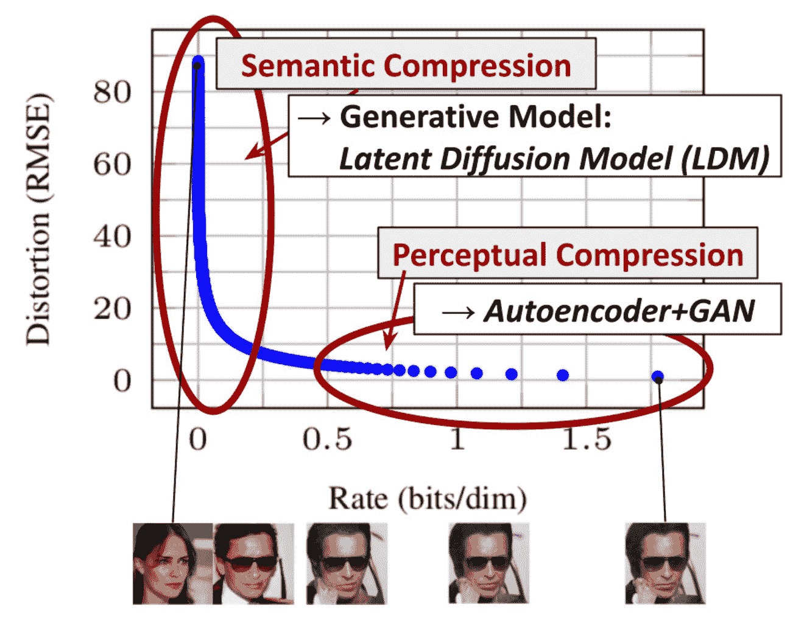

图 8\. 压缩率和失真之间的权衡图，说明两阶段压缩 - 感知和语义压缩。（图片来源：[Rombach & Blattmann 等人，2022](https://arxiv.org/abs/2112.10752)）

感知压缩过程依赖于自动编码器模型。使用编码器$\mathcal{E}$将输入图像$\mathbf{x} \in \mathbb{R}^{H \times W \times 3}$压缩为较小的 2D 潜在向量$\mathbf{z} = \mathcal{E}(\mathbf{x}) \in \mathbb{R}^{h \times w \times c}$，其中下采样率$f=H/h=W/w=2^m, m \in \mathbb{N}$。然后解码器$\mathcal{D}$从潜在向量重构图像，$\tilde{\mathbf{x}} = \mathcal{D}(\mathbf{z})。该论文探讨了自动编码器训练中两种正则化类型，以避免潜在空间中任意高方差。

+   KL-reg: 对学习到的潜在空间施加小的 KL 惩罚，使其接近标准正态分布，类似于[VAE](https://lilianweng.github.io/posts/2018-08-12-vae/)。

+   VQ-reg: 在解码器中使用向量量化层，类似于[VQVAE](https://lilianweng.github.io/posts/2018-08-12-vae/#vq-vae-and-vq-vae-2)，但量化层被解码器吸收。

扩散和去噪过程发生在潜在向量$\mathbf{z}$上。去噪模型是一个时间条件的 U-Net，增加了交叉注意力机制，用于处理图像生成的灵活条件信息（例如类标签、语义地图、图像的模糊变体）。该设计等同于使用交叉注意力机制将不同模态的表示融合到模型中。每种类型的条件信息都与特定领域的编码器$\tau_\theta$配对，将条件输入$y$投影到一个可以映射到交叉注意力组件的中间表示，$\tau_\theta(y) \in \mathbb{R}^{M \times d_\tau}$：

$$ \begin{aligned} &\text{注意力}(\mathbf{Q}, \mathbf{K}, \mathbf{V}) = \text{softmax}\Big(\frac{\mathbf{Q}\mathbf{K}^\top}{\sqrt{d}}\Big) \cdot \mathbf{V} \\ &\text{其中 }\mathbf{Q} = \mathbf{W}^{(i)}_Q \cdot \varphi_i(\mathbf{z}_i),\; \mathbf{K} = \mathbf{W}^{(i)}_K \cdot \tau_\theta(y),\; \mathbf{V} = \mathbf{W}^{(i)}_V \cdot \tau_\theta(y) \\ &\text{且 } \mathbf{W}^{(i)}_Q \in \mathbb{R}^{d \times d^i_\epsilon},\; \mathbf{W}^{(i)}_K, \mathbf{W}^{(i)}_V \in \mathbb{R}^{d \times d_\tau},\; \varphi_i(\mathbf{z}_i) \in \mathbb{R}^{N \times d^i_\epsilon},\; \tau_\theta(y) \in \mathbb{R}^{M \times d_\tau} \end{aligned} $$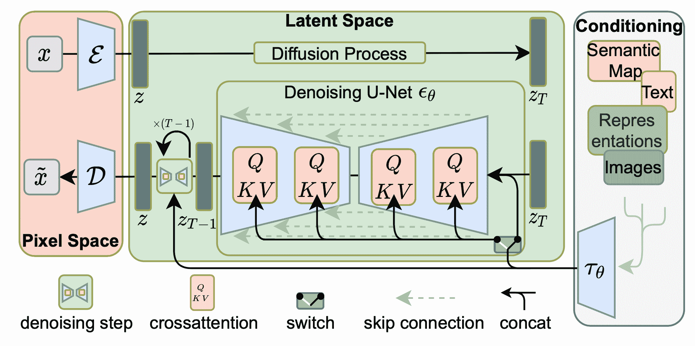

图 9\. 潜在扩散模型的架构。（图片来源：[Rombach & Blattmann, et al. 2022](https://arxiv.org/abs/2112.1075)）

# 条件生成

在对带有条件信息（例如 ImageNet 数据集）的图像进行生成模型训练时，通常会生成受类标签或一段描述性文本约束的样本。

## 分类器引导的扩散

为了明确将类信息纳入扩散过程中，[Dhariwal & Nichol (2021)](https://arxiv.org/abs/2105.05233) 在嘈杂图像 $\mathbf{x}_t$ 上训练了一个分类器 $f_\phi(y \vert \mathbf{x}_t, t)$ 并使用梯度 $\nabla_\mathbf{x} \log f_\phi(y \vert \mathbf{x}_t)$ 来引导扩散采样过程朝向条件信息 $y$（例如目标类标签），通过改变噪声预测。回顾 $\nabla_{\mathbf{x}_t} \log q(\mathbf{x}_t) = - \frac{1}{\sqrt{1 - \bar{\alpha}_t}} \boldsymbol{\epsilon}_\theta(\mathbf{x}_t, t)$，我们可以将联合分布 $q(\mathbf{x}_t, y)$ 的得分函数写成以下形式，

$$ \begin{aligned} \nabla_{\mathbf{x}_t} \log q(\mathbf{x}_t, y) &= \nabla_{\mathbf{x}_t} \log q(\mathbf{x}_t) + \nabla_{\mathbf{x}_t} \log q(y \vert \mathbf{x}_t) \\ &\approx - \frac{1}{\sqrt{1 - \bar{\alpha}_t}} \boldsymbol{\epsilon}_\theta(\mathbf{x}_t, t) + \nabla_{\mathbf{x}_t} \log f_\phi(y \vert \mathbf{x}_t) \\ &= - \frac{1}{\sqrt{1 - \bar{\alpha}_t}} (\boldsymbol{\epsilon}_\theta(\mathbf{x}_t, t) - \sqrt{1 - \bar{\alpha}_t} \nabla_{\mathbf{x}_t} \log f_\phi(y \vert \mathbf{x}_t)) \end{aligned} $$

因此，一个新的分类器引导的预测器 $\bar{\boldsymbol{\epsilon}}_\theta$ 将采取以下形式，

$$ \bar{\boldsymbol{\epsilon}}_\theta(\mathbf{x}_t, t) = \boldsymbol{\epsilon}_\theta(x_t, t) - \sqrt{1 - \bar{\alpha}_t} \nabla_{\mathbf{x}_t} \log f_\phi(y \vert \mathbf{x}_t) $$

要控制分类器指导的强度，我们可以向 delta 部分添加一个权重 $w$，

$$ \bar{\boldsymbol{\epsilon}}_\theta(\mathbf{x}_t, t) = \boldsymbol{\epsilon}_\theta(x_t, t) - \sqrt{1 - \bar{\alpha}_t} \; w \nabla_{\mathbf{x}_t} \log f_\phi(y \vert \mathbf{x}_t) $$

结果上 *消融扩散模型* (**ADM**) 和具有额外分类器指导的模型 (**ADM-G**) 能够比 SOTA 生成模型（如 BigGAN）取得更好的结果。

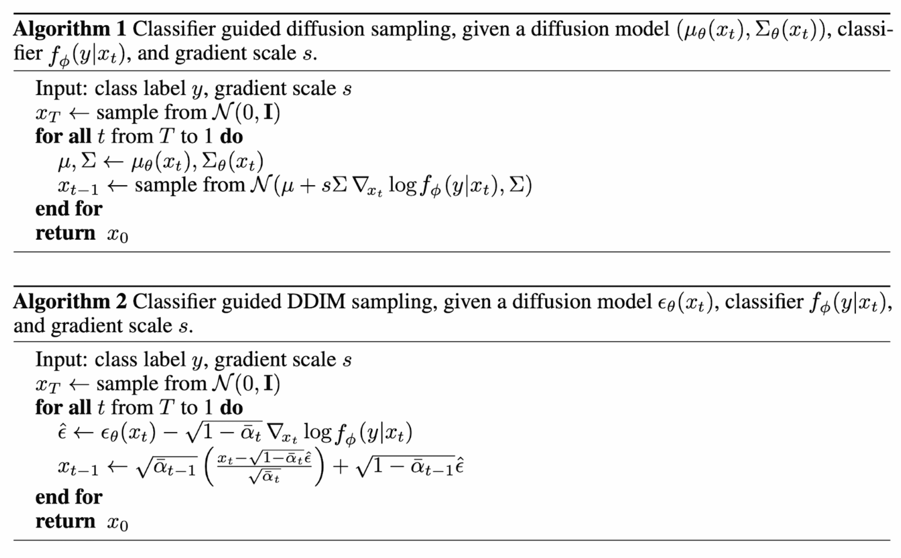

图 10\. 这些算法利用分类器的指导来运行带有 DDPM 和 DDIM 的条件生成。（图片来源：[Dhariwal & Nichol, 2021](https://arxiv.org/abs/2105.05233)])

此外，通过对 U-Net 架构进行一些修改，[Dhariwal & Nichol (2021)](https://arxiv.org/abs/2105.05233) 展示了比扩散模型的 GAN 性能更好的表现。架构修改包括更深/更宽的模型、更多的注意力头、多分辨率注意力、用于上/下采样的 BigGAN 残差块、通过 $1/\sqrt{2}$ 缩放的残差连接和自适应组归一化（AdaGN）。

## 无分类器引导

即使没有独立的分类器$f_\phi$，仍然可以通过将条件和无条件扩散模型的分数结合起来来运行条件扩散步骤（[Ho & Salimans，2021](https://openreview.net/forum?id=qw8AKxfYbI)）。让无条件去噪扩散模型$p_\theta(\mathbf{x})$通过分数估计器$\boldsymbol{\epsilon}_\theta(\mathbf{x}_t, t)$参数化，条件模型$p_\theta(\mathbf{x} \vert y)$通过$\boldsymbol{\epsilon}_\theta(\mathbf{x}_t, t, y)$参数化。这两个模型可以通过单个神经网络学习。具体来说，条件扩散模型$p_\theta(\mathbf{x} \vert y)$在配对数据$(\mathbf{x}, y)$上进行训练，其中条件信息$y$会定期随机丢弃，以便模型知道如何无条件地生成图像，即$\boldsymbol{\epsilon}_\theta(\mathbf{x}_t, t) = \boldsymbol{\epsilon}_\theta(\mathbf{x}_t, t, y=\varnothing)$。

隐式分类器的梯度可以用条件和无条件分数估计器表示。一旦插入到分类器引导的修改分数中，分数不再依赖于单独的分类器。

$$ \begin{aligned} \nabla_{\mathbf{x}_t} \log p(y \vert \mathbf{x}_t) &= \nabla_{\mathbf{x}_t} \log p(\mathbf{x}_t \vert y) - \nabla_{\mathbf{x}_t} \log p(\mathbf{x}_t) \\ &= - \frac{1}{\sqrt{1 - \bar{\alpha}_t}}\Big( \boldsymbol{\epsilon}_\theta(\mathbf{x}_t, t, y) - \boldsymbol{\epsilon}_\theta(\mathbf{x}_t, t) \Big) \\ \bar{\boldsymbol{\epsilon}}_\theta(\mathbf{x}_t, t, y) &= \boldsymbol{\epsilon}_\theta(\mathbf{x}_t, t, y) - \sqrt{1 - \bar{\alpha}_t} \; w \nabla_{\mathbf{x}_t} \log p(y \vert \mathbf{x}_t) \\ &= \boldsymbol{\epsilon}_\theta(\mathbf{x}_t, t, y) + w \big(\boldsymbol{\epsilon}_\theta(\mathbf{x}_t, t, y) - \boldsymbol{\epsilon}_\theta(\mathbf{x}_t, t) \big) \\ &= (w+1) \boldsymbol{\epsilon}_\theta(\mathbf{x}_t, t, y) - w \boldsymbol{\epsilon}_\theta(\mathbf{x}_t, t) \end{aligned} $$

他们的实验表明，无分类器引导可以在 FID（区分合成和生成图像）和 IS（质量和多样性）之间取得良好的平衡。

导向扩散模型 GLIDE（[Nichol, Dhariwal & Ramesh 等人，2022](https://arxiv.org/abs/2112.10741)）探索了两种引导策略，即 CLIP 引导和无分类器引导，并发现后者更受青睐。他们假设这是因为 CLIP 引导利用对抗样本朝向 CLIP 模型优化，而不是优化更匹配的图像生成。

# 扩大生成分辨率和质量

为了在高分辨率生成高质量图像，[Ho et al. (2021)](https://arxiv.org/abs/2106.15282)提出使用多个扩散模型的管道，分辨率逐渐增加。在管道模型之间的*噪声条件增强*对最终图像质量至关重要，即对每个超分辨率模型$p_\theta(\mathbf{x} \vert \mathbf{z})$的条件输入$\mathbf{z}$应用强数据增强。条件噪声有助于减少管道设置中的复合误差。*U-net*是扩散建模高分辨率图像生成中常见的模型架构选择。

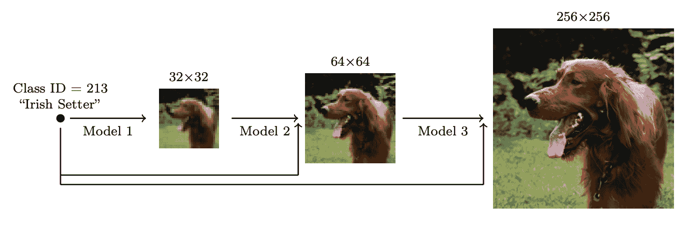

图 11\. 多个扩散模型的级联管道，分辨率逐渐增加。（图片来源：[Ho et al. 2021](https://arxiv.org/abs/2106.15282)）

他们发现最有效的噪声是在低分辨率时应用高斯噪声，在高分辨率时应用高斯模糊。此外，他们还探索了两种需要对训练过程进行小修改的条件增强形式。请注意，条件噪声仅应用于训练而不应用于推断。

+   截断条件增强在低分辨率时在步骤$t > 0$处提前停止扩散过程。

+   非截断条件增强运行完整的低分辨率反向过程直到步骤 0，但然后通过$\mathbf{z}_t \sim q(\mathbf{x}_t \vert \mathbf{x}_0)$来破坏它，然后将被破坏的$\mathbf{z}_t$输入到超分辨率模型中。

两阶段扩散模型**unCLIP**（[Ramesh et al. 2022](https://arxiv.org/abs/2204.06125)）大量利用 CLIP 文本编码器以产生高质量的文本引导图像。给定预训练的 CLIP 模型$\mathbf{c}$和扩散模型的配对训练数据，$(\mathbf{x}, y)$，其中$x$是图像，$y$是相应的标题，我们可以计算 CLIP 文本和图像嵌入，$\mathbf{c}^t(y)$和$\mathbf{c}^i(\mathbf{x})$。unCLIP 并行学习两个模型：

+   先验模型$P(\mathbf{c}^i \vert y)$：在给定文本$y$的情况下输出 CLIP 图像嵌入$\mathbf{c}^i$。

+   解码器$P(\mathbf{x} \vert \mathbf{c}^i, [y])$：在给定 CLIP 图像嵌入$\mathbf{c}^i$和可选的原始文本$y$的情况下生成图像$\mathbf{x}$。

这两个模型实现了条件生成，因为

$$ \underbrace{P(\mathbf{x} \vert y) = P(\mathbf{x}, \mathbf{c}^i \vert y)}_{\mathbf{c}^i\text{ is deterministic given }\mathbf{x}} = P(\mathbf{x} \vert \mathbf{c}^i, y)P(\mathbf{c}^i \vert y) $$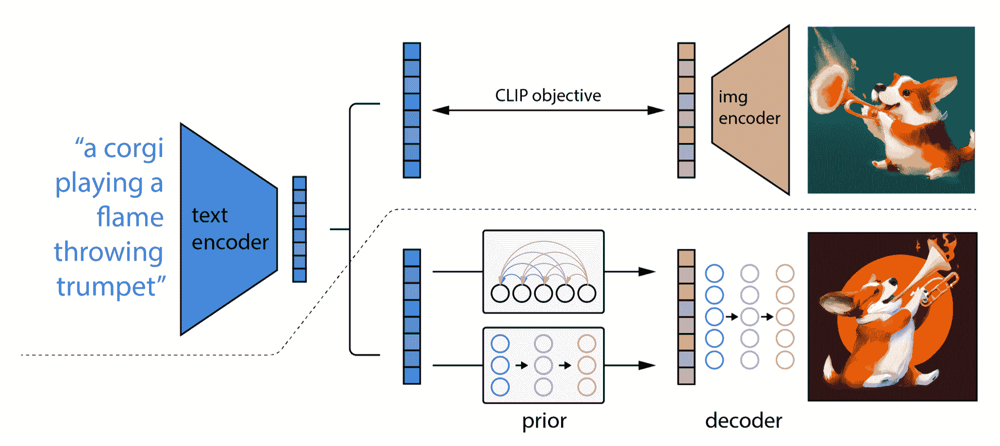

图 12\. unCLIP 的架构。（图片来源：[Ramesh et al. 2022](https://arxiv.org/abs/2204.06125)）

unCLIP 遵循两阶段图像生成过程：

1.  给定文本$y$，首先使用 CLIP 模型生成文本嵌入$\mathbf{c}^t(y)$。使用 CLIP 潜在空间通过文本实现零样本图像操作。

1.  一个扩散或自回归先验 $P(\mathbf{c}^i \vert y)$ 处理这个 CLIP 文本嵌入以构建图像先验，然后一个扩散解码器 $P(\mathbf{x} \vert \mathbf{c}^i, [y])$ 生成一个图像，条件是先验。这个解码器还可以生成基于图像输入的图像变化，保留其风格和语义。

**Imagen**（[Saharia 等人，2022](https://arxiv.org/abs/2205.11487)）使用一个预训练的大型 LM（即冻结的 T5-XXL 文本编码器）来对文本进行编码以生成图像，而不是 CLIP 模型。有一个普遍的趋势，即更大的模型尺寸可以带来更好的图像质量和文本-图像对齐。他们发现 T5-XXL 和 CLIP 文本编码器在 MS-COCO 上表现相似，但人类评估更喜欢 T5-XXL 在 DrawBench 上（一个涵盖 11 个类别的提示集合）的表现。

在应用无分类器指导时，增加 $w$ 可能会导致更好的图像-文本对齐，但会降低图像保真度。他们发现这是由于训练-测试不匹配，也就是说，因为训练数据 $\mathbf{x}$ 保持在范围 $[-1, 1]$ 内，测试数据也应该如此。引入了两种阈值策略：

+   静态阈值：将 $\mathbf{x}$ 预测剪切到 $[-1, 1]$

+   动态阈值：在每个采样步骤中，将 $s$ 计算为某个百分位绝对像素值；如果 $s > 1$，则将预测剪切到 $[-s, s]$ 并除以 $s$。

Imagen 修改了 U-net 中的几个设计，使其成为 *高效 U-Net*。

+   将模型参数从高分辨率块移动到低分辨率，通过为低分辨率添加更多的残差块；

+   将跳跃连接按 $1/\sqrt{2}$ 缩放

+   颠倒下采样（在卷积之前移动）和上采样操作（在卷积之后移动）的顺序，以提高前向传递的速度。

他们发现，噪声调节增强、动态阈值和高效的 U-Net 对图像质量至关重要，但是增加文本编码器的大小比 U-Net 的大小更重要。

# 快速总结

+   **优点**：在生成建模中，可追踪性和灵活性是两个相互冲突的目标。可追踪的模型可以通过分析评估和廉价地拟合数据（例如通过高斯或拉普拉斯）来描述数据中的结构，但它们不能轻松地描述丰富数据集中的结构。灵活的模型可以拟合数据中的任意结构，但通常评估、训练或从这些模型中采样是昂贵的。扩散模型既具有可追踪性又具有灵活性。

+   **缺点**：扩散模型依赖于长马尔可夫链的扩散步骤来生成样本，因此在时间和计算方面可能相当昂贵。已经提出了新的方法来加快这一过程，但采样速度仍然比 GAN 慢。

# 引用

引用为：

> Weng, Lilian.（2021 年 7 月）。什么是扩散模型？Lil’Log。https://lilianweng.github.io/posts/2021-07-11-diffusion-models/。

或

```py
@article{weng2021diffusion,
  title   = "What are diffusion models?",
  author  = "Weng, Lilian",
  journal = "lilianweng.github.io",
  year    = "2021",
  month   = "Jul",
  url     = "https://lilianweng.github.io/posts/2021-07-11-diffusion-models/"
} 
```

# 参考文献

[1] Jascha Sohl-Dickstein 等人的[“使用非平衡热力学的深度无监督学习。”](https://arxiv.org/abs/1503.03585) ICML 2015.

[2] Max Welling & Yee Whye Teh 的[“通过随机梯度朗维动力学进行贝叶斯学习。”](https://www.stats.ox.ac.uk/~teh/research/compstats/WelTeh2011a.pdf) ICML 2011.

[3] 杨松 & Stefano Ermon 的[“通过估计数据分布梯度进行生成建模。”](https://arxiv.org/abs/1907.05600) NeurIPS 2019.

[4] 杨松 & Stefano Ermon 的[“训练基于分数的生成模型的改进技术。”](https://arxiv.org/abs/2006.09011) NeuriPS 2020.

[5] Jonathan Ho 等人的[“去噪扩散概率模型。”](https://arxiv.org/abs/2006.11239) arxiv 预印本 arxiv:2006.11239 (2020). [[代码](https://github.com/hojonathanho/diffusion)]

[6] Jiaming Song 等人的[“去噪扩散隐式模型。”](https://arxiv.org/abs/2010.02502) arxiv 预印本 arxiv:2010.02502 (2020). [[代码](https://github.com/ermongroup/ddim)]

[7] Alex Nichol & Prafulla Dhariwal 的[“改进的去噪扩散概率模型”](https://arxiv.org/abs/2102.09672) arxiv 预印本 arxiv:2102.09672 (2021). [[代码](https://github.com/openai/improved-diffusion)]

[8] Prafula Dhariwal & Alex Nichol 的[“扩散模型在图像合成上击败 GANs。”](https://arxiv.org/abs/2105.05233) arxiv 预印本 arxiv:2105.05233 (2021). [[代码](https://github.com/openai/guided-diffusion)]

[9] Jonathan Ho & Tim Salimans 的[“无分类器扩散引导。”](https://arxiv.org/abs/2207.12598) NeurIPS 2021 深度生成模型和下游应用研讨会。

[10] 杨松等人的[“通过随机微分方程进行基于分数的生成建模。”](https://openreview.net/forum?id=PxTIG12RRHS) ICLR 2021.

[11] Alex Nichol, Prafulla Dhariwal & Aditya Ramesh 等人的[“GLIDE: 通过文本引导扩散模型实现逼真图像生成和编辑。”](https://arxiv.org/abs/2112.10741) ICML 2022.

[12] Jonathan Ho 等人的[“级联扩散模型用于高保真度图像生成。”](https://arxiv.org/abs/2106.15282) J. Mach. Learn. Res. 23 (2022): 47-1.

[13] Aditya Ramesh 等人的[“具有 CLIP 潜变量的分层文本条件图像生成。”](https://arxiv.org/abs/2204.06125) arxiv 预印本 arxiv:2204.06125 (2022).

[14] Chitwan Saharia & William Chan 等人的[“具有深度语言理解的逼真文本到图像扩散模型。”](https://arxiv.org/abs/2205.11487) arxiv 预印本 arxiv:2205.11487 (2022).

[15] Rombach & Blattmann 等人的[“使用潜在扩散模型进行高分辨率图像合成。”](https://arxiv.org/abs/2112.10752) CVPR 2022.[代码](https://github.com/CompVis/latent-diffusion)
