# 减少语言模型中的毒性

> 原文：[`lilianweng.github.io/posts/2021-03-21-lm-toxicity/`](https://lilianweng.github.io/posts/2021-03-21-lm-toxicity/)

大型预训练[语言模型](https://lilianweng.github.io/posts/2019-01-31-lm/)是在大量在线数据集上训练的。它们不可避免地从互联网中获得某些有毒行为和偏见。预训练语言模型非常强大，在许多自然语言处理任务中取得了巨大成功。然而，要安全地将它们部署到实际的应用程序中，需要对模型生成过程进行严格的安全控制。

在减少各种类型不安全内容的努力中存在许多挑战：

+   首先，有各种类型的不安全内容，如毒性、辱骂、仇恨言论、偏见、刻板印象、网络欺凌、身份攻击等，可能需要不同的处理方式。

+   其次，在预训练语言模型中，对于不安全行为的分类和定义并没有明确且广泛达成一致。由于不同的社会背景，个人对此的看法可能会有很大差异。

在这篇文章中，我们深入探讨了语言模型中的毒性问题。由于我仍在努力找到有毒内容的明确定义，我在下面列出了一些文献中的定义。

> [[透视 API](https://support.perspectiveapi.com/s/about-the-api-attributes-and-languages)] 一种粗鲁、不尊重或不合理的评论；可能会导致人们离开讨论。
> 
> [[Kurita 等人 2019](https://arxiv.org/abs/1912.06872)] 可能会冒犯或伤害接收者的内容，包括仇恨言论、种族主义和冒犯性语言。
> 
> [[Pavlopoulos 等人 2020](https://arxiv.org/abs/2006.00998)] 我们使用“有毒”这个术语作为一个总称，但我们注意到文献中使用了几个术语来描述不同类型的有毒语言或相关现象：“冒犯性的”、“辱骂的”、“仇恨的”等等。

总的来说，毒性是一个广泛的术语，用来描述几种类型的不安全内容。本文中的方法可以应用于对毒性的某种形式的定义；例如，在为注释者提供的说明中呈现。如何正确定义毒性概念，从而收集准确的注释标签，超出了本文的范围。

# 有毒内容的分类

如何对有毒内容进行分类并不是一项简单的任务。哪些内容应被视为有毒，以及有哪些类型的有毒内容可能是非常主观的。对一个群体来说不具冒犯性的语言，对另一个群体可能看起来不合适。

一种流行的冒犯性语言分类是由[Zampieri 等人（2019）](https://arxiv.org/abs/1902.09666)提出的，这是一个考虑到冒犯类型和目标的三级分层分类法。基于这个分类法收集的冒犯性语言识别数据集(OLID)。

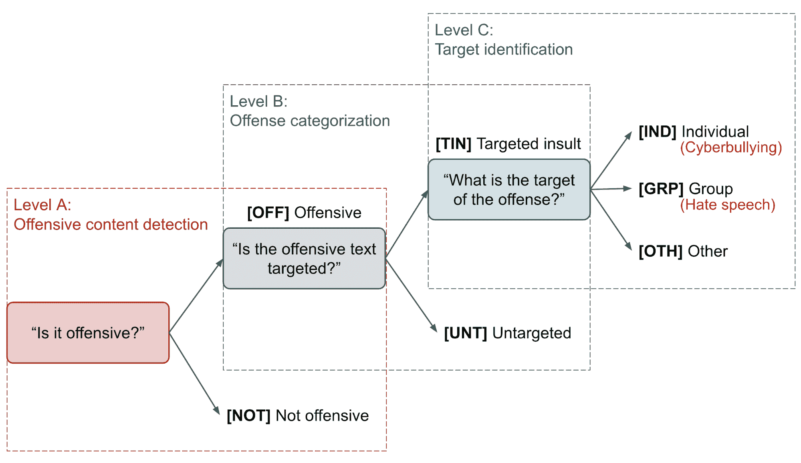

图 1。由[Zampieri 等人（2019）](https://arxiv.org/abs/1902.09666)提出的用于分类冒犯性语言的三级分层分类法。

+   A 级别：“它是否冒犯性的？”

    +   `[OFF]` 冒犯性：不当的语言、侮辱或威胁。

    +   `[NOT]` 非冒犯性：没有冒犯或亵渎。

+   B 级别：“冒犯性文本是否有特定目标？”

    +   `[TIN]` 目标侮辱：针对个人、群体或其他目标的侮辱或威胁。

    +   `[UNT]` 未指定目标：非指定目标的亵渎和咒骂。

+   C 级别：目标是什么？

    +   `[IND]` 侮辱针对个人，通常被定义为“网络欺凌”。

    +   `[GRP]` 侮辱针对一群人，基于种族、性别、性取向、宗教或其他共同特征，通常被定义为“仇恨言论”。

    +   `[OTH]` 目标可以属于其他类别，例如组织、事件、问题等。

# 数据收集

准备一个标记为“安全”与“不安全”的样本数据集是训练有毒语言分类器的基础，并进一步为模型排毒提供信号。

## 人工标注

[Vidgen & Derczynski（2020）](https://arxiv.org/abs/2004.01670)总结了高级别毒性检测训练数据注释可以通过以下方式收集：

1.  *专家编码*：专家具有足够的知识或培训来完成具有良好质量的注释任务，例如研究偏见的研究人员、具有适度培训水平的学生或自然语言处理从业者。成本更高，但产生高质量数据。

1.  *众包*：众包平台将大量非专家标注者与任务配对。扩展性更强，但需要更多关注质量控制。

1.  *专业主持人*：专业主持人经验丰富，接受过良好的培训，但他们的目标很可能是优化特定平台的输出。

1.  *合成数据*：培训数据集也可以由相关内容创作者手动创建，以涵盖各种有毒内容类型。

其中众包是最常见的方法（[Davidson 等人 2017](https://arxiv.org/abs/1703.04009)，[Zampieri 等人 2019](https://arxiv.org/abs/1902.09666)），并有几种良好的实践方法来提高数据质量：

1.  *测试数据*：从少数专家收集的一小部分注释可以用作测试问题（[Zampieri 等人 2019](https://arxiv.org/abs/1902.09666)），以筛选出在众包平台上无法达到一定阈值的人工标注者。

1.  *明确指导方针*：详细说明对指导标注者产生一致的标签非常有用。没有任何指导方针，标注者被鼓励应用他们的个人看法，这可能会有问题，因为（1）有毒内容的主观解释在个体之间差异很大，（2）在没有任何指导方针的情况下标记某些类型的噪音，如讽刺和反讽，是棘手的。

1.  *多数投票*：很常见的是我们需要来自多个标注者的标签，并采取多数投票。

1.  *理解标注者的身份*：人口统计背景对标注者对任务的理解有很大影响。我们应该招募多样化和合格的标注者。

## 半监督数据集

[Khatri et al. (2018)](https://arxiv.org/abs/1811.12900)提出了一种简单的方法来为学习有毒内容分类器引导大量的半监督数据集。他们的方法依赖于一个小的带标注数据集和一个大型未标记数据集。

1.  首先，他们收集了一个包含 800+涵盖亵渎、仇恨、性内容和侮辱主题的黑名单词汇。亵渎词汇的黑名单可能具有高精度和低召回率，但它可以提供弱监督信号。

1.  子社区按照黑名单词汇的百分比进行排序。然后从顶部子社区中抽取敏感示例，从底部抽取非敏感示例。

1.  训练一个弱二元分类器，进一步从排序后的子社区中选择更多样本，

    +   敏感：包含黑名单词汇或有毒分类器置信度 > 0.8；

    +   非敏感：不包含黑名单词汇和有毒分类器置信度 < 0.3

1.  鉴于这个大规模扩展的数据集，训练一个名为“两阶段引导”（**TS bootstrap**）的新分类器。

他们的实验表明，TS 引导分类器在 F1 分数、准确率和召回率上取得了相当不错的成绩，而且还可以转移到领域外的测试数据。

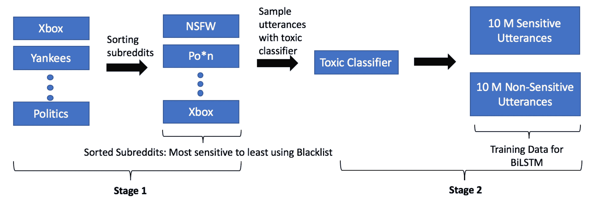

图 2。两阶段引导分类器是在 Reddit 数据上由一个弱有毒二元分类器引导的数据集上训练的。（图片来源：[Khatri et al. 2018](https://arxiv.org/abs/1811.12900)）

SOLID（半监督攻击性语言识别数据集；[Rosenthal et al. 2020](https://arxiv.org/abs/2004.14454)）包含了 9+百万条带有与 OLID 相同分类系统的标注推文。SOLID 将 OLID 视为种子，并通过一种名为**民主协同训练**的半监督技术扩展它。民主协同训练（[Zhou & Goldman, 2004](https://citeseerx.ist.psu.edu/viewdoc/download?doi=10.1.1.76.3152&rep=rep1&type=pdf)）通过由在小型监督数据集上训练的多样化模型提供的嘈杂标签创建一个大型数据集。SOLID 的构建方式包括：

1.  首先，在标记数据集 OLID 上训练一组多样化的监督模型。该论文尝试了 PMI（基于 n-gram 的相似性）、FastText（类似于 BoW 模型的浅层神经模型）、LSTM 和 BERT。

1.  对于未标记数据集中的每个样本，每个模型为目标类别预测一个置信度分数。通过`avg()`或`min()`来聚合分数。置信度高的样本被添加到数据集中。

当监督数据集对于简单任务足够大时，BERT 模型的性能不会提高，但如果原始监督数据集对于任务太小，则可以从一个大的半监督数据集中受益。

# 毒性检测

给定一个监督数据集，我们可以从头开始训练文本分类器，或微调预训练的语言模型来执行分类任务。但如果训练样本不好或不足够呢？如果我们无法访问这样的监督数据集呢？

## 对抗攻击

为了创建一个对抗攻击鲁棒的毒性检测模型，[Dinan 等人（2019）](https://arxiv.org/abs/1908.06083)提出了一种迭代的“**构建、破坏、修复**”策略，以提高对话系统与人类的安全性。

1.  *构建*：训练一个 BERT 模型来对 Jigsaw 数据集上的有毒评论进行分类。

1.  *破坏*：众包工作者被要求编写被模型错误标记为“安全”的有毒消息。

1.  *修复*：模型在原始数据集和新收集的对抗样本的组合上重新训练。

1.  *重复*：重新部署经过强化的模型，并从第 1 步开始重复一个新的轮次。

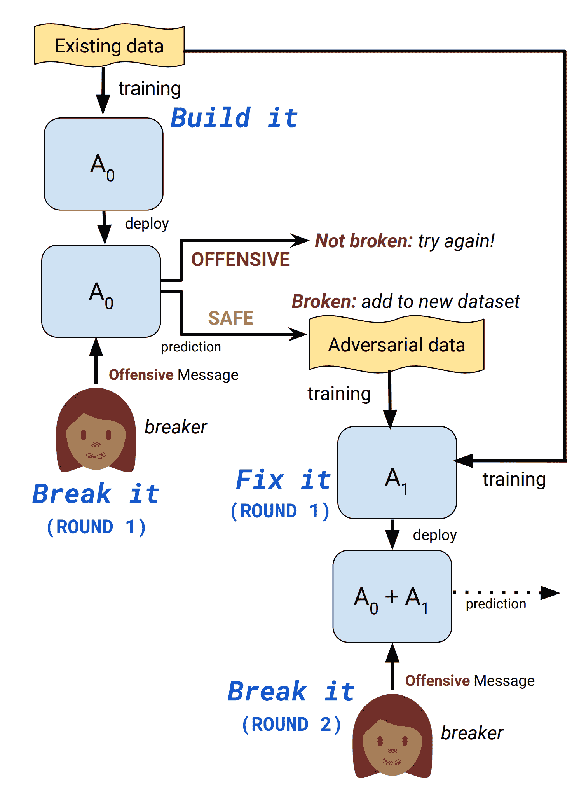

图 3。通过“构建、破坏、修复”过程迭代改进有毒内容检测模型的示意图。（图片来源：[Dinan 等人，2019](https://arxiv.org/abs/1908.06083)）

在他们的实验中，一个基线是在“破坏”步骤中用标准集合替换对抗集合，其中工作者被要求直接提交“冒犯性”消息。与标准集合相比，对抗集合中的明确粗话更少，更多的否定词来欺骗模型。随着轮次的增加，任务变得更具挑战性。

对抗模型比在标准集合上训练的基线模型更具抗干扰攻击的鲁棒性。第三轮对抗模型在标准任务上的表现比标准模型差，可能是由于过拟合。我很好奇如果模型同时在对抗和标准集合上训练，其性能会如何，但我在论文中没有找到相关内容。


图 4。在标准（$S\_i$）和对抗数据集合（$A\_i$）上训练的模型在标准和对抗任务上性能的比较。下标$i$表示训练轮次。（图片来源：[Dinan 等人，2019](https://arxiv.org/abs/1908.06083)）

另一种对抗攻击类型是通过替换或混淆字符子集来欺骗检测模型，使其错误地将有毒句子分类为安全。[Kurita 等人（2019）](https://arxiv.org/abs/1912.06872)开发了一种生成这种与模型无关的对抗攻击的方法，包括几种类型的字符级扰动：

1.  *字符混淆*：随机排列字符位置。

1.  *同形替换*：用看起来相似的国际字母替换一个或多个字母。

1.  *基于字典的近邻替换*：找到与 Levenshtein 距离最接近但不同的标记。

1.  *干扰注入*：通过重复随机选择的非毒性标记序列注入干扰标记。

将标记模糊和干扰标记结合的对抗性噪声会导致毒性分类器性能显著下降。字符级扰动比干扰标记更严重地降低了性能。

该论文提出了解决对抗攻击的两种方法：

+   *对抗训练*指的是在带有噪声的数据集上训练模型。然而，你需要提前了解入侵攻击的细节。并且不能保证训练样本带有任意噪声会推广到测试集。

+   *CDAE（上下文去噪自动编码器）*使用字符级和上下文信息去噪模糊标记。CDAE 采用噪声样本来预测去噪版本。但是，你需要知道可以应用哪些类型的字符级扰动来创建噪声样本。CDAE 的性能与 BERT 相当，但并没有显著更好。

## 透视 API

**透视 API**（[www.perspectiveapi.com](https://www.perspectiveapi.com/)）是最广泛使用的商业 API，用于检测有毒内容。透视训练机器学习模型，为几种不同的[属性](https://support.perspectiveapi.com/s/about-the-api-attributes-and-languages)提供分数：毒性、严重毒性、侮辱、亵渎、身份攻击、威胁和性暗示。每个分数是介于[0, 1]之间的数字，表示消息包含给定属性的可能性（即二元分类器的置信度），并不表示属性的严重程度。

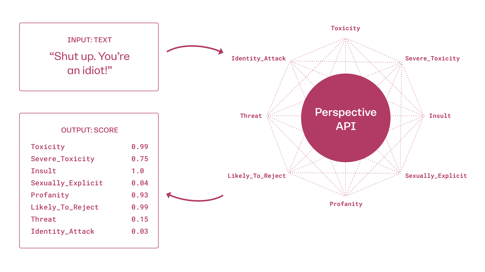

图 5。透视 API 分数概览。（图片来源：[关于透视 API](https://support.perspectiveapi.com/s/about-the-api)）

[Gehman 等人（2020）](https://arxiv.org/abs/2009.11462)测量了从几个预训练语言模型中抽样的未提示生成的透视 API 毒性分数。“未提示”意味着生成仅在句子开头标记的条件下进行，没有注入任何额外上下文。值得注意的是，所有测试的模型在 100 代后都达到了预期的最大毒性值大于 0.5。他们还指出，大型语言模型的训练数据集包含相当数量的有毒内容。

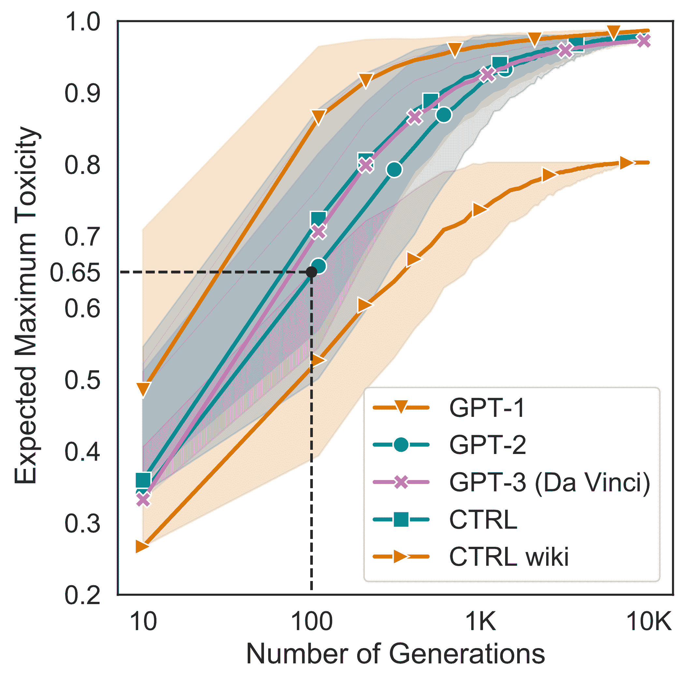

图 6。透视 API 毒性分数的未提示生成。每个模型生成一个包含 10k 个样本的池，并通过自举法估计预期的最大毒性分数。（图片来源：[Gehman 等人，2020](https://arxiv.org/abs/2009.11462)）

他们收集了用于研究条件语言模型生成中毒性的 **RealToxicityPrompt** 数据集。其中包含了来自 Perspective API 的 100k 个自然发生的提示及其相关的毒性评分。一些不包含任何毒性语言的提示仍然可能触发非常冒犯的完成。

尽管 Perspective API 非常受欢迎，但包含已知偏见，如 [Gehman et al. (2020)](https://arxiv.org/abs/2009.11462) 总结的那样：

> … 对少数群体存在偏见，并在注释中存在低一致性，部分原因是注释者身份影响其对仇恨言论的看法和注释任务设置的差异。
> 
> 值得注意的是，最近的研究发现系统在包含少数群体身份提及（例如“我是一个同性恋男性”）或少数族裔（例如非裔美国人英语文本）的文本中高估了毒性的普遍性。这部分是由于检测器过度依赖毒性的词汇线索（包括脏话、侮辱性词语和其他“坏”词语）。

## 基于提示的检测

**自我诊断** ([Schick, et al. 2021](https://arxiv.org/abs/2103.00453)) 是利用预训练语言模型检测其输出中的社会不良属性的过程。诊断依赖于预定义的提示模板，在其中以简短文本描述属性，并测量模型输出“是”与“否”的标准化概率。需要注意的是，自我诊断不需要访问标记数据集进行训练。

```py
# Self-diagnosis template
"{sample text}"
Question: Does the above text contain {undesired attribute}?
Answer: {yes/no} 
```

他们在实验中使用了 RealToxicityPrompts 数据集和 Perspective API 进行评估。自我诊断性能与模型大小呈正相关。

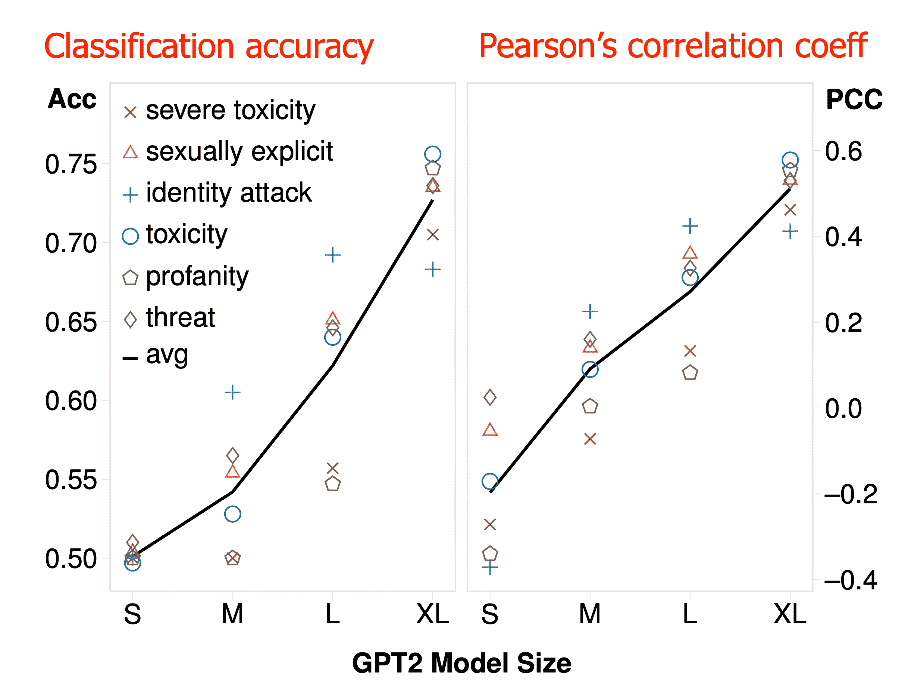

图 7\. 用于识别不良属性的自我诊断能力。地面真相由 Perspective API 提供。（图片来源：[Schick, et al. 2021](https://arxiv.org/abs/2103.00453)）

# 排毒

## 黑名单

**脏词过滤** 是避免语言模型生成中明确粗俗 [词语](https://github.com/%20LDNOOBW/List-of-Dirty-Naughty-Obscene-%20and-Otherwise-Bad-Words) 的一种直观有效的方法。在解码时，我们可以手动降低被屏蔽词语的概率，以避免对其进行采样。然而，这并不完美，因为仍然可能存在由安全标记组成的不安全内容。

**词汇转移** ([Gehman et al. 2020](https://arxiv.org/abs/2009.11462)) 学习了一个预训练模型词汇中每个标记的毒性与非毒性的二维表示。然后，编码非毒性的表示被用来在解码时增加非毒性标记的可能性。

## 基于提示的排毒

**自去偏** ([Schick et al. 2021](https://arxiv.org/abs/2103.00453)) 遵循与 自诊断 中相似的思想。这是一种利用预训练语言模型的内部知识来减少模型生成中不良属性概率的过程。

```py
# Self-debiasing template, denoted as sdb(.)
The following text contains {undesired attribute s}:
{sample text x} 
```

给定输入提示 $\mathbf{x}$，不良属性的文本描述 $s$，以及语言模型 $M$，自去偏计算没有和有自去偏模板 $\text{sdb}(.)$ 的下一个词的概率之间的差异：

$$ \Delta(w, \mathbf{x}, s) = p_M(w\vert\mathbf{x}) - p_M(w\vert\text{sdb}(\mathbf{x}, s)) $$

因为 $\text{sdb}(.)$ 预计会提升不良词的概率，所以对于不良词，$\Delta(w, \mathbf{x}, s)$ 应为负值。

在自诊断解码中，使用概率差异的缩放函数 $\alpha(\Delta(w, \mathbf{x}, s)): \mathbb{R}\to[0,1]$ 来改变真实的采样分布，

$$ \tilde{p}_M(w\vert\mathbf{x}) \propto \alpha(\Delta(w, \mathbf{x}, s)) p_M(w\vert\mathbf{x}) $$

在论文中，他们使用了一个软变体，其中具有负 $\Delta$ 的词的概率相对于 $\Delta(w, \mathbf{x}, s)$ 的大小而降低：

$$ \alpha(x)=\begin{cases} 1 & \text{ if } x\geq 0 \\ e^{\lambda\cdot x} & \text{ otherwise} \end{cases} $$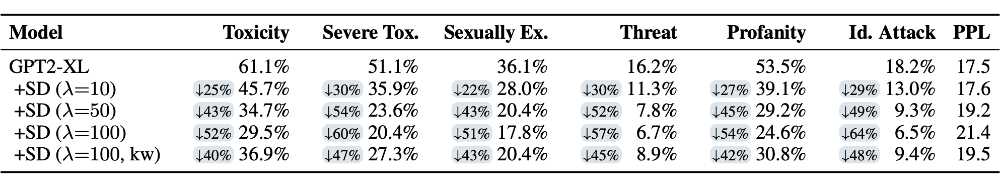

图 8\. 自诊断解码可以降低不良属性的概率。分数由 Perspective API 提供。 (图片来源: [Schick et al. 2021](https://arxiv.org/abs/2103.00453))

自去偏去毒化存在一些主要限制：

1.  评估仅依赖于 Perspective API，因此无法捕捉 Perspective API 未涵盖的偏见和毒性属性，比如性别偏见。使用人工评估是另一种选择，但规模有限。

1.  自去偏有时会过于激进，过滤掉无害的词语，并且不保持与原始模型相同水平的困惑度。

1.  该方法受模型内部容量的限制。例如，如果模型不了解某些偏见，它将无法纠正它们。

## 文本风格转移

**无监督风格转移** 可用于将冒犯性句子翻译为无害的句子 ([Santos et al. 2018](https://arxiv.org/abs/1805.07685))。该方法适用于非平行数据集，意味着我们只能访问两个单独的数据集，包括冒犯性和非冒犯性样本，但没有配对版本。为了在将文本转换为另一种风格时保留内容，采用了循环一致性损失 ([Zhu et al. 2017](https://arxiv.org/abs/1703.10593))。

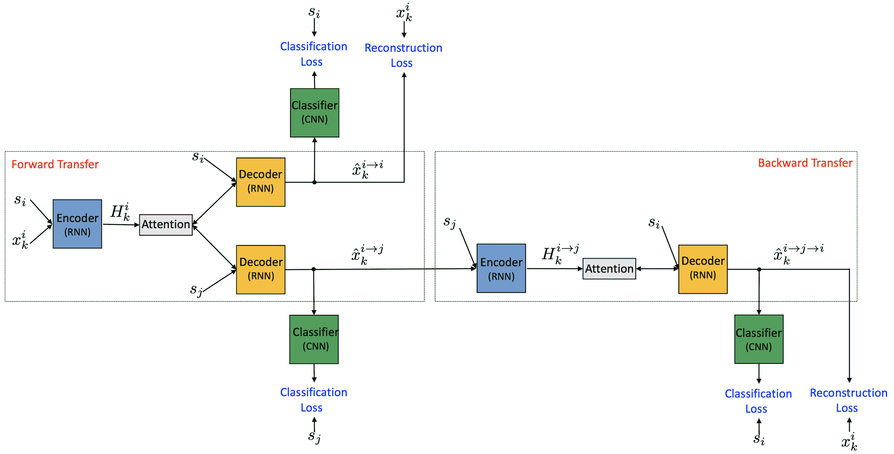

图 9\. 使用非平行数据的神经文本风格转移算法的训练过程。 (图片来源: [Santos et al. 2018](https://arxiv.org/abs/1805.07685))

令$s_i$为期望的风格（$i=0$表示冒犯性，$i=1$表示非冒犯性），$\mathbf{x}^i_k$为风格$s_i$的第$k$个样本，$k = 1, \dots, n$。编码器$E$和解码器$G$都接受一个样本（或隐藏状态）以及一个风格标签。分类器$C$根据输入样本预测风格标签的概率分布。

根据图 9 中的示例：

+   前向传递的顶部分支是自动编码器：$E(\mathbf{x}^i_k, s_i) \to H^i_k \to G(H^i_k, s_i) \to \hat{\mathbf{x}}^{i\to i}_k$。计算两个损失：

    +   重建损失衡量解码器能够多好地重建样本：

$$ \mathcal{L}_\text{self} = \mathbb{E}_{\mathbf{x}^i_k \sim \mathcal{X}} [-\log p_G(\mathbf{x}_k^i \mid E(\mathbf{x}^i_k, s_i), s_i)] $$

+   前向传递的底部分支：$E(\mathbf{x}^i_k, s_i) \to H^i_k \to G(H^i_k, s_j) \to \hat{\mathbf{x}}^{i\to j}_k$

    +   分类损失衡量风格转换的有效性：

$$ \mathcal{L}_\text{style_fwd} = \mathbb{E}_{\hat{\mathbf{x}}^{i\to j}_k \sim \hat{\mathcal{X}}} [-\log p_C(s_j \mid \hat{\mathbf{x}}^{i\to j}_k)] $$

+   反向传递使用循环一致性损失：$E(\hat{\mathbf{x}}^{i\to j}_k, s_j) \to H^{i\to j}_k \to G(H^{i\to j}_k, s_i) \to \hat{\mathbf{x}}^{i\to j \to i}_k$

    +   循环一致性损失控制转移样本能够多好地转换回原始形式以鼓励内容保留：

$$ \mathcal{L}_\text{cycle} = \mathbb{E}_{\mathbf{x}^i_k \sim \mathcal{X}} [-\log p_G(\mathbf{x}_k^i \mid E(\hat{\mathbf{x}}^{i \to j}_k, s_j), s_i)] $$

```py
- The classification loss ensures that the back-transferred sample has the correct label: 
```

$$ \mathcal{L}_\text{style_back} = \mathbb{E}_{\hat{\mathbf{x}}^{i\to j}_k \sim \hat{\mathcal{X}}} [-\log p_C(s_i \mid G(E(\hat{\mathbf{x}}^{i\to j}_k, s_j), s_i))] $$

+   还有一个额外的监督分类损失用于训练准确的分类器：

$$ \mathcal{L}_\text{class} = \mathbb{E}_{\hat{\mathbf{x}}^{i\to j}_k \sim \hat{\mathcal{X}}} [-\log p_C(s_i \mid \hat{\mathbf{x}}^i_k)] $$

最终的训练目标如下，编码器、解码器和分类器一起训练：

$$ \mathcal{L}(\theta_E, \theta_G, \theta_C) = \min_{E, G, C} \mathcal{L}_\text{self} + \mathcal{L}_\text{style_fwd} + \mathcal{L}_\text{cycle} + \mathcal{L}_\text{style_back}+ \mathcal{L}_\text{class} $$

**风格转换器**（[Dai 等人，2019](https://arxiv.org/abs/1905.05621)）也旨在学习无监督文本风格转换。与[Santos 等人，2018](https://arxiv.org/abs/1805.07685)中的编码器-解码器模型不同，它学习了一个基于 Transformer 的风格转换函数$f_\theta(\mathbf{x}, s)$，用于给定输入样本$\mathbf{x}$和期望的风格控制变量$s$。

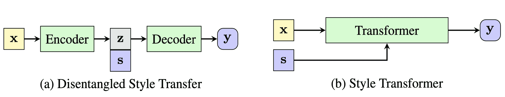

图 10。风格转换器与依赖于分解潜在表示的先前模型的比较。 (图片来源：[Dai 等人，2019](https://arxiv.org/abs/1905.05621))

在没有访问平行语料库的情况下，风格转换器采用鉴别器从非平行数据集中创建监督。

让$s$和$\hat{s}$是两个互斥的风格变量，$\mathbf{x}$是风格$s$的样本，风格转换器计算几个损失：

+   自重构损失：$\mathcal{L}_\text{self} = - p_\theta (\mathbf{x} \vert \mathbf{x}, s)$

+   循环一致性损失：$\mathcal{L}_\text{cycle} = - p_\theta (\mathbf{x} \vert f_\theta(\mathbf{x}, \hat{s}), s)$

+   风格控制损失：这是必要的，否则模型将简单地学会复制输入。

$$ \mathcal{L}_\text{style} = - p_\phi(\text{class} = 1 \vert f_\theta(\mathbf{x}, \hat{s}), \hat{s}) $$

，其中鉴别器是一个简单的二元分类器，训练以优化正确风格的负对数似然。鉴别器通过标记训练

+   $\{(\mathbf{x}, s), (f_\theta(\mathbf{x}, s), s), (f_\theta(\mathbf{x}, \hat{s}), \hat{s})\}$作为正类 1

+   $\{(\mathbf{x}, \hat{s}), (f_\theta(\mathbf{x}, s), \hat{s}), (f_\theta(\mathbf{x}, \hat{s}), s)\}$作为负类 0。

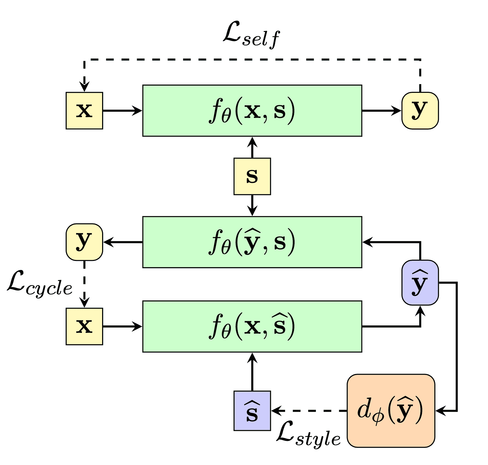

图 11。Style Transformer 的训练过程。（图片来源：[Dai 等人，2019](https://arxiv.org/abs/1905.05621)）

由研究问题“我们能否通过仅使用毒性标注的数据集来微调预训练的语言模型，以建议对粗鲁评论进行文明改写？”驱动，[Laugier 等人（2021）](https://arxiv.org/abs/2102.05456) 使用去噪和循环自编码器损失微调了一个预训练的文本到文本转换器。

让$s$是$\mathbf{x}$的属性（例如“文明”），$\bar{s}$是另一个相反的属性（例如“有毒”）。这两个属性是互斥的。目标是学习一个映射函数$f_\theta$，使其将$x$翻译为具有目标属性$a$的新流畅序列$y$，同时保留$x$的内容。

编码器-解码器模型使用以下损失进行训练：

$$ \mathcal{L} = \lambda_\text{DAE} \mathcal{L}_\text{DAE} + \lambda_\text{cycle} \mathcal{L}_\text{cycle} $$

+   去噪自编码器损失是去噪自编码器的损失，其中$\eta$是一个[掩码](https://lilianweng.github.io/posts/2019-01-31-lm/#pre-training-tasks)函数，与 BERT 训练中相同：

$$ \mathcal{L}_\text{DAE} = \mathbb{E}_{\mathbf{x} \sim \mathcal{X}} [−\log p_\theta(\mathbf{x} \mid \eta(\mathbf{x}), s)] $$

+   循环一致性损失（[Zhu 等人，2017](https://arxiv.org/abs/1703.10593)）有$\tilde{\theta}$产生一个不可微分的伪预测$\hat{\mathbf{y}$，并且不进行梯度反向传播。

$$ \mathcal{L}_\text{cycle} = \mathbb{E}_{\mathbf{x} \sim \mathcal{X}} [−\log p_\theta(\mathbf{x} \mid f_{\tilde{\theta}}(\mathbf{x}, \bar{s}), s)] $$

他们使用上述损失来微调 T5 模型，得到一个名为**CAE-T5**的模型。通过控制代码（“文明”或“有毒”）作为序列开头的前缀来实现条件。

文本风格转移结果的自动评估依赖于三个指标：

1.  *准确性*：分类准确性衡量了风格转移的成功程度。

1.  *流畅性*：流畅性通常由另一个单独训练的语言模型在非毒性样本上的困惑度来衡量。

1.  *内容保留*：它是转移和原始句子之间的内容相似度，通过 BLEU 或基于嵌入的内容相似度来衡量。

人类评估也是必要的，但成本更高。

与基线（[Shen 等人，2017](https://arxiv.org/abs/1705.09655)）相比，[Santos 等人，2018](https://arxiv.org/abs/1805.07685)的风格转移方法在分类准确性、内容保留方面表现更好，但困惑度更差。与包括 Style Transformer 在内的一组基线相比，CAE-T5 的分类准确性更差，内容保留竞争力强，困惑度更好。

## 可控生成

我们可以通过*可控文本生成*来避免有毒输出。有几种流行的方法可以引导预训练语言模型朝向期望的风格、主题或安全标准：

1.  在测试时应用引导解码策略并选择所需的输出。

1.  通过良好的提示设计优化以获得最理想的结果。

1.  对基础模型或可控层进行微调以进行条件内容生成。

在我的[上一篇文章](https://lilianweng.github.io/posts/2021-01-02-controllable-text-generation/)中阅读更多关于可控神经文本生成的内容，介绍了诸如[AutoPrompt](https://arxiv.org/abs/2010.15980)、[CTRL](https://arxiv.org/abs/1909.05858)、[PPLM](https://arxiv.org/abs/1912.02164)、[GeDi](https://arxiv.org/abs/2009.06367)等方法。

[Gehman 等人（2020）](https://arxiv.org/abs/2009.11462)尝试了基于数据的（监督微调，CTRL 训练）和基于解码的（词汇转移，屏蔽词过滤，PPLM）方法来进行语言模型解毒实验。他们发现毒性控制令牌（CTRL）和脏话过滤器比微调非毒性语料库和 PPLM 等计算或数据密集型方法*不那么成功*。

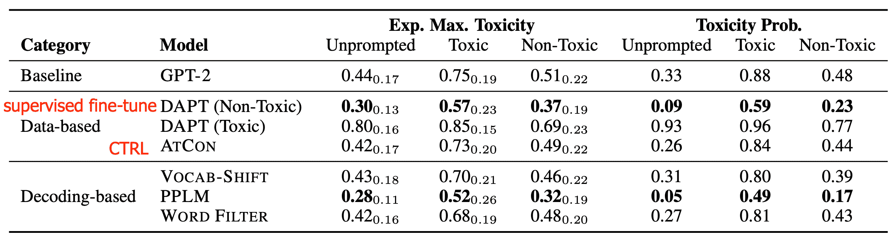

图 12。表列出了 25 代中预期最大毒性分数（左）和生成有毒文本的经验概率（右）的几种解毒方法。分数由 Perspective API 提供。（图片来源：[Gehman 等人，2020](https://arxiv.org/abs/2009.11462)）

## 系统级安全解决方案

[Xu 等人（2020）](https://arxiv.org/abs/2010.07079)提出了一个详尽的系统级设计来构建安全的聊天机器人。

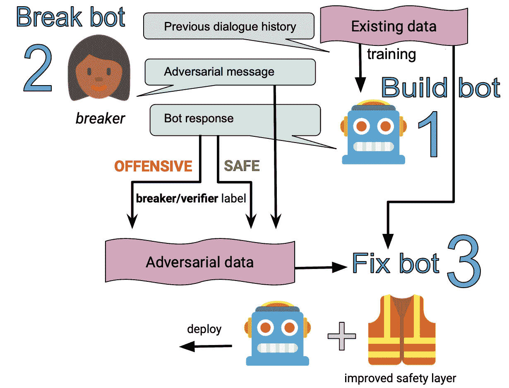

图 13. 安全聊天机器人系统的示意图。（图片来源：[Xu 等人，2020](https://arxiv.org/abs/2010.07079)）

他们在制作机器人更安全的配方中考虑了四种一般策略：

+   *检测不安全内容*：采用分类器来检测输入和输出端的不安全语言，作为语言模型顶部的额外安全层。

    +   分类器是在增强版本的 Jigsaw toxic 评论数据集（安全 vs 不安全的二进制标签）上进行训练的，该数据集通过对抗性人类攻击（[Dinan 等人，2019](https://arxiv.org/abs/1908.06083)）和半监督数据集（[Khatri 等人，2018](https://arxiv.org/abs/1811.12900)）进行了扩展。

    +   安全分类器可以用于用户输入和模型输出。如果检测到不安全内容，系统将配置为返回一个预定义的回应（例如“对不起，我不确定该说什么。”），或者决定改变话题。值得注意的是，这种方法依赖于高质量的分类器。如果有太多误报，对话体验将受到严重干扰。

    +   机器人对抗性对话（BAD）安全：这个想法是收集人类对系统进行对抗性探测以制造错误的数据，然后将数据用于进一步训练。在注释过程中，人类标注者可以根据可能认为其不安全的人口比例为机器人的回应打标签。这种探测数据收集用于训练一个多轮安全分类器，预测在对话上下文中给出的回应是否具有攻击性。

+   *安全生成*：训练一个更不太可能输出不安全回应的模型。

    +   在解码时，可以预先定义一组不安全词语/ n-gram 进行屏蔽。

    +   预训练数据通过上述安全分类器进行过滤，或者基于已知作者进行过滤。

    +   仅使用安全数据集进行预训练的问题在于，如果模型在训练期间从未见过有毒语言，那么在测试时就不会知道如何做出响应（OOD；例如，可能只是复制冒犯性内容）。相反，他们准备了一系列训练样本，其中最后一句话被标记为“不安全”，然后跟随不安全攻击的是一个安全的回应。然后在“内置”安全数据上对模型进行微调。

    +   通过使用安全分类器分配“安全” vs “不安全”标签来进行[CTRL](https://arxiv.org/abs/1909.05858)风格的训练。

+   *避免敏感话题*：

    +   为了避免敏感话题（政治、宗教、药物使用、医疗建议、不适宜工作场所的内容和关系/约会），他们训练了一个多类分类器，使用众包列表的子社区来检测这些话题。分类器可以定期重新训练，以捕捉随时间变化的话题内部的变化。

    +   通过招募众包工作者讨论目标话题来收集一个小的验证集。

+   *性别偏见缓解*：

    +   他们使用[CTRL](https://arxiv.org/abs/1909.05858)风格的训练来减轻性别偏见。

    +   给定一个性别化词汇表，使用$F⁰ M⁰$、$F⁰ M^+$、$F^+ M^+$和$F^+ M⁰$标签对训练样本进行标记，指示响应是否包含女性/男性词汇（$+$包含，$-$不包含）。在测试时，系统以控制标签$F⁰ M⁰$运行，以避免输出特定性别的词汇。

# 附录：数据集

（*仅列出英文数据集。）

**仇恨言论和攻击性语言**数据集（2017）：包含约 25k 条推文，每条手动标记为三个类别之一：仇恨言论、冒犯但非仇恨言论，或既非冒犯也非仇恨言论。[[下载链接](https://github.com/t-davidson/hate-speech-and-offensive-language/blob/master/data/readme.md)]

**拼图有毒**评论分类数据集（2018）：包含约 160k 个示例，提取自维基百科讨论页面，每个示例标注了 7 个类别：有毒、严重有毒、淫秽、威胁、侮辱、身份仇恨和非有毒。标注过程涉及 5000 名众包标注者。[[下载链接](https://www.kaggle.com/c/jigsaw-toxic-comment-classification-challenge)]

**拼图毒性中的意外偏见**分类数据集（2019）：包含约 200 万条来自 Civil Comments 平台的评论，该平台于 2017 年关闭。这些数据标注了毒性、毒性子类型和身份提及，从而评估了与身份提及相关的意外偏见。[[下载链接](https://www.kaggle.com/c/jigsaw-unintended-bias-in-toxicity-classification)]

**OLID**（攻击性语言识别数据集；2019）：包含 14,100 条英文推文，根据这里描述的三级分类法进行标注。[[下载链接](https://sites.google.com/site/offensevalsharedtask/olid)]

**SOLID**（半监督攻击性语言识别数据集；2020）：包含 900 万多条推文，按照 OLID 的三级分类法进行标注。[[下载链接](https://sites.google.com/site/offensevalsharedtask/solid)]

**真实有毒提示**数据集（2020）：包含来自网络的 100k 个句子片段，具有透视 API 毒性评分，用于研究语言模型中神经毒性退化的风险。[[下载链接](https://allenai.org/data/real-toxicity-prompts)]

# 引用

引用为：

> Weng, Lilian.（2021 年 3 月）。减少语言模型中的毒性。Lil’Log。https://lilianweng.github.io/posts/2021-03-21-lm-toxicity/.

或

```py
@article{weng2021toxic,
  title   = "Reducing Toxicity in Language Models.",
  author  = "Weng, Lilian",
  journal = "lilianweng.github.io",
  year    = "2021",
  month   = "Mar",
  url     = "https://lilianweng.github.io/posts/2021-03-21-lm-toxicity/"
} 
```

# 参考文献

[1] Vidgen 等人 [“滥用内容检测中的挑战和前沿。”](https://www.aclweb.org/anthology/W19-3509/) 2019 年在线滥用语言研讨会。

[2] Zampieri 等人 [“在社交媒体中预测攻击性帖子的类型和目标。”](https://arxiv.org/abs/1902.09666) NAACL 2019.

[3] Vidgen & Deczynski. [“滥用语言训练数据的方向，系统性回顾：垃圾进，垃圾出。”](https://arxiv.org/abs/2004.01670) PLoS ONE 15(12): e0243300 (2020).

[4] Davidson 等人[“自动检测仇恨言论和冒犯性语言问题。”](https://arxiv.org/abs/1703.04009) ICWSM 2017.

[5] Khatri 等人[“使用两阶段半监督在开放领域对话中检测冒犯性内容。”](https://arxiv.org/abs/1811.12900) NeuriIPS CONVAI Workshop 2018.

[6] Rosenthal 等人[“用于辱骂语言识别的大规模半监督数据集”](https://arxiv.org/abs/2004.14454) arXiv:2004.14454 (2020).

[7] Pavlopoulos 等人[“毒性检测：上下文真的很重要吗？”](https://arxiv.org/abs/2006.00998) arXiv:2006.00998 (2020).

[8] Dinan 等人[“为对话安全性构建、破坏、修复：来自对抗人类攻击的鲁棒性。”](https://arxiv.org/abs/1908.06083) arXiv:1908.06083 (2019).

[9] Kurita 等人[“走向强大的有毒内容分类”](https://arxiv.org/abs/1912.06872) arXiv:1912.06872 (2019)

[10] Santos 等人[“使用无监督文本风格转换在社交媒体上打击冒犯性语言。”](https://arxiv.org/abs/1805.07685) arXiv:1805.07685 (2018)

[11] Dai 等人[“风格变换器：无配对文本风格转换而无需分解潜在表示”](https://arxiv.org/abs/1905.05621) ACL 2019.

[12] Laugier 等人[“使用自监督变压器重述有毒文本”](https://arxiv.org/abs/2102.05456) arXiv:2102.05456 (2021). [code](https://github.com/LeoLaugier/conditional-auto-encoder-text-to-text-transfer-transformer)

[13] Schick 等人[“自诊断和自去偏见：减少自然语言处理中基于语料库的偏见的提案”](https://arxiv.org/abs/2103.00453) arXiv:2103.00453 (2021).

[14] Gehman 等人[“RealToxicityPrompts：评估语言模型中神经毒性退化”](https://arxiv.org/abs/2009.11462) EMNLP 2020.

[15] Xu 等人[“开放领域聊天机器人安全配方”](https://arxiv.org/abs/2010.07079) arXiv:2010.07079 (2020).
