# 如何构建一个开放领域问答系统？

> 原文：[`lilianweng.github.io/posts/2020-10-29-odqa/`](https://lilianweng.github.io/posts/2020-10-29-odqa/)

2020-11-12 更新：添加[一个示例，展示使用 OpenAI API（beta）进行闭合书事实问答的示例。

一个能够回答关于事实知识的任何问题的模型可以导致许多有用和实用的应用，例如作为聊天机器人或 AI 助手🤖。在本文中，我们将回顾构建这样一个开放领域问答系统的几种常见方法。

鉴于野外有如此多的论文：

+   假设我们可以访问一个强大的预训练[语言模型](https://lilianweng.github.io/posts/2019-01-31-lm/)。

+   我们不在这里讨论如何使用结构化知识库（例如 Freebase，WikiData）。

+   我们只关注单轮问答，而不是多轮对话式问答。

+   我们主要关注包含神经网络的问答模型，特别是基于 Transformer 的语言模型。

+   我承认我错过了很多在 2017-2019 年间专门设计用于问答任务的架构的论文😔

# 什么是开放领域问答？

**开放领域问答（ODQA）**是一种语言任务类型，要求模型以自然语言产生对事实性问题的答案。真实答案是客观的，因此评估模型性能很简单。

例如，

```py
Question: What did Albert Einstein win the Nobel Prize for?
Answer: The law of the photoelectric effect. 
```

“开放领域”部分指的是对于任意提出的事实性问题缺乏相关背景信息。在上述情况下，模型只接受问题作为输入，但没有提供关于“为什么爱因斯坦因相对论未获诺贝尔奖”的文章，其中可能提到“光电效应定律”的术语。当提供问题和上下文时，任务被称为**阅读理解（RC）**。

一个 ODQA 模型可以使用或不使用*外部知识源*（例如维基百科），这两种条件分别称为*开放书*或*闭合书*问答。

在考虑不同类型的开放领域问题时，我喜欢按照[Lewis 等人，2020](https://arxiv.org/abs/2008.02637)的分类，按照难度递增的顺序：

1.  一个模型能够正确地记忆并回答在训练时见过的问题的答案。

1.  一个模型能够在测试时回答新颖的问题，并从训练时见过的答案集中选择一个答案。

1.  一个模型能够回答训练数据集中没有包含答案的新颖问题。

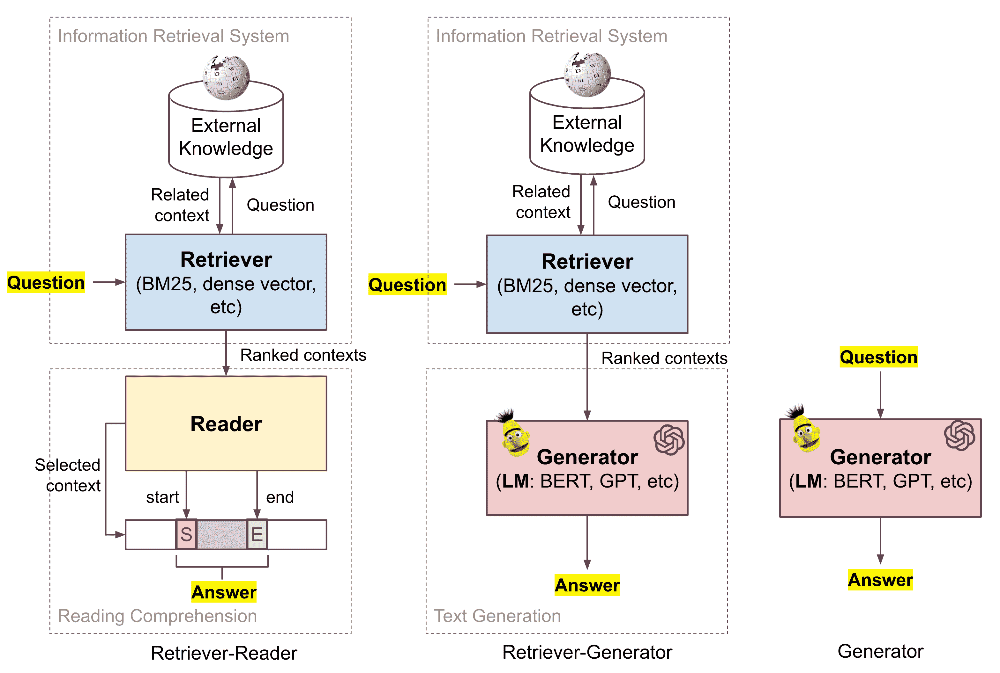

图 1。本文讨论的三种框架概述。

## 符号

给定一个问题$x$和一个地面真实答案跨度$y$，包含真实答案的上下文段落被标记为$z \in \mathcal{Z}$，其中$\mathcal{Z}$是一个外部知识语料库。维基百科是这样一个外部知识来源的常见选择。

## QA 数据微调的问题

在我们深入讨论下面许多模型的细节之前，我想指出一个关于使用常见 QA 数据集对模型进行微调的问题，这在几个 ODQA 模型中作为一个微调步骤出现。这可能令人担忧，因为在几个公共 QA 数据集中，训练集和测试集中的问题存在显著重叠。

[Lewis 等人（2020）](https://arxiv.org/abs/2008.02637)（[代码](https://github.com/facebookresearch/QA-Overlap)）发现 58-71%的测试时间答案也出现在某处的训练集中，28-34%的测试集问题在其对应的训练集中有近似重复的释义。在他们的实验中，当从训练集中删除重复或释义问题时，几个模型的表现明显较差。

# 开放式问答：检索器-阅读器

给定一个事实性问题，如果语言模型没有上下文或不足够大以记住训练数据集中存在的上下文，那么猜测正确答案的可能性很小。在开卷考试中，学生可以在回答测试问题时参考外部资源，如笔记和书籍。类似地，ODQA 系统可以与丰富的知识库配对，以识别相关文档作为答案的证据。

我们可以将回答给定问题的过程分解为两个阶段，

1.  在外部知识库中找到相关内容；

1.  处理检索到的内容以*提取*答案。

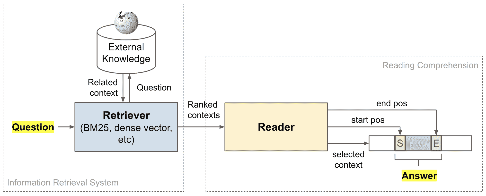

图 2. 检索器-阅读器问答框架将信息检索与机器阅读理解结合起来。

这样的检索器+阅读器框架最初是由**DrQA**（由[Chen 等人，2017](https://arxiv.org/abs/1704.00051)提出；[代码](https://github.com/facebookresearch/DrQA)）提出的。检索器和阅读器组件可以独立设置和训练，或者进行联合训练端到端。

## 检索器模型

实现检索器的两种流行方法是使用依赖于（1）经典非学习型[TF-IDF](https://en.wikipedia.org/wiki/Tf%E2%80%93idf)特征的信息检索（“经典 IR”）或（2）由神经网络生成的文本的密集嵌入向量的密集嵌入向量（“神经 IR”）。

### 经典 IR

**DrQA**（[Chen 等人，2017](https://arxiv.org/abs/1704.00051)）采用了基于[向量空间模型](https://en.wikipedia.org/wiki/Vector_space_model)的高效非学习型搜索引擎。每个查询和文档都被建模为词袋向量，其中每个术语都由 TF-IDF（词频$\times$逆文档频率）加权。

$$ \begin{aligned} \text{tf-idf}(t, d, \mathcal{D}) &= \text{tf}(t, d) \times \text{idf}(t, \mathcal{D}) \\ \text{tf}(t, d) &= \log(1 + \text{freq}(t, d)) \\ \text{idf}(t, \mathcal{D}) &= \log \Big( \frac{\vert\mathcal{D}\vert}{\vert d\in\mathcal{D}: t\in d\vert} \Big) \end{aligned} $$

其中$t$是来自文档$d$的单个词或双词术语，来自文档集合$\mathcal{D}$。$\text{freq}(t, d)$衡量术语$t$在$d$中出现的次数。请注意，这里的词频也包括双词计数，这是非常有帮助的，因为通过双词考虑了局部词序。作为实现的一部分，DrQA 使用无符号 murmur3 哈希将$2^{24}$个 bin 的双词映射。

具体来说，DrQA 将维基百科作为其知识来源，这个选择自那时以来已成为许多 ODQA 研究的默认设置。非机器学习文档检索器在给定问题的情况下返回前$k=5$个最相关的维基百科文章。

**BERTserini**（[Yang 等，2019](https://arxiv.org/abs/1902.01718)）将开源[*Anserini*](https://github.com/castorini/anserini)信息检索工具包与经过微调的预训练 BERT 模型配对作为阅读器。通过`post-v3.0`分支的 Anserini 检索前$k$个文档（$k=10$），将查询视为词袋。检索到的文本段通过[BM25](https://en.wikipedia.org/wiki/Okapi_BM25)进行排名，这是一种经典的基于 TF-IDF 的检索评分函数。在文本粒度对性能的影响方面，他们发现段落检索 > 句子检索 > 文章检索。

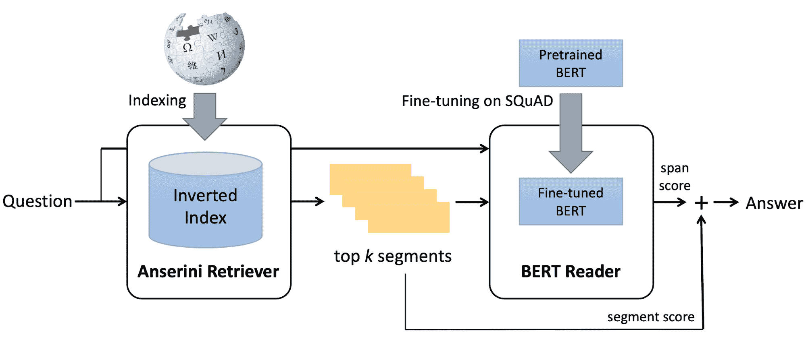

图 3\. BERTserini 架构示意图。（图片来源：[Yang 等，2019](https://arxiv.org/abs/1902.01718)）

*ElasticSearch + BM25*被**多段 BERT**问答模型所使用（[Wang 等，2019](https://arxiv.org/abs/1908.08167)）。他们发现，通过*滑动窗口*将文章分割成长度为 100 个单词的段落可以带来 4%的改进，因为将文档分割成没有重叠的段落可能导致一些接近边界的证据失去有用的上下文。

### 神经信息检索

学习文本的低维表示已有很长的历史，比原始基于术语的向量更密集（[Deerwester 等，1990](http://lsa.colorado.edu/papers/JASIS.lsi.90.pdf); [Yih 等，2011](https://www.aclweb.org/anthology/W11-0329/)）。密集表示可以通过矩阵分解或一些神经网络架构（例如 MLP，LSTM，双向 LSTM 等）学习。当涉及神经网络时，这些方法被称为“神经信息检索”，神经信息检索是检索问题的新类别方法，但不一定比经典信息检索表现更好/更优越（[Lim，2018](https://sigir.org/wp-content/uploads/2019/01/p040.pdf)）。

在许多大规模[通用语言模型](https://lilianweng.github.io/posts/2019-01-31-lm/)取得成功之后，许多问答模型采用以下方法：

$$ h_x = E_x(x)\quad h_z = E_z(z)\quad \text{score}(x, z) = h_x^\top h_z $$

1.  通过将问题$x$和上下文段落$z$的密集表示馈送到语言模型中来提取；

1.  使用这两个表示的点积作为检索分数来排名和选择最相关的段落。

ORQA、REALM 和 DPR 都使用这样一个用于上下文检索的评分函数，将在后续部分中详细描述端到端 QA 模型。

一种极端的方法，由**DenSPI**（“Dense-Sparse Phrase Index”; [Seo et al., 2019](https://arxiv.org/abs/1906.05807)）调查，是在知识语料库中以*短语*级别编码所有文本，然后仅依赖检索器识别最相关的短语作为预测答案。这样，检索器+阅读器流水线仅减少到检索器。当然，索引会更大，检索问题更具挑战性。

DenSPI 引入了一个文档短语的*查询无关*可索引表示。准确地说，它在维基百科离线中编码文本跨度的查询无关表示，并在推理时通过执行最近邻搜索来查找答案。这可以极大地加快推理时间，因为不需要为每个新查询重新编码文档，这通常是读者模型所要求的。

给定一个问题 $x$ 和一组固定的（维基百科）文档，$z_1, \dots, z_K$，每个文档 $z_k$ 包含 $N_k$ 个词，$z_k = \langle z_k^{(1)}, \dots, z_k^{(N_k)}\rangle$。一个 ODQA 模型是一个为每个候选短语跨度 $z_k^{(i:j)}, 1 \leq i \leq j \leq N_k$ 计算得分的函数 $F$，使得真实答案是得分最高的短语：$y = {\arg\max}_{k,i,j} F(x, z_k^{(i:j)})$。

短语表示 $z_k^{(i:j)}$ 结合了密集向量和稀疏向量，$z_k^{(i:j)} = [d_k^{(i:j)}, s_k^{(i:j)}] \in \mathbb{R}^{d^d + d^s}$（注意 $d^d \ll d^s$）：

+   密集向量 $d_k^{(i:j)}$ 有效地编码了本地*句法*和*语义*线索，就像预训练语言模型所学到的那样。

+   稀疏向量 $s_k^{(i:j)}$ 在编码精确的*词汇*信息方面表现优异。这个稀疏向量是基于词频的编码。DenSPI 使用与 DrQA 相同的 2-gram 词频，导致高度稀疏的表示（$d^s \approx 16$M）。

密集向量 $d^{(i:j)}$ 进一步分解为三部分，$d^{(i:j)} = [a_i, b_j, c_{ij}] \in \mathbb{R}^{2d^b + 1}$，其中 $2d^b + 1 = d^d$。所有三个组件都是基于微调后的 BERT 表示学习的。

+   向量 $a_i$ 编码文档中第 $i$ 个词的*起始*位置；

+   向量 $b_j$ 编码文档中第 $j$ 个词的*结束*位置；

+   标量 $c_{ij}$ 衡量了起始向量和结束向量之间的*连贯性*，有助于在推理过程中避免非成分短语。

对于所有可能的 $(i,j,k)$ 元组，其中 $j-i < J$，文本跨度嵌入被预先计算并存储为*短语索引*。最大跨度长度 $J$ 是一个预定义的标量常数。

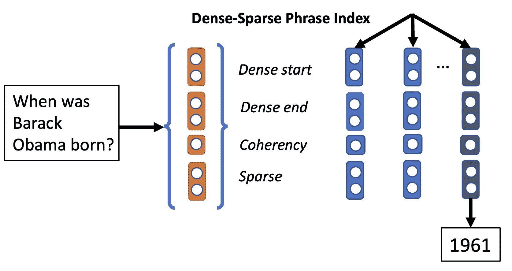

图 4\. Dense-Sparse Phrase Index（DenSPI）架构示意图。 (图片来源: [Seo et al., 2019](https://arxiv.org/abs/1906.05807))

推理时，问题被映射到相同的向量空间 $x=[d’, s’] \in \mathbb{R}^{d^d + d^s}$，其中密集向量 $d’$ 是从特殊的 `[CLS]` 符号的 BERT 嵌入中提取的。相同的 BERT 模型用于编码问题和短语。最终答案由 $k^*, i^*, j^* = \arg\max x^\top z_k^{(i:j)}$ 预测。

## 读者模型

读者模型学习解决阅读理解任务 — 从给定上下文文档中提取问题的答案。这里我们只讨论使用神经网络进行机器理解的方法。

### 双向 LSTM

**DrQA**的答案检测读者模型（[Chen et al., 2017](https://arxiv.org/abs/1704.00051)）是一个具有隐藏大小为 128 的 3 层双向 LSTM。检索到的维基百科文章的每个相关段落都被编码为特征向量序列，$\{\tilde{\mathbf{z}}_1, \dots, \tilde{\mathbf{z}}_m \}$。每个特征向量 $\hat{\mathbf{z}}_i \in \mathbb{R}^{d_z}$ 预计能够捕获围绕一个标记 $z_i$ 的有用上下文信息。该特征包括几类特征：

1.  词嵌入：从 800B Web 爬取数据训练的 300d [Glove](https://lilianweng.github.io/posts/2017-10-15-word-embedding/#glove-global-vectors)词嵌入，$f_\text{embed} = E_g(z_i)$。

1.  精确匹配：一个词 $z_i$ 是否出现在问题 $x$ 中，$f_\text{match} = \mathbb{I}(z_i \in x)$。

1.  标记特征：包括 POS（词性标注）、NER（命名实体识别）和 TF（词频），$f_\text{token}(z_i) = (\text{POS}(z_i), \text{NER}(z_i), \text{TF}(z_i))$。

1.  对齐的问题嵌入：注意力分数 $y_{ij}$ 设计用于捕获句子间匹配和段落标记 $z_i$ 与问题词 $x_j$ 之间的相似性。该特征增加了类似但非相同单词之间的软对齐。

$$ \begin{aligned} f_\text{align}(z_i) &= \sum_j y_{i,j} E_g(x_j) \\ y_{i,j} &= \frac{\exp(\alpha(E_g(z_i))^\top \alpha(E_g(x_j)) )}{\sum_{j'} \exp(\alpha(E_g(z_i))^\top \alpha(E_g(x_{j'})) ) } \end{aligned} $$

其中 $\alpha$ 是一个具有 ReLU 的单个密集层，$E_g(.)$ 是 glove 词嵌入。

一个包含$m$个标记的段落的特征向量被馈送到 LSTM 中以获得最终段落向量：

$$ \begin{aligned} \mathbf{z} = \{\mathbf{z}_1, \dots, \mathbf{z}_m\} &= \text{LSTM}(\{\tilde{\mathbf{z}}_1, \dots, \tilde{\mathbf{z}}_m\}) \\ \text{where } \tilde{\mathbf{z}}_i &= \{f_\text{embed}, f_\text{match}, f_\text{token}, f_\text{align}\} \end{aligned} $$

问题被编码为问题中每个单词的嵌入的加权和：

$$ \mathbf{x} = \sum_j b_j E(x_j) \quad b_j = \text{softmax}(\mathbf{w}^\top E(x_j)) $$

其中 $\mathbf{w}$ 是一个学习的权重向量。

一旦为问题和所有相关段落构建了特征向量，阅读器需要预测段落中每个位置成为答案范围起始和结束的概率，分别为 $p_\text{start}(i_s)$ 和 $p_\text{end}(i_s)$。在所有段落中，以最大的 $p_\text{start}(i_s) \times p_\text{end}(i_e) $ 返回最佳范围作为最终答案。

$$ \begin{aligned} p_\text{start}(i_s) \propto \exp(\mathbf{z}_{i_s} \mathbf{W}_s \mathbf{x}) \\ p_\text{end}(i_e) \propto \exp(\mathbf{z}_{i_e} \mathbf{W}_e \mathbf{x}) \\ \text{ s.t. } i_s \leq i_e \leq i_s + 15 \end{aligned} $$

其中 $\mathbf{W}_s$ 和 $\mathbf{W}_e$ 是学习的参数。

### BERT-universe

在[BERT](https://lilianweng.github.io/posts/2019-01-31-lm/#bert)（[Devlin et al., 2018](https://arxiv.org/abs/1810.04805)）取得成功之后，许多问答模型基于 BERT 开发了机器理解组件。让我们将 BERT 模型定义为一个函数，可以接受一个或多个字符串（由 `[SEP]` 连接）作为输入，并输出特殊 `[CLS]` 标记和每个输入标记的一组 BERT 编码向量：

$$ \text{BERT}(s_1, s_2, \dots) = [\mathbf{h}^\texttt{[CLS]}, \mathbf{h}^{(1)}, \mathbf{h}^{(2)}, \dots] $$

其中 $\mathbf{h}^\texttt{[CLS]}$ 是特殊 `[CLS]` 标记的嵌入向量，$\mathbf{h}^{(i)}$ 是第 $i$ 个标记的嵌入向量。

要使用 BERT 进行阅读理解，它学习两个额外的权重，$\mathbf{W}_s$ 和 $\mathbf{W}_e$，并且 $\text{softmax}(\mathbf{h}^{(i)}\mathbf{W}_s)$ 和 $\text{softmax}(\mathbf{h}^{(i)}\mathbf{W}_e)$ 定义了每个标记预测范围的起始和结束位置的两个概率分布。

**BERTserini**（[Yang et al., 2019](https://arxiv.org/abs/1902.01718)）利用预训练的 BERT 模型作为阅读器。他们的实验表明，用 SQuAD 对预训练的 BERT 进行微调就足以在识别答案范围方面取得高准确度。


图 5\. BERT 如何用于解决问答任务。（图片来源：[Devlin et al., 2018](https://arxiv.org/abs/1810.04805)）

BERTserini 阅读器与原始 BERT 的关键区别在于：为了允许对不同段落的结果进行比较和聚合，移除了不同答案范围上的最终 softmax 层。预训练的 BERT 模型在 SQuAD 的训练集上进行微调，其中所有输入都被填充到 384 个标记，并且学习率为 3e-5。

在对所有提取的答案范围进行排名时，检索器分数（BM25）和阅读器分数（token 是起始位置的概率 $\times$ 相同 token 是结束位置的概率）通过线性插值进行组合。

原始的 BERT 独立地为每个段落的每个标记规范化起始和结束位置的概率分布。与之不同的是，**多段 BERT**（[Wang 等，2019](https://arxiv.org/abs/1908.08167)）在一个问题的所有检索到的段落中全局地规范化答案分数。准确地说，多段 BERT 去除了 BERT 中用于 QA 的每个段落的最终规范化层（与 BERTserini 中相同），然后在所有段落的所有单词位置上添加一个全局的`softmax`。全局规范化使阅读器模型在从大量段落中找到答案时更加稳定。

此外，多段 BERT 通过另一个 BERT 模型实现了独立的*段落排名器*模型，并且$(x, z)$的排名分数是通过对第一个`[CLS]`标记的表示向量进行`softmax`生成的。段落排名器带来额外的 2%改进。在[Nogueira & Cho，2019](https://arxiv.org/abs/1901.04085)中也讨论了使用 BERT 重新排列段落的类似想法。

有趣的是，[Wang 等，2019](https://arxiv.org/abs/1908.08167)发现，在使用 BERT 进行 RC 任务时，*显式的句间匹配*似乎并不是关键因素；请查看原始论文以了解实验是如何设计的。一个可能的原因是 BERT 中的多头自注意力层已经嵌入了句间匹配。

## 端到端联合训练

检索器和阅读器组件可以联合训练。本节涵盖了 R³、ORQA、REALM 和 DPR。有许多共同的设计，例如基于 BERT 的密集向量用于检索和最大化获得真实答案的边际似然的损失函数。

**R³**（“强化排名-阅读器”；[Wang 等，2017](https://arxiv.org/abs/1709.00023)）QA 系统中的检索器和阅读器模型通过[强化学习](https://lilianweng.github.io/posts/2018-02-19-rl-overview/)联合训练。（请注意，在本节中保持术语一致，原始 R³ 论文中的“排名器”模型在这里被称为“检索器”模型。）这两个组件都是[Match-LSTM](https://arxiv.org/abs/1512.08849)的变体，依赖于注意机制来计算段落和问题序列之间的单词相似性。

**Match-LSTM 模块是如何工作的？** 给定一个包含$d_x$个单词的问题$\mathbf{X}$和一个包含$d_z$个单词的段落$\mathbf{Z}$，两个表示都使用固定的[Glove](https://lilianweng.github.io/posts/2017-10-15-word-embedding/#glove-global-vectors)词嵌入，

$$ \begin{aligned} \mathbf{H}^x &= \text{BiLSTM}(\mathbf{X}) \in \mathbb{R}^{l \times d_x} \\ \mathbf{H}^z &= \text{BiLSTM}(\mathbf{Z}) \in \mathbb{R}^{l \times d_z} \\ \mathbf{G} &= \text{softmax}((\mathbf{W}^g \mathbf{H}^x + \mathbf{b}^g \otimes \mathbf{e}_{d_x})^\top \mathbf{H}^z) \in \mathbb{R}^{d_x \times d_z} & \text{; 一个注意力矩阵}\\ \bar{\mathbf{H}}^x &= \mathbf{H}^x \mathbf{G} \in \mathbb{R}^{l \times d_z} \\ \mathbf{M} &= \text{ReLU} \Big( \mathbf{W}^m \begin{bmatrix} \mathbf{H}^z \\ \bar{\mathbf{H}}^x \\ \mathbf{H}^z \odot \bar{\mathbf{H}}^x \\ \mathbf{H}^z - \bar{\mathbf{H}}^x \end{bmatrix} \Big) \in \mathbb{R}^{2l \times d_z} \\ \mathbf{H}^m &= \text{BiLSTM}(M) \in \mathbb{R}^{l \times d_z} \end{aligned} $$

其中$l$是双向 LSTM 模块的隐藏维度。$\mathbf{W}^g \in \mathbb{R}^{l\times l}$，$\mathbf{b}^g \in \mathbb{R}^l$，$\mathbf{W}^m \in \mathbb{R}^{2l \times 4l}$是要学习的参数。运算符$\otimes \mathbf{e}_{d_x}$是外积，重复列向量$\mathbf{b}^g$ $d_x$次。

排序器和阅读器组件在最后一层中共享相同的 Match-LSTM 模块，导致$\mathbf{H}^\text{rank}$和$\mathbf{H}^\text{reader}$。

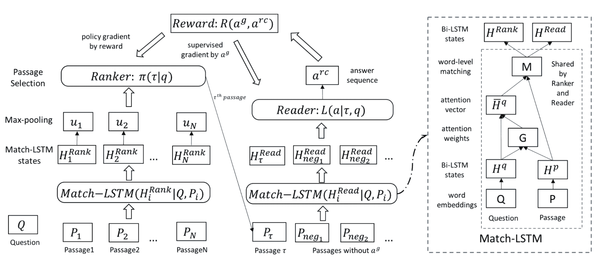

图 6。R³（强化排序器-阅读器）架构概述。两个组件共享相同的 Match-LSTM 模块。（图片来源：[Wang, et al., 2017](https://arxiv.org/abs/1709.00023)）

信息检索器对每个段落进行最大池化操作，然后聚合输出每个段落包含答案的概率。

$$ \begin{aligned} \mathbf{u}_i &= \text{max-pooling}(\mathbf{H}^\text{rank}_i) \in \mathbb{R}^l \\ \mathbf{C} &= \text{tanh}(\mathbf{W}^c[\mathbf{u}_1;\dots;\mathbf{u}_N] + \mathbf{b}^c \otimes \mathbf{e}_N) \in \mathbb{R}^{l \times n} \\ \gamma &= \text{softmax}(\mathbf{w}^c \mathbf{C}) \in \mathbb{R}^n \end{aligned} $$

最后，信息检索器被视为一个*策略*，输出动作以根据预测的$\gamma$抽取段落，

$$ \pi(z \vert x; \theta^\gamma) = \gamma_z $$

阅读器预测答案跨度的起始位置$\beta^s$和结束位置$\beta^e$。两个位置以相同方式计算，具有独立的学习参数。所有涉及的段落中共有$V$个单词。

$$ \begin{aligned} \mathbf{H}^\text{read} &= [\mathbf{H}^\text{read}_\tau; \mathbf{H}^\text{read}_{\text{neg}_1}; \dots; \mathbf{H}^\text{read}_{\text{neg}_n}] \\ \mathbf{F}^s &= \text{tanh}(\mathbf{W}^s \mathbf{H}^\text{read} + \mathbf{b}^s \otimes \mathbf{e}_V) \quad \beta^s = \text{softmax}(\mathbf{w}^s \mathbf{F}^s) \in \mathbb{R}^V \\ \mathbf{F}^e &= \text{tanh}(\mathbf{W}^e \mathbf{H}^\text{read} + \mathbf{b}^e \otimes \mathbf{e}_V) \quad \beta^e = \text{softmax}(\mathbf{w}^e \mathbf{F}^e) \in \mathbb{R}^V \\ L(y \vert z, x) &= -\log(\beta^s_{y_z^s})-\log(\beta^e_{y_z^e}) \end{aligned} $$

其中$y$是地面真相答案，段落$z$由检索器采样。$\beta^s_{y_z^s}$和$\beta^s_{y_z^e}$表示$y$在段落$z$中起始和结束位置的概率。

端到端 R³ QA 系统的训练目标是最小化给定问题$x$的正确答案$y$的负对数似然，

$$ \begin{aligned} \mathcal{J}(\theta) &= -\mathbb{E}_{z\sim\pi(.\vert x)} [L(y \vert z, x)] \\ \nabla \mathcal{J}(\theta) &= - \nabla_\theta \sum_z \pi(z \vert x) L(y \vert z, x) \\ &= - \sum_z \big( L(y \vert z, x) \nabla_\theta\pi(z \vert x) + \pi(z \vert x) \nabla_\theta L(y \vert z, x) \big) \\ &= - \mathbb{E}_{z\sim\pi(.\vert x)} \big( \color{red}{L(y \vert z, x)\nabla_\theta\log\pi(z \vert x)} + \nabla_\theta L(y \vert z, x) \big) \\ &\approx - \mathbb{E}_{z\sim\pi(.\vert x)} \big( \underbrace{\color{red}{R(y \vert z, x)\nabla_\theta\log\pi(z \vert x)}}_\text{REINFORCE} + \nabla_\theta L(y \vert z, x) \big) \end{aligned} $$

训练过程中，给定由检索器采样的段落$z$，阅读器通过梯度下降进行训练，而检索器则通过[REINFORCE](https://lilianweng.github.io/posts/2018-04-08-policy-gradient/#reinforce)进行训练，使用$L(y \vert z, x)$作为奖励函数。然而，$L(y \vert z, x)$并非有界，可能引入很多方差。该论文通过比较地面真相$y$和阅读器提取的答案$\hat{y}$，用自定义评分函数替换奖励：

$$ R(y, \hat{y} \vert z) = \begin{cases} 2 & \text{if } y = \hat{y}\\ f1(y, \hat{y}) & \text{if } y \cap \hat{y} = \varnothing \\ -1 & \text{otherwise} \end{cases} $$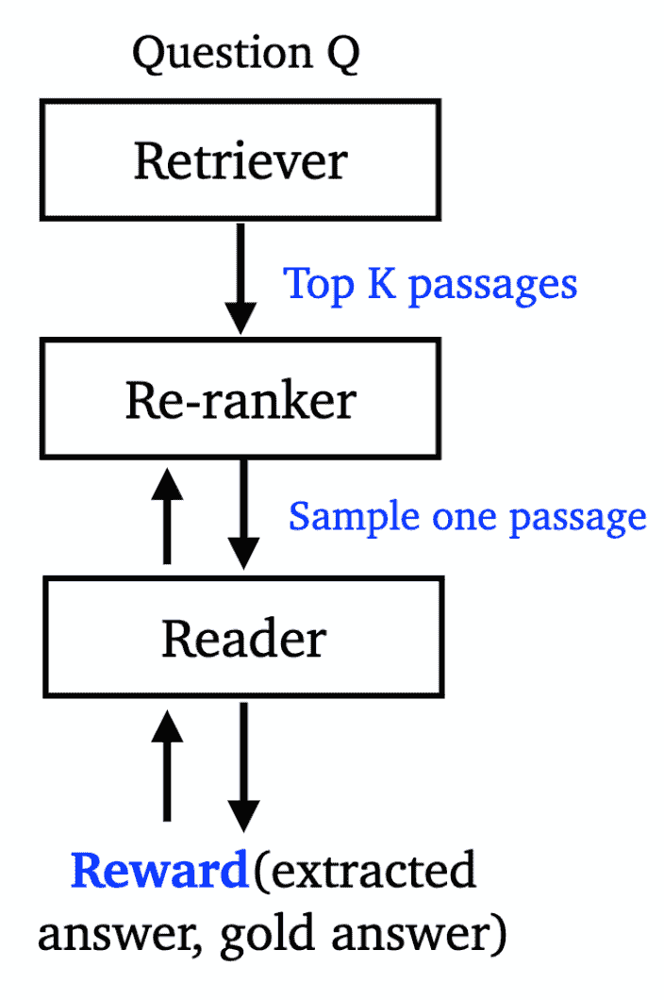

图 7\. R³ 训练过程的工作流程。（图片来源：[acl2020-openqa-tutorial/slides/part4](https://github.com/danqi/acl2020-openqa-tutorial/blob/master/slides/part4-retriever-reader.pdf)）

**ORQA**（“开放式检索问答”；[Lee 等，2019](https://arxiv.org/abs/1906.00300)）共同学习检索器+阅读器 QA 模型，以监督方式优化获得正确答案的边际对数似然。没有明确的“黑盒”IR 系统参与。相反，它能够检索开放语料库中的任何文本。在训练过程中，ORQA 不需要地面真相上下文段落（即阅读理解数据集），而只需要（问题，答案）字符串对。检索器和阅读器组件都基于 BERT，但不共享。

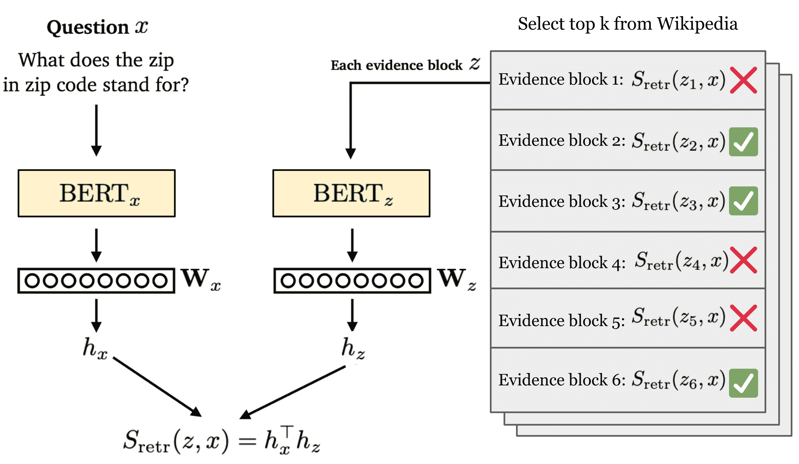

图 8\. ORQA 中检索器组件的示意图。（图片来源：重新绘制，基于[acl2020-openqa-tutorial/slides/part5](https://github.com/danqi/acl2020-openqa-tutorial/blob/master/slides/part5-dense-retriever-e2e-training.pdf)中的一张幻灯片）

所有证据块都按检索分数排名，定义为问题$x$的`[CLS]`标记和证据块$z$的 BERT 嵌入向量的内积。请注意，问题和上下文的编码器是独立的。

$$ \begin{aligned} h_x &= \mathbf{W}_x \text{BERT}_x(x)^{\mathtt{[CLS]}} \\ h_z &= \mathbf{W}_z \text{BERT}_z(z)^{\mathtt{[CLS]}} \\ S_\text{retr}(z, x) &= h_x^\top h_z \end{aligned} $$

检索器模块使用*Inverse Cloze Task (ICT)*进行预训练，即给定一个句子预测上下文，与标准的[Cloze Task](https://en.wikipedia.org/wiki/Cloze_test)相反。ICT 目标是最大化给定随机句子$x$的正确上下文$z$的检索分数：

$$ L_\text{ICT} = p_\text{early}(z \vert x) = \frac{\exp(S_\text{retr}(z, x))}{\sum_{z'\in\text{BATCH}(\mathcal{Z})} \exp(S_\text{retr}(z', x))} $$

其中$\text{BATCH}(\mathcal{Z})$是同一批次中用作负样本的证据块集合。

经过这样的预训练，预期 BERT 检索器的表示足够好以进行证据检索。只需对问题编码器进行微调以进行答案提取。换句话说，证据块编码器（即$\mathbf{W}_z$和$\text{BERT}_z$）是固定的，因此所有证据块编码都可以预先计算，并支持快速最大内积搜索（MIPS）。

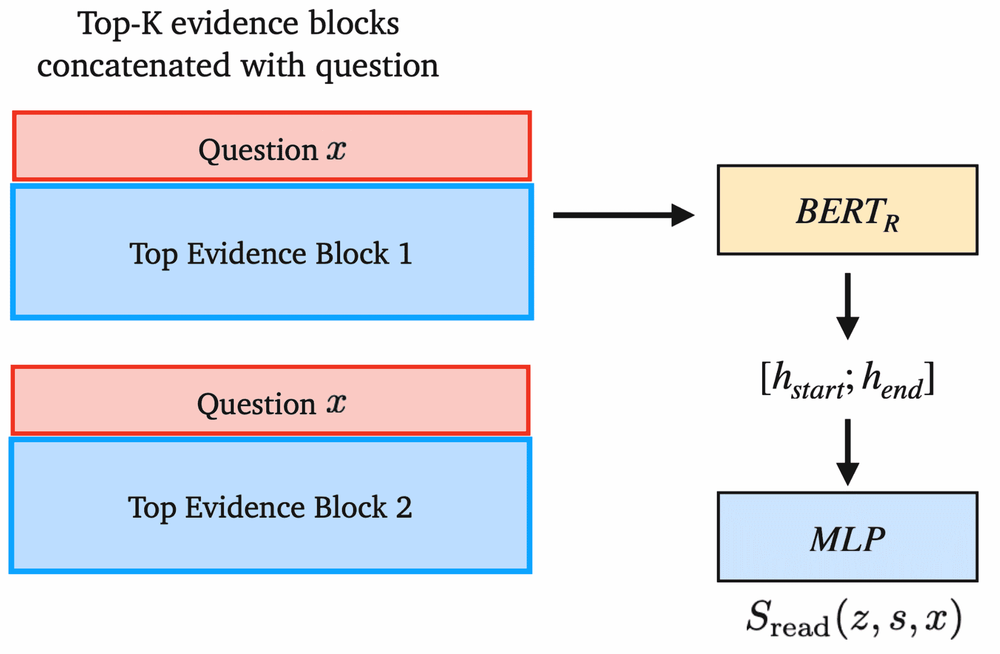

图 9\. ORQA 中阅读器组件的示意图（图片来源：[acl2020-openqa-tutorial/slides/part5](https://github.com/danqi/acl2020-openqa-tutorial/blob/master/slides/part5-dense-retriever-e2e-training.pdf)）

阅读器遵循原始[BERT RC](https://lilianweng.github.io/posts/2019-01-31-lm/#use-bert-in-downstream-tasks)实验中的相同设计。它以监督方式学习，而证据块编码器的参数是固定的，所有其他参数都进行微调。给定问题$x$和黄金答案字符串$y$，阅读器损失包含两部分：

$$ \mathcal{L}(x, y) = \mathcal{L}_\text{early}(x, y) + \mathcal{L}_\text{full}(x, y) $$

(1) 在前$k$个证据块中找到所有正确的文本跨度，并优化匹配真实答案$y$的文本跨度$s$的边际似然：

$$ \begin{aligned} h_s &= \text{BERT}_R(x, y)^{(\text{START}(s))} \\ h_e &= \text{BERT}_R(x, y)^{(\text{END}(s))} \\ S_\text{read}(z, s, x) &= \text{MLP}([h_s; h_e]) \\ p(z, s \vert x) &= \frac{\exp(S_\text{read}(z, s, x))}{\sum_{z'\in\text{TOP}(k)} \sum_{s'\in z'} \exp(S_\text{read}(z', s', x))} \\ L_\text{full}(x, y) &= - \log \sum_{\substack{z \in \text{TOP}(k)\\ s \in z}} \sum_{y=\text{TEXT}(s)} p(z, s \vert x) \end{aligned} $$

其中$y=\text{TEXT}(s)$表示答案$y$是否与文本跨度$s$匹配。$\text{TOP}(k)$是根据$S_\text{retr}(z, x)$检索到的前$k$个块。该论文设置$k=5$。

(2) 在学习的早期阶段，当检索器还不够强大时，可能没有一个顶部的$k$块包含答案。为了避免这种稀疏的学习信号，ORQA 考虑了更大的$c$证据块集合，以进行更积极的学习。论文中$c=5000$。

$$ L_\text{early}(x, y) = -\log \sum_{\substack{z\in \text{TOP}(c)\\y\in\text{TEXT}(z)}} p_\text{early}(z\vert x) = -\log \sum_{\substack{z\in \text{TOP}(c)\\y\in\text{TEXT}(z)}} \frac{\exp(S_\text{retr}(z, x)}{\sum_{z'\in\text{TOP}(c)} \exp(S_\text{retr}(z', x)} $$

ORQA 论文中讨论了 SQuAD 数据集中的一些问题：

> “SQuAD 的开发和测试准确率之间的显着下降反映了数据集中的一个问题——其 10 万个问题仅来自 536 个文档。因此，训练示例之间的好的检索目标高度相关，违反了 IID 假设，使其不适用于学习检索。出于这个原因，我们强烈建议那些对端到端开放域 QA 模型感兴趣的人不再使用 SQuAD 进行训练和评估。”

**REALM**（“检索增强语言模型预训练”；[Guu 等人，2020 年](https://arxiv.org/abs/2002.08909)）还通过优化获得真实答案的边际似然来联合训练检索器+读者：

$$ p(y \vert x) = \sum_{z \in \mathcal{Z}} \underbrace{p(y \vert x, z)}_\text{读者} \underbrace{p(z \vert x)}_\text{检索器} \approx \sum_{z \in \text{TOP}_k(\mathcal{Z})} p(y \vert x, z) p(z \vert x) $$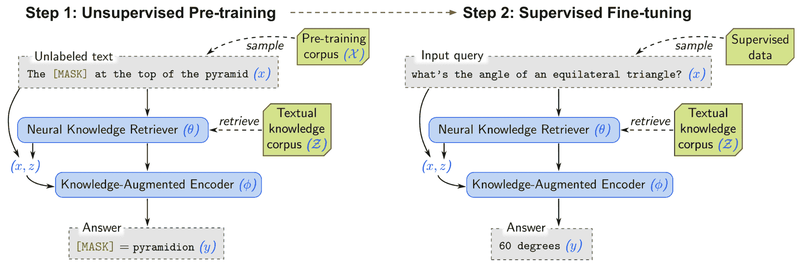

图 10。REALM 首先使用显著跨度屏蔽进行无监督预训练，然后再用 QA 数据进行微调。（图片来源：[Guu 等人，2020 年](https://arxiv.org/abs/2002.08909)）。

REALM 计算两个概率，$p(z \vert x)$ 和 $p(y \vert x, z)$，与 ORQA 相同。然而，与 ORQA 中的 ICT 不同，REALM 通过几个新的设计决策升级了无监督预训练步骤，从而实现更好的检索。REALM 使用维基百科或 CC-News 语料库对模型进行预训练。

1.  使用*显著跨度屏蔽*。命名实体和日期被识别。然后选择并屏蔽其中一个“显著跨度”。显著跨度屏蔽是 MLM 的一个特例，对 QA 任务效果很好。

1.  添加一个*空的空文档*。因为并非每个问题都需要一个上下文文档。

1.  不要进行平凡的检索。上下文文档不应与选择的带有屏蔽跨度的句子相同。

1.  在训练的早期阶段，当检索质量仍然较差时，应用与 ORQA 中相同的 ICT 损失以鼓励学习。

> “在所有系统中，与 REALM 最直接的比较是 ORQA（Lee 等人，2019 年），其中微调设置、超参数和训练数据是相同的。REALM 相对于 ORQA 的改进纯粹是由于更好的预训练方法。” ——来自 REALM 论文。

无监督预训练和监督微调都优化相同的对数似然$\log p(y \vert x)$。由于证据文档的检索器编码器的参数也在此过程中更新，MIPS 的索引正在变化。REALM 每隔几百个训练步骤异步使用更新的编码器参数刷新索引。

[Balachandran 等人（2021）](https://arxiv.org/abs/2104.08710)发现 REALM 明显训练不足，而 REALM++通过增加模型训练的批量大小和更多检索文档，使读者处理的 EM 准确性得到了很大的提高（3-5%）。

**DPR**（“密集段落检索器”；[Karpukhin 等人，2020](https://arxiv.org/abs/2004.04906)，[code](https://github.com/facebookresearch/DPR)）认为 ICT 预训练可能过于计算昂贵，而 ORQA 的上下文编码器可能不够优化，因为它没有与问题-答案对进行微调。DPR 旨在通过仅训练一个密集双编码器架构，仅从少量 Q/A 对中检索，而无需任何预训练来解决这两个问题。

与先前的工作相同，DPR 使用 BERT 表示的点积（L2 距离或余弦相似度也适用）作为检索分数。用于训练双编码器的损失函数是正面段落的 NLL，其本质上与 ICT 损失的 ORQA 相同。请注意，它们都将同一批次中的其他段落视为负样本，称为*批内负采样*。主要区别在于 DPR 依赖于监督 QA 数据，而 ORQA 在无监督语料库上进行 ICT 训练。在推断时，DPR 使用[FAISS](https://github.com/facebookresearch/faiss)来快速运行 MIPS。

DPR 进行了一系列比较实验，涉及几种不同类型的负例：

1.  随机：来自语料库的任意随机段落；

1.  BM25：由 BM25 返回的顶级段落，不包含答案但匹配大多数问题标记；

1.  批内负采样（“金标”）：与训练集中出现的其他问题配对的正面段落。

DPR 发现，使用来自同一小批次的金标段落和一个具有较高 BM25 分数的负面段落效果最好。为了进一步改善检索结果，DPR 还探索了一种设置，其中 BM25 分数和密集嵌入检索分数被线性组合以作为新的排名函数。

# 开放书问答：检索器-生成器

与检索器-阅读器方法相比，检索器-生成器也有 2 个阶段，但第二阶段是直接生成自由文本来回答问题，而不是在检索到的段落中提取起始/结束位置。一些论文也将此称为*生成式问答*。

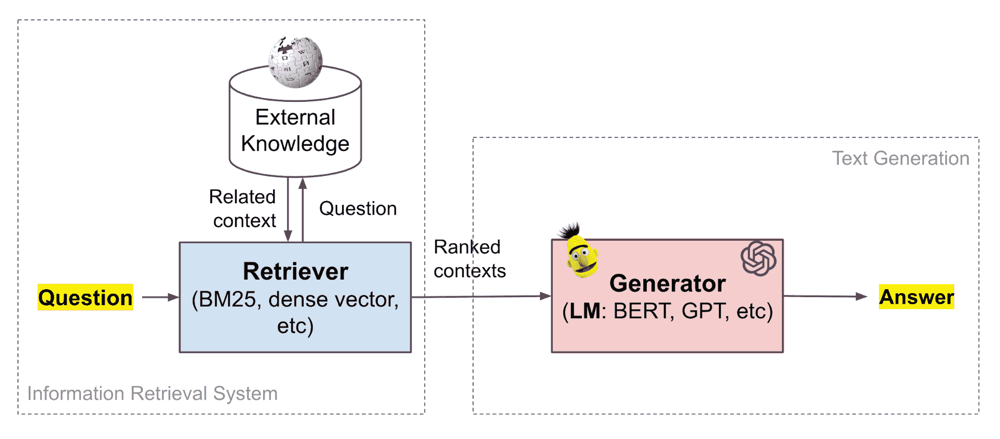

图 11. 检索器+生成器 QA 框架将文档检索系统与通用语言模型结合在一起。

预训练的 LM 在其参数中具有记忆知识的巨大能力，如上所示。然而，它们不能轻松修改或扩展其记忆，不能直接提供对其预测的见解，并可能产生不存在的幻觉。

[Petroni 等人（2020）](https://arxiv.org/abs/2005.04611)研究了检索到的相关上下文如何帮助生成式语言模型产生更好的答案。他们发现：

1.  通过相关上下文增强查询，显著提高了预训练的 LM 在无监督机器阅读能力上的表现。

1.  一个现成的 IR 系统足以使 BERT 达到监督 ODQA 基线的性能；

1.  BERT 的[NSP](https://lilianweng.github.io/posts/2019-01-31-lm/#pre-training-tasks)预训练策略是一种高效的无监督机制，用于处理嘈杂和无关的上下文。

将 BERT 模型与不同类型的上下文配对，包括对抗性（无关上下文）、检索（通过 BM25 检索）和生成性（通过一个包含 1.4N 参数的自回归语言模型，在 CC-NEWS 上训练）。发现该模型对对抗性上下文具有鲁棒性，但仅当问题和上下文作为两个片段提供时（例如，由`[SEP]`分隔）。一个假设与 NSP 任务有关：“如果 NSP 得分低，BERT 可能会学习不跨片段进行掩码标记预测，从而隐式检测到无关和嘈杂的上下文。”

**RAG**（“检索增强生成”；[Lewis 等人，2020](https://arxiv.org/abs/2005.11401)）将预训练的参数化（语言模型）和非参数化记忆（外部知识索引）结合在一起进行语言生成。RAG 可以在任何 seq2seq 任务上进行微调，从而同时学习检索器和序列生成器。他们发现，无约束的生成优于先前的抽取式方法。

RAG 由一个检索器模型$p_\eta(z \vert x)$和一个生成器模型$p_\theta(y_i \vert x, z, y_{1:i-1})$组成：

+   检索器使用输入序列$x$检索文本段落$z$，实现为 DPR 检索器。$\log p_\eta(z \vert x) \propto E_z(z)^\top E_x(x)$。

+   生成器在生成目标序列$y$时使用$z$作为额外上下文，其中上下文和问题简单地连接在一起。

根据每个标记生成时是否使用相同或不同的检索文档，RAG 有两个版本：

$$ \begin{aligned} p_\text{RAG-seq}(y \vert x) &= \sum_{z \in \text{TOP}_k(p_\eta(.\vert x))} p_\eta(z \vert x) \prod_i^N p_\theta(y_i \vert x, z, y_{1:i-1}) \\ p_\text{RAG-token}(y \vert x) &= \prod_i^N \sum_{z \in \text{TOP}_k(p_\eta(.\vert x))} p_\eta(z_i\vert x) p_\theta(y_i \vert x, z_i, y_{1:i-1}) \end{aligned} $$

RAG 中的检索器+生成器是联合训练的，以最小化 NLL 损失，$\mathcal{L}_\text{RAG} = \sum_j -\log p(y_j \vert x_j)$。更新段落编码器$E_z(.)$是昂贵的，因为它要求模型重新索引文档以进行快速 MIPS。RAG 认为不需要对$E_z(.)$进行微调（就像在 ORQA 中一样），只更新查询编码器+生成器。

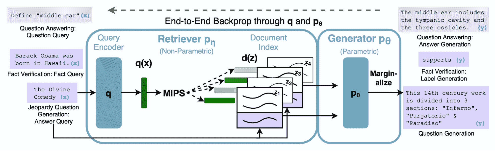

图 12。检索增强生成（RAG）架构的示意图。（图片来源：[Lewis 等人，2020](https://arxiv.org/abs/2005.11401)）

在解码/测试时，RAG-token 可以通过[束搜索](https://d2l.ai/chapter_recurrent-modern/beam-search.html#id1)进行评估。RAG-seq 无法分解为一组每个标记的可能性，因此它为每个候选文档$z$运行束搜索，并选择具有最佳$p_\theta(y_i \vert x, z, y_{1:i-1})$的文档。

*Fusion-in-Decoder* 方法，由[Izacard & Grave (2020)](https://arxiv.org/abs/2007.01282)提出，也基于预训练的 T5。它的工作方式类似于 RAG，但在上下文如何整合到解码器中方面有所不同。

1.  检索前$k$个相关段落，每个段落 100 个词，使用 BM25 或 DPR。

1.  每个检索到的段落及其标题都使用特殊标记（如`question:`、`title:`和`context:`）与问题连接，以指示内容差异。

1.  每个检索到的段落都会被独立处理，然后在解码器中合并。在编码器中独立处理段落允许我们并行计算。另一方面，在联合处理它们时鼓励更好地聚合多个证据片段。在抽取式方法中缺少聚合部分。

请注意，他们对预训练的语言模型独立进行了微调，针对每个数据集。

# 闭卷问答：生成式语言模型

大型语言模型已在大量无监督文本语料库上进行了预训练。在有足够参数的情况下，这些模型能够记忆一些事实知识在参数权重中。因此，我们可以使用这些模型进行无需明确上下文的问答，就像在闭卷考试中一样。预训练语言模型生成*自由文本*以回答问题，没有明确的阅读理解。

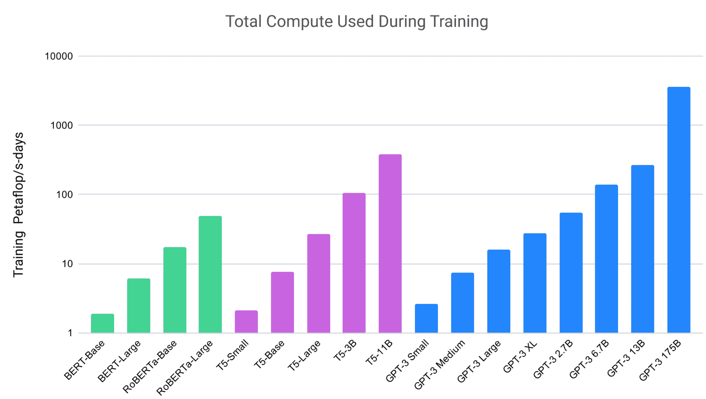

图 13。用于训练不同规模的大型语言模型所使用的计算量正在增加。（图片来源：[Brown 等人，2020](https://arxiv.org/abs/2005.14165)）。

[Roberts 等人（2020）](https://arxiv.org/abs/2002.08910)通过微调预训练模型来衡量语言模型的实用性，以回答问题而无需访问任何外部上下文或知识。他们将[T5](https://arxiv.org/abs/1910.10683)语言模型（与原始 Transformer 相同的架构）微调为回答问题，而无需输入任何额外信息或上下文。这种设置迫使语言模型根据在预训练期间内化的“知识”来回答问题。

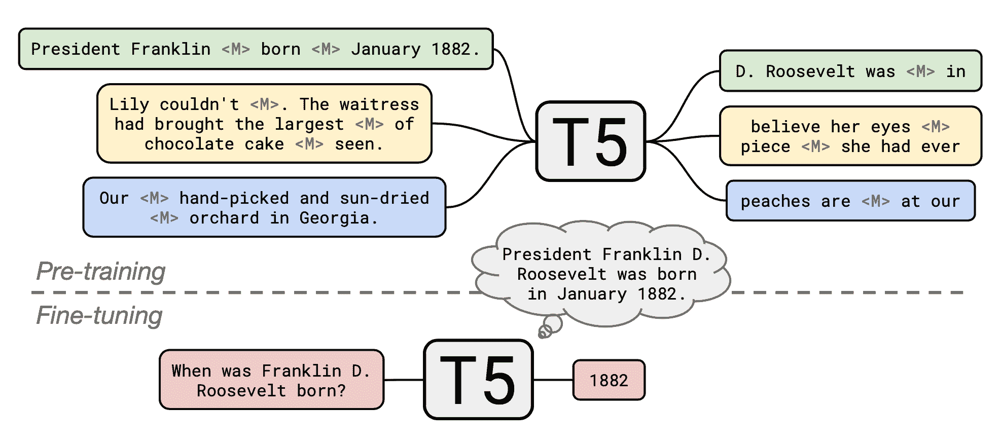

图 14. T5 首先通过显著的遮蔽预训练，然后针对每个 QA 数据集进行微调，以生成自由文本中的答案。（图片来源：[Roberts 等人，2020](https://arxiv.org/abs/2002.08910)）

原始的 T5 模型在多任务混合上进行了预训练，包括在 C4（“巨大干净爬取语料库”）数据集上的无监督[“遮蔽语言建模”](https://lilianweng.github.io/posts/2019-01-31-lm/#use-bert-in-downstream-tasks)（MLM）任务，以及与监督翻译、摘要、分类和阅读理解任务一起进行了微调。[Roberts 等人（2020）](https://arxiv.org/abs/2002.08910)采用了一个预训练的 T5 模型，并继续使用显著遮蔽在维基百科语料库上进行预训练，这已被发现可以大幅提升开放领域问答的性能。然后他们为每个 QA 数据集独立地微调模型。

使用预训练的 T5 语言模型+继续使用显著遮蔽进行预训练+针对每个 QA 数据集进行微调，

+   它可以在没有访问外部知识的情况下获得开放领域问答的竞争性结果。

+   更大的模型可以获得更好的性能。例如，具有 11B 参数的 T5 能够与 DPR 的 3 个 BERT-base 模型（每个模型有 330M 参数）的性能匹敌。

有趣的是，微调并非绝对必要。GPT3（[Brown 等人，2020](https://arxiv.org/abs/2005.14165)）在闭卷问答任务上进行了评估，*没有进行任何梯度更新或微调*。在评估过程中，这里的少次学习、一次学习和零次学习设置仅指提供了多少演示作为文本输入中的上下文：

1.  “少次学习”：GPT3 可以获取尽可能多的演示，以适应模型的上下文窗口（通常为 10 到 100）。

1.  “一次性学习”：只提供一次演示。

1.  “零次学习”：不允许演示，只向模型提供自然语言的指令。

随着模型规模的增长，性能也在提升。在 TriviaQA 数据集上，GPT3 在演示的情况下可以达到或超过通过微调得到的 SOTA 基线的性能。

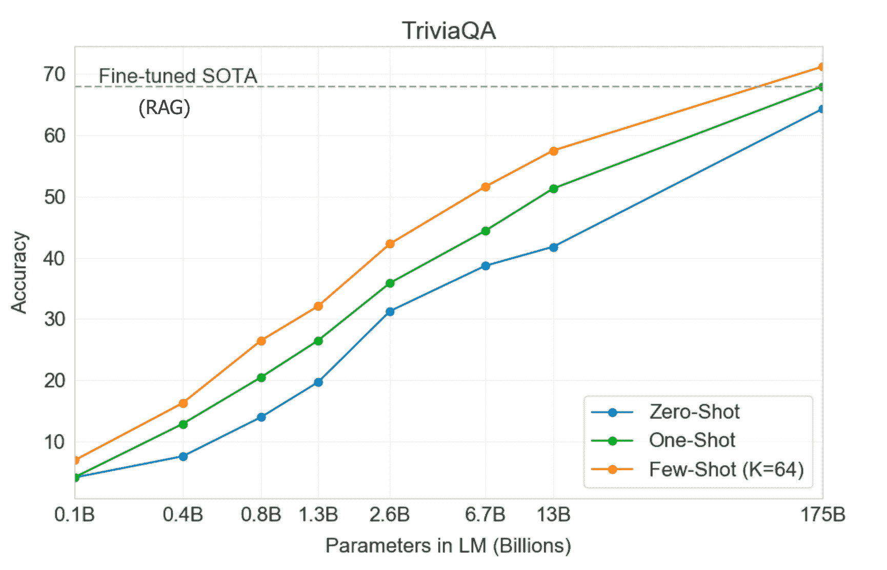

图 15\. GPT3 在 TriviaQA 上的表现随着模型规模的增长而平稳增长。更多的演示会导致更好的表现。（图片来源：[Brown 等人，2020](https://arxiv.org/abs/2005.14165)）。

查看 OpenAI API 的这个酷例子[playground viewer](https://beta.openai.com/playground/p/HMoho4552EHXrPLbmOIxpX4X)。该模型能够以简短回答形式回答事实性问题，并且在模型不知道答案时不会凭空捏造。我添加了最后两个问题，并要求模型以`A:`回答。该 API 仍处于测试版，因此您可能需要[申请](https://beta.openai.com/)加入等待列表。

```py
Q: Who is Batman?
A: Batman is a fictional comic book character.
##
Q: What is torsalplexity?
A: ?
##
Q: What is Devz9?
A: ?
##
Q: Who is George Lucas?
A: George Lucas is American film director and producer famous for creating Star Wars.
##
Q: What is the capital of California?
A: Sacramento.
##
Q: What orbits the Earth?
A: The Moon.
##
Q: Who is Fred Rickerson?
A: ?
##
Q: What is an atom?
A: An atom is a tiny particle that makes up everything.
##
Q: Who is Alvan Muntz?
A: ?
##
Q: What is Kozar-09?
A: ?
##
Q: How many moons does Mars have?
A: Two, Phobos and Deimos.
##
Q: What is COVID-19?
A: ?
##
Q: What is H1N1?
A: H1N1 is a strain of influenza. 
```

# 相关技术

## 快速最大内积搜索（MIPS）

MIPS（最大内积搜索）是许多开放领域问答模型中的关键组件。在检索器 + 读者/生成器框架中，来自知识源的大量段落被编码并存储在内存中。检索模型能够查询内存以识别与问题嵌入具有最大内积的顶级相关段落。

我们需要快速的 MIPS，因为预先计算的段落表示数量可能是巨大的。在运行时实现快速 MIPS 有几种方法，例如[非对称 LSH](https://papers.nips.cc/paper/5329-asymmetric-lsh-alsh-for-sublinear-time-maximum-inner-product-search-mips.pdf)、[数据相关哈希](https://arxiv.org/abs/1501.01062)和[FAISS](https://github.com/facebookresearch/faiss)。

## 语言模型预训练

两个预训练任务对 QA 任务特别有帮助，正如我们上面所讨论的。

+   **逆向填空任务**（由 ORQA 提出）：[填空任务](https://en.wikipedia.org/wiki/Cloze_test)的目标是根据上下文预测被屏蔽的文本。逆向填空任务（ICT）的预测方向相反，旨在根据一个句子预测上下文。在 QA 任务的背景下，一个随机句子可以被视为伪问题，其上下文可以被视为伪证据。

+   **显著跨度屏蔽**（由 REALM 提出）：显著跨度屏蔽是语言模型训练中 MLM 任务的一个特殊情况。首先，我们通过使用标记器识别命名实体和正则表达式识别日期来找到*显著跨度*。然后选择并屏蔽检测到的一个显著跨度。任务是预测这个被屏蔽的显著跨度。

# 摘要

| 模型 | 检索器 | 读者 / 生成器 | 预训练 / 微调 | 端到端 |
| --- | --- | --- | --- | --- |
| DrQA | TF-IDF | 双向 LSTM | – | 否 |
| BERTserini | Aserini + BM25 | 没有 softmax 层的 BERT | 与 SQuAD 微调 | 否 |
| 多段 BERT | ElasticSearch + BM25 | 多段 BERT + 段落排序器 |  | 否 |
| R³ | 经典 IR + Match-LSTM | Match-LSTM |  | 是 |
| ORQA | BERT 嵌入的点积 | BERT-RC | 逆向填空任务 | 是 |
| REALM | BERT 嵌入的点积 | BERT-RC | 显著跨度屏蔽 | 是 |
| DPR | BERT 嵌入的点积 | BERT-RC | 通过 QA 对进行监督训练 | 是 |
| DenSPI | 经典 + 神经信息检索 | – |  | 是 |
| T5 + SSM | – | T5 | SSM 在[CommonCrawl](https://commoncrawl.org/the-data/get-started/)数据上 + 在 QA 数据上进行微调 | 是 |
| GPT3 | – | GPT3 | NSP 在[CommonCrawl](https://commoncrawl.org/the-data/get-started/)数据上 | 是 |
| RAG | DPR 检索器 | [BART](https://arxiv.org/abs/1910.13461) |  | 是 |
| Fusion-in-Decoder | BM25 / DPR 检索器 | Tranformer |  | 否 |

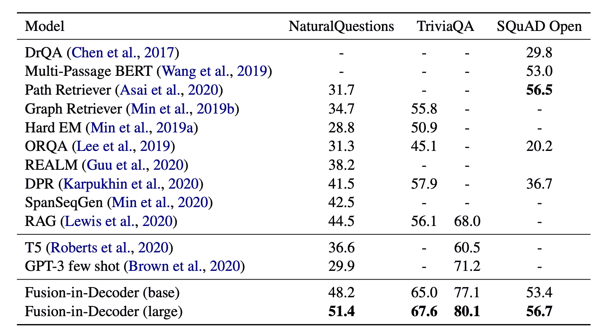

图 16. 几个问答模型在常见问答数据集上的性能比较。在 TriviaQA 上，报告了两列结果，分别是开放领域测试集（左）和隐藏测试集（右）。 (图片来源：[Izacard & Grave, 2020](https://arxiv.org/abs/2007.01282))。

# 引用

被引用为：

> Weng, Lilian. (2020 年 10 月). 如何构建一个开放领域的问答系统？Lil’Log. https://lilianweng.github.io/posts/2020-10-29-odqa/.

或

```py
@article{weng2020odqa,
  title   = "How to Build an Open-Domain Question Answering System?",
  author  = "Weng, Lilian",
  journal = "lilianweng.github.io",
  year    = "2020",
  month   = "Oct"
  url     = "https://lilianweng.github.io/posts/2020-10-29-odqa/"
} 
```

# 附录：问答数据集

+   [SQuAD 2.0](https://rajpurkar.github.io/SQuAD-explorer/)：斯坦福问答数据集。

+   [RACE](http://www.qizhexie.com/data/RACE_leaderboard)：从为中学和高中学生创建的英语考试中收集的阅读理解数据集。

+   [TREC 问答](https://trec.nist.gov/data/qa.html)：TREC 问答集合。

+   [MS MARCO](https://microsoft.github.io/msmarco/)：一个包含 10 万个真实必应问题和人工生成答案的问答数据集。

+   [CuratedTREC](https://github.com/brmson/dataset-factoid-curated)：基于 TREC 问答任务的基准，由[Baudis & Sedivy (2015)](https://link.springer.com/chapter/10.1007%2F978-3-319-24027-5_20)策划。

+   [Google 自然问题](https://ai.google.com/research/NaturalQuestions/dataset)：包含向 Google 搜索发出的真实用户问题，以及由注释者从维基百科找到的答案。

+   [WebQuestions](https://github.com/brmson/dataset-factoid-webquestions)：设计用于基于知识库的问答，答案限制在 Freebase 实体上。

+   [WikiQA](https://www.microsoft.com/en-us/research/publication/wikiqa-a-challenge-dataset-for-open-domain-question-answering/)：必应查询日志被用作问题的来源。然后将每个问题链接到潜在包含答案的维基百科页面。

+   [WikiMovies](https://research.fb.com/downloads/babi/)：包含来自 OMDb 和 MovieLens 数据库的与电影相关的问题，这些问题可以使用维基百科页面回答。

+   [WikiReading](https://github.com/google-research-datasets/wiki-reading)：通过阅读相应维基百科文章的文本来预测结构化知识库 Wikidata 中的文本值。

+   [TriviaQA](https://nlp.cs.washington.edu/triviaqa/)：一个包含 95K 问题-答案对的阅读理解数据集，由爱好者编写，并独立收集每个问题的多个证据文档。

+   [Jeopardy! 问题](https://www.kaggle.com/tunguz/200000-jeopardy-questions)：包含 200,000+ [Jeopardy!](https://en.wikipedia.org/wiki/Jeopardy!) 问题。

+   [DeepMind Q&A 数据集](https://cs.nyu.edu/~kcho/DMQA/)：来自 CNN 和 Daily Mail 文章的问题/答案对。

+   [bAbi](https://research.fb.com/downloads/babi/)：Facebook 用于文本理解的丰富数据集集合。

+   [FEVER](https://fever.ai/data.html)：用于事实提取和验证。

+   [SearchQA](https://github.com/nyu-dl/dl4ir-searchQA)：问题-答案对从 [J! Archive](https://j-archive.com/) 爬取，然后用 Google 的文本片段进行增强。

+   [Quasar-T](https://github.com/bdhingra/quasar)：从各种互联网来源获取的开放领域琐事问题及其答案的集合。

+   [Quiz bowl](https://people.cs.umass.edu/~miyyer/qblearn/index.html)：包含来自名为 quiz bowl 的琐事竞赛的数据。

+   [AmbigNQ](https://nlp.cs.washington.edu/ambigqa/)：从 NQ-OPEN 数据集中选出的模糊问题。

+   [QA-Overlap](https://github.com/facebookresearch/QA-Overlap)：自然问题、TriviaQA 和 WebQuestions 训练集和测试集之间重叠答案/问题的集合。

# 参考文献

[1] 陈丹琦和斯科特·伊。[“ACL2020 教程：开放领域问答”](https://github.com/danqi/acl2020-openqa-tutorial) 2020 年 7 月。

[2] 陈丹琦等人。[“阅读维基百科以回答开放领域问题”](https://arxiv.org/abs/1704.00051) ACL 2017。| [code](https://github.com/facebookresearch/DrQA)

[3] 王硕航等人。[“R³：强化排序-阅读器用于开放领域问答”](https://arxiv.org/abs/1709.00023) AAAI 2018。

[4] 吉米·林。[“神经炒作和与弱基线的比较。”](https://sigir.org/wp-content/uploads/2019/01/p040.pdf) ACM SIGIR 论坛。Vol. 52。No. 2。2019 年。

[5] 杨伟等人。[“使用 BERTserini 进行端到端开放领域问答”](https://arxiv.org/abs/1902.01718) NAACL 2019。

[6] 克里斯托弗·克拉克和马特·加德纳。[“简单而有效的多段阅读理解。”](https://arxiv.org/abs/1710.10723) arXiv:1710.10723 (2017)。

[7] Rodrigo Nogueira 和 Kyunghyun Cho。[“使用 BERT 进行段落重新排序。”](https://arxiv.org/abs/1901.04085) arXiv 预印本 arXiv:1901.04085 (2019)。| [code](https://github.com/nyu-dl/dl4marco-bert)

[8] 王志国等人。[“多段 BERT：用于开放领域问答的全局归一化 BERT 模型。”](https://arxiv.org/abs/1908.08167) EMNLP 2019。

[9] 徐敏俊等人。[“具有稠密-稀疏短语索引的实时开放领域问答。”](https://arxiv.org/abs/1906.05807) ACL 2019。

[10] Kenton Lee 等人。[“弱监督开放领域问答的潜在检索”](https://arxiv.org/abs/1906.00300) ACL 2019。

[11] Kelvin Guu 等人。[“REALM：检索增强语言模型预训练”](https://arxiv.org/abs/2002.08909) arXiv:2002.08909 (2020)。

[12] Vladimir Karpukhin 等人。[“用于开放领域问答的密集段落检索。”](https://arxiv.org/abs/2004.04906) EMNLP 2020。 | [代码](https://github.com/facebookresearch/DPR)

[13] Patrick Lewis 等人。[“用于知识密集型自然语言处理任务的检索增强生成”](https://arxiv.org/abs/2005.11401) arXiv:2005.11401 (2020)。

[14] Adam Roberts 等人。[“语言模型参数中可以包含多少知识？”](https://arxiv.org/abs/2002.08910) EMNLP 2020。

[15] Tom Brown 等人。[“语言模型是少样本学习者。”](https://arxiv.org/abs/2005.14165) arXiv:2005.14165 (2020)。

[16] Fabio Petroni 等人。[“上下文如何影响语言模型的事实预测”](https://arxiv.org/abs/2005.04611) AKBC 2020。

[17] Gautier Izacard 和 Edouard Grave。[“利用生成模型的段落检索进行开放领域问答。”](https://arxiv.org/abs/2007.01282) arXiv:2007.01282 (2020)。

[18] [“深入深度学习：波束搜索”](https://d2l.ai/chapter_recurrent-modern/beam-search.html)

[19] Patrick Lewis 等人。[“开放领域问答数据集中的问题和答案测试训练重叠”](https://arxiv.org/abs/2008.02637) arXiv:2008.02637 (2020)。 | [数据](https://github.com/facebookresearch/QA-Overlap)

[20] Hervé Jegou 等人。[“Faiss：高效相似性搜索的库”](https://engineering.fb.com/2017/03/29/data-infrastructure/faiss-a-library-for-efficient-similarity-search/) 2017 年 3 月。

[21] Vidhisha Balachandran 等人。[“改进 REALM 的简单有效方法。”](https://arxiv.org/abs/2104.08710) arXiv:2104.08710 (2021)。
