# 深度强化学习中的探索策略

> 原文：[`lilianweng.github.io/posts/2020-06-07-exploration-drl/`](https://lilianweng.github.io/posts/2020-06-07-exploration-drl/)

2020-06-17 更新：在“前向动力学”[部分中添加“通过分歧进行探索”。

[开发与探索](https://lilianweng.github.io/posts/2018-01-23-multi-armed-bandit/)是强化学习中的一个关键主题。我们希望 RL 代理尽快找到最佳解决方案。然而，同时过快地承诺解决方案而没有足够的探索听起来相当糟糕，因为这可能导致局部最小值或完全失败。现代[RL](https://lilianweng.github.io/posts/2018-02-19-rl-overview/) [算法](https://lilianweng.github.io/posts/2018-04-08-policy-gradient/)优化以获得最佳回报可以相当有效地实现良好的开发，而探索仍然更像是一个开放性主题。

我想在这里讨论深度 RL 中几种常见的探索策略。由于这是一个非常大的主题，我的帖子绝对不能涵盖所有重要的子主题。我计划定期更新，并逐渐丰富内容。

# 经典探索策略

作为一个快速回顾，让我们首先看看在多臂老虎机问题或简单的表格 RL 中表现相当不错的几种经典探索算法。

+   **ε-贪心**：代理偶尔以概率 $\epsilon$ 进行随机探索，并大部分时间以概率 $1-\epsilon$ 采取最优行动。

+   **上置信界**：代理人选择最贪婪的行动以最大化上置信界 $\hat{Q}_t(a) + \hat{U}_t(a)$，其中 $\hat{Q}_t(a)$ 是与行动 $a$ 相关的平均奖励，直到时间 $t$，而 $\hat{U}_t(a)$ 是一个与行动 $a$ 被采取的次数反比的函数。更多细节请参见[这里](https://lilianweng.github.io/posts/2018-01-23-multi-armed-bandit/#upper-confidence-bounds)。

+   **玻尔兹曼探索**：代理从学习到的 Q 值上的[玻尔兹曼分布](https://en.wikipedia.org/wiki/Boltzmann_distribution)（softmax）中抽取行动，由温度参数 $\tau$ 调节。

+   **汤普森抽样**：代理人跟踪对最优行动概率的信念，并从该分布中抽样。更多细节请参见[这里](https://lilianweng.github.io/posts/2018-01-23-multi-armed-bandit/#thompson-sampling)。

当神经网络用于函数逼近时，以下策略可用于深度 RL 训练中更好的探索：

+   **熵损失项**：在损失函数中添加一个熵项 $H(\pi(a \vert s))$，鼓励策略采取多样化的行动。

+   **基于噪音的探索**：向观察、行动甚至参数空间添加噪音（[Fortunato 等人，2017](https://arxiv.org/abs/1706.10295)，[Plappert 等人，2017](https://arxiv.org/abs/1706.01905)）。

# 关键探索问题

当环境很少提供奖励作为反馈或环境存在干扰噪音时，良好的探索变得特别困难。许多探索策略被提出来解决以下一个或两个问题。

## 难探索问题

“难探索”问题指的是在具有非常稀疏甚至具有欺骗性奖励的环境中进行探索。这很困难，因为在这种情况下的随机探索很少能发现成功的状态或获得有意义的反馈。

[蒙特祖玛的复仇](https://en.wikipedia.org/wiki/Montezuma%27s_Revenge_(video_game))是难探索问题的一个具体例子。它仍然是 Atari 中几个具有挑战性的游戏之一，供深度强化学习解决。许多论文使用蒙特祖玛的复仇来评估他们的结果。

## 嘈杂电视问题

“嘈杂电视”问题起初是在[Burda 等人（2018）](https://arxiv.org/abs/1810.12894)的思想实验中提出的。想象一下，一个强化学习代理被奖励寻找新颖的体验，一个带有不可控制和不可预测随机噪音输出的电视能够永远吸引代理的注意力。代理持续从嘈杂的电视中获得新奖励，但它无法取得任何有意义的进展，变成了一个“沙发土豆”。

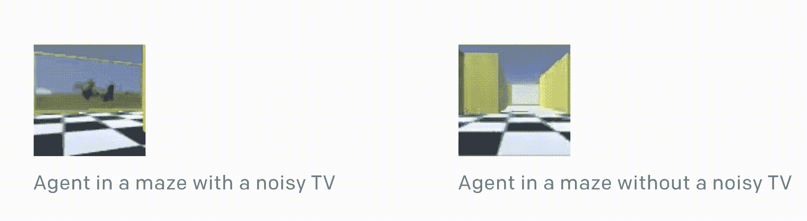

图 1\. 在实验中，一个代理被奖励获得新颖的体验。如果一个迷宫设置了一个嘈杂的电视，代理将被吸引并停止在迷宫中移动。（图片来源：OpenAI 博客：["基于预测奖励的强化学习"](https://openai.com/blog/reinforcement-learning-with-prediction-based-rewards/)）

# 作为探索奖励的内在奖励

一个常见的改进探索方法，特别是用于解决难探索问题的方法，是通过额外的奖励信号增加环境奖励，以鼓励额外的探索。因此，策略是通过由两个项组成的奖励进行训练的，$r_t = r^e_t + \beta r^i_t$，其中 $\beta$ 是调整开发和探索之间平衡的超参数。

+   $r^e_t$ 是时间 $t$ 环境中的*外在*奖励，根据手头的任务定义。

+   $r^i_t$ 是时间 $t$ 的*内在*探索奖励。

这种内在奖励在一定程度上受到了心理学中*内在动机*的启发（[Oudeyer & Kaplan, 2008](https://www.researchgate.net/profile/Pierre-Yves_Oudeyer/publication/29614795_How_can_we_define_intrinsic_motivation/links/09e415107f1b4c8041000000/How-can-we-define-intrinsic-motivation.pdf)）。由好奇心驱动的探索可能是孩子成长和学习的重要方式。换句话说，在人类心智中，探索性活动应该在内在上具有奖励性，以鼓励这种行为。内在奖励可能与好奇心、惊讶、状态的熟悉度以及许多其他因素相关。

相同的思想可以应用于强化学习算法。在接下来的章节中，基于奖励的探索方法大致分为两类：

1.  发现新领域

1.  改善代理对环境的知识。

## 基于计数的探索

如果我们将内在奖励视为让我们感到惊讶的奖励条件，我们需要一种方法来衡量一个状态是新颖的还是经常出现的。一种直观的方法是计算一个状态被遇到的次数，并相应地分配一个奖励。这个奖励引导代理的行为，使其更倾向于罕见的状态而不是常见的状态。这被称为**基于计数的探索**方法。

让 $N_n(s)$ 是跟踪状态 $s$ 在序列 $s_{1:n}$ 中实际访问次数的*经验计数*函数。不幸的是，直接使用 $N_n(s)$ 进行探索是不切实际的，因为大多数状态的 $N_n(s)=0$，特别是考虑到状态空间通常是连续或高维的。即使这些状态以前从未见过，大多数状态都需要一个非零计数。

### 通过密度模型计数

[Bellemare 等人（2016）](https://arxiv.org/abs/1606.01868) 使用了一个**密度模型**来近似状态访问的频率，并提出了一种从这个密度模型中导出*伪计数*的新算法。让我们首先定义一个关于状态空间的条件概率，$\rho_n(s) = \rho(s \vert s_{1:n})$，表示给定前 $n$ 个状态为 $s_{1:n}$ 时第 $(n+1)$ 个状态为 $s$ 的概率。为了在经验上衡量这一点，我们可以简单地使用 $N_n(s)/n$。

让我们还定义一个状态 $s$ 的*重新编码概率*，即在观察到 $s$ 的新出现后，密度模型分配给 $s$ 的概率，$\rho’_n(s) = \rho(s \vert s_{1:n}s)$。

该论文引入了两个概念来更好地调节密度模型，一个是*伪计数*函数 $\hat{N}_n(s)$，另一个是*伪计数总数* $\hat{n}$。由于它们旨在模拟一个经验计数函数，我们会有：

$$ \rho_n(s) = \frac{\hat{N}_n(s)}{\hat{n}} \leq \rho'_n(s) = \frac{\hat{N}_n(s) + 1}{\hat{n} + 1} $$

$\rho_n(x)$ 和 $\rho’_n(x)$ 之间的关系要求密度模型是*学习正向*的：对于所有 $s_{1:n} \in \mathcal{S}^n$ 和所有 $s \in \mathcal{S}$，$\rho_n(s) \leq \rho’_n(s)$。 换句话说，观察到一个 $s$ 实例后，密度模型对相同的 $s$ 的预测应该增加。 除了是学习正向外，密度模型应该完全*在线*训练，使用非随机的经验状态小批次，因此自然地我们有 $\rho’_n = \rho_{n+1}$。

伪计数可以通过解决上述线性系统后从 $\rho_n(s)$ 和 $\rho’_n(s)$ 计算得出：

$$ \hat{N}_n(s) = \hat{n} \rho_n(s) = \frac{\rho_n(s)(1 - \rho'_n(s))}{\rho'_n(s) - \rho_n(s)} $$

或者通过*预测增益（PG）*估计：

$$ \hat{N}_n(s) \approx (e^{\text{PG}_n(s)} - 1)^{-1} = (e^{\log \rho'_n(s) - \log \rho(s)} - 1)^{-1} $$

基于计数的内在奖励的常见选择是 $r^i_t = N(s_t, a_t)^{-1/2}$（如 MBIE-EB 中；[Strehl & Littman, 2008](https://www.ics.uci.edu/~dechter/courses/ics-295/fall-2019/papers/2008-littman-aij-main.pdf)）。基于伪计数的探索奖励以类似形式塑造，$r^i_t = \big(\hat{N}_n(s_t, a_t) + 0.01 \big)^{-1/2}$。

[Bellemare 等人（2016）](https://arxiv.org/abs/1606.01868)的实验采用了一个简单的[CTS](http://proceedings.mlr.press/v32/bellemare14.html)（上下文树切换）密度模型来估计伪计数。 CTS 模型以 2D 图像作为输入，并根据位置相关的 L 形滤波器的乘积为其分配概率，其中每个滤波器的预测由在过去图像上训练的 CTS 算法给出。 CTS 模型简单但在表达能力、可扩展性和数据效率方面受到限制。 在随后的一篇论文中，[Georg Ostrovski 等人（2017）](https://arxiv.org/abs/1703.01310)通过训练 PixelCNN（[van den Oord 等人，2016](https://arxiv.org/abs/1606.05328)）作为密度模型改进了该方法。

密度模型也可以是高斯混合模型，就像[Zhao & Tresp (2018)](https://arxiv.org/abs/1902.08039)中所述。 他们使用变分 GMM 来估计轨迹的密度（例如状态序列的串联）及其预测概率，以指导经验重播中的优先级设置。

### 哈希计数

使高维状态可计数的另一个想法是将状态映射到**哈希码**中，以便状态的出现变得可跟踪（[Tang 等人，2017](https://arxiv.org/abs/1611.04717)）。 状态空间通过哈希函数 $\phi: \mathcal{S} \mapsto \mathbb{Z}^k$ 离散化。 探索奖励 $r^{i}: \mathcal{S} \mapsto \mathbb{R}$ 被添加到奖励函数中，定义为 $r^{i}(s) = {N(\phi(s))}^{-1/2}$，其中 $N(\phi(s))$ 是 $\phi(s)$ 出现次数的经验计数。

[唐等人（2017）](https://arxiv.org/abs/1611.04717)提出使用*局部敏感哈希*（[*LSH*](https://en.wikipedia.org/wiki/Locality-sensitive_hashing))将连续的高维数据转换为离散的哈希码。LSH 是一种用于基于某些相似性度量查询最近邻居的哈希函数的流行类别。如果哈希方案$x \mapsto h(x)$保留数据点之间的距离信息，则称其为局部敏感，这样，接近的向量获得相似的哈希，而远离的向量具有非常不同的哈希。（如果感兴趣，可以查看[Transformer 改进](https://lilianweng.github.io/posts/2020-04-07-the-transformer-family/#LSH)中如何使用 LSH。）[SimHash](https://www.cs.princeton.edu/courses/archive/spr04/cos598B/bib/CharikarEstim.pdf)是一种计算效率高的 LSH 类型，通过角度距离来衡量相似性：

$$ \phi(s) = \text{sgn}(A g(s)) \in \{-1, 1\}^k $$

其中$A \in \mathbb{R}^{k \times D}$是一个矩阵，每个条目都从标准高斯分布中独立绘制，$g: \mathcal{S} \mapsto \mathbb{R}^D$是一个可选的预处理函数。二进制码的维度为$k$，控制状态空间离散化的粒度。更高的$k$会导致更高的粒度和更少的碰撞。

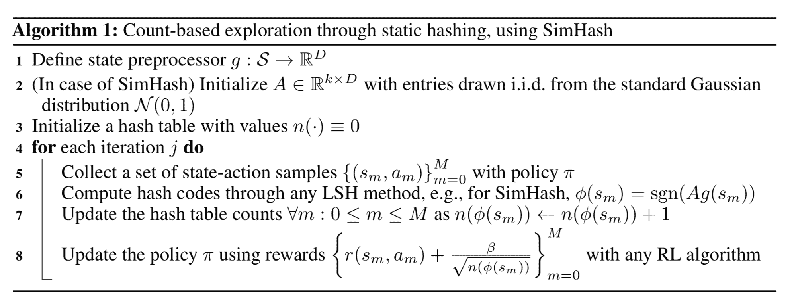

图 2\. 通过 SimHash 对高维状态进行哈希计数探索的算法。 （图片来源：[唐等人 2017](https://arxiv.org/abs/1611.04717)）

对于高维图像，SimHash 在原始像素级别上可能效果不佳。[唐等人（2017）](https://arxiv.org/abs/1611.04717)设计了一个自动编码器（AE），其输入为状态$s$以学习哈希码。它具有一个特殊的稠密层，由$k$个 sigmoid 函数组成，作为中间的潜在状态，然后该层的 sigmoid 激活值$b(s)$通过舍入到最接近的二进制数$\lfloor b(s)\rceil \in \{0, 1\}^D$作为状态$s$的二进制哈希码。对于$n$个状态的 AE 损失包括两个项：

$$ \mathcal{L}(\{s_n\}_{n=1}^N) = \underbrace{-\frac{1}{N} \sum_{n=1}^N \log p(s_n)}_\text{重构损失} + \underbrace{\frac{1}{N} \frac{\lambda}{K} \sum_{n=1}^N\sum_{i=1}^k \min \big \{ (1-b_i(s_n))², b_i(s_n)² \big\}}_\text{sigmoid 激活更接近二进制} $$

这种方法的一个问题是，不相似的输入$s_i, s_j$可能被映射到相同的哈希码，但自动编码器仍然完美地重构它们。可以想象用哈希码$\lfloor b(s)\rceil$替换瓶颈层$b(s)$，但是梯度无法通过舍入函数反向传播。注入均匀噪声可以减轻这种效应，因为自动编码器必须学会将潜变量远离以抵消噪声。

## 基于预测的探索

第二类内在探索奖励是为了奖励代理对环境知识的改进。代理对环境动态的熟悉程度可以通过预测模型估计。使用预测模型来衡量*好奇心*的想法实际上是相当久远的（[Schmidhuber, 1991](http://citeseerx.ist.psu.edu/viewdoc/summary?doi=10.1.1.45.957)）。

### 前向动力学

学习一个**前向动力学预测模型**是一种很好的途径，可以近似评估我们的模型对环境和任务 MDP 的了解程度。它捕捉了一个代理预测其行为后果的能力，$f: (s_t, a_t) \mapsto s_{t+1}$。这样的模型不可能完美（例如由于部分观测），误差$e(s_t, a_t) = | f(s_t, a_t) - s_{t+1} |²_2$可用于提供内在探索奖励。预测误差越高，我们对该状态的熟悉程度就越低。误差率下降得越快，我们获得的学习进展信号就越多。

*智能自适应好奇心*（**IAC**；[Oudeyer, et al. 2007](http://citeseerx.ist.psu.edu/viewdoc/download?doi=10.1.1.177.7661&rep=rep1&type=pdf)）勾勒了使用前向动力学预测模型估计学习进展并相应分配内在探索奖励的想法。

IAC 依赖一个存储机器人遇到的所有经验的记忆$M=\{(s_t, a_t, s_{t+1})\}$和一个前向动力学模型$f$。IAC 逐步将状态空间（即在机器人技术背景下的感知运动空间，如论文中所讨论的）根据转换样本分割成不同区域，使用类似于决策树分割的过程：当样本数量大于阈值时进行分割，每个叶子中状态的方差应该最小。每个树节点由其独有的样本集特征化，并有自己的前向动力学预测器$f`，称为“专家”。

专家的预测误差$e_t$被推送到与每个区域相关联的列表中。然后通过移动窗口的平均误差率与当前移动窗口之间的差异来衡量*学习进展*。内在奖励被定义为跟踪学习进展：$r^i_t = \frac{1}{k}\sum_{i=0}^{k-1}(e_{t-i-\tau} - e_{t-i})$，其中$k$是移动窗口大小。因此，我们能够实现更大的预测误差率下降，我们就会给予代理更高的内在奖励。换句话说，鼓励代理采取行动快速了解环境。

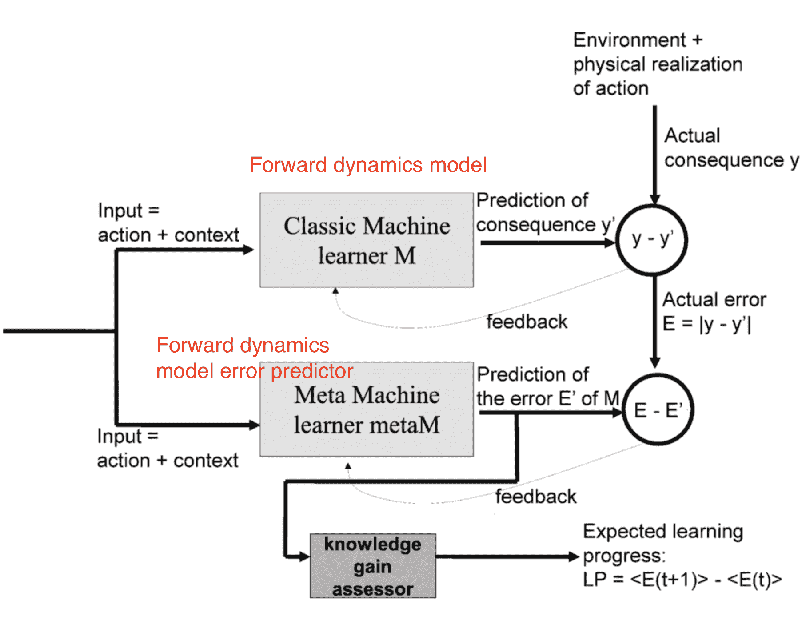

图 3\. IAC（智能自适应好奇心）模块的架构：内在奖励是根据减少动力学模型预测误差的学习进展而分配的。（图片来源：[Oudeyer, et al. 2007](http://citeseerx.ist.psu.edu/viewdoc/download?doi=10.1.1.177.7661&rep=rep1&type=pdf)）

[Stadie 等人（2015）](https://arxiv.org/abs/1507.00814)在由$\phi$定义的编码空间中训练了一个前向动力学模型，$f_\phi: (\phi(s_t), a_t) \mapsto \phi(s_{t+1})$。该模型在时间$T$的预测误差被时间$t$之前的最大误差归一化，$\bar{e}_t = \frac{e_t}{\max_{i \leq t} e_i}$，因此始终在 0 和 1 之间。相应地定义了内在奖励：$r^i_t = (\frac{\bar{e}_t(s_t, a_t)}{t \cdot C})$，其中$C > 0$是一个衰减常数。

通过$\phi(.)$对状态空间进行编码是必要的，因为论文中的实验表明，直接在原始像素上训练的动力学模型行为非常糟糕——为所有状态分配相同的探索奖励。在[Stadie 等人（2015）](https://arxiv.org/abs/1507.00814)中，编码函数$\phi$是通过自编码器（AE）学习的，$\phi(.)$是 AE 中的一个输出层。AE 可以使用由随机代理收集的一组图像进行静态训练，也可以与策略一起动态训练，其中早期帧是通过$\epsilon$-贪心探索收集的。

*内在好奇心模块*（**ICM**；[Pathak 等人，2017](https://arxiv.org/abs/1705.05363)）学习了状态空间编码$\phi(.)$，而不是自编码器。通过自监督的**逆动力学**模型来预测给定代理自身动作的下一个状态并不容易，特别是考虑到环境中的一些因素不能被代理控制或不影响代理。ICM 认为，一个良好的状态特征空间应该排除这些因素，因为*它们不能影响代理的行为，因此代理没有学习它们的动机*。通过学习一个逆动力学模型$g: (\phi(s_t), \phi(s_{t+1})) \mapsto a_t$，特征空间只捕捉与我们代理的行为相关的环境变化，忽略其余部分。

鉴于前向模型$f$，逆动力学模型$g$和观察$(s_t, a_t, s_{t+1})$：

$$ g_{\psi_I}(\phi(s_t), \phi(s_{t+1})) = \hat{a}_t \quad f_{\psi_F}(\phi(s_t), a_t) = \hat{\phi}(s_{t+1}) \quad r_t^i = \| \hat{\phi}(s_{t+1}) - \phi(s_{t+1}) \|_2² $$

这样的$\phi(.)$预计对环境中不可控制的方面具有鲁棒性。

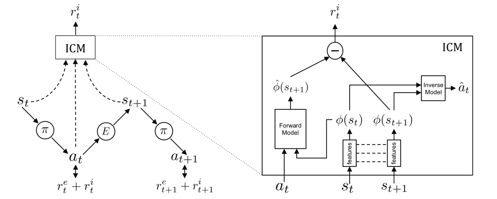

图 4。ICM（内在好奇心模块）将前向动力学预测误差分配给代理作为内在奖励。该动力学模型在通过逆动力学模型学习的状态编码空间中运行，以排除不影响代理行为的环境因素。（图片来源：[Pathak 等人，2017](https://arxiv.org/abs/1705.05363)）

[Burda, Edwards & Pathak, et al. (2018)](https://arxiv.org/abs/1808.04355)进行了一系列纯好奇驱动学习的大规模比较实验，意味着只向代理提供内在奖励。在这项研究中，奖励为$r_t = r^i_t = | f(s_t, a_t) - \phi(s_{t+1})|_2²$。选择好的$\phi$对于学习前向动态至关重要，预计应该是*紧凑*、*充分*和*稳定*的，使得预测任务更易处理并过滤掉不相关的观察。

在比较 4 种编码函数时：

1.  原始图像像素：无编码，$\phi(x) = x$。

1.  随机特征（RF）：每个状态通过固定的随机神经网络进行压缩。

1.  [VAE](https://lilianweng.github.io/posts/2018-08-12-vae/#vae-variational-autoencoder): 概率编码器用于编码，$\phi(x) = q(z \vert x)$。

1.  逆动态特征（IDF）：与 ICM 中使用的相同特征空间。

所有实验中，奖励信号都通过对累积回报的标准差的运行估计进行归一化。所有实验都在无限地平线设置中运行，以避免“完成”标志泄露信息。

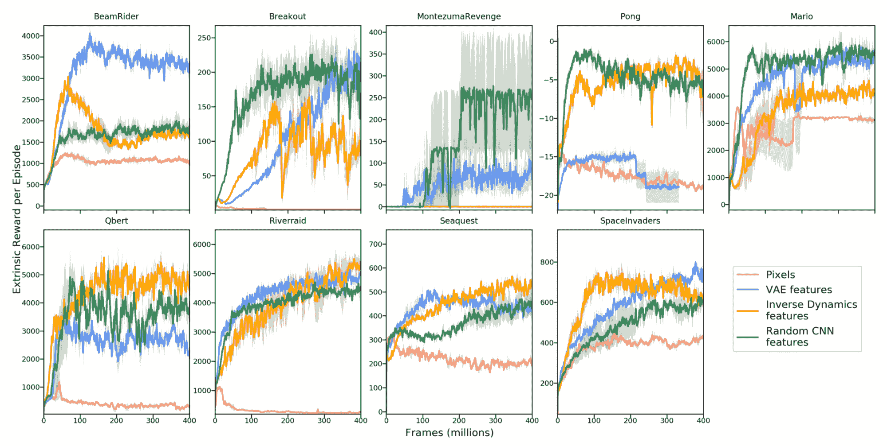

图 5。在只使用好奇信号训练时，不同状态编码函数生成的不同游戏中的平均奖励。（图片来源：[Burda, Edwards & Pathak, et al. 2018](https://arxiv.org/abs/1808.04355)）

有趣的是*随机特征*竟然相当有竞争力，但在特征转移实验中（即在超级马里奥兄弟 1-1 级中训练一个代理，然后在另一个级别中测试），学习的 IDF 特征可以更好地泛化。

他们还在一个有嘈杂电视的环境中比较了 RF 和 IDF。不出所料，嘈杂的电视大大减慢了学习速度，外部奖励在时间上要低得多。

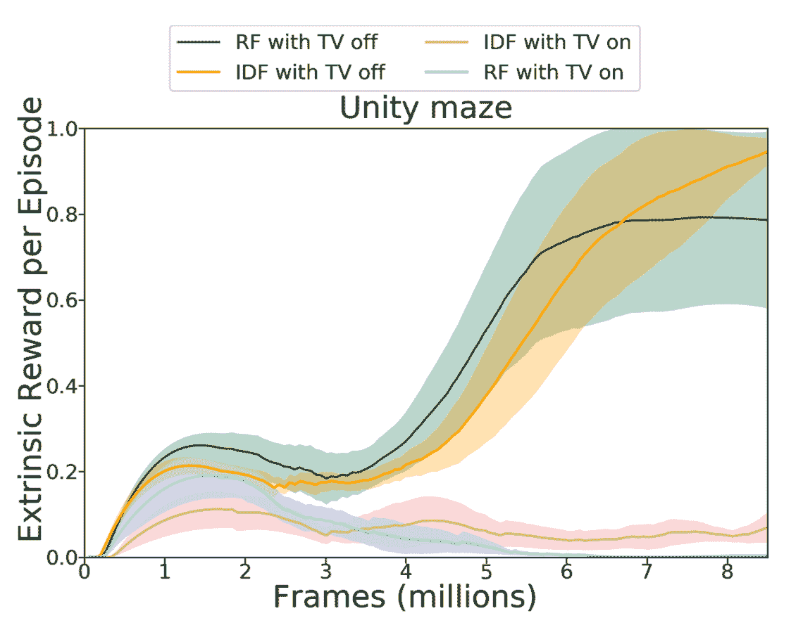

图 6。在有嘈杂电视开启或关闭的环境中使用 RF 和 IDF 特征编码的实验。绘图跟踪了训练过程中每集的外部奖励。（图片来源：[Burda, Edwards & Pathak, et al. 2018](https://arxiv.org/abs/1808.04355)）

前向动态优化也可以通过变分推断建模。**VIME**（缩写为*“变分信息最大化探索”*；[Houthooft, et al. 2017](https://arxiv.org/abs/1605.09674)）是一种基于最大化关于代理对环境动态信念的*信息增益*的探索策略。关于前向动态的额外信息量可以通过熵的减少来衡量。

让$\mathcal{P}$表示环境转移函数，$p(s_{t+1}\vert s_t, a_t; \theta)$表示由$\theta \in \Theta$参数化的前向预测模型，$\xi_t = \{s_1, a_1, \dots, s_t\}$表示轨迹历史。我们希望在采取新动作并观察下一个状态后减少熵，即最大化以下内容：

$$ \begin{aligned} &\sum_t H(\Theta \vert \xi_t, a_t) - H(\Theta \vert S_{t+1}, \xi_t, a_t) \\ =& I(\Theta; S_{t+1} \vert \xi_t, a_t) \quad \scriptstyle{\text{; 因为 } I(X; Y) = I(X) - I(X \vert Y)} \\ =& \mathbb{E}_{s_{t+1} \sim \mathcal{P}(.\vert\xi_t,a_t)} [D_\text{KL}(p(\theta \vert \xi_t, a_t, s_{t+1}) \| p(\theta \vert \xi_t, a_t))] \quad \scriptstyle{\text{; 因为 } I(X; Y) = \mathbb{E}_Y [D_\text{KL} (p_{X \vert Y} \| p_X)]} \\ =& \mathbb{E}_{s_{t+1} \sim \mathcal{P}(.\vert\xi_t,a_t)} [D_\text{KL}(p(\theta \vert \xi_t, a_t, s_{t+1}) \| p(\theta \vert \xi_t))] \quad \scriptstyle{\text{; 因为 } \theta \text{ 不依赖于 } a_t} \end{aligned} $$

在对新可能状态进行期望时，期望代理采取新动作以增加其对预测模型的新信念与旧信念之间的 KL 散度（*“信息增益”*）。这个术语可以作为内在奖励添加到奖励函数中：$r^i_t = D_\text{KL} [p(\theta \vert \xi_t, a_t, s_{t+1}) | p(\theta \vert \xi_t))]$。

然而，计算后验$p(\theta \vert \xi_t, a_t, s_{t+1})$通常是不可行的。

$$ \begin{aligned} p(\theta \vert \xi_t, a_t, s_{t+1}) &= \frac{p(\theta \vert \xi_t, a_t) p(s_{t+1} \vert \xi_t, a_t; \theta)}{p(s_{t+1}\vert\xi_t, a_t)} \\ &= \frac{p(\theta \vert \xi_t) p(s_{t+1} \vert \xi_t, a_t; \theta)}{p(s_{t+1}\vert\xi_t, a_t)} & \scriptstyle{\text{; 因为动作不影响信念。}} \\ &= \frac{\color{red}{p(\theta \vert \xi_t)} p(s_{t+1} \vert \xi_t, a_t; \theta)}{\int_\Theta p(s_{t+1}\vert\xi_t, a_t; \theta) \color{red}{p(\theta \vert \xi_t)} d\theta} & \scriptstyle{\text{; 红色部分直接计算困难。}} \end{aligned} $$

由于直接计算$p(\theta\vert\xi_t)$很困难，一个自然的选择是用另一个分布$q_\phi(\theta)$来近似。通过变分下界，我们知道最大化$q_\phi(\theta)$等价于最大化$p(\xi_t\vert\theta)$并最小化$D_\text{KL}[q_\phi(\theta) | p(\theta)]$。

使用近似分布$q$，内在奖励变为：

$$ r^i_t = D_\text{KL} [q_{\phi_{t+1}}(\theta) \| q_{\phi_t}(\theta))] $$

其中$\phi_{t+1}$代表在看到$a_t$和$s_{t+1}$后与新信念相关的$q$的参数。当用作探索奖励时，通过这个 KL 散度值的移动中位数除以进行归一化。

这里的动力学模型被参数化为[贝叶斯神经网络](https://link.springer.com/book/10.1007/978-1-4612-0745-0)（BNN），因为它维护着其权重的分布。BNN 权重分布$q_\phi(\theta)$被建模为完全*因子化*的高斯分布，其中$\phi = \{\mu, \sigma\}$，我们可以轻松地从$q_\phi(.)$中采样$\theta$。在应用二阶泰勒展开后，KL 项$D_\text{KL}[q_{\phi + \lambda \Delta\phi}(\theta) | q_{\phi}(\theta)]$可以使用[费舍尔信息矩阵](https://lilianweng.github.io/posts/2019-09-05-evolution-strategies/#estimation-using-fisher-information-matrix)$\mathbf{F}_\phi$来估计，这很容易计算，因为$q_\phi$是因子化高斯分布，因此协方差矩阵只是一个对角矩阵。更多细节请参见[论文](https://arxiv.org/abs/1605.09674)，特别是第 2.3-2.5 节。

上述所有方法都依赖于单个预测模型。如果我们有多个这样的模型，我们可以利用模型之间的分歧来设置探索奖励（[Pathak 等人，2019](https://arxiv.org/abs/1906.04161)）。高分歧表示对预测的信心较低，因此需要更多的探索。[Pathak 等人（2019）](https://arxiv.org/abs/1906.04161)建议训练一组前向动力学模型，并使用模型输出集合的方差作为$r_t^i$。准确地说，他们用随机特征对状态空间进行编码，并在集合中学习 5 个模型。

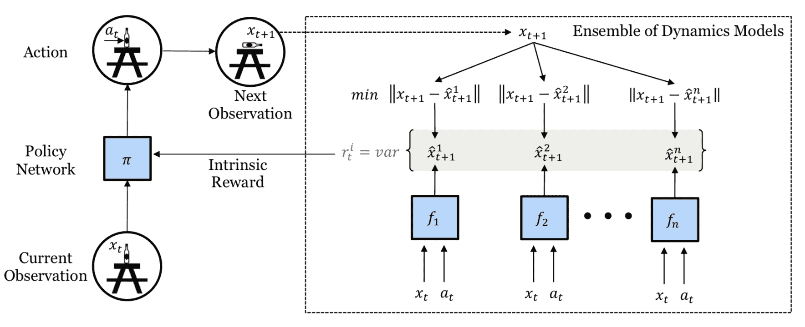

图 7。通过分歧进行自监督探索的训练架构示意图。（图片来源：[Pathak 等人，2019](https://arxiv.org/abs/1906.04161)）

由于$r^i_t$是可微的，模型中的内在奖励可以通过梯度下降直接优化，以通知策略代理改变动作。这种可微探索方法非常高效，但受到探索范围短的限制。

### 随机网络

但是，如果预测任务根本不涉及环境动态呢？事实证明，当预测是针对一个随机任务时，它仍然可以帮助探索。

**DORA**（简称为*“Directed Outreaching Reinforcement Action-Selection”*；[Fox＆Choshen 等人，2018](https://arxiv.org/abs/1804.04012)）是一个新颖的框架，根据一个新引入的**与任务无关**的 MDP 注入探索信号。DORA 的思想依赖于两个并行的 MDP：

+   一个是原始任务 MDP；

+   另一个是一个相同的 MDP，但*没有奖励附加*：相反，每个状态-动作对都被设计为价值为 0。为第二个 MDP 学习的 Q 值被称为*E 值*。如果模型无法完美预测 E 值为零，那么它仍然缺少信息。

最初，E 值被赋予值 1。 这种积极的初始化可以鼓励为更好的 E 值预测进行定向探索。 具有高 E 值估计的状态-动作对尚未收集足够的信息，至少还不足以排除它们的高 E 值。 在某种程度上，E 值的对数可以被认为是*访问计数器*的一种泛化。

当使用神经网络进行 E 值的函数逼近时，另一个值头被添加以预测 E 值，它只需预测为零。 给定预测的 E 值$E(s_t, a_t)$，探索奖励为$r^i_t = \frac{1}{\sqrt{-\log E(s_t, a_t)}}$。

与 DORA 类似，**随机网络蒸馏**（**RND**；[Burda, et al. 2018](https://arxiv.org/abs/1810.12894)）引入了一个与主要任务*独立的预测任务*。 RND 探索奖励被定义为神经网络$\hat{f}(s_t)$预测由*固定随机初始化*的神经网络$f(s_t)$给出的观察特征的误差。 动机是，给定一个新状态，如果过去访问过许多类似状态，那么预测应该更容易，因此误差更低。 探索奖励为$r^i(s_t) = |\hat{f}(s_t; \theta) - f(s_t) |_2²$。

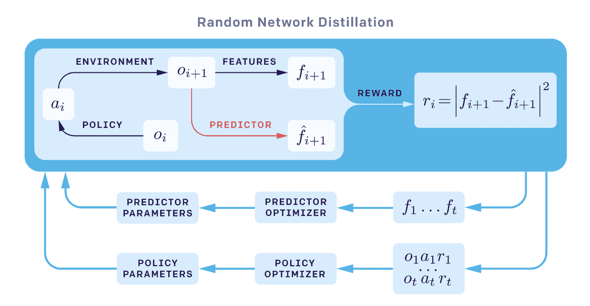

图 8。RND（随机网络蒸馏）如何提供内在奖励的工作原理。 特征$O_{i+1} \mapsto f_{i+1}$由固定的随机神经网络生成。（图片来源：OpenAI 博客：["基于预测奖励的强化学习"](https://openai.com/blog/reinforcement-learning-with-prediction-based-rewards/)）

RND 实验中有两个重要因素：

1.  非情节性设置导致更好的探索，特别是当不使用任何外部奖励时。 这意味着回报不会在“游戏结束”时截断，内在回报可以跨越多个情节。

1.  标准化很重要，因为奖励的规模很难调整，特别是考虑到随机神经网络作为预测目标。 内在奖励通过除以内在回报的标准差的运行估计来标准化。

RND 设置很好地解决了难以探索的问题。 例如，最大化 RND 探索奖励始终能找到蒙特祖玛复仇游戏中超过一半的房间。

### 物理属性

与模拟器中的游戏不同，一些 RL 应用程序如机器人学需要理解物体和在物理世界中的直觉推理。 一些预测任务要求代理执行一系列与环境的交互，并观察相应的后果，例如估计物理中的一些隐藏属性（例如质量，摩擦力等）。

受到这些想法的启发，[Denil, et al. (2017)](https://arxiv.org/abs/1611.01843) 发现 DRL 代理可以学会执行必要的探索以发现这些隐藏属性。 他们精确地考虑了两个实验：

1.  *“哪个更重？”* — 代理必须与方块互动并推断哪个更重。

1.  *“塔”* — 代理需要推断一个塔由多少个刚体组成，通过将其推倒。

在实验中，代理首先经历一个探索阶段与环境互动并收集信息。一旦探索阶段结束，代理被要求输出一个*标记*动作来回答问题。如果答案正确，则给予代理正面奖励；否则给予负面奖励。因为答案需要与场景中的物品进行大量互动，代理必须学会有效地玩耍以找出物理规律和正确答案。探索自然而然地发生。

在他们的实验中，代理能够在两个任务中学习，表现因任务难度而异。尽管论文没有使用物理预测任务来提供内在奖励奖励，而是专注于探索任务本身。我喜欢通过预测环境中隐藏的物理属性来鼓励复杂的探索行为的想法。

# 基于记忆的探索

基于奖励的探索存在一些缺点：

+   函数逼近慢于跟上。

+   探索奖励是非稳态的。

+   知识衰减，意味着状态不再新颖，无法及时提供内在奖励信号。

本节中的方法依赖于外部记忆来解决基于奖励奖励的探索的缺点。

## episodic memory

如上所述，RND 更适合在非 episodic 设置中运行，意味着预测知识在多个 episode 中累积。探索策略**永不放弃**（**NGU**；[Badia, et al. 2020a](https://arxiv.org/abs/2002.06038)）结合了一个可以在一个 episode 内快速适应的 episodic novelty module 和 RND 作为终身新颖性模块。

在 NGU 中，内在奖励由两个模块的探索奖励组成，分别是*在一个 episode 内*和*跨多个 episode*。

短期每个 episode 的奖励由一个*episodic novelty module*提供。它包含一个 episodic memory $M$，一个动态大小的基于槽位的记忆，以及一个 IDF（逆动力学特征）嵌入函数$\phi$，与 ICM 中的特征编码相同。

1.  每一步当前状态嵌入$\phi(s_t)$都被添加到$M$中。

1.  内在奖励由比较当前观察与$M$内容的相似程度来确定。差异越大，奖励越大。

    $$ r^\text{episodic}_t \approx \frac{1}{\sqrt{\sum_{\phi_i \in N_k} K(\phi(x_t), \phi_i)} + c} $$

    其中$K(x, y)$是用于衡量两个样本之间距离的核函数。$N_k$是根据$K(., .)$在$M$中的$k$个最近邻样本集合。$c$是一个小常数，用于保持分母非零。在论文中，$K(x, y)$被配置为逆核函数：

    $$ K(x, y) = \frac{\epsilon}{\frac{d²(x, y)}{d²_m} + \epsilon} $$

    其中$d(.,.)$是两个样本之间的欧氏距离，$d_m$是第 k 个最近邻的平方欧氏距离的运行平均值，以提高鲁棒性。$\epsilon$是一个小常数。

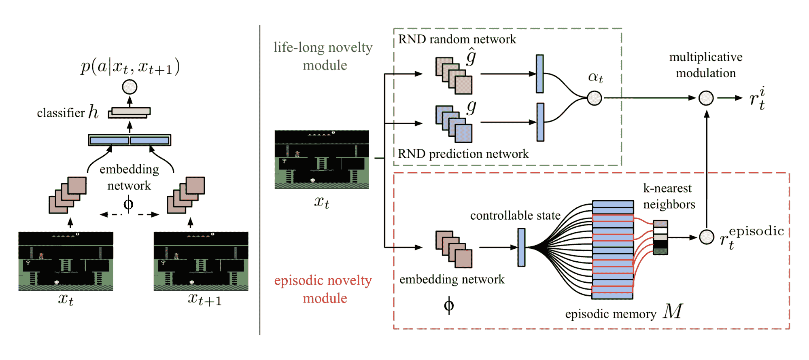

图 9. NGU 嵌入函数（左）和奖励生成器（右）的架构。（图片来源：[Badia 等，2020a](https://arxiv.org/abs/2002.06038)）

跨集数目新奇性依赖于*终身新奇性模块*中的 RND 预测误差。探索奖励为$\alpha_t = 1 + \frac{e^\text{RND}(s_t) - \mu_e}{\sigma_e}$，其中$\mu_e$和$\sigma_e$分别为 RND 误差$e^\text{RND}(s_t)$的运行均值和标准差。

> 然而，在[RND 论文](https://arxiv.org/abs/1810.12894)的结论部分，我注意到以下声明：
> 
> “我们发现 RND 探索奖励足以处理局部探索，即探索短期决策的后果，比如是否与特定对象交互，或者避开它。然而，涉及长时间跨度协调决策的全局探索超出了我们方法的范围。”
> 
> 这让我有点困惑，RND 如何作为一个良好的终身新奇奖励提供者。如果你知道原因，请随时在下面留言。

最终的综合内在奖励是$r^i_t = r^\text{episodic}_t \cdot \text{clip}(\alpha_t, 1, L)$，其中$L$是一个常数最大奖励标量。

NGU 的设计使其具有两个良好的特性：

1.  *快速地*在同一集数内*阻止*重访相同状态；

1.  *缓慢地*在跨集数目*阻止*多次访问过的状态。

后来，DeepMind 在 NGU 的基础上提出了“Agent57”（[Badia 等，2020b](https://arxiv.org/abs/2003.13350)），这是第一个在*所有*57 个 Atari 游戏上表现优于标准人类基准的深度 RL 代理。Agent57 相对于 NGU 的两个主要改进是：

1.  在 Agent57 中训练了一组策略，每个策略配备不同的探索参数对$\{(\beta_j, \gamma_j)\}_{j=1}^N$。回想一下，给定$\beta_j$，奖励构造为$r_{j,t} = r_t^e + \beta_j r^i_t$，$\gamma_j$是奖励折扣因子。自然地期望具有更高$\beta_j$和较低$\gamma_j$的策略在训练初期取得更多进展，而随着训练的进行，预期情况将相反。训练一个元控制器（[滑动窗口 UCB 赌博算法](https://arxiv.org/pdf/0805.3415.pdf)）来选择应该优先考虑哪些策略。

1.  第二个改进是 Q 值函数的新参数化，将内在和外在奖励的贡献分解为与捆绑奖励类似的形式：$Q(s, a; \theta_j) = Q(s, a; \theta_j^e) + \beta_j Q(s, a; \theta_j^i)$。在训练过程中，$Q(s, a; \theta_j^e)$和$Q(s, a; \theta_j^i)$分别使用奖励$r_j^e$和$r_j^i$进行优化。

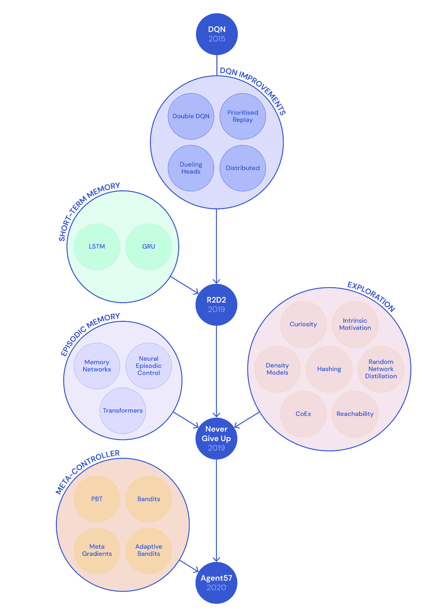

图 10\. 展示了自 2015 年 DQN 以来发展的技术，最终导致 Agent57 的一个很酷的插图。 (图片来源：DeepMind 博客：["Agent57: Outperforming the human Atari benchmark"](https://deepmind.com/blog/article/Agent57-Outperforming-the-human-Atari-benchmark))

[Savinov 等人（2019）](https://arxiv.org/abs/1810.02274)提出了一种名为**情节好奇（EC）**模块的方法，该方法考虑了情节性记忆中状态之间的接近度，而不是使用欧氏距离，并提出了一种测量从记忆中的其他状态访问一个状态所需步数的方法。新奇奖励取决于状态之间的可达性。

1.  每一集开始时，代理人从一个空的情节性记忆$M$开始。

1.  每一步，代理人将当前状态与记忆中保存的状态进行比较，以确定新奇奖励：如果当前状态是新颖的（即，从记忆中的观察到达需要更多步骤），代理人将获得奖励。

1.  如果新奇奖励足够高，当前状态将被添加到情节性记忆中。（想象一下，如果所有状态都被添加到记忆中，任何新状态都可以在 1 步内添加。）

1.  重复 1-3 直到本集结束。

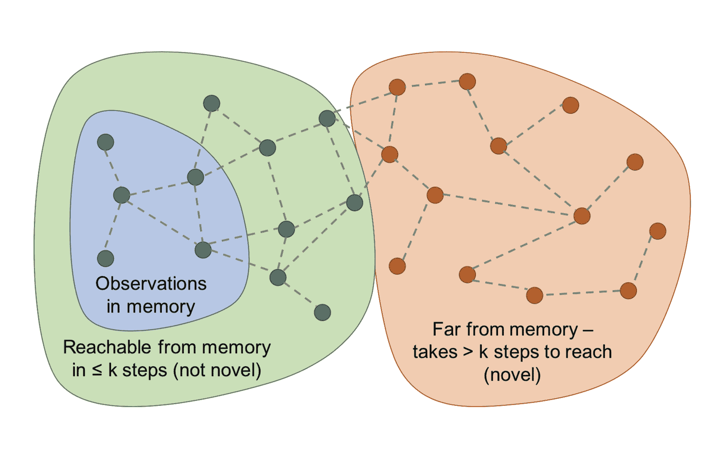

图 11\. 图中的节点是状态，边是可能的转换。蓝色节点是记忆中的状态。绿色节点是从记忆中在$k = 2$步内可达的状态（非新颖）。橙色节点距离更远，因此被视为新颖状态。 (图片来源：[Savinov 等人，2019](https://arxiv.org/abs/1810.02274))

为了估计状态之间的可达性，我们需要访问转换图，但遗憾的是并非完全了解。因此，[Savinov 等人（2019）](https://arxiv.org/abs/1810.02274)训练了一个[连体](https://lilianweng.github.io/posts/2018-11-30-meta-learning/#convolutional-siamese-neural-network)神经网络来预测两个状态之间相隔多少步。它包含一个嵌入网络$\phi: \mathcal{S} \mapsto \mathbb{R}^n$，首先将状态编码为特征向量，然后一个比较器网络$C: \mathbb{R}^n \times \mathbb{R}^n \mapsto [0, 1]$，输出两个状态是否足够接近（即，在转换图中在$k$步内可达）的二进制标签，$C(\phi(s_i), \phi(s_j)) \mapsto [0, 1]$。

一个情节性记忆缓冲器$M$存储着同一情节内一些过去观察的嵌入。新的观察将通过$C$与现有状态嵌入进行比较，结果将被聚合（例如最大值，90th 百分位数），以提供可达性分数$C^M(\phi(s_t))$。探索奖励为$r^i_t = \big(C’ - C^M(f(s_t))\big)$，其中$C’$是用于确定奖励符号的预定义阈值（例如，$C’=0.5$对于固定持续时间的情节效果很好）。当新状态不容易从记忆缓冲器中的状态到达时，高奖励将授予新状态。

他们声称，EC 模块可以克服嘈杂电视问题。

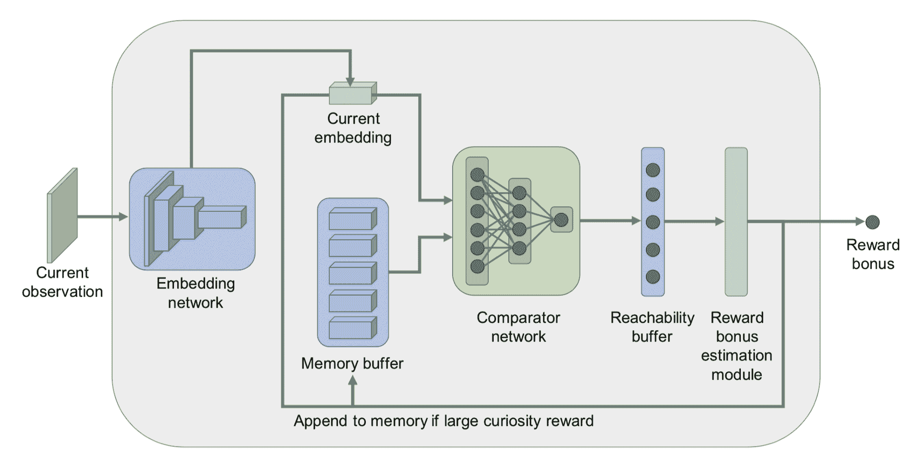

图 12。内在奖励生成的情节好奇（EC）模块的架构。（图片来源：[Savinov 等人，2019](https://arxiv.org/abs/1810.02274)）

## 直接探索

**Go-Explore**（[Ecoffet 等人，2019](https://arxiv.org/abs/1901.10995)）是一个旨在解决“难以探索”问题的算法。它由以下两个阶段组成。

**阶段 1（“探索直到解决”）**感觉很像[Dijkstra 算法](https://en.wikipedia.org/wiki/Dijkstra%27s_algorithm)用于在图中寻找最短路径。事实上，阶段 1 中没有涉及神经网络。通过保持有趣状态以及通往这些状态的轨迹的记忆，代理可以返回（假设模拟器是*确定性*的）到有前途的状态，并从那里继续进行*随机*探索。状态被映射为短离散代码（称为“单元”）以便被记忆。如果出现新状态或找到更好/更短的轨迹，则更新记忆。在选择要返回的过去状态时，代理可能均匀选择记忆中的一个或根据启发式方法选择，如最近性，访问计数，记忆中邻居的计数等。这个过程重复进行，直到任务解决并找到至少一条解决路径。

上述找到的高性能轨迹在具有任何随机性的评估环境中效果不佳。因此，**阶段 2（“鲁棒化”）**需要通过模仿学习来增强解决方案。他们采用了[Backward Algorithm](https://arxiv.org/abs/1812.03381)，其中代理从轨迹中的最后状态附近开始，并从那里运行 RL 优化。

阶段 1 中的一个重要说明是：为了在没有探索的情况下确定性地返回到一个状态，Go-Explore 依赖于可重置和确定性的模拟器，这是一个很大的劣势。

为了使算法更普遍适用于具有随机性的环境，后来提出了 Go-Explore 的增强版本（[Ecoffet 等人，2020](https://arxiv.org/abs/2004.12919)），名为**基于策略的 Go-Explore**。

+   与轻松重置模拟器状态不同，基于策略的 Go-Explore 学习了一个*目标条件策略*，并重复使用它来访问内存中的已知状态。目标条件策略被训练为沿着先前导致所选内存状态的最佳轨迹。他们包括一个**自我模仿学习**（**SIL**；[Oh, et al. 2018](https://arxiv.org/abs/1806.05635)）损失，以帮助从成功轨迹中提取尽可能多的信息。

+   此外，他们发现当智能体返回有前途的状态继续探索时，从策略中采样比随机行动效果更好。

+   基于策略的 Go-Explore 的另一个改进是使图像到单元格的缩放函数可调整。它被优化，以便内存中既不会有太多也不会有太少的单元格。

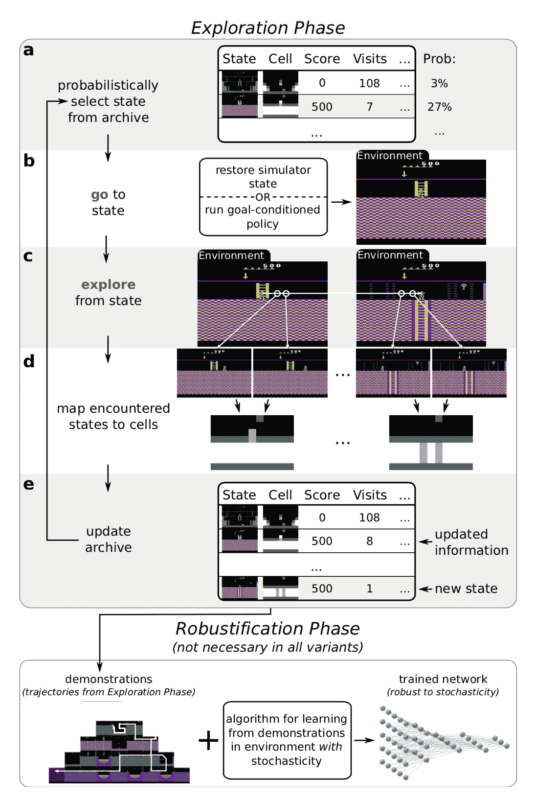

图 13。Go-Explore 算法概述。 （图片来源：[Ecoffet 等人，2020](https://arxiv.org/abs/2004.12919)）

在普通的 Go-Explore 之后，[郭一杰等人（2019）](https://arxiv.org/abs/1907.10247)提出了**DTSIL**（多样轨迹条件自我模仿学习），其与上述基于策略的 Go-Explore 有相似的想法。DTSIL 在训练过程中维护了一组多样化演示的内存，并使用它们来通过[SIL](https://arxiv.org/abs/1806.05635)训练轨迹条件策略。他们在采样过程中优先考虑以罕见状态结束的轨迹。

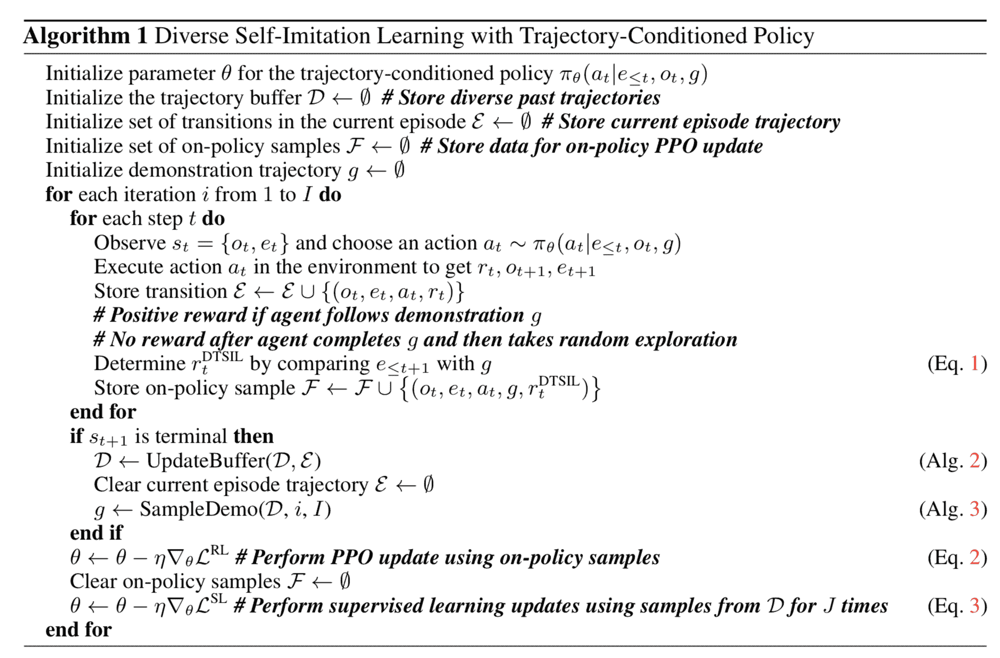

图 14。DTSIL（多样轨迹条件自我模仿学习）算法。 （图片来源：[郭一杰等人，2019](https://arxiv.org/abs/1907.10247)）

相似的方法也出现在[郭等人（2019）](https://arxiv.org/abs/1906.07805)的研究中。主要思想是将具有*高不确定性*的目标存储在内存中，以便智能体可以通过目标条件策略重复访问这些目标状态。在每一集中，智能体会抛硬币（概率为 0.5）来决定是按照策略贪婪行事，还是通过从内存中采样目标进行定向探索。

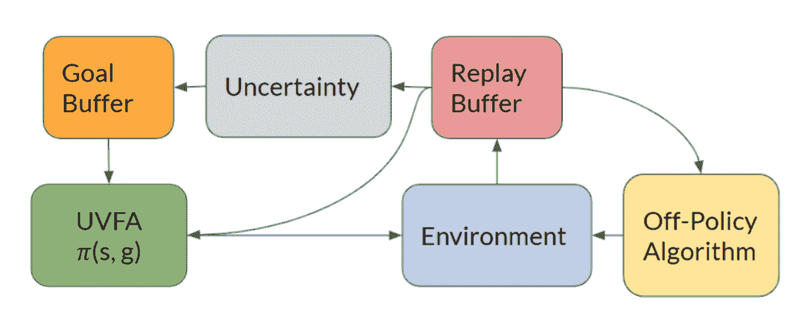

图 15。带有函数逼近的定向探索中的不同组件。 （图片来源：[郭等人，2019](https://arxiv.org/abs/1906.07805)）

一个状态的不确定性度量可以是简单的基于计数的奖励，也可以是复杂的密度或贝叶斯模型。该论文训练了一个前向动力学模型，并将其预测误差作为不确定性度量。

# Q 值探索

受[汤普森抽样](https://lilianweng.github.io/posts/2018-01-23-multi-armed-bandit/#thompson-sampling)启发，**自举 DQN**（[Osband 等，2016](https://arxiv.org/abs/1602.04621)）通过使用[自举法](https://en.wikipedia.org/wiki/Bootstrapping_(statistics))在经典[DQN](https://lilianweng.github.io/posts/2018-02-19-rl-overview/#deep-q-network)中引入了 Q 值近似的不确定性概念。自举法是通过从同一总体中多次有放回地抽样来近似分布，然后聚合结果。

多个 Q 值头并行训练，但每个头只消耗一个自举子采样数据集，并且每个头都有自己对应的目标网络。所有的 Q 值头共享相同的主干网络。

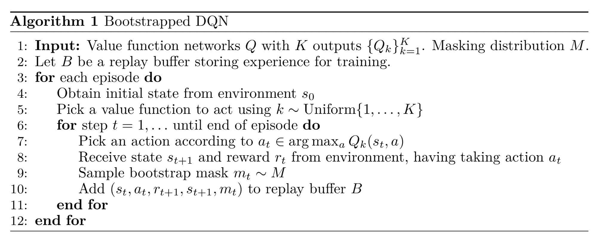

图 16。自举 DQN 算法。（图片来源：[Osband 等，2016](https://arxiv.org/abs/1602.04621)）

在一个 episode 开始时，均匀采样一个 Q 值头并用于在该 episode 中收集经验数据。然后从掩码分布$m \sim \mathcal{M}$中采样一个二进制掩码，决定哪些头可以使用这些数据进行训练。掩码分布$\mathcal{M}$的选择决定了如何生成自举样本；例如，

+   如果$\mathcal{M}$是独立的伯努利分布，$p=0.5$，这对应于双倍或无的自举法。

+   如果$\mathcal{M}$总是返回全为 1 的掩码，该算法将简化为一个集成方法。

然而，这种探索仍然受限，因为自举引入的不确定性完全依赖于训练数据。最好注入一些独立于数据的先验信息。这种“嘈杂”的先验预期能够在奖励稀疏时驱使代理继续探索。将随机先验添加到自举 DQN 以实现更好探索的算法（[Osband 等，2018](https://arxiv.org/abs/1806.03335)）依赖于贝叶斯线性回归。贝叶斯回归的核心思想是：我们可以通过在数据的嘈杂版本上进行训练，再加上一些随机正则化，*“生成后验样本”*。

让$\theta$为 Q 函数参数，$\theta^-$为目标 Q，使用随机化先验函数$p$的损失函数为：

$$ \mathcal{L}(\theta, \theta^{-}, p, \mathcal{D}; \gamma) = \sum_{t\in\mathcal{D}}\Big( r_t + \gamma \max_{a'\in\mathcal{A}} (\underbrace{Q_{\theta^-} + p)}_\text{目标 Q}(s'_t, a') - \underbrace{(Q_\theta + p)}_\text{要优化的 Q}(s_t, a_t) \Big)² $$

# 变分选项

选项是带有终止条件的策略。在搜索空间中有大量可用的选项，它们与代理的意图无关。通过明确将内在选项纳入建模，代理可以获得用于探索的内在奖励。

**VIC**（“Variational Intrinsic Control”的缩写；[Gregor, et al. 2017](https://arxiv.org/abs/1611.07507)）是一个为代理提供基于建模选项和学习条件选项的策略的内在探索奖励的框架。让 $\Omega$ 表示从 $s_0$ 开始并在 $s_f$ 结束的选项。一个环境概率分布 $p^J(s_f \vert s_0, \Omega)$ 定义了在给定起始状态 $s_0$ 的情况下选项 $\Omega$ 终止的位置。一个可控性分布 $p^C(\Omega \vert s_0)$ 定义了我们可以从中采样的选项的概率分布。根据定义，我们有 $p(s_f, \Omega \vert s_0) = p^J(s_f \vert s_0, \Omega) p^C(\Omega \vert s_0)$。

在选择选项时，我们希望实现两个目标：

+   从 $s_0$ 实现一组多样的最终状态 ⇨ 最大化 $H(s_f \vert s_0)$。

+   精确了解给定选项 $\Omega$ 可以以哪种状态结束 ⇨ 最小化 $H(s_f \vert s_0, \Omega)$。

结合它们，我们得到要最大化的互信息 $I(\Omega; s_f \vert s_0)$：

$$ \begin{aligned} I(\Omega; s_f \vert s_0) &= H(s_f \vert s_0) - H(s_f \vert s_0, \Omega) \\ &= - \sum_{s_f} p(s_f \vert s_0) \log p(s_f \vert s_0) + \sum_{s_f, \Omega} p(s_f, \Omega \vert s_0) \log \frac{p(s_f, \Omega \vert s_0)}{p^C(\Omega \vert s_0)} \\ &= - \sum_{s_f} p(s_f \vert s_0) \log p(s_f \vert s_0) + \sum_{s_f, \Omega} p^J(s_f \vert s_0, \Omega) p^C(\Omega \vert s_0) \log p^J(s_f \vert s_0, \Omega) \\ \end{aligned} $$

因为互信息是对称的，我们可以在几个地方交换 $s_f$ 和 $\Omega$ 而不会破坏等价性。另外，由于 $p(\Omega \vert s_0, s_f)$ 很难观察到，让我们用近似分布 $q$ 替换它。根据变分下界，我们有 $I(\Omega; s_f \vert s_0) \geq I^{VB}(\Omega; s_f \vert s_0)$。

$$ \begin{aligned} I(\Omega; s_f \vert s_0) &= I(s_f; \Omega \vert s_0) \\ &= - \sum_{\Omega} p(\Omega \vert s_0) \log p(\Omega \vert s_0) + \sum_{s_f, \Omega} p^J(s_f \vert s_0, \Omega) p^C(\Omega \vert s_0) \log \color{red}{p(\Omega \vert s_0, s_f)}\\ I^{VB}(\Omega; s_f \vert s_0) &= - \sum_{\Omega} p(\Omega \vert s_0) \log p(\Omega \vert s_0) + \sum_{s_f, \Omega} p^J(s_f \vert s_0, \Omega) p^C(\Omega \vert s_0) \log \color{red}{q(\Omega \vert s_0, s_f)} \\ I(\Omega; s_f \vert s_0) &\geq I^{VB}(\Omega; s_f \vert s_0) \end{aligned} $$

图 17\. VIC（Variational Intrinsic Control）的算法。（图片来源：[Gregor, et al. 2017](https://arxiv.org/abs/1611.07507)）

这里的$\pi(a \vert \Omega, s)$可以通过任何强化学习算法进行优化。选项推断函数$q(\Omega \vert s_0, s_f)$是进行监督学习。先验$p^C$被更新，以便更倾向于选择具有更高奖励的$\Omega$。请注意，$p^C$也可以固定（例如高斯）。通过学习，不同的$\Omega$将导致不同的行为。此外，[Gregor 等人（2017）](https://arxiv.org/abs/1611.07507)观察到，使用显式选项使 VIC 在具有函数逼近的情况下难以实际运作，因此他们还提出了另一种具有隐式选项的 VIC 版本。

与 VIC 不同，**VALOR**（简称*“通过强化学习学习选项的变分自动编码”*；[Achiam 等人，2018](https://arxiv.org/abs/1807.10299)）依赖于整个轨迹来提取选项上下文$c$，该上下文从固定的高斯分布中采样。在 VALOR 中：

+   策略充当编码器，将来自噪声分布的上下文转换为轨迹

+   解码器试图从轨迹中恢复上下文，并奖励策略使上下文更容易区分。在训练期间，解码器从未看到动作，因此代理必须以一种有助于与解码器进行更好预测的方式与环境互动。此外，解码器反复接收一条轨迹中的一系列步骤，以更好地建模时间步之间的相关性。

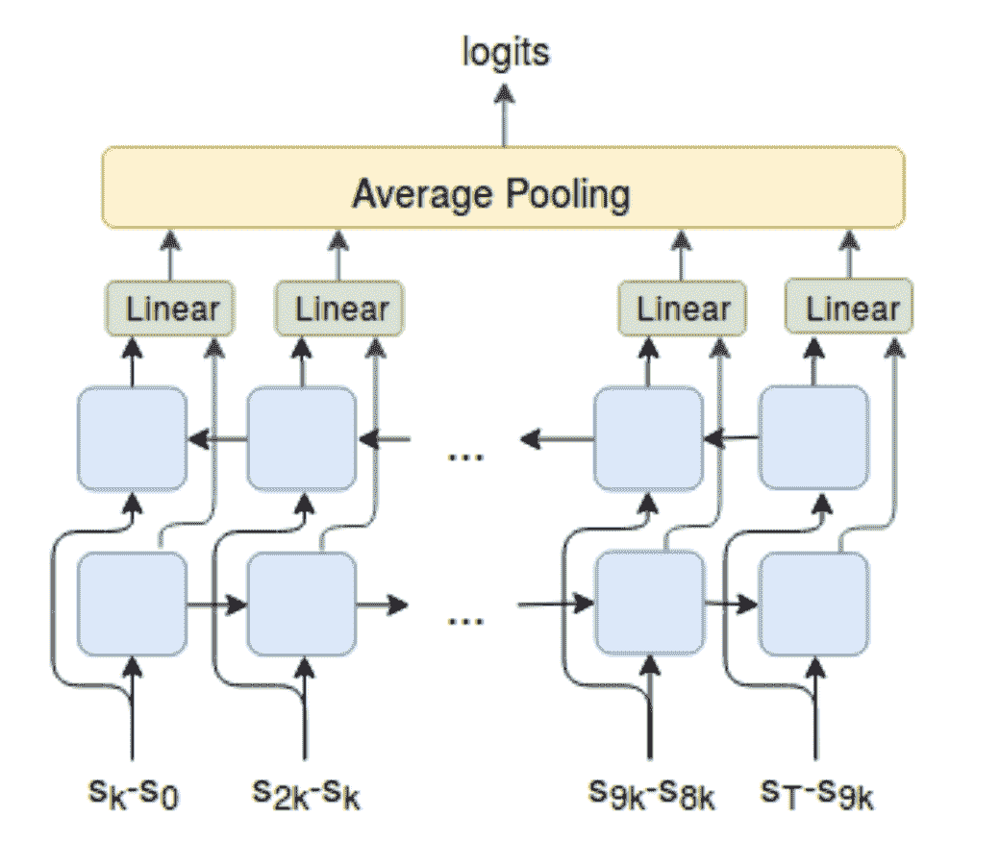

图 18。 VALOR 的解码器是一个双向 LSTM，它将来自一条轨迹的$N = 11$等间隔观察作为输入。（图片来源：[Achiam 等人，2018](https://arxiv.org/abs/1807.10299)）

DIAYN（“多样性就是你所需要的一切”；[Eysenbach 等人，2018](https://arxiv.org/abs/1802.06070)）的想法与此类似，尽管名称不同 — DIAYN 模型是基于潜在*技能*变量的策略。更多细节请参阅我的[先前的帖子](https://lilianweng.github.io/posts/2019-06-23-meta-rl/#learning-with-random-rewards)。

# 引用

Cited as:

> Weng，Lilian。 （2020 年 6 月）。 深度强化学习中的探索策略。 Lil’Log。 https://lilianweng.github.io/posts/2020-06-07-exploration-drl/。

或

```py
@article{weng2020exploration,
  title   = "Exploration Strategies in Deep Reinforcement Learning",
  author  = "Weng, Lilian",
  journal = "lilianweng.github.io",
  year    = "2020",
  month   = "Jun",
  url     = "https://lilianweng.github.io/posts/2020-06-07-exploration-drl/"
} 
```

# 参考

[1] Pierre-Yves Oudeyer & Frederic Kaplan. [“我们如何定义内在动机？”](http://citeseerx.ist.psu.edu/viewdoc/download?doi=10.1.1.567.6524&rep=rep1&type=pdf) 2008 年表观遗传机器人会议。

[2] Marc G. Bellemare 等人 [“统一基于计数的探索和内在动机”](https://arxiv.org/abs/1606.01868)。NIPS 2016。

[3] Georg Ostrovski 等人 [“使用神经密度模型进行基于计数的探索”](https://arxiv.org/abs/1703.01310)。PMLR 2017。

[4] Rui Zhao & Volker Tresp。 [“通过密度估计驱动好奇心导向的经验优先级”](https://arxiv.org/abs/1902.08039)。NIPS 2018。

[5] Haoran Tang 等人。[“＃探索：深度强化学习的基于计数的探索研究”](https://arxiv.org/abs/1611.04717)。NIPS 2017。

[6] Jürgen Schmidhuber。[“在模型构建神经控制器中实现好奇心和无聊的可能性”](http://citeseerx.ist.psu.edu/viewdoc/summary?doi=10.1.1.45.957) 1991 年。

[7] Pierre-Yves Oudeyer 等人。[“自主心智发展的内在动机系统”](http://citeseerx.ist.psu.edu/viewdoc/download?doi=10.1.1.177.7661&rep=rep1&type=pdf) IEEE 进化计算交易，2007 年。

[8] Bradly C. Stadie 等人。[“用深度预测模型激励探索的强化学习”](https://arxiv.org/abs/1507.00814)。ICLR 2016。

[9] Deepak Pathak 等人。[“自监督预测驱动的好奇心探索”](https://arxiv.org/abs/1705.05363)。CVPR 2017。

[10] Yuri Burda，Harri Edwards 和 Deepak Pathak 等人。[“好奇驱动学习的大规模研究”](https://arxiv.org/abs/1808.04355)。arXiv 1808.04355（2018 年）。

[11] Joshua Achiam 和 Shankar Sastry。[“基于惊喜的深度强化学习内在动机”](https://arxiv.org/abs/1703.01732)。NIPS 2016 深度 RL 研讨会。

[12] Rein Houthooft 等人。[“VIME：变分信息最大化探索”](https://arxiv.org/abs/1605.09674)。NIPS 2016。

[13] Leshem Choshen，Lior Fox 和 Yonatan Loewenstein。[“探险家多拉：定向外展强化行动选择”](https://arxiv.org/abs/1804.04012)。ICLR 2018

[14] Yuri Burda 等人。[“通过随机网络蒸馏进行探索”](https://arxiv.org/abs/1810.12894)。ICLR 2019。

[15] OpenAI 博客：[“基于预测奖励的强化学习”](https://openai.com/blog/reinforcement-learning-with-prediction-based-rewards/) 2018 年 10 月。

[16] Misha Denil 等人。[“通过深度强化学习学习执行物理实验”](https://arxiv.org/abs/1611.01843)。ICLR 2017。

[17] Ian Osband 等人。[“通过引导 DQN 进行深度探索”](https://arxiv.org/abs/1602.04621)。NIPS 2016。

[18] Ian Osband，John Aslanides 和 Albin Cassirer。[“用于深度强化学习的随机化先验函数”](https://arxiv.org/abs/1806.03335)。NIPS 2018。

[19] Karol Gregor，Danilo Jimenez Rezende 和 Daan Wierstra。[“变分内在控制”](https://arxiv.org/abs/1611.07507)。ICLR 2017。

[20] Joshua Achiam 等人。[“变分选项发现算法”](https://arxiv.org/abs/1807.10299)。arXiv 1807.10299（2018 年）。

[21] Benjamin Eysenbach 等人。[“多样性就是你所需要的：学习无需奖励函数的技能。”](https://arxiv.org/abs/1802.06070)。ICLR 2019。

[22] Adrià Puigdomènech Badia 等人。[“永不放弃（NGU）：学习定向探索策略”](https://arxiv.org/abs/2002.06038)。ICLR 2020。

[23] Adrià Puigdomènech Badia 等人。[“Agent57：超越 Atari 人类基准”](https://arxiv.org/abs/2003.13350)。arXiv 2003.13350（2020 年）。

[24] DeepMind 博客: [“Agent57: 超越人类 Atari 基准”](https://deepmind.com/blog/article/Agent57-Outperforming-the-human-Atari-benchmark) 2020 年 3 月.

[25] Nikolay Savinov 等. [“通过可达性实现情节好奇心”](https://arxiv.org/abs/1810.02274) ICLR 2019.

[26] Adrien Ecoffet 等. [“Go-Explore: 解决难度探索问题的新方法”](https://arxiv.org/abs/1901.10995). arXiv 1901.10995 (2019).

[27] Adrien Ecoffet 等. [“先回归再探索”](https://arxiv.org/abs/2004.12919). arXiv 2004.12919 (2020).

[28] Junhyuk Oh 等. [“自我模仿学习”](https://arxiv.org/abs/1806.05635). ICML 2018.

[29] 郭一杰 等. [“通过轨迹条件策略进行自我模仿学习以解决难度探索任务”](https://arxiv.org/abs/1907.10247). arXiv 1907.10247 (2019).

[30] 郭兆瀚 & Emma Brunskill. [“强化学习的定向探索”](https://arxiv.org/abs/1906.07805). arXiv 1906.07805 (2019).

[31] Deepak Pathak 等. [“通过不一致性进行自监督探索”](https://arxiv.org/abs/1906.04161) ICML 2019.
