# **Transformer** 家族

> 原文：[`lilianweng.github.io/posts/2020-04-07-the-transformer-family/`](https://lilianweng.github.io/posts/2020-04-07-the-transformer-family/)

[更新于 **2023-01-27**：近三年过去了，我对这篇文章进行了大规模的重构更新，以整合自 2020 年以来的一系列新 Transformer 模型。这篇文章的增强版本在这里：[**Transformer 家族 2.0 版**](https://lilianweng.github.io/posts/2023-01-27-the-transformer-family-v2/)。请参考该文章了解更多内容。]

距离我上一篇关于[注意力](https://lilianweng.github.io/posts/2018-06-24-attention/)的文章已经将近两年了。最近对 Transformer 的新版本和增强版本的进展激励我撰写了这个特定主题的另一篇文章，重点关注如何改进传统 Transformer 以提高长期注意力跨度、减少内存和计算消耗、解决强化学习任务等方面。

## 符号

| 符号 | 含义 |
| --- | --- |
| $d$ | 模型大小 / 隐藏状态维度 / 位置编码大小。 |
| $h$ | 多头注意力层中的头数。 |
| $L$ | 输入序列的段长度。 |
| $\mathbf{X} \in \mathbb{R}^{L \times d}$ | 输入序列，其中每个元素都映射为形状为 $d$ 的嵌入向量，与模型大小相同。 |
| $\mathbf{W}^k \in \mathbb{R}^{d \times d_k}$ | 键权重矩阵。 |
| $\mathbf{W}^q \in \mathbb{R}^{d \times d_k}$ | 查询权重矩阵。 |
| $\mathbf{W}^v \in \mathbb{R}^{d \times d_v}$ | 值权重矩阵。通常情况下 $d_k = d_v = d$。 |
| $\mathbf{W}^k_i, \mathbf{W}^q_i \in \mathbb{R}^{d \times d_k/h}; \mathbf{W}^v_i \in \mathbb{R}^{d \times d_v/h}$ | 每个头的权重矩阵。 |
| $\mathbf{W}^o \in \mathbb{R}^{d_v \times d}$ | 输出权重矩阵。 |
| $\mathbf{Q} = \mathbf{X}\mathbf{W}^q \in \mathbb{R}^{L \times d_k}$ | 查询嵌入输入。 |
| $\mathbf{K} = \mathbf{X}\mathbf{W}^k \in \mathbb{R}^{L \times d_k}$ | 键嵌入输入。 |
| $\mathbf{V} = \mathbf{X}\mathbf{W}^v \in \mathbb{R}^{L \times d_v}$ | 值嵌入输入。 |
| $S_i$ | 第 $i$ 个查询 $\mathbf{q}_i$ 需要关注的关键位置集合。 |
| $\mathbf{A} \in \mathbb{R}^{L \times L}$ | 输入序列长度为 $L$ 时的自注意力矩阵。$\mathbf{A} = \text{softmax}(\mathbf{Q}\mathbf{K}^\top / \sqrt{d_k})$。 |
| $a_{ij} \in \mathbf{A}$ | 查询 $\mathbf{q}_i$ 和键 $\mathbf{k}_j$ 之间的标量注意力分数。 |
| $\mathbf{P} \in \mathbb{R}^{L \times d}$ | 位置编码矩阵，其中第 $i$ 行 $\mathbf{p}_i$ 是输入 $\mathbf{x}_i$ 的位置编码。 |

# 注意力和自注意力

*注意力* 是神经网络中的一种机制，模型可以通过有选择地关注给定的数据集来学习预测。注意力的多少由学习到的权重来量化，因此输出通常形成加权平均。

*自注意力*是一种注意力机制，模型使用关于同一样本的其他部分的观察来预测数据样本的一部分。在概念上，它与[非局部均值](https://en.wikipedia.org/wiki/Non-local_means)非常相似。还要注意，自注意力是置换不变的；换句话说，它是一个集合上的操作。

注意/自注意力有各种形式，Transformer（[Vaswani 等人，2017](https://arxiv.org/abs/1706.03762)）依赖于*缩放点积注意力*：给定一个查询矩阵$\mathbf{Q}$，一个键矩阵$\mathbf{K}$和一个值矩阵$\mathbf{V}$，输出是值向量的加权和，其中分配给每个值槽的权重由查询与相应键的点积确定：

$$ \text{注意力}(\mathbf{Q}, \mathbf{K}, \mathbf{V}) = \text{softmax}(\frac{\mathbf{Q} {\mathbf{K}}^\top}{\sqrt{d_k}})\mathbf{V} $$

对于查询和键向量$\mathbf{q}_i, \mathbf{k}_j \in \mathbb{R}^d$（查询和键矩阵中的行向量），我们有一个标量分数：

$$ a_{ij} = \text{softmax}(\frac{\mathbf{q}_i {\mathbf{k}_j}^\top}{\sqrt{d_k}}) = \frac{\exp(\mathbf{q}_i {\mathbf{k}_j}^\top)}{ \sqrt{d_k} \sum_{r \in S_i} \exp(\mathbf{q}_i {\mathbf{k}_r}^\top) } $$

其中$S_i$是第$i$个查询要关注的键位置的集合。

如果感兴趣，可以查看我以前的[帖子](https://lilianweng.github.io/posts/2018-06-24-attention/#a-family-of-attention-mechanisms)了解其他类型的注意力。

# 多头自注意力

*多头自注意力*模块是 Transformer 中的一个关键组件。与仅计算一次注意力不同，多头机制将输入分成较小的块，然后并行计算每个子空间的缩放点积注意力。独立的注意力输出简单地连接并线性转换为期望的维度。

$$ \begin{aligned} \text{多头注意力}(\mathbf{X}_q, \mathbf{X}_k, \mathbf{X}_v) &= [\text{头}_1; \dots; \text{头}_h] \mathbf{W}^o \\ \text{其中头}_i &= \text{注意力}(\mathbf{X}_q\mathbf{W}^q_i, \mathbf{X}_k\mathbf{W}^k_i, \mathbf{X}_v\mathbf{W}^v_i) \end{aligned} $$

其中$[.;.]$是一个连接操作。$\mathbf{W}^q_i, \mathbf{W}^k_i \in \mathbb{R}^{d \times d_k/h}, \mathbf{W}^v_i \in \mathbb{R}^{d \times d_v/h}$是权重矩阵，用于将大小为$L \times d$的输入嵌入映射到查询、键和值矩阵。而$\mathbf{W}^o \in \mathbb{R}^{d_v \times d}$是输出线性变换。所有权重都应在训练期间学习。


图 1. 多头缩放点积注意力机制的示意图。（图片来源：[Vaswani 等人，2017](https://arxiv.org/abs/1706.03762)中的图 2）

# Transformer

**Transformer**（将其称为“传统 Transformer”以区别于其他增强版本；[Vaswani 等人，2017](https://arxiv.org/abs/1706.03762)）模型具有编码器-解码器架构，这在许多[NMT](https://lilianweng.github.io/posts/2018-06-24-attention/#born-for-translation)模型中常用。后来简化的 Transformer 在语言建模任务中表现出色，例如仅编码器的[BERT](https://lilianweng.github.io/posts/2019-01-31-lm/#bert)或仅解码器的[GPT](https://lilianweng.github.io/posts/2019-01-31-lm/#openai-gpt)。

**编码器-解码器架构**

**编码器**生成一个基于注意力的表示，具有定位大背景中特定信息的能力。它由一堆 6 个恒等模块组成，每个模块包含两个子模块，一个*多头自注意力*层和一个*逐点*全连接前馈网络。逐点意味着它将相同的线性变换（具有相同权重）应用于序列中的每个元素。这也可以看作是一个滤波器大小为 1 的卷积层。每个子模块都有残差连接和层归一化。所有子模块输出相同维度$d$的数据。

Transformer 的**解码器**的功能是从编码表示中检索信息。该架构与编码器非常相似，只是解码器包含两个多头注意力子模块，而不是每个相同重复模块中的一个。第一个多头注意力子模块是*掩码*的，以防止位置关注未来。

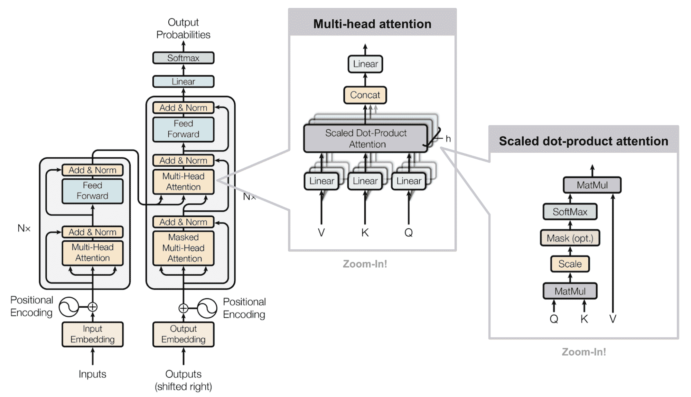

图 2。传统 Transformer 模型的架构。（图片来源：[Figure 17](https://lilianweng.github.io/posts/2018-06-24-attention/#full-architecture)）

**位置编码**

因为自注意力操作是置换不变的，所以使用适当的**位置编码**为模型提供*顺序信息*非常重要。位置编码$\mathbf{P} \in \mathbb{R}^{L \times d}$与输入嵌入具有相同的维度，因此可以直接添加到输入上。传统的 Transformer 考虑了两种编码类型：

(1) *正弦位置编码*定义如下，给定令牌位置$i=1,\dots,L$和维度$\delta=1,\dots,d$：

$$ \text{PE}(i,\delta) = \begin{cases} \sin(\frac{i}{10000^{2\delta'/d}}) & \text{if } \delta = 2\delta'\\ \cos(\frac{i}{10000^{2\delta'/d}}) & \text{if } \delta = 2\delta' + 1\\ \end{cases} $$

这样，位置编码的每个维度对应于不同维度中不同波长的正弦波，从$2\pi$到$10000 \cdot 2\pi$。

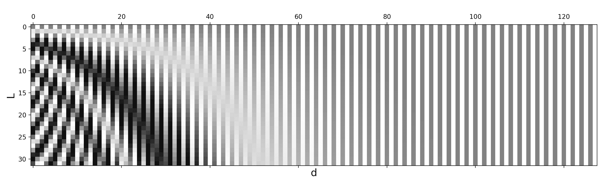

图 3。正弦位置编码，$L=32$，$d=128$。值介于-1（黑色）和 1（白色）之间，值为 0 为灰色。

(2) *学习的位置编码*，顾名思义，为每个元素分配一个学习的列向量，编码其*绝对*位置（[Gehring 等人，2017](https://arxiv.org/abs/1705.03122)）。

**快速跟进**

在基础 Transformer 之后，[Al-Rfou 等人（2018）](https://arxiv.org/abs/1808.04444)添加了一组辅助损失，以便在字符级语言建模上训练深度 Transformer 模型，这超过了 LSTMs。使用了几种类型的辅助任务：

+   不仅在序列末尾产生一个预测，还要求每个*即时位置*也进行正确预测，迫使模型在给定更小上下文（例如上下文窗口开头的前几个标记）时进行预测。

+   每个中间 Transformer 层也用于进行预测。随着训练的进行，较低层的权重会逐渐减少对总损失的贡献。

+   每个序列中的位置可以预测多个目标，即未来标记的两个或更多预测。

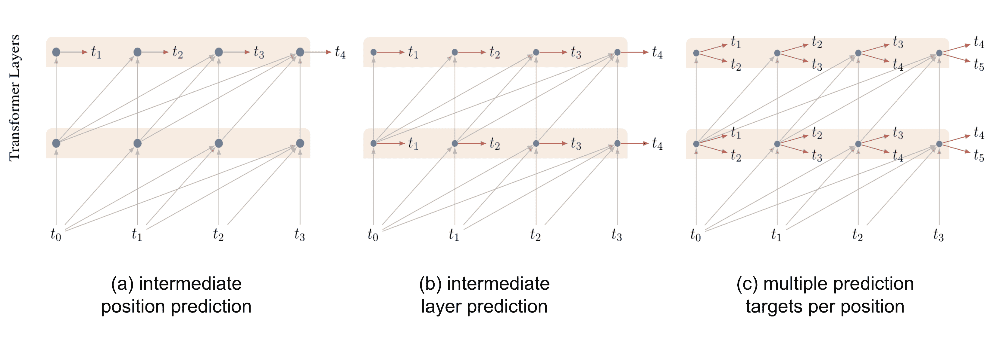

图 4. 深度 Transformer 用于字符级语言建模的辅助预测任务。（图片来源：[Al-Rfou 等人（2018）](https://arxiv.org/abs/1808.04444)）

# 自适应计算时间（ACT）

**自适应计算时间**（简称**ACT**；[Graves, 2016](https://arxiv.org/abs/1603.08983)）是一种动态决定循环神经网络中需要多少计算步骤的机制。这里有一个关于 ACT 的很酷的[教程](https://distill.pub/2016/augmented-rnns/#adaptive-computation-time)来自 distill.pub。

假设我们有一个由输入权重$W_x$、参数化状态转移函数$\mathcal{S}(.)$、一组输出权重$W_y$和输出偏置$b_y$组成的 RNN 模型$\mathcal{R}$。给定一个输入序列$(x_1, \dots, x_L)$，输出序列$(y_1, \dots, y_L)$由以下计算得出：

$$ s_t = \mathcal{S}(s_{t-1}, W_x x_t), \quad y_t = W_y s_t + b_y\quad\text{for }t=1, \dots, L $$

ACT 使上述 RNN 设置能够在每个输入元素上执行可变数量的步骤。多个计算步骤导致中间状态序列$(s_t¹, \dots, s_t^{N(t)})$和输出$(y_t¹, \dots, y_t^{N(t)})$ — 它们都共享相同的状态转移函数$\mathcal{S}(.)$，以及相同的输出权重$W_y$和偏置$b_y$：

$$ \begin{aligned} s_t⁰ &= s_{t-1} \\ s_t^n &= \mathcal{S}(s_{t}^{n-1}, x_t^n) = \mathcal{S}(s_{t}^{n-1}, x_t + \delta_{n,1}) \text{ for } n=1, \dots, N(t)\\ y_t^n &= W_y s_t^n + b_y \end{aligned} $$

其中$\delta_{n,1}$是一个二进制标志，指示输入步骤是否已增加。

步数$N(t)$由额外的 S 形停止单元$h$确定，具有相关的权重矩阵$W_h$和偏置$b_h$，在第$t$个输入元素的即时步骤$n$处输出一个停止概率$p_t^n$：

$$ h_t^n = \sigma(W_h s_t^n + b_h) $$

为了允许计算在单个步骤后停止，ACT 引入了一个小常数$\epsilon$（例如 0.01），因此每当累积概率超过$1-\epsilon$时，计算就会停止。

$$ \begin{aligned} N(t) &= \min(\min\{n': \sum_{n=1}^{n'} h_t^n \geq 1 -\epsilon\}, M) \\ p_t^n &= \begin{cases} h_t^n & \text{if }n < N(t) \\ R(t) = 1 - \sum_{n=1}^{N(t)-1} h_t^n & \text{if }n= N(t)\\ \end{cases} \end{aligned} $$

其中$M$是允许的中间步骤数的上限。

最终状态和输出是均场更新：

$$ s_t = \sum_{n=1}^{N(t)} p_t^n s_t^n,\quad y_t = \sum_{n=1}^{N(t)} p_t^n y_t^n $$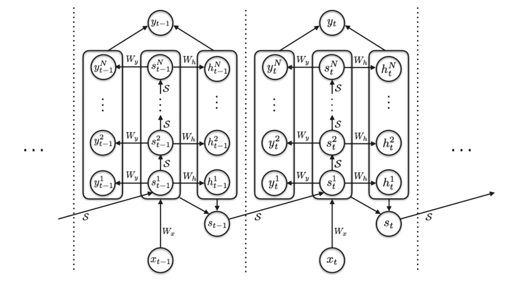

图 5. 具有 ACT 机制的 RNN 的计算图。 (图片来源：[Graves, 2016](https://arxiv.org/abs/1603.08983))

为了避免对每个输入进行不必要的思考，ACT 在损失函数中添加了一个*思考成本*$\mathcal{P}(x) = \sum_{t=1}^L N(t) + R(t)$，以鼓励较少的中间计算步骤。

# 改进的注意力跨度

改善注意力跨度的目标是使自注意力中可以使用的上下文更长、更高效和更灵活。

## 更长的注意力跨度（Transformer-XL）

普通 Transformer 具有固定且有限的注意力跨度。模型在每个更新步骤中只能关注同一段中的其他元素，不能在分隔的固定长度段之间传递信息。

这种*上下文分割*会引起几个问题：

+   模型无法捕捉非常长期的依赖关系。

+   在没有或很少上下文的情况下，很难预测每个片段中的前几个标记。

+   评估是昂贵的。每当段向右移动一个位置时，新段都会从头开始重新处理，尽管有很多重叠的标记。

**Transformer-XL** ([Dai 等人，2019](https://arxiv.org/abs/1901.02860); “XL”代表“extra long”) 通过两个主要修改解决了上下文分割问题：

1.  在段之间重用隐藏状态。

1.  采用适合重用状态的新位置编码。

**隐藏状态重用**

模型通过持续使用先前段的隐藏状态引入了段之间的循环连接。

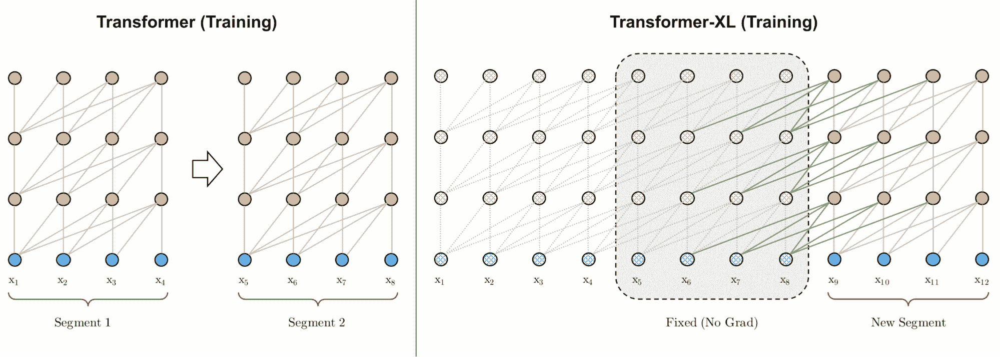

图 6. 普通 Transformer 和 Transformer-XL 在训练阶段的比较，段长度为 4。 (图片来源：[Dai 等人，2019](https://arxiv.org/abs/1901.02860)中图 2 的左部分)

让我们将模型中第$(\tau + 1)$个片段的第$n$层的隐藏状态标记为$\mathbf{h}_{\tau+1}^{(n)} \in \mathbb{R}^{L \times d}$。除了相同段落的最后一层的隐藏状态$\mathbf{h}_{\tau+1}^{(n-1)}$之外，它还取决于前一个段落相同层的隐藏状态$\mathbf{h}_{\tau}^{(n)}$。通过合并来自先前隐藏状态的信息，模型将注意力跨度延伸到过去更长的时间，跨越多个片段。

$$ \begin{aligned} \color{red}{\widetilde{\mathbf{h}}_{\tau+1}^{(n-1)}} &= [\text{stop-gradient}(\mathbf{h}_{\tau}^{(n-1)}) \circ \mathbf{h}_{\tau+1}^{(n-1)}] \\ \mathbf{Q}_{\tau+1}^{(n)} &= \mathbf{h}_{\tau+1}^{(n-1)}\mathbf{W}^q \\ \mathbf{K}_{\tau+1}^{(n)} &= \color{red}{\widetilde{\mathbf{h}}_{\tau+1}^{(n-1)}} \mathbf{W}^k \\ \mathbf{V}_{\tau+1}^{(n)} &= \color{red}{\widetilde{\mathbf{h}}_{\tau+1}^{(n-1)}} \mathbf{W}^v \\ \mathbf{h}_{\tau+1}^{(n)} &= \text{transformer-layer}(\mathbf{Q}_{\tau+1}^{(n)}, \mathbf{K}_{\tau+1}^{(n)}, \mathbf{V}_{\tau+1}^{(n)}) \end{aligned} $$

注意，键和值都依赖于扩展的隐藏状态，而查询仅消耗当前步骤的隐藏状态。连接操作$[. \circ .]$沿着序列长度维度进行。

**相对位置编码**

为了处理这种新形式的注意力跨度，Transformer-XL 提出了一种新类型的位置编码。如果使用香草 Transformer 相同的方法并对绝对位置进行编码，那么之前和当前的片段将被分配相同的编码，这是不希望看到的。

为了保持位置信息在各个片段之间的连贯流动，Transformer-XL 编码*相对*位置，因为知道位置偏移量对于做出良好预测，即$i-j$之间的一个键向量$\mathbf{k}_{\tau, j}$和其查询$\mathbf{q}_{\tau, i}$可能足够了。

如果省略标量$1/\sqrt{d_k}$和 softmax 中的归一化项，但包括位置编码，我们可以将位置$i$处的查询和位置$j$处的键之间的注意力分数写为：

$$ \begin{aligned} a_{ij} &= \mathbf{q}_i {\mathbf{k}_j}^\top = (\mathbf{x}_i + \mathbf{p}_i)\mathbf{W}^q ((\mathbf{x}_j + \mathbf{p}_j)\mathbf{W}^k)^\top \\ &= \mathbf{x}_i\mathbf{W}^q {\mathbf{W}^k}^\top\mathbf{x}_j^\top + \mathbf{x}_i\mathbf{W}^q {\mathbf{W}^k}^\top\mathbf{p}_j^\top + \mathbf{p}_i\mathbf{W}^q {\mathbf{W}^k}^\top\mathbf{x}_j^\top + \mathbf{p}_i\mathbf{W}^q {\mathbf{W}^k}^\top\mathbf{p}_j^\top \end{aligned} $$

Transformer-XL 将上述四个术语重新参数化如下：

$$ a_{ij}^\text{rel} = \underbrace{ \mathbf{x}_i\mathbf{W}^q \color{blue}{ {\mathbf{W}_E^k}^\top } \mathbf{x}_j^\top }_\text{基于内容的寻址} + \underbrace{ \mathbf{x}_i\mathbf{W}^q \color{blue}{ {\mathbf{W}_R^k}^\top } \color{green}{\mathbf{r}_{i-j}^\top} }_\text{基于内容的位置偏差} + \underbrace{ \color{red}{\mathbf{u}} \color{blue}{ {\mathbf{W}_E^k}^\top } \mathbf{x}_j^\top }_\text{全局内容偏差} + \underbrace{ \color{red}{\mathbf{v}} \color{blue}{ {\mathbf{W}_R^k}^\top } \color{green}{\mathbf{r}_{i-j}^\top} }_\text{全局位置偏差} $$

+   将$\mathbf{p}_j$替换为相对位置编码$\mathbf{r}_{i-j} \in \mathbf{R}^{d}$；

+   将$\mathbf{p}_i\mathbf{W}^q$替换为两个可训练参数$\mathbf{u}$（用于内容）和$\mathbf{v}$（用于位置）在两个不同的项中；

+   将$\mathbf{W}^k$拆分为两个矩阵，$\mathbf{W}^k_E$用于内容信息，$\mathbf{W}^k_R$用于位置信息。

## 自适应注意力跨度

Transformer 的一个关键优势是捕捉长期依赖关系的能力。根据上下文，模型可能更喜欢有时比其他时候更远的地方进行关注；或者一个注意力头可能具有不同于其他头部的不同注意模式。如果注意力跨度能够灵活地调整其长度，并且只在需要时才进一步关注更远的地方，这将有助于减少模型中支持更长最大上下文大小的计算和内存成本。

这是**自适应注意力跨度**的动机。[Sukhbaatar 等人（2019）](https://arxiv.org/abs/1905.07799)提出了一种自注意机制，旨在寻找最佳的注意力跨度。他们假设不同的注意力头可能在相同的上下文窗口内以不同方式分配分数（见图 7），因此最佳跨度将分别针对每个头进行训练。


图 7。同一模型中的两个注意力头 A 和 B，在相同的上下文窗口内分配不同的注意力。头 A 更多地关注最近的标记，而头 B 均匀地向过去更远处查看。（图片来源：[Sukhbaatar 等人，2019](https://arxiv.org/abs/1905.07799))

给定第$i$个标记，我们需要计算该标记与位置$j \in S_i$处其他键之间的注意力权重，其中$S_i$定义了第$i$个标记的上下文窗口。

$$ \begin{aligned} e_{ij} &= \mathbf{q}_i {\mathbf{k}_j}^\top \\ a_{ij} &= \text{softmax}(e_{ij}) = \frac{\exp(e_{ij})}{\sum_{r=i-s}^{i-1} \exp(e_{ir})} \\ \mathbf{y}_i &= \sum_{r=i-s}^{i-1}a_{ir}\mathbf{v}_r = \sum_{r=i-s}^{i-1}a_{ir}\mathbf{x}_r\mathbf{W}^v \end{aligned} $$

添加*软掩码函数* $m_z$ 以控制有效可调整的注意力范围，将查询和键之间的距离映射为[0, 1]的值。$m_z$由$z \in [0, s]$参数化，$z$是需要学习的：

$$ m_z(x) = \text{clamp}(\frac{1}{R}(R+z-x), 0, 1) $$

其中$R$是定义$m_z$软度的超参数。

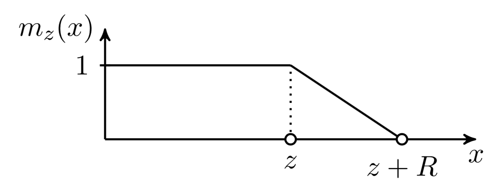

图 8. 自适应注意跨度中使用的软掩码函数。（图片来源：[Sukhbaatar 等人，2019](https://arxiv.org/abs/1905.07799)。）

软掩码函数应用于注意权重中的 softmax 元素：

$$ a_{ij} = \frac{m_z(i-j)\exp(s_{ij})}{\sum_{r=i-s}^{i-1}m_z(i-r) \exp(s_{ir})} $$

在上述方程中，$z$是可微的，因此它与模型的其他部分一起进行训练。参数$z^{(i)}, i=1, \dots, h$是*每个头部单独学习*的。此外，损失函数对$\sum_{i=1}^h z^{(i)}$有额外的 L1 惩罚。

使用自适应计算时间，该方法可以进一步增强，使其具有灵活的注意跨度长度，动态适应当前输入。时间$t$处的注意头的跨度参数$z_t$是一个 sigmoid 函数，$z_t = S \sigma(\mathbf{v} \cdot \mathbf{x}_t +b)$，其中向量$\mathbf{v}$和偏置标量$b$与其他参数一起学习。

在具有自适应注意力跨度的 Transformer 实验中，[Sukhbaatar 等人（2019）](https://arxiv.org/abs/1905.07799)发现一个普遍趋势，即较低层不需要非常长的注意跨度，而较高层中的少数注意头可能使用异常长的跨度。自适应注意跨度还有助于大大减少 FLOPS 的数量，特别是在具有许多注意层和大上下文长度的大型模型中。

## 局部化注意跨度（图像变换器）

Transformer 的最初，也是最流行的用例是进行语言建模。文本序列是一维的，按照明确定的时间顺序，因此随着上下文大小的增加，注意跨度呈线性增长。

然而，如果我们想在图像上使用 Transformer，目前尚不清楚如何定义上下文的范围或顺序。**图像变换器**（[Parmer 等人，2018](https://arxiv.org/abs/1802.05751)）采用了与 Transformer 框架内的序列建模类似的图像生成公式。此外，图像变换器将自注意跨度限制在*局部*邻域，以便模型可以扩展到并行处理更多图像，并保持可能性损失可控。

编码器-解码器架构仍然用于基于图像的生成：

+   编码器生成源图像的上下文化的、逐像素通道的表示；

+   解码器*自回归*地生成输出图像，每个时间步生成一个像素通道。

让我们将待生成的当前像素的表示标记为查询$\mathbf{q}$。用于计算$\mathbf{q}$的其他位置的表示将用作键向量$\mathbf{k}_1, \mathbf{k}_2, \dots$，它们一起形成一个记忆矩阵$\mathbf{M}$。$\mathbf{M}$的范围定义了像素查询$\mathbf{q}$的上下文窗口。

图像变换器引入了两种局部化的$\mathbf{M}$，如下图所示。

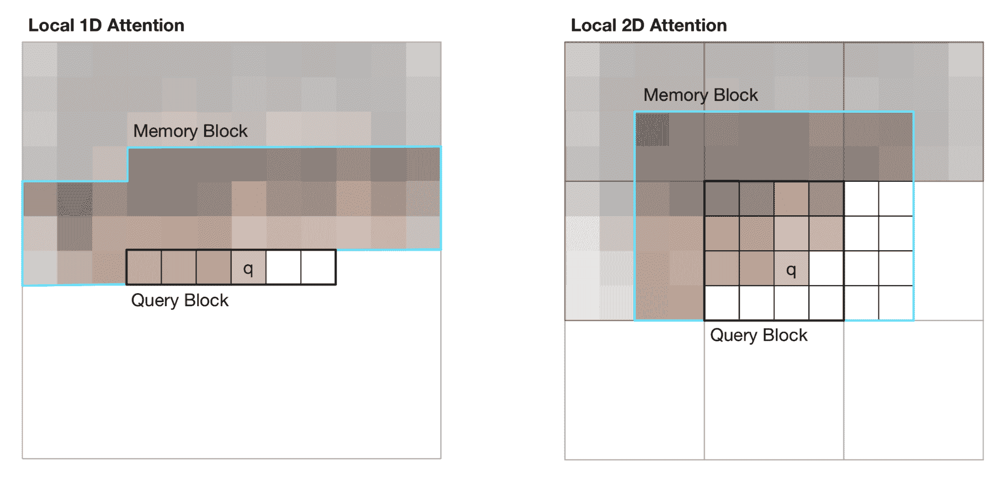

图 9\. 图像 Transformer 中视觉输入的 1D 和 2D 注意力跨度示意图。黑线标记一个查询块，青色轮廓标记像素 q 的实际注意力跨度。（图片来源：[Parmer 等人，2018](https://arxiv.org/abs/1802.05751) 中的图 2）

(1) *1D 局部注意力*：输入图像按照 [光栅扫描](https://en.wikipedia.org/wiki/Raster_scan#Scanning_pattern) 顺序展开，即从左到右，从上到下。然后将线性化的图像分成不重叠的查询块。上下文窗口包括与 $\mathbf{q}$ 相同查询块中的像素以及在此查询块之前生成的固定数量的其他像素。

(2) *2D 局部注意力*：图像被分成多个不重叠的矩形查询块。查询像素可以关注同一内存块中的所有其他像素。为了确保左上角的像素也能有有效的上下文窗口，内存块分别向上、向左和向右扩展了固定数量。

# 更少的时间和内存成本

本节介绍了对 Transformer 进行的几项改进，以减少计算时间和内存消耗。

## 稀疏注意力矩阵分解（稀疏 Transformer）

Vanilla Transformer 的计算和内存成本随着序列长度呈二次增长，因此很难应用于非常长的序列。

**稀疏 Transformer**（[Child 等人，2019](https://arxiv.org/abs/1904.10509)）引入了*分解自注意力*，通过稀疏矩阵分解，使得在长度达到 16,384 的序列上训练密集注意力网络成为可能，否则在现代硬件上是不可行的。

给定一组注意力连接模式 $\mathcal{S} = \{S_1, \dots, S_n\}$，其中每个 $S_i$ 记录第 $i$ 个查询向量关注的一组关键位置。

$$ \begin{aligned} \text{Attend}(\mathbf{X}, \mathcal{S}) &= \Big( a(\mathbf{x}_i, S_i) \Big)_{i \in \{1, \dots, L\}} \\ \text{ where } a(\mathbf{x}_i, S_i) &= \text{softmax}\Big(\frac{(\mathbf{x}_i \mathbf{W}^q)(\mathbf{x}_j \mathbf{W}^k)_{j \in S_i}^\top}{\sqrt{d_k}}\Big) (\mathbf{x}_j \mathbf{W}^v)_{j \in S_i} \end{aligned} $$

请注意，尽管 $S_i$ 的大小不固定，$a(\mathbf{x}_i, S_i)$ 的大小始终为 $d_v$，因此 $\text{Attend}(\mathbf{X}, \mathcal{S}) \in \mathbb{R}^{L \times d_v}$。

在自回归模型中，一个注意力跨度被定义为 $S_i = \{j: j \leq i\}$，因为它允许每个标记关注过去所有位置。

在分解自注意力中，集合 $S_i$ 被分解为一个*依赖树*，对于每对 $(i, j)$，其中 $j \leq i$，都存在连接 $i$ 返回到 $j$ 的路径，$i$ 可以直接或间接地关注 $j$。

具体来说，集合$S_i$被分成$p$个*不重叠*子集，其中第$m$个子集表示为$A^{(m)}_i \subset S_i, m = 1,\dots, p$。因此，输出位置$i$和任何$j$之间的路径的最大长度为$p + 1$。例如，如果$(j, a, b, c, \dots, i)$是$i$和$j$之间的索引路径，则我们会有$j \in A_a^{(1)}, a \in A_b^{(2)}, b \in A_c^{(3)}, \dots$，依此类推。

**稀疏分解注意力**

稀疏变压器提出了两种分解注意力的类型。通过图 10 中以 2D 图像输入为例进行说明，更容易理解这些概念。

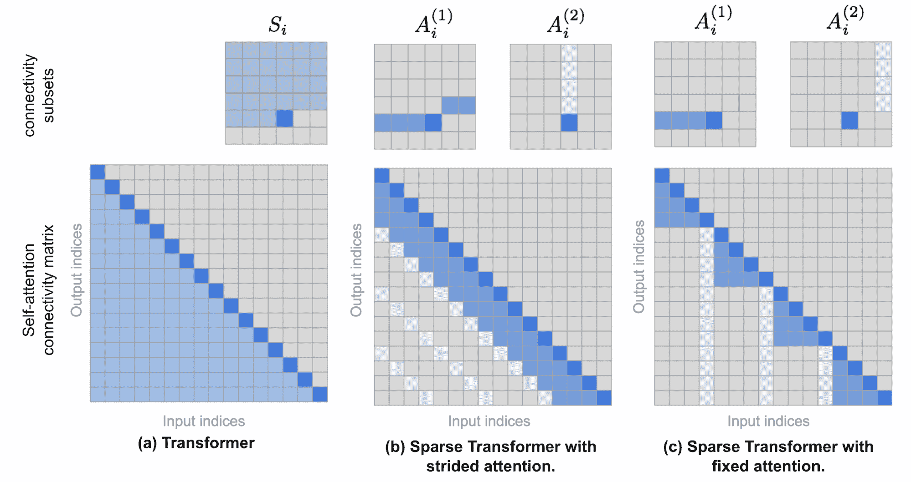

图 10\. 顶部行显示了(a) 变压器、(b) 具有跨步注意力的稀疏变压器和(c) 具有固定注意力的稀疏变压器中的注意力连接模式。底部行包含相应的自注意力连接矩阵。请注意，顶部行和底部行的比例不同。（图片来源：[Child 等人，2019](https://arxiv.org/abs/1904.10509) + 一些额外注释。）

(1) *跨步*注意力，跨度为$\ell \sim \sqrt{n}$。这在处理图像数据时效果很好，因为结构与步长对齐。在图像情况下，每个像素将关注前面的所有$\ell$个像素（自然覆盖整个图像的宽度），然后这些像素将关注同一列中的其他像素（由另一个注意力连接子集定义）。

$$ \begin{aligned} A_i^{(1)} &= \{ t, t+1, \dots, i\} \text{, where } t = \max(0, i - \ell) \\ A_i^{(2)} &= \{j: (i-j) \mod \ell = 0\} \end{aligned} $$

(2) *固定*注意力。一小组令牌总结了先前位置的信息，并将该信息传播到所有未来位置。

$$ \begin{aligned} A_i^{(1)} &= \{j: \lfloor \frac{j}{\ell} \rfloor = \lfloor \frac{i}{\ell} \rfloor \} \\ A_i^{(2)} &= \{j: j \mod \ell \in \{\ell-c, \dots, \ell-1\} \} \end{aligned} $$

其中$c$是一个超参数。如果$c=1$，它会限制表示，而许多依赖于少数位置。该论文选择了$c\in \{ 8, 16, 32 \}$，对应$\ell \in \{ 128, 256 \}$。

**在变压器中使用分解自注意力**

在变压器架构中有三种使用稀疏分解注意力模式的方法：

1.  每个残差块使用一种注意力类型，然后交错它们，

    $\text{attention}(\mathbf{X}) = \text{Attend}(\mathbf{X}, A^{(n \mod p)}) \mathbf{W}^o$，其中$n$是当前残差块的索引。

1.  设置一个单头，该头关注所有分解头关注的位置，

    $\text{attention}(\mathbf{X}) = \text{Attend}(\mathbf{X}, \cup_{m=1}^p A^{(m)}) \mathbf{W}^o $。

1.  使用多头注意力机制，但与普通变压器不同，每个头可能采用上述的 1 或 2 中呈现的模式。=> 这个选项通常表现最好。

稀疏 Transformer 还提出了一系列改变，以便训练 Transformer 达到数百层，包括梯度检查点、在反向传播期间重新计算注意力和 FF 层、混合精度训练、高效的块稀疏实现等。更多细节请查看[论文](https://arxiv.org/abs/1904.10509)。

## 局部敏感哈希（Reformer）

**Reformer**模型（[Kitaev, et al. 2020](https://arxiv.org/abs/2001.04451)）提出的改进旨在解决 Transformer 中的以下痛点：

+   在具有$N$层的模型中，内存比单层模型大$N$倍，因为我们需要存储用于反向传播的激活值。

+   中间的 FF 层通常非常大。

+   长度为$L$的序列上的注意力矩阵通常需要$O(L²)$的内存和时间。

Reformer 提出了两个主要改变：

1.  将点积注意力替换为*局部敏感哈希（LSH）注意力*，将复杂度从$O(L²)$降低到$O(L\log L)$。

1.  将标准残差块替换为*可逆残差层*，这样在训练期间只需存储激活一次，而不是$N$次（即与层数成比例）。

**局部敏感哈希注意力**

在注意力公式中的$\mathbf{Q} \mathbf{K}^\top$部分，我们只对最大的元素感兴趣，因为只有大的元素在 softmax 之后贡献很大。对于每个查询$\mathbf{q}_i \in \mathbf{Q}$，我们正在寻找与$\mathbf{q}_i$最接近的$\mathbf{K}$中的行向量。为了在高维空间中快速找到最近邻居，Reformer 将[局部敏感哈希（LSH）](https://en.wikipedia.org/wiki/Locality-sensitive_hashing)引入其注意力机制中。

如果哈希方案$x \mapsto h(x)$保留数据点之间的距离信息，则称其为*局部敏感*。Reformer 采用了这样的哈希方案，给定一个固定的随机矩阵$\mathbf{R} \in \mathbb{R}^{d \times b/2}$（其中$b$是一个超参数），哈希函数为$h(x) = \arg\max([xR; −xR])$。

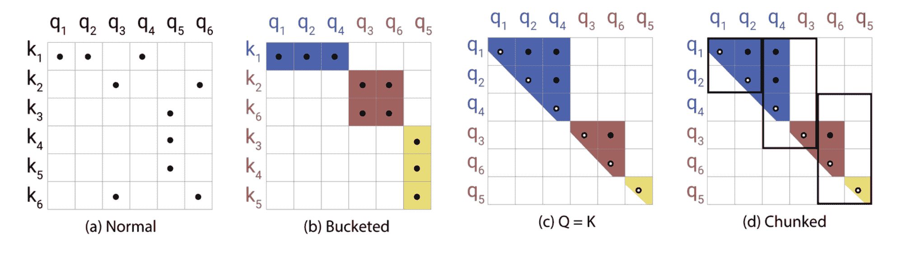

图 11. 局部敏感哈希（LSH）注意力的示意图。（图片来源：[Kitaev, et al. 2020](https://arxiv.org/abs/2001.04451)中图 1 的右部分）。

在 LSH 注意力中，一个查询只能关注相同哈希桶中的位置，$S_i = \{j: h(\mathbf{q}_i) = h(\mathbf{k}_j)\}$。如图 11 所示，这是通过以下过程进行的：

+   (a) 完全注意力的注意力矩阵通常是稀疏的。

+   (b) 使用 LSH，我们可以根据它们的哈希桶对键和查询进行排序对齐。

+   （c）设置$\mathbf{Q} = \mathbf{K}$（精确地说$\mathbf{k}_j = \mathbf{q}_j / |\mathbf{q}_j|$），以便一个桶中有相等数量的键和查询，更容易进行批处理。有趣的是，这种“共享-QK”配置不会影响 Transformer 的性能。

+   （d）对$m$个连续查询进行分组。

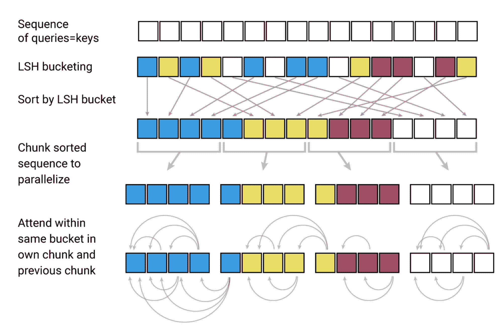

图 12。LSH 注意力包括 4 个步骤：分桶、排序、分块和注意力计算。（图片来源：[Kitaev 等人，2020](https://arxiv.org/abs/2001.04451)中图 1 的左侧部分）。

**可逆残差网络**

Reformer 的另一个改进是使用*可逆残差层*（[Gomez 等人，2017](https://arxiv.org/abs/1707.04585)）。可逆残差网络的动机是以一种方式设计架构，使得在任何给定层的激活可以仅通过模型参数从后续层的激活中恢复。因此，我们可以通过在反向传播期间重新计算激活而不是存储所有激活来节省内存。

给定一个层$x \mapsto y$，普通残差层执行$y = x + F(x)$，但可逆层将输入和输出都分成一对$(x_1, x_2) \mapsto (y_1, y_2)$，然后执行以下操作：

$$ y_1 = x_1 + F(x_2),\; y_2 = x_2 + G(y_1) $$

逆转很容易：

$$ x_2 = y_2 - G(y_1), \; x_1 = y_1 − F(x_2) $$

Reformer 通过在可逆网络块内结合注意力（$F$）和前馈层（$G$）将相同的思想应用于 Transformer：

$$ Y_1 = X_1 + \text{注意力}(X_2), \; Y_2 = X_2 + \text{前馈}(Y_1) $$

通过分块前馈计算可以进一步减少内存：

$$ Y_2 = [Y_2^{(1)}; \dots; Y_2^{(c)}] = [X_2^{(1)} + \text{前馈}(Y_1^{(1)}); \dots; X_2^{(c)} + \text{前馈}(Y_1^{(c)})] $$

结果可逆 Transformer 不需要在每一层存储激活。

# 使其变成循环的（通用 Transformer）

**通用 Transformer**（[Dehghani 等人，2019](https://arxiv.org/abs/1807.03819)）将 Transformer 中的自注意力与 RNN 中的循环机制相结合，旨在同时受益于 Transformer 的长期全局感受野和 RNN 的学习归纳偏差。

通用 Transformer 不是通过固定数量的层，而是通过使用自适应计算时间动态调整步数。如果我们固定步数，通用 Transformer 等效于具有跨层共享参数的多层 Transformer。

从高层次上看，通用 Transformer 可以被视为用于学习每个标记的隐藏状态表示的循环函数。循环函数在标记位置之间并行演变，并且通过自注意力在位置之间共享信息。


图 13\. 通用 Transformer 如何并行地为每个位置重复细化一组隐藏状态表示。（图片来源：[Dehghani 等人，2019](https://arxiv.org/abs/1807.03819)中的图 1）。

给定长度为$L$的输入序列，通用 Transformer 会在可调节的步数中迭代更新表示$\mathbf{H}^t \in \mathbb{R}^{L \times d}$。在第 0 步，$\mathbf{H}⁰$被初始化为与输入嵌入矩阵相同。所有位置在多头自注意力机制中并行处理，然后经过一个递归过渡函数。

$$ \begin{aligned} \mathbf{A}^t &= \text{LayerNorm}(\mathbf{H}^{t-1} + \text{MultiHeadAttention}(\mathbf{H}^{t-1} + \mathbf{P}^t) \\ \mathbf{H}^t &= \text{LayerNorm}(\mathbf{A}^{t-1} + \text{Transition}(\mathbf{A}^t)) \end{aligned} $$

其中$\text{Transition}(.)$可以是[可分离卷积](https://arxiv.org/abs/1610.02357)或由两个位置逐行（即分别应用于$\mathbf{A}^t$的每一行）的仿射变换+一个 ReLU 组成的全连接神经网络。

位置编码$\mathbf{P}^t$使用正弦位置信号，但还带有一个额外的时间维度：

$$ \text{PE}(i, t, \delta) = \begin{cases} \sin(\frac{i}{10000^{2\delta'/d}}) \oplus \sin(\frac{t}{10000^{2\delta'/d}}) & \text{if } \delta = 2\delta'\\ \cos(\frac{i}{10000^{2\delta'/d}}) \oplus \cos(\frac{t}{10000^{2\delta'/d}}) & \text{if } \delta = 2\delta' + 1\\ \end{cases} $$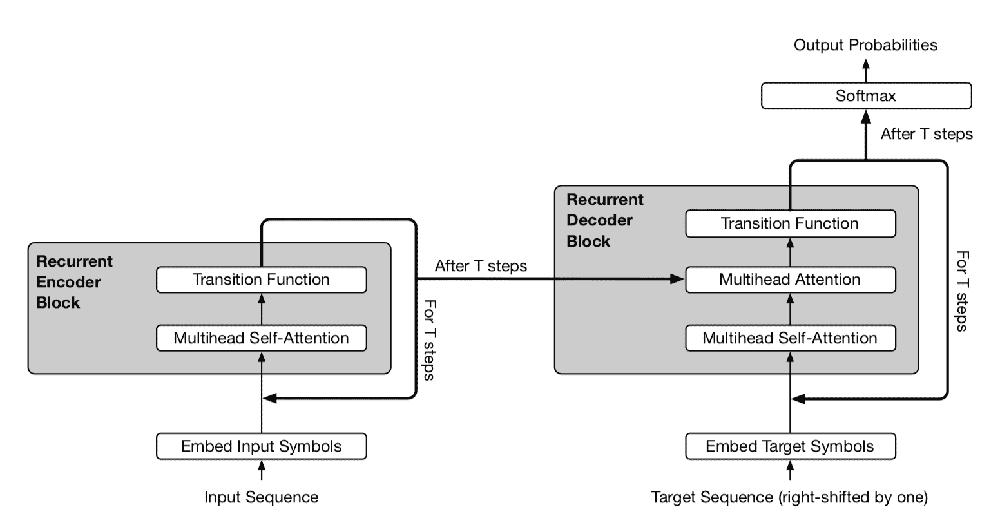

图 14\. 通用 Transformer 的简化示意图。编码器和解码器共享相同的基本递归结构。但解码器还会关注最终编码器表示$\mathbf{H}^T$。（图片来源：[Dehghani 等人，2019](https://arxiv.org/abs/1807.03819)中的图 2）。

在自适应版本的通用 Transformer 中，递归步数$T$由 ACT 动态确定。每个位置都配备了一个动态的 ACT 停止机制。一旦一个每令牌递归块停止，它就停止接受更多的递归更新，而只是将当前值复制到下一步，直到所有块停止或直到模型达到最大步数限制。

# RL 的稳定化（GTrXL）

自注意力机制避免将整个过去压缩为固定大小的隐藏状态，并且不像 RNN 那样容易出现梯度消失或梯度爆炸问题。强化学习任务肯定可以从这些特性中受益。*然而*，即使在监督学习中，训练 Transformer 也是相当困难的，更不用说在 RL 环境中了。毕竟，单独训练和稳定一个 LSTM 代理可能会非常具有挑战性。

**门控 Transformer-XL** (**GTrXL**; [帕里索托等人，2019](https://arxiv.org/abs/1910.06764)) 是将 Transformer 用于 RL 的一次尝试。GTrXL 通过对 Transformer-XL 进行两项修改成功稳定了训练。

1.  层归一化仅应用于残差模块中的输入流，而不应用于快捷流。这种重新排序的一个关键好处是允许原始输入从第一层流向最后一层。

1.  残差连接被一个类似 GRU 风格（门控循环单元；[Chung 等人，2014](https://arxiv.org/abs/1412.3555)）的*门控*机制所取代。

$$ \begin{aligned} r &= \sigma(W_r^{(l)} y + U_r^{(l)} x) \\ z &= \sigma(W_z^{(l)} y + U_z^{(l)} x - b_g^{(l)}) \\ \hat{h} &= \tanh(W_g^{(l)} y + U_g^{(l)} (r \odot x)) \\ g^{(l)}(x, y) &= (1-z)\odot x + z\odot \hat{h} \end{aligned} $$

门控函数参数被明确初始化为接近单位映射 - 这就是为什么有一个$b_g$项。$b_g > 0$对于学习加速非常有帮助。

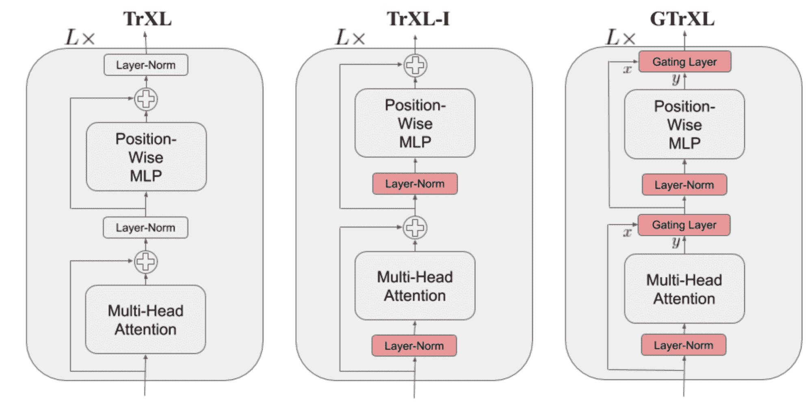

图 15。Transformer-XL、重新排序的层归一化 Transformer-XL 和门控 Transformer-XL 的模型架构比较。 (图片来源：[帕里索托等人，2019](https://arxiv.org/abs/1910.06764))

# 引用

引用为：

> 翁，莉莉安。 (2020 年 4 月)。变压器家族。Lil’Log。https://lilianweng.github.io/posts/2020-04-07-the-transformer-family/。

或

```py
@article{weng2020transformer,
  title   = "The Transformer Family",
  author  = "Weng, Lilian",
  journal = "lilianweng.github.io",
  year    = "2020",
  month   = "Apr",
  url     = "https://lilianweng.github.io/posts/2020-04-07-the-transformer-family/"
} 
```

# 参考

[1] 阿希什·瓦斯瓦尼等人。[“注意力就是你所需要的。”](http://papers.nips.cc/paper/7181-attention-is-all-you-need.pdf) NIPS 2017。

[2] 拉米·阿尔-福等人。[“更深层次的自注意力字符级语言建模。”](https://arxiv.org/abs/1808.04444) AAAI 2019。

[3] 奥拉和卡特，[“注意力和增强循环神经网络”](http://doi.org/10.23915/disti)，Distill，2016。

[4] 赛恩巴亚尔·苏赫巴塔尔等人。[“变压器中的自适应注意力跨度”](https://arxiv.org/abs/1905.07799)。ACL 2019。

[5] 雷文·奇尔德等人。[“使用稀疏变压器生成长序列”](https://arxiv.org/abs/1904.10509) arXiv:1904.10509 (2019)。

[6] 尼基塔·基塔耶夫等人。[“Reformer: 高效 Transformer”](https://arxiv.org/abs/2001.04451) ICLR 2020。

[7] 亚历克斯·格雷夫斯。[“适应性循环神经网络的计算时间”](https://arxiv.org/abs/1603.08983)。

[8] 尼基·帕马尔等人。[“图像变压器”](https://arxiv.org/abs/1802.05751) ICML 2018。

[9] 戴子航等人。[“Transformer-XL: 超越固定长度上下文的关注语言模型。”](https://arxiv.org/abs/1901.02860) ACL 2019。

[10] 艾丹·戈麦斯等人。[“可逆残差网络：无需存储激活的反向传播”](https://arxiv.org/abs/1707.04585) NIPS 2017。

[11] 莫斯塔法·德赫加尼等人。[“通用变压器”](https://arxiv.org/abs/1807.03819) ICLR 2019。

[12] 埃米利奥·帕里索托等人。[“用于强化学习的稳定变压器”](https://arxiv.org/abs/1910.06764) arXiv:1910.06764 (2019)。
