# 强化学习课程

> 原文：[`lilianweng.github.io/posts/2020-01-29-curriculum-rl/`](https://lilianweng.github.io/posts/2020-01-29-curriculum-rl/)

更新于 2020-02-03：在“任务特定课程”部分提到[PCG。

更新于 2020-02-04：添加一个新的[“通过蒸馏进行课程”部分。

如果我们想要教一个连基本算术都不懂的 3 岁孩子积分或导数，那听起来像是一项不可能的任务。这就是为什么教育很重要，因为它提供了一个系统的方式来分解复杂知识，并为从简单到困难的概念教学提供了一个良好的课程。课程使学习困难的事物变得更容易和更易接近我们人类。但是，机器学习模型呢？我们能否通过课程更有效地训练我们的模型？我们能否设计一个课程来加快学习速度？

1993 年，杰弗里·埃尔曼提出了用课程来训练神经网络的想法。他在学习简单语法的早期工作中展示了这种策略的重要性：从一组简单的数据开始，逐渐增加训练样本的复杂性；否则模型根本无法学习。

与没有课程的训练相比，我们预期采用课程会加快收敛速度，可能会或可能不会改善最终模型性能。设计一个高效和有效的课程并不容易。请记住，一个糟糕的课程甚至可能阻碍学习。

接下来，我们将探讨几种课程学习的类别，如图 1 所示。大多数情况适用于强化学习，少数情况适用于监督学习。

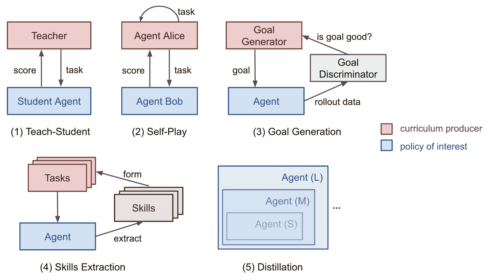

图 1。强化学习的五种课程类型。

在“从小事开始的重要性”论文中（[Elman 1993](http://citeseerx.ist.psu.edu/viewdoc/download?doi=10.1.1.128.4487&rep=rep1&type=pdf)），我特别喜欢开头的句子，觉得既鼓舞人心又触动人心：

> “人类在许多方面与其他物种不同，但有两点特别值得注意。人类展示了异常的学习能力；而人类以异常长的时间达到成熟而显著。学习的适应性优势是明显的，可以说，通过文化，学习已经创造了一种非基因传播行为的基础，这可能加速了我们物种的进化。”

实际上，学习可能是我们人类拥有的最好的超能力。

# 任务特定的课程

[Bengio 等人（2009）](https://www.researchgate.net/profile/Y_Bengio/publication/221344862_Curriculum_learning/links/546cd2570cf2193b94c577ac/Curriculum-learning.pdf)在旧时代提供了课程学习的良好概述。该论文通过使用手动设计的任务特定课程进行玩具实验，提出了两个想法：

1.  更干净的例子可能更快地产生更好的泛化。

1.  逐渐引入更难的例子可以加快在线训练速度。

有可能一些课程策略是无用的甚至有害的。在这个领域要回答的一个好问题是：*是什么一般原则使一些课程策略比其他更有效？* Bengio 2009 年的论文假设，让学习集中在既不太难也不太容易的“有趣”例子上可能是有益的。

如果我们朴素的课程是训练模型逐渐增加复杂性的样本，我们需要一种方法来首先量化任务的难度。一个想法是使用其相对于另一个模型的最小损失，而这个模型是在其他任务上预训练的（[Weinshall, et al. 2018](https://arxiv.org/abs/1802.03796)）。通过这种方式，预训练模型的知识可以通过建议训练样本的排名传递给新模型。图 2 显示了`curriculum`组（绿色）的有效性，与`control`（随机顺序；黄色）和`anti`（反向顺序；红色）组相比。

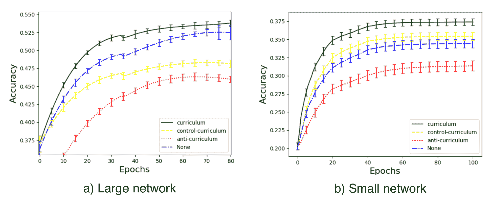

图 2\. 测试图像集上的图像分类准确性（CIFAR100 中“小型哺乳动物”的 5 个成员类别）。有 4 个实验组，(a) `curriculum`：按另一个训练好的分类器的置信度（例如 SVM 的边缘）对标签进行排序；(b) `control-curriculum`：随机排序标签；(c) `anti-curriculum`：反向排序标签；(d) `None`：无课程。（图片来源：[Weinshall, et al. 2018](https://arxiv.org/abs/1802.03796)）

[Zaremba & Sutskever (2014)](https://arxiv.org/abs/1410.4615) 对训练 LSTM 来预测数学运算的短 Python 程序输出进行了有趣的实验，而不实际执行代码。他们发现课程对学习是必要的。程序的复杂性由两个参数控制，`length` ∈ [1, a] 和 `nesting`∈ [1, b]。考虑了三种策略：

1.  朴素课程：首先增加`length`直到达到`a`；然后增加`nesting`并将`length`重置为 1；重复此过程直到两者都达到最大值。

1.  混合课程：样本`length` ~ [1, a] 和 `nesting` ~ [1, b]

1.  组合：朴素 + 混合。

他们注意到，组合策略总是优于朴素课程，并且通常（但不总是）优于混合策略 — 表明在训练过程中混合易任务是非常重要的，以*避免遗忘*。

过程内容生成（[PCG](https://en.wikipedia.org/wiki/Procedural_generation)）是创建各种难度视频游戏的流行方法。 PCG 涉及算法随机性和大量人类专业知识在设计游戏元素和它们之间的依赖关系。程序生成的关卡已经被引入几个基准环境中，用于评估 RL 代理是否能够推广到未经训练的新关卡（[元 RL](https://lilianweng.github.io/posts/2019-06-23-meta-rl/)！），如[GVGAI](http://www.gvgai.net/)，OpenAI 的[CoinRun](https://openai.com/blog/quantifying-generalization-in-reinforcement-learning/)和[Procgen benchmark](https://openai.com/blog/procgen-benchmark/)。使用 GVGAI，[Justesen 等人（2018）](https://arxiv.org/abs/1806.10729)证明了 RL 策略可以轻松过拟合到特定游戏，但通过训练一个简单的课程，使任务难度与模型性能一起增加，有助于其推广到新的人类设计关卡。CoinRun 中也发现了类似的结果（[Cobbe 等人，2018](https://arxiv.org/abs/1812.02341)）。POET（[Wang 等人，2019](https://arxiv.org/abs/1901.01753)）是利用进化算法和程序生成的游戏关卡来改善 RL 泛化的另一个例子，我在我的[元 RL 文章](https://lilianweng.github.io/posts/2019-06-23-meta-rl/#evolutionary-algorithm-on-environment-generation)中详细描述了这一点。

要遵循上述描述的课程学习方法，通常我们需要解决培训过程中的两个问题：

1.  设计一个度量标准来量化任务的难度，以便我们可以根据任务进行排序。

1.  在训练过程中向模型提供一系列难度逐渐增加的任务。

然而，任务的顺序不一定要是顺序的。在我们的魔方论文（[OpenAI 等人，2019](https://arxiv.org/abs/1910.07113)）中，我们依赖*自动领域随机化*（**ADR**）通过增加复杂性生成一系列环境的分布来生成课程。每个任务的难度（即在一组环境中解决魔方）取决于各种环境参数的随机化范围。即使假设所有环境参数都不相关，我们也能为我们的机器手创建一个不错的课程来学习任务。

# 教师引导的课程

*自动课程学习*的概念是由[Graves 等人，2017](https://arxiv.org/abs/1704.03003)稍早提出的。它将$N$任务课程视为一个[$N$臂老虎机](https://lilianweng.github.io/posts/2018-01-23-multi-armed-bandit/)问题，并且一个自适应策略学习如何优化这个老虎机的回报。

论文中考虑了两类学习信号：

1.  损失驱动的进展：梯度更新前后的损失函数变化。这种奖励信号跟踪学习过程的速度，因为最大的任务损失减少等同于最快的学习。

1.  复杂驱动的进展：后验分布和先验分布之间的 KL 散度。这种学习信号的灵感来自于[MDL](https://en.wikipedia.org/wiki/Minimum_description_length)原则，“通过一定量增加模型复杂性只有在它能够以更大量压缩数据时才值得”。因此，模型复杂性预计会在模型很好地泛化到训练示例时增加最多。

通过另一个 RL 代理自动提出课程的框架被正式化为*教师-学生课程学习*（**TSCL**；[Matiisen, et al. 2017](https://arxiv.org/abs/1707.00183)）。在 TSCL 中，*学生*是一个在实际任务上工作的 RL 代理，而*教师*代理是选择任务的策略。学生的目标是掌握一个可能直接学习困难的复杂任务。为了使这个任务更容易学习，我们设置教师代理来引导学生的训练过程，选择适当的子任务。

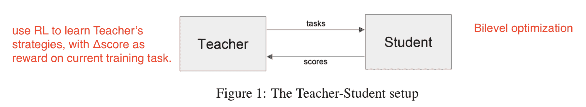

图 3。教师-学生课程学习的设置。（图片来源：[Matiisen, et al. 2017](https://arxiv.org/abs/1707.00183) + 我的红色注释。）

在这个过程中，学生应该学习以下任务：

1.  可以帮助学生取得最快的学习进展，或

1.  有被遗忘的风险。

> 注意：将教师模型设置为 RL 问题的框架与神经架构搜索（NAS）非常相似，但 TSCL 中的 RL 模型在任务空间上运行，而 NAS 在主模型架构空间上运行。

训练教师模型是为了解决[POMDP](https://en.wikipedia.org/wiki/Partially_observable_Markov_decision_process)问题：

+   未观察到的$s_t$是学生模型的完整状态。

+   观察到的$o = (x_t^{(1)}, \dots, x_t^{(N)})$是$N$个任务的分数列表。

+   动作$a$是选择子任务。

+   每步的奖励是分数差值。$r_t = \sum_{i=1}^N x_t^{(i)} - x_{t-1}^{(i)}$（即，等同于在剧集结束时最大化所有任务的分数）。

从嘈杂的任务分数中估计学习进度的方法，同时平衡探索与开发，可以从非稳态多臂老虎机问题中借鉴——使用[ε-greedy](https://lilianweng.github.io/posts/2018-01-23-multi-armed-bandit/#%CE%B5-greedy-algorithm)，或[汤普森抽样](https://lilianweng.github.io/posts/2018-01-23-multi-armed-bandit/#thompson-sampling)。

核心思想，总结起来，是使用一个策略为另一个策略提出更好的任务。有趣的是，以上两项工作（在离散任务空间中）发现均匀地从所有任务中抽样是一个令人惊讶地强大的基准。

如果任务空间是连续的会怎样？[Portelas, et al. (2019)](https://arxiv.org/abs/1910.07224)研究了一个连续的师生框架，其中老师必须从连续的任务空间中采样参数以生成学习课程。给定一个新采样的参数$p$，绝对学习进度（简称 ALP）被测量为$\text{ALP}_p = \vert r - r_\text{old} \vert$，其中$r$是与$p$相关的一个周期性奖励，$r_\text{old}$是与$p_\text{old}$相关的奖励。这里，$p_\text{old}$是任务空间中最接近$p$的先前采样参数，可以通过最近邻检索。请注意，这个 ALP 分数如何与 TSCL 或 Grave, et al. 2017 中的学习信号不同：ALP 分数衡量了两个任务之间的奖励差异，而不是同一任务两个时间步的表现。

在任务参数空间的顶部，训练一个高斯混合模型来拟合$\text{ALP}_p$在$p$上的分布。在采样任务时使用ε-greedy 策略：以一定概率随机采样一个任务；否则根据 GMM 模型中的 ALP 分数比例采样。

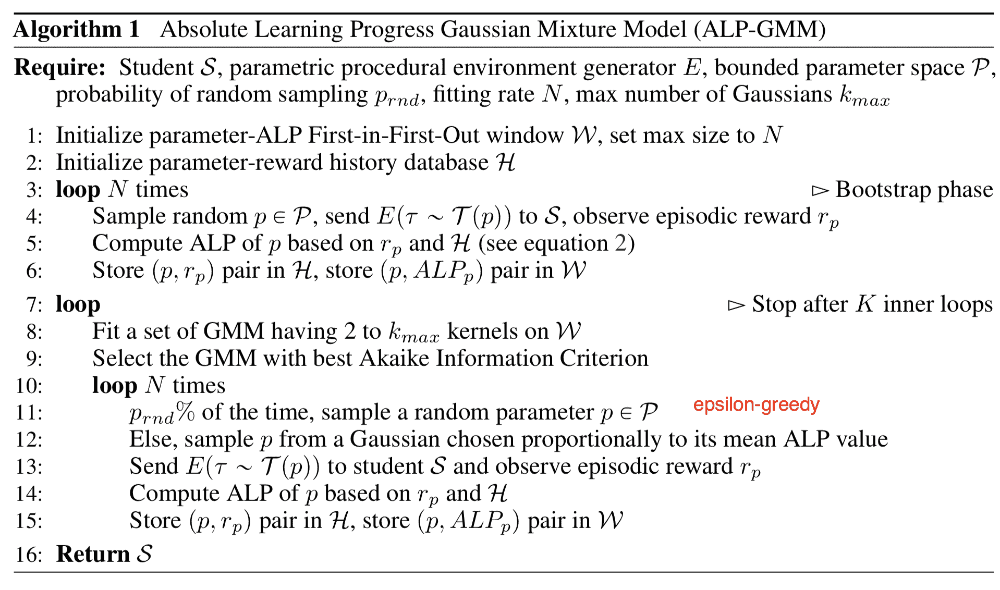

图 4\. ALP-GMM（绝对学习进度高斯混合模型）的算法。（图片来源：[Portelas, et al., 2019](https://arxiv.org/abs/1910.07224))

# 通过自我对弈进行课程设置

与师生框架不同，两个代理在做非常不同的事情。老师学习为学生挑选任务，而不知道实际任务内容。如果我们想让两者直接在主要任务上训练呢？甚至让他们互相竞争呢？

[Sukhbaatar, et al. (2017)](https://arxiv.org/abs/1703.05407)提出了一个通过**非对称自我对弈**进行自动课程学习的框架。两个代理，Alice 和 Bob，玩同一个任务但有不同的目标：Alice 挑战 Bob 达到相同状态，而 Bob 则尽可能快地完成。

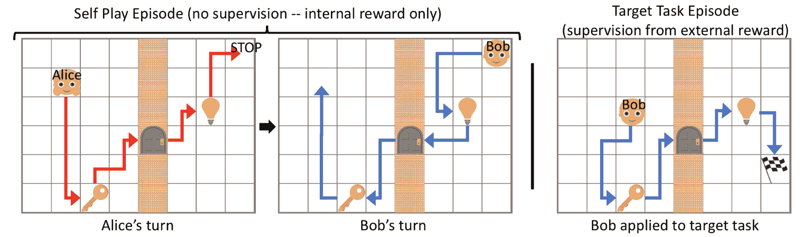

图 5\. 展示了训练两个代理时的自我对弈设置。示例任务是[MazeBase](https://github.com/facebook/MazeBase)：一个代理被要求在一个迷宫中达到一个带有灯开关、钥匙和门的墙的目标旗帜。切换钥匙开关可以打开或关闭门，关闭灯只能让代理使用发光的开关。（图片来源：[Sukhbaatar, et al. 2017](https://arxiv.org/abs/1703.05407)）

让我们将 Alice 和 Bob 视为同一 RL 代理的两个独立副本，在相同环境中训练，但具有不同的大脑。他们各自具有独立的参数和损失目标。自我对弈驱动的训练包括两种类型的情节：

+   在*自我对弈的情节*中，Alice 将状态从$s_0$改变到$s_t$，然后 Bob 被要求将环境恢复到原始状态$s_0$以获得内部奖励。

+   在*目标任务剧集*中，如果 Bob 访问目标标志，他将获得外部奖励。

注意，由于 B 必须在 A 的相同一对$(s_0, s_t)$之间重复动作，这个框架只适用于可逆或可重置的环境。

Alice 应该学会让 Bob 走出舒适区，但不要给他不可能的任务。Bob 的奖励设定为$R_B = -\gamma t_B$，Alice 的奖励为$R_A = \gamma \max(0, t_B - t_A)$，其中$t_B$是 B 完成任务的总时间，$t_A$是 Alice 执行 STOP 动作的时间，$\gamma$是一个标量常数，用于重新调整奖励，使其可与外部任务奖励进行比较。如果 B 失败了一个任务，$t_B = t_\max - t_A$。两个策略都是目标条件的。损失意味着：

1.  B 希望尽快完成任务。

1.  A 更喜欢占用 B 更多时间的任务。

1.  当 B 失败时，A 不想走太多步。

这种方式，Alice 和 Bob 之间的互动自动构建了一系列越来越具挑战性任务的课程。同时，由于 A 在向 B 提出任务之前已经完成了任务，所以可以保证任务是可解的。

A 建议任务，然后 B 解决任务的范式听起来与师生框架相似。然而，在非对称自我对弈中，扮演老师角色的 Alice 也在同一个任务上工作，寻找 Bob 的挑战性案例，而不是明确优化 B 的学习过程。

# 自动目标生成

通常 RL 策略需要能够执行一组任务。目标应该谨慎选择，以便在每个训练阶段，对于当前策略来说既不太难也不太容易。目标$g \in \mathcal{G}$可以定义为一组状态$S^g$，当代理到达这些状态中的任何一个时，目标被视为已实现。

生成目标学习方法（[Florensa, et al. 2018](https://arxiv.org/abs/1705.06366)）的方法依赖于**目标 GAN**自动生成所需目标。在他们的实验中，奖励非常稀疏，只是一个二进制标志，表示目标是否实现，策略取决于目标，

$$ \begin{aligned} \pi^{*}(a_t\vert s_t, g) &= \arg\max_\pi \mathbb{E}_{g\sim p_g(.)} R^g(\pi) \\ \text{where }R^g(\pi) &= \mathbb{E}_\pi(.\mid s_t, g) \mathbf{1}[\exists t \in [1,\dots, T]: s_t \in S^g] \end{aligned} $$

这里$R^g(\pi)$是期望回报，也等同于成功概率。给定当前策略的采样轨迹，只要任何状态属于目标集，回报将为正。

他们的方法通过 3 个步骤迭代，直到策略收敛：

1.  根据当前策略是否适当难度，为一组目标打上标签。

+   适当难度的目标集被命名为**GOID**（“中等难度目标”的缩写）。

    $\text{GOID}_i := \{g : R_\text{min} \leq R^g(\pi_i) \leq R_\text{max} \} \subseteq G$

+   这里 $R_\text{min}$ 和 $R_\text{max}$ 可以被解释为在 T 个时间步内达到目标的最小和最大概率。

1.  使用从步骤 1 中标记的目标训练 Goal GAN 模型以生成新目标。

1.  使用这些新目标来训练策略，改进其覆盖目标。

Goal GAN 自动生成课程：

+   生成器 $G(z)$: 产生一个新的目标。 => 预期是从 $GOID$ 集合均匀抽样得到的目标。

+   判别器 $D(g)$: 评估一个目标是否可以实现。 => 预期能够判断目标是否来自 $GOID$ 集合。

Goal GAN 的构建类似于 LSGAN（最小二乘 GAN; [Mao 等人，(2017)](https://arxiv.org/abs/1611.04076)），相比于普通 GAN，具有更好的学习稳定性。根据 LSGAN，我们应分别最小化以下损失函数以用于 $D$ 和 $G$：

$$ \begin{aligned} \mathcal{L}_\text{LSGAN}(D) &= \frac{1}{2} \mathbb{E}_{g \sim p_\text{data}(g)} [ (D(g) - b)²] + \frac{1}{2} \mathbb{E}_{z \sim p_z(z)} [ (D(G(z)) - a)²] \\ \mathcal{L}_\text{LSGAN}(G) &= \frac{1}{2} \mathbb{E}_{z \sim p_z(z)} [ (D(G(z)) - c)²] \end{aligned} $$

其中 $a$ 是假数据的标签，$b$ 是真实数据的标签，$c$ 是 $G$ 希望 $D$ 相信假数据的值。在 LSGAN 论文的实验中，他们使用了 $a=-1, b=1, c=0$。

Goal GAN 引入了额外的二进制标志 $y_b$，指示一个目标 $g$ 是真实的（$y_g = 1$）还是虚假的（$y_g = 0$），以便模型可以使用负样本进行训练：

$$ \begin{aligned} \mathcal{L}_\text{GoalGAN}(D) &= \frac{1}{2} \mathbb{E}_{g \sim p_\text{data}(g)} [ (D(g) - b)² + (1-y_g) (D(g) - a)²] + \frac{1}{2} \mathbb{E}_{z \sim p_z(z)} [ (D(G(z)) - a)²] \\ \mathcal{L}_\text{GoalGAN}(G) &= \frac{1}{2} \mathbb{E}_{z \sim p_z(z)} [ (D(G(z)) - c)²] \end{aligned} $$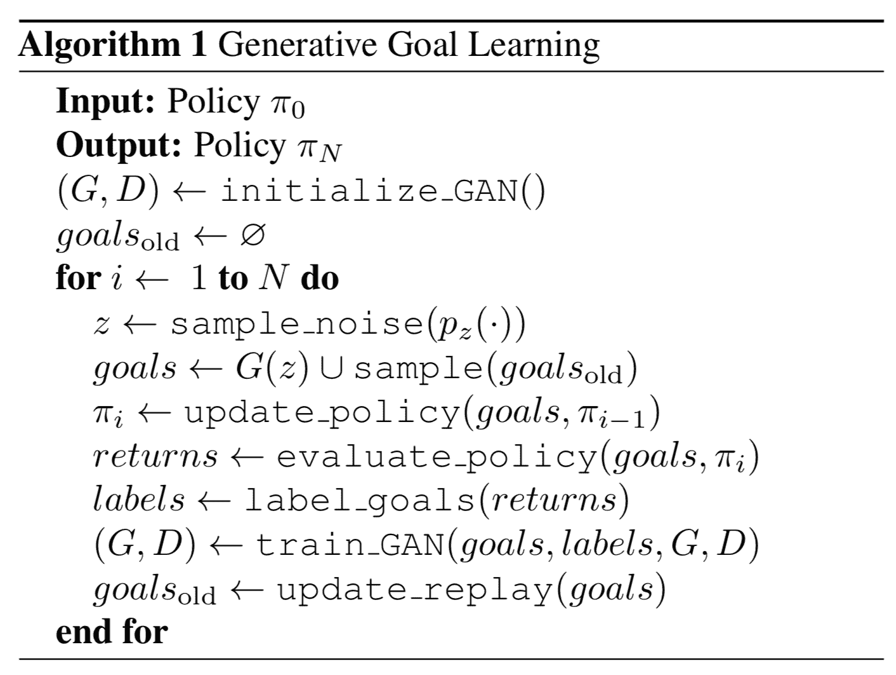

图 6\. 生成式目标学习算法。 (图片来源: ([Florensa, et al. 2018](https://arxiv.org/abs/1705.06366))

遵循相同的思路，[Racaniere & Lampinen, et al. (2019)](https://arxiv.org/abs/1909.12892) 设计了一种方法，使目标生成器的目标更加复杂。他们的方法包含三个组件，与上述生成式目标学习相同：

+   **Solver**/Policy $\pi$: 在每一集中，求解器在开始时获得一个目标 $g$，并在结束时获得单一的二进制奖励 $R^g$。

+   **Judge**/Discriminator $D(.)$: 用于预测二进制奖励的分类器（目标是否可以实现）；准确地输出给定目标实现概率的对数几率，$\sigma(D(g)) = p(R^g=1\vert g)$，其中 $\sigma$ 是 Sigmoid 函数。

+   **Setter**/Generator $G(.)$: 目标设定者接受期望的可行性得分 $f \in \text{Unif}(0, 1)$ 作为输入，并生成 $g = G(z, f)$，其中潜变量 $z$ 是由 $z \sim \mathcal{N}(0, I)$ 抽样得到的。目标生成器被设计为可逆的，因此 $G^{-1}$ 可以从目标 $g$ 逆向映射到潜变量 $z = G^{-1}(g, f)$

生成器被优化为三个目标：

1.  目标**有效性**：提出的目标应该可以由专家策略实现。相应的生成损失旨在增加生成已被解算器策略实现过的目标的可能性（就像在[HER](https://arxiv.org/abs/1707.01495)中一样）。

    +   $\mathcal{L}_\text{val}$ 是过去已被解决的生成目标的负对数似然。

$$ \begin{align*} \mathcal{L}_\text{val} = \mathbb{E}_{\substack{ g \sim \text{ achieved by solver}, \\ \xi \in \text{Uniform}(0, \delta), \\ f \in \text{Uniform}(0, 1) }} \big[ -\log p(G^{-1}(g + \xi, f)) \big] \end{align*} $$

1.  目标**可行性**：提出的目标应该可以由当前策略实现；即，难度水平应该适当。

    +   $\mathcal{L}_\text{feas}$ 是评判模型 $D$ 对生成目标 $G(z, f)$ 的输出概率应该与期望的 $f$ 匹配。

$$ \begin{align*} \mathcal{L}_\text{feas} = \mathbb{E}_{\substack{ z \in \mathcal{N}(0, 1), \\ f \in \text{Uniform}(0, 1) }} \big[ D(G(z, f)) - \sigma^{-1}(f)² \big] \end{align*} $$

1.  目标**覆盖率**：我们应该最大化生成目标的熵，以鼓励多样化的目标并提高对目标空间的覆盖率。

$$ \begin{align*} \mathcal{L}_\text{cov} = \mathbb{E}_{\substack{ z \in \mathcal{N}(0, 1), \\ f \in \text{Uniform}(0, 1) }} \big[ \log p(G(z, f)) \big] \end{align*} $$

他们的实验表明，复杂环境需要上述三种损失。当环境在不同剧集之间变化时，目标生成器和鉴别器都需要根据环境观察进行条件化，以产生更好的结果。如果有一个期望的目标分布，可以添加额外的损失以使用 Wasserstein 距离匹配期望的目标分布。使用这种损失，生成器可以更有效地推动解算器掌握期望的任务。

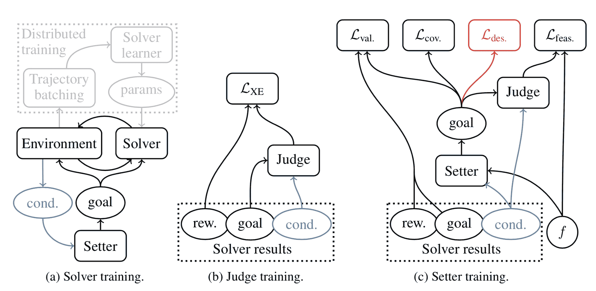

图 7. (a) 解算器/策略，(b) 评判者/鉴别器，和 (c) 设定者/目标生成器模型的训练示意图。 (图片来源：[Racaniere & Lampinen, et al., 2019](https://arxiv.org/abs/1909.12892))

# 基于技能的课程

另一个观点是将代理能够完成的任务分解为各种技能，并且每个技能集可以映射到一个任务。想象一下，当一个代理以无监督的方式与环境互动时，是否有一种方法可以从这种互动中发现有用的技能，并进一步构建成更复杂任务的解决方案？

[Jabri 等人（2019）](https://arxiv.org/abs/1912.04226)通过将无监督轨迹建模为潜在技能空间，开发了一个自动课程，**CARML**（“无监督元强化学习课程”），专注于训练[元强化学习（meta-RL）](https://lilianweng.github.io/posts/2019-06-23-meta-rl/)策略（即可以转移到未见过的任务）。CARML 中的训练环境设置类似于[DIAYN](https://lilianweng.github.io/posts/2019-06-23-meta-rl/#learning-with-random-rewards)。不同的是，CARML 在像素级观察上进行训练，而 DIAYN 在真实状态空间上运行。通过与学习奖励函数 $r$ 结合的无监督交互形式化为 CMP 的 RL 算法 $\pi_\theta$，参数化为 $\theta$，进行训练。这种设置自然适用于元学习目的，因为在测试时可以仅提供定制的奖励函数。

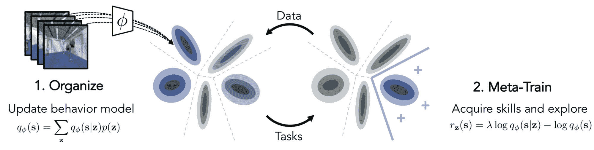

图 8. 展示了 CARML 的示意图，包含两个步骤：(1) 将经验数据组织到潜在技能空间中；(2) 使用从学习到的技能构建的奖励函数对策略进行元训练。（图片来源：[Jabri 等人，2019](https://arxiv.org/abs/1912.04226)）

CARML 被构建为一个[变分期望最大化（EM）](https://chrischoy.github.io/research/Expectation-Maximization-and-Variational-Inference/)。

(1) **E-Step**：这是组织经验数据的阶段。收集到的轨迹被建模为形成*技能*的潜在组件的混合物。

让 $z$ 成为一个潜在任务变量，$q_\phi$ 成为 $z$ 的变分分布，它可以是具有离散 $z$ 的混合模型或具有连续 $z$ 的 VAE。变分后验 $q_\phi(z \vert s)$ 的作用类似于一个分类器，预测给定状态的技能，并且我们希望最大化 $q_\phi(z \vert s)$，尽可能地区分由不同技能产生的数据。在 E 步中，$q_\phi$ 被拟合到由 $\pi_\theta$ 产生的一组轨迹。

精确地说，给定一个轨迹 $\tau = (s_1,\dots,s_T)$，我们希望找到 $\phi$，使得

$$ \max_\phi \mathbb{E}_{z\sim q_\phi(z)} \big[ \log q_\phi(\tau \vert z) \big] = \max_\phi \mathbb{E}_{z\sim q_\phi(z)} \big[ \sum_{s_i \in \tau} \log q_\phi(s_i \vert z) \big] $$

这里做出了一个简化假设，忽略了一个轨迹中状态的顺序。

(2) **M-Step**：这是进行与 $\pi_\theta$ 的元强化学习训练的阶段。学习到的技能空间被视为训练任务分布。CARML 对于策略参数更新的元 RL 算法类型是不可知的。

给定一个轨迹 $\tau$，策略最大化 $\tau$ 和 $z$ 之间的互信息是有意义的，$I(\tau;z) = H(\tau) - H(\tau \vert z)$，因为：

+   最大化 $H(\tau)$ => 策略数据空间中的多样性；预计会很大。

+   最小化$H(\tau \vert z)$ => 给定某个技能，行为应受限制；预期应该很小。

然后我们有，

$$ \begin{aligned} I(\tau; z) &= \mathcal{H}(z) - \mathcal{H}(z \vert s_1,\dots, s_T) \\ &\geq \mathbb{E}_{s \in \tau} [\mathcal{H}(z) - \mathcal{H}(z\vert s)] & \scriptstyle{\text{; 忽略状态的顺序。}} \\ &= \mathbb{E}_{s \in \tau} [\mathcal{H}(s_t) - \mathcal{H}(s\vert z)] & \scriptstyle{\text{; 根据互信息的定义。}} \\ &= \mathbb{E}_{z\sim q_\phi(z), s\sim \pi_\theta(s|z)} [\log q_\phi(s|z) - \log \pi_\theta(s)] \\ &\approx \mathbb{E}_{z\sim q_\phi(z), s\sim \pi_\theta(s|z)} [\color{green}{\log q_\phi(s|z) - \log q_\phi(s)}] & \scriptstyle{\text{; 假设学习的边缘分布与策略匹配。}} \end{aligned} $$

我们可以将奖励设置为$\log q_\phi(s \vert z) - \log q_\phi(s)$，如上述方程中的红色部分所示。为了在任务特定的探索（如下面的红色部分）和潜在技能匹配（如下面的蓝色部分）之间取得平衡，添加了一个参数$\lambda \in [0, 1]$。每个$z \sim q_\phi(z)$的实现引入了一个奖励函数$r_z(s)$（记住奖励 + CMP => MDP）如下：

$$ \begin{aligned} r_z(s) &= \lambda \log q_\phi(s|z) - \log q_\phi(s) \\ &= \lambda \log q_\phi(s|z) - \log \frac{q_\phi(s|z) q_\phi(z)}{q_\phi(z|s)} \\ &= \lambda \log q_\phi(s|z) - \log q_\phi(s|z) - \log q_\phi(z) + \log q_\phi(z|s) \\ &= (\lambda - 1) \log \color{red}{q_\phi(s|z)} + \color{blue}{\log q_\phi(z|s)} + C \end{aligned} $$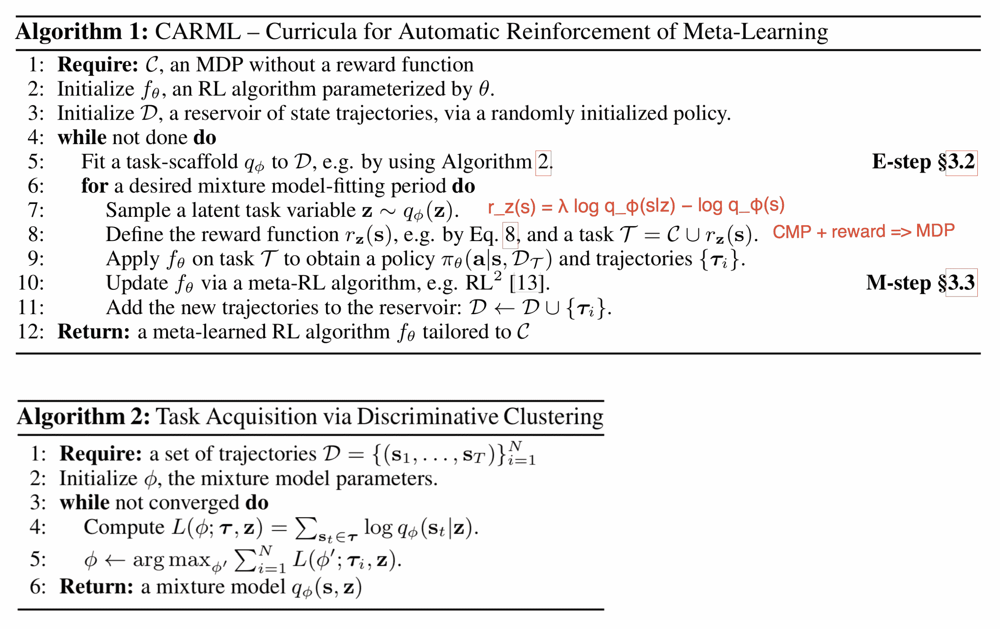

图 9\. CARML 的算法。（图片来源：[Jabri, et al 2019](https://arxiv.org/abs/1912.04226)）

学习潜在技能空间可以通过不同的方式完成，比如在[Hausman, et al. 2018](https://openreview.net/forum?id=rk07ZXZRb)中。他们方法的目标是学习一个任务条件的策略，$\pi(a \vert s, t^{(i)})$，其中$t^{(i)}$来自于一个包含$N$个任务的离散列表，$\mathcal{T} = [t^{(1)}, \dots, t^{(N)}]$。然而，与其学习$N$个单独的解决方案，一个解决方案对应一个任务，学习一个潜在技能空间会更好，这样每个任务可以在技能分布中表示，因此技能在任务之间*得以重复利用*。策略定义为$\pi_\theta(a \vert s,t) = \int \pi_\theta(a \vert z,s,t) p_\phi(z \vert t)\mathrm{d}z$，其中$\pi_\theta$和$p_\phi$分别是要学习的策略和嵌入网络。如果$z$是离散的，即从$K$个技能中抽取，那么策略就变成了$K$个子策略的混合。策略训练使用[SAC](http://127.0.0.1:4000/lil-log/2018/04/07/policy-gradient-algorithms.html#sac)，并且对$z$的依赖性是通过熵项引入的。

# 通过蒸馏进行课程设计

[我考虑了一段时间这一部分的名称，考虑在克隆、继承和蒸馏之间做出选择。最终，我选择了蒸馏，因为听起来最酷 B-)]

**渐进神经网络**（[Rusu 等人，2016](https://arxiv.org/abs/1606.04671)）架构的动机是在不同任务之间有效地转移学习到的技能，同时避免灾难性遗忘。通过一组逐渐堆叠的神经网络塔（或“列”，如论文中所述）来实现课程。

渐进网络具有以下结构：

1.  它始于一个包含$L$层神经元的单列，其中相应的激活层被标记为$h^{(1)}_i, i=1, \dots, L$。我们首先将这个单列网络训练到收敛，实现参数配置$\theta^{(1)}$。

1.  一旦转移到下一个任务，我们需要添加一个新列以适应新的上下文，同时冻结$\theta^{(1)}$以锁定从先前任务中学到的技能。新列具有标记为$h^{(2)}_i, i=1, \dots, L$的激活层，以及参数$\theta^{(2)}$。

1.  第 2 步可以针对每个新任务重复进行。第$k$列中第$i$层的激活取决于所有现有列中先前激活层的激活：

    $$ h^{(k)}_i = f(W^{(k)}_i h^{(k)}_{i-1} + \sum_{j < k} U_i^{(k:j)} h^{(j)}_{i-1}) $$

    其中$W^{(k)}_i$是第$k$列中第$i$层的权重矩阵；$U_i^{(k:j)}, j < k$是用于将第$j$列的第$i-1$层投影到第$k$列的第$i$层的权重矩阵（$ j < k $）。上述权重矩阵应该被学习。$f(.)$是一个非线性激活函数的选择。

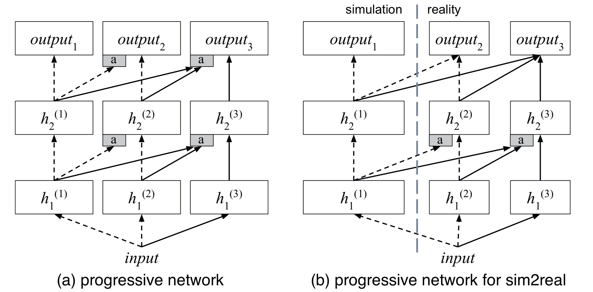

图 10. 渐进神经网络架构。（图片来源：[Rusu 等人，2017](https://arxiv.org/abs/1610.04286))

该论文通过在多个游戏上训练渐进网络来进行 Atari 游戏实验，以检查在一个游戏中学到的特征是否可以转移到另一个游戏。事实上是这样的。尽管有趣的是，对先前列中特征的高依赖并不总是表明在新任务上有良好的转移性能。一个假设是，从旧任务学到的特征可能会引入偏见到新任务中，导致策略陷入次优解。总体而言，渐进网络比仅微调顶层效果更好，并且可以实现与微调整个网络相似的转移性能。

渐进网络的一个用例是进行 sim2real 转移（[Rusu 等人，2017](https://arxiv.org/abs/1610.04286)），其中第一列在模拟器中用大量样本进行训练，然后添加并用少量真实数据样本训练额外列（可能用于不同的真实世界任务）。

[Czarnecki 等人 (2018)](https://arxiv.org/abs/1806.01780) 提出了另一个 RL 训练框架，**Mix & Match**（简称 **M&M**），通过在代理之间共享知识提供课程。给定一系列从简单到复杂的代理，$\pi_1, \dots, \pi_K$，每个都使用一些共享权重进行参数化（例如通过共享一些较低的公共层）。M&M 训练一组代理，但只有最复杂的一个 $\pi_K$ 的最终表现才重要。

与此同时，M&M 学习了一个分类分布 $c \sim \text{Categorical}(1, \dots, K \vert \alpha)$，其 [pmf](https://en.wikipedia.org/wiki/Probability_mass_function) 为 $p(c=i) = \alpha_i$，表示在特定时间选择使用哪种策略的概率。混合 M&M 策略是一个简单的加权和：$\pi_\text{mm}(a \vert s) = \sum_{i=1}^K \alpha_i \pi_i(a \vert s)$。课程学习通过动态调整 $\alpha_i$ 实现，从 $\alpha_K=0$ 调整到 $\alpha_K=1$。调整 $\alpha$ 可以是手动的，也可以通过 [population-based training](https://lilianweng.github.io/posts/2019-09-05-evolution-strategies/#hyperparameter-tuning-pbt) 进行。

为了鼓励策略之间的合作而不是竞争，除了 RL 损失 $\mathcal{L}_\text{RL}$ 外，还添加了另一个类似于 [蒸馏](https://arxiv.org/abs/1511.06295) 的损失 $\mathcal{L}_\text{mm}(\theta)$。知识传输损失 $\mathcal{L}_\text{mm}(\theta)$ 衡量了两个策略之间的 KL 散度，$\propto D_\text{KL}(\pi_{i}(. \vert s) | \pi_j(. \vert s))$ 对于 $i < j$。它鼓励复杂的代理尽早与简单的代理匹配。最终损失为 $\mathcal{L} = \mathcal{L}_\text{RL}(\theta \vert \pi_\text{mm}) + \lambda \mathcal{L}_\text{mm}(\theta)$。

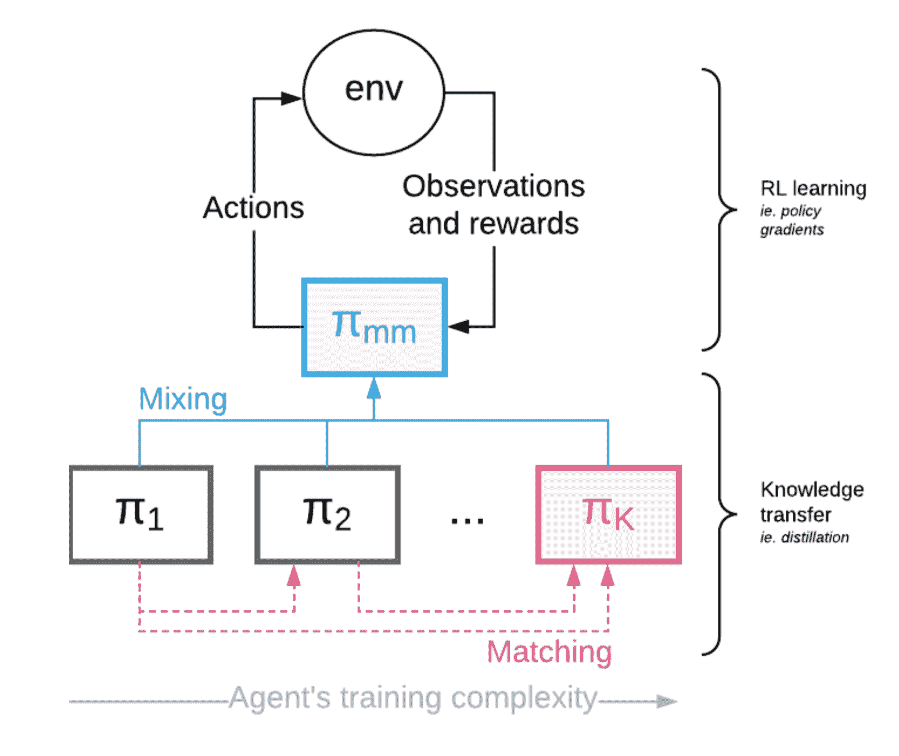

图 11\. 用于训练一组策略的 Mix & Match 架构。（图片来源：[Czarnecki 等人，2018](https://arxiv.org/abs/1806.01780)）

# 引用

引用为：

> Weng, Lilian.（2020 年 1 月）。强化学习的课程。Lil’Log。https://lilianweng.github.io/posts/2020-01-29-curriculum-rl/。

或

```py
@article{weng2020curriculum,
  title   = "Curriculum for Reinforcement Learning",
  author  = "Weng, Lilian",
  journal = "lilianweng.github.io",
  year    = "2020",
  month   = "Jan",
  url     = "https://lilianweng.github.io/posts/2020-01-29-curriculum-rl/"
} 
```

# 参考文献

[1] Jeffrey L. Elman。[“Learning and development in neural networks: The importance of starting small.”](http://citeseerx.ist.psu.edu/viewdoc/download?doi=10.1.1.128.4487&rep=rep1&type=pdf) Cognition 48.1 (1993): 71-99。

[2] Yoshua Bengio 等人。[“Curriculum learning.”](https://www.researchgate.net/profile/Y_Bengio/publication/221344862_Curriculum_learning/links/546cd2570cf2193b94c577ac/Curriculum-learning.pdf) ICML 2009。

[3] Daphna Weinshall, Gad Cohen 和 Dan Amir。[“Curriculum learning by transfer learning: Theory and experiments with deep networks.”](https://arxiv.org/abs/1802.03796) ICML 2018。

[4] Wojciech Zaremba 和 Ilya Sutskever。[“Learning to execute.”](https://arxiv.org/abs/1410.4615) arXiv 预印本 arXiv:1410.4615 (2014)。

[5] Tambet Matiisen 等人。[“Teacher-student curriculum learning.”](https://arxiv.org/abs/1707.00183) IEEE Trans. on neural networks and learning systems (2017)。

[6] Alex Graves 等人，《神经网络的自动课程学习》，ICML 2017。

[7] Remy Portelas 等人，《连续参数化环境中深度 RL 课程学习的教师算法》，CoRL 2019。

[8] Sainbayar Sukhbaatar 等人，《通过不对称自我对弈实现内在动机和自动课程设置》，ICLR 2018。

[9] Carlos Florensa 等人，《强化学习代理的自动生成目标》，ICML 2019。

[10] Sebastien Racaniere & Andrew K. Lampinen 等人，《通过 Setter-Solver 互动实现自动课程设置》，ICLR 2020。

[11] Allan Jabri 等人，《视觉元强化学习的无监督课程设置》，NeuriPS 2019。

[12] Karol Hausman 等人，《学习可转移机器人技能的嵌入空间》，ICLR 2018。

[13] Josh Merel 等人，《用于视觉引导全身运动和物体操作的可重用神经技能嵌入》，arXiv 预印本 arXiv:1911.06636（2019）。

[14] OpenAI 等人，《用机器人手解决魔方问题》，arXiv 预印本 arXiv:1910.07113（2019）。

[15] Niels Justesen 等人，《通过程序级别生成揭示深度强化学习中的泛化能力》，NeurIPS 2018 深度 RL 研讨会。

[16] Karl Cobbe 等人，《量化强化学习中的泛化能力》，arXiv 预印本 arXiv:1812.02341（2018）。

[17] Andrei A. Rusu 等人，《渐进式神经网络》，arXiv 预印本 arXiv:1606.04671（2016）。

[18] Andrei A. Rusu 等人，《从像素到真实机器人学习的渐进式网络》，CoRL 2017。

[19] Wojciech Marian Czarnecki 等人，《混合与匹配 - 强化学习代理课程设置》，ICML 2018。
