# 进化策略

> 原文：[`lilianweng.github.io/posts/2019-09-05-evolution-strategies/`](https://lilianweng.github.io/posts/2019-09-05-evolution-strategies/)

随机梯度下降是优化深度学习模型的通用选择。然而，并不是唯一的选择。通过黑盒优化算法，您可以评估目标函数$f(x): \mathbb{R}^n \to \mathbb{R}$，即使您不知道$f(x)$的精确解析形式，因此无法计算梯度或 Hessian 矩阵。黑盒优化方法的示例包括[模拟退火](https://en.wikipedia.org/wiki/Simulated_annealing)，[爬山算法](https://en.wikipedia.org/wiki/Hill_climbing)和[Nelder-Mead 方法](https://en.wikipedia.org/wiki/Nelder%E2%80%93Mead_method)。

**进化策略（ES）**是黑盒优化算法的一种类型，诞生于**进化算法（EA）**家族中。在本文中，我将深入探讨一些经典的 ES 方法，并介绍 ES 在深度强化学习中的一些应用。

# 什么是进化策略？

进化策略（ES）属于进化算法的大家族。ES 的优化目标是实数向量，$x \in \mathbb{R}^n$。

进化算法是受*自然选择*启发的一类基于群体的优化算法。自然选择认为，具有有利于其生存的特征的个体可以在世代中生存下来，并将良好的特征传递给下一代。进化是通过逐渐的选择过程发生的，群体逐渐适应环境变得更好。

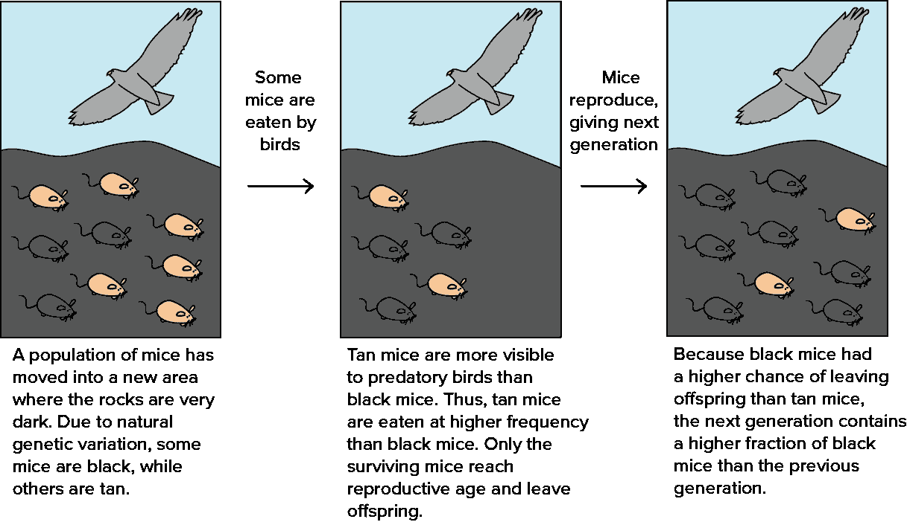

图 1\. 自然选择的工作原理。（图片来源：可汗学院：[达尔文、进化和自然选择](https://www.khanacademy.org/science/biology/her/evolution-and-natural-selection/a/darwin-evolution-natural-selection)）

进化算法可以总结为以下[格式](https://ipvs.informatik.uni-stuttgart.de/mlr/marc/teaching/13-Optimization/06-blackBoxOpt.pdf)作为一种通用的优化解决方案：

假设我们想要优化一个函数$f(x)$，但无法直接计算梯度。但我们仍然可以评估给定任何$x$的$f(x)$，结果是确定的。我们对$x$上的概率分布作为$f(x)$优化的好解决方案的信念是$p_\theta(x)$，由$\theta$参数化。目标是找到$\theta$的最佳配置。

> 在给定固定分布格式（即高斯）的情况下，参数$\theta$携带有关最佳解决方案的知识，并在各代之间进行迭代更新。

从初始值$\theta$开始，我们可以通过以下三个步骤循环连续更新$\theta$：

1.  生成样本群$D = \{(x_i, f(x_i)\}$，其中$x_i \sim p_\theta(x)$。

1.  评估$D$中样本的“适应度”。

1.  选择最佳个体子集并使用它们来更新$\theta$，通常基于适应度或排名。

在**遗传算法（GA）**中，另一个流行的 EA 子类，$x$是一系列二进制代码，$x \in \{0, 1\}^n$。而在 ES 中，$x$只是一组实数，$x \in \mathbb{R}^n$。

# 简单高斯进化策略

[这里](http://blog.otoro.net/2017/10/29/visual-evolution-strategies/)是进化策略的最基本和经典版本。它将$p_\theta(x)$建模为一个$n$维各向同性高斯分布，其中$\theta$只跟踪均值$\mu$和标准差$\sigma$。

$$ \theta = (\mu, \sigma),\;p_\theta(x) \sim \mathcal{N}(\mathbf{\mu}, \sigma² I) = \mu + \sigma \mathcal{N}(0, I) $$

简单高斯 ES 的过程，给定$x \in \mathcal{R}^n$：

1.  初始化$\theta = \theta^{(0)}$和代数计数器$t=0`

1.  通过从高斯分布中抽样生成大小为$\Lambda$的后代种群：

    $D^{(t+1)}=\{ x^{(t+1)}_i \mid x^{(t+1)}_i = \mu^{(t)} + \sigma^{(t)} y^{(t+1)}_i \text{ where } y^{(t+1)}_i \sim \mathcal{N}(x \vert 0, \mathbf{I}),;i = 1, \dots, \Lambda\}$

    .

1.  选择具有最佳$f(x_i)$的$\lambda$个样本的顶部子集，这个子集被称为**精英**集。不失一般性，我们可以考虑$D^{(t+1)}$中的前$k$个样本属于精英组 — 让我们将它们标记为

$$ D^{(t+1)}\_\text{elite} = \\{x^{(t+1)}\_i \mid x^{(t+1)}\_i \in D^{(t+1)}, i=1,\dots, \lambda, \lambda\leq \Lambda\\} $$

1.  然后我们使用精英集估计下一代的新均值和标准差：

$$ \begin{aligned} \mu^{(t+1)} &= \text{avg}(D^{(t+1)}_\text{elite}) = \frac{1}{\lambda}\sum_{i=1}^\lambda x_i^{(t+1)} \\ {\sigma^{(t+1)}}² &= \text{var}(D^{(t+1)}_\text{elite}) = \frac{1}{\lambda}\sum_{i=1}^\lambda (x_i^{(t+1)} -\mu^{(t)})² \end{aligned} $$

1.  重复步骤(2)-(4)直到结果足够好 ✌️

# 协方差矩阵自适应进化策略（CMA-ES）

标准差$\sigma$代表探索的程度：$\sigma$越大，我们可以从中抽样后代种群的搜索空间就越大。在简单高斯进化策略中，$\sigma^{(t+1)}$与$\sigma^{(t)}$高度相关，因此算法无法在需要时（即置信水平变化时）快速调整探索空间。

[**CMA-ES**](https://en.wikipedia.org/wiki/CMA-ES)，简称*“协方差矩阵自适应进化策略”*，通过跟踪分布中样本之间的成对依赖关系，解决了这个问题，使用协方差矩阵$C$。新的分布参数变为：

$$ \theta = (\mu, \sigma, C),\; p_\theta(x) \sim \mathcal{N}(\mu, \sigma² C) \sim \mu + \sigma \mathcal{N}(0, C) $$

其中$\sigma$控制分布的整体尺度，通常称为*步长*。

在深入研究 CMA-ES 中参数如何更新之前，最好先回顾一下协方差矩阵在多元高斯分布中的作用。作为一个实对称矩阵，协方差矩阵$C$具有以下良好特性（参见[证明](http://s3.amazonaws.com/mitsloan-php/wp-faculty/sites/30/2016/12/15032137/Symmetric-Matrices-and-Eigendecomposition.pdf) & [证明](http://control.ucsd.edu/mauricio/courses/mae280a/lecture11.pdf)）：

+   总是可对角化的。

+   总是半正定的。

+   所有的特征值都是实非负数。

+   所有的特征向量都是正交的。

+   有一个$\mathbb{R}^n$的标准正交基组成的正交基。

假设矩阵$C$有一个*标准正交*的特征向量基$B = [b_1, \dots, b_n]$，对应的特征值为$\lambda_1², \dots, \lambda_n²$。令$D=\text{diag}(\lambda_1, \dots, \lambda_n)$。

$$ C = B^\top D² B = \begin{bmatrix} \mid & \mid & & \mid \\ b_1 & b_2 & \dots & b_n\\ \mid & \mid & & \mid \\ \end{bmatrix} \begin{bmatrix} \lambda_1² & 0 & \dots & 0 \\ 0 & \lambda_2² & \dots & 0 \\ \vdots & \dots & \ddots & \vdots \\ 0 & \dots & 0 & \lambda_n² \end{bmatrix} \begin{bmatrix} - & b_1 & - \\ - & b_2 & - \\ & \dots & \\ - & b_n & - \\ \end{bmatrix} $$

$C$的平方根为：

$$ C^{\frac{1}{2}} = B^\top D B $$

| 符号 | 含义 |
| --- | --- |
| $x_i^{(t)} \in \mathbb{R}^n$ | 第(t)代第$i$个样本 |
| $y_i^{(t)} \in \mathbb{R}^n$ | $x_i^{(t)} = \mu^{(t-1)} + \sigma^{(t-1)} y_i^{(t)} $ |
| $\mu^{(t)}$ | 第(t)代的均值 |
| $\sigma^{(t)}$ | 步长 |
| $C^{(t)}$ | 协方差矩阵 |
| $B^{(t)}$ | $C$的特征向量构成的矩阵，作为行向量 |
| $D^{(t)}$ | 一个对角线矩阵，对角线上是$C$的特征值。 |
| $p_\sigma^{(t)}$ | 第(t)代$\sigma$的评估路径 |
| $p_c^{(t)}$ | 第(t)代$C$的评估路径 |
| $\alpha_\mu$ | $\mu$更新的学习率 |
| $\alpha_\sigma$ | $p_\sigma$的学习率 |
| $d_\sigma$ | $\sigma$更新的阻尼因子 |
| $\alpha_{cp}$ | $p_c$的学习率 |
| $\alpha_{c\lambda}$ | $C$的秩-min(λ, n)更新的学习率 |
| $\alpha_{c1}$ | $C$的秩-1 更新的学习率 |

## 更新均值

$$ \mu^{(t+1)} = \mu^{(t)} + \alpha_\mu \frac{1}{\lambda}\sum_{i=1}^\lambda (x_i^{(t+1)} - \mu^{(t)}) $$

CMA-ES 有一个学习率$\alpha_\mu \leq 1$来控制均值$\mu$的更新速度。通常设置为 1，因此方程变为与普通 ES 相同，$\mu^{(t+1)} = \frac{1}{\lambda}\sum_{i=1}^\lambda (x_i^{(t+1)}$。

## 控制步长

采样过程可以与均值和标准差分离：

$$ x^{(t+1)}_i = \mu^{(t)} + \sigma^{(t)} y^{(t+1)}_i \text{, 其中 } y^{(t+1)}_i = \frac{x_i^{(t+1)} - \mu^{(t)}}{\sigma^{(t)}} \sim \mathcal{N}(0, C) $$

参数$\sigma$控制分布的整体尺度。它与协方差矩阵分开，以便我们可以比完整协方差更快地改变步骤。较大的步长导致更快的参数更新。为了评估当前步长是否合适，CMA-ES 构建了一个*演化路径*$p_\sigma$，通过对一系列移动步骤的连续序列求和，$\frac{1}{\lambda}\sum_{i}^\lambda y_i^{(j)}, j=1, \dots, t$。通过将此路径长度与在随机选择下的预期长度（意味着单步不相关）进行比较，我们能够相应地调整$\sigma$（见图 2）。

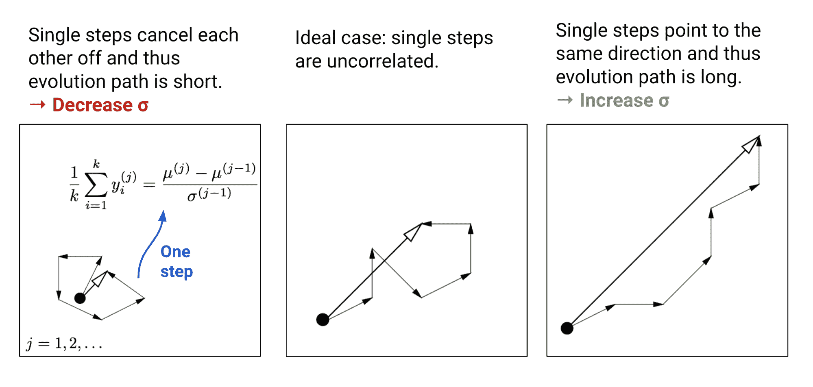

图 2。三种不同方式的单步相关性及其对步长更新的影响的场景。（图片来源：[CMA-ES 教程](https://arxiv.org/abs/1604.00772)论文中图 5 的附加注释）

每次更新演化路径时，使用同一代中移动步骤$y_i$的平均值。

$$ \begin{aligned} &\frac{1}{\lambda}\sum_{i=1}^\lambda y_i^{(t+1)} = \frac{1}{\lambda} \frac{\sum_{i=1}^\lambda x_i^{(t+1)} - \lambda \mu^{(t)}}{\sigma^{(t)}} = \frac{\mu^{(t+1)} - \mu^{(t)}}{\sigma^{(t)}} \\ &\frac{1}{\lambda}\sum_{i=1}^\lambda y_i^{(t+1)} \sim \frac{1}{\lambda}\mathcal{N}(0, \lambda C^{(t)}) \sim \frac{1}{\sqrt{\lambda}}{C^{(t)}}^{\frac{1}{2}}\mathcal{N}(0, I) \\ &\text{因此 } \sqrt{\lambda}\;{C^{(t)}}^{-\frac{1}{2}} \frac{\mu^{(t+1)} - \mu^{(t)}}{\sigma^{(t)}} \sim \mathcal{N}(0, I) \end{aligned} $$

> 通过与$C^{-\frac{1}{2}}$相乘，演化路径被转换为与其方向无关。术语${C^{(t)}}^{-\frac{1}{2}} = {B^{(t)}}^\top {D^{(t)}}^{-\frac{1}{2}} {B^{(t)}}$ 变换的工作方式如下：

1.  ${B^{(t)}}$ 包含$C$的特征向量的行向量。它将原始空间投影到垂直主轴上。

1.  然后${D^{(t)}}^{-\frac{1}{2}} = \text{diag}(\frac{1}{\lambda_1}, \dots, \frac{1}{\lambda_n})$ 将主轴的长度缩放为相等。

1.  ${B^{(t)}}^\top$ 将空间转换回原始坐标系。

为了给最近的代分配更高的权重，我们使用 Polyak 平均来使用学习率$\alpha_\sigma$更新演化路径。同时，权重是平衡的，使得$p_\sigma$在更新前后都是[共轭的](https://en.wikipedia.org/wiki/Conjugate_prior)，$\sim \mathcal{N}(0, I)$。

$$ \begin{aligned} p_\sigma^{(t+1)} & = (1 - \alpha_\sigma) p_\sigma^{(t)} + \sqrt{1 - (1 - \alpha_\sigma)²}\;\sqrt{\lambda}\; {C^{(t)}}^{-\frac{1}{2}} \frac{\mu^{(t+1)} - \mu^{(t)}}{\sigma^{(t)}} \\ & = (1 - \alpha_\sigma) p_\sigma^{(t)} + \sqrt{c_\sigma (2 - \alpha_\sigma)\lambda}\;{C^{(t)}}^{-\frac{1}{2}} \frac{\mu^{(t+1)} - \mu^{(t)}}{\sigma^{(t)}} \end{aligned} $$

在随机选择下，$p_\sigma$的期望长度是$\mathbb{E}|\mathcal{N}(0,I)|$，即$\mathcal{N}(0,I)$随机变量的 L2 范数的期望。根据图 2 中的思想，我们根据$|p_\sigma^{(t+1)}| / \mathbb{E}|\mathcal{N}(0,I)|$的比率调整步长大小：

$$ \begin{aligned} \ln\sigma^{(t+1)} &= \ln\sigma^{(t)} + \frac{\alpha_\sigma}{d_\sigma} \Big(\frac{\|p_\sigma^{(t+1)}\|}{\mathbb{E}\|\mathcal{N}(0,I)\|} - 1\Big) \\ \sigma^{(t+1)} &= \sigma^{(t)} \exp\Big(\frac{\alpha_\sigma}{d_\sigma} \Big(\frac{\|p_\sigma^{(t+1)}\|}{\mathbb{E}\|\mathcal{N}(0,I)\|} - 1\Big)\Big) \end{aligned} $$

其中$d_\sigma \approx 1$是一个阻尼参数，用于调整$\ln\sigma$的变化速度。

## 调整协方差矩阵

对于协方差矩阵，可以从头开始使用精英样本$y_i$进行估计（回想一下$y_i \sim \mathcal{N}(0, C)$）：

$$ C_\lambda^{(t+1)} = \frac{1}{\lambda}\sum_{i=1}^\lambda y^{(t+1)}_i {y^{(t+1)}_i}^\top = \frac{1}{\lambda {\sigma^{(t)}}²} \sum_{i=1}^\lambda (x_i^{(t+1)} - \mu^{(t)})(x_i^{(t+1)} - \mu^{(t)})^\top $$

以上估计仅在选择的样本量足够大时才可靠。然而，我们希望在每一代中使用*小*样本量进行*快速*迭代。这就是为什么 CMA-ES 发明了一种更可靠但也更复杂的更新$C$的方法。它涉及两条独立的路径，

+   *秩-最小(λ, n)更新*：使用$\{C_\lambda\}$的历史记录，每一代中都从头开始估计。

+   *秩-一更新*：从历史中估计移动步长$y_i$和符号信息。

第一条路径考虑从$\{C_\lambda\}$的整个历史中估计$C$。例如，如果我们经历了大量的代数，$C^{(t+1)} \approx \text{avg}(C_\lambda^{(i)}; i=1,\dots,t)$将是一个很好的估计量。类似于$p_\sigma$，我们还使用带有学习率的 Polyak 平均法来融合历史：

$$ C^{(t+1)} = (1 - \alpha_{c\lambda}) C^{(t)} + \alpha_{c\lambda} C_\lambda^{(t+1)} = (1 - \alpha_{c\lambda}) C^{(t)} + \alpha_{c\lambda} \frac{1}{\lambda} \sum_{i=1}^\lambda y^{(t+1)}_i {y^{(t+1)}_i}^\top $$

学习率的常见选择是$\alpha_{c\lambda} \approx \min(1, \lambda/n²)$。

第二条路径试图解决$y_i{y_i}^\top = (-y_i)(-y_i)^\top$丢失符号信息的问题。类似于我们如何调整步长$\sigma$，演化路径$p_c$用于跟踪符号信息，并且构造方式使得$p_c$在新一代之前和之后都是共轭的，$\sim \mathcal{N}(0, C)$。

我们可以将$p_c$视为计算$\text{avg}_i(y_i)$的另一种方式（注意两者都$\sim \mathcal{N}(0, C)$），同时使用整个历史记录并保持符号信息。请注意，在上一节中我们已经知道$\sqrt{k}\frac{\mu^{(t+1)} - \mu^{(t)}}{\sigma^{(t)}} \sim \mathcal{N}(0, C)$，

$$ \begin{aligned} p_c^{(t+1)} &= (1-\alpha_{cp}) p_c^{(t)} + \sqrt{1 - (1-\alpha_{cp})²}\;\sqrt{\lambda}\;\frac{\mu^{(t+1)} - \mu^{(t)}}{\sigma^{(t)}} \\ &= (1-\alpha_{cp}) p_c^{(t)} + \sqrt{\alpha_{cp}(2 - \alpha_{cp})\lambda}\;\frac{\mu^{(t+1)} - \mu^{(t)}}{\sigma^{(t)}} \end{aligned} $$

然后根据 $p_c$ 更新协方差矩阵：

$$ C^{(t+1)} = (1-\alpha_{c1}) C^{(t)} + \alpha_{c1}\;p_c^{(t+1)} {p_c^{(t+1)}}^\top $$

*rank-one update* 方法声称在 $k$ 较小时相对于 *rank-min(λ, n)-update* 生成了显著的改进，因为移动步骤的符号和连续步骤之间的相关性都被利用并传递给后代。

最终我们将两种方法结合在一起，

$$ C^{(t+1)} = (1 - \alpha_{c\lambda} - \alpha_{c1}) C^{(t)} + \alpha_{c1}\;\underbrace{p_c^{(t+1)} {p_c^{(t+1)}}^\top}_\textrm{rank-one update} + \alpha_{c\lambda} \underbrace{\frac{1}{\lambda} \sum_{i=1}^\lambda y^{(t+1)}_i {y^{(t+1)}_i}^\top}_\textrm{rank-min(lambda, n) update} $$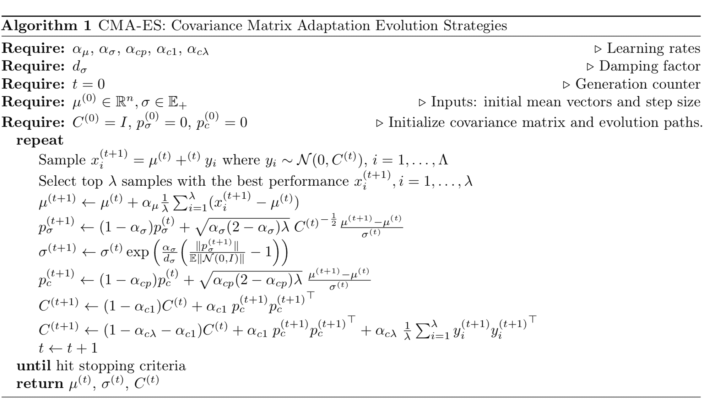

在我上面的所有示例中，每个精英样本被认为贡献相等的权重，$1/\lambda$。该过程可以轻松扩展到所选样本根据其表现分配不同权重，$w_1, \dots, w_\lambda$ 的情况。更多细节请参见 [教程](https://arxiv.org/abs/1604.00772)。

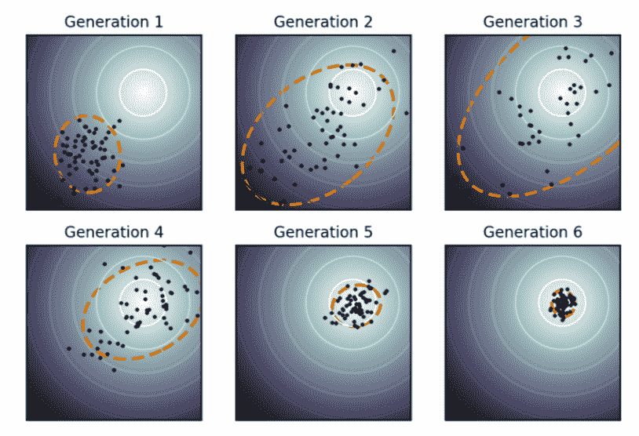

图 3\. 展示了 CMA-ES 在 2D 优化问题上的工作原理（颜色越浅越好）。黑点是一代中的样本。样本最初更分散，但当模型在后期对找到全局最优解有更高的信心时，样本会非常集中在全局最优解上。（图片来源：[维基百科 CMA-ES](https://en.wikipedia.org/wiki/CMA-ES)）

# 自然进化策略

自然进化策略（**NES**；[Wierstra, et al, 2008](https://arxiv.org/abs/1106.4487)）在参数搜索分布中进行优化，并沿着 *自然梯度* 指示的高适应度方向移动分布。

## 自然梯度

给定一个由 $\theta$ 参数化的目标函数 $\mathcal{J}(\theta)$，假设我们的目标是找到最优的 $\theta$ 以最大化目标函数值。*普通梯度* 找到当前 $\theta$ 附近小的欧几里德距离内的最陡方向；距离限制应用于参数空间。换句话说，我们计算相对于 $\theta$ 的绝对值的小变化的普通梯度。最优步骤是：

$$ d^{*} = \operatorname*{argmax}_{\|d\| = \epsilon} \mathcal{J}(\theta + d)\text{, where }\epsilon \to 0 $$

*自然梯度*与由$\theta$参数化的概率[分布](https://arxiv.org/abs/1301.3584v7)空间$p_\theta(x)$（在 NES [论文](https://arxiv.org/abs/1106.4487)中称为“搜索分布”）一起工作。它在分布空间中寻找在 KL 散度度量的小步长内最陡的方向。通过这个约束，我们确保每次更新都沿着分布流形以恒定速度移动，而不会被其曲率减慢。

$$ d^{*}_\text{N} = \operatorname*{argmax}_{\text{KL}[p_\theta \| p_{\theta+d}] = \epsilon} \mathcal{J}(\theta + d) $$

## 使用费舍尔信息矩阵进行估计

但是，如何精确计算$\text{KL}[p_\theta | p_{\theta+\Delta\theta}]$？通过在$\theta$处运行$\log p_{\theta + d}$的泰勒展开，我们得到：

$$ \begin{aligned} & \text{KL}[p_\theta \| p_{\theta+d}] \\ &= \mathbb{E}_{x \sim p_\theta} [\log p_\theta(x) - \log p_{\theta+d}(x)] & \\ &\approx \mathbb{E}_{x \sim p_\theta} [ \log p_\theta(x) -( \log p_{\theta}(x) + \nabla_\theta \log p_{\theta}(x) d + \frac{1}{2}d^\top \nabla²_\theta \log p_{\theta}(x) d)] & \scriptstyle{\text{；在}\theta\text{处展开}\log p_{\theta+d}} \\ &\approx - \mathbb{E}_x [\nabla_\theta \log p_{\theta}(x)] d - \frac{1}{2}d^\top \mathbb{E}_x [\nabla²_\theta \log p_{\theta}(x)] d & \end{aligned} $$

其中

$$ \begin{aligned} \mathbb{E}_x [\nabla_\theta \log p_{\theta}] d &= \int_{x\sim p_\theta} p_\theta(x) \nabla_\theta \log p_\theta(x) & \\ &= \int_{x\sim p_\theta} p_\theta(x) \frac{1}{p_\theta(x)} \nabla_\theta p_\theta(x) & \\ &= \nabla_\theta \Big( \int_{x} p_\theta(x) \Big) & \scriptstyle{\textrm{；注意}p_\theta(x)\textrm{是概率分布。}} \\ &= \nabla_\theta (1) = 0 \end{aligned} $$

最后我们有，

$$ \text{KL}[p_\theta \| p_{\theta+d}] = - \frac{1}{2}d^\top \mathbf{F}_\theta d \text{，其中 }\mathbf{F}_\theta = \mathbb{E}_x [(\nabla_\theta \log p_{\theta}) (\nabla_\theta \log p_{\theta})^\top] $$

其中$\mathbf{F}_\theta$被称为**[费舍尔信息矩阵](http://mathworld.wolfram.com/FisherInformationMatrix.html)**，[它是](https://wiseodd.github.io/techblog/2018/03/11/fisher-information/)由于$\mathbb{E}[\nabla_\theta \log p_\theta] = 0$，所以是$\nabla_\theta \log p_\theta$的协方差矩阵。

以下优化问题的解决方案：

$$ \max \mathcal{J}(\theta + d) \approx \max \big( \mathcal{J}(\theta) + {\nabla_\theta\mathcal{J}(\theta)}^\top d \big)\;\text{ s.t. }\text{KL}[p_\theta \| p_{\theta+d}] - \epsilon = 0 $$

可以通过拉格朗日乘子找到，

$$ \begin{aligned} \mathcal{L}(\theta, d, \beta) &= \mathcal{J}(\theta) + \nabla_\theta\mathcal{J}(\theta)^\top d - \beta (\frac{1}{2}d^\top \mathbf{F}_\theta d + \epsilon) = 0 \text{ s.t. } \beta > 0 \\ \nabla_d \mathcal{L}(\theta, d, \beta) &= \nabla_\theta\mathcal{J}(\theta) - \beta\mathbf{F}_\theta d = 0 \\ \text{因此 } d_\text{N}^* &= \nabla_\theta^\text{N} \mathcal{J}(\theta) = \mathbf{F}_\theta^{-1} \nabla_\theta\mathcal{J}(\theta) \end{aligned} $$

$d_\text{N}^*$ 只提取了在 $\theta$ 上最佳移动步骤的方向，忽略了标量 $\beta^{-1}$。

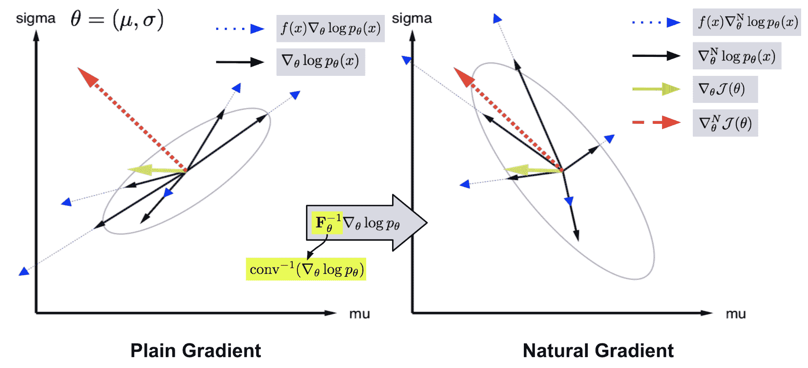

图 4. 右侧的自然梯度样本（黑色实箭头）是左侧的普通梯度样本（黑色实箭头）乘以它们的协方差的倒数。通过这种方式，具有高不确定性的梯度方向（由与其他样本的高协方差表示）将以较小的权重进行惩罚。因此，聚合的自然梯度（红色虚线箭头）比自然梯度（绿色实箭头）更可信。 （图片来源：[NES](https://arxiv.org/abs/1106.4487) 论文中对图 2 的附加注释）

## NES 算法

与一个样本相关联的适应度标记为 $f(x)$，对 $x$ 的搜索分布由 $\theta$ 参数化。NES 期望优化参数 $\theta$ 以实现最大期望适应度：

$$ \mathcal{J}(\theta) = \mathbb{E}_{x\sim p_\theta(x)} [f(x)] = \int_x f(x) p_\theta(x) dx $$

在[REINFORCE](https://lilianweng.github.io/posts/2018-04-08-policy-gradient/#reinforce)中使用相同的对数似然[技巧](http://blog.shakirm.com/2015/11/machine-learning-trick-of-the-day-5-log-derivative-trick/)：

$$ \begin{aligned} \nabla_\theta\mathcal{J}(\theta) &= \nabla_\theta \int_x f(x) p_\theta(x) dx \\ &= \int_x f(x) \frac{p_\theta(x)}{p_\theta(x)}\nabla_\theta p_\theta(x) dx \\ & = \int_x f(x) p_\theta(x) \nabla_\theta \log p_\theta(x) dx \\ & = \mathbb{E}_{x \sim p_\theta} [f(x) \nabla_\theta \log p_\theta(x)] \end{aligned} $$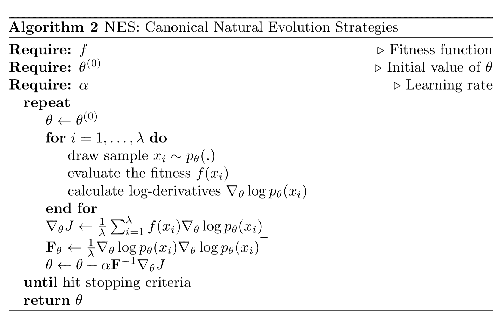

除了自然梯度，NES 采用了一些重要的启发式方法，使算法性能更加稳健。

+   NES 应用**基于排名的适应度塑形**，即使用在单调递增适应度值下的*排名*，而不是直接使用 $f(x)$。或者可以是排名的函数（“效用函数”），被视为 NES 的一个自由参数。

+   NES 采用**适应性抽样**来在运行时调整超参数。当改变$\theta \to \theta’$时，从$p_\theta$中抽取的样本与从$p_{\theta’}$中抽取的样本进行比较，使用[Mann-Whitney U 检验(https://en.wikipedia.org/wiki/Mann%E2%80%93Whitney_U_test)]；如果显示正负号，则目标超参数通过乘法常数减少或增加。注意样本$x’_i \sim p_{\theta’}(x)$的得分应用重要性抽样权重$w_i’ = p_\theta(x) / p_{\theta’}(x)$。

# 应用：深度强化学习中的进化策略

## OpenAI 强化学习中的进化策略

在强化学习中使用进化算法的概念可以追溯到[很久以前](https://arxiv.org/abs/1106.0221)，但由于计算限制只限于表格型强化学习。

受 NES 启发，OpenAI 的研究人员（[Salimans, et al. 2017](https://arxiv.org/abs/1703.03864)）提出使用 NES 作为无梯度黑盒优化器来找到最大化回报函数$F(\theta)$的最优策略参数$\theta$。关键是在模型参数$\theta$上添加高斯噪声$\epsilon$，然后使用对数似然技巧将其写成高斯概率密度函数的梯度。最终，只有噪声项作为衡量性能的加权标量留下。

假设当前参数值为$\hat{\theta}$（添加帽子是为了区分该值与随机变量$\theta$）。$\theta$的搜索分布被设计为具有均值$\hat{\theta}$和固定协方差矩阵$\sigma² I$的各向同性多元高斯分布，

$$ \theta \sim \mathcal{N}(\hat{\theta}, \sigma² I) \text{ 等价于 } \theta = \hat{\theta} + \sigma\epsilon, \epsilon \sim \mathcal{N}(0, I) $$

$\theta$ 更新的梯度为：

$$ \begin{aligned} & \nabla_\theta \mathbb{E}_{\theta\sim\mathcal{N}(\hat{\theta}, \sigma² I)} F(\theta) \\ &= \nabla_\theta \mathbb{E}_{\epsilon\sim\mathcal{N}(0, I)} F(\hat{\theta} + \sigma\epsilon) \\ &= \nabla_\theta \int_{\epsilon} p(\epsilon) F(\hat{\theta} + \sigma\epsilon) d\epsilon & \scriptstyle{\text{; 高斯 }p(\epsilon)=(2\pi)^{-\frac{n}{2}} \exp(-\frac{1}{2}\epsilon^\top\epsilon)} \\ &= \int_{\epsilon} p(\epsilon) \nabla_\epsilon \log p(\epsilon) \nabla_\theta \epsilon\;F(\hat{\theta} + \sigma\epsilon) d\epsilon & \scriptstyle{\text{; 对数似然技巧}}\\ &= \mathbb{E}_{\epsilon\sim\mathcal{N}(0, I)} [ \nabla_\epsilon \big(-\frac{1}{2}\epsilon^\top\epsilon\big) \nabla_\theta \big(\frac{\theta - \hat{\theta}}{\sigma}\big) F(\hat{\theta} + \sigma\epsilon) ] & \\ &= \mathbb{E}_{\epsilon\sim\mathcal{N}(0, I)} [ (-\epsilon) (\frac{1}{\sigma}) F(\hat{\theta} + \sigma\epsilon) ] & \\ &= \frac{1}{\sigma}\mathbb{E}_{\epsilon\sim\mathcal{N}(0, I)} [ \epsilon F(\hat{\theta} + \sigma\epsilon) ] & \scriptstyle{\text{; 负号可以被吸收。}} \end{aligned} $$

在一个世代中，我们可以并行地抽样许多 $epsilon_i, i=1,\dots,n$ 并评估适应度。一个美妙的设计是不需要共享大型模型参数。只需在工作节点之间通信随机种子，主节点就足以进行参数更新。这种方法后来被扩展为自适应学习损失函数；请参阅我的先前文章[Evolved Policy Gradient](https://lilianweng.github.io/posts/2019-06-23-meta-rl/#meta-learning-the-loss-function)。

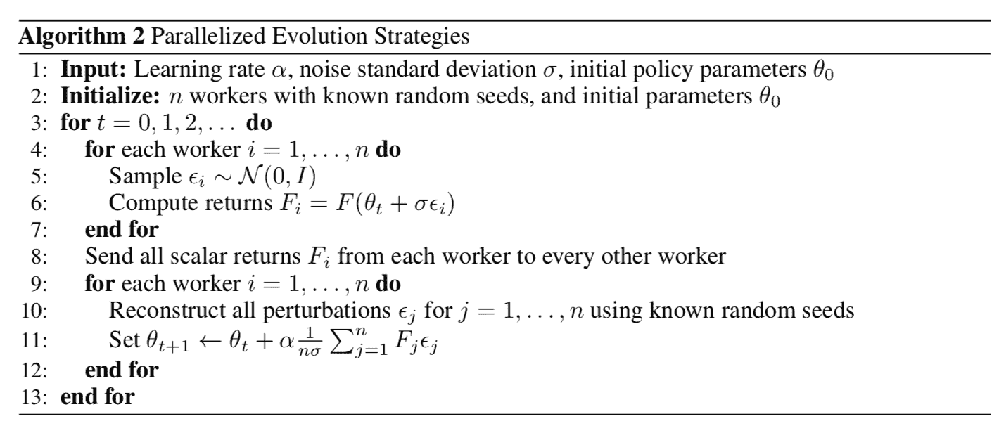

图 5. 使用进化策略训练 RL 策略的算法。（图片来源：[ES-for-RL](https://arxiv.org/abs/1703.03864) 论文）

为了使性能更加稳健，OpenAI ES 采用了虚拟批量归一化（BN 使用固定的小批量计算统计数据）、镜像抽样（对评估抽样一对 $(-\epsilon, \epsilon)$）、和适应性塑形。

## 用 ES 进行探索

探索（[与开发](https://lilianweng.github.io/posts/2018-01-23-multi-armed-bandit/#exploitation-vs-exploration)）是强化学习中的一个重要主题。ES 算法中的优化方向上面仅从累积回报 $F(\theta)$ 中提取。没有明确的探索，代理可能会陷入局部最优解。

Novelty-Search ES（**NS-ES**；[Conti et al, 2018](https://arxiv.org/abs/1712.06560)）通过更新参数以最大化*新颖性*分数的方向来鼓励探索。新颖性分数取决于特定于领域的行为表征函数 $b(\pi_\theta)$。选择 $b(\pi_\theta)$ 针对任务是特定的，似乎有点随意；例如，在论文中的人形机器人运动任务中，$b(\pi_\theta)$ 是代理的最终 $(x,y)$ 位置。

1.  每个政策的 $b(\pi_\theta)$ 都被推送到一个档案集 $\mathcal{A}$ 中。

1.  政策 $\pi_\theta$ 的新颖性是通过 $b(\pi_\theta)$ 与 $\mathcal{A}$ 中所有其他条目之间的 k-最近邻分数来衡量的。（档案集的用例听起来与[情节记忆](https://lilianweng.github.io/posts/2019-06-23-meta-rl/#episodic-control)非常相似。）

$$ N(\theta, \mathcal{A}) = \frac{1}{\lambda} \sum_{i=1}^\lambda \| b(\pi_\theta), b^\text{knn}_i \|_2 \text{，其中 }b^\text{knn}_i \in \text{kNN}(b(\pi_\theta), \mathcal{A}) $$

ES 优化步骤依赖于新颖性分数而不是适应度：

$$ \nabla_\theta \mathbb{E}_{\theta\sim\mathcal{N}(\hat{\theta}, \sigma² I)} N(\theta, \mathcal{A}) = \frac{1}{\sigma}\mathbb{E}_{\epsilon\sim\mathcal{N}(0, I)} [ \epsilon N(\hat{\theta} + \sigma\epsilon, \mathcal{A}) ] $$

NS-ES 维护一组独立训练的代理（“元种群”）$M$，$\mathcal{M} = \{\theta_1, \dots, \theta_M \}$ 并根据新颖性得分选择一个代理进行推进。最终我们选择最佳策略。这个过程等同于集成学习；也可以参考[SVPG](https://lilianweng.github.io/posts/2018-04-08-policy-gradient/#svpg)中相同的想法。

$$ \begin{aligned} m &\leftarrow \text{根据概率选择 } i=1,\dots,M\text{，概率为}\frac{N(\theta_i, \mathcal{A})}{\sum_{j=1}^M N(\theta_j, \mathcal{A})} \\ \theta_m^{(t+1)} &\leftarrow \theta_m^{(t)} + \alpha \frac{1}{\sigma}\sum_{i=1}^N \epsilon_i N(\theta^{(t)}_m + \epsilon_i, \mathcal{A}) \text{其中 }\epsilon_i \sim \mathcal{N}(0, I) \end{aligned} $$

其中 $N$ 是高斯扰动噪声向量的数量，$\alpha$ 是学习率。

NS-ES 完全舍弃了奖励函数，仅优化新颖性以避免欺骗性局部最优解。为了将适应度重新纳入公式，提出了另外两种变体。

**NSR-ES**:

$$ \theta_m^{(t+1)} \leftarrow \theta_m^{(t)} + \alpha \frac{1}{\sigma}\sum_{i=1}^N \epsilon_i \frac{N(\theta^{(t)}_m + \epsilon_i, \mathcal{A}) + F(\theta^{(t)}_m + \epsilon_i)}{2} $$

**NSRAdapt-ES (NSRA-ES)**: 自适应权重参数 $w = 1.0$ 初始值。如果性能保持不变一段时间，我们开始减小 $w$。然后当性能开始提高时，我们停止减小 $w$，反而增加它。这样，当性能停止增长时更偏向适应度，否则更偏向新颖性。

$$ \theta_m^{(t+1)} \leftarrow \theta_m^{(t)} + \alpha \frac{1}{\sigma}\sum_{i=1}^N \epsilon_i \big((1-w) N(\theta^{(t)}_m + \epsilon_i, \mathcal{A}) + w F(\theta^{(t)}_m + \epsilon_i)\big) $$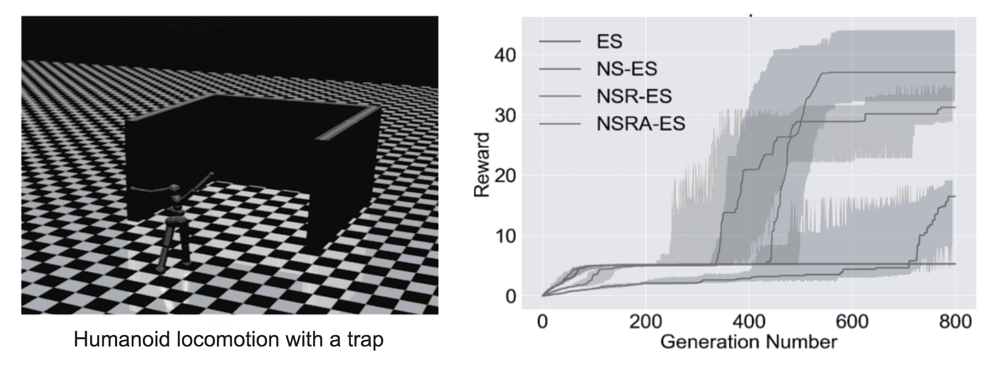

图 6\.（左）环境是具有三面墙的人形机器人运动，起欺骗性陷阱作用以创建局部最优解。（右）实验比较了 ES 基线和其他鼓励探索的变体。（图片来源：[NS-ES](https://arxiv.org/abs/1712.06560) 论文）

## CEM-RL

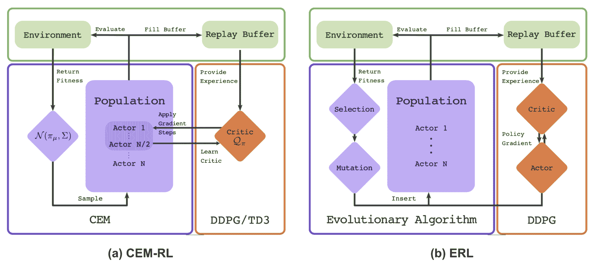

图 7\. (a) CEM-RL 和 (b) [ERL](https://papers.nips.cc/paper/7395-evolution-guided-policy-gradient-in-reinforcement-learning.pdf) 算法的架构（图片来源：[CEM-RL](https://arxiv.org/abs/1810.01222) 论文）

CEM-RL 方法（[Pourchot & Sigaud，2019](https://arxiv.org/abs/1810.01222)）将交叉熵方法（CEM）与[DDPG](https://lilianweng.github.io/posts/2018-04-08-policy-gradient/#ddpg)或[TD3](https://lilianweng.github.io/posts/2018-04-08-policy-gradient/#td3)结合。这里的 CEM 与上文描述的简单高斯 ES 基本相同，因此可以使用 CMA-ES 替换相同的函数。CEM-RL 建立在*进化强化学习*（*ERL*；[Khadka & Tumer，2018](https://papers.nips.cc/paper/7395-evolution-guided-policy-gradient-in-reinforcement-learning.pdf)）框架上，标准 EA 算法选择和演化一组演员，然后在过程中生成的回滚经验被添加到回放缓冲区中，用于训练 RL-actor 和 RL-critic 网络。

工作流程：

+   1.  CEM 种群的平均 actor 是$\pi_\mu$，初始化为一个随机 actor 网络。

+   1.  评论者网络$Q$也被初始化，将由 DDPG/TD3 更新。

+   1.  直到满意为止重复：

    +   a. 从演员种群中抽样$\sim \mathcal{N}(\pi_\mu, \Sigma)$。

    +   b. 评估种群的一半。他们的适应度分数被用作累积奖励$R，并添加到重放缓冲区中。

    +   c. 另一半与评论者一起更新。

    +   d. 使用表现最佳的精英样本计算新的$\pi_mu$和$\Sigma$。CMA-ES 也可以用于参数更新。

# 扩展：深度学习中的 EA

（本节不涉及进化策略，但仍然是一篇有趣且相关的阅读。）

*进化算法* 已经应用在许多深度学习问题上。POET（[Wang 等，2019](https://arxiv.org/abs/1901.01753)）是一个基于 EA 的框架，试图在解决问题的同时生成各种不同的任务。 POET 已经在我关于元强化学习的[上一篇文章](https://lilianweng.github.io/posts/2019-06-23-meta-rl/#task-generation-by-domain-randomization)中介绍过。进化强化学习（ERL）是另一个例子；见图 7（b）。

下面我想更详细地介绍两个应用，*基于种群的训练（PBT）* 和 *无权重神经网络（WANN）*。

## 超参数调整：PBT

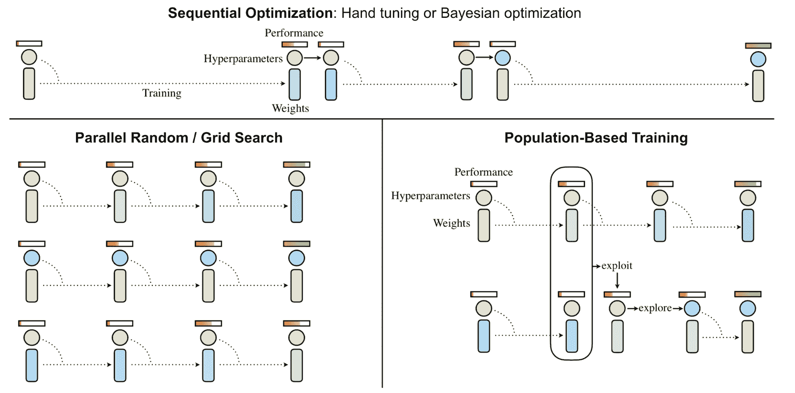

图 8. 比较不同超参数调整方式的范例。（图片来源：[PBT](https://arxiv.org/abs/1711.09846) 论文）

基于种群的训练（[Jaderberg 等，2017](https://arxiv.org/abs/1711.09846)），简称**PBT**，将 EA 应用于超参数调整问题。它同时训练一组模型和相应的超参数以获得最佳性能。

PBT 从一组随机候选开始，每个候选包含一对模型权重初始化和超参数，$\{(\theta_i, h_i)\mid i=1, \dots, N\}$。每个样本都会并行训练，并异步地定期评估自己的性能。每当一个成员认为准备就绪（即经过足够的梯度更新步骤，或者性能足够好时），它有机会通过与整个种群进行比较来更新：

+   **`exploit()`**：当该模型表现不佳时，权重可以被更好表现的模型替换。

+   **`explore()`**：如果模型权重被覆盖，`explore` 步骤会用随机噪声扰动超参数。

在这个过程中，只有有前途的模型和超参数对才能存活并不断进化，实现对计算资源的更好利用。

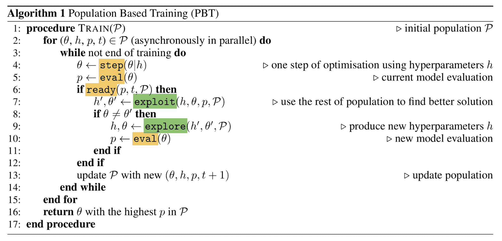

图 9\. 基于种群的训练算法。（图片来源：[PBT](https://arxiv.org/abs/1711.09846) 论文）

## 网络拓扑优化：WANN

*Weight Agnostic Neural* Networks（简称 **WANN**；[Gaier & Ha 2019](https://arxiv.org/abs/1906.04358)）尝试搜索可以在不训练网络权重的情况下实现最佳性能的最小网络拓扑。通过不考虑网络权重的最佳配置，WANN 更加注重架构本身，使焦点与 [NAS](http://openaccess.thecvf.com/content_cvpr_2018/papers/Zoph_Learning_Transferable_Architectures_CVPR_2018_paper.pdf) 不同。WANN 受到经典遗传算法 NEAT（“Neuroevolution of Augmenting Topologies”；[Stanley & Miikkulainen 2002](http://nn.cs.utexas.edu/downloads/papers/stanley.gecco02_1.pdf)）的启发，用于演化网络拓扑。

WANN 的工作流程与标准 GA 几乎相同：

1.  初始化：创建一组最小网络的种群。

1.  评估：测试一系列*共享*权重值。

1.  排名和选择：按性能和复杂性排名。

1.  变异：通过改变最佳网络创建新种群。

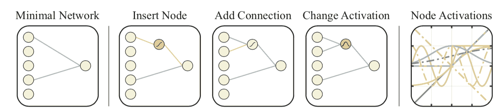

图 10\. WANN 中搜索新网络拓扑的变异操作（图片来源：[WANN](https://arxiv.org/abs/1906.04358) 论文）

在“评估”阶段，所有网络权重都设置为相同。这样，WANN 实际上是在寻找可以用最小描述长度描述的网络。在“选择”阶段，同时考虑网络连接和模型性能。

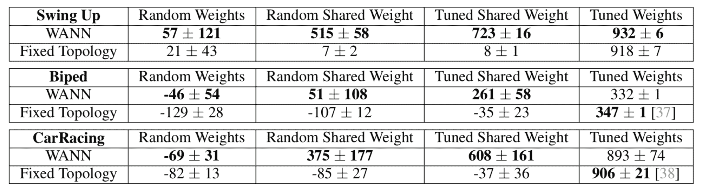

图 11\. 在不同 RL 任务上找到的 WANN 网络拓扑的性能与文献中常用的基线 FF 网络进行比较。“调整共享权重”只需要调整一个权重值。（图片来源：[WANN](https://arxiv.org/abs/1906.04358) 论文）

如图 11 所示，WANN 结果使用随机权重和共享权重（单一权重）进行评估。有趣的是，即使在所有权重上强制执行权重共享并调整这个单一参数时，WANN 也能发现实现非平凡良好性能的拓扑结构。

* * *

引用为：

```py
@article{weng2019ES,
  title   = "Evolution Strategies",
  author  = "Weng, Lilian",
  journal = "lilianweng.github.io",
  year    = "2019",
  url     = "https://lilianweng.github.io/posts/2019-09-05-evolution-strategies/"
} 
```

# 参考文献

[1] 尼古拉斯·汉森。[“CMA 进化策略：教程”](https://arxiv.org/abs/1604.00772) arXiv 预印本 arXiv:1604.00772 (2016).

[2] 马克·图桑特。[幻灯片：“优化简介”](https://ipvs.informatik.uni-stuttgart.de/mlr/marc/teaching/13-Optimization/06-blackBoxOpt.pdf)

[3] 大卫·哈。[“演化策略的视觉指南”](http://blog.otoro.net/2017/10/29/visual-evolution-strategies/) blog.otoro.net。2017 年 10 月。

[4] 丹·维尔斯特拉等。[“自然进化策略。”](https://arxiv.org/abs/1106.4487) 2008 年 IEEE 世界计算智能大会。

[5] 阿古斯蒂努斯·克里斯蒂亚迪。[“自然梯度下降”](https://wiseodd.github.io/techblog/2018/03/14/natural-gradient/) 2018 年 3 月。

[6] Razvan Pascanu & Yoshua Bengio。[“重温深度网络的自然梯度。”](https://arxiv.org/abs/1301.3584v7) arXiv 预印本 arXiv:1301.3584 (2013).

[7] 蒂姆·萨利曼斯等。[“进化策略作为可扩展的替代强化学习。”](https://arxiv.org/abs/1703.03864) arXiv 预印本 arXiv:1703.03864 (2017).

[8] 埃多阿多·孔蒂等。[“通过一群寻求新颖性的代理改进进化策略在深度强化学习中的探索。”](https://arxiv.org/abs/1712.06560) NIPS。2018 年。

[9] 阿洛伊斯·普尔肖 & 奥利维尔·西戈。[“CEM-RL：结合进化和基于梯度的方法进行策略搜索。”](https://arxiv.org/abs/1810.01222) ICLR 2019。

[10] 肖哈尔达·卡德卡 & 卡甘·图默。[“进化引导的强化学习中的策略梯度。”](https://papers.nips.cc/paper/7395-evolution-guided-policy-gradient-in-reinforcement-learning.pdf) NIPS 2018。

[11] 马克斯·贾德伯格等。[“基于种群的神经网络训练。”](https://arxiv.org/abs/1711.09846) arXiv 预印本 arXiv:1711.09846 (2017).

[12] 亚当·盖尔 & 大卫·哈。[“无权重神经网络。”](https://arxiv.org/abs/1906.04358) arXiv 预印本 arXiv:1906.04358 (2019).
