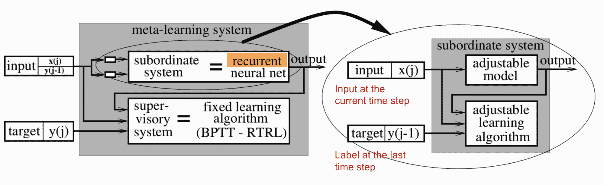
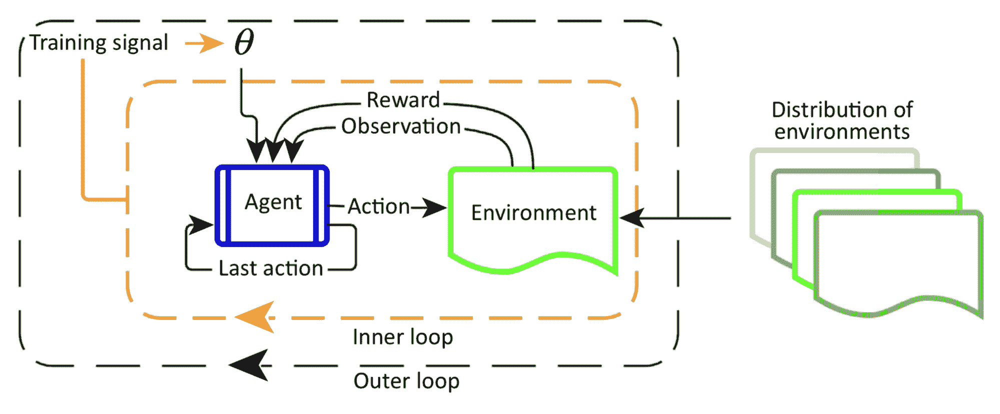
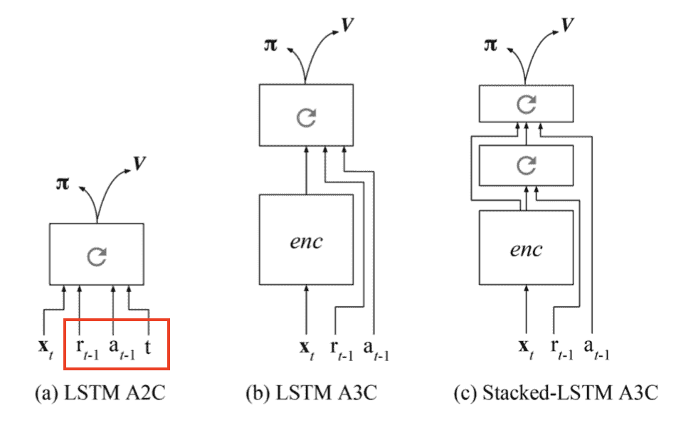
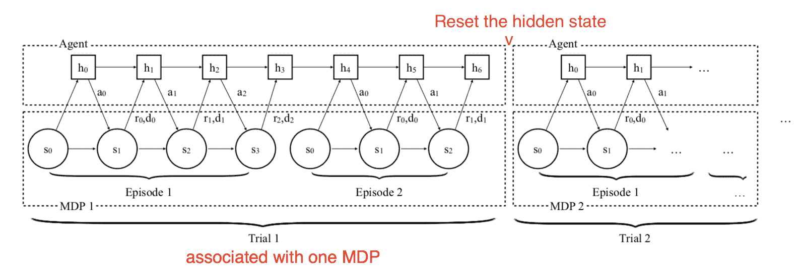
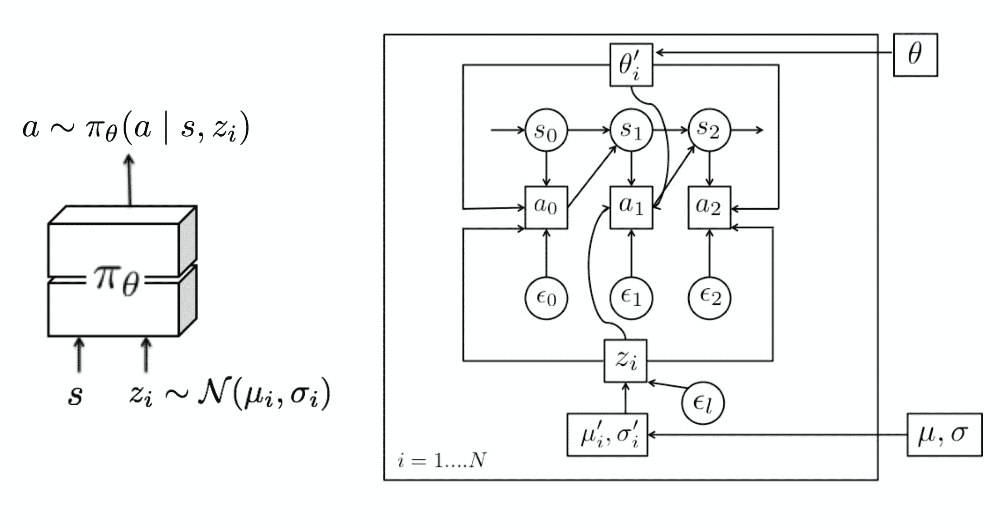
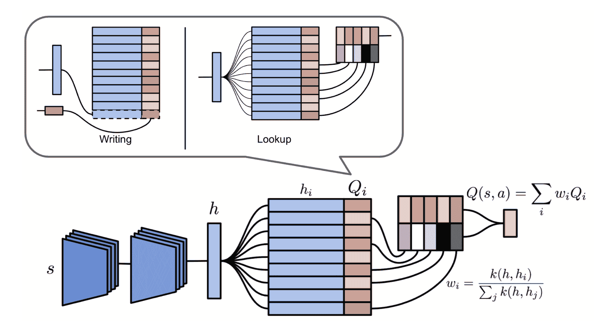
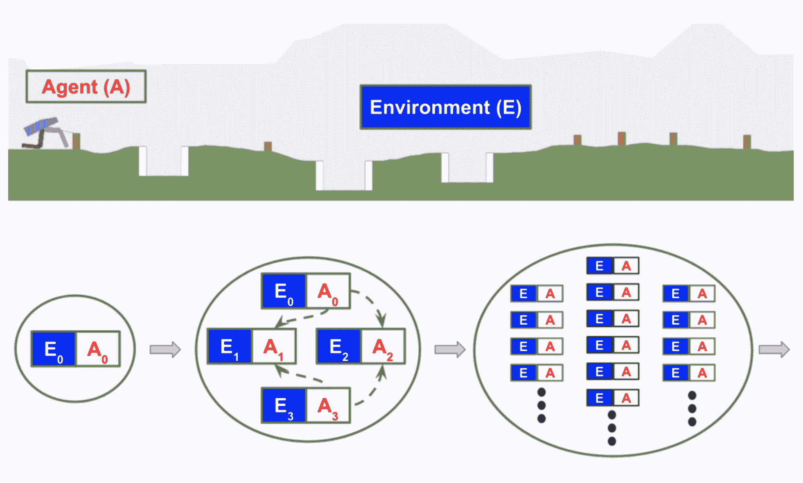
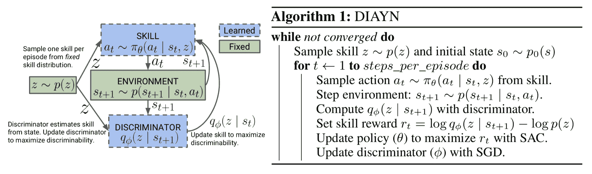

# 元强化学习

> 原文：[`lilianweng.github.io/posts/2019-06-23-meta-rl/`](https://lilianweng.github.io/posts/2019-06-23-meta-rl/)

在我之前关于[元学习](https://lilianweng.github.io/posts/2018-11-30-meta-learning/)的帖子中，问题主要是在少样本分类的背景下定义的。在这里，我想更深入探讨当我们尝试通过开发一个可以快速高效解决未见任务的代理来“元学习”[强化学习（RL）](https://lilianweng.github.io/posts/2018-02-19-rl-overview/)任务的情况。

总结一下，一个好的元学习模型应该能够推广到在训练期间从未遇到过的新任务或新环境。适应过程，本质上是一个*小型学习会话*，在测试中对新配置进行有限暴露。即使没有任何明确的微调（不对可训练变量进行梯度反向传播），元学习模型也会自主调整内部隐藏状态以学习。

训练强化学习算法有时可能非常困难。如果元学习代理能够变得如此聪明，以至于可解决的未见任务的分布变得极其广泛，我们就朝着[通用方法](http://incompleteideas.net/IncIdeas/BitterLesson.html)的方向迈进了——基本上构建一个可以解决各种强化学习问题的“大脑”，几乎不需要人类干预或手动特征工程。听起来很神奇，对吧？💖

# 关于元强化学习的起源

## 回到 2001 年

当阅读[Wang 等人，2016 年](https://arxiv.org/pdf/1611.05763.pdf)时，我遇到了[Hochreiter 等人，2001 年](http://snowedin.net/tmp/Hochreiter2001.pdf)撰写的一篇论文。尽管这个想法是为监督学习提出的，但与当前元强化学习方法有很多相似之处。



图 1. 元学习系统由监督系统和从属系统组成。从属系统是一个循环神经网络，它以当前时间步的观察$x\_t$和上一个时间步的标签$y\_{t-1}$作为输入。（图片来源：[Hochreiter 等人，2001 年](http://snowedin.net/tmp/Hochreiter2001.pdf)）

Hochreiter 的元学习模型是一个带有 LSTM 单元的循环网络。 LSTM 是一个不错的选择，因为它可以内部化输入的历史并通过[BPTT](https://en.wikipedia.org/wiki/Backpropagation_through_time)有效地调整自己的权重。训练数据包含$K$个序列，每个序列由目标函数$f_k(.)$生成的$N$个样本组成，其中$k=1, \dots, K$，

$$ \{\text{输入: }(\mathbf{x}^k_i, \mathbf{y}^k_{i-1}) \to \text{标签: }\mathbf{y}^k_i\}_{i=1}^N \text{ 其中 }\mathbf{y}^k_i = f_k(\mathbf{x}^k_i) $$

注意*上一个标签* $\mathbf{y}^k_{i-1}$ 也作为辅助输入提供，以便函数可以学习所呈现的映射。

在解码二维二次函数$a x_1² + b x_2² + c x_1 x_2 + d x_1 + e x_2 + f$的实验中，系数$a$-$f$从[-1, 1]中随机抽样，这个元学习系统在仅看到约 35 个示例后就能近似表示函数。

## 2016 年的提议

在深度学习的现代时代，[Wang 等人](https://arxiv.org/abs/1611.05763)（2016 年）和[Duan 等人](https://arxiv.org/abs/1611.02779)（2017 年）同时提出了非常相似的**元强化学习**的想法（在第二篇论文中称为**RL²**）。元强化学习模型在一系列 MDP 上进行训练，在测试时，能够快速学习解决新任务。元强化学习的目标是雄心勃勃的，迈出了通向通用算法的一步。

# 定义元强化学习

*元强化学习*，简而言之，是在[强化学习](https://lilianweng.github.io/posts/2018-02-19-rl-overview/)领域进行[元学习](https://lilianweng.github.io/posts/2018-11-30-meta-learning/)。通常训练和测试任务不同，但来自同一类问题族；即，论文中的实验包括具有不同奖励概率的多臂赌博机，具有不同布局的迷宫，模拟器中具有不同物理参数的相同机器人，以及许多其他实验。

## 公式化

假设我们有一系列任务的分布，每个任务都被形式化为一个[MDP](https://lilianweng.github.io/posts/2018-02-19-rl-overview/#markov-decision-processes)（马尔可夫决策过程），$M_i \in \mathcal{M}$。一个 MDP 由一个 4 元组确定，$M_i= \langle \mathcal{S}, \mathcal{A}, P_i, R_i \rangle$：

| 符号 | 意义 |
| --- | --- |
| $\mathcal{S}$ | 一组状态。 |
| $\mathcal{A}$ | 一组动作。 |
| $P_i: \mathcal{S} \times \mathcal{A} \times \mathcal{S} \to \mathbb{R}_{+}$ | 转移概率函数。 |
| $R_i: \mathcal{S} \times \mathcal{A} \to \mathbb{R}$ | 奖励函数。 |

（RL² 论文在 MDP 元组中添加了一个额外的参数，horizon $T$，以强调每个 MDP 应具有有限的 horizon。）

请注意上述使用了常见状态$\mathcal{S}$和动作空间$\mathcal{A}$，以便一个（随机的）策略：$\pi_\theta: \mathcal{S} \times \mathcal{A} \to \mathbb{R}_{+}$能够获得跨不同任务兼容的输入。测试任务从相同分布$\mathcal{M}$或稍作修改中抽样。



图 2. 元强化学习的示意图，包含两个优化循环。外部循环在每次迭代中对新环境进行采样，并调整确定代理行为的参数。在内部循环中，代理与环境交互并优化以获得最大奖励。（图片来源：[Botvinick 等人，2019](https://www.cell.com/action/showPdf?pii=S1364-6613%2819%2930061-0)）

## 与强化学习的主要区别

元强化学习的整体配置与普通的 RL 算法非常相似，只是**上一个奖励** $r_{t-1}$ 和**上一个动作** $a_{t-1}$ 也被纳入到策略观察中，除了当前状态 $s_t$。

+   在 RL 中：$\pi_\theta(s_t) \to$ 一个关于 $\mathcal{A}$ 的分布

+   在元强化学习中：$\pi_\theta(a_{t-1}, r_{t-1}, s_t) \to$ 一个关于 $\mathcal{A}$ 的分布

这种设计的意图是将历史记录输入模型，以便策略可以内化当前 MDP 中状态、奖励和动作之间的动态，并相应地调整其策略。这与 Hochreiter 的系统中的设置非常一致。元强化学习和 RL² 都实现了一个 LSTM 策略，LSTM 的隐藏状态作为跟踪轨迹特征的*记忆*。由于策略是循环的，因此不需要明确地将上一个状态作为输入馈送。

训练过程如下：

1.  从 $\mathcal{M}$ 中抽取一个新的 MDP，$M_i \sim \mathcal{M}$；

1.  **重置模型的隐藏状态**；

1.  收集多条轨迹并更新模型权重；

1.  重复从步骤 1 开始。



图 3。在元强化学习论文中，不同的演员-评论家架构都使用了一个循环模型。最后的奖励和最后的动作是额外的输入。观察结果被馈送到 LSTM 中，可以是一个独热向量，也可以是通过编码器模型传递后的嵌入向量。（图片来源：[Wang 等人，2016](https://arxiv.org/abs/1611.05763)）



图 4。如 RL² 论文中所述，展示了模型在训练时与一系列 MDP 交互的过程。（图片来源：[Duan 等人，2017](https://arxiv.org/abs/1611.02779)）

## 关键组件

元强化学习中有三个关键组件：

> ⭐ **带有记忆的模型**
> 
> 一个循环神经网络维护一个隐藏状态。因此，它可以通过在 rollouts 期间更新隐藏状态来获取和记忆关于当前任务的知识。没有记忆，元强化学习将无法运行。
> 
> ⭐ **元学习算法**
> 
> 元学习算法指的是我们如何更新模型权重，以便在测试时快速解决未见过的任务。在元强化学习和 RL² 论文中，元学习算法是在 MDP 切换时重置隐藏状态的普通梯度下降更新 LSTM。
> 
> ⭐ **MDP 的分布**
> 
> 当代理在训练过程中暴露于各种环境和任务时，它必须学会如何适应不同的 MDP。

根据[Botvinick 等人](https://www.cell.com/action/showPdf?pii=S1364-6613%2819%2930061-0)（2019）的说法，RL 训练中的一种缓慢源于*弱[归纳偏差](https://en.wikipedia.org/wiki/Inductive_bias)*（=“学习者用来预测给定未遇到的输入时的输出的一组假设”）。作为一般的 ML 规则，具有弱归纳偏差的学习算法将能够掌握更广泛的变化范围，但通常会更少地利用样本。因此，通过缩小具有更强归纳偏差的假设有助于提高学习速度。

在元强化学习中，我们从*任务分布*中施加某些类型的归纳偏差，并将它们存储在*内存*中。在测试时采用哪种归纳偏差取决于*算法*。这三个关键组件共同描绘了元强化学习的一个引人注目的视角：调整循环网络的权重虽然慢，但它允许模型通过其内部活动动态中实现的自己的 RL 算法快速解决新任务。

有趣而又不太令人惊讶的是，元强化学习与 Jeff Clune（2019）的[AI-GAs](https://arxiv.org/abs/1905.10985)（“AI-Generating Algorithms”）论文中的想法相匹配。他提出，构建通用人工智能的一种有效方式是尽可能使学习自动化。AI-GAs 方法涉及三大支柱：（1）元学习架构，（2）元学习算法，以及（3）为有效学习而自动生成的环境。

* * *

设计良好的循环网络架构的主题有点太广泛，这里不讨论。接下来，让我们进一步探讨另外两个组成部分：在元强化学习背景下的元学习算法以及如何获取各种训练 MDP。

# 用于元强化学习的元学习算法

我之前的[帖子](https://lilianweng.github.io/posts/2018-11-30-meta-learning/)关于元学习已经涵盖了几种经典的元学习算法。在这里，我将包括更多与 RL 相关的内容。

## 为元学习优化模型权重

MAML（[Finn 等人，2017](https://arxiv.org/abs/1703.03400)）和 Reptile（[Nichol 等人，2018](https://arxiv.org/abs/1803.02999)）都是更新模型参数以在新任务上实现良好泛化性能的方法。请参阅有关 MAML 和 Reptile 的早期帖子[部分](https://lilianweng.github.io/posts/2018-11-30-meta-learning/#optimization-based)。

## 元学习超参数

在强化学习问题中，$G_t^{(n)}$或$G_t^\lambda$的[回报](https://lilianweng.github.io/posts/2018-02-19-rl-overview/#value-function)函数涉及一些经常启发式设置的超参数，如折扣因子[$\gamma$](https://lilianweng.github.io/posts/2018-02-19-rl-overview/#value-function)和自举参数[$\lambda$](https://lilianweng.github.io/posts/2018-02-19-rl-overview/#combining-td-and-mc-learning)。元梯度强化学习（[Xu 等，2018](http://papers.nips.cc/paper/7507-meta-gradient-reinforcement-learning.pdf)）将它们视为*元参数*，$\eta=\{\gamma, \lambda \}$，可以在代理与环境交互时*在线*调整和学习。因此，回报成为$\eta$的函数，并随着时间动态地适应特定任务。

$$ \begin{aligned} G_\eta^{(n)}(\tau_t) &= R_{t+1} + \gamma R_{t+2} + \dots + \gamma^{n-1}R_{t+n} + \gamma^n v_\theta(s_{t+n}) & \scriptstyle{\text{; n 步回报}} \\ G_\eta^{\lambda}(\tau_t) &= (1-\lambda) \sum_{n=1}^\infty \lambda^{n-1} G_\eta^{(n)} & \scriptstyle{\text{; λ回报，n 步回报的混合}} \end{aligned} $$

在训练过程中，我们希望根据手头所有信息的梯度更新策略参数，$\theta' = \theta + f(\tau, \theta, \eta)$，其中$\theta$是当前模型权重，$\tau$是一系列轨迹，$\eta$是元参数。

同时，假设我们有一个元目标函数$J(\tau, \theta, \eta)$作为性能度量。训练过程遵循在线交叉验证原则，使用一系列连续的经验：

1.  从参数$\theta$开始，策略$\pi_\theta$在第一批样本$\tau$上进行更新，得到$\theta'$。

1.  然后我们继续运行策略$\pi_{\theta'}$以收集一组新的经验$\tau'$，只是按时间顺序连续地跟随$\tau$。性能以固定的元参数$\bar{\eta}$来衡量为$J(\tau', \theta', \bar{\eta})$。

1.  元目标函数$J(\tau', \theta', \bar{\eta})$相对于$\eta$的梯度用于更新$\eta$：

$$ \begin{aligned} \Delta \eta &= -\beta \frac{\partial J(\tau', \theta', \bar{\eta})}{\partial \eta} \\ &= -\beta \frac{\partial J(\tau', \theta', \bar{\eta})}{\partial \theta'} \frac{d\theta'}{d\eta} & \scriptstyle{\text{ ; 单变量链式法则。}} \\ &= -\beta \frac{\partial J(\tau', \theta', \bar{\eta})}{\partial \theta'} \frac{\partial (\theta + f(\tau, \theta, \eta))}{\partial\eta} \\ &= -\beta \frac{\partial J(\tau', \theta', \bar{\eta})}{\partial \theta'} \Big(\frac{d\theta}{d\eta} + \frac{\partial f(\tau, \theta, \eta)}{\partial\theta}\frac{d\theta}{d\eta} + \frac{\partial f(\tau, \theta, \eta)}{\partial\eta}\frac{d\eta}{d\eta} \Big) & \scriptstyle{\text{; 多变量链式法则。}}\\ &= -\beta \frac{\partial J(\tau', \theta', \bar{\eta})}{\partial \theta'} \Big( \color{red}{\big(\mathbf{I} + \frac{\partial f(\tau, \theta, \eta)}{\partial\theta}\big)}\frac{d\theta}{d\eta} + \frac{\partial f(\tau, \theta, \eta)}{\partial\eta}\Big) & \scriptstyle{\text{; 红色的二次梯度项。}} \end{aligned} $$

其中 $\beta$ 是 $\eta$ 的学习率。

元梯度强化学习算法通过将二次梯度项设置为零来简化计算，$\mathbf{I} + \partial g(\tau, \theta, \eta)/\partial\theta = 0$ — 这个选择更偏向于元参数 $\eta$ 对参数 $\theta$ 的直接影响。最终我们得到：

$$ \Delta \eta = -\beta \frac{\partial J(\tau', \theta', \bar{\eta})}{\partial \theta'} \frac{\partial f(\tau, \theta, \eta)}{\partial\eta} $$

论文中的实验采用了与 $TD(\lambda)$ 算法相同的元目标函数，最小化近似值函数 $v_\theta(s)$ 与 $\lambda$-回报之间的误差：

$$ \begin{aligned} J(\tau, \theta, \eta) &= (G^\lambda_\eta(\tau) - v_\theta(s))² \\ J(\tau', \theta', \bar{\eta}) &= (G^\lambda_{\bar{\eta}}(\tau') - v_{\theta'}(s'))² \end{aligned} $$

## 元学习损失函数

在策略梯度算法中，通过更新策略参数 $\theta$ 朝着估计梯度的方向进行，最大化期望总奖励（[Schulman et al., 2016](https://arxiv.org/abs/1506.02438)），

$$ g = \mathbb{E}[\sum_{t=0}^\infty \Psi_t \nabla_\theta \log \pi_\theta (a_t \mid s_t)] $$

其中 $\Psi_t$ 的候选包括轨迹回报 $G_t$，Q 值 $Q(s_t, a_t)$，或优势值 $A(s_t, a_t)$。策略梯度的相应替代损失函数可以被反向工程出来：

$$ L_\text{pg} = \mathbb{E}[\sum_{t=0}^\infty \Psi_t \log \pi_\theta (a_t \mid s_t)] $$

这个损失函数是对轨迹历史$(s_0, a_0, r_0, \dots, s_t, a_t, r_t, \dots)$的度量。**进化策略梯度**（**EPG**；[Houthooft 等人，2018](https://papers.nips.cc/paper/7785-evolved-policy-gradients.pdf)）进一步定义了策略梯度损失函数为代理过去经验的时间卷积（1-D 卷积）$L_\phi$。损失函数网络的参数$\phi$被演化，以使代理能够获得更高的回报。

与许多元学习算法类似，EPG 有两个优化循环：

+   在内部循环中，代理学习改进其策略$\pi_\theta$。

+   在外循环中，模型更新损失函数$L_\phi$的参数$\phi$。由于回报和损失之间没有明确的可微方程，EPG 转向[*进化策略*](https://en.wikipedia.org/wiki/Evolution_strategy)（ES）。

一个一般的想法是训练一个由$N$个代理组成的群体，每个代理都使用带有$\phi$的损失函数$L_{\phi + \sigma \epsilon_i}$进行训练，加上标准差为$\sigma$的小高斯噪声$\epsilon_i \sim \mathcal{N}(0, \mathbf{I})$。在内循环的训练过程中，EPG 跟踪经验历史，并根据每个代理的损失函数$L_{\phi + \sigma\epsilon_i}$更新策略参数：

$$ \theta_i \leftarrow \theta - \alpha_\text{in} \nabla_\theta L_{\phi + \sigma \epsilon_i} (\pi_\theta, \tau_{t-K, \dots, t}) $$

其中$\alpha_\text{in}$是内循环的学习率，$\tau_{t-K, \dots, t}$是直到当前时间步$t$的$M$个转换的序列。

一旦内循环策略足够成熟，该策略将通过多个随机采样的轨迹的平均回报$\bar{G}_{\phi+\sigma\epsilon_i}$进行评估。最终，我们能够根据[NES](http://blog.otoro.net/2017/10/29/visual-evolution-strategies/)在数值上评估$\phi$的梯度（[Salimans 等人，2017](https://arxiv.org/abs/1703.03864)）。在重复这个过程的同时，策略参数$\theta$和损失函数权重$\phi$同时更新，以实现更高的回报。

$$ \phi \leftarrow \phi + \alpha_\text{out} \frac{1}{\sigma N} \sum_{i=1}^N \epsilon_i G_{\phi+\sigma\epsilon_i} $$

其中$\alpha_\text{out}$是外循环的学习率。

在实践中，损失$L_\phi$使用普通策略梯度（如 REINFORCE 或 PPO）替代损失$L_\text{pg}$进行引导，$\hat{L} = (1-\alpha) L_\phi + \alpha L_\text{pg}$。权重$\alpha$在训练过程中逐渐从 1 降至 0。在测试时，损失函数参数$\phi$保持固定，损失值是根据经验历史计算的，以更新策略参数$\theta$。

## 元学习探索策略

在强化学习中，[开发 vs 探索](https://lilianweng.github.io/posts/2018-01-23-multi-armed-bandit/#exploitation-vs-exploration)困境是一个关键问题。常见的探索方式包括$\epsilon$-贪心、在动作上添加随机噪声，或者在动作空间上具有内置随机性的随机策略。

**MAESN**（[Gupta et al, 2018](http://papers.nips.cc/paper/7776-meta-reinforcement-learning-of-structured-exploration-strategies.pdf)）是一种算法，用于从先前经验中学习结构化的动作噪声，以实现更好更有效的探索。简单地在动作上添加随机噪声无法捕捉任务相关或时间相关的探索策略。MAESN 改变策略以依赖于每个任务的随机变量$z_i \sim \mathcal{N}(\mu_i, \sigma_i)$，对于第$i$个任务$M_i$，因此我们会有一个策略$a \sim \pi_\theta(a\mid s, z_i)$。潜变量$z_i$在一个 episode 中被采样一次并固定。直观地，潜变量确定了在一个 rollout 开始时应更多探索的一种行为（或技能），代理会相应地调整其动作。策略参数和潜空间都被优化以最大化总任务奖励。同时，策略学会利用潜变量进行探索。

此外，损失函数包括学习的潜变量与单位高斯先验之间的 KL 散度，$D_\text{KL}(\mathcal{N}(\mu_i, \sigma_i)|\mathcal{N}(0, \mathbf{I}))$。一方面，它限制了学习的潜空间不要离常见先验太远。另一方面，它为奖励函数创建了变分证据下界（[ELBO](http://users.umiacs.umd.edu/~xyang35/files/understanding-variational-lower.pdf)）。有趣的是，论文发现每个任务的$(\mu_i, \sigma_i)$在收敛时通常接近先验。



图 5. 策略以一个每个 episode 采样一次的潜变量$z\_i \sim \mathcal{N}(\mu, \sigma)$为条件。每个任务对于潜变量分布有不同的超参数$(\mu\_i, \sigma\_i)$，它们在外部循环中被优化。（图片来源：[Gupta et al, 2018](http://papers.nips.cc/paper/7776-meta-reinforcement-learning-of-structured-exploration-strategies.pdf)）

## 情节控制

强化学习的一个主要批评是其样本效率低。在强化学习中，为了最大化泛化并避免早期学习的灾难性遗忘，需要大量样本和小的学习步骤进行增量参数调整（[Botvinick et al., 2019](https://www.cell.com/trends/cognitive-sciences/fulltext/S1364-6613(19)30061-0)）。

**情节控制**（[Lengyel＆Dayan，2008](http://papers.nips.cc/paper/3311-hippocampal-contributions-to-control-the-third-way.pdf)）被提出作为一个解决方案，以避免遗忘并在更快的速度下提高泛化能力。它在一定程度上受到了关于基于实例的[海马](https://en.wikipedia.org/wiki/Hippocampus)学习的假设的启发。

*情节记忆*会明确记录过去事件，并直接将这些记录用作制定新决策的参考点（即就像[基于度量的](https://lilianweng.github.io/posts/2018-11-30-meta-learning/#metric-based)元学习）。在**MFEC**（无模型情节控制；[Blundell 等人，2016](https://arxiv.org/abs/1606.04460)）中，记忆被建模为一个大表格，将状态-动作对$(s, a)$作为键，相应的 Q 值$Q_\text{EC}(s, a)$作为值进行存储。当接收到新的观察$s$时，Q 值以非参数化方式估计为最相似样本的前$k$个的平均 Q 值：

$$ \hat{Q}_\text{EC}(s, a) = \begin{cases} Q_\text{EC}(s, a) & \text{if } (s,a) \in Q_\text{EC}, \\ \frac{1}{k} \sum_{i=1}^k Q(s^{(i)}, a) & \text{otherwise} \end{cases} $$

其中$s^{(i)}, i=1, \dots, k$是与状态$s$距离最小的前$k$个状态。然后选择产生最高估计 Q 值的动作。然后根据在$s_t$处收到的回报更新记忆表：

$$ Q_\text{EC}(s, a) \leftarrow \begin{cases} \max\{Q_\text{EC}(s_t, a_t), G_t\} & \text{if } (s,a) \in Q_\text{EC}, \\ G_t & \text{otherwise} \end{cases} $$

作为一种表格化强化学习方法，MFEC 存在着大量的内存消耗和缺乏在相似状态之间泛化的方法。第一个问题可以通过 LRU 缓存来解决。受到[基于度量的](https://lilianweng.github.io/posts/2018-11-30-meta-learning/#metric-based)元学习的启发，特别是匹配网络（[Vinyals 等人，2016](http://papers.nips.cc/paper/6385-matching-networks-for-one-shot-learning.pdf)），泛化问题在后续算法**NEC**（神经记忆控制；[Pritzel 等人，2016](https://arxiv.org/abs/1703.01988)）中得到改善。

NEC 中的情节记忆是一个可微分神经字典（**DND**），其中键是输入图像像素的卷积嵌入向量，值存储估计的 Q 值。给定一个查询键，输出是最相似键的值的加权和，其中权重是查询键和字典中选定键之间的归一化核度量。这听起来像是一种复杂的[注意力](https://lilianweng.github.io/posts/2018-06-24-attention/)机制。



图 6 NEC 中情节记忆模块的示意图以及可微分神经字典上的两种操作。（图片来源：[Pritzel 等人，2016](https://arxiv.org/abs/1703.01988)）

此外，**记忆 LSTM**（[Ritter 等人，2018](https://arxiv.org/abs/1805.09692)）通过 DND 记忆增强了基本 LSTM 结构，其中将任务上下文嵌入存储为键，将 LSTM 单元状态存储为值。存储的隐藏状态通过 LSTM 内相同的门控机制直接检索并添加到当前单元状态中：


图 7\. 显示了记忆 LSTM 结构的示意图。记忆结构的额外部分用**粗体**标出。（图片来源：[Ritter 等人，2018](https://arxiv.org/abs/1805.09692)）

$$ \begin{aligned} \mathbf{c}_t &= \mathbf{i}_t \circ \mathbf{c}_\text{in} + \mathbf{f}_t \circ \mathbf{c}_{t-1} + \color{green}{\mathbf{r}_t \circ \mathbf{c}_\text{ep}} &\\ \mathbf{i}_t &= \sigma(\mathbf{W}_{i} \cdot [\mathbf{h}_{t-1}, \mathbf{x}_t] + \mathbf{b}_i) & \scriptstyle{\text{; 输入门}} \\ \mathbf{f}_t &= \sigma(\mathbf{W}_{f} \cdot [\mathbf{h}_{t-1}, \mathbf{x}_t] + \mathbf{b}_f) & \scriptstyle{\text{; 遗忘门}} \\ \color{green}{\mathbf{r}_t} & \color{green}{=} \color{green}{\sigma(\mathbf{W}_{r} \cdot [\mathbf{h}_{t-1}, \mathbf{x}_t] + \mathbf{b}_r)} & \scriptstyle{\text{; 重建门}} \end{aligned} $$

其中$\mathbf{c}_t$和$\mathbf{h}_t$分别是时间$t$的隐藏状态和单元状态；$\mathbf{i}_t$、$\mathbf{f}_t$和$\mathbf{r}_t$分别是输入、遗忘和重建门；$\mathbf{c}_\text{ep}$是从记忆中检索到的单元状态。新增的记忆组件用绿色标出。

该架构通过基于上下文的检索提供了对先前经验的快捷方式。同时，明确地将任务相关经验保存在外部存储器中避免了遗忘。在论文中，所有实验都是手动设计的上下文向量。如何为更自由形式的任务构建有效和高效的任务上下文嵌入格式将是一个有趣的课题。

总体而言，记忆控制的能力受到环境复杂性的限制。在真实任务中，代理很少会重复访问完全相同的状态，因此正确编码状态至关重要。学习的嵌入空间将观察数据压缩到较低维度空间中，同时，在此空间中接近的两个状态预计需要相似的策略。

# 训练任务获取

在三个关键组件中，如何设计适当的任务分布是研究较少且可能是最具体于元强化学习本身的。如上所述，每个任务都是一个马尔可夫决策过程：$M_i = \langle \mathcal{S}, \mathcal{A}, P_i, R_i \rangle \in \mathcal{M}$。我们可以通过修改来构建一个马尔可夫决策过程的分布：

+   *奖励配置*：在不同任务中，相同行为可能根据$R_i$而获得不同的奖励。

+   或者，*环境*：过渡函数$P_i$可以通过在状态之间初始化不同的偏移来重新塑造。

## 通过领域随机化生成任务

在模拟器中随机化参数是获得具有修改过渡函数的任务的简单方法。 如果想进一步了解，请查看我上一篇关于**领域随机化**的[文章](https://lilianweng.github.io/posts/2019-05-05-domain-randomization/)。

## 环境生成上的进化算法

[进化算法](https://zh.wikipedia.org/wiki/%E9%80%B2%E5%8C%96%E7%AE%97%E6%B3%95)是一种基于启发式的无梯度优化方法，灵感来自自然选择。 一群解决方案遵循评估、选择、繁殖和突变的循环。 最终，好的解决方案会存活下来并被选中。

**POET**（[Wang 等人，2019](https://arxiv.org/abs/1901.01753)），一个基于进化算法的框架，试图在解决问题的同时生成任务。 POET 的实现仅针对简单的 2D [双足行走者](https://gym.openai.com/envs/BipedalWalkerHardcore-v2/) 环境，但指出了一个有趣的方向。 值得注意的是，进化算法在深度学习中已经有一些引人注目的应用，如 EPG 和 PBT（基于种群的训练；[Jaderberg 等人，2017](https://arxiv.org/abs/1711.09846)）。



图 8\. 一个双足行走环境示例（上）和 POET 概述（下）。 (图片来源：[POET 博客文章](https://eng.uber.com/poet-open-ended-deep-learning/))

2D 双足行走环境正在发展：从简单的平坦表面到具有潜在间隙、树桩和崎岖地形的更加困难的路径。 POET 将环境挑战的生成与代理的优化配对在一起，以便 (a) 选择能够解决当前挑战的代理和 (b) 进化环境以便解决。 该算法维护一个*环境-代理对*列表，并重复以下步骤：

1.  *突变*：从当前活跃环境生成新环境。 请注意，这里的突变操作类型仅针对双足行走者，新环境将需要一组新的配置。

1.  *优化*：在各自的环境中训练配对的代理。

1.  *选择*：定期尝试将当前代理从一个环境转移到另一个环境。 复制并更新每个环境中表现最佳的代理。 直觉是在一个环境中学到的技能可能对另一个环境有所帮助。

上述过程与[PBT](https://arxiv.org/abs/1711.09846)非常相似，但 PBT 会改变和演化超参数。在某种程度上，POET 正在进行[领域随机化](https://lilianweng.github.io/posts/2019-05-05-domain-randomization/)，因为所有的间隙、树桩和地形粗糙度都由一些随机化概率参数控制。与 DR 不同，代理们不会一次性暴露于完全随机化的困难环境中，而是通过进化算法配置的课程逐渐学习。

## 使用随机奖励进行学习

没有奖励函数$R$的 MDP 被称为*受控马尔可夫过程*（CMP）。给定预定义的 CMP，$\langle \mathcal{S}, \mathcal{A}, P\rangle$，我们可以通过生成一系列鼓励有效元学习策略训练的奖励函数$\mathcal{R}$来获得各种任务。

[Gupta 等人（2018）](https://arxiv.org/abs/1806.04640)提出了两种无监督方法，用于在 CMP 背景下扩展任务分布。假设每个任务都有一个潜在的潜变量$z \sim p(z)$，与每个任务相关联，它参数化/确定了一个奖励函数：$r_z(s) = \log D(z|s)$，其中“鉴别器”函数$D(.)$用于从状态中提取潜变量。论文描述了构建鉴别器函数的两种方法：

+   样本随机权重$\phi_\text{rand}$的鉴别器，$D_{\phi_\text{rand}}(z \mid s)$。

+   学习一个鉴别器函数以鼓励多样化驱动的探索。这种方法在另一篇姊妹论文“DIAYN”中有更详细的介绍（[Eysenbach 等人，2018](https://arxiv.org/abs/1802.06070)）。

DIAYN，即“多样性就是你所需要的”，是一种鼓励策略学习有用技能而无需奖励函数的框架。它明确地将潜变量$z$建模为*技能*嵌入，并使策略除了状态$s$外还取决于$z$，$\pi_\theta(a \mid s, z)$。（嗯，这部分与 MAESN 一样，毫不奇怪，因为这些论文来自同一团队。）DIAYN 的设计受到几个假设的启发：

+   技能应该多样化，并导致访问不同状态。→ 最大化状态和技能之间的互信息，$I(S; Z)$

+   技能应该由状态而不是动作来区分。→ 最小化在给定状态的情况下动作和技能之间的互信息，$I(A; Z \mid S)$

要最大化的目标函数如下，同时还添加了策略熵以鼓励多样性：

$$ \begin{aligned} \mathcal{F}(\theta) &= I(S; Z) + H[A \mid S] - I(A; Z \mid S) & \\ &= (H(Z) - H(Z \mid S)) + H[A \mid S] - (H[A\mid S] - H[A\mid S, Z]) & \\ &= H[A\mid S, Z] \color{green}{- H(Z \mid S) + H(Z)} & \\ &= H[A\mid S, Z] + \mathbb{E}_{z\sim p(z), s\sim\rho(s)}[\log p(z \mid s)] - \mathbb{E}_{z\sim p(z)}[\log p(z)] & \scriptstyle{\text{；可以从状态推断技能 & p(z)是多样的。}} \\ &\ge H[A\mid S, Z] + \mathbb{E}_{z\sim p(z), s\sim\rho(s)}[\color{red}{\log D_\phi(z \mid s) - \log p(z)}] & \scriptstyle{\text{；根据 Jensen 不等式；红色的“伪奖励”。}} \end{aligned} $$

其中$I(.)$是互信息，$H[.]$是熵度量。我们无法整合所有状态来计算$p(z \mid s)$，因此用$D_\phi(z \mid s)$来近似——这就是以多样性为驱动的鉴别器函数。



图 9\. DIAYN 算法。（图片来源：[Eysenbach 等人，2019](https://arxiv.org/abs/1802.06070)）

一旦学习了鉴别器函数，对于训练来说，采样一个新的 MDP 是直截了当的：首先，采样一个潜变量，$z \sim p(z)$并构建一个奖励函数$r_z(s) = \log(D(z \vert s))$。将奖励函数与预定义的 CMP 配对，创建一个新的 MDP。

* * *

引用为：

```py
@article{weng2019metaRL,
  title   = "Meta Reinforcement Learning",
  author  = "Weng, Lilian",
  journal = "lilianweng.github.io",
  year    = "2019",
  url     = "https://lilianweng.github.io/posts/2019-06-23-meta-rl/"
} 
```

# 参考文献

[1] Richard S. Sutton。[“苦涩的教训。”](http://incompleteideas.net/IncIdeas/BitterLesson.html) 2019 年 3 月 13 日。

[2] Sepp Hochreiter, A. Steven Younger 和 Peter R. Conwell。[“使用梯度下降学习学习。”](http://snowedin.net/tmp/Hochreiter2001.pdf) 人工神经网络国际会议。2001 年。

[3] 王简等人。[“学习强化学习。”](https://arxiv.org/abs/1611.05763) arXiv 预印本 arXiv:1611.05763（2016 年）。

[4] 段燕等人。[“RL $^ 2$：通过缓慢强化学习快速强化学习。”](https://arxiv.org/abs/1611.02779) ICLR 2017。

[5] Matthew Botvinick 等人。[“强化学习，快与慢”](https://www.cell.com/trends/cognitive-sciences/fulltext/S1364-6613(19)30061-0) Cell Review，第 23 卷，第 5 期，P408-422，2019 年 5 月 1 日。

[6] Jeff Clune。[“AI-GAs：生成人工智能的算法，一种产生通用人工智能的替代范式”](https://arxiv.org/abs/1905.10985) arXiv 预印本 arXiv:1905.10985（2019 年）。

[7] 徐中文等人。[“元梯度强化学习”](http://papers.nips.cc/paper/7507-meta-gradient-reinforcement-learning.pdf) NIPS 2018。

[8] Rein Houthooft 等人。[“进化策略梯度。”](https://papers.nips.cc/paper/7785-evolved-policy-gradients.pdf) NIPS 2018。

[9] Tim Salimans 等人。[“进化策略作为可扩展的强化学习替代方案。”](https://arxiv.org/abs/1703.03864) arXiv 预印本 arXiv:1703.03864（2017 年）。

[10] Abhishek Gupta 等人。[“结构化探索策略的元强化学习。”](http://papers.nips.cc/paper/7776-meta-reinforcement-learning-of-structured-exploration-strategies.pdf) NIPS 2018。

[11] Alexander Pritzel 等人 [“神经元情节控制。”](https://arxiv.org/abs/1703.01988) 机器学习国际会议论文集，第 70 卷，2017.

[12] Charles Blundell 等人 [“无模型的情节控制。”](https://arxiv.org/abs/1606.04460) arXiv 预印本 arXiv:1606.04460 (2016).

[13] Samuel Ritter 等人 [“曾经历过，已经做过：具有情节回忆的元学习。”](https://arxiv.org/abs/1805.09692) ICML, 2018.

[14] Rui Wang 等人 [“配对开放式先驱者（POET）：不断生成越来越复杂和多样化的学习环境及其解决方案”](https://arxiv.org/abs/1901.01753) arXiv 预印本 arXiv:1901.01753 (2019).

[15] Uber 工程博客: [“POET：通过配对开放式先驱者不断生成越来越复杂和多样化的学习环境及其解决方案。”](https://eng.uber.com/poet-open-ended-deep-learning/) 2019 年 1 月 8 日.

[16] Abhishek Gupta 等人 [“强化学习的无监督元学习”](https://arxiv.org/abs/1806.04640) arXiv 预印本 arXiv:1806.04640 (2018).

[17] Eysenbach, Benjamin 等人 [“多样性就是你所需要的：在没有奖励函数的情况下学习技能。”](https://arxiv.org/abs/1802.06070) ICLR 2019.

[18] Max Jaderberg 等人 [“基于种群的神经网络训练。”](https://arxiv.org/abs/1711.09846) arXiv 预印本 arXiv:1711.09846 (2017).
