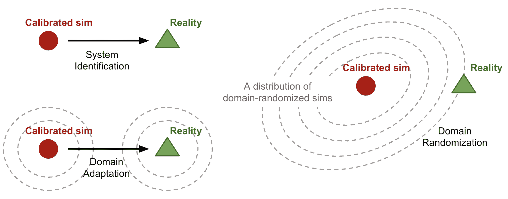
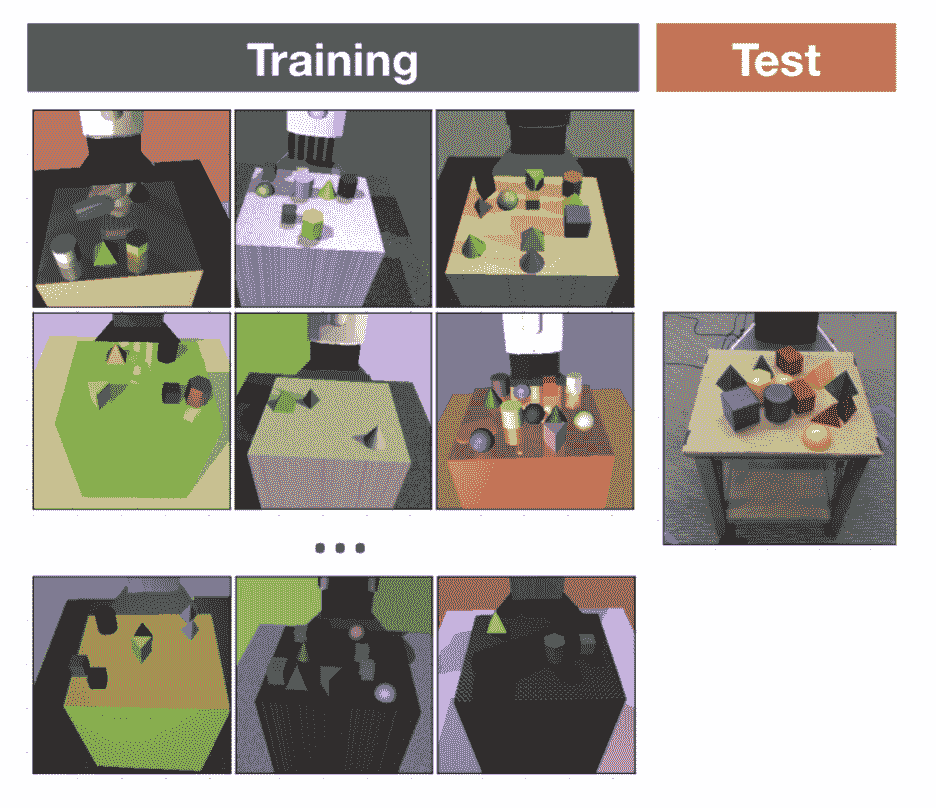
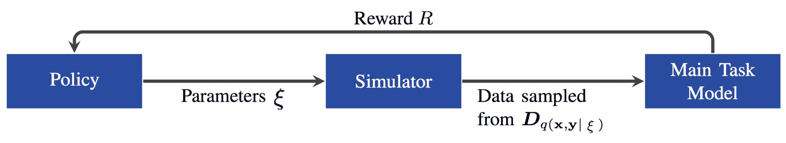
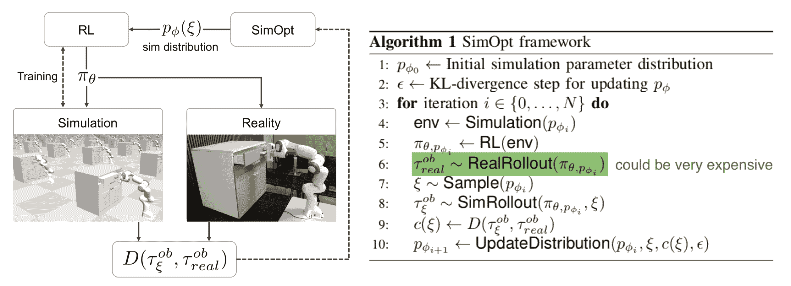
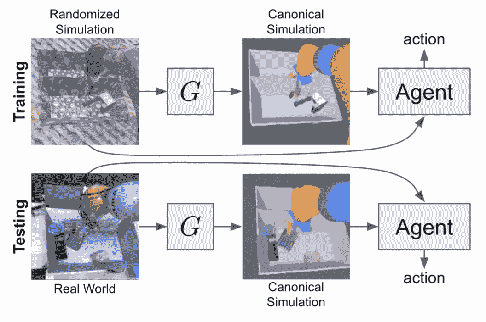
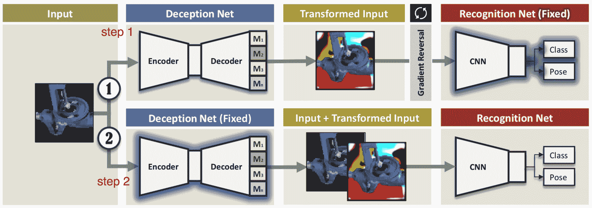
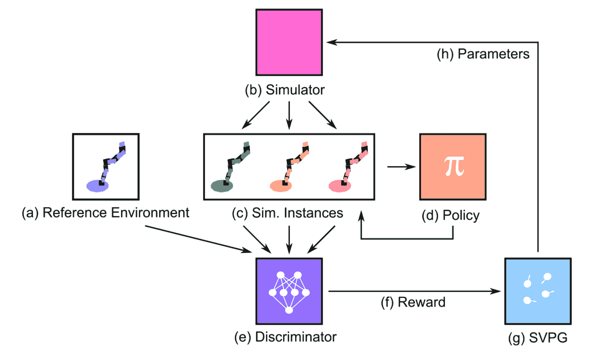

# 用于 Sim2Real 转移的领域随机化

> 原文：[`lilianweng.github.io/posts/2019-05-05-domain-randomization/`](https://lilianweng.github.io/posts/2019-05-05-domain-randomization/)

在机器人领域，最困难的问题之一是如何使你的模型在现实世界中转化。由于深度强化学习算法的样本效率低和在真实机器人上收集数据的成本，我们经常需要在模拟器中训练模型，理论上提供无限量的数据。然而，模拟器和物理世界之间的现实差距经常导致在与物理机器人合作时失败。这种差距是由物理参数（即摩擦、kp、阻尼、质量、密度）之间的不一致性以及更致命的是不正确的物理建模（即软表面之间的碰撞）引起的。

要缩小 sim2real 差距，我们需要改进模拟器并使其更接近现实。一些方法包括：

+   **系统辨识**

    +   *系统辨识*是为物理系统建立数学模型；在 RL 的背景下，数学模型就是模拟器。为了使模拟器更加真实，需要仔细校准。

    +   不幸的是，校准是昂贵的。此外，由于温度、湿度、位置或时间中的磨损，同一机器的许多物理参数可能会有显著变化。

+   **领域自适应**

    +   *领域自适应（DA）*指的是一组转移学习技术，通过任务模型强制执行的映射或正则化来更新模拟数据分布以匹配真实数据分布。

    +   许多 DA 模型，特别是用于图像分类或端到端基于图像的 RL 任务，都建立在对抗损失或[GAN](https://lilianweng.github.io/posts/2017-08-20-gan/)上。

+   **领域随机化**

    +   通过*领域随机化（DR）*，我们能够创建具有随机属性的各种模拟环境，并训练一个可以在所有这些环境中运行的模型。

    +   很可能这个模型可以适应真实世界环境，因为真实系统预计是在那个丰富的训练变化分布中的一个样本。

DA 和 DR 都是无监督的。与 DA 相比，需要相当数量的真实数据样本来捕捉分布，DR 可能只需要*很少或没有*真实数据。本文重点关注 DR。



图 1. 三种 sim2real 转移方法的概念图示。

# 什么是领域随机化？

为了使定义更加通用，让我们称我们完全访问的环境（即模拟器）为**源领域**，我们希望将模型转移到的环境为**目标领域**（即物理世界）。训练发生在源领域中。我们可以在源领域中控制一组$N$个随机化参数$e_\xi$，具有从随机化空间$\xi \in \Xi \subset \mathbb{R}^N$中采样的配置$\xi$。

在策略训练期间，从应用随机化的源域收集剧集。因此，策略暴露于各种环境并学会泛化。策略参数$\theta$被训练以最大化在一系列配置中平均的预期奖励$R(.)$：

$$ \theta^* = \arg\max_\theta \mathbb{E}_{\xi \sim \Xi} [\mathbb{E}_{\pi_\theta, \tau \sim e_\xi} [R(\tau)]] $$

其中$\tau_\xi$是在源域中随机化的轨迹$\xi$收集的。从某种意义上说，“源域和目标域之间的差异被建模为源域中的变异性。”（引自[Peng et al. 2018](https://arxiv.org/abs/1710.06537)）

# 均匀域随机化

在 DR 的原始形式中（[Tobin et al, 2017](https://arxiv.org/abs/1703.06907); [Sadeghi et al. 2016](https://arxiv.org/pdf/1611.04201.pdf)），每个随机化参数$\xi_i$都受到一个区间的限制，$\xi_i \in [\xi_i^\text{low}, \xi_i^\text{high}], i=1,\dots,N$，并且每个参数在范围内均匀采样。

随机化参数可以控制场景的外观，包括但不限于以下内容（见图 2）。在模拟和随机化图像上训练的模型能够转移到真实的非随机化图像。

+   物体的位置、形状和颜色，

+   材料纹理，

+   光照条件，

+   图像中添加的随机噪声，

+   模拟器中相机的位置、方向和视场。



图 2。在训练环境中捕获的图像被随机化。（图片来源：[Tobin et al, 2017](https://arxiv.org/abs/1703.06907)）

模拟器中的物理动力学也可以随机化（[Peng et al. 2018](https://arxiv.org/abs/1710.06537)）。研究表明，*循环*策略可以适应不同的物理动力学，包括部分可观察的现实。一组物理动力学特征包括但不限于：

+   物体的质量和尺寸，

+   机器人身体的质量和尺寸，

+   关节的阻尼、kp、摩擦力，

+   PID 控制器的增益（P 项），

+   关节限制，

+   行动延迟，

+   观测噪声。

通过视觉和动力学 DR，在 OpenAI Robotics，我们能够学习一个适用于真实灵巧机器人手的策略（[OpenAI, 2018](https://arxiv.org/abs/1808.00177)）。我们的操纵任务是教导机器人手连续旋转物体以实现 50 个连续的随机目标方向。在这个任务中，模拟到真实的差距非常大，原因是（a）机器人和物体之间同时接触的数量很高，以及（b）对物体碰撞和其他运动的模拟不完美。起初，策略几乎无法在不掉落物体的情况下生存超过 5 秒。但通过 DR 的帮助，策略最终在现实中表现出乎意料地良好。

[`www.youtube.com/embed/DKe8FumoD4E`](https://www.youtube.com/embed/DKe8FumoD4E)

# 为什么域随机化有效？

现在你可能会问，为什么领域随机化效果这么好？这个想法听起来真的很简单。以下是我发现最具说服力的两个非排他性解释。

## DR 作为优化

一种想法（[Vuong, et al, 2019](https://arxiv.org/abs/1903.11774)）是将 DR 中的学习随机化参数视为*双层优化*。假设我们可以访问真实环境 $e_\text{real}$，并且随机化配置是从由 $\phi$ 参数化的分布中采样的，$\xi \sim P_\phi(\xi)$，我们希望学习一个分布，使得在 $e_\text{real}$ 中训练的策略 $\pi_\theta$ 可以实现最佳性能：

$$ \begin{aligned} &\phi^* = \arg\min_{\phi} \mathcal{L}(\pi_{\theta^*(\phi)}; e_\text{real}) \\ \text{where } &\theta^*(\phi) = \arg\min_\theta \mathbb{E}_{\xi \sim P_\phi(\xi)}[\mathcal{L}(\pi_\theta; e_\xi)] \end{aligned} $$

其中 $\mathcal{L}(\pi; e)$ 是在环境 $e$ 中评估的策略 $\pi$ 的损失函数。

尽管在均匀 DR 中手动选择随机化范围，通常涉及领域知识和几轮基于转移性能的试错调整。本质上，这是一个手动优化过程，调整 $\phi$ 以获得最佳 $\mathcal{L}(\pi_{\theta^*(\phi)}; e_\text{real})$。

下一节中的引导领域随机化在很大程度上受到这种观点的启发，旨在进行双层优化，并自动学习最佳参数分布。

## DR 作为元学习

在我们的学习灵巧项目中（[OpenAI, 2018](https://arxiv.org/abs/1808.00177)），我们训练了一个 LSTM 策略来泛化不同的环境动态。我们观察到一旦机器人完成第一次旋转，它需要的时间来实现后续的成功就会大大缩短。此外，我们发现没有记忆的 FF 策略无法转移到物理机器人。这两者都是策略动态学习和适应新环境的证据。

在某种程度上，领域随机化组成了不同任务的集合。循环网络中的记忆使得策略能够在任务之间实现[*元学习*](https://lilianweng.github.io/posts/2018-11-30-meta-learning/)，并在真实世界环境中进一步工作。

# 引导领域随机化

原始 DR 假设没有访问真实数据，因此在模拟中尽可能广泛和均匀地采样随机化配置，希望真实环境可以在这种广泛分布下被覆盖。可以考虑更复杂的策略 — 用*任务性能*、*真实数据*或*模拟器*的指导替换均匀采样。

引导 DR 的一个动机是通过避免在不真实环境中训练模型来节省计算资源。另一个是避免由过于广泛的随机化分布引起的不可行解决方案，从而可能阻碍成功的策略学习。

## 任务性能优化

假设我们训练了一系列具有不同随机化参数$\xi \sim P_\phi(\xi)$的策略，其中$P_\xi$是由$\phi$参数化的$\xi$分布。后来我们决定在目标领域的下游任务（例如在现实中控制机器人或在验证集上评估）上尝试每一个策略，以收集反馈。这个反馈告诉我们配置$\xi$有多好，并为优化$\phi$提供信号。

受[NAS](https://ai.google/research/pubs/pub45826)的启发，**AutoAugment**（[Cubuk, et al. 2018](https://arxiv.org/abs/1805.09501)）将学习最佳数据增强操作（例如剪切、旋转、反转等）的问题框架化为强化学习问题，用于图像分类。请注意，AutoAugment 并非提出用于从模拟到现实的转移，而是属于由任务性能引导的数据增强。个别增强配置在评估集上进行测试，性能改进被用作奖励来训练 PPO 策略。该策略为不同数据集输出不同的增强策略；例如，对于 CIFAR-10，AutoAugment 主要选择基于颜色的转换，而 ImageNet 更偏好基于几何的转换。

[Ruiz (2019)](https://arxiv.org/abs/1810.02513)认为在强化学习问题中，*任务反馈*被视为*奖励*，并提出了一种基于强化学习的方法，名为“学习模拟”，用于调整$\xi$。一个策略被训练来预测$\xi$，使用主任务验证数据上的性能指标作为奖励，这被建模为一个多变量高斯分布。总体而言，这个想法类似于 AutoAugment，在数据生成上应用 NAS。根据他们的实验，即使主任务模型没有收敛，它仍然可以为数据生成策略提供合理的信号。



图 3。"学习模拟"方法的概述。（图片来源：[Ruiz (2019)](https://arxiv.org/abs/1810.02513)）

进化算法是另一种选择，其中*反馈*被视为*适应度*以指导进化（[Yu et al, 2019](https://openreview.net/forum?id=H1g6osRcFQ)）。在这项研究中，他们使用了[CMA-ES](https://en.wikipedia.org/wiki/CMA-ES)（协方差矩阵适应进化策略），而适应度是目标环境中$\xi$条件策略的性能。在附录中，他们将 CMA-ES 与其他建模$\xi$动态的方法进行了比较，包括贝叶斯优化或神经网络。主要观点是这些方法不如 CMA-ES 稳定或样本效率高。有趣的是，当将$P(\xi)$建模为神经网络时，发现 LSTM 明显优于 FF。

有人认为 sim2real 间隙是外观间隙和内容间隙的组合；即大多数受 GAN 启发的 DA 模型关注外观间隙。**Meta-Sim**（[Kar, et al. 2019](https://arxiv.org/abs/1904.11621)）旨在通过生成特定任务的合成数据集来关闭内容间隙。Meta-Sim 以自动驾驶汽车训练为例，因此场景可能非常复杂。在这种情况下，合成场景由具有属性（即位置、颜色）以及对象之间关系的对象层次结构参数化。层次结构由类似于结构领域随机化（**SDR**；[Prakash et al., 2018](https://arxiv.org/abs/1810.10093)）的概率场景语法指定，并假定事先已知。模型 $G$ 被训练以通过以下方式增强场景属性 $s$ 的分布：

1.  首先学习先验：预先训练 $G$ 学习恒等函数 $G(s) = s$。

1.  最小化真实和模拟数据分布之间的 MMD 损失。这涉及通过不可微分的渲染器进行反向传播。该论文通过扰动 $G(s)$ 的属性来数值计算。

1.  在合成数据上训练时最小化 REINFORCE 任务损失，但在真实数据上评估。再次，与 AutoAugment 非常相似。

不幸的是，这类方法不适用于 sim2real 情况。无论是 RL 策略还是 EA 模型都需要大量的真实样本。在训练循环中包含物理机器人的实时反馈收集非常昂贵。是否愿意为真实数据收集交换更少的计算资源取决于您的任务。

## 匹配真实数据分布

使用真实数据指导领域随机化感觉很像进行系统识别或 DA。DA 的核心思想是改进合成数据以匹配真实数据分布。在真实数据引导的 DR 情况下，我们希望学习将模拟器中的状态分布与真实世界中的状态分布接近的随机化参数 $\xi$。

**SimOpt** 模型（[Chebotar et al, 2019](https://arxiv.org/abs/1810.05687)）首先在初始随机分布 $P_\phi(\xi)$ 下进行训练，得到一个策略 $\pi_{\theta, P_\phi}$。然后这个策略被部署在模拟器和物理机器人上，分别收集轨迹 $\tau_\xi$ 和 $\tau_\text{real}$。优化目标是最小化模拟和真实轨迹之间的差异：

$$ \phi^* = \arg\min_{\phi}\mathbb{E}_{\xi \sim P_\phi(\xi)} [\mathbb{E}_{\pi_{\theta, P_\phi}} [D(\tau_\text{sim}, \tau_\text{real})]] $$

其中 $D(.)$ 是基于轨迹的差异度量。与“学习模拟”的论文一样，SimOpt 也必须解决如何通过不可微分模拟器传播梯度的棘手问题。它使用了一种称为[相对熵策略搜索](https://www.aaai.org/ocs/index.php/AAAI/AAAI10/paper/viewFile/1851/2264)的方法，详细信息请参阅论文。



图 4. SimOpt 框架概述。 (图片来源：[Chebotar 等人，2019](https://arxiv.org/abs/1810.05687))

**RCAN** ([James 等人，2019](https://arxiv.org/abs/1812.07252))，简称“随机到规范适应网络”，是 DA 和 DR 的一个很好的组合，用于端到端 RL 任务。在模拟器中训练了一个图像条件 GAN ([cGAN](https://arxiv.org/abs/1611.07004))，将一个领域随机化的图像转换为非随机化版本（也称为“规范版本”）。稍后，同一模型用于将真实图像转换为相应的模拟版本，以便代理程序消耗与训练中遇到的一致的观察。然而，基本假设是领域随机化的模拟图像分布足够广泛，可以覆盖真实世界样本。



图 5. RCAN 是一个图像条件生成器，可以将领域随机化或真实图像转换为其相应的非随机化模拟器版本。 (图片来源：[James 等人，2019](https://arxiv.org/abs/1812.07252))

RL 模型在模拟器中端到端地训练，以进行基于视觉的机器人臂抓取。在每个时间步骤应用随机化，包括托盘分隔器的位置、要抓取的对象、随机纹理，以及照明的位置、方向和颜色。规范版本是默认的模拟器外观。RCAN 试图学习一个生成器

$G$: 随机化图像 $\to$ {规范图像，分割，深度}

分割掩模和深度图像被用作辅助任务。与均匀 DR 相比，RCAN 具有更好的零样本转移，尽管两者都显示比仅在真实图像上训练的模型更差。从概念上讲，RCAN 的操作方向与[GraspGAN](https://arxiv.org/abs/1709.07857)相反，后者通过领域适应将合成图像转换为真实图像。

## 在模拟器中由数据引导

网络驱动的领域随机化 ([Zakharov 等人，2019](https://arxiv.org/abs/1904.02750))，也称为**DeceptionNet**，受到了学习哪些随机化实际上对于缩小图像分类任务的领域差距有用的启发。

随机化是通过一组具有编码器-解码器架构的欺骗模块应用的。这些欺骗模块专门设计用于转换图像；例如更改背景、添加扭曲、改变光照等。另一个识别网络通过对转换后的图像进行分类来处理主要任务。

训练包括两个步骤：

1.  在识别网络固定的情况下，通过在反向传播过程中应用反向梯度来*最大化*预测和标签之间的差异。这样欺骗模块就可以学习最令人困惑的技巧。

1.  在欺骗模块固定的情况下，用改变过的输入图像训练识别网络。



图 6\. DeceptionNet 的工作原理。 (图片来源：[Zakharov 等人，2019](https://arxiv.org/abs/1904.02750))

训练欺骗模块的反馈由下游分类器提供。但与上面的章节不同，随机化模块的目标是创建更难的情况。一个很大的缺点是你需要为不同的数据集或任务手动设计不同的欺骗模块，这使得它不容易扩展。考虑到它是零样本，结果仍然比 MNIST 和 LineMOD 上的 SOTA DA 方法差。

同样，主动领域随机化（**ADR**；[Mehta 等人，2019](https://arxiv.org/abs/1904.04762)）也依赖于模拟数据来创建更难的训练样本。ADR 寻找在给定随机化范围内最具信息量的环境变化，其中“信息量”被定义为随机化和参考（原始，非随机化）环境实例中策略轨迹的差异。听起来有点像 SimOpt？请注意，SimOpt 测量模拟和真实轨迹之间的差异，而 ADR 测量随机化和非随机化模拟之间的差异，避免了昂贵的真实数据收集部分。



图 7\. 主动领域随机化（ADR）的工作原理。 (图片来源：[Mehta 等人，2019](https://arxiv.org/abs/1904.04762))

训练过程如下：

1.  给定一个策略，在参考环境和随机化环境上运行，并分别收集两组轨迹。

1.  训练一个鉴别器模型，告诉一个轨迹是否是随机化的，除了参考运行。预测的 $\log p$（被随机化的概率）被用作奖励。随机化和参考轨迹越不同，预测越容易，奖励越高。

    +   直觉是，如果一个环境很容易，同样的策略代理可以产生与参考环境中相似的轨迹。然后模型应该通过鼓励不同的行为来奖励和探索困难的环境。

1.  鉴别器的奖励被馈送到*Stein 变分策略梯度*（[SVPG](https://arxiv.org/abs/1704.02399)）粒子中，输出一组多样化的随机化配置。

ADR 的想法非常吸引人，但有两个小问题。当运行随机策略时，轨迹之间的相似性可能不是衡量环境难度的好方法。虽然 sim2real 的结果看起来不那么令人兴奋，但论文指出 ADR 的优势在于探索了更小范围的随机化参数。

* * *

被引用为：

```py
@article{weng2019DR,
  title   = "Domain Randomization for Sim2Real Transfer",
  author  = "Weng, Lilian",
  journal = "lilianweng.github.io",
  year    = "2019",
  url     = "https://lilianweng.github.io/posts/2019-05-05-domain-randomization/"
} 
```

总的来说，阅读完这篇文章后，我希望你和我一样喜欢领域随机化 :).

# 参考文献

[1] Josh Tobin 等人。[“领域随机化：将深度神经网络从模拟迁移到现实世界。”](https://arxiv.org/pdf/1703.06907.pdf) IROS，2017。

[2] Fereshteh Sadeghi 和 Sergey Levine。[“CAD2RL：没有真实图像的真实单图像飞行。”](https://arxiv.org/abs/1611.04201) arXiv:1611.04201 (2016).

[3] Xue Bin Peng 等人。[“通过动力学随机化实现机器人控制的模拟到真实转移。”](https://arxiv.org/abs/1710.06537) ICRA，2018。

[4] Nataniel Ruiz 等人。[“学习模拟。”](https://openreview.net/forum?id=HJgkx2Aqt7) ICLR 2019

[5] OpenAI。[“学习灵巧的手内操作。”](https://arxiv.org/abs/1808.00177) arXiv:1808.00177 (2018).

[6] OpenAI 博客。[“学习灵巧”](https://openai.com/blog/learning-dexterity/) 2018 年 7 月 30 日。

[7] Quan Vuong 等人。[“如何选择模拟到真实强化学习策略的域随机化参数？”](https://arxiv.org/abs/1903.11774) arXiv:1903.11774 (2019).

[8] Ekin D. Cubuk 等人。[“AutoAugment：从数据中学习增强策略。”](https://arxiv.org/abs/1805.09501) arXiv:1805.09501 (2018).

[9] Wenhao Yu 等人。[“策略优化的策略转移。”](https://openreview.net/forum?id=H1g6osRcFQ) ICLR 2019

[10] Yevgen Chebotar 等人。[“关闭模拟到真实的循环：通过真实世界经验调整模拟随机化。”](https://arxiv.org/abs/1810.05687) Arxiv: 1810.05687 (2019).

[11] Stephen James 等人。[“通过模拟到模拟实现模拟到真实：通过随机到规范适应网络实现数据高效机器人抓取”](https://arxiv.org/abs/1812.07252) CVPR 2019。

[12] Bhairav Mehta 等人。[“主动域随机化”](https://arxiv.org/abs/1904.04762) arXiv:1904.04762

[13] Sergey Zakharov 等人。[“DeceptionNet：网络驱动的域随机化。”](https://arxiv.org/abs/1904.02750) arXiv:1904.02750 (2019).

[14] Amlan Kar 等人。[“Meta-Sim：学习生成合成数据集。”](https://arxiv.org/abs/1904.11621) arXiv:1904.11621 (2019).

[15] Aayush Prakash 等人。[“结构化域随机化：通过上下文感知合成数据弥合现实差距。”](https://arxiv.org/abs/1810.10093) arXiv:1810.10093 (2018).
