# 深度神经网络是否存在严重的过拟合问题？

> 原文：[`lilianweng.github.io/posts/2019-03-14-overfit/`](https://lilianweng.github.io/posts/2019-03-14-overfit/)

2019-05-27 更新：添加了[章节关于彩票票据假设。]

如果你和我一样，以传统机器学习经验进入深度学习领域，你可能经常思考这个问题：由于典型的深度神经网络有如此多的参数，训练误差很容易完美，它肯定会受到严重的过拟合问题。它如何能够泛化到样本外的数据点呢？

为什么深度神经网络能够泛化的努力在某种程度上让我想起了这篇有趣的系统生物学论文 — [“一个生物学家能修理收音机吗？”](https://www.cell.com/cancer-cell/pdf/S1535-6108(02)00133-2.pdf)（Lazebnik, 2002）。如果一个生物学家打算像处理生物系统那样修理收音机，生活可能会很艰难。因为收音机系统的完整机制没有被揭示，戳一下小的局部功能可能会给出一些提示，但几乎不可能展示系统内所有的相互作用，更不用说整个工作流程了。无论你认为这与深度学习相关与否，这都是一篇非常有趣的阅读。

我想在这篇文章中讨论一些关于深度学习模型的泛化能力和复杂度测量的论文。希望它能为你的思考路径提供一些启示，帮助你理解为什么深度神经网络能够泛化。

# 压缩和模型选择的经典定理

假设我们有一个分类问题和一个数据集，我们可以开发许多模型来解决它，从拟合简单的线性回归到在磁盘空间中记忆整个数据集。哪一个更好？如果我们只关心训练数据的准确性（尤其是考虑到测试数据可能是未知的），记忆方法似乎是最好的 — 嗯，这听起来不对。

在这种情况下，有许多经典定理可以指导我们决定一个好模型应该具备什么类型的属性。

## 奥卡姆剃刀

[奥卡姆剃刀](http://pespmc1.vub.ac.be/OCCAMRAZ.html)是一个由 14 世纪的[奥卡姆的威廉](https://en.wikipedia.org/wiki/William_of_Ockham)提出的问题解决的非正式原则：

> “简单的解决方案比复杂的解决方案更有可能是正确的。”

当我们面对多个解释世界的潜在理论候选并且必须选择一个时，这个声明是非常强大的。对于一个问题，太多不必要的假设可能对一个问题来说似乎是合理的，但很难泛化到其他复杂情况，或者最终导致宇宙的基本原理。

想想看，人们花了数百年的时间才弄清楚白天天空为什么是蓝色，日落时为什么是红色，这是因为同样的原因（[瑞利散射](https://en.wikipedia.org/wiki/Rayleigh_scattering)），尽管这两种现象看起来非常不同。人们一定提出了许多其他解释，但最终胜出的是统一而简单的版本。

## 最小描述长度原则

奥卡姆剃刀原则同样可以应用于机器学习模型。这种概念的形式化版本被称为*最小描述长度（MDL）*原则，用于比较给定观察数据的竞争模型/解释。

> “理解即压缩。”

MDL 中的基本思想是*将学习视为数据压缩*。通过压缩数据，我们需要发现数据中的规律或模式，具有高潜力泛化到未见样本。[信息瓶颈](https://lilianweng.github.io/posts/2017-09-28-information-bottleneck/)理论认为，首先训练深度神经网络以通过最小化泛化误差来表示数据，然后学习通过修剪噪声来压缩这种表示。

与此同时，MDL 认为模型描述是压缩交付的一部分，因此模型不能任意庞大。

MDL 原则的*两部分版本*表明：让$\mathcal{H}^{(1)}, \mathcal{H}^{(2)}, \dots$是可以解释数据集$\mathcal{D}$的模型列表。其中最佳假设应该是最小化以下总和的那个：

$$ \mathcal{H}^\text{best} = \arg\min_\mathcal{H} [L(\mathcal{H}) + L(\mathcal{D}\vert\mathcal{H})] $$

+   $L(\mathcal{H})$是模型$\mathcal{H}$的描述长度（以比特为单位）。

+   $L(\mathcal{D}\vert\mathcal{H})$是使用$\mathcal{H}$对数据$\mathcal{D}$进行编码时的描述长度（以比特为单位）。

简单来说，*最佳*模型是包含编码数据和模型本身的*最小*模型。按照这个标准，我在本节开头提出的记忆方法无论在训练数据上能达到多高的准确性，听起来都很糟糕。

人们可能会认为奥卡姆剃刀是错误的，因为考虑到现实世界可能非常复杂，为什么我们要找到简单的模型？MDL 提出的一个有趣观点是将模型视为**“语言”**而不是基本的生成定理。我们希望找到良好的压缩策略来描述一小组样本中的规律性，它们**不必是用于解释现象的“真实”生成模型**。模型可能是错误的，但仍然有用（即，考虑任何贝叶斯先验）。

## 科尔莫哥洛夫复杂度

科尔莫哥洛夫复杂度依赖于现代计算机的概念来定义对象的算法（描述）复杂度：它是*描述对象的最短二进制计算机程序的长度*。根据 MDL，计算机本质上是数据解压缩的最一般形式。

科尔莫哥洛夫复杂度的形式定义如下：给定一个通用计算机$\mathcal{U}$和一个程序$p$，我们将计算机处理该程序的输出表示为$\mathcal{U}(p)$，将程序的描述长度表示为$L(p)$。那么对于一个字符串$s$，相对于通用计算机$\mathcal{U}$的科尔莫哥洛夫复杂度$K_\mathcal{U}$为：

$$ K_\mathcal{U}(s) = \min_{p: \mathcal{U}(p)=s} L(p) $$

请注意，通用计算机是可以模仿任何其他计算机操作的计算机。所有现代计算机都是通用的，因为它们都可以归纳为图灵机。该定义是通用的，无论我们使用哪种计算机，因为另一个通用计算机总是可以被编程来克隆$\mathcal{U$的行为，而编码这个克隆程序只是一个常数。

科尔莫哥洛夫复杂度与香农信息论之间有许多联系，因为两者都与通用编码有关。一个惊人的事实是，随机变量的期望科尔莫哥洛夫复杂度大约等于其香农熵（参见[报告的第 2.3 节](https://homepages.cwi.nl/~paulv/papers/info.pdf)）。关于这个主题的更多内容超出了此处的范围，但网上有许多有趣的阅读材料。自行查阅 :)

## 所罗门诺夫的推理理论

另一个对奥卡姆剃刀的数学形式化是所罗门诺夫的普适归纳推理理论（[所罗门诺夫](https://www.sciencedirect.com/science/article/pii/S0019995864902232)，[1964](https://www.sciencedirect.com/science/article/pii/S0019995864901317)）。该原则是偏爱与“产生训练数据的最短程序”相对应的模型，基于其科尔莫哥洛夫复杂度。

# DL 模型的表达能力

深度神经网络与传统统计模型相比具有极其庞大的参数数量。如果我们使用 MDL 来衡量深度神经网络的复杂性，并将参数数量视为模型描述长度，那看起来会很糟糕。模型描述$L(\mathcal{H})$很容易失控。

然而，拥有大量参数对于神经网络获得高表达能力是*必要*的。由于其出色的能力捕捉任何灵活的数据表示，深度神经网络在许多应用中取得了巨大成功。

## 通用逼近定理

*通用逼近定理*表明，具有：1)线性输出层，2)至少包含有限数量神经元的隐藏层和 3)某些激活函数的前馈网络可以以任意精度逼近$\mathbb{R}^n$的紧致子集上的任何连续函数。该定理最初是针对 Sigmoid 激活函数证明的([Cybenko, 1989](https://pdfs.semanticscholar.org/05ce/b32839c26c8d2cb38d5529cf7720a68c3fab.pdf))。后来证明了通用逼近性质并不特定于激活函数的选择([Hornik, 1991](http://zmjones.com/static/statistical-learning/hornik-nn-1991.pdf))，而是多层前馈架构。

尽管具有单层的前馈网络足以表示任何函数，但宽度必须是指数级的大。通用逼近定理并不保证模型能够正确学习或泛化。通常，增加更多的层有助于减少浅层网络中所需的隐藏神经元数量。

要利用通用逼近定理，我们总是可以找到一个神经网络来表示目标函数，使得误差在任何期望的阈值下，但我们需要付出代价——网络可能会变得非常庞大。

## 证明：两层神经网络的有限样本表达能力

我们迄今为止讨论的通用逼近定理并未考虑有限样本集。[Zhang, et al. (2017)](https://arxiv.org/abs/1611.03530)提供了关于两层神经网络有限样本表达能力的简洁证明。

如果给定一个大小为$n$的样本在$d$维度上，神经网络$C$可以表示任何函数，如果：对于每个有限样本集$S \subseteq \mathbb{R}^d$，其中$\vert S \vert = n$，以及每个在该样本集上定义的函数：$f: S \mapsto \mathbb{R}$，我们可以找到一组权重配置使得$C(\boldsymbol{x}) = f(\boldsymbol{x}), \forall \boldsymbol{x} \in S$。

该论文提出了一个定理：

> 存在一个具有 ReLU 激活和$2n + d$权重的两层神经网络，可以在$d$维度的大小为$n$的样本上表示任何函数。

*证明.* 首先，我们想构建一个两层神经网络$C: \mathbb{R}^d \mapsto \mathbb{R$。输入是一个$d$维向量，$\boldsymbol{x} \in \mathbb{R}^d$。隐藏层有$h$个隐藏单元，与权重矩阵$\mathbf{W} \in \mathbb{R}^{d\times h}$，偏置向量$-\mathbf{b} \in \mathbb{R}^h$和 ReLU 激活函数相关联。第二层输出一个标量值，带有权重向量$\boldsymbol{v} \in \mathbb{R}^h$和零偏置。

网络$C$对于输入向量$\boldsymbol{x}$的输出可以表示如下：

$$ C(\boldsymbol{x}) = \boldsymbol{v} \max\{ \boldsymbol{x}\mathbf{W} - \boldsymbol{b}, 0\}^\top = \sum_{i=1}^h v_i \max\{\boldsymbol{x}\boldsymbol{W}_{(:,i)} - b_i, 0\} $$

其中$\boldsymbol{W}_{(:,i)}$是$d \times h$矩阵中的第$i$列。

给定一个样本集$S = \{\boldsymbol{x}_1, \dots, \boldsymbol{x}_n\}$和目标值$\boldsymbol{y} = \{y_1, \dots, y_n \}$，我们希望找到适当的权重$\mathbf{W} \in \mathbb{R}^{d\times h}$，$\boldsymbol{b}, \boldsymbol{v} \in \mathbb{R}^h$，使得$C(\boldsymbol{x}_i) = y_i, \forall i=1,\dots,n$。

让我们将所有样本点合并为一个批次，作为一个输入矩阵$\mathbf{X} \in \mathbb{R}^{n \times d}$。如果设置$h=n$，$\mathbf{X}\mathbf{W} - \boldsymbol{b}$将是一个大小为$n \times n$的方阵。

$$ \mathbf{M}_\text{ReLU} = \max\{\mathbf{X}\mathbf{W} - \boldsymbol{b}, 0 \} = \begin{bmatrix} \boldsymbol{x}_1\mathbf{W} - \boldsymbol{b} \\ \dots \\ \boldsymbol{x}_n\mathbf{W} - \boldsymbol{b} \\ \end{bmatrix} = [\boldsymbol{x}_i\boldsymbol{W}_{(:,j)} - b_j]_{i \times j} $$

我们可以简化$\mathbf{W}$，使所有列向量在所有列中相同：

$$ \mathbf{W}_{(:,j)} = \boldsymbol{w} \in \mathbb{R}^{d}, \forall j = 1, \dots, n $$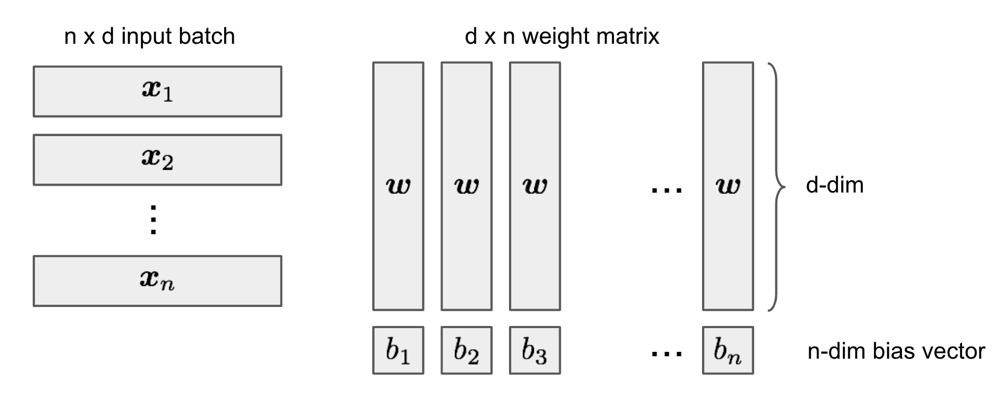

让$a_i = \boldsymbol{x}_i \boldsymbol{w}$，我们希望找到一个合适的$\boldsymbol{w}$和$\boldsymbol{b}$，使得$b_1 < a_1 < b_2 < a_2 < \dots < b_n < a_n$。这总是可以实现的，因为我们试图用$n$个约束解决$n+d$个未知变量，并且$\boldsymbol{x}_i$是独立的（即选择一个随机的$\boldsymbol{w}$，对$\boldsymbol{x}_i \boldsymbol{w}$进行排序，然后将$b_j$设置为中间值）。然后$\mathbf{M}_\text{ReLU}$变成一个下三角矩阵：

$$ \mathbf{M}_\text{ReLU} = [a_i - b_j]_{i \times j} = \begin{bmatrix} a_1 - b_1 & 0 & 0 & \dots & 0 \\ \vdots & \ddots & & & \vdots \\ a_i - b_1 & \dots & a_i - b_i & \dots & 0\\ \vdots & & & \ddots & \vdots \\ a_n - b_1 & a_n - b_2 & \dots & \dots & a_n - b_n \\ \end{bmatrix} $$

由于$\det(\mathbf{M}_\text{ReLU}) \neq 0$，它是一个非奇异方阵，因此我们总是可以找到合适的$\boldsymbol{v}$来解决$\boldsymbol{v}\mathbf{M}_\text{ReLU}=\boldsymbol{y}$（换句话说，$\mathbf{M}_\text{ReLU}$的列空间是$\mathbb{R}^n$的全部，我们可以找到列向量的线性组合以获得任何$\boldsymbol{y}$）。

## 深度神经网络可以学习随机噪声

众所周知，双层神经网络是通用逼近器，看到它们能够完美地学习无结构的随机噪声并不奇怪，正如[Zhang 等人（2017 年）](https://arxiv.org/abs/1611.03530)所示。如果图像分类数据集的标签被随机洗牌，深度神经网络的高表达能力仍然可以使它们实现接近零的训练损失。这些结果不会因添加正则化项而改变。

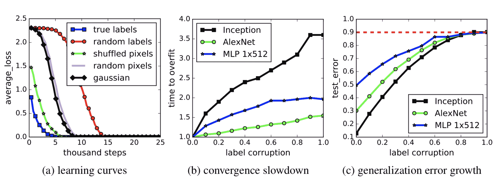

图 1. 在 CIFAR10 上拟合模型，使用随机标签或随机像素：（a）学习曲线；（b-c）标签损坏比例是随机洗牌标签的百分比。（图片来源：[Zhang 等人 2017](https://arxiv.org/abs/1611.03530)）

# 深度学习模型是否过度拟合？

深度学习模型被过度参数化，并且通常可以在训练数据上获得完美的结果。在传统观点中，就像偏差-方差权衡一样，这可能是一场灾难，没有任何东西可能泛化到未见的测试数据。然而，通常情况下，这种“过拟合”（训练误差=0）的深度学习模型仍然在样本外的测试数据上表现良好。嗯...有趣，为什么呢？

## 深度学习的现代风险曲线

传统机器学习使用以下 U 形风险曲线来衡量偏差-方差权衡，并量化模型的泛化能力。如果有人问我如何判断模型是否过拟合，这将是我脑海中首先浮现的事情。

随着模型变得更大（增加更多参数），训练误差降低至接近零，但测试误差（泛化误差）一旦模型复杂度增加到“欠拟合”和“过拟合”之间的阈值，就开始增加。在某种程度上，这与奥卡姆剃刀是一致的。

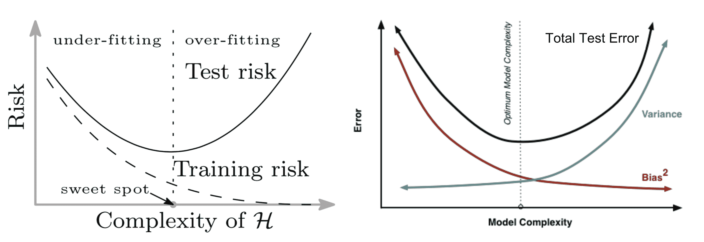

图 2。U 形偏差-方差风险曲线。 (图片来源：(左) [论文](https://arxiv.org/abs/1812.11118) (右) [本文第 6 图](http://scott.fortmann-roe.com/docs/BiasVariance.html))

遗憾的是，这并不适用于深度学习模型。[Belkin et al. (2018)](https://arxiv.org/abs/1812.11118)调和了传统的偏差-方差权衡，并为深度神经网络提出了一个新的双 U 形风险曲线。一旦网络参数的数量足够高，风险曲线就会进入另一个阶段。

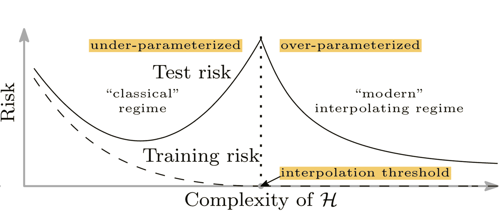

图 3。深度神经网络的新双 U 形偏差-方差风险曲线。 (图片来源：[原始论文](https://arxiv.org/abs/1812.11118))

该论文声称这可能是由于两个原因：

+   参数的数量并不是*归纳偏差*的良好度量，归纳偏差被定义为学习算法的一组假设，用于预测未知样本。在后文的章节中更多讨论深度学习模型的复杂性。

+   配备更大的模型，我们可能能够发现更大的函数类，并进一步找到具有较小范数且因此“更简单”的插值函数。

双 U 形风险曲线是根据实证观察得出的，如论文所示。然而，我在努力尝试重现结果时遇到了一些困难。虽然有一些迹象表明，但为了生成类似于定理中的漂亮平滑曲线，实验中的许多细节必须被注意到。

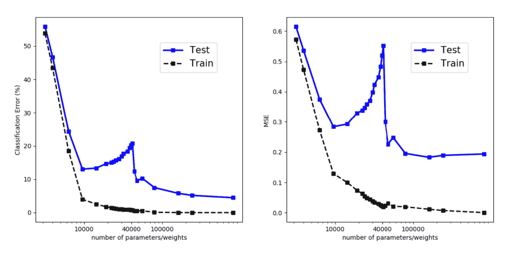

图 4。训练和评估错误的一个隐藏层 fc 网络，训练了不同数量的隐藏单元，从 MNIST 中采样了 4000 个数据点。 (图片来源：[原始论文](https://arxiv.org/abs/1812.11118))

## 正则化不是泛化的关键

正则化是控制过拟合和提高模型泛化性能的常见方法。有趣的是，一些研究（[Zhang 等人，2017](https://arxiv.org/abs/1611.03530)）表明，显式正则化（即数据增强、权重衰减和丢弃）既不是必要的也不足以减少泛化误差。

以在 CIFAR10 上训练的 Inception 模型为例（见图 5），正则化技术有助于样本外泛化，但作用不大。没有单一的正则化似乎是关键的，独立于其他项。因此，正则化器不太可能是泛化的*根本原因*。

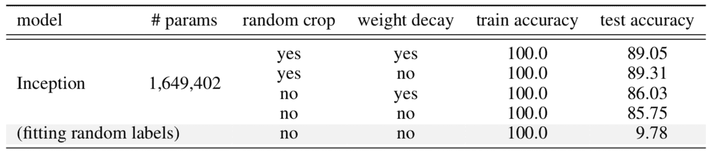

图 5。在 CIFAR10 上训练的 Inception 模型的准确性，采用不同组合的数据增强和权重衰减。 （图片来源：原论文中的表 1 [原始论文](https://arxiv.org/abs/1611.03530)）

## 内在维度

参数数量与深度学习领域中模型过拟合无关，这表明参数计数不能指示深度神经网络的真实复杂性。

除了参数计数外，研究人员提出了许多量化这些模型复杂性的方法，例如模型的自由度数量（[Gao＆Jojic，2016](https://arxiv.org/abs/1603.09260)）或预测代码（[Blier＆Ollivier，2018](https://arxiv.org/abs/1802.07044)）。

我想讨论一种最近在这个问题上的方法，名为**内在维度**（[Li 等人，2018](https://arxiv.org/abs/1804.08838)）。内在维度直观易测量，同时仍揭示了不同规模模型的许多有趣属性。

考虑到具有大量参数的神经网络形成了一个高维参数空间，学习发生在这个高维*目标景观*上。参数空间流形的形状至关重要。例如，更平滑的流形有利于通过提供更具预测性的梯度和允许更大的学习速率来进行优化——这被认为是批量归一化成功稳定训练的原因（[Santurkar 等人，2019](https://arxiv.org/abs/1805.11604)）。

尽管参数空间很大，幸运的是我们不必太担心优化过程陷入局部最优解，因为已经[显示](https://arxiv.org/abs/1406.2572)目标景观中的局部最优点几乎总是位于鞍点而不是山谷中。换句话说，总是有一组包含路径的维度可以离开局部最优解并继续探索。

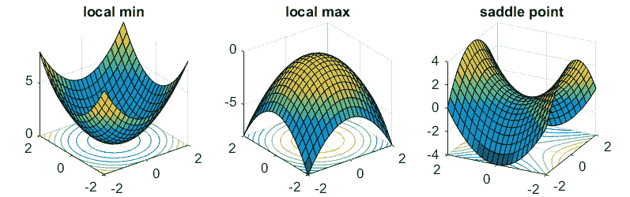

图 6。参数优化景观上各种类型的临界点的插图。（图片来源：[这里](https://www.offconvex.org/2016/03/22/saddlepoints/)）

内在维度测量背后的一个直觉是，由于参数空间具有如此高的维度，可能并不需要利用所有维度来有效学习。如果我们只在目标景观的一个切片上移动仍然可以学习到一个好的解决方案，那么由参数计数得出的结果模型复杂性可能比看起来要低。这本质上是内在维度试图评估的内容。

假设一个模型有$D$个维度，其参数表示为$\theta^{(D)}$。为了学习，会随机抽样一个较小的$d$维子空间，$\theta^{(d)}$，其中$d < D$。在一个优化更新期间，不是根据所有$D$个维度采取梯度步骤，而是仅使用较小的子空间$\theta^{(d)}$并重新映射以更新模型参数。

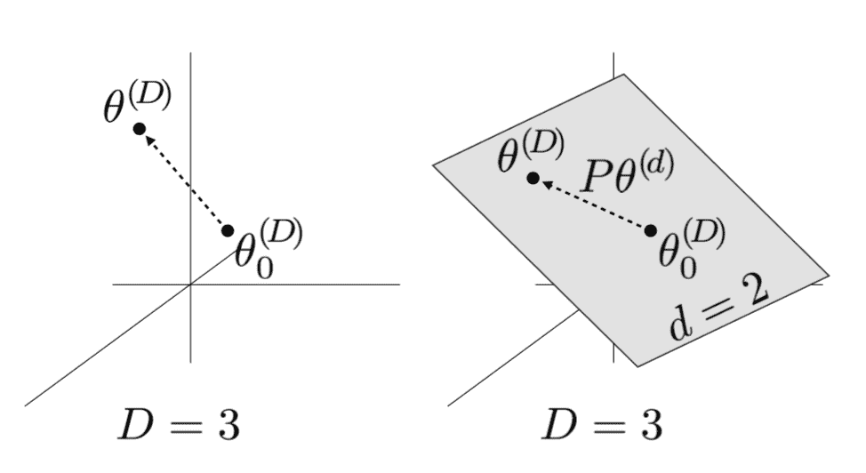

图 7。当$D=3$时，直接优化的参数向量示意图。（图片来源：[原始论文](https://arxiv.org/abs/1804.08838)）

梯度更新公式如下所示：

$$ \theta^{(D)} = \theta_0^{(D)} + \mathbf{P} \theta^{(d)} $$

其中$\theta_0^{(D)}$是初始化值，$\mathbf{P}$是一个$D \times d$的投影矩阵，在训练之前随机抽样。$\theta_0^{(D)}$和$\mathbf{P}$在训练期间都是不可训练的，固定的。$\theta^{(d)}$初始化为全零。

通过搜索$d = 1, 2, \dots, D$的取值，当解决方案出现时对应的$d$被定义为*内在维度*。

结果表明，许多问题的内在维度远小于参数数量。例如，在 CIFAR10 图像分类中，一个具有 650k+参数的全连接网络仅具有 9k 的内在维度，而包含 62k 参数的卷积网络甚至具有更低的内在维度 2.9k。

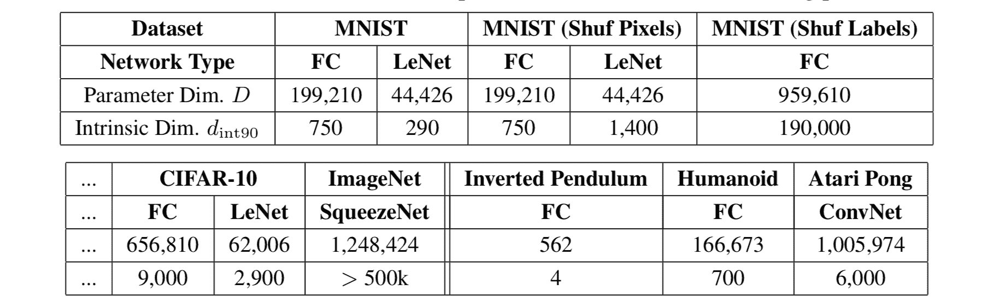

图 8。实现 90%最佳性能的各种模型的测得内在维度$d$。（图片来源：[原始论文](https://arxiv.org/abs/1804.08838)）

内在维度的测量表明，深度学习模型比它们看起来要简单得多。

## 异构层鲁棒性

[Zhang 等人（2019）](https://arxiv.org/abs/1902.01996)研究了不同层参数的作用。论文提出的基本问题是：“所有层是否平等？”简短的答案是：不。模型对某些层的变化更敏感，而对其他层则不敏感。

该论文提出了两种操作类型，可以应用于第$\ell$层的参数，$\ell = 1, \dots, L$，在时间$t$，$\theta^{(\ell)}_t$，以测试它们对模型鲁棒性的影响：

+   **重新初始化**：将参数重置为初始值，$\theta^{(\ell)}_t \leftarrow \theta^{(\ell)}_0$。层$\ell$重新初始化后网络的性能被称为层$\ell$的*重新初始化稳健性*。

+   **重新随机化**：随机重新采样层的参数，$\theta^{(\ell)}_t \leftarrow \tilde{\theta}^{(\ell)} \sim \mathcal{P}^{(\ell)}$。相应的网络性能称为层$\ell$的*重新随机化稳健性*。

可以通过这两种操作将层分为两类：

+   **稳健层**：在重新初始化或重新随机化层后，网络没有或只有微不足道的性能下降。

+   **关键层**：其他情况。

在全连接和卷积网络上观察到类似的模式。重新随机化任何一层*完全破坏*了模型性能，因为预测立即降至随机猜测。更有趣和令人惊讶的是，当应用重新初始化时，只有第一层或前几层（最接近输入层的层）是关键的，而重新初始化更高层导致性能*仅微不足道*的下降。


图 9\. (a) 在 MNIST 上训练的 fc 网络。每一行对应网络中的一层。第一列是每一层的重新随机化稳健性，其余列表示不同训练时间下的重新初始化稳健性。(b) 在 CIFAR 10 上训练的 VGG11 模型（卷积网络）。与(a)中类似的表示，但行和列被转置了。(图片来源：[原始论文](https://arxiv.org/abs/1902.01996))

ResNet 能够在非相邻层之间使用快捷方式重新分配敏感层，而不仅仅是在底部。借助残差块架构，网络可以*均匀地对重新随机化保持稳健*。每个残差块的第一层仍然对重新初始化和重新随机化敏感。如果我们将每个残差块视为一个局部子网络，那么稳健性模式类似于上述的 fc 和卷积网络。

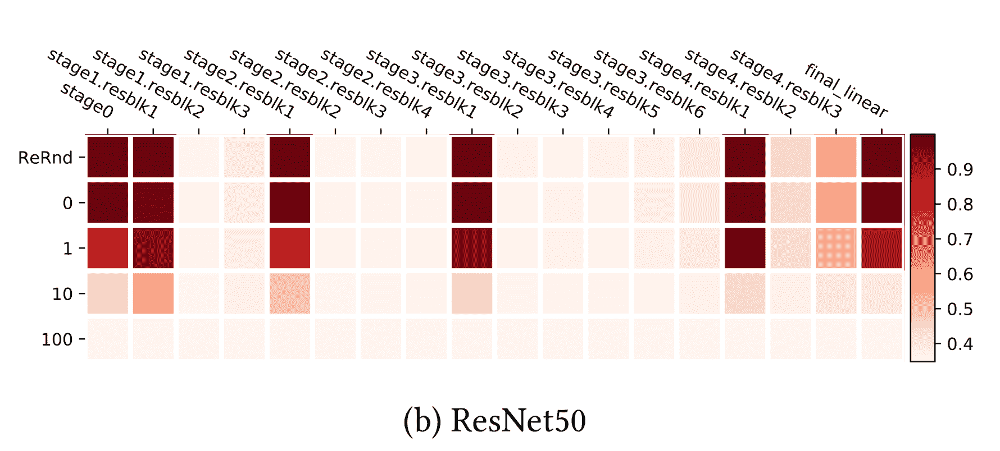

图 10\. 在 CIFAR10 上训练的 ResNet-50 模型中层的重新随机化（第一行）和重新初始化（重置行）稳健性。(图片来源：[原始论文](https://arxiv.org/abs/1902.01996))

基于深度神经网络中许多顶层在重新初始化后对模型性能并不关键的事实，该论文粗略地得出结论：

> “使用随机梯度下降训练的过度容量深度网络由于自我限制关键层的数量而具有低复杂性。”

我们可以将重新初始化视为减少有效参数数量的一种方式，因此这一观察结果与内在维度所展示的一致。

## 中彩票假设

“中奖票”假设（[Frankle & Carbin, 2019](https://arxiv.org/abs/1803.03635)）是另一个引人入胜且鼓舞人心的发现，支持只有网络参数的一个子集对模型性能有影响，因此网络不会过拟合。 “中奖票”假设表明，随机初始化的密集前馈网络包含一个子网络池，其中只有一个子集是*“中奖票”*，当*单独训练*时可以实现最佳性能。

这个想法受到网络修剪技术的启发 —— 移除不必要的权重（即几乎可以忽略的微小权重），而不影响模型性能。尽管最终网络大小可以大幅减小，但从头开始成功训练这样一个被修剪的网络架构是困难的。这感觉就像为了成功训练神经网络，我们需要大量的参数，但一旦模型训练好了，我们并不需要那么多参数来保持准确性。为什么会这样呢？

“中奖票”假设进行了以下实验：

1.  随机初始化一个具有初始化值 $\theta_0$ 的密集前馈网络；

1.  对网络进行多次迭代训练，以获得参数配置 $\theta$ 的良好性能；

1.  在 $\theta$ 上运行修剪，并创建一个掩码 $m$。

1.  “中奖票”初始化配置为 $m \odot \theta_0$。

只训练具有步骤 1 中找到的初始值的小“中奖票”参数子集，模型能够实现与步骤 2 中相同水平的准确性。结果表明，最终解表示中不需要大的参数空间，但在训练中需要，因为它提供了许多更小子网络的初始化配置的大池。

“中奖票”假设为解释和剖析深度神经网络结果开辟了新的视角。许多有趣的后续工作正在进行中。

# 实验

在看到以上所有有趣的发现之后，复现它们应该是非常有趣的。有些结果比其他结果更容易复现。具体细节如下。我的代码可以在 github 上找到 [lilianweng/generalization-experiment](https://github.com/lilianweng/generalization-experiment)。

**DL 模型的新风险曲线**

这是最棘手的一个要复现。作者们给了我很多好建议，我非常感激。以下是他们实验中一些值得注意的设置：

+   没有像权重衰减、dropout 这样的正则化项。

+   在图 3 中，训练集包含 4k 个样本。只进行一次采样，并对所有模型固定。评估使用完整的 MNIST 测试集。

+   每个网络都经过长时间训练，以实现接近零的训练风险。学习率针对不同大小的模型进行了不同的调整。

+   为了使模型在欠参数化区域对初始化不那么敏感，他们的实验采用了*“重复利用权重”*方案：从训练较小的神经网络获得的参数被用作训练较大网络的初始化。

我没有训练或调整每个模型足够长的时间以获得完美的训练性能，但评估错误确实显示了在插值阈值周围的特殊转折，与训练错误不同。例如，对于 MNIST，阈值是训练样本数乘以类别数（10），即 40000。

x 轴是模型参数的数量：（28 * 28 + 1）* num. units + num. units * 10，取对数。

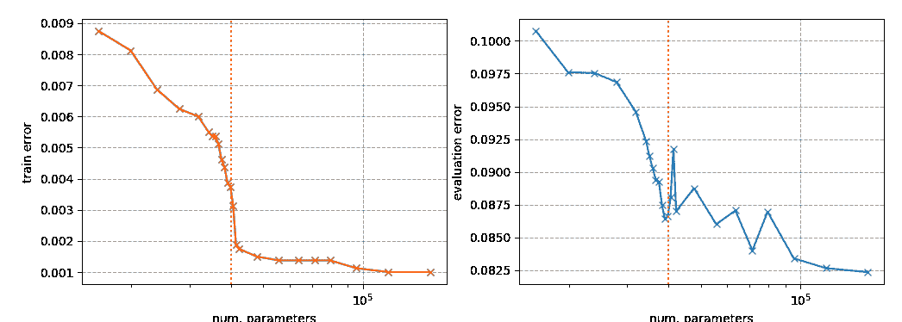

**层并非一视同仁**

这个实验很容易复现。查看我的实现[这里](https://github.com/lilianweng/generalization-experiment/blob/master/layer_equality.py)。

在第一个实验中，我使用了每层有 256 个单元的三层全连接网络。第 0 层是输入层，第 3 层是输出层。该网络在 MNIST 上进行了 100 个 epochs 的训练。

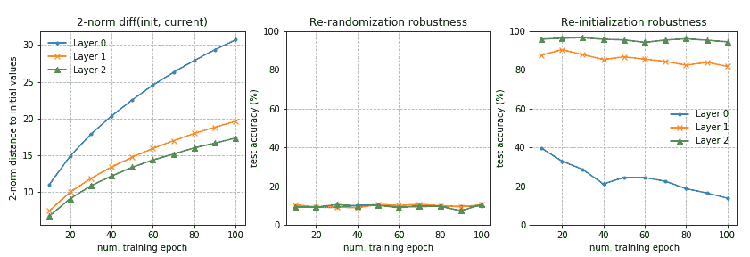

在第二个实验中，我使用了每层有 128 个单元的四层全连接网络。其他设置与实验 1 相同。

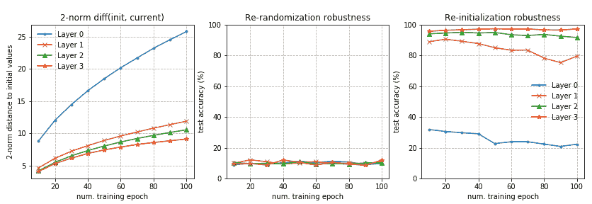

**内在维度测量**

为了正确地将$d$维子空间映射到完整的参数空间，投影矩阵$\mathbf{P}$应具有正交列。因为乘积$\mathbf{P}\theta^{(d)}$是$\mathbf{P}$的列的和，乘以$d$维向量中相应的标量值，$\sum_{i=1}^d \theta^{(d)}_i \mathbf{P}^\top_{(:,i)}$，最好充分利用具有正交列的$\mathbf{P}$中的子空间。

我的实现采用了一种朴素的方法，通过从标准正态分布中抽取独立条目的大矩阵。在高维空间中，预期列是独立的，因此是正交的。当维度不太大时，这种方法有效。当探索大的$d$时，有一些方法可以创建稀疏投影矩阵，这正是内在维度论文建议的。

这里展示了两个网络的实验运行结果：（左）每层有 64 个单元的两层全连接网络和（右）隐藏单元为 128 个的单层全连接网络，在 MNIST 的 10%数据上进行训练。对于每个$d$，模型训练了 100 个 epochs。查看[这里](https://github.com/lilianweng/generalization-experiment/blob/master/intrinsic_dimensions.py)的代码和[这里](https://github.com/lilianweng/generalization-experiment/blob/master/intrinsic_dimensions_measurement.py)。

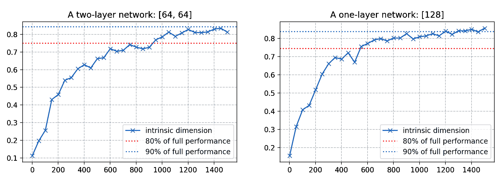

* * *

引用为:

```py
@article{weng2019overfit,
  title   = "Are Deep Neural Networks Dramatically Overfitted?",
  author  = "Weng, Lilian",
  journal = "lilianweng.github.io",
  year    = "2019",
  url     = "https://lilianweng.github.io/posts/2019-03-14-overfit/"
} 
```

# 参考文献

[1] 维基百科关于[奥卡姆剃刀](https://en.wikipedia.org/wiki/Occam%27s_razor)的页面。

[2] [奥卡姆剃刀](http://pespmc1.vub.ac.be/OCCAMRAZ.html) 在 Principia Cybernetica 网站上的页面。

[3] Peter Grunwald。[“最小描述长度原理的教程介绍”](https://arxiv.org/abs/math/0406077)。2004。

[4] Ian Goodfellow 等人。[深度学习](https://www.deeplearningbook.org/)。2016。[Sec 6.4.1](https://www.deeplearningbook.org/contents/mlp.html)。

[5] 张赤远等人。[“理解深度学习需要重新思考泛化。”](https://arxiv.org/abs/1611.03530) ICLR 2017。

[6] Shibani Santurkar 等人。[“批量归一化如何帮助优化？”](https://arxiv.org/abs/1805.11604) NIPS 2018。

[7] Mikhail Belkin 等人。[“调和现代机器学习和偏差-方差权衡。”](https://arxiv.org/abs/1812.11118) arXiv:1812.11118，2018。

[8] Chiyuan Zhang 等人。[“所有层是否平等？”](https://arxiv.org/abs/1902.01996) arXiv:1902.01996，2019。

[9] Chunyuan Li 等人。[“测量客观景观的内在维度。”](https://arxiv.org/abs/1804.08838) ICLR 2018。

[10] Jonathan Frankle 和 Michael Carbin。[“彩票票据假设：寻找稀疏、可训练的神经网络。”](https://arxiv.org/abs/1803.03635) ICLR 2019。
