# 通用语言模型

> [`lilianweng.github.io/posts/2019-01-31-lm/`](https://lilianweng.github.io/posts/2019-01-31-lm/)

2019-02-14 更新：添加[ULMFiT 和 GPT-2。]

2020-02-29 更新：添加[ALBERT。]

2020-10-25 更新：添加[RoBERTa。]

2020-12-13 更新：添加[T5。]

2020-12-30 更新：添加[GPT-3。]

2021-11-13 更新：添加[XLNet、BART 和 ELECTRA；同时更新 Summary 部分。]


图 0\. 我猜它们是 Elmo 和 Bert？（图片来源：[这里](https://www.youtube.com/watch?v=l5einDQ-Ttc)）

我们在 2018 年看到了 NLP 方面的惊人进展。像[OpenAI GPT](https://blog.openai.com/language-unsupervised/)和[BERT](https://arxiv.org/abs/1810.04805)这样的大规模预训练语言模型使用通用模型架构在各种语言任务上取得了出色的表现。这个想法类似于 ImageNet 分类预训练如何帮助许多视觉任务（*）。甚至比视觉分类预训练更好，这种在 NLP 中简单而强大的方法不需要标记的预训练数据，使我们能够尝试增加训练规模，直至极限。

*（*）He 等人（2018）[发现](https://arxiv.org/abs/1811.08883)，对于图像分割任务，预训练可能并非必要。*

在我之前关于词嵌入的 NLP [文章](https://lilianweng.github.io/posts/2017-10-15-word-embedding/)中，介绍的嵌入不是特定上下文的 — 它们是基于词的并发性而不是顺序上下文学习的。因此，在两个句子中，“*我在吃一个苹果*”和“*我有一个苹果手机*”中，两个“苹果”词指的是非常不同的东西，但它们仍然共享相同的词嵌入向量。

尽管如此，早期在问题解决中采用词嵌入的方式是将它们用作现有任务特定模型的附加特征，而且改进是有限的。

在本文中，我们将讨论各种方法是如何提出的，使嵌入依赖于上下文，并使它们更容易、更便宜地应用于一般形式的下游任务。

# CoVe

**CoVe**（[McCann 等人，2017](https://arxiv.org/abs/1708.00107)），简称**上下文词向量**，是由注意力 seq-to-seq 机器翻译模型中的编码器学习的一种词嵌入类型。与此处介绍的传统词嵌入不同，CoVe 词表示是整个输入句子的函数。

## NMT Recap

这里的神经机器翻译([NMT](https://github.com/THUNLP-MT/MT-Reading-List))模型由标准的双层双向 LSTM 编码器和具有注意力机制的双层单向 LSTM 解码器组成。它在英德翻译任务上进行了预训练。编码器学习并优化英语单词的嵌入向量，以便将它们翻译成德语。基于这样的直觉，即编码器应该在将单词转换为另一种语言之前捕捉高级语义和句法含义，编码器输出用于为各种下游语言任务提供上下文化的单词嵌入。

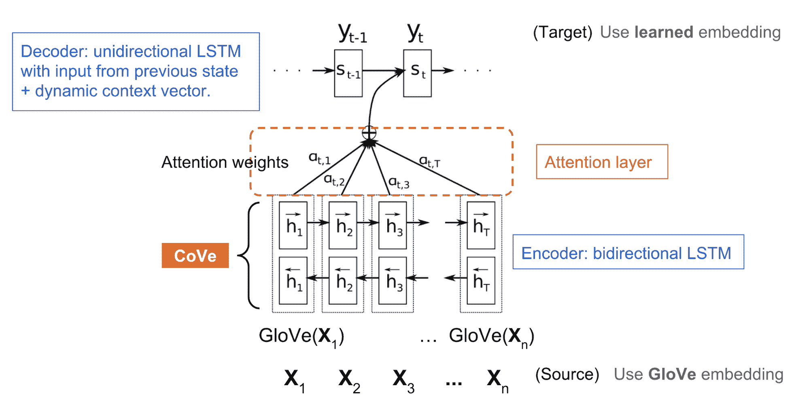

图 1\. CoVe 中使用的 NMT 基础模型。

+   源语言（英语）中的$n$个单词序列：$x = [x_1, \dots, x_n]$。

+   目标语言（德语）中的$m$个单词序列：$y = [y_1, \dots, y_m]$。

+   源单词的[GloVe](https://lilianweng.github.io/posts/2017-10-15-word-embedding/#glove-global-vectors)向量：$\text{GloVe}(x)$。

+   目标单词的随机初始化嵌入向量：$z = [z_1, \dots, z_m]$。

+   biLSTM 编码器输出一系列隐藏状态：$h = [h_1, \dots, h_n] = \text{biLSTM}(\text{GloVe}(x))$，$h_t = [\overrightarrow{h}_t; \overleftarrow{h}_t]$，其中前向 LSTM 计算$\overrightarrow{h}_t = \text{LSTM}(x_t, \overrightarrow{h}_{t-1})$，后向计算给出$\overleftarrow{h}_t = \text{LSTM}(x_t, \overleftarrow{h}_{t-1})$。

+   注意力解码器输出一个关于单词的分布：$p(y_t \mid H, y_1, \dots, y_{t-1})$，其中$H$是沿着时间维度的隐藏状态堆栈$\{h\}$：

$$ \begin{aligned} \text{解码器隐藏状态：} s_t &= \text{LSTM}([z_{t-1}; \tilde{h}_{t-1}], s_{t-1}) \\ \text{注意力权重：} \alpha_t &= \text{softmax}(H(W_1 s_t + b_1)) \\ \text{调整后的上下文隐藏状态：} \tilde{h}_t &= \tanh(W_2[H^\top\alpha_t;s_t] + b_2) \\ \text{解码器输出：} p(y_t\mid H, y_1, \dots, y_{t-1}) &= \text{softmax}(W_\text{out} \tilde{h}_t + b_\text{out}) \end{aligned} $$

## 在下游任务中使用 CoVe

NMT 编码器的隐藏状态被定义为其他语言任务的**上下文向量**：

$$ \text{CoVe}(x) = \text{biLSTM}(\text{GloVe}(x)) $$

该论文建议在问答和分类任务中使用 GloVe 和 CoVe 的串联。GloVe 从全局单词共现比例中学习，因此没有句子上下文，而 CoVe 是通过处理文本序列生成的，能够捕捉上下文信息。

$$ v = [\text{GloVe}(x); \text{CoVe}(x)] $$

给定一个下游任务，我们首先生成输入单词的 GloVe + CoVe 向量的串联，然后将它们作为额外特征输入到任务特定模型中。

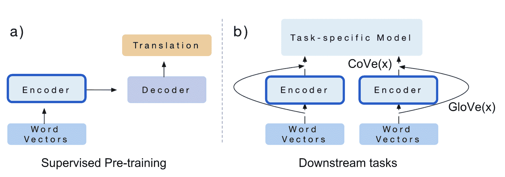

图 2\. CoVe 嵌入是由为机器翻译任务训练的编码器生成的。编码器可以插入到任何下游任务特定模型中。（图片来源：[原始论文](https://arxiv.org/abs/1708.00107)）

**总结**：CoVe 的局限性是显而易见的：（1）预训练受监督翻译任务可用数据集的限制；（2）CoVe 对最终性能的贡献受任务特定模型架构的限制。

在接下来的章节中，我们将看到 ELMo 通过无监督预训练和 OpenAI GPT & BERT 进一步通过无监督预训练+使用生成模型架构来克服这两个问题。

# ELMo

**ELMo**，即**来自语言模型的嵌入**（[Peters, et al, 2018](https://arxiv.org/abs/1802.05365)）通过以*无监督*方式预训练语言模型来学习上下文化的词表示。

## 双向语言模型

双向语言模型（**biLM**）是 ELMo 的基础。输入是一个长度为$n$的标记序列，$(x_1, \dots, x_n)$，语言模型学习预测给定历史的下一个标记的概率。

在前向传播中，历史包含目标标记之前的单词，

$$ p(x_1, \dots, x_n) = \prod_{i=1}^n p(x_i \mid x_1, \dots, x_{i-1}) $$

在反向传播中，历史包含目标标记之后的单词，

$$ p(x_1, \dots, x_n) = \prod_{i=1}^n p(x_i \mid x_{i+1}, \dots, x_n) $$

两个方向的预测由具有隐藏状态$\overrightarrow{\mathbf{h}}_{i,\ell}$和$\overleftarrow{\mathbf{h}}_{i,\ell}$的多层 LSTM 模型建模，用于输入标记$x_i$的层级$\ell=1,\dots,L$。最终层的隐藏状态$\mathbf{h}_{i,L} = [\overrightarrow{\mathbf{h}}_{i,L}; \overleftarrow{\mathbf{h}}_{i,L}]$用于在 softmax 归一化后输出标记的概率。它们共享嵌入层和 softmax 层，分别由参数$\Theta_e$和$\Theta_s$参数化。

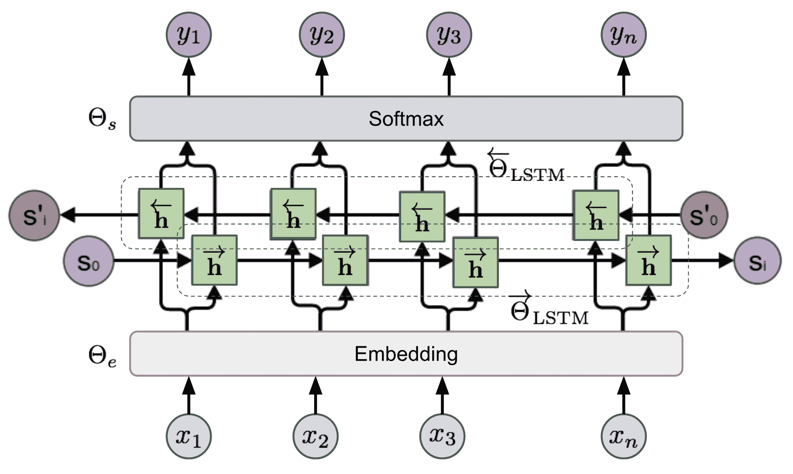

图 3\. ELMo 的双向 LSTM 基础模型。（图片来源：基于["神经网络、类型和函数式编程"](http://colah.github.io/posts/2015-09-NN-Types-FP/)中的图重新创建，作者 Christopher Olah。）

该模型经过训练，以最小化负对数似然（=最大化真实单词的对数似然）的方式进行双向训练：

$$ \begin{aligned} \mathcal{L} = - \sum_{i=1}^n \Big( \log p(x_i \mid x_1, \dots, x_{i-1}; \Theta_e, \overrightarrow{\Theta}_\text{LSTM}, \Theta_s) + \\ \log p(x_i \mid x_{i+1}, \dots, x_n; \Theta_e, \overleftarrow{\Theta}_\text{LSTM}, \Theta_s) \Big) \end{aligned} $$

## ELMo 表示

在一个$L$层的双向语言模型（biLM）之上，ELMo 通过学习任务特定的线性组合将所有层的隐藏状态堆叠在一起。对于标记$x_i$的隐藏状态表示包含$2L+1$个向量：

$$ R_i = \{ \mathbf{h}_{i,\ell} \mid \ell = 0, \dots, L \} $$

其中 $\mathbf{h}_{0, \ell}$ 是嵌入层输出，$\mathbf{h}_{i, \ell} = [\overrightarrow{\mathbf{h}}_{i,\ell}; \overleftarrow{\mathbf{h}}_{i,\ell}]$。

线性组合中的权重 $\mathbf{s}^\text{task}$ 是为每个最终任务学习的，并通过 softmax 进行归一化。缩放因子 $\gamma^\text{task}$ 用于纠正 biLM 隐藏状态分布与任务特定表示分布之间的不对齐。

$$ v_i = f(R_i; \Theta^\text{task}) = \gamma^\text{task} \sum_{\ell=0}^L s^\text{task}_i \mathbf{h}_{i,\ell} $$

为了评估隐藏状态在不同层中捕获的信息类型，ELMo 分别应用于语义密集和语法密集任务，使用 biLM 不同层中的表示：

+   **语义任务**：*词义消歧（WSD）* 任务强调在给定上下文的情况下单词的含义。顶层 biLM 在这个任务上比第一层更好。

+   **语法任务**：*[词性标注](https://en.wikipedia.org/wiki/Part-of-speech_tagging)*（POS）标注任务旨在推断一句话中单词的语法角色。使用 biLM 的第一层比顶层可以获得更高的准确性。

比较研究表明，句法信息在较低层更好地表示，而语义信息则由较高层捕获。因为不同层往往携带不同类型的信息，*将它们堆叠在一起有助于*。

## 在下游任务中使用 ELMo

类似于 CoVe 如何帮助不同的下游任务，ELMo 嵌入向量被包含在输入或任务特定模型的较低层。此外，对于一些任务（即 SNLI 和 SQuAD，但不包括 SRL），将它们添加到输出层也有帮助。

ELMo 带来的改进对于具有小型监督数据集的任务影响最大。使用 ELMo，我们也可以用更少的标记数据达到类似的性能。

**总结**：语言模型的预训练是无监督的，理论上预训练可以尽可能扩展，因为未标记的文本语料库丰富。然而，它仍然依赖于任务定制模型，因此改进仅是渐进的，而为每个任务寻找一个良好的模型架构仍然是非平凡的。

# 跨视图训练

在 ELMo 中，无监督预训练和任务特定学习发生在两个独立模型中的两个单独训练阶段。**跨视图训练**（简称 **CVT**；[Clark et al., 2018](https://arxiv.org/abs/1809.08370)）将它们合并为一个统一的半监督学习过程，其中 biLSTM 编码器的表示通过有标记数据的监督学习和无标记数据的无监督学习在辅助任务上得到改进。

## 模型架构

该模型由两层双向 LSTM 编码器和一个主要预测模块组成。在训练过程中，模型交替接收带标签和未标记的数据批次。

+   在*带标签的示例*上，所有模型参数都通过标准监督学习进行更新。损失是标准的交叉熵。

+   在*未标记的示例*上，主要预测模块仍然可以生成“软”目标，尽管我们无法准确知道它们有多准确。在一些辅助任务中，预测器只看到并处理输入的受限视图，例如只使用编码器隐藏状态表示中的一个方向。期望辅助任务输出与完整输入的主要预测目标匹配。

    这样，编码器被迫将完整上下文的知识提炼成部分表示。在这个阶段，biLSTM 编码器被反向传播，但主要预测模块是*固定的*。损失在于最小化辅助和主要预测之间的距离。

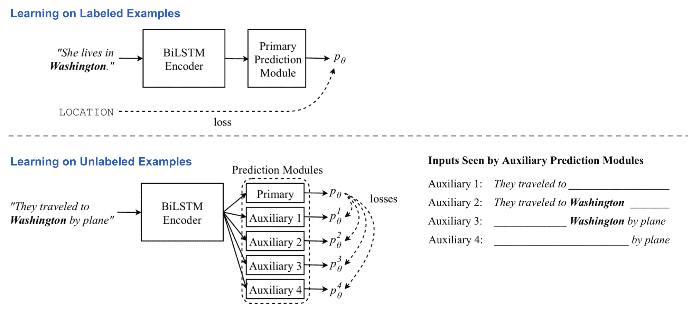

图 4. 半监督语言模型跨视图训练的概述。（图片来源：[原始论文](https://arxiv.org/abs/1809.08370)）

## 多任务学习

当同时训练多个任务时，CVT 为额外任务添加了几个额外的主要预测模型。它们都共享相同的句子表示编码器。在监督训练期间，一旦随机选择一个任务，就会更新其对应预测器和表示编码器中的参数。通过未标记的数据样本，编码器通过最小化辅助输出和每个任务的主要预测之间的差异来跨所有任务联合优化。

多任务学习鼓励更好的表示泛化性，同时产生一个不错的副产品：来自未标记数据的所有任务标记示例。考虑到跨任务标签很有用但相当稀有，它们是宝贵的数据标签。

## 在下游任务中使用 CVT

理论上，主要预测模块可以采用任何形式，通用或特定于任务的设计。CVT 论文中提供的示例包括这两种情况。

在顺序标记任务（对每个标记进行分类）中，如 NER 或 POS 标记，预测器模块包含两个全连接层和一个 softmax 层，用于生成类标签的概率分布。对于每个标记$\mathbf{x}_i$，我们取两层中的相应隐藏状态，$\mathbf{h}_1^{(i)}$ 和 $\mathbf{h}_2^{(i)}$：

$$ \begin{aligned} p_\theta(y_i \mid \mathbf{x}_i) &= \text{NN}(\mathbf{h}^{(i)}) \\ &= \text{NN}([\mathbf{h}_1^{(i)}; \mathbf{h}_2^{(i)}]) \\ &= \text{softmax} \big( \mathbf{W}\cdot\text{ReLU}(\mathbf{W'}\cdot[\mathbf{h}_1^{(i)}; \mathbf{h}_2^{(i)}]) + \mathbf{b} \big) \end{aligned} $$

辅助任务只接收第一层的前向或后向 LSTM 状态。因为它们只观察到部分上下文，要么在左侧要么在右侧，它们必须像语言模型一样学习，尝试根据上下文预测下一个标记。`fwd`和`bwd`辅助任务只采用一个方向。`future`和`past`任务在前向和后向方向上进一步进行一步。

$$ \begin{aligned} p_\theta^\text{fwd}(y_i \mid \mathbf{x}_i) &= \text{NN}^\text{fwd}(\overrightarrow{\mathbf{h}}^{(i)}) \\ p_\theta^\text{bwd}(y_i \mid \mathbf{x}_i) &= \text{NN}^\text{bwd}(\overleftarrow{\mathbf{h}}^{(i)}) \\ p_\theta^\text{future}(y_i \mid \mathbf{x}_i) &= \text{NN}^\text{future}(\overrightarrow{\mathbf{h}}^{(i-1)}) \\ p_\theta^\text{past}(y_i \mid \mathbf{x}_i) &= \text{NN}^\text{past}(\overleftarrow{\mathbf{h}}^{(i+1)}) \end{aligned} $$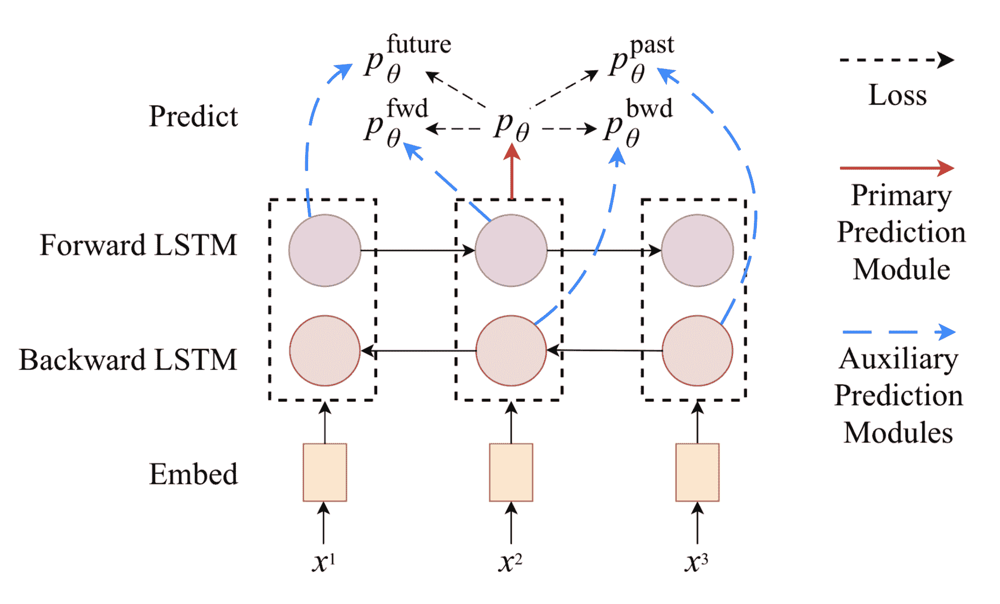

图 5。顺序标记任务依赖于四个辅助预测模型，它们的输入只涉及单向隐藏状态：前向、后向、未来和过去。（图片来源：[原论文](https://arxiv.org/abs/1809.08370)）

注意，如果主要的预测模块使用了 dropout，在使用标记数据进行训练时，dropout 层会像平常一样工作，但在使用无标签数据进行训练时，不会应用于生成辅助任务的“软”目标。

在机器翻译任务中，主要的预测模块被标准的单向 LSTM 解码器与注意力所取代。有两个辅助任务：（1）通过随机将一些值归零来在注意力权重向量上应用 dropout；（2）预测目标序列中的未来单词。辅助任务的主要预测是通过在输入序列上运行固定的主要解码器并使用[束搜索](https://en.wikipedia.org/wiki/Beam_search)产生的最佳预测目标序列来匹配的。

# ULMFiT

使用生成式预训练 LM + 任务特定微调的想法首次在 ULMFiT 中探索（[Howard & Ruder, 2018](https://arxiv.org/abs/1801.06146)），直接受到使用 ImageNet 预训练进行计算机视觉任务成功的启发。基础模型是[AWD-LSTM](https://arxiv.org/abs/1708.02182)。

ULMFiT 遵循三个步骤来在下游语言分类任务上实现良好的迁移学习结果：

1.  *通用 LM 预训练*：在维基百科文本上。

1.  *目标任务 LM 微调*：ULMFiT 提出了两种训练技术来稳定微调过程。见下文。

+   **区分性微调**的动机是 LM 的不同层捕获不同类型的信息（见上面的讨论）。ULMFiT 建议使用不同的学习率$\{\eta¹, \dots, \eta^\ell, \dots, \eta^L\}$微调每一层，其中$\eta$是第一层的基础学习率，$\eta^\ell$是第$\ell$层的学习率，总共有$L$层。

+   **倾斜三角形学习率（STLR）** 是指一种特殊的学习率调度，首先线性增加学习率，然后线性衰减。增加阶段很短，使模型能够快速收敛到适合任务的参数空间，而衰减期较长，可以更好地进行微调。

1.  *目标任务分类器微调*：预训练的 LM 通过两个标准前馈层和最后的 softmax 归一化来预测目标标签分布。

+   **连接池** 从隐藏状态的历史中提取最大池化和平均池化，并将它们与最终隐藏状态连接起来。

+   **渐进解冻** 通过逐渐解冻模型层来避免灾难性遗忘，从最后一层开始逐渐解冻。首先解冻最后一层，并进行一轮微调。然后解冻下一层。重复此过程，直到所有层都被微调。

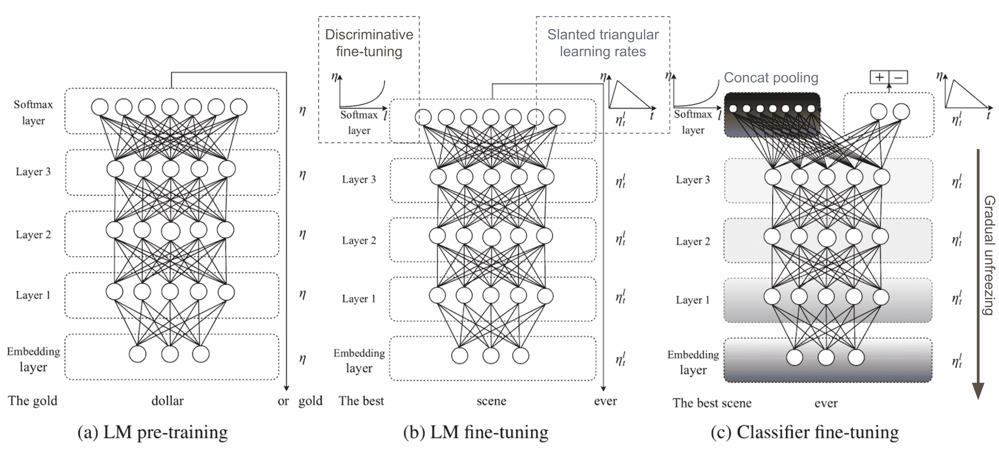

图 6. ULMFiT 的三个训练阶段。（图片来源：[原始论文](https://arxiv.org/abs/1801.06146)）

# GPT

遵循 ELMo 的类似思想，OpenAI **GPT**，即**生成式预训练 Transformer**（[Radford 等，2018](https://s3-us-west-2.amazonaws.com/openai-assets/research-covers/language-unsupervised/language_understanding_paper.pdf)），通过在巨大的自由文本语料库上进行训练，将无监督语言模型扩展到更大规模。尽管有相似之处，但 GPT 与 ELMo 有两个主要区别。

1.  模型架构不同：ELMo 使用独立训练的从左到右和从右到左的多层 LSTM 浅层连接，而 GPT 是多层 Transformer 解码器。

1.  在下游任务中使用上下文化嵌入不同：ELMo 将嵌入馈送到为特定任务定制的模型中作为附加特征，而 GPT 为所有最终任务微调相同的基础模型。

## Transformer 解码器作为语言模型

与[原始 Transformer](https://arxiv.org/abs/1706.03762)架构相比，[Transformer 解码器](https://arxiv.org/abs/1801.10198)模型丢弃了编码器部分，因此只有一个单独的输入句子，而不是两个独立的源序列和目标序列。

该模型在输入序列的嵌入上应用多个 Transformer 块。每个块包含一个掩码的*多头自注意力*层和一个*逐点前馈*层。在 softmax 归一化后，最终输出产生目标标记的分布。

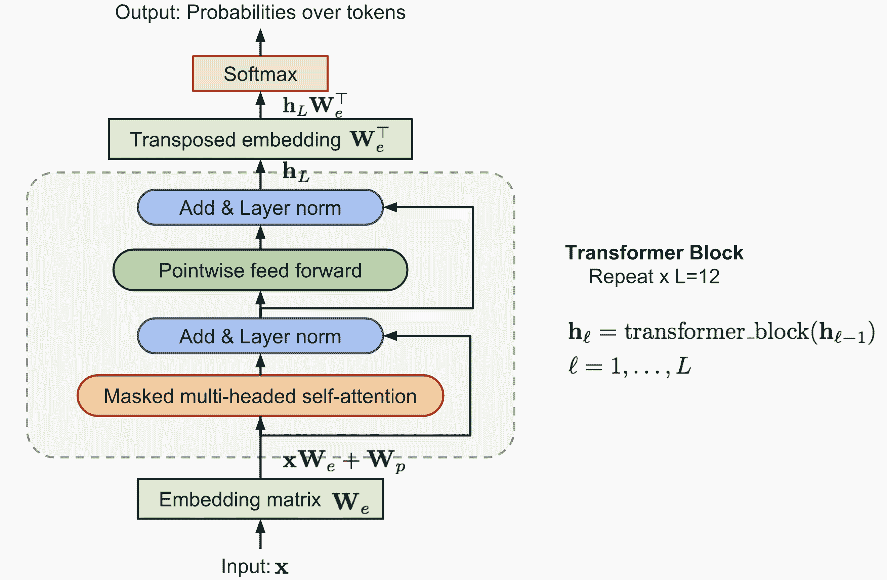

图 7. OpenAI GPT 中的 Transformer 解码器模型架构。

损失是负对数似然，与 ELMo 相同，但没有反向计算。假设大小为$k$的上下文窗口位于目标词之前，损失将如下所示：

$$ \mathcal{L}_\text{LM} = -\sum_{i} \log p(x_i\mid x_{i-k}, \dots, x_{i-1}) $$

## 字节对编码

**字节对编码**（[**BPE**](https://arxiv.org/abs/1508.07909)）用于编码输入序列。BPE 最初是在 1990 年代作为数据压缩算法提出的，后来被采用来解决机器翻译中的开放词汇问题，因为在翻译成新语言时很容易遇到罕见和未知的单词。受到罕见和未知单词通常可以分解为多个子词的直觉启发，BPE 通过迭代和贪婪地合并频繁的字符对找到最佳的单词分割。

## 监督微调

OpenAI GPT 提出的最重要的升级是摆脱特定任务模型，直接使用预训练的语言模型！

以分类为例。假设在标记的数据集中，每个输入有$n$个标记，$\mathbf{x} = (x_1, \dots, x_n)$，一个标签$y$。GPT 首先通过预训练的变压器解码器处理输入序列$\mathbf{x}$，最后一个标记$x_n$的最后一层输出为$\mathbf{h}_L^{(n)}$。然后，只需一个新的可训练权重矩阵$\mathbf{W}_y$，就可以预测类标签的分布。

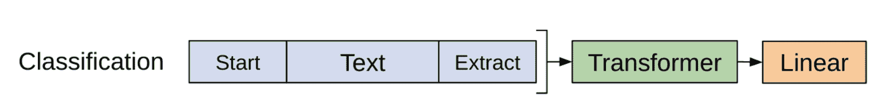$$ P(y\mid x_1, \dots, x_n) = \text{softmax}(\mathbf{h}_L^{(n)}\mathbf{W}_y) $$

损失函数是为了最小化真实标签的负对数似然。此外，将 LM 损失作为辅助损失添加是有益的，因为：

+   (1) 它有助于加速训练过程的收敛

+   (2) 预计将改善监督模型的泛化能力。

$$ \begin{aligned} \mathcal{L}_\text{cls} &= \sum_{(\mathbf{x}, y) \in \mathcal{D}} \log P(y\mid x_1, \dots, x_n) = \sum_{(\mathbf{x}, y) \in \mathcal{D}} \log \text{softmax}(\mathbf{h}_L^{(n)}(\mathbf{x})\mathbf{W}_y) \\ \mathcal{L}_\text{LM} &= -\sum_{i} \log p(x_i\mid x_{i-k}, \dots, x_{i-1}) \\ \mathcal{L} &= \mathcal{L}_\text{cls} + \lambda \mathcal{L}_\text{LM} \end{aligned} $$

采用类似的设计，其他端任务不需要定制的模型结构（参见图 7）。如果任务输入包含多个句子，那么在每对句子之间添加一个特殊的分隔符标记（`$`）。这个分隔符标记的嵌入是我们需要学习的新参数，但应该非常小。

对于句子相似性任务，因为顺序不重要，两种顺序都包含在内。对于多项选择任务，上下文与每个答案候选项配对。

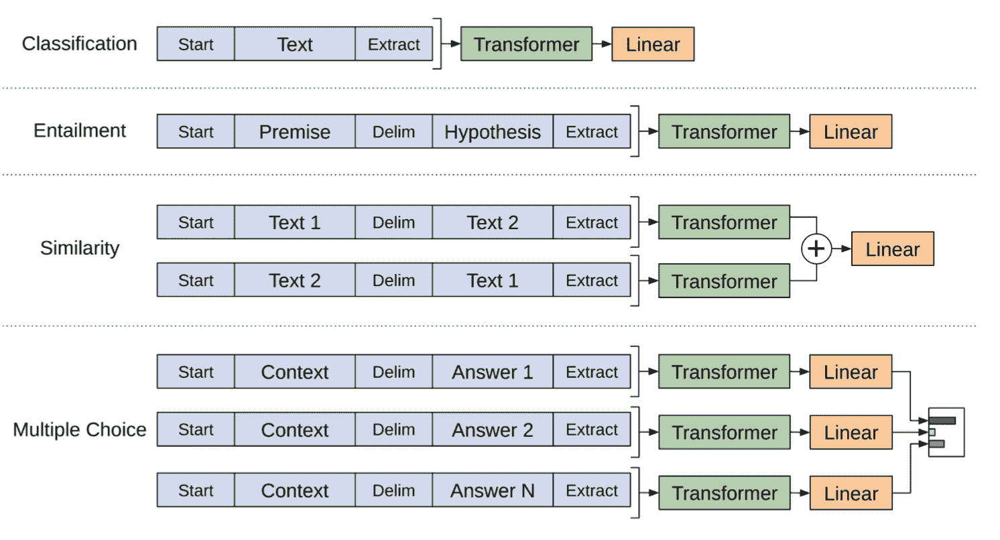

图 8. 对下游任务进行轻微修改的 GPT 变压器模型的训练对象。（图片来源：[原始论文](https://s3-us-west-2.amazonaws.com/openai-assets/research-covers/language-unsupervised/language_understanding_paper.pdf)）

**摘要**：看到这样一个通用框架能够在当时（2018 年 6 月）击败大多数语言任务的 SOTA 是非常整洁和鼓舞人心的。在第一阶段，语言模型的生成式预训练可以吸收尽可能多的自由文本。然后在第二阶段，模型在具有少量标记数据集和最小一组新参数的特定任务上进行微调学习。

GPT 的一个局限性是其单向性 —— 该模型只被训练来预测未来的从左到右的上下文。

# BERT

**BERT**，全称**双向编码器表示来自变压器**（[Devlin, et al., 2019](https://arxiv.org/abs/1810.04805)）是 GPT 的直接后裔：在自由文本上训练一个大型语言模型，然后在不使用定制网络架构的情况下对特定任务进行微调。

与 GPT 相比，BERT 最大的区别和改进在于使训练**双向**。该模型学会预测左侧和右侧的上下文。根据消融研究，论文声称：

> “我们模型的双向性质是最重要的新贡献”

## 预训练任务

BERT 的模型架构是一个多层双向变压器编码器。

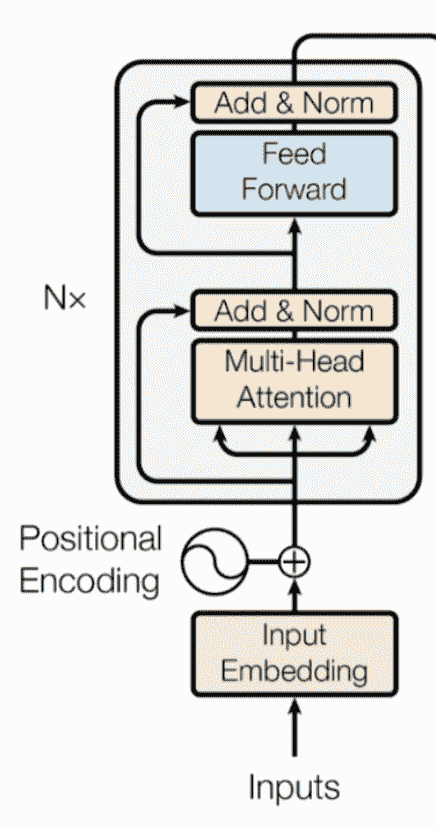

图 9. 变压器编码器模型架构回顾。（图片来源：[变压器论文](https://arxiv.org/abs/1706.03762)）

为了鼓励双向预测和句子级理解，BERT 训练了两个任务，而不是基本的语言任务（即根据上下文预测下一个标记）。

***任务 1：掩码语言模型（MLM）**

> 来自[Wikipedia](https://en.wikipedia.org/wiki/Cloze_test)：“闭式测试（也称为闭式删除测试）是一种练习、测试或评估，由一部分语言组成，其中某些项目、单词或符号被删除（闭式文本），参与者被要求替换缺失的语言项目。…该练习最早由 W.L.泰勒在 1953 年描述。”

通过训练*“掩码语言模型”任务*，可以毫不奇怪地认为，学习单词周围而不仅仅是单词后面的上下文的表示能够更好地捕捉其含义，无论是在句法上还是语义上。BERT 通过这种方式鼓励模型：

1.  随机掩码每个序列中的 15%的标记。因为如果我们只用特殊占位符`[MASK]`替换掩码标记，那么在微调过程中永远不会遇到这个特殊标记。因此，BERT 采用了几种启发式技巧：

    +   (a) 以 80%的概率，用`[MASK]`替换选定的单词；

    +   (b) 以 10%的概率，随机替换为一个单词；

    +   (c) 以 10%的概率，保持不变。

1.  该模型只预测缺失的单词，但它没有信息表明哪些单词已被替换或应该被预测。输出大小仅为输入大小的 15%。

**任务 2：下一个句子预测**

受到许多下游任务涉及句子之间关系理解的事实的启发（即，QA、NLI），BERT 在训练中增加了另一个辅助任务，即训练一个用于告知一个句子是否是另一个句子的下一个句子的 *二元分类器*：

1.  样本句对 (A, B) 使得：

    +   (a) 50% 的时间，B 跟随 A；

    +   (b) 50% 的时间，B 不跟随 A。

1.  该模型处理两个句子并输出一个二进制标签，指示 B 是否是 A 的下一个句子。

上述两个辅助任务的训练数据可以轻松地从任何单语语料库中生成。因此，训练规模是不受限制的。训练损失是平均掩码语言模型似然和平均下一个句子预测似然的总和。

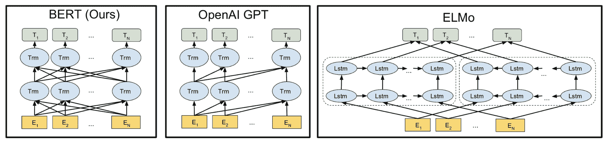

图 10\. BERT、OpenAI GPT 和 ELMo 模型架构的比较。 (图片来源：[原始论文](https://arxiv.org/abs/1810.04805))

## 输入嵌入

输入嵌入是三个部分的总和：

1.  *WordPiece 分词嵌入*：[WordPiece](https://static.googleusercontent.com/media/research.google.com/en//pubs/archive/37842.pdf) 模型最初是为日语或韩语分词问题提出的。它们可以将英语单词进一步分割为更小的子词单元，以便更有效地处理罕见或未知单词。如果感兴趣，请阅读 [链接的](https://static.googleusercontent.com/media/research.google.com/en//pubs/archive/37842.pdf) [论文](https://arxiv.org/pdf/1609.08144.pdf) 以了解拆分单词的最佳方式。

1.  *段落嵌入*：如果输入包含两个句子，则它们分别具有句子 A 嵌入和句子 B 嵌入，并且它们由特殊字符 `[SEP]` 分隔；如果输入只包含一个句子，则仅使用句子 A 嵌入。

1.  *位置嵌入*：位置嵌入是学习而不是硬编码的。

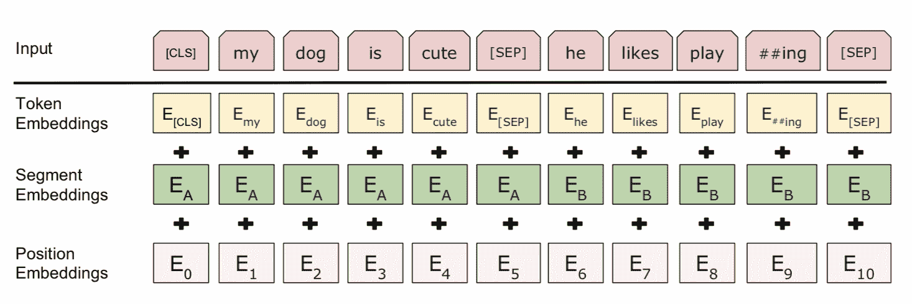

图 11\. BERT 输入表示。 (图片来源：[原始论文](https://arxiv.org/abs/1810.04805))

请注意，第一个标记始终被强制为 `[CLS]` —— 一个稍后将用于下游任务中预测的占位符。

## 使用 BERT 在下游任务中

BERT 微调只需要添加一些新参数，就像 OpenAI GPT 一样。

对于分类任务，我们通过取特殊的第一个标记 `[CLS]` 的最终隐藏状态 $\mathbf{h}^\text{[CLS]}_L$，并将其与一个小的权重矩阵相乘，$\text{softmax}(\mathbf{h}^\text{[CLS]}_L \mathbf{W}_\text{cls})$ 来得到预测。

对于像 SQuAD 这样的 QA 任务，我们需要预测给定问题的给定段落中的文本跨度。BERT 预测每个标记的两个概率分布，即文本跨度的开始和结束。只有两个新的小矩阵，$\mathbf{W}_\text{s}$和$\mathbf{W}_\text{e}$，在微调期间新学习，$\text{softmax}(\mathbf{h}^\text{(i)}_L \mathbf{W}_\text{s})$和$\text{softmax}(\mathbf{h}^\text{(i)}_L \mathbf{W}_\text{e})$定义了两个概率分布。

总体上，用于最终任务微调的附加部分非常少——只有一个或两个权重矩阵将 Transform 隐藏状态转换为可解释的格式。查看其他情况的实现细节，请参考论文。

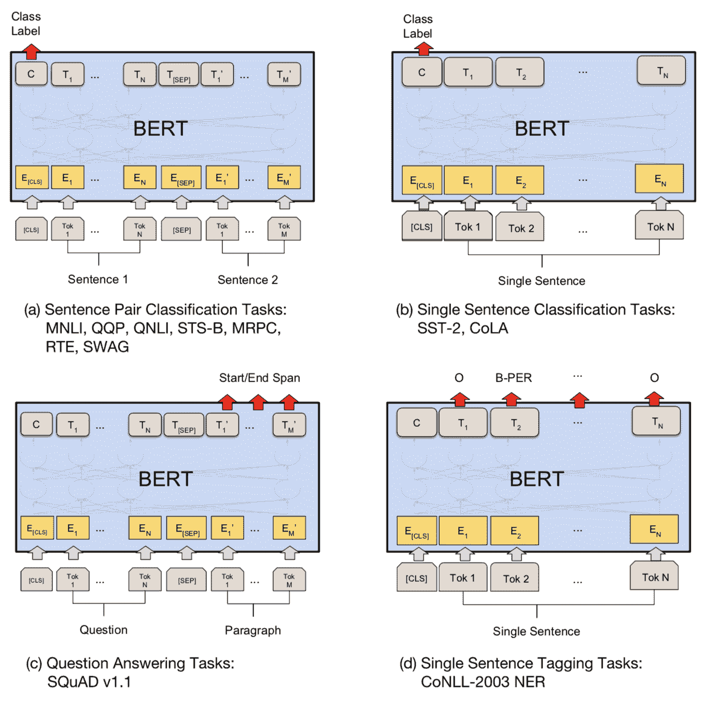

图 12. 修改后的 BERT 模型在下游任务中的训练对象。（图片来源：[原论文](https://arxiv.org/abs/1810.04805)）

一张总结表比较了 OpenAI GPT 和 BERT 的微调之间的差异。

| | **OpenAI GPT** | **BERT** | | 特殊字符 | `[SEP]`和`[CLS]`仅在微调阶段引入。 | `[SEP]`和`[CLS]`以及句子 A/B 嵌入在预训练阶段学习。 | | 训练过程 | 100 万步，批量大小 32k 个单词。 | 100 万步，批量大小 128k 个单词。 | | 微调 | 所有微调任务的学习率为 5e-5。 | 使用任务特定的学习率进行微调。 |
| --- | --- | --- | --- | --- | --- | --- | --- | --- | --- | --- | --- | --- | --- | --- |

# ALBERT

**ALBERT**（[Lan 等人，2019](https://arxiv.org/abs/1909.11942)），简称**A Lite BERT**，是 BERT 模型的轻量级版本。与类似配置的 BERT 模型相比，ALBERT 模型的训练速度可以提高 1.7 倍，参数数量减少 18 倍。ALBERT 包含三个改变：前两个有助于减少参数和内存消耗，从而加快训练速度，而第三个提出了一个更具挑战性的训练任务，以取代下一个句子预测（NSP）目标。

## 因子化嵌入参数化

在 BERT 中，WordPiece 标记化嵌入大小$E$被配置为与隐藏状态大小$H$相同。也就是说，如果我们想增加模型大小（更大的$H$），我们需要学习更大的标记化嵌入，这是昂贵的，因为它取决于词汇量（$V$）。

从概念上讲，由于标记化嵌入预计学习*与上下文无关*的表示，而隐藏状态是*与上下文相关*的，因此将隐藏层的大小与词汇表嵌入的大小分开是有道理的。使用因子化嵌入参数化，大小为$V \times H$的大词汇表嵌入矩阵被分解为大小为$V \times E$和$E \times H$的两个小矩阵。给定$H \gt E$甚至$H \gg E$，因子化可以显著减少参数。

## 跨层参数共享

跨层参数共享可以通过多种方式实现：(a) 仅共享前向传播部分；(b) 仅共享注意力参数；或者(c) 共享所有参数。这种技术大大减少了参数数量，而且并不会对性能造成太大损害。

## 句子顺序预测（SOP）

有趣的是，BERT 的下一句预测（NSP）任务结果太容易了。相反，ALBERT 采用了句子顺序预测（SOP）[自监督](https://lilianweng.github.io/posts/2019-11-10-self-supervised/) 损失，

+   正样本：同一文档中的两个连续片段。

+   负样本：与上述相同，但是段落顺序被交换。

对于 NSP 任务，如果模型能够检测到 A 和 B 来自不同上下文时的主题，那么模型可以做出合理的预测。相比之下，SOP 更难，因为它要求模型完全理解段落之间的连贯性和顺序。

# GPT-2

[OpenAI](https://blog.openai.com/better-language-models/)的[GPT-2](https://d4mucfpksywv.cloudfront.net/better-language-models/language_models_are_unsupervised_multitask_learners.pdf)语言模型是 GPT 的直接继承者。GPT-2 有 15 亿参数，比原始 GPT 多 10 倍，它在零-shot 转移设置下在 8 个测试语言建模数据集中的 7 个上取得了 SOTA 结果，而且没有进行任何特定任务的微调。预训练数据集包含通过从[Reddit](https://www.reddit.com/)爬取合格的外链收集的 800 万个网页。OpenAI GPT-2 在小数据集和用于衡量*长期依赖性*的数据集上的大幅改进特别明显。

## 零-shot 转移

GPT-2 的预训练任务仅仅是语言建模。所有下游语言任务都被构建为预测条件概率，没有进行任何特定任务的微调。

+   使用 LM 进行文本生成很简单。

+   机器翻译任务，例如从英语到中文，是通过将语言模型与“英语句子 = 中文句子”和“目标英语句子 =”配对来诱导的。

    +   例如，用于预测的条件概率可能如下所示：`P(? | I like green apples. = 我喜欢绿苹果。 A cat meows at him. = 一只猫对他喵。It is raining cats and dogs. =")`

+   QA 任务的格式与在上下文中的问题和答案的翻译类似。

+   摘要任务是通过在上下文中的文章后添加`TL;DR:`来诱导的。

## BPE 对字节序列进行编码

与原始 GPT 一样，GPT-2 使用 BPE 但在[UTF-8](https://en.wikipedia.org/wiki/UTF-8)字节序列上。每个字节可以用 8 位表示 256 个不同的值，而 UTF-8 可以使用最多 4 个字节表示一个字符，支持总共$2^{31}$个字符。因此，使用字节序列表示，我们只需要一个大小为 256 的词汇表，不需要担心预处理、标记化等问题。尽管有这些好处，当前的字节级语言模型仍然与 SOTA 单词级语言模型存在着不可忽视的性能差距。

BPE 以贪婪的方式合并频繁共现的字节对。为了防止生成常见单词的多个版本（例如`dog.`, `dog!`和`dog?`对于单词`dog`），GPT-2 阻止 BPE 跨类别合并字符（因此`dog`不会与标点符号如`.`、`!`和`?`合并）。这些技巧有助于提高最终字节分割的质量。

使用字节序列表示，GPT-2 能够为任何 Unicode 字符串分配概率，而不受任何预处理步骤的影响。

## 模型修改

与 GPT 相比，除了拥有更多的变压器层和参数外，GPT-2 仅包含少量架构修改：

+   [层归一化](https://arxiv.org/abs/1607.06450)被移动到每个子块的输入端，类似于类型为[“building block”](https://arxiv.org/abs/1603.05027)的残差单元（与原始类型[“bottleneck”](https://arxiv.org/abs/1512.03385)不同，它在权重层之前应用了批量归一化）。

+   在最终的自注意力块之后添加了额外的层归一化。

+   一个修改后的初始化函数是根据模型深度构建的。

+   残差层的权重最初按照$1/ \sqrt{N}$的因子进行缩放，其中 N 是残差层的数量。

+   使用更大的词汇量和上下文大小。

# RoBERTa

**RoBERTa**（**R**obustly **o**ptimized **BERT** **a**pproach 的缩写；[Liu, et al. 2019](https://arxiv.org/abs/1907.11692)）指的是一种新的训练 BERT 以获得更好结果的方法，因为他们发现原始的 BERT 模型训练不足。该方法包括以下学习内容：

1.  使用更大的批量大小进行更长时间的训练。

1.  移除下一句预测（NSP）任务。

1.  在训练数据格式中使用更长的序列。研究发现，将单独的句子作为输入会损害下游性能。相反，我们应该使用连续采样的多个句子来形成更长的段落。

1.  动态更改掩码模式。原始的 BERT 在数据预处理阶段只应用一次掩码，导致在训练周期中掩码保持静态。RoBERTa 在 40 个周期中以 10 种不同的方式应用掩码。

RoBERTa 还添加了一个新的数据集[CommonCrawl News](https://commoncrawl.org/2016/10/news-dataset-available/)，并进一步证实，预训练使用*更多数据*有助于提高在下游任务上的性能。它是使用 BPE on byte sequences 进行训练的，与 GPT-2 相同。他们还发现，超参数的选择对模型性能有很大影响。

# T5

语言模型**T5**简称**“文本到文本转换变压器”**([Raffel 等人，2020](https://arxiv.org/abs/1910.10683))。编码器-解码器实现遵循[原始 Transformer](https://arxiv.org/abs/1706.03762)架构：tokens → embedding → encoder → decoder → output。T5 采用了“自然语言十项全能”框架([McCann 等人，2018](https://arxiv.org/abs/1806.08730))，其中许多常见的 NLP 任务被转化为在上下文中进行问答。T5 使用简短的任务前缀来区分任务意图，并分别在每个单独的任务上微调模型。文本到文本框架使得在多样化任务集上使用相同模型进行更容易的迁移学习评估。

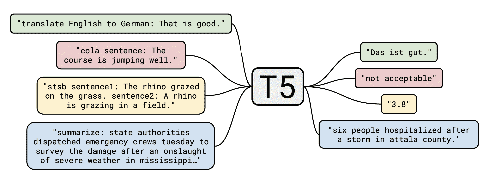

图 13. T5 任务评估图。文本到文本框架将每个任务转化为通用形式：输入文本以预测某些目标文本。（图片来源：[Raffel 等人，2020](https://arxiv.org/abs/1910.10683))

该模型是在 2019 年 4 月从 Web 语料库中提取并应用各种过滤器进行训练的。该模型通过“适配器层”（添加额外的层进行训练）或“逐步解冻”（参见 ULMFiT）分别为每个下游任务进行微调。这两种微调方法仅更新部分参数，同时保持大部分模型参数不变。T5-11B 在许多 NLP 任务上取得了 SOTA 结果。

正如作者在论文中提到的“…我们的目标不是提出新方法，而是提供一个全面的视角，了解该领域的现状”，T5 长篇论文详细描述了许多训练设置和评估过程，对于那些有兴趣从零开始训练 LM 的人来说是一篇不错的文章。

# GPT-3

**GPT-3**（[Brown et al., 2020](https://arxiv.org/abs/2005.14165)）与 GPT-2 具有相同的架构，但包含 175B 参数，比 GPT-2（1.5B）大 10 倍。此外，GPT-3 使用交替的密集和局部带状稀疏注意力模式，与[sparse transformer](https://lilianweng.github.io/posts/2020-04-07-the-transformer-family/#sparse-attention-matrix-factorization-sparse-transformers)中的相同。为了使这样一个庞大的模型跨多个 GPU 进行适配，GPT-3 在宽度和深度维度上进行了分区训练。训练数据是 Common Crawl 的一个经过筛选的版本，混合了其他几个高质量的策划数据集。为了避免下游任务可能出现在训练数据中的污染，作者试图从训练数据中删除与所有研究的基准数据集的所有重叠。不幸的是，由于一个错误，过滤过程并不完美。

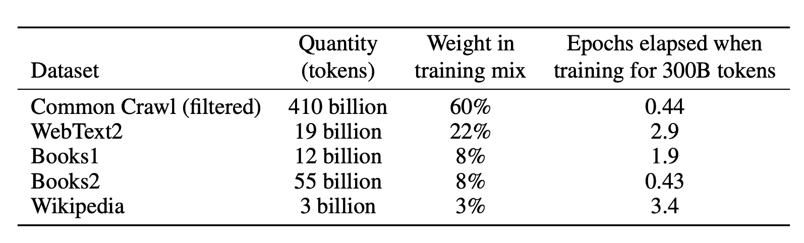

图 14\. GPT-3 的训练数据集。请注意，每个数据集在训练期间出现的次数与数据集大小不成比例。（表来源：[Brown et al., 2020](https://arxiv.org/abs/2005.14165)）

对于所有下游评估，GPT-3 在少样本设置下进行测试，没有进行基于梯度的微调。这里的少样本示例作为提示的一部分提供。GPT-3 在许多自然语言处理数据集上表现出色，与微调的 BERT 模型相媲美。

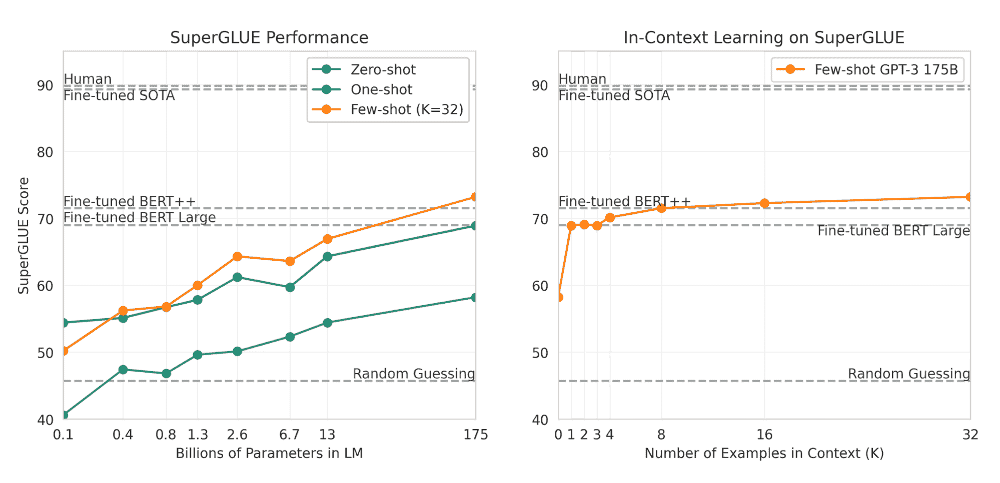

图 15\. 随着模型大小和示例数量的增加，评估性能也在提高。（图片来源：[Brown et al., 2020](https://papers.nips.cc/paper/2020/hash/1457c0d6bfcb4967418bfb8ac142f64a-Abstract.html)）

# XLNet

*自回归（AR）*模型如 GPT 和*自编码器（AE）*模型如 BERT 是语言建模的两种最常见方式。然而，它们各自都有缺点：AR 没有学习双向上下文，这是下游任务如阅读理解所需的，而 AE 假设掩码位置在给定所有其他未掩码标记的情况下是独立的，这过于简化了长上下文依赖性。

**XLNet**（[Yang et al. 2019](https://arxiv.org/abs/1906.08237)）将 AE 方法推广到包含 AR 的优点。XLNet 提出了**置换语言建模**目标。对于一个文本序列，它会对一个因子化顺序 $\mathbf{z}$ 进行采样，并根据这个因子化顺序分解似然 $p_\theta(\mathbf{x})$，

$$ \begin{aligned} \mathcal{L}_\text{XLNet} &= - \mathbb{E}_{\mathbf{z} \sim \mathcal{Z}_T} \Big[ \sum_{t=1}^T \log p_\theta (X_{z_t} = x \mid \mathbf{x}_{\mathbf{z}_{</t}} \mid \mathbf{z}_{<t}) \Big] \end{aligned} $$

其中 $\mathcal{Z}_T$ 是长度为 $T$ 的所有可能排列的集合；$z_t$ 和 $\mathbf{z}_{<t}$ 分别表示排列 $\mathbf{z} \in \mathcal{Z}_T$ 的第 $t$ 个元素和前 $t-1$ 个元素。

注意，上下文的隐藏状态的朴素表示，$h_\theta (\mathbf{x}_{\mathbf{z}_{<t}})$ 中的红色，不依赖于模型尝试预测的位置，因为排列打破了默认顺序。因此，XLNet 将其重新参数化为目标位置的函数，$g_\theta (\mathbf{x}_{\mathbf{z}_{<t}}, z_t)$ 中的蓝色。

然而，对 $g_\theta (\mathbf{x}_{\mathbf{z}_{<t}}, z_t)$ 的两种不同要求导致了两流自注意力设计以适应：

1.  当预测 $x_{z_t}$ 时，应该只编码位置 $z_t$ 而不是内容 $x_{z_t}$；否则就太简单了。这被包含在“查询表示” $g_{z_t} = g_\theta (\mathbf{x}_{\mathbf{z}_{<t}}, z_t)$ 中，不编码 $x_{z_t}$。

1.  当预测 $x_j$，其中 $j > t$ 时，应该编码内容 $x_{z_t}$ 以提供完整的上下文。这就是“内容表示” $h_{z_t} = h_\theta(\mathbf{x}_{\leq t})$。

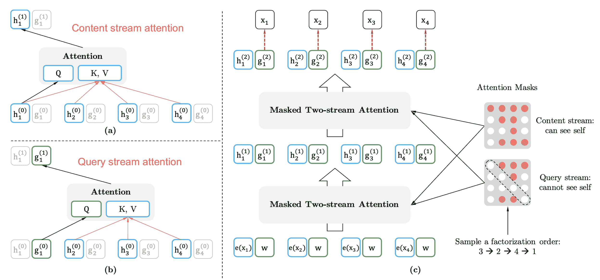

图 16\. XLNet 中两流自注意力机制的示意图。（图片来源：[Yang et al. 2019](https://arxiv.org/abs/1906.08237)）

在概念上，两个表示流的更新如下，

$$ \begin{aligned} g_{z_t}^{(m)} &\gets \text{Attention}(Q = g^{(m-1)}_{z_t}, KV=\mathbf{h}^{(m-1)}_{\color{red}{\mathbf{z}_{

鉴于排列语言建模的优化困难，XLNet 被设置为仅预测因子化顺序中的最后一块标记。

XLNet 的名称实际上来自于 [Transformer-XL](https://lilianweng.github.io/posts/2020-04-07-the-transformer-family/#longer-attention-span-transformer-xl)。它结合了 Transformer-XL 的设计，通过重用先前段落的隐藏状态来扩展注意力跨度。

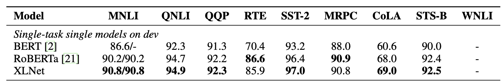

图 17\. XLNet 在 GLUE 上与其他几种语言模型的模型性能比较，都是单任务，没有集成。（图片来源：[Yang et al. 2019](https://arxiv.org/abs/1906.08237)）

# BART

**BART**（[Lewis et al., 2019](https://arxiv.org/abs/1910.13461)）是一个去噪自编码器，用于从随机损坏的版本中恢复原始文本。它结合了**B**idirectional 和 **A**uto**R**egressive **T**ransformer：准确地说，同时训练类似 BERT 的双向编码器和类似 GPT 的自回归解码器。损失仅仅是最小化负对数似然。

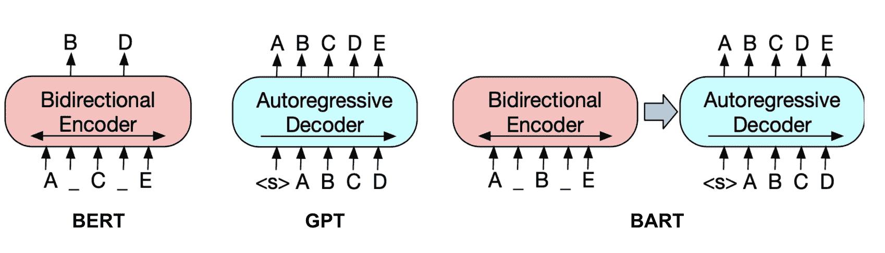

图 18\. BART 与 BERT 和 GPT 的示意图比较。（图片来源：[Lewis et al., 2019](https://arxiv.org/abs/1910.13461)）

他们尝试了各种噪声转换，包括标记遮蔽、标记删除、文本填充（即随机抽样的文本段，可能包含多个标记，被一个`[MASK]`标记替换）、句子排列、文档旋转（即将文档旋转到以一个随机标记开头）。他们发现的最佳噪声方法是文本填充和句子混洗。

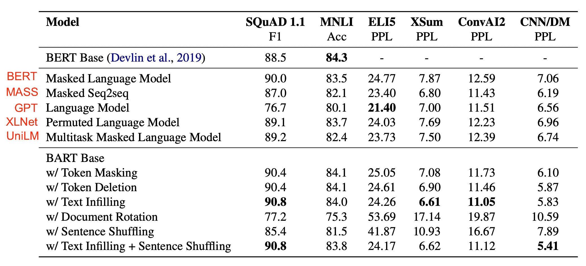

图 19。不同语言建模预训练目标的比较。（图片来源：[Lewis et al., 2019](https://arxiv.org/abs/1910.13461)）

从他们的实验中学到的：

+   预训练方法在下游任务中的性能差异显著。

+   标记遮蔽是至关重要的，因为仅应用句子排列或文档旋转时性能较差。

+   从左到右的预训练改善了生成。

+   双向编码器对 SQuAD 至关重要。

+   预训练目标并不是唯一重要的因素。架构改进，如相对位置嵌入或段级循环也很重要。

+   自回归语言模型在 ELI5 上表现最佳。

+   BART 在表现上最为稳健。

# ELECTRA

当前大多数预训练大型语言模型需要大量计算资源，引发了对其成本和可访问性的担忧。**ELECTRA**（“Efficiently Learning an Encoder that Classifies Token Replacements Accurately”; [Clark et al. 2020](https://arxiv.org/abs/2003.10555)）旨在提高*预训练效率*，将语言建模框架定位为一个区分任务而非生成任务。

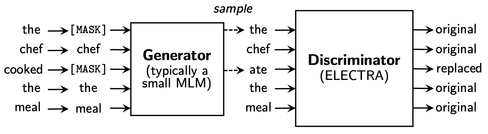

图 20。ELECTRA 模型架构示意图。（图片来源：[Clark et al. 2020](https://arxiv.org/abs/2003.10555)）

ELECTRA 提出了一个新的预训练任务，称为“替换标记检测”（RTD）。让我们随机抽样$k$个位置进行标记。原始文本中每个选定的标记都将被一个小语言模型预测的合理替代品替换，这个模型被称为生成器$G$。鉴别器$D$预测每个标记是原始的还是替换的。

$$ \begin{aligned} \boldsymbol{m} &= [m_1, \dots, m_k] \text{ where } m_i \sim \text{unif}\{1, n\}\text{ for } i=1, \dots, k \\ \boldsymbol{x}^\text{masked} &= \text{REPLACE}(\boldsymbol{x}, \boldsymbol{m}, \texttt{[MASK]}) \\ \boldsymbol{x}^\text{corrupt} &= \text{REPLACE}(\boldsymbol{x}, \boldsymbol{m}, \tilde{\boldsymbol{x}}) \text{ where } \tilde{x}_t \sim p_G(x_i \mid \boldsymbol{x}^\text{masked}) \text{ for } i \in \boldsymbol{m} \\ \end{aligned} $$

生成器的损失与其他语言模型一样是负对数似然。鉴别器的损失是交叉熵。请注意，生成器并不是通过对抗训练来愚弄鉴别器，而只是为了优化 NLL，因为他们的实验显示了负面结果。

$$ \begin{aligned} \mathcal{L}_\text{MLM}(\mathbf{x}, \theta_G) &= \mathbb{E}\Big(\sum_{i \in \boldsymbol{m}} -\log p_G (x_i \mid \boldsymbol{x}^\text{masked} )\Big) \\ \mathcal{L}_\text{Disc}(\mathbf{x}, \theta_D) &= \mathbb{E}\Big( - \mathbb{1}[x^\text{corrupt}_t = x_t] \log D(\boldsymbol{x}^\text{corrupt}, t) - \mathbb{1}[x^\text{corrupt}_t \neq x_t] \log (1 - \log D(\boldsymbol{x}^\text{corrupt}, t)) \Big) \end{aligned} $$

他们发现，只在生成器和鉴别器之间共享嵌入更有益，同时使用较小的生成器（鉴别器大小的 1/4 到 1/2），而不是共享所有权重（即两个模型必须是相同大小）。此外，生成器和鉴别器的联合训练比交替两阶段训练效果更好。

预训练后，生成器被丢弃，只有 ELECTRA 鉴别器进一步进行下游任务的微调。下表显示了 ELECTRA 在 GLUE 开发集上的表现。

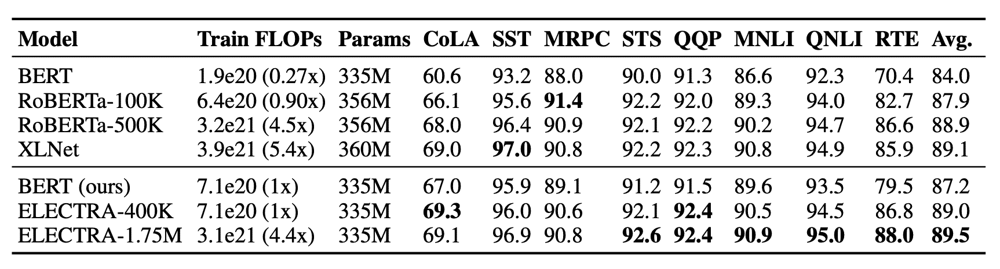

图 21\. ELECTRA 与 GLUE 开发集上其他语言模型的比较。（图片来源：[Clark et al. 2020](https://arxiv.org/abs/2003.10555)）

# 摘要

|  | 基础模型 | 预训练任务。 |
| --- | --- | --- |
| CoVe | seq2seq NMT 模型 | 使用翻译数据集进行监督学习。 |
| ELMo | 两层双向 LSTM | 下一个标记预测。 |
| CVT | 两层双向 LSTM | 使用标记和未标记数据集进行半监督学习。 |
| ULMFiT | AWD-LSTM | 在 Wikitext-103 上进行自回归预训练。 |
| GPT | Transformer 解码器 | 下一个标记预测。 |
| BERT | Transformer 编码器 | 掩码语言模型 + 下一个句子预测 |
| ALBERT | 与 BERT 相同但轻量级 | 掩码语言模型 + 句子顺序预测。 |
| GPT-2 | Transformer 解码器 | 下一个标记预测。 |
| RoBERTa | 与 BERT 相同 | 掩码语言模型（动态掩码）。 |
| T5 | Transformer 编码器 + 解码器 | 在无监督和监督任务的多任务混合上进行预训练，每个任务都转换为文本到文本的格式。 |
| GPT-3 | Transformer 解码器 | 下一个标记预测。 |
| XLNet | 与 BERT 相同 | 排列语言建模。 |
| BART | BERT 编码器 + GPT 解码器 | 从噪声版本重构文本。 |
| ELECTRA | 与 BERT 相同 | 替换标记检测。 |

# 指标：困惑度

困惑度通常用作内在评估指标，用于衡量语言模型在给定上下文条件下能够多好地捕捉真实词分布。

离散概率分布 $p$ 的困惑度定义为熵的幂运算：

$$ 2^{H(p)} = 2^{-\sum_x p(x) \log_2 p(x)} $$

给定一个具有 $N$ 个单词的句子，$s = (w_1, \dots, w_N)$，熵如下所示，简单地假设每个单词具有相同的频率，$\frac{1}{N}$：

$$ H(s) = -\sum_{i=1}^N P(w_i) \log_2 p(w_i) = -\sum_{i=1}^N \frac{1}{N} \log_2 p(w_i) $$

该句子的困惑度变为：

$$ \begin{aligned} 2^{H(s)} &= 2^{-\frac{1}{N} \sum_{i=1}^N \log_2 p(w_i)} = (2^{\sum_{i=1}^N \log_2 p(w_i)})^{-\frac{1}{N}} = (p(w_1) \dots p(w_N))^{-\frac{1}{N}} \end{aligned} $$

一个优秀的语言模型应该能够预测高概率的词。因此，困惑度越小越好。

# 常见任务和数据集

**问答**

+   [SQuAD](https://rajpurkar.github.io/SQuAD-explorer/)（斯坦福问答数据集）：一个阅读理解数据集，由一组维基百科文章上提出的问题组成，每个问题的答案都是一段文本。

+   [RACE](http://www.qizhexie.com/data/RACE_leaderboard)（来自考试的阅读理解）：一个大规模的阅读理解数据集，包含超过 28,000 个段落和近 100,000 个问题。该数据集收集自中国的英语考试，面向中学和高中学生。

+   查看[更多问答数据集](https://lilianweng.github.io/posts/2020-10-29-odqa/#appendix-qa-datasets)。

**常识推理**

+   [Story Cloze Test](http://cs.rochester.edu/nlp/rocstories/)：用于评估故事理解和生成的常识推理框架。该测试要求系统从两个选项中选择多句故事的正确结局。

+   [SWAG](https://rowanzellers.com/swag/)（具有对抗生成的情境）：多项选择；包含 113k 个句子对完成示例，评估基于常识的推理。

**自然语言推理（NLI）**：也称为**文本蕴涵**，是一种逻辑推理的练习，用于判断一个句子是否可以从另一个句子中推断出来。

+   [RTE](https://aclweb.org/aclwiki/Textual_Entailment_Resource_Pool)（文本蕴涵资源池）：由文本蕴涵挑战发起的一组数据集。

+   [SNLI](https://nlp.stanford.edu/projects/snli/)（斯坦福自然语言推理）：由人工标记的 570k 个英语句子对集合，用于平衡分类的标签有`蕴涵`、`矛盾`和`中立`。

+   [MNLI](https://www.nyu.edu/projects/bowman/multinli/)（多样化文体自然语言推理）：类似于 SNLI，但涵盖更多样化的文体和主题，包括转录的演讲、流行小说和政府报告。

+   [QNLI](https://gluebenchmark.com/tasks)（问题 NLI）：从 SQuAD 数据集转换而来，用于对（问题，句子）对进行二元分类任务。

+   [SciTail](http://data.allenai.org/scitail/)：从多项选择科学考试和网络句子中创建的蕴涵数据集。

**命名实体识别（NER）**：标记文本中的词序列，这些词是事物的名称，如人名、公司名，或基因和蛋白质名称。

+   [CoNLL 2003 NER task](https://www.clips.uantwerpen.be/conll2003/)：包括路透社的新闻稿，集中在四种命名实体上：人物、地点、组织和其他实体的名称。

+   [OntoNotes 5.0](https://catalog.ldc.upenn.edu/LDC2013T19)：该语料库包含英语、阿拉伯语和中文文本，标记有四种不同的实体类型（PER、LOC、ORG、MISC）。

+   [Reuters Corpus](https://trec.nist.gov/data/reuters/reuters.html)：路透社新闻故事的大量收集。

+   精细化命名实体识别（FGN）

**情感分析**

+   [SST](https://nlp.stanford.edu/sentiment/index.html)（斯坦福情感树库）

+   [IMDb](http://ai.stanford.edu/~amaas/data/sentiment/)：一个包含电影评论的大型数据集，带有二元情感分类标签。

**语义角色标注（SRL）**：模拟句子的谓语-论元结构，通常描述为回答“谁对谁做了什么”。

+   [CoNLL-2004 & CoNLL-2005](http://www.lsi.upc.edu/~srlconll/)

**句子相似度**：也称为*释义检测*

+   [MRPC](https://www.microsoft.com/en-us/download/details.aspx?id=52398)（微软释义语料库）：它包含从网络新闻来源中提取的句子对，带有指示每对是否语义等价的注释。

+   [QQP](https://data.quora.com/First-Quora-Dataset-Release-Question-Pairs)（Quora 问题对）STS 基准：语义文本相似性

**句子可接受性**：一个用于标注句子语法可接受性的任务。

+   [CoLA](https://nyu-mll.github.io/CoLA/)（语言可接受性语料库）：一个二元单句分类任务。

**文本分块**：将文本分成句法相关的词块。

+   [CoNLL-2000](https://www.clips.uantwerpen.be/conll2000/chunking/)

**词性标注（POS）**：为每个标记标记词性，如名词、动词、形容词等。宾夕法尼亚树库的华尔街日报部分（Marcus 等，1993）。

**机器翻译**：参见[标准自然语言处理](https://nlp.stanford.edu/projects/nmt/)页面。

+   WMT 2015 英语-捷克语数据（大型）

+   WMT 2014 英语-德语数据（中型）

+   IWSLT 2015 英语-越南语数据（小型）

**指代消解**：对指代同一底层实体的文本进行聚类。

+   [CoNLL-2012](http://conll.cemantix.org/2012/data.html)

**长距离依赖**

+   [LAMBADA](http://clic.cimec.unitn.it/lambada/)（语言建模扩展以考虑话语方面）：从 BookCorpus 中提取的叙述段落的集合，任务是预测最后一个单词，这需要至少 50 个上下文标记才能成功预测。

+   [儿童图书测试](https://research.fb.com/downloads/babi/)：由[古腾堡计划](https://www.gutenberg.org/)中免费提供的书籍构建。任务是在 10 个候选词中预测缺失的单词。

**多任务基准**

+   GLUE 多任务基准：[`gluebenchmark.com`](https://gluebenchmark.com/)

+   decaNLP 基准：[`decanlp.com`](https://decanlp.com/)

**无监督预训练数据集**

+   [图书语料库](https://googlebooks.byu.edu/): 该语料库包含“来自各种流派的 7000 多本独特未发表的书籍，包括冒险、奇幻和浪漫等。”

+   [10 亿词语语言模型基准](http://www.statmt.org/lm-benchmark/)

+   [英文维基百科](https://en.wikipedia.org/wiki/Wikipedia:Database_download#English-language_Wikipedia): 约 2500M 字

* * *

Cited as:

```py
@article{weng2019LM,
  title   = "Generalized Language Models",
  author  = "Weng, Lilian",
  journal = "lilianweng.github.io",
  year    = "2019",
  url     = "https://lilianweng.github.io/posts/2019-01-31-lm/"
} 
```

# Reference

[1] Bryan McCann 等人. [“在翻译中学到的：上下文化的词向量。”](https://arxiv.org/abs/1708.00107) NIPS. 2017 年.

[2] Kevin Clark 等人. [“使用交叉视图训练的半监督序列建模。”](https://arxiv.org/abs/1809.08370) EMNLP 2018.

[3] Matthew E. Peters 等人. [“深度上下文化的词表示。”](https://arxiv.org/abs/1802.05365) NAACL-HLT 2017.

[4] OpenAI Blog [“通过无监督学习改进语言理解”](https://blog.openai.com/language-unsupervised/), 2018 年 6 月 11 日.

[5] OpenAI Blog [“更好的语言模型及其影响。”](https://blog.openai.com/better-language-models/) 2019 年 2 月 14 日.

[6] Jeremy Howard 和 Sebastian Ruder. [“文本分类的通用语言模型微调。”](https://arxiv.org/abs/1801.06146) ACL 2018.

[7] Alec Radford 等人. [“通过生成式预训练改进语言理解”](https://s3-us-west-2.amazonaws.com/openai-assets/research-covers/language-unsupervised/language_understanding_paper.pdf). OpenAI Blog, 2018 年 6 月 11 日.

[8] Jacob Devlin 等人. [“BERT: 深度双向转换器的预训练用于语言理解。”](https://arxiv.org/abs/1810.04805) arXiv:1810.04805 (2018).

[9] Mike Schuster 和 Kaisuke Nakajima. [“日语和韩语语音搜索。”](https://static.googleusercontent.com/media/research.google.com/en//pubs/archive/37842.pdf) ICASSP. 2012.

[10] 谷歌的神经机器翻译系统：弥合人类和机器翻译之间的差距

[11] Ashish Vaswani 等人. [“注意力就是你所需要的。”](https://arxiv.org/abs/1706.03762) NIPS 2017 年.

[12] Peter J. Liu 等人. [“通过总结长序列生成维基百科。”](https://arxiv.org/abs/1801.10198) ICLR 2018 年.

[13] Sebastian Ruder. [“2018 年 NLP 领域的 10 个激动人心的想法”](http://ruder.io/10-exciting-ideas-of-2018-in-nlp/) 2018 年 12 月。

[14] Alec Radford 等人. [“语言模型是无监督多任务学习者。”](https://d4mucfpksywv.cloudfront.net/better-language-models/language_models_are_unsupervised_multitask_learners.pdf). 2019 年.

[15] Rico Sennrich 等人. [“使用子词单元进行稀有词的神经机器翻译。”](https://arxiv.org/abs/1508.07909) arXiv preprint arXiv:1508.07909\. 2015 年.

[16] Zhenzhong Lan 等人. [“ALBERT: 用于自监督学习语言表示的轻量级 BERT。”](https://arxiv.org/abs/1909.11942) arXiv Preprint arXiv:1909.11942 (2019).

[17] Yinhan Liu 等人. [“RoBERTa: 一种稳健优化的 BERT 预训练方法。”](https://arxiv.org/abs/1907.11692) arXiv Preprint arXiv:1907.11692 (2019).

[18] Tom B Brown 等人 [“语言模型是少样本学习器”](https://arxiv.org/abs/2005.14165) NeuriPS 2020.

[19] Zhilin Yang 等人 [“XLNet: 通用自回归预训练用于语言理解。”](https://arxiv.org/abs/1906.08237) NeuriPS 2019.

[20] Mike Lewis 等人 [“BART: 去噪序列到序列预训练用于自然语言生成、翻译和理解。”](https://arxiv.org/abs/1910.13461) ACL 2020.

[21] Kevin Clark 等人 [“ELECTRA: 将文本编码器预训练为判别器而不是生成器。”](https://arxiv.org/abs/2003.10555) ICLR 2020.

[22] Colin Raffel 等人 [“探索统一文本到文本变压器的迁移学习极限”](https://arxiv.org/abs/1910.10683) JMLR 2020.

+   [架构](https://lilianweng.github.io/tags/architecture/)

+   [自然语言处理](https://lilianweng.github.io/tags/nlp/)

+   [长文本](https://lilianweng.github.io/tags/long-read/)

+   [变压器](https://lilianweng.github.io/tags/transformer/)

+   [注意力机制](https://lilianweng.github.io/tags/attention/)

+   [语言模型](https://lilianweng.github.io/tags/language-model/)

[«

深度神经网络是否严重过拟合？](https://lilianweng.github.io/posts/2019-03-14-overfit/) [»

目标检测第四部分: 快速检测模型](https://lilianweng.github.io/posts/2018-12-27-object-recognition-part-4/)[](https://twitter.com/intent/tweet/?text=通用语言模型&url=https%3a%2f%2flilianweng.github.io%2fposts%2f2019-01-31-lm%2f&hashtags=architecture%2cnlp%2clong-read%2ctransformer%2cattention%2clanguage-model)[](https://www.linkedin.com/shareArticle?mini=true&url=https%3a%2f%2flilianweng.github.io%2fposts%2f2019-01-31-lm%2f&title=通用语言模型&summary=通用语言模型&source=https%3a%2f%2flilianweng.github.io%2fposts%2f2019-01-31-lm%2f)[](https://reddit.com/submit?url=https%3a%2f%2flilianweng.github.io%2fposts%2f2019-01-31-lm%2f&title=通用语言模型)[](https://facebook.com/sharer/sharer.php?u=https%3a%2f%2flilianweng.github.io%2fposts%2f2019-01-31-lm%2f)[](https://api.whatsapp.com/send?text=通用语言模型%20-%20https%3a%2f%2flilianweng.github.io%2fposts%2f2019-01-31-lm%2f)[](https://telegram.me/share/url?text=通用语言模型&url=https%3a%2f%2flilianweng.github.io%2fposts%2f2019-01-31-lm%2f)© 2024 [Lil'Log](https://lilianweng.github.io/) Powered by [Hugo](https://gohugo.io/) & [PaperMod](https://git.io/hugopapermod)[](#top "返回顶部 (Alt + G)")
