# 目标检测第 4 部分：快速检测模型

> 原文：[`lilianweng.github.io/posts/2018-12-27-object-recognition-part-4/`](https://lilianweng.github.io/posts/2018-12-27-object-recognition-part-4/)

在[第 3 部分](https://lilianweng.github.io/posts/2017-12-31-object-recognition-part-3/)中，我们回顾了 R-CNN 系列中的模型。它们都是基于区域的目标检测算法。它们可以实现高准确性，但对于某些应用，如自动驾驶，可能太慢了。在第 4 部分中，我们只关注快速目标检测模型，包括 SSD、RetinaNet 和 YOLO 系列中的模型。

系列中所有文章的链接：[[第 1 部分](https://lilianweng.github.io/posts/2017-10-29-object-recognition-part-1/)] [[第 2 部分](https://lilianweng.github.io/posts/2017-12-15-object-recognition-part-2/)] [[第 3 部分](https://lilianweng.github.io/posts/2017-12-31-object-recognition-part-3/)] [[第 4 部分](https://lilianweng.github.io/posts/2018-12-27-object-recognition-part-4/)]。

# 两阶段与一阶段检测器

R-CNN 系列中的模型都是基于区域的。检测分为两个阶段：(1) 首先，模型通过选择性搜索或区域提议网络提出一组感兴趣的区域。提出的区域是稀疏的，因为潜在的边界框候选可能是无限的。(2) 然后分类器只处理区域候选。

另一种不同的方法跳过了区域提议阶段，直接在可能位置的密集采样上运行检测。这就是一阶段目标检测算法的工作原理。这种方法更快、更简单，但可能会稍微降低性能。

本文介绍的所有模型都是一阶段检测器。

# YOLO：You Only Look Once

**YOLO**模型（“You Only Look Once”；[Redmon et al., 2016](https://www.cv-foundation.org/openaccess/content_cvpr_2016/papers/Redmon_You_Only_Look_CVPR_2016_paper.pdf)）是构建快速实时目标检测器的首次尝试。由于 YOLO 不经历区域提议步骤，只对有限数量的边界框进行预测，因此能够快速进行推断。

## 工作流程

1.  **预训练**一个 CNN 网络进行图像分类任务。

1.  将图像分割成$S \times S$个单元格。如果一个物体的中心落入一个单元格中，那个单元格就“负责”检测该物体的存在。每个单元格预测(a) $B$个边界框的位置，(b) 置信度分数，以及(c) 在边界框中存在物体的条件下的物体类别概率。

    +   边界框的**坐标**由一个包含 4 个值的元组定义，(中心 x 坐标，中心 y 坐标，宽度，高度) — $(x, y, w, h)$，其中$x$和$y$被设置为单元格位置的偏移量。此外，$x$、$y$、$w$和$h$都被图像的宽度和高度归一化，因此都在(0, 1]之间。

    +   一个**置信度分数**表示单元格包含对象的可能性：`Pr(包含对象) x IoU(预测, 真实)`；其中`Pr` = 概率，`IoU` = 交并比。

    +   如果单元格包含一个对象，则预测该对象属于每个类别$C_i, i=1, \dots, K$的**概率**：`Pr(对象属于类别 C_i | 包含对象)`。在这个阶段，模型只预测每个单元格一组类别概率，而不考虑边界框的数量$B$。

    +   总共，一张图像包含$S \times S \times B$个边界框，每个边界框对应 4 个位置预测，1 个置信度分数，以及 K 个用于对象分类的条件概率。一张图像的总预测值为$S \times S \times (5B + K)$，这是模型最终卷积层的张量形状。

1.  预训练 CNN 的最终层被修改为输出大小为$S \times S \times (5B + K)$的预测张量。

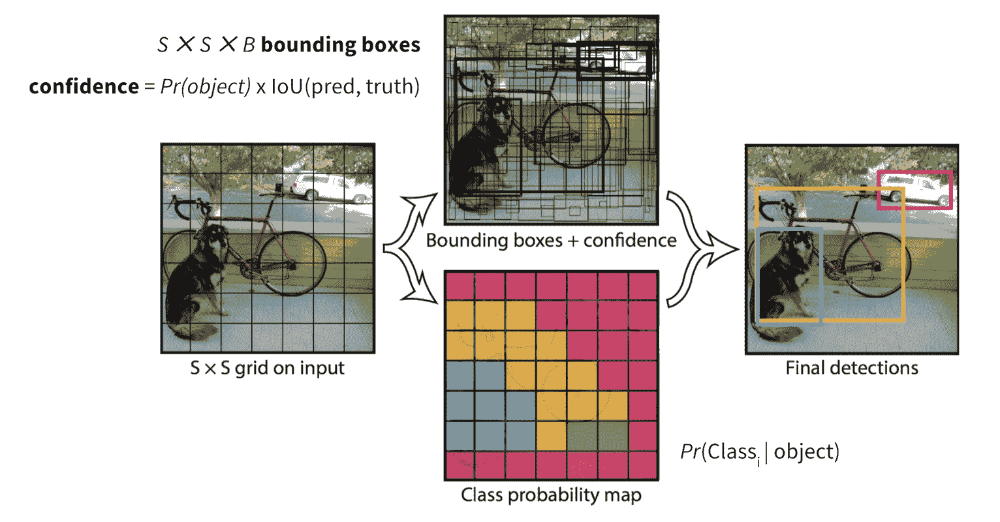

图 1\. YOLO 模型的工作流程。（图片来源：[原始论文](https://www.cv-foundation.org/openaccess/content_cvpr_2016/papers/Redmon_You_Only_Look_CVPR_2016_paper.pdf)）

## 网络架构

基础模型类似于[GoogLeNet](https://www.cs.unc.edu/~wliu/papers/GoogLeNet.pdf)，其中 inception 模块被 1x1 和 3x3 卷积层替换。形状为$S \times S \times (5B + K)$的最终预测是通过对整个卷积特征图进行两个全连接层计算得到的。

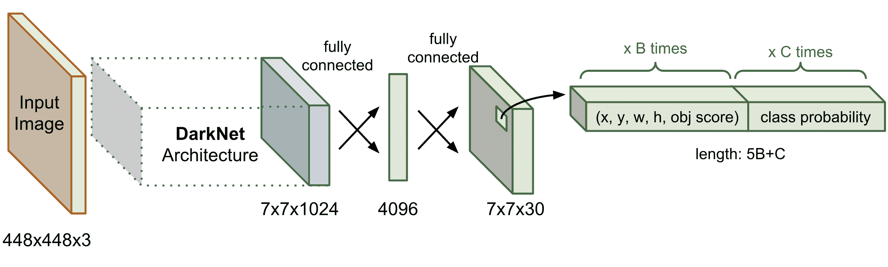

图 2\. YOLO 的网络架构。

## 损失函数

损失由两部分组成，*定位损失*用于边界框偏移预测，*分类损失*用于条件类别概率。这两部分都被计算为平方误差的总和。使用两个比例参数来控制我们希望增加边界框坐标预测的损失量（$\lambda_\text{coord}$）以及我们希望减少没有对象的边界框置信度预测的损失量（$\lambda_\text{noobj}$）。减少背景框贡献的损失很重要，因为大多数边界框不包含实例。在论文中，模型设置$\lambda_\text{coord} = 5$和$\lambda_\text{noobj} = 0.5$。

$$ \begin{aligned} \mathcal{L}_\text{loc} &= \lambda_\text{coord} \sum_{i=0}^{S²} \sum_{j=0}^B \mathbb{1}_{ij}^\text{obj} [(x_i - \hat{x}_i)² + (y_i - \hat{y}_i)² + (\sqrt{w_i} - \sqrt{\hat{w}_i})² + (\sqrt{h_i} - \sqrt{\hat{h}_i})² ] \\ \mathcal{L}_\text{cls} &= \sum_{i=0}^{S²} \sum_{j=0}^B \big( \mathbb{1}_{ij}^\text{obj} + \lambda_\text{noobj} (1 - \mathbb{1}_{ij}^\text{obj})\big) (C_{ij} - \hat{C}_{ij})² + \sum_{i=0}^{S²} \sum_{c \in \mathcal{C}} \mathbb{1}_i^\text{obj} (p_i(c) - \hat{p}_i(c))²\\ \mathcal{L} &= \mathcal{L}_\text{loc} + \mathcal{L}_\text{cls} \end{aligned} $$

> 注意：在原始 YOLO 论文中，损失函数使用 $C_i$ 而不是 $C_{ij}$ 作为置信度分数。我根据自己的理解进行了更正，因为每个边界框应该有自己的置信度分数。如果您不同意，请告诉我。非常感谢。

where,

+   $\mathbb{1}_i^\text{obj}$：指示函数，表示单元格 i 是否包含对象。

+   $\mathbb{1}_{ij}^\text{obj}$：它指示单元格 i 的第 j 个边界框是否“负责”对象预测（见图 3）。

+   $C_{ij}$：单元格 i 的置信度分数，`Pr(包含对象) * IoU(预测, 真实)`.

+   $\hat{C}_{ij}$：预测的置信度分数。

+   $\mathcal{C}$：所有类别的集合。

+   $p_i(c)$：单元格 i 是否包含类别 $c \in \mathcal{C}$ 的条件概率。

+   $\hat{p}_i(c)$：预测的条件类别概率。

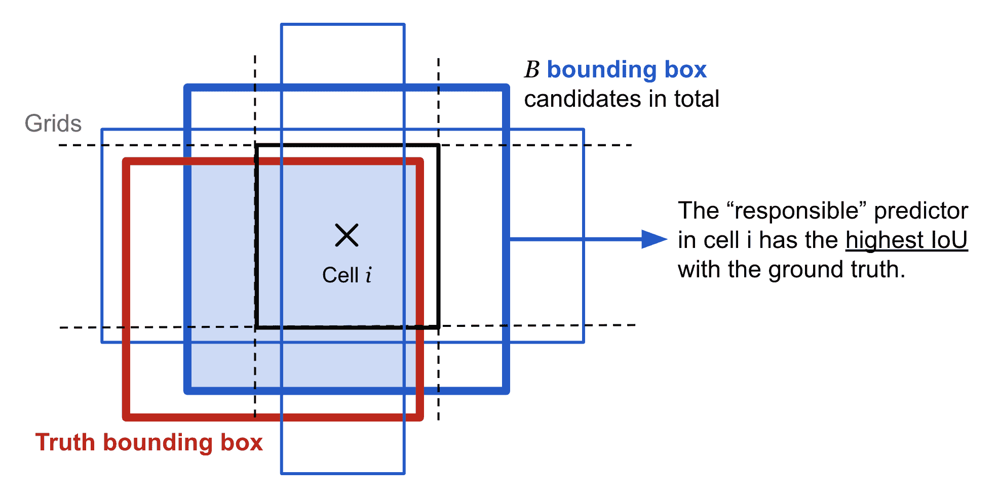

图 3\. 在一个位置，单元格 i 中，模型提出 B 个边界框候选项，与地面实况有最高重叠的那个是“负责”的预测器。

如果网格单元格中存在对象，则损失函数仅惩罚分类错误，$\mathbb{1}_i^\text{obj} = 1$。如果该预测器“负责”地面实况框，则它也只惩罚边界框坐标错误，$\mathbb{1}_{ij}^\text{obj} = 1$。

作为一种单阶段目标检测器，YOLO 非常快速，但由于有限数量的边界框候选项，它不擅长识别不规则形状的对象或一组小对象。

# SSD：单次多框检测器

**单次检测器**（**SSD**；[Liu 等人，2016](https://arxiv.org/abs/1512.02325)）是第一次尝试使用卷积神经网络的金字塔特征层次结构来高效检测各种大小的对象。

## 图像金字塔

SSD 使用在 ImageNet 上预训练的 [VGG-16](https://arxiv.org/abs/1409.1556) 模型作为提取有用图像特征的基础模型。在 VGG16 之上，SSD 添加了几个尺寸递减的卷积特征层。它们可以被看作是不同尺度图像的*金字塔表示*。直观地说，较早级别的大细粒度特征图对捕捉小对象很好，而较小的粗粒度特征图可以很好地检测大对象。在 SSD 中，检测发生在每个金字塔层，针对各种大小的对象。

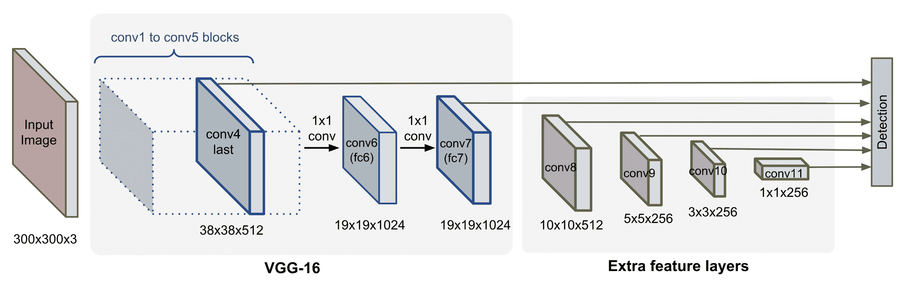

图 4\. SSD 的模型架构。

## 工作流程

与 YOLO 不同，SSD 不会将图像分割成任意大小的网格，而是为特征图的每个位置预测预定义*锚框*的偏移量（在论文中称为“默认框”）。每个框都有固定的大小和位置，相对于其对应的单元格。所有锚框以卷积方式铺设整个特征图。

不同级别的特征图具有不同的感受野大小。不同级别上的锚框被重新缩放，以便一个特征图仅负责特定尺度的对象。例如，在图 5 中，狗只能在 4x4 特征图（较高级别）中被检测到，而猫只能被 8x8 特征图（较低级别）捕捉到。


图 5\. SSD 框架。 (a) 训练数据包含每个对象的图像和地面真实框。 (b) 在细粒度特征图（8 x 8）中，不同纵横比的锚框对应于原始输入的较小区域。 (c) 在粗粒度特征图（4 x 4）中，锚框覆盖了原始输入的较大区域。 (图片来源: [原始论文](https://arxiv.org/abs/1512.02325))

锚框的宽度、高度和中心位置都被归一化为(0, 1)。在大小为$m \times n$的第$\ell$个特征层的位置$(i, j)$处，$i=1,\dots,n, j=1,\dots,m$，我们有一个与层级成比例的唯一线性尺度和 5 种不同的框纵横比（宽高比），以及一个特殊尺度（为什么需要这个？论文没有解释。也许只是一个启发式技巧），当纵横比为 1 时。这给我们每个特征单元总共 6 个锚框。

$$ \begin{aligned} \text{级别索引: } &\ell = 1, \dots, L \\ \text{框的尺度: } &s_\ell = s_\text{min} + \frac{s_\text{max} - s_\text{min}}{L - 1} (\ell - 1) \\ \text{纵横比: } &r \in \{1, 2, 3, 1/2, 1/3\}\\ \text{额外尺度: } & s'_\ell = \sqrt{s_\ell s_{\ell + 1}} \text{ 当 } r = 1 \text{，因此总共有 6 个框。}\\ \text{宽度: } &w_\ell^r = s_\ell \sqrt{r} \\ \text{高度: } &h_\ell^r = s_\ell / \sqrt{r} \\ \text{中心位置: } & (x^i_\ell, y^j_\ell) = (\frac{i+0.5}{m}, \frac{j+0.5}{n}) \end{aligned} $$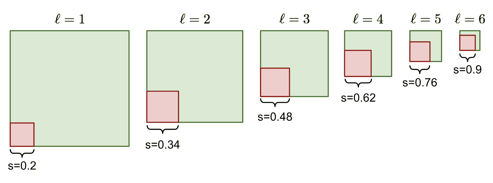

图 6\. 锚框大小随着层索引$\ell$的增加而扩大的示例，其中$L=6, s\_\text{min} = 0.2, s\_\text{max} = 0.9$。仅展示了纵横比$r=1$的框。

在每个位置，模型通过对每个$k$个锚框应用一个$3 \times 3 \times p$的卷积滤波器（其中$p$是特征图中的通道数）来输出 4 个偏移量和$c$个类别概率。因此，给定大小为$m \times n$的特征图，我们需要$kmn(c+4)$个预测滤波器。

## 损失函数

与 YOLO 相同，损失函数是定位损失和分类损失的总和。

$\mathcal{L} = \frac{1}{N}(\mathcal{L}_\text{cls} + \alpha \mathcal{L}_\text{loc})$

其中$N$是匹配的边界框数量，$\alpha$在两个损失之间平衡权重，由交叉验证选择。

*定位损失*是预测边界框修正与真实值之间的[平滑 L1 损失](https://github.com/rbgirshick/py-faster-rcnn/files/764206/SmoothL1Loss.1.pdf)。坐标修正转换与[R-CNN](https://lilianweng.github.io/posts/2017-12-31-object-recognition-part-3/#r-cnn)在[边界框回归](https://lilianweng.github.io/posts/2017-12-31-object-recognition-part-3/#bounding-box-regression)中所做的相同。

$$ \begin{aligned} \mathcal{L}_\text{loc} &= \sum_{i,j} \sum_{m\in\{x, y, w, h\}} \mathbb{1}_{ij}^\text{match} L_1^\text{smooth}(d_m^i - t_m^j)²\\ L_1^\text{smooth}(x) &= \begin{cases} 0.5 x² & \text{if } \vert x \vert < 1\\ \vert x \vert - 0.5 & \text{otherwise} \end{cases} \\ t^j_x &= (g^j_x - p^i_x) / p^i_w \\ t^j_y &= (g^j_y - p^i_y) / p^i_h \\ t^j_w &= \log(g^j_w / p^i_w) \\ t^j_h &= \log(g^j_h / p^i_h) \end{aligned} $$

其中 $\mathbb{1}_{ij}^\text{match}$ 表示第 $i$ 个边界框的坐标 $(p^i_x, p^i_y, p^i_w, p^i_h)$ 是否与第 $j$ 个真实边界框的坐标 $(g^j_x, g^j_y, g^j_w, g^j_h)$ 匹配。$d^i_m, m\in\{x, y, w, h\}$ 是预测的修正项。查看[这里](https://lilianweng.github.io/posts/2017-12-31-object-recognition-part-3/#bounding-box-regression)了解转换如何工作。

*分类损失*是多类别的 softmax 损失（[tensorflow 中的 softmax_cross_entropy_with_logits](https://www.tensorflow.org/api_docs/python/tf/nn/softmax_cross_entropy_with_logits)）：

$$ \mathcal{L}_\text{cls} = -\sum_{i \in \text{pos}} \mathbb{1}_{ij}^k \log(\hat{c}_i^k) - \sum_{i \in \text{neg}} \log(\hat{c}_i⁰)\text{, where }\hat{c}_i^k = \text{softmax}(c_i^k) $$

其中 $\mathbb{1}_{ij}^k$ 表示第 $i$ 个边界框和第 $j$ 个真实边界框是否匹配类别 $k$ 的对象。$\text{pos}$ 是匹配的边界框集合（总共 $N$ 个项目），$\text{neg}$ 是负例集合。SSD 使用[硬负样本挖掘](https://lilianweng.github.io/posts/2017-12-31-object-recognition-part-3/#common-tricks)来选择易被错误分类的负例，构建这个 $\text{neg}$ 集合：一旦所有锚框按照目标置信度得分排序，模型选择前几个候选项进行训练，使得 neg:pos 最多为 3:1。

# YOLOv2 / YOLO9000

**YOLOv2**（[Redmon & Farhadi, 2017](https://arxiv.org/abs/1612.08242)）是 YOLO 的增强版本。**YOLO9000** 建立在 YOLOv2 的基础上，但是使用 COCO 检测数据集和 ImageNet 中前 9000 个类别的联合数据集进行训练。

## YOLOv2 改进

为了使 YOLO 预测更准确和更快，应用了各种修改，包括：

**1\. BatchNorm 有帮助**：在所有卷积层上添加*批量归一化*，显著提高收敛速度。

**2\. 图像分辨率很重要**：使用*高分辨率*图像微调基础模型可以提高检测性能。

**3\. 卷积锚框检测**：YOLOv2 不像使用全连接层在整个特征图上预测边界框位置，而是使用卷积层来预测*锚框*的位置，就像 faster R-CNN 中一样。空间位置和类别概率的预测是分离的。总体上，这种改变导致 mAP 略微下降，但召回率增加。

**4\. 锚框尺寸的 K 均值聚类**：与使用手动选择大小的锚框的 faster R-CNN 不同，YOLOv2 在训练数据上运行 K 均值聚类，以找到锚框尺寸的良好先验。距离度量设计为*依赖于 IoU 分数*：

$$ \text{dist}(x, c_i) = 1 - \text{IoU}(x, c_i), i=1,\dots,k $$

其中$x$是一个地面真实框候选，$c_i$是其中一个中心点。最佳中心点（锚框）数量$k$可以通过[肘部法则](https://en.wikipedia.org/wiki/Elbow_method_(clustering))选择。

由聚类生成的锚框在固定数量的锚框上提供更好的平均 IoU。

**5\. 直接位置预测**：YOLOv2 以一种方式制定边界框预测，使其*不会偏离*中心位置太远。如果边界框位置预测可以将边界框放在图像的任何部分，就像在区域建议网络中一样，模型训练可能会变得不稳定。

给定大小为$(p_w, p_h)$的锚框在网格单元的左上角为$(c_x, c_y)$，模型预测偏移和比例$(t_x, t_y, t_w, t_h)$，相应的预测边界框$b$的中心为$(b_x, b_y)$，大小为$(b_w, b_h)$。置信度分数是另一个输出$t_o$的 sigmoid($\sigma$)。

$$ \begin{aligned} b_x &= \sigma(t_x) + c_x\\ b_y &= \sigma(t_y) + c_y\\ b_w &= p_w e^{t_w}\\ b_h &= p_h e^{t_h}\\ \text{Pr}(\text{object}) &\cdot \text{IoU}(b, \text{object}) = \sigma(t_o) \end{aligned} $$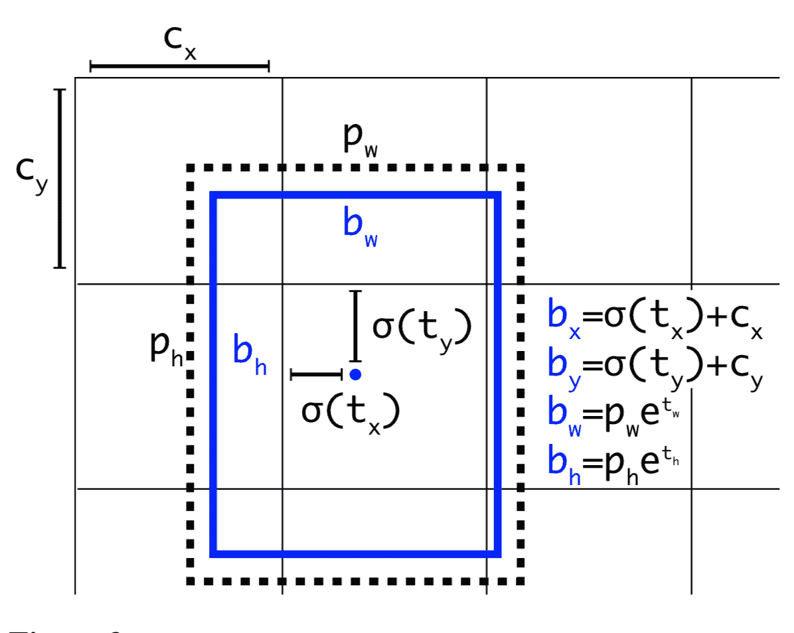

图 7\. YOLOv2 边界框位置预测。（图片来源：[原论文](https://arxiv.org/abs/1612.08242)）

**6\. 添加细粒度特征**：YOLOv2 添加了一个透传层，将*较早层*的细粒度特征传递到最后的输出层。这个透传层的机制类似于 ResNet 中的*恒等映射*，从先前的层提取高维特征。这导致性能提高了 1%。

**7\. 多尺度训练**：为了训练模型对不同尺寸的输入图像具有鲁棒性，每 10 批次会*随机抽样*一个*新尺寸*的输入维度。由于 YOLOv2 的卷积层将输入维度下采样 32 倍，新抽样的尺寸是 32 的倍数。

**8\. 轻量级基础模型**：为了使预测速度更快，YOLOv2 采用了一个轻量级的基础模型，DarkNet-19，它有 19 个卷积层和 5 个最大池化层。关键点是在 3x3 卷积层之间插入平均池化和 1x1 卷积滤波器。

## YOLO9000：丰富的数据集训练

因为在图像上绘制边界框进行目标检测比为分类标记图像要昂贵得多，所以该论文提出了一种将小目标检测数据集与大型 ImageNet 相结合的方法，以便模型可以接触到更多的对象类别。 YOLO9000 的名称来自 ImageNet 中前 9000 个类。在联合训练期间，如果输入图像来自分类数据集，则仅反向传播分类损失。

检测数据集的标签要少得多且更通用，而且跨多个数据集的标签通常不是相互排斥的。例如，ImageNet 有一个标签“波斯猫”，而在 COCO 中，同一图像将被标记为“猫”。没有相互排斥性，对所有类别应用 softmax 就没有意义。

为了有效地将 ImageNet 标签（1000 个类别，细粒度）与 COCO/PASCAL（<100 个类别，粗粒度）合并，YOLO9000 构建了一个具有参考[WordNet](https://wordnet.princeton.edu/)的分层树结构，以便通用标签更接近根部，而细粒度类别标签是叶子。这样，“猫”是“波斯猫”的父节点。

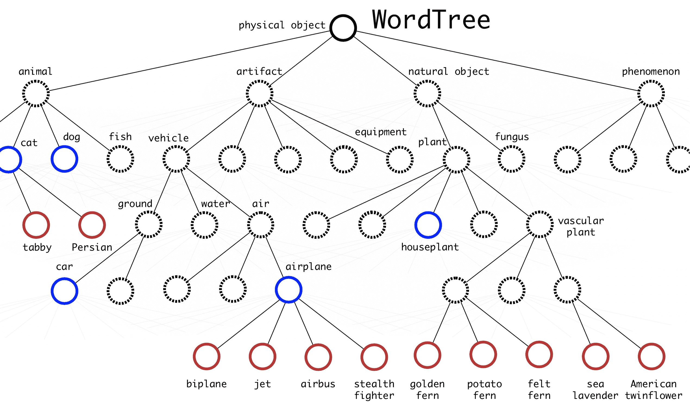

图 8。WordTree 层次结构合并了来自 COCO 和 ImageNet 的标签。蓝色节点是 COCO 标签，红色节点是 ImageNet 标签。（图片来源：[原论文](https://arxiv.org/abs/1612.08242)）

要预测类节点的概率，我们可以沿着从节点到根的路径进行：

```py
Pr("persian cat" | contain a "physical object") 
= Pr("persian cat" | "cat") 
  Pr("cat" | "animal") 
  Pr("animal" | "physical object") 
  Pr(contain a "physical object")    # confidence score. 
```

注意`Pr（包含“物理对象”）`是置信度分数，在边界框检测管道中单独预测。条件概率预测的路径可以在任何步骤停止，取决于哪些标签可用。

# RetinaNet

**RetinaNet**（[Lin 等人，2018](https://arxiv.org/abs/1708.02002)）是一种单阶段密集目标检测器。两个关键构建模块是*特征化图像金字塔*和使用*焦点损失*。

## 焦点损失

目标检测模型训练的一个问题是背景中没有对象而前景中包含感兴趣的对象之间存在极端不平衡。**焦点损失**旨在对难以分类的例子（即具有嘈杂纹理或部分对象的背景）分配更多权重，并对易例子（即明显为空的背景）进行降权。

从普通的二元分类交叉熵损失开始，

$$ \text{CE}(p, y) = -y\log p - (1-y)\log(1-p) $$

其中$y \in \{0, 1\}$是一个地面真实的二进制标签，表示边界框是否包含对象，$p \in [0, 1]$是对象性的预测概率（也称为置信度分数）。

为了方便表示，

$$ \text{let } p_t = \begin{cases} p & \text{if } y = 1\\ 1-p & \text{otherwise} \end{cases}, \text{then } \text{CE}(p, y)=\text{CE}(p_t) = -\log p_t $$

易分类的示例，即$p_t \gg 0.5$，即$p$非常接近 0（当 y=0 时）或 1（当 y=1 时），可能会产生具有非平凡幅度的损失。焦点损失明确地向交叉熵的每一项添加一个权重因子$(1-p_t)^\gamma, \gamma \geq 0$，以便当$p_t$很大时权重很小，因此易例被降权。

$$ \text{FL}(p_t) = -(1-p_t)^\gamma \log p_t $$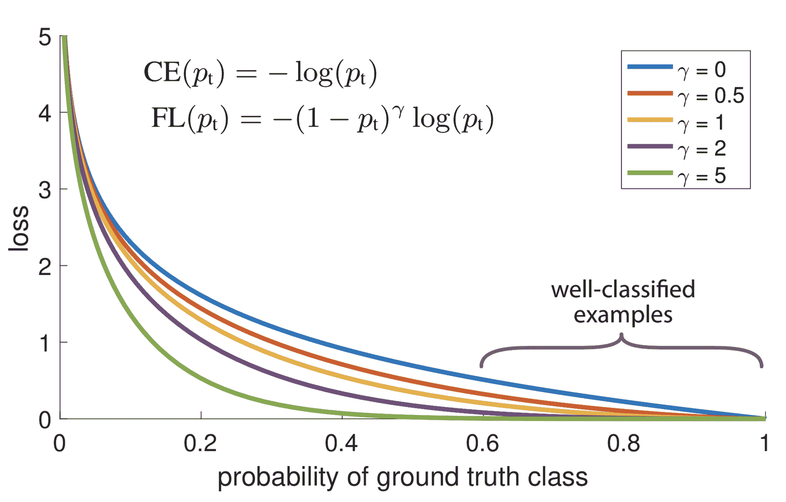

图 9\. 焦点损失通过$(1-p\_t)^\gamma$因子更少地关注简单的示例。(图片来源：[原始论文](https://arxiv.org/abs/1708.02002))

为了更好地控制权重函数的形状（见图 10），RetinaNet 使用焦点损失的$\alpha$平衡变体，其中$\alpha=0.25, \gamma=2$效果最好。

$$ \text{FL}(p_t) = -\alpha (1-p_t)^\gamma \log p_t $$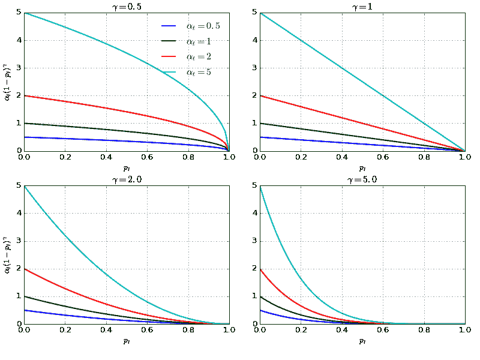

图 10\. 焦点损失权重$\alpha (1-p\_t)^\gamma$作为$p\_t$的函数的绘图，给定不同的$\alpha$和$\gamma$值。

## 特征化图像金字塔

**特征化图像金字塔**（[Lin 等人，2017](https://arxiv.org/abs/1612.03144)）是 RetinaNet 的骨干网络。遵循 SSD 中的图像金字塔相同方法，特征化图像金字塔为不同尺度的目标检测提供了基本的视觉组件。

特征金字塔网络的关键思想在图 11 中展示。基本结构包含一系列*金字塔级别*，每个级别对应一个网络*阶段*。一个阶段包含多个相同大小的卷积层，阶段大小按 2 的倍数缩小。我们将第$i$个阶段的最后一层表示为$C_i$。

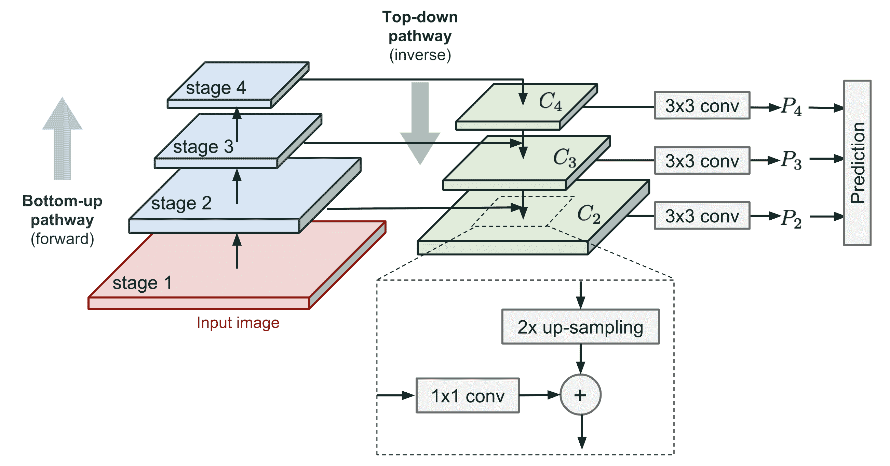

图 11\. 特征化图像金字塔模块的示意图。（基于[FPN 论文](https://arxiv.org/abs/1612.03144)中的图 3 重新绘制）

两个路径连接卷积层：

+   **自下而上路径** 是正常的前向计算。

+   **自上而下路径** 沿相反方向进行，通过横向连接将粗糙但语义更强的特征图返回到较大尺寸的先前金字塔级别中。

    +   首先，更高级别的特征被空间上采样至 2 倍大小。对于图像上采样，论文使用最近邻插值。虽然有许多[图像上采样算法](https://en.wikipedia.org/wiki/Image_scaling#Algorithms)，如使用[反卷积](https://www.tensorflow.org/api_docs/python/tf/layers/conv2d_transpose)，采用另一种图像缩放方法可能会或可能不会提高 RetinaNet 的性能。

    +   较大的特征图经过 1x1 卷积层以减少通道维度。

    +   最后，这两个特征图通过逐元素相加合并。

        横向连接仅发生在阶段的最后一层，表示为 $\{C_i\}$，该过程持续进行直到生成最细（最大）的合并特征图。在经过 3x3 卷积层后，每个合并地图 $\{P_i\}$ 进行预测。

根据消融研究，图像金字塔设计组件的重要性排名如下：**1x1 横向连接** > 跨多个层检测对象 > 自顶向下丰富 > 金字塔表示（与仅检查最细层相比）。

## 模型架构

特征化金字塔是在 ResNet 架构的顶部构建的。回想一下，ResNet 有 5 个卷积块（= 网络阶段 / 金字塔级别）。第 $i$ 个金字塔级别的最后一层，$C_i$，的分辨率比原始输入维度低 $2^i$。

RetinaNet 利用特征金字塔级别 $P_3$ 到 $P_7$：

+   $P_3$ 到 $P_5$ 是从 $C_3$ 到 $C_5$ 对应的 ResNet 残差阶段计算得出的。它们通过自顶向下和自底向上的路径连接在一起。

+   $P_6$ 是在 $C_5$ 顶部进行的 3×3 步长为 2 的卷积得到的。

+   $P_7$ 在 $P_6$ 上应用 ReLU 和 3×3 步长为 2 的卷积。

在 ResNet 上添加更高的金字塔级别可以提高检测大物体的性能。

与 SSD 中一样，通过在每个合并特征图上进行预测，所有金字塔级别中都发生检测。因为预测共享相同的分类器和框回归器，它们都被形成为具有相同的通道维度 d=256。

每个级别有 A=9 个锚框：

+   基础尺寸对应于 $P_3$ 到 $P_7$ 上的 $32²$ 到 $512²$ 像素的区域。有三个尺寸比率，$\{2⁰, 2^{1/3}, 2^{2/3}\}$。

+   对于每个尺寸，有三个长宽比 {1/2, 1, 2}。

与往常一样，对于每个锚框，模型在分类子网络中为 $K$ 个类别中的每一个输出类别概率，并在框回归子网络中回归从该锚框到最近的地面真实对象的偏移。分类子网络采用上面介绍的焦点损失。

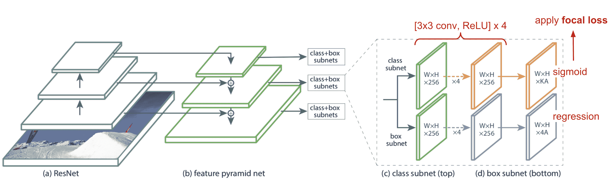

图 12\. RetinaNet 模型架构在 ResNet 顶部使用了[FPN](https://arxiv.org/abs/1612.03144)骨干。 （图片来源：[FPN](https://arxiv.org/abs/1612.03144) 论文）

# YOLOv3

[YOLOv3](https://pjreddie.com/media/files/papers/YOLOv3.pdf) 是通过在 YOLOv2 上应用一系列设计技巧而创建的。这些变化受到目标检测领域最新进展的启发。

以下是一些变化的列表：

**1\. 置信度分数的逻辑回归**：YOLOv3 使用*逻辑回归*为每个边界框预测置信度分数，而 YOLO 和 YOLOv2 使用平方误差的和作为分类项（参见上面的损失函数）。偏移预测的线性回归会导致 mAP 的降低。

**2\. 不再使用 softmax 进行类别预测**：在预测类别置信度时，YOLOv3 为每个类别使用*多个独立的逻辑分类器*，而不是一个 softmax 层。这对于考虑到一个图像可能有多个标签且不是所有标签都保证是互斥的情况非常有帮助。

**3\. Darknet + ResNet 作为基础模型**：新的 Darknet-53 仍然依赖于连续的 3x3 和 1x1 卷积层，就像原始的 dark net 架构一样，但添加了残差块。

**4\. 多尺度预测**：受到图像金字塔的启发，YOLOv3 在基础特征提取模型之后添加了几个卷积层，并在这些卷积层中的三个不同尺度上进行预测。这样，它必须处理各种尺寸的许多边界框候选。

**5\. 跨层连接**：YOLOv3 还在两个预测层（除了输出层）和较早的细粒度特征图之间添加了跨层连接。模型首先上采样粗糙特征图，然后通过连接与之前的特征图合并。与细粒度信息的结合使其更擅长检测小物体。

有趣的是，焦点损失对 YOLOv3 没有帮助，可能是由于使用了$\lambda_\text{noobj}$和$\lambda_\text{coord}$ —— 它们增加了边界框位置预测的损失，并减少了背景框置信度预测的损失。

总体而言，YOLOv3 的性能比 SSD 更好更快，比 RetinaNet 差但快 3.8 倍。

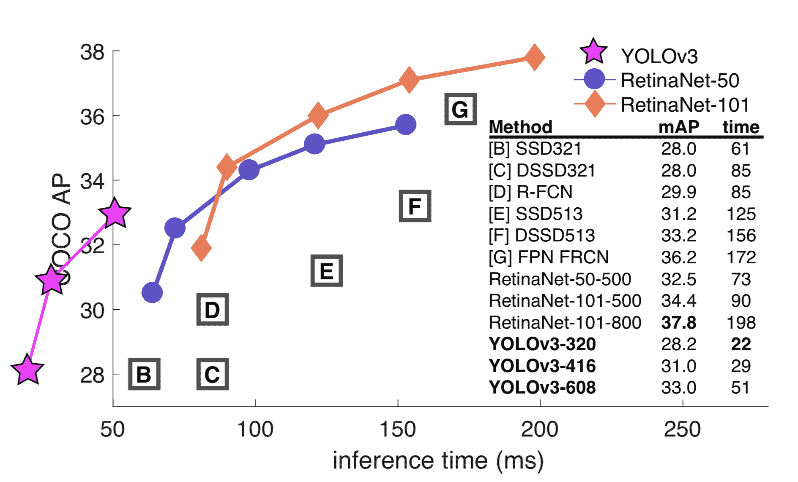

图 13\. 各种快速目标检测模型在速度和 mAP 性能上的比较。（图片来源：[焦点损失](https://arxiv.org/abs/1708.02002) 论文，附加标签来自[YOLOv3](https://pjreddie.com/media/files/papers/YOLOv3.pdf) 论文。）

* * *

被引用为：

```py
@article{weng2018detection4,
  title   = "Object Detection Part 4: Fast Detection Models",
  author  = "Weng, Lilian",
  journal = "lilianweng.github.io",
  year    = "2018",
  url     = "https://lilianweng.github.io/posts/2018-12-27-object-recognition-part-4/"
} 
```

# 参考文献

[1] Joseph Redmon 等人. [“You only look once: 统一的实时目标检测。”](https://www.cv-foundation.org/openaccess/content_cvpr_2016/papers/Redmon_You_Only_Look_CVPR_2016_paper.pdf) CVPR 2016.

[2] Joseph Redmon 和 Ali Farhadi. [“YOLO9000: 更好、更快、更强。”](http://openaccess.thecvf.com/content_cvpr_2017/papers/Redmon_YOLO9000_Better_Faster_CVPR_2017_paper.pdf) CVPR 2017.

[3] Joseph Redmon, Ali Farhadi. [“YOLOv3: 一个渐进改进。”](https://pjreddie.com/media/files/papers/YOLOv3.pdf).

[4] Wei Liu 等人. [“SSD: 单次多框检测器。”](https://arxiv.org/abs/1512.02325) ECCV 2016.

[5] Tsung-Yi Lin 等人. [“用于目标检测的特征金字塔网络。”](https://arxiv.org/abs/1612.03144) CVPR 2017.

[6] Tsung-Yi Lin 等人. [“密集目标检测的焦点损失。”](https://arxiv.org/abs/1708.02002) IEEE 模式分析与机器智能交易，2018 年。

[7] [“YOLO v3 有什么新功能？”](https://towardsdatascience.com/yolo-v3-object-detection-53fb7d3bfe6b) 作者 Ayoosh Kathuria 在“Towards Data Science”上，2018 年 4 月 23 日发布。
