# 元学习：学会快速学习

> 原文：[`lilianweng.github.io/posts/2018-11-30-meta-learning/`](https://lilianweng.github.io/posts/2018-11-30-meta-learning/)

[更新于 2019-10-01：感谢天豪，我们有这篇文章的[中文翻译](https://wei-tianhao.github.io/blog/2019/09/17/meta-learning.html)！]

一个良好的机器学习模型通常需要使用大量样本进行训练。相比之下，人类学习新概念和技能的速度更快，更有效。只见过几次猫和鸟的孩子可以很快区分它们。知道如何骑自行车的人很可能会快速学会如何骑摩托车，甚至几乎不需要演示。是否可能设计一个具有类似特性的机器学习模型——用少量训练示例快速学习新概念和技能？这基本上是**元学习**的目标所在。

我们期望一个良好的元学习模型能够很好地适应或泛化到在训练时从未遇到过的新任务和新环境。适应过程，本质上是一个小型的学习会话，在测试时发生，但对新任务配置的暴露有限。最终，适应后的模型可以完成新任务。这就是为什么元学习也被称为[学会学习](https://www.cs.cmu.edu/~rsalakhu/papers/LakeEtAl2015Science.pdf)。

任务可以是任何明确定义的机器学习问题族：监督学习，强化学习等。例如，这里有一些具体的元学习任务：

+   一个在非猫图像上训练的分类器，在看过几张猫的图片后就能判断给定的图片是否包含猫。

+   一个游戏机器人能够迅速掌握一个新游戏。

+   一个小型机器人在测试期间在上坡表面上完成所需的任务，即使它只在平坦表面环境中接受过训练。

# 定义元学习问题

在这篇文章中，我们关注的是每个期望的任务都是像图像分类这样的监督学习问题的情况。关于使用强化学习问题进行元学习的有很多有趣的文献（也称为“元强化学习”），但我们在这里不会涉及到。

## 一个简单的观点

一个良好的元学习模型应该在各种学习任务上进行训练，并针对任务分布进行优化，包括潜在的未见任务。每个任务都与一个包含特征向量和真实标签的数据集$\mathcal{D}$相关联。最佳模型参数为：

$$ \theta^* = \arg\min_\theta \mathbb{E}_{\mathcal{D}\sim p(\mathcal{D})} [\mathcal{L}_\theta(\mathcal{D})] $$

它看起来非常类似于普通的学习任务，但*一个数据集*被视为*一个数据样本*。

*少样本分类*是监督学习领域中元学习的一个实例。数据集$\mathcal{D}$通常被分为两部分，一个用于学习的支持集$S$和一个用于训练或测试的预测集$B$，$\mathcal{D}=\langle S, B\rangle$。通常我们考虑*K-shot N-class 分类*任务：支持集包含每个 N 类别的 K 个带标签示例。

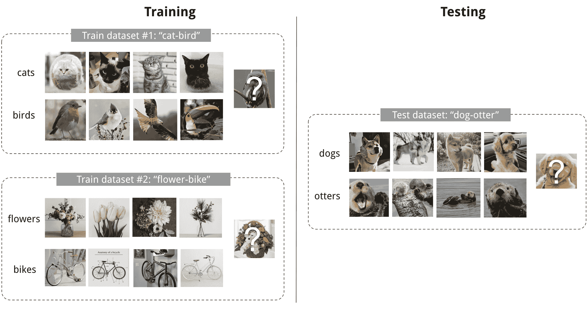

图 1\. 一个 4-shot 2-class 图像分类的示例。（图片缩略图来自[Pinterest](https://www.pinterest.com/)）

## 训练方式与测试方式相同

数据集$\mathcal{D}$包含特征向量和标签对，$\mathcal{D} = \{(\mathbf{x}_i, y_i)\}$，每个标签属于已知标签集$\mathcal{L}^\text{label}$。假设我们的分类器$f_\theta$使用参数$\theta$输出给定特征向量$\mathbf{x}$的数据点属于类别$y$的概率，$P_\theta(y\vert\mathbf{x})$。

最优参数应该最大化跨多个训练批次$B \subset \mathcal{D}$的真实标签概率：

$$ \begin{aligned} \theta^* &= {\arg\max}_{\theta} \mathbb{E}_{(\mathbf{x}, y)\in \mathcal{D}}[P_\theta(y \vert \mathbf{x})] &\\ \theta^* &= {\arg\max}_{\theta} \mathbb{E}_{B\subset \mathcal{D}}[\sum_{(\mathbf{x}, y)\in B}P_\theta(y \vert \mathbf{x})] & \scriptstyle{\text{; 使用小批量进行训练。}} \end{aligned} $$

在少样本分类中，目标是在给定一个小支持集进行“快速学习”（想想“微调”是如何工作的）的情况下减少对具有未知标签数据样本的预测错误。为了使训练过程模拟推断过程中发生的情况，我们希望“伪造”数据集，其中包含一部分标签，以避免向模型暴露所有标签，并相应地修改优化过程以鼓励快速学习：

1.  抽取标签的子集，$L\subset\mathcal{L}^\text{label}$。

1.  从数据集$\mathcal{D}$中抽取一个支持集$S^L$和一个训练批次$B^L$。它们只包含属于抽样标签集$L$的带标签数据点，$y \in L, \forall (x, y) \in S^L, B^L$。

1.  支持集是模型输入的一部分。

1.  最终的优化使用小批量$B^L$来计算损失并通过反向传播更新模型参数，与我们在监督学习中使用的方式相同。

您可以将每对抽样数据集$(S^L, B^L)$视为一个数据点。模型被训练以便能够推广到其他数据集。除了监督学习目标外，红色符号被添加用于元学习。

$$ \theta = \arg\max_\theta \color{red}{E_{L\subset\mathcal{L}}[} E_{\color{red}{S^L \subset\mathcal{D}, }B^L \subset\mathcal{D}} [\sum_{(x, y)\in B^L} P_\theta(x, y\color{red}{, S^L})] \color{red}{]} $$

这个想法在某种程度上类似于在图像分类（ImageNet）或语言建模（大文本语料库）中使用预训练模型，当只有有限的任务特定数据样本可用时。元学习将这个想法推进一步，而不是根据一个下游任务微调，它优化模型使其在许多甚至所有任务上表现良好。

## 学习者和元学习者

元学习的另一个流行观点将模型更新分解为两个阶段：

+   分类器$f_\theta$是“学习者”模型，用于执行给定任务；

+   与此同时，优化器$g_\phi$学习如何通过支持集$S$更新学习者模型的参数，$\theta' = g_\phi(\theta, S)$。

然后在最终优化步骤中，我们需要更新$\theta$和$\phi$以最大化：

$$ \mathbb{E}_{L\subset\mathcal{L}}[ \mathbb{E}_{S^L \subset\mathcal{D}, B^L \subset\mathcal{D}} [\sum_{(\mathbf{x}, y)\in B^L} P_{g_\phi(\theta, S^L)}(y \vert \mathbf{x})]] $$

## 常见方法

元学习有三种常见方法：基于度量、基于模型和基于优化。Oriol Vinyals 在他在 2018 年 NIPS 元学习研讨会上的[演讲](http://metalearning-symposium.ml/files/vinyals.pdf)中有一个很好的总结：

| ————- | ————- | ————- | ————- |
| --- | --- | --- | --- |
|  | 基于模型 | 基于度量 | 基于优化 |
| --- | --- | --- | --- |
| **关键思想** | RNN；记忆 | 度量学习 | 梯度下降 |
| **$P_\theta(y \vert \mathbf{x})$是如何建模的？** | $f_\theta(\mathbf{x}, S)$ | $\sum_{(\mathbf{x}_i, y_i) \in S} k_\theta(\mathbf{x}, \mathbf{x}_i)y_i$ (*) | $P_{g_\phi(\theta, S^L)}(y \vert \mathbf{x})$ |

(*) $k_\theta$是一个核函数，衡量$\mathbf{x}_i$和$\mathbf{x}$之间的相似性。

接下来我们将回顾每种方法中的经典模型。

# 基于度量

基于度量的元学习的核心思想类似于最近邻算法（即，[k-NN](https://en.wikipedia.org/wiki/K-nearest_neighbors_algorithm)分类器和[k-means](https://en.wikipedia.org/wiki/K-means_clustering)聚类）和[核密度估计](https://en.wikipedia.org/wiki/Kernel_density_estimation)。对于一组已知标签$y$的预测概率是支持集样本标签的加权和。权重由核函数$k_\theta$生成，衡量两个数据样本之间的相似性。

$$ P_\theta(y \vert \mathbf{x}, S) = \sum_{(\mathbf{x}_i, y_i) \in S} k_\theta(\mathbf{x}, \mathbf{x}_i)y_i $$

学习一个好的核对于基于度量的元学习模型的成功至关重要。[度量学习](https://en.wikipedia.org/wiki/Similarity_learning#Metric_learning)与此意图高度一致，因为它旨在学习对象之间的度量或距离函数。一个好的度量概念是依赖于问题的。它应该代表输入在任务空间中的关系，并促进问题解决。

下面介绍的所有模型都明确学习输入数据的嵌入向量，并使用它们设计适当的核函数。

## 卷积暹罗神经网络

[暹罗神经网络](https://papers.nips.cc/paper/769-signature-verification-using-a-siamese-time-delay-neural-network.pdf)由两个孪生网络组成，它们的输出通过一个函数联合训练，学习输入数据样本对之间的关系。这两个孪生网络是相同的，共享相同的权重和网络参数。换句话说，两者都指向相同的嵌入网络，该网络学习有效的嵌入以揭示数据点对之间的关系。

[Koch, Zemel & Salakhutdinov (2015)](http://www.cs.toronto.edu/~rsalakhu/papers/oneshot1.pdf) 提出了一种使用暹罗神经网络进行一次性图像分类的方法。首先，暹罗网络被训练用于验证任务，告诉两个输入图像是否属于同一类。它输出两个图像属于同一类的概率。然后，在测试时，暹罗网络处理测试图像与支持集中每个图像之间的所有图像对。最终预测是支持图像的类别，其概率最高。

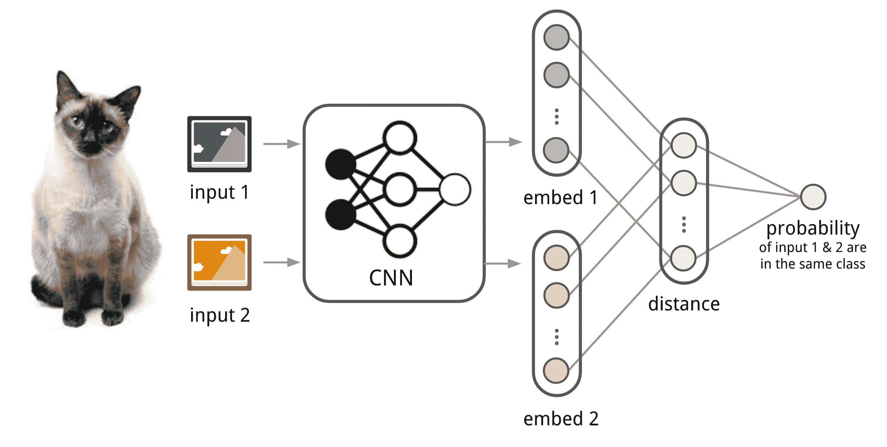

图 2\. 用于少样本图像分类的卷积暹罗神经网络架构。

1.  首先，卷积暹罗网络通过一个包含几个卷积层的嵌入函数 $f_\theta$ 学习将两个图像编码为特征向量。

1.  两个嵌入之间的 L1 距离是 $\vert f_\theta(\mathbf{x}_i) - f_\theta(\mathbf{x}_j) \vert$。

1.  距离通过线性前馈层和 Sigmoid 转换为概率 $p$。这是两个图像是否来自同一类的概率。

1.  直观上，损失是交叉熵，因为标签是二进制的。

$$ \begin{aligned} p(\mathbf{x}_i, \mathbf{x}_j) &= \sigma(\mathbf{W}\vert f_\theta(\mathbf{x}_i) - f_\theta(\mathbf{x}_j) \vert) \\ \mathcal{L}(B) &= \sum_{(\mathbf{x}_i, \mathbf{x}_j, y_i, y_j)\in B} \mathbf{1}_{y_i=y_j}\log p(\mathbf{x}_i, \mathbf{x}_j) + (1-\mathbf{1}_{y_i=y_j})\log (1-p(\mathbf{x}_i, \mathbf{x}_j)) \end{aligned} $$

训练批次 $B$ 中的图像可以通过失真进行增强。当然，您可以用其他距离度量替换 L1 距离，如 L2、余弦等。只需确保它们是可微的，然后其他一切都一样。

给定一个支持集 $S$ 和一个测试图像 $\mathbf{x}$，最终预测的类别是：

$$ \hat{c}_S(\mathbf{x}) = c(\arg\max_{\mathbf{x}_i \in S} P(\mathbf{x}, \mathbf{x}_i)) $$

其中 $c(\mathbf{x})$ 是图像 $\mathbf{x}$ 的类标签，$\hat{c}(.)$ 是预测标签。

假设学习到的嵌入可以推广为用于测量未知类别图像之间距离的有用工具。这与通过采用预训练模型进行迁移学习的假设相同；例如，通过 ImageNet 预训练的模型中学习的卷积特征预计将有助于其他图像任务。然而，当新任务与模型训练的原始任务偏离时，预训练模型的好处会减少。

## 匹配网络

**匹配网络**的任务（[Vinyals 等人，2016](http://papers.nips.cc/paper/6385-matching-networks-for-one-shot-learning.pdf)）是为任何给定的（小型）支持集$S=\{x_i, y_i\}_{i=1}^k$学习一个分类器$c_S$（*k-shot*分类）。该分类器定义了在给定测试样本$\mathbf{x}$的情况下输出标签$y$的概率分布。与其他基于度量的模型类似，分类器的输出被定义为由注意力核$a(\mathbf{x}, \mathbf{x}_i)$加权的支持样本标签的总和 - 这应与$\mathbf{x}$和$\mathbf{x}_i$之间的相似性成比例。

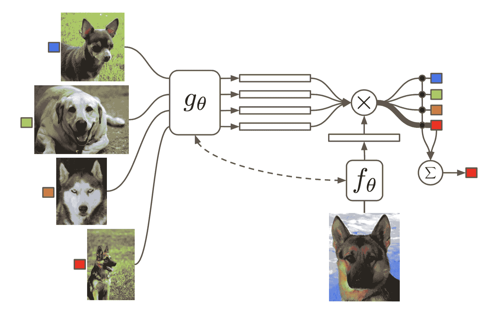

图 3. 匹配网络的架构。（图片来源：[原始论文](http://papers.nips.cc/paper/6385-matching-networks-for-one-shot-learning.pdf)）

$$ c_S(\mathbf{x}) = P(y \vert \mathbf{x}, S) = \sum_{i=1}^k a(\mathbf{x}, \mathbf{x}_i) y_i \text{，其中} S=\{(\mathbf{x}_i, y_i)\}_{i=1}^k $$

注意力核取决于两个嵌入函数$f$和$g$，用于编码测试样本和支持集样本。两个数据点之间的注意力权重是它们嵌入向量之间的余弦相似性，通过 softmax 进行归一化：

$$ a(\mathbf{x}, \mathbf{x}_i) = \frac{\exp(\text{cosine}(f(\mathbf{x}), g(\mathbf{x}_i))}{\sum_{j=1}^k\exp(\text{cosine}(f(\mathbf{x}), g(\mathbf{x}_j))} $$

### 简单嵌入

在简单版本中，嵌入函数是一个具有单个数据样本作为输入的神经网络。潜在地，我们可以设置$f=g$。

### 完整上下文嵌入

嵌入向量是构建良好分类器的关键输入。仅以单个数据点作为输入可能不足以有效地衡量整个特征空间。因此，匹配网络模型进一步提出通过除原始输入外还将整个支持集$S$作为输入来增强嵌入函数，以便根据与其他支持样本的关系调整学习到的嵌入。

+   $g_\theta(\mathbf{x}_i, S)$使用双向 LSTM 对$\mathbf{x}_i$在整个支持集$S$的上下文中进行编码。

+   $f_\theta(\mathbf{x}, S)$通过对支持集$S$进行读取注意力的 LSTM 对测试样本$\mathbf{x}$进行编码。

    1.  首先，测试样本通过一个简单的神经网络（如 CNN）进行处理，提取基本特征$f'(\mathbf{x})$。

    1.  然后，一个 LSTM 被训练，其中包括对支持集的读取注意力向量作为隐藏状态的一部分。

        $$ \begin{aligned} \hat{\mathbf{h}}_t, \mathbf{c}_t &= \text{LSTM}(f'(\mathbf{x}), [\mathbf{h}_{t-1}, \mathbf{r}_{t-1}], \mathbf{c}_{t-1}) \\ \mathbf{h}_t &= \hat{\mathbf{h}}_t + f'(\mathbf{x}) \\ \mathbf{r}_{t-1} &= \sum_{i=1}^k a(\mathbf{h}_{t-1}, g(\mathbf{x}_i)) g(\mathbf{x}_i) \\ a(\mathbf{h}_{t-1}, g(\mathbf{x}_i)) &= \text{softmax}(\mathbf{h}_{t-1}^\top g(\mathbf{x}_i)) = \frac{\exp(\mathbf{h}_{t-1}^\top g(\mathbf{x}_i))}{\sum_{j=1}^k \exp(\mathbf{h}_{t-1}^\top g(\mathbf{x}_j))} \end{aligned} $$

    1.  最终，如果我们进行 K 步“读取”，则$f(\mathbf{x}, S)=\mathbf{h}_K$。

这种嵌入方法被称为“全上下文嵌入（FCE）”。有趣的是，它确实有助于提高在一个困难任务（在迷你 ImageNet 上的少样本分类）上的性能，但在一个简单任务（Omniglot）上没有任何区别。

Matching Networks 中的训练过程旨在匹配测试时的推理，详细信息请参见之前的部分。值得一提的是，Matching Networks 论文完善了训练和测试条件应该匹配的想法。

$$ \theta^* = \arg\max_\theta \mathbb{E}_{L\subset\mathcal{L}}[ \mathbb{E}_{S^L \subset\mathcal{D}, B^L \subset\mathcal{D}} [\sum_{(\mathbf{x}, y)\in B^L} P_\theta(y\vert\mathbf{x}, S^L)]] $$

## 关系网络

**关系网络（RN）**（[Sung 等，2018](http://openaccess.thecvf.com/content_cvpr_2018/papers_backup/Sung_Learning_to_Compare_CVPR_2018_paper.pdf)）类似于孪生网络，但有一些区别：

1.  在特征空间中，关系不是通过简单的 L1 距离来捕捉，而是由 CNN 分类器$g_\phi$来预测。一对输入$\mathbf{x}_i$和$\mathbf{x}_j$之间的关系分数为$r_{ij} = g_\phi([\mathbf{x}_i, \mathbf{x}_j])$，其中$[.,.]$表示连接。

1.  目标函数是均方误差损失而不是交叉熵，因为概念上 RN 更注重预测关系分数，更像回归，而不是二元分类，$\mathcal{L}(B) = \sum_{(\mathbf{x}_i, \mathbf{x}_j, y_i, y_j)\in B} (r_{ij} - \mathbf{1}_{y_i=y_j})²$。

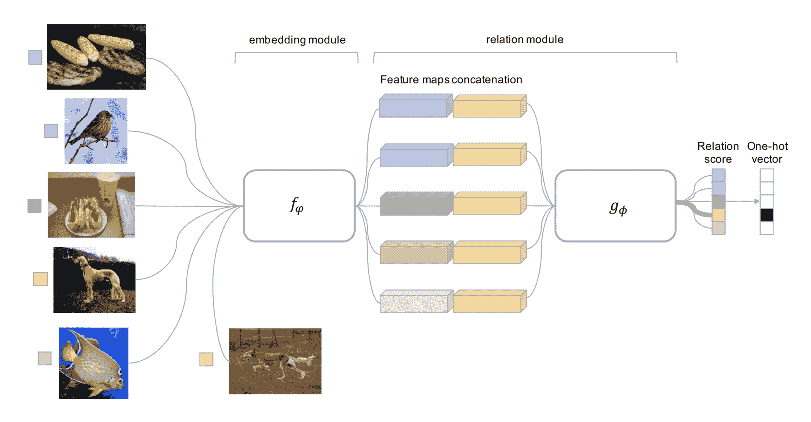

图 4. 一个 5 路 1 样本问题的关系网络架构，带有一个查询示例。（图片来源：[原始论文](http://openaccess.thecvf.com/content_cvpr_2018/papers_backup/Sung_Learning_to_Compare_CVPR_2018_paper.pdf)）

（注意：DeepMind 提出了另一个[关系网络](https://deepmind.com/blog/neural-approach-relational-reasoning/)用于关系推理。不要混淆。）

## 原型网络

**原型网络**（[Snell, Swersky & Zemel, 2017](http://papers.nips.cc/paper/6996-prototypical-networks-for-few-shot-learning.pdf)）使用嵌入函数$f_\theta$将每个输入编码为$M$维特征向量。为每个类$c \in \mathcal{C}$定义一个*原型*特征向量，作为该类中嵌入支持数据样本的平均向量。

$$ \mathbf{v}_c = \frac{1}{|S_c|} \sum_{(\mathbf{x}_i, y_i) \in S_c} f_\theta(\mathbf{x}_i) $$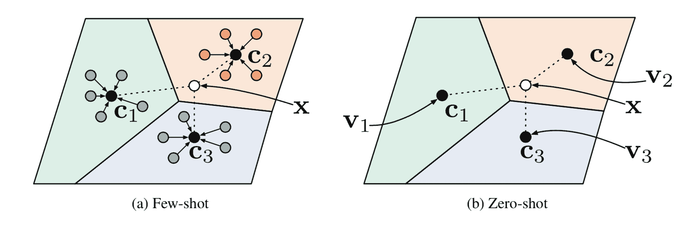

图 5。少样本和零样本情景中的原型网络。（图片来源：[原始论文](http://papers.nips.cc/paper/6996-prototypical-networks-for-few-shot-learning.pdf)）

对于给定的测试输入$\mathbf{x}$，类别分布是测试数据嵌入和原型向量之间距离的逆 softmax。

$$ P(y=c\vert\mathbf{x})=\text{softmax}(-d_\varphi(f_\theta(\mathbf{x}), \mathbf{v}_c)) = \frac{\exp(-d_\varphi(f_\theta(\mathbf{x}), \mathbf{v}_c))}{\sum_{c' \in \mathcal{C}}\exp(-d_\varphi(f_\theta(\mathbf{x}), \mathbf{v}_{c'}))} $$

其中$d_\varphi$可以是任何距离函数，只要$\varphi$是可微的。在论文中，他们使用了平方欧氏距离。

损失函数是负对数似然：$\mathcal{L}(\theta) = -\log P_\theta(y=c\vert\mathbf{x})$。

# 基于模型

基于模型的元学习模型不对$P_\theta(y\vert\mathbf{x})$的形式做任何假设。相反，它依赖于专门设计用于快速学习的模型 —— 一个通过少量训练步骤快速更新参数的模型。这种快速参数更新可以通过其内部架构实现，或者由另一个元学习模型控制。

## 增强记忆神经网络

一类模型架构使用外部存储器来促进神经网络的学习过程，包括[神经图灵机](https://lilianweng.github.io/posts/2018-06-24-attention/#neural-turing-machines)和[记忆网络](https://arxiv.org/abs/1410.3916)。通过显式存储缓冲区，网络更容易快速整合新信息，并且不会在未来遗忘。这样的模型被称为**MANN**，即“**增强记忆神经网络**”。请注意，仅具有*内部记忆*的递归神经网络，如普通 RNN 或 LSTM，并不是 MANN。

因为 MANN 预计能够快速编码新信息，因此在仅有少量样本后适应新任务，非常适合元学习。以神经图灵机（NTM）为基础模型，[Santoro 等人（2016）](http://proceedings.mlr.press/v48/santoro16.pdf)在训练设置和记忆检索机制（或“寻址机制”，决定如何分配注意力权重给记忆向量）上提出了一系列修改。如果您对此事不熟悉，请先阅读[我的另一篇文章中的 NTM 部分](https://lilianweng.github.io/posts/2018-06-24-attention/#neural-turing-machines)。

简要回顾一下，NTM 将控制器神经网络与外部存储器耦合。控制器通过软注意力学习读写记忆行，而记忆作为知识库。注意力权重由其寻址机制生成：基于内容+基于位置。

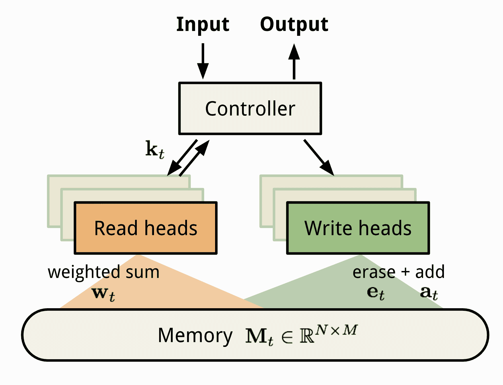

图 6. 神经图灵机（NTM）的架构。时间 t 的记忆$\mathbf{M}\_t$是一个大小为$N \times M$的矩阵，包含 N 个向量行，每个向量有 M 个维度。

### 用于元学习的 MANN

要将 MANN 用于元学习任务，我们需要以一种方式训练它，使得记忆能够快速编码和捕获新任务的信息，并且同时任何存储的表示都能够轻松稳定地访问。

[Santoro 等人，2016](http://proceedings.mlr.press/v48/santoro16.pdf)描述的训练以一种有趣的方式进行，使得记忆被迫保存信息更长时间，直到适当的标签稍后出现。在每个训练周期中，真实标签$y_t$与**一个步骤偏移**$(\mathbf{x}_{t+1}, y_t)$一起呈现：这是前一个时间步 t 的输入的真实标签，但作为时间步 t+1 的一部分呈现。

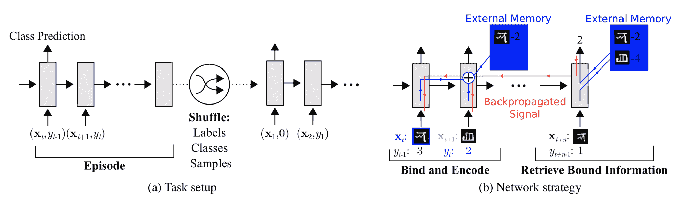

图 7. 元学习中 MANN 的任务设置（图片来源：[原始论文](http://proceedings.mlr.press/v48/santoro16.pdf)）。

这样，MANN 被激励去记忆新数据集的信息，因为记忆必须保存当前输入，直到稍后出现标签，然后检索旧信息以做出相应预测。

接下来让我们看看如何更新记忆以实现高效的信息检索和存储。

### 用于元学习的寻址机制

除了训练过程外，还利用了一种新的纯内容为基础的寻址机制，使模型更适合元学习。

**» 如何从记忆中读取？**

基于内容相似性构建的读取注意力。

首先，在时间步骤 t，控制器根据输入$\mathbf{x}$生成关键特征向量$\mathbf{k}_t$。类似于 NTM，读取加权向量$\mathbf{w}_t^r$由 N 个元素计算为关键向量与每个存储向量行之间的余弦相似性，通过 softmax 进行归一化。读取向量$\mathbf{r}_t$是通过这些权重加权的存储记录之和：

$$ \mathbf{r}_i = \sum_{i=1}^N w_t^r(i)\mathbf{M}_t(i) \text{，其中 } w_t^r(i) = \text{softmax}(\frac{\mathbf{k}_t \cdot \mathbf{M}_t(i)}{\|\mathbf{k}_t\| \cdot \|\mathbf{M}_t(i)\|}) $$

其中$M_t$是时间 t 的内存矩阵，$M_t(i)$是该矩阵中的第 i 行。

**» 如何写入内存？**

将新接收的信息写入内存的寻址机制操作方式很像[缓存替换](https://en.wikipedia.org/wiki/Cache_replacement_policies)策略。**最近最少使用访问（LRUA）**写入头设计为 MANN 在元学习场景中更好地工作。LRUA 写入头更倾向于将新内容写入*最少使用*的存储位置或*最近使用*的存储位置。

+   很少使用的位置：这样我们可以保留经常使用的信息（参见[LFU](https://en.wikipedia.org/wiki/Least_frequently_used)）；

+   最近使用的位置：动机是一旦检索到一条信息，它可能在一段时间内不会再次被调用（参见[MRU](https://en.wikipedia.org/wiki/Cache_replacement_policies#Most_recently_used_(MRU))）。

有许多缓存替换算法，每个算法都可能在不同的用例中以更好的性能替换此设计。此外，学习内存使用模式和寻址策略而不是随意设置它可能是一个好主意。

LRUA 的偏好是以可微分的方式进行的：

1.  时间 t 的使用权重$\mathbf{w}^u_t$是当前读取和写入向量的总和，另外还有上次使用权重的衰减，$\gamma \mathbf{w}^u_{t-1}$，其中$\gamma$是一个衰减因子。

1.  写入向量是前一个读取权重（更倾向于“最近使用的位置”）和前一个最少使用的权重（更倾向于“很少使用的位置”）之间的插值。插值参数是一个超参数$\alpha$的 sigmoid。

1.  最少使用的权重$\mathbf{w}^{lu}$根据使用权重$\mathbf{w}_t^u$进行缩放，其中如果任何维度小于向量中第 n 小的元素，则保持为 1，否则为 0。

$$ \begin{aligned} \mathbf{w}_t^u &= \gamma \mathbf{w}_{t-1}^u + \mathbf{w}_t^r + \mathbf{w}_t^w \\ \mathbf{w}_t^r &= \text{softmax}(\text{cosine}(\mathbf{k}_t, \mathbf{M}_t(i))) \\ \mathbf{w}_t^w &= \sigma(\alpha)\mathbf{w}_{t-1}^r + (1-\sigma(\alpha))\mathbf{w}^{lu}_{t-1}\\ \mathbf{w}_t^{lu} &= \mathbf{1}_{w_t^u(i) \leq m(\mathbf{w}_t^u, n)} \text{，其中 }m(\mathbf{w}_t^u, n)\text{ 是向量 }\mathbf{w}_t^u\text{ 中第 }n\text{ 小的元素。} \end{aligned} $$

最后，在由$\mathbf{w}_t^{lu}$指示的最少使用的内存位置被设置为零后，每个内存行都会被更新：

$$ \mathbf{M}_t(i) = \mathbf{M}_{t-1}(i) + w_t^w(i)\mathbf{k}_t, \forall i $$

## 元网络

**元网络**（[Munkhdalai & Yu, 2017](https://arxiv.org/abs/1703.00837)），简称**MetaNet**，是一个元学习模型，其架构和训练过程旨在*快速*泛化跨任务。

### 快速权重

MetaNet 的快速泛化依赖于“快速权重”。关于这个主题有一些论文，但我没有详细阅读所有这些论文，也没有找到一个非常具体的定义，只是对这个概念有一个模糊的认识。通常，神经网络中的权重是通过随机梯度下降在目标函数中更新的，这个过程被认为是缓慢的。学习的一种更快速的方式是利用一个神经网络来预测另一个神经网络的参数，生成的权重被称为*快速权重*。相比之下，普通基于 SGD 的权重被称为*慢速权重*。

在 MetaNet 中，损失梯度被用作*元信息*来填充学习快速权重的模型。慢速和快速权重被结合在神经网络中进行预测。

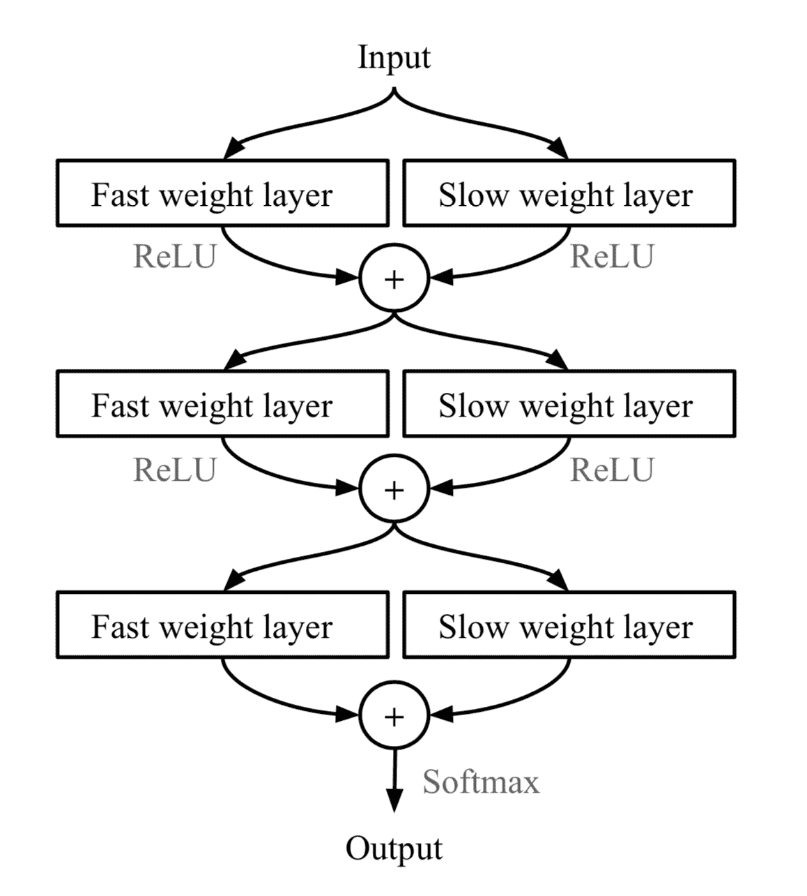

图 8. 在 MLP 中结合慢速和快速权重。$\bigoplus$是逐元素求和。（图片来源：[原始论文](https://arxiv.org/abs/1703.00837)）。

### 模型组件

> 免责声明：以下是我对论文中注释的不同之处。在我看来，这篇论文写得很差，但其中的想法仍然很有趣。因此，我用自己的语言呈现这个想法。

MetaNet 的关键组件包括：

+   由$\theta$参数化的嵌入函数$f_\theta$将原始输入编码为特征向量。类似于孪生神经网络，这些嵌入被训练为对于判断两个输入是否属于同一类别（验证任务）有用。

+   由权重$\phi$参数化的基础学习模型$g_\phi$完成实际学习任务。

如果我们到此为止，看起来就像关系网络。此外，MetaNet 明确地对两个函数的快速权重进行建模，然后将它们聚合回模型中（见图 8）。

因此，我们需要额外的两个函数分别输出$f$和$g$的快速权重。

+   $F_w$：由$w$参数化的 LSTM，用于学习嵌入函数$f$的快速权重$\theta^+$。它以$f$的嵌入损失的梯度作为输入，用于验证任务。

+   $G_v$：由$v$参数化的神经网络，从基学习器$g$的损失梯度中学习快速权重$\phi^+$。在 MetaNet 中，学习器的损失梯度被视为任务的*元信息*。

好的，现在让我们看看元网络是如何训练的。训练数据包含多对数据集：一个支持集$S=\{\mathbf{x}’_i, y’_i\}_{i=1}^K$和一个测试集$U=\{\mathbf{x}_i, y_i\}_{i=1}^L$。回想一下，我们有四个网络和四组模型参数要学习，$(\theta, \phi, w, v)$。

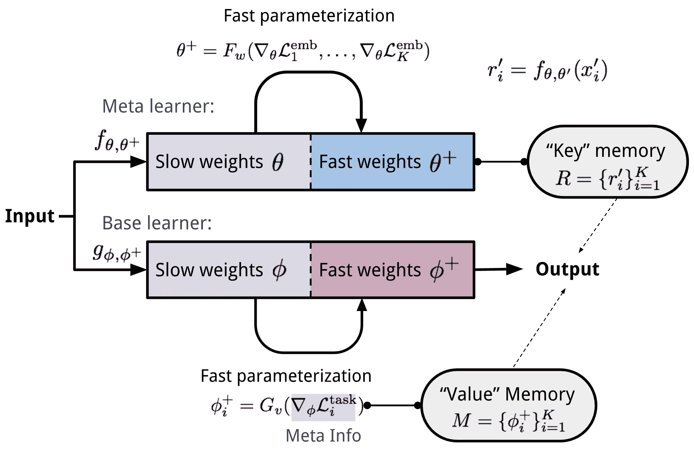

图 9\. MetaNet 架构。

### 训练过程

1.  在每个时间步$t$从支持集$S$中随机选择一对输入$(\mathbf{x}’_i, y’_i)$和$(\mathbf{x}’_j, y_j)$。令$\mathbf{x}_{(t,1)}=\mathbf{x}’_i$和$\mathbf{x}_{(t,2)}=\mathbf{x}’_j$。

    对于$t = 1, \dots, K$：

    +   a. 计算表示学习的损失；即，验证任务的交叉熵：

        $\mathcal{L}^\text{emb}_t = \mathbf{1}_{y’_i=y’_j} \log P_t + (1 - \mathbf{1}_{y’_i=y’_j})\log(1 - P_t)\text{，其中 }P_t = \sigma(\mathbf{W}\vert f_\theta(\mathbf{x}_{(t,1)}) - f_\theta(\mathbf{x}_{(t,2)})\vert)$

1.  计算任务级快速权重：$\theta^+ = F_w(\nabla_\theta \mathcal{L}^\text{emb}_1, \dots, \mathcal{L}^\text{emb}_T)$

1.  接下来，遍历支持集$S$中的示例，并计算示例级快速权重。同时，使用学习到的表示更新内存。

    对于$i=1, \dots, K$：

    +   a. 基学习器输出概率分布：$P(\hat{y}_i \vert \mathbf{x}_i) = g_\phi(\mathbf{x}_i)$，损失可以是交叉熵或均方误差：$\mathcal{L}^\text{task}_i = y’_i \log g_\phi(\mathbf{x}’_i) + (1- y’_i) \log (1 - g_\phi(\mathbf{x}’_i))$

    +   b. 提取任务的元信息（损失梯度）并计算示例级快速权重：$\phi_i^+ = G_v(\nabla_\phi\mathcal{L}^\text{task}_i)$

        +   然后将$\phi^+_i$存储到“值”内存$\mathbf{M}$的第$i$个位置。

    +   d. 使用慢权重和快速权重将支持样本编码为特定任务的输入表示：$r’_i = f_{\theta, \theta^+}(\mathbf{x}’_i)$

        +   然后将$r’_i$存储到“键”内存$\mathbf{R}$的第$i$个位置。

1.  最后，是构建使用测试集$U=\{\mathbf{x}_i, y_i\}_{i=1}^L$的训练损失的时候了。

    从$\mathcal{L}_\text{train}=0$开始：

    对于$j=1, \dots, L$：

    +   a. 将测试样本编码为特定任务的输入表示：$r_j = f_{\theta, \theta^+}(\mathbf{x}_j)$

    +   b. 快速权重通过关注内存中支持集样本的表示$\mathbf{R}$来计算。注意函数由您选择。这里 MetaNet 使用余弦相似度：

        $$ \begin{aligned} a_j &= \text{cosine}(\mathbf{R}, r_j) = [\frac{r'_1\cdot r_j}{\|r'_1\|\cdot\|r_j\|}, \dots, \frac{r'_N\cdot r_j}{\|r'_N\|\cdot\|r_j\|}]\\ \phi^+_j &= \text{softmax}(a_j)^\top \mathbf{M} \end{aligned} $$

    +   c. 更新训练损失：$\mathcal{L}_\text{train} \leftarrow \mathcal{L}_\text{train} + \mathcal{L}^\text{task}(g_{\phi, \phi^+}(\mathbf{x}_i), y_i) $

1.  使用$\mathcal{L}_\text{train}$更新所有参数$(\theta, \phi, w, v)$。

# 基于优化的

深度学习模型通过梯度反向传播学习。然而，基于梯度的优化既不是为了应对少量训练样本，也不是为了在少量优化步骤内收敛。有没有一种方法可以调整优化算法，使模型能够很好地学习少量示例？这就是基于优化的元学习算法的目的。

## LSTM 元学习者

优化算法可以被明确建模。[Ravi & Larochelle (2017)](https://openreview.net/pdf?id=rJY0-Kcll)这样做，并将其命名为“元学习者”，而处理任务的原始模型称为“学习者”。元学习者的目标是使用小支持集有效地更新学习者的参数，以便学习者可以快速适应新任务。

让我们将学习模型表示为由$\theta$参数化的$M_\theta$，将元学习者表示为由参数$\Theta$参数化的$R_\Theta$，损失函数为$\mathcal{L}$。

### 为什么选择 LSTM？

元学习者被建模为 LSTM，因为：

1.  梯度下降更新和 LSTM 中细胞状态更新之间存在相似性。

1.  知道梯度的历史有利于梯度更新；想想[动量](http://ruder.io/optimizing-gradient-descent/index.html#momentum)是如何工作的。

在时间步 t，学习者参数的更新与学习率$\alpha_t$为：

$$ \theta_t = \theta_{t-1} - \alpha_t \nabla_{\theta_{t-1}}\mathcal{L}_t $$

如果我们设置遗忘门$f_t=1$，输入门$i_t = \alpha_t$，细胞状态$c_t = \theta_t$，新细胞状态$\tilde{c}_t = -\nabla_{\theta_{t-1}}\mathcal{L}_t$，它与 LSTM 中的细胞状态更新具有相同的形式：

$$ \begin{aligned} c_t &= f_t \odot c_{t-1} + i_t \odot \tilde{c}_t\\ &= \theta_{t-1} - \alpha_t\nabla_{\theta_{t-1}}\mathcal{L}_t \end{aligned} $$

尽管固定$f_t=1$和$i_t=\alpha_t$可能不是最佳选择，但它们都可以是可学习的，并适应不同的数据集。

$$ \begin{aligned} f_t &= \sigma(\mathbf{W}_f \cdot [\nabla_{\theta_{t-1}}\mathcal{L}_t, \mathcal{L}_t, \theta_{t-1}, f_{t-1}] + \mathbf{b}_f) & \scriptstyle{\text{; 忘记旧参数值的程度。}}\\ i_t &= \sigma(\mathbf{W}_i \cdot [\nabla_{\theta_{t-1}}\mathcal{L}_t, \mathcal{L}_t, \theta_{t-1}, i_{t-1}] + \mathbf{b}_i) & \scriptstyle{\text{; 对应于时间步骤 t 的学习率。}}\\ \tilde{\theta}_t &= -\nabla_{\theta_{t-1}}\mathcal{L}_t &\\ \theta_t &= f_t \odot \theta_{t-1} + i_t \odot \tilde{\theta}_t &\\ \end{aligned} $$

### 模型设置

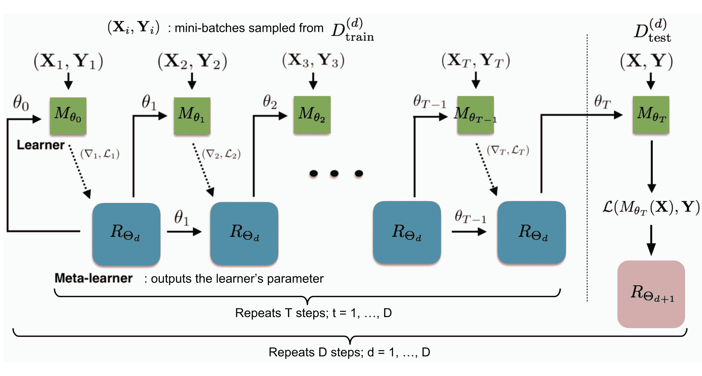

图 10\. 学习器 $M\_\theta$ 和元学习器 $R\_\Theta$ 的训练方式。 (图片来源：[原论文](https://openreview.net/pdf?id=rJY0-Kcll))，带有更多注释。

训练过程模拟了测试过程中发生的情况，因为已经证明在匹配网络中是有益的。在每个训练周期中，我们首先从 $\hat{\mathcal{D}}_\text{meta-train}$ 中抽样一个数据集 $\mathcal{D} = (\mathcal{D}_\text{train}, \mathcal{D}_\text{test})$，然后从 $\mathcal{D}_\text{train}$ 中抽样小批量数据来更新 $\theta$，进行 $T$ 轮。学习器参数 $\theta_T$ 的最终状态用于在测试数据 $\mathcal{D}_\text{test}$ 上训练元学习器。

两个需要额外注意的实现细节：

1.  如何在 LSTM 元学习器中压缩参数空间？由于元学习器正在建模另一个神经网络的参数，它将有数十万个要学习的变量。遵循[这个想法](https://arxiv.org/abs/1606.04474)跨坐标共享参数，

1.  为了简化训练过程，元学习器假设损失函数 $\mathcal{L}_t$ 和梯度 $\nabla_{\theta_{t-1}} \mathcal{L}_t$ 是独立的。

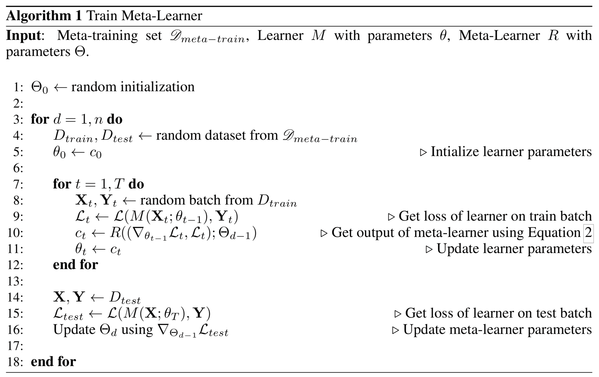

## MAML

**MAML**，即**模型无关元学习**（[Finn, et al. 2017](https://arxiv.org/abs/1703.03400)）是一种非常通用的优化算法，与通过梯度下降学习的任何模型兼容。

假设我们的模型是 $f_\theta$，具有参数 $\theta$。给定一个任务 $\tau_i$ 及其相关数据集 $(\mathcal{D}^{(i)}_\text{train}, \mathcal{D}^{(i)}_\text{test})$，我们可以通过一个或多个梯度下降步骤更新模型参数（以下示例仅包含一步）：

$$ \theta'_i = \theta - \alpha \nabla_\theta\mathcal{L}^{(0)}_{\tau_i}(f_\theta) $$

其中 $\mathcal{L}^{(0)}$ 是使用 id 为 (0) 的小数据批次计算的损失。

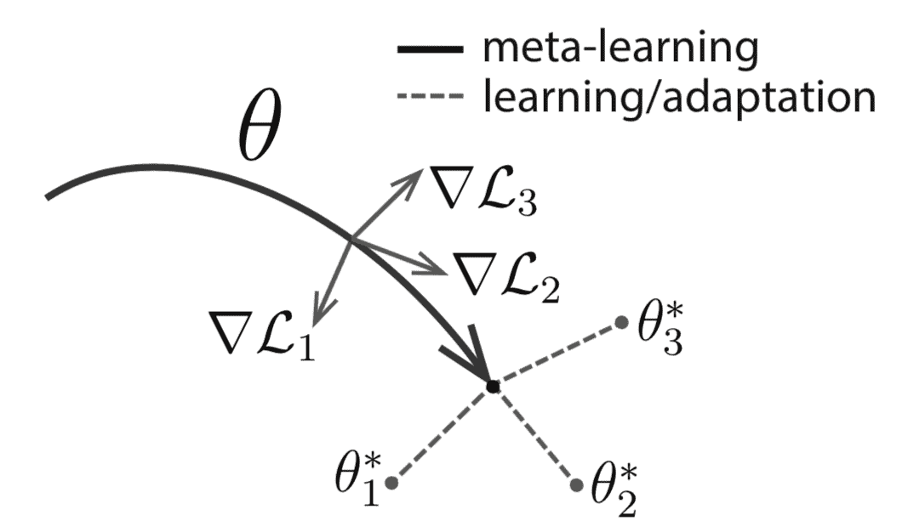

图 11\. MAML 的示意图。 (图片来源：[原论文](https://arxiv.org/abs/1703.03400))

好吧，上面的公式只优化了一个任务。为了在各种任务中实现良好的泛化，我们希望找到最优的$\theta^*$，使得任务特定的微调更加高效。现在，我们用 id 为(1)的新数据批次来更新元目标。损失，表示为$\mathcal{L}^{(1)}$，取决于小批次(1)。$\mathcal{L}^{(0)}$和$\mathcal{L}^{(1)}$中的上标仅表示不同的数据批次，并且它们指的是相同任务的相同损失目标。

$$ \begin{aligned} \theta^* &= \arg\min_\theta \sum_{\tau_i \sim p(\tau)} \mathcal{L}_{\tau_i}^{(1)} (f_{\theta'_i}) = \arg\min_\theta \sum_{\tau_i \sim p(\tau)} \mathcal{L}_{\tau_i}^{(1)} (f_{\theta - \alpha\nabla_\theta \mathcal{L}_{\tau_i}^{(0)}(f_\theta)}) & \\ \theta &\leftarrow \theta - \beta \nabla_{\theta} \sum_{\tau_i \sim p(\tau)} \mathcal{L}_{\tau_i}^{(1)} (f_{\theta - \alpha\nabla_\theta \mathcal{L}_{\tau_i}^{(0)}(f_\theta)}) & \scriptstyle{\text{; 更新规则}} \end{aligned} $$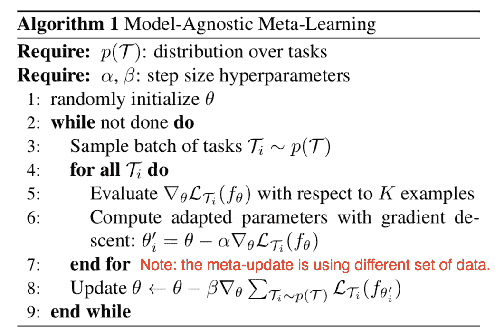

图 12\. MAML 算法的一般形式。 (图片来源: [原始论文](https://arxiv.org/abs/1703.03400))

### 一阶 MAML

上述元优化步骤依赖于二阶导数。为了使计算更加经济，修改版的 MAML 省略了二阶导数，导致了一个简化且更便宜的实现，被称为**一阶 MAML（FOMAML）**。

考虑执行$k$个内部梯度步骤的情况，$k\geq1$。从初始模型参数$\theta_\text{meta}$开始：

$$ \begin{aligned} \theta_0 &= \theta_\text{meta}\\ \theta_1 &= \theta_0 - \alpha\nabla_\theta\mathcal{L}^{(0)}(\theta_0)\\ \theta_2 &= \theta_1 - \alpha\nabla_\theta\mathcal{L}^{(0)}(\theta_1)\\ &\dots\\ \theta_k &= \theta_{k-1} - \alpha\nabla_\theta\mathcal{L}^{(0)}(\theta_{k-1}) \end{aligned} $$

然后在外循环中，我们对更新元目标进行新数据批次的采样。

$$ \begin{aligned} \theta_\text{meta} &\leftarrow \theta_\text{meta} - \beta g_\text{MAML} & \scriptstyle{\text{; 更新元目标}} \\[2mm] \text{其中 } g_\text{MAML} &= \nabla_{\theta} \mathcal{L}^{(1)}(\theta_k) &\\[2mm] &= \nabla_{\theta_k} \mathcal{L}^{(1)}(\theta_k) \cdot (\nabla_{\theta_{k-1}} \theta_k) \dots (\nabla_{\theta_0} \theta_1) \cdot (\nabla_{\theta} \theta_0) & \scriptstyle{\text{; 遵循链式法则}} \\ &= \nabla_{\theta_k} \mathcal{L}^{(1)}(\theta_k) \cdot \Big( \prod_{i=1}^k \nabla_{\theta_{i-1}} \theta_i \Big) \cdot I & \\ &= \nabla_{\theta_k} \mathcal{L}^{(1)}(\theta_k) \cdot \prod_{i=1}^k \nabla_{\theta_{i-1}} (\theta_{i-1} - \alpha\nabla_\theta\mathcal{L}^{(0)}(\theta_{i-1})) & \\ &= \nabla_{\theta_k} \mathcal{L}^{(1)}(\theta_k) \cdot \prod_{i=1}^k (I - \alpha\nabla_{\theta_{i-1}}(\nabla_\theta\mathcal{L}^{(0)}(\theta_{i-1}))) & \end{aligned} $$

MAML 梯度为：

$$ g_\text{MAML} = \nabla_{\theta_k} \mathcal{L}^{(1)}(\theta_k) \cdot \prod_{i=1}^k (I - \alpha \color{red}{\nabla_{\theta_{i-1}}(\nabla_\theta\mathcal{L}^{(0)}(\theta_{i-1}))}) $$

第一阶 MAML 忽略了红色部分的二阶导数。它简化如下，等同于最后一个内部梯度更新结果的导数。

$$ g_\text{FOMAML} = \nabla_{\theta_k} \mathcal{L}^{(1)}(\theta_k) $$

## Reptile

**Reptile** ([Nichol, Achiam & Schulman, 2018](https://arxiv.org/abs/1803.02999)) 是一个非常简单的元学习优化算法。在许多方面类似于 MAML，因为两者都依赖于通过梯度下降进行元优化，并且都是与模型无关的。

Reptile 通过重复以下步骤工作：

+   1.  采样一个任务，

+   1.  通过多次梯度下降步骤对其进行训练，

+   1.  然后将模型权重移向新参数。

查看下面的算法：$\text{SGD}(\mathcal{L}_{\tau_i}, \theta, k)$ 对损失$\mathcal{L}_{\tau_i}$进行 k 步随机梯度更新，从初始参数$\theta$开始，并返回最终参数向量。批处理版本在每次迭代中对多个任务进行采样，而不是一个。Reptile 梯度定义为$(\theta - W)/\alpha$，其中$\alpha$是 SGD 操作使用的步长。

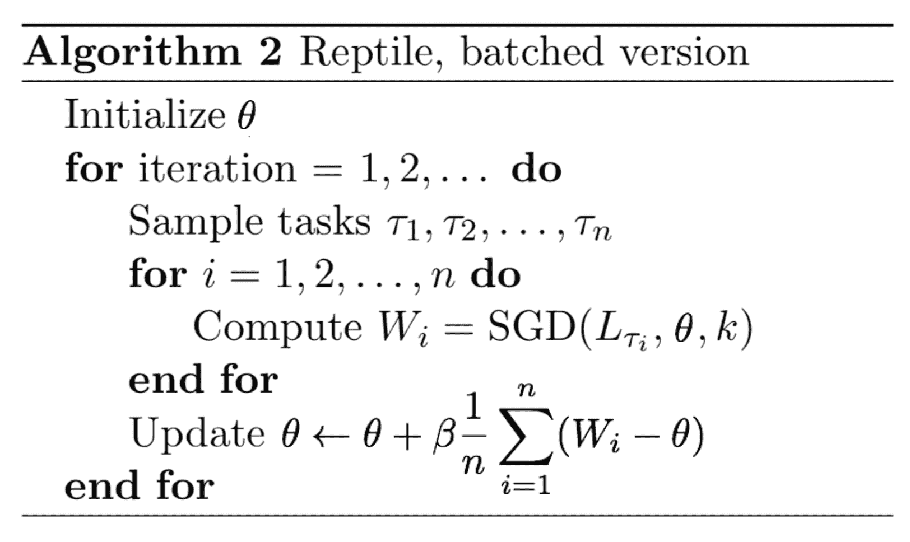

图 13\. Reptile 算法的批处理版本。 (图片来源：[原论文](https://arxiv.org/abs/1803.02999))

乍一看，该算法看起来很像普通的 SGD。然而，由于任务特定的优化可能需要多于一步。当 k > 1 时，它最终会使$$\text{SGD}(\mathbb{E} *\tau[\mathcal{L}*{\tau}], \theta, k)$$与$$\mathbb{E}*\tau [\text{SGD}(\mathcal{L}*{\tau}, \theta, k)]$$分离。

### 优化假设

假设任务$\tau \sim p(\tau)$具有最佳网络配置流形$\mathcal{W}_{\tau}^*$。当$\theta$位于$\mathcal{W}_{\tau}^*$表面时，模型$f_\theta$为任务$\tau$实现最佳性能。为了找到一个对所有任务都有效的解决方案，我们希望找到一个接近所有任务的最佳流形的参数：

$$ \theta^* = \arg\min_\theta \mathbb{E}_{\tau \sim p(\tau)} [\frac{1}{2} \text{dist}(\theta, \mathcal{W}_\tau^*)²] $$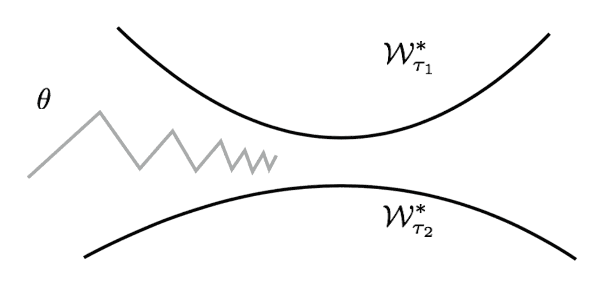

图 14\. Reptile 算法交替更新参数，使其更接近不同任务的最佳流形。 (图片来源：[原论文](https://arxiv.org/abs/1803.02999))

让我们使用 L2 距离作为$\text{dist}(.)$，点$\theta$与集合$\mathcal{W}_\tau^*$之间的距离等于$\theta$与最接近$\theta$的流形上的点$W_{\tau}^*(\theta)$之间的距离：

$$ \text{dist}(\theta, \mathcal{W}_{\tau}^*) = \text{dist}(\theta, W_{\tau}^*(\theta)) \text{, where }W_{\tau}^*(\theta) = \arg\min_{W\in\mathcal{W}_{\tau}^*} \text{dist}(\theta, W) $$

欧几里得距离的梯度是：

$$ \begin{aligned} \nabla_\theta[\frac{1}{2}\text{dist}(\theta, \mathcal{W}_{\tau_i}^*)²] &= \nabla_\theta[\frac{1}{2}\text{dist}(\theta, W_{\tau_i}^*(\theta))²] & \\ &= \nabla_\theta[\frac{1}{2}(\theta - W_{\tau_i}^*(\theta))²] & \\ &= \theta - W_{\tau_i}^*(\theta) & \scriptstyle{\text{; 请参阅注释。}} \end{aligned} $$

注：根据 Reptile 论文，“*点Θ和集合 S 之间的平方欧几里得距离的梯度是向量 2(Θ − p)，其中 p 是 S 中距离Θ最近的点*”。从技术上讲，S 中最接近的点也是Θ的一个函数，但我不确定为什么梯度不需要担心 p 的导数。（如果您有想法，请随时给我留言或发送电子邮件。）

因此，一个随机梯度步骤的更新规则是：

$$ \theta = \theta - \alpha \nabla_\theta[\frac{1}{2} \text{dist}(\theta, \mathcal{W}_{\tau_i}^*)²] = \theta - \alpha(\theta - W_{\tau_i}^*(\theta)) = (1-\alpha)\theta + \alpha W_{\tau_i}^*(\theta) $$

最优任务流形$W_{\tau_i}^*(\theta)$上的最接近点无法精确计算，但 Reptile 使用$\text{SGD}(\mathcal{L}_\tau, \theta, k)$来近似计算。

### Reptile vs FOMAML

为了展示 Reptile 和 MAML 之间更深层次的联系，让我们通过一个执行两个梯度步骤的示例来扩展更新公式，其中 k=2 在$\text{SGD}(.)$中。与上文定义的相同，$\mathcal{L}^{(0)}$和$\mathcal{L}^{(1)}$是使用不同小批量数据的损失。为了方便阅读，我们采用两个简化的注释：$g^{(i)}_j = \nabla_{\theta} \mathcal{L}^{(i)}(\theta_j)$和$H^{(i)}_j = \nabla²_{\theta} \mathcal{L}^{(i)}(\theta_j)$。

$$ \begin{aligned} \theta_0 &= \theta_\text{meta}\\ \theta_1 &= \theta_0 - \alpha\nabla_\theta\mathcal{L}^{(0)}(\theta_0)= \theta_0 - \alpha g^{(0)}_0 \\ \theta_2 &= \theta_1 - \alpha\nabla_\theta\mathcal{L}^{(1)}(\theta_1) = \theta_0 - \alpha g^{(0)}_0 - \alpha g^{(1)}_1 \end{aligned} $$

根据前面的部分，FOMAML 的梯度是最后一个内部梯度更新的结果。因此，当 k=1 时：

$$ \begin{aligned} g_\text{FOMAML} &= \nabla_{\theta_1} \mathcal{L}^{(1)}(\theta_1) = g^{(1)}_1 \\ g_\text{MAML} &= \nabla_{\theta_1} \mathcal{L}^{(1)}(\theta_1) \cdot (I - \alpha\nabla²_{\theta} \mathcal{L}^{(0)}(\theta_0)) = g^{(1)}_1 - \alpha H^{(0)}_0 g^{(1)}_1 \end{aligned} $$

Reptile 梯度的定义为：

$$ g_\text{Reptile} = (\theta_0 - \theta_2) / \alpha = g^{(0)}_0 + g^{(1)}_1 $$

到目前为止我们有：

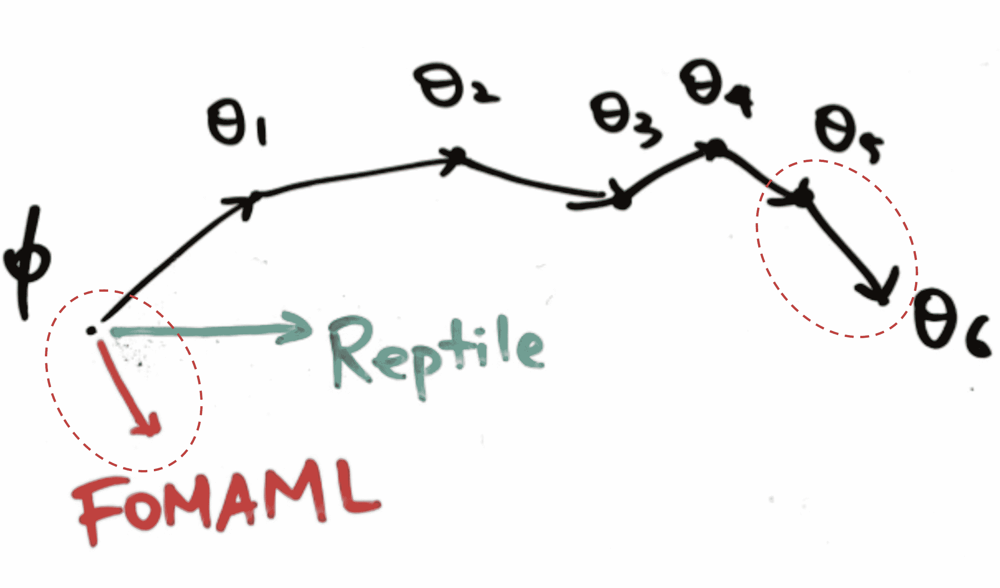

图 15. 在一次元优化循环中的 Reptile 与 FOMAML 的比较。（图片来源：[幻灯片](https://www.slideshare.net/YoonhoLee4/on-firstorder-metalearning-algorithms)关于 Reptile 的 Yoonho Lee。）

$$ \begin{aligned} g_\text{FOMAML} &= g^{(1)}_1 \\ g_\text{MAML} &= g^{(1)}_1 - \alpha H^{(0)}_0 g^{(1)}_1 \\ g_\text{Reptile} &= g^{(0)}_0 + g^{(1)}_1 \end{aligned} $$

接下来让我们尝试使用[Taylor 展开](https://en.wikipedia.org/wiki/Taylor_series)进一步展开$g^{(1)}_1$。回想一下，可微分函数$f(x)$在某个数$a$处的 Taylor 展开是：

$$ f(x) = f(a) + \frac{f'(a)}{1!}(x-a) + \frac{f''(a)}{2!}(x-a)² + \dots = \sum_{i=0}^\infty \frac{f^{(i)}(a)}{i!}(x-a)^i $$

我们可以将$\nabla_{\theta}\mathcal{L}^{(1)}(.)$视为一个函数，$\theta_0$视为一个值点。在值点$\theta_0$处，$g_1^{(1)}$的 Taylor 展开是：

$$ \begin{aligned} g_1^{(1)} &= \nabla_{\theta}\mathcal{L}^{(1)}(\theta_1) \\ &= \nabla_{\theta}\mathcal{L}^{(1)}(\theta_0) + \nabla²_\theta\mathcal{L}^{(1)}(\theta_0)(\theta_1 - \theta_0) + \frac{1}{2}\nabla³_\theta\mathcal{L}^{(1)}(\theta_0)(\theta_1 - \theta_0)² + \dots & \\ &= g_0^{(1)} - \alpha H^{(1)}_0 g_0^{(0)} + \frac{\alpha²}{2}\nabla³_\theta\mathcal{L}^{(1)}(\theta_0) (g_0^{(0)})² + \dots & \scriptstyle{\text{; 因为}\theta_1-\theta_0=-\alpha g_0^{(0)}} \\ &= g_0^{(1)} - \alpha H^{(1)}_0 g_0^{(0)} + O(\alpha²) \end{aligned} $$

将$g_1^{(1)}$的展开形式代入具有一步内部梯度更新的 MAML 梯度：

$$ \begin{aligned} g_\text{FOMAML} &= g^{(1)}_1 = g_0^{(1)} - \alpha H^{(1)}_0 g_0^{(0)} + O(\alpha²)\\ g_\text{MAML} &= g^{(1)}_1 - \alpha H^{(0)}_0 g^{(1)}_1 \\ &= g_0^{(1)} - \alpha H^{(1)}_0 g_0^{(0)} + O(\alpha²) - \alpha H^{(0)}_0 (g_0^{(1)} - \alpha H^{(1)}_0 g_0^{(0)} + O(\alpha²))\\ &= g_0^{(1)} - \alpha H^{(1)}_0 g_0^{(0)} - \alpha H^{(0)}_0 g_0^{(1)} + \alpha² \alpha H^{(0)}_0 H^{(1)}_0 g_0^{(0)} + O(\alpha²)\\ &= g_0^{(1)} - \alpha H^{(1)}_0 g_0^{(0)} - \alpha H^{(0)}_0 g_0^{(1)} + O(\alpha²) \end{aligned} $$

Reptile 梯度变为：

$$ \begin{aligned} g_\text{Reptile} &= g^{(0)}_0 + g^{(1)}_1 \\ &= g^{(0)}_0 + g_0^{(1)} - \alpha H^{(1)}_0 g_0^{(0)} + O(\alpha²) \end{aligned} $$

到目前为止，我们有三种梯度的公式：

$$ \begin{aligned} g_\text{FOMAML} &= g_0^{(1)} - \alpha H^{(1)}_0 g_0^{(0)} + O(\alpha²)\\ g_\text{MAML} &= g_0^{(1)} - \alpha H^{(1)}_0 g_0^{(0)} - \alpha H^{(0)}_0 g_0^{(1)} + O(\alpha²)\\ g_\text{Reptile} &= g^{(0)}_0 + g_0^{(1)} - \alpha H^{(1)}_0 g_0^{(0)} + O(\alpha²) \end{aligned} $$

在训练过程中，我们经常对多个数据批次进行平均。在我们的示例中，小批次(0)和(1)是可互换的，因为两者都是随机抽取的。期望$\mathbb{E}_{\tau,0,1}$是针对任务$\tau$的两个数据批次(0)和(1)进行平均。

让，

+   $A = \mathbb{E}_{\tau,0,1} [g_0^{(0)}] = \mathbb{E}_{\tau,0,1} [g_0^{(1)}]$；这是任务损失的平均梯度。我们期望通过遵循$A$指向的方向来改善模型参数，以实现更好的任务性能。

+   $B = \mathbb{E}_{\tau,0,1} [H^{(1)}_0 g_0^{(0)}] = \frac{1}{2}\mathbb{E}_{\tau,0,1} [H^{(1)}_0 g_0^{(0)} + H^{(0)}_0 g_0^{(1)}] = \frac{1}{2}\mathbb{E}_{\tau,0,1} [\nabla_\theta(g^{(0)}_0 g_0^{(1)})]$；这是增加相同任务的两个不同小批次梯度内积的方向（梯度）。我们期望通过遵循$B$指示的方向来改进模型参数，从而实现对不同数据的更好泛化。

总之，MAML 和 Reptile 都旨在优化相同的目标，即更好的任务性能（由 A 指导）和更好的泛化能力（由 B 指导），当梯度更新由前三个主要项近似时。

$$ \begin{aligned} \mathbb{E}_{\tau,1,2}[g_\text{FOMAML}] &= A - \alpha B + O(\alpha²)\\ \mathbb{E}_{\tau,1,2}[g_\text{MAML}] &= A - 2\alpha B + O(\alpha²)\\ \mathbb{E}_{\tau,1,2}[g_\text{Reptile}] &= 2A - \alpha B + O(\alpha²) \end{aligned} $$

对我来说，不清楚被忽略的项$O(\alpha²)$是否会对参数学习产生重大影响。但考虑到 FOMAML 能够获得与 MAML 完整版本类似的性能，可以说在梯度下降更新过程中更高阶导数可能并不关键。

* * *

引用为：

```py
@article{weng2018metalearning,
  title   = "Meta-Learning: Learning to Learn Fast",
  author  = "Weng, Lilian",
  journal = "lilianweng.github.io",
  year    = "2018",
  url     = "https://lilianweng.github.io/posts/2018-11-30-meta-learning/"
} 
```

# 参考文献

[1] Brenden M. Lake，Ruslan Salakhutdinov 和 Joshua B. Tenenbaum。[“通过概率程序归纳进行人类级别概念学习。”](https://www.cs.cmu.edu/~rsalakhu/papers/LakeEtAl2015Science.pdf) Science 350.6266（2015）：1332-1338。

[2] Oriol Vinyals 关于[“模型与优化元学习”的讲座](http://metalearning-symposium.ml/files/vinyals.pdf)

[3] Gregory Koch，Richard Zemel 和 Ruslan Salakhutdinov。[“一次图像识别的连体神经网络。”](http://www.cs.toronto.edu/~rsalakhu/papers/oneshot1.pdf) ICML 深度学习研讨会。2015 年。

[4] Oriol Vinyals 等人。[“一次学习的匹配网络。”](http://papers.nips.cc/paper/6385-matching-networks-for-one-shot-learning.pdf) NIPS. 2016。

[5] Flood Sung 等人。[“比较学习：Few-shot Learning 的关系网络。”](http://openaccess.thecvf.com/content_cvpr_2018/papers_backup/Sung_Learning_to_Compare_CVPR_2018_paper.pdf) CVPR. 2018。

[6] Jake Snell，Kevin Swersky 和 Richard Zemel。[“Few-shot Learning 的原型网络。”](http://papers.nips.cc/paper/6996-prototypical-networks-for-few-shot-learning.pdf) CVPR. 2018。

[7] Adam Santoro 等人。[“具有记忆增强神经网络的元学习。”](http://proceedings.mlr.press/v48/santoro16.pdf) ICML. 2016。

[8] Alex Graves，Greg Wayne 和 Ivo Danihelka。[“神经图灵机。”](https://arxiv.org/abs/1410.5401) arXiv 预印本 arXiv:1410.5401（2014）。

[9] Tsendsuren Munkhdalai 和 Hong Yu。[“元网络。”](https://arxiv.org/abs/1703.00837) ICML. 2017。

[10] Sachin Ravi 和 Hugo Larochelle。[“Few-Shot Learning 的优化模型。”](https://openreview.net/pdf?id=rJY0-Kcll) ICLR. 2017。

[11] Chelsea Finn 在 BAIR 博客上的关于[“学会学习”](https://bair.berkeley.edu/blog/2017/07/18/learning-to-learn/)。

[12] Chelsea Finn, Pieter Abbeel, and Sergey Levine. [“模型无关的元学习，用于深度网络的快速适应。”](https://arxiv.org/abs/1703.03400) ICML 2017.

[13] Alex Nichol, Joshua Achiam, John Schulman. [“关于一阶元学习算法。”](https://arxiv.org/abs/1803.02999) arXiv 预印本 arXiv:1803.02999 (2018).

[14] Yoonho Lee 的关于 Reptile 的[幻灯片](https://www.slideshare.net/YoonhoLee4/on-firstorder-metalearning-algorithms)。
