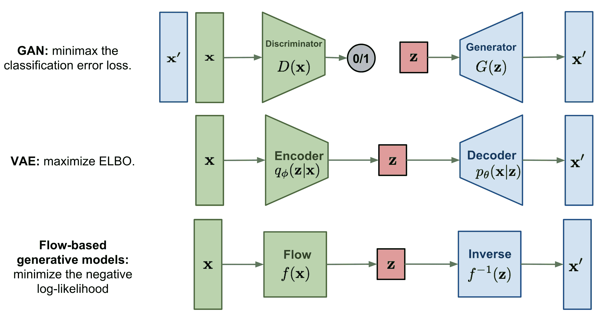
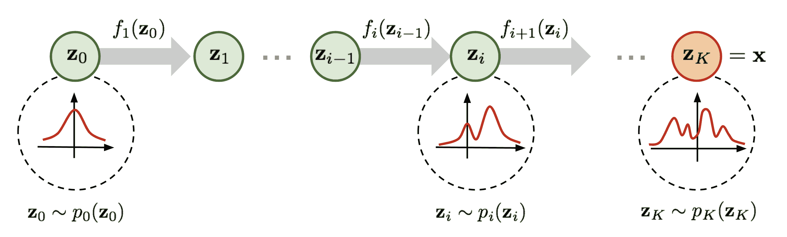
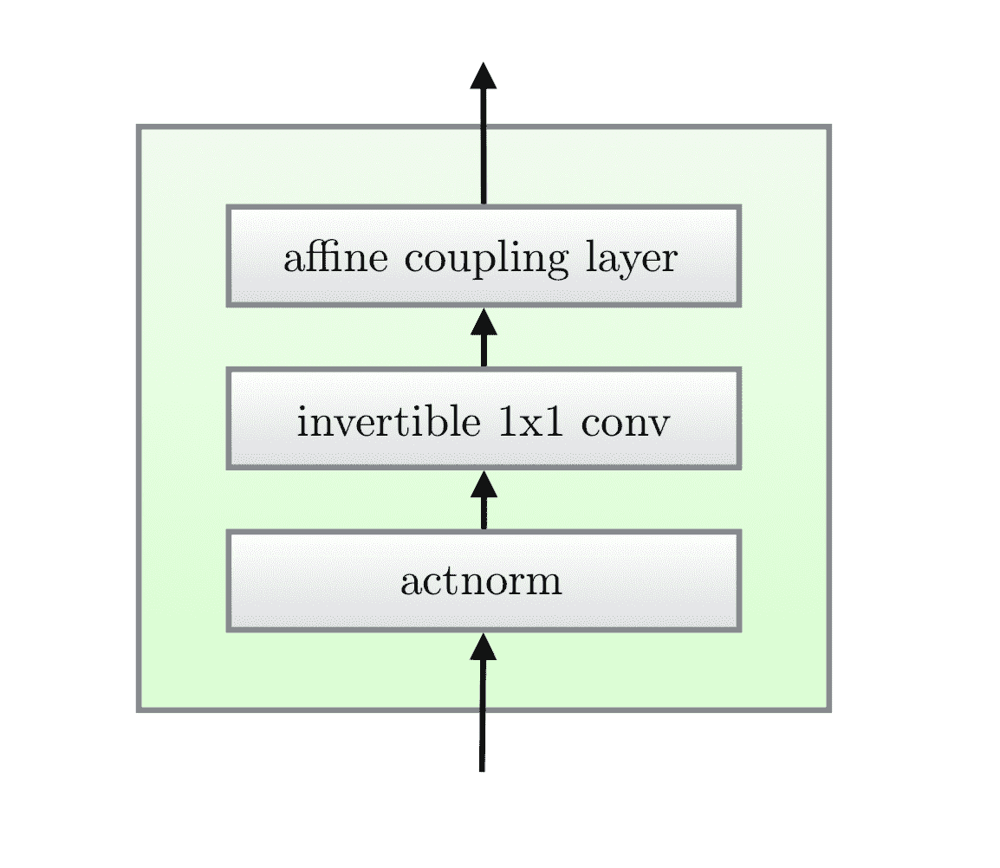
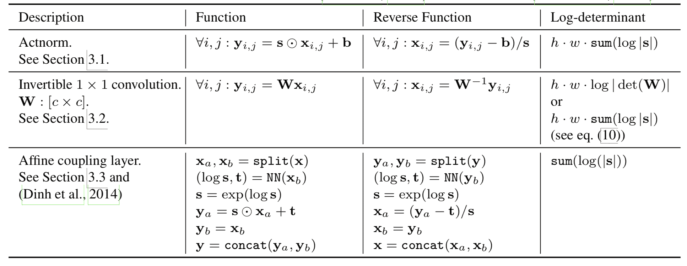
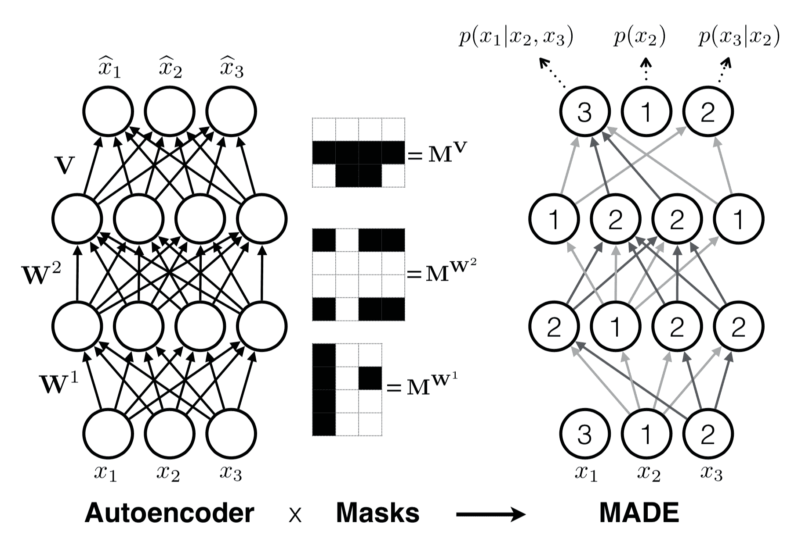
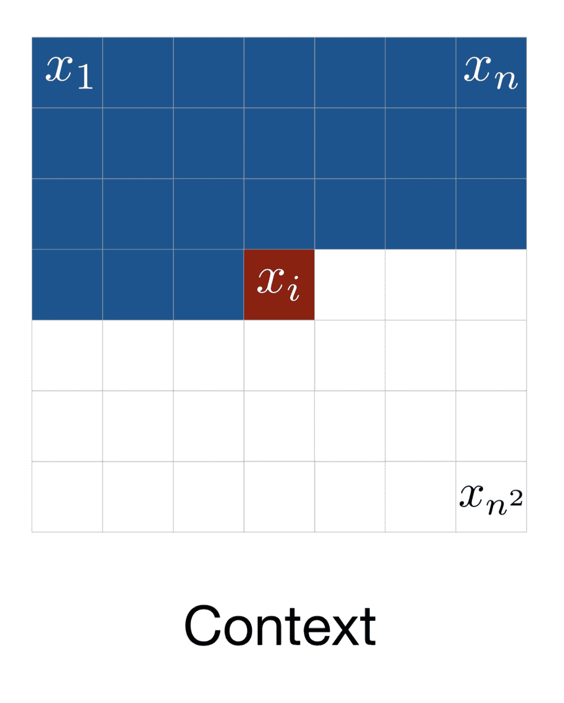
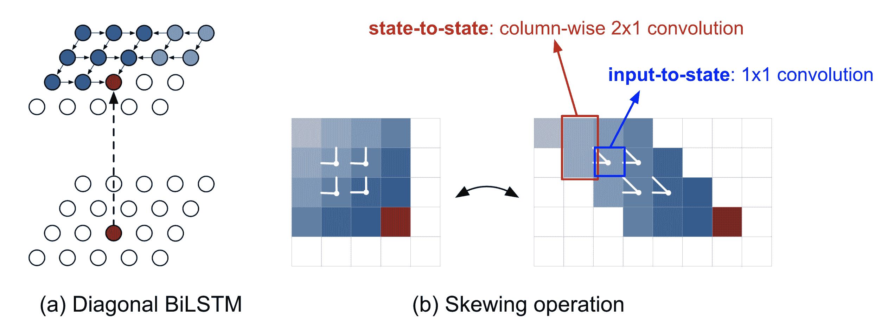
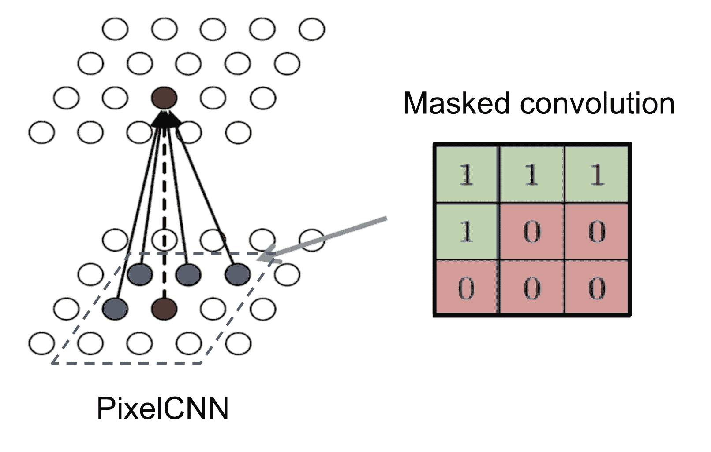
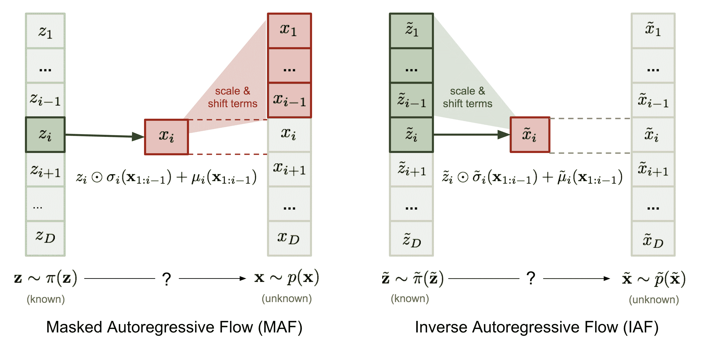

# 基于流的深度生成模型

> 原文：[`lilianweng.github.io/posts/2018-10-13-flow-models/`](https://lilianweng.github.io/posts/2018-10-13-flow-models/)

到目前为止，我已经写了关于两种生成模型，[GAN](https://lilianweng.github.io/posts/2017-08-20-gan/)和[VAE](https://lilianweng.github.io/posts/2018-08-12-vae/)。它们都没有明确地学习真实数据的概率密度函数$p(\mathbf{x})$（其中$\mathbf{x} \in \mathcal{D}$）——因为这真的很困难！以具有潜在变量的生成模型为例，$p(\mathbf{x}) = \int p(\mathbf{x}\vert\mathbf{z})p(\mathbf{z})d\mathbf{z}$几乎无法计算，因为遍历所有可能的潜在编码$\mathbf{z}$是不可行的。

基于流的深度生成模型通过[正规化流](https://arxiv.org/abs/1505.05770)这一强大的统计工具征服了这个难题。对$p(\mathbf{x})$的良好估计使得能够高效地完成许多下游任务：采样未观察到但真实的新数据点（数据生成）、预测未来事件的稀有性（密度估计）、推断潜在变量、填补不完整的数据样本等。

# 生成模型的类型

这里是 GAN、VAE 和基于流的生成模型之间的区别的快速总结：

1.  生成对抗网络：GAN 提供了一个聪明的解决方案，将数据生成这个无监督学习问题建模为一个监督学习问题。鉴别器模型学习区分真实数据和生成器模型生成的假样本。两个模型被训练，就像它们在进行[极小极大](https://en.wikipedia.org/wiki/Minimax)游戏一样。

1.  变分自动编码器：VAE 通过最大化证据下界（ELBO）隐式地优化数据的对数似然。

1.  基于流的生成模型：一个基于流的生成模型是通过一系列可逆变换构建的。与其他两种不同，该模型明确地学习数据分布$p(\mathbf{x})$，因此损失函数简单地是负对数似然。



图 1。三类生成模型的比较。

# 线性代数基础回顾

在进入基于流的生成模型之前，我们应该了解两个关键概念：雅可比行列式和变量变换规则。相当基础，所以随意跳过。

## 雅可比矩阵和行列式

给定一个将$n$维输入向量$\mathbf{x}$映射到$m$维输出向量的函数，$\mathbf{f}: \mathbb{R}^n \mapsto \mathbb{R}^m$，这个函数的所有一阶偏导数的矩阵称为**雅可比矩阵**，$\mathbf{J}$，其中第 i 行第 j 列的一个条目是$\mathbf{J}_{ij} = \frac{\partial f_i}{\partial x_j}$。

$$ \mathbf{J} = \begin{bmatrix} \frac{\partial f_1}{\partial x_1} & \dots & \frac{\partial f_1}{\partial x_n} \\[6pt] \vdots & \ddots & \vdots \\[6pt] \frac{\partial f_m}{\partial x_1} & \dots & \frac{\partial f_m}{\partial x_n} \\[6pt] \end{bmatrix} $$

行列式是作为方阵中所有元素的函数计算的一个实数。请注意，行列式*仅适用于**方**阵*。行列式的绝对值可以被视为*“矩阵乘法如何扩展或收缩空间的度量”*。

nxn 矩阵$M$的行列式是：

$$ \det M = \det \begin{bmatrix} a_{11} & a_{12} & \dots & a_{1n} \\ a_{21} & a_{22} & \dots & a_{2n} \\ \vdots & \vdots & & \vdots \\ a_{n1} & a_{n2} & \dots & a_{nn} \\ \end{bmatrix} = \sum_{j_1 j_2 \dots j_n} (-1)^{\tau(j_1 j_2 \dots j_n)} a_{1j_1} a_{2j_2} \dots a_{nj_n} $$

在求和符号下的下标$j_1 j_2 \dots j_n$是集合{1, 2, …, n}的所有排列，因此总共有$n!$项；$\tau(.)$表示排列的[符号](https://en.wikipedia.org/wiki/Parity_of_a_permutation)。

方阵$M$的行列式检测它是否可逆：如果$\det(M)=0$，则$M$不可逆（具有线性相关行或列的*奇异*矩阵；或任何行或列全为 0）；否则，如果$\det(M)\neq 0$，$M$可逆。

乘积的行列式等于行列式的乘积：$\det(AB) = \det(A)\det(B)$。([证明](https://proofwiki.org/wiki/Determinant_of_Matrix_Product))

## 变量变换定理

让我们具体在概率密度估计的背景下回顾变量变换定理，从单变量情况开始。

给定随机变量$z$及其已知概率密度函数$z \sim \pi(z)$，我们希望使用一一映射函数$x = f(z)$构造一个新的随机变量。函数$f$是可逆的，因此$z=f^{-1}(x)$。现在的问题是*如何推断新变量的未知概率密度函数*，$p(x)$？

$$ \begin{aligned} & \int p(x)dx = \int \pi(z)dz = 1 \scriptstyle{\text{ ; 概率分布的定义。}}\\ & p(x) = \pi(z) \left\vert\frac{dz}{dx}\right\vert = \pi(f^{-1}(x)) \left\vert\frac{d f^{-1}}{dx}\right\vert = \pi(f^{-1}(x)) \vert (f^{-1})'(x) \vert \end{aligned} $$

根据定义，积分$\int \pi(z)dz$是无限数量的宽度为$\Delta z$的矩形的总和。这样一个矩形在位置$z$的高度是密度函数$\pi(z)$的值。当我们进行变量替换时，$z = f^{-1}(x)$导致$\frac{\Delta z}{\Delta x} = (f^{-1}(x))’$和$\Delta z = (f^{-1}(x))’ \Delta x$。这里$\vert(f^{-1}(x))’\vert$表示在两个不同变量$z$和$x$的坐标定义的矩形面积之间的比率。

多变量版本具有类似的格式：

$$ \begin{aligned} \mathbf{z} &\sim \pi(\mathbf{z}), \mathbf{x} = f(\mathbf{z}), \mathbf{z} = f^{-1}(\mathbf{x}) \\ p(\mathbf{x}) &= \pi(\mathbf{z}) \left\vert \det \dfrac{d \mathbf{z}}{d \mathbf{x}} \right\vert = \pi(f^{-1}(\mathbf{x})) \left\vert \det \dfrac{d f^{-1}}{d \mathbf{x}} \right\vert \end{aligned} $$

其中 $\det \frac{\partial f}{\partial\mathbf{z}}$ 是函数 $f$ 的雅可比行列式。多元版本的完整证明超出了本文的范围；有兴趣的话可以向谷歌查询 ;)

# 什么是正规化流？

能够进行良好的密度估计在许多机器学习问题中有直接应用，但这非常困难。例如，由于我们需要在深度学习模型中运行反向传播，嵌入的概率分布（即后验 $p(\mathbf{z}\vert\mathbf{x})$）预计要足够简单，以便轻松高效地计算导数。这就是为什么高斯分布经常在潜变量生成模型中使用，即使大多数真实世界分布比高斯分布复杂得多。

这里是一个更好、更强大的分布近似的**正规化流**（NF）模型。正规化流通过应用一系列可逆变换函数将简单分布转换为复杂分布。通过一系列变换，我们根据变量的变化反复替换变量为新变量，并最终获得最终目标变量的概率分布。



图 2. 演示了一个正规化流模型，逐步将简单分布 $p_0(\mathbf{z}_0)$ 转换为复杂分布 $p_K(\mathbf{z}_K)$。

如图 2 所定义，

$$ \begin{aligned} \mathbf{z}_{i-1} &\sim p_{i-1}(\mathbf{z}_{i-1}) \\ \mathbf{z}_i &= f_i(\mathbf{z}_{i-1})\text{，因此 }\mathbf{z}_{i-1} = f_i^{-1}(\mathbf{z}_i) \\ p_i(\mathbf{z}_i) &= p_{i-1}(f_i^{-1}(\mathbf{z}_i)) \left\vert \det\dfrac{d f_i^{-1}}{d \mathbf{z}_i} \right\vert \end{aligned} $$

然后让我们将方程转换为关于 $\mathbf{z}_i$ 的函数，以便我们可以使用基本分布进行推断。

$$ \begin{aligned} p_i(\mathbf{z}_i) &= p_{i-1}(f_i^{-1}(\mathbf{z}_i)) \left\vert \det\dfrac{d f_i^{-1}}{d \mathbf{z}_i} \right\vert \\ &= p_{i-1}(\mathbf{z}_{i-1}) \left\vert \det \color{red}{\Big(\dfrac{d f_i}{d\mathbf{z}_{i-1}}\Big)^{-1}} \right\vert & \scriptstyle{\text{；根据反函数定理。}} \\ &= p_{i-1}(\mathbf{z}_{i-1}) \color{red}{\left\vert \det \dfrac{d f_i}{d\mathbf{z}_{i-1}} \right\vert^{-1}} & \scriptstyle{\text{；根据可逆函数的雅可比矩阵性质。}} \\ \log p_i(\mathbf{z}_i) &= \log p_{i-1}(\mathbf{z}_{i-1}) - \log \left\vert \det \dfrac{d f_i}{d\mathbf{z}_{i-1}} \right\vert \end{aligned} $$

(*) 关于*“反函数定理”*的一点说明：如果 $y=f(x)$ 和 $x=f^{-1}(y)$，我们有：

$$ \dfrac{df^{-1}(y)}{dy} = \dfrac{dx}{dy} = (\dfrac{dy}{dx})^{-1} = (\dfrac{df(x)}{dx})^{-1} $$

(*) 关于 *“可逆函数的雅可比行列式”* 的注释：可逆矩阵的逆的行列式是原行列式的倒数：$\det(M^{-1}) = (\det(M))^{-1}$，因为 $\det(M)\det(M^{-1}) = \det(M \cdot M^{-1}) = \det(I) = 1$。

给定这样一系列概率密度函数，我们知道每对连续变量之间的关系。我们可以逐步展开输出 $\mathbf{x}$ 的方程，直到追溯到初始分布 $\mathbf{z}_0$。

$$ \begin{aligned} \mathbf{x} = \mathbf{z}_K &= f_K \circ f_{K-1} \circ \dots \circ f_1 (\mathbf{z}_0) \\ \log p(\mathbf{x}) = \log \pi_K(\mathbf{z}_K) &= \log \pi_{K-1}(\mathbf{z}_{K-1}) - \log\left\vert\det\dfrac{d f_K}{d \mathbf{z}_{K-1}}\right\vert \\ &= \log \pi_{K-2}(\mathbf{z}_{K-2}) - \log\left\vert\det\dfrac{d f_{K-1}}{d\mathbf{z}_{K-2}}\right\vert - \log\left\vert\det\dfrac{d f_K}{d\mathbf{z}_{K-1}}\right\vert \\ &= \dots \\ &= \log \pi_0(\mathbf{z}_0) - \sum_{i=1}^K \log\left\vert\det\dfrac{d f_i}{d\mathbf{z}_{i-1}}\right\vert \end{aligned} $$

随机变量 $\mathbf{z}_i = f_i(\mathbf{z}_{i-1})$ 所经过的路径是 **流**，由连续分布 $\pi_i$ 形成的完整链被称为 **正规化流**。根据方程中的计算，变换函数 $f_i$ 应满足两个属性：

1.  容易反转。

1.  其雅可比行列式易于计算。

# 具有正规化流的模型

有了正规化流在我们的工具箱中，输入数据 $\log p(\mathbf{x})$ 的精确对数似然变得可行。因此，基于流的生成模型的训练标准就是训练数据集 $\mathcal{D}$ 上的负对数似然（NLL）：

$$ \mathcal{L}(\mathcal{D}) = - \frac{1}{\vert\mathcal{D}\vert}\sum_{\mathbf{x} \in \mathcal{D}} \log p(\mathbf{x}) $$

## RealNVP

**RealNVP**（实值非体积保持；[Dinh et al., 2017](https://arxiv.org/abs/1605.08803)）模型通过堆叠一系列可逆双射变换函数来实现正规化流。在每个双射 $f: \mathbf{x} \mapsto \mathbf{y}$ 中，称为 *仿射耦合层*，输入维度被分成两部分：

+   前 $d$ 维保持不变；

+   第二部分，$d+1$ 到 $D$ 维，经历一个仿射变换（“缩放和平移”），缩放和平移参数都是第一个 $d$ 维的函数。

$$ \begin{aligned} \mathbf{y}_{1:d} &= \mathbf{x}_{1:d} \\ \mathbf{y}_{d+1:D} &= \mathbf{x}_{d+1:D} \odot \exp({s(\mathbf{x}_{1:d})}) + t(\mathbf{x}_{1:d}) \end{aligned} $$

其中 $s(.)$ 和 $t(.)$ 是 *缩放* 和 *平移* 函数，都将 $\mathbb{R}^d \mapsto \mathbb{R}^{D-d}$。$\odot$ 运算是逐元素乘积。

现在让我们检查这个变换是否满足流变换的两个基本属性。

**条件 1**：“它很容易反转。”

是的，而且相当简单。

$$ \begin{cases} \mathbf{y}_{1:d} &= \mathbf{x}_{1:d} \\ \mathbf{y}_{d+1:D} &= \mathbf{x}_{d+1:D} \odot \exp({s(\mathbf{x}_{1:d})}) + t(\mathbf{x}_{1:d}) \end{cases} \Leftrightarrow \begin{cases} \mathbf{x}_{1:d} &= \mathbf{y}_{1:d} \\ \mathbf{x}_{d+1:D} &= (\mathbf{y}_{d+1:D} - t(\mathbf{y}_{1:d})) \odot \exp(-s(\mathbf{y}_{1:d})) \end{cases} $$

**条件 2**：“它的雅可比行列式容易计算。”

是的。获得这个变换的雅可比矩阵和行列式并不困难。雅可比矩阵是一个下三角矩阵。

$$ \mathbf{J} = \begin{bmatrix} \mathbb{I}_d & \mathbf{0}_{d\times(D-d)} \\[5pt] \frac{\partial \mathbf{y}_{d+1:D}}{\partial \mathbf{x}_{1:d}} & \text{diag}(\exp(s(\mathbf{x}_{1:d}))) \end{bmatrix} $$

因此行列式简单地是对角线上项的乘积。

$$ \det(\mathbf{J}) = \prod_{j=1}^{D-d}\exp(s(\mathbf{x}_{1:d}))_j = \exp(\sum_{j=1}^{D-d} s(\mathbf{x}_{1:d})_j) $$

到目前为止，仿射耦合层看起来非常适合构建一个正规化流 :)

更好的是，由于（i）计算$f^{-1}$不需要计算$s$或$t$的逆，以及（ii）计算雅可比行列式不涉及计算$s$或$t$的雅可比矩阵，这些函数可以是*任意复杂*的；即$s$和$t$都可以由深度神经网络建模。

在一个仿射耦合层中，一些维度（通道）保持不变。为了确保所有输入都有机会被改变，模型在每一层中颠倒顺序，以便不同的组件保持不变。遵循这种交替模式，一个变换层中保持相同的单元集合总是在下一个中被修改。批量归一化被发现有助于训练具有非常深的耦合层堆栈的模型。

此外，RealNVP 可以在多尺度架构中工作，为大输入构建更高效的模型。多尺度架构对正规仿射层应用了几个“采样”操作，包括空间棋盘格模式掩蔽、挤压操作和通道掩蔽。阅读[论文](https://arxiv.org/abs/1605.08803)以获取有关多尺度架构的更多详细信息。

## NICE

**NICE**（非线性独立成分估计；[Dinh, et al. 2015](https://arxiv.org/abs/1410.8516)）模型是 RealNVP 的前身。NICE 中的变换是不带比例项的仿射耦合层，称为*加性耦合层*。

$$ \begin{cases} \mathbf{y}_{1:d} &= \mathbf{x}_{1:d} \\ \mathbf{y}_{d+1:D} &= \mathbf{x}_{d+1:D} + m(\mathbf{x}_{1:d}) \end{cases} \Leftrightarrow \begin{cases} \mathbf{x}_{1:d} &= \mathbf{y}_{1:d} \\ \mathbf{x}_{d+1:D} &= \mathbf{y}_{d+1:D} - m(\mathbf{y}_{1:d}) \end{cases} $$

## Glow

**Glow**（[Kingma and Dhariwal, 2018](https://arxiv.org/abs/1807.03039)）模型扩展了之前的可逆生成模型 NICE 和 RealNVP，并通过将通道顺序上的反向排列操作替换为可逆的 1x1 卷积来简化架构。



图 3\. Glow 模型中的一步流程。（图片来源：[Kingma and Dhariwal, 2018](https://arxiv.org/abs/1807.03039)）

Glow 中一步流程中有三个子步骤。

子步骤 1: **激活归一化**（简称“actnorm”）

它使用每个通道的比例和偏置参数执行仿射变换，类似于批量归一化，但适用于小批量大小为 1。参数是可训练的，但初始化为使得 actnorm 后的第一个小批量数据均值为 0，标准差为 1。

子步骤 2: **可逆的 1x1 卷积**

在 RealNVP 流的层之间，通道的顺序被颠倒，以便所有数据维度都有机会被改变。具有相同输入和输出通道数量的 1×1 卷积是*通道顺序的任意排列*的一般化。

假设我们有一个可逆的 $h \times w \times c$ 张量 $\mathbf{h}$ 的 1x1 卷积，使用大小为 $c \times c$ 的权重矩阵 $\mathbf{W}$。输出是一个 $h \times w \times c$ 的张量，标记为 $f = \texttt{conv2d}(\mathbf{h}; \mathbf{W})$。为了应用变量规则的变化，我们需要计算雅可比行列式 $\vert \det\partial f / \partial\mathbf{h}\vert$。

这里 1x1 卷积的输入和输出都可以看作是大小为 $h \times w$ 的矩阵。每个条目 $\mathbf{x}_{ij}$（$i=1,\dots,h, j=1,\dots,w$）在 $\mathbf{h}$ 中是一个具有 $c$ 个通道的向量，每个条目分别与权重矩阵 $\mathbf{W}$ 相乘，以获得输出矩阵中相应的条目 $\mathbf{y}_{ij}$。每个条目的导数是 $\partial \mathbf{x}_{ij} \mathbf{W} / \partial\mathbf{x}_{ij} = \mathbf{W}$，总共有 $h \times w$ 个这样的条目：

$$ \log \left\vert\det \frac{\partial\texttt{conv2d}(\mathbf{h}; \mathbf{W})}{\partial\mathbf{h}}\right\vert = \log (\vert\det\mathbf{W}\vert^{h \cdot w}\vert) = h \cdot w \cdot \log \vert\det\mathbf{W}\vert $$

逆 1x1 卷积取决于逆矩阵 $\mathbf{W}^{-1}$。由于权重矩阵相对较小，矩阵行列式（[tf.linalg.det](https://www.tensorflow.org/api_docs/python/tf/linalg/det)）和求逆（[tf.linalg.inv](https://www.tensorflow.org/api_docs/python/tf/linalg/inv)）的计算量仍然可控。

子步骤 3: **仿射耦合层**

设计与 RealNVP 相同。



图 4\. Glow 中一步流程中的三个子步骤。（图片来源：[Kingma and Dhariwal, 2018](https://arxiv.org/abs/1807.03039)）

# 具有自回归流的模型

**自回归**约束是一种对顺序数据建模的方式，$\mathbf{x} = [x_1, \dots, x_D]$：每个输出仅取决于过去观察到的数据，而不取决于未来的数据。换句话说，观察到$x_i$的概率取决于$x_1, \dots, x_{i-1}$，这些条件概率的乘积给出了观察到完整序列的概率：

$$ p(\mathbf{x}) = \prod_{i=1}^{D} p(x_i\vert x_1, \dots, x_{i-1}) = \prod_{i=1}^{D} p(x_i\vert x_{1:i-1}) $$

如何建模条件密度取决于您的选择。它可以是一个均值和标准差作为$x_{1:i-1}$的函数计算的单变量高斯分布，或者是一个多层神经网络，其中$x_{1:i-1}$作为输入。

如果正规化流中的流变换被构建为一个自回归模型 —— 向量变量中的每个维度都是在前一个维度的条件下的 —— 这就是一个**自回归流**。

本节首先介绍几种经典的自回归模型（MADE，PixelRNN，WaveNet），然后我们深入研究自回归流模型（MAF 和 IAF）。

## MADE

**MADE**（用于分布估计的掩码自编码器；[Germain 等人，2015](https://arxiv.org/abs/1502.03509)）是一种特别设计的架构，可以有效地强制自编码器中的自回归属性。当使用自编码器来预测条件概率时，MADE 通过乘以二进制掩码矩阵消除了来自某些隐藏单元的贡献，以便每个输入维度仅从*给定*顺序中的先前维度在*单次传递*中重建。

在一个多层全连接神经网络中，比如说，我们有$L$个隐藏层，带有权重矩阵$\mathbf{W}¹, \dots, \mathbf{W}^L$，以及一个带有权重矩阵$\mathbf{V}$的输出层。输出$\hat{\mathbf{x}}$的每个维度$\hat{x}_i = p(x_i\vert x_{1:i-1})$。

没有任何掩码，层间的计算如下所示：

$$ \begin{aligned} \mathbf{h}⁰ &= \mathbf{x} \\ \mathbf{h}^l &= \text{activation}^l(\mathbf{W}^l\mathbf{h}^{l-1} + \mathbf{b}^l) \\ \hat{\mathbf{x}} &= \sigma(\mathbf{V}\mathbf{h}^L + \mathbf{c}) \end{aligned} $$

图 5\. 展示了 MADE 在一个三层前馈神经网络中的工作原理。（图片来源：[Germain 等人，2015](https://arxiv.org/abs/1502.03509)）

要将层之间的某些连接置零，我们可以简单地将每个权重矩阵与一个二进制掩码矩阵进行逐元素相乘。每个隐藏节点被分配一个介于$1$和$D-1$之间的随机“连接整数”；第$l$层中第$k$个单元的分配值用$m^l_k$表示。二进制掩码矩阵由比较两个层中两个节点的值来确定。

$$ \begin{aligned} \mathbf{h}^l &= \text{activation}^l((\mathbf{W}^l \color{red}{\odot \mathbf{M}^{\mathbf{W}^l}}) \mathbf{h}^{l-1} + \mathbf{b}^l) \\ \hat{\mathbf{x}} &= \sigma((\mathbf{V} \color{red}{\odot \mathbf{M}^{\mathbf{V}}}) \mathbf{h}^L + \mathbf{c}) \\ M^{\mathbf{W}^l}_{k', k} &= \mathbf{1}_{m^l_{k'} \geq m^{l-1}_k} = \begin{cases} 1, & \text{if } m^l_{k'} \geq m^{l-1}_k\\ 0, & \text{otherwise} \end{cases} \\ M^{\mathbf{V}}_{d, k} &= \mathbf{1}_{d \geq m^L_k} = \begin{cases} 1, & \text{if } d > m^L_k\\ 0, & \text{otherwise} \end{cases} \end{aligned} $$

当前层中的一个单元只能连接到前一层中相等或更小编号的其他单元，这种依赖关系很容易通过网络传播到输出层。一旦所有单元和层都分配了编号，输入维度的顺序就固定了，并且条件概率是根据此产生的。在图 5 中有一个很好的插图。为了确保所有隐藏单元通过某些路径连接到输入和输出层，$m^l_k$ 被抽样为大于或等于前一层中的最小连接整数，$\min_{k'} m_{k'}^{l-1}$。

MADE 训练可以通过以下方式进一步促进：

+   *无序训练*：对输入维度进行洗牌，使 MADE 能够模拟任意顺序；可以在运行时创建自回归模型的集合。

+   *无连接性训练*：为了避免模型被绑定到特定的连接模式约束，对每个训练小批次重新抽样 $m^l_k$。

## PixelRNN

PixelRNN（[Oord 等人，2016](https://arxiv.org/abs/1601.06759)）是用于图像的深度生成模型。图像逐像素生成，每个新像素都是在之前看到的像素的条件下抽样的。

让我们考虑一个大小为 $n \times n$ 的图像，$\mathbf{x} = \{x_1, \dots, x_{n²}\}$，模型从左上角开始逐像素生成像素，从左到右，从上到下（见图 6）。



图 6。PixelRNN 中生成一个像素的上下文。（图片来源：[Oord 等人，2016](https://arxiv.org/abs/1601.06759)）

每个像素 $x_i$ 是从一个概率分布中抽样的，该分布是在过去的上下文条件下：在同一行时，它上方或左侧的像素。这种上下文的定义看起来相当任意，因为如何将视觉[注意力](https://lilianweng.github.io/posts/2018-06-24-attention/)放在图像上更加灵活。以某种神奇的方式，具有如此强烈假设的生成模型起作用。

一个可以捕捉整个上下文的实现是*对角线双向 LSTM*。首先，通过将输入特征图的每一行相对于前一行偏移一个位置来应用**偏移**操作，以便可以并行计算每一行。然后，LSTM 状态是根据当前像素和左侧像素计算的。



图 7\. (a) 具有对角线 BiLSTM 的 PixelRNN。 (b) 将每行在特征图中向上一行偏移一个的偏移操作。 (图片来源：[Oord et al, 2016](https://arxiv.org/abs/1601.06759))

$$ \begin{aligned} \lbrack \mathbf{o}_i, \mathbf{f}_i, \mathbf{i}_i, \mathbf{g}_i \rbrack &= \sigma(\mathbf{K}^{ss} \circledast \mathbf{h}_{i-1} + \mathbf{K}^{is} \circledast \mathbf{x}_i) & \scriptstyle{\text{; }\sigma\scriptstyle{\text{ is tanh for g, but otherwise sigmoid; }}\circledast\scriptstyle{\text{ is convolution operation.}}} \\ \mathbf{c}_i &= \mathbf{f}_i \odot \mathbf{c}_{i-1} + \mathbf{i}_i \odot \mathbf{g}_i & \scriptstyle{\text{; }}\odot\scriptstyle{\text{ is elementwise product.}}\\ \mathbf{h}_i &= \mathbf{o}_i \odot \tanh(\mathbf{c}_i) \end{aligned} $$

其中$\circledast$表示卷积操作，$\odot$是逐元素乘法。输入到状态组件$\mathbf{K}^{is}$是一个 1x1 卷积，而状态到状态的递归组件是使用大小为 2x1 的列卷积$\mathbf{K}^{ss}$计算的。

对角线 BiLSTM 层能够处理无限上下文字段，但由于状态之间的顺序依赖关系，计算起来很昂贵。一种更快的实现方式是使用多个卷积层而不使用池化来定义一个有界上下文框。卷积核被掩盖，以便未来上下文不被看到，类似于 MADE。这个卷积版本被称为**PixelCNN**。



图 8\. 具有掩码卷积的 PixelCNN，通过对掩码张量和卷积核进行元素乘积构造后应用。 (图片来源：http://slazebni.cs.illinois.edu/spring17/lec13_advanced.pdf)

## WaveNet

**WaveNet**（[Van Den Oord, et al. 2016](https://arxiv.org/abs/1609.03499)）与 PixelCNN 非常相似，但应用于 1-D 音频信号。WaveNet 由一堆*因果卷积*组成，这是一种设计用于尊重顺序的卷积操作：某个时间戳的预测只能使用过去观察到的数据，不依赖于未来。在 PixelCNN 中，因果卷积是通过掩码卷积核实现的。WaveNet 中的因果卷积只是简单地将输出向未来的时间戳移动一定数量，以使输出与最后一个输入元素对齐。

卷积层的一个很大的缺点是有限的感受野大小。输出几乎不可能依赖于数百或数千个时间步之前的输入，这对于建模长序列可能是一个至关重要的要求。因此，WaveNet 采用了*扩张卷积*（[动画](https://github.com/vdumoulin/conv_arithmetic#dilated-convolution-animations)），其中卷积核应用于输入的一个远离均匀分布的样本子集的更大感受野。


图 9. WaveNet 模型的可视化，包括（顶部）因果卷积层和（底部）扩张卷积层的堆叠。 （图片来源：[Van Den Oord, et al. 2016](https://arxiv.org/abs/1609.03499))

WaveNet 使用门控激活单元作为非线性层，因为发现它在建模 1-D 音频数据时明显优于 ReLU。残差连接应用在门控激活之后。

$$ \mathbf{z} = \tanh(\mathbf{W}_{f,k}\circledast\mathbf{x})\odot\sigma(\mathbf{W}_{g,k}\circledast\mathbf{x}) $$

其中$\mathbf{W}_{f,k}$和$\mathbf{W}_{g,k}$是第$k$层的卷积滤波器和门控权重矩阵；两者都是可学习的。

## 掩码自回归流

**掩码自回归流**（**MAF**；[Papamakarios et al., 2017](https://arxiv.org/abs/1705.07057)）是一种正规化流，其中变换层构建为自回归神经网络。MAF 与稍后介绍的**逆自回归流**（IAF）非常相似。在下一节中更多讨论 MAF 和 IAF 之间的关系。

给定两个随机变量，$\mathbf{z} \sim \pi(\mathbf{z})$ 和 $\mathbf{x} \sim p(\mathbf{x})$，以及已知的概率密度函数$\pi(\mathbf{z})$，MAF 的目标是学习$p(\mathbf{x})$。MAF 在过去的维度$\mathbf{x}_{1:i-1}$的条件下生成每个$x_i$。

精确地，条件概率是$\mathbf{z}$的仿射变换，其中比例和偏移项是观察到的$\mathbf{x}$的函数。

+   数据生成，产生一个新的$\mathbf{x}$：

$x_i \sim p(x_i\vert\mathbf{x}_{1:i-1}) = z_i \odot \sigma_i(\mathbf{x}_{1:i-1}) + \mu_i(\mathbf{x}_{1:i-1})\text{，其中 }\mathbf{z} \sim \pi(\mathbf{z})$

+   给定已知的$\mathbf{x}$的密度估计：

$p(\mathbf{x}) = \prod_{i=1}^D p(x_i\vert\mathbf{x}_{1:i-1})$

生成过程是顺序的，因此设计上是缓慢的。而密度估计只需要一次通过网络，使用类似 MADE 的架构。变换函数易于反转，雅可比行列式也易于计算。

## 逆自回归流

类似于 MAF，**逆自回归流**（**IAF**；[Kingma et al., 2016](https://arxiv.org/abs/1606.04934)）也将目标变量的条件概率建模为一个自回归模型，但流程是反向的，从而实现了更高效的采样过程。

首先，让我们反转 MAF 中的仿射变换：

$$ z_i = \frac{x_i - \mu_i(\mathbf{x}_{1:i-1})}{\sigma_i(\mathbf{x}_{1:i-1})} = -\frac{\mu_i(\mathbf{x}_{1:i-1})}{\sigma_i(\mathbf{x}_{1:i-1})} + x_i \odot \frac{1}{\sigma_i(\mathbf{x}_{1:i-1})} $$

如果让：

$$ \begin{aligned} & \tilde{\mathbf{x}} = \mathbf{z}\text{, }\tilde{p}(.) = \pi(.)\text{, }\tilde{\mathbf{x}} \sim \tilde{p}(\tilde{\mathbf{x}}) \\ & \tilde{\mathbf{z}} = \mathbf{x} \text{, }\tilde{\pi}(.) = p(.)\text{, }\tilde{\mathbf{z}} \sim \tilde{\pi}(\tilde{\mathbf{z}})\\ & \tilde{\mu}_i(\tilde{\mathbf{z}}_{1:i-1}) = \tilde{\mu}_i(\mathbf{x}_{1:i-1}) = -\frac{\mu_i(\mathbf{x}_{1:i-1})}{\sigma_i(\mathbf{x}_{1:i-1})} \\ & \tilde{\sigma}(\tilde{\mathbf{z}}_{1:i-1}) = \tilde{\sigma}(\mathbf{x}_{1:i-1}) = \frac{1}{\sigma_i(\mathbf{x}_{1:i-1})} \end{aligned} $$

那么我们会有，

$$ \tilde{x}_i \sim p(\tilde{x}_i\vert\tilde{\mathbf{z}}_{1:i}) = \tilde{z}_i \odot \tilde{\sigma}_i(\tilde{\mathbf{z}}_{1:i-1}) + \tilde{\mu}_i(\tilde{\mathbf{z}}_{1:i-1}) \text{, where }\tilde{\mathbf{z}} \sim \tilde{\pi}(\tilde{\mathbf{z}}) $$

IAF 旨在估计已知 $\tilde{\pi}(\tilde{\mathbf{z}})$ 的情况下 $\tilde{\mathbf{x}}$ 的概率密度函数。逆流也是自回归仿射变换，与 MAF 中相同，但比例和偏移项是已知分布 $\tilde{\pi}(\tilde{\mathbf{z}})$ 的观测变量的自回归函数。请参见图 10 中 MAF 和 IAF 的比较。



图 10\. MAF 和 IAF 的比较。已知密度的变量为绿色，未知的为红色。

计算各个元素 $\tilde{x}_i$ 不相互依赖，因此很容易并行化（只需一次使用 MADE）。对于已知的 $\tilde{\mathbf{x}}$ 的密度估计并不高效，因为我们必须按顺序恢复 $\tilde{z}_i$ 的值，$\tilde{z}_i = (\tilde{x}_i - \tilde{\mu}_i(\tilde{\mathbf{z}}_{1:i-1})) / \tilde{\sigma}_i(\tilde{\mathbf{z}}_{1:i-1})$，总共需要 D 次。

|  | 基础分布 | 目标分布 | 模型 | 数据生成 | 密度估计 |
| --- | --- | --- | --- | --- | --- |
| MAF | $\mathbf{z}\sim\pi(\mathbf{z})$ | $\mathbf{x}\sim p(\mathbf{x})$ | $x_i = z_i \odot \sigma_i(\mathbf{x}_{1:i-1}) + \mu_i(\mathbf{x}_{1:i-1})$ | 顺序；缓慢 | 一次通过；快速 |
| IAF | $\tilde{\mathbf{z}}\sim\tilde{\pi}(\tilde{\mathbf{z}})$ | $\tilde{\mathbf{x}}\sim\tilde{p}(\tilde{\mathbf{x}})$ | $\tilde{x}_i = \tilde{z}_i \odot \tilde{\sigma}_i(\tilde{\mathbf{z}}_{1:i-1}) + \tilde{\mu}_i(\tilde{\mathbf{z}}_{1:i-1})$ | 一次通过；快速 | 顺序；缓慢 |
| ———- | ———- | ———- | ———- | ———- | ———- |

# 变分自动编码器 + 流模型

在[变分自动编码器](https://lilianweng.github.io/posts/2018-08-12-vae/#vae-variational-autoencoder)中，如果我们想将后验分布$p(\mathbf{z}\vert\mathbf{x})$建模为一个更复杂的分布而不是简单的高斯分布。直观地，我们可以使用正规化流来转换基础高斯分布，以获得更好的密度逼近。然后编码器会预测一组尺度和偏移项$(\mu_i, \sigma_i)$，这些项都是输入$\mathbf{x}$的函数。如果感兴趣，可以阅读[论文](https://arxiv.org/abs/1809.05861)获取更多细节。

* * *

*如果您在这篇文章中发现错误，请随时通过[lilian dot wengweng at gmail dot com]与我联系，我将非常乐意立即更正！*

下一篇文章见:D

* * *

引用为：

```py
@article{weng2018flow,
  title   = "Flow-based Deep Generative Models",
  author  = "Weng, Lilian",
  journal = "lilianweng.github.io",
  year    = "2018",
  url     = "https://lilianweng.github.io/posts/2018-10-13-flow-models/"
} 
```

# 参考

[1] Danilo Jimenez Rezende 和 Shakir Mohamed。[“使用正规化流进行变分推断。”](https://arxiv.org/abs/1505.05770) ICML 2015。

[2] Eric Jang 的[正规化流教程，第 1 部分：分布和行列式](https://blog.evjang.com/2018/01/nf1.html)。

[3] Eric Jang 的[正规化流教程，第 2 部分：现代正规化流](https://blog.evjang.com/2018/01/nf2.html)。

[4] Adam Kosiorek 的[正规化流](http://akosiorek.github.io/ml/2018/04/03/norm_flows.html)。

[5] Laurent Dinh，Jascha Sohl-Dickstein 和 Samy Bengio。[“使用 Real NVP 进行密度估计。”](https://arxiv.org/abs/1605.08803) ICLR 2017。

[6] Laurent Dinh，David Krueger 和 Yoshua Bengio。[“NICE：非线性独立成分估计。”](https://arxiv.org/abs/1410.8516) ICLR 2015 研讨会论文集。

[7] Diederik P. Kingma 和 Prafulla Dhariwal。[“Glow: 具有可逆 1x1 卷积的生成流。”](https://arxiv.org/abs/1807.03039) arXiv:1807.03039 (2018)。

[8] Germain，Mathieu，Karol Gregor，Iain Murray 和 Hugo Larochelle。[“Made：用于分布估计的掩码自动编码器。”](https://arxiv.org/abs/1502.03509) ICML 2015。

[9] Aaron van den Oord，Nal Kalchbrenner 和 Koray Kavukcuoglu。[“像素递归神经网络。”](https://arxiv.org/abs/1601.06759) ICML 2016。

[10] Diederik P. Kingma 等人。[“使用逆自回归流改进变分推断。”](https://arxiv.org/abs/1606.04934) NIPS. 2016。

[11] George Papamakarios，Iain Murray 和 Theo Pavlakou。[“用于密度估计的掩码自回归流。”](https://arxiv.org/abs/1705.07057) NIPS 2017。

[12] Jianlin Su 和 Guang Wu。[“f-VAEs：使用条件流改进 VAEs。”](https://arxiv.org/abs/1809.05861) arXiv:1809.05861 (2018)。

[13] Van Den Oord, Aaron 等人。[“WaveNet: 用于原始音频的生成模型。”](https://arxiv.org/abs/1609.03499) SSW. 2016。
