# 从自编码器到 Beta-VAE

> 原文：[`lilianweng.github.io/posts/2018-08-12-vae/`](https://lilianweng.github.io/posts/2018-08-12-vae/)

2019-07-18 更新：添加关于[VQ-VAE & VQ-VAE-2 的部分。]

2019-07-26 更新：添加关于[TD-VAE 的部分。]

自编码器被发明用于使用神经网络模型重构高维数据，中间有一个窄的瓶颈层（哎呀，这对于变分自编码器可能不正确，我们将在后续章节中详细研究）。一个很好的副产品是维度缩减：瓶颈层捕获了一个压缩的潜在编码。这样的低维表示可以用作各种应用中的嵌入向量（即搜索），帮助数据压缩，或揭示潜在的数据生成因素。

# 符号

| 符号 | 意义 |
| --- | --- |
| $\mathcal{D}$ | 数据集，$\mathcal{D} = \{ \mathbf{x}^{(1)}, \mathbf{x}^{(2)}, \dots, \mathbf{x}^{(n)} \}$，包含$n$个数据样本；$\vert\mathcal{D}\vert =n $。 |
| $\mathbf{x}^{(i)}$ | 每个数据点是一个$d$维向量，$\mathbf{x}^{(i)} = [x^{(i)}_1, x^{(i)}_2, \dots, x^{(i)}_d]$。 |
| $\mathbf{x}$ | 数据集中的一个数据样本，$\mathbf{x} \in \mathcal{D}$。 |
| $\mathbf{x}’$ | $\mathbf{x}$的重构版本。 |
| $\tilde{\mathbf{x}}$ | $\mathbf{x}$的损坏版本。 |
| $\mathbf{z}$ | 在瓶颈层学习到的压缩编码。 |
| $a_j^{(l)}$ | 第$l$隐藏层中第$j$个神经元的激活函数。 |
| $g_{\phi}(.)$ | 由$\phi$参数化的**编码**函数。 |
| $f_{\theta}(.)$ | 由$\theta$参数化的**解码**函数。 |
| $q_{\phi}(\mathbf{z}\vert\mathbf{x})$ | 估计后验概率函数，也称为**概率编码器**。 |
| $p_{\theta}(\mathbf{x}\vert\mathbf{z})$ | 给定潜在编码的真实数据样本生成的可能性，也称为**概率解码器**。 |

# 自编码器

**自编码器**是一个神经网络，旨在以无监督的方式学习一个恒等函数，以在重构原始输入的同时压缩数据，从而发现更高效和压缩的表示。这个想法起源于[1980 年代](https://en.wikipedia.org/wiki/Autoencoder)，后来由[Hinton & Salakhutdinov, 2006](http://citeseerx.ist.psu.edu/viewdoc/download?doi=10.1.1.459.3788&rep=rep1&type=pdf)的开创性论文推广。

它由两个网络组成：

+   *编码器*网络：它将原始的高维输入转换为潜在的低维编码。输入大小大于输出大小。

+   *解码器*网络：解码器网络从编码中恢复数据，可能具有越来越大的输出层。

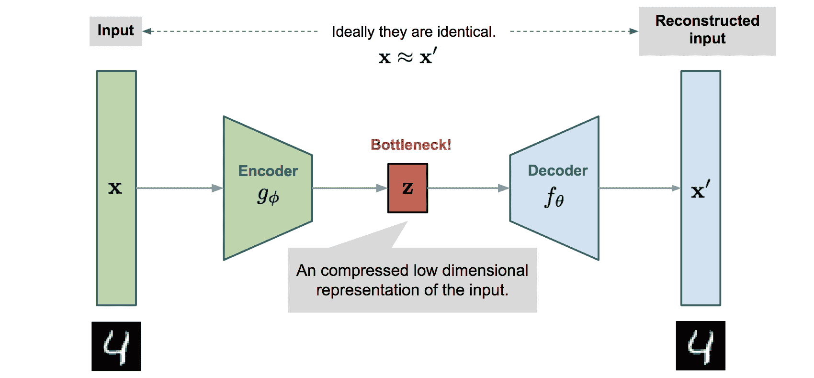

图 1。自编码器模型架构示意图。

编码器网络本质上实现了[降维](https://en.wikipedia.org/wiki/Dimensionality_reduction)，就像我们使用主成分分析（PCA）或矩阵分解（MF）一样。此外，自动编码器明确优化了从代码到数据重构的过程。一个良好的中间表示不仅可以捕捉潜在变量，还有助于完整的[解压缩](https://ai.googleblog.com/2016/09/image-compression-with-neural-networks.html)过程。

模型包含由$\phi$参数化的编码器函数$g(.)$和由$\theta$参数化的解码器函数$f(.)$。在瓶颈层学习的输入$\mathbf{x}$的低维代码是$\mathbf{z} = g_\phi(\mathbf{x})$，重构的输入是$\mathbf{x}’ = f_\theta(g_\phi(\mathbf{x}))$。

参数$(\theta, \phi)$一起学习以输出一个重构的数据样本，与原始输入相同，$\mathbf{x} \approx f_\theta(g_\phi(\mathbf{x}))$，或者换句话说，学习一个恒等函数。有各种度量标准来量化两个向量之间的差异，例如当激活函数是 sigmoid 时的交叉熵，或者简单的均方误差损失：

$$ L_\text{AE}(\theta, \phi) = \frac{1}{n}\sum_{i=1}^n (\mathbf{x}^{(i)} - f_\theta(g_\phi(\mathbf{x}^{(i)})))² $$

# 去噪自动编码器

由于自动编码器学习了恒等函数，当网络参数多于数据点数量时，我们面临“过拟合”的风险。

为了避免过拟合并提高鲁棒性，**去噪自动编码器**（Vincent 等人，2008）对基本自动编码器提出了修改。输入通过以随机方式向输入向量添加噪声或屏蔽一些值来部分损坏，$\tilde{\mathbf{x}} \sim \mathcal{M}_\mathcal{D}(\tilde{\mathbf{x}} \vert \mathbf{x})$。然后模型被训练以恢复原始输入（注意：不是损坏的输入）。

$$ \begin{aligned} \tilde{\mathbf{x}}^{(i)} &\sim \mathcal{M}_\mathcal{D}(\tilde{\mathbf{x}}^{(i)} \vert \mathbf{x}^{(i)})\\ L_\text{DAE}(\theta, \phi) &= \frac{1}{n} \sum_{i=1}^n (\mathbf{x}^{(i)} - f_\theta(g_\phi(\tilde{\mathbf{x}}^{(i)})))² \end{aligned} $$

其中$\mathcal{M}_\mathcal{D}$定义了从真实数据样本到嘈杂或损坏数据样本的映射。

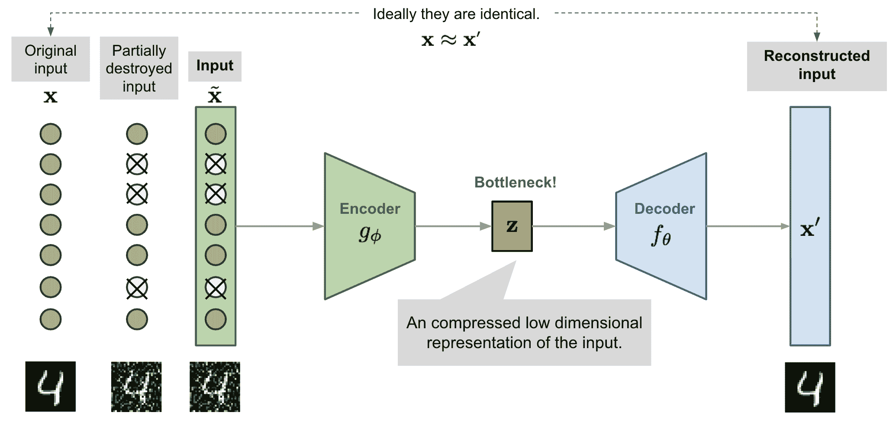

图 2。去噪自动编码器模型架构示意图。

这个设计的灵感来自于人类可以轻松识别一个物体或场景，即使视图部分被遮挡或损坏。为了“修复”部分破坏的输入，去噪自动编码器必须发现并捕捉输入维度之间的关系，以推断缺失的部分。

对于高维输入具有高冗余性的情况，如图像，模型很可能依赖于从许多输入维度的组合中收集的证据来恢复去噪版本，而不是过度拟合一个维度。这为学习*稳健*的潜在表示打下了良好的基础。

噪声由随机映射 $\mathcal{M}_\mathcal{D}(\tilde{\mathbf{x}} \vert \mathbf{x})$ 控制，不特定于特定类型的破坏过程（即掩蔽噪声、高斯噪声、椒盐噪声等）。自然地，破坏过程可以配备先验知识。

在原始 DAE 论文的实验中，噪声是这样应用的：随机选择固定比例的输入维度，并强制它们的值为 0。听起来很像 dropout，对吧？嗯，去噪自编码器是在 2012 年的 dropout 论文之前提出的，提前了 4 年（[Hinton 等人，2012](https://www.cs.toronto.edu/~hinton/absps/JMLRdropout.pdf)）;)

# 稀疏自编码器

**稀疏自编码器**对隐藏单元激活施加“稀疏”约束，以避免过拟合并提高鲁棒性。它迫使模型一次只有少量隐藏单元被激活，或者换句话说，一个隐藏神经元大部分时间应该是停用的。

请记住常见的[激活函数](http://cs231n.github.io/neural-networks-1/#actfun)包括 sigmoid、tanh、relu、leaky relu 等。当值接近 1 时神经元被激活，接近 0 时被停用。

假设第 $l$ 个隐藏层中有 $s_l$ 个神经元，该层中第 $j$ 个神经元的激活函数标记为 $a^{(l)}_j(.)$，$j=1, \dots, s_l$。该神经元的激活比例 $\hat{\rho}_j$ 预计是一个小数 $\rho$，称为*稀疏参数*；一个常见的配置是 $\rho = 0.05$。

$$ \hat{\rho}_j^{(l)} = \frac{1}{n} \sum_{i=1}^n [a_j^{(l)}(\mathbf{x}^{(i)})] \approx \rho $$

通过将惩罚项添加到损失函数中来实现这一约束。KL 散度 $D_\text{KL}$ 用于衡量两个伯努利分布之间的差异，一个具有均值 $\rho$，另一个具有均值 $\hat{\rho}_j^{(l)}$。超参数 $\beta$ 控制我们希望对稀疏损失施加多强的惩罚。

$$ \begin{aligned} L_\text{SAE}(\theta) &= L(\theta) + \beta \sum_{l=1}^L \sum_{j=1}^{s_l} D_\text{KL}(\rho \| \hat{\rho}_j^{(l)}) \\ &= L(\theta) + \beta \sum_{l=1}^L \sum_{j=1}^{s_l} \rho\log\frac{\rho}{\hat{\rho}_j^{(l)}} + (1-\rho)\log\frac{1-\rho}{1-\hat{\rho}_j^{(l)}} \end{aligned} $$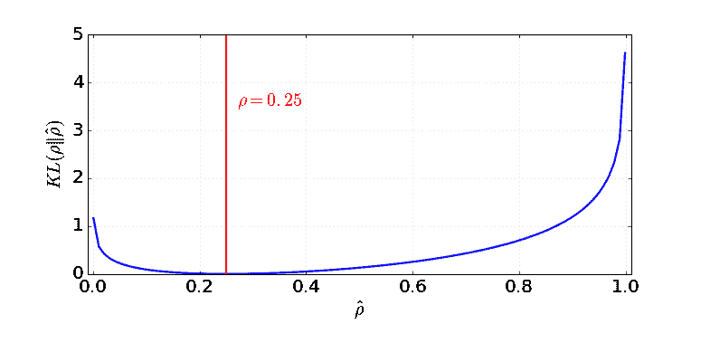

图 4\. 伯努利分布之间的 KL 散度，一个均值为 $\rho=0.25$，另一个均值为 $0 \leq \hat{\rho} \leq 1$。

**$k$-稀疏自编码器**

在$k$-稀疏自编码器（[Makhzani and Frey, 2013](https://arxiv.org/abs/1312.5663)）中，稀疏性是通过仅保留瓶颈层中前 k 个最高激活来实现的，使用线性激活函数。首先，我们通过编码器网络进行前馈运算以获得压缩编码：$\mathbf{z} = g(\mathbf{x})$。对编码向量$\mathbf{z}$中的值进行排序。仅保留最大的 k 个值，而其他神经元设为 0。这也可以在具有可调阈值的 ReLU 层中完成。现在我们有了一个稀疏编码：$\mathbf{z}’ = \text{Sparsify}(\mathbf{z})$。从稀疏编码计算输出和损失，$L = |\mathbf{x} - f(\mathbf{z}’) |_2²$。反向传播仅通过前 k 个激活的隐藏单元进行！

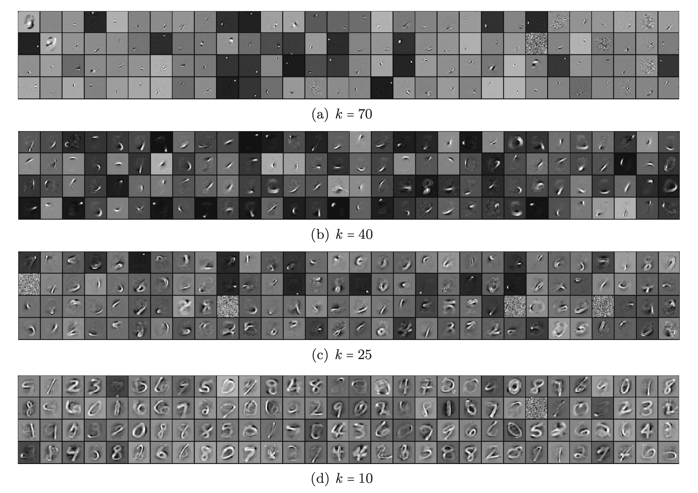

图 5\. 来自 MNIST 学习的具有 1000 个隐藏单元的 k-稀疏自编码器的不同稀疏级别 k 的滤波器。（图片来源：[Makhzani and Frey, 2013](https://arxiv.org/abs/1312.5663)）

# 压缩自编码器

类似于稀疏自编码器，**压缩自编码器**（[Rifai, et al, 2011](http://www.icml-2011.org/papers/455_icmlpaper.pdf)）鼓励学习到的表示保持在一个压缩空间中，以获得更好的鲁棒性。

它在损失函数中添加了一个项，以惩罚表示对输入过于敏感，从而提高对训练数据点周围小扰动的鲁棒性。敏感性由编码器激活的雅可比矩阵的 Frobenius 范数来衡量：

$$ \|J_f(\mathbf{x})\|_F² = \sum_{ij} \Big( \frac{\partial h_j(\mathbf{x})}{\partial x_i} \Big)² $$

其中$h_j$是压缩编码$\mathbf{z} = f(x)$中的一个单元输出。

这个惩罚项是学习编码与输入维度的所有偏导数的平方和。作者声称，经验上发现这种惩罚能够塑造一个对应于低维非线性流形的表示，同时对流形正交方向更具不变性。

# VAE：变分自编码器

**变分自编码器**（[Kingma & Welling, 2014](https://arxiv.org/abs/1312.6114)）的思想实际上与上述所有自编码器模型不太相似，而是深深植根于变分贝叶斯和图模型的方法。

我们不是将输入映射到一个*固定*向量，而是希望将其映射到一个分布。让我们将这个分布标记为$p_\theta$，由参数$\theta$参数化。数据输入$\mathbf{x}$和潜在编码向量$\mathbf{z}$之间的关系可以完全由以下公式定义：

+   先验分布 $p_\theta(\mathbf{z})$

+   似然函数 $p_\theta(\mathbf{x}\vert\mathbf{z})$

+   后验分布 $p_\theta(\mathbf{z}\vert\mathbf{x})$

假设我们知道这个分布的真实参数$\theta^{*}$。为了生成一个看起来像真实数据点$\mathbf{x}^{(i)}$的样本，我们按照以下步骤进行：

1.  首先，从先验分布$p_{\theta^*}(\mathbf{z})$中抽样一个$\mathbf{z}^{(i)}$。

1.  然后从条件分布$p_{\theta^*}(\mathbf{x} \vert \mathbf{z} = \mathbf{z}^{(i)})$生成一个值$\mathbf{x}^{(i)}$。

最优参数$\theta^{*}$是最大化生成真实数据样本概率的参数：

$$ \theta^{*} = \arg\max_\theta \prod_{i=1}^n p_\theta(\mathbf{x}^{(i)}) $$

通常我们使用对数概率将右侧的乘积转换为求和：

$$ \theta^{*} = \arg\max_\theta \sum_{i=1}^n \log p_\theta(\mathbf{x}^{(i)}) $$

现在让我们更新方程以更好地展示数据生成过程，以涉及编码向量：

$$ p_\theta(\mathbf{x}^{(i)}) = \int p_\theta(\mathbf{x}^{(i)}\vert\mathbf{z}) p_\theta(\mathbf{z}) d\mathbf{z} $$

不幸的是，以这种方式计算$p_\theta(\mathbf{x}^{(i)})$并不容易，因为检查所有可能的$\mathbf{z}$值并将它们相加非常昂贵。为了缩小值空间以便加快搜索，我们希望引入一个新的近似函数来输出给定输入$\mathbf{x}$时可能的代码，$q_\phi(\mathbf{z}\vert\mathbf{x})$，由$\phi$参数化。

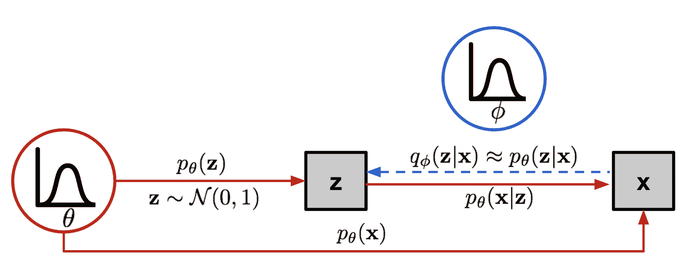

图 6。变分自动编码器中涉及的图形模型。实线表示生成分布$p\_\theta(.)$，虚线表示用于近似难以处理的后验$p\_\theta (\mathbf{z}\vert\mathbf{x})$的分布$q\_\phi (\mathbf{z}\vert\mathbf{x})$。

现在结构看起来很像一个自动编码器：

+   条件概率$p_\theta(\mathbf{x} \vert \mathbf{z})$定义了一个生成模型，类似于上面介绍的解码器$f_\theta(\mathbf{x} \vert \mathbf{z})$。$p_\theta(\mathbf{x} \vert \mathbf{z})$也被称为*概率解码器*。

+   近似函数$q_\phi(\mathbf{z} \vert \mathbf{x})$是*概率编码器*，扮演与上面的$g_\phi(\mathbf{z} \vert \mathbf{x})$类似的角色。

## 损失函数：ELBO

估计后验$q_\phi(\mathbf{z}\vert\mathbf{x})$应该非常接近真实后验$p_\theta(\mathbf{z}\vert\mathbf{x})$。我们可以使用[Kullback-Leibler 散度](https://en.wikipedia.org/wiki/Kullback%E2%80%93Leibler_divergence)来量化这两个分布之间的距离。KL 散度$D_\text{KL}(X|Y)$衡量了如果使用分布 Y 来表示 X 会丢失多少信息。

在我们的情况下，我们希望最小化$D_\text{KL}( q_\phi(\mathbf{z}\vert\mathbf{x}) | p_\theta(\mathbf{z}\vert\mathbf{x}) )$关于$\phi$的值。

但为什么使用$D_\text{KL}(q_\phi | p_\theta)$（反向 KL）而不是$D_\text{KL}(p_\theta | q_\phi)$（正向 KL）？Eric Jang 在他的[文章](https://blog.evjang.com/2016/08/variational-bayes.html)中对贝叶斯变分方法进行了很好的解释。简要回顾一下：

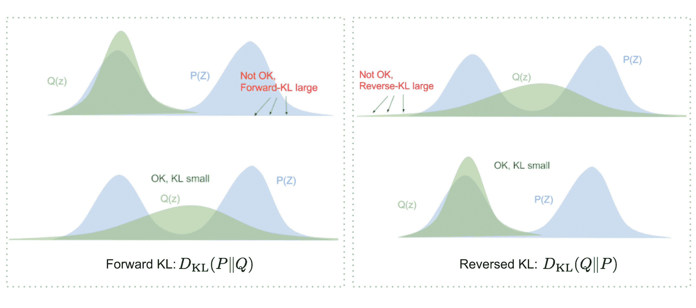

图 7。正向和反向 KL 散度对如何匹配两个分布有不同的要求。（图片来源：[blog.evjang.com/2016/08/variational-bayes.html](https://blog.evjang.com/2016/08/variational-bayes.html))

+   正向 KL 散度：$D_\text{KL}(P|Q) = \mathbb{E}_{z\sim P(z)} \log\frac{P(z)}{Q(z)}$；我们必须确保在 P(z)>0 的地方 Q(z)>0。优化的变分分布$q(z)$必须覆盖整个$p(z)$。

+   反向 KL 散度：$D_\text{KL}(Q|P) = \mathbb{E}_{z\sim Q(z)} \log\frac{Q(z)}{P(z)}$；最小化反向 KL 散度会将$Q(z)$挤压在$P(z)$下方。

现在让我们展开这个方程：

$$ \begin{aligned} & D_\text{KL}( q_\phi(\mathbf{z}\vert\mathbf{x}) \| p_\theta(\mathbf{z}\vert\mathbf{x}) ) & \\ &=\int q_\phi(\mathbf{z} \vert \mathbf{x}) \log\frac{q_\phi(\mathbf{z} \vert \mathbf{x})}{p_\theta(\mathbf{z} \vert \mathbf{x})} d\mathbf{z} & \\ &=\int q_\phi(\mathbf{z} \vert \mathbf{x}) \log\frac{q_\phi(\mathbf{z} \vert \mathbf{x})p_\theta(\mathbf{x})}{p_\theta(\mathbf{z}, \mathbf{x})} d\mathbf{z} & \scriptstyle{\text{; 因为}p(z \vert x) = p(z, x) / p(x)} \\ &=\int q_\phi(\mathbf{z} \vert \mathbf{x}) \big( \log p_\theta(\mathbf{x}) + \log\frac{q_\phi(\mathbf{z} \vert \mathbf{x})}{p_\theta(\mathbf{z}, \mathbf{x})} \big) d\mathbf{z} & \\ &=\log p_\theta(\mathbf{x}) + \int q_\phi(\mathbf{z} \vert \mathbf{x})\log\frac{q_\phi(\mathbf{z} \vert \mathbf{x})}{p_\theta(\mathbf{z}, \mathbf{x})} d\mathbf{z} & \scriptstyle{\text{; 因为}\int q(z \vert x) dz = 1}\\ &=\log p_\theta(\mathbf{x}) + \int q_\phi(\mathbf{z} \vert \mathbf{x})\log\frac{q_\phi(\mathbf{z} \vert \mathbf{x})}{p_\theta(\mathbf{z}, \mathbf{x})} d\mathbf{z} & \scriptstyle{\text{; 因为}p(z, x) = p(x \vert z) p(z)} \\ &=\log p_\theta(\mathbf{x}) + \mathbb{E}_{\mathbf{z}\sim q_\phi(\mathbf{z} \vert \mathbf{x})}[\log \frac{q_\phi(\mathbf{z} \vert \mathbf{x})}{p_\theta(\mathbf{z})} - \log p_\theta(\mathbf{x} \vert \mathbf{z})] &\\ &=\log p_\theta(\mathbf{x}) + D_\text{KL}(q_\phi(\mathbf{z}\vert\mathbf{x}) \| p_\theta(\mathbf{z})) - \mathbb{E}_{\mathbf{z}\sim q_\phi(\mathbf{z}\vert\mathbf{x})}\log p_\theta(\mathbf{x}\vert\mathbf{z}) & \end{aligned} $$

所以我们有：

$$ D_\text{KL}( q_\phi(\mathbf{z}\vert\mathbf{x}) \| p_\theta(\mathbf{z}\vert\mathbf{x}) ) =\log p_\theta(\mathbf{x}) + D_\text{KL}(q_\phi(\mathbf{z}\vert\mathbf{x}) \| p_\theta(\mathbf{z})) - \mathbb{E}_{\mathbf{z}\sim q_\phi(\mathbf{z}\vert\mathbf{x})}\log p_\theta(\mathbf{x}\vert\mathbf{z}) $$

一旦重新排列方程的左右两侧，

$$ \log p_\theta(\mathbf{x}) - D_\text{KL}( q_\phi(\mathbf{z}\vert\mathbf{x}) \| p_\theta(\mathbf{z}\vert\mathbf{x}) ) = \mathbb{E}_{\mathbf{z}\sim q_\phi(\mathbf{z}\vert\mathbf{x})}\log p_\theta(\mathbf{x}\vert\mathbf{z}) - D_\text{KL}(q_\phi(\mathbf{z}\vert\mathbf{x}) \| p_\theta(\mathbf{z})) $$

方程的左侧正是我们在学习真实分布时要最大化的内容：我们希望最大化生成真实数据的（对数）似然（即 $\log p_\theta(\mathbf{x})$），同时最小化真实和估计后验分布之间的差异（项 $D_\text{KL}$ 的作用类似于正则化器）。请注意，$p_\theta(\mathbf{x})$ 是关于 $q_\phi$ 固定的。

上述的否定定义了我们的损失函数：

$$ \begin{aligned} L_\text{VAE}(\theta, \phi) &= -\log p_\theta(\mathbf{x}) + D_\text{KL}( q_\phi(\mathbf{z}\vert\mathbf{x}) \| p_\theta(\mathbf{z}\vert\mathbf{x}) )\\ &= - \mathbb{E}_{\mathbf{z} \sim q_\phi(\mathbf{z}\vert\mathbf{x})} \log p_\theta(\mathbf{x}\vert\mathbf{z}) + D_\text{KL}( q_\phi(\mathbf{z}\vert\mathbf{x}) \| p_\theta(\mathbf{z}) ) \\ \theta^{*}, \phi^{*} &= \arg\min_{\theta, \phi} L_\text{VAE} \end{aligned} $$

在变分贝叶斯方法中，这个损失函数被称为*变分下限*或*证据下限*。名称中的“下限”部分来自于 KL 散度始终为非负，因此 $-L_\text{VAE}$ 是 $\log p_\theta (\mathbf{x})$ 的下限。

$$ -L_\text{VAE} = \log p_\theta(\mathbf{x}) - D_\text{KL}( q_\phi(\mathbf{z}\vert\mathbf{x}) \| p_\theta(\mathbf{z}\vert\mathbf{x}) ) \leq \log p_\theta(\mathbf{x}) $$

因此，通过最小化损失，我们正在最大化生成真实数据样本的概率的下限。

## 重新参数化技巧

损失函数中的期望项调用从 $\mathbf{z} \sim q_\phi(\mathbf{z}\vert\mathbf{x})$ 生成样本。抽样是一个随机过程，因此我们无法反向传播梯度。为了使其可训练，引入了重新参数化技巧：通常可以将随机变量 $\mathbf{z}$ 表示为确定性变量 $\mathbf{z} = \mathcal{T}_\phi(\mathbf{x}, \boldsymbol{\epsilon})$，其中 $\boldsymbol{\epsilon}$ 是一个辅助独立随机变量，而由参数 $\phi$ 参数化的转换函数 $\mathcal{T}_\phi$ 将 $\boldsymbol{\epsilon}$ 转换为 $\mathbf{z}$。

例如，$q_\phi(\mathbf{z}\vert\mathbf{x})$ 的常见选择形式是具有对角协方差结构的多元高斯分布：

$$ \begin{aligned} \mathbf{z} &\sim q_\phi(\mathbf{z}\vert\mathbf{x}^{(i)}) = \mathcal{N}(\mathbf{z}; \boldsymbol{\mu}^{(i)}, \boldsymbol{\sigma}^{2(i)}\boldsymbol{I}) & \\ \mathbf{z} &= \boldsymbol{\mu} + \boldsymbol{\sigma} \odot \boldsymbol{\epsilon} \text{，其中 } \boldsymbol{\epsilon} \sim \mathcal{N}(0, \boldsymbol{I}) & \scriptstyle{\text{；重新参数化技巧。}} \end{aligned} $$

其中 $\odot$ 表示逐元素乘积。

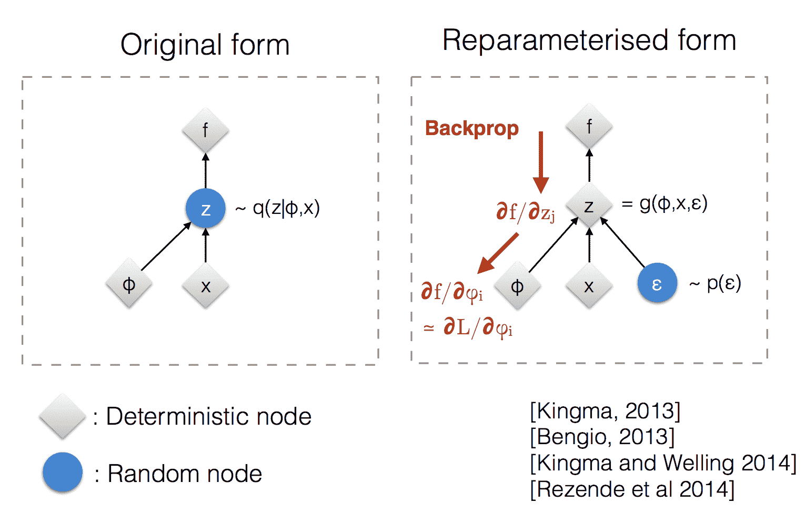

图 8\. 说明了重参数化技巧如何使$\mathbf{z}$的采样过程可训练。（图片来源：Kingma 在 NIPS 2015 研讨会的幻灯片 12 中的[演讲](http://dpkingma.com/wordpress/wp-content/uploads/2015/12/talk_nips_workshop_2015.pdf)）

重参数化技巧也适用于其他类型的分布，不仅仅是高斯分布。在多变量高斯情况下，我们通过学习分布的均值和方差$\mu$和$\sigma$来使模型可训练，明确地使用重参数化技巧，而随机性仍然存在于随机变量$\boldsymbol{\epsilon} \sim \mathcal{N}(0, \boldsymbol{I})$中。

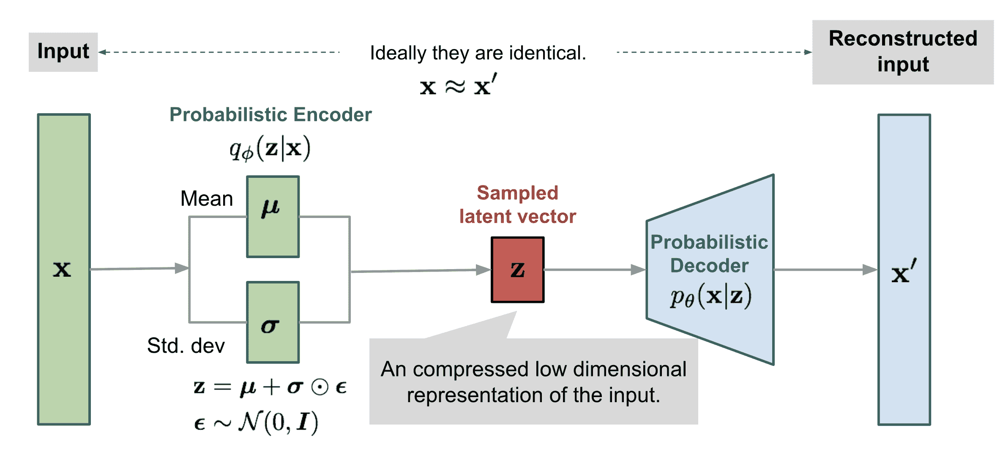

图 9\. 变分自动编码器模型的多变量高斯假设说明。

# Beta-VAE

如果推断出的潜在表示中的每个变量$\mathbf{z}$只对一个单一的生成因子敏感，并且相对于其他因子是不变的，我们将称这种表示为解耦或因子化。解耦表示经常带来的一个好处是*良好的可解释性*，并且容易推广到各种任务。

例如，一个训练于人脸照片的模型可能会在不同维度中捕捉到温和、肤色、发色、发长、情绪、是否戴眼镜等许多相对独立的因素。这样的解耦表示对于面部图像生成非常有益。

β-VAE（[Higgins 等人，2017](https://openreview.net/forum?id=Sy2fzU9gl)）是变分自动编码器的修改版本，特别强调发现解耦潜在因子。在 VAE 中遵循相同的激励，我们希望最大化生成真实数据的概率，同时保持真实和估计后验分布之间的距离小（比如，在一个小常数$\delta$下）：

$$ \begin{aligned} &\max_{\phi, \theta} \mathbb{E}_{\mathbf{x}\sim\mathcal{D}}[\mathbb{E}_{\mathbf{z} \sim q_\phi(\mathbf{z}\vert\mathbf{x})} \log p_\theta(\mathbf{x}\vert\mathbf{z})]\\ &\text{subject to } D_\text{KL}(q_\phi(\mathbf{z}\vert\mathbf{x})\|p_\theta(\mathbf{z})) < \delta \end{aligned} $$

我们可以将其重写为带有拉格朗日乘子$\beta$的拉格朗日形式，在[KKT 条件](https://www.cs.cmu.edu/~ggordon/10725-F12/slides/16-kkt.pdf)下。只有一个不等式约束的上述优化问题等价于最大化以下方程$\mathcal{F}(\theta, \phi, \beta)$：

$$ \begin{aligned} \mathcal{F}(\theta, \phi, \beta) &= \mathbb{E}_{\mathbf{z} \sim q_\phi(\mathbf{z}\vert\mathbf{x})} \log p_\theta(\mathbf{x}\vert\mathbf{z}) - \beta(D_\text{KL}(q_\phi(\mathbf{z}\vert\mathbf{x})\|p_\theta(\mathbf{z})) - \delta) & \\ & = \mathbb{E}_{\mathbf{z} \sim q_\phi(\mathbf{z}\vert\mathbf{x})} \log p_\theta(\mathbf{x}\vert\mathbf{z}) - \beta D_\text{KL}(q_\phi(\mathbf{z}\vert\mathbf{x})\|p_\theta(\mathbf{z})) + \beta \delta & \\ & \geq \mathbb{E}_{\mathbf{z} \sim q_\phi(\mathbf{z}\vert\mathbf{x})} \log p_\theta(\mathbf{x}\vert\mathbf{z}) - \beta D_\text{KL}(q_\phi(\mathbf{z}\vert\mathbf{x})\|p_\theta(\mathbf{z})) & \scriptstyle{\text{; 因为 }\beta,\delta\geq 0} \end{aligned} $$

$\beta$-VAE 的损失函数定义如下：

$$ L_\text{BETA}(\phi, \beta) = - \mathbb{E}_{\mathbf{z} \sim q_\phi(\mathbf{z}\vert\mathbf{x})} \log p_\theta(\mathbf{x}\vert\mathbf{z}) + \beta D_\text{KL}(q_\phi(\mathbf{z}\vert\mathbf{x})\|p_\theta(\mathbf{z})) $$

拉格朗日乘子 $\beta$ 被视为一个超参数。

由于 $L_\text{BETA}(\phi, \beta)$ 的否定是拉格朗日 $\mathcal{F}(\theta, \phi, \beta)$ 的下界。最小化损失等价于最大化拉格朗日，因此适用于我们的初始优化问题。

当 $\beta=1$ 时，与 VAE 相同。当 $\beta > 1$ 时，对潜在瓶颈施加更强的约束，限制 $\mathbf{z}$ 的表示容量。对于一些条件独立的生成因素，保持它们解缠是最有效的表示。因此，更高的 $\beta$ 鼓励更有效的潜在编码，并进一步鼓励解缠。同时，更高的 $\beta$ 可能在重构质量和解缠程度之间产生权衡。

[Burgess, et al. (2017)](https://arxiv.org/pdf/1804.03599.pdf) 深入讨论了 $\beta$-VAE 中的解缠绕，受到[信息瓶颈理论](https://lilianweng.github.io/posts/2017-09-28-information-bottleneck/)的启发，并进一步提出了对 $\beta$-VAE 的修改，以更好地控制编码表示容量。

# VQ-VAE 和 VQ-VAE-2

**VQ-VAE**（“矢量量化变分自动编码器”；[van den Oord, et al. 2017](http://papers.nips.cc/paper/7210-neural-discrete-representation-learning.pdf)）模型通过编码器学习离散潜变量，因为离散表示可能更适合语言、语音、推理等问题。

矢量量化（VQ）是一种将 $K$ 维向量映射到有限集合“码”向量的方法。这个过程非常类似于[KNN](https://en.wikipedia.org/wiki/K-nearest_neighbors_algorithm)算法。样本应映射到的最佳质心码向量是与之的欧几里德距离最小的向量。

让$\mathbf{e} \in \mathbb{R}^{K \times D}, i=1, \dots, K$成为 VQ-VAE 中的潜在嵌入空间（也称为“码书”），其中$K$是潜变量类别数，$D$是嵌入大小。单个嵌入向量为$\mathbf{e}_i \in \mathbb{R}^{D}, i=1, \dots, K$。

编码器输出$E(\mathbf{x}) = \mathbf{z}_e$经过最近邻查找匹配到$K$个嵌入向量中的一个，然后这个匹配的码向量成为解码器$D(.)$的输入：

$$ \mathbf{z}_q(\mathbf{x}) = \text{Quantize}(E(\mathbf{x})) = \mathbf{e}_k \text{ where } k = \arg\min_i \|E(\mathbf{x}) - \mathbf{e}_i \|_2 $$

请注意，离散潜变量在不同应用中可以具有不同的形状；例如，语音为 1D，图像为 2D，视频为 3D。

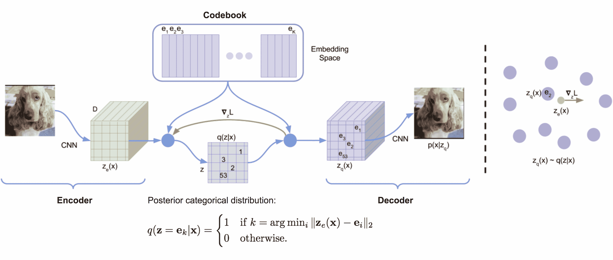

图 10。VQ-VAE 的架构（图片来源：[van den Oord 等人，2017](http://papers.nips.cc/paper/7210-neural-discrete-representation-learning.pdf)）

由于 argmin()在离散空间上不可微分，来自解码器输入$\mathbf{z}_q$的梯度$\nabla_z L$被复制到编码器输出$\mathbf{z}_e$。除了重构损失外，VQ-VAE 还优化：

+   *VQ 损失*：嵌入空间与编码器输出之间的 L2 误差。

+   *承诺损失*：一种鼓励编码器输出保持接近嵌入空间并防止其从一个码向量频繁波动到另一个码向量的度量。

$$ L = \underbrace{\|\mathbf{x} - D(\mathbf{e}_k)\|_2²}_{\textrm{重构损失}} + \underbrace{\|\text{sg}[E(\mathbf{x})] - \mathbf{e}_k\|_2²}_{\textrm{VQ 损失}} + \underbrace{\beta \|E(\mathbf{x}) - \text{sg}[\mathbf{e}_k]\|_2²}_{\textrm{承诺损失}} $$

其中$\text{sq}[.]$是`stop_gradient`运算符。

码书中的嵌入向量通过 EMA（指数移动平均）进行更新。给定一个码向量$\mathbf{e}_i$，假设我们有$n_i$个编码器输出向量$\{\mathbf{z}_{i,j}\}_{j=1}^{n_i}$，这些向量被量化为$\mathbf{e}_i$：

$$ N_i^{(t)} = \gamma N_i^{(t-1)} + (1-\gamma)n_i^{(t)}\;\;\; \mathbf{m}_i^{(t)} = \gamma \mathbf{m}_i^{(t-1)} + (1-\gamma)\sum_{j=1}^{n_i^{(t)}}\mathbf{z}_{i,j}^{(t)}\;\;\; \mathbf{e}_i^{(t)} = \mathbf{m}_i^{(t)} / N_i^{(t)} $$

其中$(t)$表示时间中的批次序列。$N_i$和$\mathbf{m}_i$分别是累积向量计数和体积。

VQ-VAE-2（[Ali Razavi 等人，2019](https://arxiv.org/abs/1906.00446)）是一个两级分层 VQ-VAE，结合了自注意力自回归模型。

1.  阶段 1 是**训练分层 VQ-VAE**：分层潜变量的设计旨在将局部模式（即纹理）与全局信息（即物体形状）分离开来。较大底层码书的训练也受到较小顶层码的条件约束，因此不必从头开始学习。

1.  第 2 阶段是**学习潜在离散码书上的先验**，以便我们从中采样并生成图像。通过这种方式，解码器可以接收从训练中采样的输入向量。使用增强了多头自注意力层的强大自回归模型来捕获先验分布（例如[PixelSNAIL；Chen 等人，2017](https://arxiv.org/abs/1712.09763)）。

考虑到 VQ-VAE-2 依赖于在简单的分层设置中配置的离散潜在变量，其生成的图像质量非常惊人。

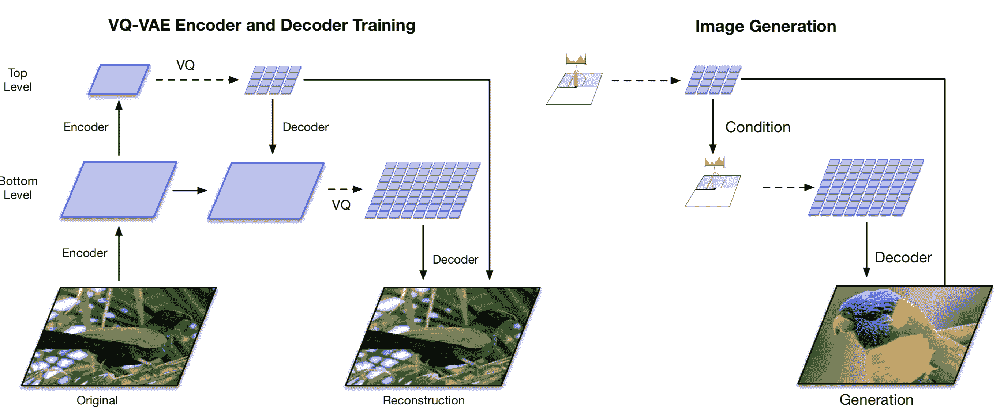

图 11。分层 VQ-VAE 和多阶段图像生成的架构。（图片来源：[Ali Razavi 等人，2019](https://arxiv.org/abs/1906.00446)）

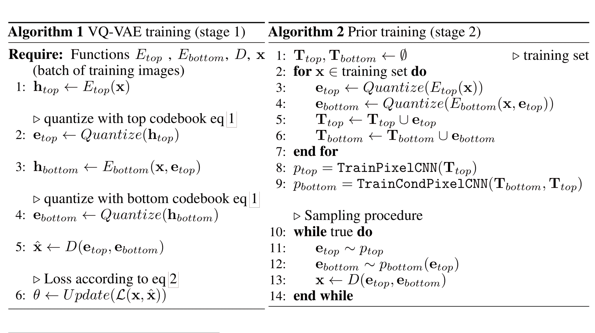

图 12。VQ-VAE-2 算法。（图片来源：[Ali Razavi 等人，2019](https://arxiv.org/abs/1906.00446)）

# TD-VAE

**TD-VAE**（“时间差分 VAE”；[Gregor 等人，2019](https://arxiv.org/abs/1806.03107)）适用于序列数据。它依赖于以下三个主要思想。

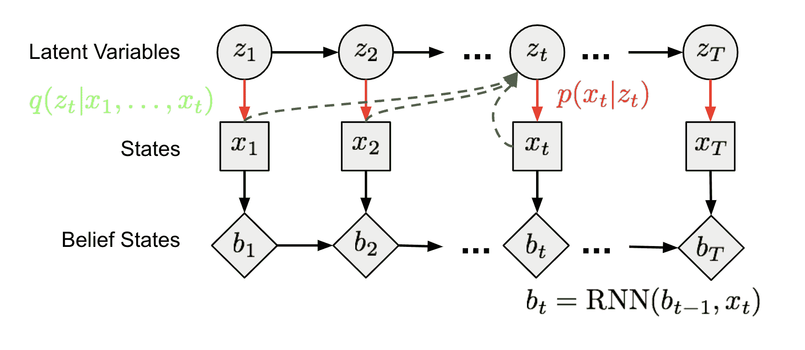

图 13。状态空间模型作为马尔可夫链模型。

**1\. 状态空间模型**

在（潜在）状态空间模型中，一系列未观察到的隐藏状态 $\mathbf{z} = (z_1, \dots, z_T)$ 决定了观察状态 $\mathbf{x} = (x_1, \dots, x_T)$。图 13 中马尔可夫链模型中的每个时间步可以像图 6 中一样进行训练，其中不可计算的后验概率 $p(z \vert x)$ 被函数 $q(z \vert x)$ 近似。

**2\. 信念状态**

智能体应该学会对所有过去的状态进行编码以推理未来，称为*信念状态*，$b_t = belief(x_1, \dots, x_t) = belief(b_{t-1}, x_t)$。基于此，给定过去的条件下未来状态的分布可以写为 $p(x_{t+1}, \dots, x_T \vert x_1, \dots, x_t) \approx p(x_{t+1}, \dots, x_T \vert b_t)$。在 TD-VAE 中，递归策略中的隐藏状态被用作智能体的信念状态。因此，我们有 $b_t = \text{RNN}(b_{t-1}, x_t)$。

**3\. 跳跃预测**

此外，一个智能体应该根据迄今收集的所有信息来想象遥远的未来，表明其具有进行跳跃预测的能力，即预测未来几步的状态。

回顾我们从上述方差下界中学到的内容：

$$ \begin{aligned} \log p(x) &\geq \log p(x) - D_\text{KL}(q(z|x)\|p(z|x)) \\ &= \mathbb{E}_{z\sim q} \log p(x|z) - D_\text{KL}(q(z|x)\|p(z)) \\ &= \mathbb{E}_{z \sim q} \log p(x|z) - \mathbb{E}_{z \sim q} \log \frac{q(z|x)}{p(z)} \\ &= \mathbb{E}_{z \sim q}[\log p(x|z) -\log q(z|x) + \log p(z)] \\ &= \mathbb{E}_{z \sim q}[\log p(x, z) -\log q(z|x)] \\ \log p(x) &\geq \mathbb{E}_{z \sim q}[\log p(x, z) -\log q(z|x)] \end{aligned} $$

现在让我们将状态 $x_t$ 的分布建模为一个概率函数，条件是所有过去状态 $x_{<t}$ 和当前时间步和一步回退的两个潜变量 $z_t$ 和 $z_{t-1}$：

$$ \log p(x_t|x_{

继续扩展方程式：

$$ \begin{aligned} & \log p(x_t|x_{

注意两件事：

+   根据马尔可夫假设，红色项可以被忽略。

+   蓝色项根据马尔可夫假设进行了扩展。

+   绿色项被扩展以包括向过去进行一步预测作为平滑分布。

具体来说，有四种类型的分布需要学习：

1.  $p_D(.)$ 是**解码器**分布：

+   $p(x_t \mid z_t)$ 是按照通用定义的编码器；

+   $p(x_t \mid z_t) \to p_D(x_t \mid z_t)$;

1.  $p_T(.)$ 是**转移**分布：

+   $p(z_t \mid z_{t-1})$ 捕捉潜变量之间的顺序依赖关系；

+   $p(z_t \mid z_{t-1}) \to p_T(z_t \mid z_{t-1})$;

1.  $p_B(.)$ 是**信念**分布：

+   $p(z_{t-1} \mid x_{<t})$ 和 $q(z_t \mid x_{\leq t})$ 都可以使用信念状态来预测潜变量；

+   $p(z_{t-1} \mid x_{<t}) \to p_B(z_{t-1} \mid b_{t-1})$;

+   $q(z_{t} \mid x_{\leq t}) \to p_B(z_t \mid b_t)$;

1.  $p_S(.)$ 是**平滑**分布：

+   回到过去的平滑项 $q(z_{t-1} \mid z_t, x_{\leq t})$ 可以重写为依赖于信念状态；

+   $q(z_{t-1} \mid z_t, x_{\leq t}) \to p_S(z_{t-1} \mid z_t, b_{t-1}, b_t)$;

为了融入跳跃预测的概念，顺序 ELBO 不仅需要在 $t, t+1$ 上工作，还需要在两个不同的时间戳 $t_1 < t_2$ 上工作。这是最终的 TD-VAE 目标函数以最大化：

$$ J_{t_1, t_2} = \mathbb{E}[ \log p_D(x_{t_2}|z_{t_2}) + \log p_B(z_{t_1}|b_{t_1}) + \log p_T(z_{t_2}|z_{t_1}) - \log p_B(z_{t_2}|b_{t_2}) - \log p_S(z_{t_1}|z_{t_2}, b_{t_1}, b_{t_2})] $$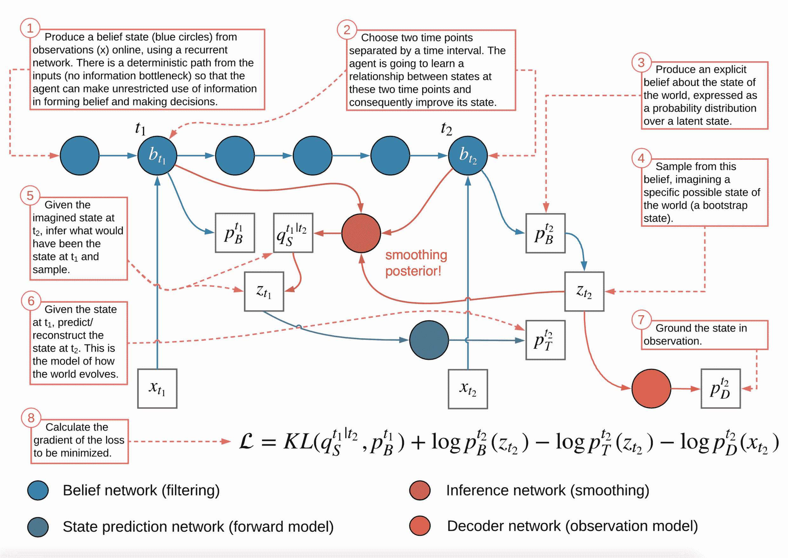

图 14。TD-VAE 架构的详细概述，非常出色。 (图片来源：[TD-VAE 论文](https://arxiv.org/abs/1806.03107))

* * *

引用为：

```py
@article{weng2018VAE,
  title   = "From Autoencoder to Beta-VAE",
  author  = "Weng, Lilian",
  journal = "lilianweng.github.io",
  year    = "2018",
  url     = "https://lilianweng.github.io/posts/2018-08-12-vae/"
} 
```

# 参考文献

[1] Geoffrey E. Hinton, 和 Ruslan R. Salakhutdinov。[“使用神经网络降低数据的维度。”](https://pdfs.semanticscholar.org/c50d/ca78e97e335d362d6b991ae0e1448914e9a3.pdf) 科学 313.5786 (2006): 504-507.

[2] Pascal Vincent, 等人。[“使用去噪自动编码器提取和组合稳健特征。”](http://www.cs.toronto.edu/~larocheh/publications/icml-2008-denoising-autoencoders.pdf) ICML, 2008.

[3] Pascal Vincent, 等人。[“堆叠去噪自动编码器：通过局部去噪标准在深度网络中学习有用的表示。”](http://www.jmlr.org/papers/volume11/vincent10a/vincent10a.pdf) 机器学习研究杂志 11.Dec (2010): 3371-3408.

[4] Geoffrey E. Hinton, Nitish Srivastava, Alex Krizhevsky, Ilya Sutskever, and Ruslan R. Salakhutdinov. “通过防止特征探测器的共适应性来改进神经网络。” arXiv 预印本 arXiv:1207.0580 (2012).

[5] [稀疏自动编码器](https://web.stanford.edu/class/cs294a/sparseAutoencoder.pdf) 由 Andrew Ng。

[6] Alireza Makhzani, Brendan Frey (2013)。[“k-稀疏自动编码器”](https://arxiv.org/abs/1312.5663)。ICLR 2014。

[7] Salah Rifai 等人 [“收缩自动编码器：特征提取过程中的显式不变性。”](http://www.icml-2011.org/papers/455_icmlpaper.pdf) ICML, 2011。

[8] Diederik P. Kingma 和 Max Welling。[“自动编码变分贝叶斯。”](https://arxiv.org/abs/1312.6114) ICLR 2014。

[9] [教程 - 什么是变分自动编码器？](https://jaan.io/what-is-variational-autoencoder-vae-tutorial/) 在 jaan.io 上

[10] Youtube 教程：[变分自动编码器](https://www.youtube.com/watch?v=9zKuYvjFFS8) 由 Arxiv Insights

[11] [“初学者指南：均场近似的变分方法”](https://blog.evjang.com/2016/08/variational-bayes.html) 由 Eric Jang。

[12] Carl Doersch。[“变分自动编码器教程。”](https://arxiv.org/abs/1606.05908) arXiv:1606.05908, 2016。

[13] Irina Higgins 等人 [“$\beta$-VAE：使用受限变分框架学习基本视觉概念。”](https://openreview.net/forum?id=Sy2fzU9gl) ICLR 2017。

[14] Christopher P. Burgess 等人 [“理解 beta-VAE 中的解缠。”](https://arxiv.org/abs/1804.03599) NIPS 2017。

[15] Aaron van den Oord 等人 [“神经离散表示学习”](https://arxiv.org/abs/1711.00937) NIPS 2017。

[16] Ali Razavi 等人 [“使用 VQ-VAE-2 生成多样化高保真图像”](https://arxiv.org/abs/1906.00446)。arXiv 预印本 arXiv:1906.00446 (2019)。

[17] Xi Chen 等人 [“PixelSNAIL：改进的自回归生成模型。”](https://arxiv.org/abs/1712.09763) arXiv 预印本 arXiv:1712.09763 (2017)。

[18] Karol Gregor 等人 [“时序差分变分自动编码器。”](https://arxiv.org/abs/1806.03107) ICLR 2019。

+   [自动编码器](https://lilianweng.github.io/tags/autoencoder/)

+   [生成模型](https://lilianweng.github.io/tags/generative-model/)

+   [图像生成](https://lilianweng.github.io/tags/image-generation/)

[«

[基于流的深度生成模型](https://lilianweng.github.io/posts/2018-10-13-flow-models/) [»

[注意力？注意力！](https://lilianweng.github.io/posts/2018-06-24-attention/)© 2024 [Lil'Log](https://lilianweng.github.io/) 由[Hugo](https://gohugo.io/) & [PaperMod](https://git.io/hugopapermod)提供[](#top "返回顶部（Alt + G)")
