# 注意力？注意力！

> 原文：[`lilianweng.github.io/posts/2018-06-24-attention/`](https://lilianweng.github.io/posts/2018-06-24-attention/)

更新于 2018-10-28：添加了[指针网络和[链接](https://github.com/lilianweng/transformer-tensorflow)到我的 Transformer 实现。]

[更新于 2018-11-06：添加了一个[链接](https://github.com/lilianweng/transformer-tensorflow)到 Transformer 模型的实现。]

更新于 2018-11-18：添加了[神经图灵机。]

[更新于 2019-07-18：在介绍[show-attention-tell](https://arxiv.org/abs/1502.03044)论文时，更正了使用术语“自注意力”的错误；将其移到自注意力部分。]

[更新于 2020-04-07：有关改进的 Transformer 模型的后续帖子在[这里](https://lilianweng.github.io/posts/2020-04-07-the-transformer-family/)。]

注意力在某种程度上受到我们如何在图像的不同区域或在一句话中相关单词之间进行视觉关注的启发。以图 1 中的柴犬图片为例。


图 1。一只穿着男士服装的柴犬。原始照片的来源归功于 Instagram [@mensweardog](https://www.instagram.com/mensweardog/?hl=en)。

人类视觉注意力使我们能够专注于“高分辨率”区域（即看着黄色框中尖耳朵）同时以“低分辨率”感知周围图像（即雪地背景和服装是什么？），然后相应地调整焦点或进行推断。给定图像的一个小区域，其余像素提供线索，指导应该显示什么。我们期望在黄色框中看到尖耳朵，因为我们已经看到了狗的鼻子，右边的另一只尖耳朵，以及柴犬神秘的眼睛（红框中的东西）。然而，底部的毛衣和毯子对于这些狗狗特征来说并不那么有帮助。

同样地，我们可以解释一句话或接近上下文中单词之间的关系。当我们看到“吃”时，我们期望很快遇到一个食物词。颜色词描述食物，但可能与“吃”直接相关性不那么大。

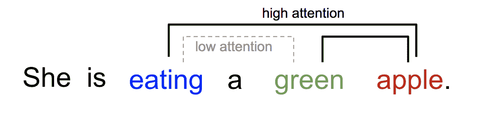

图 2。一个单词在同一句子中与其他单词的关注不同。

简而言之，深度学习中的注意力可以广义地解释为一个重要性权重向量：为了预测或推断一个元素，例如图像中的一个像素或句子中的一个单词，我们使用注意力向量估计它与其他元素的相关性有多强（或者正如您可能在许多论文中读到的那样“*关注*”），并将它们的值按注意力向量加权求和作为目标的近似。

# Seq2Seq 模型有什么问题？

**seq2seq**模型诞生于语言建模领域（[Sutskever 等人，2014](https://arxiv.org/abs/1409.3215)）。广义上讲，它旨在将一个输入序列（源）转换为一个新的序列（目标），而且两个序列的长度可以是任意的。转换任务的示例包括文本或音频之间的多语言机器翻译，问答对话生成，甚至将句子解析成语法树。

seq2seq 模型通常具有编码器-解码器架构，由以下组成：

+   **编码器**处理输入序列并将信息压缩成一个长度固定的上下文向量（也称为句子嵌入或“思想”向量）。这种表示预期是对*整个*源序列含义的很好总结。

+   **解码器**使用上下文向量初始化以发出转换后的输出。早期的工作仅使用编码器网络的最后状态作为解码器的初始状态。

编码器和解码器都是循环神经网络，即使用[LSTM 或 GRU](http://colah.github.io/posts/2015-08-Understanding-LSTMs/)单元。

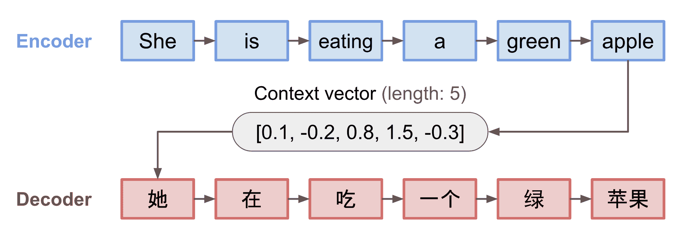

图 3\. 编码器-解码器模型，将句子“她正在吃一个绿色的苹果”翻译成中文。编码器和解码器的可视化在时间上展开。

这种固定长度上下文向量设计的一个关键而明显的缺点是无法记住长句子。通常在处理完整个输入后，它会忘记第一部分。注意力机制诞生于[Bahdanau 等人，2015](https://arxiv.org/pdf/1409.0473.pdf)以解决这个问题。

# 诞生于翻译领域

注意力机制诞生于神经机器翻译（[NMT](https://arxiv.org/pdf/1409.0473.pdf)）中，以帮助记忆长句子。注意力的秘密在于不是仅仅基于编码器的最后隐藏状态构建一个单一的上下文向量，而是在上下文向量和整个源输入之间创建快捷方式。这些快捷连接的权重对每个输出元素都是可定制的。

虽然上下文向量可以访问整个输入序列，但我们不需要担心遗忘。源和目标之间的对齐由上下文向量学习和控制。基本上，上下文向量包含三个信息：

+   编码器隐藏状态；

+   解码器隐藏状态；

+   源和目标之间的对齐。

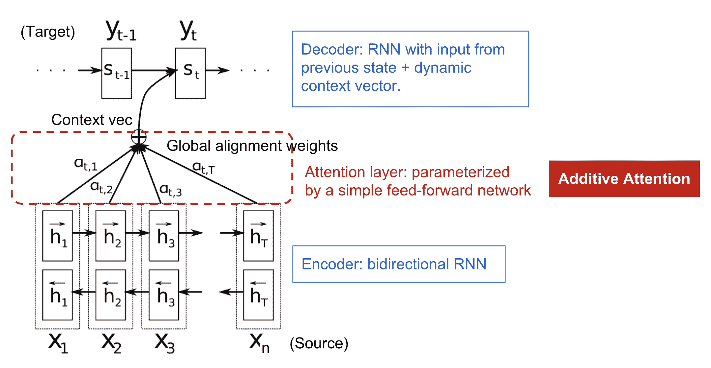

图 4\. [Bahdanau 等人，2015](https://arxiv.org/pdf/1409.0473.pdf)中带有加性注意力机制的编码器-解码器模型。

## 定义

现在让我们以科学的方式定义 NMT 中引入的注意力机制。假设我们有长度为$n$的源序列$\mathbf{x}$，并尝试输出长度为$m$的目标序列$\mathbf{y}$：

$$ \begin{aligned} \mathbf{x} &= [x_1, x_2, \dots, x_n] \\ \mathbf{y} &= [y_1, y_2, \dots, y_m] \end{aligned} $$

（粗体变量表示它们是向量；本文中的其他内容也是如此。）

编码器是一个[双向 RNN](https://www.coursera.org/lecture/nlp-sequence-models/bidirectional-rnn-fyXnn)（或您选择的其他循环网络设置），具有前向隐藏状态$\overrightarrow{\boldsymbol{h}}_i$和后向隐藏状态$\overleftarrow{\boldsymbol{h}}_i$。简单地将两者连接起来表示编码器状态。其动机是在一个词的注释中包含前面和后面的单词。

$$ \boldsymbol{h}_i = [\overrightarrow{\boldsymbol{h}}_i^\top; \overleftarrow{\boldsymbol{h}}_i^\top]^\top, i=1,\dots,n $$

解码器网络具有隐藏状态$\boldsymbol{s}_t=f(\boldsymbol{s}_{t-1}, y_{t-1}, \mathbf{c}_t)$，用于位置 t 处的输出单词，$t=1,\dots,m$，其中上下文向量$\mathbf{c}_t$是输入序列的隐藏状态的加权和，由对齐分数加权：

$$ \begin{aligned} \mathbf{c}_t &= \sum_{i=1}^n \alpha_{t,i} \boldsymbol{h}_i & \small{\text{; 输出}y_t\text{的上下文向量}}\\ \alpha_{t,i} &= \text{align}(y_t, x_i) & \small{\text{; 两个单词}y_t\text{和}x_i\text{对齐得有多好。}}\\ &= \frac{\exp(\text{score}(\boldsymbol{s}_{t-1}, \boldsymbol{h}_i))}{\sum_{i'=1}^n \exp(\text{score}(\boldsymbol{s}_{t-1}, \boldsymbol{h}_{i'}))} & \small{\text{; 一些预定义对齐分数的 softmax。}}. \end{aligned} $$

对齐模型为输入位置 i 和输出位置 t 处的一对（$y_t, x_i$）分配一个分数$\alpha_{t,i}$，根据它们匹配得有多好。$\{\alpha_{t, i}\}$的集合是定义每个输出应考虑多少源隐藏状态的权重。在 Bahdanau 的论文中，对齐分数$\alpha$由一个具有单隐藏层的**前馈网络**参数化，并且该网络与模型的其他部分一起进行训练。因此，得分函数的形式如下，假设 tanh 被用作非线性激活函数：

$$ \text{score}(\boldsymbol{s}_t, \boldsymbol{h}_i) = \mathbf{v}_a^\top \tanh(\mathbf{W}_a[\boldsymbol{s}_t; \boldsymbol{h}_i]) $$

这里$\mathbf{v}_a$和$\mathbf{W}_a$都是在对齐模型中要学习的权重矩阵。

对齐分数矩阵是一个很好的副产品，可以明确显示源语言和目标语言之间的相关性。

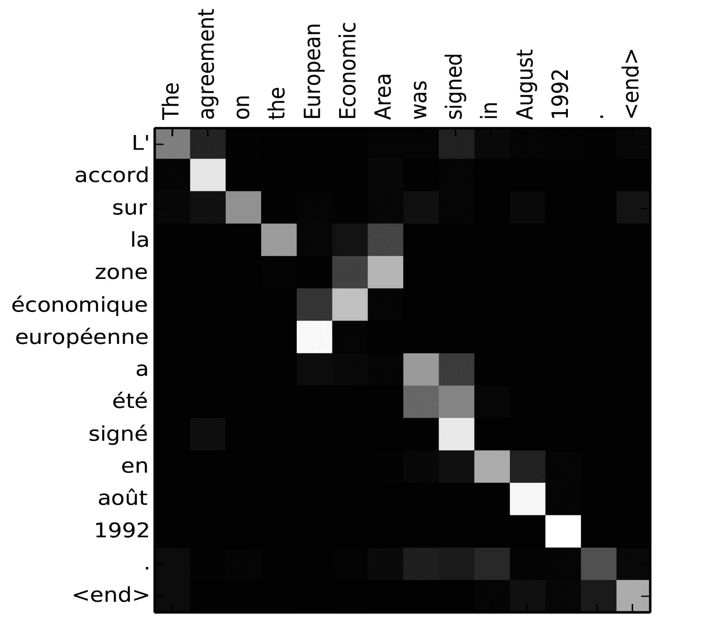

图 5. "L'accord sur l'Espace économique européen a été signé en août 1992"（法语）及其英文翻译"The agreement on the European Economic Area was signed in August 1992"的对齐矩阵（图片来源：[Bahdanau 等人，2015 年](https://arxiv.org/pdf/1409.0473.pdf)中的图 3）

查看这篇由 Tensorflow 团队提供的不错的[教程](https://www.tensorflow.org/versions/master/tutorials/seq2seq)，了解更多实现说明。

# 一系列注意力机制

在注意力的帮助下，源序列和目标序列之间的依赖关系不再受中间距离的限制！鉴于注意力在机器翻译中的巨大改进，它很快被扩展到计算机视觉领域（[Xu et al. 2015](http://proceedings.mlr.press/v37/xuc15.pdf)），人们开始探索各种其他形式的注意力机制（[Luong, et al., 2015](https://arxiv.org/pdf/1508.04025.pdf); [Britz et al., 2017](https://arxiv.org/abs/1703.03906); [Vaswani, et al., 2017](http://papers.nips.cc/paper/7181-attention-is-all-you-need.pdf)）。

## 总结

下面是几种流行的注意力机制及相应的对齐评分函数的总结表：

| 名称 | 对齐评分函数 | 引用 |
| --- | --- | --- |
| 基于内容的注意力 | $\text{score}(\boldsymbol{s}_t, \boldsymbol{h}_i) = \text{cosine}[\boldsymbol{s}_t, \boldsymbol{h}_i]$ | [Graves2014](https://arxiv.org/abs/1410.5401) |
| 加性(*) | $\text{score}(\boldsymbol{s}_t, \boldsymbol{h}_i) = \mathbf{v}_a^\top \tanh(\mathbf{W}_a[\boldsymbol{s}_{t-1}; \boldsymbol{h}_i])$ | [Bahdanau2015](https://arxiv.org/pdf/1409.0473.pdf) |
| 基于位置 | $\alpha_{t,i} = \text{softmax}(\mathbf{W}_a \boldsymbol{s}_t)$ 注意：这简化了 softmax 对齐，只依赖于目标位置。 | [Luong2015](https://arxiv.org/pdf/1508.04025.pdf) |
| 一般 | $\text{score}(\boldsymbol{s}_t, \boldsymbol{h}_i) = \boldsymbol{s}_t^\top\mathbf{W}_a\boldsymbol{h}_i$ 其中 $\mathbf{W}_a$ 是注意力层中的可训练权重矩阵。 | [Luong2015](https://arxiv.org/pdf/1508.04025.pdf) |
| 点积 | $\text{score}(\boldsymbol{s}_t, \boldsymbol{h}_i) = \boldsymbol{s}_t^\top\boldsymbol{h}_i$ | [Luong2015](https://arxiv.org/pdf/1508.4025.pdf) |
| 缩放点积(^) | $\text{score}(\boldsymbol{s}_t, \boldsymbol{h}_i) = \frac{\boldsymbol{s}_t^\top\boldsymbol{h}_i}{\sqrt{n}}$ 注意：与点积注意力非常相似，只是多了一个缩放因子；其中 n 是源隐藏状态的维度。 | [Vaswani2017](http://papers.nips.cc/paper/7181-attention-is-all-you-need.pdf) |

(*) 在 Luong 等人的 2015 年论文中被称为“concat”，在 Vaswani 等人的 2017 年论文中被称为“加性注意力”。

(^) 它添加了一个缩放因子 $1/\sqrt{n}$，这是出于当输入较大时的考虑，softmax 函数可能具有极小的梯度，难以进行有效学习。

这里是注意力机制的更广泛类别的总结：

| 名称 | 定义 | 引用 |
| --- | --- | --- |
| 自注意力(&) | 关联同一输入序列的不同位置。理论上，自注意力可以采用上述任何评分函数，只是将目标序列替换为相同的输入序列。 | [Cheng2016](https://arxiv.org/pdf/1601.06733.pdf) |
| 全局/软 | 关注整个输入状态空间。 | [Xu2015](http://proceedings.mlr.press/v37/xuc15.pdf) |
| 本地/硬 | 关注输入状态空间的一部分；即输入图像的一个补丁。 | [Xu2015](http://proceedings.mlr.press/v37/xuc15.pdf); [Luong2015](https://arxiv.org/pdf/1508.04025.pdf) |

(&) 也被称为“内部注意力”在 Cheng 等人，2016 和其他一些论文中。

## 自注意力

**自注意力**，也称为**内部注意力**，是一种注意力机制，涉及单个序列的不同位置，以计算相同序列的表示。已经证明在机器阅读、抽象摘要或图像描述生成中非常有用。

[长短期记忆网络](https://arxiv.org/pdf/1601.06733.pdf)论文使用自注意力进行机器阅读。 在下面的示例中，自注意力机制使我们能够学习当前单词与句子先前部分之间的相关性。

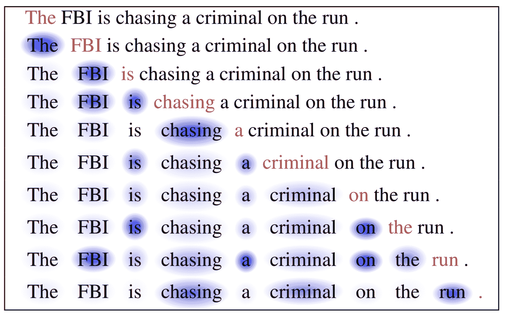

图 6\. 当前单词为红色，蓝色阴影的大小表示激活水平。 （图片来源：[Cheng 等人，2016](https://arxiv.org/pdf/1601.06733.pdf)）

## 软注意力 vs 硬注意力

在[show, attend and tell](http://proceedings.mlr.press/v37/xuc15.pdf)论文中，注意力机制被应用于图像以生成标题。 图像首先由 CNN 编码以提取特征。 然后，LSTM 解码器消耗卷积特征逐个生成描述性单词，其中权重通过注意力学习。 注意权重的可视化清楚地展示了模型关注图像的哪些区域，以便输出特定单词。

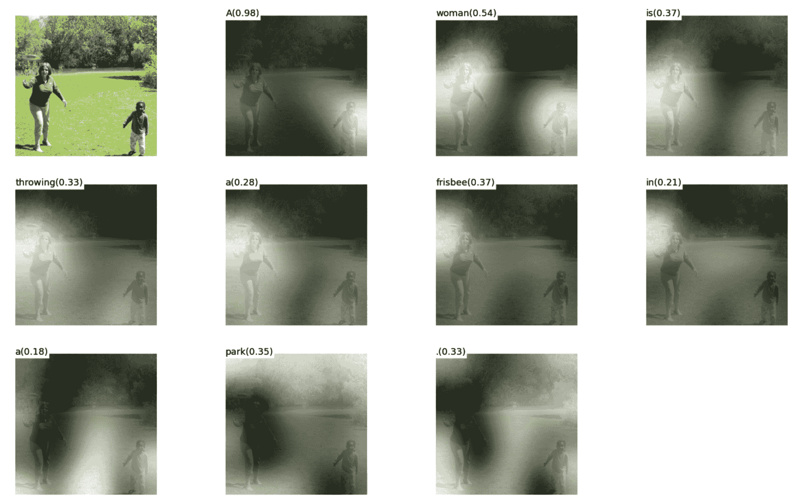

图 7\. "一个女人在公园里扔飞盘。"（图片来源：[Xu 等人，2015](http://proceedings.mlr.press/v37/xuc15.pdf)的图 6(b)）

本文首次提出了“软” vs “硬” 注意力的区别，基于注意力是否可以访问整个图像或仅一个补丁：

+   **软** 注意力：对齐权重是学习的，并“软地”放置在源图像的所有补丁上；本质上与[Bahdanau 等人，2015](https://arxiv.org/abs/1409.0473)中的注意力相同类型。

    +   *优点*: 模型平滑且可微分。

    +   *缺点*: 当源输入较大时，计算成本高。

+   **硬** 注意力：一次只选择图像的一个补丁进行关注。

    +   *优点*: 推理时计算量较少。

    +   *缺点*: 模型是不可微分的，需要更复杂的技术，如方差减少或强化学习来训练。([Luong 等人，2015](https://arxiv.org/abs/1508.04025))

## 全局 vs 本地注意力

[Luong 等人，2015](https://arxiv.org/pdf/1508.04025.pdf)提出了“全局”和“局部”注意力机制。全局注意力类似于软注意力，而局部注意力是硬注意力和软注意力之间的有趣融合，是对硬注意力的改进，使其可微分：模型首先预测当前目标词的单个对齐位置，然后使用围绕源位置的窗口来计算上下文向量。

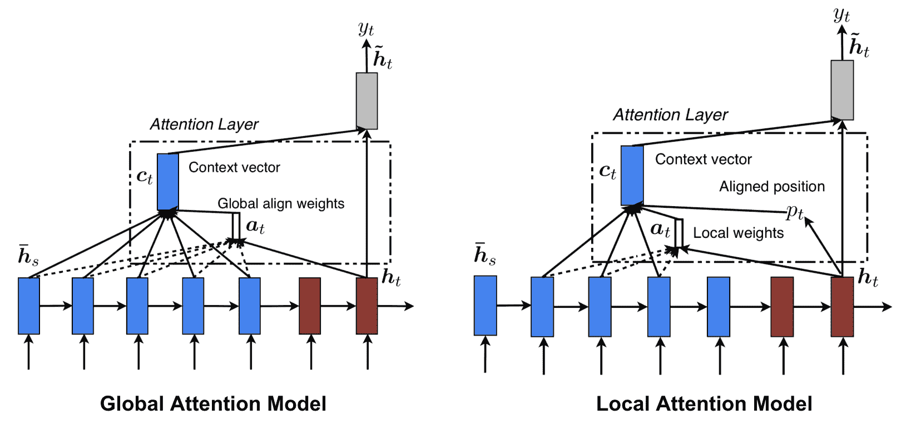

图 8\. 全局与局部注意力（图片来源：Luong 等人，2015 中的图 2 和图 3）

# 神经图灵机

阿兰·图灵在[1936 年](https://en.wikipedia.org/wiki/Turing_machine)提出了一种计算的极简模型。它由一个无限长的带和一个与带交互的头组成。带上有无数个单元格，每个单元格填有符号：0、1 或空白（“ ”）。操作头可以读取符号，编辑符号，并在带上左右移动。理论上，图灵机可以模拟任何计算机算法，无论该过程有多复杂或昂贵。无限的存储器使得图灵机在数学上具有无限的可能性。然而，在现实的现代计算机中，无限的存储器是不可行的，因此我们只将图灵机视为计算的数学模型。

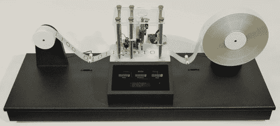

图 9\. 图灵机的外观：带+处理带的头。（图片来源：[`aturingmachine.com/`](http://aturingmachine.com/)）

**神经图灵机**（**NTM**，[Graves，Wayne＆Danihelka，2014](https://arxiv.org/abs/1410.5401)）是一种将神经网络与外部存储器耦合的模型架构。存储器模拟图灵机带，神经网络控制操作头以从带上读取或写入。然而，NTM 中的存储器是有限的，因此它可能更像是“神经[冯·诺伊曼](https://en.wikipedia.org/wiki/Von_Neumann_architecture)机”。

NTM 包含两个主要组件，一个*控制器*神经网络和一个*存储器*库。控制器：负责在存储器上执行操作。它可以是任何类型的神经网络，前馈或循环。存储器：存储处理过的信息。它是一个大小为$N \times M$的矩阵，包含 N 个向量行，每个向量有$M$个维度。

在一个更新迭代中，控制器处理输入并相应地与存储器库交互以生成输出。交互由一组并行的*读*和*写*头处理。读和写操作都通过软地关注所有存储器地址来“模糊”。


图 10\. 神经图灵机架构。

## 阅读与写作

在时间$t$从内存中读取时，大小为$N$的注意力向量$\mathbf{w}_t$控制分配给不同内存位置（矩阵行）的注意力量。读取向量$\mathbf{r}_t$是按注意力强度加权求和：

$$ \mathbf{r}_t = \sum_{i=1}^N w_t(i)\mathbf{M}_t(i)\text{，其中 }\sum_{i=1}^N w_t(i)=1，\forall i: 0 \leq w_t(i) \leq 1 $$

其中$w_t(i)$是$\mathbf{w}_t$中的第$i$个元素，$\mathbf{M}_t(i)$是内存中的第$i$行向量。

在时间$t$写入内存时，受 LSTM 中的输入和遗忘门的启发，写头首先根据擦除向量$\mathbf{e}_t$擦除一些旧内容，然后通过添加向量$\mathbf{a}_t$添加新信息。

$$ \begin{aligned} \tilde{\mathbf{M}}_t(i) &= \mathbf{M}_{t-1}(i) [\mathbf{1} - w_t(i)\mathbf{e}_t] &\scriptstyle{\text{；擦除}}\\ \mathbf{M}_t(i) &= \tilde{\mathbf{M}}_t(i) + w_t(i) \mathbf{a}_t &\scriptstyle{\text{；添加}} \end{aligned} $$

## 注意机制

在神经图灵机中，如何生成注意力分布$\mathbf{w}_t$取决于寻址机制：NTM 使用基于内容和基于位置的寻址的混合。

**基于内容的寻址**

基于内容的寻址根据控制器从输入和内存行中提取的关键向量$\mathbf{k}_t$之间的相似性创建注意力向量。基于内容的注意力分数通过余弦相似性计算，然后通过 softmax 进行归一化。此外，NTM 添加了一个强度乘数$\beta_t$来放大或减弱分布的焦点。

$$ w_t^c(i) = \text{softmax}(\beta_t \cdot \text{cosine}[\mathbf{k}_t, \mathbf{M}_t(i)]) = \frac{\exp(\beta_t \frac{\mathbf{k}_t \cdot \mathbf{M}_t(i)}{\|\mathbf{k}_t\| \cdot \|\mathbf{M}_t(i)\|})}{\sum_{j=1}^N \exp(\beta_t \frac{\mathbf{k}_t \cdot \mathbf{M}_t(j)}{\|\mathbf{k}_t\| \cdot \|\mathbf{M}_t(j)\|})} $$

**插值**

然后，插值门标量$g_t$用于将新生成的基于内容的注意力向量与上一个时间步的注意力权重混合：

$$ \mathbf{w}_t^g = g_t \mathbf{w}_t^c + (1 - g_t) \mathbf{w}_{t-1} $$

**基于位置的寻址**

基于位置的寻址将不同位置的注意力向量加权求和，权重由允许的整数偏移的加权分布确定。这相当于具有位置偏移函数$\mathbf{s}_t(.)$的 1 维卷积。有多种定义此分布的方法。参见图 11 以获取灵感。

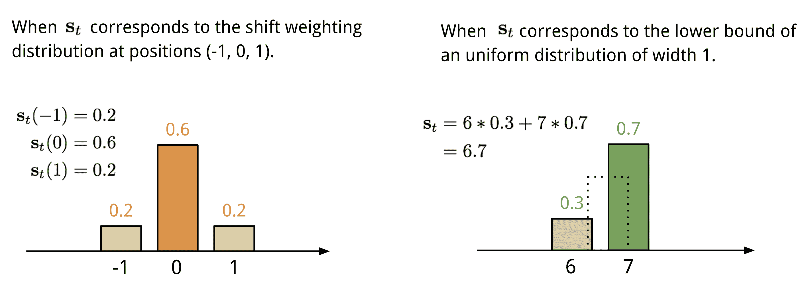

图 11\. 表示偏移加权分布$\mathbf{s}\_t$的两种方法。

最后，注意力分布通过一个锐化标量$\gamma_t \geq 1$增强。

$$ \begin{aligned} \tilde{w}_t(i) &= \sum_{j=1}^N w_t^g(j) s_t(i-j) & \scriptstyle{\text{; 循环卷积}}\\ w_t(i) &= \frac{\tilde{w}_t(i)^{\gamma_t}}{\sum_{j=1}^N \tilde{w}_t(j)^{\gamma_t}} & \scriptstyle{\text{; 锐化}} \end{aligned} $$

在时间步 t 生成注意力向量 $\mathbf{w}_t$ 的完整过程如图 12 所示。控制器产生的所有参数对于每个头部都是唯一的。如果并行存在多个读写头，控制器将输出多组参数。

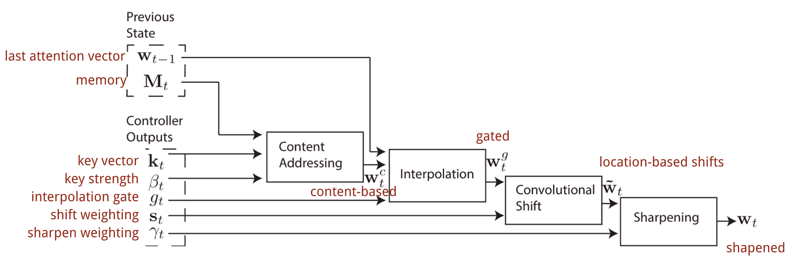

图 12\. 神经图灵机中的寻址机制流程图。 (图片来源: [Graves, Wayne & Danihelka, 2014](https://arxiv.org/abs/1410.5401))

# 指针网络

在排序或旅行商等问题中，输入和输出都是序列数据。不幸的是，它们不能轻松地通过经典的 seq-2-seq 或 NMT 模型解决，因为输出元素的离散类别事先未确定，而是取决于可变的输入大小。**指针网络** (**Ptr-Net**; [Vinyals, et al. 2015](https://arxiv.org/abs/1506.03134)) 被提出来解决这类问题：当输出元素对应于输入序列中的*位置*时。指针网络不会像图 8 中那样使用注意力将编码器的隐藏单元混合到上下文向量中，而是在每个解码器步骤中对输入元素应用注意力以选择一个作为输出。

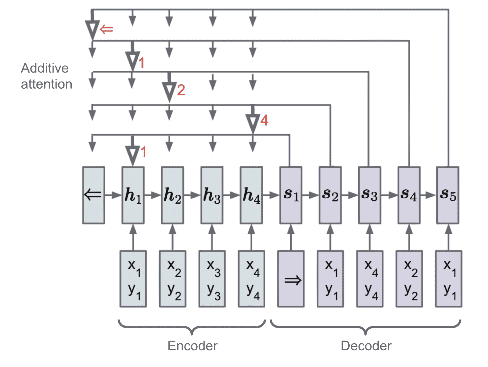

图 13\. 指针网络模型的架构。 (图片来源: [Vinyals, et al. 2015](https://arxiv.org/abs/1506.03134))

Ptr-Net 在给定输入向量序列 $\boldsymbol{x} = (x_1, \dots, x_n)$ 和 $1 \leq c_i \leq n$ 的情况下输出一个整数索引序列 $\boldsymbol{c} = (c_1, \dots, c_m)$。该模型仍然采用编码器-解码器框架。编码器和解码器的隐藏状态分别表示为 $(\boldsymbol{h}_1, \dots, \boldsymbol{h}_n)$ 和 $(\boldsymbol{s}_1, \dots, \boldsymbol{s}_m)$。注意，$\mathbf{s}_i$ 是解码器中细胞激活后的输出门。Ptr-Net 在状态之间应用加性注意力，然后通过 softmax 进行归一化以建模输出的条件概率：

$$ \begin{aligned} y_i &= p(c_i \vert c_1, \dots, c_{i-1}, \boldsymbol{x}) \\ &= \text{softmax}(\text{score}(\boldsymbol{s}_t; \boldsymbol{h}_i)) = \text{softmax}(\mathbf{v}_a^\top \tanh(\mathbf{W}_a[\boldsymbol{s}_t; \boldsymbol{h}_i])) \end{aligned} $$

注意机制被简化了，因为 Ptr-Net 不会使用注意权重将编码器状态混合到输出中。这样，输出只会响应位置而不是输入内容。

# Transformer

[“注意力就是一切”](http://papers.nips.cc/paper/7181-attention-is-all-you-need.pdf)（Vaswani 等，2017），毫无疑问，是 2017 年最具影响力和有趣的论文之一。它提出了许多改进软注意力的方法，并使得在没有循环网络单元的情况下进行 seq2seq 建模成为可能。所提出的“**transformer**”模型完全基于自注意力机制构建，而不使用序列对齐的循环架构。

秘密配方体现在其模型架构中。

## 键、值和查询

transformer 中的主要组件是*多头自注意力机制*单元。transformer 将输入的编码表示视为一组维度为$n$（输入序列长度）的**键**-**值**对$(\mathbf{K}, \mathbf{V})$；在 NMT 的背景下，键和值都是编码器隐藏状态。在解码器中，先前的输出被压缩成一个维度为$m$的**查询**（$\mathbf{Q}$），并通过映射这个查询和键值对集合来产生下一个输出。

transformer 采用了缩放点积注意力：输出是值的加权和，其中分配给每个值的权重由查询与所有键的点积确定：

$$ \text{注意力}(\mathbf{Q}, \mathbf{K}, \mathbf{V}) = \text{softmax}(\frac{\mathbf{Q}\mathbf{K}^\top}{\sqrt{n}})\mathbf{V} $$

## 多头自注意力


图 14. 多头缩放点积注意力机制。（图片来源：[Vaswani 等，2017](http://papers.nips.cc/paper/7181-attention-is-all-you-need.pdf)中的图 2）

多头机制不仅仅计算一次注意力，而是并行多次运行缩放点积注意力。独立的注意力输出简单地连接并线性转换为期望的维度。我猜想这样做的动机是因为集成总是有帮助的？;) 根据论文，“*多头注意力允许模型同时关注不同位置的不同表示**子空间**的信息。使用单个注意力头，平均会抑制这一点。”*

$$ \begin{aligned} \text{多头}(\mathbf{Q}, \mathbf{K}, \mathbf{V}) &= [\text{头}_1; \dots; \text{头}_h]\mathbf{W}^O \\ \text{其中头}_i &= \text{注意力}(\mathbf{Q}\mathbf{W}^Q_i, \mathbf{K}\mathbf{W}^K_i, \mathbf{V}\mathbf{W}^V_i) \end{aligned} $$

其中$\mathbf{W}^Q_i$、$\mathbf{W}^K_i$、$\mathbf{W}^V_i$和$\mathbf{W}^O$是要学习的参数矩阵。

## 编码器

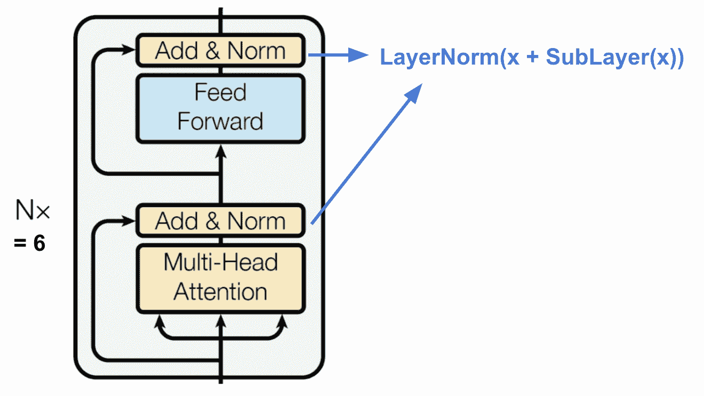

图 15. transformer 的编码器。（图片来源：[Vaswani 等，2017](http://papers.nips.cc/paper/7181-attention-is-all-you-need.pdf)）

编码器生成基于注意力的表示，能够从潜在无限大的上下文中定位特定信息片段。

+   一堆 N=6 个相同的层。

+   每一层都有一个**多头自注意力层**和一个简单的位置逐点**全连接前馈网络**。

+   每个子层都采用了[**残差**](https://arxiv.org/pdf/1512.03385.pdf)连接和一个层**归一化**。所有子层的输出数据维度都是 $d_\text{model} = 512$。

## 解码器

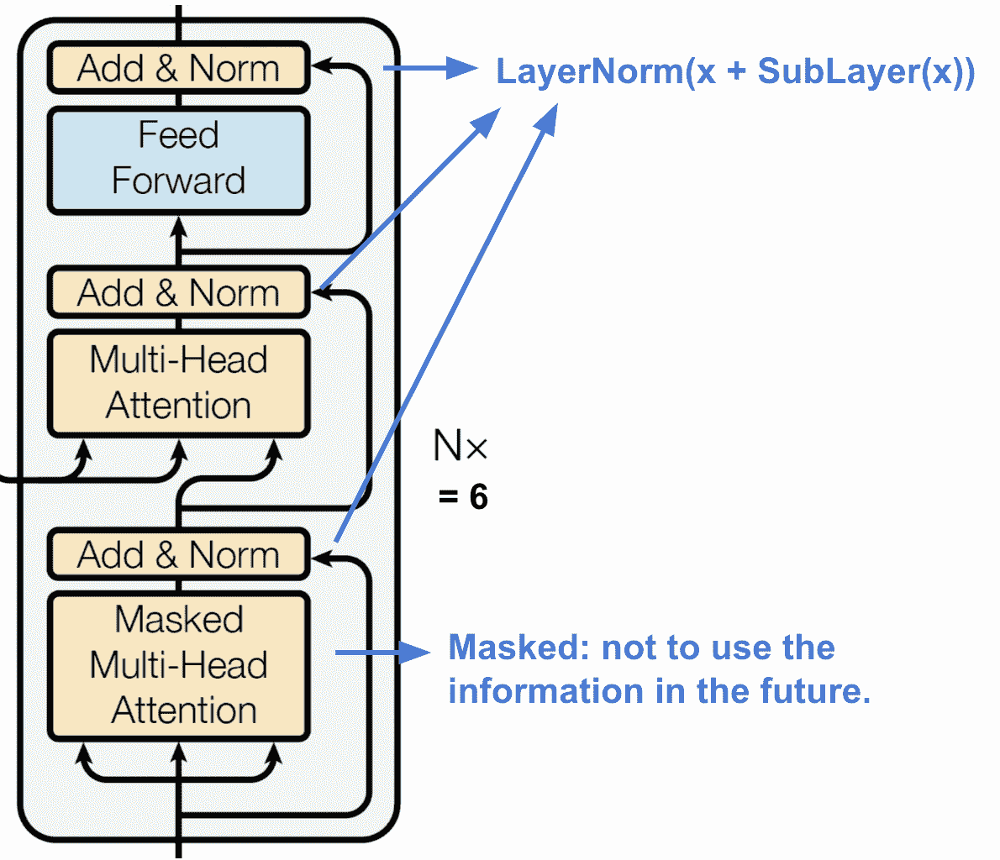

图 16\. transformer 的解码器。（图片来源：[Vaswani, et al., 2017](http://papers.nips.cc/paper/7181-attention-is-all-you-need.pdf)）

解码器能够从编码表示中检索。

+   一堆叠的 N = 6 个相同层

+   每一层都有两个子层的多头注意力机制和一个子层的全连接前馈网络。

+   与编码器类似，每个子层都采用残差连接和层归一化。

+   第一个多头注意力子层被**修改**以防止位置关注后续位置，因为在预测当前位置时我们不希望查看目标序列的未来。

## 完整架构

最后这里是 transformer 架构的完整视图：

+   源序列和目标序列都首先经过嵌入层，以产生相同维度的数据 $d_\text{model} =512$。

+   为了保留位置信息，应用了基于正弦波的位置编码，并与嵌入输出相加。

+   最终解码器输出中添加了 softmax 和线性层。


图 17\. transformer 的完整模型架构。（图片来源：[Vaswani, et al., 2017](http://papers.nips.cc/paper/7181-attention-is-all-you-need.pdf)中的图 1 和图 2。）

尝试实现 transformer 模型是一次有趣的经历，这是我的实现：[lilianweng/transformer-tensorflow](https://github.com/lilianweng/transformer-tensorflow)。如果你感兴趣，阅读代码中的注释。

# SNAIL

Transformer 没有循环或卷积结构，即使在嵌入向量中添加了位置编码，顺序仅被弱化地纳入。对于像[强化学习](https://lilianweng.github.io/posts/2018-02-19-rl-overview/)这样对位置依赖性敏感的问题，这可能是一个大问题。

**简单神经注意力[元学习者](http://bair.berkeley.edu/blog/2017/07/18/learning-to-learn/)**（**SNAIL**）（[Mishra et al., 2017](http://metalearning.ml/papers/metalearn17_mishra.pdf)）部分地被开发出来解决 transformer 模型中的定位问题，通过将 transformer 中的自注意机制与[时间卷积](https://deepmind.com/blog/wavenet-generative-model-raw-audio/)结合起来。已经证明在监督学习和强化学习任务中表现良好。

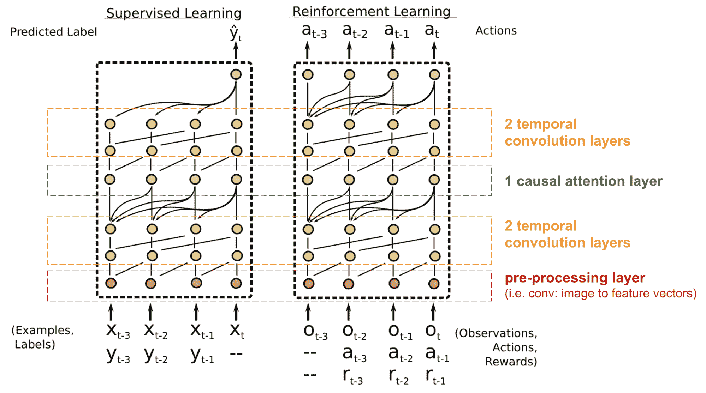

图 18. SNAIL 模型架构（图片来源：[Mishra et al., 2017](http://metalearning.ml/papers/metalearn17_mishra.pdf)）

SNAIL 诞生于元学习领域，这是另一个值得单独发帖的重要主题。但简单来说，元学习模型期望能够推广到类似分布中的新颖、未见任务。如果感兴趣，阅读[这篇](http://bair.berkeley.edu/blog/2017/07/18/learning-to-learn/)很好的介绍。

# 自注意力生成对抗网络

*自注意力生成对抗网络*（**SAGAN**；[Zhang et al., 2018](https://arxiv.org/pdf/1805.08318.pdf)）将自注意力层添加到[GAN](https://lilianweng.github.io/posts/2017-08-20-gan/)中，使生成器和鉴别器能够更好地建模空间区域之间的关系。

经典的[DCGAN](https://arxiv.org/abs/1511.06434)（深度卷积生成对抗网络）将鉴别器和生成器都表示为多层卷积网络。然而，网络的表示能力受到滤波器大小的限制，因为一个像素的特征仅限于一个小的局部区域。为了连接远离的区域，特征必须通过卷积操作的层逐渐稀疏化，而依赖关系不能保证被维持。

在视觉背景下的（软）自注意力被设计为明确学习一个像素与所有其他位置之间的关系，甚至远离的区域，它可以轻松捕捉全局依赖关系。因此，配备自注意力的 GAN 预计能够*更好地处理细节*，万岁！

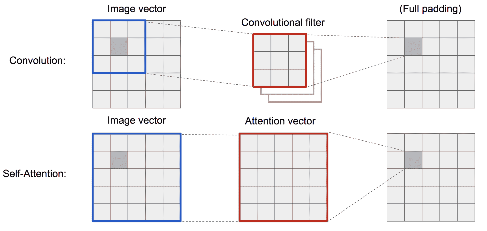

图 19. 卷积操作和自注意力可以访问非常不同大小的区域。

SAGAN 采用[非局部神经网络](https://arxiv.org/pdf/1711.07971.pdf)来应用注意力计算。卷积图像特征映射$\mathbf{x}$被分成三个副本，对应于变压器中的 key, value, and query 的概念：

+   键：$f(\mathbf{x}) = \mathbf{W}_f \mathbf{x}$

+   查询：$g(\mathbf{x}) = \mathbf{W}_g \mathbf{x}$

+   值：$h(\mathbf{x}) = \mathbf{W}_h \mathbf{x}$

然后我们应用点积注意力来输出自注意力特征映射：

$$ \begin{aligned} \alpha_{i,j} &= \text{softmax}(f(\mathbf{x}_i)^\top g(\mathbf{x}_j)) \\ \mathbf{o}_j &= \mathbf{W}_v \Big( \sum_{i=1}^N \alpha_{i,j} h(\mathbf{x}_i) \Big) \end{aligned} $$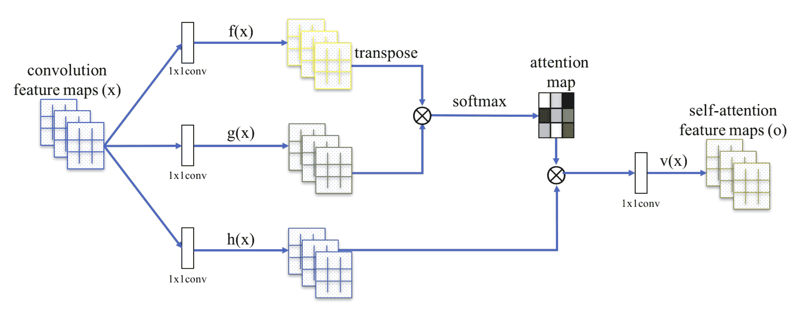

图 20. SAGAN 中的自注意力机制。（图片来源：[Zhang et al., 2018](https://arxiv.org/abs/1805.08318)中的图 2）

请注意，$\alpha_{i,j}$是注意力图中的一个条目，指示模型在合成第$j$位置时应该关注第$i$位置的程度。$\mathbf{W}_f$、$\mathbf{W}_g$和$\mathbf{W}_h$都是 1x1 卷积滤波器。如果你觉得 1x1 卷积听起来像一个奇怪的概念（即，它不就是用一个数字乘以整个特征图吗？），请观看 Andrew Ng 的这个简短的[教程](https://www.coursera.org/lecture/convolutional-neural-networks/networks-in-networks-and-1x1-convolutions-ZTb8x)。输出$\mathbf{o}_j$是最终输出$\mathbf{o}= (\mathbf{o}_1, \mathbf{o}_2, \dots, \mathbf{o}_j, \dots, \mathbf{o}_N)$的列向量。

此外，注意力层的输出乘以一个比例参数，并添加回原始输入特征图：

$$ \mathbf{y} = \mathbf{x}_i + \gamma \mathbf{o}_i $$

在训练过程中，当缩放参数$\gamma$逐渐增加时，网络首先配置为依赖于局部区域的线索，然后逐渐学会给远离的区域分配更多的权重。

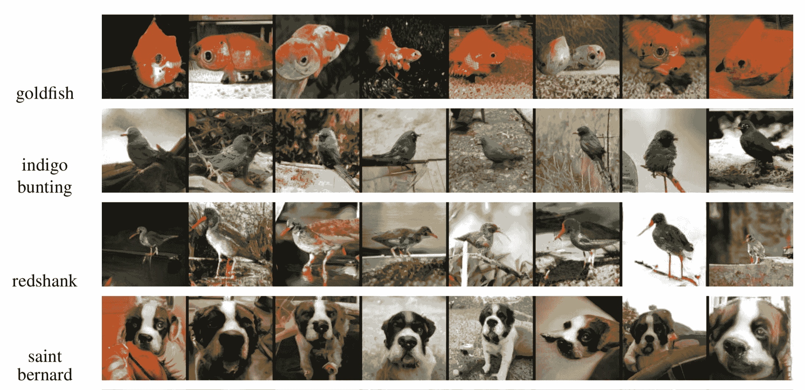

图 21. 由 SAGAN 生成的不同类别的 128×128 示例图像。（图片来源：[Zhang 等人，2018](https://arxiv.org/pdf/1805.08318.pdf)中的部分图 6）

* * *

引用为：

```py
@article{weng2018attention,
  title   = "Attention? Attention!",
  author  = "Weng, Lilian",
  journal = "lilianweng.github.io",
  year    = "2018",
  url     = "https://lilianweng.github.io/posts/2018-06-24-attention/"
} 
```

# 参考文献

[1] [“深度学习和自然语言处理中的注意力和记忆。”](http://www.wildml.com/2016/01/attention-and-memory-in-deep-learning-and-nlp/) - 2016 年 1 月 3 日，作者：Denny Britz

[2] [“神经机器翻译（seq2seq）教程”](https://github.com/tensorflow/nmt)

[3] Dzmitry Bahdanau, Kyunghyun Cho, and Yoshua Bengio. [“通过联合学习对齐和翻译的神经机器翻译。”](https://arxiv.org/pdf/1409.0473.pdf) ICLR 2015.

[4] Kelvin Xu, Jimmy Ba, Ryan Kiros, Kyunghyun Cho, Aaron Courville, Ruslan Salakhudinov, Rich Zemel, and Yoshua Bengio. [“展示、关注和讲述：具有视觉注意力的神经图像标题生成。”](http://proceedings.mlr.press/v37/xuc15.pdf) ICML，2015。

[5] Ilya Sutskever, Oriol Vinyals, and Quoc V. Le. [“序列到序列学习与神经网络。”](https://papers.nips.cc/paper/5346-sequence-to-sequence-learning-with-neural-networks.pdf) NIPS 2014.

[6] Thang Luong, Hieu Pham, Christopher D. Manning. [“基于注意力的神经机器翻译的有效方法。”](https://arxiv.org/pdf/1508.04025.pdf) EMNLP 2015.

[7] Denny Britz, Anna Goldie, Thang Luong, and Quoc Le. [“神经机器翻译架构的大规模探索。”](https://arxiv.org/abs/1703.03906) ACL 2017.

[8] Ashish Vaswani 等人。[“注意力就是一切。”](http://papers.nips.cc/paper/7181-attention-is-all-you-need.pdf) NIPS 2017。

[9] Jianpeng Cheng, Li Dong, and Mirella Lapata. [“用于机器阅读的长短期记忆网络。”](https://arxiv.org/pdf/1601.06733.pdf) EMNLP 2016。

[10] Xiaolong Wang 等人。[“非局部神经网络。”](https://arxiv.org/pdf/1711.07971.pdf) CVPR 2018

[11] Han Zhang, Ian Goodfellow, Dimitris Metaxas 和 Augustus Odena。[“自注意力生成对抗网络。”](https://arxiv.org/pdf/1805.08318.pdf) arXiv 预印本 arXiv:1805.08318 (2018).

[12] Nikhil Mishra, Mostafa Rohaninejad, Xi Chen 和 Pieter Abbeel。[“一个简单的神经注意力元学习器。”](https://arxiv.org/abs/1707.03141) ICLR 2018.

[13] [“WaveNet：原始音频的生成模型”](https://deepmind.com/blog/wavenet-generative-model-raw-audio/) - 2016 年 9 月 8 日，DeepMind。

[14] Oriol Vinyals, Meire Fortunato 和 Navdeep Jaitly。[“指针网络。”](https://arxiv.org/abs/1506.03134) NIPS 2015.

[15] Alex Graves, Greg Wayne 和 Ivo Danihelka。[“神经图灵机。”](https://arxiv.org/abs/1410.5401) arXiv 预印本 arXiv:1410.5401 (2014).
