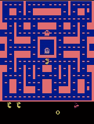
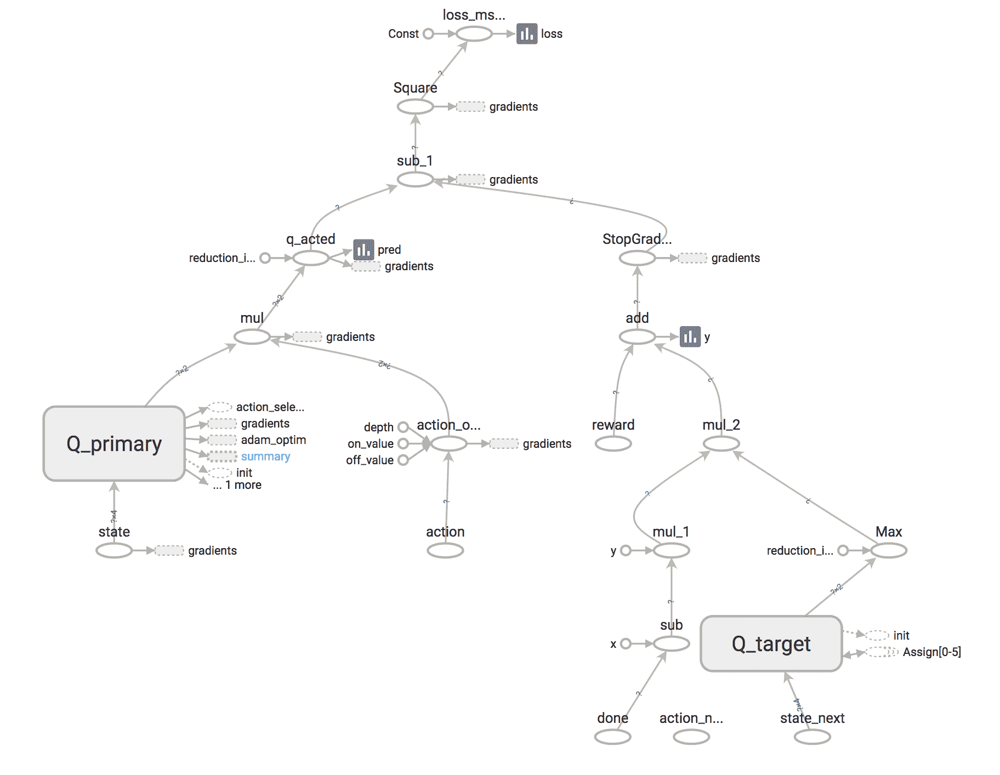
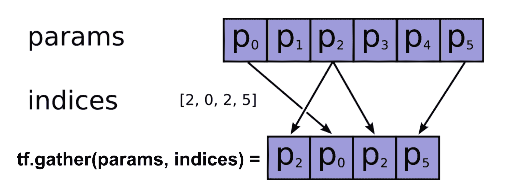
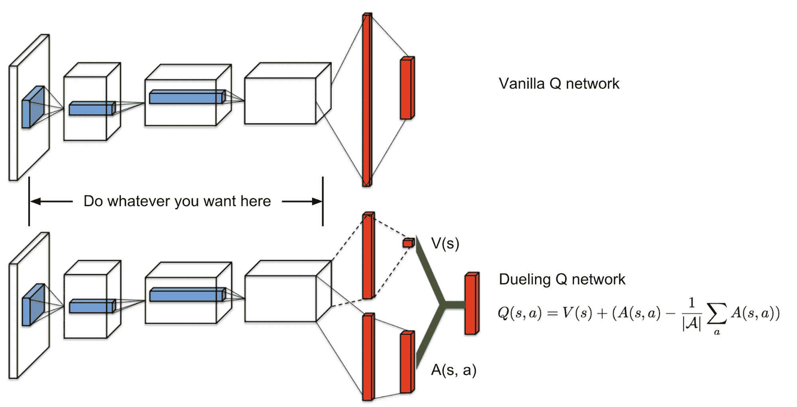
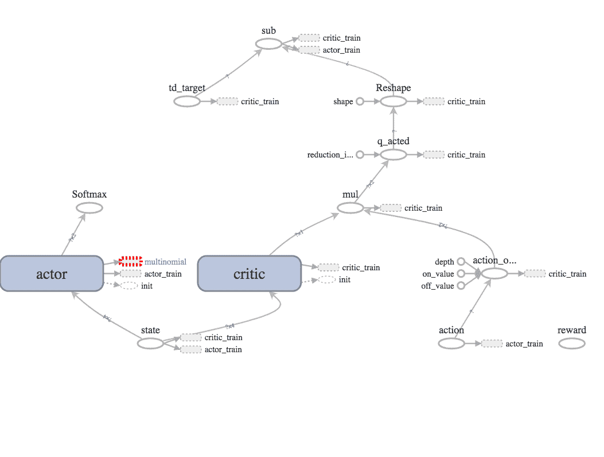

# 使用 Tensorflow + OpenAI Gym 实现深度强化学习模型

> 原文：[`lilianweng.github.io/posts/2018-05-05-drl-implementation/`](https://lilianweng.github.io/posts/2018-05-05-drl-implementation/)

完整的实现可在[lilianweng/deep-reinforcement-learning-gym](https://github.com/lilianweng/deep-reinforcement-learning-gym)中找到

在之前的两篇文章中，我介绍了许多深度强化学习模型的算法。现在是时候动手实践如何在实践中实现这些模型了。这个实现将在 Tensorflow 和 OpenAI [gym](https://github.com/openai/gym)环境中构建。本教程中代码的完整版本可在[[lilian/deep-reinforcement-learning-gym]](https://github.com/lilianweng/deep-reinforcement-learning-gym)中找到。

# 环境设置

1.  确保您已安装[Homebrew](https://docs.brew.sh/Installation)：

```py
/usr/bin/ruby -e "$(curl -fsSL https://raw.githubusercontent.com/Homebrew/install/master/install)" 
```

1.  我建议为您的开发启动一个虚拟环境。当您有多个项目具有冲突的要求时，这样做会让生活变得更加轻松；例如，一个在 Python 2.7 中工作，而另一个只与 Python 3.5+兼容。

```py
# Install python virtualenv brew install pyenv-virtualenv # Create a virtual environment of any name you like with Python 3.6.4 support pyenv virtualenv 3.6.4 workspace # Activate the virtualenv named "workspace" pyenv activate workspace 
```

*[*] 对于以下每个新安装，请确保您在虚拟环境中。*

1.  根据[说明](https://github.com/openai/gym#installation)安装 OpenAI gym。要进行最小安装，请运行：

```py
git clone https://github.com/openai/gym.git cd gym pip install -e . 
```

如果您对玩 Atari 游戏或其他高级软件包感兴趣，请继续安装一些系统软件包。

```py
brew install cmake boost boost-python sdl2 swig wget 
```

对于 Atari，转到 gym 目录并使用 pip 进行安装。如果您在 ALE（arcade learning environment）安装中遇到问题，这篇[文章](http://alvinwan.com/installing-arcade-learning-environment-with-python3-on-macosx/)非常有帮助。

```py
pip install -e '.[atari]' 
```

1.  最后克隆“playground”代码并安装所需的软件包。

```py
git clone git@github.com:lilianweng/deep-reinforcement-learning-gym.git cd deep-reinforcement-learning-gym pip install -e .  # install the "playground" project. pip install -r requirements.txt  # install required packages. 
```

# **健身房环境**

[OpenAI Gym](https://gym.openai.com/)工具包提供了一组物理仿真环境、游戏和机器人模拟器，我们可以使用它们并为其设计强化学习代理。可以通过`gym.make("{环境名称}"`来初始化一个环境对象：

```py
import gym env = gym.make("MsPacman-v0") 
```



环境的动作和观察的格式分别由`env.action_space`和`env.observation_space`定义。

gym [spaces](https://gym.openai.com/docs/#spaces)的类型：

+   `gym.spaces.Discrete(n)`: 从 0 到 n-1 的离散值。

+   `gym.spaces.Box`: 数值向量的多维数组，每个维度的上下界由`Box.low`和`Box.high`定义。

我们通过两个主要的 API 调用与环境进行交互：

**`ob = env.reset()`**

+   将环境重置为原始设置。

+   返回初始观察。

**`ob_next, reward, done, info = env.step(action)`**

+   在环境中应用一个与`env.action_space`兼容的动作。

+   返回新的观察 `ob_next`（env.observation_space）、奖励（float）、`done` 标志（bool）和其他元信息（dict）。如果 `done=True`，则该回合已完成，我们应该重置环境以重新开始。更多信息请阅读[这里](https://gym.openai.com/docs/#observations)。

# Naive Q-Learning

[Q 学习](https://lilianweng.github.io/posts/2018-02-19-rl-overview/#q-learning-off-policy-td-control)（Watkins & Dayan, 1992）学习动作值（“Q 值”）并根据[贝尔曼方程](https://lilianweng.github.io/posts/2018-02-19-rl-overview/#bellman-equations)进行更新。关键点是在估计下一个动作时，它不遵循当前策略，而是独立采用最佳的 Q 值（红色部分）。

$$ Q(s, a) \leftarrow (1 - \alpha) Q(s, a) + \alpha (r + \gamma \color{red}{\max_{a' \in \mathcal{A}} Q(s', a')}) $$

在一个简单的实现中，所有 (s, a) 对的 Q 值可以简单地在字典中跟踪。尚未涉及复杂的机器学习模型。

```py
from collections import defaultdict Q = defaultdict(float) gamma = 0.99  # Discounting factor alpha = 0.5  # soft update param   env = gym.make("CartPole-v0") actions = range(env.action_space)   def update_Q(s, r, a, s_next, done):  max_q_next = max([Q[s_next, a] for a in actions]) # Do not include the next state's value if currently at the terminal state. Q[s, a] += alpha * (r + gamma * max_q_next * (1.0 - done) - Q[s, a]) 
```

大多数 gym 环境具有多维连续观察空间（`gym.spaces.Box`）。为了确保我们的 Q 字典不会因尝试记住无限数量的键而爆炸，我们应用一个包装器来离散化观察。包装器的概念非常强大，我们可以用它来定制环境的观察、动作、步骤函数等。无论应用了多少个包装器，`env.unwrapped`始终会返回内部原始环境对象。

```py
import gym   class DiscretizedObservationWrapper(gym.ObservationWrapper):  """This wrapper converts a Box observation into a single integer. """ def __init__(self, env, n_bins=10, low=None, high=None): super().__init__(env) assert isinstance(env.observation_space, Box)   low = self.observation_space.low if low is None else low high = self.observation_space.high if high is None else high   self.n_bins = n_bins self.val_bins = [np.linspace(l, h, n_bins + 1) for l, h in zip(low.flatten(), high.flatten())] self.observation_space = Discrete(n_bins ** low.flatten().shape[0])   def _convert_to_one_number(self, digits): return sum([d * ((self.n_bins + 1) ** i) for i, d in enumerate(digits)])   def observation(self, observation): digits = [np.digitize([x], bins)[0] for x, bins in zip(observation.flatten(), self.val_bins)] return self._convert_to_one_number(digits)     env = DiscretizedObservationWrapper(  env, n_bins=8, low=[-2.4, -2.0, -0.42, -3.5], high=[2.4, 2.0, 0.42, 3.5] ) 
```

让我们将与 gym 环境的交互插入，并在生成新转换时每次更新 Q 函数。在选择动作时，我们使用 ε-贪心来强制探索。

```py
import gym import numpy as np n_steps = 100000 epsilon = 0.1  # 10% chances to apply a random action   def act(ob):  if np.random.random() < epsilon: # action_space.sample() is a convenient function to get a random action # that is compatible with this given action space. return env.action_space.sample()   # Pick the action with highest q value. qvals = {a: q[state, a] for a in actions} max_q = max(qvals.values()) # In case multiple actions have the same maximum q value. actions_with_max_q = [a for a, q in qvals.items() if q == max_q] return np.random.choice(actions_with_max_q)   ob = env.reset() rewards = [] reward = 0.0   for step in range(n_steps):  a = act(ob) ob_next, r, done, _ = env.step(a) update_Q(ob, r, a, ob_next, done) reward += r if done: rewards.append(reward) reward = 0.0 ob = env.reset() else: ob = ob_next 
```

通常我们从一个较高的 `epsilon` 开始，并在训练过程中逐渐减小它，这被称为“epsilon 退火”。`QLearningPolicy`的完整代码可以在[这里](https://github.com/lilianweng/deep-reinforcement-learning-gym/blob/master/playground/policies/qlearning.py)找到。

# 深度 Q 网络

[深度 Q 网络](https://lilianweng.github.io/posts/2018-02-19-rl-overview/#deep-q-network)是一项开创性的工作，使得 Q 学习的训练更加稳定和更加高效，当 Q 值用非线性函数逼近时。经验回放和一个单独更新的目标网络是两个关键要素。

主要损失函数如下所示，

$$ \begin{aligned} & Y(s, a, r, s') = r + \gamma \max_{a'} Q_{\theta^{-}}(s', a') \\ & \mathcal{L}(\theta) = \mathbb{E}_{(s, a, r, s') \sim U(D)} \Big[ \big( Y(s, a, r, s') - Q_\theta(s, a) \big)² \Big] \end{aligned} $$

Q 网络可以是多层密集神经网络、卷积网络或循环网络，具体取决于问题。在 DQN 策略的[完整实现](https://github.com/lilianweng/deep-reinforcement-learning-gym/blob/master/playground/policies/dqn.py)中，它由`model_type`参数确定，其中之一为（“dense”，“conv”，“lstm”）。

在以下示例中，我正在使用一个 2 层密集连接的神经网络来学习小车摆动问题的 Q 值。

```py
import gym env = gym.make('CartPole-v1') # The observation space is `Box(4,)`, a 4-element vector. observation_size = env.observation_space.shape[0] 
```

我们有一个用于创建下面网络的辅助函数：

```py
import tensorflow as tf def dense_nn(inputs, layers_sizes, scope_name):  """Creates a densely connected multi-layer neural network. inputs: the input tensor layers_sizes (list<int>): defines the number of units in each layer. The output layer has the size layers_sizes[-1]. """ with tf.variable_scope(scope_name): for i, size in enumerate(layers_sizes): inputs = tf.layers.dense( inputs, size, # Add relu activation only for internal layers. activation=tf.nn.relu if i < len(layers_sizes) - 1 else None, kernel_initializer=tf.contrib.layers.xavier_initializer(), name=scope_name + '_l' + str(i) ) return inputs 
```

Q 网络和目标网络通过一批转换（状态、动作、奖励、下一个状态、完成标志）进行更新。输入张量为：

```py
batch_size = 32  # A tunable hyperparameter.   states = tf.placeholder(tf.float32, shape=(batch_size, observation_size), name='state') states_next = tf.placeholder(tf.float32, shape=(batch_size, observation_size), name='state_next') actions = tf.placeholder(tf.int32, shape=(batch_size,), name='action') rewards = tf.placeholder(tf.float32, shape=(batch_size,), name='reward') done_flags = tf.placeholder(tf.float32, shape=(batch_size,), name='done') 
```

我们有两个相同结构的网络。两者具有相同的网络架构，状态观察作为输入，所有动作的 Q 值作为输出。

```py
q = dense(states, [32, 32, 2], name='Q_primary') q_target = dense(states_next, [32, 32, 2], name='Q_target') 
```

目标网络“Q_target”以`states_next`张量作为输入，因为我们使用其预测来选择贝尔曼方程中的最佳下一个状态。

```py
# The prediction by the primary Q network for the actual actions. action_one_hot = tf.one_hot(actions, act_size, 1.0, 0.0, name='action_one_hot') pred = tf.reduce_sum(q * action_one_hot, reduction_indices=-1, name='q_acted')   # The optimization target defined by the Bellman equation and the target network. max_q_next_by_target = tf.reduce_max(q_target, axis=-1) y = rewards + (1. - done_flags) * gamma * max_q_next_by_target   # The loss measures the mean squared error between prediction and target. loss = tf.reduce_mean(tf.square(pred - tf.stop_gradient(y)), name="loss_mse_train") optimizer = tf.train.AdamOptimizer(0.001).minimize(loss, name="adam_optim") 
```

注意在目标 y 上使用[tf.stop_gradient()](https://www.tensorflow.org/api_docs/python/tf/stop_gradient)，因为目标网络在损失最小化梯度更新期间应保持固定。



目标网络通过每`C`步复制主 Q 网络参数进行更新（“硬更新”）或向主网络进行 Polyak 平均（“软更新”）。

```py
# Get all the variables in the Q primary network. q_vars = tf.get_collection(tf.GraphKeys.GLOBAL_VARIABLES, scope="Q_primary") # Get all the variables in the Q target network. q_target_vars = tf.get_collection(tf.GraphKeys.GLOBAL_VARIABLES, scope="Q_target") assert len(q_vars) == len(q_target_vars)   def update_target_q_net_hard():  # Hard update sess.run([v_t.assign(v) for v_t, v in zip(q_target_vars, q_vars)])   def update_target_q_net_soft(tau=0.05):  # Soft update: polyak averaging. sess.run([v_t.assign(v_t * (1. - tau) + v * tau) for v_t, v in zip(q_target_vars, q_vars)]) 
```

## 双 Q 学习

如果我们查看 Q 值目标的标准形式，$Y(s, a) = r + \gamma \max_{a’ \in \mathcal{A}} Q_\theta (s’, a’)$，很容易注意到我们使用$Q_\theta$来选择在状态 s’时的最佳下一个动作，然后应用相同$Q_\theta$预测的动作值。这种两步强化过程可能导致对（已经）过度估计的值进行进一步估计，进而导致训练不稳定。双 Q 学习提出的解决方案（[Hasselt, 2010](http://papers.nips.cc/paper/3964-double-q-learning.pdf)）是通过使用两个 Q 网络$Q_1$和$Q_2$来解耦动作选择和动作值估计：当$Q_1$正在更新时，$Q_2$决定最佳的下一个动作，反之亦然。

$$ Y_1(s, a, r, s') = r + \gamma Q_1 (s', \arg\max_{a' \in \mathcal{A}}Q_2(s', a'))\\ Y_2(s, a, r, s') = r + \gamma Q_2 (s', \arg\max_{a' \in \mathcal{A}}Q_1(s', a')) $$

要将双 Q 学习合并到 DQN 中，最小的修改（[Hasselt, Guez, & Silver, 2016](https://arxiv.org/pdf/1509.06461.pdf)）是使用主 Q 网络选择动作，而动作值由目标网络估计：

$$ Y(s, a, r, s') = r + \gamma Q_{\theta^{-}}(s', \arg\max_{a' \in \mathcal{A}} Q_\theta(s', a')) $$

在代码中，我们添加一个新的张量用于获取主 Q 网络选择的动作作为输入，以及一个张量操作用于选择此动作。

```py
actions_next = tf.placeholder(tf.int32, shape=(None,), name='action_next') actions_selected_by_q = tf.argmax(q, axis=-1, name='action_selected') 
```

在损失函数中，预测目标 y 变为：

```py
actions_next_flatten = actions_next + tf.range(0, batch_size) * q_target.shape[1] max_q_next_target = tf.gather(tf.reshape(q_target, [-1]), actions_next_flatten) y = rewards + (1. - done_flags) * gamma * max_q_next_by_target 
```

这里我使用[tf.gather()](https://www.tensorflow.org/api_docs/python/tf/gather)来选择感兴趣的动作值。



（图片来源：tf.gather()文档）

在剧集推出期间，我们通过将下一个状态的数据输入到`actions_selected_by_q`操作中来计算`actions_next`。

```py
# batch_data is a dict with keys, ‘s', ‘a', ‘r', ‘s_next' and ‘done', containing a batch of transitions. actions_next = sess.run(actions_selected_by_q, {states: batch_data['s_next']}) 
```

## 对抗 Q 网络

对抗 Q 网络（[Wang 等，2016](https://arxiv.org/pdf/1511.06581.pdf)）配备了增强的网络架构：输出层分为两个头，一个用于预测状态值 V，另一个用于[优势](https://lilianweng.github.io/posts/2018-02-19-rl-overview/#value-function)A。然后重新构建 Q 值，$Q(s, a) = V(s) + A(s, a)$。

$$ \begin{aligned} A(s, a) &= Q(s, a) - V(s)\\ V(s) &= \sum_a Q(s, a) \pi(a \vert s) = \sum_a (V(s) + A(s, a)) \pi(a \vert s) = V(s) + \sum_a A(s, a)\pi(a \vert s)\\ \text{因此，}& \sum_a A(s, a)\pi(a \vert s) = 0 \end{aligned} $$

为了确保估计的优势值总和为零，$\sum_a A(s, a)\pi(a \vert s) = 0$，我们从预测中减去均值。

$$ Q(s, a) = V(s) + (A(s, a) - \frac{1}{|\mathcal{A}|} \sum_a A(s, a)) $$

代码更改很简单：

```py
q_hidden = dense_nn(states, [32], name='Q_primary_hidden') adv = dense_nn(q_hidden, [32, env.action_space.n], name='Q_primary_adv') v = dense_nn(q_hidden, [32, 1], name='Q_primary_v')   # Average dueling q = v + (adv - tf.reduce_mean(adv, reduction_indices=1, keepdims=True)) 
```



（图片来源：[Wang 等，2016](https://arxiv.org/pdf/1511.06581.pdf)）

查看[代码](https://github.com/lilianweng/deep-reinforcement-learning-gym/blob/master/playground/policies/dqn.py)以获取完整流程。

# 蒙特卡洛策略梯度

我在我的[上一篇文章](https://lilianweng.github.io/posts/2018-04-08-policy-gradient/)中回顾了一些流行的策略梯度方法。蒙特卡洛策略梯度，也称为[REINFORCE](https://lilianweng.github.io/posts/2018-04-08-policy-gradient/#reinforce)，是一种经典的在线方法，它明确地学习策略模型。它使用从完整在线轨迹估计的回报，并使用策略梯度更新策略参数。

返回值是在推出期间计算的，然后作为输入馈送到 Tensorflow 图中。

```py
# Inputs states = tf.placeholder(tf.float32, shape=(None, obs_size), name='state') actions = tf.placeholder(tf.int32, shape=(None,), name='action') returns = tf.placeholder(tf.float32, shape=(None,), name='return') 
```

构建策略网络。我们通过最小化损失函数$\mathcal{L} = - (G_t - V(s)) \log \pi(a \vert s)$来更新策略参数。[tf.nn.sparse_softmax_cross_entropy_with_logits()](https://www.tensorflow.org/api_docs/python/tf/nn/sparse_softmax_cross_entropy_with_logits)要求输入原始 logits，而不是 softmax 后的概率，这就是为什么我们在策略网络顶部没有 softmax 层。

```py
# Policy network pi = dense_nn(states, [32, 32, env.action_space.n], name='pi_network') sampled_actions = tf.squeeze(tf.multinomial(pi, 1))  # For sampling actions according to probabilities.   with tf.variable_scope('pi_optimize'):  loss_pi = tf.reduce_mean( returns * tf.nn.sparse_softmax_cross_entropy_with_logits( logits=pi, labels=actions), name='loss_pi') optim_pi = tf.train.AdamOptimizer(0.001).minimize(loss_pi, name='adam_optim_pi') 
```

在剧集推出期间，返回值计算如下：

```py
# env = gym.make(...) # gamma = 0.99 # sess = tf.Session(...)   def act(ob):  return sess.run(sampled_actions, {states: [ob]})   for _ in range(n_episodes):  ob = env.reset() done = False   obs = [] actions = [] rewards = [] returns = []   while not done: a = act(ob) new_ob, r, done, info = env.step(a)   obs.append(ob) actions.append(a) rewards.append(r) ob = new_ob   # Estimate returns backwards. return_so_far = 0.0 for r in rewards[::-1]: return_so_far = gamma * return_so_far + r returns.append(return_so_far)   returns = returns[::-1]   # Update the policy network with the data from one episode. sess.run([optim_pi], feed_dict={ states: np.array(obs), actions: np.array(actions), returns: np.array(returns), }) 
```

REINFORCE 的完整实现在[这里](https://github.com/lilianweng/deep-reinforcement-learning-gym/blob/master/playground/policies/reinforce.py)。

# 演员-评论家

[演员-评论家](https://lilianweng.github.io/posts/2018-04-08-policy-gradient/#actor-critic)算法同时学习两个模型，一个用于学习最佳策略，另一个用于估计状态值。

1.  初始化演员网络，$\pi(a \vert s)$ 和评论家，$V(s)$

1.  收集新的转换（s, a, r, s’）：对当前状态 s 采样动作 $a \sim \pi(a \vert s)$，获得奖励 r 和下一个状态 s'。

1.  在回合推出期间计算 TD 目标，$G_t = r + \gamma V(s’)$ 和 TD 误差，$\delta_t = r + \gamma V(s’) - V(s)$。

1.  通过最小化评论家损失更新评论家网络：$L_c = (V(s) - G_t)$。

1.  通过最小化演员损失更新演员网络：$L_a = - \delta_t \log \pi(a \vert s)$。

1.  设定 s’ = s 并重复步骤 2.-5.

总体而言，实现看起来与 REINFORCE 非常相似，只是多了一个评论家网络。完整的实现在这里。

```py
# Inputs states = tf.placeholder(tf.float32, shape=(None, observation_size), name='state') actions = tf.placeholder(tf.int32, shape=(None,), name='action') td_targets = tf.placeholder(tf.float32, shape=(None,), name='td_target')   # Actor: action probabilities actor = dense_nn(states, [32, 32, env.action_space.n], name='actor')   # Critic: action value (Q-value) critic = dense_nn(states, [32, 32, 1], name='critic')   action_ohe = tf.one_hot(actions, act_size, 1.0, 0.0, name='action_one_hot') pred_value = tf.reduce_sum(critic * action_ohe, reduction_indices=-1, name='q_acted') td_errors = td_targets - tf.reshape(pred_value, [-1])   with tf.variable_scope('critic_train'):  loss_c = tf.reduce_mean(tf.square(td_errors)) optim_c = tf.train.AdamOptimizer(0.01).minimize(loss_c)   with tf.variable_scope('actor_train'):  loss_a = tf.reduce_mean( tf.stop_gradient(td_errors) * tf.nn.sparse_softmax_cross_entropy_with_logits( logits=actor, labels=actions), name='loss_actor') optim_a = tf.train.AdamOptimizer(0.01).minimize(loss_a)   train_ops = [optim_c, optim_a] 
```

Tensorboard 图表总是很有帮助：

# 参考文献

[1] [Tensorflow API 文档](https://www.tensorflow.org/api_docs/)

[2] Christopher JCH Watkins 和 Peter Dayan。[“Q 学习。”](https://link.springer.com/content/pdf/10.1007/BF00992698.pdf) 机器学习 8.3-4（1992）：279-292。

[3] Hado Van Hasselt，Arthur Guez 和 David Silver。[“双 Q 学习的深度强化学习。”](https://arxiv.org/pdf/1509.06461.pdf) AAAI. Vol. 16. 2016.

[4] Hado van Hasselt。[“双 Q 学习。”](http://papers.nips.cc/paper/3964-double-q-learning.pdf) NIPS，23:2613–2621，2010.

[5] Ziyu Wang 等人。[深度强化学习的对抗网络架构。](https://arxiv.org/pdf/1511.06581.pdf) ICML. 2016.
