# 策略梯度算法

> 原文：[`lilianweng.github.io/posts/2018-04-08-policy-gradient/`](https://lilianweng.github.io/posts/2018-04-08-policy-gradient/)

更新于 2018-06-30：添加了两种新的策略梯度方法，[SAC 和 D4PG。]

更新于 2018-09-30：添加了一种新的策略梯度方法，[TD3。]

更新于 2019-02-09：添加了[SAC 自动调整温度。]

[更新于 2019-06-26：感谢 Chanseok，我们有一篇[韩文版本](https://talkingaboutme.tistory.com/entry/RL-Policy-Gradient-Algorithms)的这篇文章。]

更新于 2019-09-12：添加了一种新的策略梯度方法[SVPG。]

更新于 2019-12-22：添加了一种新的策略梯度方法[IMPALA。]

更新于 2020-10-15：添加了一种新的策略梯度方法[PPG 和一些关于 PPO 的新讨论。]

[更新于 2021-09-19：感谢 Wenhao & 爱吃猫的鱼，我们有这篇文章的[中文 1](https://tomaxent.com/2019/04/14/%E7%AD%96%E7%95%A5%E6%A2%AF%E5%BA%A6%E6%96%B9%E6%B3%95/) & [中文 2](https://paperexplained.cn/articles/article/detail/31/)版本。]

# 什么是策略梯度

策略梯度是解决强化学习问题的一种方法。如果您还没有了解强化学习领域，请先阅读本文中关于问题定义和关键概念的部分[“深入了解强化学习 » 关键概念”](https://lilianweng.github.io/posts/2018-02-19-rl-overview/#key-concepts)。

## 符号

这里是一个符号列表，帮助您轻松阅读文章中的方程式。

| 符号 | 含义 |
| --- | --- |
| $s \in \mathcal{S}$ | 状态。 |
| $a \in \mathcal{A}$ | 动作。 |
| $r \in \mathcal{R}$ | 奖励。 |
| $S_t, A_t, R_t$ | 一个轨迹在时间步$t$的状态、动作和奖励。我有时也会使用$s_t, a_t, r_t$。 |
| $\gamma$ | 折现因子；对未来奖励的不确定性进行惩罚；$0<\gamma \leq 1$。 |
| $G_t$ | 返回值；或者折现未来奖励；$G_t = \sum_{k=0}^{\infty} \gamma^k R_{t+k+1}$。 |
| $P(s’, r \vert s, a)$ | 从当前状态$s$经过动作$a$和奖励$r$到达下一个状态$s’$的转移概率。 |
| $\pi(a \vert s)$ | 随机策略（代理行为策略）；$\pi_\theta(.)$是一个由$\theta$参数化的策略。 |
| $\mu(s)$ | 确定性策略；我们也可以将其标记为$\pi(s)$，但使用不同的字母可以更好地区分，以便我们可以轻松区分策略是随机的还是确定性的，而无需进一步解释。$\pi$或$\mu$是强化学习算法的学习目标。 |
| $V(s)$ | 状态值函数衡量状态$s$的期望回报；$V_w(.)$是一个由$w$参数化的值函数。 |
| $V^\pi(s)$ | 当我们遵循策略$\pi$时状态$s$的值；$V^\pi (s) = \mathbb{E}_{a\sim \pi} [G_t \vert S_t = s]$。 |
| $Q(s, a)$ | 行动值函数类似于 $V(s)$，但评估的是状态和动作对 $(s, a)$ 的预期回报；$Q_w(.)$ 是由 $w$ 参数化的行动值函数。 |
| $Q^\pi(s, a)$ | 类似于 $V^\pi(.)$，当我们遵循策略 $\pi$ 时，（状态，动作）对的值；$Q^\pi(s, a) = \mathbb{E}_{a\sim \pi} [G_t \vert S_t = s, A_t = a]$。 |
| $A(s, a)$ | 优势函数，$A(s, a) = Q(s, a) - V(s)$；可以将其视为以状态值为基准的 Q 值的另一版本，具有更低的方差。 |

## 策略梯度

强化学习的目标是为代理找到一种获取最优奖励的行为策略。**策略梯度**方法旨在直接对策略进行建模和优化。策略通常用关于 $\theta$ 的参数化函数来建模，$\pi_\theta(a \vert s)$。奖励（目标）函数的值取决于这个策略，然后可以应用各种算法来优化 $\theta$ 以获得最佳奖励。

奖励函数定义如下：

$$ J(\theta) = \sum_{s \in \mathcal{S}} d^\pi(s) V^\pi(s) = \sum_{s \in \mathcal{S}} d^\pi(s) \sum_{a \in \mathcal{A}} \pi_\theta(a \vert s) Q^\pi(s, a) $$

其中 $d^\pi(s)$ 是 $\pi_\theta$ 的马尔可夫链的稳态分布（在 $\pi$ 下的策略状态分布）。为简单起见，当策略出现在其他函数的下标中时，策略 $\pi_\theta$ 的参数 $\theta$ 将被省略；例如，如果完整书写，则 $d^{\pi}$ 和 $Q^\pi$ 应该是 $d^{\pi_\theta}$ 和 $Q^{\pi_\theta}$。

想象一下，你可以永远沿着马尔可夫链的状态旅行，随着时间的推移，你最终停留在某个状态的概率保持不变 —— 这就是 $\pi_\theta$ 的稳态概率。$d^\pi(s) = \lim_{t \to \infty} P(s_t = s \vert s_0, \pi_\theta)$ 是从 $s_0$ 开始，按照策略 $\pi_\theta$ 进行 t 步后，$s_t=s$ 的概率。实际上，马尔可夫链的稳态分布的存在是 PageRank 算法有效的主要原因之一。如果想要了解更多，请查看[这里](https://jeremykun.com/2015/04/06/markov-chain-monte-carlo-without-all-the-bullshit/)。

自然而然地期望基于策略的方法在连续空间中更有用。因为有无限数量的动作和（或）状态需要估计值，因此在连续空间中价值为基础的方法在计算上过于昂贵。例如，在[广义策略迭代](https://lilianweng.github.io/posts/2018-02-19-rl-overview/#policy-iteration)中，策略改进步骤 $\arg\max_{a \in \mathcal{A}} Q^\pi(s, a)$ 需要对动作空间进行全面扫描，受到[维度诅咒](https://en.wikipedia.org/wiki/Curse_of_dimensionality)的困扰。

使用*梯度上升*，我们可以将$\theta$沿着梯度$\nabla_\theta J(\theta)$建议的方向移动，以找到产生最高回报的$\pi_\theta$的最佳$\theta$。

## 策略梯度定理

计算梯度$\nabla_\theta J(\theta)$很棘手，因为它取决于动作选择（直接由$\pi_\theta$确定）和遵循目标选择行为的状态稳态分布（间接由$\pi_\theta$确定）。鉴于环境通常是未知的，很难估计通过策略更新对状态分布的影响。

幸运的是，**策略梯度定理**来拯救世界了！哇哦！它提供了一个很好的改写目标函数的导数，不涉及状态分布的导数$d^\pi(.)$，并且大大简化了梯度计算$\nabla_\theta J(\theta)$。

$$ \begin{aligned} \nabla_\theta J(\theta) &= \nabla_\theta \sum_{s \in \mathcal{S}} d^\pi(s) \sum_{a \in \mathcal{A}} Q^\pi(s, a) \pi_\theta(a \vert s) \\ &\propto \sum_{s \in \mathcal{S}} d^\pi(s) \sum_{a \in \mathcal{A}} Q^\pi(s, a) \nabla_\theta \pi_\theta(a \vert s) \end{aligned} $$

## 策略梯度定理的证明

这一部分非常密集，因为现在是我们通过证明（[Sutton & Barto, 2017](http://incompleteideas.net/book/bookdraft2017nov5.pdf); Sec. 13.1）来弄清楚为什么策略梯度定理是正确的时候了。

我们首先从状态值函数的导数开始：

$$ \begin{aligned} & \nabla_\theta V^\pi(s) \\ =& \nabla_\theta \Big(\sum_{a \in \mathcal{A}} \pi_\theta(a \vert s)Q^\pi(s, a) \Big) & \\ =& \sum_{a \in \mathcal{A}} \Big( \nabla_\theta \pi_\theta(a \vert s)Q^\pi(s, a) + \pi_\theta(a \vert s) \color{red}{\nabla_\theta Q^\pi(s, a)} \Big) & \scriptstyle{\text{; 导数乘积法则。}} \\ =& \sum_{a \in \mathcal{A}} \Big( \nabla_\theta \pi_\theta(a \vert s)Q^\pi(s, a) + \pi_\theta(a \vert s) \color{red}{\nabla_\theta \sum_{s', r} P(s',r \vert s,a)(r + V^\pi(s'))} \Big) & \scriptstyle{\text{; 将} Q^\pi \text{扩展为未来状态值。}} \\ =& \sum_{a \in \mathcal{A}} \Big( \nabla_\theta \pi_\theta(a \vert s)Q^\pi(s, a) + \pi_\theta(a \vert s) \color{red}{\sum_{s', r} P(s',r \vert s,a) \nabla_\theta V^\pi(s')} \Big) & \scriptstyle{P(s',r \vert s,a) \text{或} r \text{不是}\theta\text{的函数}}\\ =& \sum_{a \in \mathcal{A}} \Big( \nabla_\theta \pi_\theta(a \vert s)Q^\pi(s, a) + \pi_\theta(a \vert s) \color{red}{\sum_{s'} P(s' \vert s,a) \nabla_\theta V^\pi(s')} \Big) & \scriptstyle{\text{; 因为} P(s' \vert s, a) = \sum_r P(s', r \vert s, a)} \end{aligned} $$

现在我们有：

$$ \color{red}{\nabla_\theta V^\pi(s)} = \sum_{a \in \mathcal{A}} \Big( \nabla_\theta \pi_\theta(a \vert s)Q^\pi(s, a) + \pi_\theta(a \vert s) \sum_{s'} P(s' \vert s,a) \color{red}{\nabla_\theta V^\pi(s')} \Big) $$

这个方程有一个很好的递归形式（看红色部分！），未来状态值函数$V^\pi(s’)$可以通过遵循相同方程重复展开。

让我们考虑以下访问序列，并将从状态 s 到状态 x 的概率标记为$\pi_\theta$策略下经过 k 步的$\rho^\pi(s \to x, k)$。

$$ s \xrightarrow[]{a \sim \pi_\theta(.\vert s)} s' \xrightarrow[]{a \sim \pi_\theta(.\vert s')} s'' \xrightarrow[]{a \sim \pi_\theta(.\vert s'')} \dots $$

+   当 k = 0 时：$\rho^\pi(s \to s, k=0) = 1$。

+   当 k = 1 时，我们遍历所有可能的动作，并将过渡概率相加到目标状态：$\rho^\pi(s \to s’, k=1) = \sum_a \pi_\theta(a \vert s) P(s’ \vert s, a)$。

+   想象一下，目标是在遵循策略$\pi_\theta$的情况下，在 k+1 步后从状态 s 到 x。我们可以先在 k 步后从 s 移动到一个中间点 s'（任何状态都可以是中间点，$s' \in \mathcal{S}$），然后在最后一步到达最终状态 x。通过这种方式，我们能够递归更新访问概率：$\rho^\pi(s \to x, k+1) = \sum_{s'} \rho^\pi(s \to s', k) \rho^\pi(s’ \to x, 1)$。

然后我们回到展开$\nabla_\theta V^\pi(s)$的递归表示！让$\phi(s) = \sum_{a \in \mathcal{A}} \nabla_\theta \pi_\theta(a \vert s)Q^\pi(s, a)$来简化数学问题。如果我们不断延伸$\nabla_\theta V^\pi(.)$，很容易发现我们可以在这个展开过程中从起始状态 s 过渡到任何状态，并通过累加所有访问概率，我们得到$\nabla_\theta V^\pi(s)$！

$$ \begin{aligned} & \color{red}{\nabla_\theta V^\pi(s)} \\ =& \phi(s) + \sum_a \pi_\theta(a \vert s) \sum_{s'} P(s' \vert s,a) \color{red}{\nabla_\theta V^\pi(s')} \\ =& \phi(s) + \sum_{s'} \sum_a \pi_\theta(a \vert s) P(s' \vert s,a) \color{red}{\nabla_\theta V^\pi(s')} \\ =& \phi(s) + \sum_{s'} \rho^\pi(s \to s', 1) \color{red}{\nabla_\theta V^\pi(s')} \\ =& \phi(s) + \sum_{s'} \rho^\pi(s \to s', 1) \color{red}{\nabla_\theta V^\pi(s')} \\ =& \phi(s) + \sum_{s'} \rho^\pi(s \to s', 1) \color{red}{[ \phi(s') + \sum_{s''} \rho^\pi(s' \to s'', 1) \nabla_\theta V^\pi(s'')]} \\ =& \phi(s) + \sum_{s'} \rho^\pi(s \to s', 1) \phi(s') + \sum_{s''} \rho^\pi(s \to s'', 2)\color{red}{\nabla_\theta V^\pi(s'')} \scriptstyle{\text{ ; 将}s'\text{视为}s \to s''\text{的中间点}\\ =& \phi(s) + \sum_{s'} \rho^\pi(s \to s', 1) \phi(s') + \sum_{s''} \rho^\pi(s \to s'', 2)\phi(s'') + \sum_{s'''} \rho^\pi(s \to s''', 3)\color{red}{\nabla_\theta V^\pi(s''')} \\ =& \dots \scriptstyle{\text{; 反复展开}\nabla_\theta V^\pi(.)\text{的部分}} \\ =& \sum_{x\in\mathcal{S}}\sum_{k=0}^\infty \rho^\pi(s \to x, k) \phi(x) \end{aligned} $$

上面的良好重写使我们能够排除 Q 值函数的导数，$\nabla_\theta Q^\pi(s, a)$。将其代入目标函数$J(\theta)$，我们得到以下结果：

$$ \begin{aligned} \nabla_\theta J(\theta) &= \nabla_\theta V^\pi(s_0) & \scriptstyle{\text{；从一个随机状态 } s_0 \text{ 开始}} \\ &= \sum_{s}\color{blue}{\sum_{k=0}^\infty \rho^\pi(s_0 \to s, k)} \phi(s) &\scriptstyle{\text{；让 }\color{blue}{\eta(s) = \sum_{k=0}^\infty \rho^\pi(s_0 \to s, k)} } \\ &= \sum_{s}\eta(s) \phi(s) & \\ &= \Big( {\sum_s \eta(s)} \Big)\sum_{s}\frac{\eta(s)}{\sum_s \eta(s)} \phi(s) & \scriptstyle{\text{；将 }\eta(s) \text{ 规范化为概率分布。}}\\ &\propto \sum_s \frac{\eta(s)}{\sum_s \eta(s)} \phi(s) & \scriptstyle{\sum_s \eta(s) \text{ 是一个常数}} \\ &= \sum_s d^\pi(s) \sum_a \nabla_\theta \pi_\theta(a \vert s)Q^\pi(s, a) & \scriptstyle{d^\pi(s) = \frac{\eta(s)}{\sum_s \eta(s)}\text{ 是稳态分布。}} \end{aligned} $$

在情节性案例中，比例常数（$\sum_s \eta(s)$）是一个情节的平均长度；在连续性案例中，它是 1（[Sutton & Barto, 2017](http://incompleteideas.net/book/bookdraft2017nov5.pdf); Sec. 13.2）。梯度可以进一步写为：

$$ \begin{aligned} \nabla_\theta J(\theta) &\propto \sum_{s \in \mathcal{S}} d^\pi(s) \sum_{a \in \mathcal{A}} Q^\pi(s, a) \nabla_\theta \pi_\theta(a \vert s) &\\ &= \sum_{s \in \mathcal{S}} d^\pi(s) \sum_{a \in \mathcal{A}} \pi_\theta(a \vert s) Q^\pi(s, a) \frac{\nabla_\theta \pi_\theta(a \vert s)}{\pi_\theta(a \vert s)} &\\ &= \mathbb{E}_\pi [Q^\pi(s, a) \nabla_\theta \ln \pi_\theta(a \vert s)] & \scriptstyle{\text{；因为 } (\ln x)' = 1/x} \end{aligned} $$

当状态和动作分布都遵循策略 $\pi_\theta$ 时，$\mathbb{E}_\pi$ 指的是 $\mathbb{E}_{s \sim d_\pi, a \sim \pi_\theta}$（在策略上）。

策略梯度定理为各种策略梯度算法奠定了理论基础。这种基本策略梯度更新没有偏差，但方差很高。许多后续算法被提出来降低方差，同时保持偏差不变。

$$ \nabla_\theta J(\theta) = \mathbb{E}_\pi [Q^\pi(s, a) \nabla_\theta \ln \pi_\theta(a \vert s)] $$

这里有一个关于从 [GAE](https://arxiv.org/pdf/1506.02438.pdf)（general advantage estimation）论文（[Schulman et al., 2016](https://arxiv.org/abs/1506.02438)）借鉴的策略梯度方法的一般形式的精彩总结，这篇 [文章](https://danieltakeshi.github.io/2017/04/02/notes-on-the-generalized-advantage-estimation-paper/) 对 GAE 中的几个组成部分进行了深入讨论，强烈推荐阅读。

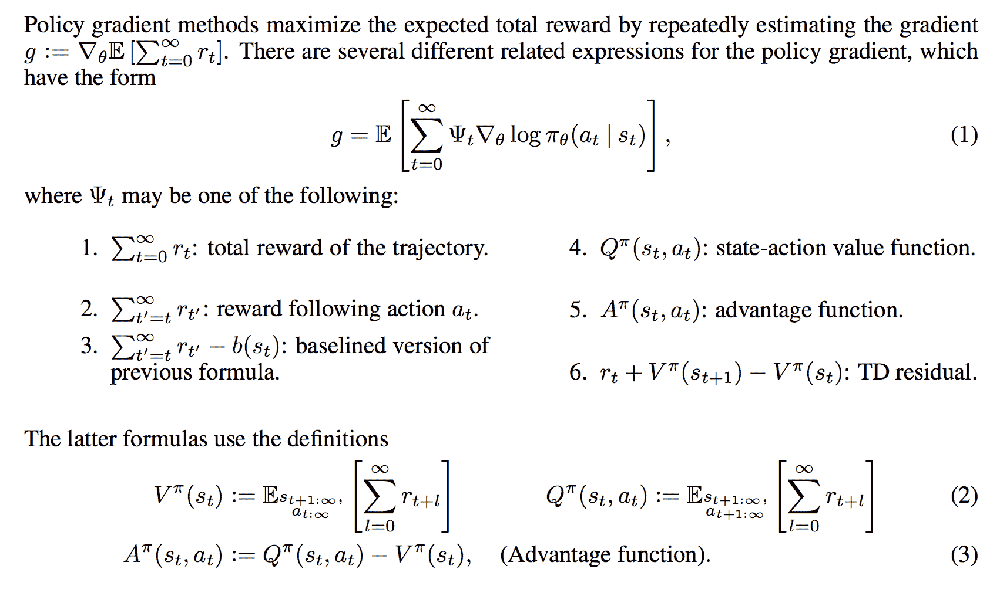

图 1\. 策略梯度方法的一般形式。（图片来源：[Schulman et al., 2016](https://arxiv.org/abs/1506.02438)）

# 策略梯度算法

近年来提出了大量的策略梯度算法，我无法逐一列举。我将介绍一些我偶然了解和阅读过的算法。

## REINFORCE

**REINFORCE**（蒙特卡洛政策梯度）依赖于使用剧集样本的蒙特卡洛方法估计的回报来更新政策参数 $\theta$。REINFORCE 之所以有效是因为样本梯度的期望等于实际梯度：

$$ \begin{aligned} \nabla_\theta J(\theta) &= \mathbb{E}_\pi [Q^\pi(s, a) \nabla_\theta \ln \pi_\theta(a \vert s)] & \\ &= \mathbb{E}_\pi [G_t \nabla_\theta \ln \pi_\theta(A_t \vert S_t)] & \scriptstyle{\text{; 因为 } Q^\pi(S_t, A_t) = \mathbb{E}_\pi[G_t \vert S_t, A_t]} \end{aligned} $$

因此，我们能够从真实样本轨迹中测量 $G_t$ 并用它来更新我们的政策梯度。它依赖于完整的轨迹，这就是为什么它是一种蒙特卡洛方法。

过程非常简单：

1.  随机初始化策略参数 $\theta`。

1.  在策略 $\pi_\theta$ 上生成一个轨迹：$S_1, A_1, R_2, S_2, A_2, \dots, S_T$。

1.  对于 t=1, 2, … , T:

    1.  估计回报 $G_t$;

    1.  更新策略参数：$\theta \leftarrow \theta + \alpha \gamma^t G_t \nabla_\theta \ln \pi_\theta(A_t \vert S_t)$

REINFORCE 的一个广泛使用的变体是从回报 $G_t$ 中减去一个基线值，*以减少梯度估计的方差同时保持偏差不变*（记住，我们总是在可能的情况下要这样做）。例如，一个常见的基线是从动作值中减去状态值，如果应用，我们将在梯度上升更新中使用优势 $A(s, a) = Q(s, a) - V(s)$。这篇[文章](https://danieltakeshi.github.io/2017/03/28/going-deeper-into-reinforcement-learning-fundamentals-of-policy-gradients/)很好地解释了为什么基线可以减少方差，除了一组政策梯度基础知识。

## 演员-评论家

政策梯度中的两个主要组成部分是政策模型和价值函数。学习价值函数除了学习政策外是有很多意义的，因为了解价值函数可以辅助政策更新，例如通过减少香草政策梯度中的梯度方差，这正是**演员-评论家**方法所做的。

演员-评论家方法由两个模型组成，这两个模型可以选择性地共享参数：

+   **评论家**更新价值函数参数 w，根据算法的不同，它可以是动作值 $Q_w(a \vert s)$ 或状态值 $V_w(s)$。

+   **演员**根据评论家建议的方向更新策略参数 $\theta$ 为 $\pi_\theta(a \vert s)$。

让我们看看它是如何在一个简单的动作值演员-评论家算法中运作的。

1.  随机初始化 $s, \theta, w$; 采样 $a \sim \pi_\theta(a \vert s)$.

1.  对于 $t = 1 \dots T$:

    1.  采样奖励 $r_t \sim R(s, a)$ 和下一个状态 $s’ \sim P(s’ \vert s, a)$;

    1.  然后采样下一个动作 $a’ \sim \pi_\theta(a’ \vert s’)$;

    1.  更新策略参数：$\theta \leftarrow \theta + \alpha_\theta Q_w(s, a) \nabla_\theta \ln \pi_\theta(a \vert s)$;

    1.  计算时间 t 的动作值的校正（TD 误差）：

        $\delta_t = r_t + \gamma Q_w(s’, a’) - Q_w(s, a)$

        并将其用于更新动作值函数的参数：

        $w \leftarrow w + \alpha_w \delta_t \nabla_w Q_w(s, a)$

    1.  更新 $a \leftarrow a’$ 和 $s \leftarrow s’$。

两个学习率，$\alpha_\theta$ 和 $\alpha_w$，分别预定义用于策略和值函数参数更新。

## 离策略策略梯度

REINFORCE 和演员-评论方法的基本版本都是在策略上的：训练样本是根据目标策略收集的 —— 我们试图优化的完全相同的策略。然而，离策略方法带来了几个额外的优势：

1.  离策略方法不需要完整的轨迹，并且可以重复使用任何过去的经验（[“经验重放”](https://lilianweng.github.io/posts/2018-02-19-rl-overview/#deep-q-network)）以提高样本效率。

1.  样本收集遵循与目标策略不同的行为策略，带来更好的[探索](https://lilianweng.github.io/posts/2018-02-19-rl-overview/#exploration-exploitation-dilemma)。

现在让我们看看如何计算离策略策略梯度。用于收集样本的行为策略是一个已知策略（像一个超参数一样预定义），标记为$\beta(a \vert s)$。目标函数将奖励在由该行为策略定义的状态分布上求和：

$$ J(\theta) = \sum_{s \in \mathcal{S}} d^\beta(s) \sum_{a \in \mathcal{A}} Q^\pi(s, a) \pi_\theta(a \vert s) = \mathbb{E}_{s \sim d^\beta} \big[ \sum_{a \in \mathcal{A}} Q^\pi(s, a) \pi_\theta(a \vert s) \big] $$

其中 $d^\beta(s)$ 是行为策略 $\beta$ 的稳态分布；请记住 $d^\beta(s) = \lim_{t \to \infty} P(S_t = s \vert S_0, \beta)$；而 $Q^\pi$ 是针对目标策略 $\pi$ 估计的动作值函数（不是行为策略！）。

鉴于训练观察是由 $a \sim \beta(a \vert s)$ 抽样的，我们可以将梯度重写为：

$$ \begin{aligned} \nabla_\theta J(\theta) &= \nabla_\theta \mathbb{E}_{s \sim d^\beta} \Big[ \sum_{a \in \mathcal{A}} Q^\pi(s, a) \pi_\theta(a \vert s) \Big] & \\ &= \mathbb{E}_{s \sim d^\beta} \Big[ \sum_{a \in \mathcal{A}} \big( Q^\pi(s, a) \nabla_\theta \pi_\theta(a \vert s) + \color{red}{\pi_\theta(a \vert s) \nabla_\theta Q^\pi(s, a)} \big) \Big] & \scriptstyle{\text{; 求导乘积法则。}}\\ &\stackrel{(i)}{\approx} \mathbb{E}_{s \sim d^\beta} \Big[ \sum_{a \in \mathcal{A}} Q^\pi(s, a) \nabla_\theta \pi_\theta(a \vert s) \Big] & \scriptstyle{\text{; 忽略红色部分：} \color{red}{\pi_\theta(a \vert s) \nabla_\theta Q^\pi(s, a)}}. \\ &= \mathbb{E}_{s \sim d^\beta} \Big[ \sum_{a \in \mathcal{A}} \beta(a \vert s) \frac{\pi_\theta(a \vert s)}{\beta(a \vert s)} Q^\pi(s, a) \frac{\nabla_\theta \pi_\theta(a \vert s)}{\pi_\theta(a \vert s)} \Big] & \\ &= \mathbb{E}_\beta \Big[\frac{\color{blue}{\pi_\theta(a \vert s)}}{\color{blue}{\beta(a \vert s)}} Q^\pi(s, a) \nabla_\theta \ln \pi_\theta(a \vert s) \Big] & \scriptstyle{\text{; 蓝色部分是重要性权重。}} \end{aligned} $$

其中$\frac{\pi_\theta(a \vert s)}{\beta(a \vert s)}$是[重要性权重](http://timvieira.github.io/blog/post/2014/12/21/importance-sampling)。因为$Q^\pi$是目标策略的函数，因此也是策略参数$\theta$的函数，我们应该根据乘积法则对$\nabla_\theta Q^\pi(s, a)$进行求导。然而，在现实中计算$\nabla_\theta Q^\pi(s, a)$非常困难。幸运的是，如果我们使用一个忽略了 Q 梯度的近似梯度，我们仍然可以保证策略改进，并最终实现真正的局部最小值。这在证明中得到了证实[这里](https://arxiv.org/pdf/1205.4839.pdf)（Degris, White & Sutton, 2012）。

总之，在离策略设置中应用策略梯度时，我们可以通过加权和进行简单调整，权重是目标策略与行为策略的比值，$\frac{\pi_\theta(a \vert s)}{\beta(a \vert s)}$。

## A3C

[[论文](https://arxiv.org/abs/1602.01783)|[代码](https://github.com/dennybritz/reinforcement-learning/tree/master/PolicyGradient/a3c)]

**异步优势演员-评论家**（[Mnih 等人，2016](https://arxiv.org/abs/1602.01783)），简称**A3C**，是一种经典的策略梯度方法，特别关注并行训练。

在 A3C 中，评论家学习价值函数，而多个演员并行训练，并不时与全局参数同步。因此，A3C 被设计为适用于并行训练。

让我们以状态值函数为例。状态值的损失函数是最小化均方误差，$J_v(w) = (G_t - V_w(s))²$，可以应用梯度下降找到最优的 w。这个状态值函数被用作策略梯度更新中的基准。

这是算法概述：

1.  我们有全局参数 $\theta$ 和 $w$；类似的线程特定参数 $\theta’$ 和 $w’$。

1.  初始化时间步 $t = 1$

1.  当 $T \leq T_\text{MAX}$ 时：

    1.  重置梯度：$\mathrm{d}\theta = 0$ 和 $\mathrm{d}w = 0$。

    1.  将线程特定参数与全局参数同步：$\theta’ = \theta$ 和 $w’ = w$。

    1.  $t_\text{start}$ = t 并采样一个起始状态 $s_t$。

    1.  当 ($s_t$ != 终止状态) 且 $t - t_\text{start} \leq t_\text{max}$ 时：

        1.  选择动作 $A_t \sim \pi_{\theta’}(A_t \vert S_t)$ 并接收新奖励 $R_t$ 和新状态 $s_{t+1}$。

        1.  更新 $t = t + 1$ 和 $T = T + 1$

    1.  初始化保存回报估计的变量$$ R = \begin{cases} 0 & \text{如果 } s_t \text{ 是终止状态} \\ V_{w'}(s_t) & \text{否则} \end{cases} $$6\. 对于 $i = t-1, \dots, t\_\text{start}$： 1\. $R \leftarrow \gamma R + R\_i$；这里的 R 是 $G\_i$ 的 MC 测量。 2\. 累积关于 $\theta'$ 的梯度：$d\theta \leftarrow d\theta + \nabla\_{\theta'} \log \pi\_{\theta'}(a\_i \vert s\_i)(R - V\_{w'}(s\_i))$；

    累积关于 $w'$ 的梯度：$dw \leftarrow dw + 2 (R - V\_{w'}(s\_i)) \nabla\_{w'} (R - V\_{w'}(s\_i))$。

    1.  异步更新 $\theta$ 使用 $\mathrm{d}\theta$，$w$ 使用 $\mathrm{d}w$。

A3C 实现了多代理训练中的并行性。梯度累积步骤（6.2）可以被视为基于小批量随机梯度更新的并行化改进：$w$ 或 $\theta$ 的值在每个训练线程中独立地稍微调整。

## A2C

[[论文](https://arxiv.org/abs/1602.01783)|[代码](https://github.com/openai/baselines/blob/master/baselines/a2c/a2c.py)]

**A2C** 是 A3C 的同步、确定性版本；这就是为什么它被命名为“A2C”，第一个“A”（“异步”）被移除。在 A3C 中，每个代理独立与全局参数交流，因此有时线程特定代理可能会使用不同版本的策略，因此聚合更新可能不是最优的。为了解决不一致性，A2C 中的协调员会等待所有并行执行者完成工作，然后在下一次迭代中，所有并行执行者从相同的策略开始。同步的梯度更新使训练更加连贯，可能使收敛速度更快。

已经显示 A2C 能够更有效地利用 GPU，并且在使用大批量大小时能够达到与 A3C 相同或更好的性能。

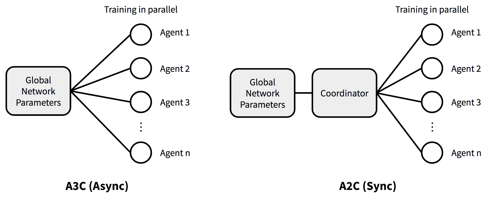

图 2\. A3C 与 A2C 的架构对比。

## DPG

[[论文](https://hal.inria.fr/file/index/docid/938992/filename/dpg-icml2014.pdf)|[代码](https://github.com/openai/baselines/blob/master/baselines/a2c/a2c.py)]

在上述描述的方法中，策略函数 $\pi(. \vert s)$ 总是被建模为在当前状态下给定动作 $\mathcal{A}$ 的概率分布，因此它是*随机的*。**确定性策略梯度（DPG）** 相反将策略建模为确定性决策：$a = \mu(s)$。这可能看起来很奇怪 — 当输出单个动作时，你如何计算动作概率的梯度呢？让我们一步一步来看。

刷新一下一些符号以便讨论：

+   $\rho_0(s)$：初始状态分布

+   $\rho^\mu(s \to s’, k)$：从状态 s 开始，经过策略 $\mu$ 移动 k 步后到达状态 s’ 的访问概率密度。

+   $\rho^\mu(s’)$：折扣状态分布，定义为 $\rho^\mu(s’) = \int_\mathcal{S} \sum_{k=1}^\infty \gamma^{k-1} \rho_0(s) \rho^\mu(s \to s’, k) ds$。

要优化的目标函数列如下：

$$ J(\theta) = \int_\mathcal{S} \rho^\mu(s) Q(s, \mu_\theta(s)) ds $$

**确定性策略梯度定理**：现在是计算梯度的时候了！根据链式法则，我们首先对 Q 关于动作 a 求梯度，然后对确定性策略函数 $\mu$ 关于 $\theta$ 求梯度：

$$ \begin{aligned} \nabla_\theta J(\theta) &= \int_\mathcal{S} \rho^\mu(s) \nabla_a Q^\mu(s, a) \nabla_\theta \mu_\theta(s) \rvert_{a=\mu_\theta(s)} ds \\ &= \mathbb{E}_{s \sim \rho^\mu} [\nabla_a Q^\mu(s, a) \nabla_\theta \mu_\theta(s) \rvert_{a=\mu_\theta(s)}] \end{aligned} $$

我们可以将确定性策略视为随机策略的*特殊情况*，当概率分布仅包含一个极端非零值的动作时。实际上，在 DPG [论文](https://hal.inria.fr/file/index/docid/938992/filename/dpg-icml2014.pdf) 中，作者已经表明，如果将随机策略 $\pi_{\mu_\theta, \sigma}$ 重新参数化为确定性策略 $\mu_\theta$ 和变化变量 $\sigma$，当 $\sigma=0$ 时，随机策略最终等效于确定性情况。与确定性策略相比，我们期望随机策略需要更多样本，因为它整合了整个状态和动作空间的数据。

确定性策略梯度定理可以嵌入常见的策略梯度框架中。

让我们考虑一个基于策略的演员-评论家算法的示例来展示该过程。在每次策略的演员-评论家迭代中，两个动作被确定性地采取 $a = \mu_\theta(s)$，并且对策略参数的[SARSA](https://lilianweng.github.io/posts/2018-02-19-rl-overview/#sarsa-on-policy-td-control)更新依赖于我们刚刚计算的新梯度：

$$ \begin{aligned} \delta_t &= R_t + \gamma Q_w(s_{t+1}, a_{t+1}) - Q_w(s_t, a_t) & \small{\text{; SARSA 中的 TD 误差}}\\ w_{t+1} &= w_t + \alpha_w \delta_t \nabla_w Q_w(s_t, a_t) & \\ \theta_{t+1} &= \theta_t + \alpha_\theta \color{red}{\nabla_a Q_w(s_t, a_t) \nabla_\theta \mu_\theta(s) \rvert_{a=\mu_\theta(s)}} & \small{\text{; 确定性策略梯度定理}} \end{aligned} $$

然而，除非环境中有足够的噪音，由于策略的确定性，很难保证足够的[探索](https://lilianweng.github.io/posts/2018-02-19-rl-overview/#exploration-exploitation-dilemma)。我们可以将噪音添加到策略中（具有讽刺意味的是，这使其变得非确定性！）或者通过遵循不同的随机行为策略进行离策略学习来收集样本。

换句话说，在离策略方法中，训练轨迹由随机策略 $\beta(a \vert s)$ 生成，因此状态分布遵循相应的折扣状态密度 $\rho^\beta$：

$$ \begin{aligned} J_\beta(\theta) &= \int_\mathcal{S} \rho^\beta Q^\mu(s, \mu_\theta(s)) ds \\ \nabla_\theta J_\beta(\theta) &= \mathbb{E}_{s \sim \rho^\beta} [\nabla_a Q^\mu(s, a) \nabla_\theta \mu_\theta(s) \rvert_{a=\mu_\theta(s)} ] \end{aligned} $$

请注意，由于策略是确定性的，我们只需要 $Q^\mu(s, \mu_\theta(s))$ 而不是 $\sum_a \pi(a \vert s) Q^\pi(s, a)$ 作为给定状态 s 的估计奖励。在具有随机策略的离策略方法中，通常使用重要性采样来纠正行为和目标策略之间的不匹配，就像我们在上文中描述的那样。然而，由于确定性策略梯度消除了对动作的积分，我们可以避免重要性采样。

## DDPG

[[论文](https://arxiv.org/pdf/1509.02971.pdf)|[代码](https://github.com/openai/baselines/tree/master/baselines/ddpg)]

**DDPG**（[Lillicrap 等人，2015](https://arxiv.org/pdf/1509.02971.pdf)），简称**Deep Deterministic Policy Gradient**，是一种无模型的离策略 actor-critic 算法，将 DPG 与[DQN](https://lilianweng.github.io/posts/2018-02-19-rl-overview/#deep-q-network)结合起来。回想一下，DQN（Deep Q-Network）通过经验重放和冻结目标网络稳定了 Q 函数的学习。原始的 DQN 在离散空间中工作，而 DDPG 通过 actor-critic 框架将其扩展到连续空间，同时学习确定性策略。

为了更好地进行探索，通过添加噪音 $\mathcal{N}$ 构建了一个探索策略 $\mu’$：

$$ \mu'(s) = \mu_\theta(s) + \mathcal{N} $$

另外，DDPG 对 actor 和 critic 的参数进行软更新（“保守策略迭代”），其中 $\tau \ll 1$：$\theta’ \leftarrow \tau \theta + (1 - \tau) \theta’。这样，目标网络的值被限制为缓慢变化，与 DQN 设计不同，DQN 中目标网络在一段时间内保持冻结。

论文中一个特别有用的细节是如何规范低维特征的不同物理单位。例如，设计一个模型来学习以机器人的位置和速度作为输入的策略；这些物理统计数据本质上是不同的，即使是相同类型的统计数据在多个机器人之间也可能有很大差异。[批归一化](http://proceedings.mlr.press/v37/ioffe15.pdf)被应用来通过在一个小批量样本中规范化每个维度来修复这个问题。

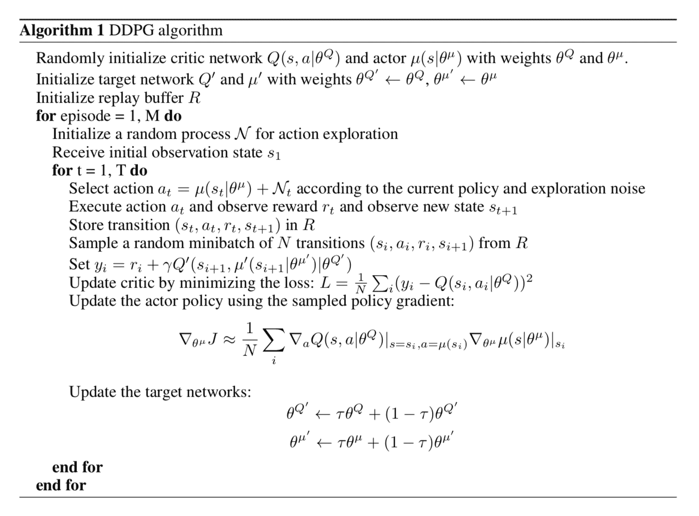

图 3\. DDPG 算法（图片来源：[Lillicrap 等人，2015](https://arxiv.org/pdf/1509.02971.pdf)）

## D4PG

[[论文](https://openreview.net/forum?id=SyZipzbCb)|代码（搜索“github d4pg”就会看到一些。)]

**分布式分布式 DDPG（D4PG）**对 DDPG 进行了一系列改进，使其以分布方式运行。

(1) **分布式评论家**：评论家将期望的 Q 值估计为一个由$w$参数化的分布$Z_w$的随机变量，因此$Q_w(s, a) = \mathbb{E} Z_w(x, a)$。学习分布参数的损失是最小化两个分布之间的距离的某种度量 — 分布式 TD 误差：$L(w) = \mathbb{E}[d(\mathcal{T}_{\mu_\theta}, Z_{w’}(s, a), Z_w(s, a)]$，其中$\mathcal{T}_{\mu_\theta}$是 Bellman 算子。

确定性策略梯度更新如下：

$$ \begin{aligned} \nabla_\theta J(\theta) &\approx \mathbb{E}_{\rho^\mu} [\nabla_a Q_w(s, a) \nabla_\theta \mu_\theta(s) \rvert_{a=\mu_\theta(s)}] & \scriptstyle{\text{; DPG 中的梯度更新}} \\ &= \mathbb{E}_{\rho^\mu} [\mathbb{E}[\nabla_a Z_w(s, a)] \nabla_\theta \mu_\theta(s) \rvert_{a=\mu_\theta(s)}] & \scriptstyle{\text{; Q 值分布的期望。}} \end{aligned} $$

(2) **$N$步回报**：在计算 TD 误差时，D4PG 计算$N$步 TD 目标，而不是一步，以纳入更多未来步骤的奖励。因此，新的 TD 目标是：

$$ r(s_0, a_0) + \mathbb{E}[\sum_{n=1}^{N-1} r(s_n, a_n) + \gamma^N Q(s_N, \mu_\theta(s_N)) \vert s_0, a_0 ] $$

(3) **多分布式并行执行者**：D4PG 利用$K$个独立执行者并行收集经验，并将数据输入相同的重播缓冲区。

(4) **优先经验重播（[PER](https://arxiv.org/abs/1511.05952)）**：最后一项修改是从大小为$R$的重播缓冲区中以非均匀概率$p_i$进行抽样。这样，样本$i$被选中的概率为$(Rp_i)^{-1}$，因此重要性权重为$(Rp_i)^{-1}$。

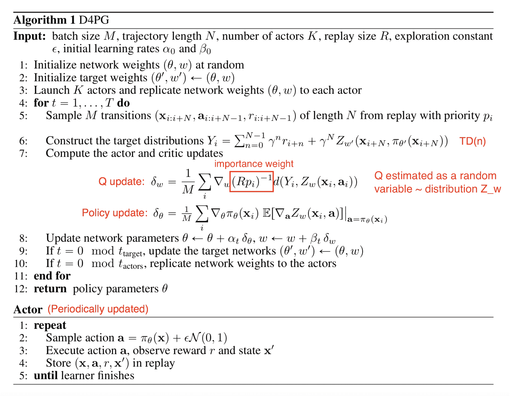

图 4\. D4PG 算法（图片来源：[Barth-Maron 等人，2018](https://openreview.net/forum?id=SyZipzbCb)）；请注意，在原始论文中，变量字母的选择与帖子中略有不同；即我使用$\mu(.)$来表示确定性策略，而不是$\pi(.)$。

## MADDPG

[[论文](https://arxiv.org/pdf/1706.02275.pdf)|[代码](https://github.com/openai/maddpg)]

**多智能体 DDPG** (**MADDPG**)（[Lowe 等人，2017](https://arxiv.org/pdf/1706.02275.pdf)）将 DDPG 扩展到一个环境中，多个代理协调完成任务，只有局部信息。 从一个代理的角度来看，环境是非静态的，因为其他代理的策略很快就会升级并保持未知。 MADDPG 是一个演员-评论家模型，专门重新设计用于处理这种不断变化的环境和代理之间的交互。

问题可以在多智能体版本的 MDP 中形式化，也称为 *马尔可夫博弈*。 MADDPG 被提出用于部分可观察的马尔可夫博弈。 假设总共有 N 个代理，具有一组状态 $\mathcal{S}$。 每个代理拥有一组可能的动作，$\mathcal{A}_1, \dots, \mathcal{A}_N$，以及一组观察，$\mathcal{O}_1, \dots, \mathcal{O}_N$。 状态转移函数涉及所有状态、动作和观察空间 $\mathcal{T}: \mathcal{S} \times \mathcal{A}_1 \times \dots \mathcal{A}_N \mapsto \mathcal{S}$。 每个代理的随机策略只涉及自己的状态和动作：$\pi_{\theta_i}: \mathcal{O}_i \times \mathcal{A}_i \mapsto [0, 1]$，给定自己的观察，动作的概率分布，或确定性策略：$\mu_{\theta_i}: \mathcal{O}_i \mapsto \mathcal{A}_i$。

让 $\vec{o} = {o_1, \dots, o_N}$，$\vec{\mu} = {\mu_1, \dots, \mu_N}$，策略由 $\vec{\theta} = {\theta_1, \dots, \theta_N}$ 参数化。

MADDPG 中的评论家学习一个集中的动作值函数 $Q^\vec{\mu}_i(\vec{o}, a_1, \dots, a_N)$，其中 $a_1 \in \mathcal{A}_1, \dots, a_N \in \mathcal{A}_N$ 是所有代理的动作。 每个 $Q^\vec{\mu}_i$ 都是独立学习的，因此多个代理可以具有任意的奖励结构，包括在竞争环境中的冲突奖励。 同时，多个演员，每个代理一个，正在探索并独立升级策略参数 $\theta_i$。

**演员更新**：

$$ \nabla_{\theta_i} J(\theta_i) = \mathbb{E}_{\vec{o}, a \sim \mathcal{D}} [\nabla_{a_i} Q^{\vec{\mu}}_i (\vec{o}, a_1, \dots, a_N) \nabla_{\theta_i} \mu_{\theta_i}(o_i) \rvert_{a_i=\mu_{\theta_i}(o_i)} ] $$

其中 $\mathcal{D}$ 是用于经验重放的内存缓冲区，包含多个剧集样本 $(\vec{o}, a_1, \dots, a_N, r_1, \dots, r_N, \vec{o}’)$ — 给定当前观察 $\vec{o}$，代理执行动作 $a_1, \dots, a_N$ 并获得奖励 $r_1, \dots, r_N$，导致新观察 $\vec{o}’$。

**评论家更新**：

$$ \begin{aligned} \mathcal{L}(\theta_i) &= \mathbb{E}_{\vec{o}, a_1, \dots, a_N, r_1, \dots, r_N, \vec{o}'}[ (Q^{\vec{\mu}}_i(\vec{o}, a_1, \dots, a_N) - y)² ] & \\ \text{其中 } y &= r_i + \gamma Q^{\vec{\mu}'}_i (\vec{o}', a'_1, \dots, a'_N) \rvert_{a'_j = \mu'_{\theta_j}} & \scriptstyle{\text{; TD 目标！}} \end{aligned} $$

其中$\vec{\mu}’$是具有延迟软更新参数的目标策略。

如果在评论家更新期间策略$\vec{\mu}$是未知的，我们可以要求每个代理学习和演变其它代理的近似策略。使用近似策略，MADDPG 仍然可以高效学习，尽管推断的策略可能不准确。

为了减少环境中竞争或合作代理之间互动引起的高方差，MADDPG 提出了一个额外的元素 - *策略集合*：

1.  为一个代理训练 K 个策略;

1.  为剧集展开选择一个随机策略;

1.  采用这 K 个策略的集合进行梯度更新。

总之，MADDPG 在 DDPG 的基础上增加了三个额外的要素，使其适应多智能体环境：

+   中心化评论家 + 分散化演员;

+   演员可以使用其他代理的估计策略进行学习;

+   策略集合对于减少方差是有益的。

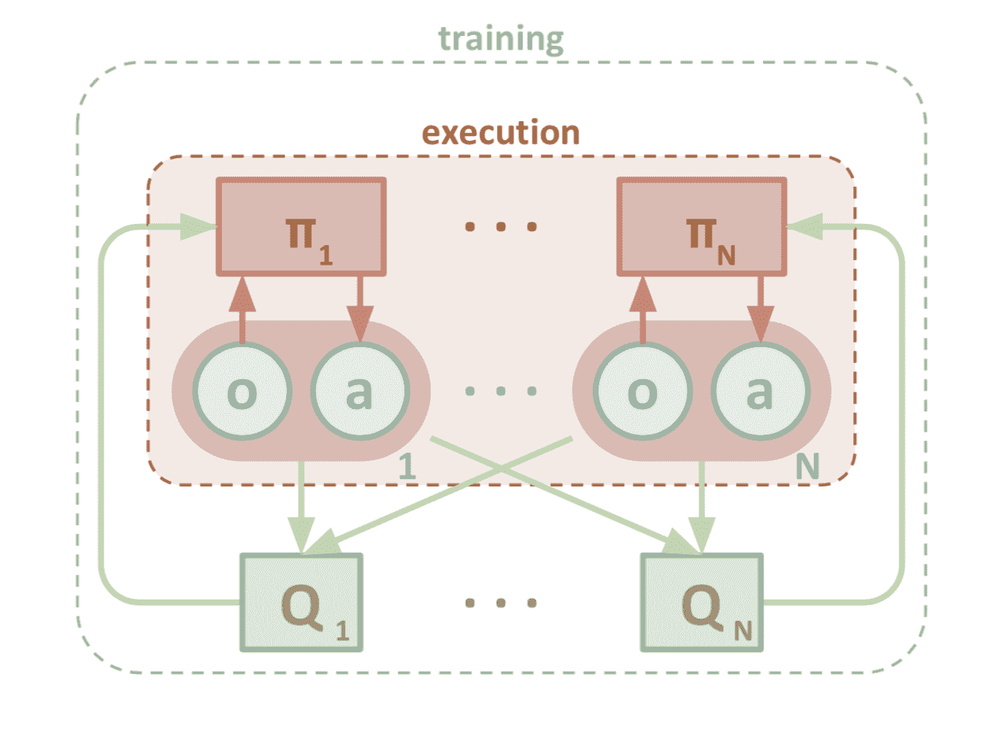

图 5. MADDPG 的架构设计。（图片来源：[Lowe 等，2017](https://arxiv.org/pdf/1706.02275.pdf)）

## TRPO

[[论文](https://arxiv.org/pdf/1502.05477.pdf)|[代码](https://github.com/openai/baselines/tree/master/baselines/trpo_mpi)]

为了提高训练稳定性，我们应该避免在一步中过度改变策略的参数更新。**信任区域策略优化（TRPO）**（[Schulman 等，2015](https://arxiv.org/pdf/1502.05477.pdf)）通过在每次迭代中对策略更新的大小强制执行[KL 散度](https://lilianweng.github.io/posts/2017-08-20-gan/#kullbackleibler-and-jensenshannon-divergence)约束来实现这一想法。

考虑当我们进行离线策略强化学习时，用于在展开工作者上收集轨迹的策略$\beta$与用于优化的策略$\pi$不同。离线模型中的目标函数衡量了状态访问分布和动作的总优势，而训练数据分布与真实策略状态分布之间的不匹配由重要性采样估计器来补偿：

$$ \begin{aligned} J(\theta) &= \sum_{s \in \mathcal{S}} \rho^{\pi_{\theta_\text{old}}} \sum_{a \in \mathcal{A}} \big( \pi_\theta(a \vert s) \hat{A}_{\theta_\text{old}}(s, a) \big) & \\ &= \sum_{s \in \mathcal{S}} \rho^{\pi_{\theta_\text{old}}} \sum_{a \in \mathcal{A}} \big( \beta(a \vert s) \frac{\pi_\theta(a \vert s)}{\beta(a \vert s)} \hat{A}_{\theta_\text{old}}(s, a) \big) & \scriptstyle{\text{; 重要性采样}} \\ &= \mathbb{E}_{s \sim \rho^{\pi_{\theta_\text{old}}}, a \sim \beta} \big[ \frac{\pi_\theta(a \vert s)}{\beta(a \vert s)} \hat{A}_{\theta_\text{old}}(s, a) \big] & \end{aligned} $$

其中 $\theta_\text{old}$ 是更新之前的策略参数，因此我们已知；$\rho^{\pi_{\theta_\text{old}}}$ 的定义与上文相同；$\beta(a \vert s)$ 是用于收集轨迹的行为策略。请注意，我们使用估计的优势 $\hat{A}(.)$ 而不是真实的优势函数 $A(.)$，因为真实奖励通常是未知的。

在策略训练时，理论上用于收集数据的策略与我们要优化的策略相同。然而，当回滚工作程序和优化器异步并行运行时，行为策略可能会过时。TRPO 考虑到这种微妙的差异：它将行为策略标记为 $\pi_{\theta_\text{old}}(a \vert s)$，因此目标函数变为：

$$ J(\theta) = \mathbb{E}_{s \sim \rho^{\pi_{\theta_\text{old}}}, a \sim \pi_{\theta_\text{old}}} \big[ \frac{\pi_\theta(a \vert s)}{\pi_{\theta_\text{old}}(a \vert s)} \hat{A}_{\theta_\text{old}}(s, a) \big] $$

TRPO 旨在最大化目标函数 $J(\theta)$，同时受到*信任区域约束*的约束，该约束强制旧策略和新策略之间的距离（由[KL 散度](https://en.wikipedia.org/wiki/Kullback%E2%80%93Leibler_divergence)测量）足够小，即在参数 δ 内：

$$ \mathbb{E}_{s \sim \rho^{\pi_{\theta_\text{old}}}} [D_\text{KL}(\pi_{\theta_\text{old}}(.\vert s) \| \pi_\theta(.\vert s)] \leq \delta $$

这样，当满足这个硬约束时，旧策略和新策略之间不会发散太多。尽管如此，TRPO 仍然可以保证在策略迭代上的单调改进（很棒，对吧？）。如果感兴趣，请阅读[论文](https://arxiv.org/pdf/1502.05477.pdf)中的证明 :)

## PPO

[[论文](https://arxiv.org/pdf/1707.06347.pdf)|[代码](https://github.com/openai/baselines/tree/master/baselines/ppo1)]

鉴于 TRPO 相对复杂，而我们仍希望实现类似的约束，**近端策略优化（PPO）**通过使用剪切的替代目标简化了它，同时保持类似的性能。

首先，让我们将旧策略和新策略之间的概率比率表示为：

$$ r(\theta) = \frac{\pi_\theta(a \vert s)}{\pi_{\theta_\text{old}}(a \vert s)} $$

然后，TRPO 的目标函数（在策略上）变为：

$$ J^\text{TRPO} (\theta) = \mathbb{E} [ r(\theta) \hat{A}_{\theta_\text{old}}(s, a) ] $$

如果没有对 $\theta_\text{old}$ 和 $\theta$ 之间的距离施加限制，最大化 $J^\text{TRPO} (\theta)$ 将导致极大的参数更新和大的策略比率，从而导致不稳定性。PPO 通过强制 $r(\theta)$ 保持在 1 周围的一个小区间内，即精确地 $[1-\epsilon, 1+\epsilon]$，来施加约束，其中 $\epsilon$ 是一个超参数。

$$ J^\text{CLIP} (\theta) = \mathbb{E} [ \min( r(\theta) \hat{A}_{\theta_\text{old}}(s, a), \text{clip}(r(\theta), 1 - \epsilon, 1 + \epsilon) \hat{A}_{\theta_\text{old}}(s, a))] $$

函数$\text{clip}(r(\theta), 1 - \epsilon, 1 + \epsilon)$将比率剪切为不超过$1+\epsilon$且不少于$1-\epsilon$。PPO 的目标函数取原始值和剪切版本之间的最小值，因此我们失去了为了更好的奖励而将策略更新增加到极端的动机。

在应用 PPO 于共享参数的网络架构中，用于策略（演员）和价值（评论家）函数的，除了截断奖励外，目标函数还增加了一个关于价值估计的误差项（红色公式）和一个熵项（蓝色公式），以鼓励充分的探索。

$$ J^\text{CLIP'} (\theta) = \mathbb{E} [ J^\text{CLIP} (\theta) - \color{red}{c_1 (V_\theta(s) - V_\text{target})²} + \color{blue}{c_2 H(s, \pi_\theta(.))} ] $$

其中$c_1$和$c_2$都是两个超参数常数。

PPO 已经在一组基准任务上进行了测试，并证明以更简单的方式产生了令人印象深刻的结果。

在[Hsu 等人，2020 年](https://arxiv.org/abs/2009.10897)的一篇后续论文中，重新审视了 PPO 中的两个常见设计选择，即（1）用于策略正则化的截断概率比和（2）通过连续高斯或离散 softmax 分布参数化策略动作空间。他们首先确定了 PPO 中的三种失败模式，并提出了这两种设计的替代方案。

失败模式包括：

1.  在连续动作空间上，当奖励在有界支持之外消失时，标准 PPO 是不稳定的。

1.  在具有稀疏高奖励的离散动作空间中，标准 PPO 经常会陷入次优动作。

1.  当初始化时存在接近初始化的局部最优动作时，策略对初始化非常敏感。

将动作空间离散化或使用 Beta 分布有助于避免与高斯策略相关的失败模式 1 和 3。使用 KL 正则化（与 TRPO 中的动机相同）作为替代的替代模型有助于解决失败模式 1 和 2。

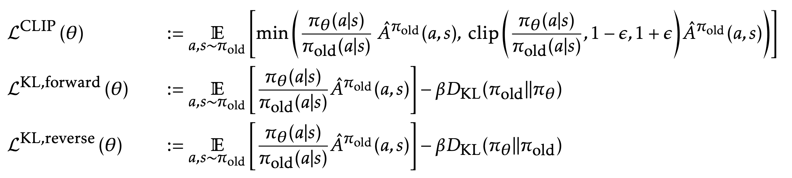

## PPG

[[论文](https://arxiv.org/abs/2009.04416)|[代码](https://github.com/openai/phasic-policy-gradient)]

在策略和价值网络之间共享参数有利有弊。它允许策略和价值函数彼此共享学习到的特征，但可能导致竞争目标之间的冲突，并要求同时训练两个网络使用相同的数据。**阶段性策略梯度**（**PPG**；[Cobbe 等人，2020 年](https://arxiv.org/abs/2009.04416)）修改了传统的在线策略梯度算法，准确地说是 PPO，为策略和价值函数分别设置了训练阶段。在两个交替阶段中：

1.  *策略阶段*：通过优化 PPO 的目标 $L^\text{CLIP} (\theta)$来更新策略网络；

1.  *辅助阶段*：优化辅助目标与行为克隆损失一起。在论文中，价值函数误差是唯一的辅助目标，但它可以非常通用，并包括任何其他额外的辅助损失。

$$ \begin{aligned} L^\text{joint} &= L^\text{aux} + \beta_\text{clone} \cdot \mathbb{E}_t[\text{KL}[\pi_{\theta_\text{old}}(\cdot\mid s_t), \pi_\theta(\cdot\mid s_t)]] \\ L^\text{aux} &= L^\text{value} = \mathbb{E}_t \big[\frac{1}{2}\big( V_w(s_t) - \hat{V}_t^\text{targ} \big)²\big] \end{aligned} $$

其中$\beta_\text{clone}$是一个超参数，用于控制我们希望策略在优化辅助目标时不要与其原始行为相差太远。

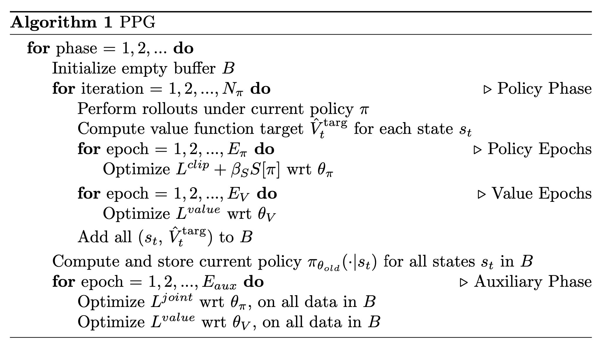

图 6。PPG 的算法。（图片来源：[Cobbe, et al 2020](https://arxiv.org/abs/2009.04416)）

其中

+   $N_\pi$是策略阶段中策略更新迭代次数。请注意，策略阶段对每个单独的辅助阶段执行多次更新迭代。

+   $E_\pi$和$E_V$控制策略和价值函数的样本重用（即在回放缓冲区中执行的训练时期数量）；请注意，这发生在策略阶段内，因此$E_V$影响真实价值函数的学习而不是辅助价值函数。

+   $E_\text{aux}$定义了辅助阶段中的样本重用。在 PPG 中，价值函数优化可以容忍更高水平的样本重用；例如，在论文的实验中，$E_\text{aux} = 6$，而$E_\pi = E_V = 1$。

PPG 相对于 PPO 在样本效率上有显著改进。

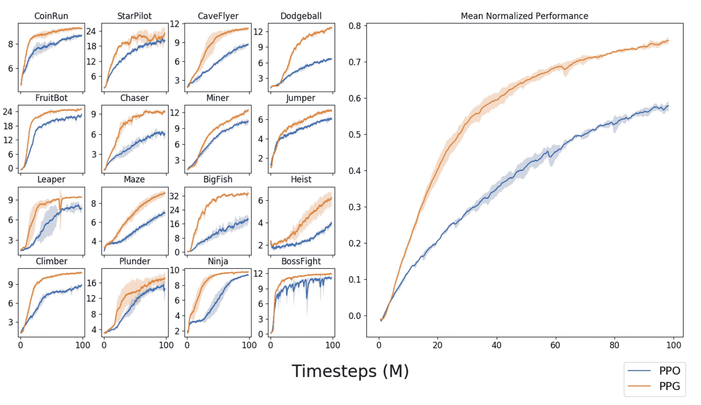

图 7。PPG 与 PPO 在[Procgen](https://arxiv.org/abs/1912.01588)基准测试上的平均标准化性能。（图片来源：[Cobbe, et al 2020](https://arxiv.org/abs/2009.04416))

## ACER

[[论文](https://arxiv.org/pdf/1611.01224.pdf)|[代码](https://github.com/openai/baselines/tree/master/baselines/acer)]

**ACER**，全称**带经验回放的演员-评论家**（[Wang, et al., 2017](https://arxiv.org/pdf/1611.01224.pdf)），是一种带有经验回放的离线演员-评论家模型，极大地提高了样本效率并减少了数据相关性。A3C 为 ACER 奠定了基础，但它是在线的；ACER 是 A3C 的离线对应物。使 A3C 离线的主要障碍是如何控制离线估计器的稳定性。ACER 提出了三种设计来克服这一障碍：

+   使用回溯 Q 值估计；

+   使用偏差校正截断重要性权重；

+   应用高效的 TRPO。

**回溯 Q 值估计**

[*Retrace*](http://papers.nips.cc/paper/6538-safe-and-efficient-off-policy-reinforcement-learning.pdf)是一种基于离线回报的 Q 值估计算法，对于任何目标和行为策略对$(\pi, \beta)$都有很好的收敛保证，同时具有良好的数据效率。

回想一下 TD 学习用于预测的工作原理：

1.  计算 TD 误差：$\delta_t = R_t + \gamma \mathbb{E}_{a \sim \pi} Q(S_{t+1}, a) - Q(S_t, A_t)$；术语 $r_t + \gamma \mathbb{E}_{a \sim \pi} Q(s_{t+1}, a) $ 被称为“TD 目标”。期望值 $\mathbb{E}_{a \sim \pi}$ 被用来因为对于未来步骤，我们能做出的最好估计是如果我们遵循当前策略 $\pi$ 时的回报。

1.  通过纠正错误来更新值以朝着目标前进：$Q(S_t, A_t) \leftarrow Q(S_t, A_t) + \alpha \delta_t$。换句话说，Q 的增量更新与 TD 误差成正比：$\Delta Q(S_t, A_t) = \alpha \delta_t$。

当回滚不符合策略时，我们需要在 Q 更新上应用重要性采样：

$$ \Delta Q^\text{imp}(S_t, A_t) = \gamma^t \prod_{1 \leq \tau \leq t} \frac{\pi(A_\tau \vert S_\tau)}{\beta(A_\tau \vert S_\tau)} \delta_t $$

当我们开始想象重要性权重的乘积时，它看起来非常可怕，可能会导致超高的方差甚至爆炸。Retrace Q 值估计方法修改 $\Delta Q$，使重要性权重被截断不超过一个常数 $c$：

$$ \Delta Q^\text{ret}(S_t, A_t) = \gamma^t \prod_{1 \leq \tau \leq t} \min(c, \frac{\pi(A_\tau \vert S_\tau)}{\beta(A_\tau \vert S_\tau)}) \delta_t $$

ACER 使用 $Q^\text{ret}$ 作为目标来训练批评家，通过最小化 L2 误差项：$(Q^\text{ret}(s, a) - Q(s, a))²$。

**重要性权重截断**

为了减少策略梯度 $\hat{g}$ 的高方差，ACER 通过一个常数 c 截断重要性权重，再加上一个修正项。标签 $\hat{g}_t^\text{acer}$ 是时间 t 的 ACER 策略梯度。

$$ \begin{aligned} \hat{g}_t^\text{acer} = & \omega_t \big( Q^\text{ret}(S_t, A_t) - V_{\theta_v}(S_t) \big) \nabla_\theta \ln \pi_\theta(A_t \vert S_t) & \scriptstyle{\text{；令 }\omega_t=\frac{\pi(A_t \vert S_t)}{\beta(A_t \vert S_t)}} \\ = & \color{blue}{\min(c, \omega_t) \big( Q^\text{ret}(S_t, A_t) - V_w(S_t) \big) \nabla_\theta \ln \pi_\theta(A_t \vert S_t)} \\ & + \color{red}{\mathbb{E}_{a \sim \pi} \big[ \max(0, \frac{\omega_t(a) - c}{\omega_t(a)}) \big( Q_w(S_t, a) - V_w(S_t) \big) \nabla_\theta \ln \pi_\theta(a \vert S_t) \big]} & \scriptstyle{\text{；令 }\omega_t (a) =\frac{\pi(a \vert S_t)}{\beta(a \vert S_t)}} \end{aligned} $$

其中 $Q_w(.)$ 和 $V_w(.)$ 是由批评家预测的值函数，参数为 w。第一项（蓝色）包含剪切的重要权重。剪切有助于减少方差，除了减去状态值函数 $V_w(.)$ 作为基准。第二项（红色）进行修正以实现无偏估计。

**高效的 TRPO**

此外，ACER 采用了 TRPO 的思想，但进行了一些小的调整以使其在计算上更加高效：ACER 不是在一次更新之前和之后测量策略之间的 KL 散度，而是维护过去策略的平均值，并强制更新后的策略不偏离这个平均值太远。

ACER [论文](https://arxiv.org/pdf/1611.01224.pdf)非常密集，包含许多方程式。希望在有关 TD 学习、Q 学习、重要性采样和 TRPO 的先前知识的基础上，您会发现跟随[论文](https://arxiv.org/pdf/1611.01224.pdf)会稍微容易些 :)

## ACTKR

[[论文](https://arxiv.org/pdf/1708.05144.pdf)|[代码](https://github.com/openai/baselines/tree/master/baselines/acktr)]

**ACKTR（使用 Kronecker 分解信任区域的演员-评论家）** ([Yuhuai Wu 等人，2017](https://arxiv.org/pdf/1708.05144.pdf)) 提出使用 Kronecker 分解近似曲率（[K-FAC](https://arxiv.org/pdf/1503.05671.pdf)) 来对评论家和演员进行梯度更新。 K-FAC 对*自然梯度*的计算进行了改进，这与我们的*标准梯度*有很大不同。[这里](http://kvfrans.com/a-intuitive-explanation-of-natural-gradient-descent/)有一个很好的、直观的自然梯度解释。一个句子的总结可能是：

> “我们首先考虑所有参数组合，使得新网络与旧网络的 KL 散度恒定。这个恒定值可以看作是步长或学习率。在所有可能的组合中，我们选择最小化损失函数的组合。”

我在这里列出 ACTKR 主要是为了完整性起见，但我不会深入细节，因为这涉及许多关于自然梯度和优化方法的理论知识。如果感兴趣，请在阅读 ACKTR 论文之前查阅这些论文/帖子：

+   Amari. [自然梯度在学习中的高效性](http://citeseerx.ist.psu.edu/viewdoc/download?doi=10.1.1.452.7280&rep=rep1&type=pdf). 1998

+   Kakade. [自然策略梯度](https://papers.nips.cc/paper/2073-a-natural-policy-gradient.pdf). 2002

+   [自然梯度下降的直观解释](http://kvfrans.com/a-intuitive-explanation-of-natural-gradient-descent/)

+   [维基：Kronecker 乘积](https://en.wikipedia.org/wiki/Kronecker_product)

+   Martens & Grosse. [使用 Kronecker 分解近似曲率优化神经网络。](http://proceedings.mlr.press/v37/martens15.pdf) 2015.

这里是 K-FAC [论文](https://arxiv.org/pdf/1503.05671.pdf)的高层摘要：

> “这种近似是通过两个阶段构建的。首先，Fisher 的行和列被分成组，每个组对应于给定层中的所有权重，这导致矩阵的块划分。然后，这些块被近似为更小矩阵之间的 Kronecker 乘积，我们表明这等效于对网络梯度的统计做出某些近似假设。
> 
> 在第二阶段，这个矩阵进一步近似为具有逆矩阵的块对角线或块三对角线形式。我们通过仔细研究逆协方差、树结构图模型和线性回归之间的关系来证明这种近似。值得注意的是，这种证明并不适用于 Fisher 本身，我们的实验证实，虽然逆 Fisher 确实具有这种结构（近似），但 Fisher 本身并不具备这种结构。

## SAC

[[论文](https://arxiv.org/abs/1801.01290)|[代码](https://github.com/haarnoja/sac)]

**软演员评论家（SAC）**（[Haarnoja 等人 2018](https://arxiv.org/abs/1801.01290)）将策略的熵度量整合到奖励中以鼓励探索：我们期望学习一个尽可能随机行动但仍能成功完成任务的策略。这是遵循最大熵强化学习框架的离线演员评论家模型。一个先前的工作是 [软 Q 学习](https://arxiv.org/abs/1702.08165)。

SAC 中的三个关键组成部分：

+   一个带有独立策略和值函数网络的 演员-评论家 架构；

+   一种 离线策略 的制定，可以有效地重复使用先前收集的数据；

+   最大化熵以实现稳定性和探索性。

该策略被训练的目标是同时最大化预期回报和熵：

$$ J(\theta) = \sum_{t=1}^T \mathbb{E}_{(s_t, a_t) \sim \rho_{\pi_\theta}} [r(s_t, a_t) + \alpha \mathcal{H}(\pi_\theta(.\vert s_t))] $$

其中 $\mathcal{H}(.)$ 是熵度量，$\alpha$ 控制熵项的重要性，被称为 *温度* 参数。最大化熵导致策略可以（1）更多地探索和（2）捕捉多种接近最优策略的模式（即，如果存在多个看似同样优秀的选项，策略应该分配相等的概率来选择每个）。

具体来说，SAC 的目标是学习三个函数：

+   具有参数 $\theta$ 的策略，$\pi_\theta$。

+   由 $w$ 参数化的软 Q 值函数，$Q_w$。

+   由 $\psi$ 参数化的软状态值函数，$V_\psi$；理论上我们可以通过知道 $Q$ 和 $\pi$ 推断 $V$，但在实践中，这有助于稳定训练。

软 Q 值和软状态值的定义如下：

$$ \begin{aligned} Q(s_t, a_t) &= r(s_t, a_t) + \gamma \mathbb{E}_{s_{t+1} \sim \rho_{\pi}(s)} [V(s_{t+1})] & \text{；根据贝尔曼方程。}\\ \text{其中 }V(s_t) &= \mathbb{E}_{a_t \sim \pi} [Q(s_t, a_t) - \alpha \log \pi(a_t \vert s_t)] & \text{；软状态值函数。} \end{aligned} $$$$ \text{因此，} Q(s_t, a_t) = r(s_t, a_t) + \gamma \mathbb{E}_{(s_{t+1}, a_{t+1}) \sim \rho_{\pi}} [Q(s_{t+1}, a_{t+1}) - \alpha \log \pi(a_{t+1} \vert s_{t+1})] $$

$\rho_\pi(s)$ 和 $\rho_\pi(s, a)$ 分别表示由策略 $\pi(a \vert s)$ 引起的状态和状态-动作边缘分布；请参阅 DPG 部分中类似的定义。

软状态值函数的训练旨在最小化均方误差：

$$ \begin{aligned} J_V(\psi) &= \mathbb{E}_{s_t \sim \mathcal{D}} [\frac{1}{2} \big(V_\psi(s_t) - \mathbb{E}[Q_w(s_t, a_t) - \log \pi_\theta(a_t \vert s_t)] \big)²] \\ \text{梯度为：}\nabla_\psi J_V(\psi) &= \nabla_\psi V_\psi(s_t)\big( V_\psi(s_t) - Q_w(s_t, a_t) + \log \pi_\theta (a_t \vert s_t) \big) \end{aligned} $$

其中 $\mathcal{D}$ 是重放缓冲区。

软 Q 函数的训练旨在最小化软 Bellman 残差：

$$ \begin{aligned} J_Q(w) &= \mathbb{E}_{(s_t, a_t) \sim \mathcal{D}} [\frac{1}{2}\big( Q_w(s_t, a_t) - (r(s_t, a_t) + \gamma \mathbb{E}_{s_{t+1} \sim \rho_\pi(s)}[V_{\bar{\psi}}(s_{t+1})]) \big)²] \\ \text{梯度为：} \nabla_w J_Q(w) &= \nabla_w Q_w(s_t, a_t) \big( Q_w(s_t, a_t) - r(s_t, a_t) - \gamma V_{\bar{\psi}}(s_{t+1})\big) \end{aligned} $$

其中 $\bar{\psi}$ 是目标值函数，是指数移动平均（或仅以“硬”方式定期更新），就像在[DQN](https://lilianweng.github.io/posts/2018-02-19-rl-overview/#deep-q-network)中处理目标 Q 网络的参数以稳定训练一样。

SAC 更新策略以最小化[KL-散度](https://en.wikipedia.org/wiki/Kullback%E2%80%93Leibler_divergence)：

$$ \begin{aligned} \pi_\text{new} &= \arg\min_{\pi' \in \Pi} D_\text{KL} \Big( \pi'(.\vert s_t) \| \frac{\exp(Q^{\pi_\text{old}}(s_t, .))}{Z^{\pi_\text{old}}(s_t)} \Big) \\[6pt] &= \arg\min_{\pi' \in \Pi} D_\text{KL} \big( \pi'(.\vert s_t) \| \exp(Q^{\pi_\text{old}}(s_t, .) - \log Z^{\pi_\text{old}}(s_t)) \big) \\[6pt] \text{更新目标：} J_\pi(\theta) &= \nabla_\theta D_\text{KL} \big( \pi_\theta(. \vert s_t) \| \exp(Q_w(s_t, .) - \log Z_w(s_t)) \big) \\[6pt] &= \mathbb{E}_{a_t\sim\pi} \Big[ - \log \big( \frac{\exp(Q_w(s_t, a_t) - \log Z_w(s_t))}{\pi_\theta(a_t \vert s_t)} \big) \Big] \\[6pt] &= \mathbb{E}_{a_t\sim\pi} [ \log \pi_\theta(a_t \vert s_t) - Q_w(s_t, a_t) + \log Z_w(s_t) ] \end{aligned} $$

其中 $\Pi$ 是我们可以将策略建模为以保持可处理性的潜在策略集；例如，$\Pi$ 可以是高斯混合分布族，建模昂贵但高度表达且仍可处理。$Z^{\pi_\text{old}}(s_t)$ 是用于归一化分布的分区函数。通常是难以处理的，但不会对梯度产生影响。如何最小化 $J_\pi(\theta)$ 取决于我们对 $\Pi$ 的选择。

此更新确保 $Q^{\pi_\text{new}}(s_t, a_t) \geq Q^{\pi_\text{old}}(s_t, a_t)$，请查看原始[论文](https://arxiv.org/abs/1801.01290)附录 B.2 中关于此引理的证明。

一旦我们为软动作-状态值、软状态值和策略网络定义了目标函数和梯度，软演员-评论算法就很简单：

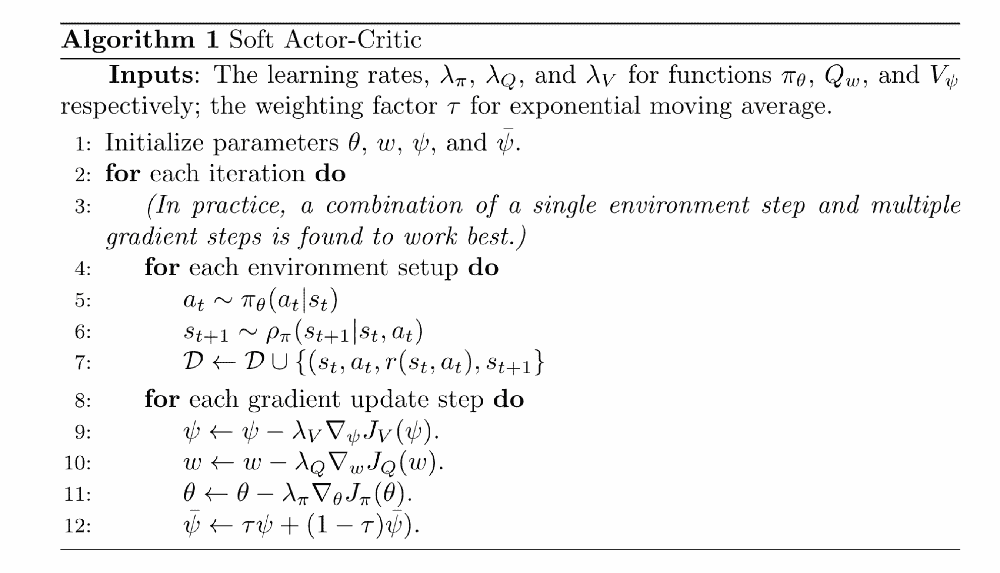

图 8。软演员-评论算法。 (图片来源：[原始论文](https://arxiv.org/abs/1801.01290))

## 具有自动调整温度的 SAC

[[论文](https://arxiv.org/abs/1812.05905)|[代码](https://github.com/rail-berkeley/softlearning)]

SAC 对于温度参数是脆弱的。不幸的是，调整温度很困难，因为熵在任务之间和训练过程中难以预测地变化，随着策略变得更好。对 SAC 的改进制定了一个受约束的优化问题：在最大化预期回报的同时，策略应满足最小熵约束：

$$ \max_{\pi_0, \dots, \pi_T} \mathbb{E} \Big[ \sum_{t=0}^T r(s_t, a_t)\Big] \text{s.t. } \forall t\text{, } \mathcal{H}(\pi_t) \geq \mathcal{H}_0 $$

其中$\mathcal{H}_0$是预定义的最小策略熵阈值。

预期回报$\mathbb{E} \Big[ \sum_{t=0}^T r(s_t, a_t)\Big]$可以分解为所有时间步的奖励之和。因为时间 t 时的策略$\pi_t$对早期时间步的策略$\pi_{t-1}$没有影响，我们可以向后在时间上不同步骤最大化回报 - 这本质上是**DP**。

$$ \underbrace{\max_{\pi_0} \Big( \mathbb{E}[r(s_0, a_0)]+ \underbrace{\max_{\pi_1} \Big(\mathbb{E}[...] + \underbrace{\max_{\pi_T} \mathbb{E}[r(s_T, a_T)]}_\text{第一次最大化} \Big)}_\text{倒数第二次最大化} \Big)}_\text{最后一次最大化} $$

其中我们考虑$\gamma=1$。

所以我们从最后一个时间步$T$开始优化：

$$ \text{最大化 } \mathbb{E}_{(s_T, a_T) \sim \rho_{\pi}} [ r(s_T, a_T) ] \text{ s.t. } \mathcal{H}(\pi_T) - \mathcal{H}_0 \geq 0 $$

首先，让我们定义以下函数：

$$ \begin{aligned} h(\pi_T) &= \mathcal{H}(\pi_T) - \mathcal{H}_0 = \mathbb{E}_{(s_T, a_T) \sim \rho_{\pi}} [-\log \pi_T(a_T\vert s_T)] - \mathcal{H}_0\\ f(\pi_T) &= \begin{cases} \mathbb{E}_{(s_T, a_T) \sim \rho_{\pi}} [ r(s_T, a_T) ], & \text{如果 }h(\pi_T) \geq 0 \\ -\infty, & \text{否则} \end{cases} \end{aligned} $$

优化变为：

$$ \text{最大化 } f(\pi_T) \text{ s.t. } h(\pi_T) \geq 0 $$

要解决带有不等式约束的最大化优化问题，我们可以构建一个带有拉格朗日乘子（也称为“对偶变量”）$\alpha_T$的[拉格朗日表达式](https://cs.stanford.edu/people/davidknowles/lagrangian_duality.pdf)：

$$ L(\pi_T, \alpha_T) = f(\pi_T) + \alpha_T h(\pi_T) $$

考虑当我们尝试*相对于$\alpha_T$最小化$L(\pi_T, \alpha_T)$*时的情况 - 给定特定值$\pi_T$，

+   如果约束得到满足，$h(\pi_T) \geq 0$，最好我们可以设置$\alpha_T=0$，因为我们无法控制$f(\pi_T)$的值。因此，$L(\pi_T, 0) = f(\pi_T)$。

+   如果约束条件无效，$h(\pi_T) < 0$，我们可以通过令$\alpha_T \to \infty$使$L(\pi_T, \alpha_T) \to -\infty$。因此，$L(\pi_T, \infty) = -\infty = f(\pi_T)$。

无论哪种情况，我们都可以得到以下方程，

$$ f(\pi_T) = \min_{\alpha_T \geq 0} L(\pi_T, \alpha_T) $$

同时，我们希望最大化$f(\pi_T)$，

$$ \max_{\pi_T} f(\pi_T) = \min_{\alpha_T \geq 0} \max_{\pi_T} L(\pi_T, \alpha_T) $$

因此，为了最大化$f(\pi_T)$，对偶问题列如下。请注意，为了确保$\max_{\pi_T} f(\pi_T)$被正确最大化且不会变为$-\infty$，必须满足约束条件。

$$ \begin{aligned} \max_{\pi_T} \mathbb{E}[ r(s_T, a_T) ] &= \max_{\pi_T} f(\pi_T) \\ &= \min_{\alpha_T \geq 0} \max_{\pi_T} L(\pi_T, \alpha_T) \\ &= \min_{\alpha_T \geq 0} \max_{\pi_T} f(\pi_T) + \alpha_T h(\pi_T) \\ &= \min_{\alpha_T \geq 0} \max_{\pi_T} \mathbb{E}_{(s_T, a_T) \sim \rho_{\pi}} [ r(s_T, a_T) ] + \alpha_T ( \mathbb{E}_{(s_T, a_T) \sim \rho_{\pi}} [-\log \pi_T(a_T\vert s_T)] - \mathcal{H}_0) \\ &= \min_{\alpha_T \geq 0} \max_{\pi_T} \mathbb{E}_{(s_T, a_T) \sim \rho_{\pi}} [ r(s_T, a_T) - \alpha_T \log \pi_T(a_T\vert s_T)] - \alpha_T \mathcal{H}_0 \\ &= \min_{\alpha_T \geq 0} \max_{\pi_T} \mathbb{E}_{(s_T, a_T) \sim \rho_{\pi}} [ r(s_T, a_T) + \alpha_T \mathcal{H}(\pi_T) - \alpha_T \mathcal{H}_0 ] \end{aligned} $$

我们可以迭代计算最优的$\pi_T$和$\alpha_T$。首先给定当前的$\alpha_T$，得到最大化$L(\pi_T^{*}, \alpha_T)$的最佳策略$\pi_T^{*}$。然后插入$\pi_T^{*}$并计算最小化$L(\pi_T^{*}, \alpha_T)$的$\alpha_T^{*}$。假设我们有一个用于策略的神经网络和一个用于温度参数的网络，迭代更新过程更符合我们在训练过程中更新网络参数的方式。

$$ \begin{aligned} \pi^{*}_T &= \arg\max_{\pi_T} \mathbb{E}_{(s_T, a_T) \sim \rho_{\pi}} [ r(s_T, a_T) + \alpha_T \mathcal{H}(\pi_T) - \alpha_T \mathcal{H}_0 ] \\ \color{blue}{\alpha^{*}_T} &\color{blue}{=} \color{blue}{\arg\min_{\alpha_T \geq 0} \mathbb{E}_{(s_T, a_T) \sim \rho_{\pi^{*}}} [\alpha_T \mathcal{H}(\pi^{*}_T) - \alpha_T \mathcal{H}_0 ]} \end{aligned} $$$$ \text{因此，}\max_{\pi_T} \mathbb{E} [ r(s_T, a_T) ] = \mathbb{E}_{(s_T, a_T) \sim \rho_{\pi^{*}}} [ r(s_T, a_T) + \alpha^{*}_T \mathcal{H}(\pi^{*}_T) - \alpha^{*}_T \mathcal{H}_0 ] $$

现在让我们回到软 Q 值函数：

$$ \begin{aligned} Q_{T-1}(s_{T-1}, a_{T-1}) &= r(s_{T-1}, a_{T-1}) + \mathbb{E} [Q(s_T, a_T) - \alpha_T \log \pi(a_T \vert s_T)] \\ &= r(s_{T-1}, a_{T-1}) + \mathbb{E} [r(s_T, a_T)] + \alpha_T \mathcal{H}(\pi_T) \\ Q_{T-1}^{*}(s_{T-1}, a_{T-1}) &= r(s_{T-1}, a_{T-1}) + \max_{\pi_T} \mathbb{E} [r(s_T, a_T)] + \alpha_T \mathcal{H}(\pi^{*}_T) & \text{; plug in the optimal }\pi_T^{*} \end{aligned} $$

因此，当我们进一步回到时间步$T-1$时，预期回报如下：

$$ \begin{aligned} &\max_{\pi_{T-1}}\Big(\mathbb{E}[r(s_{T-1}, a_{T-1})] + \max_{\pi_T} \mathbb{E}[r(s_T, a_T] \Big) \\ &= \max_{\pi_{T-1}} \Big( Q^{*}_{T-1}(s_{T-1}, a_{T-1}) - \alpha^{*}_T \mathcal{H}(\pi^{*}_T) \Big) & \text{; 应满足条件 } \mathcal{H}(\pi_{T-1}) - \mathcal{H}_0 \geq 0 \\ &= \min_{\alpha_{T-1} \geq 0} \max_{\pi_{T-1}} \Big( Q^{*}_{T-1}(s_{T-1}, a_{T-1}) - \alpha^{*}_T \mathcal{H}(\pi^{*}_T) + \alpha_{T-1} \big( \mathcal{H}(\pi_{T-1}) - \mathcal{H}_0 \big) \Big) & \text{; 拉格朗日对偶问题。} \\ &= \min_{\alpha_{T-1} \geq 0} \max_{\pi_{T-1}} \Big( Q^{*}_{T-1}(s_{T-1}, a_{T-1}) + \alpha_{T-1} \mathcal{H}(\pi_{T-1}) - \alpha_{T-1}\mathcal{H}_0 \Big) - \alpha^{*}_T \mathcal{H}(\pi^{*}_T) \end{aligned} $$

与前一步骤类似，

$$ \begin{aligned} \pi^{*}_{T-1} &= \arg\max_{\pi_{T-1}} \mathbb{E}_{(s_{T-1}, a_{T-1}) \sim \rho_\pi} [Q^{*}_{T-1}(s_{T-1}, a_{T-1}) + \alpha_{T-1} \mathcal{H}(\pi_{T-1}) - \alpha_{T-1} \mathcal{H}_0 ] \\ \color{green}{\alpha^{*}_{T-1}} &\color{green}{=} \color{green}{\arg\min_{\alpha_{T-1} \geq 0} \mathbb{E}_{(s_{T-1}, a_{T-1}) \sim \rho_{\pi^{*}}} [ \alpha_{T-1} \mathcal{H}(\pi^{*}_{T-1}) - \alpha_{T-1}\mathcal{H}_0 ]} \end{aligned} $$

绿色中更新$\alpha_{T-1}$的方程与上面蓝色中更新$\alpha_{T-1}$的方程具有相同的格式。通过重复这个过程，我们可以通过最小化相同的目标函数在每一步学习最优温度参数：

$$ J(\alpha) = \mathbb{E}_{a_t \sim \pi_t} [-\alpha \log \pi_t(a_t \mid s_t) - \alpha \mathcal{H}_0] $$

最终算法与 SAC 相同，唯一不同之处在于明确学习$\alpha$以满足目标$J(\alpha)$（见图 7）：


图 9. 具有自动调整温度的软演员-评论家算法。（图片来源：[原始论文](https://arxiv.org/abs/1812.05905)）

## TD3

[[论文](https://arxiv.org/abs/1802.09477)|[代码](https://github.com/sfujim/TD3)]

Q 学习算法通常被认为存在值函数的过度估计问题。这种过度估计会在训练迭代中传播，并对策略产生负面影响。这一特性直接促使了[双 Q 学习](https://papers.nips.cc/paper/3964-double-q-learning)和[双 DQN](https://arxiv.org/abs/1509.06461)的提出：通过使用两个值网络，将动作选择和 Q 值更新解耦。

**双延迟深度确定性**（简称**TD3**；[Fujimoto 等人，2018](https://arxiv.org/abs/1802.09477)）在 DDPG 上应用了一些技巧，以防止值函数的过度估计：

(1) **剪切双 Q 学习**：在双 Q 学习中，动作选择和 Q 值估计分别由两个网络完成。在 DDPG 设置中，给定两个确定性演员$(\mu_{\theta_1}, \mu_{\theta_2})$和两个对应的评论家$(Q_{w_1}, Q_{w_2})$，双 Q 学习的贝尔曼目标如下：

$$ \begin{aligned} y_1 &= r + \gamma Q_{w_2}(s', \mu_{\theta_1}(s'))\\ y_2 &= r + \gamma Q_{w_1}(s', \mu_{\theta_2}(s')) \end{aligned} $$

然而，由于策略变化缓慢，这两个网络可能太相似以至于无法做出独立决策。*剪切双 Q 学习*使用两者中的最小估计，以偏向难以通过训练传播的低估偏差：

$$ \begin{aligned} y_1 &= r + \gamma \min_{i=1,2}Q_{w_i}(s', \mu_{\theta_1}(s'))\\ y_2 &= r + \gamma \min_{i=1,2} Q_{w_i}(s', \mu_{\theta_2}(s')) \end{aligned} $$

(2) **延迟更新目标和策略网络**：在[演员-评论家](https://lilianweng.github.io/posts/2018-02-19-rl-overview/#actor-critic)模型中，策略和值的更新是深度耦合的：当策略较差时，值估计通过过度估计而发散，如果值估计本身不准确，策略也会变差。

为了减少方差，TD3 以比 Q 函数更低的频率更新策略。策略网络保持不变，直到经过几次更新后值误差足够小。这个想法类似于[DQN](https://lilianweng.github.io/posts/2018-02-19-rl-overview/#dqn)中定期更新的目标网络保持稳定的目标。

(3) **目标策略平滑**：考虑到确定性策略可能会过度拟合值函数中的窄峰，TD3 引入了对值函数的平滑正则化策略：向所选动作添加一小部分剪切的随机噪声，并在小批量上进行平均。

$$ \begin{aligned} y &= r + \gamma Q_w (s', \mu_{\theta}(s') + \epsilon) & \\ \epsilon &\sim \text{clip}(\mathcal{N}(0, \sigma), -c, +c) & \scriptstyle{\text{ ; 剪切的随机噪声。}} \end{aligned} $$

这种方法模仿了[SARSA](https://lilianweng.github.io/posts/2018-02-19-rl-overview/#sarsa-on-policy-td-control)更新的思想，并强调相似的动作应该具有相似的值。

这是最终的算法：

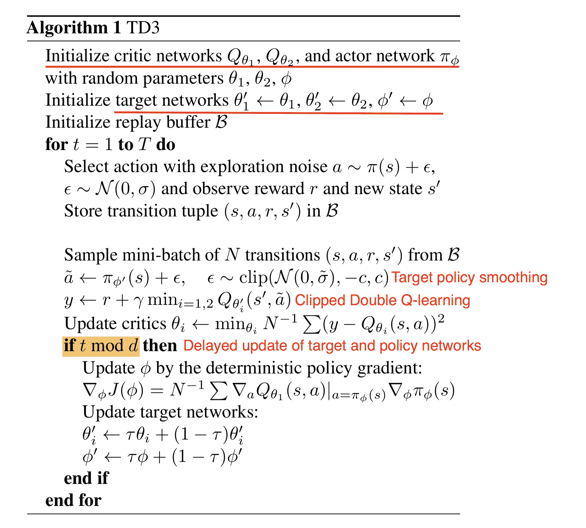

图 10\. TD3 算法。 (图片来源: [Fujimoto et al., 2018](https://arxiv.org/abs/1802.09477))

## SVPG

[[论文](https://arxiv.org/abs/1704.02399)|[代码](https://github.com/dilinwang820/Stein-Variational-Gradient-Descent) for SVPG]

Stein 变分策略梯度（**SVPG**；[Liu et al, 2017](https://arxiv.org/abs/1704.02399)）应用[Stein](https://www.cs.dartmouth.edu/~qliu/stein.html)变分梯度下降（**SVGD**；[Liu and Wang, 2016](https://arxiv.org/abs/1608.04471)）算法来更新策略参数$\theta$。

在最大熵策略优化设置中，$\theta$被视为随机变量$\theta \sim q(\theta)$，模型应该学习这个分布$q(\theta)$。假设我们知道关于$q$可能的先验$q_0$，我们希望通过优化以下目标函数来引导学习过程，使$\theta$不要离$q_0$太远：

$$ \hat{J}(\theta) = \mathbb{E}_{\theta \sim q} [J(\theta)] - \alpha D_\text{KL}(q\|q_0) $$

其中 $\mathbb{E}_{\theta \sim q} [R(\theta)]$ 是当 $\theta \sim q(\theta)$ 时的期望奖励，$D_\text{KL}$ 是 KL 散度。

如果我们没有任何先验信息，可以将 $q_0$ 设置为均匀分布，并将 $q_0(\theta)$ 设置为一个常数。 然后上述目标函数变为 SAC，其中熵项鼓励探索：

$$ \begin{aligned} \hat{J}(\theta) &= \mathbb{E}_{\theta \sim q} [J(\theta)] - \alpha D_\text{KL}(q\|q_0) \\ &= \mathbb{E}_{\theta \sim q} [J(\theta)] - \alpha \mathbb{E}_{\theta \sim q} [\log q(\theta) - \log q_0(\theta)] \\ &= \mathbb{E}_{\theta \sim q} [J(\theta)] + \alpha H(q(\theta)) \end{aligned} $$

让我们对 $\hat{J}(\theta) = \mathbb{E}_{\theta \sim q} [J(\theta)] - \alpha D_\text{KL}(q|q_0)$ 关于 $q$ 求导：

$$ \begin{aligned} \nabla_q \hat{J}(\theta) &= \nabla_q \big( \mathbb{E}_{\theta \sim q} [J(\theta)] - \alpha D_\text{KL}(q\|q_0) \big) \\ &= \nabla_q \int_\theta \big( q(\theta) J(\theta) - \alpha q(\theta)\log q(\theta) + \alpha q(\theta) \log q_0(\theta) \big) \\ &= \int_\theta \big( J(\theta) - \alpha \log q(\theta) -\alpha + \alpha \log q_0(\theta) \big) \\ &= 0 \end{aligned} $$

最优分布是：

$$ \log q^{*}(\theta) = \frac{1}{\alpha} J(\theta) + \log q_0(\theta) - 1 \text{ 因此 } \underbrace{ q^{*}(\theta) }_\textrm{"后验"} \propto \underbrace{\exp ( J(\theta) / \alpha )}_\textrm{"似然"} \underbrace{q_0(\theta)}_\textrm{先验} $$

温度 $\alpha$ 决定了开发和探索之间的权衡。 当 $\alpha \rightarrow 0$ 时，$\theta$ 只根据预期回报 $J(\theta)$ 进行更新。 当 $\alpha \rightarrow \infty$ 时，$\theta$ 总是遵循先验信念。

当使用 SVGD 方法估计目标后验分布 $q(\theta)$ 时，它依赖于一组粒子 $\{\theta_i\}_{i=1}^n$（独立训练的策略代理），每个粒子都会更新：

$$ \theta_i \gets \theta_i + \epsilon \phi^{*}(\theta_i) \text{ 其中 } \phi^{*} = \max_{\phi \in \mathcal{H}} \{ - \nabla_\epsilon D_\text{KL} (q'_{[\theta + \epsilon \phi(\theta)]} \| q) \text{ s.t. } \|\phi\|_{\mathcal{H}} \leq 1\} $$

其中 $\epsilon$ 是学习率，$\phi^{*}$ 是 $\theta$-形状值向量的 [RKHS](http://mlss.tuebingen.mpg.de/2015/slides/gretton/part_1.pdf)（再生核希尔伯特空间）$\mathcal{H}$ 的单位球，最大程度地减少粒子与目标分布之间的 KL 散度。 $q’(.)$ 是 $\theta + \epsilon \phi(\theta)$ 的分布。

比较不同基于梯度的更新方法：

| 方法 | 更新空间 |
| --- | --- |
| 普通梯度 | 参数空间上的 $\Delta \theta$ |
| [自然梯度](https://lilianweng.github.io/posts/2019-09-05-evolution-strategies/#natural-gradients) | 在搜索分布空间上的 $\Delta \theta$ |
| SVGD | 在核函数空间上的 $\Delta \theta$（已编辑） |

$\phi^{*}$ 的一个[估计](https://arxiv.org/abs/1608.04471)具有以下形式。一个正定核 $k(\vartheta, \theta)$，即高斯[径向基函数](https://en.wikipedia.org/wiki/Radial_basis_function)，衡量粒子之间的相似性。

$$ \begin{aligned} \phi^{*}(\theta_i) &= \mathbb{E}_{\vartheta \sim q'} [\nabla_\vartheta \log q(\vartheta) k(\vartheta, \theta_i) + \nabla_\vartheta k(\vartheta, \theta_i)]\\ &= \frac{1}{n} \sum_{j=1}^n [\color{red}{\nabla_{\theta_j} \log q(\theta_j) k(\theta_j, \theta_i)} + \color{green}{\nabla_{\theta_j} k(\theta_j, \theta_i)}] & \scriptstyle{\text{；用当前粒子值近似 }q'} \end{aligned} $$

+   红色的第一项鼓励 $\theta_i$ 朝着 $q$ 的高概率区域学习，这些区域在相似粒子之间共享。 => 与其他粒子相似

+   绿色的第二项将粒子推开，从而使策略多样化。 => 与其他粒子不同

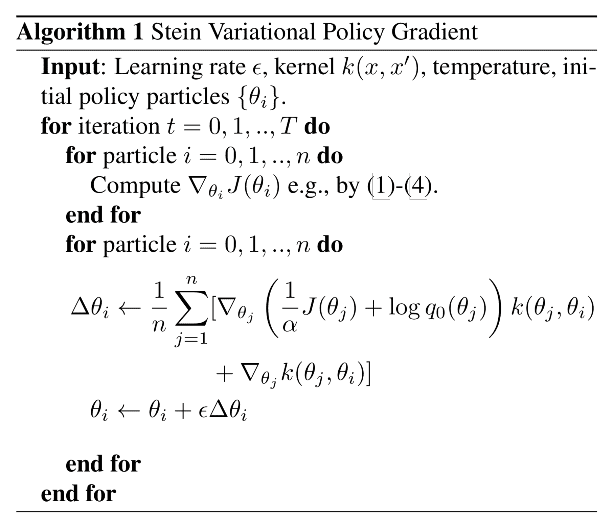

通常温度 $\alpha$ 遵循一个退火方案，以便训练过程在开始时进行更多的探索，但在后期进行更多的利用。

## IMPALA

[[论文](https://arxiv.org/abs/1802.01561)|[代码](https://github.com/deepmind/scalable_agent)]

为了将强化学习训练扩展到实现非常高的吞吐量，**IMPALA**（“重要性加权演员-学习者架构”）框架在基本的演员-评论家设置之上解耦了行为和学习，并通过**V-trace**离线校正从所有经验轨迹中学习。

多个演员并行生成经验，而学习者使用所有生成的经验优化策略和价值函数参数。演员定期使用学习者的最新策略更新其参数。由于行为和学习是解耦的，我们可以添加更多的演员机器以生成更多的轨迹。由于训练策略和行为策略并不完全同步，它们之间存在*差距*，因此我们需要离线校正。

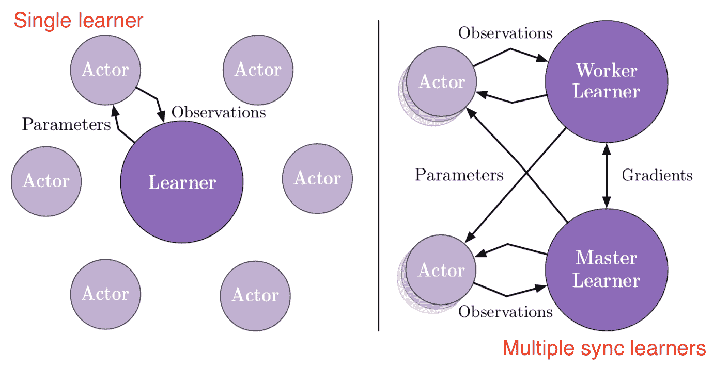

让价值函数 $V_\theta$ 由 $\theta$ 参数化，策略 $\pi_\phi$ 由 $\phi$ 参数化。我们也知道重放缓冲区中的轨迹是由稍旧的策略 $\mu$ 收集的。

在训练时间 $t$，给定 $(s_t, a_t, s_{t+1}, r_t)$，通过当前值和 V-trace 值目标之间的 L2 损失来学习价值函数参数 $\theta$。$n$ 步 V-trace 目标定义为：

$$ \begin{aligned} v_t &= V_\theta(s_t) + \sum_{i=t}^{t+n-1} \gamma^{i-t} \big(\prod_{j=t}^{i-1} c_j\big) \color{red}{\delta_i V} \\ &= V_\theta(s_t) + \sum_{i=t}^{t+n-1} \gamma^{i-t} \big(\prod_{j=t}^{i-1} c_j\big) \color{red}{\rho_i (r_i + \gamma V_\theta(s_{i+1}) - V_\theta(s_i))} \end{aligned} $$

其中红色部分 $\delta_i V$ 是 $V$ 的时间差。$\rho_i = \min\big(\bar{\rho}, \frac{\pi(a_i \vert s_i)}{\mu(a_i \vert s_i)}\big)$ 和 $c_j = \min\big(\bar{c}, \frac{\pi(a_j \vert s_j)}{\mu(a_j \vert s_j)}\big)$ 是*截断的重要性采样（IS）权重*。$c_t, \dots, c_{i-1}$ 的乘积衡量了时间 $i$ 观察到的时间差 $\delta_i V$ 对先前时间 $t$ 的值函数更新的影响。在 on-policy 情况下，我们有 $\rho_i=1$ 和 $c_j=1$（假设 $\bar{c} \geq 1$），因此 V-trace 目标变为 on-policy $n$-step Bellman 目标。

$\bar{\rho}$ 和 $\bar{c}$ 是两个截断常数，其中 $\bar{\rho} \geq \bar{c}$。$\bar{\rho}$ 影响我们收敛到的值函数的固定点，$\bar{c}$ 影响收敛的速度。当 $\bar{\rho} =\infty$（未截断）时，我们收敛到目标策略的值函数 $V^\pi$；当 $\bar{\rho}$ 接近 0 时，我们评估行为策略的值函数 $V^\mu$；当介于两者之间时，我们评估介于 $\pi$ 和 $\mu$ 之间的策略。

因此，值函数参数在以下方向上进行更新：

$$ \Delta\theta = (v_t - V_\theta(s_t))\nabla_\theta V_\theta(s_t) $$

策略参数 $\phi$ 通过策略梯度进行更新，

$$ \begin{aligned} \Delta \phi &= \rho_t \nabla_\phi \log \pi_\phi(a_t \vert s_t) \big(r_t + \gamma v_{t+1} - V_\theta(s_t)\big) + \nabla_\phi H(\pi_\phi)\\ &= \rho_t \nabla_\phi \log \pi_\phi(a_t \vert s_t) \big(r_t + \gamma v_{t+1} - V_\theta(s_t)\big) - \nabla_\phi \sum_a \pi_\phi(a\vert s_t)\log \pi_\phi(a\vert s_t) \end{aligned} $$

其中 $r_t + \gamma v_{t+1}$ 是估计的 Q 值，从中减去了状态相关的基线 $V_\theta(s_t)$。$H(\pi_\phi)$ 是一个熵奖励，以鼓励探索。

在实验中，IMPALA 用于训练一个代理在多个任务上。涉及两种不同的模型架构，一个浅层模型（左）和一个深度残差模型（右）。

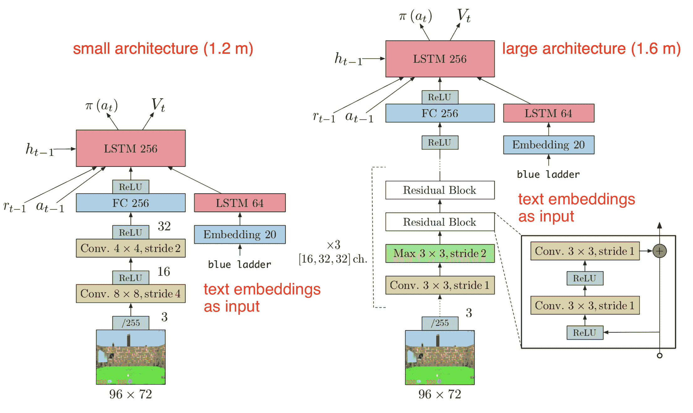

# 快速总结

阅读完上述所有算法后，我列出了一些似乎在它们之间共同的构建块或原则：

+   尝试减少方差并保持偏差不变以稳定学习。

+   Off-policy 让我们更好地探索并更有效地使用数据样本。

+   经验回放（从回放内存缓冲区中采样的训练数据）；

+   目标网络定期冻结或更新速度比主动学习的策略网络慢；

+   批量归一化；

+   熵正则化奖励；

+   评论家和演员可以共享网络的较低层参数和用于策略和值函数的两个输出头。

+   可以使用确定性策略而不是随机策略进行学习。

+   对策略更新之间的发散施加约束。

+   新的优化方法（如 K-FAC）。

+   策略的熵最大化有助于鼓励探索。

+   不要高估价值函数的价值。

+   三思是否策略和价值网络应该共享参数。

+   待定更多。

* * *

引用为：

```py
@article{weng2018PG,
  title   = "Policy Gradient Algorithms",
  author  = "Weng, Lilian",
  journal = "lilianweng.github.io",
  year    = "2018",
  url     = "https://lilianweng.github.io/posts/2018-04-08-policy-gradient/"
} 
```

# 参考文献

[1] jeremykun.com [马尔可夫链蒙特卡洛，不带废话](https://jeremykun.com/2015/04/06/markov-chain-monte-carlo-without-all-the-bullshit/)

[2] Richard S. Sutton 和 Andrew G. Barto。[强化学习：介绍第二版](http://incompleteideas.net/book/bookdraft2017nov5.pdf)。2017 年。

[3] John Schulman 等人。[“使用广义优势估计进行高维连续控制。”](https://arxiv.org/pdf/1506.02438.pdf) ICLR 2016。

[4] Thomas Degris，Martha White 和 Richard S. Sutton。[“离线演员评论家。”](https://arxiv.org/pdf/1205.4839.pdf) ICML 2012。

[5] timvieira.github.io [重要性采样](http://timvieira.github.io/blog/post/2014/12/21/importance-sampling/)

[6] Mnih，Volodymyr 等人。[“深度强化学习的异步方法。”](https://arxiv.org/abs/1602.01783) ICML。2016 年。

[7] David Silver 等人。[“确定性策略梯度算法。”](https://hal.inria.fr/file/index/docid/938992/filename/dpg-icml2014.pdf) ICML。2014 年。

[8] Timothy P. Lillicrap 等人。[“深度强化学习的连续控制。”](https://arxiv.org/pdf/1509.02971.pdf) arXiv 预印本 arXiv:1509.02971（2015 年）。

[9] Ryan Lowe 等人。[“混合合作竞争环境的多智能体演员-评论家。”](https://arxiv.org/pdf/1706.02275.pdf) NIPS。2017 年。

[10] John Schulman 等人。[“信任区域策略优化。”](https://arxiv.org/pdf/1502.05477.pdf) ICML。2015 年。

[11] Ziyu Wang 等人。[“具有经验重播的样本高效演员-评论家。”](https://arxiv.org/pdf/1611.01224.pdf) ICLR 2017。

[12] Rémi Munos，Tom Stepleton，Anna Harutyunyan 和 Marc Bellemare。[“安全高效的离线策略强化学习”](http://papers.nips.cc/paper/6538-safe-and-efficient-off-policy-reinforcement-learning.pdf) NIPS。2016 年。

[13] Yuhuai Wu 等人。[“使用 Kronecker 因子化逼近的可扩展信任区域方法进行深度强化学习。”](https://arxiv.org/pdf/1708.05144.pdf) NIPS。2017 年。

[14] kvfrans.com [自然梯度下降的直观解释](http://kvfrans.com/a-intuitive-explanation-of-natural-gradient-descent/)

[15] Sham Kakade。[“自然策略梯度。”](https://papers.nips.cc/paper/2073-a-natural-policy-gradient.pdf) NIPS。2002 年。

[16] [“深入探讨强化学习：策略梯度基础。”](https://danieltakeshi.github.io/2017/03/28/going-deeper-into-reinforcement-learning-fundamentals-of-policy-gradients/) - Seita’s Place，2017 年 3 月。

[17] [“关于广义优势估计论文的笔记。”](https://danieltakeshi.github.io/2017/04/02/notes-on-the-generalized-advantage-estimation-paper/) - Seita’s Place，2017 年 4 月。

[18] Gabriel Barth-Maron 等人。[“分布式分布式确定性策略梯度。”](https://arxiv.org/pdf/1804.08617.pdf) ICLR 2018 海报。

[19] 图马斯·哈尔诺亚，奥里克·周，皮特·阿贝尔和谢尔盖·莱文。[“软演员-评论：离线最大熵深度强化学习与随机演员。”](https://arxiv.org/pdf/1801.01290.pdf) arXiv 预印本 arXiv:1801.01290 (2018)。

[20] 斯科特·藤本，赫克·范·胡夫和戴夫·梅格尔。[“解决演员-评论方法中的函数逼近误差。”](https://arxiv.org/abs/1802.09477) arXiv 预印本 arXiv:1802.09477 (2018)。

[21] 图马斯·哈尔诺亚等人。[“软演员-评论算法及应用。”](https://arxiv.org/abs/1812.05905) arXiv 预印本 arXiv:1812.05905 (2018)。

[22] 大卫·诺尔斯。[“哑巴的拉格朗日对偶”](https://cs.stanford.edu/people/davidknowles/lagrangian_duality.pdf) 2010 年 11 月 13 日。

[23] 杨柳等人。[“斯坦变分策略梯度。”](https://arxiv.org/abs/1704.02399) arXiv 预印本 arXiv:1704.02399 (2017)。

[24] 刘强和王迪林。[“斯坦变分梯度下降：一种通用的贝叶斯推断算法。”](https://papers.nips.cc/paper/6338-stein-variational-gradient-descent-a-general-purpose-bayesian-inference-algorithm.pdf) NIPS。2016 年。

[25] 拉斯·埃斯佩霍特等人。[“IMPALA：具有重要性加权演员-学习者架构的可扩展分布式深度强化学习”](https://arxiv.org/abs/1802.01561) arXiv 预印本 1802.01561 (2018)。

[26] 卡尔·科比等人。[“阶段性策略梯度。”](https://arxiv.org/abs/2009.04416) arXiv 预印本 arXiv:2009.04416 (2020)。

[27] 許青芸等人。[“重新审视近端策略优化中的设计选择。”](https://arxiv.org/abs/2009.10897) arXiv 预印本 arXiv:2009.10897 (2020)。
