# 一个（长篇）深入了解强化学习

> 原文：[`lilianweng.github.io/posts/2018-02-19-rl-overview/`](https://lilianweng.github.io/posts/2018-02-19-rl-overview/)

更新于 2020-09-03：更新了[SARSA 和 Q-learning 的算法，使差异更加明显。

[更新于 2021-09-19：感谢爱吃猫的鱼，我们在[中文](https://paperexplained.cn/articles/article/detail/33/)上有这篇文章]。

人工智能（AI）领域发生了一些令人兴奋的新闻。AlphaGo 在围棋比赛中击败了最优秀的职业人类选手。很快，扩展算法 AlphaGo Zero 在没有人类知识的监督学习下以 100-0 击败了 AlphaGo。顶级职业游戏玩家在 OpenAI 开发的 DOTA2 1v1 比赛中输给了机器人。在了解这些之后，很难不对这些算法背后的魔力感到好奇 — 强化学习（RL）。我写这篇文章是为了简要介绍这个领域。我们将首先介绍几个基本概念，然后深入探讨解决 RL 问题的经典方法。希望这篇文章能成为新手的一个良好起点，为未来研究前沿铺平道路。

# 什么是强化学习？

假设我们有一个在未知环境中的代理，这个代理可以通过与环境互动获得一些奖励。代理应该采取行动以最大化累积奖励。在现实中，情景可能是一个机器人玩游戏以获得高分，或者一个机器人试图用物理物品完成物理任务；不仅限于这些。

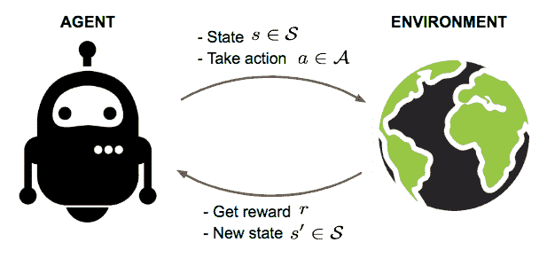

图 1. 代理与环境互动，试图采取聪明的行动以最大化累积奖励。

强化学习（RL）的目标是从实验性试验和相对简单的反馈中学习代理的良好策略。通过最佳策略，代理能够积极适应环境以最大化未来的奖励。

## 关键概念

现在让我们正式定义强化学习中的一组关键概念。

代理在一个**环境**中行动。环境对某些行动的反应是由一个**模型**定义的，我们可能知道也可能不知道。代理可以停留在环境的许多**状态**（$s \in \mathcal{S}$）中的一个，并选择采取许多**动作**（$a \in \mathcal{A}$）以从一个状态转换到另一个状态。代理将到达哪个状态由状态之间的转移概率（$P$）决定。一旦采取行动，环境会提供一个**奖励**（$r \in \mathcal{R}$）作为反馈。

模型定义了奖励函数和转移概率。我们可能知道也可能不知道模型是如何工作的，这区分了两种情况：

+   **了解模型**：使用完美信息进行规划；进行基于模型的强化学习。当我们完全了解环境时，我们可以通过[动态规划](https://en.wikipedia.org/wiki/Dynamic_programming)（DP）找到最优解。你还记得你的算法 101 课程中的“最长递增子序列”或“旅行推销员问题”吗？哈哈。尽管这不是本文的重点。

+   **不了解模型**：在学习过程中缺乏信息；进行无模型强化学习或尝试明确学习模型作为算法的一部分。以下大部分内容适用于模型未知的情况。

代理的**策略**$\pi(s)$提供了在某个状态下采取最优动作的指导，**目标是最大化总奖励**。每个状态都与一个**值**函数$V(s)$相关联，预测我们通过执行相应策略在该状态中能够获得的未来奖励的期望量。换句话说，值函数量化了一个状态有多好。在强化学习中，我们试图学习策略和值函数。

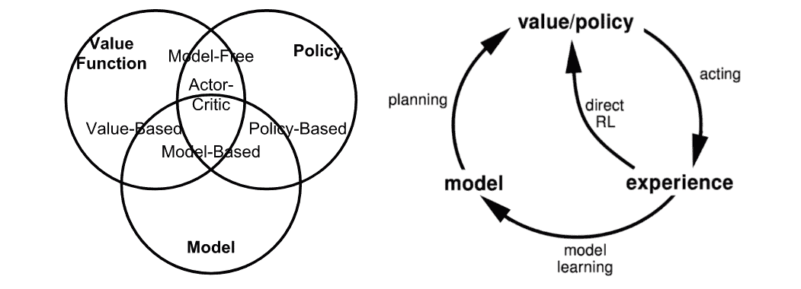

图 2。基于我们是否想对价值、策略或环境进行建模的强化学习方法总结。（图片来源：摘自 David Silver 的强化学习课程[第 1 讲](https://youtu.be/2pWv7GOvuf0)。）

代理和环境之间的交互涉及时间$t=1, 2, \dots, T$中的一系列动作和观察到的奖励。在这个过程中，代理积累关于环境的知识，学习最优策略，并决定下一步应该采取哪个动作，以有效地学习最佳策略。让我们将时间步骤 t 处的状态、动作和奖励标记为$S_t$、$A_t$和$R_t$。因此，交互序列完全由一个**剧集**（也称为“试验”或“轨迹”）描述，并且序列在终端状态$S_T$处结束：

$$ S_1, A_1, R_2, S_2, A_2, \dots, S_T $$

当深入研究不同类别的强化学习算法时，你会经常遇到的术语：

+   **基于模型**：依赖于环境的模型；模型可以是已知的，也可以是算法明确学习的。

+   **无模型**：在学习过程中不依赖于模型。

+   **在策略**：使用目标策略的确定性结果或样本来训练算法。

+   **离策略**：训练基于由不同行为策略产生的转换或剧集分布，而不是由目标策略产生的。

### 模型：转换和奖励

模型是环境的描述符。有了模型，我们可以学习或推断环境将如何与代理交互并向其提供反馈。模型有两个主要部分，转换概率函数$P$和奖励函数$R$。

假设当我们处于状态 s 时，我们决定采取动作 a 到达下一个状态 s’并获得奖励 r。这被称为一个**转移**步骤，用元组(s, a, s’, r)表示。

过渡函数 P 记录了在采取动作 a 并获得奖励 r 后从状态 s 过渡到 s’的概率。我们使用$\mathbb{P}$作为“概率”的符号。

$$ P(s', r \vert s, a) = \mathbb{P} [S_{t+1} = s', R_{t+1} = r \vert S_t = s, A_t = a] $$

因此，状态转移函数可以定义为$P(s’, r \vert s, a)$的函数：

$$ P_{ss'}^a = P(s' \vert s, a) = \mathbb{P} [S_{t+1} = s' \vert S_t = s, A_t = a] = \sum_{r \in \mathcal{R}} P(s', r \vert s, a) $$

奖励函数 R 预测由一个动作触发的下一个奖励：

$$ R(s, a) = \mathbb{E} [R_{t+1} \vert S_t = s, A_t = a] = \sum_{r\in\mathcal{R}} r \sum_{s' \in \mathcal{S}} P(s', r \vert s, a) $$

### 策略

策略，作为代理的行为函数$\pi$，告诉我们在状态 s 中应该采取哪个动作。它是从状态 s 到动作 a 的映射，可以是确定性的或随机的：

+   确定性的：$\pi(s) = a$。

+   随机的：$\pi(a \vert s) = \mathbb{P}_\pi [A=a \vert S=s]$。

### 值函数

值函数通过对未来奖励的预测来衡量状态的优劣或状态或动作的奖励性。未来奖励，也称为**回报**，是向前总和的折现奖励。让我们从时间 t 开始计算回报$G_t$：

$$ G_t = R_{t+1} + \gamma R_{t+2} + \dots = \sum_{k=0}^{\infty} \gamma^k R_{t+k+1} $$

折现因子$\gamma \in [0, 1]$惩罚未来的奖励，因为：

+   未来奖励可能具有更高的不确定性；即股票市场。

+   未来奖励不提供即时的好处；即作为人类，我们可能更喜欢今天玩乐，而不是 5 年后 ;).

+   折现提供了数学上的便利；即，我们不需要永远跟踪未来步骤来计算回报。

+   我们不需要担心状态转移图中的无限循环。

**状态值**是在时间 t 处于该状态 s 时的预期回报，$S_t = s$：

$$ V_{\pi}(s) = \mathbb{E}_{\pi}[G_t \vert S_t = s] $$

同样，我们将状态-动作对的**动作值**（“Q 值”；Q 代表“质量”我相信？）定义为：

$$ Q_{\pi}(s, a) = \mathbb{E}_{\pi}[G_t \vert S_t = s, A_t = a] $$

另外，由于我们遵循目标策略$\pi$，我们可以利用可能动作的概率分布和 Q 值来恢复状态值：

$$ V_{\pi}(s) = \sum_{a \in \mathcal{A}} Q_{\pi}(s, a) \pi(a \vert s) $$

动作值和状态值之间的差异是动作**优势**函数（“A 值”）：

$$ A_{\pi}(s, a) = Q_{\pi}(s, a) - V_{\pi}(s) $$

### 最优值和策略

最优值函数产生最大回报：

$$ V_{*}(s) = \max_{\pi} V_{\pi}(s), Q_{*}(s, a) = \max_{\pi} Q_{\pi}(s, a) $$

最优策略实现最优值函数：

$$ \pi_{*} = \arg\max_{\pi} V_{\pi}(s), \pi_{*} = \arg\max_{\pi} Q_{\pi}(s, a) $$

当然，我们有 $V_{\pi_{*}}(s)=V_{*}(s)$ 和 $Q_{\pi_{*}}(s, a) = Q_{*}(s, a)$。

## 马尔可夫决策过程

更正式地说，几乎所有的强化学习问题都可以被定义为**马尔可夫决策过程**（MDPs）。MDP 中的所有状态都具有“马尔可夫”属性，指的是未来只取决于当前状态，而不是历史：

$$ \mathbb{P}[ S_{t+1} \vert S_t ] = \mathbb{P} [S_{t+1} \vert S_1, \dots, S_t] $$

或者换句话说，未来和过去在当前状态的条件下是**条件独立**的，因为当前状态包含了我们决定未来所需的所有统计信息。

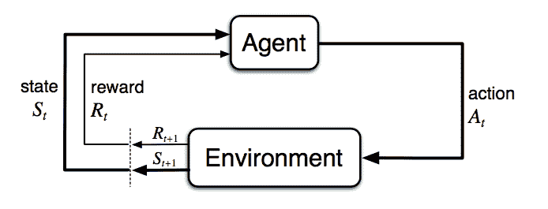

图 3\. 马尔可夫决策过程中的智能体-环境交互。（图片来源：Sec. 3.1 Sutton & Barto (2017).）

马尔可夫决策过程由五个元素组成 $\mathcal{M} = \langle \mathcal{S}, \mathcal{A}, P, R, \gamma \rangle$，其中符号与前面部分的关键概念具有相同的含义，与强化学习问题设置相吻合：

+   $\mathcal{S}$ - 一组状态;

+   $\mathcal{A}$ - 一组动作;

+   $P$ - 转移概率函数;

+   $R$ - 奖励函数;

+   $\gamma$ - 未来奖励的折现因子。在未知环境中，我们对$P$和$R$没有完美的了解。

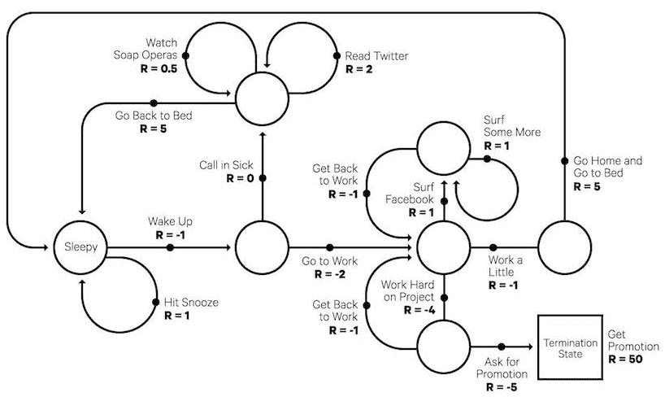

图 4\. 一个马尔可夫决策过程的有趣示例：典型的工作日。（图片来源：[randomant.net/reinforcement-learning-concepts](https://randomant.net/reinforcement-learning-concepts/)）

## 贝尔曼方程

贝尔曼方程指的是一组方程，将值函数分解为即时奖励加上折现未来值。

$$ \begin{aligned} V(s) &= \mathbb{E}[G_t \vert S_t = s] \\ &= \mathbb{E} [R_{t+1} + \gamma R_{t+2} + \gamma² R_{t+3} + \dots \vert S_t = s] \\ &= \mathbb{E} [R_{t+1} + \gamma (R_{t+2} + \gamma R_{t+3} + \dots) \vert S_t = s] \\ &= \mathbb{E} [R_{t+1} + \gamma G_{t+1} \vert S_t = s] \\ &= \mathbb{E} [R_{t+1} + \gamma V(S_{t+1}) \vert S_t = s] \end{aligned} $$

对于 Q 值也是类似的，

$$ \begin{aligned} Q(s, a) &= \mathbb{E} [R_{t+1} + \gamma V(S_{t+1}) \mid S_t = s, A_t = a] \\ &= \mathbb{E} [R_{t+1} + \gamma \mathbb{E}_{a\sim\pi} Q(S_{t+1}, a) \mid S_t = s, A_t = a] \end{aligned} $$

### 贝尔曼期望方程

递归更新过程可以进一步分解为建立在状态值和动作值函数上的方程。随着我们在未来的动作步骤中继续，我们通过遵循策略$\pi$交替扩展 V 和 Q。

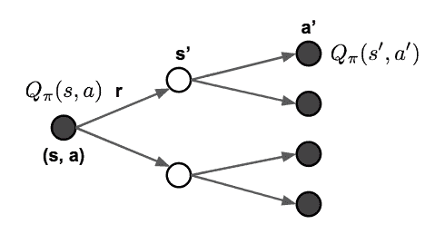

图 5\. 贝尔曼期望方程如何更新状态值和动作值函数的示意图。

$$ \begin{aligned} V_{\pi}(s) &= \sum_{a \in \mathcal{A}} \pi(a \vert s) Q_{\pi}(s, a) \\ Q_{\pi}(s, a) &= R(s, a) + \gamma \sum_{s' \in \mathcal{S}} P_{ss'}^a V_{\pi} (s') \\ V_{\pi}(s) &= \sum_{a \in \mathcal{A}} \pi(a \vert s) \big( R(s, a) + \gamma \sum_{s' \in \mathcal{S}} P_{ss'}^a V_{\pi} (s') \big) \\ Q_{\pi}(s, a) &= R(s, a) + \gamma \sum_{s' \in \mathcal{S}} P_{ss'}^a \sum_{a' \in \mathcal{A}} \pi(a' \vert s') Q_{\pi} (s', a') \end{aligned} $$

### 贝尔曼最优方程

如果我们只对最优值感兴趣，而不是按照策略计算期望值，我们可以直接在替代更新中跳转到最大回报，而不使用策略。回顾：最优值$V_*$和$Q_*$是我们可以获得的最佳回报，定义如下链接。

$$ \begin{aligned} V_*(s) &= \max_{a \in \mathcal{A}} Q_*(s,a)\\ Q_*(s, a) &= R(s, a) + \gamma \sum_{s' \in \mathcal{S}} P_{ss'}^a V_*(s') \\ V_*(s) &= \max_{a \in \mathcal{A}} \big( R(s, a) + \gamma \sum_{s' \in \mathcal{S}} P_{ss'}^a V_*(s') \big) \\ Q_*(s, a) &= R(s, a) + \gamma \sum_{s' \in \mathcal{S}} P_{ss'}^a \max_{a' \in \mathcal{A}} Q_*(s', a') \end{aligned} $$

毫不奇怪，它们看起来与贝尔曼期望方程非常相似。

如果我们对环境的完全信息，这就变成了一个规划问题，可以通过 DP 来解决。不幸的是，在大多数情况下，我们不知道$P_{ss’}^a$或$R(s, a)$，因此我们无法通过直接应用贝尔曼方程来解决 MDP，但它为许多 RL 算法奠定了理论基础。

# 常见方法

现在是时候深入了解解决 RL 问题的主要方法和经典算法了。在未来的帖子中，我计划进一步探讨每种方法。

## 动态规划

当模型完全已知时，根据贝尔曼方程，我们可以使用[动态规划](https://en.wikipedia.org/wiki/Dynamic_programming)（DP）来迭代地评估值函数并改进策略。

### 策略评估

策略评估是为给定策略$\pi$计算状态值$V_\pi$：

$$ V_{t+1}(s) = \mathbb{E}_\pi [r + \gamma V_t(s') | S_t = s] = \sum_a \pi(a \vert s) \sum_{s', r} P(s', r \vert s, a) (r + \gamma V_t(s')) $$

### 策略改进

基于值函数，策略改进通过贪婪地行动生成一个更好的策略$\pi’ \geq \pi$。

$$ Q_\pi(s, a) = \mathbb{E} [R_{t+1} + \gamma V_\pi(S_{t+1}) \vert S_t=s, A_t=a] = \sum_{s', r} P(s', r \vert s, a) (r + \gamma V_\pi(s')) $$

### 策略迭代

*广义策略迭代（GPI）*算法指的是在结合策略评估和改进时改进策略的迭代过程。

$$ \pi_0 \xrightarrow[]{\text{evaluation}} V_{\pi_0} \xrightarrow[]{\text{improve}} \pi_1 \xrightarrow[]{\text{evaluation}} V_{\pi_1} \xrightarrow[]{\text{improve}} \pi_2 \xrightarrow[]{\text{evaluation}} \dots \xrightarrow[]{\text{improve}} \pi_* \xrightarrow[]{\text{evaluation}} V_* $$

在 GPI 中，值函数被重复逼近以接近当前策略的真实值，同时策略被重复改进以接近最优性。这种策略迭代过程有效且总是收敛于最优性，但为什么会这样呢？

假设我们有一个策略 $\pi$，然后通过贪婪地采取行动生成一个改进版本 $\pi'$，$\pi'(s) = \arg\max_{a \in \mathcal{A}} Q_\pi(s, a)$。这个改进的 $\pi'$ 的价值是有保证的更好，因为：

$$ \begin{aligned} Q_\pi(s, \pi'(s)) &= Q_\pi(s, \arg\max_{a \in \mathcal{A}} Q_\pi(s, a)) \\ &= \max_{a \in \mathcal{A}} Q_\pi(s, a) \geq Q_\pi(s, \pi(s)) = V_\pi(s) \end{aligned} $$

## 蒙特卡洛方法

首先，让我们回顾一下 $V(s) = \mathbb{E}[ G_t \vert S_t=s]$。蒙特卡洛（MC）方法使用一个简单的思想：它从原始经验的情节中学习，而不对环境动态进行建模，并将观察到的平均回报作为期望回报的逼近。为了计算经验回报 $G_t$，MC 方法需要从**完整**的情节 $S_1, A_1, R_2, \dots, S_T$ 中学习以计算 $G_t = \sum_{k=0}^{T-t-1} \gamma^k R_{t+k+1}$，并且所有情节最终都必须终止。

状态 s 的经验平均回报为：

$$ V(s) = \frac{\sum_{t=1}^T \mathbb{1}[S_t = s] G_t}{\sum_{t=1}^T \mathbb{1}[S_t = s]} $$

其中 $\mathbb{1}[S_t = s]$ 是一个二元指示函数。我们可以每次计算状态 s 的访问次数，因此在一个情节中可能存在对一个状态的多次访问（“每次访问”），或者只在一个情节中首次遇到状态时计数（“首次访问”）。这种逼近方式可以通过计算（s, a）对来轻松扩展到动作值函数。

$$ Q(s, a) = \frac{\sum_{t=1}^T \mathbb{1}[S_t = s, A_t = a] G_t}{\sum_{t=1}^T \mathbb{1}[S_t = s, A_t = a]} $$

通过 MC 学习最优策略，我们通过遵循类似于 GPI 的思想进行迭代。

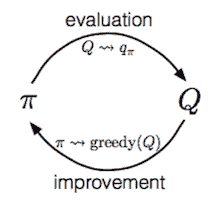

1.  根据当前值函数贪婪地改进策略：$\pi(s) = \arg\max_{a \in \mathcal{A}} Q(s, a)$。

1.  使用新策略 $\pi$ 生成一个新的情节（即使用像[ε-greedy](https://lilianweng.github.io/posts/2018-01-23-multi-armed-bandit/#%CE%B5-greedy-algorithm)这样的算法帮助我们在开发和探索之间取得平衡）。

1.  使用新情节估计 Q：$q_\pi(s, a) = \frac{\sum_{t=1}^T \big( \mathbb{1}[S_t = s, A_t = a] \sum_{k=0}^{T-t-1} \gamma^k R_{t+k+1} \big)}{\sum_{t=1}^T \mathbb{1}[S_t = s, A_t = a]}$

## 时间差分学习

与蒙特卡洛方法类似，时间差分（TD）学习是无模型的，并且从经验情节中学习。然而，TD 学习可以从**不完整**的情节中学习，因此我们不需要追踪情节直至终止。TD 学习如此重要，以至于 Sutton & Barto（2017）在他们的强化学习书中将其描述为“强化学习中一个中心且新颖的想法”。

### 自举

TD 学习方法更新目标是根据现有估计而不是仅依赖于实际奖励和完整回报，这种方法被称为**自举**。

### 价值估计

TD 学习的关键思想是将值函数$V(S_t)$更新为估计的回报$R_{t+1} + \gamma V(S_{t+1})$（称为“**TD 目标**”）。我们希望在多大程度上更新值函数由学习率超参数α控制：

$$ \begin{aligned} V(S_t) &\leftarrow (1- \alpha) V(S_t) + \alpha G_t \\ V(S_t) &\leftarrow V(S_t) + \alpha (G_t - V(S_t)) \\ V(S_t) &\leftarrow V(S_t) + \alpha (R_{t+1} + \gamma V(S_{t+1}) - V(S_t)) \end{aligned} $$

类似地，对于动作值估计：

$$ Q(S_t, A_t) \leftarrow Q(S_t, A_t) + \alpha (R_{t+1} + \gamma Q(S_{t+1}, A_{t+1}) - Q(S_t, A_t)) $$

接下来，让我们深入探讨如何在 TD 学习中学习最优策略（也称为“TD 控制”）。准备好，你将在本节中看到许多经典算法的著名名称。

### SARSA：基于策略的 TD 控制

“SARSA”指的是通过遵循一系列$\dots, S_t, A_t, R_{t+1}, S_{t+1}, A_{t+1}, \dots$来更新 Q 值的过程。这个想法遵循 GPI 的相同路线。在一个回合内，它的工作方式如下：

1.  初始化$t=0$。

1.  从$S_0$开始并选择动作$A_0 = \arg\max_{a \in \mathcal{A}} Q(S_0, a)$，通常应用$\epsilon$-贪心策略。

1.  在时间$t$，应用动作$A_t$后，我们观察奖励$R_{t+1}$并进入下一个状态$S_{t+1}$。

1.  接着以与第 2 步相同的方式选择下一个动作：$A_{t+1} = \arg\max_{a \in \mathcal{A}} Q(S_{t+1}, a)$。

1.  更新 Q 值函数：$ Q(S_t, A_t) \leftarrow Q(S_t, A_t) + \alpha (R_{t+1} + \gamma Q(S_{t+1}, A_{t+1}) - Q(S_t, A_t)) $。

1.  设定$t = t+1$并重复从第 3 步开始。

在 SARSA 的每一步中，我们需要根据当前策略选择*下一个*动作。

### Q 学习：离策略 TD 控制

Q 学习的发展（[Watkins & Dayan, 1992](https://link.springer.com/content/pdf/10.1007/BF00992698.pdf)）是强化学习早期的重大突破。在一个回合内，它的工作方式如下：

1.  初始化$t=0$。

1.  从$S_0$开始。

1.  在时间步$t$，我们根据 Q 值选择动作，$A_t = \arg\max_{a \in \mathcal{A}} Q(S_t, a)$，通常应用$\epsilon$-贪心策略。

1.  在应用动作$A_t$后，我们观察奖励$R_{t+1}$并进入下一个状态$S_{t+1}$。

1.  更新 Q 值函数：$Q(S_t, A_t) \leftarrow Q(S_t, A_t) + \alpha (R_{t+1} + \gamma \max_{a \in \mathcal{A}} Q(S_{t+1}, a) - Q(S_t, A_t))$。

1.  $t = t+1$并重复从第 3 步开始。

与 SARSA 的关键区别在于，Q 学习不遵循当前策略选择第二个动作$A_{t+1}$。它估计$Q^*$超出最佳 Q 值，但导致这个最大 Q 的动作（表示为$a^*$）并不重要，在下一步中 Q 学习可能不会遵循$a^*$。

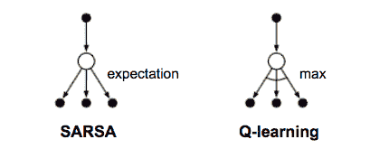

图 6\. Q 学习和 SARSA 的备份图。 （图片来源：基于 Sutton＆Barto（2017）第 6.5 节中的图 6.5 重新绘制）

### 深度 Q 网络

理论上，我们可以在 Q 学习中为所有状态-动作对记忆$Q_*(.)$，就像在一个巨大的表中一样。然而，当状态和动作空间很大时，这很快变得计算上不可行。因此，人们使用函数（即机器学习模型）来近似 Q 值，这被称为**函数逼近**。例如，如果我们使用一个带有参数$\theta$的函数来计算 Q 值，我们可以将 Q 值函数标记为$Q(s, a; \theta)$。

不幸的是，当与非线性 Q 值函数逼近和自举（见问题＃2）结合时，Q 学习可能会遭受不稳定性和发散。

深度 Q 网络（“DQN”；Mnih 等人，2015 年）旨在通过两种创新机制大大改进和稳定 Q 学习的训练过程：

+   **经验重放**：所有的情节步骤$e_t = (S_t, A_t, R_t, S_{t+1})$都存储在一个重放记忆$D_t = \{ e_1, \dots, e_t \}$中。$D_t$包含许多情节的经验元组。在 Q 学习更新期间，从重放记忆中随机抽取样本，因此一个样本可能被多次使用。经验重放提高了数据效率，消除了观察序列中的相关性，并平滑了数据分布的变化。

+   **定期更新目标值**：Q 被优化为仅定期更新的目标值。Q 网络被克隆并保持冻结，作为每 C 步（C 是一个超参数）的优化目标。这种修改使训练更加稳定，因为它克服了短期振荡。

损失函数如下所示：

$$ \mathcal{L}(\theta) = \mathbb{E}_{(s, a, r, s') \sim U(D)} \Big[ \big( r + \gamma \max_{a'} Q(s', a'; \theta^{-}) - Q(s, a; \theta) \big)² \Big] $$

其中$U(D)$是重放记忆 D 上的均匀分布；$\theta^{-}$是冻结目标 Q 网络的参数。

此外，将错误项剪切至[-1, 1]之间也被发现是有帮助的。（我总是对参数剪切有复杂的感觉，因为许多研究表明它在经验上有效，但这使得数学变得不那么美观。:/）

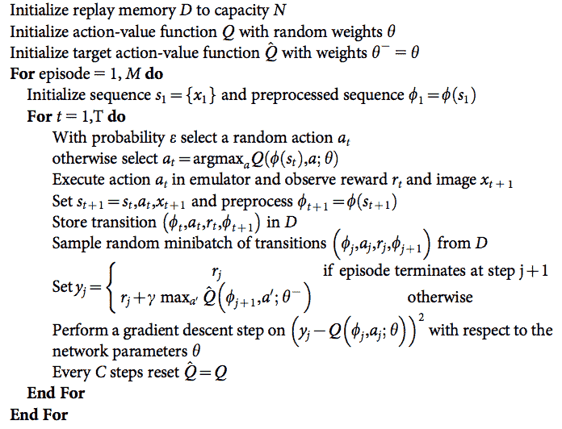

图 7\. 具有经验重放和偶尔冻结优化目标的 DQN 算法。预处理的序列是在 Atari 游戏的输入图像上运行的一些进程的输出。不要太担心它；只需将它们视为输入特征向量。（图片来源：Mnih 等人，2015 年）

有许多 DQN 的扩展来改进原始设计，例如具有 dueling 架构的 DQN（Wang 等人，2016 年），它使用共享网络参数估计状态值函数 V(s)和优势函数 A(s, a)。

## 结合 TD 和 MC 学习

在 TD 学习中关于值估计的前一部分中，当计算 TD 目标时我们只追踪行动链下的一步。可以轻松地将其扩展到多步以估计回报。

让我们将跟随 n 步的估计回报标记为$G_t^{(n)}, n=1, \dots, \infty$，那么：

| $n$ | $G_t$ | 注释 |
| --- | --- | --- |
| $n=1$ | $G_t^{(1)} = R_{t+1} + \gamma V(S_{t+1})$ | TD 学习 |
| $n=2$ | $G_t^{(2)} = R_{t+1} + \gamma R_{t+2} + \gamma² V(S_{t+2})$ |  |
| … |  |  |
| $n=n$ | $ G_t^{(n)} = R_{t+1} + \gamma R_{t+2} + \dots + \gamma^{n-1} R_{t+n} + \gamma^n V(S_{t+n}) $ |  |
| … |  |  |
| $n=\infty$ | $G_t^{(\infty)} = R_{t+1} + \gamma R_{t+2} + \dots + \gamma^{T-t-1} R_T + \gamma^{T-t} V(S_T) $ | MC 估计 |

广义的 n 步 TD 学习仍然具有相同的形式来更新值函数：

$$ V(S_t) \leftarrow V(S_t) + \alpha (G_t^{(n)} - V(S_t)) $$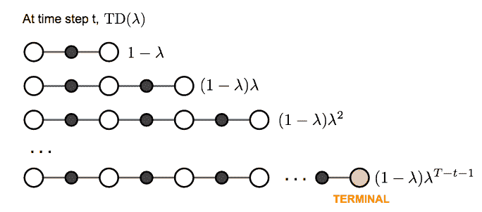

在 TD 学习中，我们可以自由选择任何$n$。现在问题变成了什么是最佳的$n$？哪个$G_t^{(n)}$给出了最佳的回报近似？一个常见但聪明的解决方案是应用所有可能的 n 步 TD 目标的加权和，而不是选择单个最佳的 n。权重随着 n 按照λ的因子衰减，$\lambda^{n-1}$；直觉类似于为什么在计算回报时我们希望折现未来奖励：我们看得越远，我们就越不确定。为了使所有权重（n → ∞）总和为 1，我们将每个权重乘以(1-λ)，因为：

$$ \begin{aligned} \text{let } S &= 1 + \lambda + \lambda² + \dots \\ S &= 1 + \lambda(1 + \lambda + \lambda² + \dots) \\ S &= 1 + \lambda S \\ S &= 1 / (1-\lambda) \end{aligned} $$

这个由许多 n 步回报加权求和得到的λ回报称为λ回报 $G_t^{\lambda} = (1-\lambda) \sum_{n=1}^{\infty} \lambda^{n-1} G_t^{(n)}$。采用λ回报进行值更新的 TD 学习被标记为**TD(λ)**。我们上面介绍的原始版本等同于**TD(0)**。

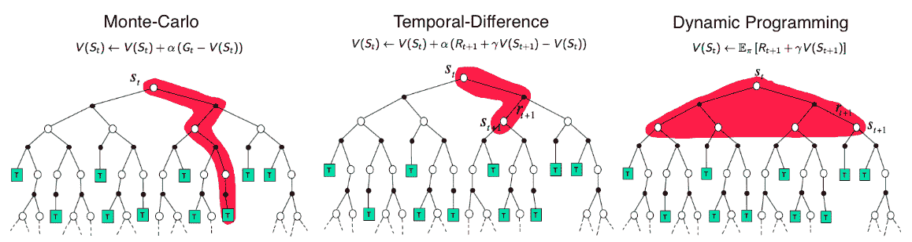

图 8。蒙特卡洛、时序差分学习和动态规划用于状态值函数备份图的比较。（图片来源：David Silver 的强化学习课程[第 4 讲](http://www0.cs.ucl.ac.uk/staff/d.silver/web/Teaching_files/MC-TD.pdf)：“无模型预测”）

## 策略梯度

我们介绍的所有方法的目标都是学习状态/动作值函数，然后相应地选择动作。而策略梯度方法则直接学习策略，使用参数化函数关于 $\theta$，$\pi(a \vert s; \theta)$。让我们将奖励函数（损失函数的相反）定义为 *期望回报*，并训练算法以最大化奖励函数。我的[下一篇文章](https://lilianweng.github.io/posts/2018-04-08-policy-gradient/)描述了为什么策略梯度定理有效（证明）并介绍了一些策略梯度算法。

在离散空间中：

$$ \mathcal{J}(\theta) = V_{\pi_\theta}(S_1) = \mathbb{E}_{\pi_\theta}[V_1] $$

其中 $S_1$ 是初始起始状态。

或者在连续空间中：

$$ \mathcal{J}(\theta) = \sum_{s \in \mathcal{S}} d_{\pi_\theta}(s) V_{\pi_\theta}(s) = \sum_{s \in \mathcal{S}} \Big( d_{\pi_\theta}(s) \sum_{a \in \mathcal{A}} \pi(a \vert s, \theta) Q_\pi(s, a) \Big) $$

其中 $d_{\pi_\theta}(s)$ 是 $\pi_\theta$ 的马尔可夫链的稳态分布。如果您对“稳态分布”的定义不熟悉，请查看这个[参考资料](https://jeremykun.com/2015/04/06/markov-chain-monte-carlo-without-all-the-bullshit/)。

使用 *梯度上升* 我们可以找到产生最高回报的最佳 θ。可以预期基于策略的方法在连续空间中更有用，因为在连续空间中有无限数量的动作和/或状态需要估计值，因此基于值的方法在计算上要昂贵得多。

### 策略梯度定理

通过在第 k 维度中微调 θ 一小部分 ε，可以通过 *数值方法* 计算梯度。即使 $J(\theta)$ 不可微（很好！），但不出所料地非常慢。

$$ \frac{\partial \mathcal{J}(\theta)}{\partial \theta_k} \approx \frac{\mathcal{J}(\theta + \epsilon u_k) - \mathcal{J}(\theta)}{\epsilon} $$

或者 *分析地*，

$$ \mathcal{J}(\theta) = \mathbb{E}_{\pi_\theta} [r] = \sum_{s \in \mathcal{S}} d_{\pi_\theta}(s) \sum_{a \in \mathcal{A}} \pi(a \vert s; \theta) R(s, a) $$

实际上，我们有很好的理论支持（用 $d(.)$ 替换为 $d_\pi(.)$）：

$$ \mathcal{J}(\theta) = \sum_{s \in \mathcal{S}} d_{\pi_\theta}(s) \sum_{a \in \mathcal{A}} \pi(a \vert s; \theta) Q_\pi(s, a) \propto \sum_{s \in \mathcal{S}} d(s) \sum_{a \in \mathcal{A}} \pi(a \vert s; \theta) Q_\pi(s, a) $$

请查看 Sutton & Barto (2017)中的第 13.1 节，了解为什么会这样。

然后，

$$ \begin{aligned} \mathcal{J}(\theta) &= \sum_{s \in \mathcal{S}} d(s) \sum_{a \in \mathcal{A}} \pi(a \vert s; \theta) Q_\pi(s, a) \\ \nabla \mathcal{J}(\theta) &= \sum_{s \in \mathcal{S}} d(s) \sum_{a \in \mathcal{A}} \nabla \pi(a \vert s; \theta) Q_\pi(s, a) \\ &= \sum_{s \in \mathcal{S}} d(s) \sum_{a \in \mathcal{A}} \pi(a \vert s; \theta) \frac{\nabla \pi(a \vert s; \theta)}{\pi(a \vert s; \theta)} Q_\pi(s, a) \\ & = \sum_{s \in \mathcal{S}} d(s) \sum_{a \in \mathcal{A}} \pi(a \vert s; \theta) \nabla \ln \pi(a \vert s; \theta) Q_\pi(s, a) \\ & = \mathbb{E}_{\pi_\theta} [\nabla \ln \pi(a \vert s; \theta) Q_\pi(s, a)] \end{aligned} $$

这个结果被称为“策略梯度定理”，为各种策略梯度算法奠定了理论基础：

$$ \nabla \mathcal{J}(\theta) = \mathbb{E}_{\pi_\theta} [\nabla \ln \pi(a \vert s, \theta) Q_\pi(s, a)] $$

### 强化

强化，也称为蒙特卡洛策略梯度，依赖于 $Q_\pi(s, a)$，通过使用回合样本的 MC 方法估计回报，来更新策略参数 $\theta$。

强化的一个常用变体是从回报 $G_t$ 中减去一个基线值，以减少梯度估计的方差，同时保持偏差不变。例如，一个常见的基线是状态值，如果应用，我们将在梯度上升更新中使用 $A(s, a) = Q(s, a) - V(s)$。

1.  随机初始化 θ

1.  生成一个回合 $S_1, A_1, R_2, S_2, A_2, \dots, S_T$

1.  对于 t=1, 2, … , T：

    1.  估计从时间步 t 开始的回报 G_t。

    1.  $\theta \leftarrow \theta + \alpha \gamma^t G_t \nabla \ln \pi(A_t \vert S_t, \theta)$。

### 演员-评论家

如果值函数除了策略外也被学习，我们将得到演员-评论家算法。

+   **评论家**：更新值函数参数 w，根据算法的不同，可能是动作值 $Q(a \vert s; w)$ 或状态值 $V(s; w)$。

+   **演员**：根据评论家建议的方向更新策略参数 θ，$\pi(a \vert s; \theta)$。

让我们看看它是如何在一个动作值演员-评论家算法中起作用的。

1.  随机初始化 s, θ, w；采样 $a \sim \pi(a \vert s; \theta)$。

1.  对于 t = 1… T：

    1.  采样奖励 $r_t \sim R(s, a)$ 和下一个状态 $s’ \sim P(s’ \vert s, a)$。

    1.  然后采样下一个动作 $a’ \sim \pi(s’, a’; \theta)$。

    1.  更新策略参数：$\theta \leftarrow \theta + \alpha_\theta Q(s, a; w) \nabla_\theta \ln \pi(a \vert s; \theta)$。

    1.  计算时间步 t 的动作值的修正：

        $G_{t:t+1} = r_t + \gamma Q(s’, a’; w) - Q(s, a; w)$

        并用它来更新值函数参数：

        $w \leftarrow w + \alpha_w G_{t:t+1} \nabla_w Q(s, a; w) $。

    1.  更新 $a \leftarrow a’$ 和 $s \leftarrow s’$。

$\alpha_\theta$ 和 $\alpha_w$ 是用于更新策略和值函数参数的两个学习率。

### A3C

**异步优势演员-评论家**（Mnih 等人，2016），简称 A3C，是一种经典的策略梯度方法，特别关注并行训练。

在 A3C 中，评论家学习状态值函数$V(s; w)$，而多个执行者并行训练，并不时与全局参数同步。因此，A3C 默认适用于并行训练，即在具有多核 CPU 的一台机器上。

状态值的损失函数是最小化均方误差，$\mathcal{J}_v (w) = (G_t - V(s; w))²$，我们使用梯度下降找到最优的 w。这个状态值函数被用作策略梯度更新中的基准。

这里是算法概述：

1.  我们有全局参数θ和 w；类似的线程特定参数θ’和 w’。

1.  初始化时间步 t = 1

1.  当 T <= T_MAX 时：

    1.  重置梯度：dθ = 0，dw = 0。

    1.  将线程特定参数与全局参数同步：θ’ = θ，w’ = w。

    1.  $t_\text{start}$ = t 并获取$s_t$。

    1.  当（$s_t \neq \text{TERMINAL}$）且（$t - t_\text{start} <= t_\text{max}$）时：

        1.  选择动作$a_t \sim \pi(a_t \vert s_t; \theta’)$并接收新的奖励$r_t$和新状态$s_{t+1}$。

        1.  更新 t = t + 1 和 T = T + 1。

    1.  初始化保存回报估计的变量$$R = \begin{cases} 0 & \text{if } s_t \text{ is TERMINAL} \ V(s_t; w’) & \text{otherwise} \end{cases}$$。

    1.  对于$i = t-1, \dots, t_\text{start}$：

        1.  $R \leftarrow r_i + \gamma R$；这里 R 是$G_i$的 MC 度量。

        1.  累积关于θ’的梯度：$d\theta \leftarrow d\theta + \nabla_{\theta’} \log \pi(a_i \vert s_i; \theta’)(R - V(s_i; w’))$；

            累积关于 w’的梯度：$dw \leftarrow dw + \nabla_{w’} (R - V(s_i; w’))²$。

    1.  同步更新θ使用 dθ，w 使用 dw。

A3C 实现了多个代理训练中的并行性。梯度累积步骤（6.2）可以被视为基于小批量的随机梯度更新的改进：w 或θ的值在每个训练线程的独立方向上稍微修正。

## 进化策略

[进化策略](https://en.wikipedia.org/wiki/Evolution_strategy)（ES）是一种模型无关的优化方法。它通过模仿达尔文的物种进化理论中的自然选择来学习最优解。应用 ES 的两个前提条件：（1）我们的解决方案可以自由与环境互动，看看它们是否能解决问题；（2）我们能够计算每个解决方案的**适应度**分数。我们不必了解环境配置来解决问题。

假设我们从一群随机解决方案开始。它们都能够与环境互动，只有具有高适应度分数的候选者才能存活（*在有限资源的竞争中，只有最适者才能生存*）。然后通过重新组合高适应度幸存者的设置（*基因突变*）创建新一代。这个过程重复进行，直到新解决方案足够好。

与我们上面介绍的流行的基于 MDP 的方法非常不同，ES 旨在学习策略参数$\theta$而无需值近似。假设参数$\theta$上的分布是均值为$\mu$，固定协方差$\sigma²I$的[各向同性](https://math.stackexchange.com/questions/1991961/gaussian-distribution-is-isotropic)多元高斯分布。计算$F(\theta)$的梯度：

$$ \begin{aligned} & \nabla_\theta \mathbb{E}_{\theta \sim N(\mu, \sigma²)} F(\theta) \\ =& \nabla_\theta \int_\theta F(\theta) \Pr(\theta) && \text{Pr(.)是高斯密度函数。} \\ =& \int_\theta F(\theta) \Pr(\theta) \frac{\nabla_\theta \Pr(\theta)}{\Pr(\theta)} \\ =& \int_\theta F(\theta) \Pr(\theta) \nabla_\theta \log \Pr(\theta) \\ =& \mathbb{E}_{\theta \sim N(\mu, \sigma²)} [F(\theta) \nabla_\theta \log \Pr(\theta)] && \text{类似于我们进行策略梯度更新的方式。} \\ =& \mathbb{E}_{\theta \sim N(\mu, \sigma²)} \Big[ F(\theta) \nabla_\theta \log \Big( \frac{1}{\sqrt{2\pi\sigma²}} e^{-\frac{(\theta - \mu)²}{2 \sigma² }} \Big) \Big] \\ =& \mathbb{E}_{\theta \sim N(\mu, \sigma²)} \Big[ F(\theta) \nabla_\theta \Big( -\log \sqrt{2\pi\sigma²} - \frac{(\theta - \mu)²}{2 \sigma²} \Big) \Big] \\ =& \mathbb{E}_{\theta \sim N(\mu, \sigma²)} \Big[ F(\theta) \frac{\theta - \mu}{\sigma²} \Big] \end{aligned} $$

我们可以用一个“均值”参数$\theta$（与上面的$\theta$不同；这个$\theta$是进一步突变的基因），$\epsilon \sim N(0, I)$，因此$\theta + \epsilon \sigma \sim N(\theta, \sigma²)$。$\epsilon$控制应添加多少高斯噪声以创建突变：

$$ \nabla_\theta \mathbb{E}_{\epsilon \sim N(0, I)} F(\theta + \sigma \epsilon) = \frac{1}{\sigma} \mathbb{E}_{\epsilon \sim N(0, I)} [F(\theta + \sigma \epsilon) \epsilon] $$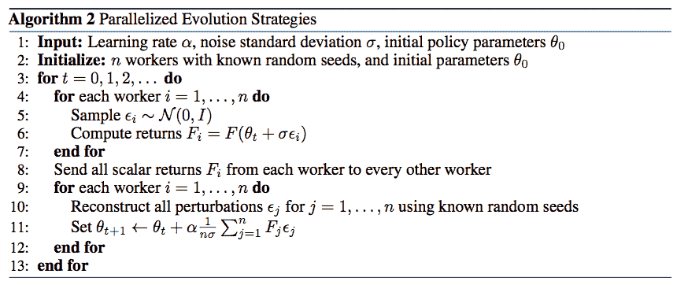

图 9。一个简单的基于并行进化策略的 RL 算法。并行工作者共享随机种子，以便他们可以用极小的通信带宽重建高斯噪声。（图片来源：Salimans 等人，2017 年。）

ES 作为一个黑盒优化算法，是解决 RL 问题的另一种方法（*在我的原始写作中，我使用了“一个不错的替代方案”这个短语；[Seita](https://danieltakeshi.github.io/)指引我到这个[讨论](https://www.reddit.com/r/MachineLearning/comments/6gke6a/d_requesting_openai_to_justify_the_grandiose/dir9wde/)，因此我更新了我的措辞。*）。它具有一些良好的特性（Salimans 等人，2017 年），使其快速且易于训练：

+   ES 不需要值函数近似；

+   ES 不执行梯度反向传播；

+   ES 对延迟或长期奖励不变；

+   ES 高度可并行化，数据通信量很小。

# 已知问题

## 探索-利用困境

探索与利用之间的困境问题已在我之前的[文章](https://lilianweng.github.io/posts/2018-01-23-multi-armed-bandit/#exploitation-vs-exploration)中讨论过。当强化学习问题面对未知环境时，这个问题尤其关键，以找到一个好的解决方案：没有足够的探索，我们无法充分了解环境；没有足够的利用，我们无法完成奖励优化任务。

不同的强化学习算法以不同的方式在探索和利用之间取得平衡。在 MC 方法中，Q-learning 或许多离线策略算法中，探索通常通过[ε-greedy](https://lilianweng.github.io/posts/2018-01-23-multi-armed-bandit/#%CE%B5-greedy-algorithm)算法实现；在 ES 中，探索通过策略参数扰动来捕捉。在开发新的强化学习算法时，请考虑这一点。

## 致命三连问题

我们确实寻求涉及自举的 TD 方法的效率和灵活性。然而，当离线策略、非线性函数逼近和自举结合在一个强化学习算法中时，训练可能会不稳定且难以收敛。这个问题被称为**致命三连**（Sutton & Barto, 2017）。许多使用深度学习模型的架构被提出来解决这个问题，包括使用经验重放和偶尔冻结目标网络来稳定训练的 DQN。

# 案例研究：AlphaGo Zero

围棋游戏[Go](https://en.wikipedia.org/wiki/Go_(game))在人工智能领域几十年来一直是一个极其困难的问题，直到最近几年。AlphaGo 和 AlphaGo Zero 是 DeepMind 团队开发的两个程序。两者都涉及深度卷积神经网络（[CNN](https://lilianweng.github.io/posts/2017-12-15-object-recognition-part-2/#cnn-for-image-classification)）和蒙特卡洛树搜索（MCTS），并且都已被证实达到了职业人类围棋选手的水平。与依赖于专家人类棋步的监督学习的 AlphaGo 不同，AlphaGo Zero 仅使用强化学习和自我对弈，没有超出基本规则的人类知识。

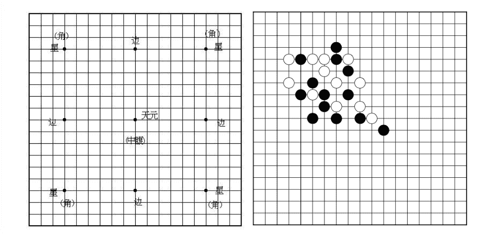

图 10. 围棋棋盘。两名玩家在一个 19 x 19 线的棋盘的空交叉点上交替放置黑白棋子。一组棋子必须至少有一个开放点（一个交叉点，称为“气”)，才能留在棋盘上，并且必须有至少两个或更多封闭的气（称为“眼”）才能保持“活着”。没有棋子可以重复之前的位置。

通过以上所有强化学习的知识，让我们看看 AlphaGo Zero 是如何工作的。主要组件是一个深度[CNN](https://lilianweng.github.io/posts/2017-12-15-object-recognition-part-2/#cnn-for-image-classification)，用于游戏棋盘配置（准确地说，是一个带有批量归一化和 ReLU 的[ResNet](https://lilianweng.github.io/posts/2017-12-15-object-recognition-part-2/#resnet-he-et-al-2015)）。该网络输出两个值：

$$ (p, v) = f_\theta(s) $$

+   $s$: 游戏棋盘配置，19 x 19 x 17 叠加特征平面；每个位置有 17 个特征，当前玩家的 8 个过去配置（包括当前配置）+ 对手的 8 个过去配置+ 1 个指示颜色的特征（1=黑色，0=白色）。我们需要专门编码颜色，因为网络是自己与自己对弈，当前玩家和对手的颜色在步骤之间切换。

+   $p$: 在 19² + 1 个候选项中选择移动的概率（棋盘上的 19² 个位置，另外还有过关选项）。

+   $v$: 给定当前设置的获胜概率。

在自我对弈过程中，MCTS 进一步改进了动作概率分布 $\pi \sim p(.)$，然后动作 $a_t$ 是从这个改进的策略中抽样得到的。奖励 $z_t$ 是一个二进制值，指示当前玩家*最终*是否赢得了比赛。每一步都生成一个情节元组 $(s_t, \pi_t, z_t)$，并将其保存到重放记忆中。由于篇幅限制，本文跳过了有关 MCTS 的详细信息；如果您感兴趣，请阅读原始[论文](https://www.dropbox.com/s/yva172qos2u15hf/2017-silver.pdf?dl=0)。

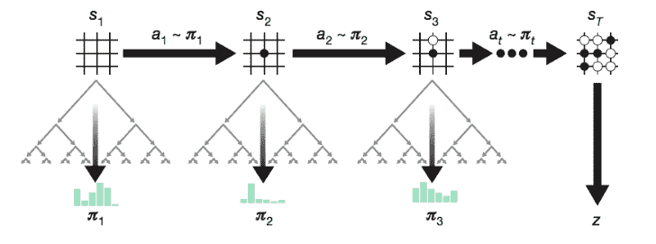

图 11\. AlphaGo Zero 通过自我对弈进行训练，而 MCTS 在每一步进一步改进输出策略。（图片来源：Silver 等人，2017 年的图 1a）。

该网络通过重放记忆中的样本进行训练，以最小化损失：

$$ \mathcal{L} = (z - v)² - \pi^\top \log p + c \| \theta \|² $$

其中 $c$ 是一个超参数，控制 L2 惩罚的强度，以避免过拟合。

AlphaGo Zero 通过删除监督学习并将分开的策略和价值网络合并为一个简化了 AlphaGo。结果表明，AlphaGo Zero 在更短的训练时间内取得了大幅提高的性能！我强烈建议一边阅读这两篇[论文](https://pdfs.semanticscholar.org/1740/eb993cc8ca81f1e46ddaadce1f917e8000b5.pdf)一边比较差异，非常有趣。

我知道这是一篇长文，但希望是值得的。*如果您注意到本文中的错误，请随时通过[lilian dot wengweng at gmail dot com]与我联系。* 下一篇文章见！ :)

* * *

引用为：

```py
@article{weng2018bandit,
  title   = "A (Long) Peek into Reinforcement Learning",
  author  = "Weng, Lilian",
  journal = "lilianweng.github.io",
  year    = "2018",
  url     = "https://lilianweng.github.io/posts/2018-02-19-rl-overview/"
} 
```

# 参考文献

[1] Yuxi Li. [深度强化学习：概述。](https://arxiv.org/pdf/1701.07274.pdf) arXiv 预印本 arXiv:1701.07274\. 2017。

[2] Richard S. Sutton 和 Andrew G. Barto 的 [强化学习：介绍；第二版](http://incompleteideas.net/book/bookdraft2017nov5.pdf)。2017 年。

[3] Volodymyr Mnih 等人的 [深度强化学习的异步方法。](http://proceedings.mlr.press/v48/mniha16.pdf) ICML。2016 年。

[4] Tim Salimans 等人的 [进化策略作为强化学习的可扩展替代方案。](https://arxiv.org/pdf/1703.03864.pdf) arXiv 预印本 arXiv:1703.03864 (2017)。

[5] David Silver 等人的 [无需人类知识掌握围棋游戏。](https://www.dropbox.com/s/yva172qos2u15hf/2017-silver.pdf?dl=0) Nature 550.7676 (2017): 354。

[6] David Silver 等人的 [通过深度神经网络和树搜索掌握围棋游戏。](https://pdfs.semanticscholar.org/1740/eb993cc8ca81f1e46ddaadce1f917e8000b5.pdf) Nature 529.7587 (2016): 484-489。

[7] Volodymyr Mnih 等人的 [通过深度强化学习实现人类水平控制。](https://www.cs.swarthmore.edu/~meeden/cs63/s15/nature15b.pdf) Nature 518.7540 (2015): 529。

[8] Ziyu Wang 等人的 [用于深度强化学习的对抗网络架构。](https://arxiv.org/pdf/1511.06581.pdf) ICML。2016 年。

[9] David Silver 在 YouTube 上的 [强化学习讲座](https://www.youtube.com/playlist?list=PL7-jPKtc4r78-wCZcQn5IqyuWhBZ8fOxT)。

[10] OpenAI 博客：[进化策略作为强化学习的可扩展替代方案](https://blog.openai.com/evolution-strategies/)

[11] Frank Sehnke 等人的 [探索参数策略梯度。](https://mediatum.ub.tum.de/doc/1287490/file.pdf) Neural Networks 23.4 (2010): 551-559。

[12] Csaba Szepesvári 的 [强化学习算法。](https://sites.ualberta.ca/~szepesva/papers/RLAlgsInMDPs.pdf) 第一版。合成人工智能和机器学习的讲座 4.1 (2010): 1-103。

* * *

*如果您注意到此帖子中的错误，请随时通过[lilian dot wengweng at gmail dot com]与我联系，我将非常乐意立即更正！*
