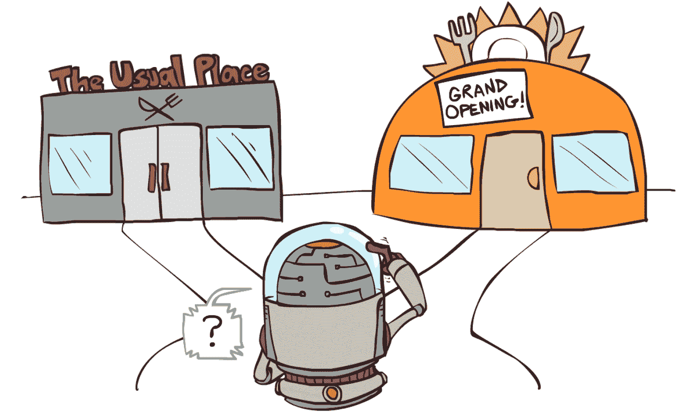
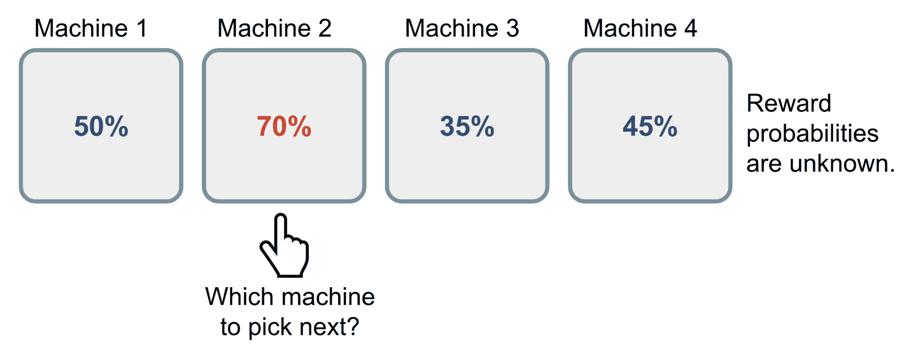
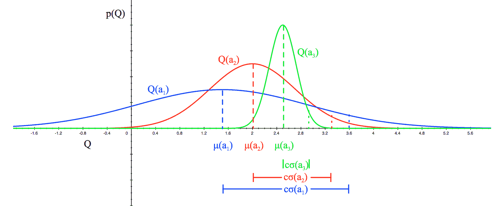
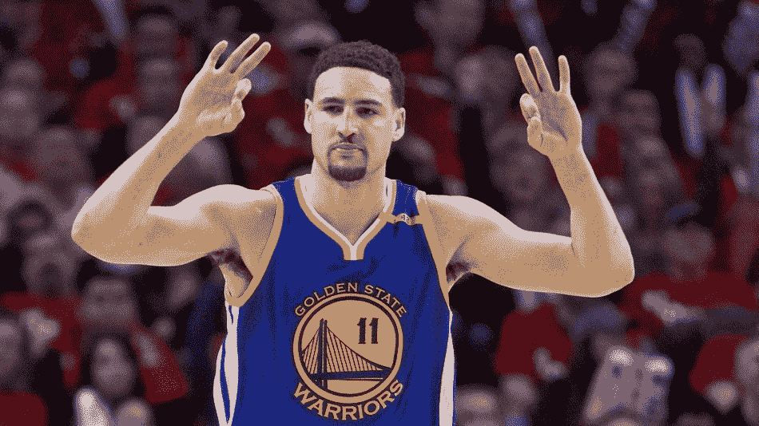
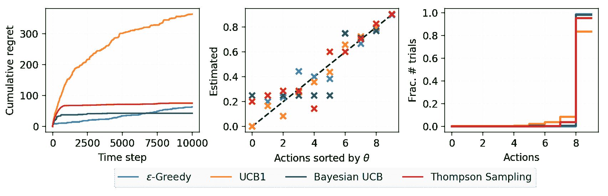
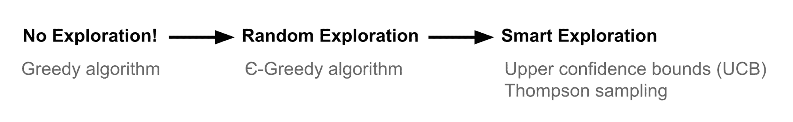

# **多臂赌博问题及其解决方案**

> 原文：[`lilianweng.github.io/posts/2018-01-23-multi-armed-bandit/`](https://lilianweng.github.io/posts/2018-01-23-multi-armed-bandit/)

该算法在[lilianweng/multi-armed-bandit](http://github.com/lilianweng/multi-armed-bandit)中实现。

# 开发与勘探

探索与开发困境存在于我们生活的许多方面。比如，你最喜欢的餐厅就在附近。如果你每天去那里，你会对你会得到什么很有信心，但会错过发现更好选择的机会。如果你一直尝试新的地方，很可能你会不时地吃到不好吃的食物。同样，在线广告商努力在已知最具吸引力的广告和可能更成功的新广告之间取得平衡。



图 1\. 探索与开发困境的现实生活例子：去哪里吃饭？（图片来源：加州大学伯克利分校人工智能课程[幻灯片](http://ai.berkeley.edu/lecture_slides.html)，[第 11 讲](http://ai.berkeley.edu/slides/Lecture%2011%20--%20Reinforcement%20Learning%20II/SP14%20CS188%20Lecture%2011%20--%20Reinforcement%20Learning%20II.pptx)。）

如果我们已经了解了环境的所有信息，甚至只需模拟蛮力，就能找到最佳策略，更不用说许多其他聪明的方法了。困境来自于*不完整*的信息：我们需要收集足够的信息以做出最佳的整体决策，同时控制风险。通过开发，我们利用我们所知道的最佳选项。通过勘探，我们冒一些风险来收集有关未知选项的信息。最佳的长期策略可能涉及短期的牺牲。例如，一个勘探试验可能完全失败，但它警告我们不要在将来经常采取那种行动。

# 什么是多臂赌博？

[多臂赌博](https://en.wikipedia.org/wiki/Multi-armed_bandit)问题是一个经典问题，很好地展示了勘探与开发之间的困境。想象一下，你在赌场面对多台老虎机，每台机器都配置有一个未知的概率，表示你在一次游戏中获得奖励的可能性有多大。问题是：*如何制定最佳策略以获得最高的长期回报？*

在本文中，我们将仅讨论具有无限次试验的设置。对有限次试验的限制引入了一种新类型的勘探问题。例如，如果试验次数小于老虎机的数量，我们甚至无法尝试每台机器以估计奖励概率(!)，因此我们必须在有限的知识和资源（即时间）集合方面表现聪明。



图 2\. 展示了伯努利多臂赌博的工作原理。玩家对奖励概率**未知**。

一个天真的方法可能是你继续与一个老虎机玩很多轮，以便最终根据[大数定律](https://en.wikipedia.org/wiki/Law_of_large_numbers)估计“真实”奖励概率。然而，这是相当浪费的，肯定不能保证最佳的长期奖励。

## 定义

现在让我们给它一个科学的定义。

一个伯努利多臂老虎机可以描述为 $\langle \mathcal{A}, \mathcal{R} \rangle$ 的元组，其中：

+   我们有 $K$ 台机器，具有奖励概率 $\{ \theta_1, \dots, \theta_K \}$。

+   在每个时间步骤 t，我们在一台老虎机上采取一个动作 a 并获得一个奖励 r。

+   $\mathcal{A}$ 是一组动作，每个动作对应与一个老虎机的交互。动作 a 的值是预期奖励，$Q(a) = \mathbb{E} [r \vert a] = \theta$。如果时间步骤 t 的动作 $a_t$ 在第 i 台机器上，那么 $Q(a_t) = \theta_i$。

+   $\mathcal{R}$ 是一个奖励函数。在伯努利老虎机的情况下，我们以*随机*的方式观察到奖励 r。在时间步骤 t，$r_t = \mathcal{R}(a_t)$ 可能以概率 $Q(a_t)$ 返回奖励 1，否则返回 0。

这是[马尔可夫决策过程](https://en.wikipedia.org/wiki/Markov_decision_process)的简化版本，因为没有状态 $\mathcal{S}$。

目标是最大化累积奖励 $\sum_{t=1}^T r_t$。如果我们知道具有最佳奖励的最佳动作，那么目标就是最小化通过不选择最佳动作而产生的潜在[后悔](https://en.wikipedia.org/wiki/Regret_(decision_theory))或损失。

最佳奖励概率 $\theta^{*}$ 的最佳动作 $a^{*}$ 是：

$$ \theta^{*}=Q(a^{*})=\max_{a \in \mathcal{A}} Q(a) = \max_{1 \leq i \leq K} \theta_i $$

我们的损失函数是到时间步骤 T 为止由于未选择最佳动作可能导致的总后悔：

$$ \mathcal{L}_T = \mathbb{E} \Big[ \sum_{t=1}^T \big( \theta^{*} - Q(a_t) \big) \Big] $$

## 老虎机策略

根据我们进行探索的方式，有几种解决多臂老虎机问题的方法。

+   无探索：最天真的方法和一个糟糕的方法。

+   随机探索

+   智能地探索，偏好于不确定性

# ε-Greedy 算法

ε-贪心算法大部分时间选择最佳动作，但偶尔进行随机探索。根据过去的经验，通过平均观察到目标动作 a 相关的奖励来估计动作值（直到当前时间步骤 t）：

$$ \hat{Q}_t(a) = \frac{1}{N_t(a)} \sum_{\tau=1}^t r_\tau \mathbb{1}[a_\tau = a] $$

其中 $\mathbb{1}$ 是一个二元指示函数，$N_t(a)$ 是到目前为止选择动作 a 的次数，$N_t(a) = \sum_{\tau=1}^t \mathbb{1}[a_\tau = a]$。

根据ε-贪婪算法，以小概率$\epsilon$我们会采取随机动作，但否则（大部分时间，概率为 1-$\epsilon$）我们选择到目前为止学到的最佳动作：$\hat{a}^{*}_t = \arg\max_{a \in \mathcal{A}} \hat{Q}_t(a)$。

查看我的玩具实现[这里](https://github.com/lilianweng/multi-armed-bandit/blob/master/solvers.py#L45)。

# 上限置信度

随机探索给了我们一个机会尝试我们不太了解的选项。然而，由于随机性，我们可能最终会探索到一个我们过去确认过的不好的动作（倒霉！）。为了避免这种低效的探索，一种方法是随着时间减少参数ε，另一种方法是对*高不确定性*的选项持乐观态度，因此更倾向于那些我们尚未对其价值进行自信估计的动作。换句话说，我们更倾向于探索具有最优值潜力的动作。

上限置信度（UCB）算法通过奖励值的上限置信度$\hat{U}_t(a)$来衡量这种潜力，以便真实值在高概率下低于边界$Q(a) \leq \hat{Q}_t(a) + \hat{U}_t(a)$。上限$\hat{U}_t(a)$是$N_t(a)$的函数；更多的试验次数$N_t(a)$应该给我们一个更小的边界$\hat{U}_t(a)$。

在 UCB 算法中，我们总是选择最贪婪的动作来最大化上限置信度：

$$ a^{UCB}_t = argmax_{a \in \mathcal{A}} \hat{Q}_t(a) + \hat{U}_t(a) $$

现在，问题是*如何估计上限置信度*。

## Hoeffding’s Inequality

如果我们不想对分布的外观做任何先验知识，我们可以从[“Hoeffding’s Inequality”](http://cs229.stanford.edu/extra-notes/hoeffding.pdf)获得帮助——这是适用于任何有界分布的定理。

让$X_1, \dots, X_t$为独立同分布的随机变量，它们都被区间[0, 1]所限制。样本均值为$\overline{X}_t = \frac{1}{t}\sum_{\tau=1}^t X_\tau$。那么对于 u > 0，我们有：

$$ \mathbb{P} [ \mathbb{E}[X] > \overline{X}_t + u] \leq e^{-2tu²} $$

给定一个目标动作 a，让我们考虑：

+   $r_t(a)$作为随机变量，

+   $Q(a)$作为真实均值，

+   $\hat{Q}_t(a)$作为样本均值，

+   以及$u$作为上限置信度，$u = U_t(a)$

然后我们有，

$$ \mathbb{P} [ Q(a) > \hat{Q}_t(a) + U_t(a)] \leq e^{-2t{U_t(a)}²} $$

我们想选择一个边界，以便在很大概率下真实均值低于样本均值+上限置信度。因此$e^{-2t U_t(a)²}$应该是一个小概率。假设我们对一个微小阈值 p 感到满意：

$$ e^{-2t U_t(a)²} = p \text{ 因此，} U_t(a) = \sqrt{\frac{-\log p}{2 N_t(a)}} $$

## UCB1

一个启发式方法是随着时间减少阈值 p，因为我们希望随着观察到更多奖励而做出更有信心的边界估计。设定$p=t^{-4}$我们得到**UCB1**算法：

$$ U_t(a) = \sqrt{\frac{2 \log t}{N_t(a)}} \text{ and } a^{UCB1}_t = \arg\max_{a \in \mathcal{A}} Q(a) + \sqrt{\frac{2 \log t}{N_t(a)}} $$

## 贝叶斯 UCB

在 UCB 或 UCB1 算法中，我们不假设奖励分布的任何先验，因此我们必须依赖 Hoeffding 不等式进行非常一般化的估计。如果我们能事先了解分布，我们将能够做出更好的边界估计。

例如，如果我们期望每台老虎机的平均奖励是如图 2 中的高斯分布，我们可以通过将 $\hat{U}_t(a)$ 设置为两倍标准差来设置上限为 95% 置信区间。



图 3\. 当期望奖励呈高斯分布时。$\sigma(a\_i)$ 是标准差，$c\sigma(a\_i)$ 是上限置信界。常数 $c$ 是可调超参数。（图片来源：[UCL 强化学习课程第 9 讲幻灯片](http://www0.cs.ucl.ac.uk/staff/d.silver/web/Teaching_files/XX.pdf)）

查看我对[UCB1](https://github.com/lilianweng/multi-armed-bandit/blob/master/solvers.py#L76)和[Bayesian UCB](https://github.com/lilianweng/multi-armed-bandit/blob/master/solvers.py#L99)的玩具实现，其中 θ 采用 Beta 先验。

# 汤普森采样

汤普森采样有一个简单的想法，但对解决多臂老虎机问题非常有效。



图 4\. 哎呀，我猜这不是那个汤普森吧？（感谢[Ben Taborsky](https://www.linkedin.com/in/benjamin-taborsky)；他有一个完整的定理，说明了汤普森在思考该把球传给谁时是如何发明的。是的，我偷了他的笑话。）

在每个时间步，我们希望根据 a 是**最优**的概率选择动作：

$$ \begin{aligned} \pi(a \; \vert \; h_t) &= \mathbb{P} [ Q(a) > Q(a'), \forall a' \neq a \; \vert \; h_t] \\ &= \mathbb{E}_{\mathcal{R} \vert h_t} [ \mathbb{1}(a = \arg\max_{a \in \mathcal{A}} Q(a)) ] \end{aligned} $$

其中 $\pi(a ; \vert ; h_t)$ 是在给定历史 $h_t$ 的情况下采取行动 a 的概率。

对于伯努利老虎机，自然地假设 $Q(a)$ 服从[Beta](https://en.wikipedia.org/wiki/Beta_distribution)分布，因为 $Q(a)$ 本质上是伯努利分布中的成功概率 θ。$\text{Beta}(\alpha, \beta)$ 的值在区间 [0, 1] 内；α 和 β 分别对应于我们**成功**或**失败**获得奖励时的计数。

首先，让我们根据某些先验知识或信念为每个动作初始化 Beta 参数 α 和 β。例如，

+   α = 1，β = 1；我们期望奖励概率为 50%，但我们并不是很有信心。

+   α = 1000，β = 9000；我们坚信奖励概率为 10%。

在每个时间点 t，我们从先验分布$\text{Beta}(\alpha_i, \beta_i)$中为每个动作采样预期奖励$\tilde{Q}(a)$。在样本中选择最佳动作：$a^{TS}_t = \arg\max_{a \in \mathcal{A}} \tilde{Q}(a)$。观察到真实奖励后，我们可以相应地更新 Beta 分布，这本质上是利用已知先验和获得的样本数据的似然进行贝叶斯推断来计算后验。

$$ \begin{aligned} \alpha_i & \leftarrow \alpha_i + r_t \mathbb{1}[a^{TS}_t = a_i] \\ \beta_i & \leftarrow \beta_i + (1-r_t) \mathbb{1}[a^{TS}_t = a_i] \end{aligned} $$

汤普森抽样实现了[概率匹配](https://en.wikipedia.org/wiki/Probability_matching)的概念。因为其奖励估计$\tilde{Q}$是从后验分布中采样的，每个这些概率等同于在观察历史条件下相应动作是最优的概率。 

然而，对于许多实际和复杂的问题，使用贝叶斯推断估计观察到的真实奖励的后验分布可能在计算上是棘手的。如果我们能够使用吉布斯采样、拉普拉斯近似和自助法等方法来近似后验分布，汤普森抽样仍然可以奏效。如果您想更多了解汤普森抽样，这个[tutorial](https://arxiv.org/pdf/1707.02038.pdf)提供了全面的评论；强烈推荐阅读。

# 案例研究

我在[lilianweng/multi-armed-bandit](https://github.com/lilianweng/multi-armed-bandit)中实现了上述算法。可以使用一组随机或预定义的奖励概率构建一个[BernoulliBandit](https://github.com/lilianweng/multi-armed-bandit/blob/master/bandits.py#L13)对象。这些老虎机算法被实现为[Solver](https://github.com/lilianweng/multi-armed-bandit/blob/master/solvers.py#L9)的子类，以 Bandit 对象作为目标问题。累积遗憾在时间上被跟踪。



图 4\. 对解决具有奖励概率{0.0, 0.1, 0.2, ..., 0.9}的 K = 10 个老虎机的小实验结果。每个解算器运行 10000 步。

（左）时间步长与累积遗憾的图。 （中）真实奖励概率与估计概率的图。 （右）在 10000 步运行中每个动作被选择的比例。

# 总结

我们需要探索，因为信息是宝贵的。在探索策略方面，我们可以完全不进行探索，专注于短期回报。或者我们偶尔随机探索。甚至更进一步，我们探索并且挑剔要探索哪些选项——因为具有更高不确定性的动作更受青睐，因为它们可以提供更高的信息增益。



* * *

引用为：

```py
@article{weng2018bandit,
  title   = "The Multi-Armed Bandit Problem and Its Solutions",
  author  = "Weng, Lilian",
  journal = "lilianweng.github.io",
  year    = "2018",
  url     = "https://lilianweng.github.io/posts/2018-01-23-multi-armed-bandit/"
} 
```

# 参考文献

[1] CS229 附加讲座笔记: [Hoeffding’s 不等式](http://cs229.stanford.edu/extra-notes/hoeffding.pdf).

[2] David Silver 的强化学习课程 - 第 9 讲: [探索与利用](https://youtu.be/sGuiWX07sKw)

[3] Olivier Chapelle 和 Lihong Li. [“Thompson Sampling 的实证评估.”](http://papers.nips.cc/paper/4321-an-empirical-evaluation-of-thompson-sampling.pdf) NIPS. 2011.

[4] Russo, Daniel, 等人. [“Thompson Sampling 教程.”](https://arxiv.org/pdf/1707.02038.pdf) arXiv:1707.02038 (2017).
